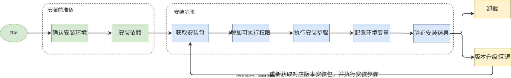
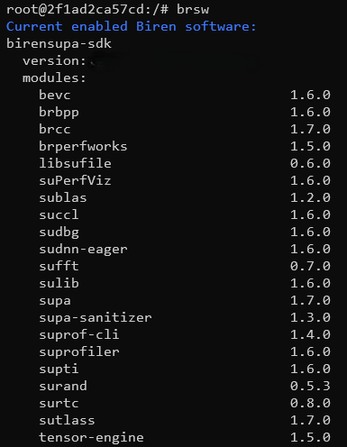

# BIRENSUPA SDK 安装指南

BIRENSUPA™ SDK 提供了高效的编程模型、GPU 管理工具和计算加速库，支持安装于多个主流操作系统，帮助开发者充分利用壁仞™通用 GPU 的计算能力，构建深度学习和通用计算应用。

本文为您介绍 BIRENSUPA SDK 的环境配置要求和安装步骤。

## 概述

### 组件简介

**编程模型与工具链**

BIRENSUPA 编程模型是 BIRENSUPA 软件栈的核心，主要组件如下：

| 序号 | 组件名称       | 描述                                                         | 相关文档                      |
| ---- | -------------- | ------------------------------------------------------------ | ----------------------------- |
| 1    | BIRENSUPA      | BIRENSUPA 软件栈的核心，提供 C++ 编程语言的扩展和运行时 API。 | 《BIRENSUPA 编程指南》        |
| 2    | tensor-engine  | 支持 AI 算子和子图的自动生成和自动优化。                     | --                            |
| 3    | sudbg          | 用于调试和诊断壁仞通用 GPU。                                 | 《gpu_debugger工具用户指南》  |
| 4    | supa-sanitizer | 用于发现和修复潜在的编程错误。                               | 《壁仞 suSanitizer 用户指南》 |
| 5    | BRCC           | 基于 Clang 和 LLVM 开发的编译器，提供了完整的 SUPA 编译工具链。 | 《壁仞 BRCC 用户指南》        |
| 6    | suRTC          | 用于在程序运行时编译 SUPA 代码的库。在应用程序运行期间动态生成、编译并链接 SUPA 内核。 | 《壁仞运行时 API 参考》       |
| 7    | suCST          | GPU 现场调试工具，专为处理 GPU 停止响应（hang）等异常情况，可以打印当前状态并追溯 SUPA 代码的调用栈，帮助开发者在开发过程中更高效地诊断和解决 GPU 相关的问题。 | 《壁仞 suCST 用户指南》       |
| 8    | sutlass        | BIRENSUPA C++ 模板抽象的集合，用于实现高性能矩阵乘法GEMM、卷积运算 Conv 和相关计算。 | --                            |

**GPU 管理与测试工具**

开发者工具可帮助您优化和调试应用，主要组件如下：

| 序号 | 组件名称     | 描述                                                         | 相关文档                           |
| ---- | ------------ | ------------------------------------------------------------ | ---------------------------------- |
| 1    | brVideo      | 基于 VAAPI 硬件加速功能及相关软件栈实现的壁仞通用 GPU 支持的视频编解码类型。 | 《壁仞 Video 用户指南》            |
| 2    | libsutx      | 主要用来帮助开发人员进行调试、分析，需配合 suPTI API 或命令行工具 suprof 使用。 | 《壁仞 suPTI & suTX 用户指南》     |
| 3    | suPTI        | 采集 BIRENSUPA 应用程序或壁仞通用 GPU 应用程序的后端数据。   | 《壁仞 suPTI & suTX 用户指南》     |
| 4    | suFile       | 提供 GPU 内存和存储之间进行直接内存访问（DMA）传输的能力。   | 《壁仞 suFile 用户指南》           |
| 5    | suProfiler   | 跨平台的 GPU 性能分析工具，用于应用程序的交互式内核分析。    | 《壁仞 suProfiler 用户指南》       |
| 6    | br_perfworks | GPU 性能指标评估工具。                                       | 《壁仞 Perfworks Metric API 参考》 |
| 7    | suCCL        | 面向多 GPU 集合通信原语的基础算子库，能够在不同的硬件拓扑上灵活完成数据交换、数据归约等操作。 | 《壁仞 suCCL 用户指南》            |
| 8    | suPerfviz    | 用于查看性能指标数据的可视化工具。                           | 《壁仞 DrPerfViz 用户指南》        |

**计算加速库**

提供高性能算法，显著加速深度学习等运算任务，主要组件如下：

| 序号 | 组件名称    | 描述                                                         | 相关文档                 |
| ---- | ----------- | ------------------------------------------------------------ | ------------------------ |
| 1    | suRAND      | 提供高性能伪随机数及拟随机数生成器。                         | 《壁仞 suRAND用户指南》  |
| 2    | suFFT       | 快速傅里叶变换计算库产品 。                                  | 《壁仞 suFFT 用户指南》  |
| 3    | BPP         | 用于实现加速处理的函数库。                                   | 《壁仞 BPP 用户指南》    |
| 4    | suDNN-sulib | 深度学习算子库，提供了深度学习领域核心应用的算子能力，以及通用的张量表示。 | 《壁仞 suDNN 用户指南》  |
| 5    | suDNN-eager | 深度神经网络的 GPU 加速原语库，为深度神经网络应用提供高度优化的实现。 | 《壁仞 suDNN 用户指南》  |
| 6    | suBLAS      | 基础线性代数算法的计算库，高效执行线性代数基础运算。         | 《壁仞 suBLAS 用户指南》 |

### 安装步骤概览

BIRENSUPA SDK 支持二进制方式安装，安装流程如下图所示：



## 安装环境要求

### 硬件要求

- 壁砺™106 系列通用 GPU。

### 经过测试的操作系统类型

| CPU架构 | 操作系统       | 内核版本                    |
|-------------------|-------------------------------- |-------------------------------- |
| x86_64 | Ubuntu 22.04.4 LTS | 5.15.0-97-generic |
| x86_64 | Ubuntu 20.04.1 LTS | 5.4.0-139-generic |
| x86_64 | openEuler 22.03 LTS | 5.10.0-60.18.0.50.oe2203.x86_64 |
| x86_64 | NewStart Carrier Grade Server Linux 6.06 | 5.10.134-13.1.zncgsl6.x86_64 |
| x86_64 | BigCloud Enterprise Linux For Euler 21.10 LTS | 4.19.90-2107.6.0.0100.oe1.bclinux.x86_64 |

<div style="page-break-after:always"></div>

## 安装运行时依赖

> [!NOTE]
>
> - 安装依赖前,请认服务器已连接网络。
>
> - 运行时依赖是指产品各模块正确运行所需的依赖，但不会影响产品的安装过程。
>
> - 若您在安装运行时依赖的过程中存在问题，可联系壁仞产品服务部门获取相关依赖包，然后进行安装。


- **Ubuntu 操作系统**，请执行如下命令：

    ```shell
    apt-get install -y python3-pip libboost-regex-dev libgoogle-glog-dev libsndio7.0 libxv1 libxfixes3
    ```

- **CGSL/openEuler/BC-Linux 操作系统**，请执行如下命令：

    ```shell
    yum install -y python3-pip boost-regex glog-devel
    ```

<div style="page-break-after:always"></div>

## 安装 BIRENSUPA SDK

### 二进制文件直接安装

1. 获取安装包。根据您的 Linux 版本，联系壁仞产品服务部门获取对应的安装包 `birensupa-sdk_<version>_<os>_linux-<arch>.run`。

   说明：

   - `<version>` 表示软件版本号。
   - `<os>`表示操作系统名称。
   - `<arch>` 表示 CPU 架构。

2. 执行如下命令，对安装文件增加可执行权限。

    ```shell
    chmod a+x birensupa-sdk_<version>_<os>_linux-<arch>.run
    ```

3. 执行如下命令安装软件包。安装命令支持 `--install-dir [path]` 等参数，具体使用说明请参见[参数说明](#参数说明)。如未指定安装路径，则安装到默认路径下：`/usr/local/birensupa/sdk`.

    ```shell
    sudo ./birensupa-sdk_<version>_<os>_linux-<arch>.run
    ```
    
    > [!NOTE]
    >
    > 请勿使用多个进程对同一个 `.run` 文件执行安装操作，这可能会导致安装失败。


4. 执行如下命令，配置环境变量。

    ```shell
    source /usr/local/birensupa/sdk/latest/scripts/brsw_set_env.sh
    ```

###  验证安装结果

安装完成后，可使用 `brsw` 命令查看系统中当前可用的组件与对应版本号。

下图为回显示例。



> [!TIP]
>
> 具体输出信息根据环境情况有所差异，请以实际回显为准。

## 版本升级与回退

使用 BIRENSUPA™ SDK 的过程中，您可以根据实际需求，升级或者回退版本。联系壁仞产品服务部门，获取目标版本对应的 .run 文件，然后重新执行[安装步骤](#安装-birensupa-sdk)。

> [!NOTE]
>
> 在版本升级与回退的过程中，如发生错误或者冲突，可能是由于当前已安装的版本较老。请先卸载，再进行安装。

## 卸载

```shell
sudo ./birensupa-sdk_<version>_<os>_linux-<arch>.run --uninstall
```

或者执行安装路径下的 `uninstall.sh`，如：

```shell
sudo /usr/local/birensupa/sdk/latest/scripts/uninstall.sh
```

如果系统中已安装 **deb/rpm 包形式**的历史版本，请用如下命令卸载 deb/rpm 包。更多详情请参考对应软件版本的文档。

- 对于使用 **deb 包**管理的系统（如 **Ubuntu**）

  ```shell
  sudo apt-get remove -y <legacy-package-name>
  ```

- 对于使用 **rpm 包**管理的系统（如 **openEuler**）

  ```
  sudo yum remove -y <legacy-package-name>
  ```

<div style="page-break-after:always"></div>

## 附录

### 参数说明

| 参数         | 说明      |
| --------    | --------  |
|  --help, -h | 查看帮助信息。 |
| -x, --extract-only [path] | 解压软件包中文件到指定目录。 |
| --check | 检查软件包的一致性和完整性。 |
| --pre-check | 检查系统是否满足安装的环境要求。 |
| --version | 显示软件包的版本信息。 |
| --info | 显示软件包的相关信息，包括版本信息与构建信息。 |
| --install-dir [path] | 指定安装路径。缺省时安装至默认路径 `/usr/local/birensupa`。 |
| --pysys | 设置 Python whls 安装到系统路径下，缺省时安装到本地。 |
| --uninstall | 卸载软件包。 |

<div style="page-break-after:always"></div>

## 法律声明

**著作权©** 

壁仞科技2020-2025，版权所有。未经壁仞科技事先书面许可，本文档内容不得以任何形式将其复制、修改、出版、传输或发布。

**商标。**

本文档所包含的任何壁仞科技的商号、商标、图形标志和域名，均为壁仞科技所有。未经壁仞科技事先书面许可，不得以任何形式将其复制、修改、出版、传输或发布。

**性能信息**。

本文档中所包含的性能指标包括设计规格、模拟测试指标以及特定环境下的测试和评估指标。设计规格为产品设计时拟定的指标，仅用于提供信息的目的而供您参考，实测指标将以具体的测试数据为准。模拟测试指标是通过在体系结构模拟器上运行模拟而获得，仅用于提供信息目的。该类测试的系统硬件、软件设计或配置的任何不同都可能影响实际性能。特定环境下的测试和评估指标系采用特定的计算机系统或组件操作而获得，可反映出我司产品的大致性能。系统硬件、软件设计或配置的任何不同都可能影响实际性能。

**前瞻性陈述。**

本文档的信息可能包含前瞻性陈述，可能存在风险和不确定性。请勿仅依赖于上述信息做出您的商业决定。

**注意。**

本产品后续可能进行版本升级，本文档内容会不定期更新。除非在合同中另有约定，本文档仅作产品使用指导，其中的信息和建议不构成任何明示或暗示的担保。
