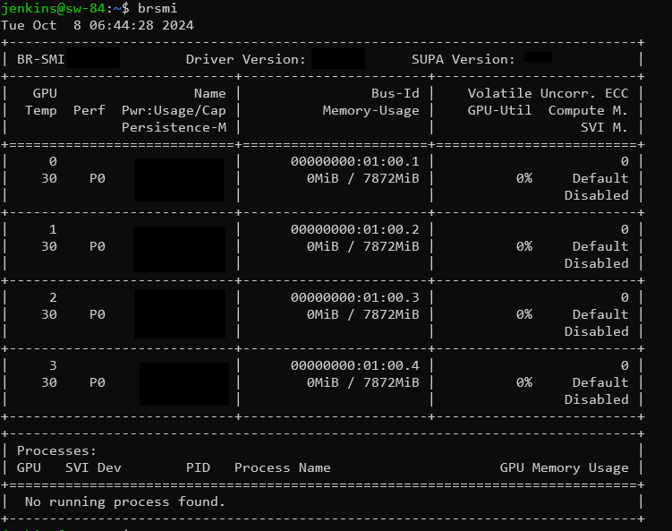
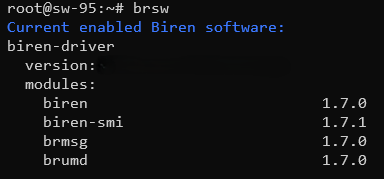

# BIRENSUPA Driver 安装指南

## 产品简介

本文主要介绍如何安装、升级、卸载BIRENSUPA™ Driver，以及一些常用的操作。BIRENSUPA™ Driver 中打包了壁仞™ 的多个软件模块，包括：

| 模块名称 | 描述                                                         | 相关文档                |
| -------- | ------------------------------------------------------------ | ----------------------- |
| KMD      | 壁仞内核层驱动。                                             | --                      |
| UMD      | 壁仞用户层驱动。                                             | --                      |
| BEV      | 壁仞虚拟化驱动。                                             | --                      |
| brsmi    | 用于获取壁仞通用GPU各种级别信息，查看其使用情况等。          | 《壁仞 BRsmi 用户指南》 |
| brmsg    | 用于解析壁仞内核日志中各种异常错误，并给出解析结果。         | 《壁仞 brmsg 用户指南》 |
| biren_fs | 用于在 BIREN 图形卡上分配的用户 GPU 内存与具有DMA/RDMA 能力的存储之间直接协调 IO。 | --                      |

## 经过测试的操作系统类型

下表列出了经过测试的操作系统及内核版本：

| **操作系统**       | **内核版本**                    |
|-------------------|-------------------------------- |
| Ubuntu 22.04.4 LTS | 5.15.0-97-generic |
| Ubuntu 20.04.1 LTS | 5.4.0-139-generic |
| openEuler 22.03 LTS | 5.10.0-60.18.0.50.oe2203.x86_64 |
| NewStart Carrier Grade Server Linux 6.06 | 5.10.134-13.1.zncgsl6.x86_64 |
| BigCloud Enterprise Linux For Euler 21.10 LTS | 4.19.90-2107.6.0.0100.oe1.bclinux.x86_64 |

<div style="page-break-after:always"></div>

## 安装

### 安装驱动源码编译所需依赖
**注意：仅安装非 Kernel 模块，无需安装以下依赖。**

**Ubuntu 操作系统**

需要安装 dkms、linux-headers 软件包。执行以下命令，查看相关软件包版本信息。

```shell
dpkg --list | grep dkms
dpkg --list | grep gcc
dpkg --list | grep linux-headers-$(uname -r)
```

如未返回版本信息，表示未安装依赖，请执行如下命令，进行安装。

```shell
apt-get install -y dkms gcc linux-headers-$(uname -r)
```

**CGSL/openEuler/BC-Linux 操作系统**

需要安装 dkms、kernel-devel 软件包。

```shell
rpm -qa | grep dkms
rpm -qa | grep gcc
rpm -qa | grep kernel-devel
```

若回显相关软件包版本信息，表示已安装；若未安装请执行以下命令进行安装：

```shell
yum install --enablerepo=extras epel-release
yum install -y dkms gcc kernel-devel-$(uname -r)
```

**注意：gcc 版本建议 12.3 以下且与内核 build 版本匹配。**

若您在安装过程中存在问题，可联系壁仞产品服务部门获取 dkms 对应的 rpm 包（主要针对使用 rpm 包的 OS 如 CentOS/BC-Linux/openEuler/Kylin 等），执行如下命令进行安装。

```shell
rpm -ivh {package_name}.rpm
```

<div style="page-break-after:always"></div>

### 安装步骤

**步骤1** 获取软件包。

根据您的 Linux 版本，联系壁仞产品服务部门获取对应的 .run 文件安装包 `biren-driver_<version>_linux-<arch>.run`。

**步骤2** 执行如下命令，对安装文件增加可执行权限。

```shell
chmod a+x biren-driver_<version>_linux-<arch>.run
```

**步骤3** 按需执行安装命令。

**注意：1.容器内默认不支持安装内核模块，包括 kmd、bev、biren_fs。2.不支持多个进程同时安装同一个 .run 文件。请确保仅有一个进程在对该安装文件执行安装。如果多进程同时进行安装同一个 .run 文件，可能会导致安装失败。3.建议安装前先卸载已有版本，避免未知冲突，参考[卸载](#卸载)**。

【选择一】 安装 KMD，执行如下命令，会同步安装 brsmi、brmsg 和 UMD：

```shell
sudo ./biren-driver_<version>_linux-<arch>.run
```

【选择二】仅安装 BEV, 执行如下命令。

```shell
sudo ./biren-driver_<version>_linux-<arch>.run --bev-only
```

内核模块 BEV 与 KMD 不能同时安装，若已安装 KMD, 需先运行 `sudo ./biren-driver_<version>_linux-<arch>.run --uninstall` 进行卸载。

**注意：使用虚拟化模块需要先启用 IOMMU，具体方法请参考《壁仞™虚拟化SRIOV设备直通用户指南》。**

【选择三】 仅安装 biren_fs, 执行如下命令。

```shell
sudo ./biren-driver_<version>_linux-<arch>.run --brfs-only
```

【选择四】 仅安装非 kernel 模块（目前包括 brsmi、brmsg 和 UMD）, 执行如下命令。

```shell
sudo ./biren-driver_<version>_linux-<arch>.run --no-kernel-modules
```

**步骤4** 查看 Driver 版本信息。

Driver 安装成功后，可以通过 brsmi 命令查看 Driver 的版本信息，下图为 brsmi 输出的示例（具体输出以实际版本为准）。



**步骤5** 查看壁仞软件包版本信息。

Driver 安装成功后，可使用 `brsw` 命令查看系统中当前可用的壁仞™模块。下图为输出的信息示例（具体输出根据环境情况有所差异，请以实际情况为准）。



<div style="page-break-after:always"></div>

## 卸载

对应不同的安装方式或者卸载需求，可以选择执行相应的卸载命令。

【选择一】 卸载已安装的所有壁仞™ Driver 模块，执行如下命令：

```shell
sudo ./biren-driver_<version>_linux-<arch>.run --uninstall
```

或者

```shell
sudo /usr/local/birensupa/driver/scripts/uninstall.sh
```

【选择二】 仅卸载 BEV, 执行如下命令。

```shell
sudo ./biren-driver_<version>_linux-<arch>.run --uninstall --bev-only
```

或者

```shell
sudo /usr/local/birensupa/driver/scripts/uninstall.sh --bev-only
```

【选择三】 仅卸载 biren_fs, 执行如下命令。

```shell
sudo ./biren-driver_<version>_linux-<arch>.run --uninstall --brfs-only
```

或者

```shell
sudo /usr/local/birensupa/driver/scripts/uninstall.sh --brfs-only
```

【选择四】 仅卸载非 kernel 模块, 执行如下命令。

```shell
sudo ./biren-driver_<version>_linux-<arch>.run --uninstall --no-kernel-modules
```

或者

```shell
sudo /usr/local/birensupa/driver/scripts/uninstall.sh --no-kernel-modules
```

**注意：对于以 deb/rpm 包形式安装的历史版本，当前卸载方式并不适用。可尝试使用如下命令卸载 deb/rpm 包，具体内容请参考对应版本的卸载文档。**

```shell
# 对于使用 deb 包管理的系统（如 Ubuntu）
sudo apt-get remove -y <legacy-package-name>

# 对于使用 rpm 包管理的系统（如 openEuler）
sudo yum remove -y <legacy-package-name>
```

## 版本升级和回退

使用壁仞™ Driver 安装包的过程中，您可以根据实际需求，升级或者回退版本。联系壁仞产品服务部门，获取目标版本对应的 .run 文件，然后重新执行安装步骤。安装步骤请参见[安装](##安装)。

## KMD 相关操作

- 查看 KMD(biren) Linux 内核模块加载情况，执行如下命令：

```shell
lsmod | grep biren
```

- 加载 biren module，执行如下命令：

```shell
sudo modprobe biren
```

- 卸载 biren module，执行如下命令：

```shell
sudo rmmod biren
```

<div style="page-break-after:always"></div>

## 附录

### 参数说明

| 参数         | 说明      |
| --------    | --------  |
|  --help, -h | 查看帮助信息。 |
| -x, --extract-only [path] | 解压软件包中文件到指定目录。 |
| --check | 检查软件包的一致性和完整性。 |
| --pre-check | 检查系统是否满足安装的环境要求。 |
| --version | 显示软件包的版本信息。 |
| --info | 显示软件包的相关信息。 |
| --uninstall | 卸载软件包相关的模块，具体参数见下列选项。 |
| --bev-only,--brfs-only,--no-kernel-modules | 设置安装或卸载的模式，如 --bev-only 表示只安装或者卸载 bev。若未设置该参数，默认安装卸载软件包包含的所有模块。 |

<div style="page-break-after:always"></div>

## 法律声明

**著作权©** 

壁仞科技2020-2025，版权所有。未经壁仞科技事先书面许可，本文档内容不得以任何形式将其复制、修改、出版、传输或发布。

**商标。**

本文档所包含的任何壁仞科技的商号、商标、图形标志和域名，均为壁仞科技所有。未经壁仞科技事先书面许可，不得以任何形式将其复制、修改、出版、传输或发布。

**性能信息**。

本文档中所包含的性能指标包括设计规格、模拟测试指标以及特定环境下的测试和评估指标。设计规格为产品设计时拟定的指标，仅用于提供信息的目的而供您参考，实测指标将以具体的测试数据为准。模拟测试指标是通过在体系结构模拟器上运行模拟而获得，仅用于提供信息目的。该类测试的系统硬件、软件设计或配置的任何不同都可能影响实际性能。特定环境下的测试和评估指标系采用特定的计算机系统或组件操作而获得，可反映出我司产品的大致性能。系统硬件、软件设计或配置的任何不同都可能影响实际性能。

**前瞻性陈述。**

本文档的信息可能包含前瞻性陈述，可能存在风险和不确定性。请勿仅依赖于上述信息做出您的商业决定。

**注意。**

本产品后续可能进行版本升级，本文档内容会不定期更新。除非在合同中另有约定，本文档仅作产品使用指导，其中的信息和建议不构成任何明示或暗示的担保。
