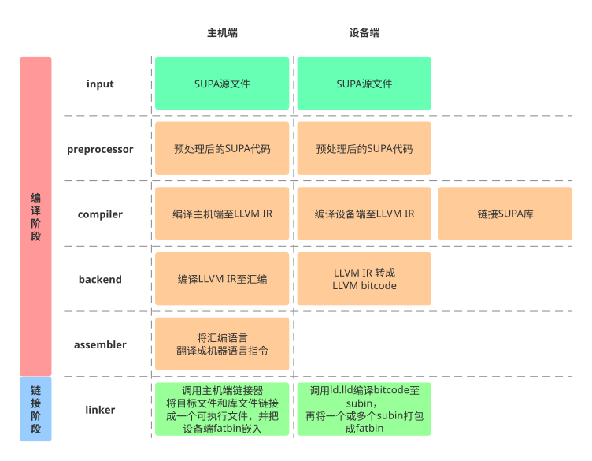

# 壁仞™ BRCC 用户指南

## 概述

### BIRENSUPA™ 编程模型

BIRENSUPA™（以下简称SUPA） 编程模型是针对壁仞自研芯片的特性定义的一套异构计算通用模型，根据壁仞™自研 GPU 芯片的特性进行定义，支持主机端和设备端多个计算平台之间的异构计算。应用程序的控制部分在主机端执行，需要硬件加速的部分可以加载到壁仞 GPU 设备端执行。多个主机端可以互联，单个主机端可以连接多个壁仞 GPU 设备。在 GPU 执行的任务采用 SIMT (Single Instruction, Multiple Threads) 形式执行。

用户程序由主机端和设备端代码构成:

- 主机端代码基于 C++ 实现，可以调用 SUPA 运行时 API 进行 GPU 的管理，包括内存分配、数据传输和核函数调用。主机端代码通常通过调用核函数来分配计算到 GPU。
- 设备端代码基于 C++ 和 SUPA 扩展实现，经由 BRCC 编译为可执行文件，其入口函数通常称为核函数 (Kernel Function)。

关于 SUPA 编程模型的更多信息，请参见《BIRENSUPA™ 编程指南》。

### SUPA 源文件

SUPA 应用程序的源文件包括 C++ 主机端代码和 GPU 设备端函数。在编译过程中，BRCC 会先将设备端代码与主机端代码进行分离。然后，编译设备端代码以生成 fatbinary 文件，编译主机端代码以生成目标文件，再通过主机链接器进行链接，将编译后的 fatbinary 文件嵌入到主机端输出文件中，并链接运行时库。

### 为什么使用 BRCC

BRCC（Biren Compiler Collection）是基于 Clang 和 LLVM 开发的编译器，提供了完整的 SUPA 编译工具链。BRCC 支持一系列常规编译器选项，例如，定义宏、指定库路径等，同时也支持将编译器选项传递给 Clang 来配置主机端和设备端编译流程。通过这些选项，开发人员可以灵活地调整编译过程以满足特定的需求。

本文以 `x86-64` 主机端和壁仞通用 GPU 设备端为例，为您介绍如何使用 BRCC 编译和运行 SUPA 应用程序。

<div style="page-break-after:always"></div>

## 安装 BRCC

### 安装部署

BIRENSUPA SDK中已包含 BRCC，安装了 BIRENSUPA SDK 后，即可使用 BRCC ，安装路径：/usr/local/birensupa/sdk/latest/brcc

BIRENSUPA SDK的安装步骤请参见《BIRENSUPA SDK 安装指南》。

### 验证安装

安装完成后，执行 `brcc --version`，出现类似如下回显信息，表示安装成功。

```bash
$ brcc --version

brcc version 1.6.0
Target: x86_64-unknown-linux-gnu
Thread model: posix
InstalledDir: /usr/local/birensupa/sdk/latest/brcc/bin
```

## SUPA 编译流程



<div style="page-break-after:always"></div>

## BRCC 编译阶段

### 预定义的宏

| 宏                        | 描述                         |
| ------------------------- | ---------------------------- |
| `__BRCC__`                | 编译任意源文件时定义。       |
| `__SUPA__`                | 编译 SUPA 源文件时定义。     |
| `__SUPACC__`              | 编译 SUPA 源文件时定义。     |
| `__SUPA_ARCH__`           | 编译 SUPA 设备端代码时定义。 |
| `__BRCC_VERSION__`        | BRCC 版本号。                |
| `__BRCC_VER_MAJOR__`      | BRCC 主版本号。              |
| `__BRCC_VER_MINOR__`      | BRCC 次版本号。              |
| `__BRCC_VER_PATCHLEVEL__` | BRCC 补丁版本号。            |

### 支持的文件后缀名

| 文件后缀              | 描述                                      |
| --------------------- | ----------------------------------------- |
| `.c`                  | C 语言源文件。                            |
| `.cc`, `.cxx`, `.cpp` | C++ 语言源文件。                          |
| `.su`                 | SUPA 语言源文件，包含主机端和设备端代码。 |
| `.o`, `.obj`          | 目标文件。                                |
| `.a`, `.lib`          | 静态库文件。                              |
| `.so`                 | 动态库文件。                              |
| `.bc`                 | LLVM bitcode 中间文件。                   |

### 支持的编译阶段

默认情况下，BRCC 会对后缀名为 `.su` 源文件进行完整编译流程，生成可执行文件。您可以通过如下选项配置编译阶段：

| 选项              | 阶段                                    | 默认输出文件名（主机端/设备端）             |
| ----------------- | --------------------------------------- | ------------------------------------------- |
| `-E`              | 只运行预处理阶段。                      | 输出至屏幕 <标准输出结果>                   |
| `-c`              | 只运行预处理，编译，和汇编阶段。        | src.o                                       |
| `-emit-llvm` `-S` | 只运行预处理，和编译阶段，输出LLVM IR。 | src.ll / src-supa-biren-biren-supa-br100.ll |

### C++ 头文件和库的来源路径

编译 SUPA 语言源文件依赖 C++ 头文件和库。BRCC 将从系统默认路径中查找已安装的多个不同版本 gcc 路径作为候选，然后选择包含 crtbegin.o 和 libstdc++.a 的最高版本路径来使用。

示例1，已安装 gcc-9，g++-9（包含 libstdc++-9-dev），gcc-10，未安装 g++-10。

```bash
$ brcc -v

Found candidate GCC installation: /usr/lib/gcc/x86_64-linux-gnu/10
Found candidate GCC installation: /usr/lib/gcc/x86_64-linux-gnu/9
Selected GCC installation: /usr/lib/gcc/x86_64-linux-gnu/9
```

示例2，已安装 gcc-9，g++-9，gcc-10，g++-10。

```bash
$ brcc -v

Found candidate GCC installation: /usr/lib/gcc/x86_64-linux-gnu/10
Found candidate GCC installation: /usr/lib/gcc/x86_64-linux-gnu/9
Selected GCC installation: /usr/lib/gcc/x86_64-linux-gnu/10
```

示例3，已安装 gcc-9，g++-9，gcc-10，g++-10，使用选项指定 gcc 路径。

```bash
$ brcc -v --gcc-install-dir=/usr/lib/gcc/x86_64-linux-gnu/9

Selected GCC installation: /usr/lib/gcc/x86_64-linux-gnu/9
```

<div style="page-break-after:always"></div>

## BRCC 编译选项

使用 BRCC 编译器时，您可以通过配置编译器选项，指定编译器行为，满足编程的需要。

在编译过程中，如需查看关于编译选项的帮助信息，输入 `brcc --help` 。

### 指定文件和路径

| 选项                   | 描述                                     |
| ---------------------- | ---------------------------------------- |
| `-o <file>`            | 输出文件的名称和存储位置。               |
| `-D <macro>=<value>`   | 定义预处理阶段要使用的宏。               |
| `-U <macro>`           | 在预处理或编译阶段，取消定义现有宏。     |
| `-I <dir>`             | 添加头文件搜索路径。                     |
| `-include <file>`      | 添加在预处理过程中必须预先包含的头文件。 |
| `-isystem <directory>` | 添加系统头文件搜索路径。                 |
| `-L <dir>`             | 添加库搜索路径。                         |
| `-l`                   | 添加链接阶段使用的库，不带库文件扩展名。 |
| `-save-temps`          | 在当前目录保存中间编译结果。             |

### 指定编译器/链接器行为

| 选项           | 描述                                                         |
| -------------- | ------------------------------------------------------------ |
| `-std=<value>` | 选择 c++ 版本，支持 c++14, c++17, c++20，默认值 -std=c++14。 |
| `-x supa`      | 在编译阶段使用，对选项后的输入文件指定编译语言 SUPA。        |
| `--supa-link`  | 在链接阶段使用，对 SUPA Object 进行链接。                    |

### 传递给指定阶段

| 选项             | 描述                             |
| ---------------- | -------------------------------- |
| `-Xclang <arg>`  | 传递选项给 brcc 前端。           |
| `-Xlinker <arg>` | 传递选项给主机端和设备端链接器。 |
| `-Wl,<arg>`      | 传递选项给主机端链接器。         |

### 引导编译器驱动

| 选项                      | 描述                         |
| ------------------------- | ---------------------------- |
| `--supa-gpu-arch=<value>` | 指定 GPU 架构。              |
| `--supa-host-only`        | 只编译主机端代码。           |
| `--supa-device-only`      | 只编译设备端代码。           |
| `--verbose (-v)`          | 显示运行命令，使用详细输出。 |

### 调试和优化级别

| 选项                   | 描述                             |
| ---------------------- | -------------------------------- |
| `-g`                   | 生成主机端代码调试信息。         |
| `-O<value>`            | 指定主机端代码优化级别。         |
| `-gsupa (-G)`          | 生成设备端代码调试信息。         |
| `-fsupa-device-opt`    | 打开设备端代码优化。             |

设备端代码优化默认开启，仅在生成设备端代码调试信息时默认关闭。

#### 主机端调试示例

```bash
# 关闭主机端代码优化，生成主机端代码调试信息
brcc -g -O0 src.su -o a.out
```

```bash
# 编译阶段关闭主机端代码优化，生成主机端代码调试信息
brcc -g -O0 src.su -c -o src.o
# 链接阶段不需要输入主机端 调试和优化级别 选项
brcc --supa-link src.o -o a.out
```

#### 设备端调试示例

```bash
# 关闭设备端代码优化，生成设备端代码调试信息
brcc -G src.su -o a.out
```

```bash
# 编译阶段关闭设备端代码优化，生成设备端代码调试信息
brcc -G src.su -c -o src.o
# 链接阶段需要输入和编译阶段相同的设备端 调试和优化级别 选项
brcc --supa-link -G src.o -o a.out
```

#### 打开设备端代码优化并生成调试信息示例

```bash
# 打开设备端代码优化，生成设备端代码调试信息
brcc -G -fsupa-device-opt src.su -o a.out
```

```bash
brcc -G -fsupa-device-opt src.su -c -o src.o
# 链接时需要输入和编译阶段相同的设备端 调试和优化级别 选项
brcc --supa-link -G -fsupa-device-opt src.o -o a.out
```

#### 主机端和设备端同时调试示例

```bash
# 关闭主机端和设备端代码优化，生成主机端和设备端代码调试信息
brcc -g -O0 -G src.su -o a.out
```

```bash
brcc -g -O0 -G src.su -c -o src.o
brcc --supa-link -G src.o -o a.out
```

### 设备端优化

| 选项                           | 描述                                                                                                 |
| ------------------------------ | ---------------------------------------------------------------------------------------------------- |
| `-maxregcount`                 | 在链接阶段使用，用于指定 GPU 函数可使用的最大寄存器数量，最小单位为每组4个寄存器。                   |
| `-print-reg-count`             | 在链接阶段使用，查看 GPU 函数的寄存器使用数量，最小单位为每组4个寄存器。                         |
| `-print-coroutine-reg-count`   | 在链接阶段使用，查看 GPU Coroutine 函数的寄存器使用数量。                                        |
| `-sync-channel-window=<value>` | 在链接阶段使用，设置同步通道窗口的宽度，默认值15，该宽度决定了可以共享同一同步通道的指令的最大长度。 |
| `-ping-pong-sync`              | 在链接阶段使用，启用乒乓形式同步通道分配。                                                           |

### 通用工具选项

| 选项          | 描述                 |
| ------------- | -------------------- |
| `--help (-h)` | 查看帮助信息。       |
| `--version`   | 查看版本信息。       |
| `-W<warning>` | 打开指定的警告消息。 |
| `-w`          | 禁止所有警告消息。   |

## 设备端代码链接缓存

通过使用缓存来进行快速的增量构建，当缓存命中时，链接过程会明显加速。缓存文件的有效周期设置为一周，即，如果缓存文件一周内未被命中，编译器在访问缓存时会将其从缓存中删除。

若未设置缓存目录，则默认使用 `$HOME/.cache/brcc`。

缓存可占用磁盘空间基础限制为 缓存大小 / (缓存大小 + 剩余可用磁盘空间) <= 75%，可以通过设置 BRCC_THINLTO_CACHE_SIZE 进行自定义限制（两条限制同时生效）。

```bash
# 开启或关闭链接缓存，默认关闭。
export BRCC_THINLTO_CACHE={ON or OFF}

# 设置缓存目录，值必须是绝对路径。
export BRCC_THINLTO_CACHE_DIR={Absolute Path}

# 限制缓存可占用的磁盘空间。X为数字。
export BRCC_THINLTO_CACHE_SIZE={XG or XM or XK}
```

<div style="page-break-after:always"></div>

## BRCC 编译示例

### 示例代码

```cpp
//---------- a.h ----------
__device__ void funcAdd(int i, float *x, float *y);
```

```cpp
//---------- a.su ----------
__device__ void funcAdd(int i, float *x, float *y) {
    y[i] = x[i] + y[i];
}
```

```cpp
//---------- b.h ----------
int foo();
```

```cpp
//---------- b.su ----------
#include "a.h"

// Kernel function to add the elements of two arrays
__global__ void vectorAdd(int n, float *x, float *y) {
    int index = block_idx.x * block_dim.x + thread_idx.x;
    int stride = block_dim.x * grid_dim.x;
    for (int i = index; i < n; i += stride)
        funcAdd(i, x, y);
}

int foo() {
    int N = 1 << 20; // 1M elements

    // initialize x and y arrays on the host
    float *h_x = (float *)malloc(N * sizeof(float));
    float *h_y = (float *)malloc(N * sizeof(float));
    for (int i = 0; i < N; i++) {
        h_x[i] = 1.0f;
        h_y[i] = 1.5f;
    }

    // Initialize and malloc device memory
    float *d_x, *d_y;
    suMallocDevice((void **)&d_x, N * sizeof(float));
    suMallocDevice((void **)&d_y, N * sizeof(float));
    suMemcpy(d_x, h_x, N * sizeof(float));
    suMemcpy(d_y, h_y, N * sizeof(float));

    // Launch kernel
    int blockSize = 256;
    int numBlocks = (N + blockSize - 1) / blockSize;
    printf("Kernel start ....\n");
    suLaunchKernel(vectorAdd, numBlocks, blockSize, 0, NULL, N, d_x, d_y);
    suDeviceSynchronize();
    printf("Kernel finished!\n");

    // Load result
    suMemcpy(h_y, d_y, N * sizeof(float));

    // Error Check (all values should be 2.5f)
    printf("Check results ....\n");
    float maxError = 0.0f;
    for (int i = 0; i < N; i++)
        maxError = fmax(maxError, fabs(h_y[i] - 2.5f));
    printf("Max error: %.8f\n", maxError);
    bool correct = maxError < 0.001f;

    printf("%s\n", correct ? "Result = PASS" : "Result = FAIL");

    // Free memory
    suFree(d_x);
    suFree(d_y);
    free(h_x);
    free(h_y);
    return correct ? EXIT_SUCCESS : EXIT_FAILURE;
}
```

```cpp
//---------- c.cpp ----------
#include "b.h"

int main(){
    return foo();
}
```

### 如何编译,链接,运行

#### 以 SUPA 语言编译所有文件至可执行文件

```bash
brcc a.su b.su -x supa c.cpp -o vectorAdd
```

#### 分步编译和链接

编译 `a.su` 和 `b.su` 至 SUPA Object `a.o` `b.o`。

```bash
brcc a.su b.su -c
```

编译 `c.cpp` 至 SUPA Object `c.o`，
使用 `-x supa` 将后续输入文件视为 SUPA 源文件，而不是根据后缀名判断（.cpp 为 C++ 源文件）。

```bash
brcc -x supa c.cpp -c -o c.o
```

编译 `c.cpp` 至 C++ Object `c.o`，
示例代码 c.cpp 不包含 SUPA 代码，可以使用 brcc 或 g++ 进行编译。

```bash
brcc c.cpp -c -o c.o
```

使用 `--supa-link` 对 `SUPA Object` 和 `C++ Object` 进行链接，输出可执行文件。
<table><tr><td bgcolor=#dceeff>注意：您需要至少输入一个包含设备端代码的 SUPA Object。</td></tr></table>

```bash
brcc --supa-link a.o b.o c.o -o vectorAdd
```

运行可执行文件。

```bash
./vectorAdd
```

### 如何编译静态库和动态库，并链接生成可执行文件

#### 编译静态库并链接

<table><tr><td bgcolor=#dceeff>注意：设备端链接器只支持静态库。</td></tr></table>

```bash
# compile a.su to a static lib
brcc a.su -c -o a.o
ar rcs libstatic_a.a a.o

# compile b.su c.cpp and link lib
brcc b.su -x supa c.cpp -L . -lstatic_a -o vectorAdd

# another way to complie b.su c.cpp and link lib
brcc b.su -c -o b.o
brcc c.cpp -c -o c.o
brcc --supa-link b.o c.o -L . -lstatic_a -o vectorAdd
```

#### 编译动态库并链接

核函数和 suLaunchKernel 可以编译成一个动态库，由主机端程序调用接口函数 (foo)。

```bash
# compile to a shared lib
brcc -fPIC a.su b.su -c
brcc --supa-link -shared a.o b.o -o libshared_ab.so

# compile c++ codes and link supa shared lib
brcc c.cpp -L . -lshared_ab -o vectorAdd -Wl,-rpath .

# can also use g++
g++ c.cpp -L . -lshared_ab -o vectorAdd -Wl,-rpath .
```

### 只编译主机端/设备端

```bash
# compile supa host object file only
brcc vectorAdd.su -c --supa-host-only -o vectorAdd-host.o

# compile supa device llvm bitcode file only
brcc vectorAdd.su -c --supa-device-only -o vectorAdd-device.bc
```

<div style="page-break-after:always"></div>

## 法律声明

**著作权©**

壁仞科技2020-2025，版权所有。未经壁仞科技事先书面许可，不得以任何形式对本文档内容进行复制、修改、出版、传输或发布。

**商标。**

本文档所包含的任何壁仞科技的商号、商标、图形标志和域名，均为壁仞科技所有。未经壁仞科技事先书面许可，不得以任何形式将其复制、修改、出版、传输或发布。

**性能信息**。

本文档中所包含的性能指标包括设计规格、模拟测试指标以及特定环境下的测试和评估指标。设计规格为产品设计时拟定的指标，仅用于提供信息的目的而供您参考，实测指标将以具体的测试数据为准。模拟测试指标是通过在体系结构模拟器上运行模拟而获得，仅用于提供信息目的。该类测试的系统硬件、软件设计或配置的任何不同都可能影响实际性能。特定环境下的测试和评估指标系采用特定的计算机系统或组件操作而获得，可反映出我司产品的大致性能。系统硬件、软件设计或配置的任何不同都可能影响实际性能。

**前瞻性陈述。**

本文档的信息可能包含前瞻性陈述，可能存在风险和不确定性。请勿仅依赖于上述信息做出您的商业决定。

**注意。**

本产品后续可能进行版本升级，本文档内容会不定期更新。除非在合同中另有约定，本文档仅作产品使用指导，其中的信息和建议不构成任何明示或暗示的担保。
