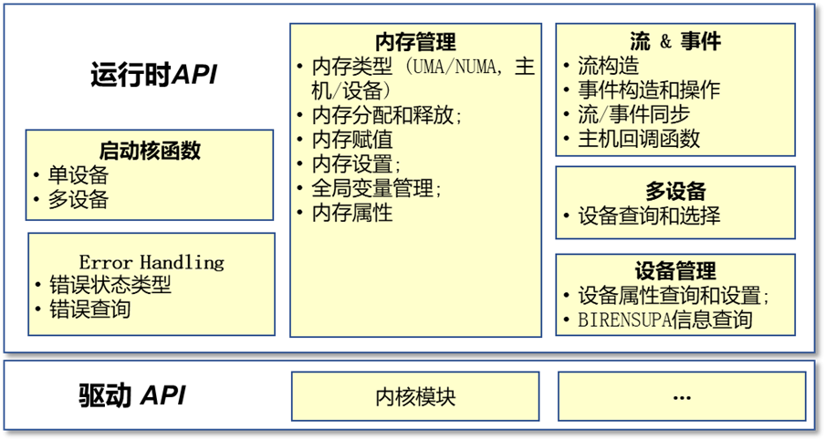
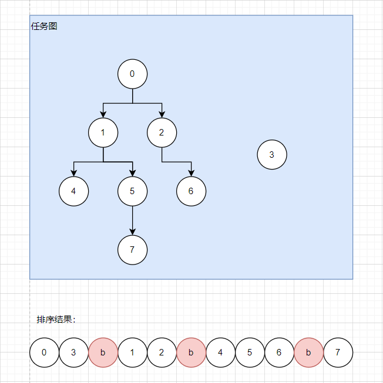

# BIRENSUPA™ 运行时 API 参考

## 运行时和驱动 API 概述

在主机端，BIRENSUPA  运行时和驱动 API 可以用于执行设备管理、内存管理和启动核函数等任务。典型的函数组包括：

- 内存管理：分配、释放等；
- 内存复制：主机到设备，设备之间；
- 核函数启动；
- 控制设备任务：同步设备核函数，用于异步编程的流和事件；
- 多设备管理：查询设备，选择当前设备；
- 计算图管理：创建、捕获、修改、实例化和启动等；
- 其他：错误检查等。
运行时 API 函数名称大多使用 `su` 前缀，使用到的特殊数据类型会添加后缀`_t`。

<p align="center"></p>

## 运行时 API 和驱动 API 的区别

`BIRENSUPA` 主机端 API 包含两层，即运行时 API 和驱动 API，两者在功能范围上非常相似。`BIRENSUPA` 应用程序可以选择使用其中一个或同时使用两者进行编程。这两层 API 也存在明显的差异，其中，主要的不同点包括：

- 详细控制：驱动API 提供了对设备各项功能的精细化控制，而运行时 API 包含了较多默认信息。在大多数情况下，调用运行时 API 更为简单。如果开发者需要进行精细的控制，则应该使用驱动 API。
- 上下文信息：运行时 API 隐式地具有上下文管理，运行时 API 创建并初始化了一个默认上下文，当选定了一个默认设备后，程序可以在默认设备上分配内存并启动核函数。但是，使用驱动 API 需要显式地创建上下文并初始化，并需要为所有其他操作选择上下文和设备。

> 在通常情况下，运行时 API 足以满足大多数编程需求。在涉及详细的设备控制和性能优化的场景时，驱动 API 具有更为显著的优势。关于驱动 API 的更多信息，请参见《BIRENSUPA™ 驱动 API 参考》。

<div style="page-break-after:always"></div>

## API 同步行为

运行时 API 提供了同步或异步形式的 `memcpy` 和 `memset` 相关函数，后者一般含有 `Async` 后缀。但是请勿仅通过此后缀来判断一个函数是同步还是异步操作，因为包含此后缀的函数的执行方式，可能根据请求参数的不同而变化。

### Memcpy

在本文档中，每个 `memcpy` 函数根据定义被归类为同步或异步，具体行为如下。

#### 同步 Memcpy

1. 对于从可分页主机内存到设备内存的传输，该函数仅在传输完成后返回。
2. 对于从固定主机内存到设备内存的传输， 该函数仅在传输完成后返回。
3. 对于从设备到可分页或固定主机内存的传输，该函数仅在传输完成后返回。
4. 对于从设备内存到设备内存的传输，该函数有可能在传输完成前返回。(BIRENSUPA 1.x 版本该函数仅在传输完成后返回)。
5. 对于从任何主机内存到任何主机内存的传输，该函数仅在传输完成后返回。

#### 异步 Memcpy

1. 对于从设备内存到可分页主机内存的传输，该函数仅在传输完成后返回。
2. 对于从任何主机内存到任何主机内存的传输，该函数仅在传输完成后返回。
3. 对于所有其他传输，该函数是完全异步的。如果必须首先将可分页内存暂存到固定内存，则此时将与工作线程异步处理。

### Memset

#### 同步 Memset

1. 操作固定主机内存，该函数仅在操作完成后返回。
2. 操作设备内存，该函数有可能在操作完成前返回 (BIRENSUPA 1.x 版本该函数仅在操作完成后返回)。

#### 异步 Memset

异步memset操作始终保持异步执行，该函数会在操作完成前返回。

### 内核启动

内核启动相对于主机是异步的。关于并发内核执行和数据传输的详细信息，请参见《BIRENSUPA™ 编程指南》。

### 可执行的任务图启动

可执行的任务图启动在没有以下情况时相对于主机是全图异步的：

1. 图中包含从设备内存拷贝到可分页主机内存的节点时，包含拷贝的部分图是同步执行完再启动其它不包含这类拷贝的剩余部分，剩余部分是异步的。
2. 同一个可执行图重复启动时会先在主机同步等待上一次的启动执行完再重新启动。

<div style="page-break-after:always"></div>

## 流同步行为

### 默认流

默认流是指将 `suStream_t` 设置为0，或者由隐式操作流的 API（如`suMemcpy()`和`suMemset()`）传递时使用时，具备如下特点

默认流是一个隐式流，在同一个`suContext`上， 当在默认流中执行操作（例如内核启动或`suStreamWaitEvent()`）会与所有其他阻塞流（使用`suStreamDefault`创建）同步。对于仅使用运行时 API 的应用程序，每个设备将有一个默认的上下文。默认流会首先等待该上下文中所有阻塞流完成，然后将当前操作在默认流中排队，然后所有阻塞流等待默认流中当前这个操作完成。

例如，以下代码在流 s 中启动内核k_1，然后在旧流中k_2，然后在流 s 中k_3：

```cpp
suLaunchKernel(k_1, dim3(1), dim3(1), 0,s);
suLaunchKernel(k_2, dim3(1), dim3(1));
suLaunchKernel(k_3, dim3(1), dim3(1), 0,s);
```

由此产生的行为是k_2将等k_1，k_3将等k_2执行完再执行。
可以使用带有流创建 API 的 `suStreamNonBlocking` 标志创建不与默认流同步的非阻塞流。

## 任务图对象的线程安全问题

###  图对象线程安全

任务图对象（`suTaskGraph_t`）是非线程安全的，所以请勿从多个线程并发访问同一个任务图。访问同一个Graph的操作必须循序指定的顺序，不允许存在随机顺序的情况，否则会导致未定义行为。

注意：此情况包括所有看起来为只读的API，例如 suTaskGraphClone  和 suTaskGraphInstantiate。在不保序的情况下，任何 API 都无法确保从两个不同的线程对同一图对象进行安全调用。

<div style="page-break-after:always"></div>

## 子模块介绍

### 设备管理

本节介绍`BIRENSUPA` 运行时 API 中设备管理相关的函数。

#### suChooseDevice

选择最符合条件的计算设备。

**函数签名**

```cpp
suError_t suChooseDevice(int *device, const suDeviceProp *prop);
```

**参数列表**

- `device`[out]： 用于获取和`prop`最匹配的设备号
- `prop`[in]：所需设备的属性

**返回值**

- `suSuccess`
- `suErrorInvalidValue`

**描述**

在 `*device` 中获取具有与 `*prop` 最匹配的属性的设备。

> `suDeviceProp`的定义可以参考[`suGetDeviceProperties`](#suGetDeviceProperties)。

#### suDeviceGetAttribute

查询设备的相关属性。

**函数签名**

```cpp
suError_t suDeviceGetAttribute(int *value, suDeviceAttr attr, int device);
```

**参数列表**

- `value`[out]：用来获取和`attr`对应的属性值
- `attr`[in]：需要查询的设备属性
- `device`[in]：要查询的设备号

**返回值**

- `suSuccess`
- `suErrorInvalidDevice`
- `suErrorInvalidValue`

**描述**

在 `*value` 中返回设备上属性`attr` 的整数值。支持的属性包括：

| 可选值                                          | 说明                                                       |
| ----------------------------------------------- | ---------------------------------------------------------- |
| suDevAttrMaxThreadsPerBlock                     | 每个线程块的最大线程数。                                   |
| suDevAttrMaxBlockDimX                           | 线程块 X 维度最大值。                                      |
| suDevAttrMaxBlockDimY                           | 线程块 Y 维度最大值。                                      |
| suDevAttrMaxBlockDimZ                           | 线程块 Z 维度最大值。                                      |
| suDevAttrMaxGridDimX                            | 线程网格 X 维度最大值。                                    |
| suDevAttrMaxGridDimY                            | 线程网格 Y 维度最大值。                                    |
| suDevAttrMaxGridDimZ                            | 线程网格 Z 维度最大值。                                    |
| suDevAttrMaxSharedMemoryPerBlock                | 每个线程块的最大可用共享内存（以字节为单位）。             |
| suDevAttrTotalConstantMemory                    | 核函数中**constant**变量在设备上可用的内存(以字节为单位)。 |
| suDevAttrWarpSize                               | 线程束大小。                                               |
| suDevAttrMaxPitch                               | 内存拷贝允许的最大字节间距。                               |
| suDevAttrMaxRegistersPerBlock                   | 每个线程块允许的最大 32 位寄存器数。                       |
| suDevAttrClockRate                              | 峰值时钟频率(千赫兹)。                                     |
| suDevAttrGpuOverlap                             | 设备可以同时复制内存和执行核函数。                         |
| suDevAttrMultiProcessorCount                    | 设备上的多处理器数量。                                     |
| suDevAttrKernelExecTimeout                      | 指定核函数是否有运行时限制。                               |
| suDevAttrIntegrated                             | 设备与主机内存集成。                                       |
| suDevAttrCanMapHostMemory                       | 设备可以将主机内存映射到 BIRENSUPA 地址空间。              |
| suDevAttrComputeMode                            | 计算模式。                                                 |
| suDevAttrConcurrentKernels                      | 设备可以同时执行多个核函数。                               |
| suDevAttrEccEnabled                             | 设备已启用 ECC 支持。                                      |
| suDevAttrPciBusId                               | 设备的 PCI 总线 ID。                                       |
| suDevAttrPciDeviceId                            | 设备的 PCI 设备 ID。                                       |
| suDevAttrTccDriver                              | 设备正在使用 TCC 驱动模型。                                |
| suDevAttrMemoryClockRate                        | 峰值内存时钟频率(千赫兹)。                                 |
| suDevAttrGlobalMemoryBusWidth                   | 全局内存总线宽度(以位为单位)。                             |
| suDevAttrL2CacheSize                            | L2 缓存大小(以字节为单位)。                                |
| suDevAttrMaxThreadsPerMultiProcessor            | 每个多处理器最多驻留线程数。                               |
| suDevAttrAsyncEngineCount                       | 异步引擎的数量。                                           |
| suDevAttrUnifiedAddressing                      | 设备与主机共用统一的地址空间。                             |
| suDevAttrPciDomainId                            | 设备的 PCI 域 ID。                                         |
| suDevAttrComputeCapabilityMajor                 | 主要计算能力版本号。                                       |
| suDevAttrComputeCapabilityMinor                 | 次要计算能力版本号。                                       |
| suDevAttrStreamPrioritiesSupported              | 设备支持流优先级。                                         |
| suDevAttrLocalL1CacheSupported                  | 设备支持在 L1 中缓存局部变量。                             |
| suDevAttrMaxSharedMemoryPerMultiprocessor       | 每个多处理器可用的最大共享内存（以字节为单位）。           |
| suDevAttrMaxRegistersPerMultiprocessor          | 每个多处理器可用的最大 32 位寄存器数。                     |
| suDevAttrManagedMemory                          | 设备可以在此系统上分配托管内存。                           |
| suDevAttrIsMultiGpuBoard                        | 设备位于多 GPU 板上。                                      |
| suDevAttrMultiGpuBoardGroupID                   | 同一多 GPU 板上一组设备的唯一标识符。                      |
| suDevAttrHostNativeAtomicSupported              | 设备和主机之间的连接支持本机原子操作。                     |
| suDevAttrPageableMemoryAccess                   | 设备支持连贯地访问可分页内存。                             |
| suDevAttrConcurrentManagedAccess                | 设备可以与 CPU 同时访问托管内存。                          |
| suDevAttrComputePreemptionSupported             | 设备支持计算抢占。                                         |
| suDevAttrCanUseHostPointerForRegisteredMem      | 设备可以在与 CPU 相同的虚拟地址访问主机注册内存。          |
| suDevAttrCooperativeLaunch                      | 设备支持启动协作核函数。                                   |
| suDevAttrPageableMemoryAccessUsesHostPageTables | 设备通过主机的页表访问可分页内存。                         |
| suDevAttrDirectManagedMemAccessFromHost         | 主机无需迁移即可直接访问设备上的托管内存。                 |

#### suDeviceGetByPCIBusId

获取计算设备的设备号。

**函数签名**

```cpp
suError_t suDeviceGetByPCIBusId(int *device, const char *pciBusId);
```

**参数列表**

- `device`[out]：用来获取设备序号
- `pciBusId`[in]：PCI总线ID，其中 `domain`、`bus`、`device` 和 `function`采用以下格式的字符串表示： `[domain]:[bus]:[device].[function]`。`domain`、`bus`、`device` 和 `function` 均为十六进制表示

**返回值**

- `suSuccess`
- `suErrorInvalidDevice`
- `suErrorInvalidValue`

**描述**

在给定 `PCI`总线`ID` 字符串的情况下，在 `*device` 中获取设备序号。

#### suDeviceGetLimit

获取设备的资源限制。

**函数签名**

```cpp
suError_t suDeviceGetLimit(size_t *size, suLimit limit);
```

**参数列表**

- `size`[out]：获取限制的大小
- `limit`[in]：要查询的限制类别枚举值，支持以下 `suLimit` 类型：
 	- `suLimitStackSize` 是每个 GPU 线程的堆栈大小（以字节为单位）。
 	- `suLimitPrintfFifoSize` 是 `printf()` 设备系统调用使用的共享 FIFO 的大小（以字节为单位）
 	- `suLimitMallocHeapSize` 是大小（以字节为单位） `malloc()` 和 `free()`设备系统调用使用的堆的大小。

**返回值**

- `suSuccess`
- `suErrorInvalidValue`
- `suErrorUnsupportedLimit`

**描述**

在 `*size` 中获取`limit`所指定的资源类型的当前限定大小。

#### suDeviceGetP2PAttribute

查询两个设备之间的链路属性。

**函数签名**

```cpp
suError_t suDeviceGetP2PAttribute(int *value, suDeviceP2PAttr attr,
                                  int srcDevice, int dstDevice);
```

**参数列表**

- `value`[out]：所请求属性的返回值
- `attr`[in]：需要查询的相关属性， 目前只支持`suDevP2PAttrAccessSupported`
- `srcDevice`[in]：链接的源设备
- `dstDevice`[in]：链接的目标设备

**返回值**

- `suSuccess`
- `suErrorInvalidValue`
- `suErrorInvalidDevice`

**描述**

在`*value` 中获取 `srcDevice` 和 `dstDevice` 之间链接的属性 `attr` 的值。支持的属性有：

- `suDevP2PAttrAccessSupported`

#### suDeviceGetPCIBusId

获取设备的`PCI`总线`ID`字符串。

**函数签名**

```cpp
suError_t suDeviceGetPCIBusId(char *pciBusId, int len, int device);
```

**参数列表**

- `pciBusId`[out]：按照以下格式获取设备的标识符字符串 `[domain]:[bus]:[device].[function]` 其中 `domain`， `bus`， `device` 和 `function` 都是十六进制值。 `pciBusId` 的大小应足够存储 13 个字符（包括 NULL终止符）
- `len`[in]：`name` 中存储的字符串的最大长度
- `device`[in]：要获取标识符的设备

**返回值**

- `suSuccess`
- `suErrorInvalidValue`
- `suErrorInvalidDevice`

**描述**

在`pciBusId`中获取一个 `ASCII`的字符串来标识设备`device`，字符串以`NULL`标识结尾。 `len` 指定可以获取的字符串的最大长度。

#### suDeviceGetSharedMemConfig

获取当前设备的共享内存配置。

**函数签名**

```cpp
suError_t suDeviceGetSharedMemConfig(suSharedMemConfig *config);
```

**参数列表**

- `config`[out]：用来获取共享内存配置的结构体指针

**返回值**

- `suSuccess`
- `suErrorInvalidValue`
- `suErrorInvalidDevice`

#### suDeviceGetStreamPriorityRange

获取与最小和最大流优先级相对应的数值。

**函数签名**

```cpp
suError_t suDeviceGetStreamPriorityRange(int *low, int *high);
```

**参数列表**

- `low`[out]：指向`int`的指针，获取流的最低优先级的数值
- `high`[out]：指向`int`的指针，获取流的最大优先级的数值

**返回值**

- `suSuccess`
- `suErrorInvalidDevice`

**描述**

壁仞通用 GPU 硬件设计版本 1.0 不支持流优先级，此函数将在 `*low` 和 `*high` 中返回0。

#### suDeviceReset

销毁当前**进程**中**当前设备**上的分配的所有资源并重置所有状态。

**函数签名**

```cpp
suError_t suDeviceReset(void);
```

**参数列表**

> 空

**返回值**

- `suSuccess`

**描述**

显式销毁并清理当前进程中与当前设备关联的所有资源。调用这个API后需要确保被销毁的资源在后续 API 调用中不被访问或传递 。此设备的任何后续 API 调用都将重新初始化该设备。

> 请注意，执行此功能后，设备将会立即重置。在调用此 API 时，请确保无任何其他主机线程正在访问此设备。

#### suDeviceSetLimit

设置设备资源的限制阈值。

**函数签名**

```cpp
suError_t suDeviceSetLimit(suLimit limit, size_t size);
```

**参数列表**

- `limit`[in]：设置限制的类型枚举，支持以下 `suLimit` 值
 	- `suLimitStackSize` 是每个 `GPU` 线程的堆栈大小（以字节为单位）。
 	- `suLimitPrintfFifoSize` 是`printf()` 设备系统调用使用的共享`FIFO` 的大小（以字节为单位）
 	- `suLimitMallocHeapSize` 是大小（以字节为单位）`malloc()` 和 `free()` 设备系统调用使用的堆的大小
- `size`[in]：限制大小

**返回值**

- `suSuccess`
- `suErrorInvalidValue`
- `suErrorInvalidDevice`
- `suErrorUnsupportedLimit`

**描述**

将 `limit` 设置为 `size` 值以满足硬件和计算要求。

#### suDeviceSynchronize

同步当前设备，等待计算设备完成所有已经提交的任务。

**函数签名**

```cpp
suError_t suDeviceSynchronize(void);
```

**参数列表**

> 空

**返回值**

- `suSuccess`

**描述**

主机线程阻塞直到设备完成所有前面请求的任务。如果有任务失败，`suDeviceSynchronize()`将返回错误。否则主机线程将阻塞，直到设备完成其工作。

#### suGetDevice

获取当前正在使用的设备。

**函数签名**

```cpp
suError_t suGetDevice(int *device);
```

**参数列表**

- `device`[out]：用来获取当前设备号

**返回值**

- `suSuccess`
- `suErrorInvalidValue`

**描述**

在`*device` 中获取当前API调用所在的主机线程的当前设备。

#### suGetDeviceCount

获取系统中设备的数量。

**函数签名**

```cpp
suError_t suGetDeviceCount(int *count);
```

**参数列表**

- `count`[out]：用来获取系统中可用设备数量

**返回值**

- `suSuccess`
- `suErrorInvalidValue`

**描述**

在`*count`中获取可用的设备数量。

#### suGetDeviceFlags

获取当前设备的标志。

**函数签名**

```cpp
suError_t suGetDeviceFlags(unsigned int *flags);
```

**参数列表**

- `flags`[out]：用来获取设备标志的指针

**返回值**

- `suSuccess`
- `suErrorInvalidValue`

#### suGetDeviceProperties

获取指定计算设备的信息。

**函数签名**

```cpp
suError_t suGetDeviceProperties(suDeviceProp *prop, int device);
```

**参数列表**

- `prop`[out]：用来获取设备信息的`suDeviceProp`结构体指针
- `device`[in]：要查询的设备句柄

**返回值**

- `suSuccess`
- `suErrorInvalidDevice`

**描述**

在`*prop`中获取设备`device`的属性。`suDeviceProp`结构定义为：

| 数据类型 | 变量名                                 | 说明                                                                |
| -------- | -------------------------------------- | ------------------------------------------------------------------- |
| size_t   | spcCount                               | 当前设备的 SPC 数。                                                 |
| size_t   | hbmSectionSize                         | 每个 HBM 的大小（以字节为单位）。                                   |
| size_t   | numaRegionAlign                        | NUMA 内存对齐。                                                     |
| int      | ECCEnabled                             | 设备启用了 ECC 支持。                                               |
| int      | asyncEngineCount                       | 异步引擎的数量。                                                    |
| int      | canMapHostMemory                       | 设备可以使用 suHostAlloc/suHostGetDevicePointer 映射主机内存。      |
| int      | canUseHostPointerForRegisteredMem      | 设备可以在与 CPU 相同的虚拟地址访问主机注册内存。                   |
| int      | clockRate                              | 时钟频率（以千赫兹为单位）。                                        |
| int      | computeMode                            | 计算模式。                                                          |
| int      | computePreemptionSupported             | 设备支持计算抢占。                                                  |
| int      | concurrentKernels                      | 设备可能同时执行多个内核。                                          |
| int      | concurrentManagedAccess                | 设备可以与 CPU 同时一致地访问托管内存。                             |
| int      | cooperativeLaunch                      | 设备支持启动协作核函数。                                            |
| int      | cooperativeMultiDeviceLaunch           | 已弃用。                                                            |
| int      | deviceOverlap                          | 设备可以同时复制内存和执行核函数，已弃用。请改用 asyncEngineCount。 |
| int      | directManagedMemAccessFromHost         | 主机无需迁移即可直接访问设备上的托管内存。                          |
| int      | globalL1CacheSupported                 | 设备支持在 L1 中缓存全局变量。                                      |
| int      | hostNativeAtomicSupported              | 设备和主机之间的连接支持本机原子操作。                              |
| int      | integrated                             | 设备是集成的，而不是分离的。                                        |
| int      | isMultiGpuBoard                        | 设备位于多 GPU 板上。                                               |
| int      | kernelExecTimeoutEnabled               | 指定核函数是否有运行时间限制。                                      |
| int      | l2CacheSize                            | L2 缓存的大小（以字节为单位）。                                     |
| int      | localL1CacheSupported                  | 设备支持在 L1 中缓存局部变量。                                      |
| int      | managedMemory                          | 设备支持在此系统上分配托管内存。                                    |
| Int\*    | maxGridSize                            | 线程网格每个维度的最大尺寸。                                        |
| Int\*    | maxThreadsDim                          | 线程块每个维度的最大尺寸。                                          |
| int      | maxThreadsPerBlock                     | 每个线程块的最大线程数。                                            |
| int      | maxThreadsPerMultiProcessor            | 每个多处理器的最大常驻线程数。                                      |
| int      | memoryBusWidth                         | 全局内存总线宽度（以位为单位）。                                    |
| int      | memoryClockRate                        | 峰值内存时钟频率（以千赫兹为单位）。                                |
| int      | multiGpuBoardGroupID                   | 同一多 GPU 板上一组设备的唯一标识符。                               |
| int      | multiProcessorCount                    | 设备上的多处理器数量。                                              |
| char\*   | name                                   | 识别设备的 ASCII 字符串。                                           |
| int      | pageableMemoryAccess                   | 设备支持连贯地访问可分页内存，而无需在其上调用 suHostRegister。     |
| int      | pageableMemoryAccessUsesHostPageTables | 设备通过主机的页表访问可分页内存。                                  |
| int      | pciBusID                               | 设备的 PCI 总线 ID。                                                |
| int      | pciDeviceID                            | 设备的 PCI 设备 ID。                                                |
| int      | pciDomainID                            | 设备的 PCI 域 ID。                                                  |
| int      | regsPerBlock                           | 每个线程块可用的 32 位寄存器。                                      |
| int      | regsPerMultiprocessor                  | 每个多处理器可用的 32 位寄存器。                                    |
| int      | sharedMemPerBlock                      | 每个线程块可用的共享内存（以字节为单位）。                          |
| int      | sharedMemPerMultiprocessor             | 每个多处理器可用的共享内存（以字节为单位）。                        |
| int      | totalConstMem                          | 设备上可用的常量内存（以字节为单位）。                              |
| int      | totalGlobalMem                         | 设备上可用的全局内存（以字节为单位）。                              |
| int      | unifiedAddressing                      | 设备与主机共享统一的地址空间。                                      |
| int      | uuid                                   | 16 字节唯一标识符。                                                 |
| int      | warpSize                               | 线程束大小。                                                        |

#### suIpcCloseMemHandle

尝试关闭映射的设备内存。

**函数签名**

```cpp
suError_t suIpcCloseMemHandle(void *devPtr);
```

**参数列表**

- `devPtr`[in]：要关闭的设备指针，该参数由 suIpcOpenMemHandle 返回

**返回值**

- `suSuccess`
- `suErrorNotSupported`
- `suErrorInvalidValue`

**描述**

尝试关闭使用 `suIpcOpenMemHandle` 映射的设备内存。

#### suIpcGetEventHandle

获取先前分配的事件的进程间句柄。

**函数签名**

```cpp
suError_t suIpcGetEventHandle(suIpcEventHandle_t *handle, suEvent_t event);
```

**参数列表**

- `handle`[out]：指向用户分配的 `suIpcEventHandle` 的指针，在其中获取句柄
- `event`[in]：指定要获取的事件句柄。

**返回值**

- `suSuccess`
- `suErrorInvalidValue`
- `suErrorInvalidResourceHandle`
- `suErrorNotSupported`
- `suErrorMemoryAllocation`

**描述**

获取先前分配的事件的进程间句柄，在`*handle`中返回。

#### suIpcGetMemHandle

获取现有设备内存分配的进程间内存句柄。

**函数签名**

```cpp
suError_t suIpcGetMemHandle(suIpcMemHandle_t *handle, void *devPtr);
```

**参数列表**

- `handle`[out]：指向用户分配的 `suIpcMemHandle` 的指针以获取句柄。
- `devPtr`[in]：设备内存地址

**返回值**

- `suSuccess`
- `suErrorInvalidValue`
- `suErrorInvalidResourceHandle`
- `suErrorNotSupported`
- `suErrorMemoryAllocation`

**描述**

获取现有设备内存`devPtr`的进程间内存句柄。在`*handle`中返回。

#### suIpcOpenEventHandle

打开进程间事件句柄以供当前进程使用。

**函数签名**

```cpp
suError_t suIpcOpenEventHandle(suEvent_t *event, suIpcEventHandle_t handle);
```

**参数列表**

- `event`[out]：获取导入的事件
- `handle`[in]：打开进程间句柄

**返回值**

- `suSuccess`
- `suErrorInvalidValue`
- `suErrorInvalidResourceHandle`
- `suErrorNotSupported`
- `suErrorMemoryAllocation`

**描述**

打开进程间事件句柄`handle`指定的事件以供当前进程使用。事件在`*event`中获取。

#### suIpcOpenMemHandle

打开从另一个进程导出的进程间内存句柄，并获取可在当前API所在的进程中使用的设备指针。

**函数签名**

```cpp
suError_t suIpcOpenMemHandle(void **devPtr, suIpcMemHandle_t handle,
                             unsigned int flags);
```

**参数列表**

- `devPtr`[out]：获取的设备指针
- `handle`[in]：需要打开的`suIpcMemHandle` 句柄
- `flags`[in]：此操作的标志。必须指定为 `suIpcMemLazyEnablePeerAccess`的枚举值

**返回值**

- `suSuccess`
- `suErrorInvalidValue`
- `suErrorInvalidResourceHandle`
- `suErrorNotSupported`
- `suErrorMemoryAllocation`

**描述**

打开从另一个进程导出的进程间内存句柄`handle`，并返回可在当前API所在的进程中使用的设备指针`*devPtr`。

#### suSetDevice

设置当前进程中用于执行任务的GPU设备

**函数签名**

```cpp
suError_t suSetDevice(int device);
```

**参数列表**

- `device`[in]：需要使用的设备号

**返回值**

- `suSuccess`
- `suErrorInvalidDevice`

**描述**

将 `device` 设置为调用主机线程的当前设备。有效的设备 ID 为 0 到 (`suGetDeviceCount()` 获取的设备数量 - 1)。

- 随该API调用后的比如`suMallocDevice()`，`suMallocHost()`，`suRegisterHostMemory()` 分配和对内存的操作都将与当前的设备绑定。
- 随该API调用后的比如`suStreamCreate()`，`suEventCreate()`，`suTensorObjectCreate()` 等创建的资源将与当前设备绑定。
- 随该API调用后的比如 `suLaunchKernel()`等将使用与当前设备绑定的上下文资源。

#### suSetDeviceFlags

设置用于设备执行的标志。

**函数签名**

```cpp
suError_t suSetDeviceFlags(unsigned int flags);
```

**参数列表**

- `flags`[in]：设备操作参数

**返回值**

- `suSuccess`
- `suErrorInvalidValue`

**描述**

设置用于设备执行的标志。

#### suDeviceGetSpcMask

获取设备的可用的流处理器掩码。

**函数签名**

```cpp
suError_t suDeviceGetSpcMask(uint32_t *spcMask, int device);
```

**参数列表**

- `spcMask`[out]：用来获取流处理掩码
- `device`[in]：设备号

**返回值**

- `suSuccess`
- `suErrorInvalidValue`
- `suErrorInvalidDevice`

**描述**

查询设备上可用的流处理器掩码，以bitmap形式组成一个`uint32_t` 的 `*spcMask`， 这个正整数的二进制形式由低到高位的每一个BIT代表一个的流处理器。 如果该BIT是`1`表示流处理器可用。

> 如需获取stream上配置的spc mask，您可以调用 suStreamGetAttribute() 进行查询。

<div style="page-break-after:always"></div>

### 错误处理

本节介绍`BIRENSUPA`运行时应用程序编程接口的错误处理功能。

#### suGetErrorName

获取错误代码枚举名称的字符串表示形式。

**函数签名**

```cpp
const char *suGetErrorName(suError_t error);
```

**参数列表**

- `error`[in]：需要转换为字符串的错误代码

**返回值**

- 指向以 `NULL` 结尾的字符串的 `char*` 指针

**描述**

获取一个字符串，其中包含枚举中错误代码的名称。

如果无法识别错误码，则为“unrecognized error code”。

#### suGetErrorString

获取错误码的字符串形式的解释。

**函数签名**

```cpp
const char *suGetErrorString(suError_t error);
```

**参数列表**

- `error`[in]：需要转换为字符串的错误代码

**获取值**

- 指向以 `NULL` 结尾的字符串的指针

**描述**

返回错误码的说明字符串。
如果无法识别错误代码，则返回“unrecognized error code”。

#### suGetLastError

获取运行时调用的最后一个错误。

**函数签名**

```cpp
suError_t suGetLastError(void);
```

**参数列表**

> 无

**返回值**

返回值为其他 API 可能返回的错误码。

**描述**

获取同一主机线程中任何运行时调用产生的最后一个错误，并将其重置为 `suSuccess`。

#### suPeekAtLastError

获取运行时调用的最后一个错误，但是**不重置**。

**函数签名**

```cpp
suError_t suPeekAtLastError(void);
```

**参数列表**

> 无

**返回值**

> 返回其它API可能返回的所有错误码

<div style="page-break-after:always"></div>

### 流管理

本节介绍`BIRENSUPA`运行时应用程序编程接口的流管理功能。

#### suStreamAddCallback

向计算流添加回调函数。

**函数签名**

```cpp
suError_t suStreamAddCallback(suStream_t stream, suStreamCallback_t callback,
                              void *userData, unsigned int flags);
```

**参数列表**

- `stream`[in]：要添加回调的流
- `callback`[in]：回调函数
- `userData`[in]：要传递给回调函数的用户指定数据
- `flags`[in]：保留以备将来使用，必须为`0`

**返回值**

- `suSuccess`
- `suErrorInvalidResourceHandle`
- `suErrorInvalidValue`
- `suErrorNotSupported`

**描述**

添加一个回调函数到流中，该回调函数在流中排队等待它前面的任务完成后在主机上被调用。对于每一次 `suStreamAddCallback` 调用，其指定的回调函数将只被执行一次。回调函数会阻止流中的后续工作，直到完成它执行完才开始执行，即回调函数的执行具有流的语义。

> 在回调函数内部，不允许调用任何 BIRENSUPA API。

#### suStreamBeginCapture

在流上开启捕获并保存为计算图。

**函数签名**

```cpp
suError_t suStreamBeginCapture(suStream_t stream, suStreamCaptureMode mode);
```

**参数列表**

- `stream`[in]：要启动捕获的流
- `mode`[in]：控制此捕获序列与其他可能不安全的 API 调用的交互，可以是：
 	- `suStreamCaptureModeGlobal`
 	- `suStreamCaptureModeThreadLocal`
 	- `suStreamCaptureModeRelaxed`

**返回值**

- `suSuccess`
- `suErrorInvalidValue`

**描述**

开始在 `stream` 上捕获任务并生成任务图，该任务图将通过 `suStreamEndCapture()`获取。可以通过`suStreamIsCapturing()`查询一个`suStreamLegacy`的`stream`是否在捕捉模式。可以通过`suStreamGetCaptureInfo()`查询到当前在捕获中的任务图和捕获`id`。捕获必须在启动它的同一个流上结束，并且只有当流尚未启动时才可以启动捕获 。
> 如果 `mode` 不是 `suStreamCaptureModeRelaxed`，则必须从同一线程操作此捕获中的流。

> 当流处于捕获模式时，推送到流中的所有操作都**不会被执行**，而是会被捕获。

#### suStreamCreate

创建异步流。

**函数签名**

```cpp
suError_t suStreamCreate(suStream_t *stream);
```

**参数列表**

- `stream`[out]：指向新创建流句柄的指针

**返回值**

- `suSuccess`
- `suErrorInvalidValue`

**描述**

创建新的异步流。

> 等同于调用`suStreamCreateWithFlags()`使用的`flags`参数为`suStreamDefault`

#### suStreamCreateWithFlags

用指定标志创建异步流。

**函数签名**

```cpp
suError_t suStreamCreateWithFlags(suStream_t *stream, unsigned int flags);
```

**参数列表**

- `stream`[out]：指向新创建流句柄的指针
- `flags`[in]：流创建参数

**返回值**

- `suSuccess`
- `suErrorInvalidValue`

**描述**

使用指定的标志参数创建流，支持的流标志可以是：

- `suStreamDefault`： 默认流创建标志
- `suStreamNonBlocking`：指定创建的流是非阻塞的，可以和默认流 `0`（NULL 流）并行工作，即创建的流不与流 `0` 执行隐式同步。

#### suStreamCreateWithPriority

创建具有指定优先级的异步流。

**函数签名**

```cpp
suError_t suStreamCreateWithPriority(suStream_t *stream, unsigned int flags,
                                     int priority);
```

**参数列表**

- `stream`[out]：指向新创建的流句柄的指针
- `flags`[in]：流创建参数
- `priority`[in]：流的优先级。

**返回值**

- `suSuccess`
- `suErrorInvalidValue`

**描述**

> 在壁仞通用 GPU 硬件设计版本 1.0 上**不可用**。

#### suStreamDestroy

清理并销毁异步流。

**函数签名**

```cpp
suError_t suStreamDestroy(suStream_t stream);
```

**参数列表**

- `stream`[in]：要销毁的流句柄

**返回值**

- `suSuccess`
- `suErrorInvalidValue`
- `suErrorInvalidResourceHandle`

**描述**

清理并销毁`stream`指定的异步流。
如果调用`suStreamDestroy()`时设备仍在流 `stream` 中工作，该函数将阻塞直到`stream`完成所有工作后再返回。

#### suStreamEndCapture

结束流上的捕获，获取捕获的任务图。

**函数签名**

```cpp
suError_t suStreamEndCapture(suStream_t stream, suTaskGraph_t *graph);
```

**参数列表**

- `stream`[in]：要结束的流句柄
- `graph`[out]：捕获的任务图句柄

**返回值**

- `suSuccess`
- `suErrorInvalidValue`
- `suErrorStreamCaptureWrongThread`

**描述**

结束`stream`上的捕获，通过`*graph`获取捕获的任务图。必须已在 `stream` 上通过调用 `suStreamBeginCapture()`启动捕获。如果由于违反流捕获规则而使捕获无效，则将返回 `NULL` 图。

如果`suStreamBeginCapture()`的 `mode` 参数不是 `suStreamCaptureModeRelaxed`，则必须在调用 `suStreamBeginCapture()` 的线程中调用 `suStreamEndCapture()`。

#### suStreamGetCaptureInfo

查询流的捕获状态。

**函数签名**

```cpp
suError_t suStreamGetCaptureInfo(suStream_t stream,
                                 suStreamCaptureStatus *captureStatus,
                                 unsigned long long *id);
```

**参数列表**

- `stream`[in]：要查询的流句柄
- `captureStatus`[out]：获取流的捕获状态
- `id`[out]：获取捕获序列的唯一ID

**返回值**

- `suSuccess`
- `suErrorStreamCaptureImplicit`

**描述**

查询流的捕获状态并获取表示进程生命周期内的捕获序列的唯一ID。

> 注意：此 API 有更高版本： suStreamGetCaptureInfo_v2()，并将在后续版本中被弃用。当前版本保留此 API 是为了方便从之前的 CUDA 代码迁移至 BIRENSUPA。

如果在捕获的流不是使用 `suStreamNonBlocking`所创建时调用`suStreamLegacy`（“空流”），则返回 `suErrorStreamCaptureImplicit`。

仅当以下两个条件都满足才会返回有效的`id`：

- 函数调用返回`suSuccess`
- `*captureStatus`设置为 `suStreamCaptureStatusActive`

#### suStreamGetFlags

查询流的标志。

**函数签名**

```cpp
suError_t suStreamGetFlags(suStream_t stream, unsigned int *flags);
```

**参数列表**

- `stream`[in]：要查询的流的句柄
- `flags`[out]：指向获取流标志的`unsigned int`的指针

**返回值**

- `suSuccess`
- `suErrorInvalidValue`
- `suErrorInvalidResourceHandle`

**描述**

查询流的标志。标志在 `*flags` 中获取。

> 请参阅 `suStreamCreateWithFlags()`以获取有效标志的列表。

#### suStreamGetPriority

查询流的优先级。

**函数签名**

```cpp
suError_t suStreamGetPriority(suStream_t stream, int *priority);
```

**参数列表**

- `stream`[in]：要查询的流的句柄
- `priority`[out]：指向有符号整数的指针，获取流的优先级

**返回值**

- `suSuccess`
- `suErrorInvalidValue`
- `suErrorInvalidResourceHandle`

**描述**

> 壁仞通用 GPU 硬件设计版本 1.0 只有优先级 `0`。

#### suStreamIsCapturing

获取流的捕获状态。

**函数签名**

```cpp
suError_t suStreamIsCapturing(suStream_t stream,
                              suStreamCaptureStatus *captureStatus);
```

**参数列表**

- `stream`[in]：要查询的流的句柄
-  `captureStatus`[out]：获取流的捕获状态

**返回值**

- `suSuccess`
- `suErrorInvalidValue`
- `suErrorInvalidResourceHandle`
- `suErrorStreamCaotureImplicit`

**描述**

通过`*captureStatus`获取`stream`的捕获状态。成功调用后，`*captureStatus` 将是下列状态的一种：

- `suStreamCaptureStatusNone`： 流不在捕获状态。
- `suStreamCaptureStatusActive` ： 流正在捕获中。
- `suStreamCaptureStatusInvalidated` ：流正在捕获，但发生了错误使捕获序列无效。必须关闭流的捕获 ，以便继续使用`stream`。

> 请注意，
>
> 1. 如果调用此函数使用的`stream`为旧流(即空流)而且在同一设备上有阻塞流处于捕获状态，它将返回`suErrorStreamCaptureImplicit` 同时`*captureStatus`的值无意义。
> 2. 当阻塞流捕获时，旧流处于不可用状态，直到阻塞流捕获终止。
> 3. 流捕获不支持旧流。

#### suStreamQuery

查询异步流的完成状态。

**函数签名**

```cpp
suError_t suStreamQuery(suStream_t stream);
```

**参数列表**

- `stream`[in]：要查询流的句柄

**返回值**

- `suSuccess`
- `suErrorNotReady`
- `suErrorInvalidResourceHandle`

**描述**

如果 `stream` 中的所有操作均已完成，则返回 `suSuccess`;否则返回 `suErrorNotReady`。

> 返回 `suSuccess`相当于调用了`suStreamSynchronize()`。

#### suStreamSynchronize

主机线程同步等待流任务完成。

**函数签名**

```cpp
suError_t suStreamSynchronize(suStream_t stream);
```

**参数列表**

- `stream`[in]：需要同步的流的句柄

**返回值**

- `suSuccess`
- `suErrorInvalidResourceHandle`
- `suErrorIllegalState`

**描述**

主机线程和`stream`同步。即调用此API的主机线程将阻塞，直到流完成所有任务再返回。

#### suStreamWaitEvent

让GPU上的流等待一个事件。

**函数签名**

```cpp
suStreamWaitEvent(suStream_t stream, suEvent_t event,
                            unsigned int flags);
```

**参数列表**

- `stream`[in]：等待事件的流的句柄
- `event`[in]：要等待的事件的句柄
- `flags`[in]：额外的参数，参见描述

**返回值**

- `suSuccess`
- `suErrorInvalidResourceHandle`
- `suErrorInvalidValue`

**描述**

1. 让`stream`上后续提交的任务都等待`event`所捕获的所有任务。有关事件捕获内容的详细信息，请参阅 `suEventRecord()`。
2. 标志`flags`包括：
 - `suEventWaitDefault`：默认事件创建标志。
 - `suEventWaitExternal`：在捕获任务图时事件作为外部事件节点显式的添加进任务图。

> 这里所说的**等待**发生在设备端，本API的调用是立即返回的，不会等待。

#### suThreadExchangeStreamCaptureMode

为主机线程替换新捕获模式

**函数签名**

```cpp
suError_t suThreadExchangeStreamCaptureMode(suStreamCaptureMode *mode);
```

**参数列表**

- `mode`[in]：要替换的新模式

**返回值**

- `suSuccess`
- `suErrorInvalidValue`

**描述**

将调用线程的流捕获交互模式设置为 `*mode` 中包含的值，并在`*mode`中获取先前模式。

#### suStreamCopyAttributes

将源流的属性复制到目标流。

**函数签名**

```cpp
suError_t suStreamCopyAttributes(suStream_t dst, suStream_t src);
```

**参数列表**

- `dst`[in]：目标流
- `src`[in]：源流

**返回值**

- `suSuccess`
- `suErrorNotSupported`

**描述**

在**相同**的上下文中的两个流之间将源流`src`的属性复制到目标流 `dst`。

当前支持的流属性类型有：

- `suLaunchAttributeSpcMask` ： 流作用域的`SPC` 掩码

>如果只调用Runtime API或者没有使用Driver API创建用户上下文，那么同一个设备上的两个流属于同一上下文。

#### suStreamGetAttribute

查询流的相关属性。

**函数签名**

```cpp
suError_t suStreamGetAttribute(suStream_t stream, suStreamAttrId attr,
                               suStreamAttrValue *valueOut);
```

**参数列表**

- `stream`[in]：要查询的流的句柄
- `attr`[in]：要查询的属性
- `valueOut`[out]：获取查询到的属性值

**返回值**

- `suSuccess`
- `suErrorInvalidValue`
- `suErrorInvalidResourceHandle`

**描述**

从`stream`中查询属性`attr`并将其存储在`*valueOut`的相应成员中。

流的属性类型`attr`当前支持的有：

- `suLaunchAttributeSpcMask` ： 流作用域的`SPC` 掩码

#### suStreamGetCaptureInfo_v2

查询流的捕获状态

**函数签名**

```cpp
suError_t suStreamGetCaptureInfo_v2(suStream_t stream,
                                    suStreamCaptureStatus *captureStatus,
                                    unsigned long long *id,
                                    suTaskGraph_t *graph,
                                    const suTaskGraphNode_t **dependencies,
                                    size_t *numDependencies);
```

**参数列表**

- `stream`[in]：要查询的流
- `captureStatus`[out]：获取流的捕获状态的指针；必需的不为空
- `id`[out]：用于获取捕获序列识别码，识别码在进程的生命周期中是唯一的，传空指针则不返回
- `graph`[out]：获取正在捕获的任务图句， 可选空指针则不返回
- `dependencies`[out]：存储指向节点数组的指针的可选指针
- `numDependencies`[out]：`dependencies` 中获取的数组大小的可选指针

**返回值**

- `suSuccess`
- `suErrorInvalidValue`
- `suErrorStreamCaptureImplicit`

**描述**

查询流的捕获状态并获取在进程生命周期内表示捕获序列的唯一ID。

如果在捕获的流不是使用 `suStreamNonBlocking`所创建时调用`suStreamLegacy`（“空流”），则返回 `suErrorStreamCaptureImplicit`。

仅当以下两个条件都满足才会返回有效的`id`：

- 函数调用返回`suSuccess`
- `*captureStatus`设置为 `suStreamCaptureStatusActive`

#### suStreamSetAttribute

 设置流属性。

**函数签名**

```cpp
suError_t suStreamSetAttribute(suStream_t stream, suStreamAttrId attr,
                               const suStreamAttrValue *value);
```

**参数列表**

- `stream`[in]：要设置的流的句柄
- `attr`[in]：要设置的属性类型
- `value`[in]：要设置的属性值

**返回值**

- `suSuccess`
- `suErrorInvalidValue`
- `suErrorInvalidResourceHandle`

**描述**

根据`*value`的相应属性在 `stream` 上设置属性 `attr`。更新后的属性将应用于提交到流的后续任务。不会影响之前提交的任务。

流的属性类型`attr`当前支持的有：

- `suLaunchAttributeSpcMask` ： 流作用域的`SPC` 掩码

#### suStreamUpdateCaptureDependencies

更新捕获流中的依赖项。

**函数签名**

```cpp
suError_t 
suStreamUpdateCaptureDependencies(suStream_t stream,
                                  suTaskGraphNode_t *dependencies,
                                  size_t numDependencies,
                                  unsigned int flags);
```

**参数列表**

- `stream`[in]：要更新的流的句柄
- `dependencies`[in]：新的任务图节点的依赖关系节点
- `numDependencies`[in]：`dependencies` 中依赖项的数量
- `flags`[in]：标志参数

**返回值**

- `suSuccess`
- `suErrorInvalidValue`
- `suErrorIllegalState`

**描述**

修改流的下一个捕获节点的节点的依赖项。

有效标志为：

- `suStreamAddCaptureDependencies` ： 增量模式，参数传递的依赖项和原有依赖合并
- `suStreamSetCaptureDependencies`：  替换模式，参数传递的依赖项取代原有依赖

如果流不是捕获状态，则返回 `suErrorIllegalState`

<div style="page-break-after:always"></div>

### 事件管理

本节介绍`BIRENSUPA`运行时应用程序编程接口的事件管理功能。

#### suEventCreate

创建事件对象

**函数签名**

```cpp
suError_t suEventCreate(suEvent_t *event);
```

**参数列表**

- `event`[out]：用来获取新创建的事件的指针

**返回值**

- `suSuccess`
- `suErrorInvalidValue`
- `suErrorMemoryAllocation`

**描述**

使用`suEventDefault`为当前设备创建事件对象。

#### suEventCreateWithFlags

创建具有指定标志的事件对象。

**函数签名**

```cpp
suError_t suEventCreateWithFlags(suEvent_t *event, unsigned int flags);
```

**参数列表**

- `event`[out]：用来获取新创建的事件的指针
- `flags`[in]：用来创建事件的标志

**返回值**

- `suSuccess`
- `suErrorInvalidValue`
- `suErrorMemoryAllocation`

**描述**

使用指定标志为当前设备创建事件对象。有效标志包括：

| 可选值                                          | 说明                                                       |
| -------------- | ---------------------------------------------------------- |
| suEventDefault                     | 默认事件创建标志。                                   |
| suEventBlockingSync                           | 指定事件应使用阻塞同步。使用`suEventSynchronize()` 等待使用此标志创建的事件的主机线程将阻塞，直到事件实际完成。                                     |
| suEventDisableTiming                           | 指定创建的事件不需要记录计时数据。指定此标志且未指定 `suEventBlockingSync`标志创建的事件在与 `suStreamWaitEvent()`和 `suEventQuery()` 一起使用时将提供最佳性能。                                     |
| suEventInterprocess                           | 指定创建的事件可以被`suIpcGetEventHandle()`用作进程间事件。 `suEventInterprocess`必须与`suEventDisableTiming` 一起使用。                                    |

#### suEventDestroy

销毁事件对象。

**函数签名**

```cpp
suError_t suEventDestroy(suEvent_t event);
```

**参数列表**

- `event`[in]：要销毁的事件的句柄

**返回值**

- `suSuccess`
- `suErrorInvalidResourceHandle`
- `suErrorInvalidValue`

**描述**

销毁`event`指定的事件。

> 事件可能会在完成之前被销毁（即`suEventQuery()`返回 `suErrorNotReady`）。在这种情况下调用`suEventDestroy`不会阻塞主机线程，系统会在`event`完成后自动释放相关资源。

#### suEventElapsedTime

计算事件之间经过的时间。

**函数签名**

```cpp
suError_t suEventElapsedTime(float *ms, suEvent_t start, suEvent_t end);
```

**参数列表**

- `ms`[out]：获取事件之间经过的时间，单位为毫秒（ms）。
- `start`[int]： 开始计时的事件的句柄
- `end`[in]：结束计时的事件的句柄

**返回值**

- `suSuccess`
- `suErrorNotReady`
- `suErrorInvalidValue`
- `suErrorInvalidResourceHandle`

**描述**

以毫秒为单位计算两个事件之间经过的时间。

1. 如果`start`和`end`没有都被 `suEventRecord()`记录到`stream`则返回 `suErrorInvalidResourceHandle`。
2. 如果对两个事件都调用了 `suEventRecord`但其中一个或两个事件尚未完成（即 `suEventQuery()`返回 `suErrorNotReady`)，则返回 `suErrorNotReady`
3. 如果有一个或者两个事件使用了 `suEventDisableTiming`标志创建，则此函数将返回 `suErrorInvalidResourceHandle`。

> 如果`start`和`end`分别在不同的`stream`并且`stream`之间无法保证`start`在`end`之前被`record`， 则测量到的时间可能不具有参考意义。

#### suEventQuery

查询事件的状态。

**函数签名**

```cpp
suError_t suEventQuery(suEvent_t event);
```

**参数列表**

- `event`[in]：要查询的事件的句柄

**返回值**

- `suSuccess`
- `suErrorNotReady`
- `suErrorInvalidResourceHandle`
- `suErrorInvalidValue`

**描述**

查询当前由事件捕获的所有任务的状态。
有关事件捕获内容的详细信息，请参阅 `suEventRecord()`。

如果所有捕获的任务已完成，则返回 `suSuccess`，否则返回`suErrorNotReady`。

#### suEventRecord

在流上记录一个事件。

**函数签名**

```cpp
suError_t suEventRecord(suEvent_t event, suStream_t stream);
```

**参数列表**

- `event`[in]：要记录的事件的句柄
- `stream`[in]：记录事件的流的句柄

**返回值**

- `suSuccess`
- `suErrorInvalidResourceHandle`
- `suErrorInvalidValue`

**描述**

在流上记录一个事件， 使得主机线程能够使用`suEventQuery()`或者`suEventSynchronize()`查询或同步这个事件。
由于流的顺序执行的特性，该`event`的状态会隐式包含流上在它前面的任务是否已经完成的语义。 这就是我们所说的这个`stream`上的任务被`event`事件所捕获了。

在调用此API时， `event` 和 `stream` 必须位于同一上下文中。然后，`suEventQuery()`或 `suStreamWaitEvent()`等调用将检查或等待捕获的工作完成。

可以对同一事件多次调用`suEventRecord()`，这将覆盖之前捕获的状态。`suEventQuery()`或者`suEventSynchronize()` 查询或同步的是最后一次所捕获的任务的状态。

> `suEventRecord()`等同于`suEventRecordWithFlags()` 的`flags`参数使用`suEventRecordDefault`标志。

#### suEventRecordWithFlags

在流上记录一个事件，附带操作标志。

**函数签名**

```cpp
suError_t suEventRecordWithFlags(suEvent_t event, suStream_t stream,
                                 unsigned int flags);
```

**参数列表**

- `event`[in]：要记录的事件的句柄
- `stream`[in]：记录事件的流的句柄
- `flags`[in]：操作标志参数

**返回值**

- `suSuccess`
- `suErrorInvalidResourceHandle`
- `suErrorInvalidValue`

**描述**

相比`suEventRecord()`增加了`flags`参数，可以是：

- `suEventRecordDefault`： 默认事件标志
- `suEventRecordExternal`： 执行流捕获时，在计算图中捕获事件作为外部事件节点。

#### suEventSynchronize

在主机上等待一个事件完成。

**函数签名**

```cpp
suError_t suEventSynchronize(suEvent_t event);
```

**参数列表**

- `event`[in]：要等待的事件的句柄

**返回值**

- `suSuccess`
- `suErrorInvalidResourceHandle`
- `suErrorInvalidValue`

**描述**

当前主机线程阻塞并等待`event`事件中捕获的所有任务完成。有关事件捕获内容的详细信息，请参阅`suEventRecord()`。

<div style="page-break-after:always"></div>

### 执行控制

本节介绍`BIRENSUPA`运行时应用程序编程接口的执行控制功能。
某些函数重载了 `C++ API` 模板版本，这些版本单独记录在 `C++ API` 接口模块中。

#### suFuncGetAttributes

查询给定函数的属性。

**函数签名**

```cpp
suError_t suFuncGetAttributes(suFuncAttributes *attr, const void *func);
```

**参数列表**

- `attr`[out]：获取函数的属性
- `func`[in]：核函数的名称

**返回值**

- `suSuccess`
- `suErrorInvalidDeviceFunction`

**描述**

该函数获取通过`func`指定的函数的属性。`func` 是核函数符号，必须声明为 `__global__` 函数。获取的属性放置在`attr`中。如果指定的函数不存在，则返回`suErrorInvalidDeviceFunction`对于模板化函数，请按如下所示传递函数符号： `func_name<template_arg_0,...,template_arg_N>`

> 注意：某些函数（例如maxThreadsPerBlock）的属性可能因为设备差异而有所变化。

#### suLaunchHostFunc

在流队列中启动主机函数调用。

**函数签名**

```cpp
suError_t suLaunchHostFunc(suStream_t stream, suHostFn_t callBackFn,
                           void *userData);
```

**参数列表**

- `stream`[in]：要启动的函数所在的流的句柄
- `callBackFn`[in]：回调函数
- `userData`[in]：要传递给函数的用户指定数据

**返回值**

- `suSuccess`
- `suErrorInvalidResourceHandle`
- `suErrorInvalidValue`
- `suErrorNotSupported`

#### suLaunchKernelSingleDevice

启动设备函数。

**函数签名**

```cpp
suError_t suLaunchKernelSingleDevice(const void *kernel, dim3 gridDim,
                                     dim3 blockDim, unsigned int shareMemSize,
                                     suStream_t stream, void **arguments);
```

**参数列表**

- `kernel`[in]：设备函数名字
- `gridDim`[in]：网格尺寸
- `blockDim`[in]：块的尺寸
- `shareMemSize`[in]：共享内存大小
- `stream`[in]：流的句柄
- `arguments`[in]：设备函数的参数

**返回值**

- `suSuccess`
- `suErrorInvalidDeviceFunction`
- `suErrorInvalidConfiguration`
- `suErrorLaunchFailure`
- `suErrorLaunchOutOfResource`

**描述**

- 调用内核函数，该函数使用的网格是`gridDim`，这表示有总数为`gridDim.x * gridDim.y * gridDim.z`个线程块，每个块都包含 `blockDim` （即`blockDim.x * blockDim.y * blockDim.z`）个线程。

- 如果内核有 N 个参数，则 args 应指向 N 个指针的数组。从 args[0] 到 args[N - 1] 的每个指针都指向将从中复制实际参数的内存区域。
- sharedMem 设置每个线程块可用的动态共享内存量。
- stream 指定调用所关联的流。
- 该函数是异步的，即启动核函数后立即返回，不会等待核函数执行完成。

#### suLaunchKernelExC

使用启动时配置启动 BIRENSUPA函数。

**函数签名**

```cpp
suError_t suLaunchKernelExC(const suLaunchConfig *config, const void *func,
                            void **args);
```

**参数列表**

- `config`[in]：设备函数配置
- `func`[in]：设备函数名字
- `args`[in]：设备函数参数

**返回值**

- `suSuccess`
- `suErrorInvalidDeviceFunction`
- `suErrorInvalidConfiguration`
- `suErrorLaunchFailure`
- `suErrorLaunchOutOfResource`

**描述**

类同`suLaunchKernelSingleDevice`，启动配置信息在`*config`中描述。

<div style="page-break-after:always"></div>

### 资源占用查询

本节介绍 `BIRENSUPA` 运行时应用程序编程接口的资源占用计算函数。

#### suOccupancyMaxActiveBlocksPerMultiprocessor

获取设备函数的占用率信息。

**函数签名**

```cpp
suError_t suOccupancyMaxActiveBlocksPerMultiprocessor(int *numBlocks,
                                                      const void *func,
                                                      int blockSize,
                                                      size_t dynamicSMemSize);
```

**参数列表**

- `numBlocks`[in]：获取占用率
- `func`[in]：要计算占用率的内核函数
- `blockSize`[in]：内核启动时使用的块大小
- `dynamicSMemSize`[in]：每个块的动态共享内存使用量（以字节为单位）

**返回值**

- `suSuccess`
- `suErrorInvalidDevice`
- `suErrorInvalidDeviceFunction`
- `suErrorInvalidValue`
- `suErrorUnknown`

**描述**

在`*numBlocks` 中获取设备函数的每个流式处理多处理器的最大活动块数。

#### suOccupancyMaxActiveBlocksPerMultiprocessorWithFlags

获取具有指定标志的设备函数的占用率。

**函数签名**

```cpp
suError_t suOccupancyMaxActiveBlocksPerMultiprocessorWithFlags(
    int *numBlocks, const void *func, int blockSize, size_t dynamicSMemSize,
    unsigned int flags);
```

**参数列表**

- `numBlocks`[in]：获取占用率
- `func`[in]：要计算占用率的内核函数
- `blockSize`[in]：内核启动时使用的块大小
- `dynamicSMemSize`[in]：每个块的动态共享内存使用量（以字节为单位）
- `flags`[in]：标志参数

**返回值**

- `suSuccess`
- `suErrorInvalidDevice`
- `suErrorInvalidDeviceFunction`
- `suErrorInvalidValue`
- `suErrorUnknown`

**描述**

在`*numBlocks` 中获取设备函数的每个流式处理多处理器的最大活动块数。

#### suOccupancyAvailableDynamicSMemPerBlock

在SM上启动 `numBlocks` 块时获取每个块可用的动态共享内存大小。

**函数签名**

```cpp
suError_t suOccupancyAvailableDynamicSMemPerBlock(size_t *dynamicSmemSize,
                                                  const void *func,
                                                  int numBlocks,
                                                  int blockSize);
```

**参数列表**

- `dynamicSmemSize`[out]：获取的最大动态共享内存
- `func`[in]：要计算占用率的核函数
- `numBlocks`[in]：block数量
- `blockSize`[in]：每个块的大小

**返回值**

- `suSuccess`
- `suErrorInvalidDevice`
- `suErrorInvalidDeviceFunction`
- `suErrorInvalidValue`
- `suErrorUnknown`

**描述**

在`*dynamicSmemSize` 中获取 CU 上允许 核函数`func`运行`numBlocks` 块时动态共享内存的最大的大小。

<div style="page-break-after:always"></div>

### 内存管理

本节介绍`BIRENSUPA`运行时应用程序编程接口的内存管理功能。
某些函数重载了 `C++ API`模板版本，这些版本单独记录在`C++ API` 接口模块中。

#### suFree

释放设备上的内存。

**函数签名**

```cpp
suError_t suFree(void *ptr);
```

**参数列表**

- `ptr`[in]：设备内存地址

**返回值**

- `suSuccess`
- `suErrorInvalidValue`

**描述**

释放 `ptr` 指向的内存空间，该内存空间必须由之前调用以下内存分配 API 之一返回

- `suMallocDevice()`
- `suMallocDevicePitch()`
- `suMallocHost()`

如果重复释放同一个`ptr`， 则返回 `suErrorValue`。
如果 `ptr` 为 `0`，则不执行任何操作且返回`suSuccess`。

#### suGetSymbolAddress

查找与`BIRENSUPA` 符号关联的地址。

**函数签名**

```cpp
suError_t suGetSymbolAddress(void **devPtr, const void *symbol);
```

**参数列表**

- `devPtr`[out]：获取与符号关联的设备指针
- `symbol`[in]：设备符号的地址

**返回值**

- `suSuccess`
- `suErrorInvalidSymbol`
- `suErrorNoKernelImageForDevice`

**描述**

在`*devPtr`中获取设备上符号`symbol`的地址。 `symbol` 是驻留在设备内存中的全局或常量内存空间中的变量。如果找不到 `symbol`，或者如果 `symbol` 未在全局或常量内存空间中声明，则返回`suErrorInvalidSymbol`。

#### suGetSymbolSize

查找与 `BIRENSUPA` 符号关联的对象的大小。

**函数签名**

```cpp
suError_t suGetSymbolSize(size_t *size, const void *symbol);
```

**参数列表**

- `size`[out]：获取符号相关的对象的大小
- `symbol`[in]：设备符号的地址

**返回值**

- `suSuccess`
- `suErrorInvalidSymbol`
- `suErrorNoKernelImageForDevice`

**描述**

在 `*size` 中获取符号 `symbol` 的大小。 `symbol` 是驻留在设备内存中的全局或常量内存空间中的变量。如果找不到 `symbol`，或者如果 `symbol` 未在全局或常量内存空间中声明，则返回 `suErrorInvalidSymbol`。

#### suMallocHost

在主机上分配页锁定内存。

**函数签名**

```cpp
suError_t suMallocHost(void **ptr, size_t size, unsigned flags);
```

**参数列表**

- `ptr`[out]：指向分配的主机内存的指针
- `size`[in]：请求的分配大小（以字节为单位）
- `flags`[in]：标志参数

**返回值**

- `suSuccess`
- `suErrorMemoryAllocation`
- `suErrorInvalidValue`

**描述**

在主机上分配`size`大小的主机内存并在`*ptr`中获取，同时为这一块内存在设备上做页锁定使得这块内存能被设备访问。

> 注意：当设备访问主机锁页内存时，可能导致主机性能降低，建议谨慎使用该函数来为设备和主机之间的数据交换分配空间。

#### suHostGetDevicePointer

获取主机内存的设备指针。

**函数签名**

```cpp
suError_t suHostGetDevicePointer(void **devPtr, void *hostPtr,
                                 unsigned int flags);
```

**参数列表**

- `devPtr`[out]：获取映射内存的设备指针
- `hostPtr`[in]：需要映射的主机指针
- `flags`[in]：扩展标志（目前必须为 0）

**返回值**

- `suSuccess`
- `suErrorInvalidValue`
- `suErrorMemoryAllocation`

**描述**

获取由 `suMallocHost` 分配或由`suRegisterHostMemory` 注册的映射主机内存的设备指针。

#### suHostGetFlags

获取用于 `suMallocHost` 分配的固定主机内存的标志。

**函数签名**

```cpp
suError_t suHostGetFlags(unsigned int *flags, void *ptr);
```

**参数列表**

- `flags`[in]：获取标志
- `hostPtr`[in]：需要查询的主机指针

**返回值**

- `suSuccess`
- `suErrorInvalidValue`

**描述**

如果输入指针`ptr`不在 `suMallocHost()` 分配的地址范围内，则`suHostGetFlags()`将返回
`suErrorInvalidValue`。

#### suRegisterHostMemory

注册现有主机内存以供 `BIRENSUPA` 使用。

**函数签名**

```cpp
suError_t suRegisterHostMemory(void *ptr, size_t size, unsigned int flags);
```

**参数列表**

- `ptr`[in]：需要锁定的主机内存地址
- `size`[in]：地址范围的大小(以字节为单位)
- `flags`[in]：注册请求的标志

**返回值**

- `suSuccess`
- `suErrorInvalidValue`
- `suErrorMemoryAllocation`
- `suErrorNotSupported`
- `suErrorHostMemoryAlreadyRegisted`

**描述**

页锁定由`ptr`和`size`指定的内存范围，并将其映射到 `flags` 指定的设备。此内存范围也被添加到与 `suMallocHost()` 相同的跟踪机制中，以自动加速对 `suMemcpy()`等函数的调用。

> 注意：虽然设备可以直接访问锁页内存，但是设备访问主机锁页主机的内存性能与访问设备内存相比会有所降低，最好谨慎使用该函数来为主机和设备之间的数据交换注册内存空间。

#### suUnregisterHostMemory

注销使用 `suRegisterHostMemory` 注册的内存范围。

**函数签名**

```cpp
suError_t suUnregisterHostMemory(void *ptr);
```

**参数列表**

- `ptr`[in]：需要注销锁定的主机内存地址

**返回值**

- `suSuccess`
- `suErrorInvalidValue`
- `suErrorHostMemoryNotRegistered`

**描述**

取消基址`ptr`指定的内存范围的映射。
基地址必须与 `suHostRegister()` 时的地址相同。

#### suMallocDevice

分配设备内存。

**函数签名**

```cpp
suError_t suMallocDevice(void **devPtr, size_t size);
```

**参数列表**

- `devPtr`[out]： 指向分配的设备内存的指针
- `size`[in]：请求的分配大小（以字节为单位）

**返回值**

- `suSuccess`
- `suErrorMemoryAllocation`
- `suErrorInvalidValue`

**描述**

在`*devPtr` 获取在设备上分配的`size`大小的内存。如果分配失败则返回 `suErrorMemoryAllocation`。

> 该 API 不会对分配到的内存进行清零操作。
> 该API相当于`suNumaMallocDevice()` 使用 `suMemArchType::suMemArchTypeUMA` 分配内存。

#### suNumaMallocDevice

分配特定类型的设备内存。

**函数签名**

```cpp
suError_t suNumaMallocDevice(void **ptr, size_t *sizePerRegionPitch,
                             unsigned short numRegions, size_t sizePerRegion,
                             suMemArchType type __dv(suMemArchTypeNUMA));
```

**参数列表**

- `ptr`[out]： 指向分配的设备内存的指针
- `sizePerRegionPitch`[out]：获取pitch值
- `numRegions`[in]：请求的region数
- `sizePerRegion`[in]：每个region的大小（以字节为单位）
- `type`[in]：内存类型

**返回值**

- `suSuccess`
- `suErrorMemoryAllocation`
- `suErrorInvalidValue`

**描述**

分配`type`类型的设备内存。
`type`指定了每个region内的空间在`HBM`上的分布。
`suMemArchType`可以是以下的一种：
| 可选值         | 说明                                                       |
| ------------- | --------------------------------------------------------- |
| suMemArchTypeNUMA               | 每个region 只在一个`HBM section`。 |
| suMemArchTypeUMA4               | 每个region 在 4 个 `HBM section` 交织分布。 |
| suMemArchTypeUMA                | 每个region 在所有的 `HBM section` 交织分布。 |
| suMemArchTypeUMA8               | 每个region 在 8 个 `HBM section` 交织分布。 |
| suMemArchTypeUMA16              |每个region 在 16 个 `HBM section` 交织分布。 |
| suMemArchType4KUMA              | 每个region 在所有的 `HBM section`上以`4K Bytes`交织分布。 |

> 该API不会对分配到的内存做清零。

#### suMallocDevice3D

在设备上分配逻辑 `1D`、`2D` 或 `3D` 内存对象。

**函数签名**

```cpp
suError_t suMallocDevice3D(suPitchedPtr *pitchedDevPtr, suExtent extent);
```

**参数列表**

- `pitchedDevPtr`[out]：指向分配的pitch设备内存的指针
- `extent`[in]：请求的分配大小（宽度字段以字节为单位）

**返回值**

- `suSuccess`
- `suErrorInvalidValue`
- `suErrorMemoryAllocation`

**描述**

在设备上分配至少 `width * height * depth` 字节的线性内存，在`suPitchedPtr->pitch` 中获取`padding`以确保满足硬件对齐要求。

获取的 `suPitchedPtr` 包含字段 `xsize` 和 `ysize`，即分配的逻辑宽度和高度，它们等效于程序员在分配过程中提供的宽度和高度范围参数。

由于硬件中的对齐限制，对于`2D` 和 `3D` 对象的分配，建议使用`suMallocDevice3D()` 或 `suMallocDevicePitch`来分配内存。如果应用程序将执行内存复制，则尤其如此。

#### suMallocDevicePitch

在设备上分配pitch内存。

**函数签名**

```cpp
suError_t suMallocDevicePitch(void **devPtr, size_t *pitch, size_t width,
                              size_t height);
```

**参数列表**

- `devPtr`[out]：指向分配的pitch设备内存的指针
- `pitch`[out]：pitch值，对齐到512Byte后的size大小
- `width`[in]：请求的pitch设备内存宽度（以字节为单位）
- `height`[in]：请求的pitch设备内存高度

**返回值**

- `suSuccess`
- `suErrorInvalidValue`
- `suErrorMemoryAllocation`

**描述**

在`*devPtr`中获取在设备上分配至少`width * height` 字节的线性内存的地址，并在 `*pitch` 中获取分配的宽度的pitch大小（以字节为单位）。该函数可以用来分配符合硬件对齐要求的`2D`数据空间，分配后`2D`数据元素的地址计算公式如下：

`T* pElement = (T*)((char*)BaseAddress + Row * pitch) + Column`

对于`2D` 数组的分配，建议使用 `suMallocDevicePitch()`分配空间，这样可以在操作数据时更符合硬件的对齐要求，可以加速数据拷贝等操作。

#### suMemcpy

在主机和设备之间复制数据。

**函数签名**

```cpp
suError_t suMemcpy(void *dst, const void *src, size_t size, suMemcpyKind kind);
```

**参数列表**

- `dst`[in]：目标内存地址
- `src`[in]：源内存地址
- `size`[in]：要复制的大小（以字节为单位）
- `kind`[in]：复制方向

**返回值**

- `suSuccess`
- `suErrorInvalidValue`
- `suErrorInvalidMemoryDirection`

**描述**

将 `src` 指向的内存区域的`size`字节数据复制到 `dst` 指向的内存区域，其中 kind 指定复制的方向，并且必须是如下几种：

| 可选值   | 说明                                                       |
| ------------ | ---------------------------------------------------------- |
| suMemcpyHostToHost                     | 主机内存到主机内存。   |  
| suMemcpyHostToDevice                     | 主机内存到设备内存。   |  
| suMemcpyDeviceToHost                     | 设备内存到主机内存。   |  
| suMemcpyDeviceToDevice                     | 设备内存到到设备内存。   |  
| suMemcpyDefault                     | 系统将从指针地址推断出传输类型。   |  

> 建议使用`suMemcpyDefault`，这样系统将从指针地址推断出传输类型。
> 相反如果指定了传输类型，但是使用与复制方向不匹配的 `dst` 和 `src` 指针调用`suMemcpy()`会导致未定义的行为。

#### suMemcpyAsync

在主机和设备之间复制数据。

**函数签名**

```cpp
suError_t suMemcpyAsync(void *dst, const void *src, size_t size,
                        suStream_t stream, suMemcpyKind kind);
```

**参数列表**

- `dst`[in]：目标内存地址
- `src`[in]：源存储器地址
- `size`[in]：待复制的数据的大小（以字节为单位）
- `stream`[in]：执行操作的流句柄
- `kind`[in]：拷贝方向

**返回值**

- `suSuccess`
- `suErrorInvalidValue`
- `suErrorInvalidMemoryDirection`

**描述**

和`suMemcpy()`相比是`suMemcpyAsync()`异步执行复制动作，即该API不会阻塞等待复制完成就立即返回。

> 描述可以参考[`suMemcpy()`](#suMemcpy)

#### suMemcpy2D

在主机和设备之间复制数据。

**函数签名**

```cpp
suError_t suMemcpy2D(void *dst, size_t dpitch, const void *src, size_t spitch,
                     size_t width, size_t height, suMemcpyKind kind);
```

**参数列表**

- `dst`[in]：目标内存地址
- `dpitch`[in]：目标内存的pitch
- `src`[in]：源内存地址
- `spitch`[in]：源内存间距
- `width`[in]：矩阵复制的宽度（以字节为单位的列）
- `height`[in]：矩阵复制传输的高度（行）
- `kind`[in]：拷贝方向

**返回值**

- `suSuccess`
- `suErrorInvalidValue`
- `suErrorInvalidMemoryDirection`

**描述**

将矩阵（高度为`height`，每行的宽度为`width`字节）从 `src` 指向的内存区域复制到 `dst` 指向的内存区域。

`dpitch` 和 `spitch` 是 `dst` 和 `src` 指向的 `2D` 数组的包括了padding的内存宽度（以字节为单位）。
> 关于`suMemcpyKind`可以参考[`suMemcpy`](#suMemcpy)的描述

#### suMemcpy2DAsync

异步方式在主机和设备之间复制数据。

**函数签名**

```cpp
suError_t suMemcpy2DAsync(void *dst, size_t dpitch, const void *src,
                          size_t spitch, size_t width, size_t height,
                          suStream_t stream, suMemcpyKind kind)
```

**参数列表**

- `dst`[in]：目标内存地址
- `src`[in]：源内存地址
- `size`[in]：要复制的大小（以字节为单位）
- `stream`[in]：执行复制的流的句柄
- `kind`[in]：拷贝方向

**返回值**

- `suSuccess`
- `suErrorInvalidValue`
- `suErrorInvalidMemoryDirection`

**描述**

和`suMemcpy2D()`相比是`suMemcpy2DAsync()`异步执行复制动作，即该API不会阻塞等待复制完成就立即返回。

> 描述可以参考`suMemcpy2D()`
> 关于`suMemcpyKind`可以参考[`suMemcpy`](#suMemcpy)的描述

#### suMemcpy3D

在 `3D` 对象之间复制数据。

**函数签名**

```cpp
suError_t suMemcpy3D(const suMemcpy3DParams *p);
```

**参数列表**

- `p`[in]：`3D`内存复制参数

**返回值**

- `suSuccess`
- `suErrorInvalidValue`
- `suErrorInvalidPitchValue`
- `suErrorInvalidMemoryDirection`

**描述**

在由`suMemcpy3DParams`描述的两个`3D`对象之间复制数据。

#### suMemcpy3DAsync

在 `3D` 对象之间复制数据。

**函数签名**

```cpp
suError_t suMemcpy3DAsync(const suMemcpy3DParams *p, suStream_t stream);
```

**参数列表**

- `p`[in]：3D内存复制参数
- `stream`[in]：执行操作的流

**返回值**

- `suSuccess`
- `suErrorInvalidValue`
- `suErrorInvalidPitchValue`
- `suErrorInvalidMemoryDirection`

**描述**

在由`suMemcpy3DParams`描述的两个`3D`对象之间异步的复制数据。

#### suMemcpy3DPeer

在设备之间复制`3D`对象数据。

**函数签名**

```cpp
suError_t suMemcpy3DPeer(const suMemcpy3DPeerParams *p)
```

**参数列表**

- `p`[in]：`3D`内存复制参数

**返回值**

- `suSuccess`
- `suErrorInvalidValue`
- `suErrorInvalidPitchValue`
- `suErrorInvalidMemoryDirection`
- `suErrorInvalidDevice`

**描述**

在由`suMemcpy3DPeerParams`描述的两个`3D`对象之间复制数据。
两个`3D`对象分别属于不同的设备。

#### suMemcpy3DPeerAsync

在设备之间异步复制内存。

**函数签名**

```cpp
suError_t suMemcpy3DPeerAsync(const suMemcpy3DPeerParams *p,
                              suStream_t stream);
```

**参数列表**

- `p`[in]：`3D`内存复制参数
- `stream`[in]：执行操作的流

**返回值**

- `suSuccess`
- `suErrorInvalidValue`
- `suErrorInvalidPitchValue`
- `suErrorInvalidMemoryDirection`
- `suErrorInvalidDevice`

**描述**

在由`suMemcpy3DPeerParams`描述的两个`3D`对象之间异步的复制数据。
两个`3D`对象分别属于不同的设备。


#### suMemcpyFromSymbol

从设备上的给定符号所指向的地址复制数据

**函数签名**

```cpp
suError_t suMemcpyFromSymbol(void *dst, const void *symbol, size_t count,
                             size_t offset, suMemcpyKind kind);
```

**参数列表**

- `dst`[in]：目的内存地址
- `symbol`[in]：设备符号参考
- `count`[in]：要复制的大小（以字节为单位）
- `offset`[in]：距符号开头的偏移量（以字节为单位）
- `kind`[in]：拷贝方向

**返回值**

- `suSuccess`
- `suErrorInvalidValue`
- `suErrorInvalidMemoryDirection`

**描述**

从符号`symbol`所指向的设备地址空间偏移`offset`字节开始拷贝`count`字节到`dst`所指定的地址空间。

> 关于`suMemcpyKind`可以参考[`suMemcpy`](#suMemcpy)的描述

#### suMemcpyFromSymbolAsync

从设备上的给定符号复制数据

**函数签名**

```cpp
suError_t suMemcpyFromSymbolAsync(void *dst, const void *symbol, size_t count,
                                  size_t offset, suMemcpyKind kind,
                                  suStream_t stream);
```

**参数列表**

- `dst`[in]：目的内存地址
- `symbol`[in]：用来指定源地址的设备符号
- `count`[in]：要复制的大小（以字节为单位）
- `offset`[in]：距符号开头的偏移量（以字节为单位）
- `kind`[in]：拷贝方向

**返回值**

- `suSuccess`
- `suErrorInvalidValue`
- `suErrorInvalidMemoryDirection`
- `suErrorInvalidSymbol`
- `suErrorNoKernelImageForDevice`

**描述**

这是`suMemcpyFromSymbol()`函数的异步版本，该函数不会阻塞执行复制操作而是立即返回。

> 描述参考 `suMemcpyFromSymbol()`
> 关于`suMemcpyKind`可以参考[`suMemcpy`](#suMemcpy)的描述

#### suMemcpyPeer

在两个设备之间复制内存。

**函数签名**

```cpp
suError_t suMemcpyPeer(void *dst, int dstDevice, const void *src, int srcDevice,
                       size_t count);
```

**参数列表**

- `dst`[in]：目的内存地址
- `dstDevice`[in]：目标设备
- `src`[in]：源设备指针
- `srcDevice`[in]：源设备
- `count`[in]：复制大小（以字节为单位）

**返回值**

- `suSuccess`
- `suErrorInvalidValue`
- `suErrorInvalidDevice`

**描述**

将内存从一个设备复制到另一个设备上的内存。 `dst` 是目标内存指针，`dstDevice` 是目标设备。 `src` 是源内存的地址，`srcDevice` 是源设备。 `count` 指定要复制的字节数。

#### suMemcpyPeerAsync

在两个设备之间异步复制内存。

**函数签名**

```cpp
suError_t suMemcpyPeerAsync(void *dst, int dstDevice, const void *src,
                            int srcDevice, size_t count, suStream_t stream)
```

**参数列表**

- `dst`[in]：目的内存地址
- `dstDevice`[in]：目标设备
- `src`[in]：源设备指针
- `srcDevice`[in]：源设备
- `count`[in]：复制大小（以字节为单位）
- `stream`[in]：执行操作的流句柄

**返回值**

- `suSuccess`
- `suErrorInvalidValue`
- `suErrorInvalidDevice`

**描述**

这是`suMemcpyPeer()`函数的异步版本，该函数不会阻塞执行复制操作而是立即返回。

> 描述参考 [`suMemcpyPeer`](#suMemcpyPeer)

#### suMemcpyToSymbol

将数据复制到设备上的给定符号所指定的地址。

**函数签名**

```cpp
suError_t suMemcpyToSymbol(const void *symbol, const void *src, size_t count,
                           size_t offset, suMemcpyKind kind);
```

**参数列表**

- `symbol`[in]：目的内存地址的符号
- `src`[in]：源内存地址
- `count`[in]：复制大小（以字节为单位）
- `offset`[in]：距符号开头的偏移量（以字节为单位）
- `kind`[in]：拷贝方向

**返回值**

- `suSuccess`
- `suErrorInvalidValue`
- `suErrorInvalidSymbol`
- `suErrorInvalidMemoryDirection`
- `suErrorNoKernelImageForDevice`

**描述**

从 `src` 指向的内存区域复制`count`个字节的数据到 `symbol`所指向的地址偏移 `offset`个字节指向的内存区域
 `symbol` 是驻留在全局或常量内存空间中的变量。

> 关于`suMemcpyKind`可以参考[`suMemcpy`](#suMemcpy)的描述

#### suMemcpyToSymbolAsync

将数据复制到设备上的给定符号所指定的地址。

**函数签名**

```cpp
suError_t suMemcpyToSymbolAsync(const void *symbol, const void *src,
                                size_t count, size_t offset, suMemcpyKind kind,
                                suStream_t stream);
```

**参数列表**

- `symbol`[in]：目的内存地址的符号
- `src`[in]：源内存地址
- `count`[in]：复制大小（以字节为单位）
- `offset`[in]：距符号开头的偏移量（以字节为单位）
- `kind`[in]：拷贝方向
- `stream`[in]：执行操作的流的句柄

**返回值**

- `suSuccess`
- `suErrorInvalidValue`
- `suErrorInvalidSymbol`
- `suErrorInvalidMemoryDirection`
- `suErrorNoKernelImageForDevice`

**描述**

此函数是`suMemcpyToSymbol()`的异步版本，它不会阻塞等待复制完成就立即返回。

> 描述请参考`suMemcpyToSymbol()`

> 关于`suMemcpyKind`可以参考[`suMemcpy`](#suMemcpy)的描述

#### suMemGetInfo

获取可用内存和总设备内存。

**函数签名**

```cpp
suError_t suMemGetInfo(size_t *free, size_t *total);
```

**参数列表**

- `free`[out]：获取的可用内存的大小（以字节为单位）
- `total`[out]：获取总内存的大小（以字节为单位）

**返回值**

- `suSuccess`
- `suErrorInvalidValue`

**描述**

在`*total`中获取当前上下文可用的内存总量。在`*free` 中获取设备上可用的内存量。

#### suMemset

将设备内存初始化或设置为一个值。

**函数签名**

```cpp
suError_t suMemset(void *ptr, int value, size_t count);
```

**参数列表**

- `ptr`[in]：指向设备内存的指针
- `value`[in]：为指定内存的每个字节设置的值
- `count`[in]：要设置的大小（以字节为单位）

**返回值**

- `suSuccess`
- `suErrorInvalidValue`

**描述**

用常量值`value`填充`ptr` 指向的内存区域的`count`字节。

#### suMemsetAsync

初始化或将设备内存设置为某个值。

**函数签名**

```cpp
suError_t suMemsetAsync(void *ptr, int value, size_t count, suStream_t stream);
```

**参数列表**

- `ptr`[in]：指向设备内存的指针
- `value`[in]：为指定内存的每个字节设置的值
- `count`[in]：要设置的大小（以字节为单位）
- `stream`[in]：执行操作的流

**返回值**

- `suSuccess`
- `suErrorInvalidValue`

**描述**

此函数是`suMemset()`的异步版本

#### suMemset2D

将设备内存初始化或设置为一个值。

**函数签名**

```cpp
suError_t suMemset2D(void *ptr, size_t pitch, int value, size_t width,
                     size_t height);
```

**参数列表**

- `ptr`[in]：指向 `2D` 设备内存的指针
- `pitch`[in]：`2D` 设备内存的字节间距（如果 height 为 1，则不使用）
- `value`[in]：为指定内存的每个字节设置的值
- `width`[in]：矩阵集的宽度（以字节为单位的列）
- `height`[in]：矩阵集的高度（行）

**返回值**

- `suSuccess`
- `suErrorInvalidValue`

**描述**

将 `ptr` 指向的矩阵(`height * width`)设置为指定的值。pitch 是在分配`2D`数组时`suMallocDevicePitch()`所获取的矩阵宽度以字节为单位的对齐大小。

#### suMemset2DAsync

将设备内存初始化或设置为一个值。

**函数签名**

```cpp
suError_t suMemset2DAsync(void *ptr, size_t pitch, int value, size_t width,
                          size_t height, suStream_t stream);
```

**参数列表**

- `ptr`[in]：指向 2D 设备内存的指针
- `pitch`[in]：2D 设备内存的字节间距（如果 height 为 1，则不使用）
- `value`[in]：为指定内存的每个字节设置的值
- `width`[in]：矩阵集的宽度（以字节为单位的列）
- `height`[in]：矩阵集的高度（行）
- `stream`[in]：执行操作的流

**返回值**

- `suSuccess`
- `suErrorInvalidValue`

**描述**

在流`stream`上异步的将 `ptr` 指向的矩阵(`height * width`)设置为指定的值。pitch 是在分配`2D`数组时`suMallocDevicePitch()`所获取的矩阵宽度以字节为单位的对齐大小。

#### suMemset3D

初始化或将设备内存设置为某个值。

**函数签名**

```cpp
suError_t suMemset3D(suPitchedPtr pitchedDevPtr, int value, suExtent extent);
```

**参数列表**

- `pitchedDevPtr`[in]：指向倾斜设备内存的指针
- `value`[in]：为指定内存的每个字节设置的值
- `extent`[in]：用于设置设备内存的位置的大小参数（宽度字段，以字节为单位）

**返回值**

- `suSuccess`
- `suErrorInvalidValue`

**描述**

将 `3D` 数组的每个元素初始化为指定的值`value`。要初始化的对象由 `pitchedDevPtr` 定义。`pitchedDevPtr` 的 `pitch` 字段`3D` 数组的宽度是添加了任何填充的。`xsize` 字段指定每行的逻辑宽度（以字节为单位），而 `ysize`字段指定每个 `2D` 切片的高度（以行为单位）。当高度和深度均等于 `1`时，将忽略 `pitchedDevPtr` 的中的pitch。

初始化区域的范围被指定为宽度（以字节为单位）、高度（以行为单位）和深度（以切片为单位）。

#### suMemset3DAsync

初始化或将设备内存设置为某个值。

**函数签名**

```cpp
suError_t suMemset3DAsync(suPitchedPtr pitchedDevPtr, int value,
                          suExtent extent, suStream_t stream);
```

**参数列表**

- `pitchedDevPtr`[in]：指向倾斜设备内存的指针
- `value`[in]：为指定内存的每个字节设置的值
- `extent`[in]：用于设置设备内存的位置的大小参数（宽度字段，以字节为单位）
- `stream`[in]：执行操作的流

**返回值**

- `suSuccess`
- `suErrorInvalidValue`

**描述**

异步的将 `3D` 数组的每个元素初始化为指定的值`value`。要初始化的对象由 `pitchedDevPtr` 定义。`pitchedDevPtr` 的 `pitch` 字段`3D` 数组的宽度是添加了任何填充的。`xsize` 字段指定每行的逻辑宽度（以字节为单位），而 `ysize`字段指定每个 `2D` 切片的高度（以行为单位）。当高度和深度均等于 1 时，将忽略 `pitchedDevPtr` 的中的pitch。

初始化区域的范围被指定为宽度（以字节为单位）、高度（以行为单位）和深度（以切片为单位）。

<div style="page-break-after:always"></div>

### 对等设备内存访问

本节介绍 `BIRENSUPA` 运行时应用程序编程接口的对等设备内存访问功能。

#### suDeviceCanAccessPeer

查询设备是否可以直接访问对等设备的内存。

**函数签名**

```cpp
suError_t suDeviceCanAccessPeer(int *canAccessPeer, int device,
                                int peerDevice);
```

**参数列表**

- `canAccessPeer`[out]：获取访问能力，1为可以，0 为不可以
- `device`[in]：直接访问 `peerDevice` 的发起设备
- `peerDevice`[in]：需要被访问的设备

**返回值**

- `suSuccess`
- `suErrorInvalidDevice`

**描述**

如果设备能够直接访问对等设备`peerDevice`的内存，则在`*canAccessPeer` 中返回值 1，否则返回值 0。如果需要从设备直接访问 `peerDevice`，则可以通过调用 `suDeviceEnablePeerAccess()`来启用访问。

#### suDeviceDisablePeerAccess

禁用对对等设备上的内存分配的直接访问。

**函数签名**

```cpp
suError_t suDeviceDisablePeerAccess(int peerDevice);
```

**参数列表**

- `peerDevice`[in]：用于禁用直接访问的对等设备

**返回值**

- `suSuccess`
- `suErrorInvalidDevice`
- `suErrorPeerAccessNotEnabled`

**描述**

- 如果尚未启用从当前设备直接访问`peerDevice`上的内存，则返回 `suErrorPeerAccessNotEnabled`。
- 如果启用了则返回`suSuccess`。

#### suDeviceEnablePeerAccess

允许直接访问对等设备上的内存分配。

**函数签名**

```cpp
suError_t suDeviceEnablePeerAccess(int peerDevice, unsigned int flags);
```

**参数列表**

- `peerDevice`[in]：对等设备，支持从当前设备直接访问
- `flags`[in]：保留供将来使用，必须设置为 0

**返回值**

- `suSuccess`
- `suErrorInvalidDevice`
- `suErrorPeerAccessAlreadyEnabled`
- `suErrorInvalidValue`

**描述**

设置当前设备可以访问 `peerDevice` 上的分配的内存。

<div style="page-break-after:always"></div>

### 版本管理

本节介绍`BIRENSUPA`运行时应用程序编程接口的版本管理功能。

#### suDriverGetVersion

获取驱动程序版本。

**函数签名**

```cpp
suError_t suDriverGetVersion(int *driverVersion);
```

**参数列表**

- `driverVersion`[out]：获取 `BIRENSUPA` 驱动程序版本。

**返回值**

- `suSuccess`
- `suErrorInvalidValue`

**描述**

在`*driverVersion` 中获取驱动程序的版本。

#### suRuntimeGetVersion

获取 运行时版本。

**函数签名**

```cpp
suError_t suRuntimeGetVersion(int* version);
```

**参数列表**

- `version`[out]：获取 `BIRENSUPA` 驱动程序版本。

**返回值**

- `suSuccess`
- `suErrorInvalidValue`

**描述**

在`*version` 中获取运行时程序的版本。

<div style="page-break-after:always"></div>

### 任务图管理

本节介绍`BIRENSUPA`运行时应用程序编程接口的任务图管理功能。

#### suTaskGraphAddChildGraphNode

创建一个子任务图节点并将其添加到任务图中。

**函数签名**

```cpp
suError_t suTaskGraphAddChildGraphNode(suTaskGraphNode_t *node,
                                       suTaskGraph_t graph,
                                       const suTaskGraphNode_t *dependencies,
                                       size_t numDependencies,
                                       suTaskGraph_t childGraph);
```

**参数列表**

- `node`[out]：获取新创建的节点
- `graph`[in]：要添加节点的任务图
- `dependencies`[in]：节点的依赖关系
- `numDependencies`[in]：依赖项数量
- `childGraph`[in]：要克隆到此节点的任务图

**返回值**

- `suSuccess`
- `suErrorInvalidValue`
- `suErrorInvalidResourceHandle`

**描述**

创建一个包含子图的新节点，并将其添加到具有通过 `dependencies` 指定的 `numDependencies` 依赖项的任务图中。`numDependencies` 可能为 `0`，在这种情况下，该节点将成为根节点。`dependencies` 不能有任何重复的节点。新节点的句柄将在 `*node` 中返回。

> 被包含进节点的子任务图是`graph`的克隆子图。

#### suTaskGraphAddDependencies

向任务图添加依赖关系边缘。

**函数签名**

```cpp
suError_t suTaskGraphAddDependencies(suTaskGraph_t graph,
                                     const suTaskGraphNode_t *from,
                                     const suTaskGraphNode_t *to,
                                     size_t numDependencies);
```

**参数列表**

- `graph`[in]：要添加依赖边缘的任务图
- `from`[in]：提供被依赖的节点数组
- `to`[in]：依赖节点数组
- `numDependencies`[in]：要添加的依赖项数量

**返回值**

- `suSuccess`
- `suErrorInvalidValue`
- `suErrorInvalidResourceHandle`

**描述**

向任务图添加依赖关系边缘。
依赖关系由 `from[i]` 和 `to[i]`组成被依赖节点以及依赖的节点关系表达，其中`i ∈ [0 .... (numDependencies-1)]` 。
要求`from` 和 `to` 中的每个节点都必须属于 `graph`。

如果`numDependencies`为`0，`则`from`和`to`中的元素将被忽略。

#### suTaskGraphAddEmptyNode

创建一个空节点并将其添加到任务图中。

**函数签名**

```cpp
suError_t suTaskGraphAddEmptyNode(suTaskGraphNode_t *node, suTaskGraph_t graph,
                                  const suTaskGraphNode_t *dependencies,
                                  size_t numDependencies);
```

**参数列表**

- `node`[out]：获取新创建的节点
- `graph`[in]：要添加节点的任务图
- `dependencies`[in]：节点的依赖关系
- `numDependencies`[in]：依赖项数量

**返回值**

- `suSuccess`
- `suErrorInvalidValue`
- `suErrorInvalidResourceHandle`

**描述**

创建新的空节点，并将其添加到具有通过 `dependencies` 指定的 `numDependencies` 依赖项的任务图中。`numDependencies` 可能为 `0`，在这种情况下，该节点将成为根节点。`dependencies` 不能有任何重复的节点。新节点的句柄将在 `*node` 中返回。

> 空节点不包含实际的计算任务，只在图中添加一个占位节点。可以用来改变图中依赖关系。

#### suTaskGraphAddHostNode

创建主机执行节点并将其添加到任务图中。

**函数签名**

```cpp
suError_t suTaskGraphAddHostNode(suTaskGraphNode_t *node, suTaskGraph_t graph,
                                 const suTaskGraphNode_t *dependencies,
                                 size_t numDependencies,
                                 const suHostNodeParams *nodeParams);
```

**参数列表**

- `node`[out]：获取新创建的节点
- `graph`[in]：要添加节点的任务图
- `dependencies`[in]：节点的依赖关系
- `numDependencies`[in]：依赖项数量
- `nodeParams`[in]：主机回调函数的参数

**返回值**

- `suSuccess`
- `suErrorInvalidValue`
- `suErrorInvalidResourceHandle`

**描述**

创建新的Host节点，并将其添加到具有通过 `dependencies` 指定的 `numDependencies` 依赖项的任务图中。`numDependencies` 可能为 `0`，在这种情况下，该节点将成为根节点。`dependencies` 不能有任何重复的节点。新节点的句柄将在 `*node` 中返回。

#### suTaskGraphAddKernelNode

创建内核执行节点并将其添加到任务图中。

**函数签名**

```cpp
suError_t suTaskGraphAddKernelNode(suTaskGraphNode_t *node, suTaskGraph_t graph,
                                   const suTaskGraphNode_t *dependencies,
                                   size_t numDependencies,
                                   const suKernelNodeParams *nodeParams);
```

**参数列表**

- `node`[out]：获取新创建的节点
- `graph`[in]：要添加节点的任务图
- `dependencies`[in]：节点的依赖关系
- `numDependencies`[in]：依赖项数量
- `nodeParams`[in]：kernel参数

**返回值**

- `suSuccess`
- `suErrorInvalidValue`
- `suErrorInvalidResourceHandle`

**描述**

创建新的Kernel节点，并将其添加到具有通过 `dependencies` 指定的 `numDependencies` 依赖项的任务图中。`numDependencies` 可能为 `0`，在这种情况下，该节点将成为根节点。`dependencies` 不能有任何重复的节点。新节点的句柄将在 `*node` 中返回。

#### suTaskGraphAddMemcpyNode

创建一个 memcpy 节点并将其添加到任务图中。

**函数签名**

```cpp
suError_t suTaskGraphAddMemcpyNode(suTaskGraphNode_t *node, suTaskGraph_t graph,
                                   const suTaskGraphNode_t *dependencies,
                                   size_t numDependencies,
                                   const suMemcpy3DParams *nodeParams);
```

**参数列表**

- `node`[out]：获取新创建的节点
- `graph`[in]：要添加节点的任务图
- `dependencies`[in]：节点的依赖关系
- `numDependencies`[in]：依赖项数量
- `nodeParams`[in]：内存复制的参数

**返回值**

- `suSuccess`
- `suErrorInvalidValue`
- `suErrorInvalidResourceHandle`

**描述**

创建新的memcpy节点，并将其添加到具有通过 `dependencies` 指定的 `numDependencies` 依赖项的任务图中。`numDependencies` 可能为 `0`，在这种情况下，该节点将成为根节点。`dependencies` 不能有任何重复的节点。新节点的句柄将在 `*node` 中返回。

#### suTaskGraphAddMemsetNode

创建一个 memset 节点并将其添加到任务图中。

**函数签名**

```cpp
suError_t suTaskGraphAddMemsetNode(suTaskGraphNode_t *node, suTaskGraph_t graph,
                                   const suTaskGraphNode_t *dependencies,
                                   size_t numDependencies,
                                   const suMemsetParams *nodeParams)
```

**参数列表**

- `node`[out]：获取新创建的节点
- `graph`[in]：要添加节点的任务图
- `dependencies`[in]：节点的依赖关系
- `numDependencies`[in]：依赖项数量
- `nodeParams`[in]：memset的参数

**返回值**

- `suSuccess`
- `suErrorInvalidValue`
- `suErrorInvalidResourceHandle`

**描述**

创建新的memset节点，并将其添加到具有通过 `dependencies` 指定的 `numDependencies` 依赖项的任务图中。`numDependencies` 可能为 `0`，在这种情况下，该节点将成为根节点。`dependencies` 不能有任何重复的节点。新节点的句柄将在 `*node` 中返回。

#### suTaskGraphAddEventRecordNode

创建事件记录节点并将其添加到任务图中。

**函数签名**

```cpp
suError_t suTaskGraphAddEventRecordNode(suTaskGraphNode_t *node,
                                        suTaskGraph_t graph,
                                        const suTaskGraphNode_t *dependencies,
                                        size_t numDependencies,
                                        suEvent_t event);
```

**参数列表**

- `node`[out]：获取新创建的节点
- `graph`[in]：要添加节点的任务图
- `dependencies`[in]：节点的依赖关系
- `numDependencies`[in]：依赖项数量
- `event`[in]：节点的事件

**返回值**

- `suSuccess`
- `suErrorInvalidValue`
- `suErrorInvalidResourceHandle`

**描述**

创建新的事件记录节点，并将其添加到具有通过 `dependencies` 指定的 `numDependencies` 依赖项的任务图中。`numDependencies` 可能为 `0`，在这种情况下，该节点将成为根节点。`dependencies` 不能有任何重复的节点。新节点的句柄将在 `*node` 中返回。

#### suTaskGraphAddEventWaitNode

创建一个事件等待节点并将其添加到任务图中。

**函数签名**

```cpp
suError_t suTaskGraphAddEventWaitNode(suTaskGraphNode_t *node,
                                      suTaskGraph_t graph,
                                      const suTaskGraphNode_t *dependencies,
                                      size_t numDependencies, suEvent_t event);
```

**参数列表**

- `node`[out]：获取新创建的节点
- `graph`[in]：要添加节点的任务图
- `dependencies`[in]：节点的依赖关系
- `numDependencies`[in]：依赖项数量
- `event`[in]：节点的事件

**返回值**

- `suSuccess`
- `suErrorInvalidValue`
- `suErrorInvalidResourceHandle`

**描述**

创建新的事件等待节点，并将其添加到具有通过 `dependencies` 指定的 `numDependencies` 依赖项的任务图中。`numDependencies` 可能为 `0`，在这种情况下，该节点将成为根节点。`dependencies` 不能有任何重复的节点。新节点的句柄将在 `*node` 中返回。

#### suTaskGraphChildGraphNodeGetGraph

获取子任务图节点的嵌入任务图的句柄。

**函数签名**

```cpp
suError_t suTaskGraphChildGraphNodeGetGraph(suTaskGraphNode_t node,
                                            suTaskGraph_t *graph);
```

**参数列表**

- `node`[in]：获取嵌入式任务图的节点
- `graph`[out]：存储任务图句柄的位置

**返回值**

- `suSuccess`
- `suErrorInvalidValue`
- `suErrorInvalidResourceHandle`

**描述**

获取子图节点中嵌入图的任务图句柄。这个函数不会克隆节点中的任务图。所以后续对`graph`的的修改就是在修改子图节点。

> 子图节点保留图的所有权，用户**请勿使用**`suTaskGraphDestroy()`去销毁本函数返回的图。

#### suTaskGraphClone

克隆任务图。

**函数签名**

```cpp
suError_t suTaskGraphClone(suTaskGraph_t *graphClone,
                           suTaskGraph_t originalGraph);
```

**参数列表**

- `graphClone`[out]：获取新创建的克隆任务图
- `originalGraph`[in]：要克隆的任务图

**返回值**

- `suSuccess`
- `suErrorInvalidValue`

**描述**

此函数创建 `originalGraph` 的副本并将其返回到 `graphClone` 中。所有参数都被复制到克隆图中。后续原始图的修改不会影响克隆图。

> 原始图中的子图节点被递归地复制到克隆的新中。

#### suTaskGraphCreate

创建任务图。

**函数签名**

```cpp
suError_t suTaskGraphCreate(suTaskGraph_t *graph, unsigned int flags);
```

**参数列表**

- `graph`[out]：获取新创建的任务图
- `flags`[in]：任务图创建标志，必须为 0

**返回值**

- `suSuccess`
- `suErrorInvalidValue`

**描述**

创建一个空图，通过 `*graph` 返回。

#### suTaskGraphDestroy

销毁任务图。

**函数签名**

```cpp
suError_t suTaskGraphDestroy(suTaskGraph_t graph);
```

**参数列表**

- `graph`[in]：要销毁的任务图

**返回值**

- `suSuccess`
- `suErrorInvalidValue`

**描述**

销毁图 `graph` 及其所有节点。

#### suTaskGraphDestroyNode

从任务图中删除节点。

**函数签名**

```cpp
suError_t suTaskGraphDestroyNode(suTaskGraphNode_t node);

```

**参数列表**

- `node`[in]：要删除的节点

**返回值**

- `suSuccess`
- `suErrorInvalidValue`

**描述**

从图中删除 `node`。此操作还会切断所有其他节点对 `node` 依赖关系。

#### suTaskGraphExecDestroy

销毁可执行任务图。

**函数签名**

```cpp
suError_t suTaskGraphExecDestroy(suTaskGraphExec_t graphExec);
```

**参数列表**

- `graphExec`[in]：要销毁的可执行图

**返回值**

- `suSuccess`
- `suErrorInvalidValue`

**描述**

销毁`graphExec`指定的可执行图。

#### suTaskGraphExecHostNodeSetParams

在给定的 `graphExec` 中设置主机节点的参数。

**函数签名**

```cpp
suError_t suTaskGraphExecHostNodeSetParams(suTaskGraphExec_t graphExec,
                                           suTaskGraphNode_t node,
                                           const suHostNodeParams *nodeParams);
```

**参数列表**

- `graphExec`[in]：用于设置指定节点的可执行图
- `node`[in]：图中用于实例化 `graphExec` 的主机节点
- `nodeParams`[in]：要更新的参数

**返回值**

- `suSuccess`
- `suErrorInvalidValue`

**描述**

销毁`graphExec`指定的可执行图。

#### suTaskGraphExecKernelNodeSetParams

在给定的  `graphExec` 中设置内核节点的参数。

**函数签名**

```cpp
suTaskGraphExecKernelNodeSetParams(suTaskGraphExec_t graphExec,
                                   suTaskGraphNode_t node,
                                   const suKernelNodeParams *nodeParams);
```

**参数列表**

- `graphExec`[in]：用于设置指定节点的可执行图
- `node`[in]：图中用于实例化 `graphExec` 的主机节点
- `nodeParams`[in]：要更新的参数

**返回值**

- `suSuccess`
- `suErrorInvalidValue`

**描述**

更新 `graphExec` 中 `node` 表示的kernel节点的任务参数。 `node`必须在用于实例化`graphExec`的任务图中。

这些修改仅影响后续启动`graphExec`。已排队或正在运行的 `graphExec` 不受此调用的影响。 `node`的参数也不会被此函数修改。

#### suTaskGraphExecMemsetNodeSetParams

设置给定 `graphExec` 中 memset 节点的参数。

**函数签名**

```cpp
suError_t suTaskGraphExecMemsetNodeSetParams(suTaskGraphExec_t graphExec,
                                             suTaskGraphNode_t node,
                                             const suMemsetParams *nodeParams);
```

**参数列表**

- `graphExec`[in]：用于设置指定节点的可执行图
- `node`[in]：图中用于实例化 `graphExec` 的主机节点
- `nodeParams`[in]：要更新的参数

**返回值**

- `suSuccess`
- `suErrorInvalidValue`

**描述**

更新 `graphExec` 中 `node` 表示的memset节点的任务参数。 `node`必须在用于实例化`graphExec`的任务图中。

这些修改仅影响后续启动`graphExec`。已排队或正在运行的 `graphExec` 不受此调用的影响。 `node`的参数也不会被此函数修改。

#### suTaskGraphExecMemcpyNodeSetParams

设置给定 `graphExec` 中 memcpy 节点的参数。

**函数签名**

```cpp
suError_t
suTaskGraphExecMemcpyNodeSetParams(suTaskGraphExec_t graphExec,
                                   suTaskGraphNode_t node,
                                   const suMemcpy3DParams *nodeParams);
```

**参数列表**

- `graphExec`[in]：用于设置指定节点的可执行图
- `node`[in]：图中用于实例化 `graphExec` 的主机节点
- `nodeParams`[in]：要更新的参数

**返回值**

- `suSuccess`
- `suErrorInvalidValue`

**描述**

更新 `graphExec` 中 `node` 表示的memcpy节点的任务参数。 `node`必须在用于实例化`graphExec`的任务图中。

这些修改仅影响后续启动`graphExec`。已排队或正在运行的 `graphExec` 不受此调用的影响。 `node`的参数也不会被此函数修改。

#### suTaskGraphExecUpdate

检查可执行图是否可以用图更新，如果可能则执行更新。

**函数签名**

```cpp
suError_t suTaskGraphExecUpdate(suTaskGraphExec_t graphExec,
                                suTaskGraph_t graph,
                                suTaskGraphNode_t *errorNodeOut,
                                suTaskGraphExecUpdateResult *updateResultOut);
```

**参数列表**

- `graphExec`[in]：用于更新的可执行图
- `graph`[in]：包含更新参数的任务图
- `errorNode`[out]：导致权限检查禁止更新的节点（如果有）
- `updateResultOut`[out]：是否允许任务图更新。如果被禁止，原因是什么

**返回值**

- `suSuccess`
- `suErrorInvalidValue`
- `suErrorGraphExecUpdateFailure`

**描述**

使用 `graph` 指定的拓扑相同图中的节点参数更新 `graphExec` 指定的实例化图中的节点参数。

#### suTaskGraphGetEdges

获取图的依赖边。

**函数签名**

```cpp
suError_t suTaskGraphGetEdges(suTaskGraph_t graph, suTaskGraphNode_t *from,
                              suTaskGraphNode_t *to, size_t *numEdges);
```

**参数列表**

- `graph`[in]：从中获取边缘的任务图
- `from`[out]：用于获取边缘起点的数组
- `to`[out]：获取边缘终点的数组
- `numEdges`[out]：边的数目

**返回值**

- `suSuccess`
- `suErrorInvalidValue`

**描述**

获取任务图依赖边的列表。边通过 `from` 和 `to` 中相应的索引返回；也就是说，`to[i]`中的节点对`from[i]`中的节点有依赖关系。 `from` 和 `to` 可能都为 `NULL`，在这种情况下，此函数仅在 `numEdges` 中获取边数。否则， `from` 和 `to` 中将填充`numEdges`数量的依赖。如果`numEdges`高于实际边数，则`from`和`to`中的剩余条目将被设置为`NULL`，实际获取的边数将被写入`numEdges`。

#### suTaskGraphGetNodes

获取图的节点。

**函数签名**

```cpp
suError_t suTaskGraphGetNodes(suTaskGraph_t graph, suTaskGraphNode_t *nodes,
                              size_t *numNodes);
```

**参数列表**

- `graph`[in]：要查询的图
- `nodes`[out]：用于获取节点的数组
- `numNodes`[out]：获取节点数目

**返回值**

- `suSuccess`
- `suErrorInvalidValue`

**描述**

获取任务图的节点列表。 `nodes` 可能为 NULL，在这种情况下，此函数将在`*numNodes`中获取节点数。如果`numNodes`高于实际节点数，则`nodes`中的剩余条目将被设置为`NULL`，`numNodes`中获取实际获取的节点数。

#### suTaskGraphGetRootNodes

获取图的根节点。

**函数签名**

```cpp
suError_t suTaskGraphGetRootNodes(suTaskGraph_t graph,
                                  suTaskGraphNode_t *rootNodes,
                                  size_t *numRootNodes);
```

**参数列表**

- `graph`[in]：要查询的图
- `rootNodes`[out]：用于获取根节点的数组
- `numRootNodes`[out]：用于获取节点数目

**返回值**

- `suSuccess`
- `suErrorInvalidValue`

**描述**

获取计算图根节点的列表。 `rootNodes` 可以为 `NULL`，在这种情况下，此函数将在 `numRootNodes` 中获取根节点数。否则，`rootNodes` 中将传出 `numRootNodes`个节点。如果 `numRootNodes`高于实际根节点数，则`rootNodes`中的剩余条目将被设置为`NULL`，实际获取的节点数将在`numRootNodes`中获取。

#### suTaskGraphHostNodeGetParams

获取主机节点的参数。

**函数签名**

```cpp
suError_t suTaskGraphHostNodeGetParams(suTaskGraphNode_t node,
                                       suHostNodeParams *nodeParams);
```

**参数列表**

- `node`[in]：要获取参数的节点
- `nodeParams`[out]：获取参数的指针

**返回值**

- `suSuccess`
- `suErrorInvalidValue`

**描述**

在`*nodeParams`中获取主机节点`node`的参数。

#### suTaskGraphHostNodeSetParams

设置主机节点的参数。

**函数签名**

```cpp
suError_t suTaskGraphHostNodeSetParams(suTaskGraphNode_t node,
                                       const suHostNodeParams *nodeParams);
```

**参数列表**

- `node`[in]：要更新参数的节点
- `nodeParams`[out]：参数所在结构体指针

**返回值**

- `suSuccess`
- `suErrorInvalidValue`

**描述**

将主机节点`node`的参数设置为`nodeParams`。

#### suTaskGraphInstantiate

从任务图创建可执行任务图。

**函数签名**

```cpp
suError_t suTaskGraphInstantiate(suTaskGraphExec_t *graphExec,
                                 suTaskGraph_t graph,
                                 suTaskGraphNode_t *errorNode, char *logBuffer,
                                 size_t bufferSize);
```

**参数列表**

- `graphExec`[out]：获取实例化图
- `graph`[in]：实例化任务图
- `errorNode`[out]：保留参数，传NULL即可
- `logBuffer`[out]：保留参数，传NULL即可
- `bufferSize`[out]：保留参数，传NULL即可

**返回值**

- `suSuccess`
- `suErrorInvalidValue`

**描述**

验证 `graph` 的有效性。如果符合要求则实例化`graph`并在 `*graphExec`获取实例化的可执行图。
由于可执行图的启动也是通过流来执行的，因此实例化任务图会对其进行排序，从而获得一个由节点组成的执行队列。本API采用的是`Kahn算法`。
这是一种基于广度优先搜索的排序算法：

1. 计算图中每个顶点的入度。
2. 遍历找出所有入度为 0 的顶点，将顶点的所有相邻顶点的入度减 1，并将这些顶点移入结果列表，并在这些顶点后增加一个同步节点。
3. 重复步骤2，直到所有的节点都在结果列表。

根据以上排序算法，两个没有依赖关系的节点之间可能没有同步节点。两个有依赖关系的节点之间一定有一个或多个同步节点。比如下图，其中b节点即为插入的同步节点：
<p align="center"></p>


#### suTaskGraphKernelNodeGetParams

获取内核节点的参数。

**函数签名**

```cpp
suError_t suTaskGraphKernelNodeGetParams(suTaskGraphNode_t node,
                                         suKernelNodeParams *nodeParams);
```

**参数列表**

- `node`[in]：要获取参数的节点
- `nodeParams`[out]：获取参数的指针

**返回值**

- `suSuccess`
- `suErrorInvalidValue`

**描述**

在`*nodeParams`中获取Kernel节点`node`的参数。

#### suTaskGraphKernelNodeSetParams

设置内核节点的参数。

**函数签名**

```cpp
suError_t suTaskGraphKernelNodeSetParams(suTaskGraphNode_t node,
                                         const suKernelNodeParams *nodeParams);
```

**参数列表**

- `node`[in]：要更新参数的节点
- `nodeParams`[out]：参数所在结构体指针

**返回值**

- `suSuccess`
- `suErrorInvalidValue`

**描述**

将Kernel节点`node`的参数设置为`nodeParams`。

#### suTaskGraphLaunch

在流中启动可执行图。

**函数签名**

```cpp
suError_t suTaskGraphLaunch(suTaskGraphExec_t graphExec, suStream_t stream);
```

**参数列表**

- `graphExec`[in]：要启动的可执行图
- `stream`[in]：启动可执行图的流的句柄

**返回值**

- `suSuccess`
- `suErrorInvalidValue`

**描述**

在`stream`中执行`graphExec`。一次只能执行一个`graphExec` 实例。每次启动都排在 `stream` 中任何先前的任务以及先前启动 `graphExec` 的后面。要同时执行一个图，必须将其多次实例化为多个可执行图。

#### suTaskGraphMemcpyNodeGetParams

获取 memcpy 节点的参数。

**函数签名**

```cpp
suError_t suTaskGraphMemcpyNodeGetParams(suTaskGraphNode_t node,
                                         suMemcpy3DParams *nodeParams);
```

**参数列表**

- `node`[in]：要获取参数的节点
- `nodeParams`[out]：获取参数的指针

**返回值**

- `suSuccess`
- `suErrorInvalidValue`

**描述**

在`*nodeParams`中获取memcpy节点`node`的参数。

#### suTaskGraphMemcpyNodeSetParams

设置 memcpy 节点的参数。

**函数签名**

```cpp
suError_t suTaskGraphMemcpyNodeSetParams(suTaskGraphNode_t node,
                                         const suMemcpy3DParams *nodeParams);
```

**参数列表**

- `node`[in]：要更新参数的节点
- `nodeParams`[out]：参数所在结构体指针

**返回值**

- `suSuccess`
- `suErrorInvalidValue`

**描述**

将memcpy节点`node`的参数设置为`nodeParams`。

#### suTaskGraphMemsetNodeGetParams

获取 memset 节点的参数。

**函数签名**

```cpp
suError_t suTaskGraphMemsetNodeGetParams(suTaskGraphNode_t node,
                                         suMemsetParams *nodeParams);
```

**参数列表**

- `node`[in]：要获取参数的节点
- `nodeParams`[out]：获取参数的指针

**返回值**

- `suSuccess`
- `suErrorInvalidValue`

**描述**

在`*nodeParams`中获取memset节点`node`的参数。

#### suTaskGraphMemsetNodeSetParams

设置 memset 节点的参数。

**函数签名**

```cpp
suError_t suTaskGraphMemsetNodeSetParams(suTaskGraphNode_t node,
                                         const suMemsetParams *nodeParams);
```

**参数列表**

- `node`[in]：要更新参数的节点
- `nodeParams`[out]：参数所在结构体指针

**返回值**

- `suSuccess`
- `suErrorInvalidValue`

**描述**

将memset节点`node`的参数设置为`nodeParams`。

#### suTaskGraphNodeFindInClone

查找节点的克隆版本。

**函数签名**

```cpp
suError_t suTaskGraphNodeFindInClone(suTaskGraphNode_t *node,
                                     suTaskGraphNode_t originalNode,
                                     suTaskGraph_t clonedGraph);
```

**参数列表**

- `node`[out]：获取克隆节点的句柄
- `originalNode`[in]：原始节点的句柄
- `clonedGraph`[in]：要查询的克隆图

**返回值**

- `suSuccess`
- `suErrorInvalidValue`

**描述**

获取`clonedGraph`中与原始任务图中的`originalNode`相对应的节点。

`clonedGraph` 必须是通过 `suTaskGraphClone()` 从 `originalGraph` 克隆得到。 `originalNode` 在调用 `suTaskGraphClone()` 时必须已在 `originalGraph` 中，并且 `clonedGraph` 中对应的克隆节点没有被删除。然后通过 `*node` 获取克隆的节点。

#### suTaskGraphNodeGetDependentNodes

获取节点的依赖节点。

**函数签名**

```cpp
suError_t suTaskGraphNodeGetDependentNodes(suTaskGraphNode_t node,
                                           suTaskGraphNode_t *dependentNodes,
                                           size_t *numDependentNodes);
```

**参数列表**

- `node`[in]：需要查询的节点的句柄
- `dependentNodes`[out]：获取依赖的节点数组
- `numDependentNodes`[out]：获取`dependentNodes`中节点的数量
-

**返回值**

- `suSuccess`
- `suErrorInvalidValue`

**描述**

获取节点的依赖节点的列表。 `dependentNodes` 可能为 NULL，在这种情况下，此函数将在`numDependentNodes`获取依赖节点数。如果`*numDependentNodes`高于实际依赖节点数，则`dependentNodes`中的剩余条目将被设置为`NULL`，实际获取的节点数将在`*numDependentNodes`中返回。

#### suTaskGraphNodeGetDependencies

获取节点的依赖关系。

**函数签名**

```cpp
suError_t suTaskGraphNodeGetDependencies(suTaskGraphNode_t node,
                                         suTaskGraphNode_t *dependencies,
                                         size_t *numDependencies);
```

**参数列表**

- `node`[in]：需要查询的节点的句柄
- `dependentNodes`[out]：获取依赖的节点数组
- `numDependentNodes`[out]：获取`dependentNodes`中节点的数量

**返回值**

- `suSuccess`
- `suErrorInvalidValue`

**描述**

获取节点依赖项的列表。 `dependencies` 可能为 `NULL`，在这种情况下，此函数将在 `*numDependencies` 中获取依赖项数量。如果`numDependencies`高于实际的依赖项数量，则`dependencies`中的剩余条目将被设置为`NULL`，实际获取的节点数将在`numDependencies`中返回。

#### suTaskGraphNodeGetType

获取节点的类型。

**函数签名**

```cpp
suError_t suTaskGraphNodeGetType(suTaskGraphNode_t node,
                                 suTaskGraphNodeType *type);
```

**参数列表**

- `node`[in]：要查询的节点句柄
- `type`[out]：获取节点类型

**返回值**

- `suSuccess`
- `suErrorInvalidValue`

**描述**

在`*type`中获取节点`node`的类型。

#### suTaskGraphRemoveDependencies

从图中删除依赖边。

**函数签名**

```cpp
suError_t suTaskGraphRemoveDependencies(suTaskGraph_t graph,
                                        const suTaskGraphNode_t *from,
                                        const suTaskGraphNode_t *to,
                                        size_t numDependencies);
```

**参数列表**

- `graph`[in]：依赖边所在的任务图句柄
- `from`[in]：依赖边的起始节点数组
- `to`[in]：依赖边的结束节点数组
- `numDependencies`[in]：`from`与`to`数组的大小

**返回值**

- `suSuccess`
- `suErrorInvalidValue`

**描述**

删除任务图中 `numDependencies` 个依赖关系，依赖关系由`from[i]` 和 `to[i]` 组成的成对节点所在的边所表示。 其中`from` 和 `to` 中的每个节点都必须属于 `graph`。

如果`numDependencies`为`0`，则`from`和`to`中的元素将被忽略。
指定不存在的依赖项将返回错误。

#### suTaskGraphDebugDotPrint

编写一个描述图结构的 DOT 文件。

**函数签名**

```cpp
suError_t suTaskGraphDebugDotPrint(suTaskGraph_t graph, const char *path,
                                   unsigned int flags);
```

**参数列表**

- `graph`[in]：要打印的任务图
- `path`[in]：DOT文件的保存路径
- `flags`[in]：标志参数，目前传0即可

**返回值**

- `suSuccess`
- `suErrorInvalidValue`

**描述**

编写一个描述图结构的 DOT 文件。

#### suTaskGraphEventRecordNodeGetEvent

获取与事件记录节点关联的事件。

**函数签名**

```cpp
suError_t suTaskGraphEventRecordNodeGetEvent(suTaskGraphNode_t node,
                                             suEvent_t *event);
```

**参数列表**

- `node`[in]：要获取参数的节点
- `event`[out]：获取事件句柄

**返回值**

- `suSuccess`
- `suErrorInvalidValue`

**描述**

在`*event`中获取事件记录节点`node`的中使用的事件。

#### suTaskGraphEventRecordNodeSetEvent

设置事件记录节点的事件。

**函数签名**

```cpp
suError_t suTaskGraphEventRecordNodeSetEvent(suTaskGraphNode_t node,
                                             suEvent_t event);
```

**参数列表**

- `node`[in]：要更新参数的节点
- `event`[in]：要设置的事件的句柄

**返回值**

- `suSuccess`
- `suErrorInvalidValue`

**描述**

 给事件记录节点`node`设置新的事件`event`。

#### suTaskGraphEventWaitNodeGetEvent

获取与事件等待节点关联的事件。

**函数签名**

```cpp
suError_t suTaskGraphEventWaitNodeGetEvent(suTaskGraphNode_t node,
                                           suEvent_t *event);
```

**参数列表**

- `node`[in]：要获取参数的节点
- `event`[out]：获取事件句柄

**返回值**

- `suSuccess`
- `suErrorInvalidValue`

**描述**

在`*event`中获取事件等待节点`node`的中使用的事件。

#### suTaskGraphEventWaitNodeSetEvent

设置事件等待节点的事件。

**函数签名**

```cpp
suError_t suTaskGraphEventWaitNodeSetEvent(suTaskGraphNode_t node,
                                           suEvent_t event);
```

**参数列表**

- `node`[in]：要更新参数的节点
- `event`[in]：要设置的事件的句柄

**返回值**

- `suSuccess`
- `suErrorInvalidValue`

**描述**

给事件等待节点`node`设置新的事件`event`。

#### suTaskGraphExecEventRecordNodeSetEvent

设置给定 `graphExec` 中事件记录节点的事件。

**函数签名**

```cpp
suError_t suTaskGraphExecEventRecordNodeSetEvent(suTaskGraphExec_t graphExec,
                                                 suTaskGraphNode_t node,
                                                 suEvent_t event);
```

**参数列表**

- `graphExec`[in]：设置指定节点的可执行图
- `node`[in]：实例化 `graphExec` 的任务图中的事件记录节点
- `event`[in]：要更新的事件

**返回值**

- `suSuccess`
- `suErrorInvalidValue`

**描述**

设置可执行图`graphExec`中的事件记录节点的事件。该节点由源任务图图中对应的节点 `node`实例化得到。

这些修改仅影响 `graphExec` 的未来启动。已排队或正在运行的 `graphExec`启动不受此调用的影响。 `node` 也不会被此调用修改。

#### suTaskGraphExecEventWaitNodeSetEvent

设置给定 graphExec 中事件等待节点的事件。

**函数签名**

```cpp
suError_t suTaskGraphExecEventWaitNodeSetEvent(suTaskGraphExec_t graphExec,
                                               suTaskGraphNode_t node,
                                               suEvent_t event);
```

**参数列表**

- `graphExec`[in]：设置指定节点的可执行图
- `node`[in]：实例化 `graphExec`的任务图中的事件记录节点
- `event`[in]：要更新的事件

**返回值**

- `suSuccess`
- `suErrorInvalidValue`

**描述**

设置可执行图`graphExec`中的事件等待节点的事件。该节点由源任务图图中对应的节点 `node`实例化得到。

这些修改仅影响 `graphExec` 的未来启动。已排队或正在运行的 `graphExec`启动不受此调用的影响。 `node` 也不会被此调用修改。

#### suTaskGraphExecChildGraphNodeSetGraph

更新给定 graphExec 中子图节点中的节点参数。

**函数签名**

```cpp
suError_t suTaskGraphExecChildGraphNodeSetGraph(suTaskGraphExec_t graphExec,
                                                suTaskGraphNode_t node,
                                                suTaskGraph_t childGraph);
```

**参数列表**

- `graphExec`[in]：设置指定节点的可执行图
- `node`[in] 实例化 `graphExec` 的任务图中的子图节点
- `childGraph`[in]：用来更新参数的子图

**返回值**

- `suSuccess`
- `suErrorInvalidValue`

**描述**

设置可执行图`graphExec`中子图节点所使用的子图。该节点由源任务图图中对应的节点 `node`实例化得到。

这些修改仅影响 `graphExec` 的未来启动。已排队或正在运行的 `graphExec`启动不受此调用的影响。 `node` 也不会被此调用修改。

#### suTaskGraphExecMemcpyNodeSetParams1D

设置给定 graphExec 中 memcpy 节点的参数以执行一维复制。

**函数签名**

```cpp
suError_t suTaskGraphExecMemcpyNodeSetParams1D(suTaskGraphExec_t graphExec,
                                               suTaskGraphNode_t node,
                                               void *dst, const void *src,
                                               size_t count,
                                               suMemcpyKind kind);
```

**参数列表**

- `graphExec`[in]：设置指定节点的可执行图
- `node`[in]：实例化 `graphExec` 的任务图中的子memcpy节点
- `event`[in]：目标内存地址
- `src`[in]：源内存地址
- `count`[in]：要复制的大小（以字节为单位）
- `kind`[in]：拷贝方向

**返回值**

- `suSuccess`
- `suErrorInvalidValue`

**描述**
设置可执行图`graphExec`中1D内存拷贝节点的参数。该节点由源任务图图中对应的节点 `node`实例化得到。

这些修改仅影响 `graphExec` 的未来启动。已排队或正在运行的 `graphExec`启动不受此调用的影响。 `node` 也不会被此调用修改。

#### suTaskGraphKernelNodeCopyAttributes

将属性从源节点复制到目标节点。

**函数签名**

```cpp
suError_t suTaskGraphKernelNodeCopyAttributes(suTaskGraphNode_t dst,
                                              suTaskGraphNode_t src);
```

**参数列表**

- `event`[in]：目标节点句柄
- `src`[in]：源节点句柄

**返回值**

- `suSuccess`
- `suErrorInvalidValue`

**描述**

将属性从源节点 `src` 复制到目标节点 `dst`。两个节点必须具有相同的上下文。

#### suTaskGraphKernelNodeGetAttribute

 查询节点属性。

**函数签名**

```cpp
suError_t suTaskGraphKernelNodeGetAttribute(suTaskGraphNode_t graphNode,
                                            suKernelNodeAttrId attr,
                                            suKernelNodeAttrValue *valueOut);
```

**参数列表**

- `graphNode`[in]：要查询的节点句柄
- `attr`[in]：属性类别的枚举值
- `valueOut`[out]：获取属性的值

**返回值**

- `suSuccess`
- `suErrorInvalidValue`

**描述**

从节点 `graphNode` 查询属性 `attr` 并将其存储到 `*valueOut`的相应成员中。

#### suTaskGraphKernelNodeSetAttribute

设置节点属性。

**函数签名**

```cpp
suError_t
suTaskGraphKernelNodeSetAttribute(suTaskGraphNode_t graphNode,
                                  suKernelNodeAttrId attr,
                                  const suKernelNodeAttrValue *value);
```

**参数列表**

- `graphNode`[in]：要设置的节点句柄
- `attr`[in]：属性类别的枚举值
- `valueOut`[in]：要设置的属性的值的指针

**返回值**

- `suSuccess`
- `suErrorInvalidValue`

**描述**

用值`*value`的相应属性设置节点 `graphNode` 的属性 `attr`。

#### suTaskGraphMemcpyNodeSetParams1D

设置 memcpy 节点的参数以执行一维复制。

**函数签名**

```cpp
suError_t suTaskGraphMemcpyNodeSetParams1D(suTaskGraphNode_t node, void *dst,
                                           const void *src, size_t count,
                                           suMemcpyKind kind);
```

**参数列表**

- `node`[in]：设置参数的节点
- `event`[in]：目标内存地址
- `src`[in]：源内存地址
- `count`[in]：要复制的大小（以字节为单位）
- `kind`[in]：复制方向

**返回值**

- `suSuccess`
- `suErrorInvalidValue`

**描述**
将 memcpy节点`node`的参数设置为新提供的参数`dst`，`src`，`count`和`kind`。

#### suTaskGraphNodeGetEnabled

查询给定 `graphExec` 中的节点是否启用。

**函数签名**

```cpp
suError_t suTaskGraphNodeGetEnabled(suTaskGraphExec_t graphExec,
                                    suTaskGraphNode_t node,
                                    unsigned int *isEnabled);
```

**参数列表**

- `graphExec`[in]：设置指定节点的可执行图
- `node`[in]：例化 `graphExec` 的任务图中的节点
- `isEnabled`[out]：获取节点启用状态的指针

**返回值**

- `suSuccess`
- `suErrorInvalidValue`

**描述**

获取`node`所表示的节点在`graphExec`中是否被启用。
 `isEnabled` = 1 为启用，反之则禁用。

#### suTaskGraphNodeSetEnabled

启用或禁用给定 `graphExec` 中的指定节点。

**函数签名**

```cpp
suError_t suTaskGraphNodeSetEnabled(suTaskGraphExec_t graphExec,
                                    suTaskGraphNode_t node,
                                    unsigned int isEnabled);
```

**参数列表**

- `graphExec`[in]：设置指定节点的可执行图
- `node`[in]：实例化 `graphExec` 的任务图中的节点
- `isEnabled`[in]：如果`isEnabled` != 0 则启用节点，否则禁用节点

**返回值**

- `suSuccess`
- `suErrorInvalidValue`

**描述**

设置`graphExec`中有`node`所表示的节点为启用或禁用，`isEnabled` = 1 为启用，反之则禁用。

#### suTaskGraphReleaseUserObject

从任务图中释放用户对象引用。

**函数签名**

```cpp
suError_t suTaskGraphReleaseUserObject(suTaskGraph_t graph,
                                       suUserObject_t object,
                                       unsigned int count);
```

**参数列表**

- `graph`[in]：要从中释放对象引用的任务图
- `object`[in]：需要释放的对象
- `count`[in]：释放的引用数

**返回值**

- `suSuccess`
- `suErrorInvalidValue`

**描述**
释放任务图`graph`拥有的用户对象`object`引用数`count`次。

#### suTaskGraphRetainUserObject

增加对任务图中用户对象的引用。

**函数签名**

```cpp
suError_t suTaskGraphRetainUserObject(suTaskGraph_t graph,
                                      suUserObject_t object, unsigned int count,
                                      unsigned int flags);
```

**参数列表**

- `graph`[in]：要从中释放对象引用的任务图
- `object`[in]：需要释放的对象
- `count`[in]：增加的引用数

**返回值**

- `suSuccess`
- `suErrorInvalidValue`

**描述**

增加对图`graph`中用户对象`object`的引用`count`次。

#### suTaskGraphUpload

在流中上传可执行图。

**函数签名**

```cpp
suError_t suTaskGraphUpload(suTaskGraphExec_t graphExec, suStream_t stream);
```

**参数列表**

- `graphExec`[in]：要上传的可执行图的句柄
- `stream`[in]：上传到的流的句柄

**返回值**

- `suSuccess`
- `suErrorInvalidValue`

**描述**

提前上传`graphExec`到流`stream`以提高后续`suLaunchGraph`的性能。

#### suUserObjectCreate

创建一个用户对象。

**函数签名**

```cpp
suError_t suUserObjectCreate(suUserObject_t *objectOut, void *ptr,
                             suHostFn_t destroy, unsigned int initialRefcount,
                             unsigned int flags);
```

**参数列表**

- `objectOut`[out]：获取用户对象句柄
- `ptr`[in]：传递给销毁函数的指针
- `destroy`[in]：当用户对象不再使用时的回调函数
- `initialRefcount`[in]：初始引用计数
- `flags`[in]：标志

**返回值**

- `suSuccess`
- `suErrorInvalidValue`

**描述**

在`*objectOut`中获取新创建的用户对象。该用户对象所管理的指针`ptr`在引用计数为0时调用`destroy` 来释放自己相关的资源。 用户对象的初始应用计数为`initialRefcount`。

#### suUserObjectRelease

释放对用户对象的引用。

**函数签名**

```cpp
suError_t suUserObjectRelease(suUserObject_t object, unsigned int count);
```

**参数列表**

- `object`[in]：要释放的用户对象句柄
- `count`[in]：释放的引用数

**返回值**

- `suSuccess`
- `suErrorInvalidValue`

**描述**

释放用户对象`object`的引用计数`count`次。如果引用计数达到零，则调用对象的析构函数。

#### suUserObjectRetain

增加对用户对象的引用。

**函数签名**

```cpp
suError_t suUserObjectRetain(suUserObject_t object, unsigned int count);
```

**参数列表**

- `object`[in]：要增加引用的用户对象句柄
- `count`[in]：增加的引用数

**返回值**

- `suSuccess`
- `suErrorInvalidValue`

**描述**

增加用户对象`object`的引用计数`count`次。

<div style="page-break-after:always"></div>

### C++API接口

#### suLaunchKernel

启动核函数

**函数签名**

```cpp
template <typename... Args, typename F = void (*)(Args...)>
inline void suLaunchKernel(F kernel, const dim3 &gridDim, const dim3 &blockDim,
                           unsigned int shareMemSize, suStream_t stream,
                           Args... args)
```

**参数列表**

- `kernel`[in]：核函数
- `gridDim`[in]：网格大小
- `blockDim`[in]：块大小
- `shareMemSize`[in]：共享内存大小
- `stream`[in]：启动的流
- `args`[in]：核函数参数

**返回值**

- `suSuccess`
- `suErrorInvalidDeviceFunction`
- `suErrorInvalidConfiguration`
- `suErrorLaunchFailure`
- `suErrorLaunchOutOfResource`

**描述**

启动一个核函数

> 参考 [`suLaunchKernelSingleDevice`](#suLaunchKernelSingleDevice)

#### suEventCreate

创建事件对象

**函数签名**

```cpp
suError_t suEventCreate(suEvent_t *event, unsigned int flags)
```

**参数列表**

- `event`[out]：用来获取新创建的事件的指针
- `flags`[in]：用来创建事件的标志

**返回值**

- `suSuccess`
- `suErrorInvalidValue`
- `suErrorMemoryAllocation`

**描述**

使用`flags`为当前设备创建事件对象。

#### suFuncGetAttributes

查询给定函数的属性。

**函数签名**

```cpp
template <class T>
suError_t suFuncGetAttributes(suFuncAttributes *attr, T *func);
```

**参数列表**

- `attr`[out]：获取函数的属性
- `func`[in]：device函数的名称

**返回值**

- `suSuccess`

**描述**

该函数获取通过`func`指定的函数的属性。`func` 是核函数符号，必须声明为 `__global__` 函数。获取的属性放置在`attr`中。如果指定的函数不存在，则返回`suErrorInvalidDeviceFunction`对于模板化函数，请按如下所示传递函数符号： `func_name<template_arg_0,...,template_arg_N>`

> 请注意，某些函数属性（例如`maxThreadsPerBlock`）可能会随着设备不同而有所不同。

#### suGetSymbolAddress

查找与 `BIRENSUPA` 符号关联的地址。

**函数签名**

```cpp
template <class T>
suError_t suGetSymbolAddress(void **devPtr, const T &symbol)
```

**参数列表**

- `devPtr`[out]：获取与符号关联的设备指针
- `symbol`[in]：设备符号的地址

**返回值**

- `suSuccess`
- `suErrorInvalidSymbol`
- `suErrorNoKernelImageForDevice`

**描述**

在`*devPtr`中获取设备上符号`symbol`的地址。 `symbol` 是驻留在全局或常量内存空间中的变量。如果找不到 `symbol`，或者如果 `symbol` 未在全局或常量内存空间中声明，则返回`suErrorInvalidSymbol`。

#### suGetSymbolSize

查找与 `BIRENSUPA` 符号关联的对象的大小。

**函数签名**

```cpp
template <class T> suError_t suGetSymbolSize(size_t *size, const T &symbol)
```

**参数列表**

- `size`[out]：获取符号相关的对象的大小
- `symbol`[in]：设备符号的地址

**返回值**

- `suSuccess`
- `suErrorInvalidSymbol`
- `suErrorNoKernelImageForDevice`

**描述**

在 `*size` 中获取符号 `symbol` 的大小。 `symbol` 是驻留在全局或常量内存空间中的变量。如果找不到 `symbol`，或者如果 `symbol` 未在全局或常量内存空间中声明，则返回 `suErrorInvalidSymbol`。

#### suMemcpyFromSymbol

从设备上的给定符号复制数据

**函数签名**

```cpp
template <class T>
suError_t suMemcpyFromSymbol(void *dst, const T &symbol, size_t count,
                             size_t offset = 0,
                             suMemcpyKind kind = suMemcpyDeviceToHost)
```

**参数列表**

- `dst`[in]：目的内存地址
- `symbol`[in]：设备符号参考
- `count`[in]：要复制的大小（以字节为单位）
- `offset`[in]：距符号开头的偏移量（以字节为单位）
- `kind`[in]：拷贝方向

**返回值**

- `suSuccess`
- `suErrorInvalidValue`
- `suErrorInvalidMemoryDirection`

**描述**

从符号`symbol`所指向的设备地址空间偏移`offset`字节开始拷贝`count`字节到`dst`所指定的地址空间。

> 关于`suMemcpyKind`可以参考[`suMemcpy`](#suMemcpy)的描述

#### suMemcpyFromSymbolAsync

从设备上的给定符号复制数据

**函数签名**

```cpp
template <class T>
suError_t suMemcpyFromSymbolAsync(void *dst, const T &symbol, size_t count,
                                  size_t offset = 0,
                                  suMemcpyKind kind = suMemcpyDeviceToHost,
                                  suStream_t stream = NULL)
```

**参数列表**

- `dst`[in]：目的内存地址
- `symbol`[in]：设备符号参考
- `count`[in]：要复制的大小（以字节为单位）
- `offset`[in]：距符号开头的偏移量（以字节为单位）
- `kind`[in]：拷贝方向

**返回值**

- `suSuccess`
- `suErrorInvalidValue`
- `suErrorInvalidMemoryDirection`
- `suErrorInvalidSymbol`
- `suErrorNoKernelImageForDevice`

**描述**

这是`suMemcpyFromSymbol()`函数的异步版本，该函数不会阻塞执行复制操作而是立即返回。

> 描述参考 [`suMemcpyFromSymbol`](#suMemcpyFromSymbol)

#### suMemcpyToSymbol

将数据复制到设备上的给定符号。

**函数签名**

```cpp
template <class T>
suError_t suMemcpyToSymbol(const T &symbol, const void *src, size_t count,
                           size_t offset = 0,
                           suMemcpyKind kind = suMemcpyHostToDevice)
```

**参数列表**

- `symbol`[in]：目的内存地址的符号
- `src`[in]：源内存地址
- `count`[in]：复制大小（以字节为单位）
- `offset`[in]：距符号开头的偏移量（以字节为单位）
- `kind`[in]：拷贝方向

**返回值**

- `suSuccess`
- `suErrorInvalidValue`
- `suErrorInvalidSymbol`
- `suErrorInvalidMemoryDirection`
- `suErrorNoKernelImageForDevice`

**描述**

从 `src` 指向的内存区域复制`count`个字节的数据到 `symbol`所指向的地址偏移 `offset`个字节指向的内存区域。
`symbol` 是驻留在全局或常量内存空间中的变量。

#### suMemcpyToSymbolAsync

将数据复制到设备上的给定符号。

**函数签名**

```cpp
template <class T>
suError_t suMemcpyToSymbolAsync(const T &symbol, const void *src, size_t count,
                                size_t offset = 0,
                                suMemcpyKind kind = suMemcpyHostToDevice,
                                suStream_t stream = NULL)
```

**参数列表**

- `symbol`[in]：目的内存地址的符号
- `src`[in]：源内存地址
- `count`[in]：复制大小（以字节为单位）
- `offset`[in]：距符号开头的偏移量（以字节为单位）
- `kind`[in]：拷贝方向
- `stream`[in]：执行操作的流的句柄

**返回值**

- `suSuccess`
- `suErrorInvalidValue`
- `suErrorInvalidSymbol`
- `suErrorInvalidMemoryDirection`
- `suErrorNoKernelImageForDevice`

**描述**

此函数是`suMemcpyToSymbol()`的异步版本，它不会阻塞等待复制完成就立即返回。

> 描述请参考[`suMemcpyToSymbol()`](#suMemcpyToSymbol)

#### suOccupancyMaxActiveBlocksPerMultiprocessor

获取设备函数的占用率信息。

**函数签名**

```cpp
template <class T>
suError_t suOccupancyMaxActiveBlocksPerMultiprocessor(int *numBlocks, T func,
                                                      int blockSize,
                                                      size_t dynamicSMemSize)
```

**参数列表**

- `numBlocks`[in]：获取占用率
- `func`[in]：要计算占用率的内核函数
- `blockSize`[in]：内核启动时使用的块大小
- `dynamicSMemSize`[in]：每个块的动态共享内存使用量（以字节为单位）

**返回值**

- `suSuccess`
- `suErrorInvalidDevice`
- `suErrorInvalidDeviceFunction`
- `suErrorInvalidValue`

**描述**

在 `*numBlocks` 中获取运行设备函数的每个流处理多处理器的最大活动块数。

#### suOccupancyMaxActiveBlocksPerMultiprocessorWithFlags

获取具有指定标志的设备函数的占用率。

**函数签名**

```cpp
template <class T>
suError_t suOccupancyMaxActiveBlocksPerMultiprocessorWithFlags(
    int *numBlocks, T func, int blockSize, size_t dynamicSMemSize,
    unsigned int flags)
```

**参数列表**

- `numBlocks`[in]：获取占用率
- `func`[in]：要计算占用率的内核函数
- `blockSize`[in]：内核启动时使用的块大小
- `dynamicSMemSize`[in]：每个块的动态共享内存使用量（以字节为单位）
- `flags`[in]：标志参数

**返回值**

- `suSuccess`
- `suErrorInvalidDevice`
- `suErrorInvalidDeviceFunction`
- `suErrorInvalidValue`

**描述**

在 `*numBlocks` 中获取运行设备函数的每个流处理多处理器的最大活动块数。

#### suOccupancyMaxPotentialBlockSize

获取实现设备功能最大潜在占用率的网格和块大小。

**函数签名**

```cpp
template <class T>
suError_t suOccupancyMaxPotentialBlockSize(int *minGridSize, int *blockSize,
                                           T func, size_t dynamicSMemSize = 0,
                                           int blockSizeLimit = 0);
```

**参数列表**

- `minGridSize`[out]：获取实现最佳潜在占用率所需的最小网格
- `blockSize`[out]：获取的块大小
- `func`[in]：设备核函数符号
- `dynamicSMemSize`[in]：每个块的动态共享内存使用量（以字节为单位）
- `blockSizeLimit`[in]：核函数`func`能够支持的最大的块大小 。0 表示无限制

**返回值**

- `suSuccess`
- `suErrorInvalidDevice`
- `suErrorInvalidDeviceFunction`
- `suErrorInvalidValue`

**描述**

在 `*minGridSize` 和 `*blocksize` 中获取一个建议的网格/块大小，该对实现最佳潜在占用率（即 最小块数）。

#### suOccupancyMaxPotentialBlockSizeVariableSMem

获取启动核函数的最大潜在占用的网格和块大小。

**函数签名**

```cpp
template <typename UnaryFunction, class T>
static suError_t __host__ inline suOccupancyMaxPotentialBlockSizeVariableSMem(
    int *minGridSize, int *blockSize, T func,
    UnaryFunction blockSizeToDynamicSMemSize, int blockSizeLimit = 0)
```

**参数列表**

- `minGridSize`[out]：获取最小网格大小
- `blockSize`[out]：获取的块大小
- `func`[in]：核函数
- `blockSizeToDynamicSMemSize`[in]：一个回调函数，它返回动态共享内存的大小
- `blockSizeLimit`[in]：核函数`func`能够支持的最大的块大小 。0 表示无限制

**返回值**

- `suSuccess`
- `suErrorInvalidDevice`
- `suErrorInvalidDeviceFunction`
- `suErrorInvalidValue`

**描述**
在`*dynamicSmemSize` 中获取 CU 上允许 核函数`func`运行`numBlocks` 块时动态共享内存的最大大小。

#### suOccupancyMaxPotentialBlockSizeVariableSMemWithFlags

获取实现设备功能最大潜在占用率的网格和块大小。

**函数签名**

```cpp
template <typename UnaryFunction, class T>
static suError_t
    __host__ inline suOccupancyMaxPotentialBlockSizeVariableSMemWithFlags(
        int *minGridSize, int *blockSize, T func,
        UnaryFunction blockSizeToDynamicSMemSize, int blockSizeLimit = 0,
        unsigned int flags = 0);
```

**参数列表**

- `minGridSize`[out]：获取最小网格大小
- `blockSize`[out]：获取的块大小
- `func`[in]：核函数
- `blockSizeToDynamicSMemSize`[in]：一个回调函数，它获取动态共享内存的大小
- `blockSizeLimit`[in]：核函数`func`能够支持的最大的块大小 。0 表示无限制
- `flags`[in]：标志参数

**返回值**

- `suSuccess`
- `suErrorInvalidDevice`
- `suErrorInvalidDeviceFunction`
- `suErrorInvalidValue`

**描述**

在`*dynamicSmemSize` 中获取 CU 上允许 核函数`func`运行`numBlocks` 块时动态共享内存的最大大小。

#### suOccupancyAvailableDynamicSMemPerBlock

在 CU 上启动 `numBlocks` 块时获取每个块可用的动态共享内存。

**函数签名**

```cpp
template <class T>
suError_t suOccupancyAvailableDynamicSMemPerBlock(size_t *dynamicSmemSize,
                                                  T func, int numBlocks,
                                                  int blockSize);
```

**参数列表**

- `dynamicSmemSize`[out]：获取的最大动态共享内存
- `func`[in]：核函数
- `numBlocks`[in]：SM上适合的块数
- `blockSize`[in]：块大小

**返回值**

- `suSuccess`
- `suErrorInvalidDevice`
- `suErrorInvalidDeviceFunction`
- `suErrorInvalidValue`

**描述**

在`*dynamicSmemSize` 中获取 CU 上允许 核函数`func`运行`numBlocks` 块时动态共享内存的最大的大小。

<div style="page-break-after:always"></div>

### 与驱动API交互

#### suGetFuncBySymbol

获取指向与入口函数 `symbolPtr` 匹配的设备入口函数句柄。

**函数签名**

```cpp
suError_t suGetFuncBySymbol(suFunction_t *functionPtr, const void *symbolPtr);
```

**参数列表**

- `functionPtr`[out]：获取设备输入函数
- `symbolPtr`[in]：设备函数的符号名

**返回值**

- `suSuccess`

**描述**

在 `*functionPtr`中获取符号 `symbolPtr` 设备函数句柄。

<div style="page-break-after:always"></div>

### L2 刷新控制

#### suL2Flush

**函数签名**

```cpp
suError_t suL2Flush(suL2FlushMode mode);
```

**参数列表**

- `mode`[in]：刷新模式选择

**返回值**

- `suSuccess`

**描述**

刷新 L2 中数据。该函数会阻塞主机端的执行直到设备端完成操作。

`suL2FlushMode`定义：
```cpp
enum suL2FlushMode {
    suL2FlushAndInvalidate
};
```
控制 L2 刷新的模式。
-  suL2FlushAndInvalidate：将 L2 缓存中**所有**数据刷新进入 HBM 中并清除 L2 缓存中所有内容。

### suL2FlushAsync

```cpp
suError_t suL2FlushAsync(suL2FlushMode mode, suStream_t stream = NULL);
```

**参数列表**

- `mode`[in]： 刷新模式选择
- `stream`[in]：执行操作的流

**返回值**

- `suSuccess`

**描述**

刷新 L2 中数据。该函数为异步行为，会将操作提交到 `stream` 流上后直接返回。 


### 性能分析控制

#### suProfilerStart

启用分析工具。

**函数签名**

```cpp
suError_t suProfilerStart(void);
```

**参数列表**
> 无

**返回值**

- `suSuccess`

**描述**

在当前上下文中开始收集性能分析数据。如果已经启用，则 `suProfilerStart()`直接返回`suSuccess`。

#### suProfilerStop

停用分析工具。

**函数签名**

```cpp
suError_t suProfilerStop(void);
```

**参数列表**
> 无

**返回值**

- `suSuccess`

**描述**

在当前上下文中停止收集性能分析数据。如果分析已停止，则 `suProfilerStop()`直接返回。

<div style="page-break-after:always"></div>

## 法律声明

**著作权 ©**

壁仞科技 2020-2023，版权所有。未经壁仞科技事先书面许可，本文档内容不得以任何形式将其复制、修改、出版、传输或发布。

**商标。**

本文档所包含的任何壁仞科技的商号、商标、图形标志和域名，均为壁仞科技所有。未经壁仞科技事先书面许可，不得以任何形式将其复制、修改、出版、传输或发布。

**性能信息**。

本文档中所包含的性能指标包括设计规格、模拟测试指标以及特定环境下的测试和评估指标。设计规格为产品设计时拟定的指标，仅用于提供信息的目的而供您参考，实测指标将以具体的测试数据为准。模拟测试指标是通过在体系结构模拟器上运行模拟而获得，仅用于提供信息目的。该类测试的系统硬件、软件设计或配置的任何不同都可能影响实际性能。特定环境下的测试和评估指标系采用特定的计算机系统或组件操作而获得，可反映出我司产品的大致性能。系统硬件、软件设计或配置的任何不同都可能影响实际性能。

**前瞻性陈述。**

本文档的信息可能包含前瞻性陈述，可能存在风险和不确定性。请勿仅依赖于上述信息做出您的商业决定。

**注意。**

本产品后续可能进行版本升级，本文档内容会不定期更新。除非在合同中另有约定，本文档仅作产品使用指导，其中的信息和建议不构成任何明示或暗示的担保。
