# BIRENSUPA™ 跟着例子学编程

## 术语表

| 缩写   | 术语名称                               | 中文描述            |
| ------ | -------------------------------------- | ------------------- |
| CU     | Compute Unit                           | 计算单元            |
| DWC    | Depthwise Convolution                  | 逐通道卷积          |
| EU     | Execution Unit                         | 执行单元            |
| GLM    | Global Memory                          | 全局内存            |
| --     | Grid                                   | 线程网格            |
| GSM    | Group-Shared Memory                    | 共享内存            |
| G-Mode | General Mode                           | 普通模式            |
| HBM    | High Bandwidth Memory                  | 高带宽内存          |
| --     | Mega Kernel                            | 超大核函数          |
| L1     | Level 1 Cache                          | 一级缓存            |
| L2     | Level 2 Cache                          | 二级缓存            |
| NUMA   | Non-uniform Memory Access              | 非统一内存访问      |
| --     | Shared Memory                          | 共享内存            |
| SPC    | Streaming Processing Cluster           | 流式处理器簇        |
| SUPA   | Scalable Unified Parallel Architecture | 可扩展统一并行架构  |
| TCI    | Tensor Core Intrinsics                 | 张量核心计算原语    |
| --     | Tensor Buffer                          | 张量缓冲区          |
| --     | Thread                                 | 线程                |
| --     | Thread Block                           | 线程块              |
| T-Core | Tensor Core                            | 张量核心            |
| T-Mode | Tensor Mode                            | 张量模式            |
| TLR    | Thread-Local Register                  | 线程本地寄存器      |
| UMA    | Uniform Memory Access                  | 统一内存访问        |
| V-Core | Vector Core / Vector Engine            | 向量核心 / 向量引擎 |
| VMC    | Virtual Machine Cluster                | 虚拟机计算核簇      |
| --     | Warp                                   | 线程束              |
| WTI    | Warp Tensor Intrinsics                 | 线程束张量计算原语  |

<div style="page-break-after:always"></div>

## 简介

BIRENSUPA™ 编程模型是 BIRENSUPA 软件栈的核心，它将底层硬件细节抽象成编程概念（如线程、核心、内存等），并提供 C++ 编程语言的扩展和运行时 API。《跟着例子学编程》旨在通过一系列典型的算子实例，引导用户快速熟悉 BIRENSUPA 编程模型中各项核心概念的实际意义，并介绍各类常用接口的使用方法及其相关注意事项。

## 环境准备

在开始学习本教程之前，请确保您已安装 Driver SDK（V1.1 及以上版本） 和 BIRENSUPA SDK（V1.1 及以上版本）。具体安装步骤，请参见 《BIRENSUPA Driver 安装指南》和 《BIRENSUPA SDK 安装指南》。

环境安装完成后，您可以执行 `brcc --version` 命令来确定安装是否成功，如果可以正确打印出 `brcc` 版本信息，则代表 BIRENSUPA 软件开发环境已经正确安装并可以使用了。

<div style="page-break-after:always"></div>

## 快速开始（向量加法）

通过学习本章节，您可以：

- 熟悉 BIRENSUPA 常见运行时函数的含义和使用方法。
- 通过运用 BIRENSUPA 内置变量来编写普通模式下的核函数并执行向量加法操作，实现优于 CPU 的并行计算性能。
- 使用 brcc 编译器编译 BIRENSUPA 代码。

### CPU 版本

首先，我们编写一个由 C++ 实现的 CPU 版本的向量加法，实现约一百万个 `float` 类型浮点数的一对一加法。

```cpp
// vector_add.cpp
#include <iostream>
#include <math.h>
#include <chrono>

// Function to add the elements of two arrays
void vectorAddCpu(int n, const float *x, float *y) {
    for (int i = 0; i < n; i++) {
        y[i] = x[i] + y[i];  // Element-wise add values in x to y
    }
}

int main(void) {
    size_t N = 1 << 20; // 1M elements
    float *x = new float[N];
    float *y = new float[N];
    // Initialize x and y arrays
    for (int i = 0; i < N; i++) {
        x[i] = 1.0f;
        y[i] = 1.5f;
    }

    // Get starting time
    auto t0 = std::chrono::high_resolution_clock::now();
    // Run kernel on 1M elements on the CPU
    vectorAddCpu(N, x, y);
    // Get ending time
    auto t1 = std::chrono::high_resolution_clock::now();
    // Calculate time consumed
    auto time_used_us = (t1 - t0) / std::chrono::microseconds(1);
    std::cout << "Time used: " << time_used_us << " us.\n";

    // Error Check (all values should be 2.5f)
    float maxError = 0.0f;
    for (int i = 0; i < N; i++) {
        maxError = fmax(maxError, fabs(y[i] - 2.5f));
    }
    std::cout << "Max error: " << maxError << std::endl;
    // Free memory
    delete[] x;
    delete[] y;
    return 0;
}
```

然后，使用 g++ 或其他您偏好的 C++ 编译器进行编译并执行：

```bash
$ g++ vector_add.cpp -o vector_add_cpu
$ ./vector_add_cpu
Time used: 937 us.
Max error: 0
```

从运行可执行文件后获取到的返回结果中可以看到，此次函数执行的耗时为 937 us。

### 普通模式 （G-Mode）

在大多数情况下，普通编程模式可以兼容当前常见的多线程编程模式。

```cpp
__global__
void vectorAddGMode(int n, float *x, float *y) {
    for (int i = 0; i < n; i++) {
        y[i] = x[i] + y[i];
    }
}
```

我们参照上述 `vectorAddCpu` 写一个能够在壁仞通用 GPU 上运行的函数，我们将这类在设备端执行的函数定义为 **_核函数_** （Kernel Function）。在 BIRENSUPA 编程模型中，通过在函数名称前添加标识符 `__global__`，定义该函数是 **_普通模式_** 的核函数，核函数必须有一个void类型的返回值。

```cpp
// Allocate device memory
float *d_x, *d_y;
suMallocDevice((void **)&d_x, N * sizeof(float));
suMallocDevice((void **)&d_y, N * sizeof(float));

// Copy input data from host memory to device memory before launch kernel
suMemcpy(d_x, x, N * sizeof(float));
suMemcpy(d_y, y, N * sizeof(float));

// Launch kernel
// ....

// Copy output from device memory to host memory to check correctness.
suMemcpy(y, d_y, N * sizeof(N));

// Error check at host
// ....

// Free device memory
suFree(d_x);
suFree(d_y);
```

为了保证核函数可以正确执行，我们还需要添加一些额外的运行时函数。为了表述的统一性，本文中：

- 将 GPU 侧定义为设备端（Device），CPU 侧定义为主机端（Host）。
- 将核函数可访问的内存空间定义为设备内存 (Device Memory)，而通常在 CPU 侧通过 `malloc()` 函数或 `new` 关键字分配的内存定义为主机内存（Host Memory）。
- 设备内存可以在主机端被动态分配（分配大小可为动态值）。BIRENSUPA 编程模型中的运行时函数 `suMallocDevice()` 可以用来动态分配设备内存。如果分配成功（返回值为 `suSuccess`），分配出来的设备内存地址（第一个参数）便可以被传入核函数在核函数内使用。由 `suMallocDevice()` 分配的显存必须由 `suFree()` 函数释放。需要注意的是，主机内存是不能在设备端（核函数内）进行访问的，设备端只能访问设备内存，否则会造成设备端非法地址的访问错误。因此，如果需要计算的源数据在主机端，在核函数运行之前需要使用运行时函数 `suMemcpy()` 将数据从主机内存拷贝到设备内存。同样的，主机也无法直接读取设备内存中的数据，如果需要在核函数运行完成后在主机侧检查运行结果是否正确，同样需要使用 `suMemcpy()` 把数据从设备内存拷贝到主机内存。

```cpp
suError_t suMallocDevice(void **devPtr, size_t size);
```

- `suMallocDevice()`: 运行时函数接口，分配设备内存。第一个参数为需要分配的指针的地址，第二个参数为需要分配的设备内存大小。

```cpp
suError_t suMemcpy(void *dst, const void *src, size_t size,
                   suMemcpyKind kind = suMemcpyDefault);
```

- `suMemcpy()`: 运行时函数接口，可用作主机内存与设备内存之间的数据拷贝，也可用于从设备内存之间的数据拷贝。第一第二个参数分别为需要拷贝的目标地址和源地址，第三个参数为需要拷贝的内存大小。最后个参数可以选填，驱动程序会根据传入的指针类型自动选择合适的拷贝方式。为了兼容常见多线程编程语言，我们将此参数保留。

```cpp
suError_t suFree(void *ptr);
```

- `suFree()`: 运行时函数接口，释放已经由 BIRENSUPA 运行时函数接口分配的内存。(`suMallocDevice`/`suMallocHost`/`suNumaMallocDevice`)

最后，添加一个入口，在主机端将计算任务（核函数）提交到设备端：

```cpp
// Run kernel on 1M elements on the GPU
suLaunchKernel(vectorAddGMode, 1, 1, 0, NULL, N, d_x, d_y);
```

`suLaunchKernel()` 为运行时函数，用于将计算任务提交到设备端。其中：

- 第一个参数为需要提交的核函数名。
- 第二和第三个为需要启动的线程块数量和线程块大小，在本实示例中启动了一个线程块，每个线程块大小为 1。
- 第四个参数为需要使用的动态共享内存大小，这里 0 表示未使用。
- 第五个参数为启动核函数使用的“流”（stream），`NULL` 代表使用默认流。
- 第五个参数之后为核函数本身所需要的参数。根据刚刚定义的核函数，传入值为 `N`， `d_x`， `d_y`。

单个数值或结构体可直接传递至核函数中使用，无需通过  `suMemcpy()` 函数将其拷贝至设备内存中。但指针所指向的地址必须是已分配的设备内存地址。我们可以把 `suLaunchKernel()` 函数看作是主机程序到设备程序的入口，提交任务的过程为异步过程，该函数会在任务提交完毕之后直接返回，并不会等待到核函数完全执行完成。

```cpp
suDeviceSynchronize();
```

同步当前设备。`suDeviceSynchronize()` 会等待到当前设备上在此函数之前提交的所有操作全部完成（如前面提交执行的核函数任务，前面执行的异步数据拷贝等），才继续执行后续操作。

将上述内容整合之后，可以得到以下代码：

```cpp
// vector_add.cpp
#include <chrono>
#include <iostream>
#include <math.h>

#include <supa.h>

// Function to add the elements of two arrays
void vectorAddCpu(int n, const float *x, float *y) {
    for (int i = 0; i < n; i++) {
        y[i] = x[i] + y[i]; // Element-wise add values in x to y
    }
}

// G-mode kernel function
__global__ void vectorAddGMode(int n, float *x, float *y) {
    for (int i = 0; i < n; i++) {
        y[i] = x[i] + y[i];
    }
}

int main(void) {
    size_t N = 1 << 20; // 1M elements

    // Allocate host memory
    float *x = new float[N];
    float *y = new float[N];

    // Initialize x and y arrays on the host
    for (int i = 0; i < N; i++) {
        x[i] = 1.0f;
        y[i] = 1.5f;
    }

    // Allocate device memory
    float *d_x, *d_y;
    suMallocDevice((void **)&d_x, N * sizeof(float));
    suMallocDevice((void **)&d_y, N * sizeof(float));

    // Copy input data from host memory to device memory before launch kernel
    suMemcpy(d_x, x, N * sizeof(float));
    suMemcpy(d_y, y, N * sizeof(float));

    // Get starting time
    auto t0 = std::chrono::high_resolution_clock::now();
    // Launch kernel
    suLaunchKernel(vectorAddGMode, 1, 1, 0, NULL, N, d_x, d_y);
    suDeviceSynchronize();
    // Get ending time
    auto t1 = std::chrono::high_resolution_clock::now();
    // Calculate time consumed
    auto time_used_us = (t1 - t0) / std::chrono::microseconds(1);
    std::cout << "Time used: " << time_used_us << " us.\n";

    // Copy output from device memory to host memory to check correctness.
    suMemcpy(y, d_y, N * sizeof(N));

    // Error Check (all values should be 2.5f)
    float maxError = 0.0f;
    for (int i = 0; i < N; i++) {
        maxError = fmax(maxError, fabs(y[i] - 2.5f));
    }
    std::cout << "Max error: " << maxError << std::endl;

    // Free host memory
    delete[] x;
    delete[] y;
    // Free device memory
    suFree(d_x);
    suFree(d_y);

    return 0;
}
```

因为上述代码中用到了 BIRENSUPA 编程模型中特有的特性，标准 C++ 编译器将无法直接编译。请使用 BIRENSUPA 软件栈中的 `brcc` 编译器编译并运行以上代码。

```bash
$ brcc -x supa vector_add.cpp -o vector_add
```

对于以 `.cpp` 为后缀的源文件，需要添加 `-x supa` 编译参数，指示编译器将其作为 BIRENSUPA 源码处理。而对于后缀为 `.su` 的源文件，则无需添加此编译参数，BRCC 编译器默认将其视为 BIRENSUPA 源码进行编译。

`-o vector_add` 此参数指定编译输出的可执行文件名为 `vector_add`。

然后执行该可执行文件：

```bash
$ ./vector_add
Time used: 363544 us.
Max error: 0
```

> 本文中所有示例，除非特殊说明，使用环境均为：
>
> CPU 型号为 **_12th Gen Intel(R) Core(TM) i5-12600K_**，GPU 型号为 **_壁砺 106B_**，主机 OS 为 **_Ubuntu 20.04_**，BRCC 编译器版本为 1.2.2-3751。程序运行时间可能存在少许浮动仅供参考。

从执行时间上我们发现，GPU 的计算时间比 CPU 的计算时间增加了近 400 倍！这是因为我们在核函数中只使用了单个线程进行计算，在仅仅使用单个线程的情况下，GPU 的性能往往是不如 CPU 的。为了充分利用 GPU 的多线程并行计算能力，我们希望使用尽可能多的 GPU 线程。对核函数进行以下改动：

```cpp
// G-mode kernel function (old)
// __global__ void vectorAddGMode(int n, float *x, float *y) {
//     for (int i = 0; i < n; i++) {
//         y[i] = x[i] + y[i];
//     }
// }

// G-mode kernel function (new)
__global__ void vectorAddGMode(int n, float *x, float *y) {
    uint i = thread_idx.x + block_idx.x * block_dim.x;
    if (i < n) {
        y[i] = x[i] + y[i];
    }
}
```

改良后的核函数内用到了较多内置变量，内置变量指无需用户声明或者定义，便可以直接在核函数内使用的变量。这些内置变量提供了简洁的方式来为不同线程分配不同内存上的计算任务，这些变量含义如下：

- `thread_idx`：当前**线程**在该线程块内的**索引号**。（从 0 开始）
- `block_idx`：当前**线程块**在所有线程块中的**索引号**。（从 0 开始）
- `block_dim`：本次启动的核函数使用到的**线程块大小**（单个线程块中的线程数量）。

需要注意的是，上述三个参数的数据类型均为 `dim3`，每个参数都能提供三个维度的索引号或大小，三个维度分别可以通过 `.x`、`.y`、`.z` 来访问。如果只使用单一维度的话可以只通过 `.x` 访问。BIRENSUPA 还提供了众多不同含义的内置变量已供用户在不同场景下使用，具体内置变量及其含义请参见《BIRENSUPA™ 张量库 API 参考》中 **_内置变量_** 章节。

上述核函数内，`i` 值表示我们希望各个线程访问的 `x` 指针以及 `y` 指针的偏移位置，我们通过上述三个内置变量间简单的计算组合使得 `i` 覆盖了从 0 开始到 `线程块数量 * 线程块大小 - 1` 的所有整型数值且没有重复，这样便可实现使用大量线程同时计算不同数据的目的。此处通过启动大量线程块来消除循环，但是仍需要通过 `if` 判断语句来避免线程访问越界内存。

```cpp
// Launch kernel (Old)
// suLaunchKernel(vectorAddGMode, 1, 1, 0, NULL, N, d_x, d_y);

// Launch kernel (New)
dim3 grids((N + 1023) / 1024);
suLaunchKernel(vectorAddGMode, grids, 1024, 0, NULL, N, d_x, d_y);
```

除了修改核函数内的实现，提交核函数任务的部分也需要进行相应修改，主要修改的内容为启动线程块数量，以及单个线程块的大小。在普通模式下，单个线程块大小的最大值为 `1024`。线程块数量为需要计算的元素个数除以单个线程块数量后向上取整，线程块数量限制为 `2 ^ 32 - 1`，一般情况下不会超过该限制。对于线程块数量和单个线程块大小这两个参数的数据类型，既可以使用 `dim3` 类型，也可以直接使用整型变量（如这里的 1024）。使用单个整型数 `n` 与使用 `dim3(n, 1, 1)` 等效。使用不足三个参数创建的 `dim3` 变量时，后续空缺维度会自动补为 1 。

```bash
$ brcc -x supa vector_add.cpp -o vector_add
$ ./vector_add
Time used: 2565 us.
Max error: 0
```

重新编译并运行上述代码，发现运行时间虽然比起修改前大大缩短，但是依然高于 CPU 上的 C++ 实现。这是因为初次启动核函数需要一定的预热时间，预热完成后，后续执行时间将会大大缩短并且较为稳定，这里我们可以先执行一次相同的核函数进行预热。

```cpp
    // ......
    // Warm up
    dim3 grids((N + 1023) / 1024);
    suLaunchKernel(vectorAddGMode, grids, 1024, 0, NULL, N, d_x, d_y);
    suDeviceSynchronize();  // Wait for first kernel finished

    // Timing
    auto t0 = std::chrono::high_resolution_clock::now();
    suLaunchKernel(vectorAddGMode, grids, 1024, 0, NULL, N, d_x, d_y);
    suDeviceSynchronize();
    auto t1 = std::chrono::high_resolution_clock::now();

    // ......
```

为了减少核函数预热对运行时间的影响，我们可以运行该核函数两次，然后仅记录第二次的运行时间；或运行 100 次后取平均值。在此，我们采用前一种更为简便的方法。

```bash
$ brcc -x supa vector_add.cpp -o vector_add
$ ./vector_add
Time used: 371 us.
Max error: 0
```

修改代码并且编译运行后，发现这次 GPU 计算时间缩短到了 CPU 实现所需计算时间的一半以下！至此我们已完成首个使用 BIRENSUPA 编写的普通模式向量加法程序，其性能超越了 CPU 实现。

<div style="page-break-after:always"></div>

### 张量模式 （T-Mode）

张量模式是 BIRENSUPA 编程模型独有的核函数运行模式。与普通模式相比，张量模式下的核函数被定义为 **_超大核函数_**，定义超大核函数时需要使用 `__global_mega__` 标识符而非 `__global__`。超大核函数的单个线程块会被一个 SPC 模块执行，1 个 SPC 内含有 4 个 CU，详细的 SPC 构成细节可以参考《BIRENSUPA™ 编程指南》。

张量模式下支持使用更为丰富的 BIRENSUPA 编程模型独有特性，包括不同的张量类型（Matrix，Activation 等），线程束一致的高速访存及计算接口，以及张量核等。灵活运用这些特性，可以最大程度地发挥壁仞 GPU 的优势，获得更佳的性能表现。下面示例将展示如何使用张量模式下的张量以及相应的高带宽访存接口来执行向量加法。

#### 张量：`Vectors`

张量在 BIRENSUPA 编程模型中被定义为不同的“类”，所有张量相关的类定义以及 API 接口都被包含在命名空间 `tensor` 内。

```cpp
tensor::UmaVectors<FP32, 128, 8192> tensor;
```

从以上 Vectors 类型张量构造中可以发现，张量的构造包含多个维度的信息：

- **数据类型**：单个数据点的数据类型，如 `FP32`(`float`)/`BF16`/`S8`(`char`) 等。

- **张量类型**：与传统张量数据线性排布方式不同，BIRENSUPA 编程模型通过不同的张量类型定义了多种不同的数据排布布局。常见的张量类型有 `Vectors`/`Matrix3D`/`Activation` 等。张量类型和数据类型共同决定了数据在内存上的排布规则。

- **内存存储类型**：内存在硬件上的存储形式，定义内存存储类型有助于优化超大核函数内访存带宽。内存空间在硬件上被分为不同的区域，例如在壁砺 106B 硬件上有 16 个区域，每个内存区域都与一个与其硬件距离最近的 SPC 相对应。常见的内存存储类型有 `Uma` 和 `Numa`：

  - `Uma` 表示数据在所有硬件区域内均匀分布存储，并且在超大核函数内所有 SPC 也都可以访问定义的完整内存区域；
  - `Numa` 则代表每个硬件区域都有一份独立连续的内存区域，每个 SPC 只可访问与之对应的部分内存。

  存储模式 `Numa` 与 `Uma` 相比牺牲了数据访问的灵活性以获得更高的平均带宽，用户可以根据实际需求自由选择。详细的内存存储模式介绍可以参考《BIRENSUPA™ 编程指南》，这里我们选择较为简单的 `Uma` 内存。

<p align="center">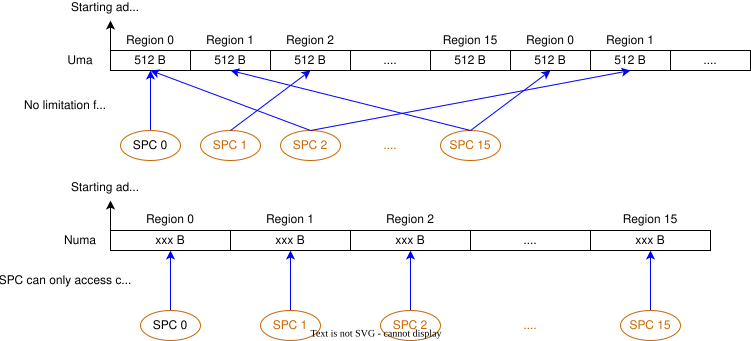</p><p align="center">图：Uma 和 Numa 存储类型在超大核函数中 SPC 可访问区域的区别</p>

- **形状**：张量的形状大小。张量分为静态张量和动态张量，主要区别在于静态张量的形状需要为模板参数（编译阶段可确定的值），而动态张量形状则在张量构造时通过实参传递（可以为运行时变量）。定义形状需要的维度需要由张量类型确定，例如上面所有的 `Vectors` 则需要两个维度的大小信息。

理解了上面定义后我们可以重新来解读上述 `tensor` 变量：数据类型为 `FP32`，张量类型为 `Vectors`，内存存储类型为 `Uma`，形状为 `[128, 8192]`，静态张量。

张量类型是 BIRENSUPA 内定义的不同的数据布局类型。`Vectors` 为其中较为简单的一种接近于线性布局的类型。`Vectors` 有两个维度：`NV`，`N`。其中 `NV` 的取值范围为 1 到 1024 的整型，`N` 取值范围为 1 到 8192 的整型。这里为了和之前向量加法使用的数据量保持一致，我们使用的形状为 `[128, 8192]`（`128 * 8192 = 2 ^ 20 ~= 1M`）。

BIRENSUPA 张量内部有两个指针分别指向主机内存和设备内存，张量内的数据都会根据数据类型、张量类型、形状等性质有一个特定排布规则。BIRENSUPA 张量中提供了便捷的函数以供执行不同数据排布的拷贝和主机端内存和设备端内存之间的拷贝，下图简明表示了四个常用的拷贝函数的用途：

<p align="center">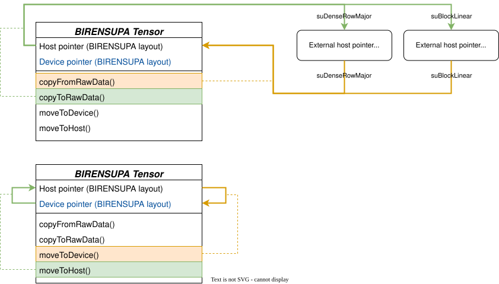</p><p align="center">图：张量常用内存操作成员函数行为</p>

- `copyFromRawData(suDenseRowMajor, ext_ptr)`：将数据从外部主机内存指针 `ext_ptr` 拷贝到张量内的主机内存。拷贝过程中会把 `ext_ptr` 中线性排布的数据转换为张量中的特殊排布方式。
- `copyToRawData(suDenseRowMajor, ext_ptr)`：将数据从张量内的主机内存拷贝到外部主机内存 `ext_ptr` 上。拷贝过程中会把张量中特殊排布规则的数据转换为线性排布存入 `ext_ptr`
- `copyFromRawData(suBlockLinear, ext_ptr)`：将数据从外部主机内存指针 `ext_ptr` 拷贝到张量内的主机内存。拷贝过程中会认为 `ext_ptr` 中数据排布规则与张量中的特殊排布方式一致，可以直接拷贝而无需做额外数据重排。
- `copyToRawData(suBlockLinear, ext_ptr)`：将数据从张量内的主机内存拷贝到外部主机内存 `ext_ptr` 上。拷贝过程中会认为 `ext_ptr` 中数据排布规则与张量中的特殊排布方式一致，可以直接拷贝而无需做额外数据重排。
- `moveToDevice()`：将张量中主机内存的中的数据拷贝到张量中的设备内存。
- `moveToHost()`：将张量中设备内存的中的数据拷贝到张量中的主机内存。

另外，从内存管理角度，张量有两种初始化模式：管理模式和非管理模式，两者主要区别在于用户是否需要自行管理内存的分配和释放。

- 管理模式：创建张量时**无需**传入主机和设备内存指针，构造函数和析构函数中会自动分配和释放主机内存和设备内存，内存大小由张量形状、排布规则和数据类型计算得到，您无需额外指定。

- 非管理模式：创建张量时**需要**传入主机和设备内存指针，您需自行管理内存的分配和释放，内存大小也需要您根据张量信息自行计算。使用的设备内存指针大小小于根据张量信息计算的内存大小会导致张量构造失败。主机内存大小需要和设备内存大小一致。

```cpp
// Managed mode
tensor::UmaVectors<FP32, 128, 8192> tensor1;

// Un-managed mode
FP32 *ptr_host = new FP32[128 * 8192];
FP32 *ptr_dev = nullptr;
suMallocDevice((void **)&ptr_dev, 128 * 8192 * sizeof(FP32));
tensor::UmaVectors<FP32, 128, 8192> tensor2(ptr_host, ptr_dev);

// ....

delete[] ptr_host;
suFree(ptr_dev);
```

上述代码中的 `tensor1` 和 `tensor2` 是数据类型、张量类型、内存存储类型和形状完全相同的张量，区别在于 `tensor1` 通过管理模式创建，用户无需自行分配和释放张量内的主机内存和设备内存；而 `tensor2` 使用的是非管理模式创建，用户需在构造函数中传入已经分配完毕的主机内存指针和设备内存指针，`tensor2` 在析构时也不会释放其中所使用的内存。

在进行简单的单元测试时，采用管理模式更为便捷；而在大规模框架系统中，由于设备内存通常需要由统一的内存管理系统进行管理，因为更适合采用非管理模式。

#### 线程束张量读取和存储

BIRENSUPA 编程模型提供了一系列线程束一致的张量编程原语接口。与传统的对每一线程编程的模式不同，此系列原语接口为面向线程束的编程，传入的非数据类的参数均需要为线程束一致的。例如在读取和存储数据时，传入的坐标为单个线程束中所有线程所操作的数据子块的起始坐标，而非每个线程的所对应的坐标。此类原语接口定义在 `tensor::wti` 命名空间下 （**W**arp **T**ensor **I**ntrinsics），使用此命名空间下的原语接口时需牢记此时的编程对象为一个线程束而非单个线程。

在 `tensor::wti` 命名空间下有一组张量数据读取和存储的接口，使用此类接口可以获得比单线程读取存储更好的性能。

| 张量类型        | 读取接口                    | 存储接口                     |
| --------------- | --------------------------- | ---------------------------- |
| `Vector(s)`     | `wti::__load_vector()`      | `wti::__store_vector()`      |
| `Matrix(3D)`    | `wti::__load_matrix()`      | `wti::__store_matrix()`      |
| `Activation`    | `wti::__load_activation()`  | `wti::__store_activation()`  |
| `ConvWeight(s)` | `wti::__load_conv_weight()` | `wti::__store_conv_weight()` |

这里因为我们使用的张量类型为 `Vectors`，对应的张量读取和存储接口为 `__load_vector()` 和 `__store_vector()`，从《BIRENSUPA™ API 参考》中可以找到接口描述：

```cpp
template <L2LoadControl::OptionalParameters L2LParam = L2LoadControl::NONE,
          typename E_SV, typename E, ushort SVN, suMemArchType MemType,
          ushort NV, ushort N>
__device__ void __load_vector(__short_vector<E_SV, SVN> *dst,
                              Vectors<E, MemType, NV, N> In, short nv,
                              short n);

template <PAD_WRITE_THROUGH WT = NOT_WRITE_THROUGH,
          L2StoreControl::OptionalParameters L2SParam = L2StoreControl::NONE,
          typename E, typename E_SV, ushort SVN, suMemArchType MemType,
          ushort NV, ushort N>
__device__ void __store_vector(Vectors<E, MemType, NV, N> Out, short nv,
                               short n, __short_vector<E_SV, SVN> src);
```

模板参数中 `L2LParam` 以及 `L2SParam` 为数据读取和存储时对 L2 缓存控制的选项，使用默认模式 `NONE` 时数据都会经过 L2 缓存，默认模式为实际中最为常见的使用模式，使用默认模式时该选项不需要额外配置。用户也可在进一步理解 L2 缓存模型后使用绕开 L2 缓存（`BYPASS`）的选项，或者提高缓存优先级（`PRIVILEGED`）的选项，错误使用这两个选项会造成数据错误或者性能大幅下降，请在仔细阅读《BIRENSUPA™ API 参考》中"L2 加载控制"以及“L2 存储控制”章节后谨慎使用！

模板参数中 `WT` 选项为控制此次写入是否同时写入张量缓冲区（Tensor Buffer）和外部内存（HBM 或 L2 缓存）。未配置张量缓冲区时，该选项不生效。若该张量配置过张量缓冲区，`NOT_WRITE_THROUGH` 为仅写入张量缓冲区，`WRITE_THROUGH` 为同时写入张量缓冲区和设备内存。这里由于未配置张量缓冲区所以无需配置此选项。张量缓冲区为 SPC 内部的高带宽存储区域，SPC 只可访问当前 SPC 内的张量缓存区而不能访问其他 SPC 的张量缓存区。具体配置和使用方式可参考《BIRENSUPA™ 张量库 API 参考》。

在读取和存储数据时，线程中的数据需要以 `__short_vector` 形式传入上述接口。`__short_vector` 为 BIRENSUPA 编程模型中的一种特殊数据类型，该数据类型为多个相同的基础数据类型变量的有序集合。`__short_vector` 变量需要提供两个模板参数以确定它的属性：基础数据类型和长度。

```cpp
__short_vector<FP32, 1> sv;
```

以上定义的变量 `sv` 数据类型为 `__short_vector<FP32, 1>`，其具体含义为“长度为 1 的 FP32 数据的有序集合”。以下表格为目前在 BIRENSUPA 编程模型中 `__short_vector` 支持的基础类型及其对应的长度。

| **数据类型**       | **别名**   | **长度**          |
| ------------------ | ---------- | ----------------- |
| char               | S8         | 1，2，3，4，8，16 |
| unsigned char      | U8         | 1，2，3，4，8，16 |
| short              | S16        | 1，2，3，4，8，16 |
| unsigned short     | U16/ushort | 1，2，3，4，8，16 |
| int                | -          | 1，2，3，4，8     |
| unsigned int       | uint       | 1，2，3，4，8     |
| long               | -          | 1，2，3，4        |
| unsigned long      | -          | 1，2，3，4        |
| long long          | longlong   | 1，2，3，4        |
| unsigned long long | ulonglong  | 1，2，3，4        |
| float              | FP32       | 1，2，3，4，8     |
| bfloat16           | BF16       | 2，4，8，16       |

需要注意的是，这里的 `long` 和 `long long` 类型均为 8 字节整型。

在使用线程束张量读取和存储接口时，除了上述数据类型+长度组合限制外，还需要注意使用的 `__short_vector` **总大小必须为 4 Byte，8 Byte 或者 16 Byte**。这里的总大小为单个基础数据类型的字节数乘以长度，例如 `__short_vector<FP32, 2>` 类型的总大小为 `4 * 2 = 8` Byte。在大多数情况下，`__short_vector` 的基础数据类型需要和对应张量的数据类型相同。

`nv` 和 `n` 两个参数分别为张量类型 `Vectors` 的两个维度 `NV` 和 `N` 所对应的坐标。这里需要注意的是，所有的线程束张量读取和存储所使用的最小数据粒度大小为 128 Byte（定义为一个数据子块），即分到每个线程为 4 Byte（32 threads \* 4 Byte/thread = 128 Byte），同时数据子块的起始地址也必须为 128 Byte 对齐。对应到此处的 `FP32` 类型的 `Vectors`，我们需要保证给定的坐标 `n` 为 32 的倍数（32 个 `FP32` 类型为 128 Byte），`nv` 则没有对齐要求。这里假设我们每个线程只读取和存储一个 `FP32` 值，数据读取，计算和存储部分可改为：

```cpp
__short_vector<FP32, 1> sv1, sv2, sv3;
tensor::wti::__load_vector(&sv1, input1, 0, 0);
tensor::wti::__load_vector(&sv2, input2, 0, 0);
sv3 = sv1 + sv2;
tensor::wti::__store_vector(output, 0, 0, sv3);
```

`__short_vector` 类型的变量在大多数情况下可以和相同类型的变量直接做如加减乘除和 `min/max` 以及 `exp` 等基础运算。上述代码描述了从张量 `input1` 和张量 `input2` 的位置 `[0, 0]` 点分别使用线程束张量原语接口加载数据到线程内变量 `sv1` 和 `sv2` 上，线程束内每个线程会得到以起始坐标固定偏移量的数据，每个线程对读取到的数据执行加法运算后，运算结果被存储到以 `[0, 0]` 为起点的张量 `output` 中。

<p align="center">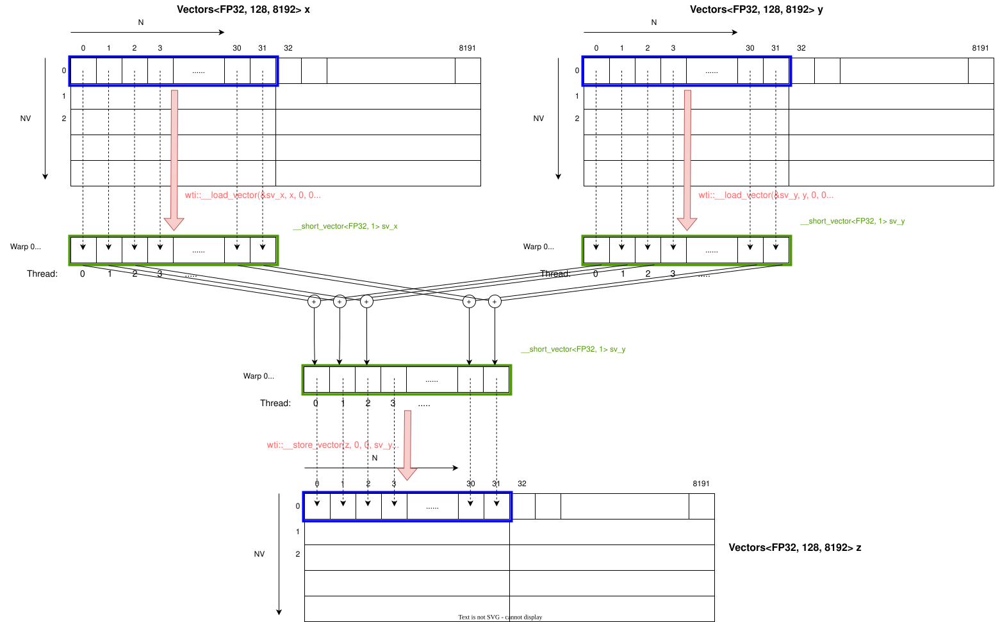</p><p align="center">图：使用线程束一致的加载存储接口进行向量加法</p>

在张量模式下启动超大核函数也与普通模式有所不同：超大核函数下单个线程块由一个 SPC 执行，单个 SPC 内有 4 个 CU，单个 CU 内有 4 个 EU，一个 EU 最多可执行 8 个线程束（warp），每个线程束内有 32 个线程。因此当单个 SPC 内所有 EU 都被使用且每个 EU 上只执行一个线程束时，一个 SPC 内线程数量为 `4 * 4 * 32 = 512`。张量模式下要求每个 SPC 内的每个 EU 上必须执行相同数量的线程束，因此在张量模式下启动超大核函数时，线程数数量需要为 512 的整数倍，最大为 4096 （512 \* 8）。默认模式下单 SPC 只能以 512 个线程的大小执行，如需使用更大的线程块大小，需要对超大核函数进行配置，具体请参见[更大的线程块](#更大的线程块)章节。

因为在张量模式下通常会以线程束为单位进行编程，BIRENSUPA 提供了以下几个内置变量：

- `warp_idx`: 当前线程束在当前 SPC 中的编号（从 0 开始）。
- `warp_count`: 单个 SPC 内包含的线程束总数。
- `warp_thread_idx`: 当前线程在当前线程束中的编号（0 - 31）。
- `warp_size`: 单个线程束中的线程数量。

结合在普通模式中提到的 `block_idx` 变量，我们可以将计算任务分配到不同的 SPC 内不同的线程束上。

```cpp
// vector_add_tmode.su

#include <supa.h>
#include <supa_tensor.h>

#include <chrono>
#include <iostream>

// T-mode Kernel function to add the FP32 elements of two Vector Tensor
template <ushort NV, ushort N>
__global_mega__ void vectorAdd(tensor::UmaVectors<FP32, NV, N> output,
                               tensor::UmaVectors<FP32, NV, N> input1,
                               tensor::UmaVectors<FP32, NV, N> input2) {
    int index = block_idx.x * warp_count * warp_size + warp_idx * warp_size;
    int stride = grid_dim.x * warp_count * warp_size;
    for (int i = index; i < NV * N; i += stride) {
        int nv = i / N;
        int n = i % N;

        __short_vector<FP32, 1> sv1, sv2, sv3;
        // Each thread will load 1 FP32 element by __load_vector() API
        tensor::wti::__load_vector(&sv1, input1, nv, n);
        tensor::wti::__load_vector(&sv2, input2, nv, n);

        sv3 = sv1 + sv2;

        // Each thread will store 1 FP32 element by __store_vector() API
        tensor::wti::__store_vector(output, nv, n, sv3);
    }
}

int main() {
    // 1M elements
    constexpr int NV = 128;
    constexpr int N = 8192;

    // Allocate host memory
    float *input1_host = new float[NV * N];
    float *input2_host = new float[NV * N];
    float *output_host = new float[NV * N];

    // Initialize x and y arrays on the host
    for (int i = 0; i < NV * N; i++) {
        input1_host[i] = 1.0f;
        input2_host[i] = 1.5f;
    }

    // Create Vector Tensors
    tensor::UmaVectors<FP32, NV, N> output;
    tensor::UmaVectors<FP32, NV, N> input1;
    tensor::UmaVectors<FP32, NV, N> input2;

    // Load data into Vector tensor and move to device
    input1.copyFromRawData(suDenseRowMajor, input1_host);
    input1.moveToDevice();
    input2.copyFromRawData(suDenseRowMajor, input2_host);
    input2.moveToDevice();

    // Launch kernel on 1M elements on the T-Mode
    int spcNum = 16;
    int threadNum = 512;

    // Warm up
    suLaunchKernel(vectorAdd, spcNum, threadNum, 0, NULL, output, input1,
                   input2);
    suDeviceSynchronize();

    // Get starting time
    auto t0 = std::chrono::high_resolution_clock::now();
    suLaunchKernel(vectorAdd, spcNum, threadNum, 0, NULL, output, input1,
                   input2);
    suDeviceSynchronize();
    // Get ending time
    auto t1 = std::chrono::high_resolution_clock::now();
    // Calculate time consumed
    auto time_used_us = (t1 - t0) / std::chrono::microseconds(1);
    std::cout << "Time used: " << time_used_us << " us.\n";

    // Load result from host
    output.moveToHost();

    // Move data from Tensor to a dense row major layout pointer
    output.copyToRawData(suDenseRowMajor, output_host);

    // Error Check (all values should be 2.5f)
    float maxError = 0.0f;
    for (int i = 0; i < NV * N; ++i) {
        maxError = fmax(maxError, fabs(output_host[i] - 2.5));
    }
    std::cout << "Max error: " << maxError << std::endl;

    // Free memory
    delete[] input1_host;
    delete[] input2_host;
    delete[] output_host;

    return 0;
}

```

编译运行上述代码：

```bash
$ brcc vector_add_tmode.su -o vector_add_tmode
$ ./vector_add_tmode
Time used: 63 us.
Max error: 0
```

可以看到这次运行时间下降到了 63 us，相比之前的普通模式性能又提升了六倍！这里的提升主要来源于我们使用了线程束张量数据读取和存储接口而获得的更高带宽。在核函数编写过程中，性能瓶颈通常是在数据传输上（从内存加载到寄存器和从寄存器存储到内存），使用更高带宽的数据搬运接口及数据搬运模式往往是提高核函数性能的有效途径。

#### 更大的线程块

上文提到在张量模式下单个 SPC 可使用的最大线程数量为 4096 个，默认模式下只可使用 512 个。我们只需简单的两步即可配置使用更多的线程数（512 的 1 倍到 8 倍）：

1. 在定义超大核函数时，为超大核函数加上标识符 `__launch_bounds__(THREAD_NUM)`。例如若是希望单个 SPC 启动的线程数量为 4096 时（即每个 EU 上运行最多的 8 个线程束），我们可以这样定义超大核函数：

```cpp
template <ushort NV, ushort N>
__global_mega__
__launch_bounds__(4096) void vectorAdd(tensor::UmaVectors<FP32, NV, N> output,
                                       tensor::UmaVectors<FP32, NV, N> input1,
                                       tensor::UmaVectors<FP32, NV, N> input2) {
    // ....
}
```

注意此处 `__launch_bounds__()` 内填的线程数必须为编译阶段可确定的静态参数，如立即数，模板参数或 `constexpr` 等参数。

2. 在启动超大核函数时，将线程块大小由 512 改到 4096。

```cpp
int spcNum = 16;
int threadNum = 4096; // <-- int threadNum = 512;

suLaunchKernel(vectorAdd, spcNum, threadNum, 0, NULL, output, input1, input2);
```

将上述两点改动后重新编译并运行：

```bash
$ brcc vector_add_tmode.su -o vector_add_tmode
$ ./vector_add_tmode
Time used: 38 us.
Max error: 0
```

从运行时间上可以看出，改动后运行时间又减少了超过 1 / 3 ！这里性能提升的原因是，由于数据计算需要依赖于数据加载的完成，而数据加载往往比较耗时，因此当单个 EU 上只运行了一个线程束时，在数据加载期间，硬件只能等待数据加载完成，无法同时执行计算任务。而当单个 EU 上有多于一个线程束运行时，当其中某一线程束处于等待状态时，硬件会自动切换到可执行的其他线程束继续运行，因此在经典的“数据加载 + 运算 + 数据存储”模式的超大核函数中，增加单个 EU 上运行的线程束可以减少硬件运行过程中的等待时间，从而对超大核函数性能的提升起到显著的作用。

在启动超过 512 线程的超大核函数时，内置变量的取值会发生相应变化，例如当为每个 SPC 启动 4096 线程数时：

- `warp_idx`: 取值范围由 512 线程时的 0 ~ 15 变为 0 ~ 127。
- `warp_count`: 由 512 线程时的值 16 （512 / 32）变为 128 （4096 / 32）。
- `thread_idx.x`: 取值范围由 512 线程时的 0 ~ 511 变为 0 ~ 4095。
- `block_dim.x`: 由 512 线程时的值 512 变为 4096。

另外需要注意的是，对于线程束与其实际运行的硬件 EU 之间存在着固定的映射关系，我们在后期使用共享内存或者同步等功能时会用到这一映射关系。

<p align="center">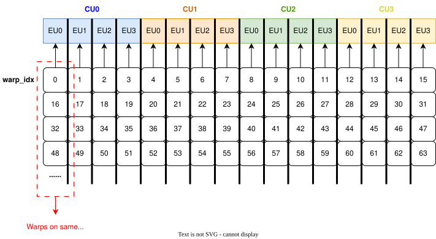</p><p align="center">图：张量模式下线程束与其所使用的硬件模块对应关系</p>

<div style="page-break-after:always"></div>

### 流和事件（Stream & Event）

BIRENSUPA 编程模型使用“流”（stream）来管理各个操作的执行顺序，例如核函数执行、数据拷贝、同步等。一个“流”表示一个执行队列，“流”上的操作按照被加入流的顺序依次执行。为了获得更好的性能，我们有时会使用异步的数据拷贝等操作，这时就需要使用“流”来管理各个异步操作执行的先后顺序。“事件”（Event）可作为节点被添加到“流”上不同的操作之间。事件最常见的使用方式有两种：一是通过计算两个事件之间的时间差来测量事件之间操作的实际执行时间（如核函数运行时间，数据拷贝时间等）；二是用来在两个异步操作之间插入和主机端的同步。

```cpp
// Create stream
suStream_t stream0;
suStreamCreate(&stream0);

// Create event
suEvent_t event0, event1;
suEventCreate(&event0);
suEventCreate(&event1);

// ....

// Destroy event
suEventDestroy(event0);
suEventDestroy(event1);

// Destroy stream
suStreamDestroy(stream0);
```

“流”和“事件”的创建和销毁方式比较类似，都是需要先声明相关变量，然后执行相应的 `suXXXCreate()` 和 `suXXXDestroy()` 函数进行创建和销毁。在创建“流”和“事件”之后，可以使用 `suEventRecord()` 函数将事件添加到某一流上：

```cpp
suEventRecord(event0, stream0);
```

另外，BIRENSUPA 编程模型中每个设备存在一个默认流可供使用，默认流不需要被创建和销毁，为需要传入“流”的函数参数传入 `NULL` 代表这个函数使用默认流。一些同步的运行时函数如 `suMemcpy()` 和 `suMemset()` 均会使用默认流，我们可以认为此类函数为在默认流上执行完成后再与主机端同步。接下来我们可以将“流”和“事件”这两个要素加入之前的张量模式的主机端代码（普通模式使用方式基本相同）。

```cpp
int main() {
    // 1M elements
    constexpr int NV = 128;
    constexpr int N = 8192;

    // Allocate host memory
    float *input1_host = new float[NV * N];
    float *input2_host = new float[NV * N];
    float *output_host = new float[NV * N];

    // Initialize x and y arrays on the host
    for (int i = 0; i < NV * N; i++) {
        input1[i] = 1.0f;
        input2[i] = 1.5f;
    }

    // Create Vector Tensors
    tensor::UmaVectors<FP32, NV, N> output;
    tensor::UmaVectors<FP32, NV, N> input1;
    tensor::UmaVectors<FP32, NV, N> input2;

    // Load data into Vector tensor and move to device
    input1.copyFromRawData(suDenseRowMajor, input1_host);
    input1.moveToDevice();
    input2.copyFromRawData(suDenseRowMajor, input2_host);
    input2.moveToDevice();

    // Create stream
    suStream_t stream0;
    suStreamCreate(&stream0);

    // Create event
    suEvent_t event0, event1;
    suEventCreate(&event0);
    suEventCreate(&event1);

    // Launch kernel on 1M elements on the T-Mode
    int spcNum = 16;
    int threadNum = 512;

    // Warm up
    suLaunchKernel(vectorAdd, spcNum, threadNum, 0, stream0, output, input1,
                   input2);
    suDeviceSynchronize();

    // Get starting time
    suEventRecord(event0, stream0);
    suLaunchKernel(vectorAdd, spcNum, threadNum, 0, stream0, output, input1,
                   input2);
    // Get ending time
    suEventRecord(event1, stream0);
    suEventSynchronize(event1);
    // Calculate time consumed
    float time_used_ms = 0;
    suEventElapsedTime(&time_used_ms, event0, event1);

    std::cout << "Time used: " << time_used_ms * 1000 << " us.\n";

    // Load result from host
    output.moveToHost();

    // Move data from Tensor to a dense row major layout pointer
    output.copyToRawData(suDenseRowMajor, output_host);

    // Error Check (all values should be 2.5f)
    float maxError = 0.0f;
    for (int i = 0; i < NV * N; ++i) {
        maxError = fmax(maxError, fabs(output_host[i] - 2.5));
    }
    std::cout << "Max error: " << maxError << std::endl;

    // Destroy event
    suEventDestroy(event0);
    suEventDestroy(event1);

    // Destroy stream
    suStreamDestroy(stream0);

    // Free memory
    delete[] input1_host;
    delete[] input2_host;
    delete[] output_host;

    return 0;
}
```

上述代码中，除了“流”和“事件”的创建销毁外，在启动核函数时使用的“流”也被替换为了 `stream0`，我们在第二次核函数启动前后分别记录了一个“事件”，然后再使用 `suEventElapsedTime()` 计算两个事件之间的所用时间。为了保证在计算时间之前两个事件均已被记录，在第二次的事件记录和计算时间之间需要插入 `suEventSynchronize(event1)`。

```bash
$ brcc vector_add_tmode.su -o vector_add_tmode
$ ./vector_add_tmode
Time used: 40.32 us.
Max error: 0
```

可以看到使用事件记录到的时间和使用 C++ 的 `chrono` 库记录到的时间大致相同，使用事件记录时间的优势是可以在记录多个异步操作时间时，只需在最后计算时间时同步而无需在每次记录时候同步，这对记录大量核函数运行时间以及内存拷贝时间时尤其重要。

至此我们已经了解到了 BIRENSUPA 编程模型中的基础概念和要素，下面我们将继续探索更多的进阶功能。

<div style="page-break-after:always"></div>

## ReLU

`ReLU` 为深度学习网络中常见的激活函数。`ReLU` 函数的公式为：

$$
ReLU(x) = max(x, 0);
$$

即：当输入值大于等于 0 时输出值等于输入值，当输入值小于 0 时则输出值为 0。

在对一个张量进行 `ReLU` 运算时只需逐元素应用上述公式即可，因此 `ReLU` 算子实现在实现上较为容易，我们在此将之作为示例继续学习张量模式。

### 张量：`Activation`

这里我们使用 `Activation` 类型张量进行 `ReLU` 运算。与 `Vectors` 类型相似，`Activation` 类型同样为 BIRENSUPA 提供的一种具有特殊数据排布规则的张量类型，可以在超大核函数内使用线程束张量读取和存储接口。而与 `Vectors` 类型不同的是，`Activation` 类型为四维张量，多用于卷积运算的输入和输出。`Activation` 的四个维度（分别定义为 N、C、H、W）大小同样有限制：$1 \le N \le 1024$，$1 \le C/H/W \le 8192$，即第一个维度需不超过 1024，后续三个维度不超过 8192。具体 Activation 张量的数据排布规则可参考《BIRENSUPA™ 编程指南》。

```cpp
// Tensor mode Kernel function to do RELU. Data type is FP32
// Burst 1 load/store mode not called.
__global_mega__ void
relu(NumaActivation<FP32, kBatch, kChannel, kHeight, kWidth> tensor_out,
     NumaActivation<FP32, kBatch, kChannel, kHeight, kWidth> tensor_in) {
    for (int n = 0; n < kBatch; n++) {
        // Load data, each warp will load 1 * 4 * 8 (kChannel * kHeight *
        // kWidth) sub-block data elements
        for (int c = warp_idx; c < kChannel; c += warp_count) {
            for (int w = 0; w < kWidth; w += 8) {
                for (int h = 0; h < kHeight; h += 4) {
                    __short_vector<FP32, 1> in, out;
                    // Load data into register from global memory
                    wti::__load_activation(&in, tensor_in,
                                           Coordinate(n, c, h, w));
                    // Relu data elements
                    out = relu(in);
                    // Store calculated data into global memory from register
                    wti::__store_activation(tensor_out, Coordinate(n, c, h, w),
                                            out);
                }
            }
        }
    }
}
```

可以看到整个超大核函数的代码结构与之前的向量加法比较类似：先对所有维度进行循环，在所有循环内先使用 `wti::__load_activation()` 函数将数据从输入张量 `tensor_in` 加载到 `__short_vector` 类型局部变量 `in` 中，然后数据在经过 `relu` 运算存入变量 `out` 后再由 `wti::__store_activation()` 函数将运算完的的数据存储到输出张量 `tensor_out` 上。

这里我们可以关注 `c`，`w`，`h` 这三个 `for` 循环。这三个循环的起始值和变量递增值反映了每个线程束加载和存储的数据子块形状：

<p align="center">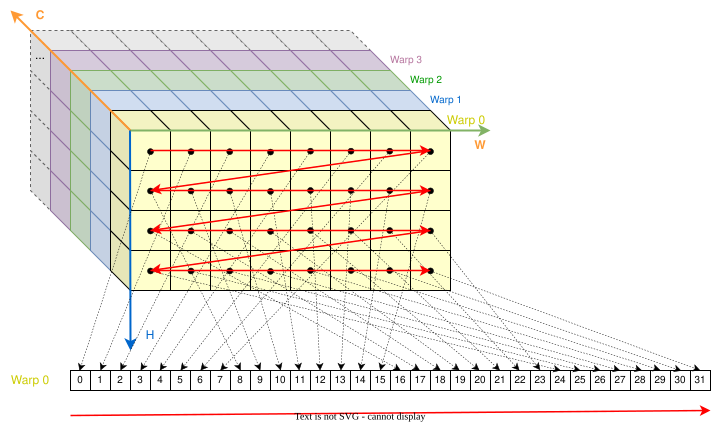</p><p align="center">图：对 Activation 使用线程束一致的加载存储操作时线程与坐标对应关系（Burst 1）</p>

这里变量 `c` 初始值为 `warp_idx` 每次递进 `warp_count`；变量 `h` 的初始值为 0，每次递进 4；变量 `w` 的初始值为 0，每次递进为 8。因此我们可以知道每个线程束每次加载的数据子块大小为 $1\times4\times8$（对应 $C \times H \times W$）。线程束内每个线程有固定的相对该线程束加载坐标的偏移，如上上图所示。

```cpp
wti::__load_activation(&sv, tensor_in, Coordinate(n, c, h, w));
// The thread "i" in the warp will get data at [n, c, h + i / 8, w + i % 8].
```

在对整个张量完成循环后，针对 `FP32` 的 `Activation` 类型的 `ReLU` 算子就完成了。

### Burst Mode

在快速开始章节中我们提到过单次的线程束张量加载和存储接口可支持的每个线程所对应的数据量为 4 Byte、8 Byte 和 16 Byte。在 BIRENSUPA 编程模型中，我们将这三种加载和存储粒度分别定义为 `burst 1`、`burst 2`、`burst 4`，实际含义上可理解为一次加载和存储分别使用的寄存器个数为 1 个、2 个和 4 个（一个寄存器大小为 4 Byte）。

在上文中，我们使用 `__short_vector<FP32, 1>` 作为一次加载和存储张量的数据类型，因为 $sizeof(FP32) \times 1 = 4 Byte$，这里对应为 `burst 1`。我们可以尝试使用 `burst 2` 或是 `burst 4` 模式。使用 burst 模式不会减少实际加载和存储的总数据量，但是可以大量减少加载和存储对应的指令数量，有助于提高实际运行时的执行效率。

不同张量类型对应的 burst 模式所加载和存储的数据形状均有所不同，FP32 的 Activation 对应的 burst 2 和 burst 4 所使用到的数据形状如下图所示：

<p align="center">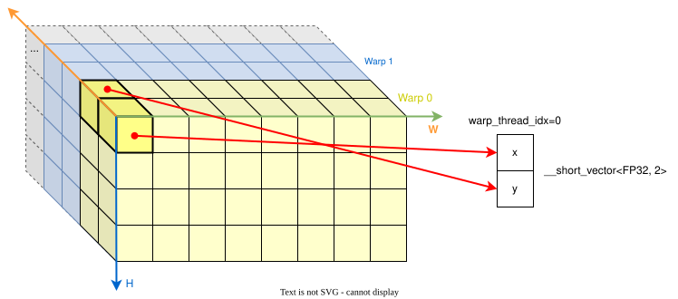</p><p align="center">图：对 Activation 使用线程束一致的加载存储操作时线程中的数据与坐标对应关系（Burst 2）</p>

<p align="center">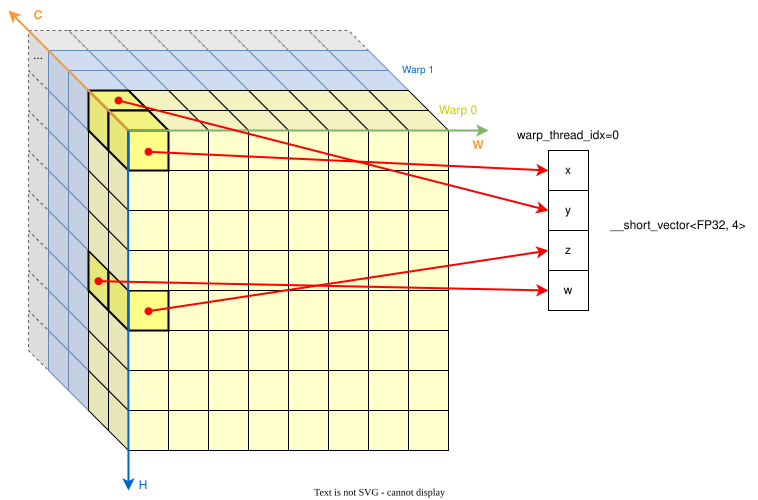</p><p align="center">图：对 Activation 使用线程束一致的加载存储操作时线程中的数据与坐标对应关系（Burst 4）</p>

在 Burst 2 模式下，单个线程束对应的数据形状为 $2\times4\times8$；Burst 4 模式下单个线程束对应的数据形状为 $2\times8\times8$。对于从坐标`[n, c, h, w]` 点开始加载或存储的数据，每个线程束内的线程对应的坐标位置为：

```cpp
__short_vector<FP32, 2> sv_burst2;
wti::__load_activation(&sv_burst2, tensor_in, Coordinate(n, c, h, w));
// The thread "i" in the warp will get data sv_burst2.x at [n, c, h + i / 8, w + i % 8]
// The thread "i" in the warp will get data sv_burst2.y at [n, c + 1, h + i / 8, w + i % 8]

__short_vector<FP32, 4> sv_burst4;
wti::__load_activation(&sv_burst4, tensor_in, Coordinate(n, c, h, w));
// The thread "i" in the warp will get data sv_burst4.x at [n, c, h + i / 8, w + i % 8]
// The thread "i" in the warp will get data sv_burst4.y at [n, c + 1, h + i / 8, w + i % 8]
// The thread "i" in the warp will get data sv_burst4.z at [n, c, h + i / 8 + 4, w + i % 8]
// The thread "i" in the warp will get data sv_burst4.w at [n, c + 1, h + i / 8 + 4, w + i % 8]
```

因为 ReLU 运算本身对每个元素在原始张量的位置不敏感，因此我们在对 ReLU 算子使用 Burst 2/4 时，只需要改变用于存储加载到数据的 `__short_vector` 长度，以及外部 c 和 h 的循环上的递增量即可。

```cpp
// Tensor mode Kernel function to do ReLU, dtype as FP32
// Burst 4 mode load/store to improve performance
__global_mega__ void
relu(NumaActivation<FP32, kBatch, kChannel, kHeight, kWeight> tensor_out,
     NumaActivation<FP32, kBatch, kChannel, kHeight, kWeight> tensor_in) {
    for (int n = 0; n < kBatch; n++) {
        // Using Burst 4 to load data, each warp will load 2 * 8 * 8 data,
        // 16 warps will load 32 * 8 * 8 each step
        for (int c = warp_idx * 2 /* channel start with 2 times */;
             c < kChannel;
             c += warp_count * 2 /* channel step with 2 times */) {
            for (int w = 0; w < kWeight; w += 8) {
                for (int h = 0; h < kHeight;
                     h += 4 * 2 /* kHeight step with 2 times */) {
                    // One thread hold 4 floats
                    __short_vector<FP32, 4> in, out;

                    wti::__load_activation(&in, tensor_in,
                                           Coordinate(n, c, h, w));
                    out = relu(in);
                    wti::__store_activation(tensor_out, Coordinate(n, c, h, w),
                                            out);
                }
            }
        }
    }
}
```

<div style="page-break-after:always"></div>

## Softmax

`Softmax` 是深度学习中常用的用于对某一维度进行归一化运算的算子。常用于分类模型中的最后一层对不同类别的模型输出值归一化到和为 1 的 0 ~ 1 之间的“概率值”，或是用于现在流行的 “Transformer” 模块中。`Softmax` 的公式如下：

$$
Softmax(x) = \frac{e^{x_{ij}}}{\sum\limits_{j}\left(e^{x_{ij}}\right)}
$$

公式中假设 $x_{ij}$ 是第 $i$ 行，第 $j$ 列的元素，且 `Softmax` 是沿“行”方向运算的。在具体实现中，为了防止 $e^{x_{ij}}$ 溢出，通常会为每个输入值先减去沿着 `Softmax` 方向的最大值再进行后续运算，公式可变为：

$$
Softmax(x) = \frac{e^{x_{ij} - \mathop{max}\limits_{j}(x_{ij})}}{\sum\limits_{j}\left(e^{x_{ij} - \mathop{max}\limits_{j}(x_{ij})}\right)}
$$

这里我们假设输入输出的数据再张量类型 `Matrix3D` 上。下面我们会实现 FP32 以及 BF16 两个版本的实现。

### 张量：`Matrix3D`

`Matrix3D` 张量类型同样和 `Activation` 一样，为 BIRENSUPA 编程模型中定义的具有特殊数据排布规则的张量类型。`Matrix3D` 为三维张量，三个维度通常用字母 `N`、`H`、`W` 表示，这三个维度同样有大小限制：$1 \le N \le 1024$，$1 \le H \le 8192$，$1 \le W \le 8192$。

`Matrix3D` 类型还有一个额外的数据排布参数：

```cpp
/// \brief Tensor Matrix Layout
enum MatrixLayout {
    BLOCK_ROW_MAJOR = 0, ///< Block level row major
    BLOCK_COL_MAJOR = 1, ///< Block level col major
};

// ...

NumaMatrix3D<FP32, BLOCK_COL_MAJOR, 1, 128, 128> tensor;
```

此参数为模板参数，用于指定 Matrix3D 张量内部的数据块是按照“行优先”排列还是"列优先"排列。不同的排列规则会影响到使用 Burst 模式下取到的数据的坐标。以下代码示例以“列优先”（`BLOCK_COL_MAJOR`）为例。

### 归约缓冲区（GEMM Reduction Buffer - GRB）

归约缓冲区为 BIRENSUPA 编程模型中特别的用于进行一个线程束内所有线程数据的 **_求和或是平方和_** 的区域。这里我们只需用到求和即可。归约缓冲区内的数据不能被直接读取和写入，需要通过特定的接口对归约缓冲区内的数据进行读取和修改。以下介绍的两个和归约缓冲区相关的接口会在 Softmax 算子内被用到，所有归约缓冲区相关的的接口都为线程束一致的行为，因此都在命名空间 `wti` 下。

- `wti::__warp_reduce()`

```cpp
template <typename E, wti::REDUCE_MODE M, ushort C, ushort SVN>
__DEVICE_FUNCTIONS_DECL__ void
__warp_reduce(wti::__reduce_buf<C, M> *buf, ushort start_channel,
              __short_vector<E, SVN> v,
              ushort target_warp_idx = warp_idx);

template <typename E, REDUCE_MODE M, ushort SVN>
__DEVICE_FUNCTIONS_DECL__ void
__warp_reduce(__reduce_buf<SVN, M> *buf, __short_vector<E, SVN> v,
              ushort target_warp_idx = warp_idx);
```

`__warp_reduce()` 接口是将寄存器（核函数内局部变量）的数据归约到归约缓冲区的接口。同一线程内的 `__short_vector` 中不同位置的值不会做归约，同一线程束内不同线程的同一 `__short_vector` 位置会归约为一个计算结果后累加到归约缓冲区。

<p align="center">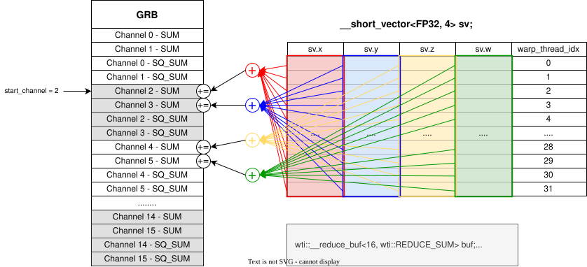</p><p align="center">图：将线程本地寄存器（TLR）中数据归约到 GRB</p>

如上图中左半部分所示，归约缓冲区空间会按照两个 “channel” 为一组进行存放，这里的一个 “channel” 表示了一组累加结果，归约缓冲区中始终会为“和”以及“平方和” 预留存放累加结果的空间。两个 “channel” 为一组分别对应的“和”以及“平方和”共计四个数共同组成了所有归约缓冲区操作的最小粒度，在此定义为一个 “slot”。

上图展示的是将一个线程束中所有线程的 `__short_vector<FP32, 4>` 类型使用 `wti::REDUCE_SUM` 模式将数据归约到归约缓冲区内，归约的 channel 为 2。一个线程束内的 32 个线程的 `sv.x` 会被累加到一起，然再累加到归约缓冲区中 “channel 2” 用于存放“和”的位置。`sv.y`，`sv.z` 和 `sv.w` 会经过类似操作被累加到 “channel 3”，“channel 4” 和 “channel 5” 对应的存放“和”位置的区域。

此接口在使用时有以下限制：

1. 被用于做归约的 `__short_vector` 类型对应的基本类型只可以为 `FP32` 或 `BF16`。
2. 被用于做归约的 `__short_vector` 类型对应的长度必须为 2 的倍数。
3. `start_channel` 必须为 2 的倍数。
4. 定义的 `wti::__reduce_buf` 最大 “channel” 数不能超过 32 个。

限制 2 和 3 主要来源于上面描述的归约缓冲区的最小操作粒度为由两个 “channel” 组成的 “slot”。

- `wti::__get_reduce_buf_broadcast()`

```cpp
template <ushort SVN, ushort C, REDUCE_MODE M>
__DEVICE_FUNCTIONS_DECL__ void
__get_reduce_buf_broadcast(__short_vector<FP32, SVN> *sv,
                           const __reduce_buf<C, M> &buf, ushort start_channel,
                           ushort target_warp_idx = warp_idx);
```

`__get_reduce_buf_broadcast()` 接口用于从归约缓冲区读取 **一个 “slot”** 的数据并将取出的数据广播给当前线程束中所有线程，用于接收数据的 `__short_vector` 变量必须为 `FP32`。因此，如果归约模式为 `wti::REDUCE_SUM` 或是 `wti::REDUCE_SQ` 时，因为需接收的数据仅为一个 “slot” 中的“和”或者“平方和”，共计两个数，`SVN` 值也应为 2。如果归约模式为 `wti::REDUCE_SSQ`，该模式表示归约时会同时求“和”与“平方和”两个运算，因此在获取一个 “slot” 数据时需用到两个 “channel” 的“和”与“平方和”共计四个数，`SVN` 值应为 4。

<p align="center">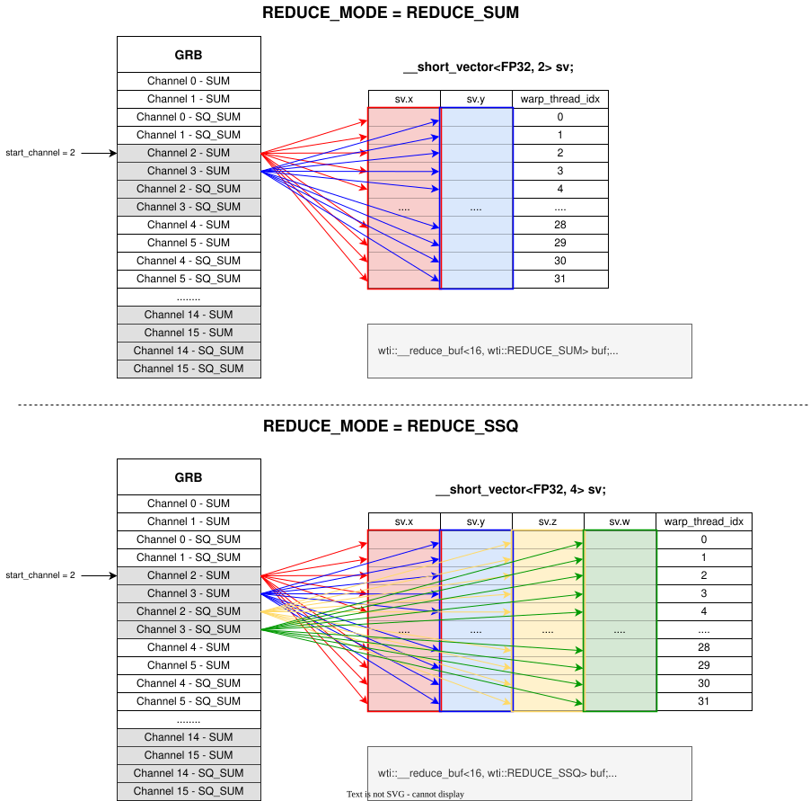</p><p align="center">图：从 GRB 加载数据并广播到线程束内所有线程本地寄存器</p>

### FP32 版本实现

从算法逻辑上，结合公式，我们大致可以梳理出实现 Softmax 所需要的步骤：

1. 对每一行的数 $x_{i}$ 遍历，找到最大值 $x_{max}$。
2. 重新对该行数据遍历，求出这一行 $e^{x_{i} - x_{max}}$ 的和 $x_{sum}$。
3. 再此遍历该行数据，对每个数 $x_{i}$ 计算最终结果 $\frac{e^{x_{i} - x_{max}}}{x_{sum}}$。

可以看到整个过程需要对每一行的数据进行三次遍历，我们可以先写出 `FP32` 版本的实现的基本框架：

```cpp
constexpr int kBatchSize = 2; // Batch number per region, support[1, 1024]
constexpr int kInH = 512;     // Tensor data height size, support[1, 8192]
constexpr int kInW = 512;     // Tensor data width size, support[1, 8192]

__global_mega__ void
softmax(NumaMatrix3D<FP32, BLOCK_COL_MAJOR, kBatchSize, kInH, kInW> output,
        NumaMatrix3D<FP32, BLOCK_COL_MAJOR, kBatchSize, kInH, kInW> input) {
    for (int n = 0; n < kBatchSize; n++) {
        for (int h = 0; h < kInH; h += warp_count * 2) {
            // Get max value x_max of a row
            for (int w = 0; w < kInW; w += warp_size) {
                // ....
            }

            // Calculate sum of exp(x - x_max) along W dimension
            for (int w = 0; w < kInW; w += warp_size) {
                // ....
            }

            // Load data again and calculate final result
            for (int w = 0; w < kInW; w += warp_size) {
                // ....
            }
        }
    }
}
```

这里的输入和输出张量采用的是 `NumaMatrix3D<FP32, BLOCK_COL_MAJOR, kBatchSize, kInH, kInW>`。使用 `Numa` 类型内存存储时，超大核函数内每个 SPC 只能访问对应的内存区域的数据，无法访问其他 SPC 对应的内存区域，且描述的张量形状为每个内存区域的形状。因此在做任务切分时，我们需要让每个 SPC 都去完成自己对应的内存区域中 `[kBatchSize x kInH x kInW]` 大小的计算任务。

这里我们打算采用 FP32 的 Burst 2 来加载和存储数据。根据《BIRENSUPA™ API 参考》，我们可以知道使用 Burst 2 在 `BLOCK_COL_MAJOR` 的 `Matrix3D` 张量上加载 FP32 类型的数据，每个线程束会得到连续的 `2 x 32` （`H x W`）的数据。因为我们需要对每一行求最大值以及求和，使用一个线程束遍历完整的一行更有利于数据交换，因此任务划分模式如下图所示：

<p align="center">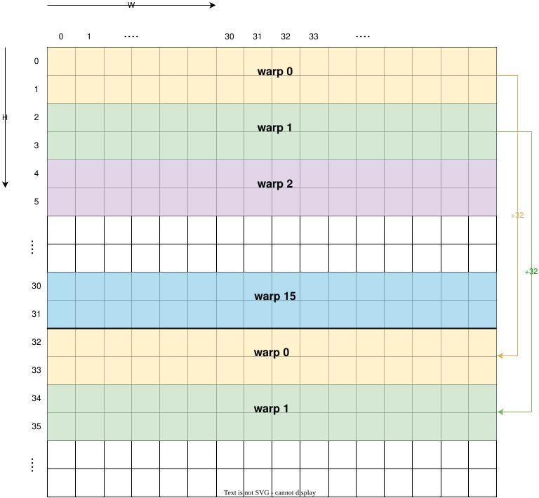</p><p align="center">图：Softmax 实现中对于不同线程束的任务分配</p>

这里我们让每个线程束在一次 `H` 方向循环内计算两行的数据，如果启动超大核函数时每个 SPC 使用 512 个线程，那么每个 SPC 有 `512 / 32 = 16` 个线程束，`warp_count` 值为 16，H 方向循环每次递增量为 `warp_count * 2 = 32`。在 `W` 方向的循环上，每次循环递增的大小为 `warp_size`（32），线程束中每个线程在一次 W 方向循环上会得到同一列上的上下两行连续两个数。

<p align="center">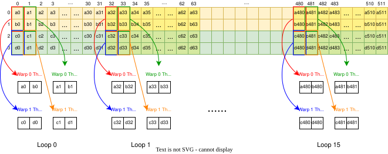</p><p align="center">图：Softmax 在 W 方向循环时，线程束中每个线程所遍历的数据</p>

从上图可以看出，在一个线程束使用 `__load_matrix()` 函数对完整的一行进行循环后，线程束中的线程 0 会得到第 0、32、64 ... 480 列的数据，线程 1 会得到第 1、33、65 ... 481 列的数据，线程 i 会得到第 i + 32k 列的数据（k 为自然数）。因此对于上述步骤 1 和步骤 2 提到的对完整一行求最大值和求和的运算，我们需要在每个线程束完整遍历一行后再对线程束中所有线程去最大值或求和，加入加载、存储和线程内计算操作后，内层循环如下所示：

```cpp
// Get max value "sv_max" of a row
__short_vector<FP32, 2> sv_max(-INFINITY);
for (int w = 0; w < kInW; w += warp_size) {
    __short_vector<FP32, 2> sv;
    wti::__load_matrix(&sv, input,
                       Coordinate3D(n, h + warp_idx * 2, w));
    // max inside thread
    if (w + warp_thread_idx < kInW) {
        sv_max = max(sv_max, sv);
    }
}
// Get max value of "sv_max" inside each warp
// ...

// Calculate sum of "exp(sv - sv_max)" along W dimension
__short_vector<FP32, 2> sv_exp_sum(0.0f);
for (int w = 0; w < kInW; w += warp_size) {
    __short_vector<FP32, 2> sv;

    // Use WTI Burst 2 API to load data into TLR
    wti::__load_matrix(&sv, input,
                       Coordinate3D(n, h + warp_idx * 2, w));

    // Calculate exp(sv)
    __short_vector<FP32, 2> sv_exp(0.0f);
    if (w + warp_thread_idx < kInW) {
        sv_exp = exp(sv - sv_max);
    }
    sv_exp_sum += sv_exp;
}
// Get sum of "sv_exp_sum" inside each warp
// ...

// Load data again and calculate final result
for (int w = 0; w < kInW; w += warp_size) {
    __short_vector<FP32, 2> sv;

    // Use WTI Burst 2 API to load data into TLR
    wti::__load_matrix(&sv, input,
                       Coordinate3D(n, h + warp_idx * 2, w));

    // Calculate the result
    __short_vector<FP32, 2> out_sv = exp(sv - sv_max) / sv_exp_sum;

    // Store the result
    wti::__store_matrix(
        output, Coordinate3D(n, h + warp_idx * 2, w), out_sv);
}
```

这里需要注意的是，使用线程束张量加载和存储接口时，我们无需担心因为加载或存储的数据超出形状边界而导致访问非法内存，对于超出定义的形状边界的加载和存储操作， BIRENSUPA 编程模型会根据不同的情况做出特殊的处理方式。

> 【定义】部分越界和完全越界：在线程束张量加载和存储中，如果使用的数据所在的数据子块（128B 对齐的数据）有一部分在界内，一部分在界外时，我们将这种情况定义为部分越界；如果使用的数据所在的数据子块全部在界外，则为完全越界。

<p align="center">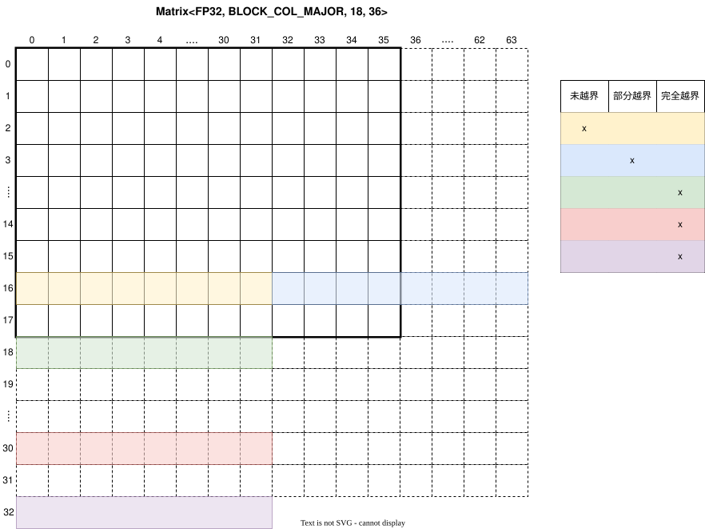</p><p align="center">图：对于 18 x 36 的 FP32，BLOCK_COL_MAJOR 的 Matrix 中不同数据子块所对应的越界情况</p>

- 加载：
  - 加载**部分越界**的数据子块时，对于其中每个数据点，无论其是否越界，均会加载到实际内存中的数据
  - 加载**完全越界**的数据子块时，无论对应的实际内存（若存在）中的数据为多少，加载到的数据均为 0。

<p align="center">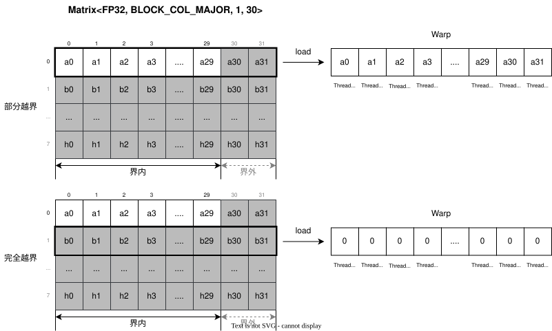</p><p align="center">图：部分越界或完全越界时线程加载到的数据与对应内存之间的关系</p>

- 存储：
  - 存储**部分越界**的数据子块时，对于其中每个数据点，若该点在界内，则按照原值存入，若该点在界外，则会将该点**改为 0 之后**存入。
  - 存储**完全越界**的数据子块时，无论对应的实际内存是否存在，存储的数据都会被丢弃而不会做存储操作。

<p align="center">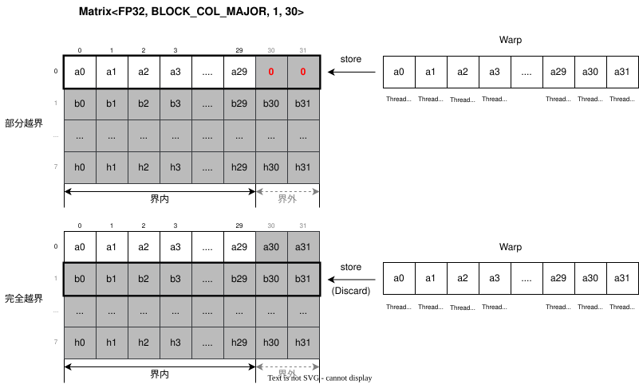</p><p align="center">图：部分越界或完全越界时线程中数据与存储到内存后的数据对应关系</p>

由上述行为我们可以发现，在加载数据时如果遇到部分越界的情况，加载得到的数据可能为在内存中实际在界外的脏数据，因此在遍历“行”方向寻找最大值以及求 $e^{x - x_{max}}$ 的和时，需要使用 `if` 条件判断当前点是否在界内，以避免脏数据影响最终结果。

接下来我们就需要一个求线程束中所有线程最大值的函数，和一个求线程束内所有数之和的函数，即可完成一个完整的 FP32 类型的 Softmax 超大核函数。

BIRENSUPA 编程模型中提供一系列线程束内不同线程间的数据交换函数，这里我们使用一个具有特定功能的函数 `__shfl_xor_sync()`：

```cpp
__device__ T __shfl_xor_sync(unsigned mask, T var, int laneMask,
							 int width = warp_size);
```

该函数的作用是将线程束内的线程 `i` 上的数据 `var` 交换到线程 `i ^ laneMask` 上并作为返回值返回。例如当 `laneMask = 2` 时，线程 0 上的数据会被交换到线程 `0 ^ 2 = 2` 上，线程 1 上的数据会被交换到 `1 ^ 2 = 3` 上，线程 2 上的数会被交换到线程 `2 ^ 2 = 0` 上...... 值得注意的是，任意数经过两次与相同数的 `xor` 运算后会变回原值，即对任意 `x` 和 `y`，`x ^ y ^ y = x` 恒成立。因此对于函数 `__shfl_xor_sync()`，数据会在“一对”线程中两两互换。`mask` 为预留参数这里并不生效，`width` 为数据交换的组的大小，跨越组间的交换不会发生。例如当 `width = 8` 时，每 8 个线程为一组，即线程 0 ~ 7 为一组，线程 8 ~ 15 为一组，线程 16 ~ 23 为一组，线程 24 ~ 31 为一组；当线程 0 希望与线程 16 进行数据交换时，因为线程 0 和线程 16 不在同一组内，交换不会发生。

<p align="center">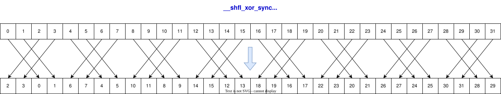</p><p align="center">图：当使用 __shfl_xor_sync() 且 laneMask = 2 时线程束内线程间数据交换方式</p>

这里我们可以巧妙运用这一函数，连续使用 5 次使得一个线程束内每个线程都得到整个线程束中所有线程的最大值。

```cpp
// Get max value of src in a warp.
__device__ __forceinline__ void warp_reduce_max(float *dst, float src) {

    // mask is not valid now, fill in 0
    // The current thread performs an XOR operation with the lanemask to get
    // the source thread, and return the src of source thread.
    float tmp = __shfl_xor_sync(0, src, 1, 32);
    *dst = max(tmp, src);
    tmp = __shfl_xor_sync(0, *dst, 2, 32);
    *dst = max(*dst, tmp);
    tmp = __shfl_xor_sync(0, *dst, 4, 32);
    *dst = max(*dst, tmp);
    tmp = __shfl_xor_sync(0, *dst, 8, 32);
    *dst = max(*dst, tmp);
    tmp = __shfl_xor_sync(0, *dst, 16, 32);
    *dst = max(*dst, tmp);
}
```

这里我们分别使用 laneMask 值为 1，2，4，8，16 进行五次 `__shfl_xor_sync()`，下图详细展示了上述代码的过程：

<p align="center">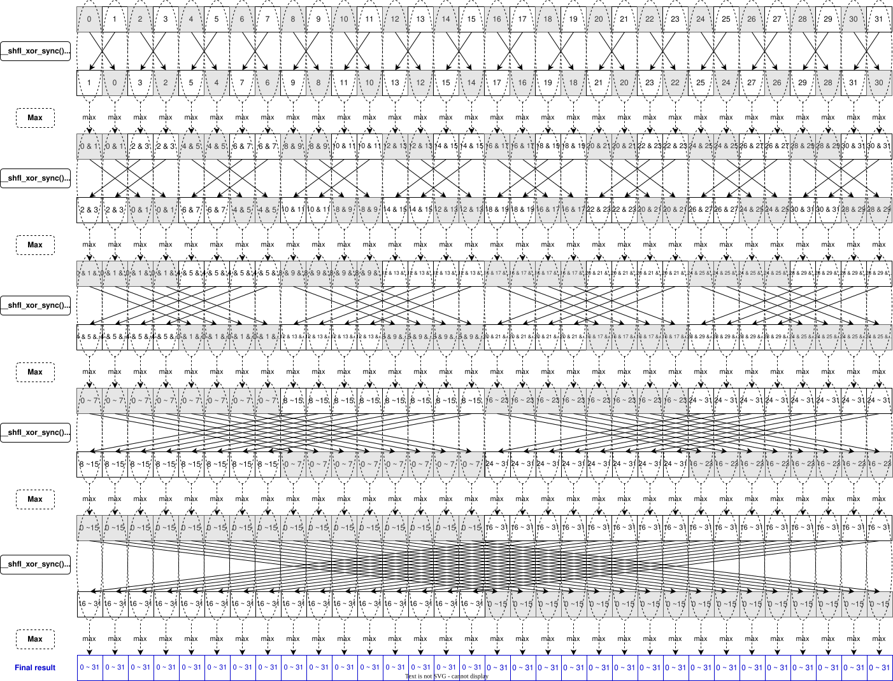</p><p align="center">图：使用 5 次 __shfl_xor_sync() 函数求线程束中所有线程中数据的最大值</p>

上述算法同样可以用来做线程束内所有线程上值求和的运算，模仿求线程束最大值的代码，我们可以将 `max` 函数替换成加法就可以得到线程束求和的函数。

```cpp
// Get sum of src in a warp.
__device__ __forceinline__ void warp_reduce_sum(float *dst, float src) {

    // mask is not valid now, fill in 0
    // The current thread performs an XOR operation with the lanemask to get
    // the source thread, and return the src of source thread.
    float tmp = __shfl_xor_sync(0, src, 1, 32);
    *dst = tmp + src;
    tmp = __shfl_xor_sync(0, *dst, 2, 32);
    *dst = *dst + tmp;
    tmp = __shfl_xor_sync(0, *dst, 4, 32);
    *dst = *dst + tmp;
    tmp = __shfl_xor_sync(0, *dst, 8, 32);
    *dst = *dst + tmp;
    tmp = __shfl_xor_sync(0, *dst, 16, 32);
    *dst = *dst + tmp;
}
```

将上述两个函数调用 `warp_reduce_max()` 和 `warp_reduce_sum()` 分别插入前面代码段的空白处即可得到一个完整的 `Softmax` 超大核函数。

```cpp
// T-mode Kernel function to do FP32 softmax
__global_mega__ void
softmax(NumaMatrix3D<FP32, BLOCK_COL_MAJOR, kBatchSize, kInH, kInW> output,
        NumaMatrix3D<FP32, BLOCK_COL_MAJOR, kBatchSize, kInH, kInW> input) {
    for (int n = 0; n < kBatchSize; n++) {
        for (int h = 0; h < kInH; h += warp_count * 2) {
            // Get max value "sv_max" of a row
            __short_vector<FP32, 2> sv_max(-INFINITY);
            for (int w = 0; w < kInW; w += warp_size) {
                __short_vector<FP32, 2> sv;
                wti::__load_matrix(&sv, input,
                                   Coordinate3D(n, h + warp_idx * 2, w));
                // max inside thread
                if (w + warp_thread_idx < kInW) {
					sv_max = max(sv_max, sv);
				}
            }
            // Get max value of "sv_max" inside each warp
            warp_reduce_max(&(sv_max.x), sv_max.x);
            warp_reduce_max(&(sv_max.y), sv_max.y);

            // Calculate sum of "exp(sv - sv_max)" along W dimension
            __short_vector<FP32, 2> sv_exp_sum(0.0f);
            for (int w = 0; w < kInW; w += warp_size) {
                __short_vector<FP32, 2> sv;

                // Use WTI Burst 2 API to load data into TLR
                wti::__load_matrix(&sv, input,
                                   Coordinate3D(n, h + warp_idx * 2, w));

                // Calculate exp(sv)
                __short_vector<FP32, 2> sv_exp(0.0f);
                if (w + warp_thread_idx < kInW) {
                    sv_exp = exp(sv - sv_max);
                }
                sv_exp_sum += sv_exp;
            }
            // Get sum of "sv_exp_sum" inside each warp
            warp_reduce_sum(&(sv_exp_sum.x), sv_exp_sum.x);
            warp_reduce_sum(&(sv_exp_sum.y), sv_exp_sum.y);

            // Load data again and calculate final result
            for (int w = 0; w < kInW; w += warp_size) {
                __short_vector<FP32, 2> sv;

                // Use WTI Burst 2 API to load data into TLR
                wti::__load_matrix(&sv, input,
                                   Coordinate3D(n, h + warp_idx * 2, w));

                // Calculate the result
                __short_vector<FP32, 2> out_sv = exp(sv - sv_max) / sv_exp_sum;

                // Store the result
                wti::__store_matrix(output, Coordinate3D(n, h + warp_idx * 2, w),
                                    out_sv);
            }
        }
    }
}

```

对于线程束内的求和运算，我们也可以选择使用之前提到的归约缓冲区来实现。归约缓冲区的使用非常简单，下文为一个简单的例子展示了如果使用归约缓冲区配合原语函数 `__warp_reduce()` 和 `__get_reduce_buf_broadcast()` 来实现线程束内求和：

```cpp
// Declare a grb object.
// "2" means the "grb" object declared contains 2 channels.
// "wti::REDUCE_SUM" means reduction mode is "SUM ONLY".
wti::__reduce_buf<2, wti::REDUCE_SUM> grb;

// Initialize 0 for grb. "2" means channel number to be set.
wti::__set_reduce_buf<2>(&grb, 0);

// Initialize a short vector to be reduced
__short_vector<FP32, 2> sv(1.0f, static_cast<FP32>(warp_thread_idx));

// Reduce "sv" to "grb" starting from channel 0.
wti::__warp_reduce(&grb, 0, sv);
// After reduction, sv.x in all threads in a warp are reduced to channel 0 in grb.
// sv.y in all threads in a warp are reduced to channel 1 in grb.

// Load data from grb and broadcast to all threads in a warp to short vector "sv_sum".
__short_vector<FP32, 2> sv_sum;
wti::__get_reduce_buf_broadcast(&sv_sum, grb, 0);  // "0" means starting channel of loading.

// sv_sum.x is 32 for all threads (1.0f * 32 = 32)
// sv_sum.y is 240 for all threads (0 + 1 + 2 + 3 + ... + 31 = 240)
```

对应到 Softmax 中实现可以将 `warp_reduce_sum()` 两行替换为使用 grb 的操作

```cpp
// Get sum of "sv_exp_sum" inside each warp
// warp_reduce_sum(&(sv_exp_sum.x), sv_exp_sum.x);
// warp_reduce_sum(&(sv_exp_sum.y), sv_exp_sum.y);
// -->

wti::__reduce_buf<2, wti::REDUCE_SUM> grb;
wti::__set_reduce_buf<2>(&grb, 0);
wti::__warp_reduce(&grb, 0, sv_exp_sum);
wti::__get_reduce_buf_broadcast(&sv_exp_sum, grb, 0);
```

为了减少置零操作次数，归约缓冲区在使用时有特殊的性质：归约缓冲区的数据在加载后，下次写入之前，会自动将对应的归约缓冲区内的值置零。我们可以利用这个性质，将置零操作移到超大核函数的开头位置，后续在每次循环内可以减少一次对归约缓冲区的置零操作：

```cpp
// T-mode Kernel function to do FP32 softmax
__global_mega__ void
softmax(NumaMatrix3D<FP32, BLOCK_COL_MAJOR, kBatchSize, kInH, kInW> output,
        NumaMatrix3D<FP32, BLOCK_COL_MAJOR, kBatchSize, kInH, kInW> input) {
    wti::__reduce_buf<2, wti::REDUCE_SUM> grb; // Declare grb.
    wti::__set_reduce_buf<2>(&grb, 0);         // Set GRB to 0 at beginning.
    for (int n = 0; n < kBatchSize; n++) {
        for (int h = 0; h < kInH; h += warp_count * 2) {
            // Get max value "sv_max" of a row
            __short_vector<FP32, 2> sv_max(-INFINITY);
            for (int w = 0; w < kInW; w += warp_size) {
				// ....
			}

            // Calculate sum of "exp(sv - sv_max)" along W dimension
            __short_vector<FP32, 2> sv_exp_sum(0.0f);
            for (int w = 0; w < kInW; w += warp_size) {
                // ....
            }

            // ! No set zero needed here !

            // Get sum of "sv_exp_sum" inside each warp
            wti::__warp_reduce(&grb, 0, sv_exp_sum);  // Reduce short vector to grb
            wti::__get_reduce_buf_broadcast(&sv_exp_sum, grb, 0);  // Load data from grb

            // Load data again and calculate final result
            for (int w = 0; w < kInW; w += warp_size) {
                // ....
            }
        }
    }
}

```

> `__shfl_xor_sync()` vs 归约缓冲区：使用归约缓冲区相比起 `__shfl_xor_sync()` 能获得更好的性能，但是使用归约缓冲区会降低计算的精度。归约缓冲区在计算求和或平方和时，会将原数据先截断到 **24 bit** 后再进行累加，因此用户需根据实际需要灵活选择归约算法。

### BF16 版本实现

BF16 版本的 Softmax 实现基本上和 FP32 版本的类似，区别主要在于 `__shfl_xor_sync()` 函数对于 BF16 类型只能接收 2、4、8 长度的 short vector。因此使用 `__shfl_xor_sync()` 函数的写法可以变为：

```cpp
__device__ __forceinline__ void warp_reduce_max(__short_vector<BF16, 2> *dst,
                                                __short_vector<BF16, 2> src) {
    // mask is not valid now, fill in 0
    // The current thread performs an XOR operation with the lanemask to get
    // the source thread, and return the src of source thread.
    __short_vector<BF16, 2> tmp = __shfl_xor_sync(0, src, 1, 32);
    *dst = max(tmp, src);
    tmp = __shfl_xor_sync(0, *dst, 2, 32);
    *dst = max(*dst, tmp);
    tmp = __shfl_xor_sync(0, *dst, 4, 32);
    *dst = max(*dst, tmp);
    tmp = __shfl_xor_sync(0, *dst, 8, 32);
    *dst = max(*dst, tmp);
    tmp = __shfl_xor_sync(0, *dst, 16, 32);
    *dst = max(*dst, tmp);
}

__device__ __forceinline__ void warp_reduce_sum(__short_vector<BF16, 2> *dst,
                                                __short_vector<BF16, 2> src) {
    // mask is not valid now, fill in 0
    // The current thread performs an XOR operation with the lanemask to get
    // the source thread, and return the src of source thread.
    __short_vector<BF16, 2> tmp = __shfl_xor_sync(0, src, 1, 32);
    *dst = tmp + src;
    tmp = __shfl_xor_sync(0, *dst, 2, 32);
    *dst = *dst + tmp;
    tmp = __shfl_xor_sync(0, *dst, 4, 32);
    *dst = *dst + tmp;
    tmp = __shfl_xor_sync(0, *dst, 8, 32);
    *dst = *dst + tmp;
    tmp = __shfl_xor_sync(0, *dst, 16, 32);
    *dst = *dst + tmp;
}

// T-mode Kernel function to do BF16 softmax
__global_mega__ void
softmax(NumaMatrix3D<BF16, BLOCK_COL_MAJOR, kBatchSize, kInH, kInW> output,
        NumaMatrix3D<BF16, BLOCK_COL_MAJOR, kBatchSize, kInH, kInW> input) {
    for (int n = 0; n < kBatchSize; n++) {
        for (int h = 0; h < kInH; h += warp_count * 2) {
            // Get max value "sv_max" of a row
            __short_vector<BF16, 2> sv_max(-INFINITY);
            for (int w = 0; w < kInW; w += warp_size) {
                __short_vector<BF16, 2> sv;
                wti::__load_matrix(&sv, input,
                                   Coordinate3D(n, h + warp_idx * 2, w));
                // max inside thread
                if (w + warp_thread_idx < kInW) {
                    sv_max = max(sv_max, sv);
                }
            }
            // Get max value of "sv_max" inside each warp
            warp_reduce_max(&sv_max, sv_max);

            // Calculate sum of "exp(sv - sv_max)" along W dimension
            __short_vector<BF16, 2> sv_exp_sum(0.0f);
            for (int w = 0; w < kInW; w += warp_size) {
                __short_vector<BF16, 2> sv;

                // Use WTI Burst 2 API to load data into TLR
                wti::__load_matrix(&sv, input,
                                   Coordinate3D(n, h + warp_idx * 2, w));

                // Calculate exp(sv)
                __short_vector<BF16, 2> sv_exp(0.0f);
                if (w + warp_thread_idx < kInW) {
                    sv_exp = exp(sv - sv_max);
                }
                sv_exp_sum += sv_exp;
            }
            // Get sum of "sv_exp_sum" inside each warp
            warp_reduce_sum(&sv_exp_sum, sv_exp_sum);

            for (int w = 0; w < kInW; w += warp_size) {
                __short_vector<BF16, 2> sv;

                // Use WTI Burst 2 API to load data into TLR
                wti::__load_matrix(&sv, input,
                                   Coordinate3D(n, h + warp_idx * 2, w));

                // Calculate the result
                __short_vector<BF16, 2> out_sv = exp(sv - sv_max) / sv_exp_sum;

                // Store the result
                wti::__store_matrix(
                    output, Coordinate3D(n, h + warp_idx * 2, w), out_sv);
            }
        }
    }
}
```

这里因为原数据仅为 BF16 精度（低于 BF24 精度），因此使用归约缓冲区对于 BF16 的数据做归约时对精度无明显影响，我们可以将求和运算替换成使用更高性能的归约缓冲区。

```cpp
__global_mega__ void
softmax(NumaMatrix3D<BF16, BLOCK_COL_MAJOR, kBatchSize, kInH, kInW> output,
        NumaMatrix3D<BF16, BLOCK_COL_MAJOR, kBatchSize, kInH, kInW> input) {
    wti::__reduce_buf<2, wti::REDUCE_SUM> grb; // Declare grb.
    wti::__set_reduce_buf<2>(&grb, 0);         // Set GRB to 0 at beginning.
    for (int n = 0; n < kBatchSize; n++) {
        for (int h = 0; h < kInH; h += warp_count * 2) {
            // Get max value "sv_max" of a row
            __short_vector<BF16, 2> sv_max(-INFINITY);
            for (int w = 0; w < kInW; w += warp_size) {
                // ....
            }
            // Get max value of "sv_max" inside each warp
            warp_reduce_max(&sv_max, sv_max);

            // Calculate sum of "exp(sv - sv_max)" along W dimension
            __short_vector<BF16, 2> sv_exp_sum(0.0f);
            for (int w = 0; w < kInW; w += warp_size) {
                // ....
            }
            // Get sum of "sv_exp_sum" inside each warp
            wti::__warp_reduce(&grb, 0,
                               sv_exp_sum); // Reduce short vector to grb
            __short_vector<FP32, 2> sv_exp_sum_fp32;
            wti::__get_reduce_buf_broadcast(&sv_exp_sum_fp32, grb,
                                            0); // Load data from grb
            sv_exp_sum =
                __float22bfloat162(sv_exp_sum_fp32); // Convert back to bf16

            for (int w = 0; w < kInW; w += warp_size) {
                // ....
            }
        }
    }
}
```

> BF16 类型 `__short_vector` 使用局限性：BF16 类型在寄存器中有着不同于其他类型的特殊存储方式，一个 BF16 类型值在寄存器中实际会占用 20 bit。因为比特对齐方式和其他数据类型不同，我们在做数据转换时需要使用特定的内置函数进行转换。例如 `__bfloat1622float2()` 和 `__float22bfloat162()` 可以用来在 `__short_vector<BF16, 2>` 类型和 `__short_vector<FP32, 2>` 类型间转换。BF16 类型必须先转换成 FP32 类型才能与其他类型转换。该限制只存在于超大核函数内（张量模式），普通模式在 BR10X 系列架构上不支持 BF16 类型。

<div style="page-break-after:always"></div>

## 矩阵乘法

本章节将会通过在 GPU 运算中常见矩阵乘法运算逐步介绍 BIRENSUPA 编程模型。以下示例中，我们会使用左矩阵为 `kM * kK`，右矩阵为 `kK * kN` 以及输出矩阵为 `kM * kN` 作为例子。

```cpp
constexpr int kM = 1024;
constexpr int kK = 2048;
constexpr int kN = 1024;
```

### 简单的矩阵乘法

首先，我们从使用 G-Mode 开始编写一个最基础、直接版本的矩阵乘法开始进行介绍。

```cpp
// Simple/G-Mode/MatrixMul/matrixMul.su

#include <stdio.h>
#include <supa.h>

// Thread block size
constexpr int kBlockSz = 16;
// Matrix Size
constexpr int kM = 1024;
constexpr int kK = 2048;
constexpr int kN = 1024;

__global__ void matrixMulDevice(float *A, float *B, float *C) {
    // Each thread computes one element of C
    // by accumulating results into c_value
    float c_value = 0;
    int row = block_idx.y * block_dim.y + thread_idx.y;
    int col = block_idx.x * block_dim.x + thread_idx.x;
    for (int k = 0; k < kK; k++) {
        // Multiply A value and B value together
        c_value += A[row * kK + k] * B[k * kN + col];
    }
    C[row * kN + col] = c_value;
}

int main() {
    size_t size_A = kM * kK;
    size_t size_B = kK * kN;
    size_t size_C = kM * kN;

    // Initialize a and b matrix on the host
    float *h_A = (float *)malloc(size_A * sizeof(float));
    float *h_B = (float *)malloc(size_B * sizeof(float));

    // ... Initialize h_A and h_B

    // Allocate host matrix A and B
    float *d_A, *d_B;
    suMallocDevice((void **)&d_A, size_A * sizeof(float));
    suMallocDevice((void **)&d_B, size_B * sizeof(float));

    // Copy host memory to device
    suMemcpy(d_A, h_A, size_A * sizeof(float));
    suMemcpy(d_B, h_B, size_B * sizeof(float));

    // Allocate C in device memory
    float *d_C;
    suMallocDevice((void **)&d_C, size_C * sizeof(float));

    // Launch kernel
    dim3 blockDim(kBlockSz, kBlockSz);
    dim3 gridDim(kN / kBlockSz, kM / kBlockSz);
    printf("Kernel start ....\n");
    suLaunchKernel(matrixMulDevice, gridDim, blockDim, 0, NULL, d_A, d_B, d_C);
    suDeviceSynchronize();
    printf("Kernel finished!\n");

    // Allocate host matrix C
    float *h_C = (float *)malloc(size_C * sizeof(float));
    // Read C from device memory
    suMemcpy(h_C, d_C, size_C * sizeof(float));

    // ... Error Check

    // Free device and host memory
    free(h_A);
    free(h_B);
    free(h_C);
    suFree(d_A);
    suFree(d_B);
    suFree(d_C);
    return 0;
}
```

以上例子中，每个线程会在核函数启动后会根据所对应的线程块索引（`block_idx`），线程索引（`thread_idx`）获取其在输出矩阵 `C` 中对应计算结果的位置信息 `row` （行索引），`col`（列索引）。

```cpp
int row = block_idx.y * block_dim.y + thread_idx.y;
int col = block_idx.x * block_dim.x + thread_idx.x;
```

之后，每个线程会依次读取输入矩阵 `A` 中的第 `row` 行以及输入矩阵 `B` 中的第 `col` 列中的元素，进行乘积后，累加求和。

<p align="center">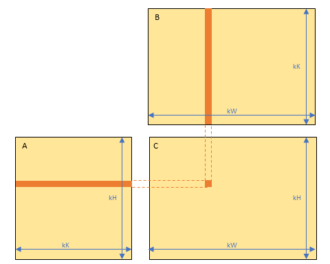</p><p align="center">图：G-Mode 基础矩阵乘法</p>

以上例子的核函数中，每一个线程块会计算一片 `kBlockSz * kBlockSz` 区域的结果，每个线程运算其中一个结果，所以在主机端我们按照 `blockDim(kBlockSz, kBlockSz)` 分配线程块大小，按照 `gridDim(kN / kBlockSz, kM / kBlockSz)` 分配线程网格大小、

```cpp
dim3 blockDim(kBlockSz, kBlockSz);
dim3 gridDim(kN / kBlockSz, kM / kBlockSz);
```

<div style="page-break-after:always"></div>

### 使用共享内存加速的矩阵乘法

在上述简单的矩阵乘法例子中，存在着大量数据重复读写。在不修改主机端函数的情况下，引入共享内存是一个可以提升上述核函数性能的方式。

相比于使用全局内存，共享内存位于硬件单元 CU 内，BR10x 系列架构下大小为 32 KB，有相比全局内存更高的带宽，由同一 CU 上的所有线程共享使用。因为普通模式下一个线程块会在一个 CU 上执行，因此普通模式下线程块中的每一个线程都可以以更快速度从共享内存中读取数据或往共享内存中写入数据。由于矩阵乘法时单个输入数据都会被不同线程重复读取多次，我们可以在运算前先把计算过程中会被重复加载的数据存放到共享内存中。在 BIRENSUPA 中，定义一片共享内存需要使用 `__shared__` 变量类型限定符。在以下展示的使用共享内存进行 G-Mode 矩阵乘法的例子中，我们重用上述简单的矩阵乘法例子中的主机端函数，所以每一个线程块依然会计算一片 `kBlockSz * kBlockSz` 区域的结果。

<p align="center">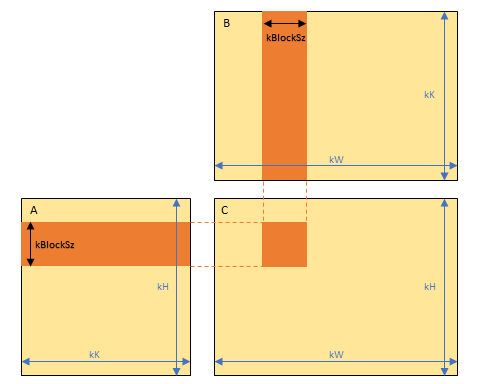</p><p align="center">图：G-Mode 共享内存矩阵乘法</p>

```cpp
// Simple/G-Mode/MatrixMulSharedMemory/matrixMul.su

__global__ void matrixMulDevice(float *A, float *B, float *C) {
    // Each thread computes one element of Csub
    // by accumulating results into c_value
    float c_value = 0;

    // Thread row and column within kBlockSz * kBlockSz block
    int row = thread_idx.y;
    int col = thread_idx.x;

    // Loop over all the sub-matrices of A and B
    // required to compute the block sub-matrix
    for (int k = 0; k < kK; k += kBlockSz) {
        // Declaration of the shared memory array used to store the sub-matrix
        // of A and B
        __shared__ float as[kBlockSz][kBlockSz];
        __shared__ float bs[kBlockSz][kBlockSz];

        // Load asub and Bsub from device memory to shared memory
        // Each thread loads one element of each sub-matrix
        as[row][col] = A[(block_idx.y * block_dim.y + row) * kK + k + col];
        bs[row][col] = B[(k + row) * kN + block_idx.x * block_dim.x + col];

        // Synchronize to make sure the sub-matrices are loaded before starting
        // the computation
        __syncthreads();

        // Multiply asub and bsub together
        for (int e = 0; e < kBlockSz; e++) {
            c_value += as[row][e] * bs[e][col];
        }

        // Synchronize to make sure that the preceding computation is done
        __syncthreads();
    }

    // Write the result
    C[(block_idx.y * block_dim.y + row) * kN + block_idx.x * block_dim.x +
      col] = c_value;
}
```

在上述例子中，在一个完整矩阵乘法中的局部 `c` 可以根据以下公式获得结果:
$$c = a_{1} * b_{1} + a_{2} * b_{2} + a_{3} * b_{3} + .... + a_{n} * b_{n}$$

<p align="center">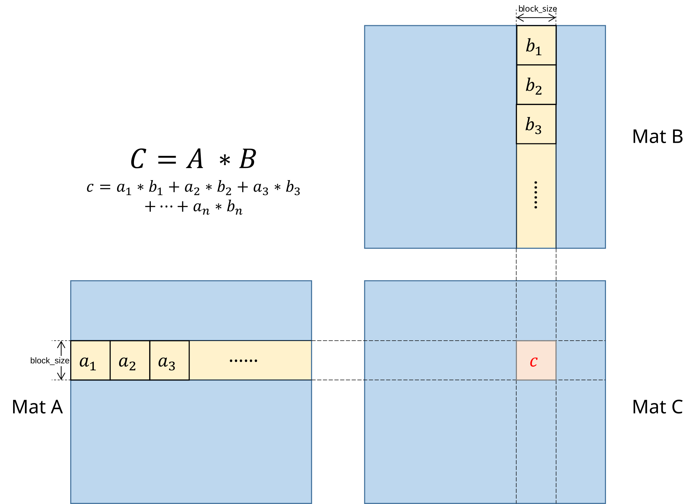</p><p align="center">图：G-Mode 共享内存矩阵乘法切分</p>

在以上例子中，每个线程块负责计算输出矩阵 `C` 中的 `kBlockSz * kBlockSz` 区域。为了获得最终结果，在循环的每个步骤中，每个线程块需要分别为矩阵 `A` 和矩阵 `B` 准备一片 `kBlockSz * kBlockSz` 大小的共享内存。在完成对这两片共享内存的数据加载后，为了保证线程块内所有线程都完成了数据加载，所有线程需要做一次线程块级别的同步（`__syncthreads()`）后才能安全地读取其他线程加载的数据。每个线程都会使用一个 `c_value` 作为累加变量，用于暂存整个线程块 `kBlockSz * kBlockSz` 个结果的累加，在完成循环内的一轮累加之后，也需要添加 `__syncthreads()` API 以保证线程块内所有线程都完成了本次循环加载的共享内存中数据的消费，可以安全进入下一次循环重新加载新的数据进入共享内存。

<div style="page-break-after:always"></div>

### 矩阵乘法 (T-Mode)

在 G-Mode 下一个线程块由一个 CU 执行，因此同一线程块中的所有线程可以访问相同的共享内存。与之不用的是，由于在 T-Mode 下一个线程块由一个 SPC 执行，根据下图硬件架构可知一个 SPC 中包含四个 CU，因此在每个 SPC 中会四块独立的共享内存（每块 32KB），同一个 CU 中的所有线程可以访问当前 CU 内部的共享内存，而不能访问相邻其他 CU 内部的共享内存。在 T-Mode 中，定义一片共享内存需要同样使用 `__shared__` 变量类型限定符。

<p align="center">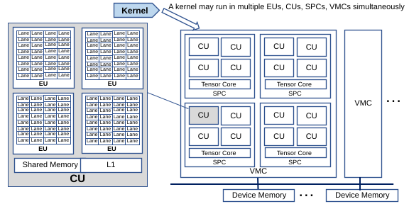</p><p align="center">图：T-Mode 硬件中的共享内存</p>

在实际使用时，我们可以使用 `warp_idx` 来区分当前线程束所属的 CU。在向量加法章节提到 `warp_idx` 与硬件资源 CU/EU 之间有着固定的映射关系，我们可以利用这一关系来区分不同的线程束所对应使用的共享内存。

<p align="center">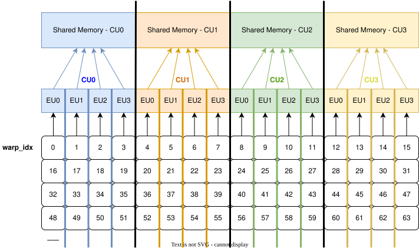</p><p align="center">图：T-Mode 的共享内存与线程束的关系</p>

我们可以根据壁仞通用 GPU 在 T-Mode 下的共享内存设计将上文中在 G-Mode 下使用共享内存加速的矩阵乘法的例子改写成如下适用于 T-Mode 的例子。

```cpp
// examples/Simple/T-Mode/MatrixMul-shared/matrixMul.su

#include <stdio.h>
#include <supa.h>

// height of matrix A and C
// should be multiple of kBlockSize
constexpr int kM = 1024;
// width of matrix A and height of matrix B
// should be multiple of kBlockSize
constexpr int kK = 2048;
// width of matrix B and C
// should be multiple of kBlockSize
constexpr int kN = 1024;

constexpr int kSpcBlockSize = 32;
// CUs are arranged as 2x2 square
constexpr int kCuBlockSize = kSpcBlockSize / 2;

// T-mode Kernel function to do FP32 matrix multiply
__global_mega__ void matrixMulDevice(float *A, float *B, float *C) {
    // Each thread computes two elements of Csub
    // by accumulating results into Cvalue
    float Cvalue1 = 0;
    float Cvalue2 = 0;

    // Each SPC works on a 32 * 32 area, Each CU works on a 16 * 16 area
    // Warp 0 ~ 3 --> CU0;  Warp 4 ~ 7 --> CU1
    // Warp 8 ~ 11 --> CU2; Warp 12 ~ 15 --> CU3
    int row = warp_idx % 4 * 2 + warp_thread_idx / kCuBlockSize;
    int col = warp_thread_idx % kCuBlockSize;
    int shift_row = warp_idx / 4 / 2 * kCuBlockSize + row;
    int shift_col = warp_idx / 4 % 2 * kCuBlockSize + col;

    // Loop over all the sub-matrices of A and B
    // required to compute the block sub-matrix
    for (int k = 0; k < kK; k += kCuBlockSize) {
        // Declaration of the shared memory array used to store the sub-matrix
        // of A and B
        __shared__ float As[kCuBlockSize][kCuBlockSize];
        __shared__ float Bs[kCuBlockSize][kCuBlockSize];

        // Load Asub and Bsub from device memory to shared memory
        // Each thread loads one element of each sub-matrix
        As[row][col] =
            A[(block_idx.y * kSpcBlockSize + shift_row) * kK + k + col];
        Bs[row][col] =
            B[(k + row) * kN + block_idx.x * kSpcBlockSize + shift_col];

        As[row + 8][col] =
            A[(block_idx.y * kSpcBlockSize + shift_row + 8) * kK + k + col];
        Bs[row + 8][col] =
            B[(k + row + 8) * kN + block_idx.x * kSpcBlockSize + shift_col];

        // Synchronize to make sure the sub-matrices are loaded before starting
        // the computation
        __syncthreads();

        // Multiply Asub and Bsub together
        for (int e = 0; e < kCuBlockSize; e++) {
            Cvalue1 += As[row][e] * Bs[e][col];
            Cvalue2 += As[row + 8][e] * Bs[e][col];
        }

        // Synchronize to make sure that the preceding computation is done
        __syncthreads();
    }

    // Write the result
    C[(block_idx.y * kSpcBlockSize + shift_row) * kN +
      block_idx.x * kSpcBlockSize + shift_col] = Cvalue1;
    C[(block_idx.y * kSpcBlockSize + shift_row + 8) * kN +
      block_idx.x * kSpcBlockSize + shift_col] = Cvalue2;
}

int main() {
    size_t size_A = kM * kK; // matrix A size
    size_t size_B = kK * kN; // matrix B size
    size_t size_C = kM * kN; // matrix C size

    // Malloc memory and initialize matrix A and B on the host
    float *h_A = (float *)malloc(size_A * sizeof(float));
    float *h_B = (float *)malloc(size_B * sizeof(float));

    // ... Initialize h_A and h_B

    // Allocate device memory for matrix A, B and C
    float *d_A, *d_B, *d_C;

    suMallocDevice((void **)&d_A, size_A * sizeof(float));
    suMallocDevice((void **)&d_B, size_B * sizeof(float));
    suMallocDevice((void **)&d_C, size_C * sizeof(float));

    // Copy host memory to device
    suMemcpy(d_A, h_A, size_A * sizeof(float));
    suMemcpy(d_B, h_B, size_B * sizeof(float));

    // Launch kernel
    dim3 gridDim(kN / kSpcBlockSize, kM / kSpcBlockSize);
    printf("Kernel start ....\n");
    suLaunchKernel(matrixMulDevice, gridDim, 512, 0, NULL, d_A, d_B, d_C);
    suDeviceSynchronize();
    printf("Kernel finished!\n");

    // Allocate host matrix C
    float *h_C = (float *)malloc(size_C * sizeof(float));

    // Read C from device memory
    suMemcpy(h_C, d_C, size_C * sizeof(float));

    // ... Error Check

    // Free device and host memory
    suFree(d_A);
    suFree(d_B);
    suFree(d_C);
    free(h_A);
    free(h_B);
    free(h_C);
    return 0;
}
```

在上述例子中，为了适应 T-Mode 下按照 512 线程启动超大核函数，使用如下配置：

```cpp
constexpr int kSpcBlockSize = 32;
constexpr int kCuBlockSize = kSpcBlockSize / 2;

dim3 gridDim(kN / kSpcBlockSize, kM / kSpcBlockSize);

suLaunchKernel(matrixMulDevice, gridDim, 512, 0, NULL, d_A, d_B, d_C);
```

每个 SPC 会运算输出矩阵 `C` 中 32 \* 32 大小的区域；其中，每个 CU 会运算 16 \* 16 大小的区域。运算过程中，每个 CU 会使用两块 16 \* 16 大小的共享内存分别暂存矩阵 `A` 和矩阵 `B` 的数据以获得最终 16 \* 16 的结果。由于按照每个 SPC 512 线程限制启动的超大核函数，每个 CU 上有 32 \* 4 个线程，为了匹配 16 \* 16 大小的区域的运算结果，循环的每一步中需要加载两次填满共享内存，同时需要使用 `Cvalue1` 和 `Cvalue1` 两个变量用于累加。与 G-Mode 相同，在 T-Mode 下同样需要使用 `__syncthreads()` API 进行 CU 内所有线程的同步，以保证进行运算前所有线程完成数据加载以及下一轮循环的数据加载前所有线程完成上一轮循环的数据消费。需要注意的是，在 T-Mode 下 `__syncthreads()` API 同样为 CU 层级进行的同步而非 SPC 层级。

<p align="center">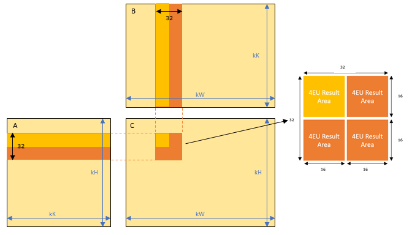</p><p align="center">图：T-Mode 共享内存矩阵乘法</p>

在 T-Mode 下，BIRENSUPA 提供了大量高性能计算原语 API，为了使用这些 API，BIRENSUPA 定义了张量数据类型来处理所有必需的上下文信息。以下的例子中会使用 `UMA` 内存类型、`BLOCK_ROW_MAJOR` 布局的 Matrix 张量替换上述例子中的矩阵指针 `A`、`B` 和 `C`。

```cpp
tensor::UmaMatrix<FP32, BLOCK_ROW_MAJOR, kM, kK> A;
tensor::UmaMatrix<FP32, BLOCK_ROW_MAJOR, kK, kN> B;
tensor::UmaMatrix<FP32, BLOCK_ROW_MAJOR, kM, kN> O;
```

在 BIRENSUPA 中，根据壁仞通用 GPU 设计要求，包括 Matrix 张量的每个张量类型映射到壁仞通用 GPU 硬件的一个特殊对象描述符或张量布局的原始数据（可具体参考 **_BIRENSUPA 张量库 API_** 中**_张量数据类型布局_**章节）。其中，每连续 512 字节的数据称为一个数据块，每个块可以分成 4 个 128 字节的数据子块。以 BLOCK_ROW_MAJOR Matrix 张量为例：

| FP32     | 行 \* 列 |
| -------- | -------- |
| 数据块   | 4 \* 32  |
| 数据子块 | 1 \* 32  |

BLOCK_ROW_MAJOR Matrix 布局中的每个数据子块根据数据类型具有不同的布局。

<p align="center">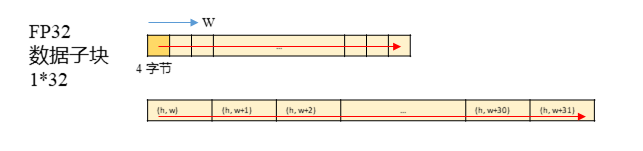</p><p align="center">图：BIRENSUPA 张量 Matrix BLOCK_ROW_MAJOR FP32 数据子块布局</p>

BLOCK_ROW_MAJOR Matrix 布局中的每个数据块都有 4 个具有 H 方向主寻址的数据子块。

<p align="center">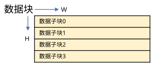</p><p align="center">图：BIRENSUPA 张量 Matrix BLOCK_ROW_MAJOR 数据块</p>

在数据块之外，其线性寻址以 W 方向为主。同时，BLOCK_ROW_MAJOR Matrix 的布局在 W 方向需要 2KB 对齐（4 个数据块对齐）。

<p align="center">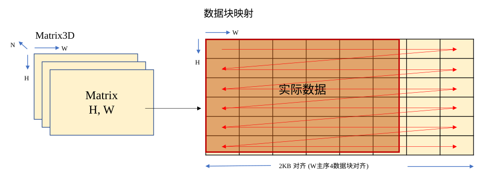</p><p align="center">图：BIRENSUPA 张量 Matrix BLOCK_ROW_MAJOR 数据块布局</p>

使用线程束张量计算原语 (WTI) 线程束张量数据读取和存储 API 对张量进行读写时，需要按照 128 字节的数据子块进行对齐，默认情况下每个线程会获得 4 个 Byte 的数据（1 个 FP32 数据）。在下面的例子中，使用 BIRENSUPA 提供的 BURST 模式（可具体参考 **_BIRENSUPA 张量库 API_** 中 **_Burst 模式_** 章节）同时读取和存储了 2 个 FP32 的数据（`__short_vector<FP32, 2>`）。

以下是 4 Byte 的数据类型 `BLOCK_ROW_MAJOR` Matrix 张量从（0，0，0）加载或存储数据时，线程 0 的线程本地寄存器所对应的数据坐标示例。（张量数据类型和线程本地寄存器获得数据类型相同时）

| (H, W)                                                      | Get/Set<br>数据数量 1 | Get2/Set2<br>数据数量 2        | Get3/Set3<br>数据数量 3                                 | Get4/Set4<br>数据数量 4                                                          |
| ----------------------------------------------------------- | --------------------- | ------------------------------ | ------------------------------------------------------- | -------------------------------------------------------------------------------- |
| FP32/int/uint<br>数据块大小 4 \* 32<br>数据子块大小 1 \* 32 | (0, 0)                | (0, 0),<br>(1, 0) // +128 字节 | (0, 0),<br>(1, 0), // +128 字节<br>(0, 32) // +512 字节 | (0, 0),<br>(1, 0), // +128 字节<br>(0, 32), // +512 字节<br>(1, 32) // +640 字节 |

下图介绍了 4 Byte 的数据类型的 Matrix `BLOCK_ROW_MAJOR` 张量的 Burst 模式。

<p align="center"></p><p align="center">图：BIRENSUPA 4 Byte 数据类型 Matrix BLOCK_ROW_MAJOR 张量 Burst 模式</p>

为了迎合上表中每个线程束单次加载或存储的对齐要求（使用 BURST 2 模式下 2 \* 32 对齐），在以下例子中，每个 SPC 会运算输出 Matrix 张量 `C` 中 64 \* 64 大小的区域；其中，每个 CU 会运算 32 \* 32 大小的区域。运算过程中，每个 CU 会使用两块 32 \* 32 大小的共享内存分别暂存 Matrix 张量 `A` 和 Matrix 张量 `B` 的数据以获得最终 32 \* 32 的结果。

<p align="center">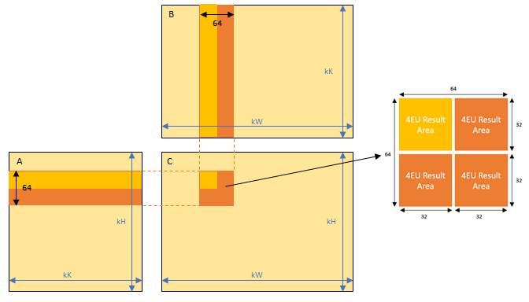</p><p align="center">图：T-Mode WTI 共享内存矩阵乘法</p>

```cpp
// examples/Simple/T-Mode/MatrixMul-wti/matrixMul.su

#include <supa.h>
#include <supa_tensor.h>

using namespace tensor;

// Use mega kernel and tensor instructions to do the FP32 Matrix Multiply.
// SPC 64x64, each CU 32x32
// Refer to PROGRAMMING SUPA BY EXAMPLES - 2.3. T Mode WTI with Shared Memory
// for more details.
__global_mega__ void
MatrixMulDevice(UmaMatrix<FP32, BLOCK_ROW_MAJOR, kM, kN> out,
                UmaMatrix<FP32, BLOCK_ROW_MAJOR, kM, kK> inL,
                UmaMatrix<FP32, BLOCK_ROW_MAJOR, kK, kN> inR) {

    // Each SPC works on a 64 * 64 area. Each CU works on a 32 * 32 area
    // (H, W) is an absolute coordinate of a SPC
    int H = block_idx.x * 64;
    int W = block_idx.y * 64;
    // (shiftH, shiftW) is a coordinate of a CU relative to its SPC coordinate (H, W)
    int shiftH = cu_id / 2 * 32;
    int shiftW = cu_id % 2 * 32;

    // Each thread computes 8 element of Csub
    FP32 Csub[8] = {0, 0, 0, 0, 0, 0, 0, 0};

    // Loop over all the sub-matrices of inL and inR
    // required to compute the block sub-matrix
    for (int pos = 0; pos < kK; pos += 32) {
        // Step works on 64 * 64, so each shared memory size is 32 * 32
        __shared__ FP32 left[32][32];
        __shared__ FP32 right[32][32];

        // Loops 4 times in each CU to fill all 32 * 32 shared memory
        // Each thread loads 2 * 1 block of data
        // Each warp loads 2 * 32 block of data in one loop
        for (int i = 0; i < 4; i++) {
            // stepH is the height relative to its shiftH
            // stepH can be 0, 2, 4, ..., 30 because of burst 2
            int stepH = warp_idx % 4 * 2 + i * 8;

            // Use WTI Burst 2 API to load data into TLR
            // "float2" can also be used here as abbreviation of
            // "__short_vector<FP32, 2>"
            __short_vector<FP32, 2> svL, svR;
            wti::__load_matrix(&svL, inL,
                               Coordinate2D(H + shiftH + stepH, pos));
            wti::__load_matrix(&svR, inR,
                               Coordinate2D(pos + stepH, W + shiftW));

            // Store data into shared memory
            left[stepH][warp_thread_idx] = svL.x;
            left[stepH + 1][warp_thread_idx] = svL.y;
            right[stepH][warp_thread_idx] = svR.x;
            right[stepH + 1][warp_thread_idx] = svR.y;
        }

        // Synchronize to make sure that the preceding computation is done
        __syncthreads();

        // Calculate the result from the shared memory
        for (int i = 0; i < 4; i++) {
            int stepH = warp_idx % 4 * 2 + i * 8;
            for (int n = 0; n < 32; n++) {
                Csub[i * 2] += left[stepH][n] * right[n][warp_thread_idx];
                Csub[i * 2 + 1] +=
                    left[stepH + 1][n] * right[n][warp_thread_idx];
            }
        }

        // Synchronize to make sure that the preceding computation is done
        __syncthreads();
    }

    // Use WTI Burst 2 API to write the data into result
    for (int i = 0; i < 4; i++) {
        wti::__store_matrix(
            out,
            Coordinate2D(H + shiftH + warp_idx % 4 * 2 + i * 8, W + shiftW),
            __short_vector<FP32, 2>(Csub[i * 2], Csub[i * 2 + 1]));
    }
}

int main() {
    // Initialize inL and inR matrix memory on the host
    FP32 *inL = (FP32 *)malloc(kM * kK * sizeof(FP32));
    FP32 *inR = (FP32 *)malloc(kK * kN * sizeof(FP32));

    // ... prepare host data

    // Create Matrix Tensors
    UmaMatrix<FP32, BLOCK_ROW_MAJOR, kM, kK> A;
    UmaMatrix<FP32, BLOCK_ROW_MAJOR, kK, kN> B;
    UmaMatrix<FP32, BLOCK_ROW_MAJOR, kM, kN> O;

    // Load data into Matrix tensor and move to device
    A.copyFromRawData(suDenseRowMajor, inL);
    A.moveToDevice();
    B.copyFromRawData(suDenseRowMajor, inR);
    B.moveToDevice();

    // Launch kernel
    dim3 grid(kM / 64, kN / 64);
    printf("Kernel start ....\n");
    suLaunchKernel(MatrixMulDevice, grid, 512 /* block */,
                   0 /* shareMemSize */, nullptr /* stream */, O, A, B);
    suDeviceSynchronize();
    suGetLastError();
    printf("Kernel finished!\n");

    // Load result
    O.moveToHost();
    FP32 *dO = (FP32 *)malloc(kM * kN * sizeof(FP32));
    O.copyToRawData(suDenseRowMajor, dO);

    // ... Error Check

    // Free device and host memory
    free(inL);
    free(inR);
    free(dO);
    free(hO);
    return 0;
}
```

在上述例子中，为了适应 T-Mode 下按照 512 线程启动超大核函数，使用如下配置：

```cpp
dim3 grid(kM / 64, kN / 64);
suLaunchKernel(MatrixMulDevice, grid, 512, 0, nullptr, O, A, B);
```

在循环的每一步中每个 CU 需要获得 32 \* 32 区域的运算结果，所以需要分 8 次填满共享内存，并同时需要 8 个 FP32 数据类型的变量用于累加。

```cpp
FP32 Csub[8] = {0, 0, 0, 0, 0, 0, 0, 0};
```

<div style="page-break-after:always"></div>

### 张量核心的矩阵乘法

在 T-Mode 下，BIRENSUPA 为了支持更高性能的矩阵乘法运算提供了张量核心的底层原语，定义为张量核心计算原语（TCI），此类型的原语函数都在命名空间 `tensor::tci` 内。可参考 BIRENSUPA™ 张量库 API 参考中 **_张量核心计算原语 (TCI)_** 章节。

在使用 TCI API 时，整个 SPC 都会参与加载、运算或输出，并且 BIRENSUPA TCI 矩阵乘法运算 API 仅支持 `64 * 64` 与 `64 * 32` 两种模式（`M * N`）。因此，以下例子中每个 SPC 选择运算 64 \* 64 区域的结果，这样可以使用与上述例子相同配置与主机端函数，按照 512 线程启动超大核函数：

```cpp
dim3 grid(kM / 64, kN / 64);
suLaunchKernel(MatrixMulDevice, grid, 512, 0, nullptr, O, A, B);
```

以下例子展示了 T-Mode 下使用 TCI API 进行矩阵乘法的超大核函数：

```cpp
// examples/TensorCore/MatrixMul-Simple/matrixMul.su

#include <supa_tensor.h>

using namespace tensor;

/**
 * SUPA T-mode kernel code
 *
 * Use mega kernel and tensor instructions to do the Matrix Multiply.
 * Each SPC calculate 64 * 64 result area.
 * Arguments:
 * - output_matrix : matrix multiple result matrix
 * - input_left_matrix : matrix multiple input left matrix
 * - input_right_matrix : matrix multiple input right matrix
 */
__global_mega__ void
matrixMulDevice(UmaMatrix<FP32, BLOCK_ROW_MAJOR, kM, kN> output_matrix,
                UmaMatrix<FP32, BLOCK_ROW_MAJOR, kM, kK> input_left_matrix,
                UmaMatrix<FP32, BLOCK_ROW_MAJOR, kK, kN> input_right_matrix) {

    // Each SPC works on a 64 * 64 area
    int height = block_idx.x * 64;
    int width = block_idx.y * 64;

    // Create 64 * 64 A buffer for input_left_matrix
    tci::__mma_buf<tci::A_BUF, FP32, 64, 64> abuf;

    // Create 64 * 64 B buffer for input_right_matrix
    tci::__mma_buf<tci::B_BUF, FP32, 64, 64> bbuf;

    // Create Reduce Buffer, NONE mode here
    wti::__reduce_buf<4, wti::REDUCE_NONE> grb;

    // Create Accumulator
    tci::__mma_acc<64, 64> acc;

    // Loop 0 need be peeled, BIRENSUPA with hardware arch version 1.x request
    // __mma_acc.clear() and its closest __mma() API in the same code snippet
    int pos = 0;
    // Load data into A / B buffer
    tci::__load_input_buf(&abuf, input_left_matrix, Coordinate2D(height, pos));
    tci::__load_input_buf(&bbuf, input_right_matrix, Coordinate2D(pos, width));

    // Clear accumulator values before first mma calculation
    acc.clear();
    // Calculate and store data into Accumulator
    // 'output_matrix' at here is not used
    tci::__mma(output_matrix, &acc, &grb, abuf, bbuf);

    // Loop over all the sub-matrices of input_left_matrix and
    // input_right_matrix required to compute the block sub-matrix Leave last
    // loop for output
    for (pos += 64; pos < kK - 64; pos += 64) {
        // Load data into A / B buffer
        tci::__load_input_buf(&abuf, input_left_matrix,
                              Coordinate2D(height, pos));
        tci::__load_input_buf(&bbuf, input_right_matrix,
                              Coordinate2D(pos, width));

        // Calculate and store data into Accumulator
        // 'output_matrix' at here is not used
        tci::__mma(output_matrix, &acc, &grb, abuf, bbuf);
    }

    // Load data into A / B buffer
    tci::__load_input_buf(&abuf, input_left_matrix, Coordinate2D(height, pos));
    tci::__load_input_buf(&bbuf, input_right_matrix, Coordinate2D(pos, width));

    // Calculate and output result to Matrix Tensor
    // matrix multiple result will store to 'output_matrix' at here
    tci::__mma(output_matrix, Coordinate2D(height, width), &acc, &grb, abuf,
               bbuf);
}
```

使用 TCI API 进行矩阵乘法运算前，首先要创建以下变量

- `tensor::tci::__mma_buf<tensor::tci::A_BUF, FP32, 64, 64> abuf`：用于存放运算需要的左矩阵数据。
- `tensor::tci::__mma_buf<tensor::tci::B_BUF, FP32, 64, 64> bbuf`：用于存放运算需要的右矩阵数据。
- `tensor::wti::__reduce_buf<4, wti::REDUCE_NONE> grb`：矩阵乘法的归约缓冲区，可以用于在运算矩阵乘法的同时计算结果的和与平方和，在例子中没有用到此功能所以配置为 `tensor::wti::REDUCE_NONE` 模式。由于归约缓冲区相关行为是线程束级别的，所以在 `tensor::wti` 命名空间中，若是启用此功能，每个线程束的归约缓冲区会记录矩阵乘法运算 `4` 行的和与平方和。
- `tensor::tci::__mma_acc`：用于记录矩阵乘法运算中间结果的累加器。

在上述例子中，SPC 单次运算结果的形状为 64 \* 64 ，所以使用 64 \* 64 大小的矩阵乘法累加器（`__mma_acc<64, 64>`）来暂存中间运算的结果，同时循环的步长为 **64**，所以用于存放左右矩阵数据的缓冲区 A/B 都是 64 \* 64 大小。每一个 `__mma` API 都会使用 64 \* 64 大小的缓冲区 A 与 64 \* 64 大小的缓冲区 B 中的数据进行运算。

在进行矩阵运算之前，需要先使用 `tensor::tci::__load_input_buf()` API 读取 Matrix 张量 `input_left_matrix` 与 `input_right_matrix` 中的数据分别存档到 `abuf` 与 `bbuf` 中。之后使用 `tensor::tci::__mma()` API 进行运算。同时，第一次进行矩阵乘法运算之前，与每次输出之后的下一次矩阵运算之前需要使用 `clear()` API 清空累加器。

```cpp
acc.clear();
```

<table><tr><td bgcolor=#ffeccc><b>注意：根据壁仞通用 GPU 硬件设计版本等于 1.x 的要求，clear() API 与其对应的最近的 tensor::tci::__mma() API 需要处在同一个代码段中。</b> </td></tr></table>

BIRENSUPA 中 `tensor::tci::__mma()` API 提供了多种模式，包括前 `kK / 64 - 1` 次使用的只进行运算并把结果暂存在累加器上，以及最后一次在运算之后直接输出到结果 Matrix 张量 `output_matrix` 上。除了这些之外，矩阵乘法运算 API 也可以在运算之后同时把累加器中的结果累加到输出张量上或者运算后直接输出到本地寄存器（TLR）中。

在上述例子中，最后一个输出到 Matrix 张量的 `tensor::tci::__mma()` API：

```cpp
// Calculate and output result to Matrix Tensor
// matrix multiple result will store to 'output_matrix' at here
tci::__mma(output_matrix, Coordinate2D(height, width), &acc, &grb, abuf, bbuf);
```

可以等效替换为：

```cpp
float8 sv;

// Calculate and output result to TLR
tci::__mma(&sv, output_matrix, &acc, &grb, abuf, bbuf);

// ... can do some calculation on sv

// matrix multiple result will store to 'output_matrix' by two
// __store_matrix API in BURST 4 mode
wti::__store_matrix(output_matrix,
                    Coordinate2D(height + warp_idx * 2, width),
                    float4(sv.d0, sv.d1, sv.d2, sv.d3));
wti::__store_matrix(output_matrix,
                    Coordinate2D(height + warp_idx * 2 + 32, width),
                    float4(sv.d4, sv.d5, sv.d6, sv.d7));
```

壁仞通用 GPU 硬件在矩阵乘法运算并输出到 FP32 数据类型的线程本地寄存器时，每个线程束所获得的数据对应使用两次 BURST 4 的线程束张量输出 API 输出到 Matrix 张量的数据。下图展示了对应 BLOCK_ROW_MAJOR 和 BLOCK_COL_MAJOR Matrix 张量输出到线程本地寄存器 FP32 数据类型分布：

<p align="center"></p><p align="center">图：BIRENSUPA 矩阵乘法运算并输出到线程本地寄存器 FP32 数据类型分布</p>

这里会重点介绍例子中使用的 BLOCK_ROW_MAJOR 分布，输出形状为 64 \* 64 时的情况。矩阵乘法运算并输出到线程本地寄存器的 `float8`（d0，d1，d2，d3，d4，d5，d6，d7），其中 d0，d1，d2，d3 对应第一次 `FP32` 数据类型的 `burst 4` 存储到起始坐标为 `(height + warp_idx * 2, width)`；d4，d5，d6，d7 对应第二次 `FP32` 数据类型的 `burst 4` 存储到起始坐标为 `(height + warp_idx * 2 + 32, width)`。

在输出到 TLR 后，可以对其进行一些其他运算（如增加 bias，relu 等）后，再存入输出 Matrix 张量中。

<div style="page-break-after:always"></div>

### 使用高性能张量核心计算原语的矩阵乘法

BIRENSUPA 在 T-Mode 下使用的张量核心计算原语（TCI）是一种自动化优化的编程方式，除此之外，BIRENSUPA 也提供了高性能张量核心计算原语（TCI-P）可以进行更精细化的编程控制，以达到手动优化数据加载和计算流水的效果，此类型的原语函数都在命名空间 `tensor::tci_p` 内。可参考 BIRENSUPA™ 张量库 API 参考中 **_高性能张量核心计算原语 (TCI-P)_** 章节。

<table><tr><td bgcolor=#ffeccc><b>注意：</b>在同一个超大核函数中混合使用张量核心计算原语（TCI）API 与高性能张量核心计算原语 （TCI-P）API 是未定义的行为。由于可能可能产生未知错误，不建议该使用方式。</td></tr></table>

要理解 TCI-P 的用法，首先要先理解在 SPC 内张量核心和向量引擎之间的关系。

<p align="center">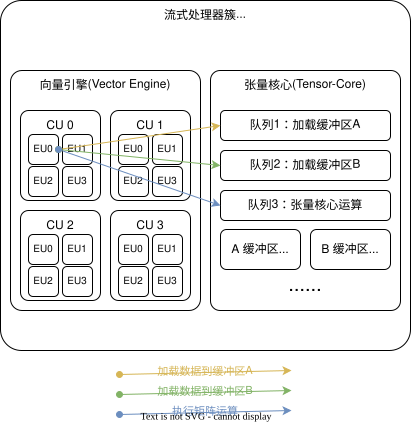</p><p align="center">图：SPC 内向量引擎向张量核心发送执行指令</p>

如上图所示，向量引擎和张量核心是在 SPC 内部的两个相对独立的单元，一个 SPC 的向量引擎内包含 4 个 CU，每个 CU 包含有 4 个 EU，每个 EU 上最多可运行 8 个线程束，之前使用过的非 tci/tci_p 内的核函数代码大部分都运行在向量引擎上。不同于向量引擎，张量核心仅提供计算矩阵乘法和卷积的能力，但是却有着远高于向量引擎的运算速度。在使用时，张量核心需要执行的指令需要由向量引擎发送，向量引擎在发送出张量核心的指令之后会直接返回并执行后续代码而不会等待到发送的张量核心指令执行完成（**异步执行**）。因此，控制张量核心的指令之间的同步以及和向量引擎之间的同步是能够正确高效使用 TCI-P 的关键。

以下为设备端用 TCI-P API 的矩阵乘法超大核函数实现：

```cpp
// examples/Advanced/TCIP-MatrixMul/matrixMul.su

#include <supa_tensor.h>

constexpr int kM = 1024;
constexpr int kK = 2048;
constexpr int kN = 1024;

constexpr int kTileM = 64;
constexpr int kTileK = 64;
constexpr int kTileN = 64;

constexpr int kMmaM = 64;
constexpr int kMmaK = 64;
constexpr int kMmaN = 64;

using namespace tensor;

// Use tcip to do the matrix multiply.
__global_mega__ void
MatrixMulDevice(UmaMatrix<FP32, BLOCK_ROW_MAJOR, kM, kN> out,
                UmaMatrix<FP32, BLOCK_ROW_MAJOR, kM, kK> inL,
                UmaMatrix<FP32, BLOCK_ROW_MAJOR, kK, kN> inR) {

    __tensor_abuf__ FP32 a_buf[kTileM * kTileK];
    __tensor_bbuf__ FP32 b_buf[kTileK * kTileN];

    for (int h = 0; h < kM; h += kTileM) {
        for (int w = 0; w < kN; w += kTileN) {

            tci_p::__acc_clear();

            // Need peel out loop 0 so that __acc_clear() can be combined with
            // next __mma()
            tci_p::__wait_a_calc(tci_p::A_BUF_CALC_0);
            // Load tile shape kMmaM x kMmaK from inL to a_buf at coordinate
            // (h, 0)
            tci_p::__load_input_a_buffer<kMmaM, kMmaK>(a_buf, inL,
                                                       Coordinate2D(h, 0));
            tci_p::__post_a_load(tci_p::A_BUF_LOAD_0);

            tci_p::__wait_b_calc(tci_p::B_BUF_CALC_0);
            // Load tile shape kMmaK x kMmaN from inR to b_buf at coordinate
            // (0, w)
            tci_p::__load_input_b_buffer<kMmaK, kMmaN>(b_buf, inR,
                                                       Coordinate2D(0, w));
            tci_p::__post_b_load(tci_p::B_BUF_LOAD_0);

            // Since load A buffer and load B buffer are in different queues,
            // they can be issued and executed simultaneously. We need to wait
            // both of them before calculation.
            tci_p::__wait_a_load(tci_p::A_BUF_LOAD_0);
            tci_p::__wait_b_load(tci_p::B_BUF_LOAD_0);
            // Do calculations with data in a_buf & b_buf and accumulate results
            // inside T-core. The M x K x N used are kMmaM x kMmaK x kMmaN.
            tci_p::__mma<kMmaM, kMmaK, kMmaN>(out, a_buf, b_buf);
            // Release the buffer
            tci_p::__post_a_calc(tci_p::A_BUF_CALC_0);
            tci_p::__post_b_calc(tci_p::B_BUF_CALC_0);

            int pos = kTileK;
            for (; pos < kK - kTileK; pos += kTileK) {
                tci_p::__wait_a_calc(tci_p::A_BUF_CALC_0);
                tci_p::__load_input_a_buffer<kMmaM, kMmaK>(
                    a_buf, inL, Coordinate2D(h, pos));
                tci_p::__post_a_load(tci_p::A_BUF_LOAD_0);

                tci_p::__wait_b_calc(tci_p::B_BUF_CALC_0);
                tci_p::__load_input_b_buffer<kMmaK, kMmaN>(
                    b_buf, inR, Coordinate2D(pos, w));
                tci_p::__post_b_load(tci_p::B_BUF_LOAD_0);

                tci_p::__wait_a_load(tci_p::A_BUF_LOAD_0);
                tci_p::__wait_b_load(tci_p::B_BUF_LOAD_0);
                tci_p::__mma<kMmaM, kMmaK, kMmaN>(out, a_buf, b_buf);
                tci_p::__post_a_calc(tci_p::A_BUF_CALC_0);
                tci_p::__post_b_calc(tci_p::B_BUF_CALC_0);
            }

            tci_p::__wait_a_calc(tci_p::A_BUF_CALC_0);
            tci_p::__load_input_a_buffer<kMmaM, kMmaK>(a_buf, inL,
                                                       Coordinate2D(h, pos));
            tci_p::__post_a_load(tci_p::A_BUF_LOAD_0);

            tci_p::__wait_b_calc(tci_p::B_BUF_CALC_0);
            tci_p::__load_input_b_buffer<kMmaK, kMmaN>(b_buf, inR,
                                                       Coordinate2D(pos, w));
            tci_p::__post_b_load(tci_p::B_BUF_LOAD_0);

            tci_p::__wait_a_load(tci_p::A_BUF_LOAD_0);
            tci_p::__wait_b_load(tci_p::B_BUF_LOAD_0);
            tci_p::__mma_to_tensor<kMmaM, kMmaK, kMmaN>(out, Coordinate2D(h, w),
                                                        nullptr, a_buf, b_buf);
            tci_p::__post_b_calc(tci_p::B_BUF_CALC_0);
            tci_p::__post_a_calc(tci_p::A_BUF_CALC_0);
        }
    }
}

int main() {
    // initialize inL and inR matrix on the host
    FP32 *inL = (FP32 *)malloc(kM * kK * sizeof(FP32));
    FP32 *inR = (FP32 *)malloc(kK * kN * sizeof(FP32));

    // ... prepare host data

    // Create Matrix Tensors
    UmaMatrix<FP32, BLOCK_ROW_MAJOR, kM, kK> A;
    UmaMatrix<FP32, BLOCK_ROW_MAJOR, kK, kN> B;
    UmaMatrix<FP32, BLOCK_ROW_MAJOR, kM, kN> O;

    // Load data into Matrix tensor and move to device
    A.copyFromRawData(suDenseRowMajor, inL);
    A.moveToDevice();
    B.copyFromRawData(suDenseRowMajor, inR);
    B.moveToDevice();

    // Launch kernel
    printf("Kernel start ....\n");
    suLaunchKernel(MatrixMulDevice, 1, 512, 0, nullptr, O, A, B);
    suDeviceSynchronize();
    suGetLastError();
    printf("Kernel finished!\n");

    // Load result
    O.moveToHost();
    FP32 *dO = (FP32 *)malloc(kM * kN * sizeof(FP32));
    O.copyToRawData(suDenseRowMajor, dO);

    // ... Error Check

    // Free device and host memory
    free(inL);
    free(inR);
    free(dO);
    free(hO);
    return 0;
}
```

由于 TCI-P API 是 TCI API 更精细化控制的版本，他们具有相似的结构与设计思路。所以，在以下例子中，我们可以在启动核函数时使用一个 SPC，并将任务分配转移到设备端超大核函数的循环中。

```cpp
suLaunchKernel(MatrixMulDevice, 1, 512, 0 , nullptr, O, A, B);

__global_mega__ void
MatrixMulDevice(UmaMatrix<FP32, BLOCK_ROW_MAJOR, kM, kN> out,
                UmaMatrix<FP32, BLOCK_ROW_MAJOR, kM, kK> inL,
                UmaMatrix<FP32, BLOCK_ROW_MAJOR, kK, kN> inR) {

    //  ... implementation

    for (int h = 0; h < kM; h += kTileM) {
        for (int w = 0; w < kN; w += kTileN) {
            // ... implementation
        }
    }
}
```

在上述例子中，在内层循环最后一步会运算并得到 64 \* 64 区域的结果，其中在 `kK` 方向上的循环步长为 64。故而配置以下运算 tile 的大小以及步长信息 `kTileM = 64`、`kTileN = 64` 与 `kTileK = 64`。

与 TCI 中定于 A/B 缓冲区的形式不同，TCI-P 中通过使用 `__tensor_abuf__` 以及 `__tensor_bbuf__` 关键字进行标注。例如在以下代码中使用 `__tensor_abuf__` 与 `__tensor_bbuf__` 修饰的数组 `a_buf` 与 `b_buf` 分别表示大小为 `kTileM * kTileK * sizeof(FP32)`（64 \* 64 \* 4）Byte 的缓冲区 A 与大小为 `kTileK * kTileN * sizeof(FP32)`（64 \* 64 \* 4）Byte 的缓冲区 B。

```cpp
constexpr int kTileM = 64;
constexpr int kTileN = 64;
constexpr int kTileK = 64;

__tensor_abuf__ FP32 a_buf[kTileM * kTileK];
__tensor_bbuf__ FP32 b_buf[kTileK * kTileN];
```

以下代码使用高性能张量核心计算原语（TCI-P）的矩阵乘法 API：

- `tensor::tci_p::__load_input_a_buffer` 对缓冲区 A 进行大小为 `kMmaM * kMmaK` （64 \* 64）的数据加载；
- `tensor::tci_p::__load_input_b_buffer` 对缓冲区 B 进行大小为 `kMmaK * kMmaN` （64 \* 64）的数据加载；
- `tensor::tci_p::__mma` 对 `a_buf` 和 `b_buf` 指向的 A/B 缓冲区数据进行大小为 `kMmaM * kMmaK * kMmaN`（64 \* 64 \* 64）的矩阵运算，并将结果累加到张量核心内部的累加器上。
- `tensor::tci_p::__mma_to_tensor` 对 `a_buf` 和 `b_buf` 指向的 A/B 缓冲区数据进行大小为 `kMmaM * kMmaK * kMmaN`（64 \* 64 \* 64）的矩阵运算，并将结果累加到张量核心内部的累加器上后再将累加器的结果写入张量 `out` 中以坐标 `[h, w]` 为起点的 `kMmaM * kMmaN` 区域。

BIRENSUPA 要求在使用这些 API 时，使用模板参数配置他们加载或者运算时的数据大小和维度信息。

```cpp
constexpr int kMmaM = 64;
constexpr int kMmaK = 64;
constexpr int kMmaN = 64;

tensor::tci_p::__load_input_a_buffer<kMmaM, kMmaK>(a_buf, inL,
                                                   Coordinate2D(h, 0));
tensor::tci_p::__load_input_b_buffer<kMmaK, kMmaN>(b_buf, inR,
                                           Coordinate2D(0, w));
tensor::tci_p::__mma<kMmaM, kMmaK, kMmaN>(out, a_buf, b_buf);
tensor::tci_p::__mma_to_tensor<kMmaM, kMmaK, kMmaN>(
               out, Coordinate2D(h, w), nullptr, a_buf, b_buf);
```

在使用 TCI-P API 进行编程时，不需要额外构建累加器变量；BIRENSUPA 在执行高性能张量核心矩阵乘法 API（`tensor::tci_p::__mma*`）以及高性能张量核心卷积运算 API（`tensor::tci_p::__conv*`）时使用的累加器为一个 SPC 内共享且唯一的。使用 `tensor::tci_p::__acc_clear()` API 可清空累加器状态。

```cpp
// Clear and init the Accumulator
tensor::tci_p::__acc_clear();
```

<table><tr><td bgcolor=#ffeccc><b>注意：根据壁仞通用 GPU 硬件设计版本等于 1.x 的要求，__acc_clear() API 与其对应的最近的高性能张量核心矩阵乘法 API 以及高性能张量核心卷积运算 API 需要处在同一个代码段中。</b> </td></tr></table>

在使用 TCI-P API 进行编程时，可使用带有 `__tensor_grb__` 属性的指针表示归约缓冲区，后续可以使用归约缓冲区指针控制 API 操作归约缓冲区内的数据。如若希望在张量核运算完毕后对结果进行归约运算，仅需要在直接输出到张量类型（`__mma_to_tensor`，`__conv_to_tensor`）或输出到线程本地寄存器（`__mma_to_short_vector`，`__mma_to_short_vector_offset_2tlr`、`__conv_to_short_vector`，`__conv_to_short_vector_offset_2tlr`）时添加归约缓冲区指针的使用，并使用模板参数配置归约缓冲区运算模式。在不希望使用归约缓冲区运算时可直接填入 `nullptr` 并将归约模式配置为 `wti::REDUCE_NONE`（默认模式）。

```cpp
// define grb pointer
__tensor_grb__ FP32 grb[8];

// mma output with grb calculate SUM
tensor::tci_p::__mma_to_tensor<kMmaM, kMmaK, kMmaN, tensor::wti::REDUCE_SUM>(
                out, Coordinate2D(h, w), grb, a_buf, b_buf);

// mma output without using grb
tensor::tci_p::__mma_to_tensor<kMmaM, kMmaK, kMmaN>(
                out, Coordinate2D(h, w), nullptr, a_buf, b_buf);
```

根据壁仞通用 GPU 硬件设计，对张量核心缓冲区 A 的加载、对张量核心缓冲区 B 的加载以及张量核心运算（矩阵乘法或卷积运算）均为异步执行操作并且分属三个独立的执行队列。在同一执行队列内的操作会按照加入执行队列的顺序依次执行；在不添加信号量进行控制的情况下，不同队列上的操作会独立执行。所以在此情况下，数据加载与数据运算之间的依赖关系无法得到保证。例如通常需要保证在张量核心运算前，所需要的 A/B 张量核心缓冲区内的数据均已加载完成；或是在张量核心缓冲区加载之前，对张量核心缓冲区内旧数据的使用已经完成。

<p align="center">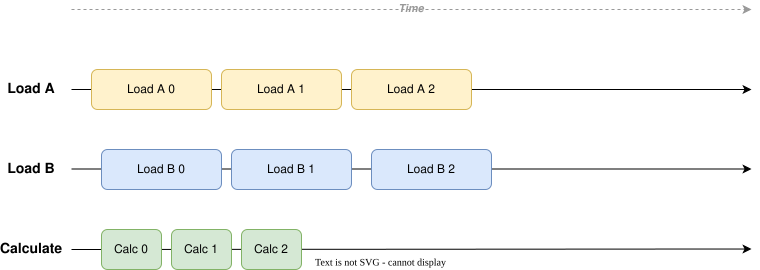</p><p align="center">图：BIRENSUPA 不使用 TCI-P 加载运算信号量控制时的流水</p>

因此，BIRENSUPA 在 `tensor::tci_p` 命名空间下引入用于控制加载和运算之间同步关系的信号量，该信号量被定义为“张量核心同步信号量”；根据壁仞通用 GPU 硬件设计，BIRENSUPA 提供了 4 组张量核心同步信号量：`A_BUF_LOAD`、`A_BUF_CALC`、`B_BUF_LOAD` 和 `B_BUF_CALC`。每一组分别代表不同种类的的数据依赖关系，例如 `A_BUF_LOAD` 表示加载 A 缓冲区完成与使用 A 缓冲区中数据运算之间的前后依赖，`B_BUF_CALC` 表示使用 B 缓冲区数据运算与往 B 缓冲区中加载新数据的前后依赖。同一组信号量中各自包含 16 个信号量频道，用于控制 16 个同一种类的依赖关系。以下为他们所对应的发送接收 API 和使用时机。

| API             | 信号量     |                   |
| --------------- | ---------- | ----------------- |
| \_\_post_a_load | A_BUF_LOAD | 加载缓冲区 A 之后 |
| \_\_wait_a_load | A_BUF_LOAD | 运算之前          |
| \_\_post_b_load | B_BUF_LOAD | 加载缓冲区 B 之后 |
| \_\_wait_b_load | B_BUF_LOAD | 运算之前          |
| \_\_post_a_calc | A_BUF_CALC | 运算之后          |
| \_\_wait_a_calc | A_BUF_CALC | 加载缓冲区 A 之前 |
| \_\_post_b_calc | B_BUF_CALC | 运算之后          |
| \_\_wait_b_calc | B_BUF_CALC | 加载缓冲区 B 之前 |

以上的信号量控制 API 与张量核心缓冲区 A 或 B 的加载 API、张量核心运算 API 同样处在三个不同的执行队列中：

1. `__post_a_load`、`__wait_a_calc` 与所有加载缓冲区 A 的 API 处在同一个序列中，并保证顺序执行
2. `__post_b_load`、`__wait_b_calc` 与所有加载缓冲区 B 的 API 处在同一个序列中，并保证顺序执行
3. `__wait_a_load`、`__wait_b_load`、`__post_a_calc`、`__post_b_calc` 与 TCI-P 矩阵乘法运算或卷积运算（包括输出）的 API 处在同一个序列中，并保证顺序执行

程序员需要正确的使用这些信号量控制的 API 以保证整体算法流水的正确性。错误的使用信号量会导致程序锁死。使用张量核心同步信号量控制数据加载和计算时有以下注意事项：

1. 第一次加载 A/B 缓冲区之前需要先进行一次相应的等待操作（`__wait_a_calc` 和 `__wait_b_calc`）。X_BUF_CALC 的初始状态为 “已计算完成，未等待”。
2. 与 1 相对应的是，最后一条张量核心运算完毕后，需添加相应信号量发射操作（`__post_a_calc` 和 `__post_b_calc`）。X_BUF_LOAD 的结束状态同样应为 “已计算完成，未等待”。
3. X_BUF_LOAD 状态应为先发射信号量再等待信号量，该类信号量的开始以及结束状态都应为“已等待加载完成，未发射信号量”；
4. 同一信号量不能被连续等待或发射两次。一个信号量被发射后必须再被等待后才可以再次被发射，同理一个信号被等待后必须再被发射后才可被再次等待。

<p align="center">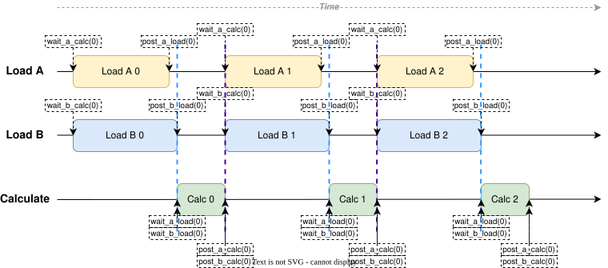</p><p align="center">图：BIRENSUPA 使用一组 TCI-P 加载运算信号量控制时的流水</p>

在上述图示中只使用了一个信号量频道 0 用于控制缓冲区 A/B 的加载与矩阵乘法运算，上述做法相比于之前不使用张量核心同步信号量的做法可以得到正确的计算结果，但是却不能达到异步 API 互相隐藏运算或者加载时间的效果。以下的例子中，在不改变整体循环逻辑的情况下，尝试使用两个信号量频道进行乒乓的优化算法。

```cpp
// examples/Advanced/TCIP-MatrixMul-DoubleK/matrixMul.su

#include <supa_tensor.h>

constexpr int kM = 1024;
constexpr int kK = 2048;
constexpr int kN = 1024;

constexpr int kTileM = 64;
constexpr int kTileK = 128;
constexpr int kTileN = 64;

constexpr int kMmaM = 64;
constexpr int kMmaK = 64;
constexpr int kMmaN = 64;

using namespace tensor;

// Use mega kernel and tensor instructions to do the Matrix Multiply.
// SPC 64x64, each CU 32x32
__global_mega__ void
MatrixMulDevice(UmaMatrix<FP32, BLOCK_ROW_MAJOR, kM, kN> out,
                UmaMatrix<FP32, BLOCK_ROW_MAJOR, kM, kK> inL,
                UmaMatrix<FP32, BLOCK_ROW_MAJOR, kK, kN> inR) {

    __tensor_abuf__ FP32 a_buf[kTileM * kTileK];
    __tensor_bbuf__ FP32 b_buf[kTileK * kTileN];

    for (int h = 0; h < kM; h += kTileM) {
        for (int w = 0; w < kN; w += kTileN) {

            tci_p::__acc_clear();

            // Use set 0
            tci_p::__wait_a_calc(tci_p::A_BUF_CALC_0);
            // Load tile shape kMmaM x kMmaK from inL to a_buf at coordinate
            // (h, 0)
            tci_p::__load_input_a_buffer<kMmaM, kMmaK>(a_buf, inL,
                                                       Coordinate2D(h, 0));
            tci_p::__post_a_load(tci_p::A_BUF_LOAD_0);

            // Use set 1
            tci_p::__wait_a_calc(tci_p::A_BUF_CALC_1);
            // Load tile shape kMmaM x kMmaK from inL to a_buf at coordinate
            // (h, kMmaK)
            tci_p::__load_input_a_buffer<kMmaM, kMmaK>(
                a_buf + kMmaM * kMmaK, inL, Coordinate2D(h, kMmaK));
            tci_p::__post_a_load(tci_p::A_BUF_LOAD_1);

            // Use set 0
            tci_p::__wait_b_calc(tci_p::B_BUF_CALC_0);
            // Load tile shape kMmaK x kMmaN from inR to b_buf at coordinate
            // (0, w)
            tci_p::__load_input_b_buffer<kMmaK, kMmaN>(b_buf, inR,
                                                       Coordinate2D(0, w));
            tci_p::__post_b_load(tci_p::B_BUF_LOAD_0);

            // Use set 1
            tci_p::__wait_b_calc(tci_p::B_BUF_CALC_1);
            // Load tile shape kMmaK x kMmaN from inR to b_buf at coordinate
            // (kMmaK, w)
            tci_p::__load_input_b_buffer<kMmaK, kMmaN>(
                b_buf + kMmaK * kMmaN, inR, Coordinate2D(kMmaK, w));
            tci_p::__post_b_load(tci_p::B_BUF_LOAD_1);

            // Use set 0
            // Since load A buffer and load B buffer are in different queues,
            // they can be issued and executed simultaneously. We need to wait
            // both of them before calculation.
            tci_p::__wait_a_load(tci_p::A_BUF_LOAD_0);
            tci_p::__wait_b_load(tci_p::B_BUF_LOAD_0);
            // Do calculations with data in a_buf & b_buf and accumulate results
            // inside T-core. The M x K x N used are kMmaM x kMmaK x kMmaN.
            tci_p::__mma<kMmaM, kMmaK, kMmaN>(out, a_buf, b_buf);
            tci_p::__post_a_calc(tci_p::A_BUF_CALC_0);
            tci_p::__post_b_calc(tci_p::B_BUF_CALC_0);

            // Use set 1
            tci_p::__wait_a_load(tci_p::A_BUF_LOAD_1);
            tci_p::__wait_b_load(tci_p::B_BUF_LOAD_1);
            tci_p::__mma<kMmaM, kMmaK, kMmaN>(out, a_buf + kMmaM * kMmaK,
                                              b_buf + kMmaK * kMmaN);
            tci_p::__post_a_calc(tci_p::A_BUF_CALC_1);
            tci_p::__post_b_calc(tci_p::B_BUF_CALC_1);

            int pos = kTileK;
            for (; pos < kK - kTileK; pos += kTileK) {
                tci_p::__wait_a_calc(tci_p::A_BUF_CALC_0);
                tci_p::__load_input_a_buffer<kMmaM, kMmaK>(
                    a_buf, inL, Coordinate2D(h, pos));
                tci_p::__post_a_load(tci_p::A_BUF_LOAD_0);

                tci_p::__wait_a_calc(tci_p::A_BUF_CALC_1);
                tci_p::__load_input_a_buffer<kMmaM, kMmaK>(
                    a_buf + kMmaM * kMmaK, inL, Coordinate2D(h, pos + kMmaK));
                tci_p::__post_a_load(tci_p::A_BUF_LOAD_1);

                tci_p::__wait_b_calc(tci_p::B_BUF_CALC_0);
                tci_p::__load_input_b_buffer<kMmaK, kMmaN>(
                    b_buf, inR, Coordinate2D(pos, w));
                tci_p::__post_b_load(tci_p::B_BUF_LOAD_0);

                tci_p::__wait_b_calc(tci_p::B_BUF_CALC_1);
                tci_p::__load_input_b_buffer<kMmaK, kMmaN>(
                    b_buf + kMmaK * kMmaN, inR, Coordinate2D(pos + kMmaK, w));
                tci_p::__post_b_load(tci_p::B_BUF_LOAD_1);

                tci_p::__wait_a_load(tci_p::A_BUF_LOAD_0);
                tci_p::__wait_b_load(tci_p::B_BUF_LOAD_0);
                tci_p::__mma<kMmaM, kMmaK, kMmaN>(out, a_buf, b_buf);
                tci_p::__post_a_calc(tci_p::A_BUF_CALC_0);
                tci_p::__post_b_calc(tci_p::B_BUF_CALC_0);

                tci_p::__wait_a_load(tci_p::A_BUF_LOAD_1);
                tci_p::__wait_b_load(tci_p::B_BUF_LOAD_1);
                tci_p::__mma<kMmaM, kMmaK, kMmaN>(out, a_buf + kMmaM * kMmaK,
                                                  b_buf + kMmaK * kMmaN);
                tci_p::__post_a_calc(tci_p::A_BUF_CALC_1);
                tci_p::__post_b_calc(tci_p::B_BUF_CALC_1);
            }

            tci_p::__wait_a_calc(tci_p::A_BUF_CALC_0);
            tci_p::__load_input_a_buffer<kMmaM, kMmaK>(a_buf, inL,
                                                       Coordinate2D(h, pos));
            tci_p::__post_a_load(tci_p::A_BUF_LOAD_0);

            tci_p::__wait_a_calc(tci_p::A_BUF_CALC_1);
            tci_p::__load_input_a_buffer<kMmaM, kMmaK>(
                a_buf + kMmaM * kMmaK, inL, Coordinate2D(h, pos + kMmaK));
            tci_p::__post_a_load(tci_p::A_BUF_LOAD_1);

            tci_p::__wait_b_calc(tci_p::B_BUF_CALC_0);
            tci_p::__load_input_b_buffer<kMmaK, kMmaN>(b_buf, inR,
                                                       Coordinate2D(pos, w));
            tci_p::__post_b_load(tci_p::B_BUF_LOAD_0);

            tci_p::__wait_b_calc(tci_p::B_BUF_CALC_1);
            tci_p::__load_input_b_buffer<kMmaK, kMmaN>(
                b_buf + kMmaK * kMmaN, inR, Coordinate2D(pos + kMmaK, w));
            tci_p::__post_b_load(tci_p::B_BUF_LOAD_1);

            tci_p::__wait_a_load(tci_p::A_BUF_LOAD_0);
            tci_p::__wait_b_load(tci_p::B_BUF_LOAD_0);
            tci_p::__mma<kMmaM, kMmaK, kMmaN>(out, a_buf, b_buf);
            tci_p::__post_a_calc(tci_p::A_BUF_CALC_0);
            tci_p::__post_b_calc(tci_p::B_BUF_CALC_0);

            tci_p::__wait_a_load(tci_p::A_BUF_LOAD_1);
            tci_p::__wait_b_load(tci_p::B_BUF_LOAD_1);
            tci_p::__mma_to_tensor<kMmaM, kMmaK, kMmaN>(
                out, Coordinate2D(h, w), nullptr, a_buf + kMmaM * kMmaK,
                b_buf + kMmaK * kMmaN);
            tci_p::__post_b_calc(tci_p::B_BUF_CALC_1);
            tci_p::__post_a_calc(tci_p::A_BUF_CALC_1);
        }
    }
}
```

在上述例子中，SPC 每一步循环最终依然运算 64 \* 64 区域的结果，由于引入了乒乓的逻辑，所以在最内层 `kK` 方向上的循环的每一步中进行两次缓冲区 A、两次缓冲区 B 的加载与两次矩阵乘法运算；也因此需要构建更大的缓冲区：大小为 `kTileM * kTileK`（64 \* 128）的缓冲区 A 与大小为 `kTileK * kTileN`（128 \* 64）的缓冲区 B。

```cpp
constexpr int kTileM = 64;
constexpr int kTileK = 128;
constexpr int kTileN = 64;

__tensor_abuf__ FP32 a_buf[kTileM * kTileK];
__tensor_bbuf__ FP32 b_buf[kTileK * kTileN];
```

在上述例子中，使用了两组信号量频道 `A_BUF_CALC_0`/`A_BUF_LOAD_0`/`B_BUF_CALC_0`/`B_BUF_LOAD_0`（第一组信号量频道）与 `A_BUF_CALC_1`/`A_BUF_LOAD_1`/`B_BUF_CALC_1`/`B_BUF_LOAD_1`（第二组信号量频道）。每次循环中第一次的加载缓冲区 A/B 与使用他们的第一次运算会使用第一组信号量频道，第二次的加载缓冲区 A/B 与使用它们的运算会使用第二组信号量频道。

```cpp
// Use set 0
tensor::tci_p::__wait_a_calc(tci_p::A_BUF_CALC_0);
tensor::tci_p::__load_input_a_buffer<kMmaM, kMmaK>(
    a_buf, inL, Coordinate2D(h, pos));
tensor::tci_p::__post_a_load(tci_p::A_BUF_LOAD_0);

// Use set 1
tensor::tci_p::__wait_a_calc(tci_p::A_BUF_CALC_1);
tensor::tci_p::__load_input_a_buffer<kMmaM, kMmaK>(
    a_buf + kMmaM * kMmaK, inL, Coordinate2D(h, pos + kMmaK));
tensor::tci_p::__post_a_load(tci_p::A_BUF_LOAD_1);

// Use set 0
tensor::tci_p::__wait_b_calc(tci_p::B_BUF_CALC_0);
tensor::tci_p::__load_input_b_buffer<kMmaK, kMmaN>(
    b_buf, inR, Coordinate2D(pos, w));
tensor::tci_p::__post_b_load(tci_p::B_BUF_LOAD_0);

// Use set 1
tensor::tci_p::__wait_b_calc(tci_p::B_BUF_CALC_1);
tensor::tci_p::__load_input_b_buffer<kMmaK, kMmaN>(
    b_buf + kMmaK * kMmaN, inR, Coordinate2D(pos + kMmaK, w));
tensor::tci_p::__post_b_load(tci_p::B_BUF_LOAD_1);

// Use set 0
tensor::tci_p::__wait_a_load(tci_p::A_BUF_LOAD_0);
tensor::tci_p::__wait_b_load(tci_p::B_BUF_LOAD_0);
tensor::tci_p::__mma<kMmaM, kMmaK, kMmaN>(out, a_buf, b_buf);
tensor::tci_p::__post_a_calc(tci_p::A_BUF_CALC_0);
tensor::tci_p::__post_b_calc(tci_p::B_BUF_CALC_0);

// Use set 1
tensor::tci_p::__wait_a_load(tci_p::A_BUF_LOAD_1);
tensor::tci_p::__wait_b_load(tci_p::B_BUF_LOAD_1);
tensor::tci_p::__mma<kMmaM, kMmaK, kMmaN>(out, a_buf + kMmaM * kMmaK,
    b_buf + kMmaK * kMmaN);
tensor::tci_p::__post_a_calc(tci_p::A_BUF_CALC_1);
tensor::tci_p::__post_b_calc(tci_p::B_BUF_CALC_1);
```

与之前只使用一组信号量的例子相同的是，每次 `tensor::tci_p::__load_input_a_buffer` API 会为加载缓冲区 A 加载 `kMmaM * kMmaK`（64 \* 64）大小的数据；每次 `tensor::tci_p::__load_input_b_buffer` API 会为缓冲区 B 加载 `kMmaK * kMmaN`（64 \* 64）大小的数据；每次 `tensor::tci_p::__mma*` API 会进行 `kMmaM * kMmaK * kMmaN`（64 \* 64 \* 64）大小的矩阵运算。
引入两组信号量之后，矩阵乘法的运算的时间消耗可以被隐藏在缓冲区 A 与 B 的加载时间中。

<p align="center">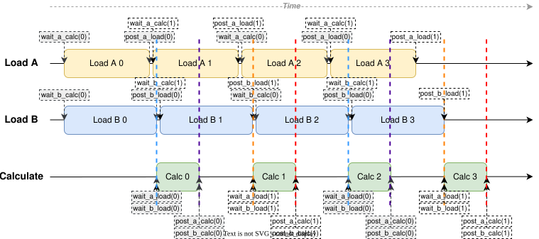</p><p align="center">图：BIRENSUPA 使用两组 TCI-P 加载运算信号量控制时的流水</p>

观察上图中可以发现，在使用两个信号量频道之后，计算操作依然会被阻塞，需要等待到加载完成才可以开始，但是加载操作不再会被计算操作阻塞。这是因为上图中 "Load A/B 0"、“Calc 0” 与 “Load A/B 2”、“Calc 2” 使用的是同一组信号量频道 0；而 "Load A/B 1"、“Calc 1” 与 “Load A/B 3”、“Calc 3” 使用的是另一组信号量频道 1，因此从信号量依赖关系上只有 “Calc 0” 会阻塞 “Load A/B 2”，“Calc 1” 会阻塞 “Load A/B 3”。然而实际运行中，通常单次数据加载时间会长于计算时间，因此在流水图上会发现数据加载操作实际上并未被运算操作所阻塞。

<div style="page-break-after:always"></div>

### 使用高性能张量核心计算原语 API 的矩阵乘法与协程

在使用 BIRENSUPA TCI-P API 进行编程时，除了可以使用信号量精细控制张量核心内部的的加载与运算，还可以使用协程功能精细控制张量核心（Tensor-Core/T-Core）与向量引擎（Vector-Engine）之间的异步执行。

BIRENSUPA 的协程模式使用 lambda 表达式通过捕获参数的形式来构建协同程序，并使用 `supa::async()` 函数来启动。在构建协程 lambda 表达式函数时，需要添加属性 `__vector__` 或 `__tcore__` 用于表示当前协程 lambda 函数为向量逻辑或张量核心逻辑。

- 在标记属性 `__vector__` 的向量逻辑代码中，不能使用`tensor::tci::` 命名空间与 `tensor::tci_p::` 命名空间内除去用于表达同步的 `tci_p::__wait_tcore` 接口以外的其他接口。
- 在标记属性 `__tcore__` 的 T-Core 逻辑代码中，不能使用`tensor::wti::` 命名空间内所有接口，以及用于表达向量引擎等待张量核心同步的 `tci_p::__wait_tcore` 接口。

```cpp
__global_mega__ void
MatrixMulDevice(UmaMatrix<FP32, BLOCK_ROW_MAJOR, kM, kN> out,
                UmaMatrix<FP32, BLOCK_ROW_MAJOR, kM, kK> inL,
                UmaMatrix<FP32, BLOCK_ROW_MAJOR, kK, kN> inR) {

    // Shared TLR (thread local register)
    __coroutine_shared__ float8 sv;
    // Two semaphore for calculation between T-Core and Vector Engine.
    // Since shared register is used for both T-core and Vector Engine
    supa::sem_cluster_t t2v;
    supa::sem_cluster_t v2t;

    // Vector Engine cwarp.
    auto cwarp_vector = [out, &sv, &t2v, &v2t]() __vector__ {
        // ...
        tci_p::__wait_tcore(&t2v); // Wait T-Core -> Vector Engine semaphore
        // ...
        supa::sem_post(&v2t, 17); // Post Vector Engine -> T-Core semaphore
        // ...
    };

    // T-Core cwarp
    auto cwarp_tcore = [out, inL, inR, &sv, &t2v, &v2t]() __tcore__ {
        // ...
        tci_p::__tcore_post(&t2v, 16); // Wait Vector Engine -> T-Core semaphore
        // ...
        supa::sem_wait(&v2t, 17); // Post T-Core -> Vector Engine semaphore
        // ...
    };

    supa::async(cwarp_vector);
    supa::async(cwarp_tcore);
}
```

在上述代码片段中，首先使用 `__coroutine_share__` 表示声明了协程共享的变量，共享变量 `sv` 用于接收 `__tcore__` 协程计算的矩阵乘法结果，并在 `__vector__` 协程中进行后续运算（如加 bias，ReLU 等）。而后声明了两个用于 `__tcore__` 协程与 `__vector__` 协程之间同步的 `supa::sem_cluster_t` 类型信号量。所有在 lambda 函数中需要的参数均需要通过捕获列表传入。捕获列表参数分为两种，需要按照以下要求捕获：

- 核函数内定义的共享资源：例如共享变量，协程信号变量等。此类参数在捕获列表中必须按引用捕获。
- 核函数本身参数：例如传入的张量，单个整形或浮点数。此类参数在捕获列表中必须按值捕获。
- 共享内存 (`__shared__`) 和 `constexpr` 变量: 共享内存和 `constexpr` 变量可以在 lambda 函数外声明，并在 lambda 函数内使用而**无需捕获**。

BIRENSUPA 要求 `__tcore__` 协程与 `__vector__` 协程之间同步需使用 `supa::sem_cluster_t` 类型信号量（以上例子中 `t2v` 与 `v2t`）以及对应的信号量发送/接收 API 以达到精细控制 T-Core 以及 Vector Engine 执行顺序的效果。

- `tci_p::__tcore_post(&t2v, 16)` 仅在 `__tcore__` 协程中可使用，向 `__vector__` 协程中发出的 `t2v` 信号量，其中参数 `16` 表达 `__vector__` 协程中需要收到该信号量的 warp 数量
- `tci_p::__wait_tcore(&t2v)` 仅在 `__vector__` 协程中可使用，等待 `__tcore__` 协程中发出的 `t2v` 信号量
- `supa::sem_post(&v2t, 17)` 通常在 `__vector__` 协程中使用，向 `__tcore__` 或其他 `__vector__` 协程中发出的 `v2t` 信号量，其中参数 `17` 表达参与整个同步的包括发送和接收的 warp 数量（此处因为由 `__tcore__` 接收信号量，整个 `__tcore__` 协程看作一个 head warp，故而参与的 warp 总数为 `__vector__` 中的 16 个加上 `__tcore__` 中的一个为 17 个）
- `supa::sem_wait(&v2t, 17)` 在 `__tcore__` 协程中使用，等待 `__vector__` 协程中发出的 `v2t` 信号量，其中参数 `17` 表达参与整个同步的包括发送和接收的 warp 数量（计算方式与 `supa::sem_post()` 一致，数量也应与对应的 `supa::sem_post()` 一致）

为了展示 Vector Engine 部分的运算，以下例子引入了一个标记为 `__forceinline__`（协程捕获函数中调用的函数需要标记 `__forceinline__` 或 `inline` 属性）的设备端函数 `relu_device` 在矩阵乘法之后进行进行 relu 运算。以下展示了完整使用协程模式下的矩阵乘法加 RELU 运算的完整例子

```cpp
// examples/Advanced/Coroutine-TCIP-MmaTLRRelu/coroutine_complex.su

#include <supa_tensor.h>

constexpr int kM = 1024;
constexpr int kK = 2048;
constexpr int kN = 1024;

constexpr int kTileM = 64;
constexpr int kTileK = 128;
constexpr int kTileN = 64;

constexpr int kMmaM = 64;
constexpr int kMmaK = 64;
constexpr int kMmaN = 64;

using namespace tensor;

__device__ __forceinline__ void relu_device(float4 *sv) {
    sv->x = sv->x > 0 ? sv->x : 0;
    sv->y = sv->y > 0 ? sv->y : 0;
    sv->z = sv->z > 0 ? sv->z : 0;
    sv->w = sv->w > 0 ? sv->w : 0;
}

__global_mega__ void
MatrixMulDevice(UmaMatrix<FP32, BLOCK_ROW_MAJOR, kM, kN> out,
                UmaMatrix<FP32, BLOCK_ROW_MAJOR, kM, kK> inL,
                UmaMatrix<FP32, BLOCK_ROW_MAJOR, kK, kN> inR) {

    // Shared TLR (thread local register)
    __coroutine_shared__ float8 sv;
    // Two semaphore for calculation between T-Core and Vector Engine.
    // Since shared register is used for both T-core and Vector Engine
    supa::sem_cluster_t t2v;
    supa::sem_cluster_t v2t;

    // Vector Engine cwarp.
    auto cwarp_vector = [out, &sv, &t2v, &v2t]() __vector__ {
        // Post buffer ready signal so that T-Core and fill new data.
        // 17 means number of warp that "send & receive" the signal. (1 T-core
        // head warp + 16 vector warps)
        supa::sem_post(&v2t, 17);

        for (int h = 0; h < kM; h += kTileM) {
            for (int w = 0; w < kN; w += kTileN) {

                // Wait tcore result
                tci_p::__wait_tcore(&t2v);

                float4 a(sv.d0, sv.d1, sv.d2, sv.d3);
                float4 b(sv.d4, sv.d5, sv.d6, sv.d7);

                // relu
                relu_device(&a);
                relu_device(&b);

                // Store result to output
                wti::__store_matrix(out, Coordinate2D(h + (warp_idx & 0xf) * 2, w), a);
                wti::__store_matrix(out, Coordinate2D(h + (warp_idx & 0xf) * 2 + 32, w),
                                    b);

                // Post buffer ready signal so that T-Core and fill new data.
                // 17 means number of warp that "send & receive" the signal. (1
                // T-core head warp + 16 vector warps)
                supa::sem_post(&v2t, 17);
            }
        }
    };

    // T-Core cwarp
    auto cwarp_tcore = [out, inL, inR, &sv, &t2v, &v2t]() __tcore__ {
        // Define A buffer and B buffer needed
        // A buffer is used to store left matrix.
        __tensor_abuf__ FP32 a_buf[kTileM * kTileK];
        // B buffer is used to store right matrix.
        __tensor_bbuf__ FP32 b_buf[kTileK * kTileN];

        for (int h = 0; h < kM; h += kTileM) {
            for (int w = 0; w < kN; w += kTileN) {
                tci_p::__acc_clear();

                // Use set 0
                tci_p::__wait_a_calc(tci_p::A_BUF_CALC_0);
                // Load tile shape kMmaM x kMmaK from inL to a_buf at coordinate
                // (h, 0)
                tci_p::__load_input_a_buffer<kMmaM, kMmaK>(a_buf, inL,
                                                           Coordinate2D(h, 0));
                tci_p::__post_a_load(tci_p::A_BUF_LOAD_0);

                // Use set 1
                tci_p::__wait_a_calc(tci_p::A_BUF_CALC_1);
                // Load tile shape kMmaM x kMmaK from inL to a_buf at coordinate
                // (h, kMmaK)
                tci_p::__load_input_a_buffer<kMmaM, kMmaK>(
                    a_buf + kMmaM * kMmaK, inL, Coordinate2D(h, kMmaK));
                tci_p::__post_a_load(tci_p::A_BUF_LOAD_1);

                // Use set 0
                tci_p::__wait_b_calc(tci_p::B_BUF_CALC_0);
                // Load tile shape kMmaK x kMmaN from inR to b_buf at coordinate
                // (0, w)
                tci_p::__load_input_b_buffer<kMmaK, kMmaN>(b_buf, inR,
                                                           Coordinate2D(0, w));
                tci_p::__post_b_load(tci_p::B_BUF_LOAD_0);

                // Use set 1
                tci_p::__wait_b_calc(tci_p::B_BUF_CALC_1);
                // Load tile shape kMmaK x kMmaN from inR to b_buf at coordinate
                // (kMmaK, w)
                tci_p::__load_input_b_buffer<kMmaK, kMmaN>(
                    b_buf + kMmaK * kMmaN, inR, Coordinate2D(kMmaK, w));
                tci_p::__post_b_load(tci_p::B_BUF_LOAD_1);

                // Use set 0
                // Since load A buffer and load B buffer are in different
                // queues, they can be issued and executed simultaneously. We
                // need to wait both of them before calculation.
                tci_p::__wait_a_load(tci_p::A_BUF_LOAD_0);
                tci_p::__wait_b_load(tci_p::B_BUF_LOAD_0);
                // Do calculations with data in a_buf & b_buf and accumulate
                // results inside T-core. The M x K x N used are kMmaM x kMmaK x
                // kMmaN.
                tci_p::__mma<kMmaM, kMmaK, kMmaN>(out, a_buf, b_buf);
                tci_p::__post_a_calc(tci_p::A_BUF_CALC_0);
                tci_p::__post_b_calc(tci_p::B_BUF_CALC_0);

                // Use set 1
                tci_p::__wait_a_load(tci_p::A_BUF_LOAD_1);
                tci_p::__wait_b_load(tci_p::B_BUF_LOAD_1);
                tci_p::__mma<kMmaM, kMmaK, kMmaN>(out, a_buf + kMmaM * kMmaK,
                                                  b_buf + kMmaK * kMmaN);
                tci_p::__post_a_calc(tci_p::A_BUF_CALC_1);
                tci_p::__post_b_calc(tci_p::B_BUF_CALC_1);

                int pos = kTileK;
                for (; pos < kK - kTileK; pos += kTileK) {
                    tci_p::__wait_a_calc(tci_p::A_BUF_CALC_0);
                    tci_p::__load_input_a_buffer<kMmaM, kMmaK>(
                        a_buf, inL, Coordinate2D(h, pos));
                    tci_p::__post_a_load(tci_p::A_BUF_LOAD_0);

                    tci_p::__wait_a_calc(tci_p::A_BUF_CALC_1);
                    tci_p::__load_input_a_buffer<kMmaM, kMmaK>(
                        a_buf + kMmaM * kMmaK, inL,
                        Coordinate2D(h, pos + kMmaK));
                    tci_p::__post_a_load(tci_p::A_BUF_LOAD_1);

                    tci_p::__wait_b_calc(tci_p::B_BUF_CALC_0);
                    tci_p::__load_input_b_buffer<kMmaK, kMmaN>(
                        b_buf, inR, Coordinate2D(pos, w));
                    tci_p::__post_b_load(tci_p::B_BUF_LOAD_0);

                    tci_p::__wait_b_calc(tci_p::B_BUF_CALC_1);
                    tci_p::__load_input_b_buffer<kMmaK, kMmaN>(
                        b_buf + kMmaK * kMmaN, inR,
                        Coordinate2D(pos + kMmaK, w));
                    tci_p::__post_b_load(tci_p::B_BUF_LOAD_1);

                    tci_p::__wait_a_load(tci_p::A_BUF_LOAD_0);
                    tci_p::__wait_b_load(tci_p::B_BUF_LOAD_0);
                    tci_p::__mma<kMmaM, kMmaK, kMmaN>(out, a_buf, b_buf);
                    tci_p::__post_a_calc(tci_p::A_BUF_CALC_0);
                    tci_p::__post_b_calc(tci_p::B_BUF_CALC_0);

                    tci_p::__wait_a_load(tci_p::A_BUF_LOAD_1);
                    tci_p::__wait_b_load(tci_p::B_BUF_LOAD_1);
                    tci_p::__mma<kMmaM, kMmaK, kMmaN>(
                        out, a_buf + kMmaM * kMmaK, b_buf + kMmaK * kMmaN);
                    tci_p::__post_a_calc(tci_p::A_BUF_CALC_1);
                    tci_p::__post_b_calc(tci_p::B_BUF_CALC_1);
                }

                tci_p::__wait_a_calc(tci_p::A_BUF_CALC_0);
                tci_p::__load_input_a_buffer<kMmaM, kMmaK>(
                    a_buf, inL, Coordinate2D(h, pos));
                tci_p::__post_a_load(tci_p::A_BUF_LOAD_0);

                tci_p::__wait_a_calc(tci_p::A_BUF_CALC_1);
                tci_p::__load_input_a_buffer<kMmaM, kMmaK>(
                    a_buf + kMmaM * kMmaK, inL, Coordinate2D(h, pos + kMmaK));
                tci_p::__post_a_load(tci_p::A_BUF_LOAD_1);

                tci_p::__wait_b_calc(tci_p::B_BUF_CALC_0);
                tci_p::__load_input_b_buffer<kMmaK, kMmaN>(
                    b_buf, inR, Coordinate2D(pos, w));
                tci_p::__post_b_load(tci_p::B_BUF_LOAD_0);

                tci_p::__wait_b_calc(tci_p::B_BUF_CALC_1);
                tci_p::__load_input_b_buffer<kMmaK, kMmaN>(
                    b_buf + kMmaK * kMmaN, inR, Coordinate2D(pos + kMmaK, w));
                tci_p::__post_b_load(tci_p::B_BUF_LOAD_1);

                tci_p::__wait_a_load(tci_p::A_BUF_LOAD_0);
                tci_p::__wait_b_load(tci_p::B_BUF_LOAD_0);
                tci_p::__mma<kMmaM, kMmaK, kMmaN>(out, a_buf, b_buf);
                tci_p::__post_a_calc(tci_p::A_BUF_CALC_0);
                tci_p::__post_b_calc(tci_p::B_BUF_CALC_0);

                // Wait for "buffer ready" signal from Vector Engine so that we
                // can issue "__mma_to_short_vector" to fill new data to shared
                // short vector. 17 means number of warp that "send & receive"
                // the signal. (1 T-core head warp + 16 vector warps)
                supa::sem_wait(&v2t, 17);

                tci_p::__wait_a_load(tci_p::A_BUF_LOAD_1);
                tci_p::__wait_b_load(tci_p::B_BUF_LOAD_1);
                tci_p::__mma_to_short_vector<kMmaM, kMmaK, kMmaN>(
                    &sv, out, nullptr, a_buf + kMmaM * kMmaK,
                    b_buf + kMmaK * kMmaN);
                tci_p::__post_b_calc(tci_p::B_BUF_CALC_1);
                tci_p::__post_a_calc(tci_p::A_BUF_CALC_1);

                // Send "tcore to vector" semaphore after previous mma result
                // written to short vector. 16 means the number of warps
                // expected in vector engine to consume the semaphore.
                tci_p::__tcore_post(&t2v, 16);
            }
        }

        tci_p::__tcore_post(&t2v, 16);
        supa::sem_wait(&v2t, 17); // wait vector ready reset bar status
    };

    supa::async(cwarp_vector);
    supa::async(cwarp_tcore);
}
```

<div style="page-break-after:always"></div>

## AllReduce (多 GPU 编程)

随着深度学习模型规模的持续增大，多 GPU 编程也日益受到更多关注。本章节通过展示重要算子 `ALLReduce` 在多 GPU 中的多种实现方式，帮助开发者完成在 BIRENSUPA 编程模型中的多 GPU 编程实践。为了表述统一性，下文将采用“多设备”表示“多 GPU”。

`AllReduce` 算子指的是将多个设备上数据量相同的数据在对应位置进行归约，并将归约的结果（广播）存储到所有参与设备上。这里我们使用的归约操作为加法，即将多个设备上数据量相同的数据进行累加，并将累加结果存储到所有参与的设备上。

<p align="center">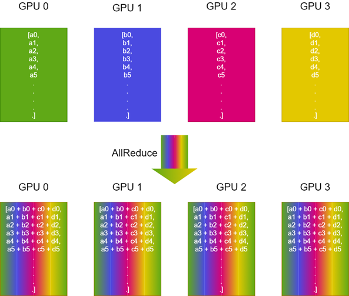</p><p align="center">图：AllReduce 在 四个 GPU 上进行累加示意图</p>

### 多设备之间的连接关系

多设备间的连接关系在多设备编程中是至关重要的，不同的连接关系对应于不同的编程方式。从编程方式上我们主要将同一主机内的连接方式分为两种：BLink™ 连接和 PCIe 连接。

- BLink™ 为壁仞特有的全互联技术，可支持不同设备内存之间的直接通信，一个设备可以使用核函数直接访问通过 BLink 连接的其他设备，也可以通过运行时函数进行不同设备间的内存操作。

- 默认模式下，通过 PCIe 连接的设备之间只允许使用运行时函数进行跨设备的内存操作，一个设备无法通过核函数访问另一个与其通过 PCIe 连接的设备。使用运行时函数进行的跨 PCIe 的数据拷贝并非不同的设备内存之间的直接拷贝，而是由驱动程序参与的两个过程：首先，将数据从源设备内存拷贝至一个位于主机的缓冲区内存；然后，再将数据从主机内存拷贝到目标地址的设备内存。

<table><tr><td bgcolor=#ffeccc><b>注意</b>：通过配置环境变量 <i>export BR_UMD_DEBUG_P2P_ACCESS_CHECK=0</i> 可以允许运行时函数对通过 PCIe 连接的不同设备的内存进行直接内存拷贝（不经过中间主机内存），但是源设备内存和目标设备内存均必须为 UMA4K。在配置此环境变量之后，核函数也可直接访问通过 PCIe 连接的其他设备的 UMA4K 内存。

使用核函数进行不同设备的数据写入时（BLink 或 PCIe）推荐仅使用线程束张量原语（wti），或是张量核心原语（tci/tci_p）。使用指针进行跨设备写入操作时需保证同一线程束同时写入对齐的 128 Byte 数据。
</td></tr></table>

使用 `brsmi` 工具可以方便地查看当前主机挂载的 GPU 设备之间地连接关系：

```bash
$ brsmi topo -m
          GPU0      GPU1      GPU2      GPU3      GPU4      GPU5      GPU6      GPU7      CPU Affinity      NUMA Affinity
GPU0      X         P2P       P2P       P2P       SYS       SYS       SYS       SYS       0-27,56-83        0
GPU1      P2P       X         P2P       P2P       SYS       SYS       SYS       SYS       0-27,56-83        0
GPU2      P2P       P2P       X         P2P       SYS       SYS       SYS       SYS       0-27,56-83        0
GPU3      P2P       P2P       P2P       X         SYS       SYS       SYS       SYS       0-27,56-83        0
GPU4      SYS       SYS       SYS       SYS       X         P2P       P2P       P2P       28-55,84-111      1
GPU5      SYS       SYS       SYS       SYS       P2P       X         P2P       P2P       28-55,84-111      1
GPU6      SYS       SYS       SYS       SYS       P2P       P2P       X         P2P       28-55,84-111      1
GPU7      SYS       SYS       SYS       SYS       P2P       P2P       P2P       X         28-55,84-111      1

Legend:

  X     = Self
  P2P   = all devices that are connected peer to peer
  PIX   = all devices that are connected to at most a single PCIe bridge
  PXB   = all devices that need not traverse a host bridge
  PHB   = all devices that are connected to the same host bridge
  NODE  = all devices that are connected to the same NUMA node but possibly multiple host bridges
  SYS   = all devices in the system
```

<table><tr><td bgcolor=#ffeccc><b>注意</b>：在不同的驱动版本中，BLink 连接会被标记为 “BR#” 或 “P2P” 两种形式，这两个选项均指代 BLink 连接。除这两个选项以外的所有连接关系都为 PCIe 连接，不同选项代表着不同的 PCIe 桥接关系。
</td></tr></table>

### 在多设备环境下的使用运行时函数

在进行多设备编程时，开发者必须持续关注运行时函数，因为大部分运行时函数的单次调用仅能在一个设备上执行。因此，开发者需要明确掌握每个运行时函数调用将运行于哪个设备。`suSetDevice()` 可用于切换“当前设备”。一般情况下开发者可以使用如下规则来确认运行时函数所执行的设备位置：

1. 如运行时函数需要使用“流”（suStream_t）作为参数，那么该运行时函数一般会在该“流”所在设备上执行（启动核函数除外）。如 `suMemcpyAsync()`，`suEventRecord()` 等。
2. 如运行时函数无需传入“流”（suStream_t）作为参数，那么该运行时函数一般会在当前设备上执行。常见的情况有以下两种：
    - 2.1 初始化资源类型函数：如 `suMallocDevice()`，`suStreamCreate()`，`suEventCreate()` 等，一定在当前设备上创建。
    - 2.2 使用默认流的同步类型函数：如 `suMemcpy()`，`suMemset()` 等，因为会使用当前设备的默认流，故也将在当前设备上执行。

<table><tr><td bgcolor=#ffeccc><b>注意</b>：启动核函数的运行时函数（如 suLaunchKernel）<b>不会</b>默认在所使用的“流”所在的设备上运行，开发者在启动核函数前<b>必须将当前设备切换至与所使用的“流”所在的设备相同</b>。不正确的“当前设备”与“流”的组合会导致启动核函数失败。
</td></tr></table>

下面我们以初始化 AllReduce 算子所需要的资源为例，展示在设备 0、1、2、3 上如何使用相应的运行时函数。

```cpp
suStream_t stream[4];

constexpr int kH = 1024;
constexpr int kW = 1024;

// Set "device 0" as current device
suSetDevice(0);
// Create Matrix tensor "mat_in_0" & "mat_out_0" on current device (device 0)
UmaDynMatrix<FP32, BLOCK_COL_MAJOR> mat_in_0(kH, kW);
UmaDynMatrix<FP32, BLOCK_COL_MAJOR> mat_out_0(kH, kW);
// Create streams[0] on current device (device 0)
suStreamCreate(&streams[0]);

// Set "device 1" as current device
suSetDevice(1);
// Create Matrix tensor "mat_in_1" & "mat_out_1" on current device (device 1)
UmaDynMatrix<FP32, BLOCK_COL_MAJOR> mat_in_1(kH, kW);
UmaDynMatrix<FP32, BLOCK_COL_MAJOR> mat_out_1(kH, kW);
// Create streams[1] on current device (device 1)
suStreamCreate(&streams[1]);

// Set "device 2" as current device
suSetDevice(2);
// Create Matrix tensor "mat_in_2" & "mat_out_2" on current device (device 2)
UmaDynMatrix<FP32, BLOCK_COL_MAJOR> mat_in_2(kH, kW);
UmaDynMatrix<FP32, BLOCK_COL_MAJOR> mat_out_2(kH, kW);
// Create streams[2] on current device (device 2)
suStreamCreate(&streams[2]);

// Set "device 3" as current device
suSetDevice(3);
// Create Matrix tensor "mat_in_3" & "mat_out_3" on current device (device 3)
UmaDynMatrix<FP32, BLOCK_COL_MAJOR> mat_in_3(kH, kW);
UmaDynMatrix<FP32, BLOCK_COL_MAJOR> mat_out_3(kH, kW);
// Create streams[3] on current device (device 3)
suStreamCreate(&streams[3]);
```

上述代码中使用了管理模式（managed mode）创建张量，构造函数中会分配张量所需要的主机内存和设备内存，因此参照上述规则 2.1，我们需要在各个张量构造前，使用 `suSetDevice()` 将“当前设备”切换为所期望创建张量的设备。`suStreamCreate()` 同样为资源创建的运行时函数，因此上述代码在设备 0 上创建了张量 `mat_in_0`、`mat_out_0` 和流 `stream[0]`，在设备 1 上创建了张量 `mat_in_1`、`mat_out_1` 和流 `stream[1]`，依此类推。

**`suDeviceEnablePeerAccess()`**

默认情况下，存在 BLink 连接的设备之间无法直接进行数据访问。开发者需要调用运行时函数 suDeviceEnablePeerAccess(i) 授权当前设备对设备 i 的读写访问权限。注意这种授权是单向的，如果设备 i 同样需要对当前设备（例如设备 0）进行读写访问，用户依然需要先使用 `suSetDevice(i)` 将当前设备切换到设备 `i`，然后再次使用函数 `suDeviceEnablePeerAccess(0)` 授权设备 `i` 对设备 `0` 的读写访问。

**`suDeviceDisablePeerAccess()`**

与 `suDeviceEnablePeerAccess()` 相应的，`suDeviceDisablePeerAccess()` 函数会终止当前设备对其他设备的设备内存的访问，这种终止同样也是单向的。此函数一般用于在代码最后释放资源阶段。

如下代码示例展示了如何在主机端创建初始化 AllReduce 测试所需的资源，代码中使用了 C++ 常用容器 `std::vector` 来简化代码。

```cpp
#include <vector>
#include <supa_tensor.h>

using namespace tensor;

constexpr int kH = 1024;
constexpr int kW = 1024;

int main() {
    std::vector<suStream_t> streams;
    std::vector<UmaDynMatrix<FP32, BLOCK_COL_MAJOR>> mats_in;
    std::vector<UmaDynMatrix<FP32, BLOCK_COL_MAJOR>> mats_out;

    for (int rank = 0; rank < 4; rank++) {
        // Switch current device to "rank"
        suSetDevice(rank);
        
        // Initialize tensor on device "rank"
        UmaDynMatrix<FP32, BLOCK_COL_MAJOR> mat_in_tmp(kH, kW);
        UmaDynMatrix<FP32, BLOCK_COL_MAJOR> mat_out_tmp(kH, kW);
        mats_in.push_back(mat_in_tmp);
        mats_out.push_back(mat_out_tmp);

        // Create stream on device "rank"
        suStream_t stream_tmp;
        suStreamCreate(&stream_tmp);
        streams.push_back(stream_tmp);
        
        // Enable current device to access all remaining device
        for (int i = 0; i < 4; i++) {
            if (i != rank) {
                suDeviceEnablePeerAccess(i);
            }
        }
    }

    // AllReduce operator
    // ...

    // Free resources
    for (int rank = 0; rank < 4; rank++) {
        suSetDevice(rank);
        // Destroy streams
        suStreamDestroy(streams[rank]);
        // Disable current device to access all remaining device
        for (int i = 0; i < 4; i++) {
            if (i != rank) {
                suDeviceDisablePeerAccess(i);
            }
        }
    }
}
```

值得注意的是，虽然在资源的创建只会在当前设备上，销毁资源的运行时函数（例如 `suFree()`，`suStreamDestroy()`）无需保证当前设备与需要销毁的资源一致。

<table><tr><td bgcolor=#ffeccc><b>注意</b>：资源创建的操作仅执行于当前设备，而资源销毁的运行时函数（例如suFree()，suStreamDestroy()）无此限制，无需确保当前设备与待销毁资源的设备一致。
</td></tr></table>
<div style="page-break-after:always"></div>

### 使用基础算法进行 AllReduce

基础的 AllReduce 的算法逻辑较为简单，只需让每一个设备直接从其余设备上直接读取所有数据，在本地进行累加后输出即可，整个过程无需任何同步操作。

<p align="center">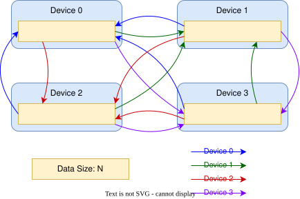</p><p align="center">图：AllReduce 基础算法中的数据流</p>

#### 运行时函数的 AllReduce 实现

我们可以使用两种运行时函数的组合实现 `AllReduce` 算子。因为运行时函数在 BLink 连接和 PCIe 连接的设备之间均可使用，因此仅使用运行时函数实现的 `AllReduce` 算子在 BLink 和 PCIe 连接的设备之间均可使用。

- `suMemcpy()` & `suMemcpyAsync()`

    在多设备编程中，`suMemcpy()` 和 `suMemcpyAsync()` 依然可以用于进行不同设备的内存之间的数据拷贝。但是需要注意的是，实际进行数据拷贝的引擎依然由该运行时函数所在“流”决定，因此不恰当的使用可能导致实际执行拷贝操作的设备与拷贝的源地址与目标地址均不属于同一设备，这可能会导致显著的性能异常。 另外由于 BR1XX 系列的架构设计，“数据拉取”操作会有着比“数据推写”操作更好的性能，因此为了更佳的性能，建议您**始终使用“数据拉取”进行设备间的数据传输**。

    <table><tr><td bgcolor=#ffeccc><ul>
    <li><b>数据拉取：</b>从目标地址所在设备发起的对其他设备上地址的读取操作。使用的“流”与目标地址在同一设备。</li>
    <li><b>数据推写：</b>从源地址所在设备发起的对其他设备上地址的写入操作。使用的“流”与源地址在同一设备。</li>
    </ul></td></tr></table>

    <p align="center">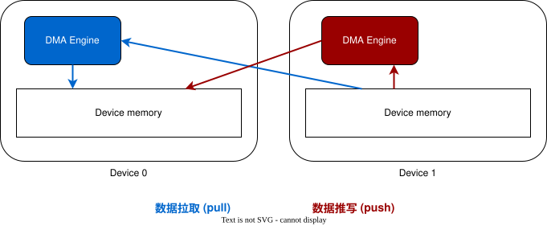</p><p align="center">图：同样是从设备 1 拷贝数据到设备 0，蓝色由设备 0 的 DMA Engine 发起因此为“数据拉取”，红色由设备 2 的 DMA Engine 发起因此为“数据推写”</p>

- `suMemReduce()` & `suMemReduceAsync()`

    BIRENSUPA 编程模型允许用户使用运行时函数直接将一段内存的数据一对一地归约累加到另外一段大小相同的内存。`suMemReduce()` 和 `suMemReduceAsync()` 的用法与数据拷贝非常相似，只需额外传入一个表示归约类型的参数即可。
    ```cpp
    typedef enum {
        suReduceSumS8 = 0,  // Not support in 1st gen
        suReduceSumU8 = 1,  // Not support in 1st gen
        suReduceSumS16 = 2, // Not support in 1st gen
        suReduceSumU16 = 3, // Not support in 1st gen
        suReduceSumS32 = 4, // Not support in 1st gen
        suReduceSumU32 = 5, // Not support in 1st gen
        suReduceSumBF16 = 6,
        suReduceSumFP16 = 7,  // Not support in BR ARCH 1.0
        suReduceSumFP32 = 8,
        suReduceMin = 10, // Not support in 1st gen
        suReduceMax = 20, // Not support in 1st gen
    } suReduceOP;
    ```
    目前 BR1XX 系列架构仅支持浮点类型的同精度数据归约累加（FP32 和 BF16），具体支持情况可参考《BIRENSUPA™ 运行时 API 参考》。内存归约运行时函数同样支持跨设备的操作，使用时同样需要注意尽可能使用数据拉取而非数据推写以获得更好的性能（与 `suMemcpy()` 和 `suMemReduce()` 类似）。

通过以上两组运行时函数，我们可以组合写出一个基于运行时函数的 “AllReduce” 算子实现。

```cpp
void allReduceNaiveRuntime(
    std::vector<UmaDynMatrix<FP32, BLOCK_COL_MAJOR>> mats_out,
    const std::vector<UmaDynMatrix<FP32, BLOCK_COL_MAJOR>> &mats_in,
    const std::vector<suStream_t> &streams, const std::vector<int> &dev_ids) {
    int mem_sz = mats_in[0].size(); // Memory size
    int dev_cnt = dev_ids.size();   // Total device count

    for (int rank = 0; rank < dev_cnt; rank++) {
        FP32 *mat_out_ptr = mats_out[rank].getDeviceBuffer();
        // Use memory copy runtime function to move first part of data to output memory
        suMemcpyAsync(mat_out_ptr, mats_in[0].getDeviceBuffer(), mem_sz,
                      streams[rank]);
        // Use memory reduce runtime function to reduce remaining data to output memory
        for (int i = 1; i < dev_cnt; i++) {
            suMemReduceAsync(mat_out_ptr, mats_in[i].getDeviceBuffer(), mem_sz,
                             suReduceSumFP32, streams[rank]);
        }
    }
}
```

在上述实现中，我们让每个设备都依次先执行一次从需要累加的源数据之一到当前设备的输出内存的数据拷贝，再进行从剩余源数据到输出内存的数据归约累加。

如下代码展示了完整的使用运行时函数的 `AllReduce` 算子实现以及简单的结果验证：

```cpp
#include <supa_tensor.h>
#include <vector>

using namespace tensor;

constexpr int kH = 1024;
constexpr int kW = 1024;

void allReduceNaiveRuntime(
    std::vector<UmaDynMatrix<FP32, BLOCK_COL_MAJOR>> mats_out,
    const std::vector<UmaDynMatrix<FP32, BLOCK_COL_MAJOR>> &mats_in,
    const std::vector<suStream_t> &streams, const std::vector<int> &dev_ids) {
    int mem_sz = mats_in[0].size(); // Memory size
    int dev_cnt = dev_ids.size();   // Total device count

    for (int rank = 0; rank < dev_cnt; rank++) {
        FP32 *mat_out_ptr = mats_out[rank].getDeviceBuffer();
        // Use memory copy runtime function to move first part of data to output
        // memory
        suMemcpyAsync(mat_out_ptr, mats_in[0].getDeviceBuffer(), mem_sz,
                      streams[rank]);
        // Use memory reduce runtime function to reduce remaining data to output
        // memory
        for (int i = 1; i < dev_cnt; i++) {
            suMemReduceAsync(mat_out_ptr, mats_in[i].getDeviceBuffer(), mem_sz,
                             suReduceSumFP32, streams[rank]);
        }
    }
}

int main() {
    std::vector<int> dev_ids{0, 1, 2, 3};
    int dev_cnt = dev_ids.size();

    // Prepare initialization data.
    FP32 *input_dense_data = (FP32 *)malloc(kH * kW * sizeof(FP32));
    for (int i = 0; i < kH * kW; i++) {
        input_dense_data[i] = 1;
    }

    // Initialize resources
    std::vector<suStream_t> streams;
    std::vector<UmaDynMatrix<FP32, BLOCK_COL_MAJOR>> mats_in;
    std::vector<UmaDynMatrix<FP32, BLOCK_COL_MAJOR>> mats_out;
    for (int rank = 0; rank < dev_cnt; rank++) {
        // Switch context to current device id.
        int cur_dev_id = dev_ids[rank];
        suSetDevice(cur_dev_id);

        // Initialize tensor on device "cur_dev_id"
        UmaDynMatrix<FP32, BLOCK_COL_MAJOR> mat_in_tmp(kH, kW);
        UmaDynMatrix<FP32, BLOCK_COL_MAJOR> mat_out_tmp(kH, kW);
        mat_in_tmp.copyFromRawData(suDenseRowMajor, input_dense_data);
        mat_in_tmp.moveToDevice();
        mats_in.push_back(mat_in_tmp);
        mats_out.push_back(mat_out_tmp);

        // Create stream on device "cur_dev_id"
        suStream_t stream_tmp;
        suStreamCreate(&stream_tmp);
        streams.push_back(stream_tmp);

        // Enable current device to access all remaining devices
        for (int i = 0; i < 4; i++) {
            int remote_dev_id = dev_ids[i];
            if (remote_dev_id != cur_dev_id) {
                suDeviceEnablePeerAccess(remote_dev_id);
            }
        }
    }

    // All Reduce operator (runtime function version)
    allReduceNaiveRuntime(mats_out, mats_in, streams, dev_ids);

    // Synchronize all device completion
    for (auto &stream_ : streams) {
        suStreamSynchronize(stream_);
    }

    // Copy data to host
    for (int rank = 0; rank < dev_cnt; rank++) {
        suSetDevice(dev_ids[rank]);
        mats_out[rank].moveToHost();
    }
    // Check data correctness
    bool pass = true;
    for (int rank = 0; rank < 4 && pass; rank++) {
        for (int h = 0; h < kH && pass; h++) {
            for (int w = 0; w < kW && pass; w++) {
                if (mats_out[rank].get(h, w, 0) != 4.0f) {
                    pass = false;
                    printf("Mismatch at rank %d, coord [%d %d]. Assmue 4.0. "
                           "Got %f\n",
                           rank, h, w, mats_out[rank].get(h, w, 0));
                }
            }
        }
    }
    printf(pass ? "Test pass!\n" : "Test failed!\n");

    // Free resources
    free(input_dense_data);
    for (int rank = 0; rank < 4; rank++) {
        suSetDevice(rank);
        // Destroy streams
        suStreamDestroy(streams[rank]);
        // Disable current device to access all remaining device
        for (int i = 0; i < 4; i++) {
            if (i != rank) {
                suDeviceDisablePeerAccess(i);
            }
        }
    }
}
```

在将所有设备所需执行的的运行时函数提交之后，在最后结果验证之前需要对每个设备上的“流”进行同步。因为每一个“流”都有所属设备，因此对“流”的同步无需切换到对应设备。

#### 核函数的 AllReduce 实现

除了运行时函数外，在使用 BLink 连接的设备之间，我们还可以通过一个简单的核函数来实现一个无需同步的 `AllReduce` 算子。

使用 `suLaunchKernel()` 启动核函数仅会让核函数在一个设备上执行，因此为了让四个设备同时执行该核函数，核函数需要分别在不同设备上被启动。虽然可以在不同设备上执行不同的核函数，但是一般为了简化实现，我们通常希望让同一个核函数的实现可以被应用到所有设备上，因此下述核函数也在此基础上进行设计。

```cpp
__global_mega__ void allReduceNaive(UmaDynMatrix<FP32, BLOCK_COL_MAJOR> mat_out,  // output on current device
                                    UmaDynMatrix<FP32, BLOCK_COL_MAJOR> mat_0,    // input on device 0
                                    UmaDynMatrix<FP32, BLOCK_COL_MAJOR> mat_1,    // input on device 1
                                    UmaDynMatrix<FP32, BLOCK_COL_MAJOR> mat_2,    // input on device 2
                                    UmaDynMatrix<FP32, BLOCK_COL_MAJOR> mat_3,    // input on device 3
                                    int H, int W) {
    for (int h = warp_idx * 2; h < H; h += warp_count * 2) {
        for (int w = block_idx.x * warp_size; w < W;
             w += grid_dim.x * warp_size) {
            float2 sv[4];
            // Load data from device 0~3
            wti::__load_matrix(&sv[0], mat_0, Coordinate2D(h, w));  // Load input tensor on device 0
            wti::__load_matrix(&sv[1], mat_1, Coordinate2D(h, w));  // Load input tensor on device 1
            wti::__load_matrix(&sv[2], mat_2, Coordinate2D(h, w));  // Load input tensor on device 2
            wti::__load_matrix(&sv[3], mat_3, Coordinate2D(h, w));  // Load input tensor on device 3
            // Add loaded data
            float2 sv_out = sv[0] + sv[1] + sv[2] + sv[3];
            // Store final output to output tensor on current device
            wti::__store_matrix(mat_out, Coordinate2D(h, w), sv_out); 
        }
    }
}
```

我们选择了所有设备上需要被累加的输入张量和当前设备上的输出张量作为核函数的参数，另外还传入其相对应的张量大小，这样我们就有了所有需要的信息。在不同设备上启动核函数时，核函数的参数部分仅需要替换输出张量为当前设备的输出张量即可。因为进行 `AllReduce` 的张量大小必须相同，所以仅需传入一组张量大小信息即可。

核函数内每个设备都遍历了所有的 `H * W` 大小的坐标，分别从四个不同设备的输入张量上读取对应坐标的数据。这里可以看到在核函数内读取其他设备的数据时和读取本设备数据没有任何区别，但是用户在编程时还是应时刻记住每个张量所属的设备以更清晰的掌握核函数内部的逻辑。如上述代码中，我们假设 `mat_0`，`mat_1`，`mat_2`，`mat_3` 为分别为设备 0，1，2，3 上的输入张量，`mat_out` 为当前设备的输出张量，因此核函数内部的四次 `wti::__load_matrix` 的行为是分别将设备 0 到设备 3 上的数据加在到当前设备的寄存器中，而后经过加法运算后存储到当前设备的输出张量上。四个设备分别运行完成该核函数后即可完成一个简单的使用核函数实现的 `AllReduce` 算子。

在启动核函数时开发者需特别注意“当前设备”与“流”的对应关系。和其他运行时函数不同的是，启动核函数不会自动将核函数提交到“流”所对应的设备，开发者必须确保“当前设备”和使用的“流”所属的设备为同一设备。

```cpp
__global_mega__ void sampleKernel(....) {
    // ....
}

// ....

suStream_t stream0, stream1;

suSetDevice(0);  // Switch current device to device 0
suStreamCreate(&stream0); // Create "stream0" on device 0

suSetDevice(1);  // Switch current device to device 1
suStreamCreate(&stream1); // Create "stream1" on device 1

suLaunchKernel(sampleKernel, 1, 512, 0, stream0, ....);  // ERROR!! Current device (#1) is NOT same as "stream0" device (#0)

suLaunchKernel(sampleKernel, 1, 512, 0, stream1, ....);  // Correct! Current device (#1) is same as "stream1" device (#1)

```

如下代码展示了完整的使用核函数的 `AllReduce` 算子实现以及简单的结果验证：

```cpp
#include <supa_tensor.h>
#include <vector>

using namespace tensor;

constexpr int kH = 1024;
constexpr int kW = 1024;

__global_mega__ void allReduceNaive(UmaDynMatrix<FP32, BLOCK_COL_MAJOR> mat_out,  // output on current device
                                    UmaDynMatrix<FP32, BLOCK_COL_MAJOR> mat_0,    // input on device 0
                                    UmaDynMatrix<FP32, BLOCK_COL_MAJOR> mat_1,    // input on device 1
                                    UmaDynMatrix<FP32, BLOCK_COL_MAJOR> mat_2,    // input on device 2
                                    UmaDynMatrix<FP32, BLOCK_COL_MAJOR> mat_3,    // input on device 3
                                    int H, int W) {
    for (int h = warp_idx * 2; h < H; h += warp_count * 2) {
        for (int w = block_idx.x * warp_size; w < W;
             w += grid_dim.x * warp_size) {
            float2 sv[4];
            // Load data from device 0~3
            wti::__load_matrix(&sv[0], mat_0, Coordinate2D(h, w));  // Load input tensor on device 0
            wti::__load_matrix(&sv[1], mat_1, Coordinate2D(h, w));  // Load input tensor on device 1
            wti::__load_matrix(&sv[2], mat_2, Coordinate2D(h, w));  // Load input tensor on device 2
            wti::__load_matrix(&sv[3], mat_3, Coordinate2D(h, w));  // Load input tensor on device 3
            // Add loaded data
            float2 sv_out = sv[0] + sv[1] + sv[2] + sv[3];
            // Store final output to output tensor on current device
            wti::__store_matrix(mat_out, Coordinate2D(h, w), sv_out); 
        }
    }
}

void allReduceNaiveKernel(
    std::vector<UmaDynMatrix<FP32, BLOCK_COL_MAJOR>> mats_out,
    const std::vector<UmaDynMatrix<FP32, BLOCK_COL_MAJOR>> &mats_in,
    const std::vector<suStream_t> &streams, const std::vector<int> &dev_ids) {
    int dev_cnt = dev_ids.size(); // Total device count
    if (dev_cnt != 4) {
        printf("Device count != 4 is not supported!\n");
    }
    int mat_h = mats_in[0].getH();
    int mat_w = mats_in[0].getW();

    for (int rank = 0; rank < dev_cnt; rank++) {
        // ====================== !! Attention !! ===========================
        // All kernel launch function must ensure that the current device and
        // the device that the stream belongs to are same.
        // ==================================================================
        suSetDevice(dev_ids[rank]);
        suLaunchKernel(allReduceNaive, 16, 512, 0, streams[rank],
                       mats_out[rank], mats_in[0], mats_in[1], mats_in[2],
                       mats_in[3], mat_h, mat_w);
    }
}

int main() {
    std::vector<int> dev_ids{0, 1, 2, 3};
    int dev_cnt = dev_ids.size();

    // Prepare initialization data.
    FP32 *input_dense_data = (FP32 *)malloc(kH * kW * sizeof(FP32));
    for (int i = 0; i < kH * kW; i++) {
        input_dense_data[i] = 1;
    }

    // Initialize resources
    std::vector<suStream_t> streams;
    std::vector<UmaDynMatrix<FP32, BLOCK_COL_MAJOR>> mats_in;
    std::vector<UmaDynMatrix<FP32, BLOCK_COL_MAJOR>> mats_out;
    for (int rank = 0; rank < dev_cnt; rank++) {
        // Switch context to current device id.
        int cur_dev_id = dev_ids[rank];
        suSetDevice(cur_dev_id);

        // Initialize tensor on device "cur_dev_id"
        UmaDynMatrix<FP32, BLOCK_COL_MAJOR> mat_in_tmp(kH, kW);
        UmaDynMatrix<FP32, BLOCK_COL_MAJOR> mat_out_tmp(kH, kW);
        mat_in_tmp.copyFromRawData(suDenseRowMajor, input_dense_data);
        mat_in_tmp.moveToDevice();
        mats_in.push_back(mat_in_tmp);
        mats_out.push_back(mat_out_tmp);

        // Create stream on device "cur_dev_id"
        suStream_t stream_tmp;
        suStreamCreate(&stream_tmp);
        streams.push_back(stream_tmp);

        // Enable current device to access all remaining devices
        for (int i = 0; i < 4; i++) {
            int remote_dev_id = dev_ids[i];
            if (remote_dev_id != cur_dev_id) {
                suDeviceEnablePeerAccess(remote_dev_id);
            }
        }
    }

    // All Reduce operator (kernel version)
    allReduceNaiveKernel(mats_out, mats_in, streams, dev_ids);

    // Synchronize all device completion
    for (auto &stream_ : streams) {
        suStreamSynchronize(stream_);
    }

    // Copy data to host
    for (int rank = 0; rank < dev_cnt; rank++) {
        suSetDevice(dev_ids[rank]);
        mats_out[rank].moveToHost();
    }
    // Check data correctness
    bool pass = true;
    for (int rank = 0; rank < 4 && pass; rank++) {
        for (int h = 0; h < kH && pass; h++) {
            for (int w = 0; w < kW && pass; w++) {
                if (mats_out[rank].get(h, w, 0) != 4.0f) {
                    pass = false;
                    printf("Mismatch at rank %d, coord [%d %d]. Assmue 4.0. "
                           "Got %f\n",
                           rank, h, w, mats_out[rank].get(h, w, 0));
                }
            }
        }
    }
    printf(pass ? "Test pass!\n" : "Test failed!\n");

    // Free resources
    free(input_dense_data);
    for (int rank = 0; rank < 4; rank++) {
        suSetDevice(rank);
        // Destroy streams
        suStreamDestroy(streams[rank]);
        // Disable current device to access all remaining device
        for (int i = 0; i < 4; i++) {
            if (i != rank) {
                suDeviceDisablePeerAccess(i);
            }
        }
    }
}
```

<div style="page-break-after:always"></div>

### 使用 Ring 算法进行 AllReduce

上述介绍的 AllReduce 的基础算法虽然实现较为简单，但是也有着明显的缺点：每个设备都要从其余所有设备读取完整的数据量，因此不同设备之间数据传输的带宽需求会非常巨大！假设每个设备上的数据量为 `N`，参与设备数量为 `D`，那么对于每个设备来说，需要从其他设备读取的数据量则为 `N * (D - 1)`，其大小会随着参与设备数量的增加而线性增加。

因为设备之间带宽需求较大，实际中很少使用基础算法，为了获得更高的设备传输效率，我们通常使用 Ring 算法来减少设备之间传输的数据量，以下为 Ring 算法的实现逻辑。

Ring 算法分为两个阶段：

1. 第一阶段进行 ReduceScatter，即第一阶段完成后可以让每个设备上都拥有“部分”最终累加结果。
2. 第二阶段将进行 AllGather，即将所有设备上的“部分”累加结果收集到一起并广播，使得所有设备上都拥有完整的 AllReduce 累加结果。

在第一阶段的在数据传输之前，您先要完成如下准备工作：

- 将每个设备上的数据均匀分为 `D` 份（`D` 为参与设备数量）。例如若参与设备为 4，我们就将每个设备上的数据均匀分成 4 份。

- 将所有设备依次首尾连接在一起视作一个“环”。例如，设备 0 -> 1 -> 2 -> 3 -> 0 可看作依次连接形成的一个环。

接下来的算法会顺着环的连接进行 `D - 1` 轮数据传输，每个设备在每一轮传输中都会读取环的上游设备的 `N / D` 大小的数据。

下图以 `D = 4` 为例，展示了 3 轮数据传输的过程：

<p align="center"></p><p align="center">图：Ring 算法阶段一</p>

1. 第一轮传输：设备 0 读取设备 4 的偏移为 `0` 的数据**累加**到设备 0 的对应设备内存；设备 1 读取设备 0 的偏移为 `N / 4` 的数据**累加**到设备 1 的对应设备内存；设备 2 读取设备 1 的偏移为 `N / 4 * 2` 的数据**累加**到设备 2 的对应设备内存；设备 3 读取设备 2 的偏移为 `N / 4 * 3` 的数据**累加**到设备 3 的对应设备内存。

2. 同步所有设备。

3. 第二轮传输：设备 0 读取设备 4 的偏移为 `N / 4 * 3` 的数据**累加**到设备 0 的对应设备内存；设备 1 读取设备 0 的偏移为 `0` 的数据**累加**到设备 1 的对应设备内存；设备 2 读取设备 1 的偏移为 `N / 4` 的数据**累加**到设备 2 的对应设备内存；设备 3 读取设备 2 的偏移为 `N / 4 * 2` 的数据**累加**到设备 3 的对应设备内存。

4. 同步所有设备。

5. 第三轮传输：设备 0 读取设备 4 的偏移为 `N / 4 * 2` 的数据**累加**到设备 0 的对应设备内存；设备 1 读取设备 0 的偏移为 `N / 4 * 3` 的数据**累加**到设备 1 的对应设备内存；设备 2 读取设备 1 的偏移为 `0` 的数据**累加**到设备 2 的对应设备内存；设备 3 读取设备 2 的偏移为 `N / 4` 的数据**累加**到设备 3 的对应设备内存。

6. 同步所有设备。

完成上述三轮数据传输之后，从最终图示中可以看到（右下角状态），每个设备都拥有了四分之一的最终累加结果：

- 设备 0 已经拥有四等分中的**第三部分**的累加结果；

- 设备 1 已经拥有四等分中的**第四部分**的累加结果；

- 设备 2 已经拥有四等分中的**第一部分**的累加结果；

- 设备 3 已经拥有四等分中的**第二部分**的累加结果。

至此第一阶段已完成。

第二阶段的算法将进行的是 AllGather 的操作，即将之前分布在不同设备上的累加结果广播到每个设备上，使得每个设备都拥有网完整的最终累加结果。第二阶段同样需要进行 `D - 1` 轮数据传输。

下图依然以 `D = 4` 为例，展示了 3 轮数据传输的过程：

<p align="center"></p><p align="center">图：Ring 算法阶段二</p>

1. 第一轮传输：设备 0 读取设备 4 的偏移为 `N / 4` 的数据**写**到设备 0 的对应设备内存；设备 1 读取设备 0 的偏移为 `N / 4 * 2` 的数据**写**到设备 1 的对应设备内存；设备 2 读取设备 1 的偏移为 `N / 4 * 3` 的数据**写**到设备 2 的对应设备内存；设备 3 读取设备 2 的偏移为 `0` 的数据**写**到设备 3 的对应设备内存。

2. 同步所有设备。

3. 第二轮传输：设备 0 读取设备 4 的偏移为 `0` 的数据**写**到设备 0 的对应设备内存；设备 1 读取设备 0 的偏移为 `N / 4` 的数据**写**到设备 1 的对应设备内存；设备 2 读取设备 1 的偏移为 `N / 4 * 2` 的数据**写**到设备 2 的对应设备内存；设备 3 读取设备 2 的偏移为 `N / 4 * 3` 的数据**写**到设备 3 的对应设备内存。

4. 同步所有设备。

5. 第三轮传输：设备 0 读取设备 4 的偏移为 `N / 4 * 3` 的数据**写**到设备 0 的对应设备内存；设备 1 读取设备 0 的偏移为 `0` 的数据**写**到设备 1 的对应设备内存；设备 2 读取设备 1 的偏移为 `N / 4` 的数据**写**到设备 2 的对应设备内存；设备 3 读取设备 2 的偏移为 `N / 4 * 2` 的数据**写**到设备 3 的对应设备内存。

第二阶段结束即完成了完整的 Ring AllReduce 算法。需要注意的是，第一阶段传输的数据需要和当前设备上对应位置的数据进行累加的，而第二阶段的数据传输则是直接将读取到的其他设备的数据写到当前设备对应位置，每相邻两轮数据传输之间都需要进行同步。

同样我们也可以计算 Ring 算法下每个设备完成一次完整的 AllReduce 所需要传输的数据量：第一阶段中进行了 `D - 1` 次传输，每次传输数据量为 `N / D`；第二阶段中同样进行了 `D - 1` 次数据传输，每次传输数据量同样为 `N / D`。因此在只考虑每个设备的传输数据量时，Ring 算法总共需要传输的数据量为 `N / D * (D - 1) * 2`，当 `D > 2` 时传输数据量将少于前面介绍的简单实现，并且 Ring 算法的数据传输量不会随着参与设备数量增加而线性增加，每个设备数据传输的总量将始终小于 `N * 2`。

接下来我们将以四个设备为例，展示如何在 BIRENSUPA 编程模型中实现 “Ring” 算法。

#### 使用运行时函数进行设备间的同步

从 Ring 算法中我们会发现实现这一算法需要在执行过程中进行多轮同步，接下来  我们通常使用“流”控制不同的异步操作的先后执行顺序。在同一个流内的操作会根据加入流的顺序依次执行。BIRENSUPA 提供两个基于流的异步读写驱动函数，使用这两个驱动函数的组合可以达到不同设备之间同步的目的。

```cpp
/// \brief Flags for ::sudrvStreamWriteValue64 and ::sudrvStreamWriteValue32
typedef enum {
    suStreamWriteValueDefault = 0, /**< Default behavior */
} suStreamWriteValueFlags;

/// \brief Writes a value to memory
///
/// \param[in] stream The stream to do the write in.
/// \param[in] addr The device address to write to.
/// \param[in] value The value to write.
/// \param[in] flags See ::suStreamWriteValueFlags.
///
/// \return suError_t
suError_t sudrvStreamWriteValue64(suStream_t stream, suDeviceptr_t addr,
                                  uint64_t value, unsigned int flags);
```

`sudrvStreamWriteValue64()` 函数在指定流 `stream` 上异步地向指定地址 `addr` 写入一个 64 bit 的数据 `value`。`flags` 参数目前只支持一种配置 `suStreamWriteValueDefault`。与其他异步函数类似，与其他异步函数类似，此函数在提交写值任务后立即返回，不会等待写值操作开始。实际的写值操作将在指定流上的所有前置操作都完成后执行。

```cpp
/// \brief Flags for ::sudrvStreamWaitValue64 and ::sudrvStreamWaitValue32
typedef enum {
    suStreamWaitValueGeq =
        0, /**< Wait until (int32_t)(*addr - value) >= 0 (or int64_t for 64 bit
              values). Note this is a cyclic comparison which ignores
              wraparound. (Default behavior.) */
    suStreamWaitValueEq = 1, /**< Wait until *addr == value. */
} suStreamWaitValueFlags;

/// \brief Waits on a memory location
///
/// \details
/// Enqueues a synchronization of the stream on the given memory location. Work
/// ordered after the operation will block until the given condition on the
/// memory is satisfied. By default, the condition is to wait for
/// (int64_t)(*addr - value) >= 0, a cyclic greater-or-equal.
/// Other condition types can be specified via \p flags.
///
/// \param[in] stream The stream to synchronize on the memory location.
/// \param[in] addr The memory location to wait on.
/// \param[in] value The value to compare with the memory location.
/// \param[in] flags See ::suStreamWaitValueFlags.
///
/// \return suError_t
suError_t sudrvStreamWaitValue64(suStream_t stream, suDeviceptr_t addr,
                                 uint64_t value, unsigned int flags);
```

`sudrvStreamWaitValue64()` 函数在指定流 `stream` 上异步等待指定地址 `addr` 的值变为期望值。期望值由 `value` 和 `flags` 两个参数共同决定：

- 若 `flags` 为 `suStreamWaitValueGeq`，期望值为大于或等于 `value` 的任意值；
- 若 `flags` 为 `suStreamWaitValueEq`，期望值则必须等于 `value`。

<table><tr><td bgcolor=#ffeccc><b>注意</b>：以上两个函数所使用的地址可以为设备内存或主机内存。如果希望使用主机内存，则该主机内存必须由 <code>suMallocHost()</code> 函数分配。
</td></tr></table>

使用内存读写进行同步的原理：一般情况下，同步的目的是确保在某一个时间点，所有参与的单元都已经完成该时间点之前的所有操作，从而可以继续执行后续可能依赖于其他单元在此之前完成的操作。因此使用内存进行同步时，可以分配需要同步的单元数量的内存，在执行完前序任务后先对当前单元对应的内存写一个特定值，然后等待别的单元所对应的内存中也为相同的特定值。当所有参与单元都执行相同的上述操作后则可实现所有参与单元之间的同步。

<p align="center">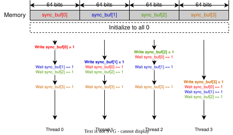</p><p align="center">图：四个线程使用四份内存进行同步。对于所有线程中的 <code>Wait sync_buf[i] == 1</code>，都需要等待线程 i 中的 <code>Write sync_buf[i] = 1</code> 执行完成之后才可被释放以继续执行后续操作。</p>

使用上述介绍的驱动函数可以非常便捷地实现上图所示的算法。

```cpp
std::vector<int> dev_ids{0, 1, 2, 3};
int dev_cnt = dev_ids.size();

suStream_t stream[4];
uint64_t *sync_buf;

// Initialize resources
suMallocHost((void **)&sync_buf, dev_cnt * sizeof(uint64_t));
memset(sync_buf, 0, dev_cnt * sizeof(uint64_t));

for (int rank = 0; rank < 4; rank++) {
    suSetDevice(dev_ids[rank]);
    suStreamCreate(&stream[rank]);
}

// ... Some operations

// Synchronization between 4 devices
for (int rank = 0; rank < 4; rank++) {
    sudrvStreamWriteValue64(stream[rank], sync_buf + rank, 1, suStreamWriteValueDefault);
    for (int i = 0; i < 4; i++) {
        if (i == rank) {
            continue;
        }
        sudrvStreamWaitValue64(stream[rank], sync_buf + i, 1, suStreamWaitValueEq);
    }
}

// ... Following operations
```

上述算法虽然可以实现多设备的同步，但是如果希望使用同一块内存实现多轮同步则容易造成死锁。

<p align="center">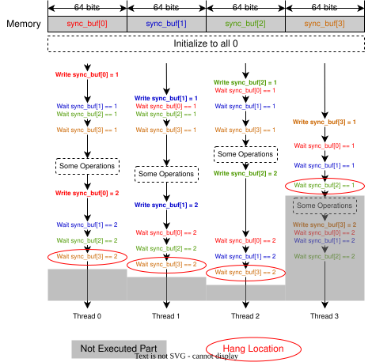</p><p align="center">图：四个线程使用四份内存进行两轮同步造成死锁。</p>

上图中灰色部分表示未执行到的部分，红色圆圈代表了死锁位置。因为线程 2 的对 `write sync_buf[2] = 2` 的操作一定在同一线程之前的 `wait sync_buf[3] == 1` 后执行，而线程 2 的 `wait sync_buf[3] == 1` 一定在线程 3 的 `write sync_buf[3] == 1` 之后执行；同样的，线程 3 的 `wait sync_buf[2] == 1` 也一定在同线程的 `write sync_buf[3] == 1` 后执行。但是没有任何操作去保证线程 2 的 `write sync_buf[2] = 2` 和线程 3 的 `wait sync_buf[2] == 1` 的先后执行顺序，若是如图所示线程 2 的 `write sync_buf[2] = 2` 在线程 3 的 `wait sync_buf[2] == 1` 之前执行，则会造成线程 3 始终无法等待到 `sync_buf[2] == 1` 的时候，因此造成死锁。

要解决这个死锁的问题则需要对上述算法进行一些修改：对每一轮使用的同步值依然逐次加一，每轮等待的比较从“严格等于”变为“大于等于”。

<p align="center">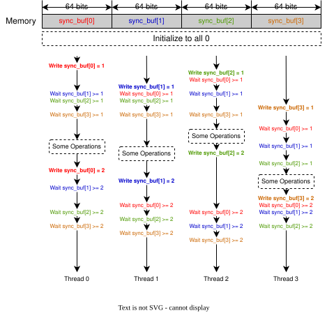</p><p align="center">图：四个线程使用四份内存进行两轮同步造成死锁。</p>

修改完之后的代码样例：

```cpp
std::vector<int> dev_ids{0, 1, 2, 3};
int dev_cnt = dev_ids.size();

suStream_t stream[4];
uint64_t *sync_buf;

// Initialize resources
suMallocHost((void **)&sync_buf, dev_cnt * sizeof(uint64_t));
memset(sync_buf, 0, dev_cnt * sizeof(uint64_t));

for (int rank = 0; rank < 4; rank++) {
    suSetDevice(dev_ids[rank]);
    suStreamCreate(&stream[rank]);
}

// ... Some operations

// Synchronization between 4 devices
for (int rank = 0; rank < 4; rank++) {
    sudrvStreamWriteValue64(stream[rank], sync_buf + rank, 1, suStreamWriteValueDefault);
    for (int i = 0; i < 4; i++) {
        if (i == rank) {
            continue;
        }
        // Use "Geq" instead of "Eq"
        sudrvStreamWaitValue64(stream[rank], sync_buf + i, 1, suStreamWaitValueGeq);  // <---- Change
    }
}

// ... Some operations

// Synchronization between 4 devices
for (int rank = 0; rank < 4; rank++) {
    sudrvStreamWriteValue64(stream[rank], sync_buf + rank, 2, suStreamWriteValueDefault);
    for (int i = 0; i < 4; i++) {
        if (i == rank) {
            continue;
        }
        // Use "Geq" instead of "Eq"
        sudrvStreamWaitValue64(stream[rank], sync_buf + i, 2, suStreamWaitValueGeq);  // <---- Change
    }
}

// ... Some operations
```

#### 运行时函数的 Ring AllReduce 算法

在了解如何对多设备进行同步后，我们可以尝试使用运行时函数进行 Ring 算法的 AllReduce。

使用和基础算法类似的方式创建所需输入输出张量和流等资源。除了常规资源外，我们还需要分配部分主机内存用于设备间同步：

```cpp
#include <supa_tensor.h>
#include <vector>

using namespace tensor;

constexpr int kH = 1024;
constexpr int kW = 1024;

void allReduceRingRuntime(
    std::vector<UmaDynMatrix<FP32, BLOCK_COL_MAJOR>> mats_out,
    const std::vector<UmaDynMatrix<FP32, BLOCK_COL_MAJOR>> &mats_in,
    int64_t *sync_buf, const std::vector<suStream_t> &streams,
    const std::vector<int> &dev_ids) {
    // Ring AllReduce implement ...
}

int main() {
    std::vector<int> dev_ids{0, 1, 2, 3};
    int dev_cnt = dev_ids.size();

    // Prepare initialization data.
    FP32 *input_dense_data = (FP32 *)malloc(kH * kW * sizeof(FP32));
    for (int i = 0; i < kH * kW; i++) {
        input_dense_data[i] = 1;
    }

    // Initialize resources
    std::vector<suStream_t> streams;
    std::vector<UmaDynMatrix<FP32, BLOCK_COL_MAJOR>> mats_in;
    std::vector<UmaDynMatrix<FP32, BLOCK_COL_MAJOR>> mats_out;
    // Used for inter device synchronization
    uint64_t *sync_buf;
    suMallocHost((void **)&sync_buf, dev_cnt * sizeof(uint64_t));
    memset(sync_buf, 0, dev_cnt * sizeof(uint64_t));
    for (int rank = 0; rank < dev_cnt; rank++) {
        // Switch context to current device id.
        int cur_dev_id = dev_ids[rank];
        suSetDevice(cur_dev_id);

        // Initialize tensor on device "cur_dev_id"
        UmaDynMatrix<FP32, BLOCK_COL_MAJOR> mat_in_tmp(kH, kW);
        UmaDynMatrix<FP32, BLOCK_COL_MAJOR> mat_out_tmp(kH, kW);
        mat_in_tmp.copyFromRawData(suDenseRowMajor, input_dense_data);
        mat_in_tmp.moveToDevice();
        mats_in.push_back(mat_in_tmp);
        mats_out.push_back(mat_out_tmp);

        // Create stream on device "cur_dev_id"
        suStream_t stream_tmp;
        suStreamCreate(&stream_tmp);
        streams.push_back(stream_tmp);

        // Enable current device to access all remaining devices
        for (int i = 0; i < 4; i++) {
            int remote_dev_id = dev_ids[i];
            if (remote_dev_id != cur_dev_id) {
                suDeviceEnablePeerAccess(remote_dev_id);
            }
        }
    }

    // All Reduce operator (runtime function version)
    allReduceRingRuntime(mats_out, mats_in, sync_buf, streams, dev_ids);

    // Synchronize all device completion
    for (auto &stream_ : streams) {
        suStreamSynchronize(stream_);
    }

    // Copy data to host
    for (int rank = 0; rank < dev_cnt; rank++) {
        suSetDevice(dev_ids[rank]);
        mats_out[rank].moveToHost();
    }
    // Check data correctness
    bool pass = true;
    for (int rank = 0; rank < 4 && pass; rank++) {
        for (int h = 0; h < kH && pass; h++) {
            for (int w = 0; w < kW && pass; w++) {
                if (mats_out[rank].get(h, w, 0) != 4.0f) {
                    pass = false;
                    printf("Mismatch at rank %d, coord [%d %d]. Assmue 4.0. "
                           "Got %f\n",
                           rank, h, w, mats_out[rank].get(h, w, 0));
                }
            }
        }
    }
    printf(pass ? "Test pass!\n" : "Test failed!\n");

    // Free resources
    free(input_dense_data);
    for (int rank = 0; rank < 4; rank++) {
        suSetDevice(rank);
        // Destroy streams
        suStreamDestroy(streams[rank]);
        // Disable current device to access all remaining device
        for (int i = 0; i < 4; i++) {
            if (i != rank) {
                suDeviceDisablePeerAccess(i);
            }
        }
    }
}
```

在 `allReduceRingRuntime()` 函数内，我们使用 `suMemcpyAsync()` 和 `suMemReduceAsync()` 组合实现前文中提到的 ReduceScatter + AllGather 的 Ring 算法。

```cpp
void allReduceRingRuntime(
    std::vector<UmaDynMatrix<FP32, BLOCK_COL_MAJOR>> mats_out,
    const std::vector<UmaDynMatrix<FP32, BLOCK_COL_MAJOR>> &mats_in,
    uint64_t *sync_buf, const std::vector<suStream_t> &streams,
    const std::vector<int> &dev_ids) {

    int dev_cnt = dev_ids.size();
    size_t tensor_sz = mats_in[0].getBufferSize();
    size_t cp_sz = tensor_sz / dev_cnt;

    // Copy input data to output pointer
    for (int rank = 0; rank < dev_cnt; rank++) {
        suMemcpyAsync(mats_out[rank].getDeviceBuffer(),
                      mats_in[rank].getDeviceBuffer(), tensor_sz,
                      streams[rank]);
    }

    // Stage 1: ReduceScatter
    for (int rank = 0; rank < dev_cnt; rank++) {
        int next_rank = (rank + 1) % dev_cnt;
        FP32 *currect_tensor_ptr = mats_out[rank].getDeviceBuffer();
        FP32 *next_tensor_ptr = mats_out[next_rank].getDeviceBuffer();
        for (int i = 0; i < dev_cnt - 1; i++) {
            // Synchronize with next device
            sudrvStreamWriteValue64(streams[rank], &sync_buf[rank], i + 1,
                                    suStreamWriteValueDefault);
            sudrvStreamWaitValue64(streams[rank], &sync_buf[next_rank], i + 1,
                                   suStreamWaitValueGeq);
            size_t ii = (rank + i) % dev_cnt;
            size_t offset = (ii * cp_sz) / sizeof(FP32);
            // Reduce the "ii"th copy of data
            suMemReduceAsync(currect_tensor_ptr + offset,
                             next_tensor_ptr + offset, cp_sz, suReduceSumFP32,
                             streams[rank]);
        }
    }

    // Stage 2: AllGather
    for (int rank = 0; rank < dev_cnt; rank++) {
        int next_rank = (rank + 1) % dev_cnt;
        FP32 *currect_tensor_ptr = mats_out[rank].getDeviceBuffer();
        FP32 *next_tensor_ptr = mats_out[next_rank].getDeviceBuffer();
        for (int i = dev_cnt - 1; i < 2 * dev_cnt - 2; i++) {
            // Synchronize with next device
            sudrvStreamWriteValue64(streams[rank], &sync_buf[rank], i + 1,
                                    suStreamWriteValueDefault);
            sudrvStreamWaitValue64(streams[rank], &sync_buf[next_rank], i + 1,
                                   suStreamWaitValueGeq);
            size_t ii = (rank + i) % dev_cnt;
            size_t offset = (ii * cp_sz) / sizeof(FP32);
            // Move the "ii"th copy of data
            suMemcpyAsync(currect_tensor_ptr + offset, next_tensor_ptr + offset,
                          cp_sz, streams[rank]);
        }
    }
    return;
}
```

上述代码中我们依然使用 `sudrvStreamWriteValue64()` 和 `sudrvStreamWriteValue64()` 的组合进行设备间同步。值得注意的是，这里的使用的同步方式和上一章节介绍的略有不同。因为使用 Ring 算法时，每个设备都只需要等待上游设备的上一步操作完成，而无需等待其他所有设备，所以在以上代码实现中，我们在写值之后仅需等待上游设备的写值完成，而无需等待所有其他设备。

而在实际应用中，我们通常会将不同设备上的操作分发到多个 CPU 线程上，下面是一个简单的改写成多 CPU 线程的样例，每个设备上的操作都被集成在一个 lambda 函数 `allReduceRingRuntimeSingle` 内：

```cpp
#include <thread>

void allReduceRingRuntime(
    std::vector<UmaDynMatrix<FP32, BLOCK_COL_MAJOR>> mats_out,
    const std::vector<UmaDynMatrix<FP32, BLOCK_COL_MAJOR>> &mats_in,
    uint64_t *sync_buf, const std::vector<suStream_t> &streams,
    const std::vector<int> &dev_ids) {

    int dev_cnt = dev_ids.size();
    size_t tensor_sz = mats_in[0].getBufferSize();
    size_t cp_sz = tensor_sz / dev_cnt;

    auto allReduceRingRuntimeSingle = [&](int rank) {
        // Copy input data to output pointer
        suMemcpyAsync(mats_out[rank].getDeviceBuffer(),
                      mats_in[rank].getDeviceBuffer(), tensor_sz,
                      streams[rank]);

        int next_rank = (rank + 1) % dev_cnt;
        FP32 *currect_tensor_ptr = mats_out[rank].getDeviceBuffer();
        FP32 *next_tensor_ptr = mats_out[next_rank].getDeviceBuffer();

        // Stage 1: ReduceScatter
        for (int i = 0; i < dev_cnt - 1; i++) {
            // Synchronize with next device
            sudrvStreamWriteValue64(streams[rank], &sync_buf[rank], i + 1,
                                    suStreamWriteValueDefault);
            sudrvStreamWaitValue64(streams[rank], &sync_buf[next_rank], i + 1,
                                   suStreamWaitValueGeq);
            size_t ii = (rank + i) % dev_cnt;
            size_t offset = (ii * cp_sz) / sizeof(FP32);
            // Reduce the "ii"th copy of data from remote to local
            suMemReduceAsync(currect_tensor_ptr + offset,
                             next_tensor_ptr + offset, cp_sz, suReduceSumFP32,
                             streams[rank]);
        }

        // Stage 2: AllGather
        for (int i = dev_cnt - 1; i < 2 * dev_cnt - 2; i++) {
            // Synchronize with next device
            sudrvStreamWriteValue64(streams[rank], &sync_buf[rank], i + 1,
                                    suStreamWriteValueDefault);
            sudrvStreamWaitValue64(streams[rank], &sync_buf[next_rank], i + 1,
                                   suStreamWaitValueGeq);
            size_t ii = (rank + i) % dev_cnt;
            size_t offset = (ii * cp_sz) / sizeof(FP32);
            // Move the "ii"th copy of data from remote to local
            suMemcpyAsync(currect_tensor_ptr + offset, next_tensor_ptr + offset,
                          cp_sz, streams[rank]);
        }
    };

    std::vector<std::thread> threads;
    for (int rank = 0; rank < dev_cnt; rank++) {
        threads.push_back(std::thread(allReduceRingRuntimeSingle, rank));
    }
    for (auto &t : threads) {
        t.join();
    }
    return;
}
```

修改代码后编译运行即可看到检查结果都通过：

```bash
$ brcc -pthread allReduceRing.su -o allReduceRing.out
$ ./allReduceRing.out
Test pass!
```

<div style="page-break-after:always"></div>

## 法律声明

**著作权 ©**

壁仞科技 2020-2025，版权所有。未经壁仞科技事先书面许可，本文档内容不得以任何形式将其复制、修改、出版、传输或发布。

**商标。**

本文档所包含的任何壁仞科技的商号、商标、图形标志和域名，均为壁仞科技所有。未经壁仞科技事先书面许可，不得以任何形式将其复制、修改、出版、传输或发布。

**性能信息**。

本文档中所包含的性能指标包括设计规格、模拟测试指标以及特定环境下的测试和评估指标。设计规格为产品设计时拟定的指标，仅用于提供信息的目的而供您参考，实测指标将以具体的测试数据为准。模拟测试指标是通过在体系结构模拟器上运行模拟而获得，仅用于提供信息目的。该类测试的系统硬件、软件设计或配置的任何不同都可能影响实际性能。特定环境下的测试和评估指标系采用特定的计算机系统或组件操作而获得，可反映出我司产品的大致性能。系统硬件、软件设计或配置的任何不同都可能影响实际性能。

**前瞻性陈述。**

本文档的信息可能包含前瞻性陈述，可能存在风险和不确定性。请勿仅依赖于上述信息做出您的商业决定。
