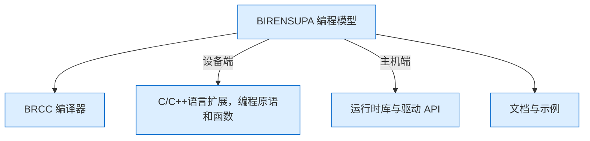

```mermaid
graph TD
A[BIRENSUPA 编程模型]-->B[BRCC 编译器]
A--设备端-->C[C/C++语言扩展，编程原语和函数]
A--主机端-->D[运行时库与驱动 API]
A-->E[文档与示例]
style A fill:#dceeff,stroke:#0066cc
style B fill:#dceeff,stroke:#0066cc
style C fill:#dceeff,stroke:#0066cc
style D fill:#dceeff,stroke:#0066cc
style E fill:#dceeff,stroke:#0066cc
```

