# BIRENSUPA™ 编程指南

## 术语表

| 缩写   | 术语名称                               | 中文描述            |
| ------ | -------------------------------------- | ------------------- |
| BRCC   | BIREN™ Compiler Collection             | 壁仞编译器          |
| CM     | Constant Memory                        | 常量内存            |
| CU     | Compute Unit                           | 计算单元            |
| DMA    | Direct Memory Access                   | 直接内存访问        |
| EU     | Execution Unit                         | 执行单元            |
| GLM    | Global Memory                          | 全局内存            |
| --     | Grid                                   | 线程网格            |
| GSM    | Group-Shared Memory                    | 共享内存            |
| G-Mode | General Mode                           | 普通模式            |
| HBM    | High Bandwidth Memory                  | 高带宽内存          |
| IPC    | Inter-Process Communication            | 进程间通信          |
| --     | Mega Kernel                            | 超大核函数          |
| L1     | Level 1 Cache                          | 一级缓存            |
| L2     | Level 2 Cache                          | 二级缓存            |
| LSU    | Load Store Unit                        | 加载存储单元        |
| NUMA   | Non-uniform Memory Access              | 非统一内存访问      |
| OOB    | Out of Bound                           | 越界                |
| --     | Shared Memory                          | 共享内存            |
| SIMT   | Single Instruction Multiple Threads    | 单指令多线程        |
| SPC    | Streaming Processing Cluster           | 流式处理器簇        |
| SUPA   | Scalable Unified Parallel Architecture | 可扩展统一并行架构  |
| TCI    | Tensor Core Intrinsics                 | 张量核心计算原语    |
| --     | Tensor Buffer                          | 张量缓冲区          |
| T-Core | Tensor Core                            | 张量核心            |
| T-Mode | Tensor Mode                            | 张量模式            |
| --     | Thread                                 | 线程                |
| --     | Thread Block                           | 线程块              |
| TLM    | Thread-Local Memory                    | 线程本地内存        |
| TLR    | Thread-Local Register                  | 线程本地寄存器      |
| UMA    | Uniform Memory Access                  | 统一内存访问        |
| UVA    | Unified Virtual Addressing             | 统一虚拟寻址        |
| V-Core | Vector Core / Vector Engine            | 向量核心 / 向量引擎 |
| VA     | Virtual Address                        | 虚拟地址            |
| VM     | Virtual Machine                        | 虚拟机              |
| VMC    | Virtual Machine Cluster                | 虚拟机计算核簇      |
| --     | Warp                                   | 线程束              |
| WTI    | Warp Tensor Intrinsics                 | 线程束张量计算原语  |
| --     | Wide-thread-block                      | 宽线程块            |
| --     | Wide-warp                              | 宽线程束            |
| --     | Master die                             | 主晶粒              |
| --     | Slave die                              | 从晶粒              |

<div style="page-break-after:always"></div>

## 概述

### 什么是 BIRENSUPA™ 编程模型？

BIRENSUPA（BIREN Scalable Unified Parallel Architecture）是壁仞 ™ 科技推出的基于壁仞通用 GPU 的软件平台，提供了完整的软件栈，包括固件、驱动程序、编译器、工具、编程模型、库和机器学习（ML）框架等，帮助您构建深度学习和通用计算应用。

BIRENSUPA 编程模型是 BIRENSUPA 软件栈的核心，它将底层硬件细节抽象成编程概念（如线程、核心、内存等），并提供 C++ 编程语言的扩展和运行时 API。

BIRENSUPA 编程模型提供了一种高效的方式来开发基于壁仞通用 GPU 的应用程序。通过编写 C/C++ 代码，您可以充分利用壁仞通用 GPU 的计算能力。此外，基于 BIRENSUPA 编程模型，您还可以开发各种加速库和 AI 应用框架，以进一步提高应用的性能和效率。

<p align="center">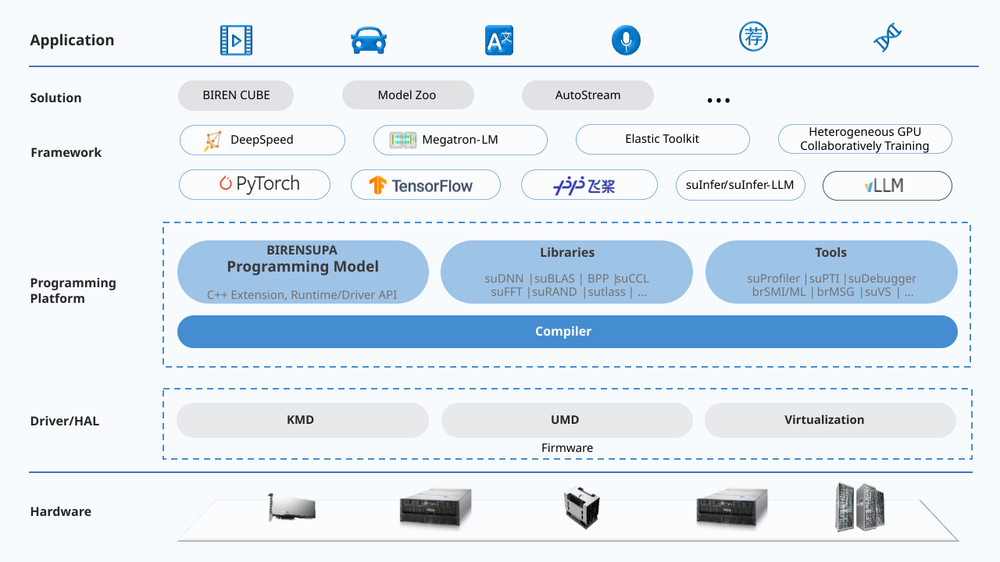</p><p align="center">图1 系统架构</p>

BIRENSUPA 编程模型主要包括如下组件：

- BIRENSUPA C/C++ 语言扩展：由编程原语（Intrinsics）和函数扩展 C/C++ 组成设备端的库。
- BIRENSUPA 运行时（Runtime）API 和驱动（Driver）API：应用程序能够通过这些主机端 API 管理主机和设备内存、启动核函数以及控制内存拷贝和核函数执行顺序。
- BRCC 编译器：编译 C/C++ 源代码，生成主机和设备端二进制可执行文件。
- 文档和示例，包括本文档。

<p align="center"></p><p align="center">图2 编程模型组件</p>

### 可扩展编程模型

BIRENSUPA 编程模型基于主机-设备模型。主机和设备通过一些总线进行连接，如 PCIe。

- 主机：指传统的计算机或服务器，包括 CPU 和内存（即主机内存）。
- 设备：指硬件加速器，包括 GPU 和内存（即设备内存）。

<p align=center>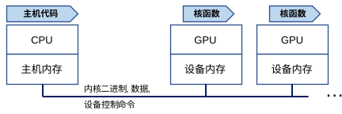</p><p align=center>图：主机和设备模型</p>

您可以在主机上定义运行在设备上的函数，这些函数称为核函数（Kernel Function）。为了执行核函数，主机需要在设备端分配设备内存，并将核函数对象和必要的数据发送到设备。设备在执行完核函数后，可以将结果返回给后续的核函数（来自同一应用程序）进行进一步处理，也可以将其发送回主机进行处理。

与传统的 CPU 编程相比，GPU 拥有大量的并行计算单元，如下图所示。每个设备包含多个计算组，或称为虚拟机计算核簇（VMC），每个计算组有 4 个流式处理器簇（SPC），每个流式处理器簇有 4 个计算单元（CU），每个计算单元有 4 个执行单元（EU）。执行单元是最小的核函数调度粒度，核函数中的指令以单指令多线程（SIMT）模式运行。核函数可以在多个执行单元、计算单元、流式处理器簇、计算组甚至多个设备上同时运行。

<p align="center">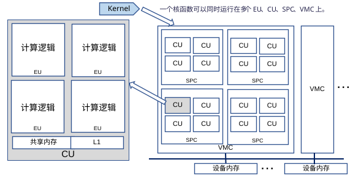</p><p align="center">图：GPU硬件体系结构</p>

<div style="page-break-after:always"></div>

## BIRENSUPA 异构编程

本章节介绍 BIRENSUPA 编程模型中的主要概念。关于 BIRENSUPA C++ 的详细描述和代码示例，请参见[BIRENSUPA C++ 语言扩展](#BIRENSUPA C++ 语言扩展)。

### 核函数

核函数是指在主机上调用并在设备上执行的函数，为了充分利用底层的硬件计算能力，应采用多线程并行执行的方式来编写核函数。使用 BIRENSUPA 编程模型的 C++ 扩展时，首先要声明核函数，在主机端启动核函数后，壁仞通用 GPU 的并行计算单元会执行被调用的核函数。

BIRENSUPA 编程模型使用 `__global__` 或者 `__global_mega__` 修饰一个返回值为 `void` 的函数，即定义该函数为核函数。其中：

- `__global__` ：修饰普通核函数，本章节介绍其线程映射模型。
- `__global_mega__` ：修饰超大核函数，可以更好地利用壁仞通用 GPU 的计算资源。关于超大核函数的简介和使用方法，请参见[超大核函数编程](#超大核函数编程)。

主机端代码使用 `suLaunchKernel()` 等运行时 API 启动核函数。

下面以 `suLaunchKernel()` 这个运行时 API 为例进行说明，该函数接受多个输入参数，如下所述：

- 第 1 个参数是核函数的函数指针。
- 第 2 个参数定义将要启动的线程块的数量和形状，即线程网格。
- 第 3 个参数定义一个线程块内的线程数量和形状。
- 第 4 个参数定义核函数中要使用的动态共享内存。
- 第 5 个参数定义核函数将运行的流。
- 第 6 个及以后的参数是传递给核函数的。

GPU 具备复杂的多层次硬件结构，核函数启动后，由分布于各硬件模块的线程协同执行。为抽象化壁仞通用 GPU 并行计算单元中的多线程执行模式，BIRENSUPA 编程模型引入了线程束、线程块和线程网格等概念，基于线程所在硬件单元的关系进行定义。在核函数启动时，可配置自定义大小的三维“线程块”以及由相同大小线程块构成的自定义大小的三维“线程网格”来执行核函数，其中线程网格和线程块的大小分别由第 2 和第 3 个参数指定。有关线程层级的详细说明，请参考后续6节。

在核函数代码中，BIRENSUPA C++ 的内置变量 `thread_idx` 可以用来索引线程在当前线程块内的三维坐标。`thread_idx` 是 dim3 类型，包含 `x` 、`y` 、`z` 字段。与其类似并同样为 `dim3` 类型的内置变量还有可用于索引当前线程块在整个线程网格中三维坐标的 `block_idx` 以及可用于表示启动当前的核函数所使用的线程块大小和线程网格大小的 `block_dim` 和 `grid_dim` 。

下面这段代码和图示展示了如何使用由 32 × 1 × 1 个（x 轴方向 32 个、y 和 z 轴方向各一个）大小均为 256 × 1 × 1 的线程块（x 轴方向大小为 256、y 和 z 轴方向大小均为 1）组成的线程网格，对长度均为 size 的数组 A 和数组 B 进行向量相加，并将结果存储到数组 C 中。运行时，核函数中的一个线程将映射到参与执行的执行单
元的一个硬件线程上。有关线程层级的更多信息请参考[线程层级结构](#线程层次结构)章节。

```cpp
// Kernel definition.
__global__ void VectorAdd(float *A, float *B, float *C, int size) {
    int offset = thread_idx.x + block_idx.x * block_dim.x;
    for (int i = offset; i < size; i += block_dim.x * grid_dim.x) {
        C[i] = A[i] + B[i];
    } 
}

int main() {
    ...
    // Kernel invocation with (32 * 256) threads.
    suLaunchKernel(VectorAdd, dim3(32, 1, 1), dim3(256, 1, 1), 0, NULL, A, B, C, size);
    ...
}
```

对于双晶粒（Two die）产品，BIRENSUPA 编程模型中提供了一套可以复用单晶粒版本核函数实现的方法：

1. 对于 UMA 或 4KUMA 内存类型，将内存类型分别替换成 UMA16 或 4KUMA16，将两个晶粒需要的数据分别放在内存分区 0 和 1 中。

2. 启动核函数时使用 `suLaunchKernel2DieDup`，该函数的参数和 `suLaunchKernel` 完全相同。使用这种方式启动核函数时，驱动会将核函数按照单晶粒模式同时分别在两个晶粒上各自启动，开发者无需感知驱动的底层行为。

3. 这种方法只适用于当两个晶粒无需进行数据交互时使用

<p align=center>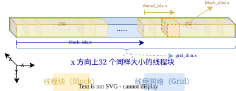</p><p align="center">图：线程块大小为 [256, 1, 1]、线程网格大小为 [32, 1, 1] 时的线程层级关系</p>


启动核函数默认为异步行为，主机线程将启动核函数任务提交到对应流上后会立刻返回，不会等待核函数执行结束，需要主动在主机端添加相应同步函数以确保核函数已经执行完成（如 `suDeviceSynchronize()`、 `suStreamSynchronize()` 等）。也可以通过设置环境变量 `export SUPA_LAUNCH_BLOCKING=1` 来关闭所有异步启动核函数的行为。此选项会损失异步函数带来的性能提升，因此仅推荐在调试时使用。


### 线程层次结构

#### 线程块与线程网格

在 BIRENSUPA 编程模型中，线程的组织分为线程块（Thread Block）和线程网格（Grid）两个层次。

**线程块**

线程块层为基础层。线程块是一个由多个线程（Thread）组成的三维立方体，其大小可以通过 `dim3` 类型的变量定义，其内置变量 `block_dim` 可以在设备代码中被引用。

启动核函数时，您可以进行如下操作：

- 通过输入参数设置线程块的大小：
  - 普通模式：最大值为1024。
  - 张量模式：须为 512 的倍数，取值范围为 1 倍（512）到 8 倍（4,096）。

- 在设备端使用 `block_dim.x`，`block_dim.y` 与 `block_dim.z` 查询当前线程块的大小。
- 使用内置的 `dim3` 类型变量 `thread_idx`来查询当前正在运行的线程在其所属的线程块中的位置 （block-local）。

**线程网格**

更高的级别是线程网格层。线程网格层是一个由多个形状相同的线程块组成的三维立方体，其大小可以通过 `dim3` 类型的变量定义，其内置变量 `grid_dim` 可以在设备代码中被引用。

启动核函数时，您可以进行如下操作：

- 在程序中设置设置线程网格的大小。
- 可以使用 `grid_dim.x`，`grid_dim.y` 与 `grid_dim.z` 查询当前线程网格的大小。
- 使用内置的 `dim3` 类型变量 `block_idx` 来查询当前线程块在这个特定线程网格中的位置或索引。

因为线程网格和线程块都使用 `dim3` 类型来定义尺寸大小，您可以：

- 设置 `z=1` 来组成二维线程网格或线程块。
- 设置 `y=1`，`z=1` 来形成一维线程网格或线程块。

在核函数执行期间，线程块会被映射到一个计算单元（只有在同一个计算单元的线程，才能使用同一块共享内存）。如果线程块指定的线程数量大于计算单元中硬件线程的总数，则线程会以时间和资源共享的方式在该计算单元上批量执行。核函数执行的线程网格可能涉及一个或多个计算单元，该线程网格中线程块的执行可能以顺序、并行或任意顺序混合的方式进行，具体取决于硬件资源和运行时调度策略。因此，您不能假定一个给定核函数的线程块的执行顺序。

#### 线程层次映射关系

线程块由一个或多个线程束（warp）组成。在 BIRENSUPA 编程模型中，一个线程束是一个线程块中的固定数量固定组合的线程的集合，会一起被映射到一个执行单元上执行。当前一个线程束由 32 个线程组成，即线程块中线程 0~31 组成第一个线程束，32~63 组成第二个线程束，以此类推。线程束的大小是固定的，不能被用户配置，为了充分利用硬件资源，建议线程块中的线程数量是线程束大小的整数倍。

下表描述了线程层次结构映射

| 软件概念 | 壁仞通用 GPU 中的实现 |
| -------- | --------------------- |
| 线程     | 硬件线程              |
| 线程束   | 执行单元（EU）        |
| 线程块   | 计算单元（CU）        |
| 线程网格 | 一个或多个计算单元    |

<table><tr><td bgcolor=#dceeff><b>说明：</b>以上是普通核函数映射。BIRENSUPA 编程模型还包括超大核函数类型用于张量核相关计算，具有不同的映射行为。详细说明请参见超大核函数编程。</td></tr></table>

以下代码以 `MatrixAdd` 为例，展示了将大小为 M×N 的两个矩阵 A 和 B 相加，并将结果存储到矩阵 C 中。为简化逻辑，此处假设 M 和 N 都是 8 的倍数。

```cpp
constexpr int M = 16;
constexpr int N = 32;

// Kernel definition
__global__ void MatrixAdd(float A[M * N], float B[M * N],
                          float C[M * N]) {
    int i = block_idx.x * block_dim.x + thread_idx.x;
    int j = block_idx.y * block_dim.y + thread_idx.y;
    if (i < M && j < N) {
        C[i * N + j] = A[i * N + j] + B[i * N + j];
    }
}

int main() {
    ...
    // Thread block size
    dim3 threadBlockSize(8, 8, 1);
    // Grid size
    dim3 gridSize(M / threadBlockSize.x, N / threadBlockSize.y, 1);
    suLaunchKernel(MatrixAdd, gridSize, threadBlockSize, 0, NULL, A, B, C);
    ...
}
```

使用此设置，线程网格和线程块的组织如下图所示。在本例中，每个线程块由 64 个线程组成，需要两个线程束来运行。这样，线程块的两个线程束可以映射到两个执行单元上同时运行，或者一次映射到一个执行单元之后，相互独立地交替运行。无论哪种情况，BIRENSUPA 编程模型都会确保运行单个线程块的所有执行单元都放在同一个计算单元中，这样线程就可以共享计算单元的公共资源，比如通过共享内存来交换数据。此外，线程块中的线程可以使用 intrinsic 函数 `__syncthreads()` 来设置一个屏障，用来协调线程块中的所有线程一起同步运行。

<p align=center>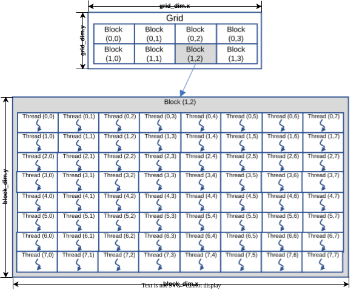</p><p align="center">图：线程块网格</p>


### 内存层次结构

如下图所示，BIRENSUPA 编程模型提供了一个设备硬件抽象，其中包含了多种内存级别供您使用。在执行期间，核函数线程可以访问多种内存级别的数据。

- 本地内存（TLM）：每个线程都可以通过线程本地内存访问其私有数据，本地内存用于存储寄存器溢出和需要在线程的堆栈分配的数据（例如，动态大小或需要获取地址的本地数组）。
- 共享内存（GSM）：每个线程块都有一个共享内存，在该线程块的生命周期内，共享内存对该线程块中的所有线程都是可见的。
- 全局内存（GLM）：所有线程都可以访问全局内存。
- 常量内存（CM）：用于保存只读数据。

<table><tr><td bgcolor=#dceeff><b>说明：</b>由同一应用程序启动的核函数之间的全局内存和常量内存中的内容会持续驻留。</td></tr></table>

<p align="center">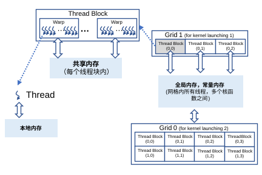</p><p align="center">图：内存层次结构</p>

下表描述了 BIRENSUPA 编程模型的内存层次结构。每个计算单元都有 L1 缓存和共享内存（GSM）。所有流处理器簇共享一个大型 L2 缓存。由于某些内存层，例如 GSM，可以提供比其他层更高的带宽和更短的延迟，因此，如何有效地使用不同的内存层，对于实现最佳性能至关重要。

<table><tr><td bgcolor=#dceeff><b>说明：</b>其中 L1 缓存和 L2 缓存结构层只对编译器和驱动开发者可见，对于其他用户不可见。</td></tr></table>

| BIRENSUPA 内存 | 作用域             | 生命周期 | 控制端 |
| -------------- | ------------------ | -------- | ------ |
| TLM            | 线程               | 线程     | 应用   |
| L1             | 线程块内的所有线程 | 线程块   | 硬件   |
| GSM            | 线程块内的所有线程 | 线程块   | 应用   |
| L2             | 所有线程           | 应用     | 硬件   |
| GLM            | 所有线程           | 应用     | 应用   |
| CM             | 所有线程           | 应用     | 应用   |

### 共享内存使用与线程块同步

线程块中的线程被分成若干线程束，每个线程束包含 32 个线程。线程束中的线程可以直接使用线程束的数据交换原语（如 `__shfl_up_sync()`、 `__shfl_down_sync()` 和 `__shfl_xor_sync()` 等）进行数据交换。在多个线程束之间，数据可以通过共享内存进行交换。

共享内存在核函数的生命周期内对所有线程可见，使用 `__shared__` 关键字进行标注。为了确保不同线程对共享内存的读写一致性，可以使用 `__syncthreads()`(G-mode)、`__sync_block_cluster_threads()`(T-mode) 原语创建一个线程块中所有线程的执行屏障。当所有线程到达该屏障时，线程块中的所有线程将继续向前执行。

```cpp
// Kernel definition with shared memory
__global__ void MatrixAdd(float *A, int numElements) {
    __shared__ float data[4]; // all threads in the block can access it.
    int i = thread_idx.x;
    if (i < 4) {
        data[i] = A[i]; // first four threads load the data.
    }
    __syncthreads(); // all threads wait.

    int v = data[0]; // every threads can access the data.
    ...
}
```

BIRENSUPA 编程模型支持动态共享内存的使用。在核函数中定义不定长的共享内存数组，主机端启动核函数时，可以通过设置动态共享内存的大小（ `suLaunchKernel()` 的第四个参数）来使用。

```cpp
extern __shared__ int dynShared[]; //Dynamic allocate
__global__ void myKernel() {
    __shared__ int staticShared[256]; //Static allocate Use 1KB
    float* array0 = (float*)dynShared;
}

void main() {
    suLaunchKernel(myKernel, dim3(1), dim3(1), 256 * sizeof(int), NULL);
}
```

### 异构编程

<p align=center>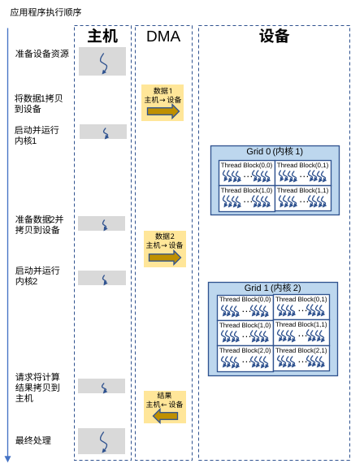</p><p align=center>图：异构编程</p>

典型的异构编程执行过程如上图所示，主要包含如下步骤：

1. 应用程序通过主机端的设备驱动程序获取设备资源。
2. 主机端准备输入数据集，并请求将数据从主机内存复制到设备内存。
3. 数据复制命令会发送到设备的 DMA 引擎执行；在设备端准备好数据后，主机端可以启动核函数；核函数二进制文件和输入参数（如指向设备中数据地址的指针）由驱动程序发送到设备端，设备端开始运行核函数。
4. 主机端可以请求后续的数据复制和核函数启动。
5. 核函数执行完毕后，可以将数据复制回主机进行进一步处理。

下列代码是一个完整的向量加法的示例，展示了设备端核函数的定义、主机端启动核函数以及数据在主机和设备之间的传输过程。

```cpp
// Kernel definition
__global__ void VecAdd(float* A, float* B, float* C) {
    int i = thread_idx.x;
    C[i] = A[i] + B[i];
}

int main() {
    int N = 1000; // Number of elements
    int size = N * sizeof(float);
    // Allocate the host input vector A and B, and output vector C
    float *h_A = (float *)malloc(size);
    float *h_B = (float *)malloc(size);
    float *h_c = (float *)malloc(size);

    ... // Initialize h_A and h_B

    // Prepare device resources
    // Allocate device memory for input vector A and B, and output vector C
    float *d_A = NULL;
    suMallocDevice(&d_A, size);
    float *d_B = NULL;
    suMallocDevice(&d_B, size);
    float *d_C = NULL;
    suMallocDevice(&d_C, size);

    // Copy data from host memory to device memory
    suMemcpy(d_A, h_A, size);
    suMemcpy(d_B, h_B, size);

    // Kernel invocation with N threads. Execute the vector add kernel on the device
    suLaunchKernel(VecAdd, dim3(1, 1, 1), dim3(N, 1, 1), 0, NULL, d_A, d_B, d_C);
    ... // Other kernel launches

    // Copy result from device memory to host memory
    suMemcpy(h_C, d_C, size);

    ... // Consume the result

    // Free host & device memory
    free(h_A);
    free(h_B);
    free(h_C);
    suFree(d_A);
    suFree(d_B);
    suFree(d_C);
}
```


#### 异步编程模型

上述示例中，主机和设备的执行以及主机和设备之间的数据传输，使用了简单的顺序执行模型。此外，BIRENSUPA 编程模型还提供了异步模型，允许以下操作可以并发运行：

- 主机端的计算，可以使用多线程并行处理。
- 设备端的计算，可以通过多个核函数同时运行。
- 从主机到设备的内存传输。
- 从设备到主机的内存传输。
- 设备之间或给定设备内存内的内存传输。

壁仞通用 GPU 中有大量可用的计算资源，您可以将多个核函数提交到硬件队列，利用可用的硬件资源并行运行。此外，由于壁仞通用 GPU 中有多个 DMA 引擎，因此可以进行并发数据传输。您只需发送多个内存拷贝请求，而 DMA 引擎会根据资源的可用性来处理这些请求。

例如，同步内存拷贝函数 `suMemcpy()` 要求主机端计算逻辑必须等待设备上的拷贝完成才能继续执行。`suMemcpyAsync()` 是 `suMemcpy()` 的异步版本，可以实现主机端计算逻辑和数据拷贝的并发执行。在下面的示例中，两个内存拷贝可以与主机逻辑同时进行。

```cpp
suMemcpyAsync(dst0, src0, size, stream); // Return immediately
suMemcpyAsync(dst1, src1, size, stream); // Return immediately
... // Can run host side cpu logic when the copy is running.
suLaunchKernel(...); // Run kernel
```

为了确保正确的依赖关系和应用程序行为，BIRENSUPA 编程模型提供了协调异步任务执行的机制，详细信息请参见[流和事件编程](#流和事件编程)。


<div style="page-break-after:always"></div>

## 内存管理

BIRENSUPA 内存系统有两个方面：

1. **统一虚拟寻址（UVA）和托管内存**：描述了如何管理虚拟内存地址，以及如何分配、复制和管理主机/设备内存。
2. **统一内存访问（UMA）和 NUMA 内存**：描述了如何确定和处理内存对象的位置和布局，即如何将连续的数据区域映射到物理内存。

本节主要介绍主机与设备分离的内存模型，以及采用主机/设备同一模型的托管内存架构。

在启用壁仞通用 GPU 的系统上，基础内存系统将系统可用的内存空间明确分为主机内存和设备内存（包括来自多个设备的设备内存）。一般情况下，主机（CPU 代码）仅访问主机内存，而设备仅访问设备内存。应用程序可以使用 BIRENSUPA 运行时 API 在主机内存和设备内存之间交互数据。

### 统一虚拟寻址

在壁仞通用 GPU 硬件设备驱动程序的支持下，所有应用程序内存分配都在统一虚拟寻址（UVA）内存空间范围内。基于 UVA 的支持，程序中的任何虚拟内存指针都可以唯一映射至一个物理内存地址，并且此指针（虚拟地址）可以指向主机中的物理内存或设备中的物理内存。

<p align="center">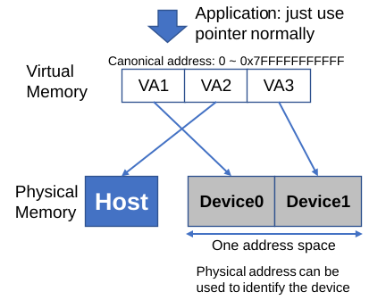</p><p align="center">图：统一虚拟寻址</p>

在 BIRENSUPA UVA 设置下，X86_64 主机 CPU 环境中应用程序的用户空间地址为 48 位。BIRENSUPA 分配器将仅返回规范的内存空间，即下半部分（0x00000000_00000000 到 0x00007FFF_FFFFFFFF）和上半部分（从 0xFFFF8000_00000000 开始）。其他主机平台（例如 ARM64）的规范内存空间将在稍后定义。

### 分配设备内存

BIRENSUPA 支持两种方式分配设备内存：

- 第一种：主机动态分配。

您可以通过运行时 API `suMallocDevice(void** addr，size_t size)` 进行主机动态分配设备内存。如果分配成功，可以将分配的内存 `addr` 传递到核函数中使用。在使用完设备内存后，必须通过 `suFree()` 函数释放，否则可能造成内存泄漏。

- 第二种：在设备代码中静态分配

在 BIRENSUPA 编程模型源文件中，您可以使用 `__device__` 修饰符标注全局内存地址，以便编译器在编译时在设备端静态分配内存。这样，核函数可以直接使用这些内存。

```cpp
__device__ float vector[32]; // Compiler allocates it at device side
```

在壁仞通用 GPU 系统中，如果有多个 GPU 设备，所有设备的虚拟地址都会由硬件统一分配、管理。

### 分配主机内存

应用程序可以使用系统的 `malloc()` 和 `free()` 来管理主机端的内存，这些内存的地址仍在 UVA 范围内。

BIRENSUPA 运行时 API 提供了 `suMallocHost()` 来分配具有更多控制选项的主机内存。例如，您可以通过这个 API 接受额外的属性来进行页锁定，并为内存启用写合并。

### 锁页内存

BIRENSUPA 主机端程序可以通过使用配置有 `suMallocHostDefault` 参数（默认参数）的 `suMallocHost()` 函数申请锁页内存，或使用配置了 `suHostRegisterDefault` 参数（默认参数）的 `suRegisterHostMemory()` 函数对已分配的未锁页内存进行锁页操作。当内存被锁页后，主机操作系统不会将其调出。在 BIRENSUPA 中，主机端的锁页内存可以被对应设备端通过 PCIe 总线与统一虚拟寻址直接**读取**（不能被写入）。当内核需要一小部分主机端数据时，应用程序可以使用此功能来消除显式内存复制。

```cpp
suError_t suMallocHost(void **ptr, size_t size, unsigned flags = suMallocHostDefault);
```


在壁仞通用 GPU 硬件设计版本 1.x 下，硬件为了内存访问的一致性不会在设备端 L1 和 L2 缓存配置了锁页内存的主机内存数据。

当 `flag` 参数使用默认值 `suMallocHostDefault` 时，锁页内存仅对当前设备可见。您可以通过使用 `flag` 配置为 `suMallocHostPortable` 的 `suMallocHost()` 函数分配系统中的所有设备都可以访问的锁页内存。

```cpp
int *hostPtr;
// 使用默认选项 suMallocHostDefault 分配锁页主机内存
suMallocHost((void**)&hostPtr, size);
// 使用选项 suMallocHostPortable 分配可被所有设备访问的锁页主机内存
int *hostPtrPortable;
suMallocHost((void**)&hostPtrPortable, size, suMallocHostPortable);

hostPtr[0] = 100;

// ....

__global_mega__ void kernel(int *hostPtr, ....) {
    // ....
    // Kernel 内可以直接访问由 suMallocHost 分配的锁页主机内存。
    // 注意：由 suMallocHost 分配的锁页内存在设备端只可被读取，不可被写入。
    int hostData = hostPtr[0];  
    // ....
}
```

<table><tr><td bgcolor=#ffeccc><b>注意：</b>虽然锁页内存因为起不会被操作系统换出而具有更高的访问效率，但过度使用锁页内存可能导致系统的分页机制无法正常运行，引起系统性能显著下滑。</td></tr></table>

### 写入绑定内存

除了使用 `suMallocHost` 函数进行锁页内存，应用程序还可以通过配置 `flag` 参数为 `suMallocHostWriteCombined` 分配写入绑定的锁页主机内存。与普通锁页内存相同的是，这些内存可以被对应设备端通过 PCIe 总线与统一虚拟寻址直接**读取**；硬件为了提高设备端对主机端内存访问的性能不会在主机端 CPU 的 L1 和 L2 中缓存写入绑定内存的数据。但是这会降低主机端 CPU 访问这些内存的性能。


### 拷贝内存

BIRENSUPA 编程模型中最常见的内存拷贝 API 包括 `suMemcpy()` 和 `suMemcpyAsync()`，其中 `suMemcpyAsync()` 提供了基于流式编程的异步内存拷贝能力。

<table><tr><td bgcolor=#dceeff><b>说明：</b>使用 BIRENSUPA 时，无需在 API 中显式指定拷贝方向标志，这样可以简化代码编写和维护。</td></tr></table>

- 内存拷贝

  ```cpp
  suError_t suMemcpy(void *dst, const void *src, size_t size,
                     suMemcpyKind kind = suMemcpyDefault);
  ```

- 基于流式编程的异步内存拷贝

  ```cpp
  suError_t suMemcpyAsync(void *dst, const void *src, size_t size,
                          suStream_t stream = NULL,
                          suMemcpyKind kind = suMemcpyDefault);
  ```

BIRENSUPA 编程模型同时还提供一种特殊的模式，可以在内存拷贝的同时进行归约。这种归约可以表达为 `dst <- OP(dst, src)`。

```cpp
suError_t suMemReduce(void *dst, const void *src, size_t size, suReduceOP OP);
suError_t suMemReduceAsync(void *dst, const void *src, size_t size,
                           suReduceOP OP, suStream_t stream __dv(NULL));
suError_t suMemcpyReduce(void *dst, const void *src, unsigned int numRegions,
                         size_t sizePerRegion, size_t sizePerRegionPitch,
                         suReduceOP OP);
suError_t suMemcpyReduceAsync(void *dst, const void *src,
                              unsigned int numRegions, size_t sizePerRegion,
                              size_t sizePerRegionPitch, suReduceOP OP,
                              suStream_t stream __dv(NULL));
```

<table><tr><td bgcolor=#ffeccc><b>注意：</b>根据壁仞通用 GPU 硬件设计，BIRENSUPA suMemReduce()，suMemReduceAsync()，suMemcpyReduce() 和 suMemcpyReduceAsync() API 中的 suReduceOP 仅支持相同精度的浮点数累加操作；壁仞通用 GPU 硬件设计版本 1.x 中仅支持 FP32 与 BF16 数据类型。</td></tr></table>

<div style="page-break-after:always"></div>

## 流和事件编程

BIRENSUPA 编程模型使用流来管理主机端计算、核函数执行和内存拷贝之间的并发操作。

每个流都是一个操作队列，用于启动核函数和进行内存拷贝等操作。在单个流中，所有操作都按照顺序执行。当流中的前一个操作完成，并且其它依赖关系满足时（例如 `waitEvent()` 的事件已经准备好），该流中的操作才会开始运行。

虽然单个流无法实现某些类型的并发（例如核函数执行和内存拷贝），但是当多个流同时运行时，一个流中的核函数执行可能会与其他流中的操作（例如内存拷贝）重叠。

### 创建和销毁流

BIRENSUPA 编程模型提供如下数据类型和 API 来创建和销毁流。

| 数据类型 / API                                  | 描述                          |
| ----------------------------------------------- | ----------------------------- |
| `suStream_t`                                    | 流的数据类型，用来索引流 ID。 |
| `suError_t suStreamCreate(suStream_t* stream);` | 创建流。                      |
| `suError_t suStreamDestroy(suStream_t stream);` | 销毁流。                      |

以下示例展示了如何使用两个流来协调从主机到设备的内存拷贝、核函数运行和从设备到主机的内存拷贝。

```cpp
suStream_t stream1, stream2;
suStreamCreate(&stream1);  // Create stream1
suStreamCreate(&stream2);  // Create stream2

float *h_data, *d_data;
suMallocHost(&h_data, 2048 * sizeof(float));    // Allocate 8K at host
suMallocDevice(&d_data, 2048 * sizeof(float));  // Allocate 8K at device

... // Fill host side data

// stream 1
// Copy 1st half data from host to device on stream1
suMemcpyAsync(d_data, h_data, 1024 * sizeof(float), stream1);
// Launch 1st kernel on stream1
suLaunchKernel(kernel, dim3(1, 1, 1), dim3(1024, 1, 1), 0, stream1, d_data);
// Copy back 1st half data from device to host on stream1
suMemcpyAsync(h_data, d_data, 1024 * sizeof(float), stream1);

// stream 2
// Copy 2nd half data from host to device on stream2
suMemcpyAsync(d_data + 1024, h_data + 1024, 1024 * sizeof(float), stream2);
// Launch 2nd kernel on stream2
suLaunchKernel(kernel, dim3(1, 1, 1), dim3(1024, 1, 1), 0, stream2, d_data + 1024);
// Copy back 2nd half data from device to host on stream2
suMemcpyAsync(h_data + 1024, d_data + 1024, 1024 * sizeof(float), stream2);

suStreamDestroy(stream1);  // Destroy stream1
suStreamDestroy(stream2);  // Destroy stream2
```

<table><tr><td bgcolor=#dceeff><b>说明：</b>即使流中正在运行一些先前的操作， <code>suStreamDestroy()</code> 最终也将立即返回。一旦流中的 <code>destroy</code> 命令之前的所有操作完成，流将被销毁，相关的资源将被释放。</td></tr></table>

### 默认流

在 BIRENSUPA 编程模型中，如果没有流参数传给核函数启动和异步内存拷贝 API，这些操作将绑定到默认流上。从开发者的角度来看，这些操作将以全局顺序执行。

对于一个设备，每个主机端线程都有一个默认流。

### 事件

BIRENSUPA 编程模型提供了事件功能，用于创建计算两个事件之间的时间间隔，并同步不同流之间的操作。

事件功能提供了以下数据类型和 API：

| 数据类型 / API                                               | 描述                                                         |
| ------------------------------------------------------------ | ------------------------------------------------------------ |
| `suEvent_t`                                                  | 事件数据类型，用来索引不同的事件。                           |
| `suEventCreate(suEvent_t* event)`                            | 创建一个事件。                                               |
| `suEventDestroy(suEvent_t event)`                            | 销毁一个事件。                                               |
| `suEventRecord(suEvent_t event, suStream_t stream = NULL)`   | 在输入流中记录事件。该 API 立即返回。当此事件之前的所有操作（如内存拷贝、核函数执行）在该流中全部完成时，该事件被记录；同时通知其他通过 `suStreamWaitEvent(suEvent_t event, suStream_t stream)` 等待此事件的流恢复执行。 |
| `suEventSynchronize(suEvent_t event)`                        | 当前主机线程阻塞，直到事件被记录。                           |
| `suEventElapsedTime(float* time, suEvent_t start, suEvent_t stop)` | 计算 `start` 和 `end` 之间事件的时间，单位为毫秒（ms）。     |

下面的代码示例展示了如何使用事件来计算时间。

```cpp
suEvent_t start, stop;
suEventCreate(&start);  // Create "start" event
suEventCreate(&stop);   // Create "stop" event

suEventRecord(start, NULL); // Record "start" event on default stream
···  // Perform some memory copy, kernel launch operations through async calls.
suEventRecord(stop, NULL); // Record "stop" event on default stream
suEventSynchronize(stop);  // Wait until "stop" event is recorded.

float elapsedTime;
suEventElapsedTime(&elapsedTime, start, stop);  // Calculate time elapsed between "start" & "stop" event
printf("Time: %f\n", elapsedTime);

suEventDestroy(start);  // Destroy "start" event
suEventDestroy(stop);   // Destroy "stop" event
```

### 流中的显示同步

BIRENSUPA 编程模型提供了不同的方法来同步不同流中的操作。

| 数据类型 / API                                          | 描述                                                         |
| ------------------------------------------------------- | ------------------------------------------------------------ |
| `suDeviceSynchronize()`                                 | 全局同步。该方法将阻塞主机端线程的执行，直到当前设备上所有主机线程的所有流中的所有先前操作完成。 |
| `suStreamSynchronize(suStream_t stream)`                | 只同步给定的流。该方法将阻塞主机端线程的执行，直到给定流中的所有先前操作完成。同时，其他流可以继续。 |
| `suStreamQuery(suStream_t stream)`                      | 返回给定流的执行状态，包括：是否已完成、是否因错误终止或是否仍在运行。 |
| `suStreamWaitEvent(suStream_t stream, suEvent_t event)` | 该方法接受一个流和一个事件作为参数。在给定的流中，该方法将阻塞主机端线程的执行，直到输入事件被其他流或其他线程记录。 |

`suStreamWaitEvent(suStream_t stream, suEvent_t event)` 对于协调多个流非常有用。例如，当 kernel B 需要主机提供的输入数据和 kernel A 的输出时，可以使用以下示例代码实现启用 kernel A 和数据拷贝的重叠，并确保 kernel B 使用正确的数据运行。

```cpp
suLaunchKernel(kernelA, ..., stream1);  // Launch kernelA on stream1
suEventRecord(event1, stream1);         // Fire "event1" after kernelA completes.

// Run stream2
suMemcpyAsync(d_data, h_data, size, stream2);  // Copy data on stream2
suStreamWaitEvent(stream2, event1);      // Wait for "event1" recorded on stream2
// KernelB can start to run when the data copy completes and kernelA completes.
suLaunchKernel(kernelB, ..., stream2);   // Launch kernelB on stream2
```

### 隐式同步

在 BIRENSUPA 编程模型中，一些操作将触发流（包括默认流）之间的隐式同步。这些操作包括：

- 锁页主机内存分配，或锁定以前分配的页。
- 设备端内存分配。
- 设备端内存重置。
- 同一设备内存的两个地址之间的内存拷贝。
- 在核函数启动前更改壁仞通用 GPU 配置（如 L1/共享内存配置、L2/张量缓存配置）。

在一个设备上，这些操作必须以顺序方式运行。例如，如果上述类别中的一个操作在一个流中运行，则来自另一个流中的上述类别的其他操作将被阻塞。

### 流中的主机函数回调

上述绑定到流的操作都与设备相关，例如内存拷贝和核函数启动。BIRENSUPA 编程模型提供了流回调函数包装器，允许在给定流中插入主机端函数回调。

当回调函数之前的所有操作完成时，给定的流会利用给定的参数调用主机函数。

```cpp
void MyCallback(suStream_t stream, suError_t status, void *data) {
    printf("MyCallback is invoked with %d\n", (size_t)data);
}

...  // launch operations in stream1.
int a = 100;
suLaunchHostFunc(stream1, MyCallback, (void *)&a);
```

### 流的优先级

在 BIRENSUPA 中流也可以通过使用 `suStreamCreateWithPriority` API 创建。其中的优先级（priority）取值范围可以通过 `suDeviceGetStreamPriorityRange` API 获取；

```cpp
suError_t suStreamCreateWithPriority(suStream_t *stream, unsigned int flags,
                                     int priority);

suError_t suDeviceGetStreamPriorityRange(int *low, int *high);
```

驱动程序会优先启动具有较高优先级的流。然而**高优先级的流**仍然可能会被记录了**低优先级流**的事件阻塞。

具有高优先级的流将由驱动程序以高优先级执行。然而，如果事件应该由较低优先级流记录，则高优先级流仍然可能被事件阻塞。

### 流和事件的约束

BIRENSUPA 要求，对流和事件的所有操作必须发送到与其匹配的流或事件上，否则可能引发未知错误。详细规则如下：

- 当使用流启动核函数时，请确保该流与上下文中的当前设备关联。否则，核函数将会启动失败。
- 每个设备都有专属的默认流，向各设备的默认流发出的命令是独立执行的。就设备而言，指令之间没有预设的执行顺序的限制。主机端可以使用 `suStreamSynchronize(NULL)` API 强制完成当前设备中默认流之前的指令，并提交新的操作来达到强制按照顺序执行的效果。
- 异步内存拷贝独立于当前上下文中的设备。即使被分配到与当前上下文设备不关联的流上，也可以成功执行。
- `suEventSynchronize()` API 和 `suEventQuery()` API 独立于当前上下文关联的设备。即使输入事件未绑定到与当前设备关联的流或事件，它们依然会成功执行。
- `suStreamWaitEvent()` API 不要求输入的流和事件来自同一设备。即使输入流和输入事件关联到不同的设备，API 也会成功执行。因此，它可用于多个设备之间的同步。


### 改变流的 spcMask

使用 `spcMask` 来对齐 NUMA 内存分配和启动超大核函数可以简化编程工作，通过这种方式程序员不需要在每次内存分配或启动超大核函数时调用 `spcCount` 或 `spcMask` 进行编码。同时，它还帮助运行时和驱动程序有一个全局视图来调度相关资源。

然而，在复杂的流式编程中，一个流中的不同任务可能需求不同的资源（NUMA 区域和 SPC 的索引）。例如，在一个流中，第一个数据预处理任务从 UMA 内存读取/写入数据。由于它是轻量级的，所以我们只计划使用 4 个 SPC 执行。之后，计算任务需要使用 8 个 NUMA 内存区域作为缓冲区，以及 8 个 SPC 来执行任务。BIRENSUPA 定义了更改附加到流的 `spcMask` 的 API 来帮助以上情况下的编程。

```cpp
// Change the spcMask attached to current stream
suError_t suStreamSetAttribute(suStream_t stream, suStreamAttrId attr,
                               const suStreamAttrValue *value);
// Query the spcMask attached to current stream
suError_t suStreamGetAttribute(suStream_t stream, suStreamAttrId attr,
                               suStreamAttrValue *valueOut);

// Copy attributes of streamSrc to streamDst
suError_t suStreamCopyAttributes(suStream_t streamDst, suStream_t streamSrc);
```

<table><tr><td bgcolor=#ffeccc><b>注意：</b>当 spcMask 掩码未设置或设置为 0 时，附加到当前流的 spcMask 掩码是 BIREN 驱动程序提供的所有可用 SPC 的掩码。</td></tr></table>

根据 BIRENSUPA 提供的以上 API，使用改变流的 spcMask 的例子如下

```cpp
suStreamAttrId attr = suStreamAttributeSpcMask;
suStreamAttrValue valueOut;

suStream_t stream1, stream2;
suStreamGetAttribute(stream1, attr, &valueOut);

suStreamCreateWithFlags(&stream1, suStreamNonBlocking); // Use [0, 3]
suStreamCreateWithFlags(&stream2, suStreamNonBlocking); // Use [4, 11]

valueOut.spcMask[0] = 0xF;
suStreamSetAttribute(stream1, attr, &valueOut);
valueOut.spcMask[0] = 0xFF0;
suStreamSetAttribute(stream2, attr, &valueOut);

suLaunchKernel(preprocessing, dim3(4), dim3(512), 0, stream1);
suLaunchKernel(computation, dim3(8), dim3(512), 0, stream2);
```

这种灵活性可以支持任意情况，就好像可以将 `spcMask` 附加到每个内存分配和超大核函数一样。但在大多数情况下，`spcMask` 的更改很少见，同时这种编程模式预计的代码复杂度仍然低于将 `spcMask` 附加到每个函数调用中。

## BIRENSUPA 任务图

BIRENSUPA 任务图 (Task Graph 或 TaskGraph）是一种以批处理方式运行多个壁仞通用 GPU 任务（例如内存复制、内核启动等）的机制。BIRENSUPA 任务图的使用通常包括三个阶段

- **定义**任务图：使用 BIRENSUPA 任务图的节点 API 或流捕获 API 构建任务图。请注意，任务图只能是有向无环的任务网络 DAG（Directed Acyclic Graph）。
- **实例化**任务图：BIRENSUPA 驱动程序使用该图来构造所有所需的 GPU 命令和配置，并验证该任务图的正确性。
- **执行**任务图：任务图可以提交到流以运行一次或任意次。

与将 GPU 任务逐个提交到流相比，执行任务图具有更好的性能，因为指令的构建发生在图实例化时，并且准备好的命令可以重复执行。

此外，BIRENSUPA 任务图中提交的核函数需要确保并没有来自其他流或进程的其他内核介入。这对于使用壁仞通用 GPU 设备的张量缓冲区在超大核函数之间交换数据至关重要。

### 任务图节点类型

任务图可以由不同类型的节点组成。BIRENSUPA 中使用 `suTaskGraphNode_t` 表示节点。支持的节点类型包括

- 核函数启动；
- 内存复制；
- 内存设置；
- 事件记录；
- 事件等待；
- 主机端节点（主机端回调函数）；
- 子任务图；
- 空节点；

程序员可以创建 SUPA 任务图并添加不同类型的节点以形成 DAG 图。再调用`suTaskGraphInstantiate`,实例化得到一个可以执行的计算图。
由于可执行图的启动也是通过流来执行的，因此实例化任务图会对其进行排序，从而获得一个由节点组成的执行队列。实例化排序采用的是`Kahn算法`。
这是一种基于广度优先搜索的排序算法：

1. 计算图中每个顶点的入度。
2. 遍历找出所有入度为 0 的顶点，将顶点的所有相邻顶点的入度减 1，并将这些顶点移入结果列表，并在这些顶点后增加一个同步节点。
3. 重复步骤2，直到所有的节点都在结果列表。

根据以上排序算法，两个没有依赖关系的节点之间可能没有同步节点。两个有依赖关系的节点之间一定有一个或多个同步节点。比如下图，其中b节点即为插入的同步节点：
<p align="center"></p>
### 使用节点 API 创建任务图

以下例子展示如何创建一个带有子图的任务图以及不同类型的节点。

```cpp
__global__ void plus(const char *in1, const char *in2, char *out) { /* ... */ }

__global__ void doubleit(const char *in, char *out)  { /* ... */ }

int main(int argc, char **argv) {
    void *d_input{nullptr};
    void *d_output{nullptr};
    void *d_output1{nullptr};
    void *d_output2{nullptr};
    void *d_output3{nullptr};
    void *d_output4{nullptr};
    void *h_output4{nullptr};
    constexpr int size = 32;
    char input[size], golden_output[size];

    // ... Code to prepare input and golden, and device memory malloc and copy

    suTaskGraph_t graph = 0;
    suTaskGraph_t subGraph = 0;
    suTaskGraphNode_t graphKernelNode0 = 0;
    suTaskGraphNode_t graphKernelNode1 = 0;
    suTaskGraphNode_t graphKernelNode2 = 0;
    suTaskGraphNode_t graphKernelNode3 = 0;

    suTaskGraphNode_t graphChildGraphNode = 0;
    suTaskGraphNode_t graphKernelNode4 = 0;

    std::vector<suTaskGraphNode_t> nodeDependencies;
    suTaskGraphCreate(&subGraph, 0);
    suTaskGraphCreate(&graph, 0);

    void **tensorArgs{nullptr};
    void *funcArgs[]{&d_input, &d_output};

    suKernelNodeParams params;
    params.func = (void *)doubleit;
    params.gridDim = {1, 1, 1};
    params.blockDim = {size, 1, 1};
    params.sharedMemBytes = 0;
    params.kernelParams = funcArgs;
    params.extra = tensorArgs;

    // Create node0 in the subGraph
    suTaskGraphAddKernelNode(&graphKernelNode0, subGraph, nullptr, 0, &params);
    void *funcArgs1[]{&d_output, &d_output1};
    params.kernelParams = funcArgs1;
    nodeDependencies.push_back(graphKernelNode0);

    // Create node1 in the subGraph and dependence on the node0
    suTaskGraphAddKernelNode(&graphKernelNode1, subGraph,
                             nodeDependencies.data(), nodeDependencies.size(),
                             &params);

    void *funcArgs2[]{&d_output, &d_output2};
    params.kernelParams = funcArgs2;
    nodeDependencies.clear();
    nodeDependencies.push_back(graphKernelNode0);
    // Create node2 in the subGraph and dependence on the node0
    suTaskGraphAddKernelNode(&graphKernelNode2, subGraph,
                             nodeDependencies.data(), nodeDependencies.size(),
                             &params);

    nodeDependencies.clear();
    nodeDependencies.push_back(graphKernelNode2);
    nodeDependencies.push_back(graphKernelNode1);
    params.func = (void *)plus;
    void *funcArgs3[]{&d_output1, &d_output2, &d_output3};
    params.kernelParams = funcArgs3;
    // Create node3 in the subGraph and dependence on the node1 & node2
    suTaskGraphAddKernelNode(&graphKernelNode3, subGraph,
                             nodeDependencies.data(), nodeDependencies.size(),
                             &params);

    nodeDependencies.clear();
    // Create child graph node with the subGraph
    suTaskGraphAddChildGraphNode(&graphChildGraphNode, graph,
                                 nodeDependencies.data(),
                                 nodeDependencies.size(), subGraph);
    nodeDependencies.push_back(graphChildGraphNode);
    params.func = (void *)doubleit;
    void *funcArgs4[]{&d_output3, &d_output4};
    params.kernelParams = funcArgs4;
    // Create node4 in the graph and dependence on the child graph node
    suTaskGraphAddKernelNode(&graphKernelNode4, graph, nodeDependencies.data(),
                             nodeDependencies.size(), &params);

    // ...

    return 0;

}
```


<div style="page-break-after:always"></div>

## BIRENSUPA C++ 语言扩展

BIRENSUPA 使用 C++ 的语言风格对壁仞通用 GPU 进行编程，这些语言扩展允许开发者定义一个核函数，并为核函数指定执行配置。C++ 的扩展包括关键字、内置变量和特有的数据结构。

通过 BIRENSUPA C++ 语言扩展，在设备端，开发者可以使用不同的方式来编写核函数代码：

- 用 C/C++ 代码直接编写核函数。
- 内置函数，可以用 C/C++、原语或指令实现。
- （基本）原语，通常被映射到一个或多个指令。

在主机端，开发者可以使用部分语言扩展和 BIRENSUPA 运行时 API，分配和释放设备内存，在主机内存和设备内存之间传输数据，启动核函数并管理多个设备的系统等。

### 函数命名约定

在设备端，通常每个函数映射一条壁仞通用 GPU 指令，这类通常会以 `__` 作为前缀，例如 `__syncthreads()`。

内置函数在设备端实现了比较复杂的逻辑。它们的名称没有前缀 `__`，如设备的特殊版本 `printf()`。

### 函数类型限定符

函数类型限定符用于指定函数的执行环境，可以是主机或设备，以及它可以被调用的位置，即主机或设备。如果没有指定限定符，则默认为主机环境，只能在主机端调用。

#### \_\_global\_\_

声明一个函数是 G-Mode（普通模式）下的核函数。该函数仅可以被 `suLaunchKernel()` 这个运行时函数从主机端调用，且该函数内部只能调用 `__device__` 函数。

#### \_\_global_mega\_\_

声明一个函数是 T-Mode 下的核函数。该函数与 `__global__` 修饰的核函数区别在于，当使用 `suLaunchKernel()` 从主机端调用该函数时，硬件的分配粒度是流式处理器簇（SPC）。

<table><tr><td bgcolor=#ffeccc><b>注意：</b>在当前的 BIRENSUPA 编程模型版本中，核函数不可以调用主机端函数或者其他核函数。</td></tr></table>

#### \_\_device\_\_

声明一个函数是设备端函数。设备端函数只能调用设备端函数，并且也只能被设备端函数和核函数调用。

#### \_\_host\_\_

声明一个函数是主机端函数。该函数只能在主机上执行，且只能被主机端调用。不添加 `__host__` 和 `__device__` 关键字的函数会被默认识别为主机端函数。

#### \_\_host\_\_ \_\_device\_\_

一个函数可以被同时声明为主机端函数和设备端函数，这种函数可以在主机端或设备端调用。同时添加关键字 `__host__` 和 `__device__` 的函数中一般不能调用纯主机端函数或纯设备端函数。在此类关键字标记的函数中，可以使用宏 `__SUPA_ARCH__` 区分主机端和设备端代码，或者指定设备端版本；在未定义宏 `__SUPA_ARCH__` 部分的代码中可以调用纯主机端函数；在定义宏 `__SUPA_ARCH__` 部分的代码中可以调用纯设备端函数。

```cpp
// Use __SUPA_ARCH__ to distinguish host & device logic in the same function
__host__ __device__ void func1(...) {
#ifndef __SUPA_ARCH__
   ... // host side's logic
#else // !__SUPA_ARCH__
   ... // device side's logic
#endif //__SUPA_ARCH__
}

// Use __SUPA_ARCH__ to distinguish implementation difference between different architecture
__device__ void func2(...) {
#if __SUPA_ARCH__ == BR10X_ARCH
   ... // device side's logic with BR100/BR104
#elif  __SUPA_ARCH__ == BR110_ARCH
   ... // device side's logic with BR110
#endif //__SUPA_ARCH__
}
```

#### \_\_uniform\_\_

修饰一个设备端函数中相同线程束中的所有线程没有控制流的分支。编译器会以此作为优化选项。

<table><tr><td bgcolor=#ffeccc><b>注意：</b>需要程序员保证线程束中的所有线程控制流的分支相同。</td></tr></table>

#### \_\_forceinline\_\_

修饰一个函数，编译器将强制内联该函数。

#### \_\_noinline\_\_

修饰一个函数，与 `__forceinline__` 相反，编译器将强制不内联该函数。

#### \_\_launch_bounds\_\_(maxBlockThread, minBlocks)

修饰一个核函数，为编译器提供资源要求信息。

| **参数**          | **含义**                       |
| ----------------- | ------------------------------ |
| `maxBlockThreads` | 一个线程块中启动的最大线程数。 |
| `minBlocks`       | 启动的最小线程块数。           |

根据壁仞通用 GPU 硬件设计，在 T-Mode 下使用 `__launch_bounds__` 需要遵循以下规则：

- 在使用 `suLaunchKernel*()` 启动带有 `__launch_bounds__` 的核函数时，`dim3 blockDim` 参数仅支持设置为一维 `dim`。
- `maxBlockThreads` 的数值必须是 512 的倍数，且最大值为 4096。
- 在函数调用中，若函数配置了 `__launch_bounds__` 参数，则启动该核函数的 `blockDim` 配置不得大于函数自身的设定值。

<table><tr><td bgcolor=#ffeccc><b>注意：</b>__launch_bounds__ 与协程模式不支持混用。</td></tr></table>

### 变量类型限定符

变量类型限定符用于指定变量的内存位置，即主机或设备。这可以用于在不同的环境中共享数据，例如在主机和设备之间传递数据。

#### \_\_device\_\_

修饰一个设备端变量。具有如下特性：

- 映射到设备端全局变量
- 生命周期等同于 BIRENSUPA 程序从创建开始的周期
- 可以被程序中都有的核函数以及核函数中所有线程访问
- 被标记为 `__device__` 的内存可以在设备端直接被访问；在主机端被标记为 `__device__` 的内存可以被静态或者通过运行时 API `suMemcpyToSymbol()` 初始化，或通过运行时 API `suMemcpyFromSymbol()` 获取数据。

#### \_\_constant\_\_

修饰一个常量内存变量，可以选择和 `__device__` 关键字一起使用。具有如下特性：

- 映射到设备端全局变量
- 生命周期等同于 BIRENSUPA 程序从创建开始的周期
- 可以被程序中都有的核函数以及核函数中所有线程访问
- 被标记为 `__constant__` 的内存可以在设备端是只读的；在主机端被标记为 `__constant__` 的内存可以被静态或者通过运行时 API `suMemcpyToSymbol()` 初始化，或通过运行时 API `suMemcpyFromSymbol()` 获取数据。

#### \_\_shared\_\_

声明在壁仞通用 GPU 上申请一块共享内存，映射到壁仞通用 GPU 硬件 CU 的共享内存区域，具有如下特性：

- 共享内存的生命周期与线程块相同。
- 在 G-Mode 的核函数中，共享内存可以被该线程块中的所有线程访问;
- 在 T-Mode 的核函数中，在一个流式处理器簇的四个 CU 中各有一个已定义共享内存的独立的定义大小的共享内存空间。
- 共享内存的默认用法是在核函数或设备端函数中定义具有固定大小的 `__shared__` 内存。
- 共享内存不支持定义时进行初始化，需要开发者创建后进行显示初始化，并且通过 `__syncthreads()` 来确保块中的所有线程都可以正确读取初始值。

BIRENSUPA 编程模型支持静态共享内存的使用如下：

```cpp
// __device__ or __global__ or __global_mega__ function
__global__ void myKernel() {
    __shared__ float shared[32];
}
```

BIRENSUPA 编程模型支持动态共享内存的使用如下：

```cpp
extern __shared__ int array[];
// __device__ or __global__ or __global_mega__ function
__global__ void myKernel() {
    short* array0 = (short*)array;
    float* array1 = (float*)&array0[128]; //array1 starts from 256 offset
    int*   array2 =   (int*)&array1[64];  //array2 starts from 512 offset
}
```

定义不定长的共享内存数组，主机端启动核函数时，可以通过设置动态共享内存的大小（ `suLaunchKernel()` 的第四个参数）来使用。

#### \_\_quarter_shared\_\_ （Deprecated）

已弃用。仅在 `T–Mode` 下使用，语义与 `__shared__` 相同。

#### \_\_tlr\_\_

定义驻留在壁仞通用 GPU 硬件线程本地寄存器中的变量（每线程作用域）。编译器将尝试首先将 `__tlr__` 修饰的变量分配到本地寄存器中（不确保），但编译器也会尝试将其他变量分配到寄存器中。

`__tlr__` 通常用于修饰需要运行时动态索引引用的数组。如果没有 `__tlr__`，默认情况下，数组将在堆栈上分配。

```cpp
__global__ void sample(int* data, int start, int end) {
    __tlr__ int arr[32]; //arr will be allocated into registers
    for(int i = start; i < end; i++) {
        arr[i] = data[i];
    }
}
```

<table><tr><td bgcolor=#ffeccc><b>注意：</b>按照壁仞通用 GPU 硬件设计版本 1.0 要求，BIRENSUPA 不支持使用 __tlr__ 关键字修饰 __short_vector 类型。</td></tr></table>

#### \_\_const_warp_shared\_\_

是超大核函数独有的功能

该属性是 BIRENSUPA 超大核函数独有的功能。定义驻留在壁仞通用 GPU 硬件的常量寄存器空间中的变量。具有此限定符的变量是线程束级别的共享变量。而且它只能通过 BIRENSUPA 张量库中的[加载恒定标量寄存器](#加载恒定标量寄存器) API 进行更新。

```cpp
__global_mega__ void sample(tensor::UmaVector<float, 16> src1, float* src2) {
    __const_warp_shared__ float csr[1]; // csr is shared within each warp
    wti::__load_csr<1>(csr, src1, 0);
    float r = csr * src2[thread_idex.x];
}
```

#### 具有不同限定符之间的值传递规则

BIRENSUPA 允许将 `__device__` 修饰的值（在全局内存中）、`__shared__` 修饰的值（在共享内存中）、`__constant__` 修饰的值（在设备常量内存中）和核函数执行的线程本地内存传递到通用内存指针（无限定符）中。

```cpp
__device__ void func(int *v, const char *msg) {
    if (threadIdx.x == 0) {
        printf("Value from %s: %d\n", msg, *v);
    }
}

__constant__ int c[4] = {1000, 2000, 3000, 4000};

__global__ void test(int *a) {
    // global memory
    func(a, "global memory");
    // local
    int local[4] = {10, 20, 30, 40};
    func(local, "local memory");
    // shared memory
    __shared__ int s[32];
    s[threadIdx.x] = (threadIdx.x + 1) * 100;
    func(s, "shared memory");
    // constant memory
    func(c, "constant memory");
}
```

在 `func()` 函数中，如果传递的 `v` 指针来自 `__constant__` 内存，则无法修改该值。否则，将引发运行时错误。
此外，`__shared__`、`__constant__` 不能用作函数参数的限定符。

### 内置宏

#### \_\_SUPA\_\_

当使用 BRCC 编译 BIRENSUPA 源代码时（编译 `.su` 文件或编译标志具有 `-x supa`）默认定义。

#### \_\_BRCC\_\_

当使用 BRCC 编译源代码时默认定义。BIRENSUPA 纯主机端代码（包括所有 编译源代码时默认定义、BIRENSUPA 运行时 API 调用）可以由 BRCC 或第三方标准 C++ 编译器（如 Clang 或 GCC）编译。

#### \_\_SUPA_ARCH\_\_

BRCC 在编译设备端代码时时定义了 `__SUPA_ARCH__`，其数值对应了壁仞通用 GPU 硬件设计版本。下表为 `__SUPA_ARCH__` 在对应的壁仞通用 GPU 硬件设计版本中的默认值。

| 壁仞通用 GPU 硬件设计版本 | \_\_SUPA_ARCH\_\_ |
| ------------------------- | ----------------- |
| 1.0                       | 100               |


`__SUPA_ARCH__` 宏可以根据其是否能检测到被定义，和对应的壁仞通用 GPU 硬件设计版本中的默认值用于区分主机端和设备端代码，或指定版本的设备端代码。

```cpp
__device__ __host__ void fun() {
#ifdef __SUPA_ARCH__
    ... // device code logic
#else
    ... // host code logic
#endif // __SUPA_ARCH__

#if __SUPA_ARCH__ == 100
  ... // device code logic for BR Arch version 1.0
#else if __SUPA_ARCH__ > 100
  ... // device code logic for BR Arch version greater then 1.0
#endif
}
```

以下实体的类型签名不应取决于是否定义 `__SUPA_ARCH__`：

- `__global__` 或 `__global_mega__` 函数和函数的模板。
- `__device__` 和 `__constant__` 变量。

```cpp
#ifdef __SUPA_ARCH__
typedef char t;
#else
typedef float t;
#endif

// error! d_val's type depends on __SUPA_ARCH__
__device__ t d_val;

// error! fun's parameters' type depends on __SUPA_ARCH__
__global__ void fun(t val, t *ptr) {
  *ptr = val;
}
```

### 内置变量

<table><tr><td bgcolor=#ffeccc><b>注意：</b>以下内置变量仅可在设备端使用（核函数或设备函数内）。</td></tr></table>

#### grid_dim

该内置变量为 `dim3` 类型，用于查询核函数启动的线程块数量。

#### block_idx

该内置变量为 `dim3` 类型，用于查询当前线程所属的线程块的索引号。

#### block_dim

该内置变量为 `dim3` 类型，用于查询核函数的一个线程块启动的线程数量。

#### thread_idx

该内置变量为 `dim3` 类型，用于查询当前线程在线程块里的索引号。

#### warp_count

该内置变量为 `uint` 类型，用于查询核函数启动的线程束（Warp）数量。

#### warp_idx

该内置变量为 `uint` 类型，用与查询当前线程束在线程块中的索引，取值范围为(0,warp_count\]。

#### warp_thread_idx

该内置变量为 `uint` 类型，用于查询当前线程在线程束中的索引，取值范围为\[0,31\]。

#### warp_group_idx

该内置变量为 `uint` 类型，用于超大核函数在 `__launch_bounds__` 模式下获取当前线程所在组的索引。连续的 512 线程为一个组，从 0 开始标记。

#### warp_size

该内置变量为 `uint` 类型，表示一个线程束中线程的数量，默认值为 32。

#### `eu_id`

该内置变量为 `uint` 类型，用于在张量模式下获取当前的使用的执行单元（EU）在计算单元（CU）中的索引，取值范围为 \[0, 3\]。

#### `cu_id`

该内置变量为 `uint` 类型，用于在张量模式下获取当前计算单元（CU）所在流式处理簇（SPC）的索引，取值范围为 \[0, 3\]。

#### `spc_idx`

该内置变量为 `uint` 类型，表示一个 SPC **物理意义**上的索引，取值范围为 \[0, SPC 数量)。

#### `device_id`

该内置变量为 `uint` 类型，表示一个设备 **物理意义**上的索引，取值范围为 \[0, 设备数量)。

### 内置数据类型

#### 基础数据类型

BIRENSUPA 支持的数据类型包括：

- C++基础数据类型
- S8（8bits 有符号整型，char）
- U8 (8bits 无符号整型，unsigned char)
- S16 (16bits 有符号整型，short)
- U16 (16bits 无符号整型，unsigned short)
- BF16 (16bits 浮点型，bloat16)
- FP16（16bits 浮点型，half）
- FP32 (32bits 浮点型，float)
- INT (32bits 有符号整型，int)
- UINT (32bits 无符号整型，unsigned int)

<table><tr><td bgcolor=#ffeccc>
<b>注意：</b>当壁仞通用 GPU 硬件设计版本等于 <b>1.0</b> 时，FP16 仅在通用模式下支持，BF16 仅在张量模式下支持。

当壁仞通用 GPU 硬件设计版本等于 <b>1.1</b> 时，FP16 可在张量模式下用作张量数据类型，但是不能作为核函数内线程本地寄存器类型。张量模式下 FP16 类型张量数据应被加载到 BF16 类型线程本地寄存器，因为张量模式中 BF16 类型的线程本地寄存器是按照 20 比特浮点数形式（S1/E8/M11）存储，因此从 FP16 类型的内存到 BF16 类型的线程本地寄存器转换不会降低 FP16 类型数据精度。张量模式无法支持使用 FP16 类型指针加载或存储全局内存或共享内存。
</td></tr></table>

#### \_\_short_vector

`__short_vector<T, SVN>` 表示将 SVN 个 T 类型的数据合并在一起，在线程寄存器中连续摆放。其中，T 是指数据类型，SVN 表示该结构体中所包含的数据的个数。

`__short_vector` 支持的数据类型如下表所示：

| **数据类型**       | **简写**   | **\_\_short_vector 表示**        | **Alignment (字节)** |
| ------------------ | ---------- | -------------------------------- | -------------------- |
| char               | char1      | \_\_short_vector\<char, 1\>      | 1                    |
|                    | char2      | \_\_short_vector\<char, 2\>      | 2                    |
|                    | char3      | \_\_short_vector\<char, 3\>      | 1                    |
|                    | char4      | \_\_short_vector\<char, 4\>      | 4                    |
|                    | char8      | \_\_short_vector\<char, 8\>      | 8                    |
|                    | char16     | \_\_short_vector\<char, 16\>     | 16                   |
| unsigned char      | uchar1     | \_\_short_vector\<uchar, 1\>     | 1                    |
|                    | uchar2     | \_\_short_vector\<uchar, 2\>     | 2                    |
|                    | uchar3     | \_\_short_vector\<uchar, 3\>     | 1                    |
|                    | uchar4     | \_\_short_vector\<uchar, 4\>     | 4                    |
|                    | uchar8     | \_\_short_vector\<uchar, 8\>     | 8                    |
|                    | uchar16    | \_\_short_vector\<uchar, 16\>    | 16                   |
| short              | short1     | \_\_short_vector\<short, 1\>     | 2                    |
|                    | short2     | \_\_short_vector\<short, 2\>     | 4                    |
|                    | short3     | \_\_short_vector\<short, 3\>     | 2                    |
|                    | short4     | \_\_short_vector\<short, 4\>     | 8                    |
|                    | short8     | \_\_short_vector\<short, 8\>     | 16                   |
|                    | short16    | \_\_short_vector\<short, 16\>    | 32                   |
| unsigned short     | ushort1    | \_\_short_vector\<ushort, 1\>    | 2                    |
|                    | ushort2    | \_\_short_vector\<ushort, 2\>    | 4                    |
|                    | ushort3    | \_\_short_vector\<ushort, 3\>    | 2                    |
|                    | ushort4    | \_\_short_vector\<ushort, 4\>    | 8                    |
|                    | ushort8    | \_\_short_vector\<ushort, 8\>    | 16                   |
|                    | ushort16   | \_\_short_vector\<ushort, 16\>   | 32                   |
| int                | int1       | \_\_short_vector\<int, 1\>       | 4                    |
|                    | int2       | \_\_short_vector\<int, 2\>       | 8                    |
|                    | int3       | \_\_short_vector\<int, 3\>       | 4                    |
|                    | int4       | \_\_short_vector\<int, 4\>       | 16                   |
|                    | int8       | \_\_short_vector\<int, 8\>       | 32                   |
| unsigned int       | uint1      | \_\_short_vector\<uint, 1\>      | 4                    |
|                    | uint2      | \_\_short_vector\<uint, 2\>      | 8                    |
|                    | uint3      | \_\_short_vector\<uint, 3\>      | 4                    |
|                    | uint4      | \_\_short_vector\<uint, 4\>      | 16                   |
|                    | uint8      | \_\_short_vector\<uint, 8\>      | 32                   |
| long               | long1      | \_\_short_vector\<long, 1\>      | 8                    |
|                    | long2      | \_\_short_vector\<long, 2\>      | 16                   |
|                    | long3      | \_\_short_vector\<long, 3\>      | 8                    |
|                    | long4      | \_\_short_vector\<long, 4\>      | 16                   |
| unsigned long      | ulong1     | \_\_short_vector\<ulong, 1\>     | 8                    |
|                    | ulong2     | \_\_short_vector\<ulong, 2\>     | 16                   |
|                    | ulong3     | \_\_short_vector\<ulong, 3\>     | 8                    |
|                    | ulong4     | \_\_short_vector\<ulong, 4\>     | 16                   |
| long long          | longlong1  | \_\_short_vector\<longlong, 1\>  | 8                    |
|                    | longlong2  | \_\_short_vector\<longlong, 2\>  | 16                   |
|                    | longlong3  | \_\_short_vector\<longlong, 3\>  | 8                    |
|                    | longlong4  | \_\_short_vector\<longlong, 4\>  | 16                   |
| unsigned long long | ulonglong1 | \_\_short_vector\<ulonglong, 1\> | 8                    |
|                    | ulonglong2 | \_\_short_vector\<ulonglong, 2\> | 16                   |
|                    | ulonglong3 | \_\_short_vector\<ulonglong, 3\> | 8                    |
|                    | ulonglong4 | \_\_short_vector\<ulonglong, 4\> | 16                   |
| float              | float1     | \_\_short_vector\<float, 1\>     | 4                    |
|                    | float2     | \_\_short_vector\<float, 2\>     | 8                    |
|                    | float3     | \_\_short_vector\<float, 3\>     | 4                    |
|                    | float4     | \_\_short_vector\<float, 4\>     | 16                   |
|                    | float8     | \_\_short_vector\<float, 8\>     | 32                   |
| half               | half2      | \_\_short_vector\<half, 2\>      | 4                    |
|                    | half4      | \_\_short_vector\<half, 4\>      | 8                    |
|                    | half8      | \_\_short_vector\<half, 8\>      | 16                   |
|                    | half16     | \_\_short_vector\<half, 16\>     | 32                   |
| BF16               | bf162      | \_\_short_vector\<bloat16, 2\>   | 4                    |
|                    | bf164      | \_\_short_vector\<bloat16, 4\>   | 8                    |
|                    | bf168      | \_\_short_vector\<bloat16, 8\>   | 16                   |
|                    | bf1616     | \_\_short_vector\<bloat16, 16\>  | 32                   |

#### dim3

`dim3` 是包含三个属性变量 `x`, `y`, `z`的数据结构，常用来表示线程和线程块的坐标。

#### 枚举类型

##### suMemArchType

张量储存类型。BIRENSUPA 支持的张量储存类型包括 `suMemArchTypeNUMA`, `suMemArchTypeUMA4` , `suMemArchTypeUMA`, `suMemArchType4KUMA` 详细说明请参见 BIRENSUPA 张量库 API。

##### suMemoryType

内存类型，可选值如下表所示：

| **可选值**               | **说明**         |
| ------------------------ | ---------------- |
| suMemoryTypeUnregistered | 表示未注册内存。 |
| suMemoryTypeHost         | 表示 CPU 内存。  |
| suMemoryTypeDevice       | 表示 GPU 内存。  |
| suMemoryTypeManaged      | 表示托管内存。   |

##### suMemcpyKind

内存拷贝类型，可选值如下表所示：

| **可选值**             | **说明**              |
| ---------------------- | --------------------- |
| suMemcpyHostToHost     | CPU 到 CPU 内存拷贝。 |
| suMemcpyHostToDevice   | CPU 到 GPU 内存拷贝。 |
| suMemcpyDeviceToHost   | GPU 到 CPU 内存拷贝。 |
| suMemcpyDeviceToDevice | GPU 到 GPU 内存拷贝。 |
| suMemcpyDefault        | 默认内存拷贝。        |

#### suError_t

错误类型。BIRENSUPA 提供了一系列错误类型，常见的有：

| **错误代码** | **可选值**                  | **说明**                                                         |
| ------------ | --------------------------- | ---------------------------------------------------------------- |
| 0            | suSuccess                   | 表示该 API 没有返回错误。                                        |
| 1            | suErrorInvalidValue         | 表示传递给 API 调用的一个或多个参数不在可接受的值范围内。        |
| 2            | suErrorMemoryAllocation     | API 调用失败。无法分配足够的内存来执行请求的操作。               |
| 9            | suErrorInvalidConfiguration | 表示当前设备无法满足核函数启动请求的资源。                       |
| 13           | suErrorInvalidSymbol        | 表示传递给 API 调用的全局常量名称/标识符不是有效的名称或标识符。 |
| 100          | suErrorNoDevice             | 表示未检测到壁仞通用 GPU 设备。                                  |
| 710          | suErrorAssert               | 表示设备端发生了断言失败。                                       |

#### suStream_t

流的数据类型，用来索引流 ID。

#### suStreamCallback_t

```cpp
typedef void(*suStreamCallback_t)(suStream_t stream, suError_t status, void* userData);
```

`stream`的回调函数参数类型。

#### suHostFn/suHostFn_t

```cpp
typedef void (*suHostFn)(void* userData);
typedef suHostFn suHostFn_t
```

主机端回调函数类型。

#### suEvent_t

事件数据类型，用来索引不同的事件。

#### suFunction_t

```cpp
typedef void (*suFunction_t)(...);
```

核函数回调函数类型。

#### suKernelLaunchParams

```cpp
typedef struct{
	void* func;
	dim3 gridDim;
	dim3 blockDim;
	unsigned int sharedMem;
	suStream_t stream;
	void** args;
}suKernelLaunchParams;
```

定义启动核函数的参数。

#### suModule_t

```cpp
typedef uint64_t suModule_t;
```

模块的数据类型。

#### suJitOption

模块加载选项。支持的选项有：

| **选项**                     | **含义**                                                     |
| ---------------------------- | ------------------------------------------------------------ |
| suJitMaxRegisters            | 一个线程可以使用的最大寄存器数。                             |
| suJitThreadsPerBlock         | 限制编译器的资源利用率（例如最大寄存器），以便于具有给定线程数的线程块能够基于寄存器限制启动。 |
| suJitWallTime                | 用在编译器和链接器中花费的总时间（以毫秒为单位）覆盖选项值。 |
| suJitInfoLogBuffer           | 指向缓冲区的指针，在该缓冲区中打印任何具有信息性质的日志消息。 |
| suJitInfoLogBufferSizeBytes  | 日志缓冲区大小（以字节为单位)。                              |
| suJitErrorLogBuffer          | 指向错误日志缓冲区的指针。                                   |
| suJitErrorLogBufferSizeBytes | 错误日志缓冲区大小(以字节为单位)。                           |
| suJitOptimizationLevel       | 应用于生成代码的优化级别。                                   |
| suJitTargetFromCuContext     | 根据当前附加的上下文确定目标。                               |
| suJitTarget                  | 被选中的目标。                                               |
| suJitFallbackStrategy        | 如果没有找到匹配的子节点，则指定选择的回退策略。             |
| suJitGenerateDebugInfo       | 指定是否在输出中创建调试信息。                               |
| suJitLogVerbose              | 生成详细日志消息。                                           |
| suJitGenerateLineInfo        | 生成行号信息。                                               |
| suJitCacheMode               | 指定是否显式启用缓存。                                       |
| suJitGlobalSymbolNames       | 设备符号名数组将被重新定位到相应主机地址。                   |
| suJitGlobalSymbolAddresses   | 用于重新定位相应设备符号的主机地址数组。                     |
| suJitGlobalSymbolCount       | suJitGlobalSymbolNames 和 suJitGlobalSymbolAddresses 数组中的条目数。 |

#### suDeviceptr_t

```cpp
typedef void *suDeviceptr_t;
```

设备指针类型。

#### suDevFunc_t

```cpp
typedef uint64_t suDevFunc_t;
```

函数类型。

#### suModuleLoadingMode

延迟加载模式，支持的选项有：

| **选项**             | **含义**               |
| -------------------- | ---------------------- |
| suModuleEagerLoading | 延迟核函数加载未启用。 |
| suModuleLazyLoading  | 启动延迟核函数加载。   |

### 内置函数

#### 围栏函数

BIRENSUPA 编程模型假设底层设备具备弱序内存模型。即，在并行执行线程时，无论是位于不同线程束、不同线程块内，还是跨设备之间，各个线程之间可能不会立即看到其他线程的内存写入操作，也无法保证内存读写操作完成的顺序符合线程指令执行序列。

为了强制执行显式内存访问顺序和内存操作可见性，BIRENSUPA 提供了内存围栏函数。这些函数可以在内存访问和操作之前或之后调用，来确保内存操作的顺序和可见性。

##### \_\_threadfence_block()

```cpp
__device__ void __threadfence_block();
```

线程块级别（T-Mode 下等同 CU 级别）的内存围栏。

##### \_\_threadfence_block_cluster()

```cpp
__device__ void __threadfence_block_cluster();
```

线程块簇级别的内存围栏。

```cpp
__threadfence_block_cluster(suThreadfenceClusterType mode);

typedef enum {
	suThreadfenceClusterTensorStore,
} suThreadfenceClusterType;
```

线程块簇级别可精细控制的内存围栏。

- suThreadfenceClusterTensorStore：把 L1 数据标记为不可用，并进行线程块簇级别的内存围栏

##### \_\_threadfence()

```cpp
__device__ void __threadfence();
```

单个设备级别的内存围栏。

```cpp
__threadfence_block_cluster(suThreadfenceType mode);

typedef enum {
	suThreadfenceVcoreTensorStore,
	suThreadfenceVcoreTensorReduce,
	suThreadfenceVcoreTensorStoreAndReduce,
} suThreadfenceType;
```

单个设备级别可精细控制的内存围栏。

- suThreadfenceVcoreTensorStore：用于[线程束张量数据存储](#线程束张量数据读取和存储)之后的内存围栏
- suThreadfenceVcoreTensorReduce：用于[ L2 层级张量累加](#l2-层级张量累加)之后的内存围栏
- suThreadfenceVcoreTensorStoreAndReduce：用于[线程束张量数据存储](#线程束张量数据读取和存储)和[ L2 层级张量累加](#l2-层级张量累加)混合使用之后的内存围栏

##### \_\_threadfence_system()

```cpp
__device__ void __threadfence_system();
```

所有系统、多设备级别的内存围栏。

<table><tr><td bgcolor=#dceeff><b>说明：</b>内存围栏可以确保实施内存一致性，但无法确保实施内存和缓存的一致性。<p>例如，您以正常方式访问同一数据，或者使用缓存绕过以访问该数据，访问的结果可能不同。因此，您需要确保对同一内存位置的访问要么全部绕过缓存，要么全部不绕过缓存（包括L1和L2缓存），即使跨越内存围栏或在不同的内核启动之间也是如此，这样可以确保数据的一致性和正确性。</p></td></tr></table>

#### 线程协同函数

##### \_\_syncwarp()

```cpp
__device__ void __syncwarp(unsigned mask = 0xffffffff);
```

同一线程束内所有线程的同步。

<table><tr><td bgcolor=#ffeccc><b>注意：</b>在壁仞通用 GPU 硬件设计版本 1.x 中，同一线程束中的不同线程都会由硬件保证同步。</td></tr></table>

##### \_\_syncthreads()

```cpp
__device__ void __syncthreads();
```

在 G-mode 下表示同一线程块中（在 T-Mode 下等同 CU 中）所有线程的同步。

```cpp
__device__ void __syncthreads(suThreadSyncType mode);

typedef enum {
	suThreadSyncBypassL1Only,
	suThreadSyncBypassL1Mix,
} suThreadSyncType;
```

在 G-mode 下表示同一线程块中（在 T-Mode 下等同 CU 中）所有线程可精细控制的的同步。

- suThreadSyncBypassL1Only：用于同步张量之间访问顺序的数据依赖关系，适用于**除了未配置张量缓冲区的 ByteObject 之外的所有张量**之间，即 **所有非ByteObject 的张量** 和 **配置了张量缓冲区的ByteObject 张量**。
- suThreadSyncBypassL1Mix：用于同步张量之间访问顺序的数据依赖关系，适用于 **除了未配置张量缓冲区的 ByteObject 之外的所有张量** 与 **指针和未配置张量缓冲区的 ByteObject 张量** 之间。

##### \_\_sync_block_cluster_threads()

```cpp
__device__ void __sync_block_cluster_threads();
```

表示同一 SPC 中所有线程的同步，仅在 T-mode 下使用。

##### \_\_sync_grid_threads()

```cpp
__device__ void __sync_grid_threads(uint spc_num =
					grid_dim.x * grid_dim.y * grid_dim.z);
```

表示同一设备上所有启动线程的同步，目前不支持在 G-Mode 中使用。

<table><tr><td bgcolor=#ffeccc><b>注意：</b>BIRENSUPA 要求 __sync_grid_threads() 接口中的 spc_num 必须小于等于实际物理上的 SPC 数量。默认值为核函数启动的 SPC 数量，因此使用默认值可能导致 spc_num 大于实际物理的 SPC 数量。同时，在壁仞通用 GPU 硬件设计版本 1.x 中，请勿同时运行两个或更多使用了 __sync_grid_threads() 接口的核函数，这可能导致未定义行为。</td></tr></table>

##### \_\_sync_block_threads() （Deprecated）

```cpp
__device__ void __sync_block_threads();
```

已弃用，G-mode 下使用 `__syncthreads()` 替换，T-mode 下使用 `__sync_block_cluster_threads()` 替换。

##### \_\_sync_quarter_block_threads() （Deprecated）

```cpp
__device__ void __sync_quarter_block_threads();
```

已弃用，使用 `__syncthreads()` 替换。

##### \_\_sync_warp() （Deprecated）

```cpp
__device__ void __sync_warp(unsigned mask);
```

已弃用，使用 `__syncwarp()` 替换。

#### 数据交换函数

线程束级数据交换函数允许在当前线程束中的 32 个线程之间交换数据。这些原语有两个常见的参数：`mask` 和 `width`。

`mask`： 目前保留，对最终返回值没有影响。

`width`： 定义了在线程束中形成组，以执行数据交换的线程数。

- 所有线程在同一线程束中使用相同的宽度值。如果同一线程束中，不同线程使用不同的宽度值，则行为未定义。
- 默认值为 32，表示同一线程束中的所有线程在同一组中进行数据交换。
- 其他有效值为 1、2、4、8 和 16，相应地形成更小的组。例如，如果 width 为 8，则线程束中有 4 个组，分别包括来自 [0,7]、[8,15]、[16,23] 和 [24,31] 的线程。

<table><tr><td bgcolor=#dceeff><b>说明：</b>数据交换仅在每个单独的组中进行。一个组不能使用数据交换从其他组获取数据。</td></tr></table>

##### \_\_shfl_sync()

```cpp
__device__ T __shfl_sync(unsigned mask, T var, int srcLane);
```

```cpp
__device__ T __shfl_sync(unsigned mask, T var, int srcLane, int width);
```

线程束级数据交换函数可以直接将数据从 `srcLane` （以当前组的起始线程开始索引）复制到其他线程。例如，如果 `width` 为 8，`srcLane` 为 2，则线程 2 是线程组 [0, 7] 中的源；线程 10 是线程 [8, 15]中的源；线程 18 是线程 [16, 23] 中的源；线程 26 是线程 [24, 31] 中的源。

因为每个线程可以使用不同的 `srcLane` 值，所以这个原语提供了非常灵活的数据交换功能，并且可以实现所有数据到所有数据的交换。如果 `srcLane` 值大于或等于 `width`，则 `srcLane % width` 将用作实际源线程。

##### \_\_shfl_down_sync()

```cpp
__device__ T __shfl_down_sync(unsigned mask, T var, unsigned int delta);
```

```cpp
__device__ T __shfl_down_sync(unsigned mask, T var, unsigned int delta,
							  int width);
```

将 `var` 从线程束中线程组中的线程索引 `currentLane` + `delta` 返回到当前线程，其中 `currentLane` 为当前线程索引。如果 `currentLane` + `delta` 大于组中的最大线程索引，则会返回当前线程的 `var` 值。例如，当 width = 16，delta = 2，则该表将显示 `__shfl_down_sync()` 的值。

| **Lane ID** | **var** | **return value**  |
| ----------- | ------- | ----------------- |
| 0           | 0       | 2 (from Lane2)    |
| ...         | ...     | ...               |
| 13          | 13      | 15 (from Lane 15) |
| 14          | 14      | 14 (from itself)  |
| 15          | 15      | 15 (from itself)  |
| 16          | 16      | 18 (from Lane 18) |
| ...         | ...     | ...               |
| 29          | 29      | 31 (from Lane 31) |
| 30          | 30      | 30 (from itself)  |
| 31          | 31      | 31 (from itself)  |

##### \_\_shfl_up_sync()

```cpp
__device__ T __shfl_up_sync(unsigned mask, T var, unsigned int delta);
```

```cpp
__device__ T __shfl_up_sync(unsigned mask, T var, unsigned int delta,
							int width);
```

将 `var` 从线程束中线程组中的线程索引 `currentLane` - `delta` 返回到当前线程，其中 `currentLane` 为当前线程索引。其行为类似于 `__shfl_down_sync()`，只是方向相反。如果 `currentLane` - `delta` 小于该组中的最小线程索引，只需返回当前线程的 `var` 值。

##### \_\_shfl_xor_sync()

```cpp
__device__ T __shfl_xor_sync(unsigned mask, T var, int laneMask,
							 int width = warp_size);
```

`__shfl_xor_sync()` 通过对调用者的线程 ID 与 `LaneMask` 执行按位异或来计算源线程 ID：返回源线程 ID 所保存的 `var` 值。

当前线程的源线程是通过翻转当前线程索引的一些位来计算的。翻转的位受 laneMask 中非零位的控制。当 `width` ≥ 8 时，下表显示了来自不同的 `laneMask` 的不同线程的源线程。

| **Lane ID** | **laneMask=0b0001** | **laneMask=0b0010** | **laneMask=0b0100** |
| ----------- | ------------------- | ------------------- | ------------------- |
| 0           | srcLane = 1         | srcLane = 2         | srcLane = 4         |
| 1           | srcLane = 0         | srcLane = 3         | srcLane = 5         |
| 2           | srcLane = 3         | srcLane = 0         | srcLane = 6         |
| 3           | srcLane = 2         | srcLane = 1         | srcLane = 7         |
| 4           | srcLane = 5         | srcLane = 6         | srcLane = 0         |
| 5           | srcLane = 4         | srcLane = 7         | srcLane = 1         |
| 6           | srcLane = 7         | srcLane = 4         | srcLane = 2         |
| 7           | srcLane = 6         | srcLane = 5         | srcLane = 3         |

#### 原子操作函数

原子函数对驻留在全局或共享内存中的数据执行读-修改-写的原子操作。

##### 原子算术函数

BIRENSUPA 原子算术函数支持的数据类型如下：

- 全局内存：支持 32 位和 64 位数据类型。
- 共享内存：仅支持 32 位数据类型。

###### atomicAdd()

```cpp
int atomicAdd(int *address, int val);

unsigned int atomicAdd(unsigned int *address, unsigned int val);

float atomicAdd(float *address, float val);

long long int atomicAdd(long long int *address,long long int val);

unsigned long long int atomicAdd(unsigned long long int *address,
								 unsigned long long int val);
```

读取全局内存或共享内存中位于地址 `address` 中的 16 位、32 位或 64 位数据的值，记为 `old`，计算 `(old + val)`，并将结果存储到相同地址的内存中。这三个操作在一个原子事务中执行。

函数返回 `old`。

###### atomicSub()

```cpp
int atomicSub(int* address, int val);

unsigned int atomicSub(unsigned int* address,
					   unsigned int val);

long long int atomicSub(long long int *address,
					    long long int val);

unsigned long long int atomicSub(unsigned long long int *address,
								 unsigned long long int val);
```

读取位于全局内存或共享内存中地址 `address` 的 32 位数据的值，记为 `old`，计算 `old` - `val`，将结果存储到相同地址的内存中。这三个操作在一个原子事务中执行。

函数返回 `old`。

###### atomicExch()

```cpp
int atomicExch(int* address, int val);

unsigned int atomicExch(unsigned int* address,
					    unsigned int val);

long long int atomicExch(long long int* address,
						 long long int val);

unsigned long long int atomicExch(unsigned long long int* address,
								  unsigned long long int val);
```

读取位于全局内存或共享内存中地址 `address` 的 32 位或 64 位数据的值，记为 `old`，并将 `val` 存储到内存中相同的地址。这两个操作在一个原子事务中执行。

函数返回 `old`。

###### atomicMin()

```cpp
int atomicMin(int* address, int val);

unsigned int atomicMin(unsigned int* address,
					   unsigned int val);

long long int atomicMin(long long int* address,
					    long long int val);

unsigned long long int atomicMin(unsigned long long int* address,
								 unsigned long long int val);
```

读取位于全局内存或共享内存中地址 `address` 的 32 位或 64 位数据的值，记为 `old`，计算 `old` 和 `val` 的最小值，并将结果存储到相同地址的内存中。这三个操作在一个原子事务中执行。

函数返回 `old`。

###### atomicMax()

```cpp
int atomicMax(int* address, int val);

unsigned int atomicMax(unsigned int* address,
					   unsigned int val);

long long int atomicMax(long long int* address,
					    long long int val);

unsigned long long int atomicMax(unsigned long long int* address,
								 unsigned long long int val);
```

读取位于全局内存或共享内存中地址 `address` 的 32 位或 64 位数据的值，记为 `old`，计算 `old` 和 `val` 的最大值，并将结果存储到相同地址的内存中。这三个操作在一个原子事务中执行。

函数返回 `old`。

###### atomicInc()

```cpp
unsigned int atomicInc(unsigned int* address, unsigned int val);
```

读取位于全局内存或共享内存中地址 `address` 的 32 位数据的值，记为 `old`，计算 `((old >= val) ? 0 : (old+1))`，并将结果存储到内存中相同的地址。这三个操作在一个原子事务中执行。

函数返回 `old`。

###### atomicDec()

```cpp
unsigned int atomicDec(unsigned int* address, unsigned int val);
```

读取位于全局内存或共享内存中地址 `address` 的 32 位数据的值，记为 `old`，计算 `(((old == 0) || (old > val)) ? val : (old-1))`，并将结果存储到内存中相同的地址。这三个操作在一个原子事务中执行。

函数返回 `old`。

###### atomicCAS()

```cpp
int atomicCAS(int* address, int compare, int val);

unsigned int atomicCAS(unsigned int* address,
                       unsigned int compare,
                       unsigned int val);

long long int atomicCAS(long long int* address,
                        long long int compare,
                        long long int val);

unsigned long long int atomicCAS(unsigned long long int* address,
                                 unsigned long long int compare,
                                 unsigned long long int val);
```

内存中的旧值为 `*address`。CAS 以原子方式执行以下逻辑。如果 `old == compare`，则将 `*address`修改为 `val`。在此之后，总是返回 `old`。

##### 原子位操作函数

BIRENSUPA 原子按位函数仅支持 32 位整数数据类型。

###### atomicAnd()

```cpp
int atomicAnd(int* address, int val);

unsigned int atomicAnd(unsigned int* address,
					   unsigned int val);
```

取位于全局内存或共享内存中地址 `address` 的 32 位或 64 位数据的值，记为 `old`，计算 `(old & val)`，并将结果存储到相同地址的内存中。这三个操作在一个原子事务中执行。

函数返回 `old`。

###### atomicOr()

```cpp
int atomicOr(int* address, int val);

unsigned int atomicOr(unsigned int* address,
					  unsigned int val);
```

读取全局内存或共享内存中位于地址 `address` 的 32 位或 64 位数据的值，记为 `old`，计算 `(old | val)`，并将结果存储到相同地址的内存中。这三个操作在一个原子事务中执行。

函数返回 `old`。

###### atomicXor()

```cpp
int atomicXor(int* address, int val);

unsigned int atomicXor(unsigned int* address,
					   unsigned int val);
```

读取位于全局内存或共享内存中地址 `address` 的 32 位或 64 位数据的值，记为 `old`，计算 `(old ^ val)`，并将结果存储到相同地址的内存中。这三个操作在一个原子事务中执行。

函数返回 `old`。

#### 投票函数

##### \_\_all_sync()

```cpp
int __all_sync(unsigned mask, int predicate);
```

对 `mask` 指定的所有线程中的 `predicate` 值，判断当且仅当所有线程中的 `predicate` 值均为非零时返回非零。

##### \_\_any_sync()

```cpp
int __any_sync(unsigned mask, int predicate);
```

对 `mask` 指定的所有线程中的 `predicate` 值，判断当且仅当所有线程中的 `predicate` 值至少有一个为非零时返回非零。

##### \_\_ballot_sync()

```cpp
unsigned __ballot_sync(unsigned mask, int predicate);
```

对 `mask` 指定的所有线程中的 `predicate` 值，返回一个表示线程束中各个线程的 `predicate` 值是否为非零值的32位掩码，掩码的第 n 位当且仅当第 n 个线程为激活状态且其 `predicate` 值为非零时为 1。

##### \_\_activemask()

```cpp
unsigned __activemask()
```

返回表示线程束中各个线程激活状态的32位整数掩码。调用 `__activemask()` 时:

- 如果线程束中的第 n 个线程是激活状态，则设置第 n 位为 1。
- 非激活状态的线程在返回的掩码中由 0 位表示。
- 退出程序的线程总是被标记为非激活状态。

#### 匹配函数

##### \_\_match_any_sync()

```cpp
unsigned int __match_any_sync(unsigned mask, T value);
```

返回 `mask` 指定的线程中与当前线程具有相同 `value` 的线程掩码。支持的数据类型包括 float、int、unsigned int、short、unsigned short、char、unsigned char、int64_t、uint64_t、half。

##### \_\_match_all_sync()

```cpp
unsigned int __match_all_sync(unsigned mask, T value, int* pred);
```

返回 `mask` 指定的线程中 `value` 全部相同的线程掩码，否则返回 0。如果 `mask` 指定的所有线程的 `value` 值都相同，则设置谓词 `pred` 为 true。

#### 断言函数

##### assert()

```cpp
void assert(expr)
```

如果表达式等于零，即 `expr` 为 false, 则断言失败，停止核函数执行，返回 [suErrorAssert](#suError_t)。

核函数可以调用 `assert(condition)` 来检查值。虽然这是一个单线程操作，但如果 `condition` 的值为 0，则核函数执行被中断，并立即返回核函数错误状态。

```cpp
__global__ void sample() {
    // If the thread block's x-dimension is larger or equal than 128
    // the whole kernel will exit with Assertion failure error code.
    assert(thread_idx.x < 128);
}
```

##### static_assert()

```cpp
void static_assert(expr)
```

静态断言函数。在编译期间检查 `expr` 是否为 false，如果断言失败，则编译失败。

#### 打印函数

##### printf()

format 与 cpu 相似，支持打印多种 format 类型。支持的格式类型如下：

| 格式字符 | 说明                                             |
| -------- | ------------------------------------------------ |
| a, A     | 以十六进制形式输出浮点数。                       |
| d        | 以十进制输出带符号整数，正数不输出符号。         |
| o        | 以八进制输出无符号整数，不输出前缀 0。           |
| x, X     | 以十六进制输出无符号整数，不输出前缀 0x。        |
| u        | 以十进制输出无符号整数。                         |
| f        | 以小数输出单精度实数。                           |
| e, E     | 以指数形式输出单精度实数。                       |
| g, G     | 以 `%f` 或 `%e` 中较短的输出宽度输出单精度实数。 |
| c        | 输出单个字符。                                   |
| s        | 输出字符串。                                     |
| p        | 输出地址。                                       |
| lu, llu  | 输出 64 位无符号整数。                           |

| 标识 | 说明                                                                                                                                |
| ---- | ----------------------------------------------------------------------------------------------------------------------------------- |
| -    | 在给定的字段宽度内左对齐，默认右对齐。                                                                                              |
| +    | 强制在结果之前显示加号或者减号。                                                                                                    |
| 空格 | 如果没有写入任何符号，则在该值前面插入一个空格。                                                                                    |
| #    | 与 0,x 或 X 一起使用时，非零值前会显示为 0,0x 或 0X；与 e,E 和 f 一起使用时，会强制输出包含小数点，即使后面没有数字也会显示小数点。 |
| 0    | 在指定填充 padding 的数字左边放置零，而不是空格。                                                                                   |

| 宽度   | 说明                                                                             |
| ------ | -------------------------------------------------------------------------------- |
| number | 输出字符的最小数目。如果短于该数，则会用空格填充。                               |
| \*     | 宽度在 `format` 字符中未指定，但会作为附加整数值参数放置于要被格式化的参数之前。 |

| 精度    | 说明                                                                                                                                                   |
| ------- | :----------------------------------------------------------------------------------------------------------------------------------------------------- |
| .number | 对于整数说明符(d,I,o,u,x,X)：精度指定了要写入的数值的最小位数，如果小于该数，则会在前面用零填充； 对于 e,E 和 f 说明符：输出小数点后面指定的小数位数。 |
| .\*     | 精度在 `format` 字符串中未指定，但会作为附加整数值参数放置于要被格式化的参数之前。                                                                     |

| 长度 | 说明                                                                     |
| ---- | ------------------------------------------------------------------------ |
| h    | 参数被解释为短整型或无符号短整型（仅适用于整数说明符：I,d,o,u,x 和 X）。 |
| l    | 参数被解释为长整型或无符号长整形（适用于整数说明符：I,d,o,u,x 和 X）。   |

同时，`printf` 是一个单线程级别的函数。在以下示例中，所有线程（`thread_idx.x` 从 0 到 127）都将打印到主机控制台。

```cpp
__global__ void testPrintf() { printf("print from %u\n", thread_idx.x); }
int main() {
    suLaunchKernel(testPrint, dim3(1, 1, 1), dim3(128, 1, 1));
    return 0;
}
```

### 协程

协程是超大核函数独有的功能。它的编程可以在 `supa`命名空间中使用以下构造和内置函数；

<table><tr><td bgcolor=#ffeccc><b>注意：</b>__launch_bounds__ 与协程模式不支持混用</td></tr></table>

#### `__coroutine_shared__`

```cpp
// only shared across coroutines of current thread, not warp
#define __coroutine_shared__ __attribute__((coroutine_shared))
```

用于定义设备端局部变量，表示该变量可以在多个协程中访问。 它用于注释一个没有默认构造函数的类型的变量，这意味着该变量要么没有默认初始化值，要么具有 BIRENSUPA 语言定义的初始化值。`__coroutine_shared__` 不能用来修饰信号量。

```cpp
__global_mega__ void sample() {
    __coroutine_shared__ int v; // v has no initial value;
    supa::sem_t s; // has default value 0 as defined by SUPA
}
```

#### `__vector__`

```cpp
// device function or closure only contains vector logic;
#define __vector__ __attribute__((vector))
```

表示函数主体仅包含向量核心代码，不包含张量核心代码。

#### `__tcore__`

```cpp
// device function or closure only contains tcore and scalar control logic;
#define __tcore__ __attribute__((tcore))
```

表示函数主体仅包含张量核心代码，不包含向量核心代码。

#### `supa::async()`

```cpp
namespace supa {
template< class Function, class... Args >
void async(Function&& f, Args&&... args);
}
```

`supa::async()` 用于在核函数中启动一个函数。所有协程都是并行运行的。`async()`没有返回值，只能在超大核函数中调用，不能在设备函数中调用。`async()` 只能以**线程块统一**的方式调用。目前 async 函数只能支持没有参数的 lambda 函数，函数中使用到的参数需要通过捕获列表传递。捕获列表传递参数的规则请参考 [核函数协程使用指南](#核函数协程使用指南)。

```cpp
__global_mega__ void sample() {
    __coroutine_shared__ int v; // v has no initial value;

    auto c1 = [&v]() __vector__ { /* ... */ };
    auto c2 = [&v]() __vector__ { /* ... */ };
    supa::async(c1);
    supa::async(c2);
}
```

#### 协程信号

BIRENSUPA 协程信号量用于在协程之间进行同步。与 `async()`类似，所有协程信号量的操作只能以**线程块统一**的方式调用。

##### `supa::sem_t`

表示信号量的数据类型，用于 CU 范围内协程间同步。该值默认初始化为 0。没有信号量初始化或销毁操作。

最大能使用的 `sem_t` 数量为 **128** 个。 [`__sync_coroutine_threads();`](#__sync_coroutine_threads) 函数同样会消耗 `sem_t` 数量。

##### `supa::sem_cluster_t`

表示信号量的数据类型，用于 SPC 范围内协程间同步。该值默认初始化为 0。没有信号量初始化或销毁操作。

最大能使用的 `sem_cluster_t` 数量为 **15** 个。 [`__sync_block_cluster_coroutine_threads();`](#__sync_block_cluster_coroutine_threads) 函数同样会消耗 `sem_cluster_t` 数量。

##### `supa::sem_wait()`

```cpp
__device__ void sem_wait(sem_t *sem, unsigned expected_warps);

__device__ void sem_wait(sem_cluster_t *sem, unsigned expected_warps);

```

对于传入信号量等待期望数量的线程束，等待到对应数量的线程束发射信号量后，协程将继续进行。线程束数量 `expect_warps` 需要为参与 `sem_post` 与 `sem_wait` 的线程束数量之和。 `__vector__` 协程内 `sem_t` 按照 4 个线程束计算，`sem_cluster_t` 按照 16 个线程束计算； `__tcore__` 协程内只会使用 `sem_cluster_t` 信号量，因为只存在一个头线程束，按照 1 个线程束计算。

- `sem_t`: 两个 `__vector__` 之间同步，四个线程束 `sem_post()` ，四个线程束 `sem_wait()`。`expect_warps` = 4 + 4 = 8。
- `sem_cluster_t`：一个 `__vector__` (16 个线程束) 做 `sem_post()` ，一个 `__tcore__` (1 个头线程束) 做 `sem_wait()`，`expect_warps` = 16 + 1 = 17。
- `sem_cluster_t`：一个 `__tcore__` (1 个头线程束) 做 `sem_post()` ，两个 `__vector__` (16 个线程束) 做 `sem_wait()`，`expect_warps` = 16 + 16 + 1 = 33。

##### `supa::sem_post()`

```cpp
__device__ void sem_post(sem_t *sem, unsigned expected_warps);

__device__ void sem_post(sem_cluster_t *sem, unsigned expected_warps);

```

发射信号量信号，`expect_warp` 参数需要和对应的 `supa::sem_wait()` 数量相同，计算方式参考 `supa::sem_wait()` 函数。 与 ` supa::sem_wait()` 配合使用，多个协程可以进行同步。

```cpp
__global_mega__ void sample(const int* in, int* out) {
    __coroutine_shared__ int v; // v has no initial value;
    supa::sem_t s;  // Value initialized as 0, No need synchronization with
                    // different coroutine and different CUs

    auto producer = [&v, &s, in]() __vector__ {
        v = in[thread_idx.x];
        supa::sem_post(&s, 8); // Notify consumer
    };

    auto consumer = [&v, &s, out]() __vector__ {
        supa::sem_wait(&s, 8);
        out[thread_idx.x] = v;
    };

    supa::async(producer);
    supa::async(consumer);
    // After that the two coroutines run concurrent
}
```

#### 协程同步

在协程场景下，依然会存在同一个协程内部需要做同步情况，目前三个有同步函数可以使用：

##### `__sync_coroutine_threads()`

```cpp
__device__ void __sync_coroutine_threads();
```

对当前协程内，当前 CU 内的 4 个线程束同步。

```cpp
__device__ void __sync_coroutine_threads(suThreadSyncType mode);

typedef enum {
	suThreadSyncBypassL1Only,
	suThreadSyncBypassL1Mix,
} suThreadSyncType;
```

在 G-mode 下表示线程块中（在 T-Mode 下等同 CU 中）所有线程可精细控制的的同步。

- suThreadSyncBypassL1Only：用于同步张量之间访问顺序的数据依赖关系，适用于**除了未配置张量缓冲区的 ByteObject 之外的所有张量**之间，即 **所有非ByteObject 的张量** 和 **配置了张量缓冲区的ByteObject 张量**。
- suThreadSyncBypassL1Mix：用于同步张量之间访问顺序的数据依赖关系，适用于 **除了未配置张量缓冲区的 ByteObject 之外的所有张量** 与 **指针和未配置张量缓冲区的 ByteObject 张量** 之间。

##### `__sync_block_cluster_coroutine_threads()`

```cpp
__device__ void __sync_block_cluster_coroutine_threads();
```

仅在 T-Mode 可用。对当前协程内，当前 SPC 内 16 个线程束同步。

##### `__sync_grid_coroutine_threads()`

```cpp
__device__ void __sync_grid_coroutine_threads(
    uint spc_num = grid_dim.x * grid_dim.y * grid_dim.z);
```

仅在 T-Mode 可用。对当前协程内，所有 SPC 进行同步。

<table><tr><td bgcolor=#ffeccc><b>注意：</b>BIRENSUPA 要求 __sync_grid_coroutine_threads() 接口中的 spc_num 必须小于等于当前设备实际物理上的 SPC 数量，且每个设备上启动的 SPC 数量必须相同。默认值为当前设备核函数启动的 SPC 数量，他可能大于当前设备实际物理的 SPC 数量。</td></tr></table>

#### 打印

为了方便开发者调试 coroutine 代码，BIRENSUPA 提供了简化版的打印函数，目前有两个打印函数可以使用:

##### `printf_4B()`

```cpp
template <typename... E>
__device__ __forceinline__ __supa_builtin__ int printf_4B(const char *format,
                                                          E... val) ;
```

需要注意：

- 该函数只支持 %d、%u、%f 等大小为 4byte 的数据类型

- 用户需要确保 `format` 中的 % 个数与 `val` 中的参数个数一致

##### `printf_8B()`

```cpp
template <typename... E>
__device__ __forceinline__ __supa_builtin__ int printf_8B(const char *format,
                                                          E... val) ;
```

需要注意：

- 该函数只支持 %lu、%ld 等大小为 8byte 的数据类型

- 用户需要确保 `format` 中的 % 个数与 `val` 中的参数个数一致


<div style="page-break-after:always"></div>

## 超大核函数编程

在普通核函数（ `__global__` 修饰）的线程网格中，一个线程块被调度到设备的计算单元（CU）中运行，这种调度无法充分利用到壁仞通用 GPU 硬件上由张量加速核和其他相关硬件资源提供的大量并行处理能力。为了更好地利用这些能力，硬件需要切换到专用的计算模式，即张量计算模式。

BIRENSUPA 编程模型使用超大核函数( `__global_mega__` 修饰)启动该执行模式。除了使用张量加速核，超大核函数还能使用壁仞通用 GPU 的特殊能力，比如核函数协程。

当启动一个超大核函数时，它具有以下属性：

- 调度粒度为流式处理器簇（SPC），一个流式处理器簇一次只能运行一个宽线程块（Wide-thread-block）。
- 在一个流式处理器簇中，使用所有向量引擎执行单元来运行一个或多个宽线程束（Wide-warp）。
- 宽线程束包含 16 个线程束，所有的线程依然使用 SIMT 执行。每个线程束在一个执行单元（EU）中执行。
- 宽线程束可以直接使用张量核心（Tensor Core）。

<p align="center">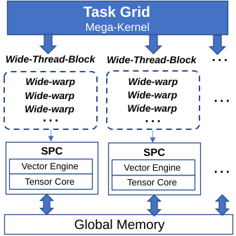</p><p align="center">图：设备上的超大核函数调度</p>

超大核函数的用法与普通核函数几乎相同，除了修饰不同。超大核函数仍然遵循如上图所示的层次结构组织。一个线程网格被组织成几个宽线程块，一个宽线程块被划分为多个宽线程束，并被安排在一个流式处理器簇上运行。一个线程网格的工作可以同时使用多个流式处理器簇。

在主机端，启动超大核函数与普通核函数相同。

### 超大核函数到硬件资源和软件 API 映射

为了将普通核函数代码方便地移植到超大核函数代码中，超大核函数保留了普通核函数中使用的所有概念，但由于硬件资源映射方式不同，两者之间存在一些差异。本节列出了相关的映射，并对超大核函数与普通核函数的区别进行解释。

下表为普通核函数和超大核函数资源映射

| 硬件         | 普通核函数   | 超大核函数           |
| ------------ | ------------ | -------------------- |
| 执行单元(EU) | 线程束       | 线程束               |
| 计算单元(CU) | 线程块       | 宽线程束             |
| 流式处理器簇 | 不指定       | 宽线程束, 宽线程块   |
| LSU 内存     | L1, 共享内存 | L1, 四分之一共享内存 |
| 张量缓存     | 不涉及       | 张量核心缓存         |
| 张量核心     | 不涉及       | 张量数据类型和 API   |

除了硬件映射外，一些核函数中使用的原语函数的行为也会发生相应的变化，下面会详细解释。

#### 共享内存差异

标记为 `__shared__` 的内存对象在普通核函数和超大核函数中有不同的行为：

- 在普通核函数中， `__shared__` 可以被线程块中的所有线程作为高性能缓冲区来访问。
- 在超大核函数中， `__shared__` 映射到壁仞通用 GPU 硬件 CU 的共享内存区域，使得一个宽线程块中的线程会被分为 4 份分别映射到 4 个不同的 CU 上。映射到**同一** CU 上的线程可访问**共同**的共享内存区域，映射到**不同** CU 的线程会访问到**不同**的共享内存区域。

<table><tr><td bgcolor=#dceeff><b>说明：</b>该功能属于性能调优的高级选项。</td></tr></table>

```cpp
__global_mega__ void foo {
    __shared__ int arr[256];
    // (warp_idx >> 2) & 0x3 == 0 shares one array of size 256
    // (warp_idx >> 2) & 0x3 == 1 shares one array of size 256
    // (warp_idx >> 2) & 0x3 == 2 shares one array of size 256
    // (warp_idx >> 2) & 0x3 == 3 shares one array of size 256
}
```

#### 同步

- `__syncthreads()` 在线程块级别（T-Mode 下等同于 CU 级别）设置屏障。

- `__sync_block_cluster_threads()` 在 SPC 级别设置屏障，也就是说，它会对应超大核函数中的一个宽线程块概念，仅在 T-Mode 可用。

- `__sync_grid_threads(uint spc_num)` 为整个线程网格设置屏障，以确保线程块之间的数据同步，仅在 T-Mode 可用。
  
  <table><tr><td bgcolor=#ffeccc><b>注意：</b>输入的 <code>spc_num</code> 必须小于等于实际物理上的 SPC 数量。</td></tr></table>

#### 围栏函数与线程协同函数使用

下表列出 BIRENSUPA 支持的所有围栏函数与其对应的的层级。更高严格的围栏函数可以包括低级的围栏函数。

| 围栏函数                                                     | 层级   | 备注                                                         |
| ------------------------------------------------------------ | ------ | ------------------------------------------------------------ |
| \_\_threadfence_block()                                      | CU     |                                                              |
| \_\_threadfence_block_cluster()                              | SPC    |                                                              |
| \_\_threadfence_block_cluster<br />(suThreadfenceClusterTensorStore) | SPC    | 用于线程束张量数据读取和存储 API 的围栏函数                  |
| \_\_threadfence()                                            | 设备   |                                                              |
| \_\_threadfence<br />(suThreadfenceVcoreTensorStore)         | 设备   | 用于线程束张量数据存储 API 的围栏函数                        |
| \_\_threadfence<br />(suThreadfenceVcoreTensorReduce)        | 设备   | 用于 wti::\_\_warp_reduce_add() API 的围栏函数               |
| \_\_threadfence<br />(suThreadfenceVcoreTensorStoreAndReduce) | 设备   | \_\_threadfence<br />(suThreadfenceVcoreTensorStore) +<br>\_\_threadfence<br />(suThreadfenceVcoreTensorReduce) |
| \_\_threadfence_system()                                     | 多设备 |                                                              |

下表列出 BIRENSUPA 支持的所有线程协同函数与其对应的的层级。更高严格的线程协同函数可以包括低级的线程协同函数。

| 线程协同函数                                               | 层级 | 备注                                                         |
| ---------------------------------------------------------- | ---- | ------------------------------------------------------------ |
| \_\_syncthreads()                                          | CU   |                                                              |
| \_\_syncthreads<br />(suThreadSyncBypassL1Only)            | CU   | 使用于**未配置**张量缓冲区（除 ByteObject 张量）的其他张量之间。 |
| \_\_syncthreads<br />(suThreadSyncBypassL1Mix)             | CU   | 使用相同内存的未配置张量缓冲区的 ByteObject 与未配置张量缓冲区的除 ByteObject 张量之外的其他张量之间。 |
| \_\_sync_block_cluster_threads()                           | SPC  |                                                              |
| \_\_sync_grid_threads(uint spc_num)                        | 设备 |                                                              |
| \_\_sync_coroutine_threads()                               | CU   | 协程内专用                                                   |
| \_\_sync_coroutine_threads<br />(suThreadSyncBypassL1Only) | CU   | 协程内专用<br>使用于<br>**没有配置**张量缓冲区的 ByteObject 张量**之外**的其他张量<br>与<br>**没有配置**张量缓冲区的 ByteObject 张量**之外**的其他张量<br>之间 |
| \_\_sync_coroutine_threads<br />(suThreadSyncBypassL1Mix)  | CU   | 协程内专用<br>使用于<br>内存和**配置**了张量缓冲区的 ByteObject 张量<br>与<br>**没有配置**张量缓冲区的 ByteObject 张量**之外**的其他张量<br>之间 |
| \_\_sync_block_coroutine_cluster_threads()                 | SPC  | 协程内专用                                                   |
| \_\_sync_grid_coroutine_threads<br />(uint spc_num)        | 设备 | 协程内专用                                                   |

下表列出 BIRENSUPA 要求 V-Core 函数作为生产者，同线程束 V-Core 函数作为消费者时，围栏函数与线程协同函数使用的最低要求。

<table border="1" cellspacing="0">
    <tr>
        <th rowspan="2", colspan="2">生产者\消费者</th>
        	<th colspan="2">V-Core 在同一个线程束内</th>
    </tr>
    <tr>
        <th>共享内存读取，<br>全局内存加载，<br><u>没有配置</u>张量缓冲区的 ByteObject 张量加载</th>
        <th><u>没有配置</u>张量缓冲区的 ByteObject 张量<br><u>以外</u>的其他张量加载或累加</th>
    </tr>
    <tr>
        <th rowspan="3">V-Core</th>
        <th>共享内存存储<br>
        	指针存储与原子操作<br>
            sti::__st_byte_object()<br>&emsp;（没有配置张量缓冲区的 ByteObject）</th>
		<td>无需</td>
        <td>__threadfence_block_cluster()</td>
    </tr>
    <tr>
        <th>wti::__warp_reduce()<br>
        	wti::__grb_reduce_add()</th>
		<td>无需</td><td>无需</td>
    </tr>
    <tr>
        <th>wti::__store_matrix()<br>
        wti::__store_activation()<br>
		wti::__store_conv_weight()<br>
		wti::__store_vector()<br>
		wti::__load_broadcast_vector()<br>
		sti::__st_byte_object()<br>&emsp;（配置了张量缓冲区的 ByteObject）<br>
		wti::__warp_reduce_add()</th>
		<td>__threadfence_block_cluster()</td><td>无需</td>
    </tr>
</table>

下表列出 BIRENSUPA 要求 V-Core 函数作为生产者，同 CU V-Core 函数作为消费者时，围栏函数与线程协同函数使用的最低要求。

<table border="1" cellspacing="0">
    <tr>
        <th rowspan="2", colspan="2">生产者\消费者</th>
        	<th colspan="2">V-Core 在同一个 CU 内的其他 EU</th>
    </tr>
    <tr>
        <th>共享内存读取，<br>全局内存加载，<br><u>没有配置</u>张量缓冲区的 ByteObject 张量加载</th>
        <th><u>没有配置</u>张量缓冲区的 ByteObject 张量<br><u>以外</u>的其他张量加载或累加</th>
    </tr>
    <tr>
        <th rowspan="3">V-Core</th>
                <th>共享内存存储<br>
        	指针存储与原子操作<br>
            sti::__st_byte_object()<br>&emsp;（没有配置张量缓冲区的 ByteObject）</th>
		<td>__syncthreads()<br>__sync_coroutine_threads()</td>
        <td>__syncthreads<br>(suThreadSyncBypassL1Mix)<br>__sync_coroutine_threads<br>(suThreadSyncBypassL1Mix)</td>
    </tr>
    <tr>
        <th>wti::__warp_reduce()<br>
        	wti::__grb_reduce_add()</th>
		<td>__syncthreads()<br>__sync_coroutine_threads()</td><td>__syncthreads()<br>__sync_coroutine_threads()</td>
    </tr>
    <tr>
        <th>wti::__store_matrix()<br>
        wti::__store_activation()<br>
		wti::__store_conv_weight()<br>
		wti::__store_vector()<br>
		wti::__load_broadcast_vector()<br>
		sti::__st_byte_object()<br>&emsp;（配置了张量缓冲区的 ByteObject）<br>
		wti::__warp_reduce_add()</th>
		<td>__syncthreads<br>(suThreadSyncBypassL1Mix)<br>__sync_coroutine_threads<br>(suThreadSyncBypassL1Mix)</td><td>__syncthreads<br>(suThreadSyncBypassL1Only)<br>__sync_coroutine_threads<br>(suThreadSyncBypassL1Only)</td>
    </tr>
</table>


下表列出 BIRENSUPA 要求 V-Core 函数作为生产者，同 SPC V-Core 或 T-Core 函数作为消费者时，围栏函数与线程协同函数使用的最低要求。

<table border="1" cellspacing="0">
    <tr>
        <th colspan="2">生产者\消费者</th>
        	<th>V-Core 在同一个 SPC 内的其他 EU</th>
            <th>T-Core 在同一个 SPC 内</th>
    </tr>
    <tr>
        <th rowspan="3">V-Core</th>
        <th>共享内存存储<br>
        	指针存储与原子操作</th>
		<td>__sync_block_cluster_threads()<br>__sync_block_cluster<br>_coroutine_threads()</td>
        <td>__sync_block_cluster_threads()<br>__sync_block_cluster<br>_coroutine_threads()</td>
    </tr>
    <tr>
        <th>wti::__warp_reduce()<br>
        	wti::__grb_reduce_add()</th>
		<td>__sync_block_cluster_threads()<br>__sync_block_cluster<br>_coroutine_threads()</td><td>__sync_block_cluster_threads()<br>__sync_block_cluster<br>_coroutine_threads()</td>
    </tr>
    <tr>
        <th>wti::__store_matrix()<br>
        wti::__store_activation()<br>
		wti::__store_conv_weight()<br>
		wti::__store_vector()<br>
		wti::__load_broadcast_vector()<br>
		sti::__st_byte_object()<br>
		wti::__warp_reduce_add()</th>
		<td>__sync_block_cluster_threads()<br>__sync_block_cluster<br>_coroutine_threads()</td><td>__sync_block_cluster_threads()<br>__sync_block_cluster<br>_coroutine_threads()</td>
    </tr>
    <tr>
        <th rowspan="4">T-Core</th>
        <th>MMA/Conv 输出到 TLR</th>
		<td>无需</td><td>无需</td>
    </tr>
    <tr>
        <th>MMA/Conv 输出到<u>配置了</u>张量缓冲区的张量</th>
		<td>无需</td><td>无需</td>
    </tr>
    <tr>
        <th>MMA/Conv 输出到<u>没有配置</u>张量缓冲区的张量</th>
		<td>__sync_block_cluster_threads()<br>__sync_block_cluster<br>_coroutine_threads()</td>
        <td>__sync_block_cluster_threads()<br>__sync_block_cluster<br>_coroutine_threads()</td>
    </tr>
    <tr>
        <th>MMA/Conv 累加到张量</th>
		<td>__sync_block_cluster_threads()<br>__sync_block_cluster<br>_coroutine_threads()</td>
        <td>__sync_block_cluster_threads()<br>__sync_block_cluster<br>_coroutine_threads()</td>
    </tr>
</table>


下表列出 BIRENSUPA 要求 V-Core 或 T-Core 函数作为生产者，同 设备 V-Core 或 T-Core 函数作为消费者时，围栏函数与线程协同函数使用的最低要求。

<table border="1" cellspacing="0">
    <tr>
        <th colspan="2">生产者\消费者</th>
        	<th>V-Core 在同一个设备内的其他 EU</th>
            <th>T-Core 在同一个设备内</th>
    </tr>
    <tr>
        <th rowspan="3">V-Core</th>
        <th>共享内存存储<br>
        	指针存储与原子操作</th>
		<td>__sync_grid_threads()<br>__sync_grid<br>_coroutine_threads()</td>
        <td>__sync_grid_threads()<br>__sync_grid<br>_coroutine_threads()</td>
    </tr>
    <tr>
        <th>wti::__warp_reduce()<br>
        	wti::__grb_reduce_add()</th>
		<td>__sync_grid_threads()<br>__sync_grid<br>_coroutine_threads()</td><td>__sync_grid_threads()<br>__sync_grid<br>_coroutine_threads()</td>
    </tr>
    <tr>
        <th>wti::__store_matrix()<br>
        wti::__store_activation()<br>
		wti::__store_conv_weight()<br>
		wti::__store_vector()<br>
		wti::__load_broadcast_vector()<br>
		sti::__st_byte_object()<br>
		wti::__warp_reduce_add()</th>
		<td>__sync_grid_threads()<br>__sync_grid<br>_coroutine_threads()</td><td>__sync_grid_threads()<br>__sync_grid<br>_coroutine_threads()</td>
    </tr>
    <tr>
        <th rowspan="2">T-Core</th>
        <th>MMA/Conv 输出到<u>没有配置</u>张量缓冲区的张量</th>
		<td>__sync_grid_threads()<br>__sync_grid<br>_coroutine_threads()</td>
        <td>__sync_grid_threads()<br>__sync_grid<br>_coroutine_threads()</td>
    </tr>
    <tr>
        <th>MMA/Conv 累加到张量</th>
		<td>__sync_grid_threads()<br>__sync_grid<br>_coroutine_threads()</td>
        <td>__sync_grid_threads()<br>__sync_grid<br>_coroutine_threads()</td>
    </tr>
</table>

#### 线程束级函数和原语

超大核函数仍然有线程束的概念，每个线程束包含 32 个线程。所有与线程束相关的内置函数和原语也都可以在超大核函数中使用，例如线程束级的 shuffle。

### 超大核函数使用模式

本小节将通过一个示例来展示如何使用不同的程序模式编写应用程序，本示例是一个图像处理中的池化（pooling）操作。输入图像的大小为 NxN，有 1 个线程，池化操作的大小为 3x3，步长为 1。

下图展示了三种模式：

- 共享内存模式：在每个步骤中，一个宽线程束处理 mxn 的数据块，使用共享内存访问相邻像素。
- Shuffle 模式：在每个步骤中，一个宽线程束处理 1xN 的数据块，使用 shuffle 操作来访问相邻像素。
- 张量核心模式：每个线程束（包含 32 个线程）处理 Nxk 的数据块。在每个步骤中，线程束进程都将 4x8 的数据块加载到寄存器中，并使用张量指令对其进行处理。更多信息，请参见[主机端与设备端的实用功能](#主机端与设备端的实用功能)。

<p align="center">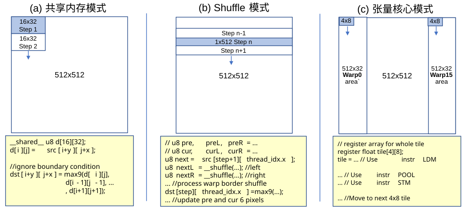</p><p align="center">图：超大核函数使用模式</p>

使用场景建议：

- 在使用图像处理等应用时，建议您将前两种模式切换到普通核函数，因为普通核函数在共享内存访问方面性能更优。
- 如果需要使用壁仞通用 GPU 的独有特性，比如张量核、Tensor 数据类型与编程原语、NUMA/UMA 等，您应该选择超大核函数。
- 在张量核心模式中，大多数操作都是由每个线程束中张量指令完成的，因此速度很快。其基本流程是：

  1. 您需要将数据存放在张量数据类型中。
  2. 使用 BIRENSUPA 编程模型提供的张量读取函数将数据加载到寄存器中。
  3. 使用张量指令编程原语进行运算。

  在此过程中，您需要考虑寄存器中的数据布局，以及张量指令所支持的数据类型等。

<div style="page-break-after:always"></div>

## NUMA 和 UMA 内存

在 BIRENSUPA 编程模型和壁仞通用 GPU 中，有两种不同类型的内存布局：

- NUMA：非统一内存访问。
- UMA：统一内存访问。

这两种布局分别支持两种不同类型的内存访问模式，如下图所示。

<p align="center">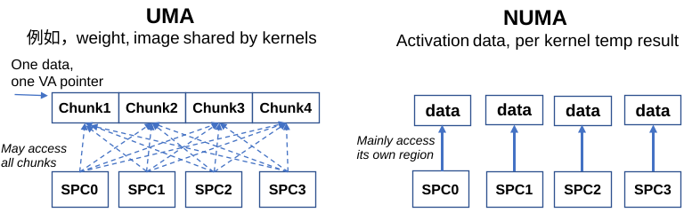 </p><p align="center">图：两种类型的内存访问模式</p>

在人工智能或其他计算密集型工作负载中，运行在不同流式处理器簇上的核函数可能需要访问共享数据，例如权重和图像。为了最大程度地提高访问速度，最好将数据分配到不同的内存线程或内存组。这样，一个运行在多个流式处理器簇上的核函数就可以使用所有内存通道的带宽来访问数据。

另一方面，运行在每个流式处理器簇上的核函数可能只需要访问一些局部数据，这些数据不会被其他流式处理器簇使用。例如神经网络的激活数据和临时数据。在这种情况下，数据应该存储在产生或使用它的计算单元附近。这样，内存访问速度会更快，而且相应的通信量也会尽可能小的与其他流式处理器簇发出的内存请求挤占带宽。

### 内存布局

为了满足不同的访问模式，壁仞通用 GPU 硬件提供了几种不同的物理内存分配模式，包括不同类型的 UMA 和 NUMA。以下用 16 个 HBM 分区（Section）作为示例。

<table><tr><td bgcolor=#dceeff><b>说明：</b>在当前的壁仞通用 GPU 硬件中，每 512 字节内存是一个块。</td></tr></table>

#### UMA 内存布局

在 UMA 布局中，一个大于 512 字节空间的虚拟内存分配在多个 HBM 分区之间交织分布，以 512 字节粒度划分。这与服务器或 GPU 中的一些多线程内存系统类似。当一个流式处理器簇提交一个连续的虚拟内存读取时，这个读取会被分解成多个物理内存访问请求。这些请求被分配到不同的路径，映射到不同 HBM 分区的 L2 缓存可以相应地服务于这些请求。

<p align="center">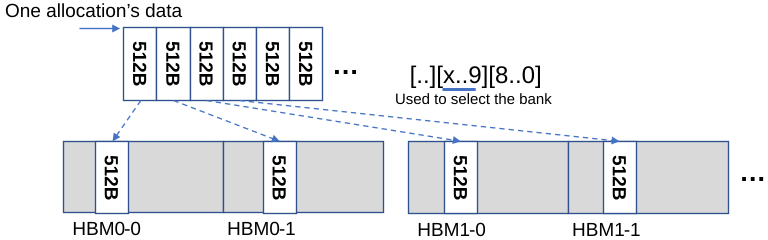 </p> <p align="center">图：UMA 内存布局</p>

<table><tr><td bgcolor=#dceeff><b>说明：</b>前面章节介绍的所有内存分配 API 都在 UMA 布局中分配内存。</td></tr></table>

#### NUMA 内存布局

在 NUMA 布局中，一个流式处理器簇的数据完全连续地存储在 HBM 的一个特定分区中，并且只有该 HBM 分区的相应 L2 缓存才能缓存这些数据。下图以 8 个流式处理器簇和对应 HBM 分区为例，如果内存访问请求来自于这个 HBM 分区对应的 SPC，那么请求将在本地处理。应用程序将核函数调度到恰当的硬件位置可以减少访问私有数据导致的流量拥塞。

<p align="center">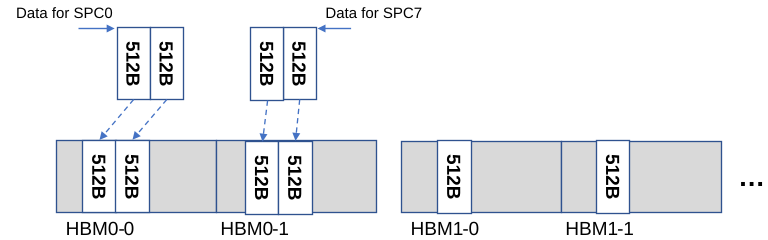 </p> <p align="center">图：NUMA 内存布局</p>

#### 主要内存模式

完整的壁仞通用 GPU 硬件包含多个流式处理器簇和 HBM 分区。在这种情况下，虽然 UMA 存储可以使用系统中的所有 HBM 分区，但是您也可以限制 UMA 存储的 HBM 分区交织范围，例如，仅在 4 个或 8 个流式处理器簇对应的 HBM 分区当中，这种 UMA 模式被称为 UMA4、UMA8 等。

尽管多种 UMA 模式可以在系统中共存，您当前只需考虑以下三种主要类型的内存模式：

- UMA：全局 UMA，由默认分配器分配。
- NUMA：每一段连续虚拟地址分配到 1 个 HBM 分区，由 NUMA 分配器分配。
- UMA4：每一段连续虚拟地址分配到 4 个 HBM 分区（UMA4），由 NUMA 分配器分配。


### UMA 多设备存储

如果主机服务器中有多个壁仞通用 GPU，那么 NUMA 存储布局与单个 GPU 相同，即以流式处理器簇为单位布局。对于 UMA，每个设备都有自己的 UMA 存储区域。例如，服务器中有两台设备，每台设备都是双晶粒（Two die）系统，则分配的 UMA 内存采用 UMA32 模式，如下图所示。您可以选择当前设备，并使用 `suMallocDevice()` 在该设备上分配 UMA，以避免跨设备边界的数据交叉存储。

<p align="center">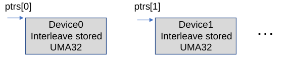</p> <p align="center">图：多设备中的 UMA 布局</p>

由于壁仞通用 GPU 提供 P2P（Peer-to-Peer）连接，并且有 UVA 内存空间，一个设备可以直接访问另一个设备中的内存。然而，在实际应用中，开发者通常需要创建一个 `for` 循环，遍历所有设备，并在每个设备上分配 UMA，然后将地址指针放入一个数组中。在启动核函数之后，核函数可以使用内置变量 `device_id` 来查询当前的设备 ID，并尽量使用当前设备中的内存区域。

### NUMA 内存 API

`suMallocDevice` 内存分配 API 仅分配 UMA 内存。如要分配 NUMA 内存，则需要使用一组不同的 API。主要的 NUMA 分配 API 示例如下，该接口还可以用于分配其他类型的内存（如 UMA4，UMA8 等）：

```cpp
suError_t suNumaMallocDevice(void **ptr,
                             size_t *sizePerRegionPitch,
                             size_t numRegions,
                             size_t sizePerRegion,
                             suMemArchType type = suMemArchTypeNUMA);
```

例如在最后一个参数 `type` 使用默认值时，此 API 分配 `numRegions` 个 NUMA 内存区域，每个区域的大小为 `sizePerRegion`。

由于每个 NUMA 内存区域必须按页对齐，因此在运行时会首先将大小 `sizePerRegion` 对齐到 `sizePerRegionPitch`，并分配总大小为 `numRegions*sizePerRegionPitch` 的连续虚拟内存空间，对齐后的每个分区大小会作为第二个参数输出。对于每个 `sizePerRegionPitch` 内存区域，驱动程序会将其映射到物理空间中的 NUMA 区域，如下图所示。

<p align="center">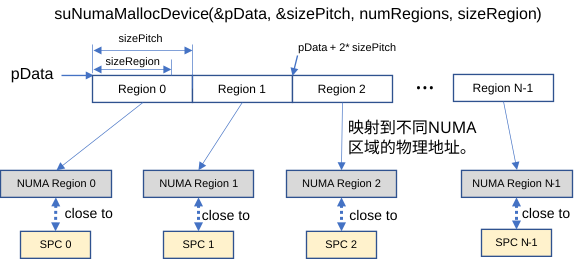</p><p align="center">图：NUMA Malloc 虚拟内存到物理内存的映射</p>

由于内存分配和解除分配之间的对称性以及在内存拷贝中的易用性，NUMA 分配 API 只返回一个指针而不是指针数组。为了满足这个要求，每个 NUMA 区域的大小都应该与页面大小对齐，因此返回一个 `sizePerRegionPitch`。与传递指针数组相比，这种方法还可以节省将 NUMA 指针传递到核函数的空间。

分配 NUMA 区域后，代码可以使用指针作为常规设备内存指针，来执行内存拷贝或核函数启动。核函数通常需要 NUMA 地址指针和 `sizePerRegionPitch`，这样每个线程块就可以获得自己的 NUMA 区域。

```cpp
// ===== Host code =====
int spcCount = 16; // Could use suGetDeviceProperties() to query
float *d_numa;
size_t sizePerRegionPitch;
size_t sizePerRegion = 512 * sizeof(float);
suNumaMallocDevice(&d_numa, &sizePerRegionPitch, spcCount, sizePerRegion);

// Allocate UMA Memory
float *d_uma;
suMallocDevice(&d_uma, 512 * sizeof(float));

// Launch Kernel as usual
suLaunchKernel(kernel, dim3(spcCount), dim3(512), 0, NULL, d_numa,
               sizePerRegionPitch, d_uma);

// ====== Device kernel code ======
__global_mega__ void kernel(float *numa, size_t sizePerRegionPitch, float *uma) {
    // get the NUMA for this SPC
    float *local_numa = numa + block_idx.x * sizePerRegionPitch / sizeof(float);
    local_numa[thread_idx.x] =
        uma[thread_idx.x]; // Read UMA & Write NUMA portion
}
```

<table><tr><td bgcolor=#dceeff><b>说明：</b>在使用 NUMA 特性时，需要仔细设计程序，以达到预期的性能。<p>例如，如果使用模式是一个线程块对应一个 NUMA 区域，则启动参数的线程网格大小应等于 NUMA 区域计数。在默认情况下(NUMA使用非统一虚拟地址寻址 Non-UVA)，NUMA地址只能由其对应的线程块访问，是该SPC的私有内存空间。如果打开了NUMA使用统一虚拟地址寻址(UVA)，任何其他线程块可以进行跨区域访问，如果希望访问线程块对应的 HBM 地址需要加上基于 <code>block_idx</code> 和 <code>sizePerRegionPitch</code> 的偏移。但是，由于这些访问不是在本地 NUMA 区域中进行，所以性能会相对较低。</p></td></tr></table>


<div style="page-break-after:always"></div>

## 张量数据类型和张量运算


每个壁仞通用 GPU 的流式处理器簇（SPC）都配备了强大的张量核心（Tensor Core），可进行矩阵乘法和卷积运算。此外，壁仞通用 GPU 的向量核心执行单元（EU）也增强了特定的张量计算能力。张量核心计算支持的数据类型有 INT8、UINT8、BF16 和 TF32+（输入输出为 float，计算精度为 E8M15）。在大多数情况下，您无需直接编写代码，suBLAS，suDNN 和其他库提供了相关的 API，以利用张量核心。

如果需要直接使用张量核心，您可以使用 BIRENSUPA 编程模型提供的超大核函数机制进行编程，其中包括：

- 张量数据类型：对于壁仞通用 GPU 内部特殊数据布局的抽象的 Tensor 数据类型。
- 张量原语（Intrinsics）：直接操作张量数据类型的底层原语，映射到壁仞通用 GPU 硬件指令。

<p align="center">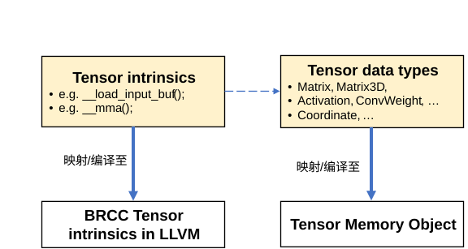 </p><p align="center">图：Tensor 核心 API 层</p>

### 张量数据类型

#### 定义张量数据类型

BIRENSUPA 编程模型定义了张量（Tensor）数据类型，可以针对张量进行特殊的计算操作，包括使用张量核心的矩阵乘法和卷积。AI 应用程序可以将图像源、权重作为张量传递，也可以将激活数据存储为张量。除了使用张量引擎来加速计算之外，壁仞通用 GPU 还支持将张量缓存到张量缓冲区（Tensor Buffer）中，以实现更好的数据局部性。

BIRENSUPA 编程模型中的张量数据结构从数据形状和存储方式两个维度定义：

- 数据形状：定义了张量的结构和用途。例如，一个张量可以是高度为 128，宽度为 256 的矩阵，另一个张量可以是 20 个线程和 128 x 128 的形状卷积神经网络激活数据。
- 存储方式：定义了张量的原始数据在主机或设备中的存储位置以及存储方式，包括在 UMA、NUMA 或 UMA4 设备内存中的存储。

因此，张量类型被组织为下图所示的类结构。

<p align="center">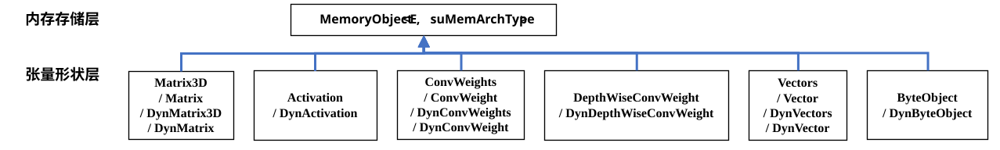</p><p align="center">图：张量类层次结构</p>

在形状方面，BIRENSUPA 编程模型定义了两种张量类型：

- 静态维度张量类型：在编译时，确定的静态已知的张量维度，并使用 C++ 模板参数编码。

  静态维度张量具有以下模板参数：

  - E：元素类型。支持 BIRENSUPA 编程模型中的以下标量类型：`float`，`int`，`uint`，`BF16`，`char`，`uchar` 等。
  - 不同张量类型所需的维度信息。如：

    - 矩阵具有 H 和 W 维度，矩阵 3D 还额外具有 N 维度。
    - 卷积数据存储的激活量具有 N、C、H、W 维度。
    - 卷积权重存储的 `ConvWeight` 具有 C_OUT、C_IN、KH、KW 维度。向量有长度 N 维度。

- 动态维度张量类型：可在运行时设置的张量维度，并使用 C++ 类字段记录。

  动态维度张量的模板参数只有数据类型 E。维度信息由 C++类字段确定。

本节主要介绍张量类型的形状方面。关于 UMA/NUMA 张量存储的详细信息请参见[UMA/NUMA 内存和 NUMA/UMA4 张量](#uma-numa-内存和-numa-uma4-张量)。

#### 创建与使用张量数据类型

在 BIRENSUPA 编程模型中，您可以使用主机端的代码创建张量，然后通过启动超大核函数传递给设备端代码使用。有两种模式来创建张量数据类型：管理模式和非管理模式。

- 管理模式：

  张量数据类型会自动分配和管理主机端和设备端的内存。如下代码示例展示了，直接创建张量数据类型，其主机端与设备端内存均由张量数据类型内部进行分配与管理。

```cpp
  template<MatrixLayout L>
  __global_mega__ void sample(UmaMatrix<FP32, L, 256, 1024> A) {
    ... // Use API to manipulate A
  }

  int main() {
    //define Tensor and allocate host/device memory
    UmaMatrix<FP32, BLOCK_COL_MAJOR, 256, 1024> A;
    ... // initialize A
    suLaunchKernel(sample, 1, 512, 0, NULL, A);
    ...
  }
```

- 非管理模式：

  您可以直接调用 `suMallocHost()` / `suMallocDevice()` 等函数自行分配主机内存与设备内存，然后传入指针构造张量数据类型。在这种模式下，您需要自行释放内存。

张量数据类型在主机端提供了 `set()` 与 `get()` 类方法进行单个数据在张量内主机内存的读写，也提供了 `copyFromRawData()` 和 `copyToRawData()` 方法来在原始数据排布的主机内存与张量内主机内存中壁仞通用 GPU 张量数据排布之间进行转换。为了方便数据在张量内主机内存与设备内存之间进行拷贝，您可以使用 `moveToDevice()`，`moveToDeviceAsync()`，`moveToHost()` 和 `moveToHostAsync()` 等方法。


```cpp
int main() {
    BF16 *rgbData = ... // convert from feature map;
    // define Tensor and allocate host/device memory
    UmaActivation<BF16, 1, 3, 224, 224> Act;
    Act.copyFromRawData(suDenseRowMajor, rgbData);
    Act.moveToDevice();
    UmaActivation<BF16, 1, 3, 224, 224> Res;
    suLaunchKernel(relu, 1, 512, 0, NULL, Res, Act);
    Res.moveToHost();
    ... // check Res.
}
```

##### 张量绑定

根据壁仞通用 GPU 硬件设计，张量在启动超大核函数之前需要被绑定到一个标记为 **CPU 本地线程变量**的绑定表上。BIRENSUPA 会对直接作为超大核函数参数的张量进行自动绑定，也可以通过使用 `bind()` API 进行手动绑定以及 `forceBind()` API 进行手动强制绑定。张量绑定需要遵循以下规则：

- 如果张量直接作为超大核函数参数会自动绑定，可以不用额外进行绑定。
- 如果指针、结构体或类作为超大核函数参数中存在张量，此张量需要手动进行绑定。
- 张量在主机端创建，希望直接用 `uid` 在设备端重现，此张量需要手动进行绑定，使用的 `uid` 和张量信息需要严格保证和其在主机端对应的张量一致。
- 所有绑定只在下一次超大核函数启动时生效，超大核函数启动后所有绑定关系都会过期，下一个超大核函数使用相同张量需要重新进行绑定。
- 启动超大核函数，所有已绑定的张量必须都在生命周期内，如果有已绑定张量被释放，需要使用 `suBindTableClear()` API 重置绑定关系。
- 绑定和重置绑定关系都作用与整个主机端线程，绑定与解绑需要与对应的超大核函数处在相同主机端线程。
- 对于每一次启动的超大核函数，最多可绑定 256 个张量。

```cpp
int main() {
    NumaDynMatrix3D<FP32, Layout> matrix(N, H, W, NUM_SPC);
    NumaDynMatrix3D<FP32, Layout> input1(N, H, W, NUM_SPC);
    NumaDynMatrix3D<FP32, Layout> input2(N, H, W, NUM_SPC);

    NumaDynMatrix3D<FP32, Layout> arr_h[2] = {input1, input2};
    NumaDynMatrix3D<FP32, Layout> *arr_d;
    suMallocDevice(&arr_d, 2 * sizeof(NumaDynMatrix3D<FP32, Layout>));

    for (int i = 0; i < 3; i++) {
        // All binding will be clear after suLaunchKernel, need to rebind after
        // all suLaunchKernel

        // Bind and update UID
        arr_h[0].bind();
        arr_h[1].bind();

        // Info in Tensor updated, memory copy after Binding
        suMemcpy(arr_d, arr_h, 2 * sizeof(NumaDynMatrix3D<FP32, Layout>));

        // Tensor matrix directed use as parameter for __global_mega__ function,
        // will automattic re-bind
        suLaunchKernel(test, NUM_SPC, 512, 0, NULL, matrix, arr_d);
        // all binding relation expired
    }
}
```

### 张量运算

大部分张量库中的张量方法和函数只能在设备端使用，并且以 SIMT 风格在宽线程束范围内执行。BIRENSUPA 在设备端提供张量原语可对张量进行读写等操作。

#### 张量数据读写的越界行为

在壁仞通用 GPU 硬件设计版本 1.x 中，张量数据读取和存储 API 会在读取或写入张量内存的同时自动处理越界行为。

在壁仞通用 GPU 硬件中，张量存储最小按照 512 字节的线程块为粒度对齐，同时也需要满足根据张量布局的额外对齐要求（在下图例子中，BF16 数据类型的 19 \* 60 大小的 COL-MAJOR Matrix 张量会被对齐到 32 \* 64）。BIRENSUPA 中张量数据的越界行为是基于坐标的。

- 当坐标落在张量存储对齐后形状之外时（在下图例子中（0，64）或（33，0）），会被视为完全越界；
- 当坐标落在张量存储对齐后形状内，且其内存位置所在的**数据块**内不存在张量实际数据的越界行为也被视为完全越界（在下图例子中（26，50））；
- 当坐标落在张量存储对齐后形状内，且其内存位置所在的**数据块**范围存在张量实际数据的越界行为被视为部分越界（在下图例子中（0，62）或（19，0））；

<table><tr><td bgcolor=#ffeccc><b>注意</b>：BIRENSUPA 编程模型中 <code>wti::__load_xxx()</code> 系列函数接口的“部分越界”判定方式与其余接口有所不同，该系列接口在上述第 2、3 条判定时会按照<b>数据子块</b>粒度判定当前位置属于部分越界还是完全越界。</td></tr></table>

<p align="center">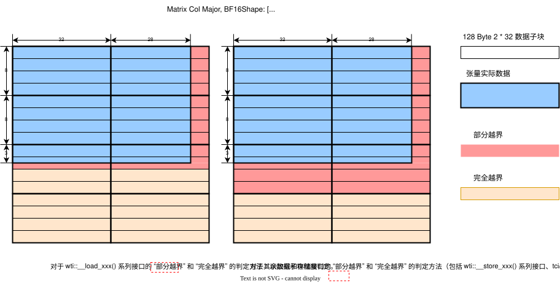</p><p align="center">COL-MAJOR Matrix 张量越界行为示意图</p>

在壁仞通用 GPU 硬件平台上，执行读写操作时，针对部分越界和完全越界两种情况，系统会采用不同的处理机制：

- 读 API（线程束张量数据读取 API，张量核心加载缓冲区 API，高性能张量核心加载缓冲区 API 等）：
  - 部分越界：不进行处理，直接读取内存中的值
  - 完全越界：返回 0
- 写 API（线程束张量数据储 API，张量核心矩阵乘法 API，张量核心卷积 API，高性能张量核心矩阵乘法 API，高性能张量核心卷积 API 等）：
  - 部分越界：越界部分写入 0
  - 完全越界：不进行实际内存写入操作

<p align="center">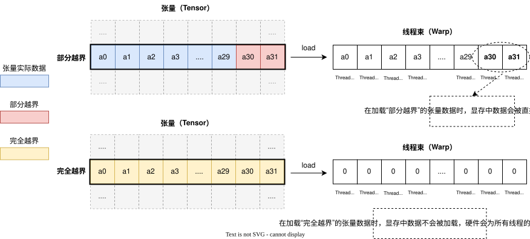</p><p align="center">COL-MAJOR Matrix 张量越界行为示意图</p>

<p align="center">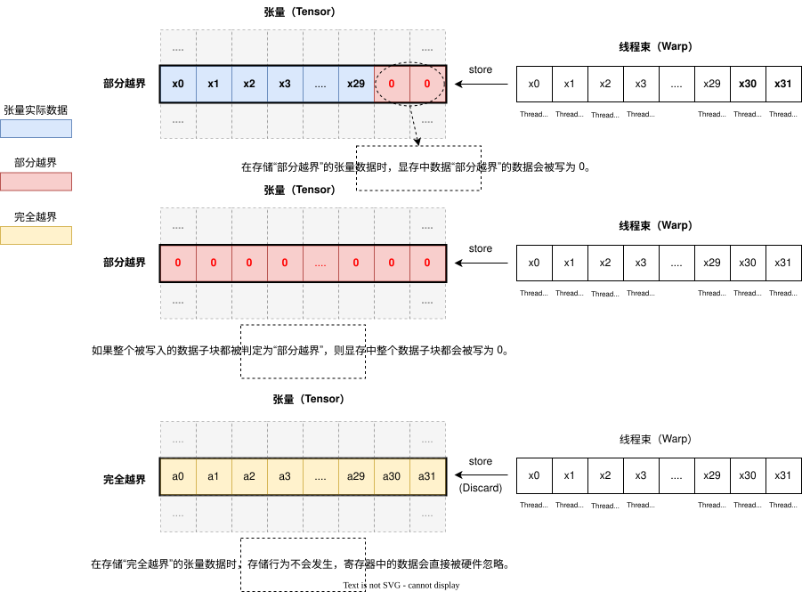</p><p align="center">COL-MAJOR Matrix 张量越界行为示意图</p>

#### 基本张量原语

BIRENSUPA 编程模型定义了低级原语，这些原语直接映射到壁仞通用 GPU 的相关张量指令，使用的数据类型都与硬件功能直接相关。因此，使用这些原语时，输入数据必须满足指令的限制，例如可被张量核心处理的矩阵乘法的大小限制。

BIRENSUPA 编程模型的张量编程原语分为两种类型：

- WTI（Warp Tensor Intrinsics）：定义在 `tensor::wti` 命名空间下。WTI 类型原语在流式处理器簇的向量核心上执行，按照线程束的粒度处理 Tensor 数据，比如进行 Tensor 数据的读写、计算（如池化）、归约（Reduce）等；
- TCI（Tensor Core Intrinsics）：定义在 `tensor::tci` 命名空间下。TCI 类型原语在流式处理器簇的张量核心上执行，是整个线程块统一执行的行为，也就是整个线程块都在进行矩阵乘法或者卷积操作。

##### WTI 用例

WTI 通常用于将整个线程块划分为多个线程束（例如，512 个线程划分为 16 个线程束），每个线程束处理一定的输入数据。在使用 WTI 时，首先使用数据加载原语将内存数据加载到寄存器中，然后进行运算，最后将寄存器中的数据写回内存。

以下示例展示了如何进行激活数据加法。本示例中，每个线程束每次处理一个 Tensor 的 2 个线程的 4x8 tile，每个线程束使用了 32 个线程，每个寄存器存储两个线程的数据。

```cpp
__global_mega__ void
matrixAdd(tensor::NumaActivation<BF16, 10, 64, 14, 14> Out,
          tensor::NumaActivation<BF16, 10, 64, 14, 14> In1,
          tensor::NumaActivation<BF16, 10, 64, 14, 14> In2) {
    for (ushort n = 0; n < 10; n++) {
        // each warp get 2 channels' data, 16 warp get 32 channels' data
        for (ushort c = warp_idx * 2; c < 64; c += warp_count * 2) {
            for (ushort w = 0; w < 14; w += 8) {
                for (ushort h = 0; h < 14; h += 4) {
                    Coordinate coord(n, c, h, w);
                    bf162 sv1, sv2;
                    tensor::wti::__load_activation(&sv1, In1, coord);
                    tensor::wti::__load_activation(&sv2, In2, coord);
                    bf162 sum = sv1 + sv2;
                    tensor::wti::__store_activation(Out, coord, sum);
                }
            }
        }
    }
}
```

##### TCI 用例

在张量核心中进行 TCI 矩阵乘法或者卷积的一般步骤如下：

1. （可选）准备归约缓冲区。
2. 将数据从 Tensor 加载到 A 缓冲区中。
3. 将数据从 Tensor 加载到 B 缓冲区中。
4. 执行 `__mma()` 或者 `__conv()` 操作计算 A 缓冲区和 B 缓冲区中的数据，结果可以仅累加在张量核心内部累加器中，也可以输出到张量或寄存器中。

以下示例展示了如何进行矩阵乘法。

```cpp
using namespace tensor;
template <ushort M, ushort N, ushort K>
__global_mega__ void TensorMul(UmaMatrix<FP32, BLOCK_ROW_MAJOR, M, N> Out,
                               UmaMatrix<FP32, BLOCK_ROW_MAJOR, M, K> A,
                               UmaMatrix<FP32, BLOCK_ROW_MAJOR, K, N> B) {
    for (ushort h = 0; h < M; h += 64) {
        for (ushort w = 0; w < N; w += 64) {
            tci::__mma_buf<tci::A_BUF, FP32, 64, 64> abuf; // 16KB
            tci::__mma_buf<tci::B_BUF, FP32, 64, 64> bbuf; // 16KB
            wti::__reduce_buf<4, wti::REDUCE_NONE> grb;
            tci::__mma_acc<64, 64> acc;
            ushort k = 0;
            for (; k < K - 64; k += 64) {
                tci::__load_input_buf(&abuf, A, Coordinate2D(h, k));
                tci::__load_input_buf(&bbuf, B, Coordinate2D(k, w));
                // Not output to Out Tensor as no coordinate is given
                // Out is just used as a reference Tensor for layout info
                tci::__mma(Out, &acc, &grb, abuf, bbuf);
            }
            tci::__load_input_buf(&abuf, A, Coordinate2D(h, k));
            tci::__load_input_buf(&bbuf, B, Coordinate2D(k, w));
            // result is output to Out at given coordinate
            tci::__mma(Out, Coordinate2D(h, w), &acc, &grb, abuf, bbuf);
        }
    }
}
```

卷积的步骤与矩阵乘法类似，即将数据加载到两个输入缓冲区中，并执行 `__conv()` 操作。不同之处在于，卷积运算通过其他模板参数来设置 `stride` 、 `dilation` 和 `padding`。


### UMA/NUMA 内存和 NUMA/UMA4 张量

在 BIRENSUPA 编程模型中，您可以在 UMA 或 NUMA 区域中分配张量内存。

#### 使用 UMA 内存的张量

最常用的是使用 UMA 内存的张量，也称为 UMATensor，在所有流式处理器簇中可以有效地访问。

<p align="center">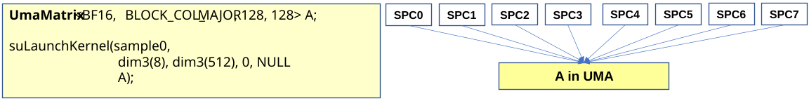</p> <p align="center">图：内存中的 UMA Tensor</p>

#### 使用 NUMA 内存的张量

另一种张量类型称为 NUMATensor，当一个 Tensor 在多个内存分区共享相同的元数据（元素类型，尺寸等），且每个内存分区的数据只需被其对应的 SPC 访问时，通常会将其分配在 NUMA 区域。

在主机端，NUMATensor 记录了区域的数量以及每个区域的实际内存使用情况。您可以让系统来管理内存，而 NUMATensor 的构造仅需要区域数。您也可以传入预先分配的、带有 `sizePerRegionPitch` 的 NUMA 内存指针。

<p align="center">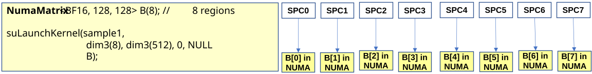</p><p align="center">图：内存中的 NUMA Tensor</p>

核函数启动后，每个流式处理器簇都会收到一个常规的 NumaTensor，其元数据与 NumaTensor 相同，但是数据地址指向不同 NUMA 内存位置，这些位置记录在不同流式处理器簇的 NumaTensor 中。为了在核函数启动中使用 NumaTensor，线程网格大小必须等于 NumaTensor 中的 `numRegions`，以确保每个流式处理器簇（执行一个宽线程块）都可以接收其自己的常规 NumaTensor。如果不满足此条件，核函数启动将失败。以类似的方式，在 BIRENSUPA 编程模型中定义了 `NumaMatrix`，`NumaMatrix3D`，`NumaConvWeight` 和 `NumaActivation`。

```cpp
__global_mega__ void sample(NumaMatrix3D<U8, BLOCK_ROW_MAJOR, 32, 128, 128> A) {
    // the kernel only get the local version of the NUMA tensor.
}

void main() {
    // A region NUMA tensor with explicitly managed memory
    U8 *d_data;
    size_t sizePerRegionPitch;
    // According to the layout to compute memory size required
    size_t perRegionSize =
        NumaMatrix3D<U8, BLOCK_ROW_MAJOR, 32, 128, 128>::size();
    suNumaMallocDevice(&d_data, &sizePerRegionPitch, 8, perRegionSize);
    U8 *h_data = (U8 *)malloc(8 * sizePerRegionPitch); // Host have the same
                                                       // size
    NumaMatrix3D<U8, BLOCK_ROW_MAJOR, 32, 128, 128> A(h_data, d_data, 8,
                                                      sizePerRegionPitch);
    suLaunchKernel(sample, dim3(8), dim3(512), 0, NULL, A);
}
```

上面的示例启动了 8 个流式处理器簇，每个流式处理器簇运行一个宽线程块。第一个块的 A 的数据由 `d_data` 指向，第二个块的 A 的缓冲区由 `d_data` + `sizePerRegionPitch` 指向，其余的块以此类推。

#### 使用 UMA4 内存的张量

除了 UmaTensor 和 NumaTensor 之外，BIRENSUPA 编程模型还定义了 Uma4Tensor，可用于存储在计算组模式核函数启动中的 UMA4 内存。在这种情况下，线程网格大小应为 Uma4Tensor 中 `numRegions` 的 4 倍，以便每 4 个流式处理器簇（形成计算组 VMC）可以共享一个常规张量。

BIRENSUPA 编程模型支持的最后一个张量类型称为计算组 Across Tensor，或简称为计算组 Tensor。这种高级数据结构用于存储可以跨越 4 个流式处理器簇的大张量。通过这种模式，一个计算组（4 个流式处理器簇）可以协同工作来处理大张量。与 Uma4Tensor 相似，线程网格大小应为 VmcTensor 中 `numRegions` 的 4 倍，以便每 4 个流式处理器簇可以共享一个大的张量。

<p align="center">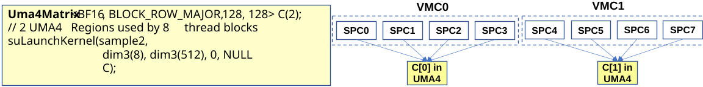</p><p align="center">图：内存中的 UMA4 Tensor </p>

<p align="center">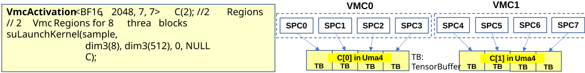</p> <p align="center">图：内存中的计算组 Tensor</p>

Uma4Tensor 和 VmcTensor 之间的主要区别在于，后者可以利用多个张量缓冲区存储更大的张量。

您可以通过使用不同类型的张量，来获得 UMA/NUMA 带来的性能提升，而无需直接操作 UMA/NUMA 的地址指针。

<div style="page-break-after:always"></div>


## 多 GPU 编程

在 BIRENSUPA 编程模型中，一个主机端可以管理服务器中的多个设备。本章节描述了服务器系统中的多设备拓扑结构，以及如何使用 BIRENSUPA API 对多设备进行编程来实现诸如多设备间数据搬移、All-Reduce 等操作。

<table><tr><td bgcolor=#ffeccc><b>注意</b>：BIRENSUPA 不直接支持跨服务器的多设备编程，因为不同服务器之间可能使用网络设备进行连接。请使用常用的网络 API 实现服务器之间的通信。</td></tr></table>

### 壁仞多设备拓扑结构

壁仞 GPU 提供两种在同一服务器内连接 GPU 的方式：PCIe 和 BLink™，以下表格总结了各种壁仞 1XX 系列产品的相关能力。

> BLink™: BLink™ 为壁仞特有的全互联技术，可支持不同设备内存之间的直接通信。

<div align="center">
<table>
<tr> <th>GPU 型号  </th><th> PCIE           </th><th> BLink   </th></tr>
<tr> <td>BR106C      </td><td> 1 PCIE Gen4x16 </td><td> N/A     </td></tr>
<tr> <td>BR106B      </td><td> 1 PCIE Gen4x16 </td><td> 3 BLink </td></tr>
<tr> <td>BR106M   </td><td> 1 PCIE Gen5x8  </td><td> 4 Blink </td></tr>
</table>
<p> 表格：壁仞 BR1XX 系列 GPU 连接能力</p>
</div>

单个 BLink 的带宽均为双向共 64 GB/s（或每个方向各 32 GB/s）

#### PCIe 与 BLink 之间能力区别

在 BR1XX 系列 GPU 中，PCIe 和 BLink 对于 UMA 内存的使用能力上有所区别。

<div align="center">
<table>
<tr> <th>操作             </th><th> PCIE    </th><th> BLink </th></tr>
<tr> <td>DMA 引擎内存拷贝  </td><td> 支持* （详情见<b>注意 1</b>） </td><td> 支持    </td></tr>
<tr> <td>SPC 从远端读取    </td><td> N/A           </td><td> 支持    </td></tr>
<tr> <td>SPC 往远端写入    </td><td> N/A           </td><td> 支持    </td></tr>
</table>
<p> 表格：壁仞 BR1XX 系列 GPU 对于 UMA 内存的使用能力</p>
</div>

<table><tr><td bgcolor=#ffeccc><b>注意 1</b>：驱动使用 CPU 临时空间支持跨 PCIe 的 UMA 内存拷贝，背后的实际行为是驱动将源数据所在的设备内存拷贝到临时主机内存，然后再从临时主机内存拷贝到目标设备内存。</td></tr></table>

#### BR106C 服务器典型拓扑结构

在一个典型的服务器中，8 个或者 4 个 BR106C GPU 与主机通过 PCIe 连接。因为没有 BLink，设备之间两两只能通过 PCIe 连接。

<div align="center">
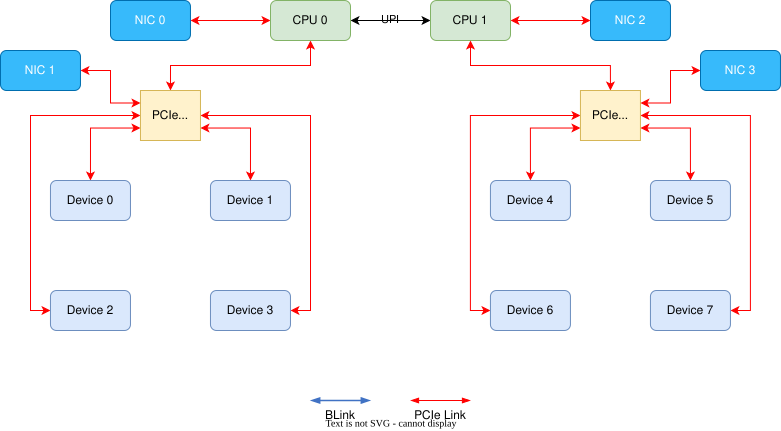
<p>图：BR106C 八卡连接拓扑样例</p>
</div>

#### BR106B 服务器典型拓扑结构

在一个典型的服务器中，8 个 BR106B GPU 设备会先被均分为两组。每一组中的四个设备之间通过 BLink 全互联连接，四个设备均通过 PCIe 与主机端相连。在这种拓扑结构下，同一组内的设备可以通过 BLink 通信，不同组间的设备依然需要通过 PCIe 通信。

<div align="center">
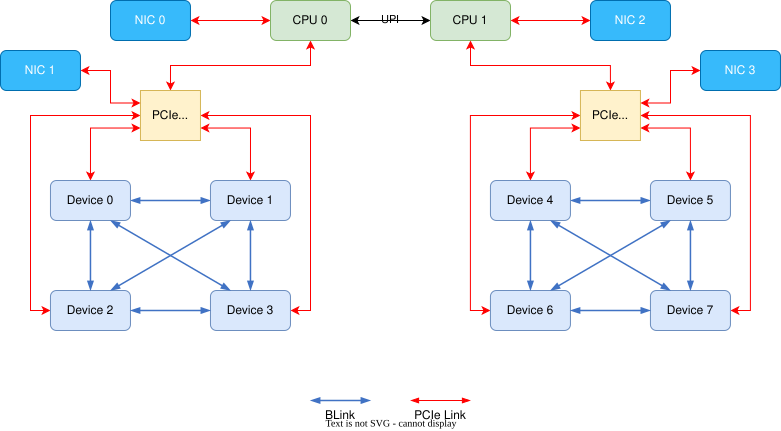
<p>图：BR106B 八卡连接拓扑样例</p>
</div>

#### BR106M 服务器典型拓扑结构

在一个 BR106M 服务器中，8 个 BR106M GPU 设备会先被均分为两组。每一组中的四个设备之间通过 BLink 全互联连接。因为每个设备有四个 BLink 接口，两个组之间也可以实现通过 BLink 互联。在这种拓扑结构下，服务器内所有设备都能通过 BLink 通信（可能需要一个非直连 BLink 连接）。下图展示了两种分别通过两个交换机和四个交换机连接的方式。

<div align="center">
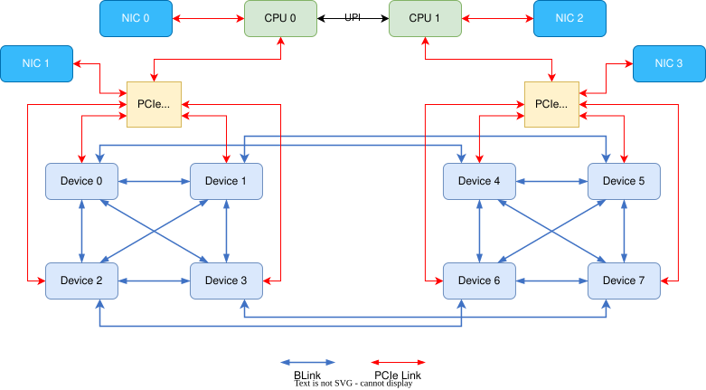
<p>图：BR106M 八卡两个交换机连接拓扑样例</p>
</div>

<div align="center">
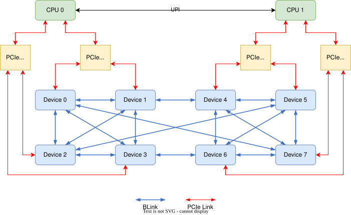
<p>图：BR106M 八卡四个交换机连接拓扑样例</p>
</div>

#### BR166M 服务器典型拓扑结构

BR166M 可以看作是 BR106M 的双晶粒版本，因为其在两个晶粒上都有 P2P 口，因此 BR166M 的拓扑连接方式也会更加复杂多样。在一个典型的 BR166M 服务器中，8 个 BR166M GPU 设备同样会先被均分为两组；而不同的是，每一组中的四个设备之间只有对应同级的晶粒会通过 BLink 全互联连接（主晶粒和主晶粒连接，从晶粒和从晶粒连接）。因为每个设备的每个晶粒有四个 BLink 接口，两个组之间的对应同级的晶粒之间也可以实现通过 BLink 互联。在这种拓扑结构下，服务器内所有设备的对应晶粒之间都能通过 BLink 通信（可能需要一个非直连 BLink 连接），而不同晶粒之间则还需要通过设备内的 D2D （Die-to-Die）连接。每个设备只有主晶粒会通过交换机与 CPU 连接。下图展示了四个交换机连接方式的 BR166M 拓扑结构。

<div align="center">
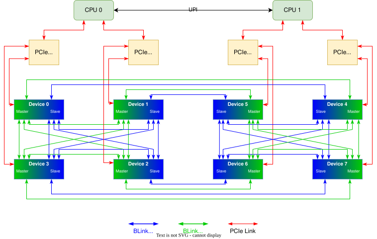
<p>图：BR166M 八卡四个交换机连接拓扑样例</p>
</div>

### 多设备编程基础

使用 BIRENSUPA 模型进行多设备编程时，每个设备需要独立进行编程，您需要针对每个设备，单独编写相应的代码。BIRENSUPA 提供运行时函数接口 `suChooseDevice()` 来根据属性选择设备；`suGetDeviceCount()` 查询当前环境中可用的设备数量；`suSetDevice()` 设置一个设备作为当前设备，随后的操作如启动核函数的 `suLaunchKernel()` 和内存分配 `suMallocDevice` 将会在此设备上执行。

如果希望在多个设备上执行同一个核函数，用户可在主机代码使用 `for` 循环来在每个设备上逐个启动该核函数。BIRENSUPA 也提供 API 接口 `suLaunchKernelMultiDevice()` 可以批量得在多个设备上启动核函数，使用这个 API 接口的好处是 BIRENSUPA 提供了内置在多设备上的同步，详情可参考[多卡分组章节](#多卡分组)

多设备的设备内存在一个**统一虚拟地址**（UVA）内存空间编码（详情见章节[统一虚拟寻址](#统一虚拟寻址)）。运行时 API 函数 `suMemcpy()` 仍可用于在主机内存和任一设备内存间拷贝或不同的设备内存之间拷贝。需要注意的是，因为 BR1XX 架构允许一个设备通过 P2P 连接（BLink）访问另外一台设备的内存，因此理论上运行在一台设备上的核函数可以使用其他设备的内存，但是采用此方法可能会使性能受到内存访问延迟以及带宽的影响。

运行时函数会执行在其所使用的流所在的设备上。使用非异步运行时函数（如 `suMemcpy()`）将会执行在当前设备上，因为非异步函数使用的是默认流，默认流对应的设备为当前设备。

如果程序员希望使用 BLink 直接访问其他设备的内存，请使用运行时 API 函数 `suDeviceEnablePeerAccess()` 来开启 P2P 连接的能力。

```cpp
// Device 0 & 1 are connected with P2P link (BLink)

float *ptr_dev0, *ptr_dev1;
size_t sz_dev0, sz_dev1;

// Set device 0 as current device.
suSetDevice(0);
// Allocate 2KB UMA memory on device 0.
suNumaMallocDevice(&ptr_dev0, &sz_dev0, 1, 2048, suMemArchTypeUMA);
// Enable P2P access from device 0 to device 1.
suDeviceEnablePeerAccess(1);

// Set device 1 as current device.
suSetDevice(1);
// Allocate 2KB UMA memory on device 1.
suNumaMallocDevice(&ptr_dev1, &sz_dev1, 1, 2048, suMemArchTypeUMA);
// Enable P2P access from device 1 to device 0.
suDeviceEnablePeerAccess(0);

// Use suMemcpy to copy data from device 0 to device 1.
// Since current context is still device 1, device 1 is "pulling" data from
// device 0.
suMemcpy(ptr_dev1, ptr_dev0, 2048);
```

上述用例展示了如何在不同设备上分配内存并在不同设备的内存间使用运行时 API 函数 `suMemcpy()` 拷贝数据。值得注意的是，虽然在源内存设备或目标内存设备上均可调用 `suMemcpy()` 进行数据操作，但是建议您优先选择在目标内存设备上进行调用。因为在目标内存的设备上调用 `suMemcpy()` 是一个“数据拉取”操作，在 BR1XX 架构下，“数据拉取”相比于“数据推写”有着更高的带宽。

<table><tr><td bgcolor=#ffeccc><ul>
<li><b>数据拉取：</b>从目标地址所在设备发起的对其他设备上地址的读取操作。</li>
<li><b>数据推写：</b>从源地址所在设备发起的对其他设备上地址的写入操作。</li>
</ul></td></tr></table>

```cpp
// Device 0 & 1 are connected with P2P link (BLink)

template <ushort H, ushort W>
__global_mega__ void copy(UmaMatrix<FP32, BLOCK_COL_MAJOR, H, W> dst,
                          UmaMatrix<FP32, BLOCK_COL_MAJOR, H, W> src) {
  for (int h = 0; h < H; h += warp_count * 2) {
    for (int w = 0; w < W; w += warp_size) {
      float2 sv;
      // No extra configuration is needed to load/store tensor on other
      // device through P2P link (BLink).
      wti::__load_matrix(&sv, src, Coordinate2D(h + warp_idx * 2, w));
      wti::__store_matrix(dst, Coordinate2D(h + warp_idx * 2, w), sv);
    }
  }
}

int main() {
  // ....

  suSetDevice(0);
  // Initialize a Matrix on device 0.
  UmaMatrix<FP32, BLOCK_COL_MAJOR, 64, 64> mat_dev0;
  suDeviceEnablePeerAccess(1, 0);

  suSetDevice(1);
  // Initialize a Matrix on device 1.
  UmaMatrix<FP32, BLOCK_COL_MAJOR, 64, 64> mat_dev1;
  suDeviceEnablePeerAccess(0, 0);

  // Launch kernel to do memory copy from device 0 to device 1.
  // Since current context is still device 1, device 1 is "pulling" data from
  // device 0.
  suLaunchKernel(copy, 1, 512, 0, NULL, mat_dev1, mat_dev0, 64, 64);

  // ....
}
```

上述用例展示了一种使用核函数（SPC）进行不同设备内存间数据拷贝的方式。如果没有多设备间的数据依赖关系或者同步需求，通过 BLink 连接的多设备的核函数和单一设备的核函数实现方式几乎一样。

<div style="page-break-after:always"></div>

## 主机端与设备端的实用功能

### 从主机端检查错误

- 大部分运行时 API 函数都应返回 `suError_t` 类型的错误代码：

  - 对于同步函数，错误代码报告函数的结果状态。
  - 对于异步函数，错误代码只报告操作提交的结果状态。因此，要检查确切的执行结果状态，必须首先在异步函数调用之后同步设备，随后再检索返回的错误代码。

- 主机端可以使用运行时 API 函数 `suGetLastError()` 查询最新的错误代码。

### 进程间通信

如果需要跨进程共享设备内存指针和事件，应用程序必须使用进程间通信 API。

```cpp
suError_t suIpcGetMemHandle(suIpcMemHandle_t *handle, void *devPtr);
suError_t suIpcOpenMemHandle(void **devPtr, suIpcMemHandle_t handle,
                             unsigned int flags);
suError_t suIpcCloseMemHandle(void *devPtr);
```

典型的使用步骤是：

1. 第一个进程分配设备内存，并调用 `suIpcGetMemHandle()` 获取 IPC 的内存句柄。
2. 第一个进程使用正常的 OS-IPC 机制将内存句柄传递给第二个进程。
3. 第二个进程调用 `suIpcOpenMemHandle()` 来检索指向第一个进程分配的设备内存指针。
4. 完成后，第一个进程调用 `suIpcCloseMemHandle()` 释放 IPC 共享。

此外，还可以通过 IPC 来实现进程间共享事件，两个进程可以使用事件来协调计算。例如，进程 A 是生产者，核函数完成后，它将数据存储在一个内存区域中，该内存区域通过 IPC 共享给进程 B；然后进程 A 触发一个事件，该事件也通过 IPC 共享给进程 B，进程 B 在接收到该事件后便可对进程 A 共享的内存执行操作。

```cpp
suError_t suIpcGetEventHandle(suIpcEventHandle_t* handle, suEvent_t event);
suError_t suIpcOpenEventHandle(suEvent_t* event, suIpcEventHandle_t handle);
```

### 设备端附加功能函数

设备端代码可以调用核类别函数来执行某些特定的任务。该章节介绍部分重要函数。

#### 动态内存分配

核函数可以使用 `malloc()` 函数动态分配设备内存。这是线程级别的行为，因此每个线程将获得一个所分配的 16 字节对齐内存的指针。需要注意的是，`malloc()` 分配的内存需要在程序中通过 `free()` 释放，否则内存将在当前上下文中泄漏。

这种方式分配的内存在整个上下文中都是可见的。因此，一个核函数可以分配一些内存，让另一个核函数使用。但在某个阶段，这些内存必须被释放。

如果没有足够的内存可用或无法满足对齐要求时，`malloc()`可能会失败并返回 `NULL`。

<div style="page-break-after:always"></div>

## 已知编译问题和解决建议

针对本文档定义的功能，部分较早的编译器版本（如 `v1.0` 及以下）在某些情况下（例如，复杂的控制流和同步，连续过多的 `printf` 调用等），可能会有特殊情况，影响程序正确性。后续的编译器版本会解决这些问题。您可以根据如下建议尝试调整代码，或联系壁仞产品服务部门寻求支持。

- 如果您认为程序的同步存在问题，可以在代码中尝试添加 `__syncthreads()`(G-mode)、 `__sync_block_cluster_threads()`(T-mode), 查看问题是否发生变化。
- 如果程序控制流过于复杂，可能会产生问题，建议把部分代码放到一个 `__device__` 函数里，并使用 `__noinline__` 属性修饰函数。
- 如果代码中使用了 `BF16` 的类型，传参过程会比较复杂，可以尝试使用 `__forceinline__` 需要调用的函数，帮助定位是否为传参引入了问题。
- `__device__` 函数如果参数是 Tensor 类型，注意传参的时候需要通过引用传入。

<div style="page-break-after:always"></div>

## 计算属性

未来的壁仞通用 GPU 可能会基于不同的架构，并且支持不同的功能。为了保持扩展性和软件兼容性，BIRENSUPA 编程模型引入计算属性来区分不同的架构特性。开发者可以通过查询计算属性来检查特定功能的可用性。

您可以使用 `suGetDeviceProperties()` 函数来查询计算属性，该函数返回硬件版本号和可用的硬件资源，例如计算组、流式处理器簇的数量、计算属性等。

下表列出了不同 BR 芯片的 BR 架构版本。

| 壁仞芯片产品 | BR Arch 版本 | `__SUPA_ARCH__`值 |
| ------------ | ------------ | ----------------- |
| BR106        | 1.0          | 100               |


下表介绍计算能力总结

| 技术指标                           | BR Arch 1.0 |
| ---------------------------------- | ----------- |
| 线程块网格的最大维度               | 3           |
| 线程块网格 x 维度的最大值          | 2^27        |
| 线程块网格ｙ和ｚ维度的最大值       | 65536       |
| 线程块的最大维度                   | 3           |
| 线程块ｘ和ｙ维度的最大值           | 1024        |
| 线程块ｚ维度的最大值               | 32          |
| 每个线程块的最大线程数             | 1024        |
| 线程束大小                         | 32          |
| 每个计算单元的最大驻留线程块数     | 8           |
| 每个计算单元的最大驻留线程束数     | 32          |
| 每个计算单元的最大驻留线程数       | 1024        |
| 每个计算单元的 32 位寄存器的数量   | 32768       |
| 每个线程块的 32 位寄存器的最大数目 | 32768       |
| 每个线程的 32 位寄存器的最大数目   | 256         |
| 每个计算单元的共享内存的最大数量   | 32 KB       |
| 每个线程块共享内存的最大数量       | 32 KB       |
| 共享内存的 Bank 数量               | 32          |
| 每个流式处理器簇的计算单元数       | 4           |
| 每个流式处理器簇的张量缓存大小     | 4 MB        |
| 每个流式处理器簇的分布式 L2 大小   | 4 MB        |

## 核函数协程

### 核函数协程基础

在壁仞硬件独特的执行模型支持下，BIRENSUPA 在 T-mode 中提供了一种新的称为核函数协程的特性，核函数可以使用 `supa::async()`函数来启动协同程序。借助 BIRENSUPA 协程信号量的支持下进行同步，这些协同程序可以协同工作，例如**消费者-生产者模式**。

核函数协程为设备编程增加了除 SIMT 并行外另一个并发维度。如图所示。

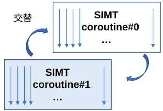

下面是在 T-mode 中使用核函数协程的示例。

```cpp
__global_mega__ void sample(const int* in, int* out) {
    supa::sem_t s; // Value initialized as 0
    __coroutine_shared__ int v; // v has no initial value;

    auto producer = [&v, &s, in]() __vector__ {
        v = in[thread_idx.x];
        supa::sem_post(&s, 8); // Notify consumer
    };

    auto consumer = [&v, &s, out]() __vector__ {
        supa::sem_wait(&s, 8);
        out[thread_idx.x] = v;
    };

    supa::async(producer);  // Only accept lambda function
    supa::async(consumer);  // Only accept lambda function
    // After that the two coroutines run concurrent
}

int main(int argc, char* argv[]) {
    // ....
    // The thread block size is fixed to be 512 if the kernel use coroutine.
    suLaunchKernel(sample, 1, 512, 0, NULL, in, out);
}
```

上面的例子中创建了两个共享资源： `__coroutine_share__` 表示声明了协程共享的变量，共享变量 `v` 用于协程间交换数据，另一个 `s` 是用于控制协程间同步行为的协程信号。之后创建两个 lambda 表达式并捕获 `v` 和 `s`，以便这些协程可以使用共享资源。因为 `producer` 协程和 `consumer` 协程中分别还需要使用核函数的参数 `in` 和 `out`，这两个参数也需要分别被传入两个协程的捕获列表。完成所有定义后，这两个协程将通过`supa::async()`启动。 属性 `__vector__` 和 `__tcore__` 用于表示 lambda 表达式仅包含向量逻辑或 T-Core 逻辑。

在当前的协程语义中，协程异步启动后，没有如下所示的连接点。

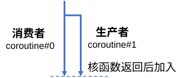

### 核函数协程使用指南

#### `warp_idx` 和 `warp_count`

在具有协程的 T-mode 核函数中，`warp_idx`值是全局分配的。 例如，具有三个 `__vector__` 协程的线程块（512 个线程）的 `warp_idx` 值是从 0 到 47 的。如果代码希望使用物理 EU/CU 位置进行任务划分，开发者可以使用 `warp_idx & 0xF` 来实现。需要注意的是，协程块和 `warp_idx` 的值没有固定的对应关系，用户不能在代码里面做任何基于当前协程块对应的 `warp_idx` 取值是 0 ~ 15 还是 16 ~ 31 的假设。

协程模式下 `warp_count` 的值固定为 16。

#### 协程内同步以及协程间同步

与非协程模式相比，协程模式下的同步会更为多变。对于不同协程之间的依赖关系，我们使用 [协程信号](#协程信号) 进行同步，对于同一协程内，我们使用 [协程同步函数](#协程同步) 进行同步。用户需要非常小心得控制不同的同步方式来保证程序的正确性以及防止程序锁死。

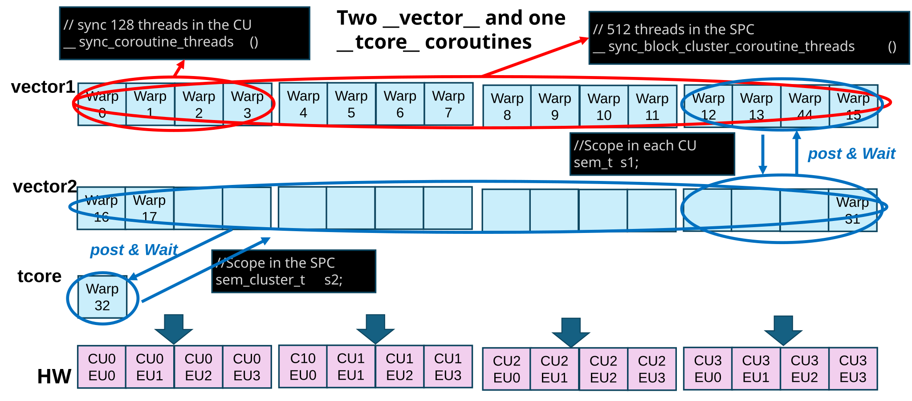

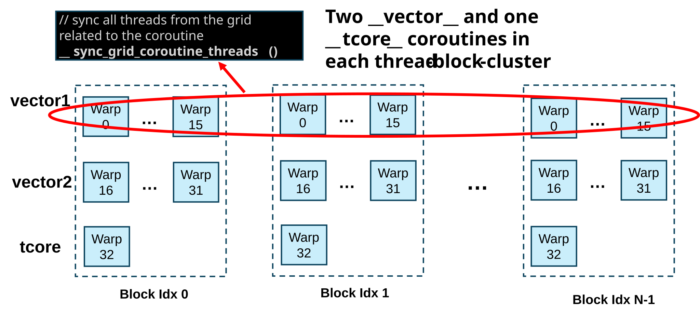

上图为协程中使用协程信号同步和协程同步函数同步的总结。红色圈以及箭头表示的是协程内使用不同的线程同步函数进行同步的情况，蓝色圈以及箭头表示的是协程间使用协程信号进行同步的情况。

#### 协程块中参数传递

协程模式下在核函数内和 lambda 函数外只可存在共享资源的声明（共享变量，协程信号变量，共享 A/B buffer，共享归约缓冲区, 共享内存变量）以及 `supa::async` 调用。 `supa::async()` 函数只可接收不含参数的 lambda 函数。所有在 lambda 函数中需要的参数均需要通过捕获列表传入。

捕获列表参数分为两种，需要按照以下要求捕获：

- 核函数内定义的共享资源：例如共享变量，协程信号变量等。此类参数在捕获列表中必须按引用捕获。
- 核函数本身参数：例如传入的张量，单个整形或浮点数。此类参数在捕获列表中必须按值捕获。
- 共享内存 (`__shared__`) 和 `constexpr` 变量: 共享内存和 `constexpr` 变量可以在 lambda 函数外声明，并在 lambda 函数内使用而**无需捕获**。

```cpp
template<int NUM>
__global_mega__ void example(int num) {
    constexpr int H = 100;  // 正确！H的值在编译阶段可确定。
    const int W = NUM + 1;  // 正确！NUM为模板参数可在编译阶段确定值，NUM + 1也为静态值。
    const int H1 = num;  // 错误！num非编译阶段可确定的参数，不可定义在协程外。
    const int H2 = block_idx.x + 1;  // 错误！block_idx.x 也不是静态编译参数，不可定义在协程外。
    __shared__ float shm[512];

    auto cwarp = [num]() {
        const int A = block_idx.x + num; // 正确！协程内允许使用 block_idx.x
        // H 和 W 为定义在协程外的静态参数，可以不被捕获直接使用
        for (int i = 0; i < H; i++) {
            for (int j = 0; j < W; j++) {
                shm[thread_idx.x] = 0;   // 正确！共享内存在协程外声明也无需捕获可直接使用。
                // ....
            }
        }
    };
}

```

#### 使用核函数协程的限制

1. 协程特性只能在超大核函数中使用，不能在设备函数中使用；
2. 使用协程的核函数在启动时只能将线程块大小配置为 512；
3. 在 BR1xx 系列硬件中，一个超大核函数中最多可以使用 8 个协程；
4. 在核函数函数体中，只有共享资源定义，`constexpr` 变量定义，lambda 表达式的定义以及 `supa::async()` 的调用是允许的。核函数函数体中不能有其他语句；
5. 由 `supa::async()` 调用的必须为包含 `__vector__` 或 `__tcore__` 属性的 lambda 函数；
6. 在核函数函数体中，最多被允许使用的 `__tcore__` 协程数量为 1 个。也就是说在使用 `__tcore__` 协程的情况下可以有另外的 7 组 `__vector__` 协程。
7. 在 `__tcore__` 的协程中只允许使用 `tci` 或 `tci_p` 中的函数，或者相应的坐标计算。
8. `supa::sem_post()` 和 `supa::sem_wait()` 只能由协程中的所有线程（512）统一调用，因为不同的块中不允许同步；
9. 协程中不能使用非协程特定的同步函数，详情见 [协程同步](#协程同步) 章节。

以下是目前对核函数协程的临时限制。

- `__tcore__` 和 `__vector__` 协程内的设备函数调用（不是 BIRENSUPA intrinsics 函数）必须强制内联；

<table><tr><td bgcolor=#ffeccc><b>注意：</b>__launch_bounds__ 与协程模式不支持混用</td></tr></table>

### 使用张量核心的核函数协程

借助协程，BIRENSUPA 可以通过张量核心和向量核心协作工作，这个模式下张量核心和向量核心可以同时运行以达到更好的性能。

```cpp
__global_mega__ void normal(NumaActivation<FP32, 1, 64, 8, 8> input,
                            UmaConvWeight<FP32, 64, 64, 1, 1> weight,
                            NumaActivation<FP32, 1, 64, 8, 8> output) {
    // 共享资源定义在协程外。
    __coroutine_shared__ float4 v[2];   // 8 个未初始化的寄存器。
    supa::sem_cluster_t v2t, t2v;       // 映射到 SPC 级别的信号量。

    auto vector = [&v, &v2t, &t2v, output]() __vector__ {
        // 通知 T-Core 可以在 v2t 信号量处继续往下运行。
        supa::sem_post(&v2t, 17);  // 17 = 16 vector warps + 1 tcore warps
        // 等待 T-Core 发射信号到 t2v 张量核心信号量。
        supa::sem_wait(&t2v, 17);
        v[0] = relu(v[0]);
        v[1] = relu(v[1]);
        wti::__store_activation(output, Coordinate(0, warp_idx * 2, 0, 0), v[0]);
        wti::__store_activation(
            output, Coordinate(0, warp_idx * 2 + 32, 0, 0), v[1]);
    };

    auto tcore = [&v, &v2t, &t2v, input, weight, output]() __tcore__ {
        // T-Core 内专用的资源可以定义在 __tcore__ 协程内
        tci::__conv_weight_buf<tci::A_BUF, FP32, 64, 64, 1, 1> w_buf;
        tci::__conv_act_buf<tci::B_BUF, FP32, 64, 8, 8> act_buf;
        wti::__reduce_buf<4, wti::REDUCE_NONE> grb;
        tci::__conv_acc<64, 8, 8> acc;
        tci::TensorConvConfig<1, 1, 0, 0, 1, 1> config;

        tci::__load_input_buf(&w_buf, weight, CoordinateConvWeight(0, 0, 0, 0),
                              config);
        tci::__load_input_buf(&act_buf, input, Coordinate(0, 0, 0, 0), config);

        supa::sem_wait(&v2t, 17); // 等待 Vector Engine 发射信号到 v2t 信号量。
        tci::__conv((float8 *)v, output, Coordinate(0, 0, 0, 0),
                    &acc, &grb, act_buf, w_buf, config);
        supa::sem_post(&t2v, 17); // 通知 Vector Engine 可以在 t2v 信号量处继续往下运行。
    };

    // 启动协程
    supa::async(vector);
    supa::async(tcore);
}
```


### 使用高性能张量核心的核函数协程

借助高性能张量核心的在张量核心上的高并发，高性能张量核心原语和协程的同时使用可以最大化发挥壁仞硬件的能力！

```cpp

// 协程内调用的 __device__ 函数必须 inline
__device__ __forceinline__ void relu_device(float4 *sv) {
    sv->x = sv->x > 0 ? sv->x : 0;
    sv->y = sv->y > 0 ? sv->y : 0;
    sv->z = sv->z > 0 ? sv->z : 0;
    sv->w = sv->w > 0 ? sv->w : 0;
}

// Use mega kernel and tci_p instructions to do the Matrix Multiply.
__global_mega__ void
MatrixMulDevice(UmaMatrix<FP32, BLOCK_ROW_MAJOR, MH, MW> out,
                UmaMatrix<FP32, BLOCK_ROW_MAJOR, MH, MK> inL,
                UmaMatrix<FP32, BLOCK_ROW_MAJOR, MK, MW> inR) {

    __coroutine_shared__ float8 sv;  // Define a float8 shared across coroutine
    supa::sem_cluster_t t2v;  // Define a SPC level semaphore for T-Core to V-Core
    supa::sem_cluster_t v2t;  // Define a SPC level semaphore for V-Core to T-Core

    // Coroutine 1: Relu on V-Core and store data to Tensor
    auto cwarp_vector = [out, &sv, &t2v, &v2t]() __vector__ {
        supa::sem_post(&v2t, 17); // Post to T-Core, for TLR ready

        for (int h = 0; h < MH; h += TILE_H) {
            for (int w = 0; w < MW; w += TILE_W) {

                // Wait T-Core data ready into TLR
                tci_p::__wait_tcore(&t2v);

                float4 a(sv.d0, sv.d1, sv.d2, sv.d3);
                float4 b(sv.d4, sv.d5, sv.d6, sv.d7);

                supa::sem_post(&v2t, 17); // Post to T-Core, for TLR ready

                relu_device(&a);
                relu_device(&b);

                wti::__store_matrix(out, Coordinate2D(h + warp_idx * 2, w), a);
                wti::__store_matrix(out, Coordinate2D(h + warp_idx * 2 + 32, w),
                                    b);


            }
        }
    };

    // Coroutine 2: T-Core coroutine and output to TLR
    auto cwarp_tcore = [out, inL, inR, &sv, &t2v, &v2t]() __tcore__ {
        // 定义 a/b buf
        __tensor_abuf__ FP32 a_buf[TILE_H * STEP];
        __tensor_bbuf__ FP32 b_buf[STEP * TILE_W];

        for (int h = 0; h < MH; h += TILE_H) {
            for (int w = 0; w < MW; w += TILE_W) {

                tci_p::__acc_clear();  // Clear T-Core accumulate

                // need peel out loop 0
                tci_p::__wait_a_calc(tci_p::A_BUF_CALC_0);
                tci_p::__load_input_a_buffer<TILE_H, STEP_K>(
                    a_buf, inL, Coordinate2D(h, 0));
                tci_p::__post_a_load(tci_p::A_BUF_LOAD_0);

                tci_p::__wait_a_calc(tci_p::A_BUF_CALC_1);
                tci_p::__load_input_a_buffer<TILE_H, STEP_K>(
                    a_buf + TILE_H * STEP_K, inL, Coordinate2D(h, STEP_K));
                tci_p::__post_a_load(tci_p::A_BUF_LOAD_1);

                tci_p::__wait_b_calc(tci_p::B_BUF_CALC_0);
                tci_p::__load_input_b_buffer<STEP_K, TILE_W>(
                    b_buf, inR, Coordinate2D(0, w));
                tci_p::__post_b_load(tci_p::B_BUF_LOAD_0);

                tci_p::__wait_b_calc(tci_p::B_BUF_CALC_1);
                tci_p::__load_input_b_buffer<STEP_K, TILE_W>(
                    b_buf + STEP_K * TILE_W, inR, Coordinate2D(STEP_K, w));
                tci_p::__post_b_load(tci_p::B_BUF_LOAD_1);

                tci_p::__wait_a_load(tci_p::A_BUF_LOAD_0);
                tci_p::__wait_b_load(tci_p::B_BUF_LOAD_0);
                tci_p::__mma<TILE_H, STEP_K, TILE_W>(out, a_buf, b_buf);
                tci_p::__post_a_calc(tci_p::A_BUF_CALC_0);
                tci_p::__post_b_calc(tci_p::B_BUF_CALC_0);

                tci_p::__wait_a_load(tci_p::A_BUF_LOAD_1);
                tci_p::__wait_b_load(tci_p::B_BUF_LOAD_1);
                tci_p::__mma<TILE_H, STEP_K, TILE_W>(
                    out, a_buf + TILE_H * STEP_K, b_buf + STEP_K * TILE_W);
                tci_p::__post_a_calc(tci_p::A_BUF_CALC_1);
                tci_p::__post_b_calc(tci_p::B_BUF_CALC_1);

                ushort pos = STEP;
                for (; pos < MK - STEP; pos += STEP) {
                    tci_p::__wait_a_calc(tci_p::A_BUF_CALC_0);
                    tci_p::__load_input_a_buffer<TILE_H, STEP_K>(
                        a_buf, inL, Coordinate2D(h, pos));
                    tci_p::__post_a_load(tci_p::A_BUF_LOAD_0);

                    tci_p::__wait_a_calc(tci_p::A_BUF_CALC_1);
                    tci_p::__load_input_a_buffer<TILE_H, STEP_K>(
                        a_buf + TILE_H * STEP_K, inL,
                        Coordinate2D(h, pos + STEP_K));
                    tci_p::__post_a_load(tci_p::A_BUF_LOAD_1);

                    tci_p::__wait_b_calc(tci_p::B_BUF_CALC_0);
                    tci_p::__load_input_b_buffer<STEP_K, TILE_W>(
                        b_buf, inR, Coordinate2D(pos, w));
                    tci_p::__post_b_load(tci_p::B_BUF_LOAD_0);

                    tci_p::__wait_b_calc(tci_p::B_BUF_CALC_1);
                    tci_p::__load_input_b_buffer<STEP_K, TILE_W>(
                        b_buf + STEP_K * TILE_W, inR,
                        Coordinate2D(pos + STEP_K, w));
                    tci_p::__post_b_load(tci_p::B_BUF_LOAD_1);

                    tci_p::__wait_a_load(tci_p::A_BUF_LOAD_0);
                    tci_p::__wait_b_load(tci_p::B_BUF_LOAD_0);
                    tci_p::__mma<TILE_H, STEP_K, TILE_W>(out, a_buf, b_buf);
                    tci_p::__post_a_calc(tci_p::A_BUF_CALC_0);
                    tci_p::__post_b_calc(tci_p::B_BUF_CALC_0);

                    tci_p::__wait_a_load(tci_p::A_BUF_LOAD_1);
                    tci_p::__wait_b_load(tci_p::B_BUF_LOAD_1);
                    tci_p::__mma<TILE_H, STEP_K, TILE_W>(
                        out, a_buf + TILE_H * STEP_K, b_buf + STEP_K * TILE_W);
                    tci_p::__post_a_calc(tci_p::A_BUF_CALC_1);
                    tci_p::__post_b_calc(tci_p::B_BUF_CALC_1);
                }

                tci_p::__wait_a_calc(tci_p::A_BUF_CALC_0);
                tci_p::__load_input_a_buffer<TILE_H, STEP_K>(
                    a_buf, inL, Coordinate2D(h, pos));
                tci_p::__post_a_load(tci_p::A_BUF_LOAD_0);

                tci_p::__wait_a_calc(tci_p::A_BUF_CALC_1);
                tci_p::__load_input_a_buffer<TILE_H, STEP_K>(
                    a_buf + TILE_H * STEP_K, inL,
                    Coordinate2D(h, pos + STEP_K));
                tci_p::__post_a_load(tci_p::A_BUF_LOAD_1);

                tci_p::__wait_b_calc(tci_p::B_BUF_CALC_0);
                tci_p::__load_input_b_buffer<STEP_K, TILE_W>(
                    b_buf, inR, Coordinate2D(pos, w));
                tci_p::__post_b_load(tci_p::B_BUF_LOAD_0);

                tci_p::__wait_b_calc(tci_p::B_BUF_CALC_1);
                tci_p::__load_input_b_buffer<STEP_K, TILE_W>(
                    b_buf + STEP_K * TILE_W, inR,
                    Coordinate2D(pos + STEP_K, w));
                tci_p::__post_b_load(tci_p::B_BUF_LOAD_1);

                tci_p::__wait_a_load(tci_p::A_BUF_LOAD_0);
                tci_p::__wait_b_load(tci_p::B_BUF_LOAD_0);
                tci_p::__mma<TILE_H, STEP_K, TILE_W>(out, a_buf, b_buf);
                tci_p::__post_a_calc(tci_p::A_BUF_CALC_0);
                tci_p::__post_b_calc(tci_p::B_BUF_CALC_0);

                supa::sem_wait(&v2t, 17);  // Wait V-Core TLR ready

                tci_p::__wait_a_load(tci_p::A_BUF_LOAD_1);
                tci_p::__wait_b_load(tci_p::B_BUF_LOAD_1);
                tci_p::__mma_to_short_vector<TILE_H, STEP_K, TILE_W>(
                    &sv, out, nullptr, a_buf + TILE_H * STEP_K,
                    b_buf + STEP_K * TILE_W);
                tci_p::__post_b_calc(tci_p::B_BUF_CALC_1);
                tci_p::__post_a_calc(tci_p::A_BUF_CALC_1);

                // T-Core post V-Core TLR data ready
                tci_p::__tcore_post(&t2v, 16);
            }
        }
        supa::sem_wait(&v2t, 17); // Final wait V-Core , make sure post and wait as pair
    };

    supa::async(cwarp_vector);
    supa::async(cwarp_tcore);
}
```

上述代码中关于 `tci_p` 接口的用法详见编程手册中 “高性能张量核心计算原语 (TCI-P)” 章节，在此我们只介绍和信号量相关的注意事项。

对于信号量的控制接口选择上需要注意的是，张量核心在通知向量核心数据已经就绪时应使用 `tci_p::__tcore_post()` 函数而非 `supa::sem_post()`。向量核心在等待张量核心信号时也应使用 `tci_p::__wait_tcore()` 而非 `supa::sem_wait()`。原因是所有高性能张量核心接口均为异步接口， `__tcore_post()` 函数作为高性能张量核心原语同样也是异步接口，可以保证在上一次张量核心计算 (`tci_p::__mma()` 或 `tci_p::__conv`) 真正完成之后再执行，以保证在此之前的计算操作全部完成之后才会发射完成信号。而 `sem_post()` 函数仅仅为向量核心的同步，无法保证在此之前发射的异步张量核心计算是否完成。而张量核心的指令均又向量核心发射，所以在上述代码中 `tci_p::__mma_to_short_vector()` 之前的 `supa::sem_wait()` 函数是可以在期望数量的线程束都到达之前用来拦截发射张量核心的指令的线程束的。也就是说 `supa::sem_wait()` 函数可以用来保证之前的向量核心任务都完成后才执行后续的张量核心操作，但是却不能用来保证在此之前的张量核心操作是否完成。

对于 `tci_p::__tcore_post()`, `supa::sem_post()` 和 `supa::sem_wait()` 函数中第二个参数表示的期望线程束个数的计算也有少许不同。`tci_p::__tcore_post()` 所需要的 `expected_receive_warp_count` 为**接收**该信号的线程束个数，而 `supa::sem_post()` 以及 `supa::sem_wait()` 所需要的 `expected_warps` 为**发射和接收**该信号的线程束之和，具体计算可见[协程信号](#协程信号)章节。所以 `tci_p::__tcore_post()` 中使用的期望接收线程束数量为 16（表示 16 个向量核心的线程束），而 `supa::sem_post()` 和 `supa::sem_wait()` 使用的期望线程束为 17（表示 16 个向量线程束 + 1 个发射高性能张量核心指令的头线程束）。

最后在运行前需要最后检查对于同一个信号量是否有相同数量的 `post` 函数和 `wait` 函数对，这样可以减少写出锁死程序的可能，注意 `sem_post()` 只可与相同信号量的 `sem_wait()` 配对，而 `__tcore_post()` 也只可与相同信号量的 `__wait_tcore()` 配对。

<div style="page-break-after:always"></div>

## 协作组

BIRENSUPA 协作组为核函数中的多个线程提供了组内线程之间执行同步和数据交换(例如 shuffle, reduce)的能力。

同步可以发生在不同的级别：线程块、网格甚至多个设备中。数据交换被限制在线程束以及低于线程束级别的线程中。编程者可以使用这些基本原语来实现更大粒度的数据交换，比如在宽线程束级别、线程块级别，甚至网格级别。使用协作组，需要包含 `<supa_cooperative_groups.h>` 头文件。

### 基本线程组同步和线程束级数据交换

\_\_syncthreads(): 所有调用该原语的线程都将做一个屏障，并一起向前移动。在存在分支的情况下，使用 `__syncthreads()` 需谨慎考虑，因为此函数允许未参与屏障的线程不经过等待直接继续执行。

BIRENSUPA 提供了包括 `__shfl_sync`、`__shfl_up_sync`、` __shfl_down_sync` 和 `__shfl_xor_sync` 在内的原语，用于在线程束之间交换数据。这提供了一种在不使用共享内存或全局内存的情况下在线程之间交换数据的方法。

### 用户自定义线程组

BIRENSUPA 允许编程者构建不同级别的线程组。基本类型定义为 `thread_group` 。用于描述不同级别线程组的数据类型(线程束、线程块、网格等)都是从它继承的。

对于任何级别的线程组， `thread_group` 类型有以下方法：

- `unsigned size()`：组中的线程数

- `unsigned thread_rank()`：调用线程的次序，在 [0, size) 范围内

### 线程块组

`thread_block` 类型是 `thread_group` 的子类型。

```cpp
thread_block g = this_thread_block();
```

它有额外的方法：

- `void sync()`: 同步组中的线程

- `dim3 group_index()`: 网格内的三维块索引

- `dim3 thread_index()`: 块内的三维线程索引

- `bool is_valid()`: 当前组是否违反了任何 API 约束

### 分块（线程束和子线程束）组

编程者可以将 `thread_block` 分割成一维的分块子组。分块是通过 `thread_block_tile<N>` 定义的，其中 N 小于等于 32 时需满足 N 是 2 的幂次，N 大于 32 时需满足 N 是 32 的倍数（N 不能超过 1024）。分块组只在普通核函数（G-Mode）中使用。

```cpp
thread_block g = this_thread_block();
//a warp
thread_block_tile<32> tile32 = tiled_partition<32>(g);
//two warps
thread_block_tile<64> tile32 = tiled_partition<64>(g);
//tile of 4
thread_block_tile<4> tile4 = tiled_partition<4>(this_thread_block());
```

它有额外的方法：

- `void sync()`: 同步组中的线程

- `bool is_valid()`: 当前组是否违反了任何 API 约束

`thread_block_tile` 可以在线程束级别（最多 32 个线程）使用以下方法。

- `.shfl()`
- `.shfl_down()`
- `.shfl_up()`
- `.shfl_xor()`
- `.any()`
- `.all()`
- `.ballot()`
- `.match_any()`
- `.match_all()`

在超大核函数中，分块数有两个额外的选择，即 128 和 512。128 块用于线程块(4-EU)组，512 块用于线程块集群组(4-CU)组。128 块可以利用 `__shared__` 做一些快速的数据交换。提供了数据规约方法 `.reduce()`，用于规约 4-EU 或 4-CU 级别分块组中所有线程的数据。

### 合并组

这个特殊组定义了当前合并线程中的所有线程。这个组仍然是在线程束级别，因为合并线程是线程束的一个概念。在超大核函数中，这仍然只适用于常规的 32 线程线程束。

```cpp
coalesced_group active = coalesced_threads();
```

一些编程逻辑可以用合并组来简化。

它有额外的方法：

- `void sync()`: 同步组中的线程

- `meta_group_size()`：父组分块时创建的组的数目。

- `meta_group_rank()`：在父组分块中当前组的线性次序

### 线程网格组

线程网格组表示在一个网格中启动的所有线程。

```cpp
grid_group grid = this_grid();
```


它有额外的方法：

- `bool is_valid()`: 当前组是否违反了任何 API 约束

- `dim3 group_dim()`：网格的维度


## 环境设置

### SUPA_LAUNCH_BLOCKING

```cpp
export SUPA_LAUNCH_BLOCKING=<1 for enable, 0 for disable>
```

启用阻塞模式核函数启动(1)或不启用(0，默认)。

### SUPA_VISIBLE_DEVICES

```cpp
export SUPA_VISIBLE_DEVICES=<Comma-separated device index>
```

限制 BIRENSUPA 应用程序看到的设备。默认情况下，所有设备都是可见的。

<div style="page-break-after:always"></div>

## 限制

### 数据类型

BIRENSUPA 在设备端不支持双精度浮点数（double）。

壁仞通用 GPU 硬件对 int64_t/uint64_t 数学运算的支持有限。BIRENSUPA 采用纯软件方法解决部分数学运算，但不能覆盖全部。64 位值的写入是通过两个硬件的 32 位写入来处理的，不能保证原子性。

对于 16 位浮点数，在壁仞通用 GPU 硬件设计版本 1.0 中，G-Mode 只支持 FP16 数据类型，T-Mode 只支持 BF16 数据类型。

### `__shfl_sync()`

没有 width 作为显式输入参数的 `__shfl_sync()` 函数只能支持 `srcLane` 是一个线程束的统一值。如果 `srcLane` 是一个线程束的发散值，则必须输入 width。例如，

```cpp
//T __shfl_sync(unsigned mask, T var, int srcLane, int width=warp_size)
__shfl_sync(0xFFFFFFFF, src, 1); // OK
__shfl_sync(0xFFFFFFFF, src, thread_idx.x % 32); // ERROR, srcLane is divergent
__shfl_sync(0xFFFFFFFF, src, thread_idx.x % 32, 32); // OK. width is input
```

### 共享内存初始值

BIRENSUPA 不初始化共享内存。编程者有责任初始化共享内存并添加 `__syncthreads()` 以确保所有值对线程块（T-mode 下等同于 CU）中的所有线程可见。

### BF16 类型的位操作

在壁仞通用 GPU 硬件体系结构中，由于寄存器中 BF16 类型的特殊位布局，对 BF16 值的位操作可能得不到预期的结果。建议编程者不要对 BF16 局部变量使用位操作。

### atomic 限制

在壁仞通用 GPU 硬件中，从一个 SPC 发出的原子操作只能应用于位于同一晶粒(die)中的内存，而不能应用于另一个晶粒、另一个设备或 CPU 中的内存。

### 设备内存写入主机和其他设备的限制

由于壁仞通用 GPU 硬件的限制，BIRENSUPA 核函数(包括 G-Mode 和 T-Mode)不能将数据写入主机或使用非全掩码将数据写入其他设备。

BIRENSUPA 定义核函数参数类型如下所示。

```cpp
__global__ void sample(const float *readOnlyInput, float* resultOutput) {
...;
}
```

在核函数启动期间，为了避免向主机内存写入数据，不建议编程者将主机内存指针传递给 `resultOutput`，对于 `readOnlyInput` 指针，主机内存指针和设备内存指针都可以传入。

程序员可以使用其他方法将主机端指针传递到核函数中，比如将其存储在结构体中并将结构体复制到核函数中。在这种情况下，编程者不应该使用该指针作为写入的目的地。否则，可能会导致数据损坏。

对于使用非全掩码将数据写入其他设备，编程者仍然有责任防止这种情况发生。

编程者可以先将数据写入设备内存，然后使用 BIRENSUPA 运行时 API(如 suMemcpy())将数据从设备复制到主机。这种方式也有较好的性能。

### 在相同的线程束中，线程写入相同的内存地址

如果一个线程束中的多个线程写入同一个内存地址(全局内存或共享内存)，则存储在该地址中的最终结果是未定义的，这意味着该值可能与来自源线程的任何数据不同。

### 三维线程块的线程束构造

对于三维线程块，BIRENSUPA 线程束结构采用了不同的方法，没有线程束可以跨越 Z 维。例如，一个 2x10x10 的线程块有 8 个线程束而非 7 个。

### thread_groups 同步粒度

在协作线程组中，由于壁仞通用 GPU 硬件特性，BIRENSUPA 中的线程组同步粒度只能在线程束级。

### 流

#### 流优先级

虽然 BIRENSUPA 提供了具有优先级的 API 来构造流，但由于硬件的限制，该优先级并不影响基于壁仞通用 GPU 硬件系统的任务调度的优先级。

### 同级设备访问

在壁仞通用 GPU 硬件系统中，使用 P2P 连接的设备之间可以自然地相互访问，使用 PCIE 连接的设备仅支持跨设备访问 UMA4K 数据。

### 统一内存

BIRENSUPA 不支持：

- 系统 `malloc()` 分配由统一内存管理的内存。

- 设备内存超额。

### 从设备主机调用运行时函数

壁仞通用 GPU 硬件要求 BIRENSUPA 运行时函数只能在主机端调用。

### 图

壁仞通用 GPU 硬件不包含图形单元。BIRENSUPA 不支持与 OpenGL、Vulkan 等的图形互操作性。

### 其它

如果程序长时间没有进行内存读写操作，可能会被系统驱动判定为进入死循环状态，将终止该进程。

<div style="page-break-after:always"></div>

## 法律声明

**著作权 ©**

壁仞科技2020-2025，版权所有。未经壁仞科技事先书面许可，不得以任何形式对本文档内容进行复制、修改、出版、传输或发布。

**商标。**

本文档所包含的任何壁仞科技的商号、商标、图形标志和域名，均为壁仞科技所有。未经壁仞科技事先书面许可，不得以任何形式将其复制、修改、出版、传输或发布。

**性能信息。**

本文档中所包含的性能指标包括设计规格、模拟测试指标以及特定环境下的测试和评估指标。设计规格为产品设计时拟定的指标，仅用于提供信息的目的而供您参考，实测指标将以具体的测试数据为准。模拟测试指标是通过在体系结构模拟器上运行模拟而获得，仅用于提供信息目的。该类测试的系统硬件、软件设计或配置的任何不同都可能影响实际性能。特定环境下的测试和评估指标系采用特定的计算机系统或组件操作而获得，可反映出我司产品的大致性能。系统硬件、软件设计或配置的任何不同都可能影响实际性能。

**前瞻性陈述。**

本文档的信息可能包含前瞻性陈述，可能存在风险和不确定性。请勿仅依赖于上述信息做出您的商业决定。

**注意。**

本产品后续可能进行版本升级，本文档内容会不定期更新。除非在合同中另有约定，本文档仅作产品使用指导，其中的信息和建议不构成任何明示或暗示的担保。
