# BIRENSUPA 张量库 API 参考

## 术语表

| 缩写   | 术语名称                               | 中文描述            |
| ------ | -------------------------------------- | ------------------- |
| CU     | Compute Unit                           | 计算单元            |
| DWC    | Depthwise Convolution                  | 逐通道卷积          |
| EU     | Execution Unit                         | 执行单元            |
| GLM    | Global Memory                          | 全局内存            |
| --     | Grid                                   | 线程网格            |
| GSM    | Group-Shared Memory                    | 共享内存            |
| G-Mode | General Mode                           | 普通模式            |
| HBM    | High Bandwidth Memory                  | 高带宽内存          |
| --     | Mega Kernel                            | 超大核函数          |
| L1     | Level 1 Cache                          | 一级缓存            |
| L2     | Level 2 Cache                          | 二级缓存            |
| NUMA   | Non-uniform Memory Access              | 非统一内存访问      |
| --     | Shared Memory                          | 共享内存            |
| SPC    | Streaming Processing Cluster           | 流式处理器簇        |
| SUPA   | Scalable Unified Parallel Architecture | 可扩展统一并行架构  |
| TCI    | Tensor Core Intrinsics                 | 张量核心计算原语    |
| --     | Tensor Buffer                          | 张量缓冲区          |
| --     | Thread                                 | 线程                |
| --     | Thread Block                           | 线程块              |
| T-Core | Tensor Core                            | 张量核心            |
| T-Mode | Tensor Mode                            | 张量模式            |
| TLR    | Thread-Local Register                  | 线程本地寄存器      |
| UMA    | Uniform Memory Access                  | 统一内存访问        |
| V-Core | Vector Core / Vector Engine            | 向量核心 / 向量引擎 |
| VMC    | Virtual Machine Cluster                | 虚拟机计算核簇      |
| --     | Warp                                   | 线程束              |
| WTI    | Warp Tensor Intrinsics                 | 线程束张量计算原语  |

## 概述

基于 BIRENSUPA™ 编程模型的应用开发对于用户高效利用壁仞通用 GPU 至关重要。本文档面向 BIRENSUPA 开发者，提供了明确的语言定义和 API 参考，详细介绍了 BIRENSUPA™ 编程语言及张量 API，结合 BIRENSUPA™ SDK 中提供的用例，帮助开发者构建高性能应用。

阅读本文当前，读者需要对 BIRENSUPA 编程模型有基本了解，特别是对壁仞通用 GPU 上普通模式（G-Mode）和张量模式（T-Mode）这两种执行模式的了解。因此，在阅读本手册之前，建议开发者先阅读《BIRENSUPA™ 编程指南》。

BIRENSUPA 张量库提供主机端和设备端函数来操作 BIRENSUPA 张量数据类型。该库尝试使用壁仞通用 GPU 硬件的张量内核来加速计算，如矩阵乘法、卷积等。

<p align="center">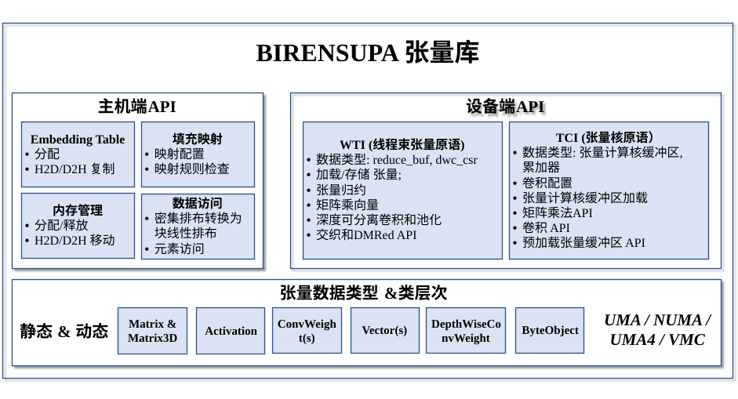</p><p align="center">图 2-1 BIRENSUPA 张量库结构</p>

张量库的典型使用流程是：

1. 在主机端构造张量，并通过函数参数将它们传递给核函数；

2. 在设备端，调用函数或张量方法。

为了使用张量库，代码需要包含 supa_tensor.h 头文件。所有这些类型和函数都在 tensor 命名空间下。

<div style="page-break-after:always"></div>

## 张量数据类型

壁仞通用 GPU 硬件具有对象描述符，用于描述内存中对象的元数据和内存存储。对象描述符包含原始数据内存的指针地址、格式、布局、维度等。壁仞通用 GPU 硬件支持 `S4`（4 位有符号整数）（尚不支持）、`S8`（8 位有符号整数）、`U8`（8 位无符号整数）、`S16`（16 位有符号整数）、`BF16`（16 位 S1E8M7 浮点数）、`int`（32 位有符号整数）、`uint`（32 位无符号整数）和 `FP32`（32 位浮点数）数据类型张量对象，并在其之上支持具有大量吞吐量的计算，如矩阵乘法、卷积等。因此，BIRENSUPA 定义了一个张量数据类型（Tensor）来处理所有必需的上下文信息。

壁仞通用 GPU 硬件设计版本 1.1 新增支持张量数据类型 FP16（16 位 S1/E5/M10 浮点数），FP16 数据类型在**张量模式下的超大核函数内**支持较为有限，具体限制如下：

- FP16 可用于张量数据类型、张量核心 A/B 缓冲区类型和恒定标量寄存器类型。

- FP16 不可用于 `__short_vector` 类型，全局内存指针类型、共享内存指针类型、核函数内局部变量类型和数组类型。

- 张量中的 FP16 应被加载到 BF16 类型的 `__short_vector` 变量上；BF16 类型的 `__short_vector` 也可被存储到 FP16 类型的张量上。
	
	> 因为 BF16 类型在张量模式下按照 BF20 形式储存（S1/E8/M11），因此该转换不会造成精度损失。

- FP16 类型的恒定标量寄存器（`__const_warp_shared__`）应被 `__load_csr()` 接口从 FP16 类型 Vector(s) 张量中读取。读取后的数据若需要进行计算，应先使用 `__csr_fp16_to_bf162()` 或相似接口将其转换成 BF16 类型 `__short_vector`。

### 张量类层次结构

BIRENSUPA 张量类被组织为类结构，如下图所示。

<p align="center"></p><p align="center">图 3-1 BIRENSUPA 张量类层次结构</p>

BIRENSUPA 张量数据结构从**形状**和**存储**两个方面来定义。

#### 张量数据结构的形状方面

在形状方面，BIRENSUPA 以两种样式定义了张量类型：

- 静态维度张量类型：张量维度是静态已知的，并被编码为 C++ 模板参数。

- 动态维度张量类型：可以在运行时设置张量维度，并记录为 C++ 类字段。

对于这两种类型的张量，有以下模板参数：

| 参数                                | 说明                                                                                     | 备注                                                            |
| ----------------------------------- | ---------------------------------------------------------------------------------------- | --------------------------------------------------------------- |
| E                                   | 元素类型。不同张量类型支持不同的数据类型组合。<br />FP32，int，uint，BF16，FP16，S16，S8，U8，S4（尚不支持） |                                                                 |
| Layout                              | Matrix3D/Matrix/DynMatrix3D/DynMatrix 的<br /> BLOCK_ROW_MAJOR 或 BLOCK_COL_MAJOR 布局。 | 仅适用于 <br />Matrix3D/Matrix 和<br /> DynMatrix3D/DynMatrix   |
| wti::LOAD_DWC_WEIGHT_BROADCAST_MODE | DepthWiseConvWeight/<br />DynDepthWiseConvWeight<br />的广播模式。                       | 仅适用于 <br />DepthWiseConvWeight/<br />DynDepthWiseConvWeight |

所有静态张量都有维度张量类型的模板参数（N，C，H，W，NV，KC_IN，KC_OUT）。对于动态张量，这些类型存储为类字段。

BIRENSUPA 具有以下形状方面张量类型。所有数据类型都在 tensor 命名空间中定义。

| 张量类型                                                 | 说明                                                                                        |
| -------------------------------------------------------- | ------------------------------------------------------------------------------------------- |
| Matrix<br />DynMatrix                                    | 存储尺寸为 H \* W 的 2D 矩阵，并具有 BLOCK_ROW_MAJOR 或 BLOCK_COL_MAJOR 张量数据块级布局。  |
| Matrix3D<br />DynMatrix3D                                | 存储 N 个 2D 矩阵，其中 N 个 2D 矩阵具有相同的形状。                                        |
| Activation<br />DynActivation                            | 存储神经网络的激活。有 N 个样本，每个样本都有 C 个通道，H 高度和 W 宽度。                   |
| ConvWeights/ConvWeight<br />DynConvWeights/DynConvWeight | 存储 3D 卷积权重，有 N 个样本，KC_OUT 输出通道，KC_IN 输入通道，并有过滤器大小 K_W \* K_H。 |
| Vector<br />DynVector                                    | 存储一个 1D 向量。只有长度 N 参数。                                                         |
| Vectors<br />DynVectors                                  | 存储 N 个 1D 向量。类型中的每个 1D 向量都具有相同的长度。                                   |
| DepthWiseConvWeight<br />DynDepthWiseConvWeight          | 存储逐通道卷积权重。它有 KC 个通道，过滤器大小为 KH \* KW。                                 |
| ByteObject<br />DynByteObject                            | 存储一个 N 字节大小的张量字节对象。                                                         |

#### 张量数据结构的存储方面

所有张量类型存储方面的相关定义，如 UMA、UMA4、UMA8、UMA16、NUMA 和 4KUMA，统一表现为创建张量数据类型时的前缀或模板参数，其中 4KUMA 较为特殊，仅支持通过模板参数表达。

以下是一个使用 8 个流式处理器簇创建张量数据类型的示例，其中创建了一个 UMA 类型的 Matrix3D、一个 NUMA 类型的 Matrix3D、一个 UMA4 类型的 Matrix3D 以及一个 4KUMA 类型的 Matrix3D。

```cpp
// 创建 3 种张量数据结构，使用 8 个流式处理器簇
UmaMatrix3D<BF16, BLOCK_ROW_MAJOR, 10, 128, 64> A;
NumaMatrix3D<BF16, BLOCK_ROW_MAJOR, 10, 128, 64> B(8);
Uma4Matrix3D<BF16, BLOCK_ROW_MAJOR, 10, 128, 64> C(2);
Matrix3D<BF16, suMemArchType4KUMA, 10, 128, 64> D;
suLaunchKernel(sample, dim3(8), dim3(512), NULL, 0, A, B, C, D);
```

在设备端，对 UMA 和 4KUMA 张量类型，所有流式处理器簇都可以看到所有数据。对于 NUMA、UMA4、UMA8 和 UMA16 张量，BIRENSUPA 定义了一个名为 region 的字段，表示将完整数据分成的多个部分。

- UMA 在主机和设备上，张量数据结构都有相同的数据资料。在设备端数据以每 512 Byte 为交错，依次均匀分布在所有 HBM 上。即 0 ~ 511 Byte 在 HBM 0，512 ~ 1023 Byte 在 HBM 1，1024 ~ 1535 Byte 在 HBM 2 ...... 用户对此无需感知，但是您若希望获得更高带宽则需要根据 HBM 分布设计合理的数据加载存储模式。

- 4KUMA 在主机和设备上，张量数据结构都有相同的数据资料。在设备端数据按照4096 Byte交错排布，依次均匀分布在所有 HBM 上（分布形式与 UMA 类似）。4KUMA 在设备端**不会有 L2 缓存**。部分文档或代码中会将 4KUMA 称为 UMA4K，两者代表相同含义。

- NUMA 在主机端，张量数据结构数据分段数量等同流式处理器簇数量，每段的大小与输入维度相同。在设备端，每个流式处理器簇只能访问到对应部分的数据。

- UMA4 在主机侧，张量数据结构数据分段数量等同流式处理器簇数量的 1/4，每段的大小与输入维度相同。在设备端，每 4 个流式处理器簇只能访问到它们对应部分的数据。

- UMA8 在主机侧，张量数据结构数据分段数量等同流式处理器簇数量的 1/8，每段的大小与输入维度相同。在设备端，每 8 个流式处理器簇只能访问到它们对应部分的数据。

- UMA16 在主机侧，张量数据结构数据分段数量等同流式处理器簇数量的 1/16，每段的大小与输入维度相同。在设备端，每 16 个流式处理器簇只能访问到它们对应部分的数据。

<p align="center">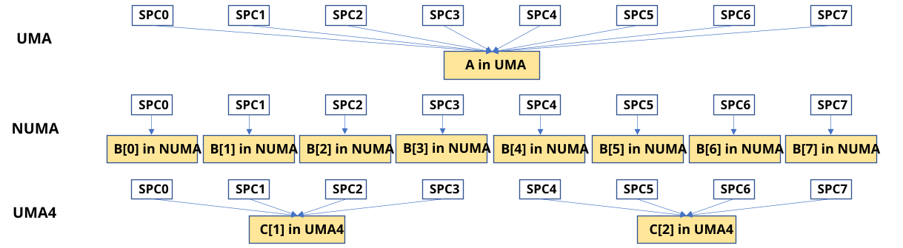</p><p align="center">图 3‑2 BIRENSUPA 张量 UMA NUMA UMA4</p>

<div style="page-break-after:always"></div>

## 张量数据类型布局

BIRENSUPA 定义了形状数据类型：Matrix3D/Matrix，Activation, ConvWeights/ConvWeight，Vectors/Vector，DepthWiseConvWeight 和 ByteObject，它们是用于描述张量形状的维度的参数或模板参数。每个张量类型映射到壁仞通用 GPU 硬件的一个特殊对象描述符或张量布局的原始数据。

所有动态维度张量类型有着和静态维度张量类型相同的张量形状。比如动态维度张量 DynMatrix3D 和静态维度张量 Matrix3D 具有相同的数据布局。

根据壁仞通用 GPU 硬件设计，每连续 512 字节的数据称为一个数据块，每个块可以分成 4 个 128 字节的数据子块。在 Matrix3D/Matrix，Activation, ConvWeights/ConvWeight，Vectors/Vector，DepthWiseConvWeight 张量类型中内存布局需要数据块（512 字节）对齐。

由于 BIRENSUPA 张量使用了特殊的数据分布，所以其在内存中的实际字节尺寸并不是直接由维度信息相乘得到，而需要先根据以下的介绍进行维度对齐再进行计算；相同形状不同数据类型的张量也不一定有依照数据类型大小的倍数关系，同样需要考虑维度对齐。

### Matrix3D/Matrix

Matrix3D 包括维度信息：N，H，W

- N <= 1024 (2^10)

- H <= 8192 (2^13)

- W <= 8192 (2^13)

Matrix 包括维度信息：H，W

- H <= 8192 (2^13)

- W <= 8192 (2^13)

BIRENSUPA 中的 Matrix3D/Matrix 张量形状有一个特殊的模板参数 MatrixLayout（BLOCK_ROW_MAJOR 或 BLOCK_COL_MAJOR），它将 BIRENSUPA 张量矩阵在数据块层面分成两个不同的布局。

#### BLOCK_ROW_MAJOR

BLOCK_ROW_MAJOR Matrix3D 或 Matrix 支持类型：FP32，int，uint，BF16，S16，S8，U8，S4（尚不支持）。

<table><tr><td bgcolor=#ffeccc><b>注意：</b>按照壁仞通用 GPU 硬件设计版本 1.0 要求，S8、U8、S4（尚不支持）数据类型的 BLOCK_ROW_MAJOR Matrix3D 或 Matrix 张量在 H 和 W 维度需要 2 对齐。</td></tr></table>

数据块或数据子块内形状如下：

- 数据块

	|          | FP32/int/uint | BF16/S16 | S8/U8   | S4（尚不支持） |
	| -------- | ------------- | -------- | ------- | -------------- |
	| 行 \* 列 | 4 \* 32       | 8 \* 32  | 8 \* 64 | 8 \* 128       |

- 数据子块

	|          | FP32/int/uint | BF16/S16 | S8/U8   | S4（尚不支持） |
	| -------- | ------------- | -------- | ------- | -------------- |
	| 行 \* 列 | 1 \* 32       | 2 \* 32  | 2 \* 64 | 2 \* 128       |

BLOCK_ROW_MAJOR Matrix 布局中的每个数据子块根据数据类型具有不同的布局。

<p align="center">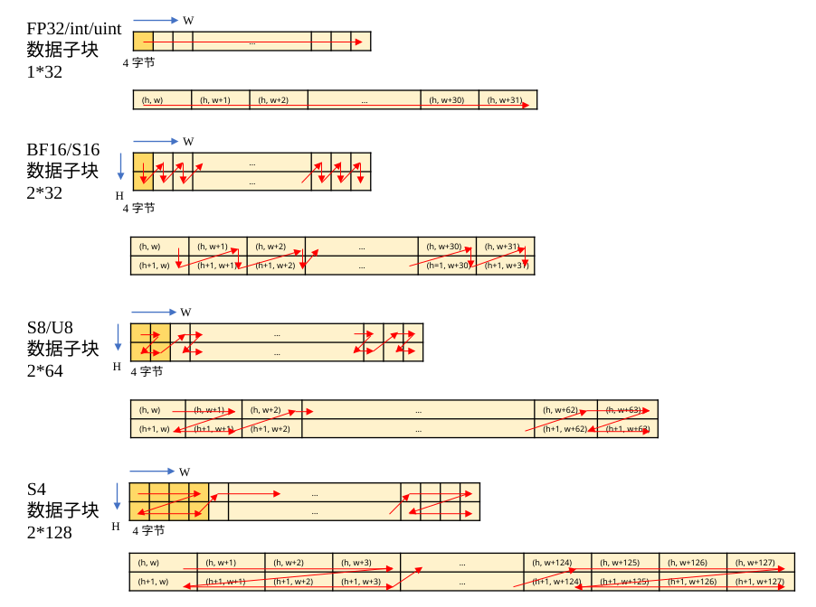</p><p align="center">图 4‑1 BIRENSUPA 张量 Matrix BLOCK_ROW_MAJOR 数据子块布局</p>

BLOCK_ROW_MAJOR Matrix 布局中的每个数据块都有 4 个具有 H 方向主寻址的数据子块。

<p align="center"></p><p align="center">图 4‑2 BIRENSUPA 张量 Matrix BLOCK_ROW_MAJOR 数据块</p>

在数据块之外，其线性寻址首先沿 W 为方向排列，然后沿 H 方向排列。同时，BLOCK_ROW_MAJOR Matrix 的布局在 W 方向需要 2KB 对齐（4 数据块对齐）。

<p align="center"></p><p align="center">图 4‑3 BIRENSUPA 张量 Matrix BLOCK_ROW_MAJOR 数据块布局</p>

#### BLOCK_COL_MAJOR

BLOCK_COL_MAJOR Matrix3D 或 Matrix 支持类型：FP32，int，uint，BF16，S16，S8，U8，S4（尚不支持）。

数据块或数据子块内形状如下：

- 数据块

	|          | FP32/int/uint | BF16/S16 | S8/U8    | S4（尚不支持） |
	| -------- | ------------- | -------- | -------- | -------------- |
	| 行 \* 列 | 4 \* 32       | 8 \* 32  | 16 \* 32 | 32 \* 32       |

- 数据子块

	|          | FP32/int/uint | BF16/S16 | S8/U8   | S4（尚不支持） |
	| -------- | ------------- | -------- | ------- | -------------- |
	| 行 \* 列 | 1 \* 32       | 2 \* 32  | 4 \* 32 | 8 \* 32        |

BLOCK_COL_MAJOR Matrix 布局中的每个数据子块根据数据类型具有不同的布局。

<p align="center">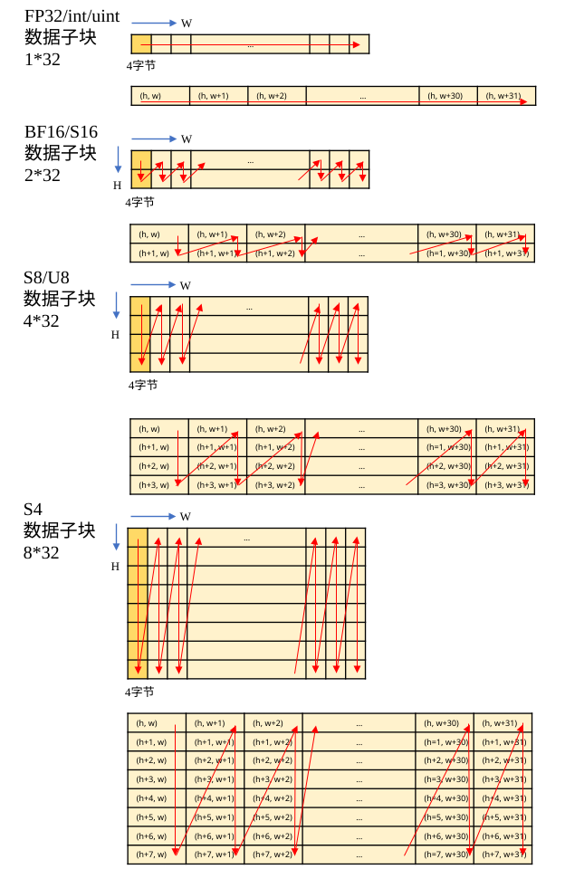</p><p align="center">图 4‑4 BIRENSUPA 张量 Matrix BLOCK_COL_MAJOR 数据子块布局</p>

BLOCK_COL_MAJOR Matrix 布局中的每个数据块都有 4 个具有 H 方向主寻址的数据子块。

<p align="center"></p><p align="center">图 4‑5 BIRENSUPA 张量 Matrix BLOCK_COL_MAJOR 数据块</p>

在数据块之外，它的线性寻址首先沿 H 方向排列，然后沿 W 方向排列。同时，BLOCK_COL_MAJOR Matrix 的布局在 H 方向需要 2KB 对齐(4 数据块对齐)。

<p align="center">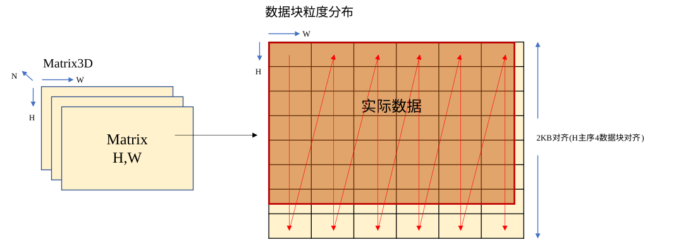</p><p align="center">图 4‑6 BIRENSUPA 张量 Matrix BLOCK_COL_MAJOR 数据块布局</p>


### CompressedMatrix3D/CompressedMatrix

当壁仞通用 GPU 硬件设计版本等于 1.1 时，BIRENSUPA 支持压缩张量。压缩张量因只被设计作为<b>推理时的张量核心的权重</b>使用，因此压缩张量具有以下限制和特点：

- 在核函数内只可以被张量核心加载。

- 在核函数内不可以被任何方式写入。

- 压缩行为在主机端完成，使用成员函数 `compressToDevice()` 将未压缩的主机内存中的数据压缩后存入设备内存中。

- 压缩后的数据无法被解压缩回原始数据。

CompressedMatrix3D/CompressedMatrix 为压缩矩阵张量。

CompressedMatrix3D 包括维度信息：N，H，W（与 Matrix3D 相同）：

- N <= 1024 (2^10)

- H <= 8192 (2^13)

- W <= 8192 (2^13)

CompressedMatrix 包括维度信息：H，W（与 Matrix 相同）：

- H <= 8192 (2^13)

- W <= 8192 (2^13)

CompressedMatrix3D/CompressedMatrix 支持稀疏矩阵的配置。BIRENSUPA 中对稀疏矩阵的定义为：每连续四个对齐的元素中至少有两个为 0，即第 4n，4n + 1，4n + 2，4n + 3 四个数中（n 为整数），必须至少有两个为 0。用户启用稀疏矩阵计算时需自行保证参与计算的该矩阵符合上述稀疏矩阵的定义。

- `SPARSITY_MODE::SPARSITY_ENABLE`: 启用稀疏矩阵

- `SPARSITY_MODE::SPARSITY_DISABLE`: 不启用稀疏矩阵

此外，只有 8 bits 或 16 bits 数据类型才能启用稀疏矩阵

| 数据类型    | SPARSITY_ENABLE | SPARSITY_DISABLE |
|------------|-----------------|------------------|
| FP32       | &cross;         | &check;          |
| BF16/FP16  | &check;         | &check;          |
| S8/U8      | &check;         | &check;          |

BIRENSUPA 中的 CompressedMatrix3D/CompressedMatrix 与 Matrix3D/Matrix 相似，张量形状有一个特殊的模板参数 MatrixLayout（BLOCK_ROW_MAJOR 或 BLOCK_COL_MAJOR），它将 BIRENSUPA 压缩矩阵张量在数据块层面分成两个不同的布局。

#### BLOCK_ROW_MAJOR

BLOCK_ROW_MAJOR CompressedMatrix3D 或 CompressedMatrix 支持类型：FP32，BF16，FP16，S8，U8。

数据在主机内存和设备内存中布局不同。在主机内存中，其布局方式和**非压缩矩阵张量完全相同**。而在设备内存中，区别于常规张量，压缩张量以大数据块（4KB）为单位存储。其布局方式如下：

- 大数据块（4KB）

	|          | FP32     | BF16/FP16 | S8/U8    |
	| -------- | -------- | --------- | -------- |
	| 行 \* 列 | 64 \* 16  | 64 \* 32  | 64 \* 64 |

在大数据块之外，其线性寻址首先沿 W 方向排列，然后沿 H　方向排列。

<p align="center"></p><p align="center">图： BIRENSUPA 张量 CompressedMatrix3D BLOCK_ROW_MAJOR 数据块布局</p>

#### BLOCK_COL_MAJOR

BLOCK_COL_MAJOR CompressedMatrix3D 或 CompressedMatrix 支持类型：FP32，BF16，FP16，S8，U8。

数据在主机内存和设备内存中布局不同。在主机内存中，其布局方式和**非压缩矩阵张量完全相同**。而在设备内存中，区别于常规张量，压缩张量以大数据块（4KB）为单位存储。其布局方式如下：

- 大数据块（4KB）

	|          | FP32     | BF16/FP16 | S8/U8    |
	| -------- | -------- | --------- | -------- |
	| 行 \* 列 | 16 \* 64  | 32 \* 64  | 64 \* 64 |

在大数据块之外，它的线性寻址首先沿 H 方向排列，然后沿 W 方向排列。

<p align="center">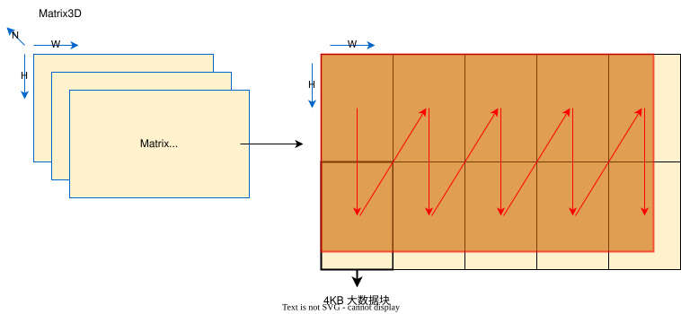</p><p align="center">图：BIRENSUPA 张量 CompressedMatrix3D BLOCK_COL_MAJOR 数据块布局</p>

### Activation

Activation 包括维度信息：N，C，H，W

- N <= 1024 (2^10)

- C <= 8192 (2^13)

- H <= 8192 (2^13)

- W <= 8192 (2^13)

Activation 支持类型：FP32，int，uint，BF16，S16，S8，U8。

数据块或数据子块内形状如下：

- 数据块

	|                  | FP32/int/uint | BF16/S16    | S8/U8        |
	| ---------------- | ------------- | ----------- | ------------ |
	| 通道 \* 行 \* 列 | 4 \* 4 \* 8   | 8 \* 4 \* 8 | 16 \* 4 \* 8 |

- 数据子块

	|                  | FP32/int/uint | BF16/S16    | S8/U8       |
	| ---------------- | ------------- | ----------- | ----------- |
	| 通道 \* 行 \* 列 | 1 \* 4 \* 8   | 2 \* 4 \* 8 | 4 \* 4 \* 8 |

Activation 布局中的每个数据子块根据数据类型具有不同的布局。

<p align="center">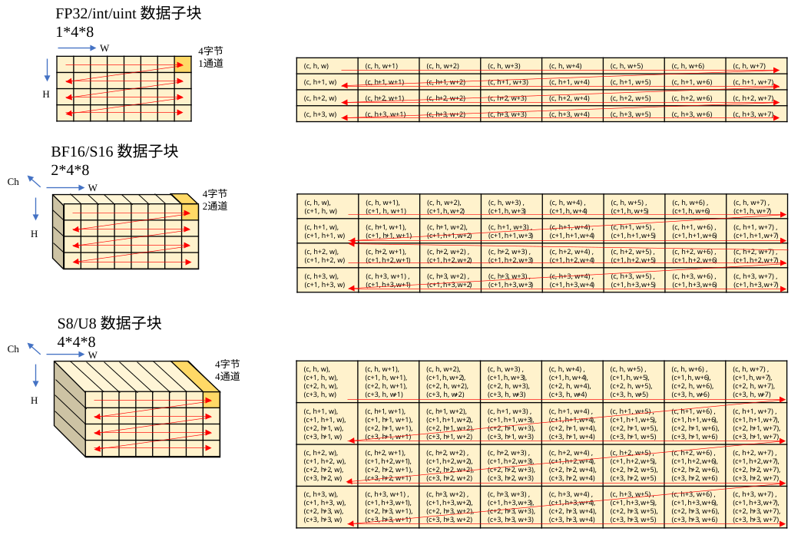</p><p align="center">图 4‑7 BIRENSUPA 张量 Activation 数据子块布局</p>

Activation 布局中的每个数据块都有 4 个具有 C 主寻址的数据子块。

<p align="center">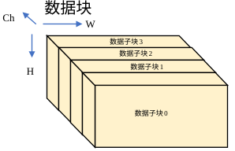</p><p align="center">图 4‑8 BIRENSUPA 张量 Activation 数据块</p>

在数据块之外，它的线性寻址是首先沿 H 方向排列，其次是沿 W 方向排列，最后沿 C 方向排列。同时，Activation 的布局需要在 H 方向 1KB 对齐（2 数据块对齐）。

<p align="center">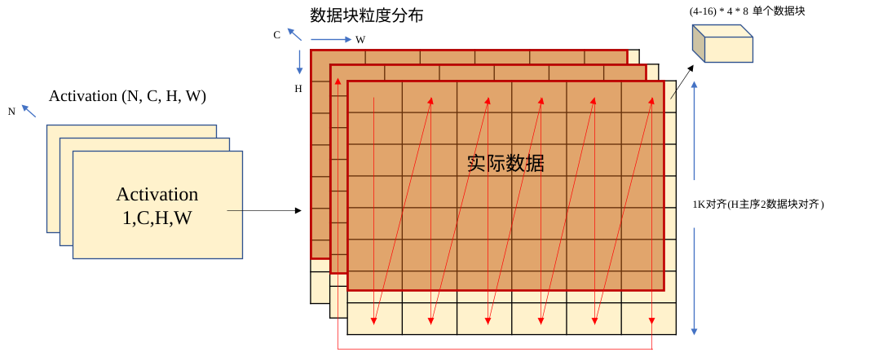</p><p align="center">图 4‑9 BIRENSUPA 张量 Activation 数据块布局</p>

### ConvWeights/ConvWeight

ConvWeights 包括维度信息：N，KC_OUT，KC_IN，H, W

- N <= 1024 (2^10)

- KC_OUT <= 8192 (2^13)

- KC_IN <= 8192 (2^13)

- H \* W <= 8192 (2^13)

ConvWeight 包括维度信息：KC_OUT，KC_IN，H, W

- KC_OUT <= 8192 (2^13)

- KC_IN <= 8192 (2^13)

- H \* W <= 8192 (2^13)

<table><tr><td bgcolor=#ffeccc><b>注意：</b>按照壁仞通用 GPU 硬件设计版本 1.0 要求，S8 数据类型的 ConvWeights 或 ConvWeight 张量在 KC_OUT 和 KC_IN 维度需要 2 对齐。</td></tr></table>

ConvWeights 支持类型：FP32，int，uint，BF16，S8，S4（尚不支持）。

壁仞通用 GPU 硬件将 2D 权重空间坐标考虑为 1D。

<p align="center">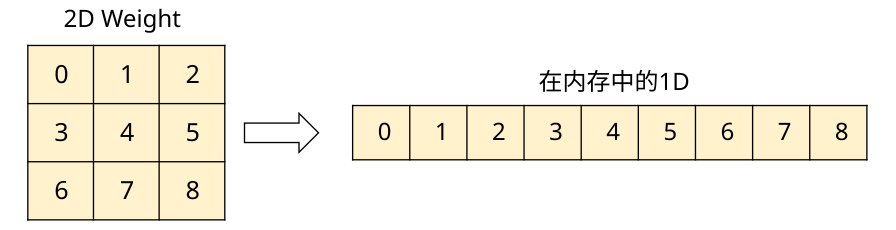</p><p align="center">图 4‑10 BIRENSUPA 张量 2D 权重转换 1D</p>

数据块或数据子块内形状如下：

- 数据块

	|                                  | FP32/int/uint | BF16         | S8           | S4（尚不支持） |
	| -------------------------------- | ------------- | ------------ | ------------ | -------------- |
	| 单个权重 \* 输出通道 \* 输入通道 | 1 \* 4 \* 32  | 1 \* 8 \* 32 | 1 \* 8 \* 64 | 1 \* 8 \* 128  |

- 数据子块

	|                                  | FP32/int/uint | BF16         | S8           | S4（尚不支持） |
	| -------------------------------- | ------------- | ------------ | ------------ | -------------- |
	| 单个权重 \* 输出通道 \* 输入通道 | 1 \* 1 \* 32  | 1 \* 2 \* 32 | 1 \* 2 \* 64 | 1 \* 2 \* 128  |

ConvWeight 布局中的每个数据子块根据数据类型具有不同的布局。

<p align="center">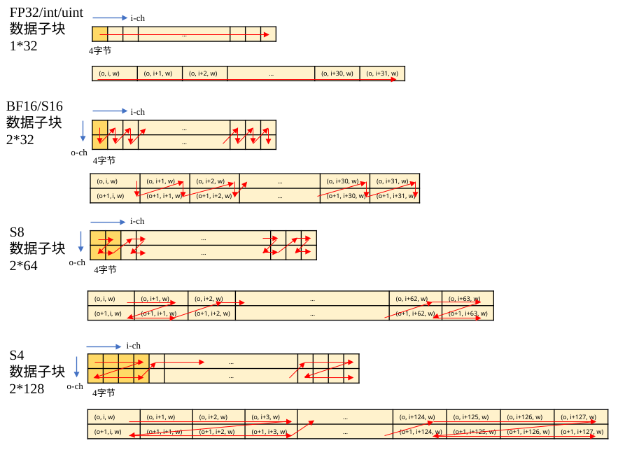</p><p align="center">图 4‑11 BIRENSUPA 张量 ConvWeight 数据子块布局</p>

ConvWeight 布局中的每个数据块都有 4 个具有 KC_OUT 主寻址的数据子块。

<p align="center">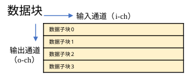</p><p align="center">图 4‑12 BIRENSUPA 张量 ConvWeight 数据块</p>

在数据块之外，它的线性寻址首先沿拉伸成一维的权重空间排列，然后是输入通道（KC_IN），最后是输出通道（KC_OUT）。

<p align="center">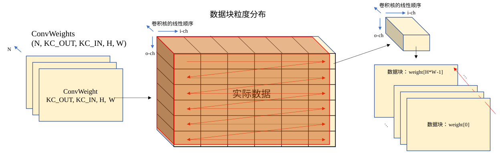</p><p align="center">图 4‑13 BIRENSUPA 张量 ConvWeight 数据块布局</p>

### CompressedConvWeights/CompressedConvWeight

当壁仞通用 GPU 硬件设计版本等于 1.1 时，BIRENSUPA 支持压缩张量。压缩张量在核函数内只可以被张量核心加载，不可以被任何方式写入。

CompressedConvWeights/CompressedConvWeight 为压缩卷积权重张量。

CompressedConvWeights 包括维度信息：N、KC_OUT、KC_IN、H、W，各个维度的取值限制如下：

- N <= 1024 (2^10)

- KC_OUT <= 8192 (2^13)

- KC_IN <= 8192 (2^13)

- H \* W <= 8192 (2^13)

CompressedConvWeight 包括维度信息：KC_OUT、KC_IN、H、W，各个维度的取值限制如下：

- KC_OUT <= 8192 (2^13)

- KC_IN <= 8192 (2^13)

- H \* W <= 8192 (2^13)

CompressedConvWeight(s) 支持类型：FP32，BF16，FP16，S8。

壁仞通用 GPU 硬件将 2D 权重空间坐标考虑为 1D（与非压缩卷积权重张量相同）。

数据在主机内存和设备内存中布局不同。在主机内存中，其布局方式和**非压缩卷积权重张量完全相同**。而在设备内存中，区别于常规张量，压缩张量以大数据块（4KB）为单位存储。其布局方式如下：

- 大数据块（4KB）

	|                                  | FP32          | BF16/FP16     | S8              |
	| -------------------------------- | ------------- | ------------- | --------------- |
	| 单个权重 \* 输出通道 \* 输入通道   | 1 \* 64 \* 16 | 1 \* 64 \* 32 | 1 \* 64 \* 64   |

在大数据块之外，它的线性寻址首先沿拉伸成一维的权重空间，然后是输入通道（KC_IN），最后是输出通道（KC_OUT）（与非压缩卷积权重相似）。

### Vectors/Vector

Vectors 包括维度信息：NV，N

- NV <= 1024 (2^10)

- N <= 8192 (2^13)

Vector 包括维度信息：N

- N <= 8192 (2^13)

Vectors/Vector 支持类型：FP32，int，uint，BF16，S16，S8，U8，S4（尚不支持）。

数据块或数据子块内形状如下：

- 数据块

	|          | FP32/int/uint | BF16/S16 | S8/U8    | S4（尚不支持） |
	| -------- | ------------- | -------- | -------- | -------------- |
	| 数据个数 | 4 \* 32       | 4 \* 64  | 4 \* 128 | 4 \* 256       |

- 数据子块

	|          | FP32/int/uint | BF16/S16 | S8/U8 | S4（尚不支持） |
	| -------- | ------------- | -------- | ----- | -------------- |
	| 数据个数 | 32            | 64       | 128   | 256            |

Vectors/Vector 是 512 字节（单个数据块）对齐的。

### DepthWiseConvWeight

DepthWiseConvWeight 包括维度信息：KC，H，W

同时还需要 wti::LOAD_DWC_WEIGHT_BROADCAST_MODE 参数来表达广播模式。

- BF16: ((KC - 1) / 32 + 1) \* 32 \* H \* W <= 8388608 (2^23)

- S8: ((KC - 1) / 64 + 1) \* 64 \* H \* W <= 8388608 (2^23)

> 注意：虽然创建张量时只对上述乘积存在要求，但是 `DepthWiseConvWeight` 张量类型通常会与张量计算原语 `wti::__depthwise_conv()` 同时使用，而该计算原语要求加载进来的权重满足 `H <= 5` 且 `W <= 5` 。

DepthWiseConvWeight 支持类型：BF16，S8。

壁仞通用 GPU 硬件将 2D 权重空间坐标考虑为 1D。

<p align="center"></p><p align="center">图 4‑14 BIRENSUPA 张量 2D 权重转换 1D</p>

根据壁仞通用 GPU 硬件设计，DepthWiseConvWeight 的布局需要在输入通道根据广播模式和数据类型对齐。具体输入通道对齐如下表：

| 广播模式      | BF16 | S8  |
| ------------- | ---- | --- |
| Broadcast OFF | 32   | 64  |
| Broadcast 2   | 16   | 32  |
| Broadcast 4   | 8    | 16  |
| Broadcast 8   | 4    | 8   |
| Broadcast 16  | 2    | 4   |

DepthWiseConvWeight 的布局是输入通道对齐字节寻址，权重来自过滤器的扫描线顺序，然后是输入通道尺寸。最终 DepthWiseConvWeight 实际元素数量小于 8192 时，还会遵循线程块 512 字节的对齐；DepthWiseConvWeight 实际元素数量大于等于 8192 时，遵循 8192 个元素对齐。

下面是 BF16 数据类型，3 \* 3 过滤器，48 通道，不开启广播模式的 DepthWiseConvWeight 的示例。

<p align="center">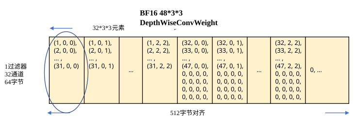</p><p align="center">图 4‑15 BIRENSUPA 张量 DepthWiseConvWeight 3*3 不开启广播模式示例</p>

以下例子介绍了 BF16 数据类型，3 \* 3 过滤器的 DepthWiseConvWeight 在不同广播模式下的内存示例。

<p align="center">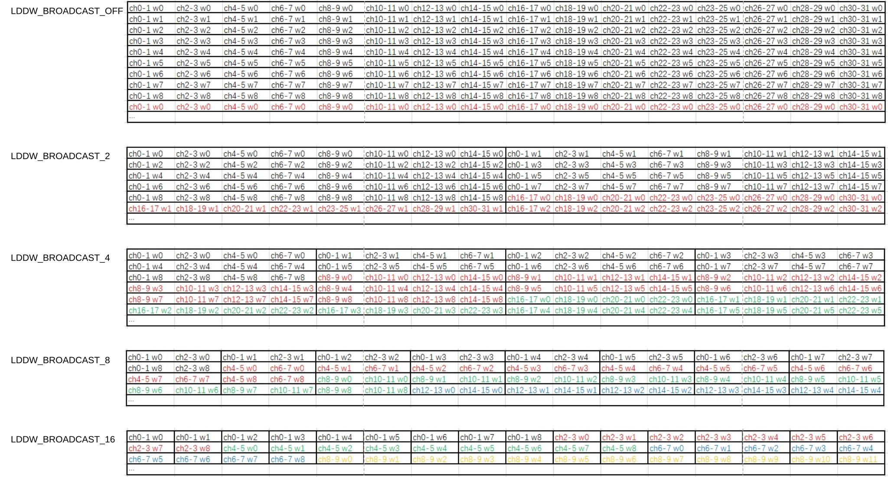</p><p align="center">图 4‑16 BIRENSUPA 张量 DepthWiseConvWeight 3*3 不同广播模式示例</p>

### ByteObject

ByteObject 包括维度信息：N

- N <= 268435455 (2^28-1)

ByteObject 内存数据始终是 S8。

<div style="page-break-after:always"></div>

## 张量数据类型的加载存储

BIRENSUPA 提供了从张量数据类型中读取或存储数据的 API。

ByteObjet 张量类型由每个线程根据目标字节地址（[线程级读取存储 API](#线程读取或存储-byteobjectdynbyteobject-数据)）执行数据加载或存储。

Matrix3D/Matrix，Activation，ConvWeights/ConvWeight，Vectors/Vector，DepthWiseConvWeight 张量类型根据线程束和第一个线程读取的元素的坐标（[线程束级张量数据读取和存储 API](#线程束张量数据读取和存储)）进行数据加载或存储。基于壁仞通用 GPU 硬件设计，每个线程束在一次加载中会加载一个数据子块。

<p align="center">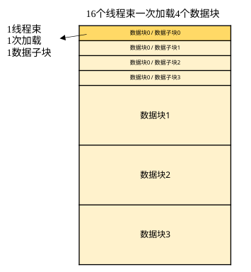</p><p align="center">图 5‑1 BIRENSUPA 张量存储</p>

### Burst 模式

为了降低数据输入/输出成本，壁仞通用 GPU 硬件设计了 burst 模式，使单个 API 可以加载多个数据子块。Matrix3D/Matrix、Activation、ConvWeight、Vectors/Vector 张量数据类型在使用 burst 模式加载/存储数据是需要遵守特殊的规则。

假设 c 是需要进行加载或存储数据的起始坐标。

- 非 FP32/int/uint 数据类型进行相同数据类型加载或存储

Burst 1：

| 参数                   | 描述                       |
| ---------------------- | -------------------------- |
| Matrix BLOCK_ROW_MAJOR | 从 c 字节开始的 128 字节。 |
| Matrix BLOCK_COL_MAJOR | 从 c 字节开始的 128 字节。 |
| Activation             | 从 c 字节开始的 128 字节。 |
| ConvWeight             | 从 c 字节开始的 128 字节。 |
| Vector                 | 从 c 字节开始的 128 字节。 |

Burst 2：

| 参数                   | 描述                                                             |
| ---------------------- | ---------------------------------------------------------------- |
| Matrix BLOCK_ROW_MAJOR | 从 c 字节开始的 128 字节， <br />从 c+512 字节开始的 128 字节。  |
| Matrix BLOCK_COL_MAJOR | 从 c 字节开始的 128 字节， <br />从 c+2048 字节开始的 128 字节。 |
| Activation             | 从 c 字节开始的 128 字节， <br />从 c+512 字节开始的 128 字节。  |
| ConvWeight             | 从 c 字节开始的 128 字节， <br />从 c+512 字节开始的 128 字节。  |
| Vector                 | 从 c 字节开始的 256 字节。                                       |

Burst 4：

| 参数                   | 描述                                                                                                                                         |
| ---------------------- | -------------------------------------------------------------------------------------------------------------------------------------------- |
| Matrix BLOCK_ROW_MAJOR | 从 c 字节开始的 128 字节， <br />从 c+512 字节开始的 128 字节， <br />从 c+1024 字节开始的 128 字节， <br />从 c+1536 字节开始的 128 字节。  |
| Matrix BLOCK_COL_MAJOR | 从 c 字节开始的 128 字节， <br />从 c+2048 字节开始的 128 字节， <br />从 c+4096 字节开始的 128 字节， <br />从 c+6144 字节开始的 128 字节。 |
| Activation             | 从 c 字节开始的 128 字节， <br />从 c+512 字节开始的 128 字节， <br />从 c+1024 字节开始的 128 字节， <br />从 c+1536 字节开始的 128 字节。  |
| ConvWeight             | 从 c 字节开始的 128 字节， <br />从 c+512 字节开始的 128 字节， <br />从 c+1024 字节开始的 128 字节， <br />从 c+1536 字节开始的 128 字节。  |
| Vector                 | 从 c 字节开始的 512 字节。                                                                                                                   |

- FP32/int/uint 数据类型加载或存储 FP32/int 数据类型

Burst 1：

| 参数                   | 描述                       |
| ---------------------- | -------------------------- |
| Matrix BLOCK_ROW_MAJOR | 从 c 字节开始的 128 字节。 |
| Matrix BLOCK_COL_MAJOR | 从 c 字节开始的 128 字节。 |
| Activation             | 从 c 字节开始的 128 字节。 |
| ConvWeight             | 从 c 字节开始的 128 字节。 |
| Vector                 | 从 c 字节开始的 128 字节。 |

Burst 2：

| 参数                  | 描述                                                            |
| --------------------- | --------------------------------------------------------------- |
| MatrixBLOCK_ROW_MAJOR | 从 c 字节开始的 128 字节， <br />从 c+128 字节开始的 128 字节。 |
| MatrixBLOCK_COL_MAJOR | 从 c 字节开始的 128 字节， <br />从 c+128 字节开始的 128 字节。 |
| Activation            | 从 c 字节开始的 128 字节， <br />从 c+128 字节开始的 128 字节。 |
| ConvWeight            | 从 c 字节开始的 128 字节， <br />从 c+128 字节开始的 128 字节。 |
| Vector                | 从 c 字节开始的 256 字节。                                      |

Burst 4：

| 参数                  | 描述                                                                                                                                       |
| --------------------- | ------------------------------------------------------------------------------------------------------------------------------------------ |
| MatrixBLOCK_ROW_MAJOR | 从 c 字节开始的 128 字节，<br />从 c+128 字节开始的 128 字节， <br />从 c+512 字节开始的 128 字节， <br />从 c+640 字节开始的 128 字节。   |
| MatrixBLOCK_COL_MAJOR | 从 c 字节开始的 128 字节， <br />从 c+128 字节开始的 128 字节， <br />从 c+4096 字节开始的 128 字节，<br />从 c+4224 字节开始的 128 字节。 |
| Activation            | 从 c 字节开始的 128 字节， <br />从 c+128 字节开始的 128 字节， <br />从 c+512 字节开始的 128 字节， <br />从 c+640 字节开始的 128 字节。  |
| ConvWeight            | 从 c 字节开始的 128 字节， <br />从 c+128 字节开始的 128 字节， <br />从 c+512 字节开始的 128 字节， <br />从 c+640 字节开始的 128 字节。  |
| Vector                | 从 c 字节开始的 512 字节。                                                                                                                 |

<table><tr><td bgcolor=#ffeccc><b>注意：</b>当壁仞通用 GPU 硬件设计版本等于 1.1，BIRENSUPA 支持 8 位内存的张量数据类型与 16 位线程本地寄存器之间的加载与存储。同时，这种特殊 API 需要遵从特殊的规则

- 8 位内存的张量数据类型与 16 位线程本地寄存器之间的加载与存储

|  | Matrix `BLOCK_ROW_MAJOR` | Matrix `BLOCK_COL_MAJOR` | Activation | ConvWeight | Vector |
| --- | --- | --- | --- | --- | --- |
| Burst 1 | 从 c 字节开始的 128 字节 | 从 c 字节开始的 128 字节 | 从 c 字节开始的 128 字节 | 从 c 字节开始的 128 字节 | 从 c 字节开始的 128 字节 |
| Burst 2 | 从 c 字节开始的 128 字节<br />从 c + 512 字节开始的 128 字节 | 从 c 字节开始的 128 字节<br />从 c + 1024 字节开始的 128 字节 | 从 c 字节开始的 128 字节<br />从 c + 512 字节开始的 128 字节 | 从 c 字节开始的 128 字节<br />从 c + 512 字节开始的 128 字节 | 从 c 字节开始的 256 字节 |
| Burst 4 | 从 c 字节开始的 128 字节<br />从 c + 512 字节开始的 128 字节<br />从 c + 1024 字节开始的 128 字节<br />从 c + 1536 字节开始的 128 字节 | 从 c 字节开始的 128 字节<br />从 c + 1024 字节开始的 128 字节<br />从 c + 2048 字节开始的 128 字节<br />从 c + 3072 字节开始的 128 字节 | 从 c 字节开始的 128 字节<br />从 c + 512 字节开始的 128 字节<br />从 c + 1024 字节开始的 128 字节<br />从 c + 1536 字节开始的 128 字节 | 从 c 字节开始的 128 字节<br />从 c + 512 字节开始的 128 字节<br />从 c + 1024 字节开始的 128 字节<br />从 c + 1536 字节开始的 128 字节 | 从 c 字节开始的 512 字节 |

</td></tr></table>

如果 burst 模式的加载或存储超出了张量布局的边界，那么实际加载或存储的数据将不会基于连续存储，而是根据张量布局进行移动。同时，超出边界的部分会被壁仞通用 GPU 硬件填充为 0。

例如，一个线程束尝试从 N = 1、C = 8、H = 8、W = 8，BF16 数据类型的 Activation 张量数据类型中 Burst 2 加载。加载起始坐标为（0，4，0）。根据布局，两个数据子块的加载将从坐标（0，4，0）和（0，8，0）开始。第二个数据子块超出边界，输出将填充 0。

#### Matrix3D/Matrix Burst 模式

##### BLOCK_ROW_MAJOR Burst 模式

以下是 BLOCK_ROW_MAJOR Matrix 张量从（0，0，0）加载或存储数据时，线程 0 的线程本地寄存器所对应的数据坐标示例（张量数据类型和线程本地寄存器获得数据类型相同时）。

| (H, W)                                                 | Get/Set<br />数据数量 1 | Get2/Set2<br />数据数量 2            | Get3/Set3<br />数据数量 3                                           | Get4/Set4<br />数据数量 4                                                                          | Get8/Set8<br />数据数量 8                                                                                                                | Get16/Set16<br />数据数量 16                                                                                                                                                                                           |
| ------------------------------------------------------ | ----------------------- | ------------------------------------ | ------------------------------------------------------------------- | -------------------------------------------------------------------------------------------------- | ---------------------------------------------------------------------------------------------------------------------------------------- | ---------------------------------------------------------------------------------------------------------------------------------------------------------------------------------------------------------------------- |
| S4（尚未支持）<br />数据块 8 \* 128<br />数据子块 2 \* 128 | N/A                     | N/A                                  | N/A                                                                 | N/A                                                                                                | (0, 0), (0, 1), (0, 2), (0, 3),<br />(1, 0), (1, 1), (1, 2), (1, 3)                                                                      | (0, 0), (0, 1), (0, 2), (0, 3),<br />(1, 0), (1, 1), (1, 2), (1, 3),<br />//+512 字节<br />(0, 128), (0, 129), (0, 130), (0, 131),<br />(1, 128), (1, 129), (1, 130), (1, 131)                                         |
| S8/U8<br />数据块 8 \* 64<br />数据子块 2 \* 64            | N/A                     | N/A                                  | N/A                                                                 | (0, 0), (0, 1),<br />(1, 0), (1, 1)                                                                | (0, 0), (0, 1),<br />(1, 0), (1, 1),<br />//+512 字节<br />(0, 64), (0, 65),<br />(1, 64), (1, 65)                                       | (0, 0), (0, 1), (1, 0), (1, 1),<br />//+512 字节<br />(0, 64), (0, 65), (1, 64), (1, 65),<br />//+1024 字节<br />(0, 128), (0, 129), (1, 128), (1, 129),<br />//+1536 字节<br />(0, 192), (0, 193), (1, 192), (1, 193) |
| BF16<br />数据块 8 \* 32<br />数据子块 2 \* 32             | N/A                     | (0, 0), (1, 0)                       | N/A                                                                 | (0, 0), (1, 0),<br />//+512 字节<br />(0, 32), (1, 32)                                             | (0, 0), (1, 0),<br />//+512 字节<br />(0, 32), (1, 32),<br />//+1024 字节<br />(0, 64), (1, 64),<br />//+1536 字节<br />(0, 96), (1, 96) | N/A                                                                                                                                                                                                                    |
| FP32/int/uint<br />数据块 4 \* 32<br />数据子块 1 \* 32    | (0, 0)                  | (0, 0),<br />//+128 字节<br />(1, 0) | (0, 0),<br />//+128 字节<br />(1, 0),<br />//+512 字节<br />(0, 32) | (0, 0),<br />//+128 字节<br />(1, 0),<br />//+512 字节<br />(0, 32),<br />//+640 字节<br />(1, 32) | N/A                                                                                                                                      | N/A                                                                                                                                                                                                                    |

下图介绍了 FP32/int/uint 数据类型的 Matrix BLOCK_ROW_MAJOR 张量的 Burst 模式。

<p align="center">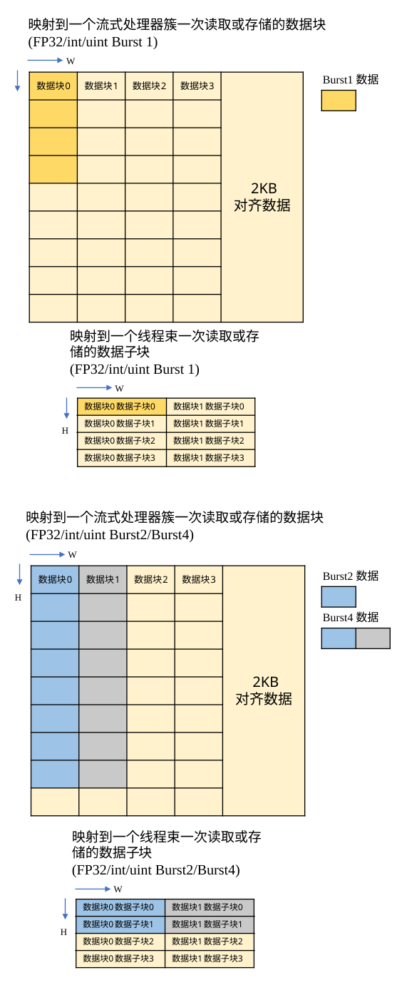</p><p align="center">图 5‑2 BIRENSUPA FP32/int/uint 数据类型 Matrix BLOCK_ROW_MAJOR 张量 Burst 模式</p>

下图介绍了 BF16，S16，S8，U8，S4（尚未支持）数据类型的 Matrix BLOCK_ROW_MAJOR 张量的 Burst 模式。

<p align="center">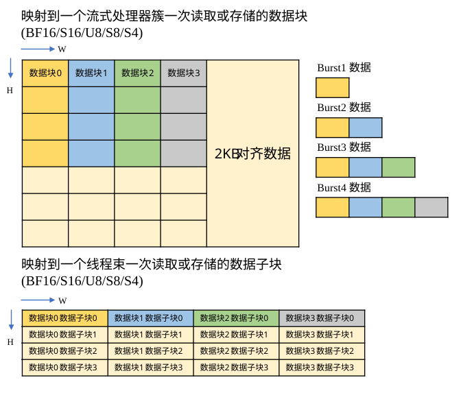</p><p align="center">图 5‑3 BIRENSUPA 非 FP32/int/uint 数据类型 Matrix BLOCK_ROW_MAJOR 张量 Burst 模式</p>

##### BLOCK_COL_MAJOR Burst 模式

以下是 BLOCK_COL_MAJOR Matrix 张量从（0，0，0）加载或存储数据时，线程 0 的线程本地寄存器所对应的数据坐标示例（张量数据类型和线程本地寄存器获得数据类型相同时）。

| (H, W)                                                | Get/Set<br />数据数量 1 | Get2/Set2<br />数据数量 2            | Get3/Set3<br />数据数量 3                                            | Get4/Set4<br />数据数量 4                                                                            | Get8/Set8<br />数据数量 8                                                                                                                 | Get16/Set16<br />数据数量 16                                                                                                                                                                                            |
| ----------------------------------------------------- | ----------------------- | ------------------------------------ | -------------------------------------------------------------------- | ---------------------------------------------------------------------------------------------------- | ----------------------------------------------------------------------------------------------------------------------------------------- | ----------------------------------------------------------------------------------------------------------------------------------------------------------------------------------------------------------------------- |
| S4（尚未支持）<br />数据块 32 \* 32<br />数据子块 8 \* 32 | N/A                     | N/A                                  | N/A                                                                  | N/A                                                                                                  | (0, 0), (1, 0), (2, 0), … (7, 0)                                                                                                          | (0, 0), (1, 0), (2, 0), … (7, 0),<br />//+2048 字节<br />(128, 0), (129, 0), (130, 0), … (145, 0)                                                                                                                       |
| S8/U8<br />数据块 16 \* 32<br />数据子块 4 \* 32          | N/A                     | N/A                                  | N/A                                                                  | (0, 0), (1, 0), (2, 0), (3, 0)                                                                       | (0, 0), (1, 0), (2, 0), (3, 0),<br />//+2048 字节<br />(64, 0), (65, 0), (66, 0), (67, 0)                                                 | (0, 0), (1, 0), (2, 0), (3, 0),<br />//+2048 字节<br />(64, 0), (65, 0), (66, 0), (67, 0),<br />//+4096 字节<br />(128, 0), (129, 0), (130, 0), (131, 0),<br />//+6144 字节<br />(192, 0), (193, 0), (194, 0), (195, 0) |
| BF16<br />数据块 8 \* 32<br />数据子块 2 \* 32            | N/A                     | (0, 0), (1, 0)                       | N/A                                                                  | (0, 0), (1, 0),<br />//+2048 字节<br />(32, 0), (33, 0)                                              | (0, 0), (1, 0),<br />//+2048 字节<br />(32, 0), (33, 0),<br />//+4096 字节<br />(64, 0), (65, 0),<br />//+6144 字节<br />(96, 0), (97, 0) | N/A                                                                                                                                                                                                                     |
| FP32/int/uint<br />数据块 4 \* 32<br />数据子块 1 \* 32   | (0, 0)                  | (0, 0),<br />//+128 字节<br />(1, 0) | (0, 0),<br />//+128 字节<br />(1, 0),<br />//+4096 字节<br />(32, 0) | (0, 0),<br />//+128 字节<br />(1, 0),<br />//+4096 字节<br />(32, 0),<br />//+4224 字节<br />(33, 0) | N/A                                                                                                                                       | N/A                                                                                                                                                                                                                     |

下图介绍了 FP32/int/uint 数据类型的 Matrix BLOCK_COL_MAJOR 张量的 Burst 模式。

<p align="center">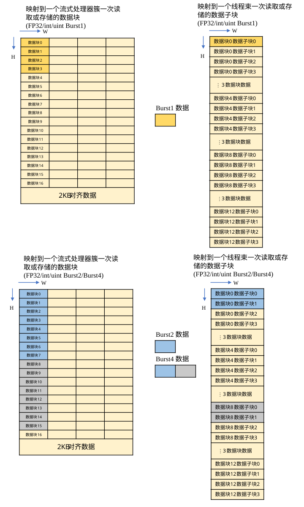</p><p align="center">图 5‑4 BIRENSUPA FP32/int/uint 数据类型 Matrix BLOCK_COL_MAJOR 张量 Burst 模式</p>

下图介绍了 BF16，S16，S8，U8，S4（尚未支持）数据类型的 Matrix BLOCK_COL_MAJOR 张量的 Burst 模式。

<p align="center">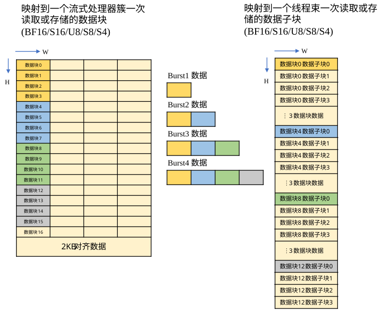</p><p align="center">图 5‑5 BIRENSUPA 非 FP32/int 数据类型 Matrix BLOCK_COL_MAJOR 张量 Burst 模式</p>

#### Activation Burst 模式

以下是 Activation 张量从（0，0，0，0）加载或存储数据时，线程 0 的线程本地寄存器所对应的数据坐标示例（张量数据类型和线程本地寄存器获得数据类型相同时）。

| (C, H, W)                                               | Get/Set<br />数据数量 1 | Get2/Set2<br />数据数量 2                  | Get3/Set3<br />数据数量 3                                                   | Get4/Set4<br />数据数量 4                                                                                    | Get8/Set8<br />数据数量 8                                                                                                                                    | Get16/Set16<br />数据数量 16                                                                                                                                                                                                                            |
| ------------------------------------------------------- | ----------------------- | ------------------------------------------ | --------------------------------------------------------------------------- | ------------------------------------------------------------------------------------------------------------ | ------------------------------------------------------------------------------------------------------------------------------------------------------------ | ------------------------------------------------------------------------------------------------------------------------------------------------------------------------------------------------------------------------------------------------------- |
| S8/U8<br />数据块 16 \* 4 \* 8<br />数据子块 4 \* 4 \* 8        | N/A                     | N/A                                        | N/A                                                                         | (0, 0, 0), (1, 0, 0), (2, 0, 0), (3, 0, 0)                                                                   | (0, 0, 0), (1, 0, 0), (2, 0, 0), (3, 0, 0),<br />//+512 字节<br /> (0, 4, 0), (1, 4, 0), (2, 4, 0), (3, 4, 0)                                                | (0, 0, 0), (1, 0, 0), (2, 0, 0), (3, 0, 0),<br />//+512 字节<br /> (0, 4, 0), (1, 4, 0), (2, 4, 0), (3, 4, 0),<br />//+1024 字节<br />(0, 8, 0), (1, 8, 0), (2, 8, 0), (3, 8, 0),<br />//+1536 字节<br />(0, 12, 0), (1, 12, 0), (2, 12, 0), (3, 12, 0) |
| BF16<br />数据块 8 \* 4 \* 8<br />数据子块 2 \* 4 \* 8          | N/A                     | (0, 0, 0), (1, 0, 0)                       | N/A                                                                         | (0, 0, 0), (1, 0, 0),<br />//+512 字节<br />(0, 4, 0), (1, 4, 0)                                             | (0, 0, 0), (1, 0, 0),<br />//+512 字节<br />(0, 4, 0), (1, 4, 0),<br />//+1024 字节<br />(0, 8, 0), (1, 8, 0),<br />//+1536 字节<br />(0, 12, 0), (1, 12, 0) | N/A                                                                                                                                                                                                                                                     |
| FP32/int/uint<br />数据块 4 \* 4 \* 8<br />数据子块 1 \* 4 \* 8 | (0, 0, 0)               | (0, 0, 0),<br />//+128 字节<br />(1, 0, 0) | (0, 0, 0),<br />//+128 字节<br />(1, 0, 0),<br />//+512 字节<br />(0, 4, 0) | (0, 0, 0),<br />//+128 字节<br />(1, 0, 0),<br />//+512 字节<br />(0, 4, 0),<br />//+640 字节<br />(1, 4, 0) | N/A                                                                                                                                                          | N/A                                                                                                                                                                                                                                                     |

下图介绍了 FP32/int/uint 数据类型的 Activation 张量的 Burst 模式。

<p align="center">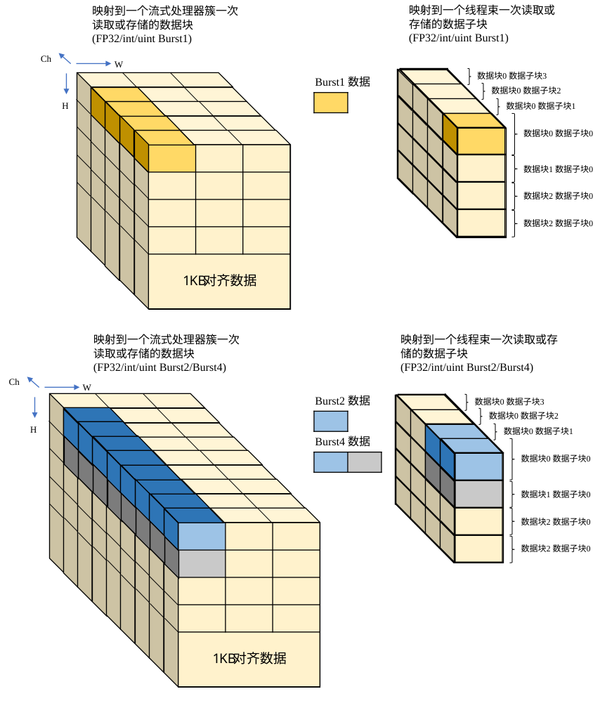</p><p align="center">图 5‑6 BIRENSUPA FP32/int/uint 数据类型 Activation 张量 Burst 模式</p>

下图介绍了 BF16，S16，S8，U8 数据类型的 Activation 张量的 Burst 模式。

<p align="center">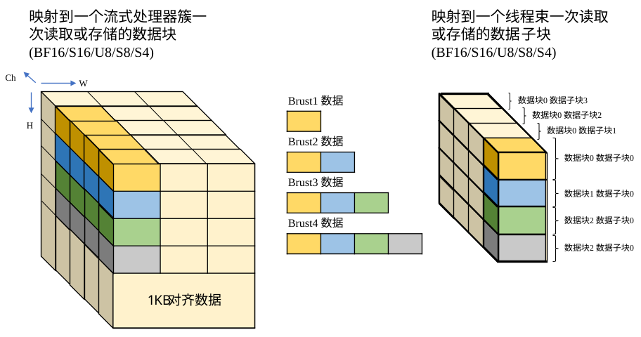</p><p align="center">图 5‑7 BIRENSUPA 非 FP32/int 数据类型 Activation 张量 Burst 模式</p>

#### ConvWeights/ConvWeight Burst 模式

以下是 ConvWeights/ConvWeight 张量从（0，0，0，0，0）加载或存储数据时，线程 0 的线程本地寄存器所对应的数据坐标示例（张量数据类型和线程本地寄存器获得数据类型相同时）。

| (KC_OUT, KC_IN, Weight(H, W))                                | Get/Set<br />数据数量 1 | Get2/Set2<br />数据数量 2                    | Get3/Set3<br />数据数量 3                                                      | Get4/Set4<br />数据数量 4                                                                                        | Get8/Set8<br />数据数量 8                                                                                                                                          | Get16/Set16<br />数据数量 16                                                                                                                                                                                                                                       |
| ------------------------------------------------------------ | ----------------------- | -------------------------------------------- | ------------------------------------------------------------------------------ | ---------------------------------------------------------------------------------------------------------------- | ------------------------------------------------------------------------------------------------------------------------------------------------------------------ | ------------------------------------------------------------------------------------------------------------------------------------------------------------------------------------------------------------------------------------------------------------------ |
| S4（尚未支持）<br />数据块 8 \* 128 \* 1<br />数据子块 2 \* 128 \* 1 | N/A                     | N/A                                          | N/A                                                                            | N/A                                                                                                              | (0, 0, w0), (0, 1, w0), (0, 2, w0), (0, 3, w0),<br />(1, 0, w0), (1, 1, w0), (1, 2, w0), (1, 3, w0)                                                                | (0, 0, w0), (0, 1, w0), (0, 2, w0), (0, 3, w0),<br />(1, 0, w0), (1, 1, w0), (1, 2, w0), (1, 3, w0),<br />//+512 字节<br />(0, 0, w1), (0, 1, w1), (0, 2, w1), (0, 3, w1),<br />(1, 0, w1), (1, 1, w1), (1, 2, w1), (1, 3, w1)                                     |
| S8<br />数据块 8 \* 64 \* 1<br />数据子块 2 \* 64 \* 1               | N/A                     | N/A                                          | N/A                                                                            | (0, 0, w0), (0, 1, w0), (1, 0, w0), (1, 1, w0)                                                                   | (0, 0, w0), (0, 1, w0), (1, 0, w0), (1, 1, w0),<br />//+512 字节<br />(0, 0, w1), (0, 1, w1), (1, 0, w1), (1, 1, w1)                                               | (0, 0, w0), (0, 1, w0), (1, 0, w0), (1, 1, w0),<br />//+512 字节<br />(0, 0, w1), (0, 1, w1), (1, 0, w1), (1, 1, w1),<br />//+1024 字节<br />(0, 0, w2), (0, 1, w2), (1, 0, w2), (1, 1, w2),<br />//+1536 字节<br />(0, 0, w3), (0, 1, w3), (1, 0, w3), (1, 1, w3) |
| BF16<br />数据块 8 \* 32 \* 1<br />数据子块 2 \* 32 \* 1             | N/A                     | (0, 0, w0), (1, 0, w0)                       | N/A                                                                            | (0, 0, w0), (1, 0, w0),<br />//+512 字节<br />(0, 0, w1), (1, 0, w1)                                             | (0, 0, w0), (1, 0, w0),<br />//+512 字节<br />(0, 0, w1), (1, 0, w1),<br />//+1024 字节<br />(0, 0, w2), (1, 0, w2),<br />//+1536 字节<br />(0, 0, w3), (1, 0, w3) | N/A                                                                                                                                                                                                                                                                |
| FP32/int/uint<br />数据块 4 \* 32 \* 1<br />数据子块 1 \* 32 \* 1    | (0, 0, w0)              | (0, 0, w0),<br />//+128 字节<br />(1, 0, w0) | (0, 0, w0),<br />//+128 字节<br />(1, 0, w0),<br />//+512 字节<br />(0, 0, w1) | (0, 0, w0),<br />//+128 字节<br />(1, 0, w0),<br />//+512 字节<br />(0, 0, w1),<br />//+640 字节<br />(1, 0, w1) | N/A                                                                                                                                                                | N/A                                                                                                                                                                                                                                                                |

#### Vectors/Vector Burst 模式

以下是 Vectors/Vector 张量从 nv = 0，n = 0 加载或存储数据时，线程 0 的线程本地寄存器所对应的数据坐标示例（张量数据类型和线程本地寄存器获得数据类型相同时）。

| (N)                              | Get/Set<br />数据数量 1 | Get2/Set2<br />数据数量 2       | Get3/Set3<br />数据数量 3                                   | Get4/Set4<br />数据数量 4                                                               | Get8/Set8<br />数据数量 8                                                                                          | Get16/Set16<br />数据数量 16                                                                                                                                             |
| -------------------------------- | ----------------------- | ------------------------------- | ----------------------------------------------------------- | --------------------------------------------------------------------------------------- | ------------------------------------------------------------------------------------------------------------------ | ------------------------------------------------------------------------------------------------------------------------------------------------------------------------ |
| S4（尚未支持）<br />数据子块 256 | N/A                     | N/A                             | N/A                                                         | N/A                                                                                     | (0), (1), (2), … (7)                                                                                               | (0), (1), (2), … (7),<br />//+128 字节<br />(256), (257), (258), … (263)                                                                                                 |
| S8/U8<br />数据子块 128          | N/A                     | N/A                             | N/A                                                         | (0), (1), (2), (3)                                                                      | (0), (1), (2), (3),<br />//+128 字节<br />(128), (129), (130), (131)                                               | (0), (1), (2), (3),<br />//+128 字节<br />(128), (129), (130), (131),<br />//+256 字节<br />(256), (257), (258), (259),<br />//+384 字节<br />(384), (385), (386), (387) |
| BF16<br />数据子块 64            | N/A                     | (0), (1)                        | N/A                                                         | (0), (1),<br />//+128 字节<br />(64), (65)                                              | (0), (1),<br />//+128 字节<br />(64), (65),<br />//+256 字节<br />(128), (129),<br />//+384 字节<br />(192), (193) | N/A                                                                                                                                                                      |
| FP32/int/uint<br />数据子块 32   | (0)                     | (0),<br />//+128 字节<br />(32) | (0),<br />//+128 字节<br />(32),<br />//+256 字节<br />(64) | (0),<br />//+128 字节<br />(32),<br />//+256 字节<br />(64),<br />//+384 字节<br />(96) | N/A                                                                                                                | N/A                                                                                                                                                                      |

<div style="page-break-after:always"></div>

## 张量数据类型接口

### 获取成员变量

```cpp
__host__ __device__ static constexpr suMemArchType getMemType();
```

在主机端和设备端获取一个张量的储存模式。该接口的返回值会在编译时进行计算。所有张量类型都包含此 API。

```cpp
__host__ uint getNumRegions();
```

在主机端获取张量类型中完整数据被分片的数量。所有张量类型都包含此 API。

- UMA 张量始终返回 1；

- NUMA 张量会返回启动内核时配置的流式处理器簇数量；

- UMA4 张量会返回启动内核时配置的流式处理器簇数量的四分之一。

```cpp
__host__ size_t getBufferPitchSize();
```

在主机端以字节为单位获取张量类型完整数据分片的实际缓冲区大小。所有张量类型都包含此 API。

```cpp
__host__ size_t getBufferSize();
```

在主机端以字节为单位获取张量类型完整在壁仞通用 GPU 硬件的实际缓冲区大小。所有张量类型都包含此 API。

```cpp
__host__ E *getLocalBuffer();
__host__ E *getLocalBuffer(uint _regionNum);
```

在主机端获取张量的主机端指针。该 API 可通过添加张量分片序号来获取指定分片的主机端指针。返回数据类型 E 始终与张量数据类型保持一致。所有张量类型都包含此 API。

```cpp
__host__ E *getDeviceBuffer();
```

在主机端获取张量的设备端指针。返回数据类型 E 始终与张量数据类型保持一致。所有张量类型都包含此 API。

### 内存大小与元素数量

```cpp
__host__ __device__ static constexpr size_t elementSize();
```

在主机端或设备端调用，获取静态维度张量类型（根据 BIRENSUPA 张量分布）扩展之后的实际元素数量。该接口的返回值会在编译时进行计算。所有静态维度张量类型都包含此 API。

- NUMA/UMA4 储存类型的张量只考虑单个分片的元素数量（根据输入的维度信息参数）。

```cpp
__host__ __device__ size_t elementSize();
```

在主机端或设备端调用，获取动态维度张量类型（根据 BIRENSUPA 张量分布）扩展之后的实际元素数量。所有动态维度张量类型都包含此 API。

- NUMA/UMA4 储存类型的张量只考虑单个分片的元素数量（根据输入的维度信息参数）。

```cpp
// DynActivation 专用
__host__ __device__ static size_t elementSize(ushort _N, ushort _C,
ushort _H, ushort _W);

// DynByteObject 专用
__host__ __device__ static size_t elementSize(size_t _N);

// DynConvWeights 专用
__host__ __device__ static size_t elementSize(ushort _N, ushort _KC_OUT,
ushort _KC_IN, ushort _H,
ushort _W);

// DynConvWeight 专用
__host__ __device__ static size_t elementSize(ushort _KC_OUT, ushort _KC_IN,
ushort _H, ushort _W);

// DynVectors 专用
__host__ __device__ static size_t elementSize(ushort _NV, ushort _N);

// DynVector 专用
__host__ __device__ static size_t elementSize(ushort _N);

// DynDepthWiseConvWeight 专用
__host__ __device__ static size_t elementSize(ushort _KC, ushort _H,
ushort _W);
```

在主机端或设备端调用，获取动态维度张量类型（根据 BIRENSUPA 张量分布）扩展之后的实际元素数量。该 API 需要输入动态维度张量类型的维度信息作为参数。所有动态维度张量类型都包含此 API。

- NUMA/UMA4 储存类型的张量只考虑单个分片的元素数量（根据输入的维度信息参数）。

```cpp
__host__ __device__ static constexpr size_t size();
```

在主机端或设备端调用，获取静态维度张量类型（根据 BIRENSUPA 张量分布）扩展之后的实际以字节为单位的内存大小。该接口的返回值会在编译时进行计算。所有静态维度张量类型都包含此 API。

- NUMA/UMA4 储存类型的张量只考虑单个分片的数据内存大小（根据输入的维度信息参数）。

```cpp
__host__ __device__ size_t size();
```

在主机端或设备端调用，获取动态维度张量类型（根据 BIRENSUPA 张量分布）扩展之后的实际以字节为单位的内存大小。所有动态维度张量类型都包含此 API。

- NUMA/UMA4 储存类型的张量只考虑单个分片的数据内存大小（根据输入的维度信息参数）。

```cpp
// DynActivation 专用
__host__ __device__ static size_t size(ushort _N, ushort _C, ushort _H, ushort _W);

// DynByteObject 专用
__host__ __device__ static size_t size(size_t _N);

// DynConvWeights 专用
__host__ __device__ static size_t
size(ushort _N, ushort _KC_OUT, ushort _KC_IN, ushort _H, ushort _W);

// DynConvWeight 专用
__host__ __device__ static size_t size(ushort _KC_OUT, ushort _KC_IN, ushort _H,
ushort _W);

// DynVectors 专用
__host__ __device__ static size_t size(ushort _NV, ushort _N);

// DynVector 专用
__host__ __device__ static size_t size(ushort _N);

// DynDepthWiseConvWeight 专用
__host__ __device__ static size_t size(ushort _KC, ushort _H, ushort _W);
```

在主机端或设备端调用，获取动态维度张量类型（根据 BIRENSUPA 张量分布）扩展之后的实际以字节为单位的内存大小。该 API 需要输入动态维度张量类型的维度信息作为参数。所有动态维度张量类型都包含此 API。

- NUMA/UMA4 储存类型的张量只考虑单个分片的数据内存大小（根据输入的维度信息参数）。

### 获取张量大块对齐尺寸

```cpp
__host__ size_t getTensorChunkSize();
```

在主机端获取不同的张量类型的区块大小，以进行张量非管理模式显存分配对齐或张量缓冲区配置确认。所有张量类型都包含此 API。

- Col-Major 与 Row-Major Matrix 张量：2048 Bytes 对齐
- ConvWeight，Vector，ByteObject 张量：512 Bytes 对齐
- Activation 张量：1024 Bytes 对齐

### 张量绑定

张量绑定需要遵循以下规则：

- 如果张量直接作为核函数参数会自动绑定，可以不用此 API 进行绑定。

- 如果指针、结构体或类作为核函数参数中存在张量，此张量需要使用此 API 进行绑定。

- 最多 256 个张量可以被绑定。

- 所有绑定只在下一次核函数启动时生效，核函数启动时会清空所有绑定。

- 所有绑定仅对当前 CPU 线程可见，且与当前设备无关。

```cpp
__host__ __attribute__((used)) suError_t bind();
```

用于在核函数启动前对张量进行绑定。如果张量已经被绑定，则不生效。

```cpp
__host__ __attribute__((used)) suError_t forceBind();
```

用于在核函数启动前对张量进行强行绑定。如果张量进行过绑定，此 API 依然会从新进行绑定。

### 导入或导出原始数据

BIRENSUPA 张量使用了特殊的内存数据分布。当需要在主机端初始化张量数据类型时，可以使用 copyFromRawData API 把原始数据转换成 BIRENSUPA 张量需要的分布并导入张量数据结构；也可以通过 copyToRawData API 将 BIRENSUPA 张量内的数据导出并转换成原始数据的分布。

- [suDataFormat](#birensupa-原始数据类型) 用于定义原始数据的分布。

下表列举了不同张量数据类型允许使用的原始数据分布类型。

| 张量分布                                            | suBlockLinear | suDenseRowMajor | suDenseColMajor |
| --------------------------------------------------- | ------------- | --------------- | --------------- |
| Activation/DynActivation                            | 允许          | 允许            |                 |
| Matrix/DynMatrix Matrix3D/DynMatrix3D               | 允许          | 允许            | 允许            |
| ConvWeights/DynConvWeights ConvWeight/DynConvWeight | 允许          | 允许            |                 |
| Vector/DynVector Vectors/DynVectors                 | 允许          | 允许            |                 |
| DepthWiseConvWeight/ DynDepthWiseConvWeight         | 允许          | 允许            |                 |
| ByteObject/DynByteObject                            | 允许          | 允许            | 允许            |

```cpp
__host__ suError_t copyFromRawData(suDataFormat format, E *_p);
```

在主机端将原始数据导入张量数据结构。

除 ByteObject/DynByteObject 以外的张量数据结构支持此 API。

```cpp
__host__ suError_t copyFromRawData(suDataFormat format, S8 *_p);
```

在主机端将原始数据导入张量数据结构。

ByteObject/DynByteObject 张量数据结构只支持 S8 数据类型，因此该 API 仅支持以上张量数据类型。

```cpp
__host__ suError_t copyToRawData(suDataFormat format, E *_p);
```

在主机端将张量数据结构的数据导出为原始数据。

除 ByteObject/DynByteObject 以外的张量数据结构支持此 API。

```cpp
__host__ suError_t copyToRawData(suDataFormat format, S8 *_p);
```

在主机端将张量数据结构的数据导出为原始数据。

ByteObject/DynByteObject 张量数据结构只支持 S8 数据类型，因此该 API 仅支持以上张量数据类型。

<table><tr><td bgcolor=#ffeccc><b>注意：</b>压缩张量因为仅在推理时作为权重使用，故不支持导出数据，您无法对压缩张量使用 <code>copyToRawData()</code> 函数。</td></tr></table>

### 主机端与设备端的数据传递

BIRENSUPA 张量提供了明确的 moveToDevice 和 moveToHost 成员函数来管理数据的传递。这等同于使用 suMemcpy/suMemcpyAsync API 来进行张量的主机端指针与设备端指针之间的数据传递。

```cpp
__host__ suError_t moveToDevice();
```

在主机端将张量在主机端的数据传递到设备端。所有<b>非压缩</b>张量类型都包含此 API。

```cpp
__host__ suError_t moveToDeviceAsync(suStream_t stream);
```

在主机端将张量在主机端的数据异步地传递到设备端。所有<b>非压缩</b>张量类型都包含此 API。

```cpp
__host__ suError_t moveToHost();
```

在主机端将张量在设备端的数据传递到主机端。所有<b>非压缩</b>张量类型都包含此 API。

```cpp
__host__ suError_t moveToHostAsync(suStream_t stream);
```

在主机端将张量在设备端的数据异步地传递到主机端。所有<b>非压缩</b>>张量类型都包含此 API。

```cpp
__host__ suError_t compressToDevice();
```

在主机端将张量在主机端的数据压缩、重新排列并传递到设备端。**仅压缩张量类型包含此 API**。仅当壁仞通用 GPU 硬件设计版本等于 1.1 时支持。

### 赋零

```cpp
__host__ suError_t setZero();
```

在主机端将张量在主机端指针和设备端指针同时进行赋零操作。所有张量类型都包含此 API。

### 通过坐标写入或读取数据

因为张量数据类型使用了特殊的数据分布，为了在主机端方便使用，BIRENSUPA 提供了主机端使用坐标作为参数的写入和读取函数。

```cpp
// Activation/DynActivation 专用
__host__ E get(short n, short c, short h, short w, uint regionNum = 0);
__host__ E get(Coordinate coord, uint regionNum = 0);

// ByteObject/DynByteObject 专用
__host__ S8 get(int n, uint regionNum = 0);

// ConvWeights/DynConvWeights 专用
__host__ E get(short n, short out_ch, short in_ch, short h, short w,
uint regionNum = 0);

// ConvWeight/DynConvWeight 专用
__host__ E get(short out_ch, short in_ch, short h, short w,
uint regionNum = 0);

// ConvWeights/ConvWeight/DynConvWeight/DynConvWeight 专用
__host__ E get(CoordinateConvWeight coord, uint regionNum = 0);

// Matrix3D/DynMatrix3D 专用
__host__ E get(short n, short h, short w, uint regionNum = 0);
__host__ E get(Coordinate3D coord, uint regionNum = 0);

// Matrix/DynMatrix 专用
__host__ E get(short h, short w, uint regionNum = 0);
__host__ E get(Coordinate2D coord, uint regionNum = 0);

// Vectors/DynVectors 专用
__host__ E get(ushort nv, ushort n, uint regionNum = 0);

// Vector/DynVector 专用
__host__ E get(ushort n, uint regionNum = 0);

// DepthWiseConvWeight/DynDepthWiseConvWeight 专用
__host__ E get(ushort kc, ushort h, ushort w, uint regionNum = 0);
__host__ E get(CoordinateDWCWeight coord, uint regionNum = 0);
```

在主机端通过输入维度信息或者坐标及数据分片序号获取张量数据。所有张量类型都包含此 API。

```cpp
// Activation/DynActivation 专用
__host__ void set(short n, short c, short h, short w, E v);
__host__ void set(short n, short c, short h, short w, uint regionNum, E v);
__host__ void set(Coordinate coord, E v);
__host__ void set(Coordinate coord, uint regionNum, E v);

// ByteObject/DynByteObject 专用
__host__ void set(int n, S8 v);
__host__ void set(int n, uint regionNum, S8 v);

// ConvWeights/DynConvWeights 专用
__host__ void set(short n, short out_ch, short in_ch, short h, short w,
E v);
__host__ void set(short n, short out_ch, short in_ch, short h, short w,
uint regionNum, E v);

// ConvWeight/DynConvWeight 专用
__host__ void set(short out_ch, short in_ch, short h, short w, E v);
__host__ void set(short out_ch, short in_ch, short h, short w,
uint regionNum, E v);

// ConvWeights/ConvWeight/DynConvWeights/DynConvWeight 专用
__host__ void set(CoordinateConvWeight coord, E v);
__host__ void set(CoordinateConvWeight coord, uint regionNum, E v);

// Matrix3D/DynMatrix3D 专用
__host__ void set(short n, short h, short w, E v);
__host__ void set(short n, short h, short w, uint regionNum, E v);
__host__ void set(Coordinate3D coord, E v);
__host__ void set(Coordinate3D coord, uint regionNum, E v);

// Matrix/DynMatrix 专用
__host__ void set(short h, short w, E v);
__host__ void set(short h, short w, uint regionNum, E v);
__host__ void set(Coordinate2D coord, E v);
__host__ void set(Coordinate2D coord, uint regionNum, E v);

// Vectors/DynVectors 专用
__host__ void set(ushort nv, ushort n, E v);
__host__ void set(ushort nv, ushort n, uint regionNum, E v);

// Vector/DynVector 专用
__host__ void set(ushort n, E v);
__host__ void set(ushort n, uint regionNum, E v);

// DepthWiseConvWeight/DynDepthWiseConvWeight 专用
__host__ void set(ushort kc, ushort h, ushort w, E v);
__host__ void set(ushort kc, ushort h, ushort w, uint regionNum, E v);
__host__ void set(CoordinateDWCWeight coord, E v);
__host__ void set(CoordinateDWCWeight coord, uint regionNum, E v);
```

在主机端通过输入维度信息或者坐标及数据分片序号设置张量数据。所有张量类型都包含此 API。

### 配置张量缓冲区映射

```cpp
__host__ suError_t configTensorBuffer(uint32_t tensorBufferBaseAddr,
                                      uint32_t configSize);
```

在主机端为当前张量配置张量缓冲区。该接口通过以字节为单位的地址和数据大小进行配置。所有张量类型都包含此 API。仅支持从张量的起始位置配置缓冲区。

张量缓冲区是一个共享的资源空间。如果多个张量同时被配置到相同的地方，这些张量可能会被同时使用。因为多个线程或程序会独立地访问，所以流式处理器簇内的不同线程、流或程序的交织访问可能造成数据错误。

- tensorBufferBaseAddr: 以字节为单位的**张量缓冲区的基地址**，并非为张量中的张量缓冲区的基地址。

- configSize:需要被配置进张量缓冲区的数据，以字节为单位。

返回映射是否成功，如果返回失败，张量缓冲区不会被映射。

<p align="center">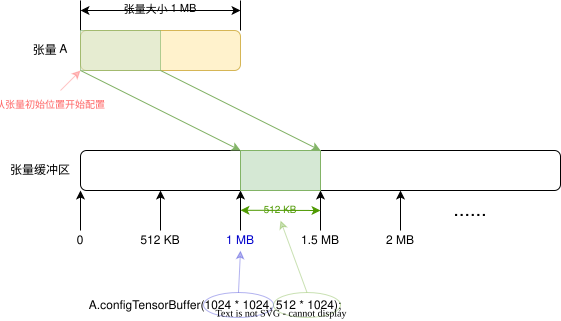</p><p align="center">图 6-1 配置张量缓冲区示例</p>

<table><tr><td bgcolor=#ffeccc><b>注意：</b>根据壁仞通用 GPU 硬件设计版本 1.0 要求，您无法自定义设置张量缓冲区在张量中的起始位置；您所配置的张量缓冲区仅能从张量的起始位置开始，占据连续的部分或全部区域。</td></tr></table>

此 API 需要遵从以下原则：

- 原则 1：tensorBufferBaseAddr 和 configSize 需要 512 字节对齐；
- 原则 2：tensorBufferBaseAddr < 4M;
- 原则 3：tensorBufferBaseAddr + configSize < 4M。
- 原则 4：如果需要配置张量局部进入张量缓冲区，配置的 `configSize` 需要满足额外的对齐要求（可以使用 [getTensorChunkSize](#获取张量缓冲区大块对齐尺寸) API 获取）：
  - Col-Major 与 Row-Major Matrix 张量：2048 Bytes 对齐
  - ConvWeight，Vector，ByteObject 张量：512 Bytes 对齐
  - Activation 张量：1024 Bytes 对齐

注意：如果为了使用卷积运算的 Activation 张量而配置张量缓冲区时，且其 对应的权重长或宽大于 1 时（KH > 1 或 KW > 1），需要将一块额外的内存被配置进张量缓冲区。这种情况下，需要把 Activation 张量完整地配置进张量缓冲区，且额外配置需要的空间。所需遵从的法则如下：

- KH > 1 || KW > 1：在右侧额外配置 `((H + 7) >> 3) * 1` 个 8 \* 8 的数据块，并在最后额外配置一个 8 \* 8 的数据块，一共 `((H + 7) >> 3) * 1 + 1` 个 1KB 的 8x8 block。

对于不同内存类型，配置张量缓冲区后张量的 HBM 内存和张量缓冲区之间的映射关系也稍有不同。下图以 Uma 张量和 Numa 张量为例展示了配置张量缓冲区的差异：

<p align="center">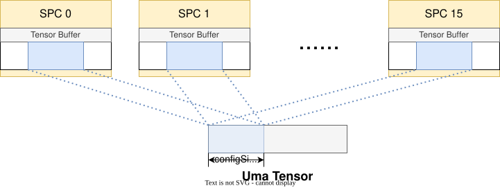</p><p align="center">图 6-2 UMA 张量配置张量缓冲区内存映射示例。同一份内存会被映射到各个 SPC 内的张量缓冲区。</p>

<p align="center">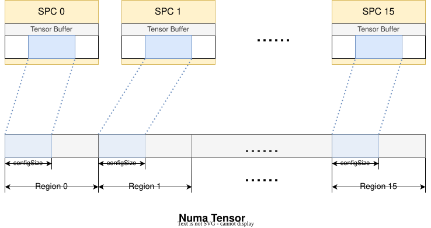</p><p align="center">图 6-3 NUMA 张量配置张量缓冲区内存映射示例。每个内存区域会映射各自的内存到对应 SPC 内的张量缓冲区。</p>

一般情况下，在核函数内对配置了张量缓冲区的张量的读写会直接对张量缓冲区进行操作，而不会影响其对应的内存空间，下面两种情况除外：

- 使用接口 `wti::__preload_tensor_buffer()` 可以将数据从内存加载到对应的张量缓冲区中。

- 部分对张量存储的接口可以通过配置模板参数 `PAD_WRITE_THROUGH::WRITE_THROUGH` 达到同时在内存和张量缓冲区中存储数据的目的。

另外，所有直接在张量上进行累加的操作均无法作用于配置了张量缓冲区的张量（例如 `wti::__warp_reduce_add()`、`tci::__mma_reduce_add()` 等），因为张量累加需要在 L2 缓存上进行，而对张量缓冲区的存储操作并不会经过 L2 缓存。

注意：如果为了使用卷积运算的 Activation 张量而配置张量缓冲区时，且其对应的权重长或宽大于 1 时（KH > 1 或 KW > 1），需要将一块额外的内存配置进张量缓冲区。这种情况下，需要把 Activation 张量完整地配置进张量缓冲区，且额外配置需要的空间。所需遵从的法则如下：

- KH > 1 || KW > 1：在右侧额外配置 `((H + 7) >> 3) * 1` 个 8 \* 8 的数据块，并在最后额外配置一个 8 \* 8 的数据块，一共 `((H + 7) >> 3) * 1 + 1` 个 1KB 的 8x8 block。

<p align="center">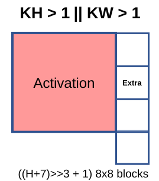</p><p align="center">图 6-4 Activation 张量配置额外缓冲区映射</p>

#### 张量视图

在 BIRENSUPA 设备端，因为不同张量的元数据不同，一个张量不能被视为另一个张量。因此，BIRENSUPA 提供了张量视图功能：两个张量使用相同的设备端指针，在主机端创建两个可以访问相同设备端数据的张量。

- `VIEW_N`：返回张量视图的 `N` 维度
- `start_n`：返回张量视图在原张量中 `N` 维度上的起始位置

BIRENSUPA 张量视图功能支持 `Matrix3D` / `DynMatrix3D`，`ConvWeights` / `DynConvWeights`，`Activation` / `DynActivation` 和 `Vectors` / `DynVectors`张量，同时所有子视图只能在张量样本维度（`Matrix3D` / `DynMatrix3D`，`ConvWeights` / `DynConvWeights` 和 `Activation` / `DynActivation`的 N 维度，`Vectors` / `DynVectors`的 `NV` 维度）拆分。

```cpp
template <typename E, suMemArchType MemType, MatrixLayout Layout, ushort N,
ushort H, ushort W>
class Matrix3D {
  public:
	template <ushort VIEW_N>
	__host__ Matrix3D<E, MemType, Layout, VIEW_N, H, W> view(ushort start_n)
};

template <typename E, suMemArchType MemType, ushort N, ushort C, ushort H,
		ushort W>
class Activation {
  public:
	template <ushort VIEW_N>
	__host__ Activation<E, MemType, VIEW_N, C, H, W> view(ushort start_n)
};

template <typename E, suMemArchType MemType, ushort N, ushort KC_OUT,
ushort KC_IN, ushort H, ushort W>
class ConvWeights {
  public:
	template <ushort VIEW_N>
	__host__ ConvWeights<E, MemType, VIEW_N, KC_OUT, KC_IN, H, W>
	view(ushort start_n)
};

template <typename E, suMemArchType MemType, ushort NV, ushort N>
class Vectors {
  public:
	template <ushort VIEW_NV>
	__host__ Vectors<E, MemType, VIEW_NV, N> view(ushort start_nv)
};
```

在主机端获得 `Matrix3D`，`Activation`，`ConvWeights` 和 `Vectors` 的视图。

```cpp
template <typename E, suMemArchType MemType, MatrixLayout Layout>
class DynMatrix3D {
  public:
	__ host__ DynMatrix3D<E, MemType, Layout> view(ushort VIEW_N,
ushort start_n)
};

template <typename E, suMemArchType MemType>
class DynActivation {
  public:
	_ host__ DynActivation<E, MemType> view(ushort VIEW_N, ushort start_n)
};

template <typename E, suMemArchType MemType>
class DynConvWeights {
  public:
	__ host__ DynConvWeights<E, MemType> view(ushort VIEW_N, ushort start_n)};

template <typename E, suMemArchType MemType>
class DynVectors {
  public:
	__ _host_DynVectors<E, MemType> view(ushort VIEW_NV, ushort start_nv)};
```

在主机端获得 DynMatrix3D，DynActivation，DynConvWeights 和 DynVectors 的视图。

### 张量释放

```cpp
__host__ void tensorFree();
```

在主机端释放张量在主机端和设备端指针，同时禁用张量主机端和设备端指针在主机端的指针自动释放。

### 静态形状的张量

此类张量的数据类型、方法、函数都由编译时已知的维度信息操纵。所有维度信息都由模板参数传入。

- 构造函数不含有指针参数的张量是 BIRENSUPA 管理的张量：BIRENSUPA 会自动处理张量主机端与设备端指针的空间分配、初始化和释放。

- 构造函数含有指针参数的张量是不被 BIRENSUPA 管理的张量：张量主机端与设备端指针需要由用户自行管理。

#### Matrix

```cpp
template <typename E, suMemArchType MemType, MatrixLayout Layout, ushort H,
		ushort W>
class Matrix : public Matrix3D<E, MemType, Layout, 1, H, W> {
  public:
	__host__ __device__ Matrix();

	__host__ Matrix(E *_p, E *_d_p);

	__host__ Matrix(uint _numRegions);

	__host__ Matrix(E *_p, E *_d_p, uint _numRegions,
					size_t _sizePerRegionPitch);

	__device__ static Matrix<E, MemType, Layout, H, W>
	generateTensor(uint64_t uid);
};

template <typename E, MatrixLayout Layout, ushort H, ushort W>
using UmaMatrix = Matrix<E, suMemArchTypeUMA, Layout, H, W>;
template <typename E, MatrixLayout Layout, ushort H, ushort W>
using NumaMatrix = Matrix<E, suMemArchTypeNUMA, Layout, H, W>;
template <typename E, MatrixLayout Layout, ushort H, ushort W>
using Uma4Matrix = Matrix<E, suMemArchTypeUMA4, Layout, H, W>;
template <typename E, MatrixLayout Layout, ushort H, ushort W>
using Uma8Matrix = Matrix<E, suMemArchTypeUMA8, Layout, H, W>;
template <typename E, MatrixLayout Layout, ushort H, ushort W>
using Uma16Matrix = Matrix<E, suMemArchTypeUMA16, Layout, H, W>;
```

一个表达静态 2 维矩阵的张量。

#### Matrix3D

```cpp
template <typename E, suMemArchType MemType, MatrixLayout Layout, ushort N,
		ushort H, ushort W>
class Matrix3D : public MemoryObject<E, MemType> {
  public:
	__host__ __device__ Matrix3D();

	__host__ Matrix3D(E *_p, E *_d_p);

	__host__ Matrix3D(uint _numRegions);

	__host__ Matrix3D(E *_p, E *_d_p, uint _numRegions,
						size_t _sizePerRegionPitch);
	
	template <ushort VIEW_N>
    __host__ Matrix3D<E, MemType, Layout, VIEW_N, H, W>
    view(ushort start_n) const;

	__device__ static Matrix3D<E, MemType, Layout, N, H, W>
	generateTensor(uint64_t uid);
};

template <typename E, MatrixLayout Layout, ushort N, ushort H, ushort W>
using UmaMatrix3D = Matrix3D<E, suMemArchTypeUMA, Layout, N, H, W>;
template <typename E, MatrixLayout Layout, ushort N, ushort H, ushort W>
using NumaMatrix3D = Matrix3D<E, suMemArchTypeNUMA, Layout, N, H, W>;
template <typename E, MatrixLayout Layout, ushort N, ushort H, ushort W>
using Uma4Matrix3D = Matrix3D<E, suMemArchTypeUMA4, Layout, N, H, W>;
template <typename E, MatrixLayout Layout, ushort N, ushort H, ushort W>
using Uma8Matrix3D = Matrix3D<E, suMemArchTypeUMA8, Layout, N, H, W>;
template <typename E, MatrixLayout Layout, ushort N, ushort H, ushort W>
using Uma16Matrix3D = Matrix3D<E, suMemArchTypeUMA16, Layout, N, H, W>;
```

一个表达多个（N）Matrix 的张量。

#### CompressedMatrix

```cpp
template <typename E, suMemArchType MemType, MatrixLayout Layout,
          SPARSITY_MODE Sparsity, ushort H, ushort W>
class CompressedMatrix
    : public CompressedMatrix3D<E, MemType, Layout, Sparsity, 1, H, W> {
  public:
	__host__ CompressedMatrix();

    __host__ CompressedMatrix(E *_p, E *_d_p);

    __device__ static CompressedMatrix<E, MemType, Layout, Sparsity, H, W>
    generateTensor(uint64_t uid);
};

template <typename E, MatrixLayout Layout, SPARSITY_MODE Sparsity, ushort H,
          ushort W>
using UmaCompressedMatrix =
    CompressedMatrix<E, suMemArchTypeUMA, Layout, Sparsity, H, W>;
```

一个表达静态 2 维压缩矩阵的张量。压缩张量仅支持 Uma 类型。*仅当壁仞通用 GPU 硬件设计版本等于 1.1 时支持。*

#### CompressedMatrix3D

```cpp
template <typename E, suMemArchType MemType, MatrixLayout Layout,
          SPARSITY_MODE Sparsity, ushort N, ushort H, ushort W>
class CompressedMatrix3D : public MemoryObject<E, MemType> {
  public:
    __host__ CompressedMatrix3D();

    __host__ CompressedMatrix3D(E *_p, E *_d_p);

    __device__ static CompressedMatrix3D<E, MemType, Layout, Sparsity, N, H, W>
    generateTensor(uint64_t uid);
};

template <typename E, MatrixLayout Layout, SPARSITY_MODE Sparsity, ushort N,
          ushort H, ushort W>
using UmaCompressedMatrix3D =
    CompressedMatrix3D<E, suMemArchTypeUMA, Layout, Sparsity, N, H, W>;
```

一个表达多个（N）CompressedMatrix 的张量。*仅当壁仞通用 GPU 硬件设计版本等于 1.1 时支持。*

#### ConvWeight

```cpp
template <typename E, suMemArchType MemType, ushort KC_OUT, ushort KC_IN,
		ushort H, ushort W>
class ConvWeight : public ConvWeights<E, MemType, 1, KC_OUT, KC_IN, H, W> {
  public:
	__host__ __device__ ConvWeight();

	__host__ ConvWeight(E *_p, E *_d_p);

	__host__ ConvWeight(uint _numRegions);

	__host__ ConvWeight(E *_p, E *_d_p, uint _numRegions,
						size_t _sizePerRegionPitch);

	__device__ static ConvWeight<E, MemType, KC_OUT, KC_IN, H, W>
	generateTensor(uint64_t uid);
};

template <typename E, ushort KC_OUT, ushort KC_IN, ushort H, ushort W>
using UmaConvWeight = ConvWeight<E, suMemArchTypeUMA, KC_OUT, KC_IN, H, W>;
template <typename E, ushort KC_OUT, ushort KC_IN, ushort H, ushort W>
using NumaConvWeight = ConvWeight<E, suMemArchTypeNUMA, KC_OUT, KC_IN, H, W>;
template <typename E, ushort KC_OUT, ushort KC_IN, ushort H, ushort W>
using Uma4ConvWeight = ConvWeight<E, suMemArchTypeUMA4, KC_OUT, KC_IN, H, W>;
template <typename E, ushort KC_OUT, ushort KC_IN, ushort H, ushort W>
using Uma8ConvWeight = ConvWeight<E, suMemArchTypeUMA8, KC_OUT, KC_IN, H, W>;
template <typename E, ushort KC_OUT, ushort KC_IN, ushort H, ushort W>
using Uma16ConvWeight = ConvWeight<E, suMemArchTypeUMA16, KC_OUT, KC_IN, H, W>;
```

一个表达静态卷积权重的张量。

#### ConvWeights

```cpp
template <typename E, suMemArchType MemType, ushort N, ushort KC_OUT,
		ushort KC_IN, ushort H, ushort W>
class ConvWeights : public MemoryObject<E, MemType> {
  public:
	__host__ __device__ ConvWeights();

	__host__ ConvWeights(E *_p, E *_d_p);

	__host__ ConvWeights(uint _numRegions);

	__host__ ConvWeights(E *_p, E *_d_p, uint _numRegions,
							size_t _sizePerRegionPitch);

	template <ushort VIEW_N>
    __host__ ConvWeights<E, MemType, VIEW_N, KC_OUT, KC_IN, H, W>
    view(ushort start_n) const;

	__device__ static ConvWeights<E, MemType, N, KC_OUT, KC_IN, H, W>
	generateTensor(uint64_t uid);
};

template <typename E, ushort N, ushort KC_OUT, ushort KC_IN, ushort H, ushort W>
using UmaConvWeights = ConvWeights<E, suMemArchTypeUMA, N, KC_OUT, KC_IN, H, W>;
template <typename E, ushort N, ushort KC_OUT, ushort KC_IN, ushort H, ushort W>
using NumaConvWeights =
ConvWeights<E, suMemArchTypeNUMA, N, KC_OUT, KC_IN, H, W>;
template <typename E, ushort N, ushort KC_OUT, ushort KC_IN, ushort H, ushort W>
using Uma4ConvWeights =
ConvWeights<E, suMemArchTypeUMA4, N, KC_OUT, KC_IN, H, W>;
template <typename E, ushort N, ushort KC_OUT, ushort KC_IN, ushort H, ushort W>
using Uma8ConvWeights =
ConvWeights<E, suMemArchTypeUMA8, N, KC_OUT, KC_IN, H, W>;
template <typename E, ushort N, ushort KC_OUT, ushort KC_IN, ushort H, ushort W>
using Uma16ConvWeights =
ConvWeights<E, suMemArchTypeUMA16, N, KC_OUT, KC_IN, H, W>;
```

一个表达多个（N）ConvWeight 的张量。

#### CompressedConvWeight

```cpp
template <typename E, suMemArchType MemType, SPARSITY_MODE Sparsity,
          ushort KC_OUT, ushort KC_IN, ushort H, ushort W>
class CompressedConvWeight
    : public CompressedConvWeights<E, MemType, Sparsity, 1, KC_OUT, KC_IN, H,
                                   W> {
  public:
    __host__ CompressedConvWeight();

    __host__ CompressedConvWeight(E *_p, E *_d_p);

    __device__ static CompressedConvWeight<E, MemType, Sparsity, KC_OUT, KC_IN,
                                           H, W>
    generateTensor(uint64_t uid);
};

template <typename E, SPARSITY_MODE Sparsity, ushort KC_OUT, ushort KC_IN,
          ushort H, ushort W>
using UmaCompressedConvWeight =
    CompressedConvWeight<E, suMemArchTypeUMA, Sparsity, KC_OUT, KC_IN, H, W>;
```

一个表达静态压缩卷积权重的张量。压缩张量仅支持 Uma 类型。*仅当壁仞通用 GPU 硬件设计版本等于 1.1 时支持。*

#### CompressedConvWeights

```cpp
template <typename E, suMemArchType MemType, SPARSITY_MODE Sparsity, ushort N,
          ushort KC_OUT, ushort KC_IN, ushort H, ushort W>
class CompressedConvWeights : public MemoryObject<E, MemType> {
  public:
    __host__ CompressedConvWeights();

    __host__ CompressedConvWeights(E *_p, E *_d_p);

    __device__ static CompressedConvWeights<E, MemType, Sparsity, N, KC_OUT,
                                            KC_IN, H, W>
    generateTensor(uint64_t uid);
};

template <typename E, SPARSITY_MODE Sparsity, ushort N, ushort KC_OUT,
          ushort KC_IN, ushort H, ushort W>
using UmaCompressedConvWeights =
    CompressedConvWeights<E, suMemArchTypeUMA, Sparsity, N, KC_OUT, KC_IN, H,
                          W>;
```

一个表达多个（N）CompressedConvWeight 的张量。*仅当壁仞通用 GPU 硬件设计版本等于 1.1 时支持。*

#### Activation

```cpp
template <typename E, suMemArchType MemType, ushort N, ushort C, ushort H,
		ushort W>
class Activation : public MemoryObject<E, MemType> {
  public:
	__host__ __device__ Activation();

	__host__ Activation(E *_p, E *_d_p);

	__host__ Activation(uint _numRegions);

	__host__ Activation(E *_p, E *_d_p, uint _numRegions,
						size_t _sizePerRegionPitch);

	template <ushort VIEW_N>
    __host__ Activation<E, MemType, VIEW_N, C, H, W>
    view(ushort start_n) const;

	__device__ static Activation<E, MemType, N, C, H, W>
	generateTensor(uint64_t uid);
};

template <typename E, ushort N, ushort C, ushort H, ushort W>
using UmaActivation = Activation<E, suMemArchTypeUMA, N, C, H, W>;
template <typename E, ushort N, ushort C, ushort H, ushort W>
using NumaActivation = Activation<E, suMemArchTypeNUMA, N, C, H, W>;
template <typename E, ushort N, ushort C, ushort H, ushort W>
using Uma4Activation = Activation<E, suMemArchTypeUMA4, N, C, H, W>;
template <typename E, ushort N, ushort C, ushort H, ushort W>
using Uma8Activation = Activation<E, suMemArchTypeUMA8, N, C, H, W>;
template <typename E, ushort N, ushort C, ushort H, ushort W>
using Uma16Activation = Activation<E, suMemArchTypeUMA16, N, C, H, W>;
```

一个表达静态卷积激活的张量。

#### Vector

```cpp
template <typename E, suMemArchType MemType, ushort N>
class Vector : public Vectors<E, MemType, 1, N> {
  public:
	__host__ __device__ Vector();

	__host__ Vector(E *_p, E *_d_p);

	__host__ Vector(uint _numRegions);

	__host__ Vector(E *_p, E *_d_p, uint _numRegions,
						size_t _sizePerRegionPitch);

	__device__ static Vector<E, MemType, N> generateTensor(uint64_t uid);
};

template <typename E, ushort N>
using UmaVector = Vector<E, suMemArchTypeUMA, N>;
template <typename E, ushort N>
using NumaVector = Vector<E, suMemArchTypeNUMA, N>;
template <typename E, ushort N>
using Uma4Vector = Vector<E, suMemArchTypeUMA4, N>;
template <typename E, ushort N>
using Uma8Vector = Vector<E, suMemArchTypeUMA8, N>;
template <typename E, ushort N>
using Uma16Vector = Vector<E, suMemArchTypeUMA16, N>;
```

一个表达静态一维向量的张量。

#### Vectors

```cpp
template <typename E, suMemArchType MemType, ushort NV, ushort N>
class Vectors : public MemoryObject<E, MemType> {
  public:
	__host__ __device__ Vectors();

	__host__ Vectors(E *_p, E *_d_p);

	__host__ Vectors(uint _numRegions);

	__host__ Vectors(E *_p, E *_d_p, uint _numRegions,
						size_t _sizePerRegionPitch);

	template <ushort VIEW_NV>
    __host__ Vectors<E, MemType, VIEW_NV, N> view(ushort start_nv) const;

	__device__ static Vectors<E, MemType, NV, N> generateTensor(uint64_t uid);
};

template <typename E, ushort NV, ushort N>
using UmaVectors = Vectors<E, suMemArchTypeUMA, NV, N>;
template <typename E, ushort NV, ushort N>
using NumaVectors = Vectors<E, suMemArchTypeNUMA, NV, N>;
template <typename E, ushort NV, ushort N>
using Uma4Vectors = Vectors<E, suMemArchTypeUMA4, NV, N>;
template <typename E, ushort NV, ushort N>
using Uma8Vectors = Vectors<E, suMemArchTypeUMA8, NV, N>;
```

一个表达多个（N）Vector 的张量。

#### DepthWiseConvWeight

```cpp
template <typename E, suMemArchType MemType,
		wti::LOAD_DWC_WEIGHT_BROADCAST_MODE BROADCAST_MODE, ushort KC,
		ushort H, ushort W>
class DepthWiseConvWeight : public Vectors<E, MemType,
    (getDepthWiseConvWeightChannelAlignment<E, BROADCAST_MODE>(KC) * H * W +
     8191) / 8192,
    getDepthWiseConvWeightChannelAlignment<E, BROADCAST_MODE>(KC) *
        H * W < 8192 ? getDepthWiseConvWeightChannelAlignment<E, BROADCAST_MODE>(
                        KC) * H * W
                  	 : 8192> {
	public:
		__host__ __device__ DepthWiseConvWeight();

		__host__ DepthWiseConvWeight(E *_p, E *_d_p);

		__host__ DepthWiseConvWeight(uint _numRegions);

		__host__ DepthWiseConvWeight(E *_p, E *_d_p, uint _numRegions,
		size_t _sizePerRegionPitch);

		__device__ static DepthWiseConvWeight<E, MemType, BROADCAST_MODE, KC, H, W>
		generateTensor(uint64_t uid);
};

template <typename E, wti::LOAD_DWC_WEIGHT_BROADCAST_MODE BROADCAST_MODE,
ushort KC, ushort H, ushort W>
using UmaDepthWiseConvWeight =
DepthWiseConvWeight<E, suMemArchTypeUMA, BROADCAST_MODE, KC, H, W>;
template <typename E, wti::LOAD_DWC_WEIGHT_BROADCAST_MODE BROADCAST_MODE,
ushort KC, ushort H, ushort W>
using NumaDepthWiseConvWeight =
DepthWiseConvWeight<E, suMemArchTypeNUMA, BROADCAST_MODE, KC, H, W>;
template <typename E, wti::LOAD_DWC_WEIGHT_BROADCAST_MODE BROADCAST_MODE,
ushort KC, ushort H, ushort W>
using Uma4DepthWiseConvWeight =
DepthWiseConvWeight<E, suMemArchTypeUMA4, BROADCAST_MODE, KC, H, W>;
template <typename E, wti::LOAD_DWC_WEIGHT_BROADCAST_MODE BROADCAST_MODE,
ushort KC, ushort H, ushort W>
using Uma8DepthWiseConvWeight =
DepthWiseConvWeight<E, suMemArchTypeUMA8, BROADCAST_MODE, KC, H, W>;
template <typename E, wti::LOAD_DWC_WEIGHT_BROADCAST_MODE BROADCAST_MODE,
ushort KC, ushort H, ushort W>
using Uma16DepthWiseConvWeight =
DepthWiseConvWeight<E, suMemArchTypeUMA16, BROADCAST_MODE, KC, H, W>;
```

一个表达静态逐通道卷积权重的张量。

#### ByteObject

```cpp
template <suMemArchType MemType, uint N>
class ByteObject : public MemoryObject<S8, MemType> {
  public:
	__host__ __device__ ByteObject();

	__host__ ByteObject(S8 *_p, S8 *_d_p);

	__host__ ByteObject(uint _numRegions);

	__host__ ByteObject(S8 *_p, S8 *_d_p, uint _numRegions,
					size_t _sizePerRegionPitch);

	template <typename _E>
	__host__ ByteObject(MemoryObject<_E, MemType> &t);

	__device__ static ByteObject<MemType, N> generateTensor(uint64_t uid);
};

template <uint N> using UmaByteObject = ByteObject<suMemArchTypeUMA, N>;
template <uint N> using NumaByteObject = ByteObject<suMemArchTypeNUMA, N>;
template <uint N> using Uma4ByteObject = ByteObject<suMemArchTypeUMA4, N>;
template <uint N> using Uma8ByteObject = ByteObject<suMemArchTypeUMA8, N>;
template <uint N> using Uma16ByteObject = ByteObject<suMemArchTypeUMA16, N>;
```

表达静态字节缓冲区。静态字节缓冲区张量可以直接通过其他张量类型来构造。

### 动态形状的张量

此类张量的数据类型、方法、函数都由运行时可知的维度信息操纵。所有维度信息都由构造时的参数传入，创建之后不可变，不可在设备端获取相关维度信息。

- 构造函数不含有指针参数的张量是 BIRENSUPA 管理的张量：BIRENSUPA 会自动处理张量主机端与设备端指针的空间分配，初始化和释放。

- 构造函数含有指针参数的张量是不被 BIRENSUPA 管理的张量：张量主机端与设备端 指针需要由用户自行管理。

#### DynMatrix

```cpp
template <typename E, suMemArchType MemType, MatrixLayout Layout>
class DynMatrix : public DynMatrix3D<E, MemType, Layout> {
  public:
	__host__ __device__ DynMatrix();

	__host__ DynMatrix(ushort _H, ushort _W);

	__host__ DynMatrix(ushort _H, ushort _W, E *_p, E *_d_p);

	__host__ DynMatrix(ushort _H, ushort _W, uint _numRegions);

	__host__ DynMatrix(ushort _H, ushort _W, E *_p, E *_d_p, uint _numRegions,
						size_t _sizePerRegionPitch);

	__device__ static DynMatrix<E, MemType, Layout>
	generateTensor(uint64_t uid);
};

template <typename E, MatrixLayout Layout>
using UmaDynMatrix = DynMatrix<E, suMemArchTypeUMA, Layout>;
template <typename E, MatrixLayout Layout>
using NumaDynMatrix = DynMatrix<E, suMemArchTypeNUMA, Layout>;
template <typename E, MatrixLayout Layout>
using Uma4DynMatrix = DynMatrix<E, suMemArchTypeUMA4, Layout>;
template <typename E, MatrixLayout Layout>
using Uma8DynMatrix = DynMatrix<E, suMemArchTypeUMA8, Layout>;
template <typename E, MatrixLayout Layout>
using Uma16DynMatrix = DynMatrix<E, suMemArchTypeUMA16, Layout>;
```

一个表达动态 2 维度矩阵的张量。

#### DynMatrix3D

```cpp
template <typename E, suMemArchType MemType, MatrixLayout Layout>
class DynMatrix3D : public MemoryObject<E, MemType> {
  public:
	__host__ __device__ DynMatrix3D();

	__host__ DynMatrix3D(ushort _N, ushort _H, ushort _W);

	__host__ DynMatrix3D(ushort _N, ushort _H, ushort _W, E *_p, E *_d_p);

	__host__ DynMatrix3D(ushort _N, ushort _H, ushort _W, uint _numRegions);

	__host__ DynMatrix3D(ushort _N, ushort _H, ushort _W, E *_p, E *_d_p,
							uint _numRegions, size_t _sizePerRegionPitch);

	__host__ DynMatrix3D<E, MemType, Layout> view(ushort VIEW_N,
                                                  ushort start_n) const;

	__device__ static DynMatrix3D<E, MemType, Layout>
	generateTensor(uint64_t uid);
};

template <typename E, MatrixLayout Layout>
using UmaDynMatrix3D = DynMatrix3D<E, suMemArchTypeUMA, Layout>;
template <typename E, MatrixLayout Layout>
using NumaDynMatrix3D = DynMatrix3D<E, suMemArchTypeNUMA, Layout>;
template <typename E, MatrixLayout Layout>
using Uma4DynMatrix3D = DynMatrix3D<E, suMemArchTypeUMA4, Layout>;
template <typename E, MatrixLayout Layout>
using Uma8DynMatrix3D = DynMatrix3D<E, suMemArchTypeUMA8, Layout>;
template <typename E, MatrixLayout Layout>
using Uma16DynMatrix3D = DynMatrix3D<E, suMemArchTypeUMA16, Layout>;
```

一个表达多个（N）DynMatrix 的张量。

#### DynCompressedMatrix

```cpp
template <typename E, suMemArchType MemType, MatrixLayout Layout,
          SPARSITY_MODE Sparsity>
class DynCompressedMatrix
    : public DynCompressedMatrix3D<E, MemType, Layout, Sparsity> {
  public:
    /// \brief DynMatrix Default constructor
    __host__ __device__ DynCompressedMatrix();

    __host__ DynCompressedMatrix(ushort _H, ushort _W);

    __host__ DynCompressedMatrix(ushort _H, ushort _W, E *_p, E *_d_p);

    __device__ static DynCompressedMatrix<E, MemType, Layout, Sparsity>
    generateTensor(uint64_t uid);
};

template <typename E, MatrixLayout Layout,
          SPARSITY_MODE Sparsity = SPARSITY_DISABLE>
using UmaDynCompressedMatrix =
    DynCompressedMatrix<E, suMemArchTypeUMA, Layout, Sparsity>;
```

一个表达动态 2 维度压缩矩阵的张量。压缩张量仅支持 Uma 类型。*仅当壁仞通用 GPU 硬件设计版本等于 1.1 时支持。*

#### DynCompressedMatrix3D

```cpp
template <typename E, suMemArchType MemType, MatrixLayout Layout,
          SPARSITY_MODE Sparsity = SPARSITY_DISABLE>
class DynCompressedMatrix3D : public MemoryObject<E, MemType> {
  public:
    /// \brief DynCompressedConvWeights Default constructor
    __host__ __device__ DynCompressedMatrix3D() : MemoryObject<E, MemType>();

    __host__ DynCompressedMatrix3D(ushort _N, ushort _H, ushort _W);

    __host__ DynCompressedMatrix3D(ushort _N, ushort _H, ushort _W, E *_p,
                                   E *_d_p);

    __device__ static DynCompressedMatrix3D<E, MemType, Layout, Sparsity>
    generateTensor(uint64_t uid);
};

template <typename E, MatrixLayout Layout,
          SPARSITY_MODE Sparsity = SPARSITY_DISABLE>
using UmaDynCompressedMatrix3D =
    DynCompressedMatrix3D<E, suMemArchTypeUMA, Layout, Sparsity>;
```

一个表达多个（N）DynCompressedMatrix 的张量。压缩张量仅支持 Uma 类型。*仅当壁仞通用 GPU 硬件设计版本等于 1.1 时支持。*

#### DynConvWeight

```cpp
template <typename E, suMemArchType MemType>
class DynConvWeight : public DynConvWeights<E, MemType> {
  public:
	__host__ __device__ DynConvWeight();

	__host__ DynConvWeight(ushort _KC_OUT, ushort _KC_IN, ushort _H, ushort _W);

	__host__ DynConvWeight(ushort _KC_OUT, ushort _KC_IN, ushort _H, ushort _W,
							E *_p, E *_d_p);

	__host__ DynConvWeight(ushort _KC_OUT, ushort _KC_IN, ushort _H, ushort _W,
								uint _numRegions);

	__host__ DynConvWeight(ushort _KC_OUT, ushort _KC_IN, ushort _H, ushort _W,
								E *_p, E *_d_p, uint _numRegions,
								size_t _sizePerRegionPitch);

	__device__ static DynConvWeight<E, MemType> generateTensor(uint64_t uid);
};

template <typename E>
using UmaDynConvWeight = DynConvWeight<E, suMemArchTypeUMA>;
template <typename E>
using NumaDynConvWeight = DynConvWeight<E, suMemArchTypeNUMA>;
template <typename E>
using Uma4DynConvWeight = DynConvWeight<E, suMemArchTypeUMA4>;
template <typename E>
using Uma8DynConvWeight = DynConvWeight<E, suMemArchTypeUMA8>;
template <typename E>
using Uma16DynConvWeight = DynConvWeight<E, suMemArchTypeUMA16>;
```

一个表达动态卷积权重的张量。

#### DynConvWeights

```cpp
template <typename E, suMemArchType MemType>
class DynConvWeights : public MemoryObject<E, MemType> {
  public:
	__host__ __device__ DynConvWeights();

	__host__ DynConvWeights(ushort _N, ushort _KC_OUT, ushort _KC_IN, ushort _H,
								ushort _W);

	__host__ DynConvWeights(ushort _N, ushort _KC_OUT, ushort _KC_IN, ushort _H,
								ushort _W, E *_p, E *_d_p);

	__host__ DynConvWeights(ushort _N, ushort _KC_OUT, ushort _KC_IN, ushort _H,
								ushort _W, uint _numRegions);

	__host__ DynConvWeights(ushort _N, ushort _KC_OUT, ushort _KC_IN, ushort _H,
								ushort _W, E *_p, E *_d_p, uint _numRegions,
								size_t _sizePerRegionPitch);

	__host__ DynConvWeights<E, MemType> view(ushort VIEW_N,
                                             ushort start_n) const;

	__device__ static DynConvWeights<E, MemType> generateTensor(uint64_t uid);
};

template <typename E>
using UmaDynConvWeights = DynConvWeights<E, suMemArchTypeUMA>;
template <typename E>
using NumaDynConvWeights = DynConvWeights<E, suMemArchTypeNUMA>;
template <typename E>
using Uma4DynConvWeights = DynConvWeights<E, suMemArchTypeUMA4>;
template <typename E>
using Uma8DynConvWeights = DynConvWeights<E, suMemArchTypeUMA8>;
template <typename E>
using Uma16DynConvWeights = DynConvWeights<E, suMemArchTypeUMA16>;
```

一个表达多个（N）DynConvWeight 的张量。

#### DynCompressedConvWeight

```cpp
template <typename E, suMemArchType MemType, SPARSITY_MODE Sparsity>
class DynCompressedConvWeight
    : public DynCompressedConvWeights<E, MemType, Sparsity> {
  public:
    __host__ __device__ DynCompressedConvWeight();

    __host__ DynCompressedConvWeight(ushort _KC_OUT, ushort _KC_IN, ushort _H,
                                     ushort _W);

    __host__ DynCompressedConvWeight(ushort _KC_OUT, ushort _KC_IN, ushort _H,
                                     ushort _W, E *_p, E *_d_p);

    __device__ static DynCompressedConvWeight<E, MemType, Sparsity>
    generateTensor(uint64_t uid);
};

template <typename E, SPARSITY_MODE Sparsity = SPARSITY_DISABLE>
using UmaDynCompressedConvWeight =
    DynCompressedConvWeight<E, suMemArchTypeUMA, Sparsity>;
```

一个表达动态卷积压缩权重的张量。压缩张量仅支持 Uma 类型。*仅当壁仞通用 GPU 硬件设计版本等于 1.1 时支持。*

#### DynCompressedConvWeights

```cpp
template <typename E, suMemArchType MemType,
          SPARSITY_MODE Sparsity = SPARSITY_DISABLE>
class DynCompressedConvWeights : public MemoryObject<E, MemType> {
  public:
    __host__ __device__ DynCompressedConvWeights();

    __host__ DynCompressedConvWeights(ushort _N, ushort _KC_OUT, ushort _KC_IN,
                                      ushort _H, ushort _W);

    __host__ DynCompressedConvWeights(ushort _N, ushort _KC_OUT, ushort _KC_IN,
                                      ushort _H, ushort _W, E *_p, E *_d_p);

    __device__ static DynCompressedConvWeights<E, MemType, Sparsity>
    generateTensor(uint64_t uid);
};

template <typename E, SPARSITY_MODE Sparsity = SPARSITY_DISABLE>
using UmaDynCompressedConvWeights =
    DynCompressedConvWeights<E, suMemArchTypeUMA, Sparsity>;
```

一个表达多个（N）DynCompressedConvWeight 的张量。压缩张量仅支持 Uma 类型。*仅当壁仞通用 GPU 硬件设计版本等于 1.1 时支持。*

#### DynActivation

```cpp
template <typename E, suMemArchType MemType>
class DynActivation : public MemoryObject<E, MemType> {
  public:
	__host__ __device__ DynActivation();

	__host__ DynActivation(ushort _N, ushort _C, ushort _H, ushort _W);

	__host__ DynActivation(ushort _N, ushort _C, ushort _H, ushort _W, E *_p,
								E *_d_p);

	__host__ DynActivation(ushort _N, ushort _C, ushort _H, ushort _W,
	uint _numRegions);

	__host__ DynActivation(ushort _N, ushort _C, ushort _H, ushort _W, E *_p,
								E *_d_p, uint _numRegions,
								size_t _sizePerRegionPitch);

	__host__ DynActivation<E, MemType> view(ushort VIEW_N,
                                            ushort start_n) const;

	__device__ static DynActivation<E, MemType> generateTensor(uint64_t uid);
};

template <typename E>
using UmaDynActivation = DynActivation<E, suMemArchTypeUMA>;
template <typename E>
using NumaDynActivation = DynActivation<E, suMemArchTypeNUMA>;
template <typename E>
using Uma4DynActivation = DynActivation<E, suMemArchTypeUMA4>;
template <typename E>
using Uma8DynActivation = DynActivation<E, suMemArchTypeUMA8>;
template <typename E>
using Uma16DynActivation = DynActivation<E, suMemArchTypeUMA16>;
```

一个表达动态卷积激活的张量。

#### DynVector

```cpp
template <typename E, suMemArchType MemType>
class DynVector : public DynVectors<E, MemType> {
  public:
	__host__ __device__ DynVector();

	__host__ DynVector(ushort _N);

	__host__ DynVector(ushort _N, E *_p, E *_d_p);

	__host__ DynVector(ushort _N, uint _numRegions);

	__host__ DynVector(ushort _N, E *_p, E *_d_p, uint _numRegions,
							size_t _sizePerRegionPitch);

	__device__ static DynVector<E, MemType> generateTensor(uint64_t uid);
};

template <typename E> using UmaDynVector = DynVector<E, suMemArchTypeUMA>;
template <typename E> using NumaDynVector = DynVector<E, suMemArchTypeNUMA>;
template <typename E> using Uma4DynVector = DynVector<E, suMemArchTypeUMA4>;
template <typename E> using Uma8DynVector = DynVector<E, suMemArchTypeUMA8>;
template <typename E> using Uma16DynVector = DynVector<E, suMemArchTypeUMA16>;
```

一个表达动态一维向量的张量。

#### DynVectors

```cpp
template <typename E, suMemArchType MemType>
class DynVectors : public MemoryObject<E, MemType> {
  public:
	__host__ __device__ DynVectors();

	__host__ DynVectors(ushort _NV, ushort _N);

	__host__ DynVectors(ushort _NV, ushort _N, E *_p, E *_d_p);

	__host__ DynVectors(ushort _NV, ushort _N, uint _numRegions);

	__host__ DynVectors(ushort _NV, ushort _N, E *_p, E *_d_p, uint _numRegions,
							size_t _sizePerRegionPitch);

	__host__ DynVectors<E, MemType> view(ushort VIEW_NV,
                                         ushort start_nv) const;

	__device__ static DynVectors<E, MemType> generateTensor(uint64_t uid);
};

template <typename E> using UmaDynVectors = DynVectors<E, suMemArchTypeUMA>;
template <typename E> using NumaDynVectors = DynVectors<E, suMemArchTypeNUMA>;
template <typename E> using Uma4DynVectors = DynVectors<E, suMemArchTypeUMA4>;
template <typename E> using Uma8DynVectors = DynVectors<E, suMemArchTypeUMA8>;
template <typename E> using Uma16DynVectors = DynVectors<E, suMemArchTypeUMA16>;
```

一个表达多个（N）DynVector 的张量。

#### DynDepthWiseConvWeight

```cpp
template <typename E, suMemArchType MemType,
		  wti::LOAD_DWC_WEIGHT_BROADCAST_MODE BROADCAST_MODE>
class DynDepthWiseConvWeight : public DynVector<E, MemType> {
  public:
	__host__ __device__ DynDepthWiseConvWeight();

	__host__ DynDepthWiseConvWeight(ushort _KC, ushort _H, ushort _W);

	__host__ DynDepthWiseConvWeight(ushort _KC, ushort _H, ushort _W, E *_p,
										E *_d_p);

	__host__ DynDepthWiseConvWeight(ushort _KC, ushort _H, ushort _W,
										uint _numRegions);

	__host__ DynDepthWiseConvWeight(ushort _KC, ushort _H, ushort _W, E *_p,
										E *_d_p, uint _numRegions,
										size_t _sizePerRegionPitch);

	__device__ static DynDepthWiseConvWeight<E, MemType, BROADCAST_MODE>
	generateTensor(uint64_t uid);
};

template <typename E, wti::LOAD_DWC_WEIGHT_BROADCAST_MODE BROADCAST_MODE>
using UmaDynDepthWiseConvWeight =
DynDepthWiseConvWeight<E, suMemArchTypeUMA, BROADCAST_MODE>;
template <typename E, wti::LOAD_DWC_WEIGHT_BROADCAST_MODE BROADCAST_MODE>
using NumaDynDepthWiseConvWeight =
DynDepthWiseConvWeight<E, suMemArchTypeNUMA, BROADCAST_MODE>;
template <typename E, wti::LOAD_DWC_WEIGHT_BROADCAST_MODE BROADCAST_MODE>
using Uma4DynDepthWiseConvWeight =
DynDepthWiseConvWeight<E, suMemArchTypeUMA4, BROADCAST_MODE>;
template <typename E, wti::LOAD_DWC_WEIGHT_BROADCAST_MODE BROADCAST_MODE>
using Uma8DynDepthWiseConvWeight =
DynDepthWiseConvWeight<E, suMemArchTypeUMA8, BROADCAST_MODE>;
template <typename E, wti::LOAD_DWC_WEIGHT_BROADCAST_MODE BROADCAST_MODE>
using Uma16DynDepthWiseConvWeight =
DynDepthWiseConvWeight<E, suMemArchTypeUMA16, BROADCAST_MODE>;
```

一个表达动态逐通道卷积权重的张量。

#### DynByteObject

```cpp
template <suMemArchType MemType>
class DynByteObject : public MemoryObject<S8, MemType> {
  public:
	__host__ __device__ DynByteObject();

	__host__ DynByteObject(size_t _N);

	__host__ DynByteObject(size_t _N, S8 *_p, S8 *_d_p);

	__host__ DynByteObject(size_t _N, uint _numRegions);

	__host__ DynByteObject(size_t _N, S8 *_p, S8 *_d_p, uint _numRegions,
						size_t _sizePerRegionPitch);

	template <typename _E>
	__host__ DynByteObject(MemoryObject<_E, MemType> &t);

	__device__ static DynByteObject<MemType> generateTensor(uint64_t uid);

};

using UmaDynByteObject = DynByteObject<suMemArchTypeUMA>;
using NumaDynByteObject = DynByteObject<suMemArchTypeNUMA>;
using Uma4DynByteObject = DynByteObject<suMemArchTypeUMA4>;
using Uma8DynByteObject = DynByteObject<suMemArchTypeUMA8>;
using Uma16DynByteObject = DynByteObject<suMemArchTypeUMA16>;
```

表达动态字节缓冲区。动态字节缓冲区张量可以直接通过其他张量类型来构造。

### 零张量

BIRENSUPA 提供了一种特殊的张量类型：零张量。这种张量类型和一般的张量有着相同的维度信息或者内存变量，但是任何设备端的加载都会返回 0，任何写入都会被忽略。

这种零张量可以通过构造普通张量时传入设备端指针地址为 0 来构建。

以下为一个构建 UmaActivation 零张量的例子，第一个参数为主机端指针，由于零张量不需要主机端数据，传入 nullptr，第二个参数为设备端指针，传入地址 0：

```cpp
// A Example with a static Activation Zero Tensor
tensor::UmaActivation<FP32, N, C, H, W> zeroAct(nullptr, 0);
```

### 张量缓冲区专用张量

BIRENSUPA 提供了一种特殊的张量类型：张量缓冲区专用张量。这种张量类型和一般的张量有着相同的维度信息或者内存变量，张量缓冲区专用张量必须使用配置张量缓冲区映射 API ，在启动核函数之前，完全配置进张量缓冲区映射。

```cpp
// A Example with a static Activation Tensor Buffer Only Tensor
tensor::UmaActivation<FP32, N, C, H, W> tensorBufferAct(nullptr,
													    (FP32 *)0xFFFFFFFFFFFFFFFF);
// Config the Activation Tensor Buffer Only Tensor
tensorBufferAct.configTensorBuffer(0, tensorBufferAct.size());
```

这种张量缓冲区专用张量可以通过构造普通张量是时传入设备端指针地址为 0xFFFFFFFFFFFFFFFF 来构建。

以上为一个构建 UmaActivation 张量缓冲区专用张量的例子，第一个参数为主机端指针，由于零张量不需要主机端数据，传入 nullptr，第二个参数为设备端指针，传入地址 0xFFFFFFFFFFFFFFFF：

<table><tr><td bgcolor=#ffeccc><b>注意：</b>因为张量缓冲区专用张量没有对应的设备内存空间，因此无法对其使用需要设备空间的 API 接口，例如 <code>wti::__preload_tensor_buffer()</code> 或是在写入操作时配置 <code>PAD_WRITE_THROUGH::WRITE_THROUGH</code>。此外直接对张量进行累加的 API 同样无法在张量缓冲区专用张量上使用。</td></tr></table>

### 通用数据类型

#### 坐标

```cpp
struct Coordinate2D {
	short h;
	short w;
	__host__ __device__ Coordinate2D() : h(0), w(0) {}
	__host__ __device__ Coordinate2D(int _h, int _w) : h(_h), w(_w){};
};

struct Coordinate3D {
	short n;
	short h;
	short w;
	__host__ __device__ Coordinate3D() : n(0), h(0), w(0) {}
	__host__ __device__ Coordinate3D(int _n, int _h, int _w)
		: n(_n), h(_h), w(_w){};
};

struct Coordinate {
	short n;
	short c;
	short h;
	short w;
	__host__ __device__ Coordinate() : n(0), c(0), h(0), w(0) {}
	__host__ __device__ Coordinate(int _n, int _c, int _h, int _w)
		: n(_n), c(_c), h(_h), w(_w){};
};

struct CoordinateConvWeight {
	short n;
	short out;
	short in;
	short h;
	short w;
	__host__ __device__ CoordinateConvWeight()
		: n(0), out(0), in(0), h(0), w(0){};
	__host__ __device__ CoordinateConvWeight(int _n, int _out, int _in, int _h, int _w)
		: n(_n), out(_out), in(_in), h(_h), w(_w){};
	__host__ __device__ CoordinateConvWeight(int _out, int _in, int _h, int _w)
		: CoordinateConvWeight(0, _out, _in, _h, _w){};
};

struct CoordinateDWCWeight {
	short in;
	short h;
	short w;
	__host__ __device__ CoordinateDWCWeight() : in(0), h(0), w(0){};
	__host__ __device__ CoordinateDWCWeight(int _in, int _h, int _w)
		: in(_in), h(_h), w(_w){};
};
```

用作表达坐标。其成员变量可以是负值。可以使用 32 位整型来进行构造，但是实际只会取其中的低 16 位的数据。

#### BIRENSUPA 原始数据类型

```cpp
enum suDataFormat {
	suBlockLinear = 0,
	suDenseRowMajor = 1,
	suDenseColMajor = 2,
	suDenseChannelMajor = 3
};
```

用来定义 BIRENSUPA 原始数据的类型，其中，

- suBlockLinear：线性数据块格式

- suDenseRowMajor：密集行主序数据格式

- suDenseColMajor：密集列主序数据格式

- suDenseChannelMajor：channel 主序格式，仅用于 Activation 张量

#### L2 加载控制

```cpp
namespace L2LoadControl {
enum OptionalParameters {
	/// PRI = 0, LAST = 0, TRS = 0, BYP = 0, 0000
	NONE = 0,
	/// PRI = 0, LAST = 0, TRS = 0, BYP = 1, 0001
	BYPASS = 1,
	/// PRI = 1, LAST = 0, TRS = 0, BYP = 0, 1000
	PRIVILEGED = 8,
	/// PRI = 0, LAST = 1, TRS = 0, BYP = 0, 0100
	LAST_READ = 4,
	/// PRI = 0, LAST = 0, TRS = 1, BYP = 0, 0010
	TRANSIENT = 2,
};
}
```

用作控制 BIRENSUPA L2 加载的控制参数。

- `NONE`: 默认模式。数据加载经过 L2 缓存. 硬件会先检查请求的地址是否在 L2 缓存中存在。如果存在，数据会直接从 L2 中加载。如果不存在，数据会从外部 HBM 中加载并缓存在 L2 当中。如果 L2 已经被占满，旧数据可能会被冲洗出 L2 缓存。该模式加载数据无法挤占高优先级的缓存段，如果 L2 缓存中只存在高优先级缓存段且都被占满，则本次加载无法将数据留在 L2 缓存内。本次加载使用到的 L2 缓存段中的数据会被设置为普通优先级 （可使原本高优先级的缓存段降级）。

- `BYPASS`: 加载数据时绕开 L2 缓存。在这种模式下，硬件既不会检查数据是否在 L2 中存在，也不会从 L2 中获取任何数据。数据将直接从 HBM 中被加载而不会触碰 L2 缓存。使用此模式时需注意以下**_注意_**提醒以防止得到错误结果。

- `PRIVILEGED`: 数据加载经过 L2 缓存并提高该段缓存优先级。硬件会先检查请求的地址是否在 L2 缓存中存在。如果存在，数据会直接从 L2 中加载，并将这段 L2 缓存的优先级提高。如果不存在，数据会从外部 HBM 中加载并缓存在 L2 当中，加载到 L2 的缓存的优先级也会被提高。如果 L2 缓存已满，该段缓存会优先冲洗出普通优先级的缓存，如 L2 缓存只都为高优先级缓存，则会冲洗出最早的。普通优先级的缓存 (未设置 `PRIVILEGED`) 无法冲洗掉高优先级的缓存。该选项通常在加载希望不被替换的缓存时使用（例如会被多次使用的数据）。**需要注意的时，高优先级状态作为 L2 缓存段属性会被一直保留（包括进程结束之后），用户需自行控制在最后一次使用后降级（使用 `NONE` 模式）或清空冲洗 L2 缓存（`suL2Flush()`）以免该段缓存在完成使用后还持续占用 L2 缓存空间。**

- `LAST_READ`: 数据加载经过 L2 并表示是最后一次读取。硬件会先检查请求地址是否在 L2 缓存中存在。如果存在，数据会直接从 L2 缓存中加载并将这段缓存清除出 L2 缓存。如果不存在，数据会被从外部 HBM 中加载而不会缓存在 L2 缓存。需要注意的是，使用此模式加载的数据，**用户需保证数据如果已经在 L2 缓存中则必须为未被修改过的缓存（clean 状态）**，否则该操作会造成读写错误。

- `TRANSIENT`: 壁仞通用 GPU 硬件设计版本 1.0 暂不支持。

<table><tr><td bgcolor=#ffeccc><b>注意：</b>用户需保证在使用绕开 L2 缓存 (BYPASS) 的加载操作之前，在 L2 缓存中不存在需要加载的数据。如果在此之前 L2 已经存在数据，则可能会造成数据的一致性问题。例如如果前一次写入操作将新数据留在了 L2 缓存并没有冲洗进入 HBM ，下一次绕开 L2 直接从 HBM 读取数据会读到旧数据而非上次更新后在 L2 中的数据。为了防止上述情况发生，保证数据的一致性，在绕开 L2 缓存读取之前，用户需确保 L2 缓存中没有需要加载的数据。如果该段地址确实已经有 L2 缓存，用户需要使用运行时函数 suL2Flush(suL2FlushAndInvalidate)或 suL2FlushAsync(suL2FlushAndInvalidate) 将 L2 缓存中的数据冲洗进入 HBM 中。由此可能产生的性能问题需用户自行评估。<b>运行时函数都会经过 L2 缓存。</b></td></tr></table>

#### L2 存储控制

```cpp
namespace L2StoreControl {
enum OptionalParameters {
	/// PRI = 0, FUW = 0, TRS = 0, BYP = 0, 0000
	NONE = 0,
	/// PRI = 0, FUW = 0, TRS = 0, BYP = 1, 0001
	BYPASS = 1,
	/// PRI = 1, FUW = 0, TRS = 0, BYP = 0, 1000
	PRIVILEGED = 8,
	/// PRI = 0, FUW = 1, TRS = 0, BYP = 0, 0100
	FUSED_WRITE = 4,
	/// PRI = 0, FUW = 1, TRS = 1, BYP = 0, 0110
	FUSED_WRITE_AND_TRANSIENT = 6,
	/// PRI = 0, FUW = 0, TRS = 1, BYP = 0, 0010
	TRANSIENT = 2,
};
}
```

用作控制 BIRENSUPA L2 存储的控制参数。

- `NONE`: 默认模式。 存储数据时经过 L2 缓存。硬件会先检查请求的地址是否在 L2 中存在。如果存在，数据会直接被存储到 L2 缓存中，并将该缓存优先级设置为普通。如果不存在，并且要存储的数据不是完整的 512 Byte 缓存段，硬件会把数据从 HBM 中加载到 L2 缓存并将要存储的数据写到 L2 对应位置上（优先级同为普通）。如果不存在，并且存储的数据是完整的 512 Byte 缓存段，硬件会直接把数据写到 L2 缓存上（优先级同为普通）。被数据修改过的缓存段（包括存储时完整 512 Byte 或不完整 512 Byte 缓存段）会被标记为 "dirty"（表示与 HBM 中数据不一致）。"Dirty" 在需要被冲洗进 HBM 时被写入 HBM，而 "clean" 的缓存段（只读未写）因为未被修改而会被直接丢弃。

- `BYPASS`: 存储数据时绕开 L2 缓存。在这种模式下，硬件既不会检查数据是否在 L2 中存在，也不会将任何数据写入 L2 中。数据将直接被写到 HBM 中而不会触碰 L2 缓存。使用此模式时需注意以下**_注意_**提醒以防止得到错误结果。

- `PRIVILEGED`: 数据存储经过 L2 缓存并提高该段缓存优先级。硬件会先检查请求的地址是否在 L2 缓存中存在。如果存在，数据会直接被存储到 L2 缓存中，并将这段 L2 缓存的优先级设置为高优先级。如果不存在，并且要存储的数据不是完整的 512 Byte 缓存段，硬件会把数据从 HBM 中加载到 L2 缓存并将要存储的数据写到 L2 对应位置上，该段 L2 的缓存的优先级也会被提高。如果不存在，并且存储的数据是完整的 512 Byte 缓存段，硬件会直接把数据写到 L2 缓存上，该段 L2 的缓存的优先级也会被提高。被数据修改过的缓存端会被标记为 "dirty"。"Dirty" 在需要被冲洗进 HBM 时被写入 HBM，而 "clean" 的缓存段因为未被修改而会被直接丢弃。**需要注意的时，高优先级状态作为 L2 缓存段属性会被一直保留（包括进程结束之后），用户需自行控制在最后一次使用后降级（使用 `NONE` 模式）或清空冲洗 L2 缓存（`suL2Flush()`）以免该段缓存在完成使用后还持续占用 L2 缓存空间。**

- `FUSED_WRITE`: 壁仞通用 GPU 硬件设计版本 1.0 暂不支持。

- `FUSED_WRITE_AND_TRANSIENT`: 壁仞通用 GPU 硬件设计版本 1.0 暂不支持。

- `TRANSIENT`: 壁仞通用 GPU 硬件设计版本 1.0 暂不支持。

<table><tr><td bgcolor=#ffeccc><b>注意：</b>用户需保证在绕开 L2 写入 (BYPASS) 之前，L2 中不存在对应要写入的数据。绕开 L2 缓存的写入操作如果在 L2 缓存中已经存在该缓存时使用，会造成数据的一致性问题。例如如果在绕开 L2 将数据写入 HBM 之后，原本在 L2 中的数据被冲洗进入 HBM 时会覆盖之前绕开 L2 写入 HBM 中的新数据；亦或是下次读取时使用非绕开 L2 的模式读取将会因为发现 L2 中已经存在数据从而直接从 L2 中读取而不会读 HBM 中的新数据。为了防止上述情况发生，保证数据的一致性，在绕开 L2 缓存写入时，用户需要确保写入的数据不存在于 L2 缓存之中，如果该段地址确实已经有 L2 缓存，用户需要使用运行时函数 suL2Flush(suL2FlushAndInvalidate) 或 suL2FlushAsync(suL2FlushAndInvalidate) 将 L2 缓存中的数据冲洗进入 HBM 中，由此可能产生的性能问题需用户自行评估。<b>运行时函数都会经过 L2 缓存。</b></td></tr></table>

#### 写入穿透

```cpp
enum PAD_WRITE_THROUGH {
	WRITE_THROUGH = true,
	NOT_WRITE_THROUGH = false,
};
```

用作配置是否执行写入穿透。开启时会同时写入张量缓冲区以及张量实际内存。

- `WRITE_THROUGH`: 写入穿透。将数据同时写入张量缓存（如果配置过）和外部存储空间 （L2 或 HBM）。

- `NOT_WRITE_THROUGH`: 不做写入穿透。如果写入的张量被配置过张量缓存，数据仅会被写入张量缓存。如果写入的张量没有被配置过张量缓存，数据仅会被写入到外部存储空间 （L2 或 HBM）。

#### 计算方向

```cpp
enum EVALUATION_DIRECTION {
	FWD = 0,
	BWD = 1,
};
```

用作定义计算方向。

- FWD：正向计算；

- BWD：反向计算。

### 张量核运算通用数据类型

BIRENSUPA 定义了一些用于矩阵乘法的数据类型，此类型的数据类型都在命名空间 tensor::gemm_type 内。

同时，这些数据类型都会被 `tensor::tci` 命名空间中的 API 使用。

#### 读取转置模式

```cpp
enum LD_TRANSPOSE {
	NOT_TRANSPOSE = 0,
	TRANSPOSE = 1,
};
```

在 tensor::gemm_type 命名空间下，用于表达在读取中是否运用转置。

#### 矩阵乘法运算的数学模式

```cpp
enum TCI_MATH_MODE {
	TCI_TF32P_MODE = 0,
	TCI_FP32_MODE = 1,
};
```

在 `tensor::gemm_type` 命名空间下，表达矩阵乘法运算时使用数学模式。

`TCI_FP32_MODE` 模式只在壁仞通用 GPU 硬件设计版本等于 1.1 时被允许使用，用于表达在输入为 FP32 时，张量核心进行矩阵乘法时采用 32 位的精度进行计算，默认 `TCI_TF32P_MODE` 为 24 位计算精度。

#### 张量反向传播模式

```cpp
enum TENSOR_BWD_TYPE {
	BWD_OFF = 0,
	TENSOR_BPA = 1,
	TENSOR_BPW = 2,
};
```

在 tensor::gemm_type 命名空间下，用于表达张量运算时的反向传播模式。

- BWD_OFF: 关闭反向传播模式

- TENSOR_BPA: 卷积激活反向传播模式
- TENSOR_BPW: 卷积权重反向传播模式

#### GEMM_GIB

```cpp
enum GEMM_GIB {
	A_BUF = 0,
	B_BUF = 1,
};
```

在 tensor::gemm_type 命名空间下，用于表达张量计算核中缓冲的的类型：A 缓冲区或 B 缓冲区。

#### 读取边界控制模式

```cpp
enum LOAD_CONV_PAD {PADDING_AUTO = -1,
	PADDING_RIGHT_BOTTOM = 0,
	PADDING_RIGHT_BOTTOM_ONLY = 1,
	BODY_ONLY = 2,
};
```

在 tensor::gemm_type 命名空间下，用于表达在读取激活张量数据进入计算核缓冲区时使用的边界控制模式。

- PADDING_AUTO: 自动检测边界使用

- PADDING_RIGHT_BOTTOM: 同时读取自身数据，下边界以及右边界数据

- PADDING_RIGHT_BOTTOM_ONLY: 只读取右边界以及右下边界数据

- BODY_ONLY: 只读取自身数据

<div style="page-break-after:always"></div>

## 线程束张量计算原语 (WTI)

BIRENSUPA 定义线程束等级的底层原语为线程束张量计算原语（WTI），此类型的原语函数都在命名空间`tensor::wti` 内。

### 线程束张量数据读取和存储

线程束层级的从张量读取到线程本地寄存器或从线程本地寄存器存储到张量中。

线程束张量数据读取和存储 API，支持数据类型：FP32，int，BF16，S8，U8，S4（尚未支持）。

按照壁仞通用 GPU 硬件设计版本 1.0 要求，BIRENSUPA 线程束等级的**存储**，可以支持 16 位本地寄存器数据存储进入 8 位数据类型的张量。下表介绍了线程束张量数据读取 API 在壁仞通用 GPU 硬件设计版本 1.0 支持的数据转换类型（此版本使用该数据类型转换仅支持存储模式，同时**支持所有张量类型**，但**不支持使用 burst 模式**）。

| 张量数据类型 | ShortVector 数据类型 |
| ------------ | -------------------- |
| S8           | S16                  |
| U8           | U16                  |

当壁仞通用 GPU 硬件设计版本等于或高于 1.1，BIRENSUPA 线程束张量**加载或存储**，可以支持 8 位数据类型张量直接加载进入 16 位线程本地寄存器，或 16 位线程本地寄存器数据直接存储进入 8 位数据类型的张量。下表介绍了线程束张量数据读取 API 在壁仞通用 GPU 硬件设计版本等于或高于 1.1 时支持的数据转换类型（可以使用 burst 模式）。此读取和存储 API，仅支持 `BLOCK_COL_MAJOR` Matrix3D/Matrix 和 Activation 张量。（burst 方式可参考 [Burst 模式](#burst-模式)）

| 张量数据类型 | ShortVector 数据类型 |
| ------------ | -------------------- |
| S8           | S16                  |
| U8           | U16                  |
| S8           | BF16                 |
| U8           | BF16                 |

同时，当壁仞通用 GPU 硬件设计版本等于 1.1，BIRENSUPA 线程束张量加载或存储可以支持将 FP16 类型的张量数据加载到 BF16 类型的 `__short_vector` 或是将 BF16 类型的 `__short_vector` 数据存储到 FP16 类型的张量。`__short_vector` **不支持**FP16类型。

在这种带有数据类型转换的线程束张量数据读取和存储 API 中，两个相邻线程束（线程束 0 和线程束 1，线程束 2 和线程束 3 ···）会同时读取和存储 128 字节的数据。每个从 S8 或 U8 数据类型的张量中读取到的 128 字节的数据子块会被分成两部分。首先 128 字节的数据会被分成 32 份（如同没有类型转换的读取/储存）并分配给两个线程束的相同线程。第一个线程束中的线程会获得 4 字节中的高 2 字节的数据，并转换成 16 位的最终数据；第二个线程束中的线程会获得 4 字节中的低 2 字节的数据，并转换成 16 位的最终数据。

线程束张量数据读取和存储的基坐标需要遵从一些对齐规则，如果传入的坐标不符合对齐规则，将会被壁仞通用 GPU 硬件向下对齐到对齐要求。

当线程本地寄存器的数据类型与需要加载或存储的张量数据类型相同时，每 128 字节读取或存储的对齐规则和张量线程子块的形状相同。如下表所示：

| 张量数据类型布局                                                  | 32 bit           | 16 bit           | 8 bit            | 4 bit             |
| ----------------------------------------------------------------- | ---------------- | ---------------- | ---------------- | ----------------- |
| BLOCK_ROW_MAJOR<br />Matrix3D (n, h, w)<br />Matrix (1, h, w)     | (1, 1, 32)       | (1, 2, 32)       | (1, 2, 64)       | (1, 2, 128)       |
| BLOCK_COL_MAJOR<br />Matrix3D (n, h, w)<br />Matrix (1, h, w)     | (1, 1, 32)       | (1, 2, 32)       | (1, 4, 32)       | (1, 8, 32)        |
| Activation (n, c, h, w)                                           | (1, 1, 4, 8)     | (1, 2, 4, 8)     | (1, 4, 4, 8)     | (1, 8, 4, 8)      |
| Vectors (nv, n)<br />Vector (1, n)                                | (1, 32)          | (1, 64)          | (1, 128)         | (1, 256)          |
| ConvWeights (n, out, in, h, w)<br />ConvWeight (1, out, in, h, w) | (1, 1, 32, 1, 1) | (1, 2, 32, 1, 1) | (1, 2, 64, 1, 1) | (1, 2, 128, 1, 1) |

当线程本地寄存器的数据类型与需要加载或存储的张量数据类型相同，且都是 FP32 或 int 或 uint，同时开启 burst 模式（使用 float2，float4，float8，int2，int4，int8 作为输入或者输出时），坐标对齐规则依照下表：

| 张量数据类型布局                                                  |                  |
| ----------------------------------------------------------------- | ---------------- |
| BLOCK_ROW_MAJOR<br />Matrix3D (n, h, w)<br />Matrix (1, h, w)     | (1, 2, 32)       |
| BLOCK_COL_MAJOR<br />Matrix3D (n, h, w)<br />Matrix (1, h, w)     | (1, 1, 32)       |
| Activation (n, c, h, w)                                           | (1, 2, 4, 8)     |
| Vectors (nv, n)<br />Vector (1, n)                                | (1, 32)          |
| ConvWeights (n, out, in, h, w)<br />ConvWeight (1, out, in, h, w) | (1, 2, 32, 1, 1) |

当本地寄存器使用 16 位数据，张量数据类型为 8 位数据时，线程束张量数据读取和存储坐标对齐规则依据下表：

| 张量数据类型布局                                                  | warp_idx % 2 == 0                  | warp_idx % 2 == 1                  |
| ----------------------------------------------------------------- | ---------------------------------- | ---------------------------------- |
| BLOCK_ROW_MAJOR<br />Matrix3D (n, h, w)<br />Matrix (1, h, w)     | h % 2 == 0, w % 64 == 0            | h % 2 == 1, w % 64 == 0            |
| BLOCK_COL_MAJOR<br />Matrix3D (n, h, w)<br />Matrix (1, h, w)     | h % 4 == 0, w % 32 == 0            | h % 4 == 2, w % 32 == 0            |
| Activation (n, c, h, w)                                           | c % 4 == 0, h % 4 == 0, w % 8 == 0 | c % 4 == 2, h % 4 == 0, w % 8 == 0 |
| Vectors (nv, n)<br />Vector (1, n)                                | n % 128 == 0                       | n % 128 == 2                       |
| ConvWeights (n, out, in, h, w)<br />ConvWeight (1, out, in, h, w) | out % 2 == 0, in % 64 == 0         | out % 2 == 1, in % 64 == 0         |

所有线程束张量数据读取和存储 API 根据[张量数据类型 burst 模式规则](#burst-模式)使用 burst 模式。

张量数据读取 API 使用在 L2LoadControl 命名空间下的[L2 加载配置参数](#L2-加载控制)来配置 L2 加载。

张量数据存储 API 使用[PAD_WRITE_THROUGH](#写入穿透)模板参数控制是否同时写入张量缓冲区和张量实际内存。

张量数据存储 API 使用在 L2StoreControl 命名空间下的[L2 存储配置参数](#L2-存储控制)来配置 L2 存储。

```cpp
template <L2LoadControl::OptionalParameters L2LParam = L2LoadControl::NONE,
		typename E_SV, typename E, ushort SVN, suMemArchType MemType,
		MatrixLayout Layout, ushort N, ushort H, ushort W>
__device__ void __load_matrix(__short_vector<E_SV, SVN> *dst,
							  Matrix3D<E, MemType, Layout, N, H, W> In,
							  Coordinate3D coord);

template <L2LoadControl::OptionalParameters L2LParam = L2LoadControl::NONE,
		typename E_SV, typename E, ushort SVN, suMemArchType MemType,
		MatrixLayout Layout, ushort H, ushort W>
__device__ void __load_matrix(__short_vector<E_SV, SVN> *dst,
							  Matrix<E, MemType, Layout, H, W> In,
							  Coordinate2D coord);

template <L2LoadControl::OptionalParameters L2LParam = L2LoadControl::NONE,
		typename E_SV, typename E, ushort SVN, suMemArchType MemType,
		MatrixLayout Layout>
__device__ void __load_matrix(__short_vector<E_SV, SVN> *dst,
							  DynMatrix3D<E, MemType, Layout> In,
							  Coordinate3D coord);

template <L2LoadControl::OptionalParameters L2LParam = L2LoadControl::NONE,
		typename E_SV, typename E, ushort SVN, suMemArchType MemType,
		MatrixLayout Layout>
__device__ void __load_matrix(__short_vector<E_SV, SVN> *dst,
							  DynMatrix<E, MemType, Layout> In,
							  Coordinate2D coord);
```

读取 Matrix3D/Matrix/DynMatrix3D/DynMatrix 张量类型的数据并输出到 ShortVector。可以根据[Matrix 张量 Burst 模式规则](#matrix3d/matrix-burst-模式)进行读取。

所有输入坐标需要是线程子块第一个数据的坐标。

```cpp
template <L2LoadControl::OptionalParameters L2LParam = L2LoadControl::NONE,
		typename E_SV, typename E, ushort SVN, suMemArchType MemType,
		ushort N, ushort C, ushort H, ushort W>
__device__ void
__load_activation(__short_vector<E_SV, SVN> *dst,
				  Activation<E, MemType, N, C, H, W> In,
				  Coordinate coord);

template <L2LoadControl::OptionalParameters L2LParam = L2LoadControl::NONE,
		typename E_SV, typename E, ushort SVN, suMemArchType MemType>
__device__ void __load_activation(__short_vector<E_SV, SVN> *dst,
								  DynActivation<E, MemType> In,
								  Coordinate coord);
```

读取 Activation/DynActivation 张量类型的数据并输出到 ShortVector。可以根据[Activation 张量 Burst 模式规则](#activation-burst-模式)进行读取。

所有输入坐标需要是线程子块第一个数据的坐标。

```cpp
template <L2LoadControl::OptionalParameters L2LParam = L2LoadControl::NONE,
 		typename E_SV, typename E, ushort SVN, suMemArchType MemType,
		ushort N, ushort KC_OUT, ushort KC_IN, ushort H, ushort W>
__device__ void
__load_conv_weight(__short_vector<E_SV, SVN> *dst,
				   ConvWeights<E, MemType, N, KC_OUT, KC_IN, H, W> In,
				   CoordinateConvWeight coord);

template <L2LoadControl::OptionalParameters L2LParam = L2LoadControl::NONE,
 		typename E_SV, typename E, ushort SVN, suMemArchType MemType>
__device__ void __load_conv_weight(__short_vector<E_SV, SVN> *dst,
								   DynConvWeights<E, MemType> In, ushort W,
								   CoordinateConvWeight coord);
```

读取 ConvWeights/ConvWeight/DynConvWeights/DynConvWeight 张量类型的数据并输出到 ShortVector。可以根据[ConvWeights/ConvWeight 张量 Burst 模式规则](#convweightsconvweight-burst-模式) 进行读取。

所有输入坐标需要是线程子块第一个数据的坐标。

当使用 DynConvWeights/DynConvWeight 张量时需要输入卷积权重 W 维度参数。

```cpp
template <L2LoadControl::OptionalParameters L2LParam = L2LoadControl::NONE,
 		typename E_SV, typename E, ushort SVN, suMemArchType MemType,
		ushort NV, ushort N>
__device__ void __load_vector(__short_vector<E_SV, SVN> *dst,
							  Vectors<E, MemType, NV, N> In, short nv,
							  short n);

template <L2LoadControl::OptionalParameters L2LParam = L2LoadControl::NONE,
 		typename E_SV, typename E, ushort SVN, suMemArchType MemType,
		ushort N>
__device__ void __load_vector(__short_vector<E_SV, SVN> *dst,
							  Vector<E, MemType, N> In, short n);

template <L2LoadControl::OptionalParameters L2LParam = L2LoadControl::NONE,
 		typename E_SV, typename E, ushort SVN, suMemArchType MemType>
__device__ void __load_vector(__short_vector<E_SV, SVN> *dst,
							  DynVectors<E, MemType> In, short nv, short n);

template <L2LoadControl::OptionalParameters L2LParam = L2LoadControl::NONE,
		typename E_SV, typename E, ushort SVN, suMemArchType MemType>
__device__ void __load_vector(__short_vector<E_SV, SVN> *dst,
							  DynVector<E, MemType> In, short n);
```

读取 Vectors/Vector/DynVectors/DynVector 张量类型的数据并输出到 ShortVector。可以根据[Vectors/Vector 张量 Burst 模式规则](#vectorsvector-burst-模式)进行读取。

所有输入坐标需要是线程子块第一个数据的坐标。

```cpp
template <PAD_WRITE_THROUGH WT = NOT_WRITE_THROUGH,
		L2StoreControl::OptionalParameters L2SParam = L2StoreControl::NONE, typename E,
		typename E_SV, suMemArchType MemType, MatrixLayout Layout,
		ushort N, ushort H, ushort W, ushort SVN>
__device__ void __store_matrix(Matrix3D<E, MemType, Layout, N, H, W> Out,
                               Coordinate3D coord,
                               __short_vector<E_SV, SVN> src);

template <PAD_WRITE_THROUGH WT = NOT_WRITE_THROUGH,
		L2StoreControl::OptionalParameters L2SParam = L2StoreControl::NONE,
		typename E, typename E_SV, suMemArchType MemType, MatrixLayout Layout,
		ushort H, ushort W, ushort SVN>
__device__ void __store_matrix(Matrix<E, MemType, Layout, H, W> Out,
								Coordinate2D coord,
								__short_vector<E_SV, SVN> src);

template <PAD_WRITE_THROUGH WT = NOT_WRITE_THROUGH,
		L2StoreControl::OptionalParameters L2SParam = L2StoreControl::NONE, typename E,
		typename E_SV, suMemArchType MemType, MatrixLayout Layout, ushort SVN>
__device__ void __store_matrix(DynMatrix3D<E, MemType, Layout> Out,
							   Coordinate3D coord,
							   __short_vector<E_SV, SVN> src);

template <PAD_WRITE_THROUGH WT = NOT_WRITE_THROUGH,
		L2StoreControl::OptionalParameters L2SParam = L2StoreControl::NONE, typename E,
		typename E_SV, suMemArchType MemType, MatrixLayout Layout, ushort SVN>
__device__ void __store_matrix(DynMatrix<E, MemType, Layout> Out,
							   Coordinate2D coord,
							   __short_vector<E_SV, SVN> src);
```

从 ShortVector 将数据存入 Matrix3D/Matrix/DynMatrix3D/DynMatrix 张量类型。可以根据[Matrix 张量 Burst 模式规则](#matrix3dmatrix-burst-模式)进行存储。

所有输入坐标需要是线程子块第一个数据的坐标。

```cpp
template <PAD_WRITE_THROUGH WT = NOT_WRITE_THROUGH,
		L2StoreControl::OptionalParameters L2SParam = L2StoreControl::NONE,
		typename E, typename E_SV, suMemArchType MemType, ushort N, ushort C,
		ushort H, ushort W, ushort SVN>
__device__ void __store_activation(Activation<E, MemType, N, C, H, W> Out,
                                   Coordinate coord,
                                   __short_vector<E_SV, SVN> src);

template <PAD_WRITE_THROUGH WT = NOT_WRITE_THROUGH,
		L2StoreControl::OptionalParameters L2SParam = L2StoreControl::NONE, typename E,
		typename E_SV, suMemArchType MemType, ushort SVN>
__device__ void __store_activation(DynActivation<E, MemType> Out,
								   Coordinate coord,
								   __short_vector<E_SV, SVN> src);
```

从 ShortVector 将数据存入 Activation/DynActivation 张量类型。可以根据[Activation 张量 Burst 模式规则](#activation-burst-模式)进行读取。

所有输入坐标需要是线程子块第一个数据的坐标。

```cpp
template <PAD_WRITE_THROUGH WT = NOT_WRITE_THROUGH,
		L2StoreControl::OptionalParameters L2SParam = L2StoreControl::NONE,
		typename E, typename E_SV, ushort SVN, suMemArchType MemType,
		ushort N, ushort KC_OUT, ushort KC_IN, ushort H, ushort W>
__device__ void  __store_conv_weight(ConvWeights<E, MemType, N, KC_OUT, KC_IN, H, W> Out,
									 CoordinateConvWeight coord,
									 __short_vector<E_SV, SVN> src);

template <PAD_WRITE_THROUGH WT = NOT_WRITE_THROUGH,
		L2StoreControl::OptionalParameters L2SParam = L2StoreControl::NONE,
		typename E, typename E_SV, suMemArchType MemType, ushort SVN>
__device__ void __store_conv_weight(DynConvWeights<E, MemType> Out, ushort W,
									CoordinateConvWeight coord,
                                    __short_vector<E_SV, SVN> src);
```

从 ShortVector 将数据存入 ConvWeights/ConvWeight/DynConvWeights/DynConvWeight 张量类型。可以根据[ConvWeights/ConvWeight 张量 Burst 模式规则](#convweightsconvweight-burst-模式)进行读取。

所有输入坐标需要是线程子块第一个数据的坐标。

当使用 DynConvWeights/DynConvWeight 张量时需要输入卷积权重 W 维度参数。

```cpp
template <PAD_WRITE_THROUGH WT = NOT_WRITE_THROUGH,
		L2StoreControl::OptionalParameters L2SParam = L2StoreControl::NONE,
		typename E, typename E_SV, ushort SVN, suMemArchType MemType,
		ushort NV, ushort N>
__device__ void __store_vector(Vectors<E, MemType, NV, N> Out, short nv,
							   short n, __short_vector<E_SV, SVN> src);

template <PAD_WRITE_THROUGH WT = NOT_WRITE_THROUGH,
		L2StoreControl::OptionalParameters L2SParam = L2StoreControl::NONE,
		typename E, typename E_SV, ushort SVN, suMemArchType MemType,
		ushort N>
__device__ void __store_vector(Vector<E, MemType, N> Out, short n,
							   __short_vector<E_SV, SVN> src);

template <PAD_WRITE_THROUGH WT = NOT_WRITE_THROUGH,
		L2StoreControl::OptionalParameters L2SParam = L2StoreControl::NONE,
		typename E, typename E_SV, suMemArchType MemType, ushort SVN>
__device__ void __store_vector(DynVectors<E, MemType> Out, short nv, short n,
							   __short_vector<E_SV, SVN> src);

template <PAD_WRITE_THROUGH WT = NOT_WRITE_THROUGH,
		L2StoreControl::OptionalParameters L2SParam = L2StoreControl::NONE,
		typename E, typename E_SV, suMemArchType MemType, ushort SVN>
__device__ void __store_vector(DynVector<E, MemType> Out, short n,
							   __short_vector<E_SV, SVN> src);
```

从 ShortVector 将数据存入 Vectors/Vector/DynVectors/DynVector 张量类型。可以根据[Vectors/Vector 张量 Burst 模式规则](#vectorsvector-burst-模式)进行读取。

所有输入坐标需要是线程子块第一个数据的坐标。

<table><tr><td bgcolor=#ffeccc><b>注意：</b>按照壁仞通用 GPU 硬件版本 1.x 设计要求，不同线程束对张量同一位置执行线程束张量写入操作（写后写，Write After Write）无法保证最终结果为任意一次写的值（即使写的值相同），<b>请确保线程束之间不存在对张量竞争写的情况</b>。</td></tr></table>

### 读取并广播数据

```cpp
template <L2LoadControl::OptionalParameters L2LParam = L2LoadControl::NONE,
		typename E_DST, ushort SVN, suMemArchType MemType, ushort NV,
		ushort N>
__device__ void __load_broadcast_vector(__short_vector<E_DST, SVN> *dst,
										Vectors<FP32, MemType, NV, N> In,
										short nv, short n);

template <L2LoadControl::OptionalParameters L2LParam = L2LoadControl::NONE,
		typename E_DST, ushort SVN, suMemArchType MemType, ushort N>
__device__ void __load_broadcast_vector(__short_vector<E_DST, SVN> *dst,
										Vector<FP32, MemType, N> In, short n);

template <L2LoadControl::OptionalParameters L2LParam = L2LoadControl::NONE,
		typename E_DST, ushort SVN, suMemArchType MemType>
__device__ void __load_broadcast_vector(__short_vector<E_DST, SVN> *dst,
										DynVectors<FP32, MemType> In, short nv, short
										n);

template <L2LoadControl::OptionalParameters L2LParam = L2LoadControl::NONE,
		typename E_DST, ushort SVN, suMemArchType MemType>
__device__ void __load_broadcast_vector(__short_vector<E_DST, SVN> *dst,
										DynVector<FP32, MemType> In, short n);

template <L2LoadControl::OptionalParameters L2LParam = L2LoadControl::NONE,
		ushort SVN, suMemArchType MemType, ushort NV, ushort N>
__device__ void __load_broadcast_vector(__short_vector<int, SVN> *dst,
										Vectors<int, MemType, NV, N> In,
										short nv, short n);

template <L2LoadControl::OptionalParameters L2LParam = L2LoadControl::NONE,
		ushort SVN, suMemArchType MemType, ushort N>
__device__ void __load_broadcast_vector(__short_vector<int, SVN> *dst,
										Vector<int, MemType, N> In, short n);

template <L2LoadControl::OptionalParameters L2LParam = L2LoadControl::NONE,
		ushort SVN, suMemArchType MemType>
__device__ void __load_broadcast_vector(__short_vector<int, SVN> *dst,
										DynVectors<int, MemType> In, short nv, short n);
template <L2LoadControl::OptionalParameters L2LParam = L2LoadControl::NONE,
		ushort SVN, suMemArchType MemType>
__device__ void __load_broadcast_vector(__short_vector<int, SVN> *dst,
										DynVector<int, MemType> In, short n);
```

从 Vectors/Vector/DynVectors/DynVector 张量中读取一些数据并广播到线程束中所有线程的目标 ShortVector 上。

- 作为数据来源的张量数据类型只支持 FP32 或 int；

- 作为输出的 ShortVector 只支持 float2，float4，int2，int4，bf162，bf164。

\_\_load_broadcast_vector API 使用在 L2LoadControl 命名空间下的[L2 加载配置参数](#l2-加载控制)来配置 L2 加载。

按照壁仞通用 GPU 硬件要求 `__sync_block_cluster_threads()` 或其他包含 T-Mode 线程块等级的内存围栏和屏障的同步 API 需要被添加到`__load_broadcast_vector()` 和`__grb_reduce_add()` 之间。

### 加载逐通道卷积权重

在 BIRENSUPA 中，逐通道卷积权重需要被加载到特殊的结构（[逐通道卷积权重恒定标量寄存器](#逐通道卷积权重恒定标量寄存器-1)）中。此结构中，每个线程束有 2 个通道（数据类型位 BF16 时）或 4 个通道（数据类型位 S8 时）的所有逐通道卷积核数据。

- 仅支持 BF16 和 S8 数据类型的逐通道卷积（DWC）权重

- 卷积核高度（H）：1，2，3，4，5

- 卷积核宽度（W）：1，2，3，4，5

BIRENSUPA 可以在加载逐通道卷积权重的同时进行广播，以达到多个线程束取得权重中相同通道的数据。

- 不开启广播模式：每个线程束获得：BF16/2 通道，S8/4 通道；

- 广播 2 模式：每 2 个相邻线程束获得：BF16/2 通道，S8/4 通道；

- 广播 4 模式：每 4 个相邻线程束获得：BF16/2 通道，S8/4 通道；

- 广播 8 模式：每 8 个相邻线程束获得：BF16/2 通道，S8/4 通道；

- 广播 16 模式：每 16 个相邻线程束获得：BF16/2 通道，S8/4 通道。

下图展示了在不启用广播模式 16 个线程束从通道 0 加载 BF16 数据类型的逐通道卷积权重。

<p align="center">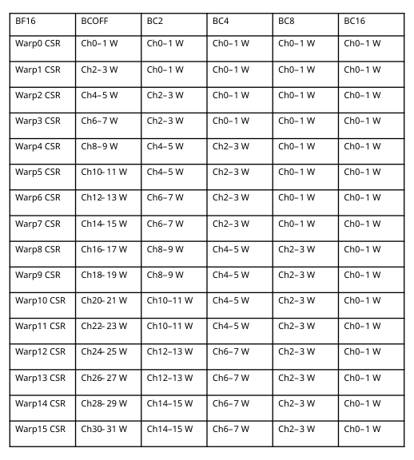</p><p align="center">图 7‑1 BIRENSUPA 加载 BF16 逐通道卷积权重</p>

下图展示了在不启用广播模式 32 个线程束从通道 0 加载 S8 数据类型的逐通道卷积权重。

<p align="center">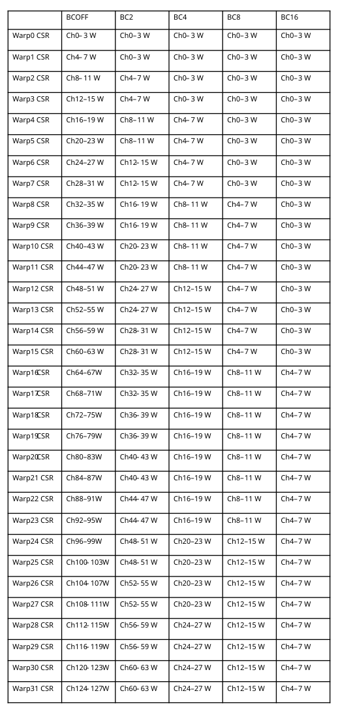</p><p align="center">图 7‑2 BIRENSUPA 加载 S8 逐通道卷积权重</p>

虽然加载逐通道卷积权重 API 在 tensor::wti 命名空间下，但是整个流式处理器簇都会同时处理逐通道卷积权重的加载。loader_warp_idx 参数可以用来选择发出指令的线程束。根据以上行为，加载逐通道卷积权重 API 需要在之后增加线程块级别的同步 API。

```cpp
using namespace tensor;

// ...

wti::__dwc_weight_csr<BF16, 3, 3> csr;

wti::__load_dwc_weight<wti::LDDW_BROADCAST_2>(&csr, Weight, CoordinateDWCWeight(ch, 0, 0));
__sync_block_cluster_threads();

// ...
```

\_\_load_dwc_weight API 使用在 L2LoadControl 命名空间下的 [L2 加载配置参数](#L2-加载控制)来配置 L2 加载。

```cpp
template <LOAD_DWC_WEIGHT_BROADCAST_MODE BROADCAST_MODE = LDDW_BROADCAST_OFF,
		L2LoadControl::OptionalParameters L2LParam = L2LoadControl::NONE,
		typename E, ushort KH_CSR, ushort KW_CSR, suMemArchType MemType, ushort KC, 			ushort KH, ushort KW>
__device__ void __load_dwc_weight(
	__dwc_weight_csr<E, KH_CSR, KW_CSR> *csr,
	DepthWiseConvWeight<E, MemType, BROADCAST_MODE, KC, KH, KW> In,
	CoordinateDWCWeight coord, ushort loader_warp_idx = 0);

template <LOAD_DWC_WEIGHT_BROADCAST_MODE BROADCAST_MODE = LDDW_BROADCAST_OFF,
	L2LoadControl::OptionalParameters L2LParam = L2LoadControl::NONE,
	typename E, ushort KH_CSR, ushort KW_CSR, suMemArchType MemType>
__device__ void
__load_dwc_weight(__dwc_weight_csr<E, KH_CSR, KW_CSR> *csr,
				DynDepthWiseConvWeight<E, MemType, BROADCAST_MODE> In,
				ushort KH, ushort KW, CoordinateDWCWeight coord,
				ushort loader_warp_idx = 0);
```

从 DepthWiseConvWeight/DynDepthWiseConvWeight 张量中加载逐通道卷积权重进入逐通道卷积权重恒定标量寄存器。

### 逐通道卷积

BIRENSUPA 逐通道卷积使用 ShortVector 和[逐通道卷积权重恒定标量寄存器](#逐通道卷积权重恒定标量寄存器-1)作为输入进行计算。下表为逐通道卷积 API 所支持的数据类型：

| Output Type | Weight Type | Activation Type |
| ----------- | ----------- | --------------- |
| BF16        | S8          | BF16            |
| BF16        | BF16        | BF16            |
| int         | S8          | S8              |
| int         | S8          | U8              |

在 BIRENSUPA 中，Activation 张量在每次线程束等级的数据读取和储存都是以 4 \* 8 的面为粒度。当进行步幅为 1 的逐通道卷积时，一次 4 \* 8 的的输出结果可以匹配一次 Activation 张量的存储；当进行步幅为 2 的逐通道卷积时，为了匹配一次 Activation 张量的存储需求，更多的数据会被读取。因为逐通道卷积需要填充，所以周围会有更多的 4 \* 8 的面会从 Activation 张量中被读取作为填充。具体参照如下图：

- 步幅为 1 的逐通道卷积需要从 Activation 张量读取 9 个 4 \* 8 的面作为数据源。

<p align="center">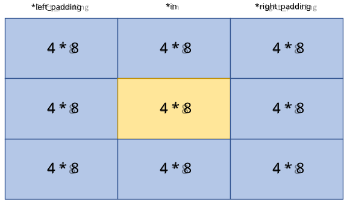</p><p align="center">图 7‑3 BIRENSUPA 逐通道卷积/池化步幅为 1 的填充</p>

- 步幅为 2 的逐通道卷积需要从 Activation 张量读取 16 个 4 \* 8 的面作为数据源。

<p align="center">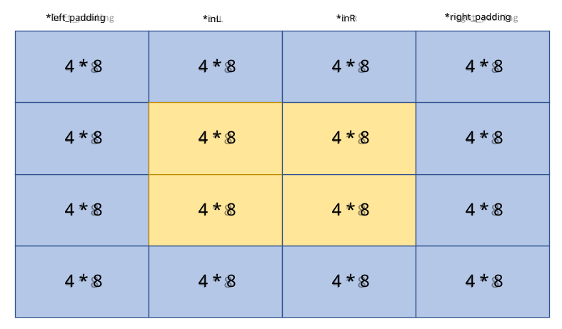</p><p align="center">图 7‑4 BIRENSUPA 逐通道卷积/池化步幅为 2 的填充</p>

BIRENSUPA 逐通道卷积 API 仅支持卷积核小于 5 \* 5，同时使用需要预读取到[逐通道卷积权重恒定标量寄存器](#逐通道卷积权重恒定标量寄存器-1)中。

- 卷积核高度（H）：1，2，3，4，5

- 卷积核宽度（W）：1，2，3，4，5

BIRENSUPA 逐通道卷积 API 需要使用[线程束卷积配置器](#线程束张量计算原语通用数据类型)来设置逐通道卷积的填充、步幅和扩张。

- 左填充（padX）：0，1，2

- 上填充（padY）：0，1，2

- 步幅：1，2

- 扩张：1，2

当使用扩张为 2 时，卷积核的高度和宽度仅支持 2 和 3。

- 卷积核高度（H）：2，3

- 卷积核宽度（W）：2，3

可以使用[EVALUATION_DIRECTION](#计算方向-1)模板参数来控制逐通道卷积的正向运算（FWD）和反向运算（BWD）。

在 BIRENSUPA 中可以由壁仞通用 GPU 硬件自动添加填充，[POOL_DWC_TOP_BOTTOM_BOUNDARY 和 POOL_DWC_LEFT_RIGHT_BOUNDARY](#边界模式)模板参数可以用来配置自动添加上下或者左右的填充。在启用边界模式的逐通道卷积情况下，填充部分会被自动填充为 0。

`POOL_DWC_TOP_BOTTOM_BOUNDARY` 可以用作控制自动添加上端或者下部的填充。

- BOUNDARY_TOP_BOTTOM_OFF：不启用上下边界模式，步幅为 1 时，使用 left_padding、in 和 right_padding 指针的前 3 个变量进行计算（第一和第三个变量会被视为填充）；步幅为 2 时，使用 left_padding、inL、inR 和 right_padding 指针的前 4 个变量进行计算（第一和第四个变量会被视为填充）。

- BOUNDARY_TOP：仅自动添加上边界，步幅为 1 时，使用 left_padding、in 和 right_padding 指针的前 2 个变量进行计算（第二变量会被视为填充）；步幅为 2 时，使用 left_padding、inL、inR 和 right_padding 指针的前 3 个变量进行计算（第三个变量会被视为填充）。

- BOUNDARY_BOTTOM：仅自动添加下边界，步幅为 1 时，使用 left_padding、in 和 right_padding 指针的前 2 个变量进行计算（第一个变量会被视为填充）；步幅为 2 时，使用 left_padding、inL、inR 和 right_padding 指针的前 3 个变量进行计算（第一个变量会被视为填充）。

- BOUNDARY_TOP_BOTTOM：同时自动添加上下边界，步幅为 1 时，不支持此模式；步幅为 2 时，使用 left_padding、inL、inR 和 right_padding 指针的前 2 个变量进行计算。

POOL_DWC_LEFT_RIGHT_BOUNDARY 可以用作控制自动添加左侧或右侧的填充。

- BOUNDARY_LEFT_RIGHT_OFF：不启用左右边界模式。

- BOUNDARY_LEFT：left_padding 会被忽略并自动填充。

- BOUNDARY_RIGHT：right_padding 会被忽略并自动填充。

- BOUNDARY_LEFT_RIGHT：left_padding 和 right_padding 会被忽略并自动填充。

在壁仞通用 GPU 硬件中逐通道卷积运算的输出始终是 2 个通道，在输入的激活和卷积权重是 2 个通道时，BIRENSUPA 定义了[suPairPosition8bitDem](#supairposition8bitdem-1)来选择使用的数据来自高位的两个 8 位数据或是来自低位的两个 8 位数据。

```cpp
template <EVALUATION_DIRECTION dir = FWD,
		POOL_DWC_TOP_BOTTOM_BOUNDARY bnd_tb = BOUNDARY_TOP_BOTTOM_OFF,
		POOL_DWC_LEFT_RIGHT_BOUNDARY bnd_lr = BOUNDARY_LEFT_RIGHT_OFF,
		typename E_DST, typename E_ACT, typename E_W, ushort SVN_SRC,
		ushort KH, ushort KW, int padX, int padY, uint dilation>
__device__ void __depthwise_conv(__short_vector<E_DST, 2> *out,
								 __short_vector<E_ACT, SVN_SRC> *in,
								 __short_vector<E_ACT, SVN_SRC> *left_padding,
								 __short_vector<E_ACT, SVN_SRC> *right_padding,
								 const __dwc_weight_csr<E_W, KH, KW> &csr,
								 WarpConvConfig<padX, padY, 1, dilation> config,
								 suPairPosition8bitDem pair = suLowPair);

template <EVALUATION_DIRECTION dir = FWD, typename E_DST, typename E_ACT,
		  typename E_W, ushort SVN_SRC, ushort KH, ushort KW, int padX,
		  int padY, uint dilation>
__device__ void __depthwise_conv(__short_vector<E_DST, 2> *out,
								 __short_vector<E_ACT, SVN_SRC> in,
								 const __dwc_weight_csr<E_W, KH, KW> &csr,
								 WarpConvConfig<padX, padY, 1, dilation> config,
								 suPairPosition8bitDem pair = suLowPair);
```

进行步幅为 1 的逐通道卷积。

```cpp
template <EVALUATION_DIRECTION dir = FWD,
		  POOL_DWC_TOP_BOTTOM_BOUNDARY bnd_tb = BOUNDARY_TOP_BOTTOM_OFF,
		  POOL_DWC_LEFT_RIGHT_BOUNDARY bnd_lr = BOUNDARY_LEFT_RIGHT_OFF,
		  typename E_DST, typename E_ACT, typename E_W, ushort SVN_SRC,
		  ushort KH, ushort KW, int padX, int padY, uint dilation>
__device__ void __depthwise_conv_stride2(
	__short_vector<E_DST, 2> *out, __short_vector<E_ACT, SVN_SRC> *left_padding,
	__short_vector<E_ACT, SVN_SRC> *inL, __short_vector<E_ACT, SVN_SRC> *inR,
	__short_vector<E_ACT, SVN_SRC> *right_padding,
	const __dwc_weight_csr<E_W, KH, KW> &csr,
	WarpConvConfig<padX, padY, 2, dilation> config,
	suPairPosition8bitDem pair = suLowPair);

template <EVALUATION_DIRECTION dir = FWD,
		  POOL_DWC_TOP_BOTTOM_BOUNDARY bnd = BOUNDARY_TOP_BOTTOM_OFF,
		  typename E_DST, typename E_ACT, typename E_W, ushort SVN_SRC,
		  ushort KH, ushort KW, int padX, int padY, uint dilation>
__device__ void
__depthwise_conv_stride2(__short_vector<E_DST, 2> *out,
						 __short_vector<E_ACT, SVN_SRC> topLeft,
						 __short_vector<E_ACT, SVN_SRC> topRight,
						 __short_vector<E_ACT, SVN_SRC> botLeft,
						 __short_vector<E_ACT, SVN_SRC> botRight,
						 const __dwc_weight_csr<E_W, KH, KW> &csr,
						 WarpConvConfig<padX, padY, 2, dilation> config,
						 suPairPosition8bitDem pair = suLowPair);
```

进行步幅为 2 的逐通道卷积。

### 池化运算

BIRENSUPA 池化使用从 Activation 张量读取的 ShortVector 作为输入进行计算，同时 BIRENSUPA 为池化运算定义了若干壁仞通用 GPU 硬件所支持的池化模式（[PoolMode](#池化模式-1)）。不同池化模式所支持的数据类型如下表所示：

| 池化模式       | 输出数据类型 | 输入 Activation 张量数据类型 |
| -------------- | ------------ | ---------------------------- |
| POOL_MEAN      | BF16         | BF16                         |
| POOL_MAX       | BF16         | BF16                         |
| POOL_SHUFFLE   | S16          | S16                          |
| POOL_SHUFFLE   | BF16         | BF16                         |
| POOL_MAX_INDEX | S16          | BF16                         |

- POOL_MEAN：平均池化模式：获取池化核区域的平均值，输出结果为 BF16。

- POOL_MAX：最大池化模式；获取池化核区域的最大值，输出结果为 BF16。

- POOL_MAX_INDEX：最大编号池化模式；获取池化核区域的最大值的编号，输出结果为 S16。其中高 8 位存储了最大值的高（H），低 8 位存储了最大值的宽（W），故最大值被表达为：H << 8 | W。

- 当区域中存在多个相同的最大值，高度数据小于或等于新编号的高度数据时，新的编号会被视为最大值的编号（`Index1 < index2 if index1.H == index2.H && index1.W < index2.W`）。

- 当区域中存在多个相同的最大值，同时期高度数据也相同时，宽度数据小于或等于新编号的宽度数据时，新的编号会被视为最大值的编号（`Index1 < index2 if index1.H == index2.H && index1.W < index2.W`）。

- POOL\_SHUFFLE：池化数据交换模式，仅支持步幅为 1；BIRENSUPA 定义的特殊池化模式，以支持根据[WarpConvConfig](#warpconvconfig)中的填充配置获取对应 4 \* 8 的面的数据，在后的介绍中会具体介绍。一次池化 4 \* 8 的面的结果，会用到 9 个 4 \* 8（12 \* 24）的面作为输入，池化数据交换模式将会返回以 (4 - padY, 8 - padX) 作为左上角的 4 \* 8 的面的数据作为输出结果。下图为池化数据交换模式在 padX = -1，padY = -1 时的示例。

<p align="center">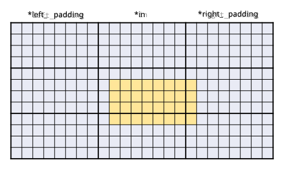</p><p align="center">图 7‑5 BIRENSUPA 池化数据交换模式 padX = -1 padY = -1 示例</p>

在 BIRENSUPA 中，Activation 张量在每次线程束等级的数据读取和储存都是以 4 \* 8 的面为粒度。当进行步幅为 1 的池化运算时，一次 4 \* 8 的的输出结果可以匹配一次 Activation 张量的存储；当进行步幅为 2 的池化运算时，为了匹配一次 Activation 张量的存储需求，更多的数据会被读取。因为池化运算需要填充，所以周围会有更多的 4 \* 8 的面会从 Activation 张量中被读取作为填充。具体参照如下图：

- 步幅为 1 的池化运算需要从 Activation 张量读取 9 个 4 \* 8 的面作为数据源。

<p align="center"></p><p align="center">图 7‑6 BIRENSUPA 逐通道卷积/池化步幅为 1 的填充</p>

- 步幅为 2 的池化运算需要从 Activation 张量读取 16 个 4 \* 8 的面作为数据源。

<p align="center"></p><p align="center">图 7‑7 BIRENSUPA 逐通道卷积/池化步幅为 2 的填充</p>

BIRENSUPA 池化运算 API 仅支持卷积核小于 5 \* 5。

- 池化核高度（H）：1，2，3，4，5

- 池化核宽度（W）：1，2，3，4，5

BIRENSUPA 池化运算 API 需要使用[线程束卷积配置器](#warpconvconfig)来设置池化运算的填充、步幅和扩张。

- 左填充（padX）：0，1，2，-1（仅支持池化数据交换模式），-2（仅支持池化数据交换模式）

- 上填充（padY）：0，1，2，-1（仅支持池化数据交换模式），-2（仅支持池化数据交换模式）

- 步幅：1，2（池化数据交换模式不支持步幅 2）

- 扩张：1

在 BIRENSUPA 中可以由壁仞通用 GPU 硬件自动添加填充，[POOL_DWC_TOP_BOTTOM_BOUNDARY 和 POOL_DWC_LEFT_RIGHT_BOUNDARY](#边界模式)模板参数可以用来配置自动添加上下或者左右的填充。在启用边界模式的池化运算情况下，使用平均池化模式和池化数据交换模式下填充部分会被自动填充为 0。最大池化模式和最大编号池化模式填充部分会被自动填充为负无穷。

当壁仞通用 GPU 硬件设计版本等于 1.0，最大池化模式自动填充模式无效。POOL_DWC_TOP_BOTTOM_BOUNDARY 可以用作控制自动添加上端或者下部的填充。

- BOUNDARY_TOP_BOTTOM_OFF：不启用上下边界模式，步幅为 1 时，使用 left_padding、in 和 right_padding 指针的前 3 个变量进行计算（第一和第三个变量会被视为填充）；步幅为 2 时，使用 left_padding、inL、inR 和 right_padding 指针的前 4 个变量进行计算（第一和第四个变量会被视为填充）。

- BOUNDARY_TOP：仅自动添加上边界，步幅为 1 时，使用 left_padding、in 和 right_padding 指针的前 2 个变量进行计算（第二变量会被视为填充）；步幅为 2 时，使用 left_padding、inL、inR 和 right_padding 指针的前 3 个变量进行计算（第三个变量会被视为填充）。

- BOUNDARY_BOTTOM：仅自动添加下边界，步幅为 1 时，使用 left_padding、in 和 right_padding 指针的前 2 个变量进行计算（第一个变量会被视为填充）；步幅为 2 时，使用 left_padding、inL、inR 和 right_padding 指针的前 3 个变量进行计算（第一个变量会被视为填充）。

- BOUNDARY_TOP_BOTTOM：同时自动添加上下边界，步幅为 1 时，不支持此模式；步幅为 2 时，使用 left_padding、inL、inR 和 right_padding 指针的前 2 个变量进行计算。

POOL_DWC_LEFT_RIGHT_BOUNDARY 可以用作控制自动添加左侧或右侧的填充。

- BOUNDARY_LEFT_RIGHT_OFF：不启用左右边界模式。

- BOUNDARY_LEFT：left_padding 会被忽略并自动填充。

- BOUNDARY_RIGHT：right_padding 会被忽略并自动填充。

- BOUNDARY_LEFT_RIGHT：left_padding 和 right_padding 会被忽略并自动填充。

```cpp
template <PoolMode pm, ushort FH, ushort FW,
          POOL_DWC_TOP_BOTTOM_BOUNDARY bnd_tb = BOUNDARY_TOP_BOTTOM_OFF,
          POOL_DWC_LEFT_RIGHT_BOUNDARY bnd_lr = BOUNDARY_LEFT_RIGHT_OFF,
          typename E_DST, typename E_SRC, int padX, int padY, uint dilation>
__DEVICE_FUNCTIONS_DECL__ void
__pool(__short_vector<E_DST, 2> *out, __short_vector<E_SRC, 2> *in,
       __short_vector<E_SRC, 2> *left_padding,
       __short_vector<E_SRC, 2> *right_padding,
       WarpConvConfig<padX, padY, 1, dilation> config);

template <PoolMode pm, ushort FH, ushort FW, typename E_DST, typename E_SRC,
		int padX, int padY, uint dilation>
__device__ void __pool(__short_vector<E_DST, 2> *out,
					   __short_vector<E_SRC, 2> in,
					   WarpConvConfig<padX, padY, 1, dilation> config);
```

进行步幅为 1 的池化运算。

```cpp
template <PoolMode pm, ushort FH, ushort FW,
		  POOL_DWC_TOP_BOTTOM_BOUNDARY bnd_tb = BOUNDARY_TOP_BOTTOM_OFF,
		  POOL_DWC_LEFT_RIGHT_BOUNDARY bnd_lr = BOUNDARY_LEFT_RIGHT_OFF,
		  typename E_DST, typename E_SRC, int padX, int padY, uint dilation>
__device__ void __pool_stride2(__short_vector<E_DST, 2> *out,
							   __short_vector<E_SRC, 2> *left_padding,
							   __short_vector<E_SRC, 2> *inL,
						 	   __short_vector<E_SRC, 2> *inR,
							   __short_vector<E_SRC, 2> *right_padding,
							   WarpConvConfig<padX, padY, 2, dilation> config);

template <PoolMode pm, ushort FH, ushort FW, typename E_DST, typename E_SRC,
		int padX, int padY, uint dilation>
__device__ void __pool_stride2(__short_vector<E_DST, 2> *out,
							   __short_vector<E_SRC, 2> topLeft,
							   __short_vector<E_SRC, 2> topRight,
							   __short_vector<E_SRC, 2> botLeft,
							   __short_vector<E_SRC, 2> botRight,
							   WarpConvConfig<padX, padY, 2, dilation> config);
```

进行步幅为 2 的池化运算。

### 归约缓冲区控制

BIRENSUPA 相关控制壁仞通用 GPU 硬件归约缓冲区原语的 API。

```cpp
template <ushort CHANNEL_NUM = 2, ushort C, REDUCE_MODE M>
__device__ void __set_reduce_buf(__reduce_buf<C, M> *buf, ushort start_channel,
								FP32 v, ushort target_warp_idx = warp_idx);

template <ushort CHANNEL_NUM = 2, ushort C, REDUCE_MODE M>
__device__ void __set_reduce_buf(__reduce_buf<C, M> *buf, FP32 v,
								ushort target_warp_idx = warp_idx);
```

`__set_reduce_buf` API 通过线程束中每个线程上的数据设置归约缓冲区。对于每个线程束，此 API 把从`线程 0` 开始到`线程 CHANNEL_NUM * 2` 的每个线程上的 `FP32` 类型的数据写入 `target_warp_idx` 对应的归约缓冲区，写入的归约缓冲区位置以 start_channel 开始。数据排布可依照[归约缓冲区的内部分布](#归约缓冲区)。

假设 start_channel = c

| 线程     | 0      | 1        | 2     | 3       | 4        | 5        | 6       | 7       | ... |
| -------- | ------ | -------- | ----- | ------- | -------- | -------- | ------- | ------- | --- |
| 对应数值 | sum(c) | sum(c+1) | sq(c) | sq(c+1) | sum(c+2) | sum(c+3) | sq(c+2) | sq(c+3) | ... |

壁仞通用 GPU 硬件允许此 API 访问同一个计算单元（CU）中任意执行单元（EU）对应的归约缓冲区。

- CHANNEL_NUM 需要 2 对齐；

- start_channel 需要 2 对齐；

- warp_idx 和 target_warp_idx 需要位于同一个计算单元（CU）。

```cpp
template <ushort CHANNEL_NUM = 2, ushort C, REDUCE_MODE M>
__device__ void __get_reduce_buf(FP32 *v, const __reduce_buf<C, M> &buf,
								ushort start_channel = 0,
								ushort target_warp_idx = warp_idx);
```

`__get_reduce_buf` API 将归约缓冲区指针的数据读取到线程束中的线程上。对于每个线程束，此 API 把线程束 `target_warp_idx` 对应的归约缓冲区上从通道 `start_channel` 开始的 `CHANNEL_NUM` 个通道的 SUM 或 SQUARE SUN 输出到从线程 0 开始的 `CHANNEL_NUM * 2` 个线程上。（依照[归约缓冲区的内部分布](#归约缓冲区)）。

假设 `start_channel` = c

| 线程     | 0      | 1        | 2     | 3       | 4        | 5        | 6       | 7       | ... |
| -------- | ------ | -------- | ----- | ------- | -------- | -------- | ------- | ------- | --- |
| 对应数值 | sum(c) | sum(c+1) | sq(c) | sq(c+1) | sum(c+2) | sum(c+3) | sq(c+2) | sq(c+3) | ... |

根据壁仞通用 GPU 硬件设计，归约缓冲区在被此 API 取值后对应的通道位置，会在下一次尝试写入数据同时被清空。

壁仞通用 GPU 硬件允许此 API 访问同一个计算单元（CU）中任意执行单元（EU）对应的归约缓冲区。

- `CHANNEL_NUM` 需要 2 对齐

- `start_channel` 需要 2 对齐

- `warp_idx`和`target_warp_idx`需要位于同一个计算单元（CU）

```cpp
template <ushort SVN, ushort C, REDUCE_MODE M>
__device__ void __get_reduce_buf_broadcast(__short_vector<FP32, SVN> *sv,
                                           const __reduce_buf<C, M> &buf, ushort
                                           start_channel,
                                           ushort target_warp_idx = warp_idx);
```

从`target_warp_idx` 对应的归约缓冲区获得 start_channel 开始的 2 个通道的 SUM/SUM，SQ/SQ 或 SUM/SUM/SQ/SQ 配对（两个或四个数据，取决于归约模式），并广播到线程束上的所有线程。

假设 `start_channel` = c

- REDUCE_MODE = REDUCE_SUM：所有线程会获得一个内容是 sum(c)，sum(c+1) 的 float2；

- REDUCE_MODE = REDUCE_SQ：所有线程会获得一个内容是 sq(c)，sq(c+1)的 float2；

- REDUCE_MODE = REDUCE_SSQ：所有线程会获得一个内容是 sum(c)，sum(c+1)，sq(c)，sq(c+1) 的 float4。

根据壁仞通用 GPU 硬件设计，归约缓冲区在被此 API 取值后对应的通道位置，会在下一次尝试写入数据同时被清空。（可以多次取值，数据在下一次写入前不会被清除）

壁仞通用 GPU 硬件允许此 API 访问同一个计算单元（CU）中任意执行单元（EU）对应的归约缓冲区。

- start_channel 需要 2 对齐；

- warp_idx 和 target_warp_idx 需要位于同一个计算单元（CU）。

```cpp
template <typename E, wti::REDUCE_MODE M, ushort C, ushort SVN>
__device__ void __warp_reduce(wti::__reduce_buf<C, M> *buf,
                              ushort start_channel, __short_vector<E, SVN> v,
                              ushort target_warp_idx = warp_idx);

template <typename E, REDUCE_MODE M, ushort SVN>
__device__ void __warp_reduce(__reduce_buf<SVN, M> *buf,
                              __short_vector<E, SVN> v,
                              ushort target_warp_idx = warp_idx);
```

将线程束上数据归约到`target_warp_idx` 对应的归约缓冲区从 start_channel 开始的位置上（可以使用和，平方和和同时使用和与平方和的归约模式）。归约缓冲区上使用的通道数和输入 ShortVector 的长度（SVN）相同。

壁仞通用 GPU 硬件允许此 API 访问同一个计算单元（CU）中任意执行单元（EU）对应的归约缓冲区。

- start_channel 需要 2 对齐；

- warp_idx 和 target_warp_idx 需要位于同一个计算单元（CU）。

<table><tr><td bgcolor=#ffeccc><b>注意：</b>仅在发生数据读取时，归约缓冲区对应的通道位置会在下一次尝试写入数据时被清空。因此，在使用归约缓冲区前，建议使用__set_reduce_buf 对归约缓冲区做置零处理。</td></tr></table>

使用归约缓冲区的 API：**warp_reduce、** mma (REDUCE_MODE 不为 REDUCE_NONE 时)、\_\_conv (REDUCE_MODE 不为 REDUCE_NONE 时)

读取归约缓冲区的 API：`__get_reduce_buf_broadcast`、`__get_reduce_buf`、`__grb_reduce_add`

```cpp
template <ushort CHANNEL_NUM = 2,
		  L2StoreControl::OptionalParameters L2SParam = L2StoreControl::NONE,
		  suMemArchType MemType, ushort NV, ushort N, ushort C, REDUCE_MODE M>
__device__ void
__grb_reduce_add(Vectors<FP32, MemType, NV, N> &vectors, short un, short n,
                 const __reduce_buf<C, M> &grb, ushort start_channel,
                 ushort target_warp_idx = warp_idx);

template <ushort CHANNEL_NUM = 2,
		  L2StoreControl::OptionalParameters L2SParam = L2StoreControl::NONE,
		  suMemArchType MemType, ushort N, ushort C, REDUCE_MODE M>
__device__ void __grb_reduce_add(Vector<FP32, MemType, N> &vector, short n,
                                 const __reduce_buf<C, M> &grb,
                                 ushort start_channel,
                                 ushort target_warp_idx = warp_idx);

template <ushort CHANNEL_NUM = 2,
		  L2StoreControl::OptionalParameters L2SParam = L2StoreControl::NONE,
		  suMemArchType MemType, ushort C, REDUCE_MODE M>
__device__ void __grb_reduce_add(DynVectors<FP32, MemType> &vectors, short un, short n,
                                 const __reduce_buf<C, M> &grb, ushort start_channel,
                                 ushort target_warp_idx = warp_idx);

template <ushort CHANNEL_NUM = 2,
		  L2StoreControl::OptionalParameters L2SParam = L2StoreControl::NONE,
		  suMemArchType MemType, ushort C, REDUCE_MODE M>
__device__ void __grb_reduce_add(DynVector<FP32, MemType> &vector,
                                 short n, const __reduce_buf<C, M> &grb,
                                 ushort start_channel,
                                 ushort target_warp_idx = warp_idx);
```

从`target_warp_idx` 对应的归约缓冲区上将 CHANNEL_NUM 数量通道的归约数据（从 start_channel 开始）累加到 Vectors、Vector、DynVectors 或 DynVector 张量的指定位置。

假设 CHANNEL_NUM = c

被累加 Vectors、Vector、DynVectors 或 DynVector 张量的数据会按照以下顺序：

- REDUCE_MODE = REDUCE_SUM：sum(0)，sum(1)，0，0，sum(2)，sum(3)，0，0，... , sum(c - 1)，sum(c)，0，0

- REDUCE_MODE = REDUCE_SQ：0，0，sq(0)，sq(1)，0，0，sq(2)，sq(3)，... ，0，0, sq(c - 1)，sq(c)

- REDUCE_MODE = REDUCE_SSQ： sum(0)，sum(1)，sum(2)，sum(3)，0，0，sq(2)，sq(3)，... ，sum(c - 1)，sum(c)，sq(c - 1)，sq(c)

按照以上介绍，\_\_grb_reduce_add API 的输入坐标需要按照 4 对齐来和[归约缓冲区内数据分布](#归约缓冲区-1)（和，和，平方和，平方和）对齐，所以 REDUCE_SUM 和 REDUCE_SQ 模式下会有孔洞存在。

壁仞通用 GPU 硬件允许此 API 访问同一个计算单元（CU）中任意执行单元（EU）对应的归约缓冲区。

\_\_grb_reduce_add API 使用在 L2StoreControl 命名空间下的[L2 存储配置参数](#l2-存储控制)来配置 L2 存储。

- CHANNEL_NUM 需要 2 对齐；

- start_channel 需要 2 对齐；

- warp_idx 和 target_warp_idx 需要位于同一个计算单元（CU）。

根据壁仞通用 GPU 硬件设计，归约缓冲区在被此 API 取值后对应的通道位置，会在下一次尝试写入数据同时被清空。（可以多次取值，数据在下一次写入前不会被清除）

按照壁仞通用 GPU 硬件要求，`__sync_block_cluster_threads()` 或其他包含 T Mode 线程块等级的内存围栏和屏障的同步 API，需要被添加到`__load_broadcast_vector()` 和 `__grb_reduce_add()` 之间。


<table><tr><td bgcolor=#ffeccc>
<b>注意：</b>当壁仞通用 GPU 硬件设计版本为 1.0 时，<code>__grb_reduce_add()</code> API 不支持同一个计算单元内不同线程束往相同位置的异步写入。但是不同计算单元或者不同流式处理器簇之间可以往相同位置异步写入。

当壁仞通用 GPU 硬件设计版本等于或高于 1.1，<code>__grb_reduce_add()</code> API 可支持不同线程束（可在相同计算单元）往相同位置进行异步写入。

</td></tr></table>


### 归约缓冲区指针控制

BIRENSUPA 相关控制壁仞通用 GPU 硬件归约缓冲区原语的 API。此类型 API 中，使用的归约缓冲区指针需要拥有 `__tensor_grb__` 属性。

| 线程     | 0      | 1      | 2     | 3     | 4      | 5      | 6     | 7     | ... |
| -------- | ------ | ------ | ----- | ----- | ------ | ------ | ----- | ----- | --- |
| 对应数值 | sum(0) | sum(1) | sq(0) | sq(1) | sum(2) | sum(3) | sq(2) | sq(3) | ... |

壁仞通用 GPU 硬件允许此 API 访问同一个计算单元（CU）中的归约缓冲区指针。

- `CHANNEL_NUM` 需要 2 对齐
- `warp_idx` 和 `target_warp_idx` 需要位于同一个计算单元
- `buf` 指针的偏移需要 4 对齐

```cpp
template <REDUCE_MODE M, ushort CHANNEL_NUM = 2>
__device__ inline void
__set_reduce_buf(__tensor_grb__ FP32 *buf, FP32 v,
                 ushort target_warp_idx = warp_idx);
```

`__set_reduce_buf` API 通过线程束中每个线程上的数据设置归约缓冲区指针。对于每个线程束，此 API 从`线程 0` 开始到`线程 CHANNEL_NUM * 2` 的每个线程上的 `FP32` 类型的数据写入归约缓冲区指针。每个线程对应写入的归约缓冲区指针。

| 线程     | 0      | 1      | 2     | 3     | 4      | 5      | 6     | 7     | ... |
| -------- | ------ | ------ | ----- | ----- | ------ | ------ | ----- | ----- | --- |
| 对应数值 | sum(0) | sum(1) | sq(0) | sq(1) | sum(2) | sum(3) | sq(2) | sq(3) | ... |

根据壁仞通用 GPU 硬件设计，归约缓冲区指针在被此 API 取值后对应的通道位置，会在下一次尝试写入数据同时被清空。

壁仞通用 GPU 硬件允许此 API 访问同一个计算单元（CU）中的归约缓冲区指针。

- `CHANNEL_NUM` 需要 2 对齐
- `warp_idx` 和 `target_warp_idx` 需要位于同一个计算单元
- `buf` 指针的偏移需要 4 对齐

```cpp
template <REDUCE_MODE M, ushort CHANNEL_NUM = 2>
__device__ inline void
__get_reduce_buf(FP32 *v, const __tensor_grb__ FP32 *buf,
                 ushort target_warp_idx = warp_idx);
```

`__get_reduce_buf` API 将归约缓冲区指针的数据读取到线程束中的线程上。对于每个线程束，此 API 把线程束 `target_warp_idx` 对应的归约缓冲区上从通道 `start_channel` 开始的 `CHANNEL_NUM` 个通道的 SUM 或 SQUARE SUN 输出到从线程 0 开始的 `CHANNEL_NUM * 2` 个线程上。

- REDUCE_MODE = `REDUCE_SUM`：所有线程会获得一个内容是 sum(0)，sum(1) 的 `float2`
- REDUCE_MODE = `REDUCE_SQ`：所有线程会获得一个内容是 sq(0)，sq(1) 的 `float2`
- REDUCE_MODE = `REDUCE_SSQ`：所有线程会获得一个内容是 sum(0)，sum(1)，sq(0)，sq(1) 的 `float4`

根据壁仞通用 GPU 硬件设计，归约缓冲区指针在被此 API 取值后对应的通道位置，会在下一次尝试写入数据同时被清空。

壁仞通用 GPU 硬件允许此 API 访问同一个计算单元（CU）中的归约缓冲区指针。

- `warp_idx` 和 `target_warp_idx` 需要位于同一个计算单元
- `buf` 指针的偏移需要 4 对齐

```cpp
template <REDUCE_MODE M, ushort SVN>
__device__ inline void
__get_reduce_buf_broadcast(__short_vector<FP32, SVN> *sv,
                           const __tensor_grb__ FP32 *buf,
                           ushort target_warp_idx = warp_idx);
```

从归约缓冲区指针获得两个通道的 `SUM`/`SUM`，`SQ`/`SQ` 或 `SUM`/`SUM`/`SQ`/`SQ` 配对，并广播到线程束上的所有线程的数据读取到线程束中每个线程上。对于每个线程束，此 API 把归约缓冲区指针上的 `CHANNEL_NUM` 个`FP32` 类型数据输出到从线程 0 开始的 `CHANNEL_NUM * 2` 个线程上

壁仞通用 GPU 硬件允许此 API 访问同一个计算单元（CU）中的归约缓冲区指针。

- `warp_idx` 和 `target_warp_idx` 需要位于同一个计算单元
- `buf` 指针的偏移需要 4 对齐

```cpp
template <REDUCE_MODE M, typename E, ushort SVN>
__device__ inline void __warp_reduce(__tensor_grb__ FP32 *buf,
                                             __short_vector<E, SVN> v,
                                             ushort target_warp_idx = warp_idx);
```

将线程束上数据归约到归约缓冲区指针上（可以使用和，平方和和同时使用和与平方和的归约模式）。

假设 `CHANNEL_NUM` = c

被累加 Vectors、Vector、DynVectors 或 DynVector 张 量的数据会按照以下顺序：

- REDUCE_MODE = `REDUCE_SUM`：sum(0)，sum(1)，0，0，sum(2)，sum(3)，0，0，... , sum(c - 1)，sum(c)，0，0
- REDUCE_MODE = `REDUCE_SQ`：0，0，sq(0)，sq(1)，0，0，sq(2)，sq(3)，... ，0，0, sq(c - 1)，sq(c)
- REDUCE_MODE = `REDUCE_SSQ`： sum(0)，sum(1)，sum(2)，sum(3)，0，0，sq(2)，sq(3)，... ，sum(c - 1)，sum(c)，sq(c - 1)，sq(c)

按照以上介绍，`__grb_reduce_add` API 的输入坐标需要按照 `4` 对齐来和归约缓冲区指针对齐，所以 `REDUCE_SUM` 和 `REDUCE_SQ` 模式下会有孔洞存在。

壁仞通用 GPU 硬件允许此 API 访问同一个计算单元（CU）中的归约缓冲区指针。

`__grb_reduce_add` API 使用在 `L2StoreControl` 命名空间下的 [L2 存储配置参数](#L2-存储控制) 来配置 L2 存储。

- `CHANNEL_NUM` 需要 2 对齐
- `warp_idx` 和 `target_warp_idx` 需要位于同一个计算单元
- `buf` 指针的偏移需要 4 对齐

根据壁仞通用 GPU 硬件设计，归约缓冲区指针在被此 API 取值后对应的通道位置，会在下一次尝试写入数据同时被清空。

按照壁仞通用 GPU 硬件要求 `__sync_block_cluster_threads()` 或其他包含 T Mode 线程块等级的内存围栏和屏障的同步 API 需要被添加到 `__load_broadcast_vector()` 和 `__grb_reduce_add()` 之间。

根据壁仞通用 GPU 硬件设计，`__grb_reduce_add()` API 不支持同一个计算单元内不同线程束往相同目标的异步写入。但是不同计算单元或者不同流式处理器簇之间可以进行异步写入。

```cpp
template <REDUCE_MODE M, ushort CHANNEL_NUM = 2,
          L2StoreControl::OptionalParameters L2SParam = L2StoreControl::NONE,
          suMemArchType MemType, ushort NV, ushort N>
__device__ inline void
__grb_reduce_add(Vectors<FP32, MemType, NV, N> &vectors, short un, short n,
                 const __tensor_grb__ FP32 *buf,
                 ushort target_warp_idx = warp_idx);

template <REDUCE_MODE M, ushort CHANNEL_NUM = 2,
          L2StoreControl::OptionalParameters L2SParam = L2StoreControl::NONE,
          suMemArchType MemType, ushort N>
__device__ inline void
__grb_reduce_add(Vector<FP32, MemType, N> &vector, short n,
                 const __tensor_grb__ FP32 *buf,
                 ushort target_warp_idx = warp_idx);

template <REDUCE_MODE M, ushort CHANNEL_NUM = 2,
          L2StoreControl::OptionalParameters L2SParam = L2StoreControl::NONE,
          suMemArchType MemType>
__device__ inline void
__grb_reduce_add(DynVectors<FP32, MemType> &vectors, short un, short n,
                 const __tensor_grb__ FP32 *buf,
                 ushort target_warp_idx = warp_idx);

template <REDUCE_MODE M, ushort CHANNEL_NUM = 2,
          L2StoreControl::OptionalParameters L2SParam = L2StoreControl::NONE,
          suMemArchType MemType>
__device__ inline void
__grb_reduce_add(DynVector<FP32, MemType> &vector, short n,
                 const __tensor_grb__ FP32 *buf,
                 ushort target_warp_idx = warp_idx);
```

从归约缓冲区指针上将 `CHANNEL_NUM` 数量通道的归约数据累加到 Vectors、Vector、DynVectors 或 DynVector 张量的指定位置。

### L2 层级张量累加

```cpp
template <L2StoreControl::OptionalParameters L2SParam = L2StoreControl::NONE,
		  typename E_DST, typename E_SRC, suMemArchType MemType, ushort NV,
		  ushort N, ushort SVN>
__device__ void __warp_reduce_add(Vectors<E_DST, MemType, NV, N> &vectors,
                                  short nv, short n,
                                  __short_vector<E_SRC, SVN> v);

template <L2StoreControl::OptionalParameters L2SParam = L2StoreControl::NONE,
		  typename E_DST, typename E_SRC, suMemArchType MemType, ushort N,
		  ushort SVN>
__device__ void __warp_reduce_add(Vector<E_DST, MemType, N> &vector, short n,
                                  __short_vector<E_SRC, SVN> v);

template <L2StoreControl::OptionalParameters L2SParam = L2StoreControl::NONE,
		  typename E_DST, typename E_SRC, suMemArchType MemType, ushort SVN>
__device__ void __warp_reduce_add(DynVectors<E_DST, MemType> &vectors, short nv,
                                  short n, __short_vector<E_SRC, SVN> v);

template <L2StoreControl::OptionalParameters L2SParam = L2StoreControl::NONE,
		  typename E_DST, typename E_SRC, suMemArchType MemType, ushort SVN>
__device__ void __warp_reduce_add(DynVector<E_DST, MemType> &vector, short n,
                                  __short_vector<E_SRC, SVN> v);

template <L2StoreControl::OptionalParameters L2SParam = L2StoreControl::NONE,
		  typename E_DST, typename E_SRC, suMemArchType MemType,
MatrixLayout Layout, ushort N, ushort H, ushort W, ushort SVN>
__device__ void
__warp_reduce_add(Matrix3D<E_DST, MemType, Layout, N, H, W> &matrix,
                  Coordinate3D c, __short_vector<E_SRC, SVN> v);

template <L2StoreControl::OptionalParameters L2SParam = L2StoreControl::NONE,
		  typename E_DST, typename E_SRC, suMemArchType MemType,
		  MatrixLayout Layout, ushort H, ushort W, ushort SVN>
__device__ void __warp_reduce_add(Matrix<E_DST, MemType, Layout, H, W> &matrix,
                                  Coordinate2D c,
                                  __short_vector<E_SRC, SVN> v);

template <L2StoreControl::OptionalParameters L2SParam = L2StoreControl::NONE,
		  typename E_DST, typename E_SRC, suMemArchType MemType,
		  MatrixLayout Layout, ushort SVN>
__device__ void __warp_reduce_add(DynMatrix3D<E_DST, MemType, Layout> &matrix,
                                  Coordinate3D c,
                                  __short_vector<E_SRC, SVN> v);

template <L2StoreControl::OptionalParameters L2SParam = L2StoreControl::NONE,
		  typename E_DST, typename E_SRC, suMemArchType MemType,
		  MatrixLayout Layout, ushort SVN>
__device__ void __warp_reduce_add(DynMatrix<E_DST, MemType, Layout> &matrix,
                                  Coordinate2D c,
                                  __short_vector<E_SRC, SVN> v);

template <L2StoreControl::OptionalParameters L2SParam = L2StoreControl::NONE,
		  typename E_DST, typename E_SRC, suMemArchType MemType, ushort N,
		  ushort C, ushort H, ushort W, ushort SVN>
__device__ void
__warp_reduce_add(Activation<E_DST, MemType, N, C, H, W> &activation,
                  Coordinate c, __short_vector<E_SRC, SVN> v);

template <L2StoreControl::OptionalParameters L2SParam = L2StoreControl::NONE,
		  typename E_DST, typename E_SRC, suMemArchType MemType, ushort SVN>
__device__ void __warp_reduce_add(DynActivation<E_DST, MemType> &activation,
                                  Coordinate c, __short_vector<E_SRC, SVN> v);

template <L2StoreControl::OptionalParameters L2SParam = L2StoreControl::NONE,
		  typename E_DST, typename E_SRC, suMemArchType MemType, ushort KC_OUT,
		  ushort N, ushort KC_IN, ushort KH, ushort KW, ushort SVN>
__device__ void
__warp_reduce_add(ConvWeights<E_DST, MemType, N, KC_OUT, KC_IN, KH, KW> &CW,
                  CoordinateConvWeight c, __short_vector<E_SRC, SVN> v);

template <L2StoreControl::OptionalParameters L2SParam = L2StoreControl::NONE,
		  typename E_DST, typename E_SRC, suMemArchType MemType, ushort SVN>
__device__ void __warp_reduce_add(DynConvWeights<E_DST, MemType> &CW, ushort W,
                                  CoordinateConvWeight c,
                                  __short_vector<E_SRC, SVN> v);

template <L2StoreControl::OptionalParameters L2SParam = L2StoreControl::NONE,
		  typename E_DST, typename E_SRC, suMemArchType MemType, ushort KC,
		  ushort KH, ushort KW, ushort SVN>
__device__ void
__warp_reduce_add(DepthWiseConvWeight<E_DST, MemType, KC, KH, KW> &DWCW,
                  CoordinateDWCWeight c, __short_vector<E_SRC, SVN> v);

template <L2StoreControl::OptionalParameters L2SParam = L2StoreControl::NONE,
		  typename E_DST, typename E_SRC, suMemArchType MemType, ushort SVN>
__device__ void __warp_reduce_add(DynDepthWiseConvWeight<E_DST, MemType> &DWCW,
                                  CoordinateDWCWeight c,
                                  __short_vector<E_SRC, SVN> v);
```

将线程束上每个线程的 ShortVector 累加到不同张量数据类型上。下表展示了支持的数据类型与 ShortVector 对应的长度。

| 张量数据类型 | ShortVector 数据类型 | ShortVector 内数据数量 (SVN) |
| ------------ | -------------------- | ---------------------------- |
| FP32         | FP32                 | 1                            |
| FP32         | BF16                 | 2                            |
| BF16         | BF16                 | 2                            |

当\_\_warp_reduce_add API 从低精度（BF16）累加结果到高精度（FP32）的 Vectors/Vector/DynVectors/DynVector 张量时，每个线程束的线程上的 bf162 数据会被累加到相邻的数据上，每个线程束会累加连续 64 个数据结果。

- e.g.：如果累加从 n 开始，sv 为希望累加的 bf162

| 张量数据     | n           | n + 1       | n + 2       | n+3         | n + 4       | n + 5       | ... | n + 62       | n + 63       |
| ------------ | ----------- | ----------- | ----------- | ----------- | ----------- | ----------- | --- | ------------ | ------------ |
| 对应线程数据 | 线程 0 sv.x | 线程 0 sv.y | 线程 1 sv.x | 线程 1 sv.y | 线程 2 sv.x | 线程 2 sv.y | ... | 线程 31 sv.x | 线程 31 sv.y |

对于低精度（BF16）累加结果到高精度（FP32）的其他张量类型的进行累加时，遵循 FP32 数据类型[Burst2](#burst-模式)模式的对应关系。

\_\_warp_reduce_add API 使用在 L2StoreControl 命名空间下的[L2 存储配置参数](#l2-存储控制)来配置 L2 存储。

所有输入坐标需要是线程子块第一个数据的坐标。

当使用 DynConvWeights/DynConvWeight 张量时需要输入卷积权重 W 维度参数。


<table><tr><td bgcolor=#ffeccc>
<b>注意：</b>当壁仞通用 GPU 硬件设计版本为 1.0 时，<code>__warp_reduce_add()</code> API 不支持同一个计算单元内不同线程束往相同位置的异步写入。但是不同计算单元或者不同流式处理器簇之间可以往相同位置异步写入。

当壁仞通用 GPU 硬件设计版本等于或高于 1.1，<code>__warp_reduce_add()</code> API 可支持不同线程束（可在相同计算单元）往相同位置进行异步写入。
</td></tr></table>


### 交织

把 4 个 4 \* 8 的数据块交织成 1 个 8 \* 16 的大数据块，或者把 1 个 8 \* 16 的大数据块解除交织成 4 个 4 \* 8 的数据块。

<p align="center">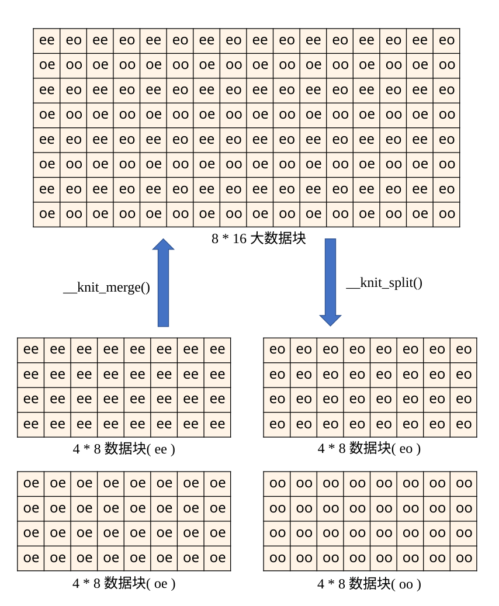</p><p align="center">图 7‑8 BIRENSUPA 张量交织 API</p>

```cpp
template <typename E, ushort SVN>
__device__ void __knit_split(__short_vector<E, SVN> *dst,
                             __short_vector<E, SVN> *src);
```

- 把 ee 的数据存放到\*src；

- 把 eo 的数据存放到\*(src+1)；

- 把 oe 的数据存放到\*(src+2)；

- 把 oo 的数据存放到\*(src+3)；

- 支持的数据类型与大小 E/SVN：FP32/1，int/1，BF16/2，S8/4，U8/4；

```cpp
template <typename E, ushort SVN>
__device__ void __knit_merge(__short_vector<E, SVN> *dst,
                             __short_vector<E, SVN> *src);
```

- 从 ee 中读取数据存放到 8 \* 16 的大数据块中并获取交织过后的 \*src 数据（8 \* 16 的大数据块中的第 0 到 3 行，0 到 7 列）；

- 从 eo 中读取数据存放到 8 \* 16 的大数据块中并获取交织过后的 \*(src+1)数据（8 \* 16 的大数据块中的第 0 到 3 行，8 到 15 列）；

- 从 oe 中读取数据存放到 8 \* 16 的大数据块中并获取交织过后的 \*(src+2)数据（8 \* 16 的大数据块中的第 4 到 7 行，0 到 7 列）；

- 从 oo 中读取数据存放到 8 \* 16 的大数据块中并获取交织过后的 \*(src+3)数据（8 \* 16 的大数据块中的第 4 到 7 行，8 到 15 列）；

- 支持的数据类型与大小 E/SVN：FP32/1，int/1，BF16/2，S8/4，U8/4。

### 加载恒定标量寄存器

使用此 API 从 Vector 张量中加载 SVN 个数据到标记为恒定标量寄存器（`__const_warp_shared__`）的变量中。

- 标记为恒定标量寄存器（`__const_warp_shared__`）的变量的数组或指针起始位置必须为静态且 8 字节对齐。（FP32/4 数据对齐，BF16/4 数据对齐，S8 和 U8/8 数据对齐）

  壁仞通用 GPU 硬件设计版本 1.1 新增支持 FP16 类型 `__const_warp_shared__`，对齐方式与 BF16 类型相同。与要注意的是，读取后的数据若需要进行计算，应先使用 `__csr_fp16_to_bf162()` 或相似接口将其转换成 BF16 类型 `__short_vector`。

  加载恒定标量寄存器 API 的数据源必须为 Vector 张量，且需要按照 [DepthWiseConvWeight 张量](#depthwiseconvweight)的数据排布准备数据。同时它的广播模式也与加载逐通道卷积权重 API 一致。SVN 个加载结果中每 4 字节的数据在 Vector 张量中都是一个 FP32 数据、连续的两个 S16 或连续的四个 S8/U8 数据，下一组 4 字节的加载数据会根据 LOAD_DWC_WEIGHT_BROADCAST_MODE 对齐。

- 不开启广播模式：64 字节对齐，FP32/16 个变量，S16/32 个变量，S8/64 个变量，U8/64 个变量

- 广播 2 模式：32 字节对齐，FP32/8 个变量，S16/16 个变量，S8/32 个变量，U8/32 个变量

- 广播 4 模式：16 字节对齐，FP32/4 个变量，S16/8 个变量，S8/16 个变量，U8/16 个变量

- 广播 8 模式：8 字节对齐，FP32/2 个变量，S16/4 个变量，S8/8 个变量，U8/8 个变量

- 广播 16 模式：4 字节对齐，FP32/1 个变量，S16/2 个变量，S8/4 个变量，U8/4 个变量

使用 loader_warp_idx 来选择发出预加载的线程束序号，预设职为默认线程束。只允许选择一个线程束使用此 API 进行预计的加载。

张量数据读取 API 使用在 L2LoadControl 命名空间下的[L2 加载配置参数](#L2-加载控制)来配置 L2 加载。

```cpp
template <ushort SVN,
		  LOAD_DWC_WEIGHT_BROADCAST_MODE BROADCAST_MODE = LDDW_BROADCAST_OFF,
		  L2LoadControl::OptionalParameters L2LParam = L2LoadControl::NONE,
typename E, suMemArchType MemType, ushort N>
__device__ void __load_csr(__const_warp_shared__ E *csr,
                           Vector<E, MemType, N> In, ushort n,
                           ushort loader_warp_idx = DEFAULT_LOADER_WARP);

template <ushort SVN,
		  LOAD_DWC_WEIGHT_BROADCAST_MODE BROADCAST_MODE = LDDW_BROADCAST_OFF,
		  L2LoadControl::OptionalParameters L2LParam = L2LoadControl::NONE,
		  typename E, suMemArchType MemType>
__device__ void __load_csr(__const_warp_shared__ E *csr,
                           DynVector<E, MemType> In, ushort n,
                           ushort loader_warp_idx = DEFAULT_LOADER_WARP);
```

将数据加载到恒定标量寄存器中。

```cpp
template <ushort SVN,
		  LOAD_DWC_WEIGHT_BROADCAST_MODE BROADCAST_MODE = LDDW_BROADCAST_OFF,
		  L2LoadControl::OptionalParameters L2LParam = L2LoadControl::NONE,
		  typename E, suMemArchType MemType, ushort N>
__device__ void __load_csr_async(__const_warp_shared__ E *csr,
                                 Vector<E, MemType, N> In, ushort n,
                                 ushort loader_warp_idx = DEFAULT_LOADER_WARP);

template <ushort SVN,
		  LOAD_DWC_WEIGHT_BROADCAST_MODE BROADCAST_MODE = LDDW_BROADCAST_OFF,
		  L2LoadControl::OptionalParameters L2LParam = L2LoadControl::NONE,
		  typename E, suMemArchType MemType>
__device__ void __load_csr_async(__const_warp_shared__ E *csr,
                                 DynVector<E, MemType> In, ushort n,
                                 ushort loader_warp_idx = DEFAULT_LOADER_WARP);
```

将数据异步加载到恒定标量寄存器中。在使用加载的数据前，需要使用等待异步加载 API 保证异步加载完成。

### 预加载张量缓冲区

当使用张量缓冲区时，配置张量缓冲区映射 API 被用来在主机端进行配置。同时根据壁仞通用 GPU 硬件设计，如果张量缓冲区中使用的数据不在张量缓冲区中且没有被初始化（例如：原数据在主机端，通过主机端与设备端的数据传递 API，此时数据仅在高带宽内存中并不直接在张量缓冲区可用），需要使用预加载张量缓冲区 API ，把数据从高带宽内存预加载到张量缓冲区中。

- size 在 2048 字节到 4096 \* 1024 字节的范围中

- size 需要 2K 字节对齐

- L2LoadControl 命名空间下的 L2 加载配置参数必须配置为 **BYPASS**。 用户在使用此接口前需保证要预加载的数据全部存在于 HBM 空间内而未被缓存在 L2 中。需要预加载的数据存在在 L2 中会导致加载到错误数据，用户需在此前使用 `suL2Flush()` 或 `suL2FlushAsync()` 函数清空 L2 缓存。

使用 loader_warp_idx 来选择发出预加载的线程束序号，预设置为默认线程束。每个 SPC 中只允许选择一个线程束使用此 API 进行预计的加载。

使用预加载张量缓冲区 API 之后，必须调用 `__sync_block_cluster_threads()` API，以确保 SPC 中其他线程束能够正确访问预加载至张量缓冲区的数据。

```cpp
template <L2LoadControl::OptionalParameters L2LParam, uint size, typename E,
		  suMemArchType MemType, ushort N, ushort C, ushort H, ushort W>
__device__ void
__preload_tensor_buffer(Activation<E, MemType, N, C, H, W> A,
                        Coordinate coord = Coordinate(0, 0, 0, 0),
                        ushort loader_warp_idx = DEFAULT_LOADER_WARP);

template <L2LoadControl::OptionalParameters L2LParam, uint size, typename E,
		  suMemArchType MemType>
__device__ void
__preload_tensor_buffer(DynActivation<E, MemType> A,
                        Coordinate coord = Coordinate(0, 0, 0, 0),
                        ushort loader_warp_idx = DEFAULT_LOADER_WARP);

template <L2LoadControl::OptionalParameters L2LParam, uint size, typename E,
		  suMemArchType MemType, ushort N, ushort KC_OUT, ushort KC_IN,
		  ushort H, ushort W>
__device__ void __preload_tensor_buffer(
	ConvWeights<E, MemType, N, KC_OUT, KC_IN, H, W> CW,
              CoordinateConvWeight coord = CoordinateConvWeight(0, 0, 0, 0, 0),
              ushort loader_warp_idx = DEFAULT_LOADER_WARP);

template <L2LoadControl::OptionalParameters L2LParam, uint size, typename E,
		  suMemArchType MemType>
__device__ void __preload_tensor_buffer(
	DynConvWeights<E, MemType> CW, ushort W,
    CoordinateConvWeight coord = CoordinateConvWeight(0, 0, 0, 0, 0),
    ushort loader_warp_idx = DEFAULT_LOADER_WARP);

template <L2LoadControl::OptionalParameters L2LParam, uint size, typename E,
		  suMemArchType MemType, MatrixLayout Layout, ushort N, ushort H,
		  ushort W>
__device__ void
__preload_tensor_buffer(Matrix3D<E, MemType, Layout, N, H, W> M,
                        Coordinate3D coord = Coordinate3D(0, 0, 0),
                        ushort loader_warp_idx = DEFAULT_LOADER_WARP);

template <L2LoadControl::OptionalParameters L2LParam, uint size, typename E,
		  suMemArchType MemType, MatrixLayout Layout, ushort H, ushort W>
__device__ void
__preload_tensor_buffer(Matrix<E, MemType, Layout, H, W> M,
                        Coordinate2D coord = Coordinate2D(0, 0),
                        ushort loader_warp_idx = DEFAULT_LOADER_WARP);

template <L2LoadControl::OptionalParameters L2LParam, uint size, typename E,
		  suMemArchType MemType, MatrixLayout Layout>
__device__ void
__preload_tensor_buffer(DynMatrix3D<E, MemType, Layout> M,
                        Coordinate3D coord = Coordinate3D(0, 0, 0),
                        ushort loader_warp_idx = DEFAULT_LOADER_WARP);

template <L2LoadControl::OptionalParameters L2LParam, uint size, typename E,
		  suMemArchType MemType, MatrixLayout Layout>
__device__ void
__preload_tensor_buffer(DynMatrix<E, MemType, Layout> M,
                        Coordinate2D coord = Coordinate2D(0, 0),
                        ushort loader_warp_idx = DEFAULT_LOADER_WARP);

template <L2LoadControl::OptionalParameters L2LParam, uint size, typename E,
		  suMemArchType MemType, ushort NV, ushort N>
__device__ void
__preload_tensor_buffer(Vectors<E, MemType, NV, N> V, ushort nv = 0,
                        ushort n = 0,
                        ushort loader_warp_idx = DEFAULT_LOADER_WARP);

template <L2LoadControl::OptionalParameters L2LParam, uint size, typename E,
		  suMemArchType MemType, ushort N>
__device__ void
__preload_tensor_buffer(Vector<E, MemType, N> V, ushort n = 0,
                        ushort loader_warp_idx = DEFAULT_LOADER_WARP);

template <L2LoadControl::OptionalParameters L2LParam, uint size, typename E,
		  suMemArchType MemType>
__device__ void
__preload_tensor_buffer(DynVectors<E, MemType> V, ushort nv = 0, ushort n = 0,
                        ushort loader_warp_idx = DEFAULT_LOADER_WARP);

template <L2LoadControl::OptionalParameters L2LParam, uint size, typename E,
		  suMemArchType MemType>
__device__ void
__preload_tensor_buffer(DynVector<E, MemType> V, ushort n = 0,
                        ushort loader_warp_idx = DEFAULT_LOADER_WARP);

template <L2LoadControl::OptionalParameters L2LParam, uint size,
          suMemArchType MemType, uint N>
__device__ void __preload_tensor_buffer(
    ByteObject<MemType, N> Obj,
    ushort loader_warp_idx = DEFAULT_LOADER_WARP);

template <L2LoadControl::OptionalParameters L2LParam, uint size,
          suMemArchType MemType>
__device__ void __preload_tensor_buffer(
    DynByteObject<MemType> Obj,
    ushort loader_warp_idx = DEFAULT_LOADER_WARP);
```

将张量数据预加载到张量缓冲区中。

```cpp
template <L2LoadControl::OptionalParameters L2LParam, uint size, typename E,
		  suMemArchType MemType, ushort N, ushort C, ushort H, ushort W>
__device__ void
__preload_tensor_buffer_async(Activation<E, MemType, N, C, H, W> A,
                              Coordinate coord = Coordinate(0, 0, 0, 0),
                              ushort loader_warp_idx = DEFAULT_LOADER_WARP);

template <L2LoadControl::OptionalParameters L2LParam, uint size, typename E,
		  suMemArchType MemType>
__device__ void
__preload_tensor_buffer_async(DynActivation<E, MemType> A,
                              Coordinate coord = Coordinate(0, 0, 0, 0),
                              ushort loader_warp_idx = DEFAULT_LOADER_WARP);

template <L2LoadControl::OptionalParameters L2LParam, uint size, typename E,
		  suMemArchType MemType, ushort N, ushort KC_OUT, ushort KC_IN,
ushort H, ushort W>
__device__ void __preload_tensor_buffer_async(
	ConvWeights<E, MemType, N, KC_OUT, KC_IN, H, W> CW,
	CoordinateConvWeight coord = CoordinateConvWeight(0, 0, 0, 0, 0),
	ushort loader_warp_idx = DEFAULT_LOADER_WARP);

template <L2LoadControl::OptionalParameters L2LParam, uint size, typename E,
		  suMemArchType MemType>
__device__ void __preload_tensor_buffer_async(
	DynConvWeights<E, MemType> CW, ushort W,
	CoordinateConvWeight coord = CoordinateConvWeight(0, 0, 0, 0, 0),
	ushort loader_warp_idx = DEFAULT_LOADER_WARP);

template <L2LoadControl::OptionalParameters L2LParam, uint size, typename E,
		  suMemArchType MemType, MatrixLayout Layout, ushort N, ushort H,
		  ushort W>
__device__ void
__preload_tensor_buffer_async(Matrix3D<E, MemType, Layout, N, H, W> M,
                              Coordinate3D coord = Coordinate3D(0, 0, 0),
                              ushort loader_warp_idx = DEFAULT_LOADER_WARP);

template <L2LoadControl::OptionalParameters L2LParam, uint size, typename E,
		  suMemArchType MemType, MatrixLayout Layout, ushort H, ushort W>
__device__ void
__preload_tensor_buffer_async(Matrix<E, MemType, Layout, H, W> M,
                              Coordinate2D coord = Coordinate2D(0, 0),
                              ushort loader_warp_idx = DEFAULT_LOADER_WARP);

template <L2LoadControl::OptionalParameters L2LParam, uint size, typename E,
		  suMemArchType MemType, MatrixLayout Layout>
__device__ void
__preload_tensor_buffer_async(DynMatrix3D<E, MemType, Layout> M,
                              Coordinate3D coord = Coordinate3D(0, 0, 0),
                              ushort loader_warp_idx = DEFAULT_LOADER_WARP);

template <L2LoadControl::OptionalParameters L2LParam, uint size, typename E,
		  suMemArchType MemType, MatrixLayout Layout>
__device__ void
__preload_tensor_buffer_async(DynMatrix<E, MemType, Layout> M,
                              Coordinate2D coord = Coordinate2D(0, 0),
                              ushort loader_warp_idx = DEFAULT_LOADER_WARP);

template <L2LoadControl::OptionalParameters L2LParam, uint size, typename E,
		  suMemArchType MemType, ushort NV, ushort N>
__device__ void
__preload_tensor_buffer_async(Vectors<E, MemType, NV, N> V, ushort nv = 0,
                              ushort n = 0,
                              ushort loader_warp_idx = DEFAULT_LOADER_WARP);

template <L2LoadControl::OptionalParameters L2LParam, uint size, typename E,
		  suMemArchType MemType, ushort N>
__device__ void
__preload_tensor_buffer_async(Vector<E, MemType, N> V, ushort n = 0,
                              ushort loader_warp_idx = DEFAULT_LOADER_WARP);

template <L2LoadControl::OptionalParameters L2LParam, uint size, typename E,
		  suMemArchType MemType>
__device__ void
__preload_tensor_buffer_async(DynVectors<E, MemType> V, ushort nv = 0,
                              ushort n = 0,
                              ushort loader_warp_idx = DEFAULT_LOADER_WARP);

template <L2LoadControl::OptionalParameters L2LParam, uint size, typename E,
		  suMemArchType MemType>
__device__ void
__preload_tensor_buffer_async(DynVector<E, MemType> V, ushort n = 0,
                              ushort loader_warp_idx = DEFAULT_LOADER_WARP);

template <L2LoadControl::OptionalParameters L2LParam, uint size,
          suMemArchType MemType, uint N>
__device__ void __preload_tensor_buffer_async(
    ByteObject<MemType, N> Obj,
    ushort loader_warp_idx = DEFAULT_LOADER_WARP);

template <L2LoadControl::OptionalParameters L2LParam, uint size,
          suMemArchType MemType>
__device__ void __preload_tensor_buffer_async(
    DynByteObject<MemType> Obj,
    ushort loader_warp_idx = DEFAULT_LOADER_WARP);
```

将张量数据异步的预加载到张量缓冲区中。在使用预加载的数据前，需要使用等待预加载 API 保证异步预加载完成。

<table><tr><td bgcolor=#ffeccc><b>注意：</b>预加载 ByteObject/DynByteObject 中张量缓冲区的接口无法配置开始加载的位置，默认仅支持从起始位置开始预加载，但是您仍然可以通过模板参数静态配置每次预加载的数据量大小。</td></tr></table>

### 等待异步加载

| API 简介               | API 接口                        |
| ---------------------- | ------------------------------- |
| 异步加载恒定标量寄存器 | \_\_load_csr_async              |
| 异步预加载张量缓冲区   | \_\_preload_tensor_buffer_async |

表中的 API 需要使用等待异步加载 API 以保证加载完成，仅等待**当前线程束**在此之前的上述异步接口完成。

```cpp
__device__ inline void __wait_load_async();
```

等待张量数据异步的加载完成。

### 线程束张量计算原语通用数据类型

#### WarpConvConfig

```cpp
template <int _padX, int _padY, uint _stride, uint _dilation>
struct WarpConvConfig {
	static const int padX = _padX;
	static const int padY = _padY;
	static const uint stride = _stride;
	static const uint dilation = _dilation;
};
```

在 `tensor::wti` 命名空间下，用于配置池化和逐通道卷积。

根据壁仞通用 GPU 硬件，padY 会被同时配置为上下填充，padX 会被同时配置为左右填充。

#### suPairPosition8bitDem

```cpp
enum suPairPosition8bitDem {
	suHighPair,
	suLowPair,
};
```

在 `tensor::wti` 命名空间下，用于配置使用高八位或者低八位的 char4 或者 uchar4 进行运算。

#### REDUCE_MODE

```cpp
enum REDUCE_MODE {
	REDUCE_NONE = 0,
	REDUCE_SUM,
	REDUCE_SQ,
	REDUCE_SSQ,
};
```

在 tensor::wti 命名空间下，用于定义归约缓冲区的运行模式。

- REDUCE_NONE：不使用归约；

- REDUCE_SUM：归约使用累加模式；

- REDUCE_SQ：归约使用平方和模式；

- REDUCE_SSQ：归约同时使用累加和平方和模式。

#### 归约缓冲区

```cpp
template <ushort C, REDUCE_MODE M> struct __reduce_buf {
	public:
	  __device__ __reduce_buf();
};
```

在 `tensor::wti` 命名空间下，用于表达每个线程束的归约缓冲区。

- C <= 32

按照壁仞通用 GPU 硬件设计，归约缓冲区中的数据始终是 FP32 数据类型的。模板参数 C 是每个线程束拥有的通道数量。归约缓冲区不论运行模式，始终同时储存着和与平方和，每 2 个通道 C 的缓存区内的数据分布是：SUM，SUM，SQUARE SUM，SQUARE SUM。

<p align="center">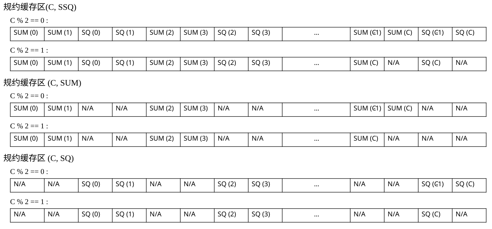</p><p align="center">图 7‑9 BIRENSUPA 张量归约缓冲区数据分布</p>

#### LOAD_DWC_WEIGHT_BROADCAST_MODE

```cpp
enum LOAD_DWC_WEIGHT_BROADCAST_MODE {
	LDDW_BROADCAST_OFF = 1,
	LDDW_BROADCAST_2 = 2,
	LDDW_BROADCAST_4 = 4,
	LDDW_BROADCAST_8 = 8,
	LDDW_BROADCAST_16 = 16,
};
```

在 `tensor::wti` 命名空间下，用于表达进行逐通道卷积权重加载和逐通道卷积权重创建时需要的广播模式。

#### 逐通道卷积权重恒定标量寄存器

```cpp
template <typename E, ushort KH, ushort KW> struct __dwc_weight_csr {
	public:
	  __device__ __dwc_weight_csr()
}
```

在 `tensor::wti` 命名空间下，用于表达逐通道卷积权重的恒定标量寄存器（CSR）。

- 支持 BF16 和 S8 数据类型的逐通道卷积权重

- KH = 1，2，3，4，5

- KW = 1，2，3，4，5

#### 边界模式

```cpp
enum POOL_DWC_TOP_BOTTOM_BOUNDARY {
	BOUNDARY_TOP_BOTTOM_OFF,
	BOUNDARY_TOP,
	BOUNDARY_BOTTOM,
	BOUNDARY_TOP_BOTTOM,
};
```

在 `tensor::wti` 命名空间下，用于表达池化和逐通道卷积的上下边界模式。

```cpp
enum POOL_DWC_LEFT_RIGHT_BOUNDARY {
	BOUNDARY_LEFT_RIGHT_OFF,
	BOUNDARY_LEFT,
	BOUNDARY_RIGHT,
	BOUNDARY_LEFT_RIGHT,
};
```

在 `tensor::wti` 命名空间下，用于表达池化和逐通道卷积的左右边界模式。

#### 池化模式

```cpp
enum PoolMode {
	POOL_MEAN = 0,
	POOL_MAX,
	POOL_SHUFFLE,
	POOL_MAX_INDEX,
};
```

在 `tensor::wti` 命名空间下，用于表达壁仞通用 GPU 硬件的池化模式。

<div style="page-break-after:always"></div>

## 张量核心计算原语 (TCI)

BIRENSUPA 定义张量核心的底层原语为张量核心计算原语（TCI），此类型的原语函数都在命名空间 tensor::tci 内。

<table><tr><td bgcolor=#ffeccc><b>注意：</b>在同一个超大核函数混合使用张量核心计算原语（TCI）API 与高性能张量核心计算原语（TCI-P）API 混用是未定义的行为。由于可能可能产生未知错误，不建议该使用方式。</td></tr></table>

### 加载矩阵乘法运算缓冲区（矩阵乘法运算）

BIRENSUPA 定义了 A 或 B 张量计算核缓冲区在矩阵乘法运算前存放需要运算的矩阵数据。这种缓冲区被定义成了[\_\_mma_buf](#矩阵乘法运算缓冲区)。

在 BIRENSUPA 中加载矩阵乘法运算缓冲区需要遵循下表的尺寸规则。

- A_BUF

| 数据类型 | 缓冲区形状 | 参数           |
| -------- | ---------- | -------------- |
| FP32     | 64 \* 16K  | K = 1, 2, 4, 8 |
| BF16     | 64 \* 32K  | K = 1, 2, 4, 8 |
| S8/U8    | 64 \* 64K  | K = 1, 2, 4, 8 |
| S4       | 64 \* 128K | K = 1, 2, 4    |

- B_BUF

| 数据类型 | 缓冲区形状  | 参数                     |
| -------- | ----------- | ------------------------ |
| FP32     | 16K \* 32N  | N = 1, 2, K = 1, 2, 4, 8 |
| BF16/S16 | 32K \* 32N  | N = 1, 2, K = 1, 2, 4, 8 |
| S8/U8    | 64K \* 32N  | N = 1, 2, K = 1, 2, 4, 8 |
| S4       | 128K \* 32N | N = 1, 2, K = 1, 2, 4    |

在进行矩阵缓冲区加载时，BIRENSUPA 提供了在 H 和 W 维度转置的功能。同时，矩阵张量在加载和转置时对维度和数据类型有以下限制：

- BLOCK_ROW_MAJOR Matrix 张量加载和转置限制：

| 数据类型 | 缓冲区 A               | 缓冲区 B     |
| -------- | ---------------------- | ------------ |
| FP32     | 允许加载。             | 允许加载。   |
| BF16/S16 | 允许加载。             | 允许加载。   |
| S8/U8    | 允许加载，不允许转置。 | 不允许加载。 |
| S4       | 允许加载，不允许转置。 | 不允许加载。 |

- BLOCK_COL_MAJOR Matrix 张量加载和转置限制：

| 数据类型 | 缓冲区 A     | 缓冲区 B               |
| -------- | ------------ | ---------------------- |
| FP32     | 允许加载。   | 允许加载。             |
| BF16/S16 | 允许加载。   | 允许加载。             |
| S8/U8    | 不允许加载。 | 允许加载，不允许转置。 |
| S4       | 不允许加载。 | 不允许加载。           |

使用 BUFFER_PADDING_MODE 来配置填充模式。详细信息请参考[5.6.9.7 张量缓冲区填充模式](#张量缓冲区填充模式)。

| 填充模式                    | 是否允许 |
| --------------------------- | -------- |
| BUFFER_PADDING_AUTO         | 允许     |
| BUFFER_PADDING_NONE         | 允许     |
| BUFFER_PADDING_BOTTOM       | 不允许   |
| BUFFER_PADDING_RIGHT        | 不允许   |
| BUFFER_PADDING_BOTTOM_RIGHT | 不允许   |

`__load_input_buf` API 使用在 `L2StoreControl` 命名空间下的[L2 存储配置参数](#l2-存储控制)来配置 L2 存储。

当壁仞通用 GPU 硬件设计版本等于 1.1 时，张量核心新增可支持从 FP16 类型张量加载数据进入张量计算核缓冲区，其可使用的缓冲区大小以及使用要求与 BF16 相同。

```cpp
template <LD_TRANSPOSE trans = NOT_TRANSPOSE,
		  L2LoadControl::OptionalParameters L2LParam = L2LoadControl::NONE,
		  typename E, BUFFER_PADDING_MODE B_PAD_M, GEMM_GIB G, ushort BH,
		  ushort BW, suMemArchType MemType, MatrixLayout Layout, ushort N,
		  ushort H, ushort W>
__device__ void __load_input_buf(__mma_buf<G, E, BH, BW, B_PAD_M> *buf,
                                 Matrix3D<E, MemType, Layout, N, H, W> In,
                                 Coordinate3D coord);

template <LD_TRANSPOSE trans = NOT_TRANSPOSE,
		  L2LoadControl::OptionalParameters L2LParam = L2LoadControl::NONE,
		  typename E, BUFFER_PADDING_MODE B_PAD_M, GEMM_GIB G, ushort BH,
		  ushort BW, suMemArchType MemType, MatrixLayout Layout, ushort H,
		  ushort W>
__device__ void __load_input_buf(__mma_buf<G, E, BH, BW, B_PAD_M> *buf,
                                 Matrix<E, MemType, Layout, H, W> In,
                                 Coordinate2D coord);

template <LD_TRANSPOSE trans = NOT_TRANSPOSE,
		  L2LoadControl::OptionalParameters L2LParam = L2LoadControl::NONE,
		  typename E, BUFFER_PADDING_MODE B_PAD_M, GEMM_GIB G, ushort BH,
		  ushort BW, suMemArchType MemType, MatrixLayout Layout>
__device__ void __load_input_buf(__mma_buf<G, E, BH, BW, B_PAD_M> *buf,
                                 DynMatrix3D<E, MemType, Layout> In,
                                 Coordinate3D coord);

template <LD_TRANSPOSE trans = NOT_TRANSPOSE,
		  L2LoadControl::OptionalParameters L2LParam = L2LoadControl::NONE,
		  typename E, BUFFER_PADDING_MODE B_PAD_M, GEMM_GIB G, ushort BH,
		  ushort BW, suMemArchType MemType, MatrixLayout Layout>
__device__ void __load_input_buf(__mma_buf<G, E, BH, BW, B_PAD_M> *buf,
                                 DynMatrix<E, MemType, Layout> In,
                                 Coordinate2D coord);
```

从 Matrix3D/Matrix/DynMatrix3D/DynMatrix 张量中向矩阵乘法运算缓冲区加载数据。

当壁仞通用 GPU 硬件设计版本等于 1.1 时，张量核心新增可支持从压缩矩阵张量中加载数据进入张量计算核缓冲区，API 接口与加载非压缩矩阵相似。

```cpp
template <LD_TRANSPOSE trans,
          L2LoadControl::OptionalParameters L2LParam = L2LoadControl::NONE,
          typename E, BUFFER_PADDING_MODE B_PAD_M, ushort BH, ushort BW,
          suMemArchType MemType, MatrixLayout Layout, SPARSITY_MODE Sparsity,
          ushort N, ushort H, ushort W>
__DEVICE_FUNCTIONS_DECL__ void
__load_input_buf(__mma_buf<A_BUF, E, BH, BW, B_PAD_M> *buf,
                 CompressedMatrix3D<E, MemType, Layout, Sparsity, N, H, W> In,
                 Coordinate3D coord);

template <LD_TRANSPOSE trans,
          L2LoadControl::OptionalParameters L2LParam = L2LoadControl::NONE,
          typename E, BUFFER_PADDING_MODE B_PAD_M, ushort BH, ushort BW,
          suMemArchType MemType, MatrixLayout Layout, SPARSITY_MODE Sparsity,
          ushort H, ushort W>
__DEVICE_FUNCTIONS_DECL__ void
__load_input_buf(__mma_buf<A_BUF, E, BH, BW, B_PAD_M> *buf,
                 CompressedMatrix<E, MemType, Layout, Sparsity, H, W> In,
                 Coordinate2D coord);

template <LD_TRANSPOSE trans,
          L2LoadControl::OptionalParameters L2LParam = L2LoadControl::NONE,
          typename E, BUFFER_PADDING_MODE B_PAD_M, ushort BH, ushort BW,
          suMemArchType MemType, MatrixLayout Layout, SPARSITY_MODE Sparsity>
__DEVICE_FUNCTIONS_DECL__ void
__load_input_buf(__mma_buf<A_BUF, E, BH, BW, B_PAD_M> *buf,
                 DynCompressedMatrix3D<E, MemType, Layout, Sparsity> In,
                 Coordinate3D coord);

template <LD_TRANSPOSE trans,
          L2LoadControl::OptionalParameters L2LParam = L2LoadControl::NONE,
          typename E, BUFFER_PADDING_MODE B_PAD_M, ushort BH, ushort BW,
          suMemArchType MemType, MatrixLayout Layout, SPARSITY_MODE Sparsity>
__DEVICE_FUNCTIONS_DECL__ void
__load_input_buf(__mma_buf<A_BUF, E, BH, BW, B_PAD_M> *buf,
                 DynCompressedMatrix<E, MemType, Layout, Sparsity> In,
                 Coordinate2D coord);
```

压缩张量只能被加载进入 A 张量计算核缓冲区。此外，加载数据的排布方式和使用的转置类型之间须遵循如下限制：

|                 | NOT_TRANSPOSE  | TRANSPOSE      |
| ----------------|----------------|----------------|
| BLOCK_ROW_MAJOR | &check;        | &cross;        |
| BLOCK_COL_MAJOR | &cross;        | &check;        |

- `BLOCK_ROW_MAJOR` 的压缩矩阵张量在加载时**不能进行转置**

- `BLOCK_COL_MAJOR` 的压缩矩阵张量在加载时**必须进行转置**

除了加载时的转置类型限制外，压缩张量的加载尺寸规则和非压缩张量相同。

### 矩阵乘法运算

BIRENSUPA 矩阵乘法运算(MMA)API。根据壁仞通用 GPU 硬件设计，BIRENSUPA 张量核心矩阵乘法运算 API 仅支持 FP32 和 BF16 作为运算输出的数据类型。同时矩阵乘法运算时，矩阵乘法运算缓冲区 A 和 B 的数据类型限制依照下表。

- 缓冲区 A 和 B 的数据类型均为 FP32 时输出数据类型仅支持 FP32

| 数据类型                               | 矩阵乘法运算形状（MMA_H \* MMA_W \* K） | 参数                     |
| -------------------------------------- | --------------------------------------- | ------------------------ |
| FP32 \* FP32                           | 64 \* 32N \* 16K                        | N = 1, 2, K = 1, 2, 4, 8 |
| BF16 \* BF16                           | 64 \* 32N \* 32K                        | N = 1, 2, K = 1, 2, 4, 8 |
| S8 \* S8, S8 \* U8, U8 \* S8, U8 \* U8 | 64 \* 32N \* 64K                        | N = 1, 2, K = 1, 2, 4, 8 |
| S8 \* S16, S8 \* BF16, BF16 \* S8      | 64 \* 32N \* 64K                        | N = 1, 2, K = 1, 2, 4    |
| S4 \* S8, S4 \* U8                     | 64 \* 32N \* 128K                       | N = 1, 2, K = 1, 2, 4    |

在进行矩阵乘法运算时可以用 [TCI_MATH_MODE](#_矩阵乘法运算的数学模式) 来定义乘法运算时的精度。

- `TCI_TF32P_MODE`: 24 位运算，默认模式。在 BIRENSUPA 张量核心矩阵乘法运算 API 中，使用[矩阵乘法运算累加器](#矩阵乘法运算累加器)来暂存每次运算的临时结果。此累加器不需要设置数据类型，其内部会按照 38 位进行累加。一个矩阵乘法运算和卷积运算的生命周期中只能同时存在一个矩阵乘法运算累加器或卷积运算累加器，任何新创建的累加器都会初始化其中的结果。[累加器清空 API](#累加器清空-API)可以被用来手动重置累加器内数据。

- `TCI_FP32_MODE`: 当壁仞通用 GPU 硬件设计版本等于 1.1 时，张量核心矩阵乘法运算新增支持 `TCI_FP32_MODE` 模式，该模式仅在输入矩阵均为 FP32 时生效。在此模式下，计算会使用完整的 32 位精度，计算效率为 `TCI_TF32P_MODE` 的一半。

在 BIRENSUPA 张量核心矩阵乘法运算 API 中，同一行数据的和与平方和可以在进行矩阵乘法运算的同时被使用[归约缓冲区控制](#归约缓冲区控制)计算。在壁仞通用 GPU 硬件中矩阵乘法运算会由整个流式处理器簇运算，所以每个线程束都会得到 4 行的和和平方和。具体每个线程束所获得的行数可以参考[矩阵乘法运算并输出到线程本地寄存器](#矩阵乘法运算并输出到线程本地寄存器-1)时结果输出到线程本地寄存器对应的行数。

- wti::REDUCE_NONE: 不使用归约缓冲区；

- wti::REDUCE_SUM: 使用归约缓冲区，只计算和；

- wti::REDUCE_SQ: 使用归约缓冲区，只计算平方和；

- wti::REDUCE_SSQ: 使用归约缓冲区，同时计算和与平方和。

当壁仞通用 GPU 硬件设计版本等于 1.1 时，新增压缩矩阵张量的稀疏矩阵计算。如果希望使用稀疏矩阵计算，需要在压缩矩阵张量定义时，为张量类型配置模板 `SPARSITY_MODE` 为 `SPARSITY_ENABLE`，并且核函数内在进行矩阵运算时，同样配置 `__mma()` 函数上的模板参数 `SPARSITY_MODE` 为 `SPARSITY_ENABLE`。正确使用稀疏矩阵运算可获得 2 倍的计算性能提升。

#### 只进行矩阵乘法运算

BIRENSUPA 矩阵乘法运算(MMA)只进行运算的 API。

因壁仞通用 GPU 硬件设计需求，张量核心矩阵乘法只进行运算的 API 需要输入一个 Matrix3D/Matrix/DynMatrix3D/DynMatrix 类型的张量参数作为参考参数。

```cpp
template <TCI_MATH_MODE TCI_MATH = TCI_TF32P_MODE, typename E, typename EA,
		  typename EB, BUFFER_PADDING_MODE B_PAD_MA,
		  BUFFER_PADDING_MODE B_PAD_MB, suMemArchType MemType,
		  MatrixLayout Layout, ushort N, ushort H, ushort W, ushort MMA_H,
		  ushort MMA_W, ushort K, wti::REDUCE_MODE M>
__device__ void __mma(Matrix3D<E, MemType, Layout, N, H, W> OutRef,
                      __mma_acc<MMA_H, MMA_W> *acc,
                      wti::__reduce_buf<MMA_H / 16, M> *grb,
                      const __mma_buf<A_BUF, EA, MMA_H, K, B_PAD_MA> &A,
                      const __mma_buf<B_BUF, EB, K, MMA_W, B_PAD_MB> &B);

template <TCI_MATH_MODE TCI_MATH = TCI_TF32P_MODE, typename E, typename EA,
		  typename EB, BUFFER_PADDING_MODE B_PAD_MA,
		  BUFFER_PADDING_MODE B_PAD_MB, suMemArchType MemType,
		  MatrixLayout Layout, ushort MMA_H, ushort MMA_W, ushort K,
		  wti::REDUCE_MODE M>
__device__ void __mma(DynMatrix3D<E, MemType, Layout> OutRef,
                      __mma_acc<MMA_H, MMA_W> *acc,
                      wti::__reduce_buf<MMA_H / 16, M> *grb,
                      const __mma_buf<A_BUF, EA, MMA_H, K, B_PAD_MA> &A,
                      const __mma_buf<B_BUF, EB, K, MMA_W, B_PAD_MB> &B);
```

只进行矩阵乘法运算，并将结果暂存累加器。

当壁仞通用 GPU 硬件设计版本等于 1.1 时，可通过配置模板参数 `SPARSITY_MODE` 使用稀疏矩阵计算。

```cpp
template <TCI_MATH_MODE TCI_MATH, SPARSITY_MODE SPARSITY, typename E,
          typename EA, typename EB, BUFFER_PADDING_MODE B_PAD_MA,
          BUFFER_PADDING_MODE B_PAD_MB, suMemArchType MemType,
          MatrixLayout Layout, ushort N, ushort H, ushort W, ushort MMA_H,
          ushort MMA_W, ushort K, wti::REDUCE_MODE M>
__DEVICE_FUNCTIONS_DECL__ void
__mma(Matrix3D<E, MemType, Layout, N, H, W> OutRef,
      __mma_acc<MMA_H, MMA_W> *acc, wti::__reduce_buf<MMA_H / 16, M> *grb,
      const __mma_buf<A_BUF, EA, MMA_H, K, B_PAD_MA> &A,
      const __mma_buf<B_BUF, EB, K, MMA_W, B_PAD_MB> &B);

template <TCI_MATH_MODE TCI_MATH, SPARSITY_MODE SPARSITY, typename E,
          typename EA, typename EB, BUFFER_PADDING_MODE B_PAD_MA,
          BUFFER_PADDING_MODE B_PAD_MB, suMemArchType MemType,
          MatrixLayout Layout, ushort MMA_H, ushort MMA_W, ushort K,
          wti::REDUCE_MODE M>
__DEVICE_FUNCTIONS_DECL__ void
__mma(DynMatrix3D<E, MemType, Layout> OutRef, __mma_acc<MMA_H, MMA_W> *acc,
      wti::__reduce_buf<MMA_H / 16, M> *grb,
      const __mma_buf<A_BUF, EA, MMA_H, K, B_PAD_MA> &A,
      const __mma_buf<B_BUF, EB, K, MMA_W, B_PAD_MB> &B);
```

注意：开启稀疏矩阵计算模式必须保证本次计算使用的 A 张量计算核心缓冲区中的数据是**从压缩稀疏矩阵中加载**获得的。

#### 矩阵乘法运算并输出到 Matrix 张量

BIRENSUPA 矩阵乘法运算(MMA)并输出到 Matrix3D/Matrix/DynMatrix3D/DynMatrix 张量的 API。

矩阵乘法运算并输出到 Matrix 张量的 API，需要输入一个 Matrix3D/Matrix/DynMatrix3D/DynMatrix 类型的张量参数和一个坐标参数作为输出目标。

累加器需要在进行输出后重新创建或者调用[累加器清空 API](#累加器清空-API)。

矩阵乘法运算并输出到 Matrix 张量 API 使用[PAD_WRITE_THROUGH](#写入穿透-1)模板参数控制是否同时写入张量缓冲区和张量实际内存。

矩阵乘法运算并输出到 Matrix 张量 API 使用在 L2StoreControl 命名空间下的[OptionalParameters](#l2-存储控制)控制 L2 存储。

```cpp
template <TCI_MATH_MODE TCI_MATH = TCI_TF32P_MODE,
		  PAD_WRITE_THROUGH WT = NOT_WRITE_THROUGH,
		  L2StoreControl::OptionalParameters L2SParam = L2StoreControl::NONE,
		  typename E, typename EA, typename EB, BUFFER_PADDING_MODE B_PAD_MA,
		  BUFFER_PADDING_MODE B_PAD_MB, suMemArchType MemType,
		  MatrixLayout Layout, ushort N, ushort H, ushort W, ushort MMA_H,
		  ushort MMA_W, ushort K, wti::REDUCE_MODE M>
__device__ void __mma(Matrix3D<E, MemType, Layout, N, H, W> Out,
                      Coordinate3D coord, __mma_acc<MMA_H, MMA_W> *acc,
                      wti::__reduce_buf<MMA_H / 16, M> *grb,
                      const __mma_buf<A_BUF, EA, MMA_H, K, B_PAD_MA> &A,
                      const __mma_buf<B_BUF, EB, K, MMA_W, B_PAD_MB> &B);

template <TCI_MATH_MODE TCI_MATH = TCI_TF32P_MODE,
		  PAD_WRITE_THROUGH WT = NOT_WRITE_THROUGH,
		  L2StoreControl::OptionalParameters L2SParam = L2StoreControl::NONE,
		  typename E, typename EA, typename EB, BUFFER_PADDING_MODE B_PAD_MA,
		  BUFFER_PADDING_MODE B_PAD_MB, suMemArchType MemType,
		  MatrixLayout Layout, ushort H, ushort W, ushort MMA_H, ushort MMA_W,
		  ushort K, wti::REDUCE_MODE M>
__device__ void __mma(Matrix<E, MemType, Layout, H, W> Out, Coordinate2D coord,
                      __mma_acc<MMA_H, MMA_W> *acc,
                      wti::__reduce_buf<MMA_H / 16, M> *grb,
                      const __mma_buf<A_BUF, EA, MMA_H, K, B_PAD_MA> &A,
                      const __mma_buf<B_BUF, EB, K, MMA_W, B_PAD_MB> &B);

template <TCI_MATH_MODE TCI_MATH = TCI_TF32P_MODE,
		  PAD_WRITE_THROUGH WT = NOT_WRITE_THROUGH,
		  L2StoreControl::OptionalParameters L2SParam = L2StoreControl::NONE,
		  typename E, typename EA, typename EB, BUFFER_PADDING_MODE B_PAD_MA,
		  BUFFER_PADDING_MODE B_PAD_MB, suMemArchType MemType,
		  MatrixLayout Layout, ushort MMA_H, ushort MMA_W, ushort K,
		  wti::REDUCE_MODE M>
__device__ void __mma(DynMatrix3D<E, MemType, Layout> Out, Coordinate3D coord,
                      __mma_acc<MMA_H, MMA_W> *acc,
                      wti::__reduce_buf<MMA_H / 16, M> *grb,
                      const __mma_buf<A_BUF, EA, MMA_H, K, B_PAD_MA> &A,
                      const __mma_buf<B_BUF, EB, K, MMA_W, B_PAD_MB> &B);

template <TCI_MATH_MODE TCI_MATH = TCI_TF32P_MODE,
		  PAD_WRITE_THROUGH WT = NOT_WRITE_THROUGH,
		  L2StoreControl::OptionalParameters L2SParam = L2StoreControl::NONE,
		  typename E, typename EA, typename EB, BUFFER_PADDING_MODE B_PAD_MA,
		  BUFFER_PADDING_MODE B_PAD_MB, suMemArchType MemType,
		  MatrixLayout Layout, ushort MMA_H, ushort MMA_W, ushort K,
		  wti::REDUCE_MODE M>
__device__ void __mma(DynMatrix<E, MemType, Layout> Out, Coordinate2D coord,
                      __mma_acc<MMA_H, MMA_W> *acc,
                      wti::__reduce_buf<MMA_H / 16, M> *grb,
                      const __mma_buf<A_BUF, EA, MMA_H, K, B_PAD_MA> &A,
                      const __mma_buf<B_BUF, EB, K, MMA_W, B_PAD_MB> &B);
```

进行矩阵乘法运算并输出到 Matrix3D/Matrix/DynMatrix3D/DynMatrix 张量。

当壁仞通用 GPU 硬件设计版本等于 1.1 时，可通过配置模板参数 `SPARSITY_MODE` 使用稀疏矩阵计算。

> 注意：开启稀疏矩阵计算模式必须保证本次计算使用的 A 张量计算核心缓冲区中的数据是**从压缩稀疏矩阵中加载**获得的。

```cpp
template <TCI_MATH_MODE TCI_MATH, SPARSITY_MODE SPARSITY,
          PAD_WRITE_THROUGH WT = NOT_WRITE_THROUGH,
          L2StoreControl::OptionalParameters L2SParam = L2StoreControl::NONE,
          typename E, typename EA, typename EB, BUFFER_PADDING_MODE B_PAD_MA,
          BUFFER_PADDING_MODE B_PAD_MB, suMemArchType MemType,
          MatrixLayout Layout, ushort N, ushort H, ushort W, ushort MMA_H,
          ushort MMA_W, ushort K, wti::REDUCE_MODE M>
__DEVICE_FUNCTIONS_DECL__ void
__mma(Matrix3D<E, MemType, Layout, N, H, W> Out, Coordinate3D coord,
      __mma_acc<MMA_H, MMA_W> *acc, wti::__reduce_buf<MMA_H / 16, M> *grb,
      const __mma_buf<A_BUF, EA, MMA_H, K, B_PAD_MA> &A,
      const __mma_buf<B_BUF, EB, K, MMA_W, B_PAD_MB> &B);

template <TCI_MATH_MODE TCI_MATH, SPARSITY_MODE SPARSITY,
          PAD_WRITE_THROUGH WT = NOT_WRITE_THROUGH,
          L2StoreControl::OptionalParameters L2SParam = L2StoreControl::NONE,
          typename E, typename EA, typename EB, BUFFER_PADDING_MODE B_PAD_MA,
          BUFFER_PADDING_MODE B_PAD_MB, suMemArchType MemType,
          MatrixLayout Layout, ushort H, ushort W, ushort MMA_H, ushort MMA_W,
          ushort K, wti::REDUCE_MODE M>
__DEVICE_FUNCTIONS_DECL__ void
__mma(Matrix<E, MemType, Layout, H, W> Out, Coordinate2D coord,
      __mma_acc<MMA_H, MMA_W> *acc, wti::__reduce_buf<MMA_H / 16, M> *grb,
      const __mma_buf<A_BUF, EA, MMA_H, K, B_PAD_MA> &A,
      const __mma_buf<B_BUF, EB, K, MMA_W, B_PAD_MB> &B);

template <TCI_MATH_MODE TCI_MATH, SPARSITY_MODE SPARSITY,
          PAD_WRITE_THROUGH WT = NOT_WRITE_THROUGH,
          L2StoreControl::OptionalParameters L2SParam = L2StoreControl::NONE,
          typename E, typename EA, typename EB, BUFFER_PADDING_MODE B_PAD_MA,
          BUFFER_PADDING_MODE B_PAD_MB, suMemArchType MemType,
          MatrixLayout Layout, ushort MMA_H, ushort MMA_W, ushort K,
          wti::REDUCE_MODE M>
__DEVICE_FUNCTIONS_DECL__ void
__mma(DynMatrix3D<E, MemType, Layout> Out, Coordinate3D coord,
      __mma_acc<MMA_H, MMA_W> *acc, wti::__reduce_buf<MMA_H / 16, M> *grb,
      const __mma_buf<A_BUF, EA, MMA_H, K, B_PAD_MA> &A,
      const __mma_buf<B_BUF, EB, K, MMA_W, B_PAD_MB> &B);

template <TCI_MATH_MODE TCI_MATH, SPARSITY_MODE SPARSITY,
          PAD_WRITE_THROUGH WT = NOT_WRITE_THROUGH,
          L2StoreControl::OptionalParameters L2SParam = L2StoreControl::NONE,
          typename E, typename EA, typename EB, BUFFER_PADDING_MODE B_PAD_MA,
          BUFFER_PADDING_MODE B_PAD_MB, suMemArchType MemType,
          MatrixLayout Layout, ushort MMA_H, ushort MMA_W, ushort K,
          wti::REDUCE_MODE M>
__DEVICE_FUNCTIONS_DECL__ void
__mma(DynMatrix<E, MemType, Layout> Out, Coordinate2D coord,
      __mma_acc<MMA_H, MMA_W> *acc, wti::__reduce_buf<MMA_H / 16, M> *grb,
      const __mma_buf<A_BUF, EA, MMA_H, K, B_PAD_MA> &A,
      const __mma_buf<B_BUF, EB, K, MMA_W, B_PAD_MB> &B);
```

壁仞通用 GPU 硬件设计版本等于 1.1 支持 FP16 类型张量，张量核心的输出同样可以直接输出到 FP16 类型张量。

#### 矩阵乘法运算并累加结果到 Matrix 张量

BIRENSUPA 矩阵乘法运算(MMA)并累加结果到 Matrix3D/Matrix/DynMatrix3D/DynMatrix 张量的 API。

<table><tr><td bgcolor=#ffeccc><b>注意：</b>按照壁仞通用 GPU 硬件设计要求，累加结果到 Matrix 张量的矩阵乘法运算 API，不支持输出张量配置到张量缓冲区。</td></tr></table>

矩阵乘法运算并累加结果到 Matrix 张量的 API 需要输入一个 Matrix3D/Matrix/DynMatrix3D/DynMatrix 类型的张量参数和一个坐标参数作为输出目标。

张量核心矩阵乘法运算并累加结果到 Matrix 张量 API 支持运算结果（累加器）数据类型与最终累加的目标张量数据类型不同。支持关系如下表：

- E_MMA：定义矩阵乘法运算并累加结果到 Matrix 张量 API 实际运算的数据类型。

| 张量数据类型 | E_MMA 计算结果数据类型 |
| ------------ | ---------------------- |
| FP32         | FP32                   |
| BF16         | BF16                   |
| FP32         | BF16                   |

按照壁仞通用 GPU 硬件设计版本 1.0 要求，BIRENSUPA 不支持 FP32 数据类型的 BLOCK_ROW_MAJOR Matrix 张量以 BF16 作为运算结果输出到 FP32 数据类型的 Matrix 张量。累加器需要在进行输出后重新创建或者调用[累加器清空 API](#累加器清空-api)。

矩阵乘法运算并累加结果到 Matrix 张量 API 使用在 L2StoreControl 命名空间下的[L2 存储配置参数](#l2-存储控制)来配置 L2 存储。

```cpp
template <typename E_MMA, TCI_MATH_MODE TCI_MATH = TCI_TF32P_MODE,
		  L2StoreControl::OptionalParameters L2SParam = L2StoreControl::NONE,
		  typename E, typename EA, typename EB, BUFFER_PADDING_MODE B_PAD_MA,
		  BUFFER_PADDING_MODE B_PAD_MB, suMemArchType MemType,
		  MatrixLayout Layout, ushort N, ushort H, ushort W, ushort MMA_H,
		  ushort MMA_W, ushort K>
__device__ void
__mma_reduce_add(Matrix3D<E, MemType, Layout, N, H, W> Out, Coordinate3D coord,
                 __mma_acc<MMA_H, MMA_W> *acc,
                 const __mma_buf<A_BUF, EA, MMA_H, K, B_PAD_MA> &A,
                 const __mma_buf<B_BUF, EB, K, MMA_W, B_PAD_MB> &B);

template <typename E_MMA, TCI_MATH_MODE TCI_MATH = TCI_TF32P_MODE,
		  L2StoreControl::OptionalParameters L2SParam = L2StoreControl::NONE,
		  typename E, typename EA, typename EB, BUFFER_PADDING_MODE B_PAD_MA,
		  BUFFER_PADDING_MODE B_PAD_MB, suMemArchType MemType,
		  MatrixLayout Layout, ushort H, ushort W, ushort MMA_H, ushort MMA_W,
		  ushort K>
__device__ void
__mma_reduce_add(Matrix<E, MemType, Layout, H, W> Out, Coordinate2D coord,
                 __mma_acc<MMA_H, MMA_W> *acc,
                 const __mma_buf<A_BUF, EA, MMA_H, K, B_PAD_MA> &A,
                 const __mma_buf<B_BUF, EB, K, MMA_W, B_PAD_MB> &B);

template <TCI_MATH_MODE TCI_MATH = TCI_TF32P_MODE,
		  L2StoreControl::OptionalParameters L2SParam = L2StoreControl::NONE,
		  typename E, typename EA, typename EB, BUFFER_PADDING_MODE B_PAD_MA,
		  BUFFER_PADDING_MODE B_PAD_MB, suMemArchType MemType,
		  MatrixLayout Layout, ushort N, ushort H, ushort W, ushort MMA_H,
		  ushort MMA_W, ushort K>
__device__ void
__mma_reduce_add(Matrix3D<E, MemType, Layout, N, H, W> Out, Coordinate3D coord,
                 __mma_acc<MMA_H, MMA_W> *acc,
                 const __mma_buf<A_BUF, EA, MMA_H, K, B_PAD_MA> &A,
                 const __mma_buf<B_BUF, EB, K, MMA_W, B_PAD_MB> &B);

template <TCI_MATH_MODE TCI_MATH = TCI_TF32P_MODE,
		  L2StoreControl::OptionalParameters L2SParam = L2StoreControl::NONE,
		  typename E, typename EA, typename EB, BUFFER_PADDING_MODE B_PAD_MA,
	  	  BUFFER_PADDING_MODE B_PAD_MB, suMemArchType MemType,
		  MatrixLayout Layout, ushort H, ushort W, ushort MMA_H, ushort MMA_W,
		  ushort K>
__device__ void
__mma_reduce_add(Matrix<E, MemType, Layout, H, W> Out, Coordinate2D coord,
                 __mma_acc<MMA_H, MMA_W> *acc,
                 const __mma_buf<A_BUF, EA, MMA_H, K, B_PAD_MA> &A,
                 const __mma_buf<B_BUF, EB, K, MMA_W, B_PAD_MB> &B);

template <typename E_MMA, TCI_MATH_MODE TCI_MATH = TCI_TF32P_MODE,
		  L2StoreControl::OptionalParameters L2SParam = L2StoreControl::NONE,
		  typename E, typename EA, typename EB, BUFFER_PADDING_MODE B_PAD_MA,
		  BUFFER_PADDING_MODE B_PAD_MB, suMemArchType MemType,
		  MatrixLayout Layout, ushort MMA_H, ushort MMA_W, ushort K>
__device__ void
__mma_reduce_add(DynMatrix3D<E, MemType, Layout> Out, Coordinate3D coord,
                 __mma_acc<MMA_H, MMA_W> *acc,
                 const __mma_buf<A_BUF, EA, MMA_H, K, B_PAD_MA> &A,
                 const __mma_buf<B_BUF, EB, K, MMA_W, B_PAD_MB> &B);

template <typename E_MMA, TCI_MATH_MODE TCI_MATH = TCI_TF32P_MODE,
		  L2StoreControl::OptionalParameters L2SParam = L2StoreControl::NONE,
		  typename E, typename EA, typename EB, BUFFER_PADDING_MODE B_PAD_MA,
		  BUFFER_PADDING_MODE B_PAD_MB, suMemArchType MemType,
		  MatrixLayout Layout, ushort MMA_H, ushort MMA_W, ushort K>
__device__ void
__mma_reduce_add(DynMatrix<E, MemType, Layout> Out, Coordinate2D coord,
                 __mma_acc<MMA_H, MMA_W> *acc,
                 const __mma_buf<A_BUF, EA, MMA_H, K, B_PAD_MA> &A,
                 const __mma_buf<B_BUF, EB, K, MMA_W, B_PAD_MB> &B);

template <TCI_MATH_MODE TCI_MATH = TCI_TF32P_MODE,
		  L2StoreControl::OptionalParameters L2SParam = L2StoreControl::NONE,
		  typename E, typename EA, typename EB, BUFFER_PADDING_MODE B_PAD_MA,
		  BUFFER_PADDING_MODE B_PAD_MB, suMemArchType MemType,
		  MatrixLayout Layout, ushort MMA_H, ushort MMA_W, ushort K>
__device__ void
__mma_reduce_add(DynMatrix3D<E, MemType, Layout> Out, Coordinate3D coord,
                 __mma_acc<MMA_H, MMA_W> *acc,
                 const __mma_buf<A_BUF, EA, MMA_H, K, B_PAD_MA> &A,
                 const __mma_buf<B_BUF, EB, K, MMA_W, B_PAD_MB> &B);

template <TCI_MATH_MODE TCI_MATH = TCI_TF32P_MODE,
		  L2StoreControl::OptionalParameters L2SParam = L2StoreControl::NONE,
		  typename E, typename EA, typename EB, BUFFER_PADDING_MODE B_PAD_MA,
		  BUFFER_PADDING_MODE B_PAD_MB, suMemArchType MemType,
		  MatrixLayout Layout, ushort MMA_H, ushort MMA_W, ushort K>
__device__ void
__mma_reduce_add(DynMatrix<E, MemType, Layout> Out, Coordinate2D coord,
                 __mma_acc<MMA_H, MMA_W> *acc,
                 const __mma_buf<A_BUF, EA, MMA_H, K, B_PAD_MA> &A,
                 const __mma_buf<B_BUF, EB, K, MMA_W, B_PAD_MB> &B);
```

进行矩阵乘法运算并累加结果到 Matrix3D/Matrix/DynMatrix3D/DynMatrix 张量。

当壁仞通用 GPU 硬件设计版本等于 1.1 时，可通过配置模板参数 `SPARSITY_MODE` 使用稀疏矩阵计算。

> 注意：开启稀疏矩阵计算模式必须保证本次计算使用的 A 张量计算核心缓冲区中的数据是**从压缩稀疏矩阵中加载**获得的。

```cpp
template <typename E_MMA, TCI_MATH_MODE TCI_MATH, SPARSITY_MODE SPARSITY,
          L2StoreControl::OptionalParameters L2SParam = L2StoreControl::NONE,
          typename E, typename EA, typename EB, BUFFER_PADDING_MODE B_PAD_MA,
          BUFFER_PADDING_MODE B_PAD_MB, suMemArchType MemType,
          MatrixLayout Layout, ushort N, ushort H, ushort W, ushort MMA_H,
          ushort MMA_W, ushort K>
__DEVICE_FUNCTIONS_DECL__ void __mma_reduce_add(
    Matrix3D<E, MemType, Layout, N, H, W> Out, Coordinate3D coord,
    __mma_acc<MMA_H, MMA_W> *acc,
    const __mma_buf<A_BUF, EA, MMA_H, K, B_PAD_MA> &A,
    const __mma_buf<B_BUF, EB, K, MMA_W, B_PAD_MB> &B);

template <typename E_MMA, TCI_MATH_MODE TCI_MATH, SPARSITY_MODE SPARSITY,
          L2StoreControl::OptionalParameters L2SParam = L2StoreControl::NONE,
          typename E, typename EA, typename EB, BUFFER_PADDING_MODE B_PAD_MA,
          BUFFER_PADDING_MODE B_PAD_MB, suMemArchType MemType,
          MatrixLayout Layout, ushort H, ushort W, ushort MMA_H, ushort MMA_W,
          ushort K>
__DEVICE_FUNCTIONS_DECL__ void __mma_reduce_add(
    Matrix<E, MemType, Layout, H, W> Out, Coordinate2D coord,
    __mma_acc<MMA_H, MMA_W> *acc,
    const __mma_buf<A_BUF, EA, MMA_H, K, B_PAD_MA> &A,
    const __mma_buf<B_BUF, EB, K, MMA_W, B_PAD_MB> &B);

template <TCI_MATH_MODE TCI_MATH, SPARSITY_MODE SPARSITY,
          L2StoreControl::OptionalParameters L2SParam = L2StoreControl::NONE,
          typename E, typename EA, typename EB, BUFFER_PADDING_MODE B_PAD_MA,
          BUFFER_PADDING_MODE B_PAD_MB, suMemArchType MemType,
          MatrixLayout Layout, ushort N, ushort H, ushort W, ushort MMA_H,
          ushort MMA_W, ushort K>
__DEVICE_FUNCTIONS_DECL__ void __mma_reduce_add(
    Matrix3D<E, MemType, Layout, N, H, W> Out, Coordinate3D coord,
    __mma_acc<MMA_H, MMA_W> *acc,
    const __mma_buf<A_BUF, EA, MMA_H, K, B_PAD_MA> &A,
    const __mma_buf<B_BUF, EB, K, MMA_W, B_PAD_MB> &B);

template <TCI_MATH_MODE TCI_MATH, SPARSITY_MODE SPARSITY,
          L2StoreControl::OptionalParameters L2SParam = L2StoreControl::NONE,
          typename E, typename EA, typename EB, BUFFER_PADDING_MODE B_PAD_MA,
          BUFFER_PADDING_MODE B_PAD_MB, suMemArchType MemType,
          MatrixLayout Layout, ushort H, ushort W, ushort MMA_H, ushort MMA_W,
          ushort K>
__DEVICE_FUNCTIONS_DECL__ void __mma_reduce_add(
    Matrix<E, MemType, Layout, H, W> Out, Coordinate2D coord,
    __mma_acc<MMA_H, MMA_W> *acc,
    const __mma_buf<A_BUF, EA, MMA_H, K, B_PAD_MA> &A,
    const __mma_buf<B_BUF, EB, K, MMA_W, B_PAD_MB> &B);

template <typename E_MMA, TCI_MATH_MODE TCI_MATH, SPARSITY_MODE SPARSITY,
          L2StoreControl::OptionalParameters L2SParam = L2StoreControl::NONE,
          typename E, typename EA, typename EB, BUFFER_PADDING_MODE B_PAD_MA,
          BUFFER_PADDING_MODE B_PAD_MB, suMemArchType MemType,
          MatrixLayout Layout, ushort MMA_H, ushort MMA_W, ushort K>
__DEVICE_FUNCTIONS_DECL__ void __mma_reduce_add(
    DynMatrix3D<E, MemType, Layout> Out, Coordinate3D coord,
    __mma_acc<MMA_H, MMA_W> *acc,
    const __mma_buf<A_BUF, EA, MMA_H, K, B_PAD_MA> &A,
    const __mma_buf<B_BUF, EB, K, MMA_W, B_PAD_MB> &B);

template <typename E_MMA, TCI_MATH_MODE TCI_MATH, SPARSITY_MODE SPARSITY,
          L2StoreControl::OptionalParameters L2SParam = L2StoreControl::NONE,
          typename E, typename EA, typename EB, BUFFER_PADDING_MODE B_PAD_MA,
          BUFFER_PADDING_MODE B_PAD_MB, suMemArchType MemType,
          MatrixLayout Layout, ushort MMA_H, ushort MMA_W, ushort K>
__DEVICE_FUNCTIONS_DECL__ void __mma_reduce_add(
    DynMatrix<E, MemType, Layout> Out, Coordinate2D coord,
    __mma_acc<MMA_H, MMA_W> *acc,
    const __mma_buf<A_BUF, EA, MMA_H, K, B_PAD_MA> &A,
    const __mma_buf<B_BUF, EB, K, MMA_W, B_PAD_MB> &B);

template <TCI_MATH_MODE TCI_MATH, SPARSITY_MODE SPARSITY,
          L2StoreControl::OptionalParameters L2SParam = L2StoreControl::NONE,
          typename E, typename EA, typename EB, BUFFER_PADDING_MODE B_PAD_MA,
          BUFFER_PADDING_MODE B_PAD_MB, suMemArchType MemType,
          MatrixLayout Layout, ushort MMA_H, ushort MMA_W, ushort K>
__DEVICE_FUNCTIONS_DECL__ void __mma_reduce_add(
    DynMatrix3D<E, MemType, Layout> Out, Coordinate3D coord,
    __mma_acc<MMA_H, MMA_W> *acc,
    const __mma_buf<A_BUF, EA, MMA_H, K, B_PAD_MA> &A,
    const __mma_buf<B_BUF, EB, K, MMA_W, B_PAD_MB> &B);

template <TCI_MATH_MODE TCI_MATH, SPARSITY_MODE SPARSITY,
          L2StoreControl::OptionalParameters L2SParam = L2StoreControl::NONE,
          typename E, typename EA, typename EB, BUFFER_PADDING_MODE B_PAD_MA,
          BUFFER_PADDING_MODE B_PAD_MB, suMemArchType MemType,
          MatrixLayout Layout, ushort MMA_H, ushort MMA_W, ushort K>
__DEVICE_FUNCTIONS_DECL__ void __mma_reduce_add(
    DynMatrix<E, MemType, Layout> Out, Coordinate2D coord,
    __mma_acc<MMA_H, MMA_W> *acc,
    const __mma_buf<A_BUF, EA, MMA_H, K, B_PAD_MA> &A,
    const __mma_buf<B_BUF, EB, K, MMA_W, B_PAD_MB> &B);
```

<table><tr><td bgcolor=#ffeccc><b>注意：</b>壁仞通用 GPU 硬件设计版本等于 1.1 支持 FP16 类型张量，但是 FP16 类型张量不能作为张量核心累加输出的目标张量。同时输出类型参数<code>E_MMA</code>同样不能使用 FP16，依然只可使用 BF16 或 FP32。使用规则和壁仞通用 GPU 硬件设计版本 1.0 相同</td></tr></table>

#### 矩阵乘法运算并输出到线程本地寄存器

BIRENSUPA 矩阵乘法运算(MMA)并输出到线程本地寄存器。

壁仞通用 GPU 硬件在矩阵乘法运运算并输出到 FP32 数据类型的线程本地寄存器时，每个线程束所获得的数据对应，使用两次 burst 4 的线程束级输出 API，输出到 Matrix3D/Matrix/DynMatrix3D/DynMatrix 张量的数据。

<p align="center">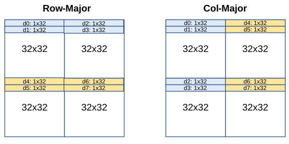</p><p align="center">图 8‑1 BIRENSUPA 矩阵乘法运算并输出到线程本地寄存器 FP32 数据类型分布</p>

一个从矩阵乘法运算并输出到线程本地寄存器的 float8（d0，d1，d2，d3，d4，d5，d6，d7）。

- Matrix3D/Matrix/DynMatrix3D/DynMatrixBLOCK_ROW_MAJOR 张量：

- 输出形状为 64 \* 64：d0，d1，d2，d3 对应第一次 FP32 数据类型的 burst4 存储到起始坐标为 (h + warp_idx \* 2, w) 的 BLOCK_ROW_MAJOR 矩阵张量；d4，d5，d6，d7 对应第二次 FP32 数据类型的 burst4 存储到起始坐标为(h + warp_idx \* 2 + 32 ,w)的 BLOCK_ROW_MAJOR 矩阵张量。

- 输出形状为 64 \* 32：d0，d1，d4，d5 会获得输出数据，d2，d3，d6，d7 不会收到输出数据；d0，d1 对应第一次 FP32 数据类型的 burst2 存储到起始坐标为 (h + warp_idx \* 2, w) 的 BLOCK_ROW_MAJOR 矩阵张量；d4，d5 对应第二次 FP32 数据类型的 burst2 存储到起始坐标为 (h + warp_idx \* 2 + 32, w) 的 BLOCK_ROW_MAJOR 矩阵张量。

- Matrix3D/Matrix/DynMatrix3D/DynMatrixBLOCK_COL_MAJOR 张量：

- 输出形状为 64 \* 64：d0，d1，d2，d3 对应第一次 FP32 数据类型的 burst4 存储到起始坐标为 (h + warp_idx \* 2, w) 的 BLOCK_COL_MAJOR 矩阵张量；d4，d5，d6，d7 对应第二次 FP32 数据类型的 burst4 存储到起始坐标为 (h + warp_idx \* 2, w + 32) 的 BLOCK_COL_MAJOR 矩阵张量。

- 输出形状为 64 \* 32：d0，d1，d2，d3 会获得输出数据，d4，d5，d6，d7 不会收到输出数据；d0，d1，d2，d3 对应 FP32 数据类型的 burst4 存储到起始坐标为 (h + warp_idx \* 2, w) 的 BLOCK_COL_MAJOR 矩阵张量。

累加器需要在进行输出后重新创建或者调用[累加器清空 API](#累加器清空-API)。

```cpp
template <TCI_MATH_MODE TCI_MATH = TCI_TF32P_MODE, typename EA, typename EB,
		  BUFFER_PADDING_MODE B_PAD_MA, BUFFER_PADDING_MODE B_PAD_MB,
		  suMemArchType MemType, MatrixLayout Layout, ushort N, ushort H,
		  ushort W, ushort MMA_H, ushort MMA_W, ushort K, wti::REDUCE_MODE M>
__device__ void
__mma(float8 *out, Matrix3D<FP32, MemType, Layout, N, H, W> OutRef,
      __mma_acc<MMA_H, MMA_W> *acc, wti::__reduce_buf<4, M> *grb,
      const __mma_buf<A_BUF, EA, MMA_H, K, B_PAD_MA> &A,
      const __mma_buf<B_BUF, EB, K, MMA_W, B_PAD_MB> &B);

template <TCI_MATH_MODE TCI_MATH = TCI_TF32P_MODE, typename EA, typename EB,
		  BUFFER_PADDING_MODE B_PAD_MA, BUFFER_PADDING_MODE B_PAD_MB,
		  suMemArchType MemType, MatrixLayout Layout, ushort MMA_H,
		  ushort MMA_W, ushort K, wti::REDUCE_MODE M>
__device__ void __mma(float8 *out, DynMatrix3D<FP32, MemType, Layout> OutRef,
                      __mma_acc<MMA_H, MMA_W> *acc,
                      wti::__reduce_buf<4, M> *grb,
                      const __mma_buf<A_BUF, EA, MMA_H, K, B_PAD_MA> &A,
                      const __mma_buf<B_BUF, EB, K, MMA_W, B_PAD_MB> &B);
```

进行矩阵乘法运算并输出到 FP32 数据类型的线程本地寄存器。

根据壁仞通用 GPU 硬件设计，当矩阵乘法运算并输出的本地寄存器数据类型为 BF16 时，会使用 \_\_bf164_pair 作为输出类型。

当一个 `__bf164_pair`（first()：d0，d1，d2，d3；second()：d8，d9，d10，d11）作为一个矩阵乘法运算的输出类型时：

- Matrix3D/Matrix/DynMatrix3D/DynMatrix BLOCK_ROW_MAJOR  张量：

  - 输出形状为  64 \* 64：first() 对应第一次  BF16  数据类型的  burst 2  存储到起始坐标为  (h + warp_idx \* 2, w)  的  BLOCK_ROW_MAJOR  矩阵张量；second() 对应第二次  BF16  数据类型的  burst 2  存储到起始坐标为  (h + warp_idx \* 2 + 32, w)  的  BLOCK_ROW_MAJOR  矩阵张量。

  - 输出形状为  64 \* 32：

    - first()：d0，d1 会受到数据，对应  BF16  数据类型的  burst 1  存储到起始坐标为  (h + warp_idx \* 2, w)  的  BLOCK_ROW_MAJOR  矩阵张量；d2，d3 不会受到数据。

    - second()：d8，d9 会受到数据，对应  BF16  数据类型的  burst 1  存储到起始坐标为  (h + warp_idx \* 2, w + 32)  的  BLOCK_ROW_MAJOR  矩阵张量；d10，d11 不会受到数据。

- Matrix3D/Matrix/DynMatrix3D/DynMatrix BLOCK_COL_MAJOR  张量：

  - 输出形状为  64 \* 64：first() 对应第一次  BF16  数据类型的  burst 4  存储到起始坐标为  (h + warp_idx \* 2, w)  的  BLOCK_COL_MAJOR  矩阵张量；second() 对应第二次  BF16  数据类型的  burst 4  存储到起始坐标为  (h + warp_idx \* 2, w + 32)  的  BLOCK_COL_MAJOR  矩阵张量。

  - 输出形状为  64 \* 32：first() 会获得输出数据，对应  BF16  数据类型的  burst 4  存储到起始坐标为  (h + warp_idx \* 2, w)  的  BLOCK_COL_MAJOR  矩阵张量；second() 不会收到输出数据。

每两次 64 \* 64 形状的矩阵乘法运算的 `__bf164_pair` 输出可以使用 `__bf164_pair_combine()` API 组合成一个 bf1616。并且这个 bf1616 可以拆分成两个 bf168 对应两次 BF16 数据类型的 burst 4 存储。下图是一个线程束 0 在两次矩阵乘法运算输出到 BF16 本地寄存器的例子。

<p align="center">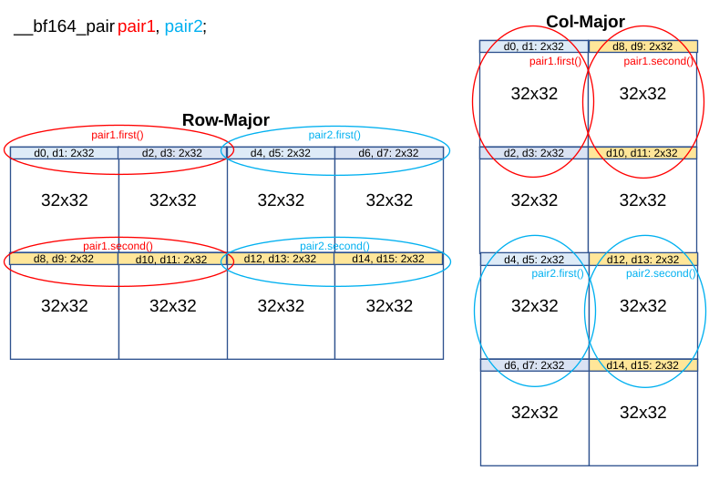</p><p align="center">图 8‑2 BIRENSUPA 矩阵乘法运算并输出到线程本地寄存器 BF16 数据类型分布</p>

两次矩阵乘法运算输出到两个  \_\_bf164_pair，第一次输出到 pair1（pair1.first()：d0，d1，d2，d3；pair1.second()：d8，d9，d10，d11），第二次输出到 pair2（pair2.first()：d4，d5，d6，d7；pair2.second()：d12，d13，d14，d15）。

- Matrix3D/Matrix/DynMatrix3D/DynMatrix BLOCK_ROW_MAJOR  张量：

- 输出形状为  64 \* 128：pair1.first() 和 pair2.first() 对应第一次  BF16  数据类型的  burst 4  存储到起始坐标为  (h + warp_idx \* 2, w)  的  BLOCK_ROW_MAJOR  矩阵张量；pair1.second() 和 pair2.second() 对应第二次  BF16  数据类型的  burst 2  存储到起始坐标为  (h + warp_idx \* 2 + 32, w)  的  BLOCK_ROW_MAJOR  矩阵张量。

- Matrix3D/Matrix/DynMatrix3D/DynMatrix BLOCK_COL_MAJOR  张量：

- 输出形状为  128 \* 64：pair1.first() 和 pair2.first() 对应第一次  BF16  数据类型的  burst 4  存储到起始坐标为  (h + warp_idx \* 2, w)  的  BLOCK_COL_MAJOR  矩阵张量；pair1.second() 和 pair2.second() 对应第二次  BF16  数据类型的  burst 4  存储到起始坐标为  (h + warp_idx \* 2, w + 32)  的  BLOCK_COL_MAJOR  矩阵张量。

```cpp
template <TCI_MATH_MODE TCI_MATH = TCI_TF32P_MODE, typename EA, typename EB,
		  BUFFER_PADDING_MODE B_PAD_MA, BUFFER_PADDING_MODE B_PAD_MB,
		  suMemArchType MemType, MatrixLayout Layout, ushort N, ushort H,
		  ushort W, ushort MMA_H, ushort MMA_W, ushort K, wti::REDUCE_MODE M>
__device__ void
__mma(__bf164_pair *out, Matrix3D<BF16, MemType, Layout, N, H, W> OutRef,
      __mma_acc<MMA_H, MMA_W> *acc, wti::__reduce_buf<4, M> *grb,
      const __mma_buf<A_BUF, EA, MMA_H, K, B_PAD_MA> &A,
      const __mma_buf<B_BUF, EB, K, MMA_W, B_PAD_MB> &B);

template <TCI_MATH_MODE TCI_MATH = TCI_TF32P_MODE, typename EA, typename EB,
		  BUFFER_PADDING_MODE B_PAD_MA, BUFFER_PADDING_MODE B_PAD_MB,
		  suMemArchType MemType, MatrixLayout Layout, ushort MMA_H,
		  ushort MMA_W, ushort K, wti::REDUCE_MODE M>
__device__ void
__mma(__bf164_pair *out, DynMatrix3D<BF16, MemType, Layout> OutRef,
      __mma_acc<MMA_H, MMA_W> *acc, wti::__reduce_buf<4, M> *grb,
      const __mma_buf<A_BUF, EA, MMA_H, K, B_PAD_MA> &A,
      const __mma_buf<B_BUF, EB, K, MMA_W, B_PAD_MB> &B);
```

进行矩阵乘法运算并输出到  \_\_bf164_pair  数据结构。

当壁仞通用 GPU 硬件设计版本等于 1.1 时，可通过配置模板参数 `SPARSITY_MODE` 使用稀疏矩阵计算。

> 注意：开启稀疏矩阵计算模式必须保证本次计算使用的 A 张量计算核心缓冲区中的数据是**从压缩稀疏矩阵中加载**获得的。


```cpp
template <TCI_MATH_MODE TCI_MATH, SPARSITY_MODE SPARSITY, typename EA,
          typename EB, BUFFER_PADDING_MODE B_PAD_MA,
          BUFFER_PADDING_MODE B_PAD_MB, suMemArchType MemType,
          MatrixLayout Layout, ushort N, ushort H, ushort W, ushort MMA_H,
          ushort MMA_W, ushort K, wti::REDUCE_MODE M>
__DEVICE_FUNCTIONS_DECL__ void
__mma(float8 *out, Matrix3D<FP32, MemType, Layout, N, H, W> OutRef,
      __mma_acc<MMA_H, MMA_W> *acc, wti::__reduce_buf<4, M> *grb,
      const __mma_buf<A_BUF, EA, MMA_H, K, B_PAD_MA> &A,
      const __mma_buf<B_BUF, EB, K, MMA_W, B_PAD_MB> &B);

template <TCI_MATH_MODE TCI_MATH, SPARSITY_MODE SPARSITY, typename EA,
          typename EB, BUFFER_PADDING_MODE B_PAD_MA,
          BUFFER_PADDING_MODE B_PAD_MB, suMemArchType MemType,
          MatrixLayout Layout, ushort N, ushort H, ushort W, ushort MMA_H,
          ushort MMA_W, ushort K, wti::REDUCE_MODE M>
__DEVICE_FUNCTIONS_DECL__ void
__mma(__bf164_pair *out, Matrix3D<BF16, MemType, Layout, N, H, W> OutRef,
      __mma_acc<MMA_H, MMA_W> *acc, wti::__reduce_buf<4, M> *grb,
      const __mma_buf<A_BUF, EA, MMA_H, K, B_PAD_MA> &A,
      const __mma_buf<B_BUF, EB, K, MMA_W, B_PAD_MB> &B)

template <TCI_MATH_MODE TCI_MATH, SPARSITY_MODE SPARSITY, typename EA,
          typename EB, BUFFER_PADDING_MODE B_PAD_MA,
          BUFFER_PADDING_MODE B_PAD_MB, suMemArchType MemType,
          MatrixLayout Layout, ushort MMA_H, ushort MMA_W, ushort K,
          wti::REDUCE_MODE M>
__DEVICE_FUNCTIONS_DECL__ void
__mma(float8 *out, DynMatrix3D<FP32, MemType, Layout> OutRef,
      __mma_acc<MMA_H, MMA_W> *acc, wti::__reduce_buf<4, M> *grb,
      const __mma_buf<A_BUF, EA, MMA_H, K, B_PAD_MA> &A,
      const __mma_buf<B_BUF, EB, K, MMA_W, B_PAD_MB> &B);

template <TCI_MATH_MODE TCI_MATH, SPARSITY_MODE SPARSITY, typename EA,
          typename EB, BUFFER_PADDING_MODE B_PAD_MA,
          BUFFER_PADDING_MODE B_PAD_MB, suMemArchType MemType,
          MatrixLayout Layout, ushort MMA_H, ushort MMA_W, ushort K,
          wti::REDUCE_MODE M>
__DEVICE_FUNCTIONS_DECL__ void
__mma(__bf164_pair *out, DynMatrix3D<BF16, MemType, Layout> OutRef,
      __mma_acc<MMA_H, MMA_W> *acc, wti::__reduce_buf<4, M> *grb,
      const __mma_buf<A_BUF, EA, MMA_H, K, B_PAD_MA> &A,
      const __mma_buf<B_BUF, EB, K, MMA_W, B_PAD_MB> &B);
```

壁仞通用 GPU 硬件设计版本等于 1.1 支持 FP16 类型张量，但是不支持 FP16 类型寄存器，FP16 数据可输出到 BF16 类型寄存器上。因为 BF16 类型在寄存器上按照 20 位浮点数存储（S1/E8/M11），因此 BF16 类型寄存器可以完整表达 FP16 类型数据精度。

### 加载卷积运算缓冲区

BIRENSUPA 定义了 A 或 B 张量计算核缓冲区在卷积运算前存放需要运算的权重和激活数据。

#### 加载卷积运算权重缓冲区

BIRENSUPA 定义了 A 张量计算核缓冲区（A_BUF）在卷积运算前存放需要运算的卷积权重数据。这种缓冲区被定义成了[\_\_conv_weight_buf](#卷积运算权重缓冲区-1)。

在 BIRENSUPA 中加载卷积运算权重缓冲区需要遵循下表的尺寸规则。

- A_BUF 卷积运算权重缓冲区

| 数据类型 | 缓冲区形状（输出通道 \* 输入通道） | 参数            |
| -------- | ---------------------------------- | --------------- |
| FP32     | 64 och \* 4K ich                   | K = 1, 4, 8, 16 |
| BF16     | 64 och \* 8K ich                   | K = 1, 4, 8, 16 |
| S8       | 64 och \* 16K ich                  | K = 1, 4, 8, 16 |
| S4       | 64 och \* 32K ich                  | K = 1, 4, 8     |

在进行权重缓冲区加载时，BIRENSUPA 提供了在输出通道和输入通道维度转置的功能。同时，权重缓冲区在加载和转置时对维度和数据类型有以下限制：

- 加载和转置限制：

| 数据类型 | 缓冲区 A               |
| -------- | ---------------------- |
| FP32     | 允许加载。             |
| BF16/S16 | 允许加载。             |
| S8/U8    | 允许加载，不允许转置。 |
| S4       | 允许加载，不允许转置。 |

当设置 tci::TENSOR_BWD_TYPE 为 tci::TENSOR_BPA 的时候，卷积核将会被硬件翻转。

<p align="center">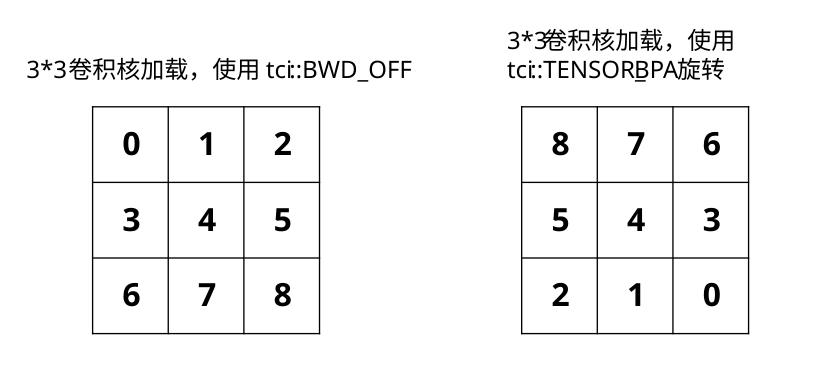</p><p align="center">图 8‑3 BIRENSUPA 加载卷积运算权重缓冲区 3 * 3 卷积核</p>

加载卷积运算权重缓冲区 API 需要使用[张量卷积配置器](#tensorconvconfig)来设置卷积核的长宽、填充、步幅和扩张。

使用 BUFFER_PADDING_MODE 来配置填充模式。

| 填充模式                    | 是否允许 |
| --------------------------- | -------- |
| BUFFER_PADDING_AUTO         | 允许     |
| BUFFER_PADDING_NONE         | 允许     |
| BUFFER_PADDING_BOTTOM       | 不允许   |
| BUFFER_PADDING_RIGHT        | 不允许   |
| BUFFER_PADDING_BOTTOM_RIGHT | 不允许   |

`__load_input_buf` API 使用在 L2StoreControl 命名空间下的[L2 存储配置参数](#l2-存储控制)来配置 L2 存储。

当壁仞通用 GPU 硬件设计版本等于 1.1 时，张量核心新增可支持从 FP16 类型张量加载数据进入张量计算核缓冲区，其可使用的缓冲区大小以及使用要求与 BF16 相同。

```cpp
template <LD_TRANSPOSE trans = NOT_TRANSPOSE,
		  L2LoadControl::OptionalParameters L2LParam = L2LoadControl::NONE,
		  typename E, BUFFER_PADDING_MODE B_PAD_M, ushort BOUT, ushort BIN,
		  ushort BH, ushort BW, suMemArchType MemType, ushort N, ushort KC_OUT,
		  ushort KC_IN, ushort H, ushort W, ushort filter_height,
		  ushort filter_width, int padX, int padY, uint stride, uint dilation,
		  TENSOR_BWD_TYPE bwd>
__device__ void
__load_input_buf(__conv_weight_buf<A_BUF, E, BOUT, BIN, BH, BW, B_PAD_M> *buf,
                 ConvWeights<E, MemType, N, KC_OUT, KC_IN, H, W> Weights,
                 CoordinateConvWeight coord,
                 TensorConvConfig<filter_height, filter_width, padX, padY,
                 stride, dilation, bwd>
                 config);

template <LD_TRANSPOSE trans = NOT_TRANSPOSE,
		  L2LoadControl::OptionalParameters L2LParam = L2LoadControl::NONE,
		  typename E, BUFFER_PADDING_MODE B_PAD_M, ushort BOUT, ushort BIN,
		  ushort BH, ushort BW, suMemArchType MemType, ushort filter_height,
		  ushort filter_width, int padX, int padY, uint stride, uint dilation,
		  TENSOR_BWD_TYPE bwd>
__device__ void
__load_input_buf(__conv_weight_buf<A_BUF, E, BOUT, BIN, BH, BW, B_PAD_M> *buf,
                 DynConvWeights<E, MemType> Weights, CoordinateConvWeight coord,
                 TensorConvConfig<filter_height, filter_width, padX, padY,
                 stride, dilation, bwd>
                 config);
```

从 ConvWeights/ConvWeight/DynConvWeights/DynConvWeight 张量中向卷积运算权重缓冲区（缓冲区 A）加载数据。

当壁仞通用 GPU 硬件设计版本等于 1.1 时，张量核心新增可支持从压缩卷积权重张量中加载数据进入 A 张量计算核缓冲区，API 接口与加载非压缩卷积权重相似。

```cpp
template <LD_TRANSPOSE trans = NOT_TRANSPOSE,
          L2LoadControl::OptionalParameters L2LParam = L2LoadControl::NONE,
          typename E, BUFFER_PADDING_MODE B_PAD_M, ushort BOUT, ushort BIN,
          ushort H, ushort W, suMemArchType MemType, SPARSITY_MODE Sparsity,
          ushort N, ushort KC_OUT, ushort KC_IN, ushort filter_height,
          ushort filter_width, int padX, int padY, uint stride, uint dilation,
          TENSOR_BWD_TYPE bwd>
__DEVICE_FUNCTIONS_DECL__ void __load_input_buf(
    __conv_weight_buf<A_BUF, E, BOUT, BIN, H, W, B_PAD_M> *buf,
    CompressedConvWeights<E, MemType, Sparsity, N, KC_OUT, KC_IN, H, W> Weights,
    CoordinateConvWeight coord,
    TensorConvConfig<filter_height, filter_width, padX, padY, stride, dilation,
                     bwd>
        config);

template <LD_TRANSPOSE trans = NOT_TRANSPOSE,
          L2LoadControl::OptionalParameters L2LParam = L2LoadControl::NONE,
          typename E, BUFFER_PADDING_MODE B_PAD_M, ushort BOUT, ushort BIN,
          ushort H, ushort W, suMemArchType MemType, SPARSITY_MODE Sparsity,
          ushort filter_height, ushort filter_width, int padX, int padY,
          uint stride, uint dilation, TENSOR_BWD_TYPE bwd>
__DEVICE_FUNCTIONS_DECL__ void
__load_input_buf(__conv_weight_buf<A_BUF, E, BOUT, BIN, H, W, B_PAD_M> *buf,
                 DynCompressedConvWeights<E, MemType, Sparsity> Weights,
                 CoordinateConvWeight coord,
                 TensorConvConfig<filter_height, filter_width, padX, padY,
                                  stride, dilation, bwd>
                     config);
```

压缩张量只能被加载进入 A 张量计算核缓冲区,加载时**不能进行转置**。

除了加载时的转置类型限制外，压缩张量的加载尺寸规则和非压缩张量相同。

#### 加载卷积运算激活缓冲区

BIRENSUPA 定义了 B 张量计算核缓冲区（B\_BUF）在卷积运算前存放需要运算的卷积激活数据。这种缓冲区被定义成了[`__conv_act_buf`](#卷积运算激活缓冲区)。

在 BIRENSUPA 中加载卷积运算激活缓冲区需要遵循下表的尺寸规则。

- B\_BUF 卷积运算激活缓冲区

| 数据类型 | 缓冲区形状（输出通道 \* 高 \* 宽） | 参数            |
| -------- | ---------------------------------- | --------------- |
| FP32     | 4K och \* 8 \* 8                   | K = 1, 4, 8, 16 |
| BF16     | 8K och \* 8 \* 8                   | K = 1, 4, 8, 16 |
| S8/U8    | 16K och \* 8 \* 8                  | K = 1, 4, 8, 16 |

在进行激活缓冲区加载时，BIRENSUPA 提供了在输出通道和高 \* 宽（8 \* 8）小块维度转置的功能。同时，权重缓冲区在加载和转置时对维度和数据类型有以下限制：

- 加载和转置限制：

| 数据类型 | 缓冲区 B               |
| -------- | ---------------------- |
| FP32     | 允许加载。             |
| BF16/S16 | 允许加载。             |
| S8/U8    | 允许加载，不允许转置。 |
| S4       | 不允许加载。           |

当卷积的卷积核为 1 \* 1 时，BIRENSUPA 可以简单的管理全部 256KB 的[卷积运算激活缓冲区](#卷积运算激活缓冲区)。以下是一个 1 \* 1 卷积核进行卷积运算激活缓冲区的例子。

<p align="center">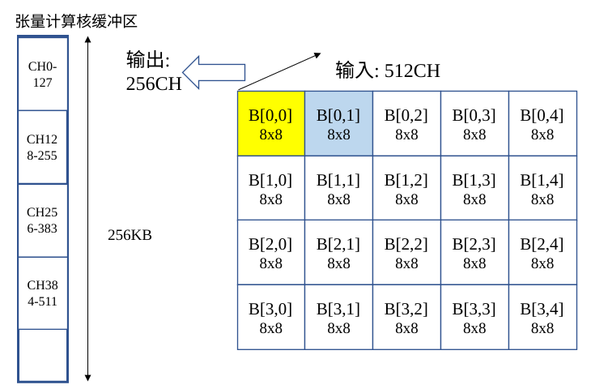</p><p align="center">图 8‑4 BIRENSUPA 加载 1 * 1 卷积核时的激活缓冲区</p>

当卷积核的尺寸大于 1 \* 1，壁仞通用 GPU 硬件在进行卷积运算激活缓冲区加载时有特殊的实现。

- 当卷积卷积运算使用填充时，壁仞通用 GPU 硬件实际对激活缓冲区加载数据的左上角会根据输入的坐标信息和张量配置参数中的填充信息进行偏移（coord.h - PadY, coord.h - PadX）。

- 当卷积核的高大于 1 时，除去原来的 8 \* 8 面的数据（主体）会被加载，主体下方的 8 \* 8 数据也会被视为下部填充（尾部）加载。

- 当卷积核的宽大于 1 时，壁仞通用 GPU 硬件会启用一个特殊的激活缓冲区加载模式，在这种模式下 256KB 的激活缓冲区会被分为两个 128KB 的部分。第一次加载时（使用 PADDING_RIGHT_BOTTOM）主体部分和他的尾部（如果存在）会被加载到第一个 128KB 的激活缓冲区区域，其右侧的填充和右侧填充的尾部（如果存在）会被储存到另一个 128KB 中对应的位置；之后的每次加载（使用 PADDING_RIGHT_BOTTOM 同时在 W 方向进行循环），可以只读取右侧填充部分，并覆盖上一次读取的主体和主体的尾部。

以下 3 \* 3 卷积核的例子，它使用主体/尾部模式进行底部填充，同时使用 128KB 缓冲区拆分模式进行右侧填充。

<p align="center">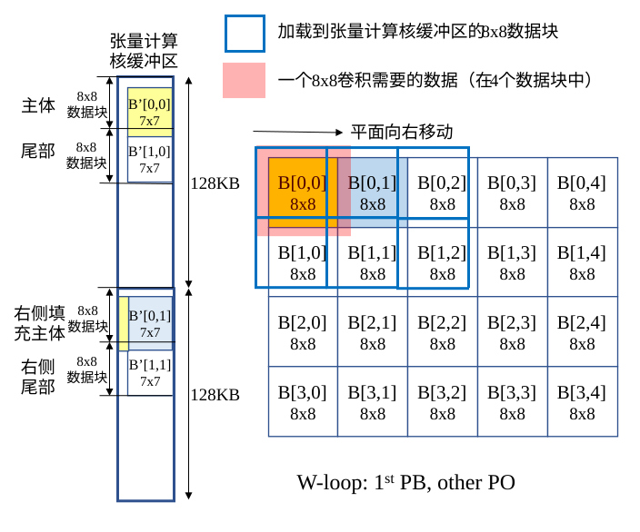</p><p align="center">图 8‑5 BIRENSUPA 加载 3 * 3 卷积核时的激活缓冲区</p>

总结来说，BIRENSUPA 会根据卷积核的形状（KH，KW）的不同来启动不同的激活缓冲区加载模式。

- KH = 1, KW = 1：简单的使用 256KB 激活缓冲区加载；

- KH = 1, KW > 1：使用 128KB 拆分模式，不使用自动加载尾部；

- KH > 1, KW = 1：不使用 128KB 拆分模式，使用自动加载尾部；

- KH > 1, KW > 1：使用 128KB 拆分模式，使用自动加载尾部。

BIRENSUPA 会自动控制主体和尾部的读取，并通过[读取边界控制模式](#读取转置模式)128KB 拆分模式下的主体和右侧填充的读取。

- PADDING_RIGHT_BOTTOM：加载主体和尾部（如果存在）并同时加载他们的右侧填充；

- PADDING_RIGHT_BOTTOM_ONLY：只加载主体和尾部（如果存在）的右侧填充；

- PADDING_AUTO：编译器自动控制。

使用[读取边界控制模式](#读取转置模式)，BIRENSUPA 需要最内侧循环在 W 方向。

加载卷积运算激活缓冲区 API 需要使用[张量卷积配置器](#tensorconvconfig)来设置卷积核的长宽、填充、步幅和扩张。

<table><tr><td bgcolor=#ffeccc><b>注意：</b>每个激活缓冲区只能使用张量卷积配置器（tensorconvconfig）中相同的一组卷积核的长宽（filter_height 和 filter_width）进行卷积运算激活缓冲区加载。</td></tr></table>

使用 BUFFER_PADDING_MODE 来配置填充模式。

| 填充模式                    | 是否允许               |
| --------------------------- | ---------------------- |
| BUFFER_PADDING_AUTO         | 允许                   |
| BUFFER_PADDING_NONE         | 允许（KH = 1, KW = 1） |
| BUFFER_PADDING_BOTTOM       | 允许（KH > 1, KW = 1） |
| BUFFER_PADDING_RIGHT        | 允许（KH = 1, KW > 1） |
| BUFFER_PADDING_BOTTOM_RIGHT | 允许（KH > 1, KW > 1） |

`__load_input_buf` API 使用在 L2StoreControl 命名空间下的[L2 存储配置参数](#l2-存储控制)来配置 L2 存储。

```cpp
template <LD_TRANSPOSE trans = NOT_TRANSPOSE, LOAD_CONV_PAD P = PADDING_AUTO,
		  L2LoadControl::OptionalParameters L2LParam = L2LoadControl::NONE,
		  typename E, BUFFER_PADDING_MODE B_PAD_M, ushort BC, ushort BH,
		  ushort BW, suMemArchType MemType, ushort N, ushort C, ushort H,
		  ushort W, ushort filter_height, ushort filter_width, int padX,
		  int padY, uint stride, uint dilation, TENSOR_BWD_TYPE bwd>
__device__ void
__load_input_buf(__conv_act_buf<B_BUF, E, BC, BH, BW, B_PAD_M> *buf,
                 Activation<E, MemType, N, C, H, W> A, Coordinate coord,
                 TensorConvConfig<filter_height, filter_width, padX, padY,
                 stride, dilation, bwd>
                 config);

template <LD_TRANSPOSE trans = NOT_TRANSPOSE, LOAD_CONV_PAD P = PADDING_AUTO,
		  L2LoadControl::OptionalParameters L2LParam = L2LoadControl::NONE,
		  typename E, BUFFER_PADDING_MODE B_PAD_M, ushort BC, ushort BH,
		  ushort BW, suMemArchType MemType, ushort filter_height,
		  ushort filter_width, int padX, int padY, uint stride, uint dilation,
		  TENSOR_BWD_TYPE bwd>
__device__ void
__load_input_buf(__conv_act_buf<B_BUF, E, BC, BH, BW, B_PAD_M> *buf,
                 DynActivation<E, MemType> A, Coordinate coord,
                 TensorConvConfig<filter_height, filter_width, padX, padY,
                 stride, dilation, bwd>
                 config);
```

从 Activation/DynActivation 张量中向卷积运算激活缓冲区（缓冲区 B）加载数据。

### 卷积运算

BIRENSUPA 卷积运算 API。根据壁仞通用 GPU 硬件设计，BIRENSUPA 张量核心卷积运算 API 仅支持 FP32 和 BF16 做事运算输出的数据类型。同时卷积运算时，矩阵乘法运算缓冲区 A 和 B 的数据类型限制依照下表。

- 输出数据类型为 FP32 仅支持矩阵乘法运算缓冲区 A 和 B 的数据类型均为 FP32。

| 数据类型<br />(权重 \* 激活)           | 卷积形状<br />(输出通道 \* 输入通道 \* 高 \* 宽) | 参数            |
| -------------------------------------- | ------------------------------------------------ | --------------- |
| FP32 \* FP32                           | 64 \* 4K \* 8 \* 8                               | K = 1, 4, 8, 16 |
| BF16 \* BF16                           | 64 \* 8K \* 8 \* 8                               | K = 1, 4, 8, 16 |
| S8 \* S8, S8 \* U8, U8 \* S8, U8 \* U8 | 64 \* 16K \* 8 \* 8                              | K = 1, 4, 8, 16 |
| S8 \* S16, S8 \* BF16                  | 64 \* 8K \* 8 \* 8                               | K = 1, 4, 8, 16 |
| S4 \* S8, S4 \* U8                     | 64 \* 16K \* 8 \* 8                              | K = 1, 4, 8, 16 |

在进行卷积运算时，卷积运算精度始终是 `TCI_TF32P_MODE`（24 位运算）。

在 BIRENSUPA 张量核心卷积运算 API 中，使用[卷积运算累加器](#卷积运算累加器)来暂存每次运算的临时结果。此累加器不需要设置数据类型，其内部会按照 38 位进行累加。一个矩阵乘法运算和卷积运算的生命周期中，只能同时存在一个矩阵乘法运算累加器或卷积运算累加器，任何新创建的累加器都会初始化其中的结果。[累加器清空 API](#累加器清空-API)可以被用来手动重置累加器内数据。

在 BIRENSUPA 张量核心卷积运算 API 中，同一行输出通道的和与平方和可以在进行卷积运算的同时被使用[归约缓冲区](#归约缓冲区-1)计算。在壁仞通用 GPU 硬件中卷积运算会由整个流式处理器簇运算，所以每个线程束都会得到 4 个通道的和和平方和。具体每个线程束所获得的通道数可以参考[卷积运算并输出到线程本地寄存器](#卷积运算并输出到线程本地寄存器-1)时结果输出到线程本地寄存器对应的行数。

- `wti::REDUCE_NONE`: 不使用归约缓冲区；

- `wti::REDUCE_SUM`: 使用归约缓冲区，只计算和；

- `wti::REDUCE_SQ`: 使用归约缓冲区，只计算平方和；

- `wti::REDUCE_SSQ`: 使用归约缓冲区，同时计算和与平方和。

卷积运算权相关 API 需要使用[张量卷积配置器](#tensorconvconfig)来设置卷积核的长宽、填充、步幅和扩张。

#### 只进行卷积运算

BIRENSUPA 卷积运算只进行运算的 API。

因壁仞通用 GPU 硬件设计需求，张量核心卷积只进行运算的 API 需要输入一个 Activation/DynActivation 类型的张量参数作为参考参数。

```cpp
template <typename E, typename EA, typename EW, BUFFER_PADDING_MODE B_PAD_MA,
		  BUFFER_PADDING_MODE B_PAD_MW, suMemArchType MemType, ushort N,
		  ushort C, ushort H, ushort W, ushort KC_OUT, wti::REDUCE_MODE M,
		  ushort KC_IN, ushort BH, ushort BW, ushort KH, ushort KW,
		  ushort filter_height, ushort filter_width, int padX, int padY,
		  uint stride, uint dilation, TENSOR_BWD_TYPE bwd>
__device__ void __conv(
	Activation<E, MemType, N, C, H, W> OutRef, __conv_acc<KC_OUT, BH, BW> *acc,
	wti::__reduce_buf<4, M> *grb,
	const __conv_act_buf<B_BUF, EA, KC_IN, BH, BW, B_PAD_MA> &BufA,
	const __conv_weight_buf<A_BUF, EW, KC_OUT, KC_IN, KH, KW, B_PAD_MW> &BufW,
	TensorConvConfig<filter_height, filter_width, padX, padY, stride, dilation,
					bwd>
		config);

template <typename E, typename EA, typename EW, BUFFER_PADDING_MODE B_PAD_MA,
BUFFER_PADDING_MODE B_PAD_MW, suMemArchType MemType, ushort KC_OUT,
wti::REDUCE_MODE M, ushort KC_IN, ushort BH, ushort BW, ushort KH,
ushort KW, ushort filter_height, ushort filter_width, int padX,
int padY, uint stride, uint dilation, TENSOR_BWD_TYPE bwd>
__device__ void __conv(
DynActivation<E, MemType> OutRef, __conv_acc<KC_OUT, BH, BW> *acc,
wti::__reduce_buf<4, M> *grb,
const __conv_act_buf<B_BUF, EA, KC_IN, BH, BW, B_PAD_MA> &BufA,
const __conv_weight_buf<A_BUF, EW, KC_OUT, KC_IN, KH, KW, B_PAD_MW> &BufW,
TensorConvConfig<filter_height, filter_width, padX, padY, stride, dilation,
    			bwd>
	config);
```

只进行卷积运算，并将结果暂存累加器。

#### 卷积运算并输出到 Activation 张量

BIRENSUPA 卷积运算并输出到 Activation/DynActivation 张量的 API。

卷积运算并输出到 Activation 张量的 API 需要输入一个 Activation/DynActivation 类型的张量参数和一个坐标参数作为输出目标。

累加器需要在进行输出后重新创建或者调用[累加器清空 API](#累加器清空-API)。

卷积运算并输出到 Activation 张量 API 使用[PAD_WRITE_THROUGH](#写入穿透-1)模板参数控制是否同时写入张量缓冲区和张量实际内存。

卷积运算并输出到 Activation 张量 API 使用在 L2StoreControl 命名空间下的[OptionalParameters](#l2-存储控制)控制 L2 存储。

```cpp
template <PAD_WRITE_THROUGH WT = NOT_WRITE_THROUGH,
		  L2StoreControl::OptionalParameters L2SParam = L2StoreControl::NONE,
		  typename E, typename EA, typename EW, BUFFER_PADDING_MODE B_PAD_MA,
		  BUFFER_PADDING_MODE B_PAD_MW, suMemArchType MemType, ushort N,
		  ushort C, ushort H, ushort W, ushort KC_OUT, wti::REDUCE_MODE M,
		  ushort KC_IN, ushort BH, ushort BW, ushort KH, ushort KW,
		  ushort filter_height, ushort filter_width, int padX, int padY,
          uint stride, uint dilation, TENSOR_BWD_TYPE bwd>
__device__ void __conv(
	Activation<E, MemType, N, C, H, W> Out, Coordinate coord,
	__conv_acc<KC_OUT, BH, BW> *acc, wti::__reduce_buf<4, M> *grb,
	const __conv_act_buf<B_BUF, EA, KC_IN, BH, BW, B_PAD_MA> &BufA,
	const __conv_weight_buf<A_BUF, EW, KC_OUT, KC_IN, KH, KW, B_PAD_MW> &BufW,
	TensorConvConfig<filter_height, filter_width, padX, padY, stride, dilation,
					bwd>
		config);

template <PAD_WRITE_THROUGH WT = NOT_WRITE_THROUGH,
		  L2StoreControl::OptionalParameters L2SParam = L2StoreControl::NONE,
		  typename E, typename EA, typename EW, BUFFER_PADDING_MODE B_PAD_MA,
		  BUFFER_PADDING_MODE B_PAD_MW, suMemArchType MemType, ushort KC_OUT,
		  wti::REDUCE_MODE M, ushort KC_IN, ushort BH, ushort BW, ushort KH,
		  ushort KW, ushort filter_height, ushort filter_width, int padX,
		  int padY, uint stride, uint dilation, TENSOR_BWD_TYPE bwd>
__device__ void __conv(
	DynActivation<E, MemType> Out, Coordinate coord,
	__conv_acc<KC_OUT, BH, BW> *acc, wti::__reduce_buf<4, M> *grb,
	const __conv_act_buf<B_BUF, EA, KC_IN, BH, BW, B_PAD_MA> &BufA,
	const __conv_weight_buf<A_BUF, EW, KC_OUT, KC_IN, KH, KW, B_PAD_MW> &BufW,
	TensorConvConfig<filter_height, filter_width, padX, padY, stride, dilation,
					bwd>
		config);
```

进行卷积运算并输出到 Activation/DynActivation 张量。

#### 卷积运算并累加结果到 Activation 张量

BIRENSUPA 卷积运算并累加结果到 Activation/DynActivation 张量的 API。

<table><tr><td bgcolor=#ffeccc><b>注意：</b>按照壁仞通用 GPU 硬件设计要求，累加结果到 Activation 张量的卷积运算 API，不支持输出张量配置到张量缓冲区。</td></tr></table>

卷积运算并累加结果到 Activation 张量的 API 需要输入一个 Activation/DynActivation 类型的张量参数和一个坐标参数作为输出目标。

卷积运算并累加结果到 Activation 张量的 API 支持运算结果（累加器）数据类型与最终累加的目标张量数据类型不同。支持关系如下表：

- E_CONV Activation 张量 API 实际运算的数据类型

| 张量数据类型 | E_CONV 计算结果数据类型 |
| ------------ | ----------------------- |
| FP32         | FP32                    |
| BF16         | BF16                    |
| FP32         | BF16                    |

累加器需要在进行输出后重新创建或者调用[累加器清空 API](#累加器清空-API)。

卷积运算并累加结果到 Activation 张量的 API 使用在 L2StoreControl 命名空间下的[OptionalParameters](#l2-存储控制)控制 L2 存储。

```cpp
template <typename E_CONV,
		  L2StoreControl::OptionalParameters L2SParam = L2StoreControl::NONE,
		  typename E, typename EA, typename EW, BUFFER_PADDING_MODE B_PAD_MA,
		  BUFFER_PADDING_MODE B_PAD_MW, suMemArchType MemType, ushort N,
		  ushort C, ushort H, ushort W, ushort KC_OUT, ushort KC_IN, ushort BH,
		  ushort BW, ushort KH, ushort KW, ushort filter_height,
          ushort filter_width, int padX, int padY, uint stride, uint dilation,
		  TENSOR_BWD_TYPE bwd>
__device__ void __conv_reduce_add(
	Activation<E, MemType, N, C, H, W> Out, Coordinate coord,
	__conv_acc<KC_OUT, BH, BW> *acc,
	const __conv_act_buf<B_BUF, EA, KC_IN, BH, BW, B_PAD_MA> &BufA,
	const __conv_weight_buf<A_BUF, EW, KC_OUT, KC_IN, KH, KW, B_PAD_MW> &BufW,
	TensorConvConfig<filter_height, filter_width, padX, padY, stride, dilation,
					bwd>
		config);

template <L2StoreControl::OptionalParameters L2SParam = L2StoreControl::NONE,
		  typename E, typename EA, typename EW, BUFFER_PADDING_MODE B_PAD_MA,
		  BUFFER_PADDING_MODE B_PAD_MW, suMemArchType MemType, ushort N,
		  ushort C, ushort H, ushort W, ushort KC_OUT, ushort KC_IN, ushort BH,
		  ushort BW, ushort KH, ushort KW, ushort filter_height,
	 	 ushort filter_width, int padX, int padY, uint stride, uint dilation,
		  TENSOR_BWD_TYPE bwd>
__device__ void __conv_reduce_add(
	Activation<E, MemType, N, C, H, W> Out, Coordinate coord,
	__conv_acc<KC_OUT, BH, BW> *acc,
	const __conv_act_buf<B_BUF, EA, KC_IN, BH, BW, B_PAD_MA> &BufA,
	const __conv_weight_buf<A_BUF, EW, KC_OUT, KC_IN, KH, KW, B_PAD_MW> &BufW,
	TensorConvConfig<filter_height, filter_width, padX, padY, stride, dilation,
					bwd>
		config);

template <typename E_CONV,
		  L2StoreControl::OptionalParameters L2SParam = L2StoreControl::NONE,
		  typename E, typename EA, typename EW, BUFFER_PADDING_MODE B_PAD_MA,
		  BUFFER_PADDING_MODE B_PAD_MW, suMemArchType MemType, ushort KC_OUT,
		  ushort KC_IN, ushort BH, ushort BW, ushort KH, ushort KW,
		  ushort filter_height, ushort filter_width, int padX, int padY,
		  uint stride, uint dilation, TENSOR_BWD_TYPE bwd>
__device__ void __conv_reduce_add(
	DynActivation<E, MemType> Out, Coordinate coord,
	__conv_acc<KC_OUT, BH, BW> *acc,
	const __conv_act_buf<B_BUF, EA, KC_IN, BH, BW, B_PAD_MA> &BufA,
	const __conv_weight_buf<A_BUF, EW, KC_OUT, KC_IN, KH, KW, B_PAD_MW> &BufW,
	TensorConvConfig<filter_height, filter_width, padX, padY, stride, dilation,
					bwd>
		config);

template <L2StoreControl::OptionalParameters L2SParam = L2StoreControl::NONE,
		  typename E, typename EA, typename EW, BUFFER_PADDING_MODE B_PAD_MA,
		  BUFFER_PADDING_MODE B_PAD_MW, suMemArchType MemType, ushort KC_OUT,
		  ushort KC_IN, ushort BH, ushort BW, ushort KH, ushort KW,
		  ushort filter_height, ushort filter_width, int padX, int padY,
		  uint stride, uint dilation, TENSOR_BWD_TYPE bwd>
__device__ void __conv_reduce_add(
	DynActivation<E, MemType> Out, Coordinate coord,
	__conv_acc<KC_OUT, BH, BW> *acc,
	const __conv_act_buf<B_BUF, EA, KC_IN, BH, BW, B_PAD_MA> &BufA,
	const __conv_weight_buf<A_BUF, EW, KC_OUT, KC_IN, KH, KW, B_PAD_MW> &BufW,
	TensorConvConfig<filter_height, filter_width, padX, padY, stride, dilation,
					bwd>
		config);
```

进行卷积运算并累加结果到 Activation/DynActivation 张量。

#### 卷积运算并输出到线程本地寄存器

BIRENSUPA 卷积运算并输出到线程本地寄存器的 API。

壁仞通用 GPU 硬件在卷积运算并输出到 FP32 数据类型的线程本地寄存器时，每个线程束所获得的数据对应，使用两次 burst 4 的线程束级输出 API，输出到 Activation/DynActivation 张量的数据。

<p align="center">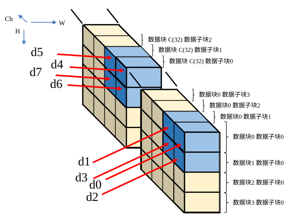</p><p align="center">图 8‑6 BIRENSUPA 卷积运算并输出到线程本地寄存器 FP32 数据类型分布</p>

一个从卷积运算并输出到线程本地寄存器的 float8（d0，d1，d2，d3，d4，d5，d6，d7）。

- Activation/DynActivation 张量；

- 输出形状为 64 \* 8 \* 8：d0，d1，d2，d3 对应第一次 FP32 数据类型的 burst 4 存储到起始坐标为 (c + warp_idx \* 2, h, w) 的 Activation/DynActivation 张量；d4，d5，d6，d7 对应第二次 FP32 数据类型的 burst 4 存储到起始坐标为 (c + warp_idx \* 2 + 32, h, w) 的 Activation/DynActivation 张量。

累加器需要在进行输出后重新创建或者调用[累加器清空 API](#累加器清空-API)。

```cpp
template <typename EA, typename EW, BUFFER_PADDING_MODE B_PAD_MA,
		  BUFFER_PADDING_MODE B_PAD_MW, suMemArchType MemType, ushort N,
		  ushort C, ushort H, ushort W, ushort KC_OUT, wti::REDUCE_MODE M,
		  ushort KC_IN, ushort BH, ushort BW, ushort KH, ushort KW,
		  ushort filter_height, ushort filter_width, int padX, int padY,
		  uint stride, uint dilation, TENSOR_BWD_TYPE bwd>
__device__ void __conv(
	float8 *out, Activation<FP32, MemType, N, C, H, W> OutRef, Coordinate coord,
	__conv_acc<KC_OUT, BH, BW> *acc, wti::__reduce_buf<4, M> *grb,
	const __conv_act_buf<B_BUF, EA, KC_IN, BH, BW, B_PAD_MA> &BufA,
	const __conv_weight_buf<A_BUF, EW, KC_OUT, KC_IN, KH, KW, B_PAD_MW> &BufW,
	TensorConvConfig<filter_height, filter_width, padX, padY, stride, dilation,
					bwd>
		config);

template <typename EA, typename EW, BUFFER_PADDING_MODE B_PAD_MA,
		  BUFFER_PADDING_MODE B_PAD_MW, suMemArchType MemType, ushort KC_OUT,
		  wti::REDUCE_MODE M, ushort KC_IN, ushort BH, ushort BW, ushort KH,
		  ushort KW, ushort filter_height, ushort filter_width, int padX,
		  int padY, uint stride, uint dilation, TENSOR_BWD_TYPE bwd>
__device__ void __conv(
	float8 *out, DynActivation<FP32, MemType> OutRef, Coordinate coord,
	__conv_acc<KC_OUT, BH, BW> *acc, wti::__reduce_buf<4, M> *grb,
	const __conv_act_buf<B_BUF, EA, KC_IN, BH, BW, B_PAD_MA> &BufA,
	const __conv_weight_buf<A_BUF, EW, KC_OUT, KC_IN, KH, KW, B_PAD_MW> &BufW,
	TensorConvConfig<filter_height, filter_width, padX, padY, stride, dilation,
					bwd>
		config);
```

进行卷积运算并输出到 FP32 数据类型的线程本地寄存器。

根据壁仞通用 GPU 硬件设计，当卷积运算并输出的本地寄存器数据类型为 BF16 时，会使用 \_\_bf164_pair 作为输出类型。

当一个 \_\_bf164_pair（first()：d0，d1，d2，d3；second()：d8，d9，d10，d11）作为一个卷积运算的输出类型时：

- Activation/DynActivation 张量：输出形状为 64 \* 8 \* 8：first() 对应第一次 BF16 数据类型的 burst 2 存储到起始坐标为 (c + warp_idx \* 2, h, w) 的 Activation/DynActivation 张量；second() 对应第二次 BF16 数据类型的 burst 2 存储到起始坐标为 (c + warp_idx \* 2 + 32, h, w) 的 Activation/DynActivation 张量。

每两次 64 \* 8 \* 8 形状的卷积运算的 `__bf164_pair` 输出可以使用 `__bf164_pair_combine()` API 组合成一个 bf1616。并且这个 bf1616 可以拆分成两个 bf168 对应两次 BF16 数据类型的 burst 4 存储。下图是一个线程束 0 在两次卷积运算输出到 BF16 本地寄存器的例子。

<p align="center">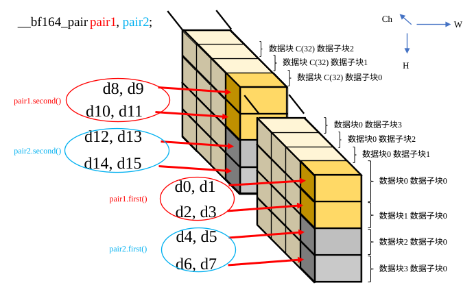</p><p align="center">图 8‑7 BIRENSUPA 卷积运算并输出到线程本地寄存器 BF16 数据类型分布</p>

两次卷积运算输出到两个 \_\_bf164_pair，第一次输出到 pair1（pair1.first()：d0，d1，d2，d3；pair1.second()：d8，d9，d10，d11），第二次输出到 pair2（pair2.first()：d4，d5，d6，d7；pair2.second()：d12，d13，d14，d15）。

- Activation/DynActivation 张量：输出形状为 64 \* 16 \* 8：first() 对应第一次 BF16 数据类型的 burst 4 存储到起始坐标为 (c + warp_idx \* 2, h, w) 的 Activation/DynActivation 张量；second() 对应第二次 BF16 数据类型的 burst 4 存储到起始坐标为 (c + warp_idx \* 2 + 32, h, w) 的 Activation/DynActivation 张量。

```cpp
template <typename EA, typename EW, BUFFER_PADDING_MODE B_PAD_MA,
		  BUFFER_PADDING_MODE B_PAD_MW, suMemArchType MemType, ushort N,
		  ushort C, ushort H, ushort W, ushort KC_OUT, wti::REDUCE_MODE M,
		  ushort KC_IN, ushort BH, ushort BW, ushort KH, ushort KW,
		  ushort filter_height, ushort filter_width, int padX, int padY,
		  uint stride, uint dilation, TENSOR_BWD_TYPE bwd>
__device__ void __conv(
	__bf164_pair *out, Activation<BF16, MemType, N, C, H, W> OutRef,
	Coordinate coord, __conv_acc<KC_OUT, BH, BW> *acc,
	wti::__reduce_buf<4, M> *grb,
	const __conv_act_buf<B_BUF, EA, KC_IN, BH, BW, B_PAD_MA> &BufA,
	const __conv_weight_buf<A_BUF, EW, KC_OUT, KC_IN, KH, KW, B_PAD_MW> &BufW,
	TensorConvConfig<filter_height, filter_width, padX, padY, stride, dilation,
					bwd>
		config);

template <typename EA, typename EW, BUFFER_PADDING_MODE B_PAD_MA,
		  BUFFER_PADDING_MODE B_PAD_MW, suMemArchType MemType, ushort KC_OUT,
		  wti::REDUCE_MODE M, ushort KC_IN, ushort BH, ushort BW, ushort KH,
		  ushort KW, ushort filter_height, ushort filter_width, int padX,
		  int padY, uint stride, uint dilation, TENSOR_BWD_TYPE bwd>
__device__ void __conv(
	__bf164_pair *out, DynActivation<BF16, MemType> OutRef, Coordinate coord,
	__conv_acc<KC_OUT, BH, BW> *acc, wti::__reduce_buf<4, M> *grb,
	const __conv_act_buf<B_BUF, EA, KC_IN, BH, BW, B_PAD_MA> &BufA,
	const __conv_weight_buf<A_BUF, EW, KC_OUT, KC_IN, KH, KW, B_PAD_MW> &BufW,
	TensorConvConfig<filter_height, filter_width, padX, padY, stride, dilation,
					bwd>
		config);
```

进行矩阵乘法运算并输出到  \_\_bf164_pair  数据结构。

### 加载矩阵乘法运算缓冲区（卷积权重反向传播模式）

BIRENSUPA 定义了 A 或 B 张量计算核缓冲区在矩阵乘法运算（卷积权重反向传播模式）前存放需要运算的矩阵数据。这种缓冲区被定义成了 \_\_mma_buf。

在 BIRENSUPA 中加载矩阵乘法运算缓冲区需要遵循下表的尺寸规则

- A_BUF

| 数据类型 | 缓冲区形状   |
| -------- | ------------ |
| FP32     | 64 \* 8 \* 8 |
| BF16     | 64 \* 8 \* 8 |

- B_BUF

| 数据类型 | 缓冲区形状    |
| -------- | ------------- |
| FP32     | 8 \* 8 \* 32N |
| BF16     | 8 \* 8 \* 32N |

在进行卷积权重反向传播模式矩阵缓冲区加载时，BIRENSUPA 需要使用固定的转置模式：

- A_BUF  必须为  NOT_TRANSPOSE  模式（已设为默认）

- B_BUF  必须为  TRANSPOSE  模式（已设为默认）

根据壁仞通用 GPU 硬件，在卷积权重反向传播模式下加载矩阵乘法运算进入缓冲区时必须添加张量卷积配置器来配置运算时权重的长宽、运算的填充、步幅和扩张。同时，运算方向必须设置为  tci::TENSOR_BPW。当权重的高大于 1 时，根据壁仞通用 GPU 硬件设计，当权重的高大于 1 时，自动加载额外 8 行作为填充。

使用 BUFFER_PADDING_MODE 来配置填充模式。

| 填充模式                    | A 缓冲区 | B 缓冲区       |
| --------------------------- | -------- | -------------- |
| BUFFER_PADDING_AUTO         | 允许     | 允许           |
| BUFFER_PADDING_NONE         | 允许     | 允许（KH = 1） |
| BUFFER_PADDING_BOTTOM       | 不允许   | 允许（KH > 1） |
| BUFFER_PADDING_RIGHT        | 不允许   | 不允许         |
| BUFFER_PADDING_BOTTOM_RIGHT | 不允许   | 不允许         |

\_\_load_input_buf API 使用在 L2StoreControl  命名空间下的 L2 存储配置参数来配置 L2 存储。

```cpp
template <LD_TRANSPOSE trans = NOT_TRANSPOSE,
		  L2LoadControl::OptionalParameters L2LParam = L2LoadControl::NONE,
		  typename E, BUFFER_PADDING_MODE B_PAD_M, ushort LOAD_C,
		  ushort LOAD_TILE, suMemArchType MemType, ushort N, ushort C, ushort H,
		  ushort W, ushort filter_height, ushort filter_width, int padX,
		  int padY, uint stride, uint dilation,
		  TENSOR_BWD_TYPE bwd = TENSOR_BPW>
__device__ void
__load_input_buf(__mma_buf<A_BUF, E, LOAD_C, LOAD_TILE, B_PAD_M> *buf,
                 Activation<E, MemType, N, C, H, W> A, Coordinate coord,
                 TensorConvConfig<filter_height, filter_width, padX, padY,
                 stride, dilation, bwd>
                 config);

template <LD_TRANSPOSE trans = NOT_TRANSPOSE,
		  L2LoadControl::OptionalParameters L2LParam = L2LoadControl::NONE,
		  typename E, BUFFER_PADDING_MODE B_PAD_M, ushort LOAD_C,
		  ushort LOAD_TILE, suMemArchType MemType, ushort N, ushort C, ushort H,
		  ushort W>
__device__ void
__load_input_buf(__mma_buf<A_BUF, E, LOAD_C, LOAD_TILE, B_PAD_M> *buf,
                 Activation<E, MemType, N, C, H, W> A, Coordinate coord);

template <LD_TRANSPOSE trans = NOT_TRANSPOSE,
		  L2LoadControl::OptionalParameters L2LParam = L2LoadControl::NONE,
		  typename E, BUFFER_PADDING_MODE B_PAD_M, ushort LOAD_C,
		  ushort LOAD_TILE, suMemArchType MemType, ushort filter_height,
		  ushort filter_width, int padX, int padY, uint stride, uint dilation,
		  TENSOR_BWD_TYPE bwd = TENSOR_BPW>
__device__ void
__load_input_buf(__mma_buf<A_BUF, E, LOAD_C, LOAD_TILE, B_PAD_M> *buf,
                 DynActivation<E, MemType> A, Coordinate coord,
                 TensorConvConfig<filter_height, filter_width, padX, padY,
                 stride, dilation, bwd>
                 config);

template <LD_TRANSPOSE trans = NOT_TRANSPOSE,
		  L2LoadControl::OptionalParameters L2LParam = L2LoadControl::NONE,
		  typename E, BUFFER_PADDING_MODE B_PAD_M, ushort LOAD_C,
		  ushort LOAD_TILE, suMemArchType MemType>
__device__ void
__load_input_buf(__mma_buf<A_BUF, E, LOAD_C, LOAD_TILE, B_PAD_M> *buf,
                 DynActivation<E, MemType> A, Coordinate coord);
```

从 Activation/DynActivation 张量中向矩阵乘法运算缓冲区加载卷积权重反向传播模式的数据。

### 卷积运算权重反向传播模式

BIRENSUPA 卷积运算权重反向传播模式（BPW）API。根据壁仞通用 GPU 硬件设计，BIRENSUPA 张量核心卷积运算权重反向传播模式 API 仅支持  FP32  和  BF16  作为运算输出的数据类型。同时卷积运算权重反向传播模式时，矩阵乘法运算缓冲区 A 和 B 的数据类型限制依照下表

- 输出数据类型为  FP32 时，  仅支持矩阵乘法运算缓冲区 A 和 B 的数据类型均为  FP32。

| **Data Type** | **BPW Shape <br />(O_CH \* TILE_H \* TILE_W \* ICH)** |
| ------------- | ----------------------------------------------------- |
| FP32 \* FP32  | 64 \* 8 \* 8 \* 64                                    |
| BF16 \* BF16  | 64 \* 8 \* 8 \* 64                                    |

在进行卷积运算权重反向传播模式时可以用 TCI_MATH_MODE 来定义乘法运算时的精度。

- TCI_TF32P_MODE: 24 位运算，默认模式。

- TCI_FP32_MODE: 32 位运算，只在进行  FP32 \* FP32  矩阵乘法时生效。

当壁仞通用 GPU 硬件设计版本等于 1.0，不适用 TCI_FP32_MODE 模式。

在 BIRENSUPA 张量核心卷积运算权重反向传播模式 API 中，使用矩阵乘法运算累加器来暂存每次运算的临时结果。此累加器不需要设置数据类型，其内部会按照 38 位进行累加。一个矩阵乘法运算和卷积运算（包括卷积运算权重反向传播模式）的生命周期中，只能同时存在一个矩阵乘法运算累加器或卷积运算累加器；任何新创建的累加器都会初始化其中的结果。[累加器清空 API](#累加器清空-api)  可以用于手动重置累加器内数据。

在 BIRENSUPA 张量核心卷积运算权重反向传播模式 API 中，同输出通道数据的和与平方和可以在进行卷积运算权重反向传播模式的同时使用[归约缓冲区](#归约缓冲区)计算。在壁仞通用 GPU 硬件中，卷积运算权重反向传播模式会由整个流式处理器簇运算，所以每个线程束都会得到 4 个输出通道的和与平方和。具体每个线程束所获得的行数可以参考[卷积运算权重反向传播模式并输出到线程本地寄存器](#卷积运算权重反向传播模式并输出到线程本地寄存器)

- wti::REDUCE_NONE: 不使用归约缓冲区

- wti::REDUCE_SUM: 使用归约缓冲区，只计算和

- wti::REDUCE_SQ: 使用归约缓冲区，只计算平方和

- wti::REDUCE_SSQ: 使用归约缓冲区，同时计算和与平方和

BIRENSUPA 允许在卷积运算权重反向传播模式时对缓冲区 B 使用更灵活精确的再加，API 中使用 start_byte_address_B 参数来设置以字节为单位的缓冲区 B 起始位置。

- 缓冲区 B 需要 1024 字节对齐

由于缓冲区 B 内部在壁仞通用 GPU 硬件中有着特殊的数据布局，-根据壁仞通用 GPU 硬件设计，缓冲区 B 每 2KB（FP32）或者 1KB（BF16）对应了 64 个输出通道的一行。

| 数据类型 | 偏移对齐的布局 | 字节为单位的数据大小 |
| -------- | -------------- | -------------------- |
| FP32     | 2C(8W32ICH)    | 2048B                |
| BF16     | 2C(8W32ICH)    | 1024B                |

#### 只进行卷积运算权重反向传播模式

BIRENSUPA 卷积运算权重反向传播模式（BPW）只进行运算的 API。

因壁仞通用 GPU 硬件设计需求，张量核心卷积运算权重反向传播模式只进行运算的 API 需要输入一个 ConvWeights/ConvWeight/DynConvWeights/DynConvWeight 类型的张量参数作为参考参数。

```cpp
template <TCI_MATH_MODE TCI_MATH = TCI_TF32P_MODE, typename E, typename EA,
		  typename EB, BUFFER_PADDING_MODE B_PAD_MA,
		  BUFFER_PADDING_MODE B_PAD_MB, suMemArchType MemType, ushort N,
		  ushort KC_OUT, ushort KC_IN, ushort H, ushort W, ushort BPW_OCH,
		  ushort BPW_TILE, ushort BPW_ICH, wti::REDUCE_MODE M>
__device__ void
__mma_bpw(ConvWeights<E, MemType, N, KC_OUT, KC_IN, H, W> OutRef,
          __mma_acc<BPW_OCH, BPW_ICH> *acc,
          wti::__reduce_buf<BPW_OCH / 16, M> *grb,
          const __mma_buf<A_BUF, EA, BPW_OCH, BPW_TILE, B_PAD_MA> &A,
          const __mma_buf<B_BUF, EB, BPW_TILE, BPW_ICH, B_PAD_MB> &B,
          uint start_byte_address_B = 0);

template <TCI_MATH_MODE TCI_MATH = TCI_TF32P_MODE, typename E, typename EA,
		  typename EB, BUFFER_PADDING_MODE B_PAD_MA,
		  BUFFER_PADDING_MODE B_PAD_MB, suMemArchType MemType, ushort BPW_OCH,
		  ushort BPW_TILE, ushort BPW_ICH, wti::REDUCE_MODE M>
__device__ void
__mma_bpw(DynConvWeights<E, MemType> OutRef, __mma_acc<BPW_OCH, BPW_ICH> *acc,
          wti::__reduce_buf<BPW_OCH / 16, M> *grb,
          const __mma_buf<A_BUF, EA, BPW_OCH, BPW_TILE, B_PAD_MA> &A,
          const __mma_buf<B_BUF, EB, BPW_TILE, BPW_ICH, B_PAD_MB> &B,
          uint start_byte_address_B = 0);
```

只进行卷积运算权重反向传播模式，并将结果暂存累加器。

#### 卷积运算权重反向传播模式并输出到 ConvWeight 张量

BIRENSUPA 卷积运算权重反向传播模式（BPW）并输出到 ConvWeights/ConvWeight/DynConvWeights/DynConvWeight 张量的 API。

卷积运算权重反向传播模式并输出到 ConvWeight 张量的 API 需要输入一个 ConvWeights/ConvWeight/DynConvWeights/DynConvWeight 类型的张量参数和一个坐标参数作为输出目标。

累加器需要在进行输出后重新创建或者调用[累加器清空 API](#累加器清空-api)。

BIRENSUPA 卷积运算权重反向传播模式并输出到 ConvWeight 张量使用 PAD_WRITE_THROUGH 模板参数控制是否同时写入张量缓存区和张量实际内存。

BIRENSUPA 卷积运算权重反向传播模式并输出到 ConvWeight 张量 API 使用在 L2StoreControl 命名空间下的 OptionalParameters 控制 L2 存储。

```cpp
template <TCI_MATH_MODE TCI_MATH = TCI_TF32P_MODE,
		  PAD_WRITE_THROUGH WT = NOT_WRITE_THROUGH,
		  L2StoreControl::OptionalParameters L2SParam = L2StoreControl::NONE,
		  typename E, typename EA, typename EB, BUFFER_PADDING_MODE B_PAD_MA,
		  BUFFER_PADDING_MODE B_PAD_MB, suMemArchType MemType, ushort N,
		  ushort KC_OUT, ushort KC_IN, ushort H, ushort W, ushort BPW_OCH,
		  ushort BPW_TILE, ushort BPW_ICH, wti::REDUCE_MODE M>
__device__ void
__mma_bpw(ConvWeights<E, MemType, N, KC_OUT, KC_IN, H, W> WeightGrad,
          CoordinateConvWeight coord, __mma_acc<BPW_OCH, BPW_ICH> *acc,
          wti::__reduce_buf<BPW_OCH / 16, M> *grb,
          const __mma_buf<A_BUF, EA, BPW_OCH, BPW_TILE, B_PAD_MA> &A,
          const __mma_buf<B_BUF, EB, BPW_TILE, BPW_ICH, B_PAD_MB> &B,
          uint start_byte_address_B = 0);

template <TCI_MATH_MODE TCI_MATH = TCI_TF32P_MODE,
		  PAD_WRITE_THROUGH WT = NOT_WRITE_THROUGH,
		  L2StoreControl::OptionalParameters L2SParam = L2StoreControl::NONE,
		  typename E, typename EA, typename EB, BUFFER_PADDING_MODE B_PAD_MA,
		  BUFFER_PADDING_MODE B_PAD_MB, suMemArchType MemType, ushort BPW_OCH,
		  ushort BPW_TILE, ushort BPW_ICH, wti::REDUCE_MODE M>
__device__ void
__mma_bpw(DynConvWeights<E, MemType> WeightGrad, ushort W,
          CoordinateConvWeight coord, __mma_acc<BPW_OCH, BPW_ICH> *acc,
          wti::__reduce_buf<BPW_OCH / 16, M> *grb,
          const __mma_buf<A_BUF, EA, BPW_OCH, BPW_TILE, B_PAD_MA> &A,
          const __mma_buf<B_BUF, EB, BPW_TILE, BPW_ICH, B_PAD_MB> &B,
          uint start_byte_address_B = 0);
```

进行卷积运算权重反向传播模式并输出到 ConvWeight 张量并输出到 ConvWeights/ConvWeight/DynConvWeights/DynConvWeight 张量。

#### 卷积运算权重反向传播模式并累加结果到 ConvWeight 张量

BIRENSUPA 卷积运算权重反向传播模式（BPW）并累加结果到 ConvWeights/ConvWeight/DynConvWeights/DynConvWeight 张量的 API。

<table><tr><td bgcolor=#ffeccc><b>注意：</b>按照壁仞通用 GPU 硬件设计要求，卷积运算权重反向传播模式并累加结果到 ConvWeight 张量 API 不支持输出张量已经被配置到张量缓冲区。</td></tr></table>

卷积运算权重反向传播模式并累加结果到 ConvWeight 张量的 API 需要输入一个 ConvWeights/ConvWeight/DynConvWeights/DynConvWeight 类型的张量参数和一个坐标参数作为输出目标。

张量核心卷积运算权重反向传播模式并累加结果到 ConvWeight 张量 API 支持运算结果（累加器）数据类型与最终累加的目标张量数据类型不同。支持关系如下表：

- E_MMA_BPW：定义卷积运算权重反向传播模式并累加结果到 ConvWeight 张量 API 实际运算的数据类型

| 张量数据类型 | E_MMA 计算结果数据类型 |
| ------------ | ---------------------- |
| FP32         | FP32                   |
| BF16         | BF16                   |
| FP32         | BF16                   |

累加器需要在进行输出后重新创建或者调用[累加器清空 API](#累加器清空-api)。

卷积运算权重反向传播模式并累加结果到 ConvWeight 张量 API 使用在 L2StoreControl 命名空间下的[L2 存储配置参数](#l2-存储控制)来配置 L2 存储。

```cpp
template <typename E_MMA_BPW, TCI_MATH_MODE TCI_MATH = TCI_TF32P_MODE,
		  L2StoreControl::OptionalParameters L2SParam = L2StoreControl::NONE,
		  typename E, typename EA, typename EB, BUFFER_PADDING_MODE B_PAD_MA,
		  BUFFER_PADDING_MODE B_PAD_MB, suMemArchType MemType, ushort N,
		  ushort KC_OUT, ushort KC_IN, ushort H, ushort W, ushort BPW_OCH,
		  ushort BPW_TILE, ushort BPW_ICH>
__device__ void
__mma_bpw_reduce_add(ConvWeights<E, MemType, N, KC_OUT, KC_IN, H, W> WeightGrad,
                     CoordinateConvWeight coord,
                     __mma_acc<BPW_OCH, BPW_ICH> *acc,
                     const __mma_buf<A_BUF, EA, BPW_OCH, BPW_TILE, B_PAD_MA> &A,
                     const __mma_buf<B_BUF, EB, BPW_TILE, BPW_ICH, B_PAD_MB> &B,
                     uint start_byte_address_B = 0);

template <typename E_MMA_BPW, TCI_MATH_MODE TCI_MATH = TCI_TF32P_MODE,
		  L2StoreControl::OptionalParameters L2SParam = L2StoreControl::NONE,
		  typename E, typename EA, typename EB, BUFFER_PADDING_MODE B_PAD_MA,
		  BUFFER_PADDING_MODE B_PAD_MB, suMemArchType MemType, ushort BPW_OCH,
		  ushort BPW_TILE, ushort BPW_ICH>
__device__ void
__mma_bpw_reduce_add(DynConvWeights<E, MemType> WeightGrad, ushort W,
                     CoordinateConvWeight coord,
                     __mma_acc<BPW_OCH, BPW_ICH> *acc,
                     const __mma_buf<A_BUF, EA, BPW_OCH, BPW_TILE, B_PAD_MA> &A,
                     const __mma_buf<B_BUF, EB, BPW_TILE, BPW_ICH, B_PAD_MB> &B,
                     uint start_byte_address_B = 0);
```

进行卷积运算权重反向传播模式并累加结果到 ConvWeights/ConvWeight/DynConvWeights/DynConvWeight 张量。

#### 卷积运算权重反向传播模式并输出到线程本地寄存器

BIRENSUPA 卷积运算权重反向传播模式（BPW）并输出到线程本地寄存器。

壁仞通用 GPU 硬件在卷积运算权重反向传播模式并输出到 FP32 数据类型的线程本地寄存器时，每个线程束所获得的数据对应，使用两次 burst 4 的线程束级输出 API 输出到 ConvWeights/ConvWeight/DynConvWeights/DynConvWeight 张量的数据。

<p align="center">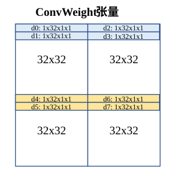</p><p align="center">图 8‑8 BIRENSUPA 卷积运算权重反向传播模式并输出到线程本地寄存器 FP32 数据类型分布</p>

一个从矩阵乘法运算并输出到线程本地寄存器的 float8（d0，d1，d2，d3，d4，d5，d6，d7）

- ConvWeights/ConvWeight/DynConvWeights/DynConvWeight 张量：输出形状为 64 \* 64 \* 1 \* 1：d0，d1，d2，d3 对应第一次 FP32 数据类型的 burst 4 存储到起始坐标为 (n, och + warp_idx \* 2, ich, h, w) 的权重张量；d4，d5，d6，d7 对应第二次 FP32 数据类型的 burst 4 存储到起始坐标为 (n, och + warp_idx \* 2, ich + 32, h, w) 的权重张量。

累加器需要在进行输出后重新创建或者调用累加器清空 API。

```cpp
template <TCI_MATH_MODE TCI_MATH = TCI_TF32P_MODE, typename EA, typename EB,
		  BUFFER_PADDING_MODE B_PAD_MA, BUFFER_PADDING_MODE B_PAD_MB,
		  suMemArchType MemType, ushort N, ushort KC_OUT, ushort KC_IN,
		  ushort H, ushort W, ushort BPW_OCH, ushort BPW_TILE, ushort BPW_ICH,
		  wti::REDUCE_MODE M>
__device__ void __mma_bpw(
              float8 *out, ConvWeights<FP32, MemType, N, KC_OUT, KC_IN, H, W> OutRef,
              __mma_acc<BPW_OCH, BPW_ICH> *acc, wti::__reduce_buf<BPW_OCH / 16, M> *grb,
              const __mma_buf<A_BUF, EA, BPW_OCH, BPW_TILE, B_PAD_MA> &A,
              const __mma_buf<B_BUF, EB, BPW_TILE, BPW_ICH, B_PAD_MB> &B,
              uint start_byte_address_B = 0);

template <TCI_MATH_MODE TCI_MATH = TCI_TF32P_MODE, typename EA, typename EB,
		  BUFFER_PADDING_MODE B_PAD_MA, BUFFER_PADDING_MODE B_PAD_MB,
		  suMemArchType MemType, ushort BPW_OCH, ushort BPW_TILE,
		  ushort BPW_ICH, wti::REDUCE_MODE M>
__device__ void
__mma_bpw(float8 *out, DynConvWeights<FP32, MemType> OutRef,
          __mma_acc<BPW_OCH, BPW_ICH> *acc,
          wti::__reduce_buf<BPW_OCH / 16, M> *grb,
          const __mma_buf<A_BUF, EA, BPW_OCH, BPW_TILE, B_PAD_MA> &A,
          const __mma_buf<B_BUF, EB, BPW_TILE, BPW_ICH, B_PAD_MB> &B,
          uint start_byte_address_B = 0);
```

进行卷积运算权重反向传播模式并输出到 FP32 数据类型的线程本地寄存器。

根据壁仞通用 GPU 硬件设计，当卷积运算权重反向传播模式并输出的本地寄存器数据类型为 BF16 时，会使用 \_\_bf164_pair 作为输出类型。

当一个 \_\_bf164_pair（first()：d0，d1，d2，d3；second()：d8，d9，d10，d11）作为一个卷积运算权重反向传播模式的输出类型时：

- ConvWeights/ConvWeight/DynConvWeights/DynConvWeight 张量：输出形状为 64 \* 64 \* 1 \* 1：first() 对应第一次 BF16 数据类型的 burst 2 存储到起始坐标为 (och + warp_idx \* 2, ich, h, w) 权重张量；second() 对应第二次 BF16 数据类型的 burst 2 存储到起始坐标为 (och + warp_idx \* 2 + 32, ich, h, w) 的权重张量。

<p align="center">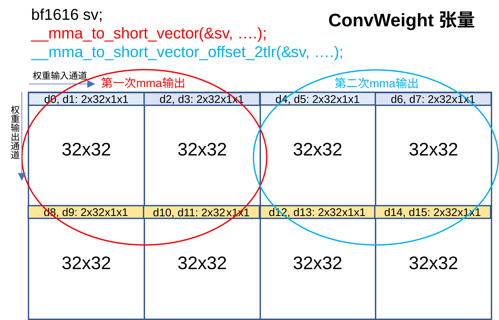</p><p align="center">图 8‑9 BIRENSUPA 卷积运算权重反向传播模式并输出到线程本地寄存器 BF16 数据类型分布</p>

两次卷积运算权重反向传播模式输出到两个 \_\_bf164_pair，第一次输出到 pair1（pair1.first()：d0，d1，d2，d3；pair1.second()：d8，d9，d10，d11），第二次输出到 pair2（pair2.first()：d4，d5，d6，d7；pair2.second()：d12，d13，d14，d15）。

- ConvWeights/ConvWeight/DynConvWeights/DynConvWeight 张量：输出形状为 128 \* 64 \* 1 \* 1：pair1.first() 和 pair2.first() 对应第一次 BF16 数据类型的 burst 4 存储到起始坐标为 (och + warp_idx \* 2, ich, h, w) 权重张量；pair1.second() 和 pair2.second() 对应第二次 BF16 数据类型的 burst 4 存储到起始坐标为 (och + warp_idx \* 2 + 32, ich, h, w) 的权重张量。

```cpp
template <TCI_MATH_MODE TCI_MATH = TCI_TF32P_MODE, typename EA, typename EB,
		  BUFFER_PADDING_MODE B_PAD_MA, BUFFER_PADDING_MODE B_PAD_MB,
		  suMemArchType MemType, ushort N, ushort KC_OUT, ushort KC_IN,
		  ushort H, ushort W, ushort BPW_OCH, ushort BPW_TILE, ushort BPW_ICH,
		  wti::REDUCE_MODE M>
__device__ void
__mma_bpw(__bf164_pair *out,
          ConvWeights<BF16, MemType, N, KC_OUT, KC_IN, H, W> OutRef,
          __mma_acc<BPW_OCH, BPW_ICH> *acc,
          wti::__reduce_buf<BPW_OCH / 16, M> *grb,
          const __mma_buf<A_BUF, EA, BPW_OCH, BPW_TILE, B_PAD_MA> &A,
          const __mma_buf<B_BUF, EB, BPW_TILE, BPW_ICH, B_PAD_MB> &B,
          uint start_byte_address_B = 0);

template <TCI_MATH_MODE TCI_MATH = TCI_TF32P_MODE, typename EA, typename EB,
		  BUFFER_PADDING_MODE B_PAD_MA, BUFFER_PADDING_MODE B_PAD_MB,
		  suMemArchType MemType, ushort BPW_OCH, ushort BPW_TILE,
		  ushort BPW_ICH, wti::REDUCE_MODE M>
__device__ void
__mma_bpw(__bf164_pair *out, DynConvWeights<BF16, MemType> OutRef,
          __mma_acc<BPW_OCH, BPW_ICH> *acc,
          wti::__reduce_buf<BPW_OCH / 16, M> *grb,
          const __mma_buf<A_BUF, EA, BPW_OCH, BPW_TILE, B_PAD_MA> &A,
          const __mma_buf<B_BUF, EB, BPW_TILE, BPW_ICH, B_PAD_MB> &B,
          uint start_byte_address_B = 0);
```

进行卷积运算权重反向传播模式并输出到 \_\_bf164_pair 数据结构。

### 累加器清空 API

基于壁仞通用 GPU 硬件设计，[矩阵乘法运算累加器](#矩阵乘法运算累加器)或[卷积运算累加器](#卷积运算累加器)始终保留矩阵乘法或者卷积运算的累加结果知道新的累加器被创建或者此累加器清空 API 被调用。

```cpp
template <ushort H, ushort W> struct __mma_acc {
	__device__ void clear();
}

template <ushort C, ushort H, ushort W> struct __conv_acc {
	__device__ void clear();
}
```

清空[矩阵乘法运算累加器](#矩阵乘法运算累加器)或[卷积运算累加器](#卷积运算累加器)中的结果。

### bf164 Pair 结合

`__bf164_pair` 用于矩阵乘法运算或卷积运算输出到 BF16 数据类型的本地寄存器的特殊结构体。

```cpp
__device__ void __bf164_pair_combine(bf1616 *sv, __bf164_pair &p1,
                                     __bf164_pair &p2);
```

将两个 \_\_bf164_pair 结合成一个对应两次矩阵乘法运算或卷积运算，并可以被两次 Burst 4 模式存储到张量中的 bf1616。

### 张量核心计算原语通用数据类型

#### TensorConvConfig

```cpp
template <ushort _filter_height, ushort _filter_width, int _padX, int _padY,
		  uint _stride, uint _dilation, TENSOR_BWD_TYPE _bwd = BWD_OFF>
struct TensorConvConfig {
	static const ushort filter_height = _filter_height;
	static const ushort filter_width = _filter_width;
	static const int padX = _padX;
	static const int padY = _padY;
	static const uint stride = _stride;
	static const uint dilation = _dilation;
	static const TENSOR_BWD_TYPE bwd = _bwd;
};
```

在 tensor::tci 命名空间下，用于配置张量卷积。

根据壁仞通用 GPU 硬件，padY 会被同时配置为上下填充，padX 会被同时配置为左右填充。除此之外，TensorConvConfig 也需要输入卷积权重的长宽信息。同时使用[TENSOR_BWD_TYPE](#读取转置模式)来定义张量核心的正反向运算操作。

- filter_height：1，2，3，4，5，6，7

- filter_width: 1，2，3，4，5，6，7

- padX: 0，1，2，3，-1，-2，-3

- padY: 0，1，2，3，-1，-2，-3

- stride：1

- dilation：1，2

#### DynamicTensorConvConfig

```cpp
template <> struct TensorConvConfig<0, 0, 0, 0, 0, 0, BWD_OFF>
  public:
	ushort filter_height;
	ushort filter_width;
	int padX;
	int padY;
	uint stride;
	uint dilation;
	TENSOR_BWD_TYPE bwd;

	__host__ __device__ TensorConvConfig(ushort __filter_height,
                                         ushort __filter_width, int __padX,
                                         int __padY, uint __stride,
                                         uint __dilation,
                                         TENSOR_BWD_TYPE __bwd = BWD_OFF);
};

using DynamicTensorConvConfig = TensorConvConfig<0, 0, 0, 0, 0, 0, BWD_OFF>;
```

在 `tensor::tci` 命名空间下，用于动态的配置张量卷积，使用 TensorConvConfig 的一种特化来实现。

- filter_height：1，2，3，4，5，6，7

- filter_width: 1，2，3，4，5，6，7

- padX: 0，1，2，3，-1，-2，-3

- padY: 0，1，2，3，-1，-2，-3

- stride：1

- dilation：1，2

#### 张量缓冲区填充模式

在 `tensor::tci` 命名空间下，用于表达张量运算时的反向传播模式。

- BUFFER_PADDING_AUTO: 自动缓冲区填充

- BUFFER_PADDING_NONE: 不适用缓冲区填充

- BUFFER_PADDING_BOTTOM: 缓冲区填充下侧

- BUFFER_PADDING_RIGHT: 缓冲区填充右侧

- BUFFER_PADDING_BOTTOM_RIGHT: 缓冲区填充下侧和右侧

```cpp
enum BUFFER_PADDING_MODE {
	BUFFER_PADDING_AUTO = 0,
	BUFFER_PADDING_NONE,
	BUFFER_PADDING_BOTTOM,
	BUFFER_PADDING_RIGHT,
	BUFFER_PADDING_BOTTOM_RIGHT,
};
```

#### 矩阵乘法运算缓冲区

```cpp
template <GEMM_GIB G, typename E, ushort H, ushort W,
		  BUFFER_PADDING_MODE B_PAD_M = BUFFER_PADDING_AUTO>
struct __mma_buf {

    public:
      __device__ __mma_buf();
}
```

在 `tensor::tci` 命名空间下，矩阵乘法运算时使用的矩阵缓冲区。

- 使用[GEMM_GIB](#_GEMM_GIB)选择张量计算核中缓冲区 A 或缓冲区 B；

- 最大空间大小 256KB。

使用 BUFFER_PADDING_MODE 来配置填充模式。

| 填充模式                    | 是否允许                                  |
| --------------------------- | ----------------------------------------- |
| BUFFER_PADDING_AUTO         | 允许                                      |
| BUFFER_PADDING_NONE         | 允许                                      |
| BUFFER_PADDING_BOTTOM       | 只在作为卷积权重反向传播的 B 缓冲区时允许 |
| BUFFER_PADDING_RIGHT        | 不允许                                    |
| BUFFER_PADDING_BOTTOM_RIGHT | 不允许                                    |
| BUFFER_PADDING_DYNAMIC      | 允许                                      |

#### 矩阵乘法运算累加器

```cpp
template <ushort H, ushort W> struct __mma_acc {

	public:
    __device__ __mma_acc();
    __device__ void clear();
};
```

在 `tensor::tci` 命名空间下，矩阵乘法运算时使用累加器。

#### 卷积运算激活缓冲区

```cpp
template <GEMM_GIB G, typename E, ushort KC_OUT, ushort KC_IN, ushort H,
		  ushort W, BUFFER_PADDING_MODE B_PAD_M = BUFFER_PADDING_AUTO>
struct __conv_weight_buf {

	public:
    __device__ __conv_act_buf();

}
```

在 `tensor::tci` 命名空间下，卷积运算时使用的激活缓冲区。

- 使用[GEMM_GIB](#_GEMM_GIB)选择张量计算核中缓冲区 A 或缓冲区 B；

- 最大空间大小 256KB。

使用 BUFFER_PADDING_MODE 来配置填充模式。

| 填充模式                    | 是否允许 |
| --------------------------- | -------- |
| BUFFER_PADDING_AUTO         | 允许     |
| BUFFER_PADDING_NONE         | 允许     |
| BUFFER_PADDING_BOTTOM       | 允许     |
| BUFFER_PADDING_RIGHT        | 不允许   |
| BUFFER_PADDING_BOTTOM_RIGHT | 不允许   |

#### 卷积运算权重缓冲区

```cpp
template <GEMM_GIB G, typename E, ushort KC_OUT, ushort KC_IN, ushort H,
		  ushort W, BUFFER_PADDING_MODE B_PAD_M = BUFFER_PADDING_AUTO>
struct __conv_weight_buf {

	public:
    __device__ __conv_weight_buf();

}
```

在 `tensor::tci` 命名空间下，卷积运算时使用的权重缓冲区。

- 使用[GEMM_GIB](#_GEMM_GIB)选择张量计算核中缓冲区 A 或缓冲区 B

- 最大空间大小 256KB

使用 BUFFER_PADDING_MODE 来配置填充模式。

| 填充模式                    | 是否允许 |
| --------------------------- | -------- |
| BUFFER_PADDING_AUTO         | 允许     |
| BUFFER_PADDING_NONE         | 允许     |
| BUFFER_PADDING_BOTTOM       | 不允许   |
| BUFFER_PADDING_RIGHT        | 不允许   |
| BUFFER_PADDING_BOTTOM_RIGHT | 不允许   |

#### 卷积运算累加器

```cpp
template <ushort C, ushort H, ushort W> struct __conv_acc {

	public:
    __device__ __conv_acc();
    __device__ void clear();
};
```

在 `tensor::tci` 命名空间下，卷积运算时使用累加器。

#### bf164 Pair

```cpp
struct __bf164_pair {

	public:
    __host__ __device__ inline __bf164_pair();

    __host__ __device__ inline bf164 first();

    __host__ __device__ inline bf164 second();
};
```

在 tensor::tci 命名空间下，用于储存矩阵乘法运算或卷积运算输出到 BF16 数据类型线程本地寄存器的特殊结构体。\_\_bf164_pair 结构体表达了一对 bf164 的本地寄存器的特殊结构体，可以使用成员函数 first() 来获取第一个 bf164，使用成员函数 second() 来获取第二个 bf164。

#### 张量核运算通用数据类型在 TCI 中的别名

```cpp
namespace tci {

using gemm_type::LD_TRANSPOSE;
using gemm_type::NOT_TRANSPOSE;
using gemm_type::TRANSPOSE;

using gemm_type::TCI_FP32_MODE;
using gemm_type::TCI_MATH_MODE;
using gemm_type::TCI_TF32P_MODE;

using gemm_type::BWD_OFF;
using gemm_type::TENSOR_BPA;
using gemm_type::TENSOR_BPW;
using gemm_type::TENSOR_BWD_TYPE;

using gemm_type::A_BUF;
using gemm_type::B_BUF;
using gemm_type::GEMM_GIB;

using gemm_type::LOAD_CONV_PAD;
using gemm_type::PADDING_AUTO;
using gemm_type::PADDING_RIGHT_BOTTOM;
using gemm_type::PADDING_RIGHT_BOTTOM_ONLY;
using gemm_type::BODY_ONLY;

}
```

BIRENSUPA 为在命名空间 tensor::tci 中为张量核运算通用数据类型的对应数据类型创建了别名，使他们可以在 `tensor::tci` 命名空间中直接使用。

<div style="page-break-after:always"></div>

## 高性能张量核心计算原语 (TCI-P)

BIRENSUPA 定义张量核心的高性能底层原语为张量核心计算原语（TCI-P），此类型的原语函数都在命名空间 `tensor::tci_p` 内。

<table><tr><td bgcolor=#ffeccc><b>注意：</b>在同一个超大核函数混合使用张量核心计算原语（TCI）API 与高性能张量核心计算原语（TCI-P）API 混用是未定义的行为。由于可能可能产生未知错误，不建议该使用方式。</td></tr></table>

根据根据壁仞通用 GPU 硬件设计，高性能加载张量核心缓冲区 A 的 API、高性能加载张量核心缓冲区 B 的 API 与 高性能张量核心运算的 API 三者之间是异步的，但是他们各自与对应的 [TCI-P 加载运算信号量控制](#tci-p-加载运算信号量控制) API 保证顺序执行。

- `__post_a_load(A_BUF_LOAD*)`、`_wait_a_calc(A_BUF_CALC*)`、[从 Matrix 张量高性能张量核心加载缓冲区 A](#从-matrix-张量高性能张量核心加载缓冲区-a) API、[从 ConvWeight 张量高性能张量核心加载缓冲区 A](#从-convweight-张量高性能张量核心加载缓冲区-a) API 与 [从 Activation 张量高性能张量核心加载缓冲区 A](#从-activation-张量高性能张量核心加载缓冲区-a) API 处在同一个序列中，并保证顺序执行
- `_post_b_load(B_BUF_LOAD*)`、`_wait_b_calc(B_BUF_CALC*)`、[从 Matrix 张量高性能张量核心加载缓冲区 B](#从-matrix-张量高性能张量核心加载缓冲区-b) API 与 [从 Activation 张量高性能张量核心加载缓冲区 B](#从-activation-张量高性能张量核心加载缓冲区-b) API 处在同一个序列中，并保证顺序执行
- `_wait_a_load(A_BUF_LOAD*)`、`_wait_b_load(B_BUF_LOAD*)`、`_post_a_calc(A_BUF_CALC*)`、`_post_b_calc(B_BUF_CALC*)`、[高性能张量核心矩阵乘法运算](#高性能张量核心矩阵乘法运算) API 与 [高性能张量核心卷积运算](#高性能张量核心卷积运算) API 处在同一个序列中，并保证顺序执行

### 高性能张量核心加载缓冲区

高性能张量核心加载缓冲区的 API。BIRENSUPA 要求目标的缓冲区 A 指针在定义时拥有 `__tensor_abuf__` 属性；目标的缓冲区 B 指针在定义时拥有 `__tensor_bbuf__` 属性。

所有高性能张量核心加载缓冲区 API 可以通过 `LOAD_MERGE_SCOPE_MODE` 模板参数激活[加载合并范围模式](#加载合并范围模式)。

高性能张量核心加载缓冲区 API 使用在 `L2StoreControl` 命名空间下的 [L2 存储配置参数](#L2-存储控制) 来配置 L2 存储。

#### 从 Matrix 张量高性能张量核心加载缓冲区 A

BIRENSUPA 在从 Matrix 张量进行高性能张量核心加载缓冲区 A 时使用 `Loading_H` 和 `Loading_W` 来控制加载尺寸，并提供了维度转置的功能。下表根据 Matrix 张量的类型列出了加载和维度转置的限制。

| 数据类型 | BLOCK_ROW_MAJOR      | BLOCK_COL_MAJOR    |
| -------- | -------------------- | ------------------ |
| FP32     | 允许加载，允许转置   | 允许加载，允许转置 |
| BF16/S16 | 允许加载，允许转置   | 允许加载，允许转置 |
| S8/U8    | 允许加载，不允许转置 | 不允许加载         |
| S4       | 允许加载，不允许转置 | 不允许加载         |

如果维度转换不被激活，缓冲区 A 将从 Matrix 张量中加载 `Loading_H * Loading_W` 的数据；如果激活维度转置，Matrix 张量中 `Loading_H * Loading_W` 的数据，将在转置之后被加载进缓冲区 A。

| 数据类型 | Loading_H \* Loading_W 如果 NOT_TRANSPOSE<br />Loading_W \* Loading_H 如果 TRANSPOSE |                |
| -------- | ------------------------------------------------------------------------------------ | -------------- |
| FP32     | 64 \* 16K                                                                            | K = 1, 2, 4, 8 |
| BF16     | 64 \* 32K                                                                            | K = 1, 2, 4, 8 |
| S8/U8    | 64 \* 64K                                                                            | K = 1, 2, 4, 8 |
| S4       | 64 \* 128K                                                                           | K = 1, 2, 4    |

根据壁仞通用 GPU 硬件设计，API 中缓冲器 A 使用的地址必须与其创建时的地址 512 Byte 对齐。具体布局参照[张量核心矩阵乘法运算缓冲区 A 布局](#张量核心矩阵乘法运算缓冲区-a-布局)。

以下 `__load_input_a_buffer` API，从 Matrix 张量中加载数据到 A 缓冲区。

```cpp
template <ushort Loading_H, ushort Loading_W,
          LD_TRANSPOSE trans = NOT_TRANSPOSE,
          LOAD_MERGE_SCOPE_MODE LMS = LOAD_MERGE_SCOPE_OFF,
          L2LoadControl::OptionalParameters L2LParam = L2LoadControl::NONE,
          typename EA, suMemArchType MemType, MatrixLayout Layout, ushort N,
          ushort H, ushort W>
inline __device__ void
__load_input_a_buffer(__tensor_abuf__ EA *a_buf_addr,
                      Matrix3D<EA, MemType, Layout, N, H, W> In,
                      Coordinate3D coord);

template <
    ushort Loading_H, ushort Loading_W, LD_TRANSPOSE trans = NOT_TRANSPOSE,
    LOAD_MERGE_SCOPE_MODE LMS = LOAD_MERGE_SCOPE_OFF,
    L2LoadControl::OptionalParameters L2LParam = L2LoadControl::NONE,
    typename EA, suMemArchType MemType, MatrixLayout Layout, ushort H, ushort W>
inline __device__ void
__load_input_a_buffer(__tensor_abuf__ EA *a_buf_addr,
                      Matrix<EA, MemType, Layout, H, W> In, Coordinate2D coord);

template <ushort Loading_H, ushort Loading_W,
          LD_TRANSPOSE trans = NOT_TRANSPOSE,
          LOAD_MERGE_SCOPE_MODE LMS = LOAD_MERGE_SCOPE_OFF,
          L2LoadControl::OptionalParameters L2LParam = L2LoadControl::NONE,
          typename EA, suMemArchType MemType, MatrixLayout Layout>
inline __device__ void
__load_input_a_buffer(__tensor_abuf__ EA *a_buf_addr,
                      DynMatrix3D<EA, MemType, Layout> In, Coordinate3D coord);

template <ushort Loading_H, ushort Loading_W,
          LD_TRANSPOSE trans = NOT_TRANSPOSE,
          LOAD_MERGE_SCOPE_MODE LMS = LOAD_MERGE_SCOPE_OFF,
          L2LoadControl::OptionalParameters L2LParam = L2LoadControl::NONE,
          typename EA, suMemArchType MemType, MatrixLayout Layout>
inline __device__ void __load_input_a_buffer(__tensor_abuf__ EA *a_buf_addr,
                                             DynMatrix<EA, MemType, Layout> In,
                                             Coordinate2D coord);
```

#### 从 ConvWeight 张量高性能张量核心加载缓冲区 A

BIRENSUPA 在从 ConvWeight 张量进行高性能张量核心加载缓冲区 A 时使用 `Loading_OCH` 和 `Loading_ICH` 来控制加载尺寸（从 ConvWeight 张量高性能张量核心加载缓冲区 A 始终会加在对应通道的卷积权重上的所有像素），并提供了维度转置的功能（维度转置作用在`Loading_OCH` 和 `Loading_ICH` 维度上）。下表根据 ConvWeight 张量的类型列出了加载和维度转置的限制。

| 数据类型 |                      |
| -------- | -------------------- |
| FP32     | 允许加载，允许转置   |
| BF16/S16 | 允许加载，允许转置   |
| S8/U8    | 允许加载，不允许转置 |
| S4       | 允许加载，不允许转置 |

如果维度转换不被激活，缓冲区 A 将从 ConvWeight 张量中加载 `Loading_OCH * Loading_ICH * filter` 的数据；如果激活维度转置，ConvWeight 张量中 `Loading_ICH * Loading_OCH * filter` 的数据，将在转置之后被加载进缓冲区 A。

| 数据类型 | Loading_OCH \* Loading_ICH 如果 NOT_TRANSPOSE<br />Loading_ICH \* Loading_OCH 如果 TRANSPOSE |                 |
| -------- | -------------------------------------------------------------------------------------------- | --------------- |
| FP32     | 64 och \* 4K ich                                                                             | K = 1, 4, 8, 16 |
| BF16     | 64 och \* 8K ich                                                                             | K = 1, 4, 8, 16 |
| S8       | 64 och \* 16K ich                                                                            | K = 1, 4, 8, 16 |
| S4       | 64 och \* 32K ich                                                                            | K = 1, 4, 8     |

所有卷积权重的长宽信息（`filter_height` 与 `filter_width`），上下填充（`padY`），左右填充 (`padX`)，卷积步长 (`stride`)，卷积空洞 (`dilation`) 和张量核心的正反向运算操作（[`TENSOR_BWD_TYPE`](#张量反向传播模式)）的相关信息都会用过[配置 TCI-P 卷积](#配置-tci-p-卷积) API 进行配置。

当设置 `TENSOR_BWD_TYPE` 为 `TENSOR_BPA` 的时候，卷积核将会被硬件翻转。

<p align="center"></p><p align="center">图 9‑1 BIRENSUPA 卷积运算权重反向传播模式 TENSOR_BPA 卷积核加载</p>

根据壁仞通用 GPU 硬件设计，API 中缓冲器 A 使用的地址必须与其创建时的地址 512 Byte 对齐。具体布局参照[张量核心卷积运算缓冲区 A 布局](#张量核心卷积运算缓冲区-a-布局)。

以下 `__load_input_a_buffer` API，从 ConvWeight 张量中加载数据到 A 缓冲区。

```cpp
template <ushort Loading_OCH, ushort Loading_ICH,
          LD_TRANSPOSE trans = NOT_TRANSPOSE,
          LOAD_MERGE_SCOPE_MODE LMS = LOAD_MERGE_SCOPE_OFF,
          L2LoadControl::OptionalParameters L2LParam = L2LoadControl::NONE,
          typename EA, suMemArchType MemType, ushort N, ushort KC_OUT,
          ushort KC_IN, ushort H, ushort W>
inline __device__ void
__load_input_a_buffer(__tensor_abuf__ EA *a_buf_addr,
                      ConvWeights<EA, MemType, N, KC_OUT, KC_IN, H, W> Weights,
                      CoordinateConvWeight coord);

template <ushort Loading_OCH, ushort Loading_ICH,
          LD_TRANSPOSE trans = NOT_TRANSPOSE,
          LOAD_MERGE_SCOPE_MODE LMS = LOAD_MERGE_SCOPE_OFF,
          L2LoadControl::OptionalParameters L2LParam = L2LoadControl::NONE,
          typename EA, suMemArchType MemType>
inline __device__ void
__load_input_a_buffer(__tensor_abuf__ EA *a_buf_addr,
                      DynConvWeights<EA, MemType> Weights,
                      CoordinateConvWeight coord);
```

#### 从 Activation 张量高性能张量核心加载缓冲区 A

BIRENSUPA 在从 Activation 张量进行高性能张量核心加载缓冲区 A 时使用 `Loading_CH`，`Loading_H` 和 `Loading_W` 来控制加载尺寸。

根据壁仞通用 GPU 硬件设计，BIRENSUPA 从 Activation 张量高性能张量核心加载缓冲区 A API 是为了卷积运算权重反向传播设计的，所以使用此 API 需要满足以下卷积配置：

- 必须使用 `NOT_TRANSPOSE` 模式
- 必须使用 `TENSOR_BPW` 模式

| 数据类型 | Loading_CH \* Loading_H \* Loading_W 以及 NOT_TRANSPOSE |
| -------- | ------------------------------------------------------- |
| FP32     | 64 \* 8 \* 8                                            |
| BF16     | 64 \* 8 \* 8                                            |

所有卷积权重的长宽信息（`filter_height` 与 `filter_width`），上下填充（`padY`），左右填充 (`padX`)，卷积步长 (`stride`)，卷积空洞 (`dilation`) 和张量核心的正反向运算操作（[`TENSOR_BWD_TYPE`](#张量反向传播模式)）的相关信息都会用过[配置 TCI-P 卷积](#配置-tci-p-卷积) API 进行配置。

根据壁仞通用 GPU 硬件设计，API 中缓冲器 A 使用的地址必须与其创建时的地址 512 Byte 对齐。具体布局参照[张量核心卷积运算权重反向传播缓冲区 A 布局](#张量核心卷积运算权重反向传播缓冲区-a-布局)。

以下 `__load_input_a_buffer` API，从 Activation 张量中加载数据到 A 缓冲区。

```cpp
template <ushort Loading_CH, ushort Loading_H, ushort Loading_W,
          LD_TRANSPOSE trans = NOT_TRANSPOSE,
          LOAD_MERGE_SCOPE_MODE LMS = LOAD_MERGE_SCOPE_OFF,
          L2LoadControl::OptionalParameters L2LParam = L2LoadControl::NONE,
          typename EA, suMemArchType MemType, ushort N, ushort C, ushort H,
          ushort W>
inline __device__ void
__load_input_a_buffer(__tensor_abuf__ EA *a_buf_addr,
                      Activation<EA, MemType, N, C, H, W> Act,
                      Coordinate coord);

template <ushort Loading_CH, ushort Loading_H, ushort Loading_W,
          LD_TRANSPOSE trans = NOT_TRANSPOSE,
          LOAD_MERGE_SCOPE_MODE LMS = LOAD_MERGE_SCOPE_OFF,
          L2LoadControl::OptionalParameters L2LParam = L2LoadControl::NONE,
          typename EA, suMemArchType MemType>
inline __device__ void __load_input_a_buffer(__tensor_abuf__ EA *a_buf_addr,
                                             DynActivation<EA, MemType> Act,
                                             Coordinate coord);
```

#### 从 Matrix 张量高性能张量核心加载缓冲区 B

BIRENSUPA 在从 Matrix 张量进行高性能张量核心加载缓冲区 B 时使用 `Loading_H` 和 `Loading_W` 来控制加载尺寸，并提供了维度转置的功能。下表根据 Matrix 张量的类型列出了加载和维度转置的限制。

| 数据类型 | BLOCK_ROW_MAJOR    | BLOCK_COL_MAJOR      |
| -------- | ------------------ | -------------------- |
| FP32     | 允许加载，允许转置 | 允许加载，允许转置   |
| BF16/S16 | 允许加载，允许转置 | 允许加载，允许转置   |
| S8/U8    | 不允许加载         | 允许加载，不允许转置 |
| S4       | 不允许加载         | 不允许加载           |

如果维度转换不被激活，缓冲区 B 将从 Matrix 张量中加载 `Loading_H * Loading_W` 的数据；如果激活维度转置，Matrix 张量中 `Loading_H * Loading_W` 的数据，将在转置之后被加载进缓冲区 B。

| 数据类型 | Loading_H \* Loading_W 如果 NOT_TRANSPOSE<br />Loading_W \* Loading_H 如果 TRANSPOSE |                          |
| -------- | ------------------------------------------------------------------------------------ | ------------------------ |
| FP32     | 16K \* 32N                                                                           | N = 1, 2, K = 1, 2, 4, 8 |
| BF16/S16 | 32K \* 32N                                                                           | N = 1, 2, K = 1, 2, 4, 8 |
| S8/U8    | 64K \* 32N                                                                           | N = 1, 2, K = 1, 2, 4, 8 |
| S4       | 128K \* 32N                                                                          | N = 1, 2, K = 1, 2, 4    |

当 `Loading_W = 32`，根据壁仞通用 GPU 硬件设计，缓冲器 B 中 `Loading_H * 64` 的空间会被使用。

根据壁仞通用 GPU 硬件设计，API 中缓冲器 B 使用的地址必须与其创建时的地址 1024 Byte 对齐。具体布局参照[张量核心矩阵乘法运算缓冲区 B 布局](#张量核心矩阵乘法运算缓冲区-b-布局)。

以下 `__load_input_b_buffer` API，从 Matrix 张量中加载数据到 B 缓冲区。

```cpp
template <ushort Loading_H, ushort Loading_W,
          LD_TRANSPOSE trans = NOT_TRANSPOSE,
          LOAD_MERGE_SCOPE_MODE LMS = LOAD_MERGE_SCOPE_OFF,
          L2LoadControl::OptionalParameters L2LParam = L2LoadControl::NONE,
          typename EB, suMemArchType MemType, MatrixLayout Layout, ushort N,
          ushort H, ushort W>
__device__ void __load_input_b_buffer(__tensor_bbuf__ EB *b_buf_addr,
                                      Matrix3D<EB, MemType, Layout, N, H, W> In,
                                      Coordinate3D coord);

template <
    ushort Loading_H, ushort Loading_W, LD_TRANSPOSE trans = NOT_TRANSPOSE,
    LOAD_MERGE_SCOPE_MODE LMS = LOAD_MERGE_SCOPE_OFF,
    L2LoadControl::OptionalParameters L2LParam = L2LoadControl::NONE,
    typename EB, suMemArchType MemType, MatrixLayout Layout, ushort H, ushort W>
__device__ void __load_input_b_buffer(__tensor_bbuf__ EB *b_buf_addr,
                                      Matrix<EB, MemType, Layout, H, W> In,
                                      Coordinate2D coord);

template <ushort Loading_H, ushort Loading_W,
          LD_TRANSPOSE trans = NOT_TRANSPOSE,
          LOAD_MERGE_SCOPE_MODE LMS = LOAD_MERGE_SCOPE_OFF,
          L2LoadControl::OptionalParameters L2LParam = L2LoadControl::NONE,
          typename EB, suMemArchType MemType, MatrixLayout Layout>
__device__ void __load_input_b_buffer(__tensor_bbuf__ EB *b_buf_addr,
                                      DynMatrix3D<EB, MemType, Layout> In,
                                      Coordinate3D coord);

template <ushort Loading_H, ushort Loading_W,
          LD_TRANSPOSE trans = NOT_TRANSPOSE,
          LOAD_MERGE_SCOPE_MODE LMS = LOAD_MERGE_SCOPE_OFF,
          L2LoadControl::OptionalParameters L2LParam = L2LoadControl::NONE,
          typename EB, suMemArchType MemType, MatrixLayout Layout>
__device__ void __load_input_b_buffer(__tensor_bbuf__ EB *b_buf_addr,
                                      DynMatrix<EB, MemType, Layout> In,
                                      Coordinate2D coord);
```

#### 从 Activation 张量高性能张量核心加载缓冲区 B

BIRENSUPA 在从 Matrix 张量进行高性能张量核心加载缓冲区 B 时使用 `Loading_CH`，`Loading_H` 和 `Loading_W` 来控制加载尺寸，并提供了维度转置的功能。

| 数据类型 | 缓冲区 B             |
| -------- | -------------------- |
| FP32     | 允许加载             |
| BF16/S16 | 允许加载             |
| S8/U8    | 允许加载，不允许转置 |
| S4       | 不允许加载           |

如果维度转换不被激活，缓冲区 B 将从 Activation 张量中加载 `Loading_CH * Loading_H * Loading_W` 的数据；同时 BIRENSUPA 提供了在`输出通道（64）`和`高 * 宽（8 * 8）`小块维度转置的功能。

<table><tr><td bgcolor=#ffeccc><b>注意：</b>按照壁仞通用 GPU 硬件设计版本要求，BIRENSUPA 从 Activation 张量高性能张量核心加载缓冲区 B API 在进行转置是要求 TCI-P 卷积方向配置为 TENSOR_BPW。</td></tr></table>

| 数据类型 | Loading_CH \* Loading_H \* Loading_W<br />如果 NOT_TRANSPOSE | Loading_H \* Loading_W \* Loading_CH<br />如果 TRANSPOSE |                 |
| -------- | ------------------------------------------------------------ | -------------------------------------------------------- | --------------- |
| FP32     | 4K och \* 8 \* 8                                             | 8 \* 8 \* 64 och                                         | K = 1, 4, 8, 16 |
| BF16     | 8K och \* 8 \* 8                                             | 8 \* 8 \* 64 och                                         | K = 1, 4, 8, 16 |
| S8/U8    | 16K och \* 8 \* 8                                            | N/A                                                      | K = 1, 4, 8, 16 |

当 TCI-P 卷积配置 `filter_height = 1` 和 `filter_width = 1` 时，BIRENSUPA 可以简单的管理全部 256KB 的张量核心缓冲区 B。以下是一个 `1 * 1` 卷积核进行卷积运算激活缓冲区的例子。

<p align="center"></p><p align="center">图 9‑2 BIRENSUPA 加载 1 * 1 卷积核时的激活缓冲区</p>

当卷积核的尺寸大于 1 \* 1，壁仞通用 GPU 硬件在进行卷积运算激活缓冲区加载时有特殊的实现。

如果 `BWD_OFF 或 TENSOR_BPA` 和 `NOT_TRANSPOSE`:

- 当卷积卷积运算使用填充时，壁仞通用 GPU 硬件实际对激活缓冲区加载数据的左上角会根据输入的坐标信息和张量配置参数中的填充信息进行偏移 (`coord.h - PadY`, `coord.h - PadX`)
- 当 `filter_height > 1` 时，除去原来的 8 \* 8 面的数据（主体）会被加载，主体下方的 8 \* 8 数据也会被视为下部填充（尾部）加载。这种尾部的加载不能被作为下一次加载的主体，如果下一次加载是下方的 8 \* 8 面的数据，这 8 \* 8 面的数据需要从新被加载。
- 当 `filter_width > 1` 时，壁仞通用 GPU 硬件会启用一个特殊的激活缓冲区加载模式。在这种模式下 256KB 的激活缓冲区会被分为两个 128KB 的部分。第一次加载时（使用`PADDING_RIGHT_BOTTOM`）主题部分和他的尾部（如果存在）会被加载到第一个 128KB 的激活缓冲区区域，其右侧的填充和右侧填充的尾部（如果存在）会被储存到另一个 128KB 中对应的位置；之后的每次加载（使用 `PADDING_RIGHT_BOTTOM_ONLY` 同时在 W 方向进行循环），可以只读取右侧填充部分，并覆盖上一次读取的主题和主题的尾部。

以下 3 \* 3 卷积核的例子，它使用主体/尾部模式进行底部填充，同时使用 128KB 缓冲区拆分模式进行右侧填充。

<p align="center"></p><p align="center">图 9‑3 BIRENSUPA 加载 3 * 3 卷积核时的激活缓冲区</p>

如果 `TENSOR_BPW` 和 `TRANSPOSE`:

- 当 `filter_width > 1` 时，除去原来的 8 \* 8 面的数据（主体）会被加载，主体下方会加在一些额外的填充
  - 使用 `BODY_ONLY`：不加载额外填充
  - filter_width > 1 同时 filter_weight < 6 以及 `PADDING_RIGHT_BOTTOM`：在数据之后使用额外 64 \* 4 \* 8 数据空间作为填充
  - filter_width >= 6 以及 `PADDING_RIGHT_BOTTOM`：在数据之后使用额外 64 \* 8 \* 8 数据空间作为填充

所有卷积权重的长宽信息（`filter_height` 与 `filter_width`），上下填充（`padY`），左右填充 (`padX`)，卷积步长 (`stride`)，卷积空洞 (`dilation`) 和张量核心的正反向运算操作（[`TENSOR_BWD_TYPE`](#张量反向传播模式)）的相关信息都会用过[配置 TCI-P 卷积](#配置-tci-p-卷积) API 进行配置。

根据壁仞通用 GPU 硬件设计，API 中缓冲器 A 使用的地址必须与其创建时的地址 1024 Byte 对齐。具体布局参照[张量核心卷积运算缓冲区 B 布局](#张量核心卷积运算缓冲区-b-布局)或[张量核心卷积运算权重反向传播缓冲区 B 布局](#张量核心卷积运算权重反向传播缓冲区-b-布局)。

以下 `__load_input_b_buffer` API，从 Activation 张量中加载数据到 A 缓冲区。

```cpp
template <ushort Loading_CH, ushort Loading_H, ushort Loading_W,
          LD_TRANSPOSE trans = NOT_TRANSPOSE, LOAD_CONV_PAD P = PADDING_AUTO,
          LOAD_MERGE_SCOPE_MODE LMS = LOAD_MERGE_SCOPE_OFF,
          L2LoadControl::OptionalParameters L2LParam = L2LoadControl::NONE,
          typename EB, suMemArchType MemType, ushort N, ushort C, ushort H,
          ushort W>
__device__ void __load_input_b_buffer(__tensor_bbuf__ EB *b_buf_addr,
                                      Activation<EB, MemType, N, C, H, W> Act,
                                      Coordinate coord);

template <ushort Loading_CH, ushort Loading_H, ushort Loading_W,
          LD_TRANSPOSE trans = NOT_TRANSPOSE, LOAD_CONV_PAD P = PADDING_AUTO,
          LOAD_MERGE_SCOPE_MODE LMS = LOAD_MERGE_SCOPE_OFF,
          L2LoadControl::OptionalParameters L2LParam = L2LoadControl::NONE,
          typename EB, suMemArchType MemType>
__device__ void __load_input_b_buffer(__tensor_bbuf__ EB *b_buf_addr,
                                      DynActivation<EB, MemType> Act,
                                      Coordinate coord);
```

### 高性能张量核心矩阵乘法运算

BIRENSUPA 高性能张量核心矩阵乘法运算（TCI-P MMA）API。根据壁仞通用 GPU 硬件设计，BIRENSUPA 高性能张量核心矩阵乘法运算 API 仅支持 `FP32` 和 `BF16` 作为运算输出的数据类型。同时高性能张量核心矩阵乘法运算算时，缓冲区 A 和 B 的数据类型限制依照下表

- 输出数据类型为 `FP32` 仅支持缓冲区 A 和 B 的数据类型均为 `FP32`

当输出或作为参考参数的张量为 Matrix 张量时：

| 数据类型                               | TCI-P MMA 形状<br />（MMA_H \* MMA_W \* K） | 参数                     |
| -------------------------------------- | ------------------------------------------- | ------------------------ |
| FP32 \* FP32                           | 64 \* 16K \* 32N                            | N = 1, 2, K = 1, 2, 4, 8 |
| BF16 \* BF16                           | 64 \* 32K \* 32N                            | N = 1, 2, K = 1, 2, 4, 8 |
| S8 \* S8, S8 \* U8, U8 \* S8, U8 \* U8 | 64 \* 64K \* 32N                            | N = 1, 2, K = 1, 2, 4, 8 |
| S8 \* S16, S8 \* BF16, BF16 \* S8      | 64 \* 64K \* 32N                            | N = 1, 2, K = 1, 2, 4    |
| S4 \* S8, S4 \* U8                     | 64 \* 128K \* 32N                           | N = 1, 2, K = 1, 2, 4    |

当输出或作为参考参数的张量为 ConvWeight 张量时：

| 数据类型     | TCI-P MMA (BPW) 形状<br />(Cal_OCH \* Cal_H \* Cal_W \* Cal_ICH) |
| ------------ | ---------------------------------------------------------------- |
| FP32 \* FP32 | 64 \* 8 \* 8 \* 64                                               |
| BF16 \* BF16 | 64 \* 8 \* 8 \* 64                                               |

在进行高性能张量核心矩阵乘法运算时可以用 [`TCI_MATH_MODE`](#矩阵乘法运算的数学模式) 来定义乘法运算时的精度。

- `TCI_TF32P_MODE`: 24 位运算，默认模式。
- `TCI_FP32_MODE`: 32 位运算，只在进行输入均为 `FP32` 的矩阵乘法时生效，仅适用壁仞通用 GPU 硬件设计版本等于或高于 1.1。

在 BIRENSUPA 高性能张量核心矩阵乘法运算 API 中，壁仞通用 GPU 硬件设计使用一个全局的累加器来暂存每次运算的临时结果（被高性能张量核心矩阵乘法运算和高性能张量核心卷积运算共用）。此累加器需要在首次使用以及每次输出之后使用[清空 TCI-P 累加器](#清空-tci-p-累加器) API 进行重置。

在 BIRENSUPA 高性能张量核心矩阵乘法运算 API 中，同一行数据的和与平方和可以在进行矩阵乘法运算的同时被使用[归约缓冲区](#归约缓冲区)计算。在壁仞通用 GPU 硬件中矩阵乘法运算会由整个流式处理器簇运算，所以每个线程束都会得到 4 行的和和平方和。具体每个线程束所获得的行数可以参考[高性能张量核心矩阵乘法运算并输出到线程本地寄存器](#高性能张量核心矩阵乘法运算并输出到线程本地寄存器)时结果输出到线程本地寄存器对应的行数。

- `wti::REDUCE_NONE`: 不使用归约缓冲区
- `wti::REDUCE_SUM`: 使用归约缓冲区，只计算和
- `wti::REDUCE_SQ`: 使用归约缓冲区，只计算平方和
- `wti::REDUCE_SSQ`: 使用归约缓冲区，同时计算和与平方和

根据壁仞通用 GPU 硬件设计，API 中缓冲器 A 使用的地址必须与其创建时的地址 512 Byte 对齐。具体布局参照[张量核心矩阵乘法运算缓冲区 A 布局](#张量核心矩阵乘法运算缓冲区-a-布局)或[张量核心卷积运算缓冲区 A 布局](#张量核心卷积运算缓冲区-a-布局)。

根据壁仞通用 GPU 硬件设计，API 中缓冲器 A 使用的地址必须与其创建时的地址 1024 Byte 对齐。具体布局参照[张量核心矩阵乘法运算缓冲区 B 布局](#张量核心矩阵乘法运算缓冲区-b-布局)或[张量核心卷积运算权重反向传播缓冲区 B 布局](#张量核心卷积运算权重反向传播缓冲区-b-布局)。

#### 只进行高性能张量核心矩阵乘法运算

BIRENSUPA 高性能张量核心矩阵乘法运算（TCI-P MMA）只进行运算的 API。

因壁仞通用 GPU 硬件设计需求，高性能张量核心矩阵乘法运算只进行运算的 API 需要输入一个 Matrix3D/Matrix/DynMatrix3D/DynMatrix 类型的张量参数作为参考参数。

以下 `__mma` API，只进行高性能张量核心矩阵乘法运算，并将结果暂存累加器。

```cpp
template <ushort Cal_H, ushort Cal_K, ushort Cal_W,
          TCI_MATH_MODE TCI_MATH = TCI_TF32P_MODE, typename CAL_E, typename EA,
          typename EB, suMemArchType MemType, MatrixLayout Layout, ushort N,
          ushort H, ushort W>
__device__ inline void
__mma(Matrix3D<CAL_E, MemType, Layout, N, H, W> OutRef,
      __tensor_abuf__ EA *a_buf_addr, __tensor_bbuf__ EB *b_buf_addr);

template <ushort Cal_H, ushort Cal_K, ushort Cal_W,
          TCI_MATH_MODE TCI_MATH = TCI_TF32P_MODE, typename CAL_E, typename EA,
          typename EB, suMemArchType MemType, MatrixLayout Layout>
__device__ inline void __mma(DynMatrix3D<CAL_E, MemType, Layout> OutRef,
                                     __tensor_abuf__ EA *a_buf_addr,
                                     __tensor_bbuf__ EB *b_buf_addr);

template <ushort Cal_OCH, ushort Cal_H, ushort Cal_W, ushort Cal_ICH,
          TCI_MATH_MODE TCI_MATH = TCI_TF32P_MODE, typename CAL_E, typename EA,
          typename EB, suMemArchType MemType, ushort N, ushort KC_OUT,
          ushort KC_IN, ushort H, ushort W>
__device__ inline void
__mma(ConvWeights<CAL_E, MemType, N, KC_OUT, KC_IN, H, W> OutRef,
      __tensor_abuf__ EA *a_buf_addr, __tensor_bbuf__ EB *b_buf_addr);


template <ushort Cal_OCH, ushort Cal_H, ushort Cal_W, ushort Cal_ICH,
          TCI_MATH_MODE TCI_MATH = TCI_TF32P_MODE, typename CAL_E, typename EA,
          typename EB, suMemArchType MemType>
__device__ inline void __mma(DynConvWeights<CAL_E, MemType> OutRef,
                                     __tensor_abuf__ EA *a_buf_addr,
                                     __tensor_bbuf__ EB *b_buf_addr);
```

#### 高性能张量核心矩阵乘法运算并输出到张量

BIRENSUPA 高性能张量核心矩阵乘法运算（TCI-P MMA）并输出到 Matrix3D/Matrix/DynMatrix3D/DynMatrix 或 ConvWeights/ConvWeight/DynConvWeights/DynConvWeight 张量的 API。

高性能张量核心矩阵乘法运算并输出到张量 API 需要输入一个 Matrix3D/Matrix/DynMatrix3D/DynMatrix 或 ConvWeights/ConvWeight/DynConvWeights/DynConvWeight 类型的张量参数和一个坐标参数作为输出目标。

BIRENSUPA 不使用协程模式编程的情况下，如果需要马上使用由高性能张量核心矩阵乘法运算并累加结果到张量 API 输出的数据，需要在使用之前插入一组 [发送或接受张量核心信号量](#发送或接受张量核心信号量) API 和线程块簇层级内存栅栏 API。

高性能张量核心矩阵乘法运算并输出到 Matrix 张量 API 使用 [PAD_WRITE_THROUGH](#写入穿透) 模板参数控制是否同时写入张量缓存区和张量实际内存。

高性能张量核心矩阵乘法运算并输出到 Matrix 张量 API 使用在 `L2StoreControl` 命名空间下的 [OptionalParameters](#L2-存储控制) 控制 L2 存储。

以下 `__mma_to_tensor` API，进行高性能张量核心矩阵乘法运算并输出到 Matrix3D/Matrix/DynMatrix3D/DynMatrix 张量。

```cpp
template <ushort Cal_H, ushort Cal_K, ushort Cal_W,
          wti::REDUCE_MODE M = wti::REDUCE_NONE,
          TCI_MATH_MODE TCI_MATH = TCI_TF32P_MODE,
          PAD_WRITE_THROUGH WT = NOT_WRITE_THROUGH,
          L2StoreControl::OptionalParameters L2SParam = L2StoreControl::NONE,
          typename CAL_E, typename EA, typename EB, suMemArchType MemType,
          MatrixLayout Layout, ushort N, ushort H, ushort W>
__device__ inline void
__mma_to_tensor(Matrix3D<CAL_E, MemType, Layout, N, H, W> Out,
                Coordinate3D coord, __tensor_grb__ FP32 *grb,
                __tensor_abuf__ EA *a_buf_addr, __tensor_bbuf__ EB *b_buf_addr);

template <ushort Cal_H, ushort Cal_K, ushort Cal_W,
          wti::REDUCE_MODE M = wti::REDUCE_NONE,
          TCI_MATH_MODE TCI_MATH = TCI_TF32P_MODE,
          PAD_WRITE_THROUGH WT = NOT_WRITE_THROUGH,
          L2StoreControl::OptionalParameters L2SParam = L2StoreControl::NONE,
          typename CAL_E, typename EA, typename EB, suMemArchType MemType,
          MatrixLayout Layout, ushort H, ushort W>
__device__ inline void
__mma_to_tensor(Matrix<CAL_E, MemType, Layout, H, W> Out, Coordinate2D coord,
                __tensor_grb__ FP32 *grb, __tensor_abuf__ EA *a_buf_addr,
                __tensor_bbuf__ EB *b_buf_addr);

template <ushort Cal_H, ushort Cal_K, ushort Cal_W,
          wti::REDUCE_MODE M = wti::REDUCE_NONE,
          TCI_MATH_MODE TCI_MATH = TCI_TF32P_MODE,
          PAD_WRITE_THROUGH WT = NOT_WRITE_THROUGH,
          L2StoreControl::OptionalParameters L2SParam = L2StoreControl::NONE,
          typename CAL_E, typename EA, typename EB, suMemArchType MemType,
          MatrixLayout Layout>
__device__ inline void
__mma_to_tensor(DynMatrix3D<CAL_E, MemType, Layout> Out, Coordinate3D coord,
                __tensor_grb__ FP32 *grb, __tensor_abuf__ EA *a_buf_addr,
                __tensor_bbuf__ EB *b_buf_addr);

template <ushort Cal_H, ushort Cal_K, ushort Cal_W,
          wti::REDUCE_MODE M = wti::REDUCE_NONE,
          TCI_MATH_MODE TCI_MATH = TCI_TF32P_MODE,
          PAD_WRITE_THROUGH WT = NOT_WRITE_THROUGH,
          L2StoreControl::OptionalParameters L2SParam = L2StoreControl::NONE,
          typename CAL_E, typename EA, typename EB, suMemArchType MemType,
          MatrixLayout Layout>
__device__ inline void
__mma_to_tensor(DynMatrix<CAL_E, MemType, Layout> Out, Coordinate2D coord,
                __tensor_grb__ FP32 *grb, __tensor_abuf__ EA *a_buf_addr,
                __tensor_bbuf__ EB *b_buf_addr);
```

以下 `__mma_to_tensor` API，进行高性能张量核心矩阵乘法运算并输出到 ConvWeights/ConvWeight/DynConvWeights/DynConvWeight 张量。

```cpp
template <ushort Cal_OCH, ushort Cal_H, ushort Cal_W, ushort Cal_ICH,
          wti::REDUCE_MODE M = wti::REDUCE_NONE,
          TCI_MATH_MODE TCI_MATH = TCI_TF32P_MODE,
          PAD_WRITE_THROUGH WT = NOT_WRITE_THROUGH,
          L2StoreControl::OptionalParameters L2SParam = L2StoreControl::NONE,
          typename CAL_E, typename EA, typename EB, suMemArchType MemType,
          ushort N, ushort KC_OUT, ushort KC_IN, ushort H, ushort W>
__device__ inline void
__mma_to_tensor(ConvWeights<CAL_E, MemType, N, KC_OUT, KC_IN, H, W> Out,
                CoordinateConvWeight coord, __tensor_grb__ FP32 *grb,
                __tensor_abuf__ EA *a_buf_addr, __tensor_bbuf__ EB *b_buf_addr);

template <ushort Cal_OCH, ushort Cal_H, ushort Cal_W, ushort Cal_ICH,
          wti::REDUCE_MODE M = wti::REDUCE_NONE,
          TCI_MATH_MODE TCI_MATH = TCI_TF32P_MODE,
          PAD_WRITE_THROUGH WT = NOT_WRITE_THROUGH,
          L2StoreControl::OptionalParameters L2SParam = L2StoreControl::NONE,
          typename CAL_E, typename EA, typename EB, suMemArchType MemType>
__device__ inline void
__mma_to_tensor(DynConvWeights<CAL_E, MemType> Out, ushort W,
                CoordinateConvWeight coord, __tensor_grb__ FP32 *grb,
                __tensor_abuf__ EA *a_buf_addr, __tensor_bbuf__ EB *b_buf_addr);
```

#### 高性能张量核心矩阵乘法运算并累加结果到张量

BIRENSUPA 高性能张量核心矩阵乘法运算（TCI-P MMA）并累加结果到 Matrix3D/Matrix/DynMatrix3D/DynMatrix 或 ConvWeights/ConvWeight/DynConvWeights/DynConvWeight 张量的 API。

<table><tr><td bgcolor=#ffeccc><b>注意：</b>按照壁仞通用 GPU 硬件设计要求，累加结果到 Matrix 张量的矩阵乘法运算 API，不支持输出张量配置到张量缓冲区。</td></tr></table>

BIRENSUPA 不使用协程模式编程的情况下，如果需要马上使用由高性能张量核心矩阵乘法运算并累加结果到张量 API 输出的数据，需要在使用之前插入一组 [发送或接受张量核心信号量](#发送或接受张量核心信号量) API 和线程块簇层级内存栅栏 API。

高性能张量核心矩阵乘法运算并累加结果到张量的 API 需要输入一个 Matrix3D/Matrix/DynMatrix3D/DynMatrix 或 ConvWeights/ConvWeight/DynConvWeights/DynConvWeight 类型的张量参数和一个坐标参数作为输出目标。

- CAL_E：定义高性能张量核心矩阵乘法运算并累加结果到张量 API 实际运算的数据类型

| 张量数据类型 | 计算结果数据类型（CAL_E ） |
| ------------ | -------------------------- |
| FP32         | FP32                       |
| BF16         | BF16                       |
| FP32         | BF16                       |

<table><tr><td bgcolor=#ffeccc><b>注意：</b>按照壁仞通用 GPU 硬件设计版本 1.0 要求，BIRENSUPA 不支持 FP32 数据类型 BLOCK_ROW_MAJOR Matrix 张量以 BF16 作为运算结果到 FP32 数据类型的 Matrix 张量。</td></tr></table>

高性能张量核心矩阵乘法运算并累加结果到张量 API 使用在 `L2StoreControl` 命名空间下的 [L2 存储配置参数](#L2-存储控制) 来配置 L2 存储。

以下 `__mma_reduce_to_tensor` API，进行高性能张量核心矩阵乘法运算并累加结果到 Matrix3D/Matrix/DynMatrix3D/DynMatrix 张量。

```cpp
template <ushort Cal_H, ushort Cal_K, ushort Cal_W, typename CAL_E,
          TCI_MATH_MODE TCI_MATH = TCI_TF32P_MODE,
          L2StoreControl::OptionalParameters L2SParam = L2StoreControl::NONE,
          typename EO, typename EA, typename EB, suMemArchType MemType,
          MatrixLayout Layout, ushort N, ushort H, ushort W>
__device__ inline void
__mma_reduce_to_tensor(Matrix3D<EO, MemType, Layout, N, H, W> Out,
                       Coordinate3D coord, __tensor_abuf__ EA *a_buf_addr,
                       __tensor_bbuf__ EB *b_buf_addr);

template <ushort Cal_H, ushort Cal_K, ushort Cal_W, typename CAL_E,
          TCI_MATH_MODE TCI_MATH = TCI_TF32P_MODE,
          L2StoreControl::OptionalParameters L2SParam = L2StoreControl::NONE,
          typename EO, typename EA, typename EB, suMemArchType MemType,
          MatrixLayout Layout, ushort H, ushort W>
__device__ inline void
__mma_reduce_to_tensor(Matrix<EO, MemType, Layout, H, W> Out,
                       Coordinate2D coord, __tensor_abuf__ EA *a_buf_addr,
                       __tensor_bbuf__ EB *b_buf_addr);

template <ushort Cal_H, ushort Cal_K, ushort Cal_W, typename CAL_E,
          TCI_MATH_MODE TCI_MATH = TCI_TF32P_MODE,
          L2StoreControl::OptionalParameters L2SParam = L2StoreControl::NONE,
          typename EO, typename EA, typename EB, suMemArchType MemType,
          MatrixLayout Layout>
__device__ inline void
__mma_reduce_to_tensor(DynMatrix3D<EO, MemType, Layout> Out, Coordinate3D coord,
                       __tensor_abuf__ EA *a_buf_addr,
                       __tensor_bbuf__ EB *b_buf_addr);

template <ushort Cal_H, ushort Cal_K, ushort Cal_W, typename CAL_E,
          TCI_MATH_MODE TCI_MATH = TCI_TF32P_MODE,
          L2StoreControl::OptionalParameters L2SParam = L2StoreControl::NONE,
          typename EO, typename EA, typename EB, suMemArchType MemType,
          MatrixLayout Layout>
__device__ inline void
__mma_reduce_to_tensor(DynMatrix<EO, MemType, Layout> Out, Coordinate2D coord,
                       __tensor_abuf__ EA *a_buf_addr,
                       __tensor_bbuf__ EB *b_buf_addr);
```

以下 `__mma_reduce_to_tensor` API，进行高性能张量核心矩阵乘法运算并累加结果到 ConvWeights/ConvWeight/DynConvWeights/DynConvWeight 张量。

```cpp
template <ushort Cal_OCH, ushort Cal_H, ushort Cal_W, ushort Cal_ICH,
          typename CAL_E, TCI_MATH_MODE TCI_MATH = TCI_TF32P_MODE,
          L2StoreControl::OptionalParameters L2SParam = L2StoreControl::NONE,
          typename EO, typename EA, typename EB, suMemArchType MemType,
          ushort N, ushort KC_OUT, ushort KC_IN, ushort H, ushort W>
__device__ inline void
__mma_reduce_to_tensor(ConvWeights<EO, MemType, N, KC_OUT, KC_IN, H, W> Out,
                       CoordinateConvWeight coord,
                       __tensor_abuf__ EA *a_buf_addr,
                       __tensor_bbuf__ EB *b_buf_addr);

template <ushort Cal_OCH, ushort Cal_H, ushort Cal_W, ushort Cal_ICH,
          typename CAL_E, TCI_MATH_MODE TCI_MATH = TCI_TF32P_MODE,
          L2StoreControl::OptionalParameters L2SParam = L2StoreControl::NONE,
          typename EO, typename EA, typename EB, suMemArchType MemType>
__device__ inline void __mma_reduce_to_tensor(
    DynConvWeights<EO, MemType> Out, ushort W, CoordinateConvWeight coord,
    __tensor_abuf__ EA *a_buf_addr, __tensor_bbuf__ EB *b_buf_addr);
```

#### 高性能张量核心矩阵乘法运算并输出到线程本地寄存器

BIRENSUPA 高性能张量核心矩阵乘法运算（TCI-P MMA）并输出到线程本地寄存器。

BIRENSUPA 不使用协程模式编程的情况下，如果需要马上使用由高性能张量核心矩阵乘法运算并输出到线程本地寄存器 API 输出的数据，需要在使用之前插入一组 [发送或接受张量核心信号量](#发送或接受张量核心信号量) API。

壁仞通用 GPU 硬件在高性能张量核心矩阵乘法运算并输出到 `FP32` 数据类型的线程本地寄存器时，每个线程束所获得的数据对应，使用两次 `burst 4` 的线程束级输出 API 输出到 Matrix3D/Matrix/DynMatrix3D/DynMatrix 或 ConvWeights/ConvWeight/DynConvWeights/DynConvWeight 张量的数据。

一个从高性能张量核心矩阵乘法运算并输出到线程本地寄存器的 `float8`（d0，d1，d2，d3，d4，d5，d6，d7）

<p align="center"></p><p align="center">图 9‑4 BIRENSUPA 矩阵乘法运算并输出到线程本地寄存器 FP32 数据类型分布</p>

- Matrix3D/Matrix/DynMatrix3D/DynMatrix `BLOCK_ROW_MAJOR` 张量：
  - 输出形状为 `64 * 64`：d0，d1，d2，d3 对应第一次 `FP32` 数据类型的 `burst 4` 存储到起始坐标为 `(h + warp_idx * 2, w)` 的 `BLOCK_ROW_MAJOR` 矩阵张量；d4，d5，d6，d7 对应第二次 `FP32` 数据类型的 `burst 4` 存储到起始坐标为 `(h + warp_idx * 2 + 32, w)` 的 `BLOCK_ROW_MAJOR` 矩阵张量。
  - 输出形状为 `64 * 32`：d0，d1，d4，d5 会获得输出数据，d2，d3，d6，d7 不会收到输出数据；d0，d1 对应第一次 `FP32` 数据类型的 `burst 2` 存储到起始坐标为 `(h + warp_idx * 2, w)` 的 `BLOCK_ROW_MAJOR` 矩阵张量；d4，d5 对应第二次 `FP32` 数据类型的 `burst 2` 存储到起始坐标为 `(h + warp_idx * 2 + 32, w)` 的 `BLOCK_ROW_MAJOR` 矩阵张量。
- Matrix3D/Matrix/DynMatrix3D/DynMatrix `BLOCK_COL_MAJOR` 张量：
  - 输出形状为 `64 * 64`：d0，d1，d2，d3 对应第一次 `FP32` 数据类型的 `burst 4` 存储到起始坐标为 `(h + warp_idx * 2, w)` 的 `BLOCK_COL_MAJOR` 矩阵张量；d4，d5，d6，d7 对应第二次 `FP32` 数据类型的 `burst 4` 存储到起始坐标为 `(h + warp_idx * 2, w + 32)` 的 `BLOCK_COL_MAJOR` 矩阵张量。
  - 输出形状为 `64 * 32`：d0，d1，d2，d3 会获得输出数据，d4，d5，d6，d7 不会收到输出数据；d0，d1，d2，d3 对应 `FP32` 数据类型的 `burst 4` 存储到起始坐标为 `(h + warp_idx * 2, w)` 的 `BLOCK_COL_MAJOR` 矩阵张量。

<p align="center"></p><p align="center">图 9‑5 BIRENSUPA 卷积运算权重反向传播模式并输出到线程本地寄存器 FP32 数据类型分布</p>

- ConvWeights/ConvWeight/DynConvWeights/DynConvWeight 张量：输出形状为 `64 * 64 * 1 * 1`：d0，d1 对应第一次 `FP32` 数据类型的 `burst 2` 存储到起始坐标为 `(n, och + warp_idx * 2, ich, h, w)` 的权重张量；d2，d3 对应第二次 `FP32` 数据类型的 `burst 2` 存储到起始坐标为 `(n, och + warp_idx * 2, ich + 32, h, w)` 的权重张量；d4，d5 对应第三次 `FP32` 数据类型的 `burst 2` 存储到起始坐标为 `(n, och + warp_idx * 2 + 32, ich, h, w)` 的权重张量；d6，d7 对应第四次 `FP32` 数据类型的 `burst 2` 存储到起始坐标为 `(n, och + warp_idx * 2 + 32, ich + 32, h, w)` 的权重张量。

对于权重大小为 `1 x 1` 的情况，可以使用更高效的 burst 4 存储模式。d0，d1，d2，d3 可以使用 `FP32` 的 burst 4 存储到起始坐标为 `(n, och + warp_idx * 2, ich, h, w)` 的权重张量。 d4，d5，d6，d7 可以使用 `FP32` 的 burst 4 存储到起始坐标为 `(n, och + warp_idx * 2 + 32, ich, h, w)` 的权重张量。

以下 `__mma_to_short_vector` API，进行高性能张量核心矩阵乘法运算并输出到 `FP32` 数据类型的线程本地寄存器。

```cpp
template <ushort Cal_H, ushort Cal_K, ushort Cal_W,
          wti::REDUCE_MODE M = wti::REDUCE_NONE,
          TCI_MATH_MODE TCI_MATH = TCI_TF32P_MODE, typename CAL_E, typename EA,
          typename EB, suMemArchType MemType, MatrixLayout Layout, ushort N,
          ushort H, ushort W>
__device__ inline void
__mma_to_short_vector(float8 *out,
                      Matrix3D<CAL_E, MemType, Layout, N, H, W> OutRef,
                      __tensor_grb__ FP32 *grb, __tensor_abuf__ EA *a_buf_addr,
                      __tensor_bbuf__ EB *b_buf_addr);

template <ushort Cal_H, ushort Cal_K, ushort Cal_W,
          wti::REDUCE_MODE M = wti::REDUCE_NONE,
          TCI_MATH_MODE TCI_MATH = TCI_TF32P_MODE, typename CAL_E, typename EA,
          typename EB, suMemArchType MemType, MatrixLayout Layout>
__device__ inline void
__mma_to_short_vector(float8 *out, DynMatrix3D<CAL_E, MemType, Layout> OutRef,
                      __tensor_grb__ FP32 *grb, __tensor_abuf__ EA *a_buf_addr,
                      __tensor_bbuf__ EB *b_buf_addr);

template <ushort Cal_OCH, ushort Cal_H, ushort Cal_W, ushort Cal_ICH,
          wti::REDUCE_MODE M = wti::REDUCE_NONE,
          TCI_MATH_MODE TCI_MATH = TCI_TF32P_MODE, typename CAL_E, typename EA,
          typename EB, suMemArchType MemType, ushort N, ushort KC_OUT,
          ushort KC_IN, ushort H, ushort W>
__device__ inline void __mma_to_short_vector(
    float8 *out, ConvWeights<CAL_E, MemType, N, KC_OUT, KC_IN, H, W> OutRef,
    __tensor_grb__ FP32 *grb, __tensor_abuf__ EA *a_buf_addr,
    __tensor_bbuf__ EB *b_buf_addr);

template <ushort Cal_OCH, ushort Cal_H, ushort Cal_W, ushort Cal_ICH,
          wti::REDUCE_MODE M = wti::REDUCE_NONE,
          TCI_MATH_MODE TCI_MATH = TCI_TF32P_MODE, typename CAL_E, typename EA,
          typename EB, suMemArchType MemType>
__device__ inline void
__mma_to_short_vector(float8 *out, DynConvWeights<CAL_E, MemType> OutRef,
                      __tensor_grb__ FP32 *grb, __tensor_abuf__ EA *a_buf_addr,
                      __tensor_bbuf__ EB *b_buf_addr);
```

根据壁仞通用 GPU 硬件设计，当高性能张量核心矩阵乘法运算并输出的本地寄存器数据类型为 `BF16` 时，会使用 `bf1616` 作为输出类型。

使用 `bf1616`（d0，d1，d2，d3，d4，d5，d6，d7，d8，d9，d10，d11，d12，d13，d14，d15） 作为一个高性能张量核心矩阵乘法运算的输出类型。

- Matrix3D/Matrix/DynMatrix3D/DynMatrix `BLOCK_ROW_MAJOR` 张量：
  - 输出形状为 `64 * 64`：d0，d1，d2，d3 对应第一次 `BF16` 数据类型的 `burst 2` 存储到起始坐标为 `(h + warp_idx * 2，w)` 的 `BLOCK_ROW_MAJOR` 矩阵张量；d8，d9，d10，d11 对应第二次 `BF16` 数据类型的 `burst 2` 存储到起始坐标为 `(h + warp_idx * 2 + 32，w)` 的 `BLOCK_ROW_MAJOR` 矩阵张量。
  - 输出形状为 `64 * 32`：
    - d0，d1，d2，d3：d0，d1 会收到数据，对应 `BF16` 数据类型的 `burst 1` 存储到起始坐标为 `(h + warp_idx * 2，w)` 的 `BLOCK_ROW_MAJOR` 矩阵张量；d2，d3 不会受到数据。
    - d8，d9，d10，d11：d8，d9 会收到数据，对应 `BF16` 数据类型的 `burst 1` 存储到起始坐标为 `(h + warp_idx * 2，w + 32)` 的 `BLOCK_ROW_MAJOR` 矩阵张量；d10，d11 不会受到数据。
- Matrix3D/Matrix/DynMatrix3D/DynMatrix `BLOCK_COL_MAJOR` 张量：

  - 输出形状为 `64 * 64`：d0，d1，d2，d3 对应第一次 `BF16` 数据类型的 `burst 2` 存储到起始坐标为 `(h + warp_idx * 2，w)` 的 `BLOCK_COL_MAJOR` 矩阵张量；d8，d9，d10，d11 对应第二次 `BF16` 数据类型的 `burst 2` 存储到起始坐标为 `(h + warp_idx * 2，w + 32)` 的 `BLOCK_COL_MAJOR` 矩阵张量。
  - 输出形状为 `64 * 32`：d0，d1，d2，d3 会获得输出数据，对应 `BF16` 数据类型的 `burst 2` 存储到起始坐标为 `(h + warp_idx * 2，w)` 的 `BLOCK_COL_MAJOR` 矩阵张量；d8，d9，d10，d11 不会收到输出数据。

- ConvWeights/ConvWeight/DynConvWeights/DynConvWeight 张量：输出形状为 `64 * 64 * 1 * 1`：d0，d1 对应 `BF16` 数据类型的 `burst 1` 存储到起始坐标为 `(och + warp_idx * 2, ich, h, w)` 权重张量；d2，d3 对应 `BF16` 数据类型的 `burst 1` 存储到起始坐标为 `(och + warp_idx * 2, ich + 32, h, w)` 权重张量；d8, d9 对应 `BF16` 数据类型的 `burst 1` 存储到起始坐标为 `(och + warp_idx * 2 + 32, ich, h, w)` 的权重张量；d10, d11 对应 `BF16` 数据类型的 `burst 1` 存储到起始坐标为 `(och + warp_idx * 2 + 32, ich + 32, h, w)` 的权重张量。在权重的**高和宽均为 1**时，我们可以通过使用 `burst 2` 来简化存储过程: 我们可以把 d0, d1, d2, d3 合并成为一次 `burst 2` 的存储，起始坐标为 `(och + warp_idx * 2, ich, h, w)` ；d8, d9, d10, d11 也可以合并为一次 `burst 2` 的存储，起始坐标为 `(och + warp_idx * 2 + 32, ich, h, w)`。

每两次 `64 * 64` 形状的高性能张量核心矩阵乘法运算的结果可以输出到同一个一个 `bf1616`。并且这个 `bf1616` 可以拆分成两个 `bf168` 对应两次 `BF16` 数据类型的 `burst 4` 存储。第一次使用 bf1616 作为高性能张量核心矩阵乘法运算的输出，结果会存储到 d0，d1, d2, d3, d8, d9, d10, d11 (使用接口 `__mma_to_short_vector`)；第二次使用 bf1616 作为高性能张量核心矩阵乘法运算的输出，结果存储到 d4, d5, d6, d7, d12, d13, d14, d15 (使用 `__mma_to_short_vector_offset_2tlr`)。

<p align="center">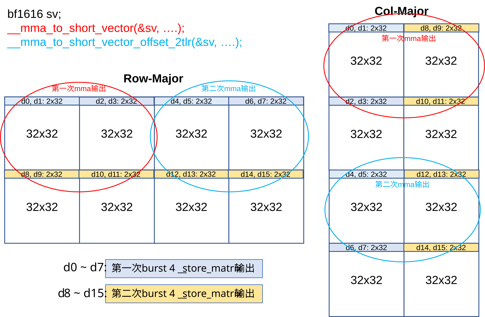</p><p align="center">图 9‑6 BIRENSUPA 矩阵乘法运算并输出到线程本地寄存器 BF16 数据类型分布</p>

- Matrix3D/Matrix/DynMatrix3D/DynMatrix `BLOCK_ROW_MAJOR` 张量：
  - - 输出形状为 `64 * 128`：d0，d1, d2, d3 和 d4, d5, d6, d7 对应第一次 `BF16` 数据类型的 `burst 4` 存储到起始坐标为 `(h + warp_idx * 2, w)` 的 `BLOCK_ROW_MAJOR` 矩阵张量；d8, d9, d10, d11 和 d12, d13, d14, d15 对应第二次 `BF16` 数据类型的 `burst 4` 存储到起始坐标为 `(h + warp_idx * 2 + 32, w)` 的 `BLOCK_ROW_MAJOR` 矩阵张量。
- Matrix3D/Matrix/DynMatrix3D/DynMatrix `BLOCK_COL_MAJOR` 张量：
  - 输出形状为 `128 * 64`：d0，d1, d2, d3 和 d4, d5, d6, d7 对应第一次 `BF16` 数据类型的 `burst 4` 存储到起始坐标为 `(h + warp_idx * 2, w)` 的 `BLOCK_COL_MAJOR` 矩阵张量；d8, d9, d10, d11 和 d12, d13, d14, d15 对应第二次 `BF16` 数据类型的 `burst 4` 存储到起始坐标为 `(h + warp_idx * 2, w + 32)` 的 `BLOCK_COL_MAJOR` 矩阵张量。

<p align="center"></p><p align="center">图 9‑7 BIRENSUPA 卷积运算权重反向传播模式并输出到线程本地寄存器 BF16 数据类型分布</p>

- ConvWeights/ConvWeight/DynConvWeights/DynConvWeight 张量：仅对于权重高和宽均为 1 的情况适用于此项优化存储模式。 输出形状为 `64 * 128 * 1 * 1`：d0，d1, d2, d3 和 d4, d5, d6, d7 对应第一次 `BF16` 数据类型的 `burst 4` 存储到起始坐标为 `(och + warp_idx * 2, ich, h, w)` 权重张量；d8, d9, d10, d11 和 d12, d13, d14, d15 对应第二次 `BF16` 数据类型的 `burst 4` 存储到起始坐标为 `(och + warp_idx * 2 + 32, ich, h, w)` 的权重张量。

```cpp
template <ushort Cal_H, ushort Cal_K, ushort Cal_W,
          wti::REDUCE_MODE M = wti::REDUCE_NONE,
          TCI_MATH_MODE TCI_MATH = TCI_TF32P_MODE, typename CAL_E, typename EA,
          typename EB, suMemArchType MemType, MatrixLayout Layout, ushort N,
          ushort H, ushort W>
__device__ inline void
__mma_to_short_vector(bf1616 *out,
                      Matrix3D<CAL_E, MemType, Layout, N, H, W> OutRef,
                      __tensor_grb__ FP32 *grb, __tensor_abuf__ EA *a_buf_addr,
                      __tensor_bbuf__ EB *b_buf_addr);

template <ushort Cal_H, ushort Cal_K, ushort Cal_W,
          wti::REDUCE_MODE M = wti::REDUCE_NONE,
          TCI_MATH_MODE TCI_MATH = TCI_TF32P_MODE, typename CAL_E, typename EA,
          typename EB, suMemArchType MemType, MatrixLayout Layout, ushort N,
          ushort H, ushort W>
__device__ inline void __mma_to_short_vector_offset_2tlr(
    bf1616 *out, Matrix3D<CAL_E, MemType, Layout, N, H, W> OutRef,
    __tensor_grb__ FP32 *grb, __tensor_abuf__ EA *a_buf_addr,
    __tensor_bbuf__ EB *b_buf_addr);

template <ushort Cal_H, ushort Cal_K, ushort Cal_W,
          wti::REDUCE_MODE M = wti::REDUCE_NONE,
          TCI_MATH_MODE TCI_MATH = TCI_TF32P_MODE, typename CAL_E, typename EA,
          typename EB, suMemArchType MemType, MatrixLayout Layout>
__device__ inline void
__mma_to_short_vector(bf1616 *out, DynMatrix3D<CAL_E, MemType, Layout> OutRef,
                      __tensor_grb__ FP32 *grb, __tensor_abuf__ EA *a_buf_addr,
                      __tensor_bbuf__ EB *b_buf_addr);

template <ushort Cal_H, ushort Cal_K, ushort Cal_W,
          wti::REDUCE_MODE M = wti::REDUCE_NONE,
          TCI_MATH_MODE TCI_MATH = TCI_TF32P_MODE, typename CAL_E, typename EA,
          typename EB, suMemArchType MemType, MatrixLayout Layout>
__device__ inline void __mma_to_short_vector_offset_2tlr(
    bf1616 *out, DynMatrix3D<CAL_E, MemType, Layout> OutRef,
    __tensor_grb__ FP32 *grb, __tensor_abuf__ EA *a_buf_addr,
    __tensor_bbuf__ EB *b_buf_addr);

template <ushort Cal_OCH, ushort Cal_H, ushort Cal_W, ushort Cal_ICH,
          wti::REDUCE_MODE M = wti::REDUCE_NONE,
          TCI_MATH_MODE TCI_MATH = TCI_TF32P_MODE, typename CAL_E, typename EA,
          typename EB, suMemArchType MemType, ushort N, ushort KC_OUT,
          ushort KC_IN, ushort H, ushort W>
__device__ inline void __mma_to_short_vector(
    bf1616 *out, ConvWeights<CAL_E, MemType, N, KC_OUT, KC_IN, H, W> OutRef,
    __tensor_grb__ FP32 *grb, __tensor_abuf__ EA *a_buf_addr,
    __tensor_bbuf__ EB *b_buf_addr);

template <ushort Cal_OCH, ushort Cal_H, ushort Cal_W, ushort Cal_ICH,
          wti::REDUCE_MODE M = wti::REDUCE_NONE,
          TCI_MATH_MODE TCI_MATH = TCI_TF32P_MODE, typename CAL_E, typename EA,
          typename EB, suMemArchType MemType, ushort N, ushort KC_OUT,
          ushort KC_IN, ushort H, ushort W>
__device__ inline void __mma_to_short_vector_offset_2tlr(
    bf1616 *out, ConvWeights<CAL_E, MemType, N, KC_OUT, KC_IN, H, W> OutRef,
    __tensor_grb__ FP32 *grb, __tensor_abuf__ EA *a_buf_addr,
    __tensor_bbuf__ EB *b_buf_addr);

template <ushort Cal_OCH, ushort Cal_H, ushort Cal_W, ushort Cal_ICH,
          wti::REDUCE_MODE M = wti::REDUCE_NONE,
          TCI_MATH_MODE TCI_MATH = TCI_TF32P_MODE, typename CAL_E, typename EA,
          typename EB, suMemArchType MemType>
__device__ inline void
__mma_to_short_vector(bf1616 *out, DynConvWeights<CAL_E, MemType> OutRef,
                      __tensor_grb__ FP32 *grb, __tensor_abuf__ EA *a_buf_addr,
                      __tensor_bbuf__ EB *b_buf_addr);

template <ushort Cal_OCH, ushort Cal_H, ushort Cal_W, ushort Cal_ICH,
          wti::REDUCE_MODE M = wti::REDUCE_NONE,
          TCI_MATH_MODE TCI_MATH = TCI_TF32P_MODE, typename CAL_E, typename EA,
          typename EB, suMemArchType MemType>
__device__ inline void __mma_to_short_vector_offset_2tlr(
    bf1616 *out, DynConvWeights<CAL_E, MemType> OutRef,
    __tensor_grb__ FP32 *grb, __tensor_abuf__ EA *a_buf_addr,
    __tensor_bbuf__ EB *b_buf_addr);
```

`__mma_to_short_vector` 以及 `__mma_to_short_vector_offset_2tlr` API，进行高性能张量核心矩阵乘法运算并输出到 `BF16` 数据类型的线程本地寄存器。

### 高性能张量核心卷积运算

BIRENSUPA 高性能张量核心卷积运算（TCI-P CONV）API。根据壁仞通用 GPU 硬件设计，BIRENSUPA 高性能张量核心卷积运算 API 仅支持 `FP32` 和 `BF16` 作为运算输出的数据类型。同时高性能张量核心矩阵乘法运算算时，缓冲区 A 和 B 的数据类型限制依照下表

- 缓冲区 A 和 B 的数据类型均为 `FP32` 时输出数据类型仅支持 `FP32`

| 数据类型<br />(Weight \* Activation)   | TCI-P CONV 形状<br />(Cal_OCH \* Cal_ICH \* Cal_H \* Cal_W) | 参数            |
| -------------------------------------- | ----------------------------------------------------------- | --------------- |
| FP32 \* FP32                           | 64 \* 4K \* 8 \* 8                                          | K = 1, 4, 8, 16 |
| BF16 \* BF16                           | 64 \* 8K \* 8 \* 8                                          | K = 1, 4, 8, 16 |
| S8 \* S8, S8 \* U8, U8 \* S8, U8 \* U8 | 64 \* 16K \* 8 \* 8                                         | K = 1, 4, 8, 16 |
| S8 \* S16, S8 \* BF16                  | 64 \* 8K \* 8 \* 8                                          | K = 1, 4, 8, 16 |
| S4 \* S8, S4 \* U8                     | 64 \* 16K \* 8 \* 8                                         | K = 1, 4, 8, 16 |

在 BIRENSUPA 高性能张量核心卷积运算 API 中，壁仞通用 GPU 硬件设计使用一个全局的累加器来暂存每次运算的临时结果（被高性能张量核心矩阵乘法运算和高性能张量核心卷积运算共用）。此累加器需要在首次使用以及每次输出之后使用[清空 TCI-P 累加器](#清空-tci-p-累加器) API 进行重置。

在 BIRENSUPA 高性能张量核心卷积运算 API 中，同一行数据的和与平方和可以在进行矩阵乘法运算的同时被使用[归约缓冲区](#归约缓冲区)计算。在壁仞通用 GPU 硬件中矩阵乘法运算会由整个流式处理器簇运算，所以每个线程束都会得到 4 行的和和平方和。具体每个线程束所获得的行数可以参考[高性能张量核心卷积运算并输出到线程本地寄存器](#高性能张量核心卷积运算并输出到线程本地寄存器)时结果输出到线程本地寄存器对应的行数。

- `wti::REDUCE_NONE`: 不使用归约缓冲区
- `wti::REDUCE_SUM`: 使用归约缓冲区，只计算和
- `wti::REDUCE_SQ`: 使用归约缓冲区，只计算平方和
- `wti::REDUCE_SSQ`: 使用归约缓冲区，同时计算和与平方和

所有卷积权重的长宽信息（`filter_height` 与 `filter_width`），上下填充（`padY`），左右填充 (`padX`)，卷积步长 (`stride`)，卷积空洞 (`dilation`) 和张量核心的正反向运算操作（[`TENSOR_BWD_TYPE`](#张量反向传播模式)）的相关信息都会用过[配置 TCI-P 卷积](#配置-tci-p-卷积) API 进行配置。

根据壁仞通用 GPU 硬件设计，API 中缓冲器 A 使用的地址必须与其创建时的地址 512 Byte 对齐。具体布局参照[张量核心卷积运算缓冲区 A 布局](#张量核心卷积运算缓冲区-a-布局)。

根据壁仞通用 GPU 硬件设计，API 中缓冲器 B 使用的地址必须与其创建时的地址 1024 Byte 对齐。具体布局参照[张量核心卷积运算缓冲区 B 布局](#张量核心卷积运算缓冲区-b-布局)。

#### 只进行高性能张量核心卷积运算

BIRENSUPA 高性能张量核心卷积运算（TCI-P CONV）只进行运算的 API。

因壁仞通用 GPU 硬件设计需求，高性能张量核心卷积运算只进行运算的 API 需要输入一个 Activation/DynActivation 类型的张量参数作为参考参数。

以下 `__conv` API，只进行高性能张量核心卷积运算，并将结果暂存累加器。

```cpp
template <ushort Cal_OCH, ushort Cal_ICH, ushort Cal_H, ushort Cal_W,
          typename CAL_E, typename EA, typename EB, suMemArchType MemType,
          ushort N, ushort C, ushort H, ushort W>
__device__ inline void
__conv(Activation<CAL_E, MemType, N, C, H, W> OutRef,
       __tensor_abuf__ EA *a_buf_addr, __tensor_bbuf__ EB *b_buf_addr);

template <ushort Cal_OCH, ushort Cal_ICH, ushort Cal_H, ushort Cal_W,
          typename CAL_E, typename EA, typename EB, suMemArchType MemType>
__device__ inline void __conv(DynActivation<CAL_E, MemType> OutRef,
                                      __tensor_abuf__ EA *a_buf_addr,
                                      __tensor_bbuf__ EB *b_buf_addr);
```

#### 高性能张量核心卷积运算并输出到张量

BIRENSUPA 高性能张量核心卷积运算并输出到张量（TCI-P CONV）并输出到 Activation/DynActivation 张量的 API。

高性能张量核心卷积运算并输出到张量 API 需要输入一个 Activation/DynActivation 类型的张量参数和一个坐标参数作为输出目标。

BIRENSUPA 不使用协程模式编程的情况下，如果需要马上使用由高性能张量核心矩阵乘法运算并累加结果到张量 API 输出的数据，需要在使用之前插入一组 [发送或接受张量核心信号量](#发送或接受张量核心信号量) API 和线程块簇层级内存栅栏 API。

高性能张量核心卷积运算并输出到 Activation 张量 API 使用 [PAD_WRITE_THROUGH](#写入穿透) 模板参数控制是否同时写入张量缓存区和张量实际内存。

高性能张量核心卷积运算并输出到 Activation 张量 API 使用在 `L2StoreControl` 命名空间下的 [OptionalParameters](#L2-存储控制) 控制 L2 存储。

以下 `__conv_to_tensor` API，进行高性能张量核心卷积运算并输出到 Activation/DynActivation 张量。

```cpp
template <ushort Cal_OCH, ushort Cal_ICH, ushort Cal_H, ushort Cal_W,
          wti::REDUCE_MODE M = wti::REDUCE_NONE,
          PAD_WRITE_THROUGH WT = NOT_WRITE_THROUGH,
          L2StoreControl::OptionalParameters L2SParam = L2StoreControl::NONE,
          typename CAL_E, typename EA, typename EB, suMemArchType MemType,
          ushort N, ushort C, ushort H, ushort W>
__device__ inline void
__conv_to_tensor(Activation<CAL_E, MemType, N, C, H, W> Out, Coordinate coord,
                 __tensor_grb__ FP32 *grb, __tensor_abuf__ EA *a_buf_addr,
                 __tensor_bbuf__ EB *b_buf_addr);

template <ushort Cal_OCH, ushort Cal_ICH, ushort Cal_H, ushort Cal_W,
          wti::REDUCE_MODE M = wti::REDUCE_NONE,
          PAD_WRITE_THROUGH WT = NOT_WRITE_THROUGH,
          L2StoreControl::OptionalParameters L2SParam = L2StoreControl::NONE,
          typename CAL_E, typename EA, typename EB, suMemArchType MemType>
__device__ inline void
__conv_to_tensor(DynActivation<CAL_E, MemType> Out, Coordinate coord,
                 __tensor_grb__ FP32 *grb, __tensor_abuf__ EA *a_buf_addr,
                 __tensor_bbuf__ EB *b_buf_addr);
```

#### 高性能张量核心卷积运算并累加结果到张量

BIRENSUPA 高性能张量核心卷积运算（TCI-P CONV）并累加结果到 Activation/DynActivation 张量的 API。

<table><tr><td bgcolor=#ffeccc><b>注意：</b>按照壁仞通用 GPU 硬件设计 要求，BIRENSUPA 累加结果到张量的卷积运算 API 不支持输出张量配置到张量缓冲区映射。</td></tr></table>

BIRENSUPA 不使用协程模式编程的情况下，如果需要马上使用由高性能张量核心矩阵乘法运算并累加结果到张量 API 输出的数据，需要在使用之前插入一组 [发送或接受张量核心信号量](#发送或接受张量核心信号量) API 和线程块簇层级内存栅栏 API。

高性能张量核心卷积运算并累加结果到张量的 API 需要输入一个 Activation/DynActivation 类型的张量参数和一个坐标参数作为输出目标。

- CAL_E：定义高性能张量核心卷积运算并累加结果到张量 API 实际运算的数据类型

| 张量数据类型 | 计算结果数据类型（CAL_E ） |
| ------------ | -------------------------- |
| FP32         | FP32                       |
| BF16         | BF16                       |
| FP32         | BF16                       |

高性能张量核心卷积运算并累加结果到张量 API 使用在 `L2StoreControl` 命名空间下的 [L2 存储配置参数](#L2-存储控制) 来配置 L2 存储。

以下 `__conv_reduce_to_tensor` API，进行高性能张量核心卷积运算并累加结果到 Activation/DynActivation 张量。

```cpp
template <ushort Cal_OCH, ushort Cal_ICH, ushort Cal_H, ushort Cal_W,
          typename CAL_E,
          L2StoreControl::OptionalParameters L2SParam = L2StoreControl::NONE,
          typename EO, typename EA, typename EB, suMemArchType MemType,
          ushort N, ushort C, ushort H, ushort W>
__device__ inline void
__conv_reduce_to_tensor(Activation<EO, MemType, N, C, H, W> Out,
                        Coordinate coord, __tensor_abuf__ EA *a_buf_addr,
                        __tensor_bbuf__ EB *b_buf_addr);

template <ushort Cal_OCH, ushort Cal_ICH, ushort Cal_H, ushort Cal_W,
          typename CAL_E,
          L2StoreControl::OptionalParameters L2SParam = L2StoreControl::NONE,
          typename EO, typename EA, typename EB, suMemArchType MemType>
__device__ inline void
__conv_reduce_to_tensor(DynActivation<EO, MemType> Out, Coordinate coord,
                        __tensor_abuf__ EA *a_buf_addr,
                        __tensor_bbuf__ EB *b_buf_addr);
```

#### 高性能张量核心卷积运算并输出到线程本地寄存器

BIRENSUPA 高性能张量核心卷积运算（TCI-P CONV）并输出到线程本地寄存器。

BIRENSUPA 不使用协程模式编程的情况下，如果需要马上使用由高性能张量核心卷积运算并输出到线程本地寄存器 API 输出的数据，需要在使用之前插入一组 [发送或接受张量核心信号量](#发送或接受张量核心信号量) API。

壁仞通用 GPU 硬件在高性能张量核心卷积运算并输出到 `FP32` 数据类型的线程本地寄存器时，每个线程束所获得的数据，对应使用两次 `burst 4` 的线程束级输出 API 输出到 Activation/DynActivation 张量的数据。

一个从高性能张量核心卷积运算并输出到线程本地寄存器的 `float8`（d0，d1，d2，d3，d4，d5，d6，d7）

<p align="center"></p><p align="center">图 9‑8 BIRENSUPA 卷积运算并输出到线程本地寄存器 FP32 数据类型分布</p>

- Activation/DynActivation 张量：
  - 输出形状为 `64 * 8 * 8`：d0，d1，d2，d3 对应第一次 `FP32` 数据类型的 `burst 4` 存储到起始坐标为 `(c + warp_idx * 2, h, w)` 的 Activation/DynActivation 张量；d4，d5，d6，d7 对应第二次 `FP32` 数据类型的 `burst 4` 存储到起始坐标为 `(c + warp_idx * 2 + 32, h, w)` 的 Activation/DynActivation 张量。

以下 `__conv_to_short_vector` API，进行高性能张量核心卷积运算并输出到 `FP32` 数据类型的线程本地寄存器。

```cpp
template <ushort Cal_OCH, ushort Cal_ICH, ushort Cal_H, ushort Cal_W,
          wti::REDUCE_MODE M = wti::REDUCE_NONE, typename CAL_E, typename EA,
          typename EB, suMemArchType MemType, ushort N, ushort C, ushort H,
          ushort W>
__device__ inline void __conv_to_short_vector(
    float8 *out, Activation<CAL_E, MemType, N, C, H, W> OutRef,
    Coordinate coord, __tensor_grb__ FP32 *grb, __tensor_abuf__ EA *a_buf_addr,
    __tensor_bbuf__ EB *b_buf_addr);

template <ushort Cal_OCH, ushort Cal_ICH, ushort Cal_H, ushort Cal_W,
          wti::REDUCE_MODE M = wti::REDUCE_NONE, typename CAL_E, typename EA,
          typename EB, suMemArchType MemType>
__device__ inline void
__conv_to_short_vector(float8 *out, DynActivation<CAL_E, MemType> OutRef,
                       Coordinate coord, __tensor_grb__ FP32 *grb,
                       __tensor_abuf__ EA *a_buf_addr,
                       __tensor_bbuf__ EB *b_buf_addr);
```

根据壁仞通用 GPU 硬件设计，当高性能张量核心卷积运算并输出的本地寄存器数据类型为 `BF16` 时，会使用 `bf1616` 作为输出类型。

使用 `bf1616`（d0，d1，d2，d3，d4，d5，d6，d7，d8，d9，d10，d11，d12，d13，d14，d15） 作为一个高性能张量核心卷积运算的输出类型。

- Activation/DynActivation 张量：
  - 输出形状为 `64 * 8 * 8`：d0，d1，d2，d3 对应第一次 `BF16` 数据类型的 `burst 2` 存储到起始坐标为 `(c + warp_idx * 2, h, w)` 的 Activation/DynActivation 张量；d8，d9，d10，d11 对应第二次 `BF16` 数据类型的 `burst 2` 存储到起始坐标为 `(c + warp_idx * 2 + 32, h, w)` 的 Activation/DynActivation 张量。

每两次 `64 * 8 * 8` 形状的高性能张量核心卷积运算的结果可以输出到同一个一个 `bf1616`。并且这个 `bf1616` 可以拆分成两个 `bf168` 对应两次 `BF16` 数据类型的 `burst 4` 存储。第一次使用 bf1616 作为高性能张量核心卷积运算的输出，结果会存储到 d0，d1, d2, d3, d8, d9, d10, d11 (使用接口 `__conv_to_short_vector`)；第二次使用 bf1616 作为高性能张量核心卷积运算的输出，结果存储到 d4, d5, d6, d7, d12, d13, d14, d15 (使用 `__conv_to_short_vector_offset_2tlr`)。

<p align="center"></p><p align="center">图 9‑9 BIRENSUPA 卷积运算并输出到线程本地寄存器 BF16 数据类型分布</p>

- Activation/DynActivation 张量：
  - 输出形状为 `64 * 16 * 8`：d0，d1, d2, d3 和 d4, d5, d6, d7 对应第一次 `BF16` 数据类型的 `burst 4` 存储到起始坐标为 `(c + warp_idx * 2, h, w)` 的 Activation/DynActivation 张量；d8, d9, d10, d11 和 d12, d13, d14, d15 对应第二次 `BF16` 数据类型的 `burst 4` 存储到起始坐标为 `(c + warp_idx * 2 + 32, h, w)` 的 Activation/DynActivation 张量。

以下 `__conv_to_short_vector` 以及 `__conv_to_short_vector_offset_2tlr` API，进行高性能张量核心卷积运算并输出到 `BF16` 数据类型的线程本地寄存器。

```cpp
template <ushort Cal_OCH, ushort Cal_ICH, ushort Cal_H, ushort Cal_W,
          wti::REDUCE_MODE M = wti::REDUCE_NONE, typename CAL_E, typename EA,
          typename EB, suMemArchType MemType, ushort N, ushort C, ushort H,
          ushort W>
__device__ inline void __conv_to_short_vector(
    bf1616 *out, Activation<CAL_E, MemType, N, C, H, W> OutRef,
    Coordinate coord, __tensor_grb__ FP32 *grb, __tensor_abuf__ EA *a_buf_addr,
    __tensor_bbuf__ EB *b_buf_addr);

template <ushort Cal_OCH, ushort Cal_ICH, ushort Cal_H, ushort Cal_W,
          wti::REDUCE_MODE M = wti::REDUCE_NONE, typename CAL_E, typename EA,
          typename EB, suMemArchType MemType, ushort N, ushort C, ushort H,
          ushort W>
__device__ inline void __conv_to_short_vector_offset_2tlr(
    bf1616 *out, Activation<CAL_E, MemType, N, C, H, W> OutRef,
    Coordinate coord, __tensor_grb__ FP32 *grb, __tensor_abuf__ EA *a_buf_addr,
    __tensor_bbuf__ EB *b_buf_addr);

template <ushort Cal_OCH, ushort Cal_ICH, ushort Cal_H, ushort Cal_W,
          wti::REDUCE_MODE M = wti::REDUCE_NONE, typename CAL_E, typename EA,
          typename EB, suMemArchType MemType>
__device__ inline void
__conv_to_short_vector(bf1616 *out, DynActivation<CAL_E, MemType> OutRef,
                       Coordinate coord, __tensor_grb__ FP32 *grb,
                       __tensor_abuf__ EA *a_buf_addr,
                       __tensor_bbuf__ EB *b_buf_addr);

template <ushort Cal_OCH, ushort Cal_ICH, ushort Cal_H, ushort Cal_W,
          wti::REDUCE_MODE M = wti::REDUCE_NONE, typename CAL_E, typename EA,
          typename EB, suMemArchType MemType>
__device__ inline void __conv_to_short_vector_offset_2tlr(
    bf1616 *out, DynActivation<CAL_E, MemType> OutRef, Coordinate coord,
    __tensor_grb__ FP32 *grb, __tensor_abuf__ EA *a_buf_addr,
    __tensor_bbuf__ EB *b_buf_addr);

```

### TCI-P 加载运算信号量控制

使用 [TCI-P 加载运算信号量](#tci-p-加载运算信号量) 来控制张量高性能张量核心加载与运算。

| API             | 信号量     |                   |
| --------------- | ---------- | ----------------- |
| \_\_post_a_load | A_BUF_LOAD | 加载缓冲区 A 之后 |
| \_\_wait_a_load | A_BUF_LOAD | 运算之前          |
| \_\_post_b_load | B_BUF_LOAD | 加载缓冲区 B 之后 |
| \_\_wait_b_load | B_BUF_LOAD | 运算之前          |
| \_\_post_a_calc | A_BUF_CALC | 运算之后          |
| \_\_wait_a_calc | A_BUF_CALC | 加载缓冲区 A 之前 |
| \_\_post_b_calc | B_BUF_CALC | 运算之后          |
| \_\_wait_b_calc | B_BUF_CALC | 加载缓冲区 B 之前 |

以下 `__post_a_load` API，在加载缓冲区 A 之后发出信号量。

```cpp
__device__ inline void __post_a_load(A_BUF_LOAD a_load);
```

以下 `__post_b_load` API，在加载缓冲区 B 之后发出信号量。

```cpp
__device__ inline void __post_b_load(B_BUF_LOAD b_load);
```

以下 `__post_a_calc` API，在运算之后对加载缓冲区 A 发出信号量。

```cpp
__device__ inline void __post_a_calc(A_BUF_CALC a_calc);
```

以下 `__post_a_calc` API，在运算之后对加载缓冲区 B 发出信号量。

```cpp
__device__ inline void __post_b_calc(B_BUF_CALC b_calc);
```

以下 `__wait_a_load` API，在运算之前等待加载缓冲区 A 发出的信号量。

```cpp
__device__ inline void __wait_a_load(A_BUF_LOAD a_load);
```

以下 `__wait_a_load` API，在运算之前等待加载缓冲区 B 发出的信号量。

```cpp
__device__ inline void __wait_b_load(B_BUF_LOAD b_load);
```

以下 `__wait_a_load` API，在加载缓冲区 A 之前等待完成运算发出的信号量。

```cpp
__device__ inline void __wait_a_calc(A_BUF_CALC a_calc);
```

以下 `__wait_b_calc` API，在加载缓冲区 B 之前等待完成运算发出的信号量。

```cpp
__device__ inline void __wait_b_calc(B_BUF_CALC b_calc);
```

### 清空 TCI-P 累加器

根据壁仞通用 GPU 硬件设计，BIRENSUPA 高性能矩阵乘法运算 API 与卷积运算 API 公用了同一个唯一的累加器，同时 BIRENSUPA 要求在第一次进行运算或阵乘法运算 API 与卷积运算 API 进行输出（包括直接输出到张量，累加结果到张量以及输出到线程本地寄存器）后的下一次运算前调用清空 TCI-P 累加器 API。

<table><tr><td bgcolor=#ffeccc><b>注意：</b>按照壁仞通用 GPU 硬件设计要求，BIRENSUPA 要求 __acc_clear API 与最近的下一条高性能张量核心计算 API（高性能张量核心矩阵乘法与高性能张量核心卷积运算）处在同一个代码段中（e.g.：两者之间没有不能展开的循环或者两者分别都不处在没有被标记 inline 的函数中）。</td></tr></table>

以下 `__acc_clear` API，清空 TCI-P 累加器。

```cpp
__device__ inline void __acc_clear();
```

### 配置 TCI-P 卷积

根据壁仞通用 GPU 硬件设计，[`从 ConvWeight 张量高性能张量核心加载缓冲区 A`](#从-convweight-张量高性能张量核心加载缓冲区-a)，[`从 Activation 张量高性能张量核心加载缓冲区 A`](#从-activation-张量高性能张量核心加载缓冲区-a)，[`从 Activation 张量高性能张量核心加载缓冲区 B`](#从-activation-张量高性能张量核心加载缓冲区-b)与[`高性能张量核心卷积运算`](#高性能张量核心卷积运算)需要预先进行配置。其中，`filter_height` 与 `filter_width` 为输入卷积权重的长宽信息，`padY` 会被同时配置为上下填充，`padX` 会被同时配置为左右填充，`stride` 为卷积步长，`dilation`为卷积空洞。同时使用[`TENSOR_BWD_TYPE`](#张量反向传播模式)来定义张量核心的正反向运算操作。所有配置直到下一次配置前全局生效。

- filter_height：1，2，3，4，5，6，7
- filter_width: 1，2，3，4，5，6，7
- padX: 0，1，2，3，-1，-2，-3
- padY: 0，1，2，3，-1，-2，-3
- stride：1
- dilation：1，2

以下 `__config_conv` API，对 TCI-P 卷积运算进行配置。

```cpp
__device__ inline void __config_conv(ushort filter_height, ushort filter_width,
                                     int padX, int padY, uint stride,
                                     uint dilation, TENSOR_BWD_TYPE bwd);
```

### 缓冲区 B 地址切换

以下 `__bbuf_128K_switch` API，对 TCI-P 缓冲区 B 根据以下公式进行地址切换。

- 在缓冲区 B 中的新地址 = (在缓冲区 B 中的旧地址 + 128KB) % 256KB

```cpp
template <typename EB>
__device__ inline __tensor_bbuf__ EB*
__bbuf_128K_switch(__tensor_bbuf__ EB *b_buf_addr);
```

### 发送或接受张量核心信号量

在 BIRENSUPA 中，使用[高性能张量核心矩阵乘法运算](#高性能张量核心矩阵乘法运算)或[高性能张量核心卷积运算](#高性能张量核心卷积运算) API 输出到张量或线程本地寄存器之后，使用其中的数据需要使用张量核心信号量来保证运算完成（使用输出到张量的数据需要额外使用一条线程块簇级的内存栅栏 API）。

- `supa::sem_cluster_t`：张量核心信号量。BIRENSUPA 要求此信号量的声明与 `__tcore_post` 与 `__wait_tcore` API 的使用在同一函数的代码段中。
- `expected_receive_warp_count`：需要接受张量核心信号量的线程束的数量

<table><tr><td bgcolor=#ffeccc><b>注意：</b>__wait_tcore() API 只是接收信号量的接口，不具备同步功能。</td></tr></table>

以下 `__tcore_post` API，发送 TCI-P API 运算完成的张量核心信号量。

```cpp
__device__ inline void __tcore_post(supa::sem_cluster_t *sem,
                                    uint expected_receive_warp_count);
```

以下 `__wait_tcore` API，接收 TCI-P API 运算完成的张量核心信号量。

```cpp
__device__ inline void __wait_tcore(supa::sem_cluster_t *sem);
```

### 高性能张量核心计算原语通用数据类型

#### 加载合并范围模式

在 `tensor::tci_p` 命名空间下，TCI-P A/B 运算缓冲区的加载合并范围模式。

<table><tr><td bgcolor=#ffeccc><b>注意：</b>由于壁仞通用 GPU 硬件限制，同一核函数只能使用同一种加载合并范围的广播模式。同时使用两种不同的广播模式可能导致系统错误，所以也是不被允许使用的。另外合并加载不允许被用在有控制分支的情况下。</td></tr></table>

- LOAD_MERGE_SCOPE_OFF：不使用加载合并范围模式。

- LOAD_MERGE_SCOPE_DTG: 设备端组群广播模式。只适用于 UMA/UMA16 类型张量。在启动 SPC 数量等于设备实际 SPC 数量时，所有在同一个设备的流式处理器簇同时从相同的张量中加载相同的数据。
  合并范围模式 LOAD_MERGE_SCOPE_DTG 下的加载 A 或 B 缓冲区，会在等到设备上其他所有 SPC 都执行到这一条 API 后才开始执行。

<p align="center">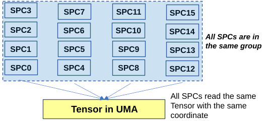</p><p align="center">图 9‑10 BIRENSUPA Grid 模式加载合并</p>

- LOAD_MERGE_SCOPE_VTG：虚拟机计算核簇组群广播模式，只适用于 UMA/UMA4/UMA16 类型的张量，在一个虚拟机计算核簇中的四个流式处理器簇读取相同的数据，编译器会尝试开启虚拟机计算核簇层级加载合并来实现硬件的支持。
  合并范围模式 LOAD_MERGE_SCOPE_VTG 下的加载 A 或 B 缓冲区，会在等到同一个虚拟机计算核簇上其他所有 SPC 都执行到这一条 API 后才开始执行。

<p align="center">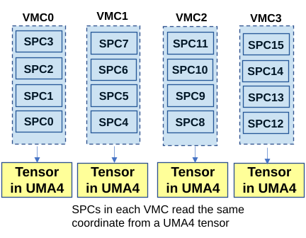</p><p align="center">图 9‑11 BIRENSUPA VMC 模式加载合并</p>

- LOAD_MERGE_SCOPE_PEER：同级组群广播模式。只适用于 UMA/UMA16 类型的张量。在启动 SPC 数量等于设备实际 SPC 数量时，如果流式处理器簇的 SPC_ID % 4 相同（在同一个同级组群中）将加载相同的数据，编译器会尝试开启同级层级加载合并来实现硬件的支持。这种模式下，所有流式处理器簇被分为虚拟机计算核簇，每个虚拟机计算核簇中的第一，第二，第三，第四个流式处理器簇将尝试进行加载合并。同级组群广播模式通常用于数据并行或模型并行的运算。
  合并范围模式 LOAD_MERGE_SCOPE_PEER 下的加载 A 或 B 缓冲区，会在等到设备上其他虚拟机计算核簇相同与自身相同序号的其他所有 SPC 都执行到这一条 API 后才开始执行。

<p align="center">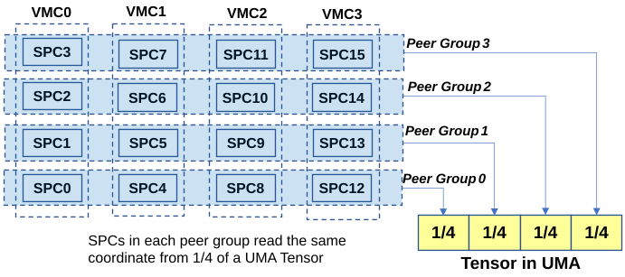</p><p align="center">图 9‑12 BIRENSUPA Peer 模式加载合并</p>

```cpp
enum LOAD_MERGE_SCOPE_MODE {
    LOAD_MERGE_SCOPE_OFF,
    LOAD_MERGE_SCOPE_VTG,
    LOAD_MERGE_SCOPE_DTG,
    LOAD_MERGE_SCOPE_PEER,
};
```

#### TCI-P 加载运算信号量

在 `tensor::tci_p` 命名空间下，用于控制加载或运算的信号量。根据壁仞通用 GPU 硬件设计，BIRENSUPA 提供了 4 组信号量，每一组分别有 16 个信号量。A 缓冲区使用 `A_BUF_LOAD` 与 `A_BUF_CALC`; B 缓冲区使用 `B_BUF_LOAD` 与 `B_BUF_CALC`。

```cpp
enum A_BUF_LOAD {
    A_BUF_LOAD_0 = 0,
    A_BUF_LOAD_1 = 1,
    A_BUF_LOAD_2 = 2,
    A_BUF_LOAD_3 = 3,
    A_BUF_LOAD_4 = 4,
    A_BUF_LOAD_5 = 5,
    A_BUF_LOAD_6 = 6,
    A_BUF_LOAD_7 = 7,
    A_BUF_LOAD_8 = 8,
    A_BUF_LOAD_9 = 9,
    A_BUF_LOAD_10 = 10,
    A_BUF_LOAD_11 = 11,
    A_BUF_LOAD_12 = 12,
    A_BUF_LOAD_13 = 13,
    A_BUF_LOAD_14 = 14,
    A_BUF_LOAD_15 = 15,
};

enum A_BUF_CALC {
    A_BUF_CALC_0 = 0,
    A_BUF_CALC_1 = 1,
    A_BUF_CALC_2 = 2,
    A_BUF_CALC_3 = 3,
    A_BUF_CALC_4 = 4,
    A_BUF_CALC_5 = 5,
    A_BUF_CALC_6 = 6,
    A_BUF_CALC_7 = 7,
    A_BUF_CALC_8 = 8,
    A_BUF_CALC_9 = 9,
    A_BUF_CALC_10 = 10,
    A_BUF_CALC_11 = 11,
    A_BUF_CALC_12 = 12,
    A_BUF_CALC_13 = 13,
    A_BUF_CALC_14 = 14,
    A_BUF_CALC_15 = 15,
};

enum B_BUF_LOAD {
    B_BUF_LOAD_0 = 0,
    B_BUF_LOAD_1 = 1,
    B_BUF_LOAD_2 = 2,
    B_BUF_LOAD_3 = 3,
    B_BUF_LOAD_4 = 4,
    B_BUF_LOAD_5 = 5,
    B_BUF_LOAD_6 = 6,
    B_BUF_LOAD_7 = 7,
    B_BUF_LOAD_8 = 8,
    B_BUF_LOAD_9 = 9,
    B_BUF_LOAD_10 = 10,
    B_BUF_LOAD_11 = 11,
    B_BUF_LOAD_12 = 12,
    B_BUF_LOAD_13 = 13,
    B_BUF_LOAD_14 = 14,
    B_BUF_LOAD_15 = 15,
};

enum B_BUF_CALC {
    B_BUF_CALC_0 = 0,
    B_BUF_CALC_1 = 1,
    B_BUF_CALC_2 = 2,
    B_BUF_CALC_3 = 3,
    B_BUF_CALC_4 = 4,
    B_BUF_CALC_5 = 5,
    B_BUF_CALC_6 = 6,
    B_BUF_CALC_7 = 7,
    B_BUF_CALC_8 = 8,
    B_BUF_CALC_9 = 9,
    B_BUF_CALC_10 = 10,
    B_BUF_CALC_11 = 11,
    B_BUF_CALC_12 = 12,
    B_BUF_CALC_13 = 13,
    B_BUF_CALC_14 = 14,
    B_BUF_CALC_15 = 15,
};
```

#### 张量核运算通用数据类型在 TCI-P 中的宣告

BIRENSUPA 为在命名空间 `tensor::tci_p` 中为[张量核运算通用数据类型](#张量核运算通用数据类型)的对应数据类型创建了宣告，使他们可以在 `tensor::tci_p` 命名空间中直接使用。

```cpp
namespace tci_p {

using gemm_type::LD_TRANSPOSE;
using gemm_type::NOT_TRANSPOSE;
using gemm_type::TRANSPOSE;

using gemm_type::TCI_FP32_MODE;
using gemm_type::TCI_MATH_MODE;
using gemm_type::TCI_TF32P_MODE;

using gemm_type::BWD_OFF;
using gemm_type::TENSOR_BPA;
using gemm_type::TENSOR_BPW;
using gemm_type::TENSOR_BWD_TYPE;

using gemm_type::A_BUF;
using gemm_type::B_BUF;
using gemm_type::GEMM_GIB;

using gemm_type::LOAD_CONV_PAD;
using gemm_type::PADDING_AUTO;
using gemm_type::PADDING_RIGHT_BOTTOM;
using gemm_type::PADDING_RIGHT_BOTTOM_ONLY;
using gemm_type::BODY_ONLY;

}
```

### 张量核心缓冲区布局

壁仞通用 GPU 硬件提供了 A 和 B 两个缓冲区用于张量核心矩阵乘法运算和卷积运算。

- 缓冲区 A：256 KB 大小，需要遵从 512 Byte 对齐
- 缓冲区 B：256 KB 大小，需要遵从 1024 Byte 对齐

#### 张量核心矩阵乘法运算缓冲区 A 布局

Matrix 张量 32 bit 数据类型，512 Byte 对齐形状为：`H = 32, W = 4`，缓冲区中每 1024 Byte 对应 64 \* 4 的数据。

<p align="center">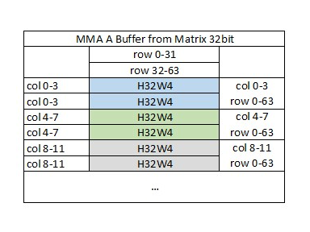</p><p align="center">图 9‑13 BIRENSUPA 矩阵乘法运算从 32 bit Matrix 张量中加载缓冲区 A</p>

Matrix 张量 16 bit 数据类型，512 Byte 对齐形状为：`H = 32, W = 8`，缓冲区中每 1024 Byte 对应 64 \* 8 的数据。

<p align="center">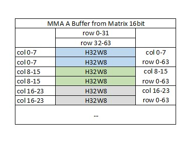</p><p align="center">图 9‑14 BIRENSUPA 矩阵乘法运算从 16 bit Matrix 张量中加载缓冲区 A</p>

Matrix 张量 8 bit 数据类型，512 Byte 对齐形状为：`H = 32, W = 16`，缓冲区中每 1024 Byte 对应 64 \* 16 的数据。

<p align="center">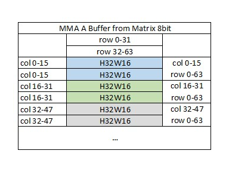</p><p align="center">图 9‑15 BIRENSUPA 矩阵乘法运算从 8 bit Matrix 张量中加载缓冲区 A</p>

#### 张量核心矩阵乘法运算缓冲区 B 布局

张量核心矩阵乘法运算缓冲区 B 加载允许 `Loading_W` 为 `64` 或 `32`

- 当 `Loading_W = 64` 时，所有缓冲区内的数据都会被加载或者使用。
- 当 `Loading_W = 32` 时，每 1024 Byte 对齐的数据会被分为左右两部分，每一部分的 `W = 32`。只有左侧一半的数据会被加载或使用；右侧一半的数据会被加载或运算跳过。

Matrix 张量 32 bit 数据类型，1024 Byte 对齐形状为：`H = 4, W = 64`。

<p align="center">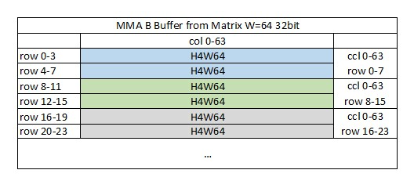</p><p align="center">图 9‑16 BIRENSUPA 矩阵乘法运算从 32 bit Matrix 张量中加载缓冲区 B W=64</p>

<p align="center">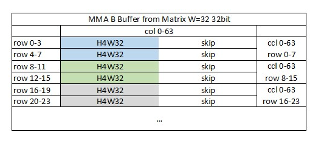</p><p align="center">图 9‑17 BIRENSUPA 矩阵乘法运算从 32 bit Matrix 张量中加载缓冲区 B W=32</p>

Matrix 张量 32 bit 数据类型，1024 Byte 对齐形状为：`H = 8, W = 64`。

<p align="center">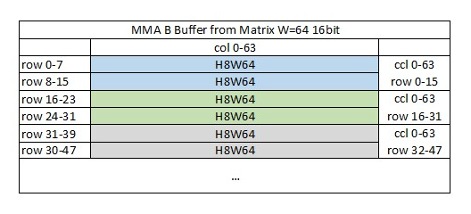</p><p align="center">图 9‑18 BIRENSUPA 矩阵乘法运算从 16 bit Matrix 张量中加载缓冲区 B W=64</p>

<p align="center">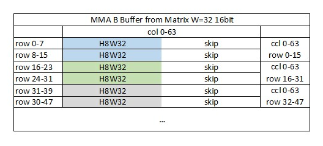</p><p align="center">图 9‑19 BIRENSUPA 矩阵乘法运算从 16 bit Matrix 张量中加载缓冲区 B W=32</p>

Matrix 张量 32 bit 数据类型，1024 Byte 对齐形状为：`H = 16, W = 64`。

<p align="center">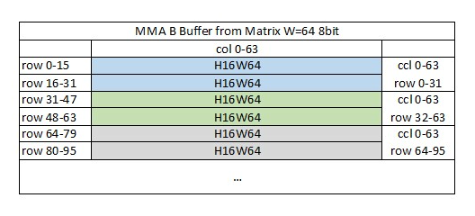</p><p align="center">图 9‑20 BIRENSUPA 矩阵乘法运算从 8 bit Matrix 张量中加载缓冲区 B W=64</p>

<p align="center">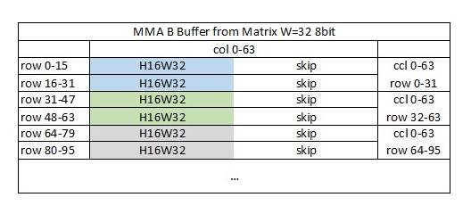</p><p align="center">图 9‑21 BIRENSUPA 矩阵乘法运算从 8 bit Matrix 张量中加载缓冲区 B W=32</p>

#### 张量核心卷积运算缓冲区 A 布局

壁仞通用 GPU 硬件张量核心缓冲区 A 中 ConvWeight 张量数据，在 64 个输出通道之后，总是连续按照卷积运算权重中每一个元素优先排列。

ConvWeight 张量 32 bit 数据类型，512 Byte 对齐形状为：`OCH = 32, ICH = 4, W = 1`，缓冲区中每 1024 Byte 对应 64 \* 4 \* 1 的数据。

<p align="center">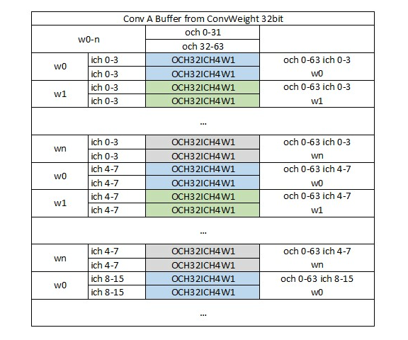</p><p align="center">图 9‑22 BIRENSUPA 卷积运算从 32 bit ConvWeight 张量中加载缓冲区 A</p>

ConvWeight 张量 16 bit 数据类型，512 Byte 对齐形状为：`OCH = 32, ICH = 8, W = 1`，缓冲区中每 1024 Byte 对应 64 \* 8 \* 1 的数据。

<p align="center">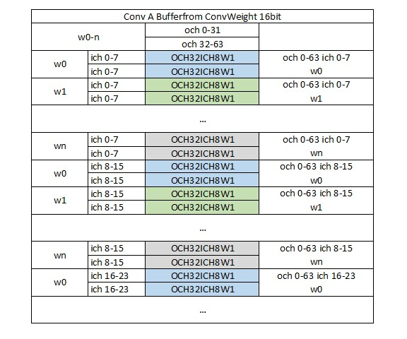</p><p align="center">图 9‑23 BIRENSUPA 卷积运算从 16 bit ConvWeight 张量中加载缓冲区 A</p>

ConvWeight 张量 8 bit 数据类型，512 Byte 对齐形状为：`OCH = 32, ICH = 16, W = 1`，缓冲区中每 1024 Byte 对应 64 \* 16 \* 1 的数据。

<p align="center">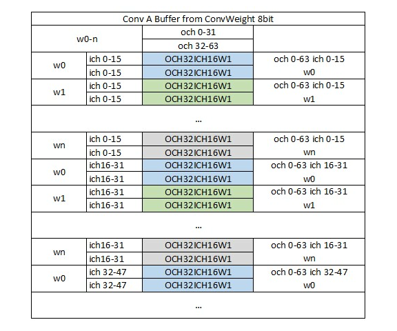</p><p align="center">图 9‑24 BIRENSUPA 卷积运算从 8 bit ConvWeight 张量中加载缓冲区 A</p>

#### 张量核心卷积运算缓冲区 B 布局

根据壁仞通用 GPU 硬件设计，当张量核心卷积通道核心尺寸大于 1 \* 1 时，硬件会自动在加载或使用卷积运算缓冲区 B 时，额外添加填充。当 `filter_height > 1` 时，每 8 \* 8 数据（1024 Byte）会竟跟其下方使用 1024 Byte 的空间用于存放他的下填充；当 `filter_height > 1` 时，根据壁仞通用 GPU 硬件会启用一种特殊的缓冲区 B 布局方式，首先 256 KB 的缓冲区 B 会被分为两个 128 KB 的区域。这种情况下，右填充（本身加载的数据的右填充，以及可能的有的下填充对应的右填充）会被安置在 128 KB 对应位置（`new_address_in_b_buf = (old_address_in_b_buf + 128KB) % 256KB`）的缓冲区 B 上。

- filter_height = 1，filter_weight = 1：简单使用缓冲区 B
- filter_height = 1，filter_weight > 1：在 128 KB 对应位置使用 `Loading_CH * Loading_H * Loading_W` 数据空间安置填充
- filter_height > 1，filter_weight = 1：不需要 128 KB 对应位置安置填充, 额外使用 `Loading_CH * Loading_H * Loading_W` 数据空间安置填充
- filter_height > 1，filter_weight > 1：额外使用 `Loading_CH * Loading_H * Loading_W` 数据空间安置下填充，在 128 KB 对应位置使用 `Loading_CH * Loading_H * Loading_W * 2` 数据空间安置右填充

Activation 张量 32 bit 数据类型，1024 Byte 对齐形状为：`CH = 4, H = 8, W = 8`。

<p align="center">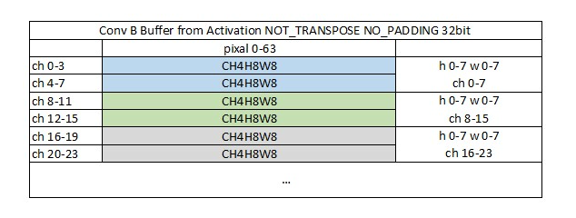</p><p align="center">图 9‑25 BIRENSUPA 卷积运算从 32 bit Activation 张量中加载缓冲区 B 无填充</p>

<p align="center">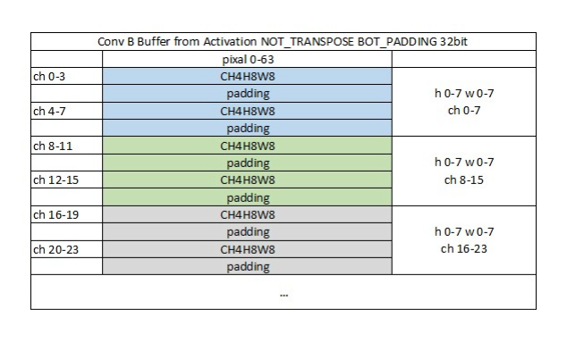</p><p align="center">图 9‑26 BIRENSUPA 卷积运算从 32 bit Activation 张量中加载缓冲区 B 有填充</p>

Activation 张量 16 bit 数据类型，1024 Byte 对齐形状为：`CH = 8, H = 8, W = 8`。

<p align="center">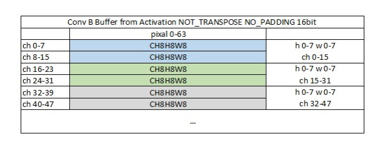</p><p align="center">图 9‑27 BIRENSUPA 卷积运算从 16 bit Activation 张量中加载缓冲区 B 无填充</p>

<p align="center"></p><p align="center">图 9‑28 BIRENSUPA 卷积运算从 16 bit Activation 张量中加载缓冲区 B 有填充</p>

Activation 张量 8 bit 数据类型，1024 Byte 对齐形状为：`CH = 16, H = 8, W = 8`。

<p align="center">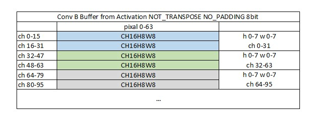</p><p align="center">图 9‑29 BIRENSUPA 卷积运算从 8 bit Activation 张量中加载缓冲区 B 无填充</p>

<p align="center">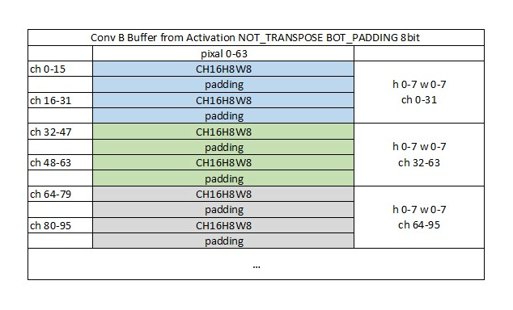</p><p align="center">图 9‑30 BIRENSUPA 卷积运算从 8 bit Activation 张量中加载缓冲区 B 有填充</p>

#### 张量核心卷积运算权重反向传播缓冲区 A 布局

Activation 张量 32 bit 数据类型，512 Byte 对齐形状为：`CH = 32, H = 1, W = 4`，每一行对应 2048 Byte 数据（64 \* 1 \* 8）。

<p align="center">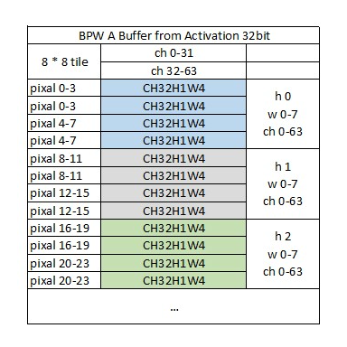</p><p align="center">图 9‑31 BIRENSUPA 卷积运算权重反向传播从 32 bit Activation 张量中加载缓冲区 A</p>

Activation 张量 16 bit 数据类型，512 Byte 对齐形状为：`CH = 32, H = 1, W = 8`，每一行对应 1048 Byte 数据（64 \* 1 \* 8）。

<p align="center">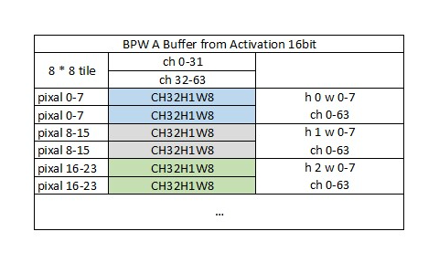</p><p align="center">图 9‑32 BIRENSUPA 卷积运算权重反向传播从 16 bit Activation 张量中加载缓冲区 A</p>

#### 张量核心卷积运算权重反向传播缓冲区 B 布局

Activation 张量 32 bit 数据类型，1024 Byte 对齐形状为：`CH = 64, H = 1, W = 4`，每一行对应 2048 Byte 数据（64 \* 1 \* 8）。

<p align="center">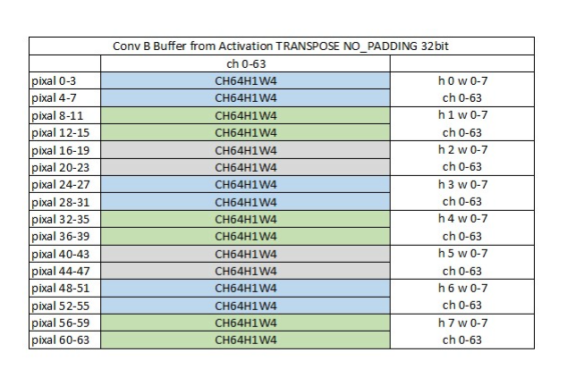</p><p align="center">图 9‑33 BIRENSUPA 卷积运算权重反向传播从 32 bit Activation 张量中加载缓冲区 B 无填充</p>

Activation 张量 16 bit 数据类型，1024 Byte 对齐形状为：`CH = 64, H = 1, W = 8`，每一行对应 1048 Byte 数据（64 \* 1 \* 8）。

<p align="center">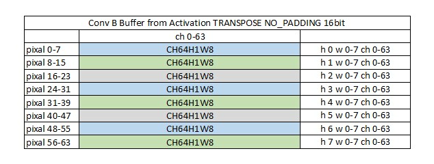</p><p align="center">图 9‑34 BIRENSUPA 卷积运算权重反向传播从 32 bit Activation 张量中加载缓冲区 16 无填充</p>

根据壁仞通用 GPU 硬件设计，当张量核心卷积通道核心尺寸大于 1 \* 1 时，硬件会自动在加载或使用卷积运算缓冲区 B 时，额外添加填充。

- filter_height = 1 ：Simple B Buffer
- filter_height > 1 同时 filter_height < 6：在数据之后使用额外 64 \* 4 \* 8 数据空间作为填充
- filter_height >= 6：在数据之后使用额外 64 \* 8 \* 8 数据空间作为填充

<p align="center">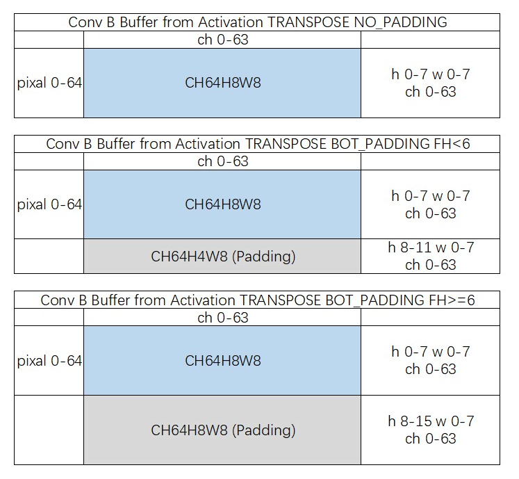</p><p align="center">图 9‑35 BIRENSUPA 卷积运算权重反向传播从 Activation 张量中加载缓冲区 B 有填充</p>

<div style="page-break-after:always"></div>

## 单指令多线程计算原语 (STI)

BIRENSUPA 定义线程等级的底层原语为单指令多线程计算原语（STI），此类型的原语函数都在命名空间 tensor::sti 内。

### 线程读取或存储 ByteObject/DynByteObject 数据

BIRENSUPA 提供了从[ByteObject](#byteobject)或[DynByteObject](#dynbyteobject-1)读取或存储的数据的 API。因为 ByteObject/DynByteObject 没有被定义数据类型，所以读取或存储时始终使用其以字节为单位的地址。

- 支持 ShortVector 数据类型：FP32，BF16，S16，S8，U8；

- 支持数据数量：1，2，3，4。

```cpp
template <typename E, ushort SVN, suMemArchType MemType, uint N>
__device__ void __ld_byte_object(__short_vector<E, SVN> *dst,
                                 ByteObject<MemType, N> Obj, uint byteAddress);

template <typename E, ushort SVN, suMemArchType MemType>
__device__ void __ld_byte_object(__short_vector<E, SVN> *dst,
                                 DynByteObject<MemType> Obj, uint byteAddress);
```

从 ByteObject 或 DynByteObject 张量读取数据。

```CPP
template <typename E, suMemArchType MemType, uint N, ushort SVN>
__device__ void __st_byte_object(ByteObject<MemType, N> Obj, uint byteAddress,
                                 __short_vector<E, SVN> src);

template <typename E, suMemArchType MemType, ushort SVN>
__device__ void __st_byte_object(DynByteObject<MemType> Obj, uint byteAddress,
                                 __short_vector<E, SVN> src);
```

将数据存储到 ByteObject 或 DynByteObject 张量。

<div style="page-break-after:always"></div>

## 张量工具接口

BIRENSUPA 提供了一些张量工具接口以方便张量库编程，此类型的函数都在命名空间 `tensor` 内。

### Matrix3D/Matrix 张量工具函数

以下 `getMatrixSubBlockH` 和 `getMatrixSubBlockW` API，在主机端或设备端返回 Matrix3D/Matrix/DynMatrix3D/DynMatrix 张量在数据子块上的维度信息。

- `E`：张量数据类型
- `Layout`：`BLOCK_COL_MAJOR`/`BLOCK_ROW_MAJOR`

```cpp
template <typename E, MatrixLayout Layout>
__host__ __device__ constexpr ushort getMatrixSubBlockH();

template <typename E, MatrixLayout Layout>
__host__ __device__ constexpr ushort getMatrixSubBlockW();
```

以下 `getMatrixSampleElementSize` 和 `getMatrixBufferElementSize` API，根据 Matrix3D/Matrix/DynMatrix3D/DynMatrix 张量数据分布以及输入的维度信息在主机端或设备端计算获得张量在维度对齐之后应有的元素数量。

- `E`：张量数据类型
- `N`，`H`，`W`：张量维度信息
- `Layout`：`BLOCK_COL_MAJOR`/`BLOCK_ROW_MAJOR`

```cpp
template <typename E, MatrixLayout Layout>
__host__ __device__ size_t getMatrixSampleElementSize(ushort H, ushort W);

template <typename E, MatrixLayout Layout, ushort H, ushort W>
__host__ __device__ constexpr size_t getMatrixSampleElementSize();

template <typename E, MatrixLayout Layout>
__host__ __device__ size_t getMatrixBufferElementSize(ushort N, ushort H,
                                                      ushort W);

template <typename E, MatrixLayout Layout, ushort N, ushort H, ushort W>
__host__ __device__ constexpr size_t getMatrixBufferElementSize();
```

以下 `toMatrixAbsPos` API，通过 Matrix3D/Matrix/DynMatrix3D/DynMatrix 张量维度信息在主机端或设备端获取提供坐标在张量所有元素中的绝对元素位置。

- `E`：张量数据类型
- `H`，`W`：张量维度信息
- `n`，`h`，`w`：坐标量维度信息
- `c`：二维或三维坐标
- `Layout`：`BLOCK_COL_MAJOR`/`BLOCK_ROW_MAJOR`

```cpp
template <typename E, MatrixLayout Layout>
__host__ __device__ size_t toMatrixAbsPos(ushort h, ushort w
                                          ushort H, ushort W);

template <typename E, MatrixLayout Layout>
__host__ __device__ size_t toMatrixAbsPos(Coordinate2D c, ushort H, ushort W);

template <typename E, MatrixLayout Layout>
__host__ __device__ size_t toMatrixAbsPos(ushort n, ushort h,
                                          ushort w, ushort H, ushort W);

template <typename E, MatrixLayout Layout>
__host__ __device__ size_t toMatrixAbsPos(Coordinate3D c, ushort H, ushort W);
```

以下 `absToMatrix3DCoordinate` API，通过 Matrix3D/Matrix/DynMatrix3D/DynMatrix 张量维度信息在主机端或设备端获取提供的绝对元素位置所对应的坐标。

- `E`：张量数据类型
- `H`，`W`：张量维度信息
- `n`：坐标在 `N` 维度上的信息
- `absPos`：绝对元素位置
- `Layout`：`BLOCK_COL_MAJOR`/`BLOCK_ROW_MAJOR`

```cpp
template <typename E, MatrixLayout Layout>
__host__ __device__ Coordinate3D absToMatrix3DCoordinate(ushort n,
                                                         size_t absPos,
                                                         ushort H, ushort W);
```

### ConvWeights/ConvWeight 张量工具函数

以下 `getConvWeightSubBlockOutC`，`getConvWeightSubBlockInC`， `getConvWeightSubBlockH` 和 `getConvWeightSubBlockW` API，在主机端或设备端返回 ConvWeights/ConvWeight/DynConvWeights/DynConvWeight 张量在数据子块上的维度信息。

- `E`：张量数据类型

```cpp
template <typename E>
__host__ __device__ constexpr ushort getConvWeightSubBlockOutC();

/// Return Sub-block's Input Channel
template <typename E>
__host__ __device__ constexpr ushort getConvWeightSubBlockInC();

/// Return Sub-block's H
template <typename E>
__host__ __device__ constexpr ushort getConvWeightSubBlockH();

/// Return Sub-block's W
template <typename E>
__host__ __device__ constexpr ushort getConvWeightSubBlockW();
```

以下 `getConvWeightBufferSampleElementSize` API，根据 ConvWeights/ConvWeight/DynConvWeights/DynConvWeight 张量数据分布以及输入的维度信息在主机端或设备端计算获得张量在维度对齐之后应有的元素数量。

- `E`：张量数据类型
- `KC_OUT`，`KC_IN`，`H`，`W`：张量维度信息

```cpp
template <typename E>
__host__ __device__ size_t getConvWeightBufferSampleElementSize(ushort KC_OUT,
                                                                ushort KC_IN,
                                                                ushort H,
                                                                ushort W);

template <typename E, ushort KC_OUT, ushort KC_IN, ushort H, ushort W>
__host__ __device__ constexpr size_t getConvWeightBufferSampleElementSize();
```

以下 `toConvWeightsAbsPos` API，通过 ConvWeights/ConvWeight/DynConvWeights/DynConvWeight 张量维度信息在主机端或设备端获取提供坐标在张量所有元素中的绝对元素位置。

- `E`：张量数据类型
- `KC_OUT`，`KC_IN`，`H`，`W`：张量维度信息
- `n`，`kc_out`，`kc_in`，`h`，`w`：坐标量维度信息
- `c`：卷积权重张量坐标

```cpp
template <typename E>
__host__ __device__ size_t toConvWeightsAbsPos(ushort n, ushort kc_out,
                                               ushort kc_in, ushort h, ushort w,
                                               ushort KC_OUT, ushort KC_IN,
                                               ushort H, ushort W);

template <typename E>
__host__ __device__ size_t toConvWeightsAbsPos(CoordinateConvWeight c,
                                               ushort KC_OUT, ushort KC_IN,
                                               ushort H, ushort W);
```

以下 `absToConvWeightCoordinate` API，通过 ConvWeights/ConvWeight/DynConvWeights/DynConvWeight 张量维度信息在主机端或设备端获取提供的绝对元素位置所对应的坐标。

- `E`：张量数据类型
- `KC_OUT`，`KC_IN`，`H`，`W`：张量维度信息
- `absPos`：绝对元素位置

```cpp
template <typename E>
__host__ __device__ CoordinateConvWeight absToConvWeightCoordinate(
    size_t absPos, ushort KC_OUT, ushort KC_IN, ushort H, ushort W);
```

### Activation 张量工具函数

以下 `getActivationSubBlockC`，`getActivationSubBlockH` 和 `getActivationSubBlockW` API，在主机端或设备端返回 Activation/DynActivation 张量在数据子块上的维度信息。

- `E`：张量数据类型

```cpp
template <typename E>
__host__ __device__ constexpr ushort getActivationSubBlockC();

template <typename E>
__host__ __device__ constexpr ushort getActivationSubBlockH();

template <typename E>
__host__ __device__ constexpr ushort getActivationSubBlockW();
```

以下 `getActivationSampleElementSize` 和 `getActivationBufferElementSize` API，根据 Activation/DynActivation 张量数据分布以及输入的维度信息在主机端或设备端计算获得张量在维度对齐之后应有的元素数量。

- `E`：张量数据类型
- `N`，`C`，`H`，`W`：张量维度信息

```cpp
template <typename E>
__host__ __device__ size_t getActivationSampleElementSize(ushort C, ushort H,
                                                          ushort W);

template <typename E, ushort C, ushort H, ushort W>
__host__ __device__ constexpr size_t getActivationSampleElementSize();

template <typename E>
__host__ __device__ size_t getActivationBufferElementSize(ushort N, ushort C,
                                                          ushort H, ushort W);

template <typename E, ushort N, ushort C, ushort H, ushort W>
__host__ __device__ constexpr size_t getActivationBufferElementSize();
```

以下 `toActivationAbsPos` API，通过 Activation/DynActivation 张量维度信息在主机端或设备端获取提供坐标在张量所有元素中的绝对元素位置。

- `E`：张量数据类型
- `C`，`H`，`W`：张量维度信息
- `n`，`c`，`h`，`w`：坐标量维度信息
- `c`：四维坐标

```cpp
template <typename E>
__host__ __device__ size_t toActivationAbsPos(ushort n, ushort c, ushort h,
                                              ushort w, ushort C, ushort H, ushort W);

template <typename E>
__host__ __device__ size_t toActivationAbsPos(Coordinate c, ushort C, ushort H,
                                              ushort W);
```

以下 `absToActivationCoordinate` API，通过 Activation/DynActivation 张量维度信息在主机端或设备端获取提供的绝对元素位置所对应的坐标。

- `E`：张量数据类型
- `C`，`H`，`W`：张量维度信息
- `n`：坐标在 `N` 维度上的信息
- `absPos`：绝对元素位置

```cpp
template <typename E>
__host__ __device__ Coordinate absToActivationCoordinate(ushort n,
                                                         size_t absPos,
                                                         ushort C, ushort H,
                                                         ushort W);
```

### Vectors/Vector 张量工具函数

以下 `getActivationSampleElementSize` 和 `getActivationBufferElementSize` API，根据 Vectors/Vector/DynVectors/DynVector 张量数据分布以及输入的维度信息在主机端或设备端计算获得张量在维度对齐之后应有的元素数量。

- `E`：张量数据类型
- `NV`，`N`：张量维度信息

```cpp
template <typename E>
__host__ __device__ constexpr size_t getVectorsBufferElementSize(ushort NV,
                                                                 ushort N);

template <typename E>
__host__ __device__ constexpr size_t getVectorBufferElementSize(ushort N);

template <typename E, ushort NV, ushort N>
__host__ __device__ constexpr size_t getVectorsBufferElementSize();

template <typename E, ushort N>
__host__ __device__ constexpr size_t getVectorBufferElementSize();
```

### DWC Weight 张量工具函数

以下 `getDepthWiseConvWeightChannelAlignment` API，根据 DepthWiseConvWeight/DynDepthWiseConvWeight 张量数据分布以及输入的广播模式以及定义的通道数在主机端或设备端计算获得物理分配空间时实际根据对齐原则分配的通道数。

- `E`：张量数据类型
- `BROADCAST_MODE`：DepthWiseConvWeight 张量维度信息张量广播模式
- `KC`: DepthWiseConvWeight 张量通道数

```cpp
template <typename E, wti::LOAD_DWC_WEIGHT_BROADCAST_MODE BROADCAST_MODE>
__host__ __device__ constexpr ushort
getDepthWiseConvWeightChannelAlignment(ushort KC);
```

以下 `getDepthWiseConvWeightBufferElementSize` API，根据 DepthWiseConvWeight/DynDepthWiseConvWeight 张量数据分布以及输入的维度信息在主机端或设备端计算获得张量在维度对齐之后应有的元素数量。

- `E`：张量数据类型
- `BROADCAST_MODE`：DepthWiseConvWeight 张量维度信息张量广播模式
- `KC`，`H`，`W`：张量维度信息

```cpp
template <typename E, wti::LOAD_DWC_WEIGHT_BROADCAST_MODE BROADCAST_MODE =
                          wti::LDDW_BROADCAST_OFF>
__host__ __device__ constexpr size_t
getDepthWiseConvWeightBufferElementSize(ushort KC, ushort H, ushort W);

/// Return one DepthWiseConvWeight total number of elements in buffer
template <typename E, ushort KC, ushort H, ushort W,
          wti::LOAD_DWC_WEIGHT_BROADCAST_MODE BROADCAST_MODE =
              wti::LDDW_BROADCAST_OFF>
__host__ __device__ constexpr size_t getDepthWiseConvWeightBufferElementSize();
```

以下 `toDepthWiseConvWeightAbsPos` API，通过 DepthWiseConvWeight/DynDepthWiseConvWeight 张量维度信息在主机端或设备端获取提供坐标在张量所有元素中的绝对元素位置。

- `E`：张量数据类型
- `BROADCAST_MODE`：DepthWiseConvWeight 张量维度信息张量广播模式
- `KC`，`H`，`W`：张量维度信息
- `kc`，`h`，`w`：坐标量维度信息
- `coord`：四维坐标

```cpp
template <typename E, wti::LOAD_DWC_WEIGHT_BROADCAST_MODE BROADCAST_MODE>
__host__ __device__ size_t toDepthWiseConvWeightAbsPos(ushort kc, ushort h,
                                                       ushort w, ushort KC,
                                                       ushort H, ushort W);

/// Return a pixel's absolute position in the DepthWiseConvWeight's buffer
template <typename E, wti::LOAD_DWC_WEIGHT_BROADCAST_MODE BROADCAST_MODE>
__host__ __device__ size_t toDepthWiseConvWeightAbsPos(
    CoordinateDWCWeight coord, ushort KC, ushort H, ushort W);

/// Return a pixel's absolute position in the DepthWiseConvWeight's buffer
template <typename E, wti::LOAD_DWC_WEIGHT_BROADCAST_MODE BROADCAST_MODE,
          ushort KC, ushort H, ushort W>
__host__ __device__ size_t toDepthWiseConvWeightAbsPos(ushort kc, ushort h,
                                                       ushort w);

/// Return a pixel's absolute position in the DepthWiseConvWeight's buffer
template <typename E, wti::LOAD_DWC_WEIGHT_BROADCAST_MODE BROADCAST_MODE,
          ushort KC, ushort H, ushort W>
__host__ __device__ size_t
toDepthWiseConvWeightAbsPos(CoordinateDWCWeight coord);
```

<div style="page-break-after:always"></div>

## 张量运行时函数

BIRENSUPA 提供了一些张量运行时接口以方便张量库相关主机端编程，此类型的函数都在命名空间 `tensor` 内。

以下 `suBindTableClear` API，手动清空张量绑定表内所有信息，之前所有绑定过的张量都需要从新绑定。

```cpp
void suBindTableClear();
```

<div style="page-break-after:always"></div>

## 法律声明

**著作权 ©**

壁仞科技 2020-2025，版权所有。未经壁仞科技事先书面许可，本文档内容不得以任何形式将其复制、修改、出版、传输或发布。

**商标。**

本文档所包含的任何壁仞科技的商号、商标、图形标志和域名，均为壁仞科技所有。未经壁仞科技事先书面许可，不得以任何形式将其复制、修改、出版、传输或发布。

**性能信息。**

本文档中所包含的性能指标包括设计规格、模拟测试指标以及特定环境下的测试和评估指标。设计规格为产品设计时拟定的指标，仅用于提供信息的目的而供您参考，实测指标将以具体的测试数据为准。模拟测试指标是通过在体系结构模拟器上运行模拟而获得，仅用于提供信息目的。该类测试的系统硬件、软件设计或配置的任何不同都可能影响实际性能。特定环境下的测试和评估指标系采用特定的计算机系统或组件操作而获得，可反映出我司产品的大致性能。系统硬件、软件设计或配置的任何不同都可能影响实际性能。

**前瞻性陈述。**

本文档的信息可能包含前瞻性陈述，可能存在风险和不确定性。请勿仅依赖于上述信息做出您的商业决定。

**注意。**

本产品后续可能进行版本升级，本文档内容会不定期更新。除非在合同中另有约定，本文档仅作产品使用指导，其中的信息和建议不构成任何明示或暗示的担保。
