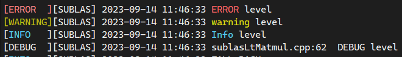
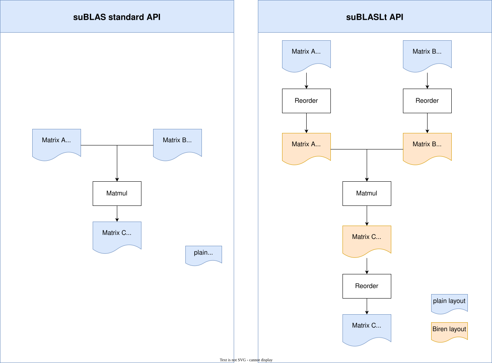

# suBLAS™ 用户指南

## suBLAS 简介

suBLAS 是壁仞科技提供的基础线性代数算法的计算库，帮助用户充分利用壁仞™ 通用 GPU 的性能高效执行线性代数基础运算。本文将对 suBLAS API 进行完整的介绍与说明。

suBLAS 库目前对外开放两套 API：

- [suBLAS API](#sublas-api-使用)，对标标准 BLAS 库，所以也叫做 suBLAS standard API
- [suBLASLt API](#sublaslt-api-使用)，专门用于 GEMM 计算的轻量 suBLASLt 库

suBLAS API 分为两大类。
第一类：流程创建以及数据传输的辅助函数。
第二类：计算函数，表示具体要执行的计算功能 API。该类又根据其输入参数的数学含义划分为 4 个子类：

- Level-1：表示标量和向量之间的运算。
- Level-2：表示矩阵和向量之间的运算。
- Level-3：表示矩阵和矩阵之间的运算。
- BLAS-Like： 标准 BLAS API 中没有覆盖到的其他更广的一些矩阵对矩阵之间的操作，比如 batched GEMM 批处理矩阵乘。

### 示例代码

对于简单的代码，请参考下面的例子，它是一个使用suBLAS API的C++应用程序。使用如下编译指令编译，然后执行。

```bash
brcc example-sublas.cpp -lsublas -I/usr/local/birensupa/sdk/latest/supa/include/ -lsupa-runtime
```

```cpp
// example-sublas.cpp
#include <iostream>
#include <sublas.h>

void ConstantInit(float *data, int size, float val) {
  for (int i = 0; i < size; ++i) {
    data[i] = val;
  }
}

int main() {
  static constexpr size_t M = 63;
  static constexpr size_t K = 64;
  static constexpr size_t N = 63;
  static constexpr size_t size_A = M * K;
  static constexpr size_t size_B = K * N;
  static constexpr size_t size_C = M * N;

  sublasHandle_t handle;
  sublasCreate(&handle);

  // initialize a and b matrix on the host
  float *h_A = new float[size_A];
  float *h_B = new float[size_B];
  ConstantInit(h_A, size_A, 1.0f);
  ConstantInit(h_B, size_B, 1.0f);

  // Allocate host matrix A and B
  float *d_A, *d_B;
  suMallocDevice((void **)&d_A, size_A * sizeof(float));
  suMallocDevice((void **)&d_B, size_B * sizeof(float));

  // copy host memory to device
  suMemcpy(d_A, h_A, size_A * sizeof(float));
  suMemcpy(d_B, h_B, size_B * sizeof(float));

  // Allocate C in device memory
  float *d_C;
  suMallocDevice((void **)&d_C, size_C * sizeof(float));

  // Allocate host matrix C
  float valc = 1000.0f;
  float *h_C = new float[size_C];
  ConstantInit(h_C, size_C, valc);
  suMemcpy(d_C, h_C, size_C * sizeof(float));

  float *h_CO = new float[size_C];
  ConstantInit(h_CO, size_C, valc);

  static constexpr float alpha = 2.0;
  static constexpr float beta = -1.0;
  sublasSgemm(handle, SUBLAS_OP_N, SUBLAS_OP_N, M, N, K, &alpha, d_A, M, d_B, K, &beta, d_C, M);

  // Read C from device memory
  suMemcpy(h_C, d_C, size_C * sizeof(float));

  // Error Check
  float result = 0.0f;
  float maxError = 0.0f;
  float golden = 0;
  for (int i = 0; i < size_C; i++) {
    result = h_C[i];
    golden = alpha * K + beta * h_CO[i];
    maxError = fmax(maxError, fabs(result - golden));
  }
  std::cout << "Max error: " << maxError << ", result: " << result
       << ", golden: " << golden << std::endl;

  // Free device and host memory
  delete[] h_CO;
  delete[] h_C;
  delete[] h_B;
  delete[] h_A;
  suFree(d_C);
  suFree(d_B);
  suFree(d_A);
  sublasDestroy(handle);

  return 0;

}
```

<div style="page-break-after:always"></div>

## 使用 suBLAS API

### 通用描述

本小节描述如何使用 suBLAS (standard) API。

#### 错误状态

所有 suBLAS 计算库函数都通过 `sublasStatus_t` 返回错误状态。

#### suBLAS Context

suBLAS Context 即 suBLAS handle的实际结构体，该结构体的定义对外不可见，通过调用 `sublasCreate()` 函数来创建。该句柄的作用是对suBLAS进行相关配置，包括stream, pointer_mode, atomics_mode, math_mode等。然后该handle作为compute API的参数之一，决定了 compute API 以何种配置进行计算。待应用程序结束了对suBLAS的使用，必须调用 `sublasDestroy()` 来释放suBLAS相关资源。

这种方式允许用户在使用多个主机线程和多个GPU的时候，显式地控制计算库的配置。举个例子，应用程序可以通过调用 `suSetDevice()` 为不同的主线程关联不同的设备。这些主线程可以为suBLAS context初始化一个独有的handle，handle会为该主线程关联一个特定的设备，应用程序则根据不同的handle将数据传递到不同的设备进行计算。

#### 线程安全

suBLAS 计算库是线程安全的。它的函数可以被多个主线程同时调用，即使使用相同的handle，依然可以保证线程安全。但是如果多个线程使用同一个handle，当handle配置改变的时候，这些改变可能会影响到所有使用该handle的线程，对于handle的销毁亦是如此。因此不建议在多个线程中使用同一个suBLAS handle。

#### 结果重现性

suBLAS 在同一代壁仞产品上结果是完全可重现的，即相同软硬件配置多次运行结果 bit-wise 一致。为避免原子操作的顺序不同可能会导致数值结果差异（一般非常细微）， suBLAS 函数未使用原子操作。

#### 标量参数

suBLAS 支持标量在Host（主机端）和Device（设备端）的传参。

#### 流式并行

当应用程序依赖于多个独立计算任务的结果时，可以使用 SUPA 流来实现这些任务的计算重叠。应用程序可以将每个任务关联到对应的 SUPA 流。
首先，您需要调用 `suStreamCreate()` 函数创建 SUPA 流，然后通过 `suBLASSetStream()` 设置每个单独的 suBLAS 库例程使用的流，然后再调用 suBLAS API。当单个计算任务的计算量较小、不足以充分利用 GPU 资源的情况下，这种方式可以发挥显著的效果。

#### 批处理

很多非常小的独立矩阵，无法达到与一个大矩阵相同的GFLOPS 。例如，单个大矩阵-矩阵乘法对 $n\times n$ 输入大小执行 $n^3$ 次运算，而1024 个 $(n/32) * (n/32)$ 小矩阵-矩阵乘法对同一输入只执行 $1024 * (n/32)^3 = n^3/32$ 次运算。然而，与单个小矩阵相比，我们可以使用许多小的独立矩阵同时在GPU上运算实现明显更好的性能, 这叫做批处理。

suBLAS 支持用户调用 `sublasSgemmBatched()` 函数进行批量矩阵乘法操作。

#### 缓存配置

suBLAS 计算库没有设置任何的cache配置偏好，主要依赖于用户对当前 SUPA 环境的配置。

#### 使用 Tensor Core

suBLAS 仅在执行 `suBLASLtMatMul()`  运算时可能使用 Tensor Core 模型进行计算。在编程过程中，suBLAS 未提出特定的数据对齐要求，但是如需获得更佳性能，建议您按照 SUPA 的要求在内存分配时进行内存对齐。目前，在编程过程中，主要通过 SUPA tensor 创建做 reorder 来实现内存的对齐，用户可以无需过度关注对齐的配置方法。

#### 64-bit Integer 接口

除了stridedBatched 的算子上的stride 变量, suBLAS 默认接受向量和矩阵维度(M, N, K)为32-bit。用户传入64-bit int会被转换为32-bit进行计算。在之后的版本中, suBLAS 更多的函数会加入64-bit integer支持。

<div style="page-break-after:always"></div>

### suBLAS 数据类型参考

#### sublasHandle_t

`sublasHandle_t` 类型是一个指向含有 suBLAS 计算库 context 的隐式结构的指针（opaque pointer）。suBLAS 计算库的句柄必须通过 `sublasCreate()` 进行初始化，返回的句柄必须传递给后续所有的库函数调用。handle 在程序结束时应通过 `sublasDestroy()` 进行销毁。

#### sublasStatus_t

`sublasStatus_t` 类型用于指明函数返回状态，所有的 suBLAS 函数都返回这个类型。它的值有以下选项：

| **值**                          | **含义**                                                                                                                       |
| ------------------------------------- | ------------------------------------------------------------------------------------------------------------------------------------ |
| SUBLAS_STATUS_SUCCESS                 | 运行成功                                                                                                                             |
| SUBLAS_STATUS_NOT_INITIALIZED         | 计算库未初始化，通常是由于函数调用前未执行sublasCreate()，sublasCreate()应先于函数调用，而后检查硬件、驱动版本以及suBLAS是否正确安装 |
| SUBLAS_STATUS_INVALID_POINTER         | 无效指针                                                                                                                             |
| SUBLAS_STATUS_ALLOC_FAILED            | 资源分配失败                                                                                                                         |
| SUBLAS_STATUS_INVALID_VALUE           | 传递的函数参数无效                                                                                                                   |
| SUBLAS_STATUS_ARCH_MISMATCH           | 未转置                                                                                                                               |
| SUBLAS_STATUS_MAPPING_ERROR           | 转置                                                                                                                                 |
| SUBLAS_STATUS_EXECUTION_FAILED        | GPU程序执行失败                                                                                                                      |
| SUBLAS_STATUS_INTERNAL_ERROR          | suBLAS内部执行错误                                                                                                                   |
| SUBLAS_STATUS_NOT_SUPPORTED           | 函数功能不支持                                                                                                                       |
| SUBLAS_STATUS_LICENSE_ERROR           | 需要license或是检查到当前的license错误                                                                                               |
| SUBLAS_STATUS_MEMORY_DEMAND_INCREASED | 需要更多内存                                                                                                                         |
| SUBLAS_STATUS_MEMORY_DEMAND_UNCHANGED | 内存需求不变                                                                                                                         |
| SUBLAS_STATUS_MEMORY_DEMAND_MISMATCH  | 内存需求不匹配                                                                                                                       |
| SUBLAS_STATUS_MEMCPY_FAILED           | 内存拷贝失败                                                                                                                         |

#### sublasOperation_t

`sublasOperation_t` 类型用于指定应对密集矩阵执行的操作。该参数的取值对应于 BLAS 实现中使用的 Fortran字符'N'或'n'（未转置），'T'或't'（转置）以及'C'或'c'（转置共轭）。

| **值**       | **含义** |
| ------------------ | -------------- |
| SUBLAS_OP_N        | 未转置         |
| SUBLAS_OP_T        | 转置           |
| SUBLAS_OP_C        | 转置共轭       |
| SUBLAS_OP_HERMITAN | Hermitan       |
| SUBLAS_OP_CONJG    | 共轭           |

#### sublasFillMode_t

`sublasFillMode_t` 类型指明密集矩阵的哪一部分（上三角或下三角）被填充了数据，需要被函数调用。它的值对应经常用于BLAS实现参数的Fortran字符'L'或'l'（下三角），'U'或'u'（上三角）。

| **值**           | **含义**   |
| ---------------------- | ---------------- |
| SUBLAS_FILL_MODE_LOWER | 下三角部分被填充 |
| SUBLAS_FILL_MODE_UPPER | 上三角部分被填充 |
| SUBLAS_FILL_MODE_FULL  | 全部被填充       |

#### sublasDiagType_t

`sublasDiagType_t` 类型指明密集矩阵的主对角元是否为1，以及是否允许后续的函数调用进行涉及和修改。它的值对应经常用于BLAS实现参数的Fortran字符'N'或'n'（非1），'U'或'u'（1）。

| **值**         | **含义** |
| -------------------- | -------------- |
| SUBLAS_DIAG_NON_UNIT | 矩阵对角元非1  |
| SUBLAS_DIAG_UNIT     | 矩阵对角元为1  |

#### sublasSideMode_t

`sublasSideMode_t` 类型指明对称矩阵是在矩阵运算符的左边还是右边，它的值对应经常用于BLAS实现参数的Fortran字符'L'或'l'（左边），'R'或'r'（右边）。比如ssymm，

$$
C = \left\{ \begin{array}{r}
\alpha AB + \beta C,\ \ SUBLAS\_ SIDE\_ LEFT \\
\alpha BA + \beta C,\ \ SUBLAS\_ SIDE\_ RIGHT
\end{array} \right.\
$$

| **值**      | **含义**         |
| ----------------- | ---------------------- |
| SUBLAS_SIDE_LEFT  | 矩阵在矩阵运算符的左边 |
| SUBLAS_SIDE_RIGHT | 矩阵在矩阵运算符的右边 |

#### sublasPointerMode_t

`sublasPointerMode_t` 类型指明标量被传递的引用是位于主机端还是设备端。如果几个标量值出现在函数调用中，那它们必须符合相同的指针模式。指针模式可以分别通过 `sublasSetPointerMode()` 和 `sublasGetPointerMode()` 进行设置和获取。

| **值**               | **含义**       |
| -------------------------- | -------------------- |
| SUBLAS_POINTER_MODE_HOST   | 传递主机端引用的标量 |
| SUBLAS_POINTER_MODE_DEVICE | 传递设备端引用的标量 |

#### sublasAtomicsMode_t

`sublasAtomicsMode_t` 类型表明 suBLAS 是否允许使用 atomics。Atomics模式可以分别通过 `sublasSetAtomicsMode()` 和 `sublasGetAtomicsMode()` 进行设置和查询。

suBLAS 目前不支持用户进行AtomicMode的设定，尽可使用suBLAS 的缺省值。

| **值**               | **含义**    |
| -------------------------- | ----------------- |
| SUBLAS_ATOMICS_NOT_ALLOWED | 不允许使用atomics |
| SUBLAS_ATOMICS_ALLOWED     | 允许使用atomics   |

#### sublasMath_t

`sublasMath_t` 枚举类型在 `sublasSetMathMode()` 中使用，它可以选择如下定义不同的计算精度模式：

suBLAS 目前不支持用户进行MathMode的设定。一切使用suBLAS 的缺省值。

| **值**               | **含义**                   |
| -------------------------- | -------------------------------- |
| SUBLAS_DEFAULT_MATH        | 默认的最高精度模式               |
| SUBLAS_BF24_TENSOR_OP_MATH | 使用BF24 Tensor Core进行加速计算 |

#### sublasComputeType_t

`sublasComputeType_t` 枚举类型在sublasLtMatmul(包括所有批处理和跨步批处理变量)中使用。

| **值**                  | **含义**                                                                                                       |
| ----------------------------- | -------------------------------------------------------------------------------------------------------------------- |
| SUBLAS_COMPUTE_16F            | 计算过程和中间结果至少是 16-bit 半精度浮点数。                                                                      |
| SUBLAS_COMPUTE_16BF           | 输入输出采用BF16数据类型，中间计算过程使用 BF16 格式。                                                              |
| SUBLAS_COMPUTE_32F            | 计算过程和中间结果至少是 32-bit 浮点数，不要求输入是 FP32。                                                          |
| SUBLAS_COMPUTE_32F_FAST_16BF  | 输入输出采用 FP32 数据类型，中间计算过程使用 BF16 格式。                                                             |
| SUBLAS_COMPUTE_32F_FAST_TF32P | 输入输出采用 FP32 数据类型，中间计算过程使用 TF32P 格式，通过 tcore 加速，这也是 suBLAS 默认的 FP32 MMA 的处理精度。 |

> 注意：
> 当前suBLAS仅支持 `SUBLAS_COMPUTE_32F`，`SUBLAS_COMPUTE_32F_FAST_TF32P`。

#### sublasLtHandle_t

`sublasLtHandle_t` 等价于 `sublasHandle_t`，其类型为指针，指向 suBLAS Context 结构体。handle必须通过 `sublasCreate()` 进行初始化，返回的handle必须传递给后续所有的库函数调用。handle在程序结束时应通过 `sublasDestroy()` 进行销毁。

<div style="page-break-after:always"></div>

### suBLAS Helper Function 参考

#### sublasCreate()

```cpp
sublasStatus_t sublasCreate(sublasHandle_t *handle)
```

函数可能的返回值以及它们的含义如下：

| **返回值**              | **含义**         |
| ----------------------------- | ---------------------- |
| SUBLAS_STATUS_SUCCESS         | 初始化成功             |
| SUBLAS_STATUS_NOT_INITIALIZED | SUPA runtime初始化失败 |
| SUBLAS_STATUS_ALLOC_FAILED    | 资源分配失败           |

#### sublasDestroy()

```cpp
sublasStatus_t sublasDestroy(sublasHandle_t handle)
```

这个函数用来释放suBLAS计算库使用的硬件资源，通常由suBLAS计算库的一个特定的handle最后调用。调用 `sublasDestroy()` 时会隐式调用 `sublasDeviceSynchronize()` 。因此建议尽量减少使用 `sublasCreate()` 和 `sublasDestroy()`。

函数可能的返回值以及它们的含义如下：

| **返回值**              | **含义** |
| ----------------------------- | -------------- |
| SUBLAS_STATUS_SUCCESS         | 资源释放成功   |
| SUBLAS_STATUS_NOT_INITIALIZED | 计算库未初始化 |

#### sublasGetStream()

```cpp
sublasStatus_t sublasGetStream(sublasHandle_t handle, suStream_t *stream)
```

该函数返回handle 所使用的stream流。

| **返回值**            | **含义**             |
| --------------------------- | -------------------------- |
| SUBLAS_STATUS_SUCCESS       | 运行成功                   |
| SUBLAS_STATUS_INVALID_VALUE | 版本号存储未初始化（NULL） |

#### sublasSetWorkspace()

```cpp
sublasStatus_t sublasSetWorkspace(sublasHandle_t handle,
                                  void *workspace,
                                  size_t workspaceSizeInBytes)
```

该函数用于设定用户分配的 device 端内存，内部 kernel 可以使用该内存做计算。
如果用户没有设置该 workspace，那所有 kernel 可以使用在创建句柄阶段默认分配的 workspace （4 MB UMA memory）。如果用户设置的 `workspaceSizeInBytes > 4MB` 将使用用户设置的 workspace。

> 注意：
> `sublasSetWorkspace()` 仅支持 UMA memory 设置

| **返回值**              | **含义**         |
| ----------------------------- | ---------------------- |
| SUBLAS_STATUS_SUCCESS         | 成功设置 workspace     |
| SUBLAS_STATUS_NOT_INITIALIZED | 计算库未初始化         |
| SUBLAS_STATUS_INVALID_POINTER | `workspace` 是空指针 |

#### sublasSetStream()

```cpp
sublasStatus_t sublasSetStream(sublasHandle_t handle,
                               suStream_t stream);
```

此函数设置 suBLAS 库流，该流将用于执行对 suBLAS 库函数的所有后续调用。 如果未设置 suBLAS 库流，则所有内核都使用 default NULL 流。 特别是，此例程可用于更改内核启动之间的流，然后将 suBLAS 库流重置回 NULL。

| **返回值**              | **含义**     |
| ----------------------------- | ------------------ |
| SUBLAS_STATUS_SUCCESS         | 成功设置set Stream |
| SUBLAS_STATUS_NOT_INITIALIZED | 计算库未初始化     |

#### sublasGetStatusString()

```cpp
const char *sublasGetStatusString(sublasStatus_t status);
```

此函数返回给定状态的描述字符串。

| **返回值** | **含义** |
| ---------------- | -------------- |
| string           | 运行状态       |

#### sublasGetStatusName()

```cpp
const char *sublasGetStatusName(sublasStatus_t status);
```

此函数返回给定状态的字符串表示形式。

| **返回值** | **含义**              |
| ---------------- | --------------------------- |
| string           | sublasStatus_t 的字符串表示 |

#### sublasSetPointerMode()

```cpp
sublasStatus_t sublasSetPointerMode(sublasHandle_t handle,
sublasPointerMode_t mode)
```

这个函数设置计算库使用的pointer mode，默认是主机端传递的引用类型。更多信息请参考数据类型  `sublasPointerMode_t` 。

| **返回值**              | **含义**       |
| ----------------------------- | -------------------- |
| SUBLAS_STATUS_SUCCESS         | 成功设置pointer mode |
| SUBLAS_STATUS_NOT_INITIALIZED | 计算库未初始化       |

#### sublasGetPointerMode()

```cpp
sublasStatus_t sublasGetPointerMode(sublasHandle_t handle,
sublasPointerMode_t *mode)
```

这个函数获取计算库使用的pointer mode，更多信息请参考数据类型 sublasPointerMode_t。

| **返回值**              | **含义**       |
| ----------------------------- | -------------------- |
| SUBLAS_STATUS_SUCCESS         | 成功获取pointer mode |
| SUBLAS_STATUS_NOT_INITIALIZED | 计算库未初始化       |

#### sublasSetVector()

```cpp
sublasStatus_t sublasSetVector(int n, int elemSize,
const void *x, int incx, void *y, int incy)
```

| **参数** | **类型** | **含义**                   |
| -------------- | -------------- | -------------------------------- |
| n              | int            | 元素个数                         |
| eleSize        | int            | 单个元素的尺寸，单位是 byte      |
| x              | const void\*   | 源内存地址                       |
| incx           | int            | 源地址相邻元素偏差，单位是个数   |
| y              | void\*         | 目的内存地址                     |
| incy           | int            | 目的地址相邻元素偏差，单位是个数 |

这个函数从主存上的x向量复制n个元素到显存上的y向量。假设每个元素的大小是elemSize字节，源向量x和目标向量y相邻元素之间的存储空间分别由incx和incy确定。

suBLAS目前仅支持，incx 且 incy = 1 的情况。

| **返回值**            | **含义**                  |
| --------------------------- | ------------------------------- |
| SUBLAS_STATUS_SUCCESS       | 运行成功                        |
| SUBLAS_STATUS_INVALID_VALUE | 参数incx, incy, elementSize\<=0 |

#### sublasGetVector()

```cpp
sublasStatus_t sublasGetVector(int n, int elemSize,
const void *x, int incx, void *y, int incy)
```

| **参数** | **类型** | **含义**                   |
| -------------- | -------------- | -------------------------------- |
| n              | int            | 元素个数                         |
| elemSize       | int            | 单个元素的尺寸，单位是 byte      |
| x              | const void\*   | 源内存地址                       |
| incx           | int            | 源地址相邻元素偏差，单位是个数   |
| y              | void\*         | 目的内存地址                     |
| incy           | int            | 目的地址相邻元素偏差，单位是个数 |

这个函数从显存上的x向量复制n个元素到主内存上的y向量。假设每个元素的大小是elemSize字节，源向量x和目标向量y相邻元素之间的存储空间分别由incx和incy确定。

suBLAS目前仅支持，incx，incy = 1 的情况。

| **返回值**            | **含义**                  |
| --------------------------- | ------------------------------- |
| SUBLAS_STATUS_SUCCESS       | 运行成功                        |
| SUBLAS_STATUS_INVALID_VALUE | 参数incx, incy, elementSize\<=0 |

#### sublasSetMatrix()

```cpp
sublasStatus_t sublasSetMatrix(int rows, int cols, int elemSize,
const void *A, int lda, void *B, int ldb)
```

这个函数从主存上的A矩阵复制rows\*cols个元素到显存上的B矩阵。假设每个元素的大小是elemSize字节，两个矩阵都以列优先的方式存储，源矩阵A和目标矩阵B的主维度分别是lda和ldb。主维度表明分配的矩阵行的数目，即使仅仅使用它的一个子矩阵。通常B是一个设备端指针，指向一个设备端对象或是对象的一部分。

suBLAS目前仅支持lda == ldb == rows 的情况.

| **返回值**            | **含义**                                     |
| --------------------------- | -------------------------------------------------- |
| SUBLAS_STATUS_SUCCESS       | 运行成功                                           |
| SUBLAS_STATUS_INVALID_VALUE | 参数rows 或 cols\<0或是lda, ldb 或 elementSize\<=0 |

#### sublasGetMatrix()

```cpp
sublasStatus_t sublasGetMatrix(int rows, int cols, int elemSize,
const void *A, int lda, void *B, int ldb)
```

这个函数从显存上的A矩阵复制rows\*cols个元素到主内存上的B矩阵。假设每个元素的大小是elemSize字节，两个矩阵都以列优先的方式存储，源矩阵A和目标矩阵B的主维度分别是lda和ldb。主维度表明分配的矩阵行的数目，即使仅仅使用它的一个子矩阵。通常A是一个设备端指针，指向一个设备端对象或是对象的一部分。

suBLAS目前仅支持lda == ldb == rows 的情况.

| **返回值**            | **含义**                                 |
| --------------------------- | ---------------------------------------------- |
| SUBLAS_STATUS_SUCCESS       | 运行成功                                       |
| SUBLAS_STATUS_INVALID_VALUE | 参数rows, cols\<0或是lda, ldb, elementSize\<=0 |

#### sublasSetMathMode()

```cpp
sublasStatus_t sublasSetMathMode(sublasHandle_t handle,
sublasMath_t mode)
```

sublasSetMathMode 函数使您能够选择由 sublasMath_t 定义的计算精度模式.

#### sublasGetMathMode()

```cpp
sublasStatus_t sublasGetMathMode(sublasHandle_t handle,
sublasMath_t *mode)
```

这个函数查询计算库使用的math mode。

| **返回值**              | **含义**    |
| ----------------------------- | ----------------- |
| SUBLAS_STATUS_SUCCESS         | 成功查询math mode |
| SUBLAS_STATUS_INVALID_VALUE   | 参数mode是空指针  |
| SUBLAS_STATUS_NOT_INITIALIZED | 计算库未初始化    |

<div style="page-break-after:always"></div>

### suBLAS Level-1 Function 参考

本节描述处理标量和向量基本运算的Level-1基础线性代数计算函数。我们使用缩写\<type\>代表数据类型，\<t\>代表对应的具体类型缩写，简练清晰地表示相应的处理函数。除非特定的情况，\<type\>和\<t\>表示如下含义：

| **\<type\>** | **\<t\>** | **含义** |
| ------------------ | --------------- | -------------- |
| Float              | 's'或'S'        | 单精度实数     |
| Double             | 'd'或'D'        | 双精度实数     |
| suComplex          | 'c'或'C'        | 单精度复数     |
| suDoubleComplex    | 'z'或'Z'        | 双精度复数     |
| Half               | 'h'或'H'        | 16-bit精度     |

当输入时复数时，函数的参数和返回值类型可能不一样，\<t\>也包含以下含义：'Sc'，'Cs'，'Dz'和'Zd'。

suBLAS仅支持Float 和少部分suComplex 类型。更多精度在之后的版本陆续加入。

缩写$Re(.)$和$Im(.)$分别代表一个复数的实部和虚部。由于实数的虚部是不存在的，我们认为它是0，在需要用到它的时候可以简单忽略。$\overline{\alpha}$表示$\alpha$ 的共轭复数。在此整篇文档中，通常情况下用小写希腊字母 $\mathbf{\alpha}$ 和 $\mathbf{\beta}$ 表示标量，粗体小写英文字母 $\mathbf{x}$ 和 $\mathbf{y}$ 表示向量，大写英文字母 A、B、C 表示矩阵。

#### sublasI\<t\>amax()

```cpp
sublasStatus_t sublasIsamax(sublasHandle_t handle, int n,
const float *x, int incx, int *result)
```

这个函数找到第一个最大元素的索引.

对于 $\mathbf{i} = 1,2,...n,j = 1 + (i - 1)*incx$，其结果是第一个满足要求的 $i，|Im(x\lbrack j\rbrack)| + |Re(x\lbrack j\rbrack)|$ 是最大的。

| **参数** | **存储** | **输入输出** | **含义**                  |
| -------------- | -------------- | ------------------ | ------------------------------- |
| handle         |                | 输入               | 关联suBLAS计算库context的handle |
| n              |                | 输入               | 向量中元素的数目                |
| $x$          | 设备端         | 输入               | 相应类型的向量                  |
| incx           |                | 输入               | 相邻x元素之间的步长             |
| result         | 主机端或设备端 | 输出               | 结果索引，当n, incx\<0时为0     |

函数可能的返回值以及它们的含义如下：

| **返回值**               | **含义**           |
| ------------------------------ | ------------------------ |
| SUBLAS_STATUS_SUCCESS          | 运行成功                 |
| SUBLAS_STATUS_NOT_INITIALIZED  | 计算库未初始化           |
| SUBLAS_STATUS_ALLOC_FAILED     | reduction buffer分配失败 |
| SUBLAS_STATUS_EXECUTION_FAILED | 函数在GPU上launch失败    |

#### sublasI\<t\>amin()

```cpp
sublasStatus_t sublasIsamin(sublasHandle_t handle, int n, const float *x, int incx, int *result)
```

这个函数找到第一个最小元素的索引，对于 $\mathbf{i} = 1,2,...n,j = 1 + (i - 1)*incx$，其结果是第一个满足要求的 $\mathbf{i}，|Im(x\lbrack j\rbrack)| + |Re(x\lbrack j\rbrack)|$ 是最小的。

| **参数** | **存储** | **输入输出** | **含义**                  |
| -------------- | -------------- | ------------------ | ------------------------------- |
| handle         |                | 输入               | 关联suBLAS计算库context的handle |
| n              |                | 输入               | 向量中元素的数目                |
| x              | 设备端         | 输入               | 相应类型的向量                  |
| incx           |                | 输入               | 相邻x元素之间的步长             |
| result         | 主机端或设备端 | 输出               | 结果索引，当n, incx\<0时为0     |

函数可能的返回值以及它们的含义如下：

| **返回值**               | **含义**           |
| ------------------------------ | ------------------------ |
| SUBLAS_STATUS_SUCCESS          | 运行成功                 |
| SUBLAS_STATUS_NOT_INITIALIZED  | 计算库未初始化           |
| SUBLAS_STATUS_ALLOC_FAILED     | reduction buffer分配失败 |
| SUBLAS_STATUS_EXECUTION_FAILED | 函数在GPU上launch失败    |

#### sublas\<t\>asum()

```cpp
sublasStatus_t sublasSasum(sublasHandle_t handle, int n,
const float *x, int incx, float *result)
```

这个函数求所有元素绝对值的和。对于 $\mathbf{i}$ = 1,2,...n, 其结果是 $\sum_{i}^{n}(|Im(x\lbrack j\rbrack)| + |Re(x\lbrack j\rbrack)|)$，其中 $j = 1 + (i - 1)*incx$

| **参数** | **存储** | **输入输出** | **含义**                  |
| -------------- | -------------- | ------------------ | ------------------------------- |
| handle         |                | 输入               | 关联suBLAS计算库context的handle |
| n              |                | 输入               | 向量中元素的数目                |
| x              | 设备端         | 输入               | 相应类型的向量                  |
| incx           |                | 输入               | 相邻x元素之间的步长             |
| result         | 主机端或设备端 | 输出               | 结果索引，当n, incx\<0时为0     |

函数可能的返回值以及它们的含义如下：

| **返回值**               | **含义**            |
| ------------------------------ | ------------------------- |
| SUBLAS_STATUS_SUCCESS          | 运行成功                  |
| SUBLAS_STATUS_NOT_INITIALIZED  | 计算库未初始化            |
| SUBLAS_STATUS_ALLOC_FAILED     | reduction buffer 分配失败 |
| SUBLAS_STATUS_EXECUTION_FAILED | 函数在GPU上launch失败     |

#### sublas\<t\>nrm2()

```cpp
sublasStatus_t sublasSnrm2(sublasHandle_t handle, int n,
                        const float *x, int incx,
                        float *result);

sublasStatus_t sublasScnrm2(sublasHandle_t handle, int n,
                                    const suFloatComplex *x, int incx,
                                    float *result);
```

此函数计算向量$x$的Euclidean norm。这个计算的结果为$\sqrt{\sum_{i = 1}^{n}{(x\lbrack j\rbrack \times x\lbrack j\rbrack)}}$，其中$j=1+(i-1)*incx$。

| **参数** | **存储**   | **输入输出** | **含义**                              |
| -------------- | ---------------- | ------------------ | ------------------------------------------- |
| handle         |                  | 输入               | 关联suBLAS计算库context的handle             |
| n              |                  | 输入               | 输入或输出向量中元素的数目                  |
| x              | 设备端           | 输入/输出          | 相应类型的输入向量                          |
| incx           |                  | 输入               | 相邻x元素之间的步长                         |
| result         | 主机端 or 设备端 | 输出               | norm计算的结果，如果n,incx\<=0，则其值为0.0 |

函数可能的返回值以及它们的含义如下：

| **返回值**               | **含义**        |
| ------------------------------ | --------------------- |
| SUBLAS_STATUS_SUCCESS          | 运行成功              |
| SUBLAS_STATUS_NOT_INITIALIZED  | 计算库未初始化        |
| SUBLAS_STATUS_EXECUTION_FAILED | 函数在GPU上launch失败 |
| SUBLAS_STATUS_ALLOC_FAILED     | 内存分配失败          |

#### sublas\<t\>dot()

```cpp
sublasStatus_t sublasSdot(sublasHandle_t handle, int n,
                    const float *x, int incx, const float *y,
                    int incy, float *result);

sublasStatus_t sublasCdotu(sublasHandle_t handle, int n,
                        const suFloatComplex *x, int incx,
                        const suFloatComplex *y, int incy,
                        suFloatComplex *result);

sublasStatus_t sublasCdotc(sublasHandle_t handle, int n,
                        const suFloatComplex *x, int incx,
                        const suFloatComplex *y, int incy,
                        suFloatComplex *result);
```

此函数计算x与y的点积。这个点积的结果为$\sum_{i = 1}^{n}{(x\lbrack k\rbrack \times y\lbrack j\rbrack)}$，其中$k = 1 + (i - 1)*incx，j = 1 + (i - 1)*incy$。

如果函数名称以“c”结尾，则应该使用x元素的共轭。

| **参数** | **存储**   | **输入输出** | **含义**                        |
| -------------- | ---------------- | ------------------ | ------------------------------------- |
| handle         |                  | 输入               | 关联suBLAS计算库context的handle       |
| n              |                  | 输入               | 输入或输出向量中元素的数目            |
| $x$          | 设备端           | 输入/输出          | 相应类型的输入向量                    |
| incx           |                  | 输入               | 相邻x元素之间的步长                   |
| $y$          | 设备端           | 输入/输出          | 相应类型的输入向量                    |
| incy           |                  | 输入               | 相邻y元素之间的步长                   |
| result         | 主机端 or 设备端 | 输出               | dot计算的结果，如果n\<=0，则其值为0.0 |

函数可能的返回值以及它们的含义如下：

| **返回值**               | **含义**        |
| ------------------------------ | --------------------- |
| SUBLAS_STATUS_SUCCESS          | 运行成功              |
| SUBLAS_STATUS_NOT_INITIALIZED  | 计算库未初始化        |
| SUBLAS_STATUS_EXECUTION_FAILED | 函数在GPU上launch失败 |
| SUBLAS_STATUS_ALLOC_FAILED     | 内存分配失败          |

#### sublas\<t\>axpy()

```cpp
sublasStatus_t sublasSaxpy(sublasHandle_t handle, int n,
const float *alpha, const float *x, int incx, float *y, int incy)
```

这个函数将向量 *x* 乘以标量 α，再将结果加到向量 *y* 上，覆盖原来的 *y* 向量。对于 $\mathbf{i} = 1,2,...n,\ \ k = 1 + (i - 1)*incx,\ \ j = 1 + (i - 1)*incy,\ \ y\lbrack j\rbrack = \alpha \times x\lbrack k\rbrack + y\lbrack j\rbrack$

| **参数** | **存储** | **输入输出** | **含义**                  |
| -------------- | -------------- | ------------------ | ------------------------------- |
| handle         |                | 输入               | 关联suBLAS计算库context的handle |
| alpha          | 主机端或设备端 | 输入               | 用于数乘的标量                  |
| n              |                | 输入               | 输入或输出向量中元素的数目      |
| x              | 设备端         | 输入               | 相应类型的输入向量              |
| incx           |                | 输入               | 相邻x元素之间的步长             |
| y              | 设备端         | 输出               | 相应类型的输出向量              |
| incy           |                | 输入               | 相邻y元素之间的步长             |

函数可能的返回值以及它们的含义如下：

| **返回值**               | **含义**        |
| ------------------------------ | --------------------- |
| SUBLAS_STATUS_SUCCESS          | 运行成功              |
| SUBLAS_STATUS_NOT_INITIALIZED  | 计算库未初始化        |
| SUBLAS_STATUS_EXECUTION_FAILED | 函数在GPU上launch失败 |

#### sublas\<t\>copy()

```cpp
sublasStatus_t sublasScopy(sublasHandle_t handle, int n, const float *x, int incx, float *y, int incy)
```

这个函数将向量 *x* 复制到向量 *y* 上，覆盖原来的 *y* 向量。

对于$\mathbf{i} = 1,2,...n,k = 1 + (i - 1)*incx,j = 1 + (i - 1)*incy，y\lbrack j\rbrack = x\lbrack k\rbrack$

| **参数** | **存储** | **输入输出** | **含义**                  |
| -------------- | -------------- | ------------------ | ------------------------------- |
| handle         |                | 输入               | 关联suBLAS计算库context的handle |
| n              |                | 输入               | 输入或输出向量中元素的数目      |
| x              | 设备端         | 输入               | 相应类型的输入向量              |
| incx           |                | 输入               | 相邻x元素之间的步长             |
| y              | 设备端         | 输出               | 相应类型的输出向量              |
| incy           |                | 输入               | 相邻y元素之间的步长             |

函数可能的返回值以及它们的含义如下：

| **返回值**               | **含义**        |
| ------------------------------ | --------------------- |
| SUBLAS_STATUS_SUCCESS          | 运行成功              |
| SUBLAS_STATUS_NOT_INITIALIZED  | 计算库未初始化        |
| SUBLAS_STATUS_EXECUTION_FAILED | 函数在GPU上launch失败 |

#### sublas\<t\>scal()

```cpp
sublasStatus_t sublasSscal(sublasHandle_t handle, int n,
const float *alpha, float *x, int incx)
```

这个函数使用标量 α 乘以向量 *x*，得到的结果覆盖原来的向量 *x*。对于 $\mathbf{i} = 1,2,...n$，其结果是 $x\lbrack j\rbrack = \alpha \times x\lbrack j\rbrack$，其中$j = 1 + (i - 1)*incx$

| **参数** | **存储** | **输入输出** | **含义**                  |
| -------------- | -------------- | ------------------ | ------------------------------- |
| handle         |                | 输入               | 关联suBLAS计算库context的handle |
| alpha          | 主机端或设备端 | 输入               | 用于数乘的标量                  |
| n              |                | 输入               | 输入或输出向量中元素的数目      |
| x              | 设备端         | 输入/输出          | 相应类型的输入向量              |
| incx           |                | 输入               | 相邻x元素之间的步长             |

函数可能的返回值以及它们的含义如下：

| **返回值**               | **含义**        |
| ------------------------------ | --------------------- |
| SUBLAS_STATUS_SUCCESS          | 运行成功              |
| SUBLAS_STATUS_NOT_INITIALIZED  | 计算库未初始化        |
| SUBLAS_STATUS_EXECUTION_FAILED | 函数在GPU上launch失败 |

#### sublas\<t\>swap()

```cpp
sublasStatus_t sublasSswap(sublasHandle_t handle, int n,
float *x, int incx, float *y, int incy);
```

这个函数交换向量 *x* 和向量 *y* 的元素。对于 $\mathbf{i} = 1,2,...n$，其结果是 $y\lbrack j\rbrack \Leftrightarrow x\lbrack k\rbrack$，其中$j = 1 + (i - 1)*incy,k = 1 + (i - 1)*incx$

| **参数** | **存储** | **输入输出** | **含义**                  |
| -------------- | -------------- | ------------------ | ------------------------------- |
| handle         |                | 输入               | 关联suBLAS计算库context的handle |
| n              |                | 输入               | 输入或输出向量中元素的数目      |
| x              | 设备端         | 输入/输出          | 相应类型的输入向量              |
| incx           |                | 输入               | 相邻x元素之间的步长             |
| y              | 设备端         | 输入/输出          | 相应类型的输入向量              |
| incy           |                | 输入               | 相邻y元素之间的步长             |

函数可能的返回值以及它们的含义如下：

| **返回值**               | **含义**        |
| ------------------------------ | --------------------- |
| SUBLAS_STATUS_SUCCESS          | 运行成功              |
| SUBLAS_STATUS_NOT_INITIALIZED  | 计算库未初始化        |
| SUBLAS_STATUS_EXECUTION_FAILED | 函数在GPU上launch失败 |

#### sublas\<t\>rot()

```cpp
sublasStatus_t sublasSrot(sublasHandle_t handle,
                        int n, float *x, int incx,
                        float *y, int incy,
                        const float *c, const float *s);

sublasStatus_t sublasCSrot(sublasHandle_t handle,
                        int n, suFloatComplex *x, int incx,
                        suFloatComplex *y, int incy,
                        const float *c, const float *s);
```

此函数应用Givens旋转矩阵，即在x，y平面上逆时针旋转，旋转角度由$\cos{(alpha) = c,\sin{(alpha) = s}}$定义。

$$
G = \begin{pmatrix}
c & s \\-s & c
\end{pmatrix}
$$

应用于向量x和y。

因此，$x\lbrack k\rbrack = c \times x\lbrack k\rbrack + s \times y\lbrack j\rbrack$ ，$y\lbrack j\rbrack = - s \times x\lbrack k\rbrack + c \times y\lbrack j\rbrack$，其中$k = 1 + (i - 1)*incx,j = 1 + (i - 1)*incy$。

| **参数** | **存储** | **输入输出** | **含义**                  |
| -------------- | -------------- | ------------------ | ------------------------------- |
| handle         |                | 输入               | 关联suBLAS计算库context的handle |
| n              |                | 输入               | 向量x,y中元素的数目             |
| $x$          | 设备端         | 输入/输出          | 有n个元素的向量x                |
| incx           |                | 输入               | 相邻x元素之间的步长             |
| $y$          | 设备端         | 输入/输出          | 有n个元素的向量 y               |
| incy           |                | 输入               | 相邻y元素之间的步长             |
| c              | 主机端或设备端 | 输入               | 旋转矩阵的余弦元素              |
| s              | 主机端或设备端 | 输入               | 旋转矩阵的正弦元素              |

函数可能的返回值以及它们的含义如下：

| **返回值**               | **含义**        |
| ------------------------------ | --------------------- |
| SUBLAS_STATUS_SUCCESS          | 运行成功              |
| SUBLAS_STATUS_NOT_INITIALIZED  | 计算库未初始化        |
| SUBLAS_STATUS_EXECUTION_FAILED | 函数在GPU上launch失败 |
| SUBLAS_STATUS_ALLOC_FAILED     | 内存分配失败          |

#### sublas\<t\>rotg()

```cpp
sublasStatus_t sublasSrotg(sublasHandle_t handle, float *a, float *b, float *c, float *s);
```

此函数构造Givens旋转矩阵

$$
G = \begin{pmatrix}
  c & s \\

s & c
     \end{pmatrix}
$$

将一个2×1的向量$(a,b)^T$的第二个元素归零。
对于**实数**可以写成：

$$
\begin{pmatrix}
c & s \\

s & c
   \end{pmatrix}\binom{a}{b} = \binom{r}{0}，
$$

其中$c^{2} + s^{2} = 1$,$r = a^{2} + b^{2}$。参数 `a` 和 `b` 被 `r` 和 `z` 确定。 `c` 和 `s` 用以下规则生成：

$$
(c,s) = \left\{ \begin{array}{r}
\left( \sqrt{1 - z^{2}},z \right)\ \ \ \ \ \ \ if\ |z| < 1\  \\
(0.0,1.0)\ \ \ \ \ \ \ \ \ if\ |z| = 1 \\
\left( \frac{1}{z},\sqrt{1 - z^{2}} \right)\ \ \ if\ |z| > 1
\end{array} \right.\
$$

对于**复数**可以写成：

$$
\begin{pmatrix}
    c & s \\

   - \overline{s} & c
     \end{pmatrix}\binom{a}{b} = \binom{r}{0}，
$$

其中$c^{2} + \overline{s} \times s = 1$。当$a \neq 0$时，$\left\| (a,b)^{T} \right\|_{2} = \sqrt{|a|^{2} + |b|^{2}}$；当a=0时，r=b。最后，参数a在退出时被r覆盖。

| **参数** | **存储** | **输入输出** | **含义**                  |
| -------------- | -------------- | ------------------ | ------------------------------- |
| handle         |                | 输入               | 关联suBLAS计算库context的handle |
| a              | 主机端或设备端 | 输入/输出          | 用r覆盖的标量                   |
| b              | 主机端或设备端 | 输入/输出          | 用z覆盖的标量                   |
| c              | 主机端或设备端 | 输出               | 旋转矩阵的余弦元素              |
| s              | 主机端或设备端 | 输出               | 旋转矩阵的正弦元素              |

函数可能的返回值以及它们的含义如下：

| **返回值**               | **含义**        |
| ------------------------------ | --------------------- |
| SUBLAS_STATUS_SUCCESS          | 运行成功              |
| SUBLAS_STATUS_NOT_INITIALIZED  | 计算库未初始化        |
| SUBLAS_STATUS_EXECUTION_FAILED | 函数在GPU上launch失败 |
| SUBLAS_STATUS_ALLOC_FAILED     | 内存分配失败          |

#### sublas\<t\>rotm()

```cpp
sublasStatus_t sublasSrotm(sublasHandle_t handle, int n, float *x, int incx, float *y, int incy, const float *param);
```

此函数将修改后的Givens变换 $H = \begin{pmatrix}
h_{11} & h_{12} \\
h_{21} & h_{22}
\end{pmatrix}$ 应用于向量x,y，则$x\lbrack k\rbrack = h_{11} \times x\lbrack k\rbrack + h_{12} \times y\lbrack j\rbrack,y\lbrack j\rbrack = h_{21} \times x\lbrack k\rbrack + h_{22} \times y\lbrack j\rbrack$。其中，$k = 1 + (i - 1)*incx,j = 1 + (i - 1)*incy$。

矩阵H的元素分别存储在参数param[1]、param[2]、param[3]和param[4]中。 flag=param[0]为矩阵H定义了以下预定义值:

| flag=-1.0                                                    | flag=0.0 | flag=1.0 | flag=-2.0 |
| ------------------------------------------------------------ | -------- | -------- | --------- |
| $$ H = \begin{pmatrix}h_{11} & h_{12} \\h_{21} & h_{22}\end{pmatrix} $$ |   $$ H = \begin{pmatrix}1.0 & h_{12} \\ h_{21} & 1.0    \end{pmatrix} $$       |      $$ H = \begin{pmatrix}h_{11} & 1.0 \\ -1.0 & h_{22}    \end{pmatrix} $$    |     $$ H = \begin{pmatrix}1.0 & 0.0 \\ 0.0 & 1.0    \end{pmatrix} $$      |

> 注意：
> 根据flag隐含的矩阵H中的值-1.0、0.0、1.0没有存储在param中。

| **参数** | **存储** | **输入输出** | **含义**                                               |
| -------------- | -------------- | ------------------ | ------------------------------------------------------------ |
| handle         |                | 输入               | 关联suBLAS计算库context的handle                              |
| n              |                | 输入               | 向量x,y中元素的数目                                          |
| x              | 设备端         | 输入/输出          | 有n个元素的向量x                                             |
| incx           |                | 输入               | 相邻x元素之间的步长                                          |
| y              | 设备端         | 输入/输出          | 有n个元素的向量y                                             |
| incy           |                | 输入               | 相邻y元素之间的步长                                          |
| param          | 主机端或设备端 | 输入               | 有5个元素的向量，其中param\[0\]和param\[1-4\]包含flag和矩阵H |

函数可能的返回值以及它们的含义如下：

| **返回值**               | **含义**        |
| ------------------------------ | --------------------- |
| SUBLAS_STATUS_SUCCESS          | 运行成功              |
| SUBLAS_STATUS_NOT_INITIALIZED  | 计算库未初始化        |
| SUBLAS_STATUS_EXECUTION_FAILED | 函数在GPU上launch失败 |
| SUBLAS_STATUS_ALLOC_FAILED     | 内存分配失败          |

#### sublas\<t\>rotmg()

```cpp
sublasStatus_t sublasSrotmg(sublasHandle_t handle, float *d1, float *d2, float *x1, const float *y1, float *param);
```

此函数构造修正的Givens变换$H = \begin{pmatrix}
h_{11} & h_{12} \\
h_{21} & h_{22}
\end{pmatrix}$将一个$2 \times 1$的向量$\left( \sqrt{d1}*x_{1},\sqrt{d2}*y_{1} \right)^{T}$的第二个元素归零。

flag=param[0]为矩阵H定义了以下预定义值:

| flag=-1.0 | flag=0.0 | flag=1.0 | flag=-2.0 |
| --------- | -------- | -------- | --------- |
|   $$ H = \begin{pmatrix}h_{11} & h_{12} \\h_{21} & h_{22}\end{pmatrix} $$        |    $$ H = \begin{pmatrix}1.0 & h_{12} \\ h_{21} & 1.0    \end{pmatrix} $$      |     $$ H = \begin{pmatrix}h_{11} & 1.0 \\ -1.0 & h_{22}    \end{pmatrix} $$     |     $$ H = \begin{pmatrix}1.0 & 0.0 \\ 0.0 & 1.0    \end{pmatrix} $$      |

> 注意：
> 根据flag隐含的矩阵H中的值-1.0、0.0、1.0没有存储在param中。

| **参数** | **存储** | **输入输出** | **含义**                                               |
| -------------- | -------------- | ------------------ | ------------------------------------------------------------ |
| handle         |                | 输入               | 关联suBLAS计算库context的handle                              |
| d1             | 主机端或设备端 | 输入/输出          | 计算结束后被覆盖的标量                                       |
| d2             | 主机端或设备端 | 输入/输出          | 计算结束后被覆盖的标量                                       |
| X1             | 主机端或设备端 | 输入/输出          | 计算结束后被覆盖的标量                                       |
| y1             | 主机端或设备端 | 输入               | 标量                                                         |
| param          | 主机端或设备端 | 输出               | 有5个元素的向量，其中param\[0\]和param\[1-4\]包含flag和矩阵H |

函数可能的返回值以及它们的含义如下：

| **返回值**               | **含义**        |
| ------------------------------ | --------------------- |
| SUBLAS_STATUS_SUCCESS          | 运行成功              |
| SUBLAS_STATUS_NOT_INITIALIZED  | 计算库未初始化        |
| SUBLAS_STATUS_EXECUTION_FAILED | 函数在GPU上launch失败 |
| SUBLAS_STATUS_ALLOC_FAILED     | 内存分配失败          |

<div style="page-break-after:always"></div>

### suBLAS Level-2 Function 参考

#### sublas\<t\>gemv()

```cpp
sublasStatus_t sublasSgemv(sublasHandle_t handle,
                            sublasOperation_t transa,
                            int m, int n,
                            const float *alpha,
                            const float *A, int lda,
                            const float *x, int incx,
                            const float *beta, float *y, int incy)
```

此函数执行矩阵向量乘法

$$
y = alpha*op(A)*x + beta*x
$$

其中 A 是以列优先格式存储的 $m\times n$ 矩阵，x 和 y 是向量，$alpha$ 和 $beta$ 是标量，

| **参数** | **存储** | **输入输出** | **含义**                    |
| -------------- | -------------- | ------------------ | --------------------------------- |
| handle         |                | 输入               | 关联suBLAS计算库context的handle   |
| transa         |                | 输入               | Op(A): 非转置, 转置, 或者共轭转置 |
| m              |                | 输入               | A 的行数                          |
| n              | 设备端         | 输入               | A 的列数                          |
| alpha          | 主机端或设备端 | 输入               | 相应类型的输入标量                |
| A              | 设备端         | 输入               | 相应类型的输入矩阵A               |
| lda            |                | 输入               | A 矩阵主维度                      |
| x              | 设备端         | 输入/输出          | 相应类型的输入向量                |
| incx           |                | 输入               | 相邻x元素之间的步长               |
| beta           | 主机或设备端   | 输入               | 相应类型的输入标量                |
| y              | 设备端         | 输入/输出          | 相应类型的输入向量                |
| incy           |                | 输入               | 相邻y元素之间的步长               |

函数可能的返回值以及它们的含义如下：

| **返回值**               | **含义**                     |
| ------------------------------ | ---------------------------------- |
| SUBLAS_STATUS_SUCCESS          | 运行成功                           |
| SUBLAS_STATUS_INVALID_VALUE    | If m, n,\< 0 或者 incx, incy \<= 0 |
| SUBLAS_STATUS_NOT_INITIALIZED  | 计算库未初始化                     |
| SUBLAS_STATUS_EXECUTION_FAILED | 函数在GPU上launch失败              |

#### sublas\<t\>gemvStridedBatched()

```cpp
sublasStatus_t sublasSgemvStridedBatched(
                            sublasHandle_t handle,
                            sublasOperation_t trans, int m, int n,
                            const float *alpha,
                            const float *A, int lda, long long int strideA,
                            const float *x, int incx,
                            long long int stridex,
                            const float *beta, float *y, int incy,
                            long long int stridey, int batchCount)
```

此函数执行带批矩阵和向量的矩阵向量乘法。

$$
y\lbrack i\rbrack = \alpha op\left( A\lbrack i\rbrack \right)x\lbrack i\rbrack + \beta x\lbrack i\rbrack,for\ i \in \lbrack 0,batchCount - 1\rbrack
$$

| **参数** | **存储** | **输入输出** | **含义**                    |
| -------------- | -------------- | ------------------ | --------------------------------- |
| handle         |                | 输入               | 关联suBLAS计算库context的handle   |
| trans          |                | 输入               | Op(A): 非转置, 转置, 或者共轭转置 |
| m              |                | 输入               | A 的行数                          |
| n              | 设备端         | 输入               | A 的列数                          |
| alpha          | 主机端或设备端 | 输入               | 相应类型的输入标量                |
| A              | 设备端         | 输入               | 相应类型的输入矩阵A               |
| lda            |                | 输入               | A 矩阵主维度                      |
| x              | 设备端         | 输入/输出          | 相应类型的输入向量                |
| incx           |                | 输入               | 相邻x元素之间的步长               |
| beta           | 主机或设备端   | 输入               | 相应类型的输入标量                |
| y              | 设备端         | 输入/输出          | 相应类型的输入向量                |
| incy           |                | 输入               | 相邻y元素之间的步长               |
| batchCount     |                | 输入               | 矩阵A 向量x 的批数量              |

函数可能的返回值以及它们的含义如下：

| **返回值**               | **含义**                     |
| ------------------------------ | ---------------------------------- |
| SUBLAS_STATUS_SUCCESS          | 运行成功                           |
| SUBLAS_STATUS_INVALID_VALUE    | If m, n,\< 0 或者 incx, incy \<= 0 |
| SUBLAS_STATUS_NOT_INITIALIZED  | 计算库未初始化                     |
| SUBLAS_STATUS_EXECUTION_FAILED | 函数在GPU上launch失败              |

#### sublas\<t\>sger()

```cpp
sublasStatus_t sublasSger(sublasHandle_t handle, int m, int n,
                    const float *alpha,
                    const float *x, int incx,
                    const float *y, int incy,
                    float *A, int lda);
```

此函数执行矩阵向量运算

$$
A = alpha*x*y^{T} + A
$$

其中 A 是以列优先格式存储的 $m\times n$ 矩阵，x 和 y 是向量，$alpha$是标量，

| **参数** | **存储** | **输入输出** | **含义**                  |
| -------------- | -------------- | ------------------ | ------------------------------- |
| handle         |                | 输入               | 关联suBLAS计算库context的handle |
| m              |                | 输入               | A 的行数                        |
| n              | 设备端         | 输入               | A 的列数                        |
| alpha          | 主机端或设备端 | 输入               | 相应类型的输入标量              |
| x              | 设备端         | 输入               | 相应类型的输入向量              |
| incx           |                | 输入               | 相邻x元素之间的步长             |
| y              | 设备端         | 输入/输出          | 相应类型的输入向量              |
| incy           |                | 输入               | 相邻y元素之间的步长             |
| A              | 设备端         | 输入               | 相应类型的输入矩阵A             |
| lda            |                | 输入               | A 矩阵主维度                    |

函数可能的返回值以及它们的含义如下：

| **返回值**               | **含义**                                                            |
| ------------------------------ | ------------------------------------------------------------------------- |
| SUBLAS_STATUS_SUCCESS          | 运行成功                                                                  |
| SUBLAS_STATUS_INVALID_VALUE    | m < 0 或者 n < 0，incx = 0 或者 incy = 0，alpha == NULL，lda  < max(1, m) |
| SUBLAS_STATUS_NOT_INITIALIZED  | 计算库未初始化                                                            |
| SUBLAS_STATUS_EXECUTION_FAILED | 函数在GPU上launch失败                                                     |

#### sublas\<t\>spr()

```cpp
sublasStatus_t sublasSspr(sublasHandle_t handle,
                        sublasFillMode_t uplo,
                        int n, const float *alpha,
                        const float *x, int incx,
                        float *AP)
```

此函数执行矩阵向量运算

$$
A = alpha*x*x^{T}\, + \, A
$$

其中，A是以压缩的方式存储的 $n\times n$ 对称矩阵，alpha是标量，x为有n个元素的向量。

| **参数** | **存储** | **输入输出** | **含义**                          |
| -------------- | -------------- | ------------------ | --------------------------------------- |
| handle         |                | 输入               | 关联suBLAS计算库context的handle         |
| uplo           |                | 输入               | 指示矩阵A是否以上三角存储或是下三角存储 |
| n              |                | 输入               | A 的行数和列数                          |
| alpha          | 主机端或设备端 | 输入               | 相应类型的输入标量                      |
| x              | 设备端         | 输入               | 相应类型的输入向量                      |
| incx           |                | 输入               | 相邻x元素之间的步长                     |
| AP             | 设备端         | 输入/输出          | 以打包格式存储矩阵A的数组               |

函数可能的返回值以及它们的含义如下：

| **返回值**               | **含义**                                                                                                  |
| ------------------------------ | --------------------------------------------------------------------------------------------------------------- |
| SUBLAS_STATUS_SUCCESS          | 运行成功                                                                                                        |
| SUBLAS_STATUS_INVALID_VALUE    | If   n < 0 或者 incx <= 0 或者  if  uplo != SUBLAS_FILL_MODE_LOWER, SUBLAS_FILL_MODE_UPPER 或者  Alpha  == NULL |
| SUBLAS_STATUS_NOT_INITIALIZED  | 计算库未初始化                                                                                                  |
| SUBLAS_STATUS_EXECUTION_FAILED | 函数在GPU上launch失败                                                                                           |

#### sublas\<t\>spr2()

```cpp
sublasStatus_t sublasSspr2(sublasHandle_t handle,
                            sublasFillMode_t uplo, int n,
                            const float *alpha,
                            const float *x, int incx,
                            const float *y, int incy,
                            float *AP)
```

此函数执行矩阵向量运算

$$
A = alpha*\left( x*y^{T} + y \cdot x^{T} \right) + A
$$

其中，A是以压缩的方式存储的 $n\times n$ 对称矩阵， $alpha$ 是标量，x与y为有n个元素的向量。

| **参数** | **存储** | **输入输出** | **含义**                          |
| -------------- | -------------- | ------------------ | --------------------------------------- |
| handle         |                | 输入               | 关联suBLAS计算库context的handle         |
| uplo           |                | 输入               | 指示矩阵A是否以上三角存储或是下三角存储 |
| n              |                | 输入               | A 的行数和列数                          |
| alpha          | 主机端或设备端 | 输入               | 相应类型的输入标量                      |
| x              | 设备端         | 输入               | 相应类型的输入向量                      |
| incx           |                | 输入               | 相邻x元素之间的步长                     |
| y              | 设备端         | 输入               | 相应类型的输入向量                      |
| incy           |                | 输入               | 相邻y元素之间的步长                     |
| AP             | 设备端         | 输入/输出          | 以打包格式存储矩阵A的数组               |

函数可能的返回值以及它们的含义如下：

| **返回值**               | **含义**                                                                                                        |
| ------------------------------ | --------------------------------------------------------------------------------------------------------------------- |
| SUBLAS_STATUS_SUCCESS          | 运行成功                                                                                                              |
| SUBLAS_STATUS_INVALID_VALUE    | If   n < 0 或者 incx, incy <= 0 或者  if  uplo != SUBLAS_FILL_MODE_LOWER, SUBLAS_FILL_MODE_UPPER 或者  Alpha  == NULL |
| SUBLAS_STATUS_NOT_INITIALIZED  | 计算库未初始化                                                                                                        |
| SUBLAS_STATUS_EXECUTION_FAILED | 函数在GPU上launch失败                                                                                                 |

#### sublas\<t\>trmv()

```cpp
sublasStatus_t sublasStrmv(sublasHandle_t handle,
                           sublasFillMode_t uplo,
                           sublasOperation_t trans,
                           sublasDiagType_t diag, int n,
                           const float *A, int lda, float *x,
                           int incx);
```

此函数执行三角矩阵-向量乘法

$$
x = op(A)x
$$

其中，A是n*n对角线为单位或非单位的上三角或下三角矩阵，x是一个向量。对于矩阵A：

$$
op(A) = \left\{ \begin{array}{r}
A\ \ if\ transa = = SUBLAS\_ OP\_ N \\
A^{T}\ if\ transa = = SUBLAS\_ OP\_ T \\
A^{H}\ if\ transa = = SUBLAS\_ OP\_ C
\end{array} \right.\
$$

| **参数** | **存储** | **输入输出** | **含义**                          |
| -------------- | -------------- | ------------------ | --------------------------------------- |
| handle         |                | 输入               | 关联suBLAS计算库context的handle         |
| uplo           |                | 输入               | 指示矩阵A是否以上三角存储或是下三角存储 |
| trans          |                | 输入               | 指示 Op(A): 非转置, 转置, 或者共轭转置  |
| diag           |                | 输入               | 指定矩阵A的对角线为单位或非单位         |
| n              |                | 输入               | A 的行数和列数                          |
| A              | 设备端         | 输入               | 存储矩阵A的数组，其大小必须至少为lda\*n |
| lda            |                | 输入               | A 矩阵主维度                            |
| x              | 设备端         | 输入/输出          | 相应类型的输入向量                      |
| incx           |                | 输入               | 相邻x元素之间的步长                     |

> 注意:
> 当前实现使用了 workspace ，n <= workspaceSize / sizeof(data_type)

函数可能的返回值以及它们的含义如下：

| **返回值**               | **含义**                                                                                                                                                                                                                      |
| ------------------------------ | ----------------------------------------------------------------------------------------------------------------------------------------------------------------------------------------------------------------------------------- |
| SUBLAS_STATUS_SUCCESS          | 运行成功                                                                                                                                                                                                                            |
| SUBLAS_STATUS_INVALID_VALUE    | If   n < 0 或者 incx <= 0 或者  if  trans != SUBLAS_OP_N, SUBLAS_OP_C, SUBLAS_OP_T 或者  if  uplo != SUBLAS_FILL_MODE_LOWER, SUBLAS_FILL_MODE_UPPER 或者  if  diag != SUBLAS_DIAG_NON_UNIT, SUBLAS_DIAG_UNIT 或者  lda  < max(1, n) |
| SUBLAS_STATUS_NOT_INITIALIZED  | 计算库未初始化                                                                                                                                                                                                                      |
| SUBLAS_STATUS_EXECUTION_FAILED | 函数在GPU上launch失败                                                                                                                                                                                                               |

#### sublas\<t\>trsv()

```cpp
sublasStatus_t sublasStrsv(sublasHandle_t handle,
                        sublasFillMode_t uplo,
                        sublasOperation_t trans,
                        sublasDiagType_t diag, int n,
                        const float *A, int lda,
                        float *x, int incx)
```

此函数执行求解线性方程组运算

$$
op(A)x = b
$$

其中，A是 $n\times n$ 单位或非单位的上三角或下三角矩阵，x和b为长度为n的向量，在最后，求解出的x会覆盖右侧b。

| **参数** | **存储** | **输入输出** | **含义**                          |
| -------------- | -------------- | ------------------ | --------------------------------------- |
| handle         |                | 输入               | 关联suBLAS计算库context的handle         |
| uplo           |                | 输入               | 指示矩阵A是否以上三角存储或是下三角存储 |
| trans          |                | 输入               | 指示 Op(A): 非转置, 转置, 或者共轭转置  |
| diag           |                | 输入               | 指定矩阵A是否为单位三角矩阵             |
| n              |                | 输入               | A 的行数和列数                          |
| A              | 设备端         | 输入               | 存储矩阵A的数组，其大小必须至少为lda\*n |
| lda            |                | 输入               | A 矩阵主维度                            |
| x              | 设备端         | 输入/输出          | 相应类型的输入向量                      |
| incx           |                | 输入               | 相邻y元素之间的步长                     |

函数可能的返回值以及它们的含义如下：

| **返回值**               | **含义**                                                                                                                                                                                                                      |
| ------------------------------ | ----------------------------------------------------------------------------------------------------------------------------------------------------------------------------------------------------------------------------------- |
| SUBLAS_STATUS_SUCCESS          | 运行成功                                                                                                                                                                                                                            |
| SUBLAS_STATUS_INVALID_VALUE    | If   n < 0 或者 incx <= 0 或者  if  trans != SUBLAS_OP_N, SUBLAS_OP_C, SUBLAS_OP_T 或者  if  uplo != SUBLAS_FILL_MODE_LOWER, SUBLAS_FILL_MODE_UPPER 或者  if  diag != SUBLAS_DIAG_NON_UNIT, SUBLAS_DIAG_UNIT 或者  lda  < max(1, n) |
| SUBLAS_STATUS_NOT_INITIALIZED  | 计算库未初始化                                                                                                                                                                                                                      |
| SUBLAS_STATUS_EXECUTION_FAILED | 函数在GPU上launch失败                                                                                                                                                                                                               |

#### sublas\<t\>gbmv()

```cpp
sublasStatus_t sublasSgbmv(sublasHandle_t handle,
                            sublasOperation_t trans,
                            int m, int n, int kl, int ku,
                            const float *alpha,
                            const float *A, int lda,
                            const float *x, int incx,
                            const float *beta,
                            float *y, int incy)
```

此函数执行带状矩阵向量乘法

$$
y = alpha*op(A)*x + beta*x
$$

A 是一个带状矩阵，kl是子对角线的个数，ku 是超对角线的个数，x,y 为向量，*alpha 和 beta*是标量。

| **参数** | **存储** | **输入输出** | **含义**                    |
| -------------- | -------------- | ------------------ | --------------------------------- |
| handle         |                | 输入               | 关联suBLAS计算库context的handle   |
| trans          |                | 输入               | Op(A): 非转置, 转置, 或者共轭转置 |
| m              |                | 输入               | A 的行数                          |
| n              | 设备端         | 输入               | A 的列数                          |
| Kl             |                | 输入               | 子对角线的个数                    |
| Ku             |                | 输入               | 超对角线的个数                    |
| alpha          | 主机端或设备端 | 输入               | 相应类型的输入标量                |
| A              | 设备端         | 输入               | 相应类型的输入矩阵A               |
| lda            |                | 输入               | A 矩阵主维度                      |
| x              | 设备端         | 输入/输出          | 相应类型的输入向量                |
| incx           |                | 输入               | 相邻x元素之间的步长               |
| beta           | 主机或设备端   | 输入               | 相应类型的输入标量                |
| y              | 设备端         | 输入/输出          | 相应类型的输入向量                |
| incy           |                | 输入               | 相邻y元素之间的步长               |

函数可能的返回值以及它们的含义如下：

| **返回值**               | **含义**                                                                                                                                     |
| ------------------------------ | -------------------------------------------------------------------------------------------------------------------------------------------------- |
| SUBLAS_STATUS_SUCCESS          | 运行成功                                                                                                                                           |
| SUBLAS_STATUS_INVALID_VALUE    | If m, n, kl, ku < 0  or  if lda < (kl+ku+1)  or  if incx, incy == 0 or  if trans !=  SUBLAS_OP_N, SUBLAS_OP_T, SUBLAS_OP_C or  alpha, beta == NULL |
| SUBLAS_STATUS_NOT_INITIALIZED  | 计算库未初始化                                                                                                                                     |
| SUBLAS_STATUS_EXECUTION_FAILED | 函数在GPU上launch失败                                                                                                                              |

#### sublas\<t\>tbmv()

```cpp
sublasStatus_t sublasStbmv(sublasHandle_t handle,
                        sublasFillMode_t uplo,
                        sublasOperation_t trans,
                        sublasDiagType_t diag, int n, int k,
                        const float *A, int lda,
                        float *x,int incx)
```

此函数执行带状矩阵向量乘法

$$
x = op(A)*x
$$

A 是带状储存矩阵, x 是一个向量

| **参数** | **存储** | **输入输出** | **含义**                       |
| -------------- | -------------- | ------------------ | ------------------------------------ |
| handle         |                | 输入               | 关联suBLAS计算库context的handle      |
| uplo           |                | 输入               | 指明矩阵A 是上三角矩阵还是下三角矩阵 |
| trans          |                | 输入               | Op(A): 非转置, 转置, 或者共轭转置    |
| diag           |                | 输入               | 指明矩阵的主对角线是全1 还是非全1    |
| n              | 设备端         | 输入               | A 的行列数                           |
| k              |                | 输入               | 子(超)对角线的个数                   |
| A              | 设备端         | 输入               | 相应类型的输入矩阵A                  |
| lda            |                | 输入               | A 矩阵主维度                         |
| x              | 设备端         | 输入/输出          | 相应类型的输入向量                   |
| incx           |                | 输入               | 相邻x元素之间的步长                  |

函数可能的返回值以及它们的含义如下：

| **返回值**               | **含义**                                                                                                                                                                                                                    |
| ------------------------------ | --------------------------------------------------------------------------------------------------------------------------------------------------------------------------------------------------------------------------------- |
| SUBLAS_STATUS_SUCCESS          | 运行成功                                                                                                                                                                                                                          |
| SUBLAS_STATUS_INVALID_VALUE    | If n < 0 or k < 0  or  if incx = 0 or  if trans != SUBLAS_OP_N,  SUBLAS_OP_C, SUBLAS_OP_T or  if uplo !=  SUBLAS_FILL_MODE_LOWER, SUBLAS_FILL_MODE_UPPER or  if diag != SUBLAS_DIAG_UNIT,  SUBLAS_DIAG_NON_UNIT or  lda < (1 + k) |
| SUBLAS_STATUS_NOT_INITIALIZED  | 计算库未初始化                                                                                                                                                                                                                    |
| SUBLAS_STATUS_EXECUTION_FAILED | 函数在GPU上launch失败                                                                                                                                                                                                             |

#### sublas\<t\>tpmv()

```cpp
sublasStatus_t sublasStpmv(sublasHandle_t handle,
sublasFillMode_t uplo,
sublasOperation_t trans,
sublasDiagType_t diag,
int n, const float *A,
float *x, int incx);
```

此函数执行三角压缩矩阵向量乘法：$x = op(A)x$，其中A的存储格式为packed格式，x是一个向量，对于矩阵A：

$$
op(A) = \left\{ \begin{array}{r}
A\ \ if\ transa = = SUBLAS\_ OP\_ N \\
A^{T}\ if\ transa = = SUBLAS\_ OP\_ T \\
A^{H}\ if\ transa = = SUBLAS\_ OP\_ C
\end{array} \right.\
$$

| **参数** | **存储** | **输入输出** | **含义**                          |
| -------------- | -------------- | ------------------ | --------------------------------------- |
| handle         |                | 输入               | 关联suBLAS计算库context的handle         |
| uplo           |                | 输入               | 指明矩阵A 是上三角矩阵还是下三角矩阵    |
| trans          |                | 输入               | Op(A): 非转置, 转置, 或者共轭转置       |
| diag           |                | 输入               | 指明矩阵的主对角线是全1 还是非全1       |
| n              |                | 输入               | A 的行列数                              |
| A              | 设备端         | 输入               | 相应类型的输入矩阵A（以packed格式存储） |
| x              | 设备端         | 输入/输出          | 相应类型的输入向量                      |
| incx           |                | 输入               | 相邻x元素之间的步长                     |

函数可能的返回值以及它们的含义如下：

| **返回值**               | **含义**                                                                                                                                                                                               |
| ------------------------------ | ------------------------------------------------------------------------------------------------------------------------------------------------------------------------------------------------------------ |
| SUBLAS_STATUS_SUCCESS          | 运行成功                                                                                                                                                                                                     |
| SUBLAS_STATUS_INVALID_VALUE    | 如果n < 0 or  如果 incx<=0 or  如果 uplo !=  SUBLAS_FILL_MODE_UPPER, SUBLAS_FILL_MODE_LOWER or  如果 trans != SUBLAS_OP_N,  SUBLAS_OP_T，SUBLAS_OP_C or  如果 diag != SUBLAS_DIAG_UNIT，SUBLAS_DIAG_NON_UNIT |
| SUBLAS_STATUS_NOT_INITIALIZED  | 计算库未初始化                                                                                                                                                                                               |
| SUBLAS_STATUS_EXECUTION_FAILED | 函数在GPU上launch失败                                                                                                                                                                                        |

#### sublas\<t\>tpsv()

```cpp
sublasStatus_t  sublasStpsv(sublasHandle_t handle,
                            sublasFillMode_t uplo,
                            sublasOperation_t trans,
                            sublasDiagType_t diag, int n,
                            const float *AP,
                            float *x, int incx);
```

此函数求解线性方程组：$op(A)x = b$，其中A是一个三角矩阵，其存储格式为packed格式，x和b是一个向量，对于矩阵A：

$$
op(A) = \left\{ \begin{array}{r}
A\ \ if\ transa = = SUBLAS\_ OP\_ N \\
A^{T}\ if\ transa = = SUBLAS\_ OP\_ T \\
A^{H}\ if\ transa = = SUBLAS\_ OP\_ C
\end{array} \right.\
$$

求解结果是重写入b中。

| **参数** | **存储** | **输入输出** | **含义**                          |
| -------------- | -------------- | ------------------ | --------------------------------------- |
| handle         |                | 输入               | 关联suBLAS计算库context的handle         |
| uplo           |                | 输入               | 指明矩阵A 是上三角矩阵还是下三角矩阵    |
| trans          |                | 输入               | Op(A): 非转置, 转置, 或者共轭转置       |
| diag           |                | 输入               | 指明矩阵的主对角线是全1 还是非全1       |
| n              |                | 输入               | A 的行列数                              |
| AP             | 设备端         | 输入               | 相应类型的输入矩阵A（以packed格式存储） |
| x              | 设备端         | 输入/输出          | 相应类型的输入向量                      |
| incx           |                | 输入               | 相邻x元素之间的步长                     |

函数可能的返回值以及它们的含义如下：

| **返回值**               | **含义**                                                                                                                                                                                               |
| ------------------------------ | ------------------------------------------------------------------------------------------------------------------------------------------------------------------------------------------------------------ |
| SUBLAS_STATUS_SUCCESS          | 运行成功                                                                                                                                                                                                     |
| SUBLAS_STATUS_INVALID_VALUE    | 如果n < 0 or  如果 incx<=0 or  如果 uplo !=  SUBLAS_FILL_MODE_UPPER, SUBLAS_FILL_MODE_LOWER or  如果 trans != SUBLAS_OP_N,  SUBLAS_OP_T，SUBLAS_OP_C or  如果 diag != SUBLAS_DIAG_UNIT，SUBLAS_DIAG_NON_UNIT |
| SUBLAS_STATUS_NOT_INITIALIZED  | 计算库未初始化                                                                                                                                                                                               |
| SUBLAS_STATUS_EXECUTION_FAILED | 函数在GPU上launch失败                                                                                                                                                                                        |

#### sublas\<t\>symv()

```cpp
sublasStatus_t sublasSsymv(sublasHandle_t handle,
                            sublasFillMode_t uplo, int n,
                            const float *alpha, const float *A, int lda,
                            const float *x, int incx,
                            const float *beta, float *y, int incy);
```

此函数执行对称矩阵向量乘法

$$
y = \ alpha*\ Ax + \ beta*\ y
$$

其中 *alpha 和 beta*是标量，A是$n \times n$的对称矩阵，有Upper 和Lower 两种数据存放模式，x是一维向量。

| **参数** | **存储** | **输入输出** | **含义**                   |
| -------------- | -------------- | ------------------ | -------------------------------- |
| handle         |                | 输入               | 关联suBLAS计算库context的handle  |
| Uplo           |                | 输入               | 矩阵是只存储上半部分或者下半部分 |
| n              | 设备端         | 输入               | A 的行数和列数                   |
| alpha          | 主机端或设备端 | 输入               | 相应类型的输入标量               |
| A              | 设备端         | 输入               | 相应类型的输入矩阵A              |
| lda            |                | 输入               | A 矩阵主维度                     |
| x              | 设备端         | 输入/输出          | 相应类型的输入向量               |
| incx           |                | 输入               | 相邻x元素之间的步长              |
| beta           | 主机或设备端   | 输入               | 相应类型的输入标量               |
| y              | 设备端         | 输入/输出          | 相应类型的输入向量               |
| incy           |                | 输入               | 相邻y元素之间的步长              |

函数可能的返回值以及它们的含义如下：

| **返回值**               | **含义**                                                                                                                    |
| ------------------------------ | --------------------------------------------------------------------------------------------------------------------------------- |
| SUBLAS_STATUS_SUCCESS          | 运行成功                                                                                                                          |
| SUBLAS_STATUS_INVALID_VALUE    | If n, <  0 或者 incx, incy <= 0  If  uplo != SUBLAS_FILL_MODE_LOWER,  SUBLAS_FILL_MODE_UPPER  If  lda < max(1,n) or alpha == NULL |
| SUBLAS_STATUS_NOT_INITIALIZED  | 计算库未初始化                                                                                                                    |
| SUBLAS_STATUS_EXECUTION_FAILED | 函数在GPU上launch失败                                                                                                             |

#### sublas\<t\>hemv()

```cpp
sublasStatus_t sublasChemv(sublasHandle_t handle,
                            sublasFillMode_t uplo, int n,
                            const suFloatComplex *alpha,
                            const suFloatComplex *A, int lda,
                            const suFloatComplex *x, int incx,
                            const suFloatComplex *beta,
                            suFloatComplex *y, int incy);
```

此函数执行厄尔米特矩阵向量乘法

$$
y = \ alpha*\ Ax + \ beta*\ y
$$

其中 *alpha 和 beta*是复数，A是$n \times n$的厄尔米特矩阵，有Upper 和Lower 两种数据存放模式，x是一维向量。

| **参数** | **存储** | **输入输出** | **含义**                   |
| -------------- | -------------- | ------------------ | -------------------------------- |
| handle         |                | 输入               | 关联suBLAS计算库context的handle  |
| Uplo           |                | 输入               | 矩阵是只存储上半部分或者下半部分 |
| n              | 设备端         | 输入               | A 的行数和列数                   |
| alpha          | 主机端或设备端 | 输入               | 相应类型的输入标量               |
| A              | 设备端         | 输入               | 相应类型的输入矩阵A              |
| lda            |                | 输入               | A 矩阵主维度                     |
| x              | 设备端         | 输入/输出          | 相应类型的输入向量               |
| incx           |                | 输入               | 相邻x元素之间的步长              |
| beta           | 主机或设备端   | 输入               | 相应类型的输入标量               |
| y              | 设备端         | 输入/输出          | 相应类型的输入向量               |
| incy           |                | 输入               | 相邻y元素之间的步长              |

函数可能的返回值以及它们的含义如下：

| 返回值                         | 含义                                                                                                             |
| ------------------------------ | ---------------------------------------------------------------------------------------------------------------- |
| SUBLAS_STATUS_SUCCESS          | 运行成功                                                                                                         |
| SUBLAS_STATUS_INVALID_VALUE    | If n, <  0 或者 incx, incy <= 0  If  uplo != SUBLAS_FILL_MODE_LOWER,  SUBLAS_FILL_MODE_UPPER  If  lda < max(1,n) |
| SUBLAS_STATUS_NOT_INITIALIZED  | 计算库未初始化                                                                                                   |
| SUBLAS_STATUS_EXECUTION_FAILED | 函数在GPU上launch失败                                                                                            |

#### sublas\<t\>her()

```cpp
sublasStatus_t sublasCher(sublasHandle_t handle,
                        sublasFillMode_t uplo, int n,
                        const float *alpha,
                        const suFloatComplex *x, int incx,
                        suFloatComplex *A, int lda)
```

此函数执行厄米特矩阵的秩-1更新

$$
A = alpha*\left( x*x^{H} \right) + A
$$

其中A是以列优先格式存储的 $n\times n$ 的厄米特矩阵，x是向量， $alpha$ 是标量

| **参数** | **存储** | **输入输出** | **含义**                                                                |
| -------------- | -------------- | ------------------ | ----------------------------------------------------------------------------- |
| handle         |                | 输入               | 关联suBLAS计算库context的handle                                               |
| uplo           |                | 输入               | 矩阵A的下三角或上三角部分被存储，其他部分不被访问，而是从存储的元素中推断出来 |
| n              |                | 输入               | A 的行数和列数                                                                |
| alpha          | 主机端或设备端 | 输入               | 相应类型的输入系数标量                                                        |
| x              | 设备端         | 输入               | 相应类型的输入向量                                                            |
| incx           |                | 输入               | 相邻x元素之间的步长                                                           |
| A              | 设备端         | 输入/输出          | 相应类型的输入/输出矩阵A                                                      |
| lda            |                | 输入               | 矩阵A的前导尺寸                                                               |

函数可能的返回值以及它们的含义如下：

| 返回值                         | 含义                                                                                                                     |
| ------------------------------ | ------------------------------------------------------------------------------------------------------------------------ |
| SUBLAS_STATUS_SUCCESS          | 运行成功                                                                                                                 |
| SUBLAS_STATUS_INVALID_VALUE    | n <  0 或  incx  <= 0 或  uplo  != SUBLAS_FILL_MODE_LOWER, SUBLAS_FILL_MODE_UPPER 或  lda  < max(1,n) 或  alpha  == NULL |
| SUBLAS_STATUS_NOT_INITIALIZED  | 计算库未初始化                                                                                                           |
| SUBLAS_STATUS_EXECUTION_FAILED | 函数在GPU上launch失败                                                                                                    |

#### sublas\<t\>her2()

```cpp
sublasStatus_t sublasCher2(sublasHandle_t handle,
                            sublasFillMode_t uplo, int n,
                            const suFloatComplex *alpha,
                            const suFloatComplex *x, int incx,
                            const suFloatComplex *y, int incy,
                            suFloatComplex *A, int lda)
```

此函数执行厄米特矩阵的秩-2更新

$$
A = alpha*\left( x*y^{H} + y*x^{H} \right) + A
$$

其中A是以列优先格式存储的 $n\times n$ 的厄米特矩阵，x和y是向量， $alpha$ 是标量

| **参数** | **存储** | **输入输出** | **含义**                                                                |
| -------------- | -------------- | ------------------ | ----------------------------------------------------------------------------- |
| handle         |                | 输入               | 关联suBLAS计算库context的handle                                               |
| uplo           |                | 输入               | 矩阵A的下三角或上三角部分被存储，其他部分不被访问，而是从存储的元素中推断出来 |
| n              |                | 输入               | A 的行数和列数                                                                |
| alpha          | 主机端或设备端 | 输入               | 相应类型的输入系数标量                                                        |
| x              | 设备端         | 输入               | 相应类型的输入向量x                                                           |
| incx           |                | 输入               | 相邻x元素之间的步长                                                           |
| y              | 设备端         | 输入               | 相应类型的输入向量y                                                           |
| incy           |                | 输入               | 相邻y元素之间的步长                                                           |
| A              | 设备端         | 输入/输出          | 相应类型的输入/输出矩阵A                                                      |
| lda            |                | 输入               | 矩阵A的前导尺寸                                                               |

函数可能的返回值以及它们的含义如下：

| **返回值**               | **含义**                                                                                                                 |
| ------------------------------ | ------------------------------------------------------------------------------------------------------------------------------ |
| SUBLAS_STATUS_SUCCESS          | 运行成功                                                                                                                       |
| SUBLAS_STATUS_INVALID_VALUE    | n <  0 或  incx,  incy <= 0 或  uplo  != SUBLAS_FILL_MODE_LOWER, SUBLAS_FILL_MODE_UPPER 或  lda  < max(1,n) 或  alpha  == NULL |
| SUBLAS_STATUS_NOT_INITIALIZED  | 计算库未初始化                                                                                                                 |
| SUBLAS_STATUS_EXECUTION_FAILED | 函数在GPU上launch失败                                                                                                          |

#### sublas\<t\>sbmv()

```cpp
sublasStatus_t sublasSsbmv(sublasHandle_t handle,
                            sublasFillMode_t uplo, int n, int k,
                            const float *alpha,const float *AB,
                            int lda,const float *x, int incx,
                            const float *beta, float *y, int incy)
```

此函数执行对称带状矩阵和向量的乘法

$$
y = alpha*A*x + y
$$

其中A是以列优先格式存储的 $n\times n$ 的对称带状矩阵的下三角或上三角阵，其带状存储矩阵称为AB，x和y是向量， $alpha$ 和 $beta$ 是标量

如果 `uplo == SUBLAS_FILL_MODE_LOWER`,那么主对角线元素存储在第一行，第一个主对角线下方的对角线在第二行（从第一个位置开始），以此类推。一般来说，元素A(i,j)存储在AB(1+i-j,j) 其中j=(1,n), i=(j,min(n,j+k))。另外，A中的元素与带状矩阵AB中的元素并不完全对应，右下角k\*k的三角形没有被引用。

如果 `uplo == SUBLAS_FILL_MODE_UPPER`,那么主对角线元素存储在k+1行，第一个主对角线上方的对角线在k行（从第二个位置开始），以此类推。一般来说，元素A(i,j)存储在AB(1+k+i-j,j)中，其中j=(1,n),i=(max(1,j-k),j)。另外，A中的元素与带状矩阵AB中的元素并不完全对应，左上角k\*k的三角形没有被引用。

| **参数** | **存储** | **输入输出** | **含义**                                                                |
| -------------- | -------------- | ------------------ | ----------------------------------------------------------------------------- |
| handle         |                | 输入               | 关联suBLAS计算库context的handle                                               |
| uplo           |                | 输入               | 矩阵A的下三角或上三角部分被存储，其他部分不被访问，而是从存储的元素中推断出来 |
| n              |                | 输入               | A 的行数和列数                                                                |
| k              |                | 输入               | 带状矩阵对角线的数量                                                          |
| alpha          | 主机端或设备端 | 输入               | 相应类型的输入标量                                                            |
| AB             | 设备端         | 输入               | 相应类型的输入带状矩阵AB                                                      |
| lda            |                | 输入               | 带状矩阵AB的前导尺寸                                                          |
| x              | 设备端         | 输入               | 相应类型的输入向量x                                                           |
| Incx           |                | 输入               | 相邻x元素之间的步长                                                           |
| y              | 设备端         | 输入/输出          | 相应类型的输入/输出向量y                                                      |
| incy           |                | 输入               | 相邻y元素之间的步长                                                           |

函数可能的返回值以及它们的含义如下：

| **返回值**               | **含义**                     |
| ------------------------------ | ---------------------------------- |
| SUBLAS_STATUS_SUCCESS          | 运行成功                           |
| SUBLAS_STATUS_INVALID_VALUE    | If m, n,\< 0 或者 incx, incy \<= 0 |
| SUBLAS_STATUS_NOT_INITIALIZED  | 计算库未初始化                     |
| SUBLAS_STATUS_EXECUTION_FAILED | 函数在GPU上launch失败              |

#### sublas\<t\>syr()

```cpp
sublasStatus_t sublasSsyr(sublasHandle_t handle,
                        sublasFillMode_t uplo, int n,
                        const float *alpha,
                        const float *x, int incx,
                        float *A, int lda)
```

此函数执行对称矩阵的秩-1更新

$$
A = alpha*\left( x*x^{T} \right) + A
$$

其中A是以列优先格式存储的 $n\times n$ 的对称矩阵，x是向量， $alpha$ 是标量

| **参数** | **存储** | **输入输出** | **含义**                                                                |
| -------------- | -------------- | ------------------ | ----------------------------------------------------------------------------- |
| handle         |                | 输入               | 关联suBLAS计算库context的handle                                               |
| uplo           |                | 输入               | 矩阵A的下三角或上三角部分被存储，其他部分不被访问，而是从存储的元素中推断出来 |
| n              |                | 输入               | A 的行数和列数                                                                |
| alpha          | 主机端或设备端 | 输入               | 相应类型的输入系数标量                                                        |
| x              | 设备端         | 输入               | 相应类型的输入向量x                                                           |
| incx           |                | 输入               | 相邻x元素之间的步长                                                           |
| A              | 设备端         | 输入/输出          | 相应类型的输入/输出矩阵A                                                      |
| lda            |                | 输入               | 带状矩阵AB的前导尺寸                                                          |

函数可能的返回值以及它们的含义如下：

| **返回值**               | **含义**                     |
| ------------------------------ | ---------------------------------- |
| SUBLAS_STATUS_SUCCESS          | 运行成功                           |
| SUBLAS_STATUS_INVALID_VALUE    | If m, n,\< 0 或者 incx, incy \<= 0 |
| SUBLAS_STATUS_NOT_INITIALIZED  | 计算库未初始化                     |
| SUBLAS_STATUS_EXECUTION_FAILED | 函数在GPU上launch失败              |

#### sublas\<t\>syr2()

```cpp
sublasStatus_t sublasSsyr2(sublasHandle_t handle,
                            sublasFillMode_t uplo,
                            int n, const float *alpha,
                            const float *x, int incx,
                            const float *y, int incy,
                            float *A, int lda)
```

此函数执行对称矩阵的秩-2更新

$$
A = alpha*\left( x*y^{T} + y*x^{T} \right) + A
$$

其中A是以列优先格式存储的 $n\times n$ 的对称矩阵，x和y是向量， $alpha$ 和 $beta$ 是标量

| **参数** | **存储** | **输入输出** | **含义**                                                                |
| -------------- | -------------- | ------------------ | ----------------------------------------------------------------------------- |
| handle         |                | 输入               | 关联suBLAS计算库context的handle                                               |
| uplo           |                | 输入               | 矩阵A的下三角或上三角部分被存储，其他部分不被访问，而是从存储的元素中推断出来 |
| n              |                | 输入               | A 的行数和列数                                                                |
| alpha          | 主机端或设备端 | 输入               | 相应类型的输入系数标量                                                        |
| x              | 设备端         | 输入               | 相应类型的输入向量x                                                           |
| incx           |                | 输入               | 相邻x元素之间的步长                                                           |
| y              | 设备端         | 输入               | 相应类型的输入向量y                                                           |
| incy           |                | 输入               | 相邻y元素之间的步长                                                           |
| A              | 设备端         | 输入/输出          | 相应类型的输入/输出矩阵A                                                      |
| lda            |                | 输入               | 矩阵A的前导尺寸                                                               |

函数可能的返回值以及它们的含义如下：

| **返回值**               | **含义**                     |
| ------------------------------ | ---------------------------------- |
| SUBLAS_STATUS_SUCCESS          | 运行成功                           |
| SUBLAS_STATUS_INVALID_VALUE    | If m, n,\< 0 或者 incx, incy \<= 0 |
| SUBLAS_STATUS_NOT_INITIALIZED  | 计算库未初始化                     |
| SUBLAS_STATUS_EXECUTION_FAILED | 函数在GPU上launch失败              |

#### sublas\<t\>tbsv()

```cpp
sublasStatus_t sublasStbsv(sublasHandle_t handle,
                        sublasFillMode_t uplo,
                        sublasOperation_t trans,
                        sublasDiagType_t diag,
                        int n, int k,
                        const float *AB, int lda,
                        float *x, int incx)
```

此函数求解系数为三角带状矩阵的线性方程组

$$
op(A)*x = b
$$

其中A是以列优先格式存储的 $n\times n$ 的三角带状矩阵，AB是其在内存中的存储，x（b）是向量

方程的解x将会覆盖右侧的b

如果 `uplo == SUBLAS_FILL_MODE_LOWER`,那么主对角线元素存储在第一行，第一个主对角线下方的对角线在第二行（从第一个位置开始），以此类推。一般来说，元素A(i,j)存储在AB(1+i-j,j) 其中j=(1,n), i=(j,min(n,j+k))。另外，A中的元素与带状矩阵AB中的元素并不完全对应，右下角k\*k的三角形没有被引用。

如果 `uplo == SUBLAS_FILL_MODE_UPPER`,那么主对角线元素存储在k+1行，第一个主对角线上方的对角线在k行（从第二个位置开始），以此类推。一般来说，元素A(i,j)存储在AB(1+k+i-j,j)中，其中j=(1,n),i=(max(1,j-k),j)。另外，A中的元素与带状矩阵AB中的元素并不完全对应，左上角k\*k的三角形没有被引用。

| **参数** | **存储** | **输入输出** | **含义**                                                                |
| -------------- | -------------- | ------------------ | ----------------------------------------------------------------------------- |
| handle         |                | 输入               | 关联suBLAS计算库context的handle                                               |
| uplo           |                | 输入               | 矩阵A的下三角或上三角部分被存储，其他部分不被访问，而是从存储的元素中推断出来 |
| trans          |                | 输入               | Op(A): 非转置, 转置, 或者共轭转置                                             |
| diag           |                | 输入               | 矩阵A的主对角线上的元素是否是一致的，不应该被访问                             |
| n              |                | 输入               | A 的行数和列数                                                                |
| k              |                | 输入               | 带状矩阵对角线的数量                                                          |
| AB             | 设备端         | 输入               | 相应类型的输入带状矩阵AB                                                      |
| lda            |                | 输入               | 矩阵AB的前导尺寸                                                              |
| x              | 设备端         | 输入/输出          | 相应类型的输入/输出向量x                                                      |
| incx           |                | 输入               | 相邻x元素之间的步长                                                           |

函数可能的返回值以及它们的含义如下：

| **返回值**               | **含义**                     |
| ------------------------------ | ---------------------------------- |
| SUBLAS_STATUS_SUCCESS          | 运行成功                           |
| SUBLAS_STATUS_INVALID_VALUE    | If m, n,\< 0 或者 incx, incy \<= 0 |
| SUBLAS_STATUS_NOT_INITIALIZED  | 计算库未初始化                     |
| SUBLAS_STATUS_EXECUTION_FAILED | 函数在GPU上launch失败              |

#### sublas\<t\>spmv()

```cpp
sublasStatus_t sublasSspmv(sublasHandle_t handle,
                        sublasFillMode_t uplo,
                        int n, const float *alpha,
                        const float *AP, const float *x, int incx, const float *beta,
                        float *y, int incy)
```

此函数执行对称矩阵和向量的乘法

$$
y = alpha*A*x + y
$$

其中A是以列优先格式，以packed存储的 $n\times n$ 的对称矩阵的下三角或上三角阵，其packed存储矩阵称为AP，x和y是向量， $alpha$ 和 $beta$ 是标量

如果 `uplo == SUBLAS_FILL_MODE_LOWER`,则对称矩阵的下三角部分的元素逐列packed一起，因此对于元素A(i,j)在内存中的存储位置为AP[i+((2\*n-j+1)\*j)/2\]，其中j=1,….,n（i\>j）。并且在packed存储形势下只需要存储n(n+1)/2个元素。

如果 `uplo == SUBLAS_FILL_MODE_UPPER`,则对称矩阵的上三角部分的元素逐列packed一起，因此对于元素A(i,j)在内存中的存储位置为AP[i+(j\*j+1)/2\]，其中j=1,….,n（i\<=j）。并且在packed存储形势下只需要存储n(n+1)/2个元素。

| **参数** | **存储** | **输入输出** | **含义**                                                                |
| -------------- | -------------- | ------------------ | ----------------------------------------------------------------------------- |
| handle         |                | 输入               | 关联suBLAS计算库context的handle                                               |
| uplo           |                | 输入               | 矩阵A的下三角或上三角部分被存储，其他部分不被访问，而是从存储的元素中推断出来 |
| n              |                | 输入               | A 的行数和列数                                                                |
| alpha          | 主机端或设备端 | 输入               | 相应类型的输入标量                                                            |
| AP             | 设备端         | 输入               | 相应类型的输入带状矩阵AB                                                      |
| x              | 设备端         | 输入               | 相应类型的输入向量x                                                           |
| Incx           |                | 输入               | 相邻x元素之间的步长                                                           |
| beta           | 主机端或设备端 | 输入               | 相应类型的输入标量，如果 beta==0，则y不必是有效输入                           |
| y              | 设备端         | 输入/输出          | 相应类型的输入/输出向量y                                                      |
| incy           |                | 输入               | 相邻y元素之间的步长                                                           |

函数可能的返回值以及它们的含义如下：

| **返回值**               | **含义**                     |
| ------------------------------ | ---------------------------------- |
| SUBLAS_STATUS_SUCCESS          | 运行成功                           |
| SUBLAS_STATUS_INVALID_VALUE    | If m, n,\< 0 或者 incx, incy \<= 0 |
| SUBLAS_STATUS_NOT_INITIALIZED  | 计算库未初始化                     |
| SUBLAS_STATUS_EXECUTION_FAILED | 函数在GPU上launch失败              |

<div style="page-break-after:always"></div>

### suBLAS Level-3 Function 参考

#### sublas\<t\>gemm()

```cpp
sublasStatus_t sublasSgemm(sublasHandle_t handle,
                        sublasOperation_t transa, sublasOperation_t transb,
                        int m, int n, int k, const float *alpha,
                        const float *A, int lda, const float *B, int ldb,
                        const float *beta, float *C, int ldc)
```

此函数执行矩阵矩阵乘法

$$
C = alpha*op(A)*op(B) + beta*op(C)
$$

其中 *alpha 和 beta*是标量，A 、 B 和 C 是以列优先格式存储的矩阵，维度分别为 *op(A) : m x k , op(B): k x n , C : m x n 。*

| **参数** | **存储** | **输入输出** | **含义**                    |
| -------------- | -------------- | ------------------ | --------------------------------- |
| handle         |                | 输入               | 关联suBLAS计算库context的handle   |
| transa         |                | 输入               | Op(A): 非转置, 转置, 或者共轭转置 |
| transb         |                | 输入               | Op(B): 非转置, 转置, 或者共轭转置 |
| m              |                | 输入               | Op(A) 和C的行数                   |
| n              | 设备端         | 输入               | Op(B) 和 C的列数                  |
| k              |                | 输入               | Op(A) 列数, Op(B) 行数            |
| alpha          | 主机端或设备端 | 输入               | 相应类型的输入标量                |
| A              | 设备端         | 输入               | 相应类型的输入矩阵A               |
| lda            |                | 输入               | A 矩阵主维度                      |
| B              | 设备端         | 输入               | 相应类型的输入矩阵B               |
| ldb            |                | 输入               | B 矩阵主维度                      |
| beta           | 主机或设备端   | 输入               | 相应类型的输入标量                |
| C              | 设备端         | 输入/输出          | 相应类型的输入输出矩阵C           |
| ldc            |                | 输入               | C 矩阵主维度                      |

函数可能的返回值以及它们的含义如下：

| **返回值**               | **含义**                                                                                                                                                                                                                                                                                                                                        |
| ------------------------------ | ----------------------------------------------------------------------------------------------------------------------------------------------------------------------------------------------------------------------------------------------------------------------------------------------------------------------------------------------------- |
| SUBLAS_STATUS_SUCCESS          | 运行成功                                                                                                                                                                                                                                                                                                                                              |
| SUBLAS_STATUS_INVALID_VALUE    | If m, n, k <  0 或者  if transa, transb != SUBLAS_OP_N, SUBLAS_OP_C, SUBLAS_OP_T 或者  if lda <  max(1, m) if transa == SUBLAS_OP_N and lda <  max(1, k) otherwise 或者  if ldb <  max(1, k) if transb == SUBLAS_OP_N and ldb <  max(1, n) otherwise 或者  if ldc <  max(1, m) 或者  if alpha, beta ==  NULL 或者  C ==  NULL if C needs to be scaled |
| SUBLAS_STATUS_NOT_INITIALIZED  | 计算库未初始化                                                                                                                                                                                                                                                                                                                                        |
| SUBLAS_STATUS_EXECUTION_FAILED | 函数在GPU上launch失败                                                                                                                                                                                                                                                                                                                                 |

#### sublas\<t\>trmm()

```cpp
sublasStatus_t sublasStrmm(sublasHandle_t handle,
                        sublasSideMode_t side, sublasFillMode_t uplo,
                        sublasOperation_t trans,
                        sublasDiagType_t diag, int m, int n,
                        const float *alpha, const float *A, int lda,
                        float *B, int ldb, float *C, int ldc)
```

这个函数计算三角矩阵和常规矩阵的乘

$$
C = \ \left\{ \begin{array}{r}
\alpha op(A)B,\ \ \ if\ side = = SUBLAS\_ SIDE\_ LEFT \\
\alpha Bop(A),\ \ \ if\ side = = SUBLAS\_ SIDE\_ RIGHT
\end{array} \right.\
$$

| **参数** | **存储** | **输入输出** | **含义**                    |
| -------------- | -------------- | ------------------ | --------------------------------- |
| handle         |                | 输入               | 关联suBLAS计算库context的handle   |
| side           |                | 输入               | 指定A 是左乘还是右乘              |
| trans          |                | 输入               | Op(A): 非转置, 转置, 或者共轭转置 |
| diag           |                | 输入               | 指定三角矩阵的主对角线是否全为1   |
| m              |                | 输入               | B的行数                           |
| n              | 设备端         | 输入               | B的列数                           |
| alpha          | 主机端或设备端 | 输入               | 相应类型的输入标量                |
| A              | 设备端         | 输入               | 相应类型的输入矩阵A               |
| lda            |                | 输入               | A 矩阵主维度                      |
| B              | 设备端         | 输入               | 相应类型的输入矩阵B               |
| ldb            |                | 输入               | B 矩阵主维度                      |
| beta           | 主机或设备端   | 输入               | 相应类型的输入标量                |
| C              | 设备端         | 输入/输出          | 相应类型的输入输出矩阵C           |
| ldc            |                | 输入               | C 矩阵主维度                      |

函数可能的返回值以及它们的含义如下：

| **返回值**               | **含义**                                                                                                                                                                                                                                                                                                                        |
| ------------------------------ | ------------------------------------------------------------------------------------------------------------------------------------------------------------------------------------------------------------------------------------------------------------------------------------------------------------------------------------- |
| SUBLAS_STATUS_SUCCESS          | 运行成功                                                                                                                                                                                                                                                                                                                              |
| SUBLAS_STATUS_INVALID_VALUE    | If m, n < 0 or  if trans != SUBLAS_OP_N,  SUBLAS_OP_C, SUBLAS_OP_T or  if uplo !=  SUBLAS_FILL_MODE_LOWER, SUBLAS_FILL_MODE_UPPER or  if side != SUBLAS_SIDE_LEFT,  SUBLAS_SIDE_RIGHT or  if lda < max(1, m)  if side == SUBLAS_SIDE_LEFT and lda < max(1, n) otherwise or if ldb <  max(1, m) or  C == NULL if C needs to  be scaled |
| SUBLAS_STATUS_NOT_INITIALIZED  | 计算库未初始化                                                                                                                                                                                                                                                                                                                        |
| SUBLAS_STATUS_EXECUTION_FAILED | 函数在GPU上launch失败                                                                                                                                                                                                                                                                                                                 |

#### sublas\<t\>trsm()

```cpp
sublasStatus_t sublasStrsm(sublasHandle_t handle,
                        sublasSideMode_t side, sublasFillMode_t uplo,
                        sublasOperation_t trans,
                        sublasDiagType_t diag, int m, int n,
                        const float *alpha, const float *A, int lda,
                        float *B, int ldb)
```

这个函数计算三角线性

$$
\left\{ \begin{array}{r}
op(A)X = aB,\ \ \ if\ side = = SUBLAS\_ SIDE\_ LEFT \\
Xop(A) = \alpha B,\ \ \ if\ side = = SUBLAS\_ SIDE\_ RIGHT
\end{array} \right.\
$$

| **参数** | **存储** | **输入输出** | **含义**                    |
| -------------- | -------------- | ------------------ | --------------------------------- |
| handle         |                | 输入               | 关联suBLAS计算库context的handle   |
| side           |                | 输入               | 指定A 是左乘还是右乘              |
| trans          |                | 输入               | Op(A): 非转置, 转置, 或者共轭转置 |
| diag           |                | 输入               | 指定三角矩阵的主对角线是否全为1   |
| m              |                | 输入               | B的行数                           |
| n              | 设备端         | 输入               | B的列数                           |
| alpha          | 主机端或设备端 | 输入               | 相应类型的输入标量                |
| A              | 设备端         | 输入               | 相应类型的输入矩阵A               |
| lda            |                | 输入               | A 矩阵主维度                      |
| B              | 设备端         | 输入               | 相应类型的输入矩阵B               |
| ldb            |                | 输入               | B 矩阵主维度                      |
| beta           | 主机或设备端   | 输入               | 相应类型的输入标量                |

函数可能的返回值以及它们的含义如下：

| **返回值**               | **含义**                                                                                                                                                                                                                                                                                                                        |
| ------------------------------ | ------------------------------------------------------------------------------------------------------------------------------------------------------------------------------------------------------------------------------------------------------------------------------------------------------------------------------------- |
| SUBLAS_STATUS_SUCCESS          | 运行成功                                                                                                                                                                                                                                                                                                                              |
| SUBLAS_STATUS_INVALID_VALUE    | If m, n < 0 or  if trans != SUBLAS_OP_N,  SUBLAS_OP_C, SUBLAS_OP_T or  if uplo !=  SUBLAS_FILL_MODE_LOWER, SUBLAS_FILL_MODE_UPPER or  if side != SUBLAS_SIDE_LEFT,  SUBLAS_SIDE_RIGHT or  if lda < max(1, m) if  side == SUBLAS_SIDE_LEFT and lda < max(1, n) otherwise or if ldb <  max(1, m) or  C == NULL if C needs to  be scaled |
| SUBLAS_STATUS_NOT_INITIALIZED  | 计算库未初始化                                                                                                                                                                                                                                                                                                                        |
| SUBLAS_STATUS_EXECUTION_FAILED | 函数在GPU上launch失败                                                                                                                                                                                                                                                                                                                 |

#### sublas\<t\>geam()

```cpp
sublasStatus_t sublasSgeam(sublasHandle_t handle,
                        sublasOperation_t transa,sublasOperation_t transb,
                        int m, int n, const float *alpha,
                        const float *A, int lda,
                        const float *beta,
                        const float *B, int ldb,
                        float *C, int ldc);
```

此函数执行矩阵矩阵加法

$$
C = alpha*op(A) + beta*op(B)
$$

其中 *alpha 和 beta*是标量，A 、 B 和 C 是以列优先格式存储的矩阵，维度分别为 *op(A\[i\]) : m x n , op(B\[i\]): m x n , C\[i\] : m x n 。*

| **参数** | **存储** | **输入输出** | **含义**                    |
| -------------- | -------------- | ------------------ | --------------------------------- |
| handle         |                | 输入               | 关联suBLAS计算库context的handle   |
| transa         |                | 输入               | Op(A): 非转置, 转置, 或者共轭转置 |
| transb         |                | 输入               | Op(B): 非转置, 转置, 或者共轭转置 |
| m              |                | 输入               | Op(A) 和C的行数                   |
| n              | 设备端         | 输入               | Op(B) 和 C的列数                  |
| alpha          | 主机端或设备端 | 输入               | 相应类型的输入标量                |
| A              | 设备端         | 输入               | 相应类型的输入矩阵A               |
| lda            |                | 输入               | A 矩阵主维度                      |
| B              | 设备端         | 输入               | 相应类型的输入矩阵B               |
| ldb            |                | 输入               | B 矩阵主维度                      |
| beta           | 主机或设备端   | 输入               | 相应类型的输入标量                |
| C              | 设备端         | 输入/输出          | 相应类型的输入输出矩阵C           |
| ldc            |                | 输入               | C 矩阵主维度                      |

函数可能的返回值以及它们的含义如下：

| **返回值**               | **含义**                                                                                                                                                                                                                                                                                                                                        |
| ------------------------------ | ----------------------------------------------------------------------------------------------------------------------------------------------------------------------------------------------------------------------------------------------------------------------------------------------------------------------------------------------------- |
| SUBLAS_STATUS_SUCCESS          | 运行成功                                                                                                                                                                                                                                                                                                                                              |
| SUBLAS_STATUS_INVALID_VALUE    | If m, n, k <  0 或者  if transa, transb != SUBLAS_OP_N, SUBLAS_OP_C, SUBLAS_OP_T 或者  if lda <  max(1, m) if transa == SUBLAS_OP_N and lda <  max(1, n) otherwise 或者  if ldb <  max(1, m) if transb == SUBLAS_OP_N and ldb <  max(1, n) otherwise 或者  if ldc <  max(1, m) 或者  if alpha, beta ==  NULL 或者  C ==  NULL if C needs to be scaled |
| SUBLAS_STATUS_NOT_INITIALIZED  | 计算库未初始化                                                                                                                                                                                                                                                                                                                                        |
| SUBLAS_STATUS_EXECUTION_FAILED | 函数在GPU上launch失败                                                                                                                                                                                                                                                                                                                                 |

#### sublas\<t\>symm()

```cpp
sublasStatus_t sublasSsymm(sublasHandle_t handle,
                        sublaSideMode_t side, sublasFillMode_t uplo,
                        int m, int n,const float *alpha,
                        const float *A, int lda, const float *B, int ldb,
                        const float *beta, float *C, int ldc)
```

此函数执行对称矩阵乘法

$$
{C = alpha*A*B + beta*C\ if\ side = = left
}{C = alpha*B*A + beta*C\ if\ side = = right}
$$

其中 *alpha 和 beta*是标量，A 、 B 和 C 是以列优先格式存储的矩阵，维度分别为 $m\times m$ (或 $n\times n$ ), $m\times n$, $m\times n$。

| **参数** | **存储** | **输入输出** | **含义**                                                                |
| -------------- | -------------- | ------------------ | ----------------------------------------------------------------------------- |
| handle         |                | 输入               | 关联suBLAS计算库context的handle                                               |
| side           |                | 输入               | 表明A矩阵是左矩阵或右矩阵                                                     |
| uplo           |                | 输入               | 矩阵A的下三角或上三角部分被存储，其他部分不被访问，而是从存储的元素中推断出来 |
| m              |                | 输入               | C的行数                                                                       |
| n              | 设备端         | 输入               | C的列数                                                                       |
| alpha          | 主机端或设备端 | 输入               | 相应类型的输入标量                                                            |
| A              | 设备端         | 输入               | 相应类型的输入矩阵A                                                           |
| lda            |                | 输入               | A 矩阵主维度                                                                  |
| B              | 设备端         | 输入               | 相应类型的输入矩阵B                                                           |
| ldb            |                | 输入               | B 矩阵主维度                                                                  |
| beta           | 主机或设备端   | 输入               | 相应类型的输入标量                                                            |
| C              | 设备端         | 输入/输出          | 相应类型的输入输出矩阵C                                                       |
| ldc            |                | 输入               | C 矩阵主维度                                                                  |

函数可能的返回值以及它们的含义如下：

| **返回值**               | **含义**                                                                                                                                                                                                                                                                                                                            |
| ------------------------------ | ----------------------------------------------------------------------------------------------------------------------------------------------------------------------------------------------------------------------------------------------------------------------------------------------------------------------------------------- |
| SUBLAS_STATUS_SUCCESS          | 运行成功                                                                                                                                                                                                                                                                                                                                  |
| SUBLAS_STATUS_INVALID_VALUE    | If m, n  < 0 或者  if side  != SUBLAS_SIDE_LEFT, SUBLAS_SIDE_RIGHT   或者if uplo != SUBLAS_FILL_MODE_UPPER, SUBLAS_FILL_MODE_LOWER 或者  if lda <  max(1, m) if side == SUBLAS_SIDE_LEFT, 否则，lda < max(1,n) 或者  if ldb <  max(1, m) 或者  if ldc <  max(1, m) 或者  if alpha, beta ==  NULL 或者  C ==  NULL if C needs to be scaled |
| SUBLAS_STATUS_NOT_INITIALIZED  | 计算库未初始化                                                                                                                                                                                                                                                                                                                            |
| SUBLAS_STATUS_EXECUTION_FAILED | 函数在GPU上launch失败                                                                                                                                                                                                                                                                                                                     |

#### sublas\<t\>gemmBatched()

```cpp
sublasStatus_t sublasSgemmBatched(sublasHandle_t handle,
sublasOperation_t transA,
sublasOperation_t transB,
int m, int n, int k,
const float *alpha,
const float *const Aarray[], int lda,
const float *const Barray[], int ldb,
const float *beta,
float *Carray[], int ldc,
int batchcount)
```

此函数执行批矩阵矩阵乘法。 该批处理被认为是统一的，即所有实例对于它们各自的 A\[i\], B\[i\], C\[i\] 矩阵、具有相同的维度 (m, n, k)、主维度 (lda)、和转置 (trans) 。输入矩阵的地址，都是从调用者传递给函数的指针数组中读取的。

$C\lbrack i\rbrack = alpha*op\left( A\lbrack i\rbrack \right)*op\left( B\lbrack i\rbrack \right) + beta*op(C\lbrack i\rbrack)$ where*,* $\mathbf{i} = 0,2,...batchCount - 1$

其中 *alpha 和 beta*是标量，A 、 B 和 C 是以列优先格式存储的矩阵，维度分别为 *op(A\[i\]) : m x k , op(B\[i\]): k x n , C\[i\] : m x n 。*

| **参数** | **存储** | **输入输出** | **含义**                          |
| -------------- | -------------- | ------------------ | --------------------------------------- |
| handle         |                | 输入               | 关联suBLAS计算库context的handle         |
| transa         |                | 输入               | Op(A): 非转置, 转置, 或者共轭转置       |
| transb         |                | 输入               | Op(B): 非转置, 转置, 或者共轭转置       |
| m              |                | 输入               | Op(A) 和C的行数                         |
| n              | 设备端         | 输入               | Op(B) 和 C的列数                        |
| k              |                | 输入               | Op(A) 列数, Op(B) 行数                  |
| alpha          | 主机端或设备端 | 输入               | 相应类型的输入标量                      |
| Aarray         | 设备端         | 输入               | 相应类型的输入矩阵A\[i\]的指针数组      |
| lda            |                | 输入               | A\[i\] 矩阵主维度                       |
| Barray         | 设备端         | 输入               | 相应类型的输入矩阵B\[i\]的指针数组      |
| ldb            |                | 输入               | B\[i\] 矩阵主维度                       |
| beta           | 主机或设备端   | 输入               | 相应类型的输入标量                      |
| Carray         | 设备端         | 输入/输出          | 相应类型的输入输出矩阵C\[i\]的指针数组  |
| ldc            |                | 输入               | C\[i\] 矩阵主维度                       |
| batchCount     |                | 输入               | Aarray, Barray and Carray里的指针数目。 |

函数可能的返回值以及它们的含义如下：

| **返回值**               | **含义**                                                                                                                                                                                                                                                                                                                                                      |
| ------------------------------ | ------------------------------------------------------------------------------------------------------------------------------------------------------------------------------------------------------------------------------------------------------------------------------------------------------------------------------------------------------------------- |
| SUBLAS_STATUS_SUCCESS          | 运行成功                                                                                                                                                                                                                                                                                                                                                            |
| SUBLAS_STATUS_INVALID_VALUE    | If m, n, k,  batchCount < 0 或者  if transa, transb != SUBLAS_OP_N, SUBLAS_OP_C,   SUBLAS_OP_T 或者  if lda <  max(1, m) if transa == SUBLAS_OP_N and lda <  max(1, k) otherwise 或者  if ldb <  max(1, k) if transb == SUBLAS_OP_N and ldb <  max(1, n) otherwise 或者  if ldc <  max(1, m) 或者  if alpha, beta ==  NULL 或者  C ==  NULL if C needs to be scaled |
| SUBLAS_STATUS_NOT_INITIALIZED  | 计算库未初始化                                                                                                                                                                                                                                                                                                                                                      |
| SUBLAS_STATUS_EXECUTION_FAILED | 函数在GPU上launch失败                                                                                                                                                                                                                                                                                                                                               |

#### sublas\<t\>gemmStridedBatched()

```cpp
sublasStatus_t sublasSgemmStridedBatched(
sublasHandle_t handle,
sublasOperation_t transa,
sublasOperation_t transb,
int m, int n, int k,
const float *alpha,
const float *A, int lda, long long int strideA,
const float *B, int ldb, long long int strideB,
const float *beta,
float *C, int ldc, long long int strideC,
int batchCount);
```

此函数执行批量矩阵矩阵乘法

$$
C + i*strideC = alpha*op(A + i*strideA)op(B + i*strideB) + beta*(C + i*strideC)
$$

其中 *alpha 和 beta*是标量，A 、 B 和 C 是以列优先格式存储的矩阵数据，其中A\[i\], B\[i\], C\[i\]维度分别为 *op(A) : m x k , op(B): k x n , C : m x n 。*

| **参数** | **存储** | **输入输出** | **含义**                                 |
| -------------- | -------------- | ------------------ | ---------------------------------------------- |
| handle         |                | 输入               | 关联suBLAS计算库context的handle                |
| transa         |                | 输入               | Op(A): 非转置, 转置, 或者共轭转置              |
| transb         |                | 输入               | Op(B): 非转置, 转置, 或者共轭转置              |
| m              |                | 输入               | Op(A) 和C的行数                                |
| n              |                | 输入               | Op(B) 和 C的列数                               |
| k              |                | 输入               | Op(A) 列数, Op(B) 行数                         |
| alpha          | 主机端或设备端 | 输入               | 相应类型的输入标量                             |
| A              | 设备端         | 输入               | 相应类型的输入矩阵A                            |
| lda            |                | 输入               | A 矩阵主维度                                   |
| strideA        |                | 输入               | Long long int 类型，A\[i\]和A\[i+1\]之间的偏移 |
| B              | 设备端         | 输入               | 相应类型的输入矩阵B                            |
| strideB        |                | 输入               | Long long int 类型，B\[i\]和B\[i+1\]之间的偏移 |
| ldb            |                | 输入               | B 矩阵主维度                                   |
| beta           | 主机或设备端   | 输入               | 相应类型的输入标量                             |
| C              | 设备端         | 输入/输出          | 相应类型的输入输出矩阵C                        |
| ldc            |                | 输入               | C 矩阵主维度                                   |
| strideC        |                | 输入               | Long long int 类型，C\[i\]和C\[i+1\]之间的偏移 |
| batchCount     |                | 输入               | GEMM需要执行的批次数                           |

函数可能的返回值以及它们的含义如下：

| **返回值**               | **含义**                                                                                                                                                                                                                                                                                                                                          |
| ------------------------------ | ------------------------------------------------------------------------------------------------------------------------------------------------------------------------------------------------------------------------------------------------------------------------------------------------------------------------------------------------------- |
| SUBLAS_STATUS_SUCCESS          | 运行成功                                                                                                                                                                                                                                                                                                                                                |
| SUBLAS_STATUS_INVALID_VALUE    | If m, n, k <  0 或者  if transa, transb != SUBLAS_OP_N, SUBLAS_OP_C,   SUBLAS_OP_T 或者  if lda <  max(1, m) if transa == SUBLAS_OP_N and lda <  max(1, k) otherwise 或者  if ldb <  max(1, k) if transb == SUBLAS_OP_N and ldb <  max(1, n) otherwise 或者  if ldc <  max(1, m) 或者  if alpha, beta ==  NULL 或者  C ==  NULL if C needs to be scaled |
| SUBLAS_STATUS_NOT_INITIALIZED  | 计算库未初始化                                                                                                                                                                                                                                                                                                                                          |
| SUBLAS_STATUS_EXECUTION_FAILED | 函数在GPU上launch失败                                                                                                                                                                                                                                                                                                                                   |

<div style="page-break-after:always"></div>

### suBLAS-like Extension
#### sublasGemmGroupedBatchedEx()

```cpp
sublasStatus_t sublasGemmGroupedBatchedEx(sublasHandle_t handle,
                            const sublasOperation_t transAArray[],
                            const sublasOperation_t transBArray[],
                            const int32_t mArray[],
                            const int32_t nArray[],
                            const int32_t kArray[],
                            const void *alphaArray,
                            const void *const Aarray[],
                            suDataType_t Atype,
                            const int32_t ldaArray[],
                            const void *const Barray[],
                            suDataType_t Btype,
                            const int32_t ldbArray[],
                            const void *betaArray,
                            void *const Carray[],
                            suDataType_t Ctype,
                            const int32_t ldcArray[],
                            int32_t groupCount,
                            const int32_t groupSize[],
                            sublasComputeType_t computeType)
```
此函数执行组矩阵乘法。推荐在以下条件的时候使用：两组矩阵进行矩阵乘操作，每组的批都是1，两组之间实例的三个维度(m,n,k)至少有二者相等，转置和缩放系数(alpha, beta)相等。输入矩阵的地址，都是从调用者传递给函数的指针数组中读取的。
其中 \*alphaArray 和 \*betaArray 是标量数组，A[i]、B[i]、C[i]是以colmajor格式存储的矩阵。

| **参数** | **存储** | **输入输出** | **含义**                          |
| -------------- | -------------- | ------------------ | ---------------------------------------|
| handle         |                | 输入               | 关联suBLAS计算库context的handle         |
| transAArray    |  主机端         | 输入               | 转置数组Op(A[idx]): 非转置或者转置      |
| transBArray    |  主机端         | 输入               | 转置数组Op(B[idx]): 非转置或者转置      |
| mArray         |  主机端         | 输入               | Op(A[idx]) 和 C[idx]的行数             |
| nArray         |  主机端         | 输入               | Op(B[idx]) 和 C[idx]的列数             |
| kArray         |  主机端         | 输入               | Op(A[idx]) 列数, Op(B[idx]) 行数       |
| alphaArray     |  主机端         | 输入               | 每组相应类型的输入标量                  |
| Aarray         |  设备端         | 输入               | 相应类型的输入矩阵A\[i\]的指针数组      |
| Atype          |                 | 输入               | A的数据类型                           |
| ldaArray       |  主机端         | 输入               | A\[i\] 矩阵主维度数组                  |
| Barray         |  设备端         | 输入               | 相应类型的输入矩阵B\[i\]的指针数组      |
| Btype          |                | 输入               | B的数据类型                            |
| ldbArray       |  主机端         | 输入               | B\[i\] 矩阵主维度数组                  |
| betaArray      |  主机端         | 输入               | 相应类型的输入标量数组                  |
| Carray         |  设备端         | 输入/输出           | 相应类型的输入输出矩阵C\[i\]的指针数组  |
| ldcArray       |  主机端         | 输入               | C\[i\] 矩阵主维度                      |
| Ctype          |                | 输入               | C的数据类型                            |
| groupCount     |  主机端         | 输入               | 组数                                  |
| group_size     |  主机端         | 输入               | 每组的批数                             |
| computeType    |                | 输入               | 计算精度                               |

注意：
- 该函数需要使用sublasSetWorkspace为handle配置大小为4M * spc个数的numa空间。
- 该函数在硬件平台每个die上的spc个数是16，groupcount为2，Atype为SUPA_R_16BF，Btype为SUPA_R_16BF，Ctype为SUPA_R_16BF或SUPA_R_32F，SUBLAS_COMPUTE_32F的计算精度的情况下会有特殊优化
- 传入的device指针需要是colmajor的device指针

函数可能的返回值以及它们的含义如下：

| **返回值**                      | **含义**                                       |
| ------------------------------ | -----------------------------------------------|
| SUBLAS_STATUS_SUCCESS          | 运行成功                                        |
| SUBLAS_STATUS_INVALID_VALUE    |  输入为空，或者各个矩阵配置不合法                 |
| SUBLAS_STATUS_NOT_INITIALIZED  | 计算库未初始化                                  |
| SUBLAS_STATUS_EXECUTION_FAILED | 函数在GPU上launch失败                           |
|SUBLAS_STATUS_NOT_SUPPORTED     |      当前配置的模式不支持                        |
| SUBLAS_STATUS_ARCH_MISMATCH    | 计算卡型号不支持                                 |

## 使用 suBLASLt API

### 通用描述

suBLASLt 是一套轻量的 API，专门用于 GEMM 计算。其意义在于接口参数更具弹性，可以支持壁仞自研的数据 layout，以及更多 data type，compute type，epilogue，以及算法等配置。其中一个关键点在于使用 Tcore 来加速 GEMM 计算。

API 设计上类似 FFT，即先创建一个 plan，再重复使用该配置，计算不同的输入数据。目前 suBLASLt 与 suBLAS standard API 共享一个 handle，一个动态库。

#### suBLASLt 日志

对于终端用户，只需要 `export SUBLAS_LOG_LEVEL=all`，就可以使能命令行输出 log。当然也可以设置其他 level，具体规则如下：

| value   | meaning                     |
| ------- | --------------------------- |
| off     | disable 所有log的打印       |
| debug   | 打印大于debug level的log    |
| info    | 打印大于 info level 的log   |
| warning | 打印大于warning level 的log |
| error   | 打印大于error level 的log   |
| all     | print all log               |

> 注意：
> 默认情况下，error log是开启的，当前主要使用的是 error log 和 info log。

打印效果如下：



### 示例代码

参考 SUPALibrarySamples/suBLAS/example-LtMatmul



如上图，不同于 suBLAS standard API，`suBLASLtMatmul` 接口当前仅支持壁仞自定义排布的数据（参考 [sublasLtOrder\_t](#sublasltorder_t)）作为输入输出。

在调用 `suBLASLtMatmul` 前后需要进行 reorder，可以使用两种方式进行 reorder，当前阶段，我们推荐第二种。

1. 调用 suBLASLt 接口 `sublasLtMatrixTransform` 进行 reorder；
2. 使用 supa tensor 接口进行 reorder，具体可以看 [example-LtMatmul](https://gitlab.birentech.com/software/SUPALibrarySamples/-/tree/develop/suBLAS/example-LtSgemm)。

<div style="page-break-after:always"></div>

### 数据类型

#### sublasLtMatmulDesc_t

`sublasLtMatmulDesc_t` 是指向一个包含矩阵乘法运算描述的隐式结构的指针，该指针需要使用 `sublasLtMatmulDescCreate()` 进行创建，在 `sublasLtMatmul()` 中被使用，并由 `sublasLtMatmulDescDestroy()` 进行销毁。

#### sublasLtMatmulDescAttributes_t

`sublasLtMatmulDescAttributes_t` 枚举类型包含了矩阵乘法运算的一系列属性。

| **值**                           | **含义**                                                                                                                 | **数据类型** |
| -------------------------------------- | ------------------------------------------------------------------------------------------------------------------------------ | ------------------ |
| SUBLASLT_MATMUL_DESC_COMPUTE_TYPE      | 计算类型。用来指定矩阵数据类型以及矩阵运算中间过程的数据类型。  参见：[sublasComputeType\_t](#sublascomputetype_t)。              | int32_t            |
| SUBLASLT_MATMUL_DESC_SCALE_TYPE        | 用来指定比例因子Alpha、Beta的数据类型。参见：suDataType_t。（比例因子应与矩阵数据类型相同）。                                  | int32_t            |
| SUBLASLT_MATMUL_DESC_TRANSA            | 指定A矩阵转置操作类型。默认值：SUBLAS_OP_N。参见：sublasOperation_t。                                                          | int32_t            |
| SUBLASLT_MATMUL_DESC_TRANSB            | 指定B矩阵转置操作类型。默认值：SUBLAS_OP_N。参见：sublasOperation_t。                                                          | int32_t            |
| SUBLASLT_MATMUL_DESC_BIAS_BATCH_STRIDE | Bias(偏置项)的batch的跨距，当batch大于1时生效。                                                                                | int64_t            |
| SUBLASLT_MATMUL_DESC_D_SCALE_POINTER   | 矩阵D 的scaling 的设备端指针。 缺省为NULL, 指向的数据类型需要跟computeType一致。如未设置或者设置为NULL, scaling factor 推定为1 | void\*             |
| SUBLASLT_MATMUL_DESC_EPILOGUE          | 设置矩阵乘法后处理类型。默认值为 SUBLASLT_EPILOGUE_DEFAULT                                                                     | sublasLtEpilogue_t |
| SUBLASLT_MATMUL_DESC_BIAS_POINTER      | 设置epilogue为BIAS时的数据指针。数组长度需要等于矩阵D的行数。                                                                  | const  void\*      |

#### sublasLtEpilogue_t

sublasLtEpilogue_t枚举类型包含了矩阵乘法后处理类型。

| **值**              | **含义**     |
| ------------------------- | ------------------ |
| SUBLASLT_EPILOGUE_DEFAULT | 无后处理操作。     |
| SUBLASLT_EPILOGUE_RELU    | 使用RELU激活函数。 |
| SUBLASLT_EPILOGUE_BIAS    | 使用偏置函数。     |
| SUBLASLT_EPILOGUE_GELU    | 使用GELU激活函数。 |
| SUBLASLT_EPILOGUE_BGRADA  | 使用BGRADA函数。   |
| SUBLASLT_EPILOGUE_BGRADB  | 使用BGRADB函数。   |

> 目前使用限制：
>
> 目前仅支持SUBLASLT_EPILOGUE_BIAS的DEMO，A/B/D矩阵的MemArch需要分别是NUMA/UMA/NUMA，shape限制为：batch<=1024, M/N/K <=8192。

#### sublasLtMatrixLayout_t

`sublasLtMatrixLayout_t` 是指向一个包含矩阵布局描述的隐式结构的指针，该指针需要使用 `sublasLtMatrixLayoutCreate ()` 进行创建，并由 `sublasLtMatrixLayoutDestroy ()` 进行销毁。

#### sublasLtMatrixLayoutAttribute_t

`sublasLtMatrixLayoutAttribute_t` 枚举类型包含了矩阵布局的一系列属性。

| 值                                          | 含义                                          | 数据类型 |
| ------------------------------------------- | --------------------------------------------- | -------- |
| SUBLASLT_MATRIX_LAYOUT_TYPE                 | 用来指定矩阵数据类型。 参见：suDataType_t。   | uint32_t |
| SUBLASLT_MATRIX_LAYOUT_ORDER                | 用来指定矩阵数据排布。参见：sublasLtOrder_t。 | int32_t  |
| SUBLASLT_MATRIX_LAYOUT_ROWS                 | 指定矩阵行数。                                | uint64_t |
| SUBLASLT_MATRIX_LAYOUT_COLS                 | 指定矩阵列数。                                | uint64_t |
| SUBLASLT_MATRIX_LAYOUT_LD                   | 指定矩阵的主维度。                            | int64_t  |
| SUBLASLT_MATRIX_LAYOUT_BATCH_COUNT          | 指定矩阵批处理数，默认：batch_count = 1。     | int32_t  |
| SUBLASLT_MATRIX_LAYOUT_STRIDED_BATCH_OFFSET | 跨距到批处理操作的下一个矩阵。                | int64_t  |
| SUBLASLT_MATRIX_LAYOUT_PLANE_OFFSET         | 用于复数。虚平面到实屏幕的跨距。              | int64_t  |
| SUBLASLT_MATRIX_LAYOUT_GROUP_COUNT          | 指定矩阵组处理数，默认：group_count = 0。     | int32_t  |
| SUBLASLT_MATRIX_LAYOUT_STRIDED_GROUP_OFFSET | 跨距到组处理操作的下一个矩阵。                | int64_t  |
| SUBLASLT_MATRIX_LAYOUT_SIZE_IN_BYTES        | 矩阵字节数大小                                | uint64_t |

#### sublasLtOrder_t

`sublasLtOrder_t` 枚举类型用来指定矩阵数据排布。该枚举类型包含了双重信息，包括数据的排布连续方式和 MemArch (UMA/NUMA) 。

| **值**                     | **含义**                |
| -------------------------------- | ----------------------------- |
| SUBLASLT_ORDER_COL               | UMA 列主序线性排布            |
| SUBLASLT_ORDER_ROW               | UMA 行主序线性排布            |
| SUBLASLT_ORDER_BLOCK_COL         | UMA 列主序块排布，壁仞自定义  |
| SUBLASLT_ORDER_BLOCK_ROW         | UMA 行主序块排布，壁仞自定义  |
| SUBLASLT_ORDER_SECTION_BLOCK_COL | NUMA 列主序块排布，壁仞自定义 |
| SUBLASLT_ORDER_SECTION_BLOCK_ROW | NUMA 行主序块排布，壁仞自定义 |

> 当前已支持 SUBLASLT_ORDER_BLOCK_COL，其他类型需要通过 reorder（reshape）转换成 SUBLASLT_ORDER_BLOCK_COL 来支持。

<div style="page-break-after:always"></div>

### suBLASLt Function 参考

#### sublasLtMatmul()

```cpp
sublasStatus_t sublasLtMatmul(sublasLtHandle_t lightHandle,
                            sublasLtMatmulDesc_t computeDesc,
                            const void* alpha,
                            const void* A,
                            sublasLtMatrixLayout_t Adesc,
                            const void* B,
                            sublasLtMatrixLayout_t Bdesc,
                            const void* beta,
                            const void* C,
                            sublasLtMatrixLayout_t Cdesc,
                            void* D,
                            sublasLtMatrixLayout_t Ddesc,
                            const sublasLtMatmulAlgo_t* algo,
                            void* workspace,
                            size_t workspaceSizeInBytes,
                            suStream_t stream);
```

此函数执行矩阵矩阵乘法

$$
D = alpha \times (A \times B) + beta \times C
$$

其中 *alpha 和 beta*是标量，A 、B 、C、D 是以列优先格式存储的矩阵，维度分别为 *op(A) : m x k , op(B): k x n , C, D： m x n 。*

不同于 suBLAS standard API, suBLASLt API， 创建 matrix 的接口如下：

```cpp
  sublasLtMatrixLayoutCreate(&Adesc, SUPA_R_32F, rowA, colA, lda);
```

对于 3D, 4D matrix，通过 `sublasLtMatrixLayoutSetAttribute` 设置多出来的 batch，group 维度，示例代码如下。完成配置后，矩阵的 shape 为 `[group, batch, row, col]`, 其中 group 默认为 0，batch 默认为 1。

```cpp
// default: batch = 1
sublasLtMatrixLayoutSetAttribute(
      Adesc, SUBLASLT_MATRIX_LAYOUT_BATCH_COUNT, &batch, sizeof(batch));

// default group = 0
sublasLtMatrixLayoutSetAttribute(
        Adesc, SUBLASLT_MATRIX_LAYOUT_GROUP_COUNT, &group_count,
        sizeof(group_count));
```

| **参数**          | **存储** | **输入输出** | **含义**                                                     |
| ----------------------- | -------------- | ------------------ | :----------------------------------------------------------------- |
| handle                  | 主机端         | 输入               | 关联suBLASLt计算库context的handle                                  |
| computeDesc             | 主机端         | 输入               | 关联suBLASLt计算库的  sublasLtMatmulDesc_t，包含计算精度信息       |
| alpha、beta             | 主机端         | 输入               | 计算公式中的scalar                                                 |
| A、B、C                 | 设备端         | 输入               | 计算公式中对应的输入矩阵                                           |
| Adesc、  Bdesc、  Cdesc | 主机端         | 输入               | A/B/C矩阵的描述符，包含大小、layout和转置信息（C的转置信息无意义） |
| D                       | 设备端         | 输出               | 计算公式中对应的输出矩阵                                           |
| Ddesc                   | 主机端         | 输入               | D矩阵的描述符，包含大小和layout信息                                |
| A                       | 设备端         | 输入               | 相应类型的输入矩阵A                                                |
| algo                    | 主机端         | 输入               | 使用的计算算法，目前保留未使用                                     |
| workspace               | 设备端         | 输入               | 算子使用的workspace指针，需分配                                    |
| workspaceSizeInBytes    | 主机端         | 输入               | 算子使用的workspace大小，需按要求指定                              |
| stream                  | 主机端         | 输入               | 算子使用的stream                                                   |

函数可能的返回值以及它们的含义如下：

| **返回值**               | **含义**                                                                              |
| ------------------------------ | ------------------------------------------------------------------------------------------- |
| SUBLAS_STATUS_SUCCESS          | 运行成功                                                                                    |
| SUBLAS_STATUS_NOT_INITIALIZED  | Handle、compute desc、A/B/C/D矩阵desc未初始化                                               |
| SUBLAS_STATUS_INVALID_VALUE    | Alpha、beta、A、B、D指针为空，存在workspace时其指针为空，各个矩阵大小及其转置参数配置不合法 |
| SUBLAS_STATUS_ARCH_MISMATCH    | A/B/C/D矩阵首维度大小配置不合法                                                             |
| SUBLAS_STATUS_EXECUTION_FAILED | 算子执行失败                                                                                |
| SUBLAS_STATUS_NOT_SUPPORTED    | 当前配置的模式暂未支持（如复数矩阵和batch stride）                                          |

#### sublasLtMatmulDescCreate()

```cpp
sublasStatus_t sublasLtMatmulDescCreate(sublasLtMatmulDesc_t* matmulDesc,
                                        sublasComputeType_t computeType,
                                        suDataType_t scaleType);
```

此函数用于初始化先前分配的矩阵运算描述符。

| **参数** | **存储** | **输入输出** | **含义**                                                                                        |
| -------------- | -------------- | ------------------ | ----------------------------------------------------------------------------------------------------- |
| matmulDesc     |                | 输出               | 指向保存由此函数初始化的矩阵运算描述符的指针。参见：[sublasLtMatrixLayout\_t](#sublasltmatrixlayout_t)。 |
| computeType    |                | 输入               | 指定由此函数初始化的矩阵运算描述符的计算精度。参见：[sublasComputeType\_t](#sublascomputetype_t)。       |
| scaleType      |                | 输入               | 指定由此函数初始化的矩阵数据与缩放值的精度。参见：suDataType_t。                                      |

函数可能的返回值以及它们的含义如下：

| **返回值**           | **含义**   |
| -------------------------- | ---------------- |
| SUBLAS_STATUS_ALLOC_FAILED | 内存分配失败。   |
| SUBLAS_STATUS_SUCCESS      | 描述符创建成功。 |

#### sublasLtMatmulDescDestroy()

```cpp
sublasStatus_t sublasLtMatmulDescDestroy(
            sublasLtMatmulDesc_t matmulDesc);
```

此函数用于销毁先前创建的矩阵运算描述符。

| **参数** | **存储** | **输入输出** | **含义**                                                                    |
| -------------- | -------------- | ------------------ | --------------------------------------------------------------------------------- |
| matmulDesc     |                | 输入               | 先前创建的矩阵运算描述符。参见：[sublasLtMatrixLayout\_t](#sublasltmatrixlayout_t)。 |

函数可能的返回值以及它们的含义如下：

| **返回值**      | **含义** |
| --------------------- | -------------- |
| SUBLAS_STATUS_SUCCESS | 运行成功。     |

#### sublasLtMatmulDescSetAttribute()

```cpp
sublasStatus_t sublasLtMatmulDescSetAttribute(
    sublasLtMatmulDesc_t matmulDesc,
    sublasLtMatmulDescAttributes_t attr,
    const void* buf,
    size_t sizeInBytes);
```

此函数设置先前创建的矩阵运算描述符的指定属性。

| **参数** | **存储** | **输入输出** | **含义**                                                                    |
| -------------- | -------------- | ------------------ | --------------------------------------------------------------------------------- |
| matmulDesc     |                | 输入               | 先前创建的矩阵运算描述符。参见：[sublasLtMatrixLayout\_t](#sublasltmatrixlayout_t)。 |
| attr           |                | 输入               | 将要被该函数设置的指定属性。参见：sublasLtMatmulDescAttributes_t。                |
| buf            |                | 输入               | 设置指定属性的值。                                                                |
| sizeInBytes    |                | 输入               | 用于验证buf大小（以字节为单位）。                                                 |

函数可能的返回值以及它们的含义如下：

| **返回值**            | **含义**                                   |
| --------------------------- | ------------------------------------------------ |
| SUBLAS_STATUS_INVALID_VALUE | Buf为NULL或者sizeInBytes与选择的属性大小不匹配。 |
| SUBLAS_STATUS_SUCCESS       | 设置成功。                                       |

#### sublasLtMatrixLayoutCreate()

```cpp
sublasStatus_t sublasLtMatrixLayoutCreate(
    sublasLtMatrixLayout_t* matLayout,
    suDataType_t type,
    uint64_t rows,
    uint64_t cols,
    int64_t ld);
```

此函数用于初始化先前分配的矩阵运算描述符。

| **参数** | **存储** | **输入输出** | **含义**                                                                                        |
| -------------- | -------------- | ------------------ | ----------------------------------------------------------------------------------------------------- |
| matLayout      |                | 输出               | 指向保存由此函数初始化的矩阵布局描述符的指针。参见：[sublasLtMatrixLayout\_t](#sublasltmatrixlayout_t)。 |
| type           |                | 输入               | 指定矩阵数据类型。                                                                                    |
| rows           |                | 输入               | 指定矩阵行数。                                                                                        |
| cols           |                | 输入               | 指定矩阵列数。                                                                                        |
| ld             |                | 输入               | 指定矩阵的主维度。                                                                                    |

函数可能的返回值以及它们的含义如下：

| **返回值**           | **含义**                                   |
| -------------------------- | ------------------------------------------------ |
| SUBLAS_STATUS_ALLOC_FAILED | 输入参数不符合预期，包括空指针，不支持的数据类型 |
| SUBLAS_STATUS_SUCCESS      | 描述符创建成功。                                 |

> 仅支持 FP32, BF16

#### sublasLtMatrixLayoutDestroy()

```cpp
sublasStatus_t sublasLtMatrixLayoutDestroy(sublasLtMatrixLayout_t matLayout);
```

此函数用于初始化先前分配的矩阵运算描述符。

| **参数** | **存储** | **输入输出** | **含义**                                                                    |
| -------------- | -------------- | ------------------ | --------------------------------------------------------------------------------- |
| matLayout      |                | 输入               | 先前创建的矩阵布局描述符。参见：[sublasLtMatrixLayout\_t](#sublasltmatrixlayout_t)。 |

函数可能的返回值以及它们的含义如下：

| **返回值**      | **含义** |
| --------------------- | -------------- |
| SUBLAS_STATUS_SUCCESS | 运行成功。     |

#### sublasLtMatrixLayoutGetAttribute()

```cpp
sublasStatus_t sublasLtMatrixLayoutGetAttribute(
    sublasLtMatrixLayout_t matLayout,
    sublasLtMatrixLayoutAttribute_t attr,
    void *buf,
    size_t sizeInBytes,
    size_t *sizeWritten
    );
```

此函数获取指定的 matrix layout descriptor 的制定的 属性。

| **参数** | **存储** | **输入输出** | **含义**                                                                                                                                                              |
| -------------- | -------------- | ------------------ | --------------------------------------------------------------------------------------------------------------------------------------------------------------------------- |
| matLayout      |                | 输入               | 指向 matrix layout descriptor 的指针，参见：[sublasLtMatrixLayout\_t](#sublasltmatrixlayout_t)                                                                                 |
| attr           |                | 输入               | 要获取的属性名，参见：[sublasLtMatrixLayoutAttribute\_t](#sublasltmatrixlayoutattribute_t)                                                                                     |
| buf            | 主机端         | 输出               | 返回的属性值                                                                                                                                                                |
| sizeInBytes    |                | 输入               | buf 的大小 （字节）用于验证                                                                                                                                                 |
| sizeWritten    |                | 输出               | 仅当函数返回值是 SUBLAS_STATUS_SUCCESS 时生效。如果 `sizeInBytes` 非0，`sizeWritten`就是实际写入的字节数，如果 `sizeInBytes` 为0，则 `sizeWritten` 是需要的内存大小 |

函数可能的返回值以及它们的含义如下：

| **返回值**            | **含义**                                                                                                                                               |
| --------------------------- | ------------------------------------------------------------------------------------------------------------------------------------------------------------ |
| SUBLAS_STATUS_SUCCESS       | 如果属性值被成功写入用户内存                                                                                                                                 |
| SUBLAS_STATUS_INVALID_VALUE | 如果 `sizeInBytes` 是 0 且 `sizeWritten` 是空指针，或者 `sizeInBytes` 非 0 且 `buf` 是空指针，或者 `matLayout` 是空指针，或者 `sizeInBytes` 不够 |

#### sublasLtMatrixLayoutSetAttribute()

```cpp
sublasStatus_t sublasLtMatrixLayoutSetAttribute(
    sublasLtMatrixLayout_t matLayout,
    sublasLtMatrixLayoutAttribute_t attr,
    const void* buf,
    size_t sizeInBytes);
```

此函数用于初始化先前分配的矩阵运算描述符。

| **参数** | **存储** | **输入输出** | **含义**                                                                                        |
| -------------- | -------------- | ------------------ | ----------------------------------------------------------------------------------------------------- |
| matLayout      |                | 输入               | 先前创建的矩阵布局描述符。参见：[sublasLtMatrixLayout\_t](#sublasltmatrixlayout_t)。                     |
| attr           |                | 输入               | 将要被该函数设置的指定属性。参见：[sublasLtMatrixLayoutAttribute\_t](#sublasltmatrixlayoutattribute_t)。 |
| buf            |                | 输入               | 设置指定属性的值。                                                                                    |
| sizeInBytes    |                | 输入               | 用于验证buf大小（以字节为单位）。                                                                     |

函数可能的返回值以及它们的含义如下：

| **返回值**            | **含义**                                                                                          |
| --------------------------- | ------------------------------------------------------------------------------------------------------- |
| SUBLAS_STATUS_INVALID_VALUE | 如果 `buf` 是空指针，或者 `matLayout` 是空指针，或者 `sizeInBytes` 与要设置的属性的内存大小不符合 |
| SUBLAS_STATUS_SUCCESS       | 设置成功。                                                                                              |

<div style="page-break-after:always"></div>

### suBLASLt 支持的 GEMM 场景

#### suBLASLt 前置条件

##### Martix shape 统一限制

每个 3D matrix 的 shape 有一个 **统一限制**： 背景是 BR matrix tensor 要求 H/W < 8192，超过 8192 需要 reshape。 reshape 操作逻辑参考如下代码，通过 `ReshapeMatrix` 可以获取 reshape 之后的 shape，此时要求 reshaped batch `rsb_total < 1024`。

```python
import math

MATRIX_COL_GRAN = 256
MATRIX_HW_lIMIT = 8192

ALIGNMENT = [8192, 4096, 2048, 1024, 512, 256]
ALIGNMENT2 = [4096, 2048, 1024, 512, 256]

# Given a value to produce the reshaped value
# To save hbm memory, reduce zero-padding
def Reshape(x: int) -> int:
    if x <= MATRIX_HW_lIMIT:
        return x
    for i in ALIGNMENT:
        if x % i == 0:
            return i
    prev_i = MATRIX_HW_lIMIT
    for i in ALIGNMENT2:
        need_zero = i - x % i
        if need_zero >= prev_i - x % prev_i:
            return prev_i
        prev_i = i
    return MATRIX_COL_GRAN

# Given a 3D matrix shape produce a rehsaped shape
def ReshapeMatrix(batch: int, h: int, w: int) -> {int, int, int}:
    sub_h = Reshape(h)
    sub_w = Reshape(w)
    rsb_h = math.ceil(h/sub_h)
    rsb_w = math.ceil(w/sub_w)
    rsb_total = batch * rsb_h * rsb_w
    print(f"input shape: ({batch}, {h}, {w})")
    print(f"after reshape: ({rsb_total}, {sub_h}, {sub_w})")
    return {rsb_total, sub_h, sub_w}
```

##### Matrix memory layout

- 后面章节中的表格中的 Memarch 没有单独配置，在 layout 中的 order 属性中配置，参考 [sublasLtOrder\_t](#sublasltorder_t)
- 所有内存排布均采用列优先的方式 `SUBLASLT_ORDER_BLOCK_COL`。

##### workspace 设置

部分用例用户需要提前设置 `SUBLASLT_MAX_WORKSPACE_SIZE` NUMA buffer，通过 `sublasLtMatmul()` 接口传入该 workspace。具体设置参考[示例代码](https://gitlab.birentech.com/software/SUPALibrarySamples/-/blob/develop/suBLAS/suBLASLt/example-LtMatmul-workspace/example-LtMatmul-workspace.cpp)。

> 注意：
> 当前 NUMA workspace buffer size 是固定大小 `SUBLASLT_MAX_WORKSPACE_SIZE`，未来随着 `Heuristic` 相关功能开发将支持符合算法要求的不同 size。
> [sublasSetWorkspace()](#sublassetworkspace) 用于设置 UMA buffer，两种设置方式对应两种 buffer 设置。

#### 3D GEMM（包括2D）FP32 场景

| **3D GEMM 类型**            | **Shape**        | **Memarch** | **Transpose** | **Alpha/Beta** | **Epilogue** | **compute type**        |
| --------------------------------- | ---------------------- | ----------------- | ------------------- | -------------------- | ------------------ | ----------------------------- |
| [B, M, K]× [B, K, N] = [B, M, N] | 统一限制               | UMA x UMA = UMA   | N/T                 | all FP32             | none               | SUBLAS_COMPUTE_32F_FAST_TF32P |
| [1, M, K]× [B, K, N] = [B, M, N] | B<=1024, M/N/K <= 8192 | UMA x UMA = UMA   | N/T                 | 1.0/0.0              | none               | SUBLAS_COMPUTE_32F_FAST_TF32P |
| [B, M, K]× [1, K, N] = [B, M, N] | 统一限制               | UMA x UMA = UMA   | N/T                 | all FP32             | Bias               | SUBLAS_COMPUTE_32F_FAST_TF32P |
| [B, M, K]× [B, K, N] = [1, M, N] | 统一限制               | UMA x UMA = UMA   | N/T                 | all FP32             | Bias               | SUBLAS_COMPUTE_32F_FAST_TF32P |

#### 3D GEMM（包括2D）BF16 场景

| **3D GEMM 类型**            | **Shape**        | **CD Datatype** | **Memarch** | **Transpose** | **Alpha/Beta** | **Epilogue** | **compute type** |
| --------------------------------- | ---------------------- | --------------------- | ----------------- | ------------------- | -------------------- | ------------------ | ---------------------- |
| [B, M, K]× [B, K, N] = [B, M, N] | B<=1024, M/N/K <= 8192 | BF16                  | UMA x UMA = UMA   | N/T                 | 1.0/0.0              | none               | SUBLAS_COMPUTE_32F     |
| [1, M, K]× [B, K, N] = [B, M, N] | 暂不支持               | BF16                  | UMA x UMA = UMA   | N/T                 | 1.0/0.0              | none               | SUBLAS_COMPUTE_32F     |
| [B, M, K]× [1, K, N] = [B, M, N] | 统一限制               | BF16/FP32             | UMA x UMA = UMA   | N/T                 | all FP32             | Bias               | SUBLAS_COMPUTE_32F     |
| [B, M, K]× [B, K, N] = [1, M, N] | 统一限制               | BF16/FP32             | UMA x UMA = UMA   | N/T                 | all FP32             | Bias               | SUBLAS_COMPUTE_32F     |

<div style="page-break-after:always"></div>

## 法律声明

**著作权©**

壁仞科技2020-2025，版权所有。未经壁仞科技事先书面许可，本文档内容不得以任何形式将其复制、修改、出版、传输或发布。

**商标。**

本文档所包含的任何壁仞科技的商号、商标、图形标志和域名，均为壁仞科技所有。未经壁仞科技事先书面许可，不得以任何形式将其复制、修改、出版、传输或发布。

**性能信息。**

本文档中所包含的性能指标包括设计规格、模拟测试指标以及特定环境下的测试和评估指标。设计规格为产品设计时拟定的指标，仅用于提供信息的目的而供您参考，实测指标将以具体的测试数据为准。模拟测试指标是通过在体系结构模拟器上运行模拟而获得，仅用于提供信息目的。该类测试的系统硬件、软件设计或配置的任何不同都可能影响实际性能。特定环境下的测试和评估指标系采用特定的计算机系统或组件操作而获得，可反映出我司产品的大致性能。系统硬件、软件设计或配置的任何不同都可能影响实际性能。

**前瞻性陈述。**

本文档的信息可能包含前瞻性陈述，可能存在风险和不确定性。请勿仅依赖于上述信息做出您的商业决定。

**注意。**

本产品后续可能进行版本升级，本文档内容会不定期更新。除非在合同中另有约定，本文档仅作产品使用指导，其中的信息和建议不构成任何明示或暗示的担保。
