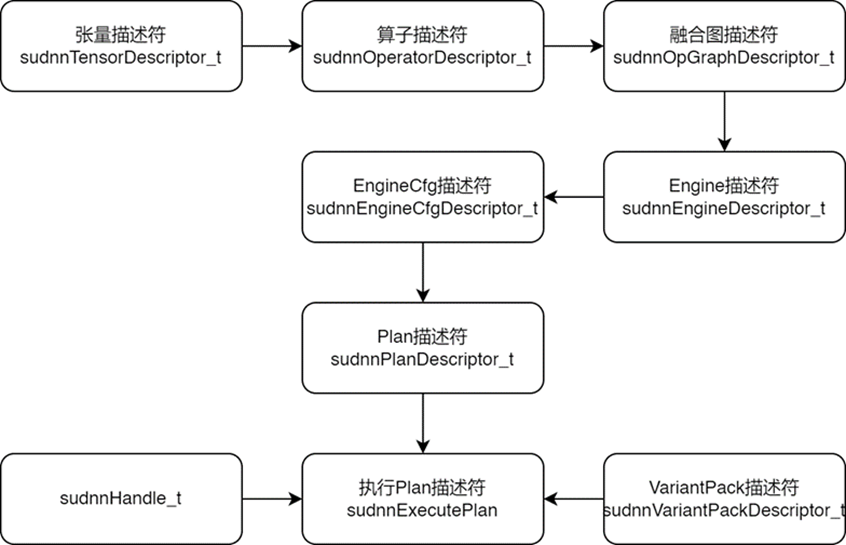

# 壁仞™ suDNN™ 用户指南

## 概述

壁仞™ suDNN™ 库是壁仞深度学习算子库，提供了深度学习领域核心应用的算子能力，以及通用的张量表示。 suDNN 库为满足训练和推理不同需求， suDNN 分别提供了 Eager 和 Graph 两套 API 接口。利用 suDNN 库提供的接口， suDNN 库可得到在壁仞™通用 GPU 架构上经过深度优化的极致计算性能。

suDNN 库本参考文档分成以下部分：

- 最低系统需求：介绍了安装和运行 suDNN 库的系统配置需求，列出了运行时环境的依赖；

- 开发者指南：介绍了基本的编程模型和用于描述融合计算图算子、张量的配置方法；

- API 指南：介绍了面向用户的编程接口；

- 算子定义：介绍了 suDNN 库提供的算子列表和算子的语义。

<div style="page-break-after:always"></div>

## 安装 suDNN

### 安装部署

suDNN 模块集成在 BIRENSUPA™ SDK 中，因此 suDNN 的环境依赖及安装部署请参考：《 BIRENSUPA SDK 安装指南》。

安装路径：/usr/local/birensupa/sdk/latest/sulib

此外， suDNN 运行时对公共依赖库的需求有：

- GNU C Library (libc.so)

- GNU Standard C++ Library (libstdc++.so)

- GCC Low-Level Runtime Library (libgcc_s.so)

- Boost C++ Regex Libraries (libboost_regex.so)

### 安装 suDNN 第三方包依赖

suDNN library 运行时还需要依赖如下第三方包，请参考如下的命令进行安装。

1. 安装 libboost ，对版本没有特殊的要求

- Ubuntu OS ：

```cmd
sudo apt-get install –y libboost-regex-dev
```

- Cent OS：

```cmd
sudo yum install boost-devel.x86_64 –y
```

- Kylin OS:

```cmd
sudo yum install boost-devel.x86_64 -y
```

### 编译并运行样例代码

编译样例代码要求 CMake 版本 >= 3.17。

1. 进入样例代码所在目录

```bash
cd /usr/local/birensupa/sdk/latest/sulib/src/sudnn_examples/
```

2. 编译样例代码

```bash
sudo su

source /usr/local/birensupa/sdk/latest/scripts/brsw_set_env.sh

export BRCC_PATH = /usr/local/birensupa/sdk/latest/brcc

mkdir build

cd build/

cmake ..

make -j8
```

3. 运行样例

sudnn_example 目录下共包含 5 个典型的 suDNN API 用例代码文件，供用户编程参考。编译完成后，按照如下命令可以分别执行。

1) ./pattern-mma-bias-cpp

2) ./pattern-conv-biasadd-relu-cpp

3) ./sudnn-backend-example-cpp

4) ./pattern-gelu-cpp

<div style="page-break-after:always"></div>

## 开发指南

### 内存布局基本概念

壁仞通用 GPU 为原始数据定义了一些特殊的张量布局(Layout)，有助于以最高效的方式快速执行操作，特别是与特定并行计算相关的数据加载和存储模式。

本指南旨在帮助用户直观了解 suDNN 库中定义的内存布局和格式，以及原始数据如何相互转换。

#### 专用术语及符号惯例

- 激活值（Activation）的表示法：批 N，通道 C，高度 H，宽度 W。

- 卷积权重（Convweight）的表示法：输出通道 O，输入通道 I，高度 H，宽度 W。

- 矩阵或批矩阵（Matrix2D/Matrix3D）以行优先或列优先顺序存储。 矩阵的表示法是：批 N，高度 H，宽度 W。

- 向量（Vectors）的表示法：批 N，长度 L。神经网络中一些特殊的张量可能会使用向量作为布局，比如偏置量、一些归一化操作的统计量。

#### 可用的布局和格式类型

为了有效地访问数据，张量应该在线性存储中使用特定的布局，以实现其计算利用率，从而实现更高的性能。 壁仞通用 GPU 中定义了一些张量布局，因此，suDNN 库还定义了相应的布局，帮助用户设置和识别张量使用的布局。 这些定义及其支持的维度是：

| **布局类型**     | **枚举值定义**                                             |
| ---------------- | ---------------------------------------------------------- |
| 未定义的布局     | SUDNN_TENSOR_LAYOUT_UNDEFINED                              |
| 矩阵/批矩阵      | SUDNN_TENSOR_LAYOUT_COLMAJOR  SUDNN_TENSOR_LAYOUT_ROWMAJOR |
| 激活值           | SUDNN_TENSOR_LAYOUT_ACTIVATION                             |
| 卷积权重         | SUDNN_TENSOR_LAYOUT_WEIGHT                                 |
| 向量             | SUDNN_TENSOR_LAYOUT_LINEAR                                 |
| 图像             | SUDNN_TENSOR_LAYOUT_IMAGE                                  |
| 逐深度卷积权重   | SUDNN_TENSOR_LAYOUT_DEPTHWISE_WEIGHT                       |
| 朴素数据布局     | SUDNN_TENSOR_LAYOUT_BUFFER                                 |
| 分组组卷积权重   | SUDNN_TENSOR_LAYOUT_GROUPED_WEIGHT                         |
| 通道优先激活布局 | SUDNN_TENSOR_LAYOUT_CHANNEL_FIRST                          |

除了用于描述朴素数据布局的类型之外，所有这些布局类型都作为壁仞通用 GPU 上定义的特殊布局的表示。 朴素布局广泛用于深度学习框架，如 Pytorch、Tensorflow。 除了朴素布局之外，还有一些额外的可配置字段扩展了布局表示空间，例如在 Tensorflow 中，我们可以使用 Layout 协议消息结构中的 padded_dimensions 来解决任意轴上的数据块对齐问题。 该技术在一些向量化编程中非常有用。

每个布局都有一些关联格式，用于描述数据的每个维度在内存中的组织方式。 例如，我们在 suDNN 库中定义了 SUDNN_TENSOR_FORMAT_NCHW 及其置换版本 SUDNN_TENSOR_FORMAT_NHWC。 以上两个分别代表轴“W”和“C”上的不同主要顺序。 格式及其关联布局定义为：

| **格式类型**                         | **关联的布局类型**                                           |
| ------------------------------------ | ------------------------------------------------------------ |
| SUDNN_TENSOR_FORMAT_OIW              | SUDNN_TENSOR_LAYOUT_WEIGHT  SUDNN_TENSOR_LAYOUT_DEPTHWISE_WEIGHT |
| SUDNN_TENSOR_FORMAT_OIHW             |                                                              |
| SUDNN_TENSOR_FORMAT_OIHWx4           |                                                              |
| SUDNN_TENSOR_FORMAT_NHWC             | SUDNN_TENSOR_LAYOUT_ACTIVATION                               |
| SUDNN_TENSOR_FORMAT_NHWC4            |                                                              |
| SUDNN_TENSOR_FORMAT_NHWCx4           |                                                              |
| SUDNN_TENSOR_FORMAT_NCHW             |                                                              |
| SUDNN_TENSOR_FORMAT_NC4HW4           |                                                              |
| SUDNN_TENSOR_FORMAT_NCHW_B2Hx2       |                                                              |
| SUDNN_TENSOR_FORMAT_NCHW_B2Hx4       |                                                              |
| SUDNN_TENSOR_FORMAT_NCHW_B2Hx8       |                                                              |
| SUDNN_TENSOR_FORMAT_NCHWx4           |                                                              |
| SUDNN_TENSOR_FORMAT_NCW              |                                                              |
| SUDNN_TENSOR_FORMAT_BIAS             | SUDNN_TENSOR_LAYOUT_LINEAR                                   |
| SUDNN_TENSOR_FORMAT_STATS            |                                                              |
| SUDNN_TENSOR_FORMAT_STATS_INTERLEAVE |                                                              |
| SUDNN_TENSOR_FORMAT_STATS_SUPERPOSE  |                                                              |
| SUDNN_TENSOR_FORMAT_COLMAJOR         | SUDNN_TENSOR_LAYOUT_COLMAJOR                                 |
| SUDNN_TENSOR_FORMAT_ROWMAJOR         | SUDNN_TENSOR_LAYOUT_ROWMAJOR                                 |
| SUDNN_TENSOR_FORMAT_RGBA             | SUDNN_TENSOR_LAYOUT_IMAGE                                    |
| SUDNN_TENSOR_FORMAT_NV12             |                                                              |
| SUDNN_TENSOR_FORMAT_YUV420           |                                                              |
| SUDNN_TENSOR_FORMAT_YUV444           |                                                              |

用户应根据算子和张量语义将格式类型设置为张量。 例如，前向卷积运算符使用 SUDNN_TENSOR_FORMAT_NCHW 和 SUDNN_TENSOR_FORMAT_OIHW 作为其两个输入，使用 SUDNN_TENSOR_FORMAT_NCHW 作为输出。

#### 可用布局类型的已知限制

| **布局类型** | **限制说明**                                                 |
| ------------ | ------------------------------------------------------------ |
| 矩阵/批矩阵  | 支持 2-5 维张量：以 4 维为例 (N1, N0, H, W) <br> N0<=1024, H<=8192,  W<=8192  <br>  N1 < 256 |
| 激活值       | 支持 4-5 维张量：以 4 维场景为例（N, C, H, W）<br>  C, H, W <= 8192<br> N <= 1024 |
| 卷积权重     | 支持 4 维张量：(O, I, H, W)<br>O, I <= 8192<br> H * W <= 8192  |
| 向量         | 支持 1-3 维张量：以 3 维场景为例 (N1, N0, L)<br> L <= 8192<br>N1 * N0 <= 1024 |

注：部分算子，如 Matmul 支持 H, W 维度大于 8192 的张量输入，请参考具体算子的限制说明。

### suDNN Eager API 编程模型

suDNN Eager API 的计算模式是易用的单算子调用模式。API 本身为 host C API，但计算和数据在 device 侧。

使用 suDNN 的应用程序必须通过调用 `sudnnCreate()` 来初始化库上下文的句柄。 这个句柄被显式地传递给每个对 device 数据进行操作的后续库函数。 一旦应用程序完成使用 suDNN，应当使用 sudnnDestroy() 释放与库句柄关联的资源。这种方法允许用户在使用多个主机线程、SUPA stream 时显式控制库的功能。

与特定 suDNN 上下文关联的设备在相应的 sudnnCreate() 和 sudnnDestroy() 调用之间应保持不变。 为了使 suDNN 库在同一主机线程中使用不同的设备，应用程序必须通过调用 suSetDevice() 设置要使用的新设备，然后通过调用 sudnnCreate() 创建另一个与新设备关联的 suDNN 上下文。

### suDNN Graph API 编程模型

suDNN 库应用程序接口为用户提供了一种声明深度学习计算图的编程方法。

用户利用张量描述符对张量的元数据进行配置，如数据类型、尺寸大小、内存排布类型和存储属性等。算子描述符可用来描述神经网络层的具体运算，可对种类、参数以及输入和输出张量等信息进行设置。算子描述符可用来构建计算图描述符，同一个张量描述符可用于构建和连接不同的算子描述符，分别作为输出或输入，融合图描述符便可利用连接信息构建一个计算图。图优化引擎根据计算图中信息，进行分析、优化和插入必要的信息，调用代码生成器产生硬件上可执行的代码。一个计算图描述符必须在 Engine 描述符中经过图优化引擎处理，才能够产生可执行的对象。Engine 描述符包含了可执行代码和优化后的计算图信息，用户可以得到优化后计算图的输入输出张量描述符。利用张量描述符上的标识符，应用软件可以追踪优化后张量配置的变化，用于分析代码执行期关于内存排布、拓扑顺序等需求。Engine 描述符被执行之前，用户配置 EngineCfg 描述符，对执行期的行为进行配置。为使代码执行，用户需创建 Plan 和 VariantPack 描述符，以获得并配置张量数据空间和临时工作空间。

应用在执行 Plan 描述符时，需创建 sudnnHandle 对象，并传入 sudnnExecutePlan 接口。sudnnHandle 由 sudnnCreate()创建，以利用流对象进行同步或异步执行，其返回的句柄必须传递给所有后续的库函数调用。上下文的销毁通过最后使用 sudnnDestroy()进行销毁。

<div style="page-break-after:always"></div>



图 3‑1 suDNN 接口基本概念层级结构

上图总结了 suDNN 库提供的基本概念以及它们的层级结构。图中的箭头表示目标对象可由源对象构建。

<div style="page-break-after:always"></div>

## Graph API 参考

### 基本描述符

#### 张量描述符（sudnnTensorDescriptor_t ）

张量描述符包含了用于分配内存必须的信息。这些信息包括：内存访问架构类型、数据维度、数据类型、内存排布相关的配置。在构建神经网络计算图时，描述中间结果的张量描述符可以用来连接至少两个算子描述符，任何一个算子描述符都包含输入或输出张量描述符。

张量描述符也可以作为接口提供张量特性给用户。这些特性包括：张量数据所需要的内存大小，算子计算要求的内存排布等。用户可以利用这些信息准备计算图的输入输出数据。

#### 算子描述符（sudnnOperatorDescriptor_t）

神经网络可以看作是一系列算子所表示具体算法按照顺序连接起来进行的数学运算，这些具体算法需要 算子描述符来配置。算子描述符中，可对 operator 的类型、输入输出张量描述符以及具体算子参数进行配置。不同类型的算子的参数要求是不一致的，具体内容可以参考[Graph 算子定义](#graph算子定义)。

#### 计算图描述符（sudnnOpGraphDescriptor_t）

计算图描述符描述具体的计算图。通过添加算子描述符，suDNN 库内部可通过张量所连接算子的关系建立一个计算图，对应最终可以运行的产物为一个或多个 Mega kernel。

#### Engine 描述符（sudnnEngineDescriptor_t）

一个 Engine 描述符包含了一个或多个 MegaKernel。Engine 不能单独执行，它只有和 Knob 描述符组合为 EngineCfg 后才可以被执行。Engine 产生自 OpGraph，对于具有相同参数的 Op 组成的具有相同 Topo 结构的 OpGraph 产生的 Engine 是一样的，也就是说，对于同样 OpGraph，我们只需要一个 Engine。

#### Knob 描述符 （sudnnKnobDescriptor_t）

Knob 描述符描述了执行 Engine 时的配置信息。目前用户可以通过 Knob 描述符配置 SPC 的数量，数学模式等信息。当前版本只支持直接指定这些配置的数值。

#### EngineCfg 描述符（sudnnEngineCfgDescriptor_t）

包含了一个 Engine 和执行这个 Engine 所需要的一组 Knob 描述符。执行一个 EngineCfg 对应一个或多次 dispatch，同一个 Engine 可以被多个 EngineCfg 引用。

#### VariantPack 描述符（sudnnVariantPackDescriptor_t）

用来设置 Tensor Descriptor 对应计算时所使用的数据空间。在 Plan 执行时，需要向 Execute 接口提供 VariantPack 对象。

#### Plan 描述符（sudnnPlanDescriptor_t）

用来执行一个或多个计算图。

### 数据类型

#### 隐藏结构体指针类型

##### sudnnHandle_t

sudnnHandle_t 是一个指向隐藏结构体的指针, 对应结构体包含了 suDNN 库的上下文信息。suDNN 库须使用 sudnnCreate() 来创建, 并且后续运行时执行接口的调用必须传入该上下文指针。上下文对象需要在程序退出前利用 sudnnDestroy() 进行销毁。上下文是和一定数量的 SPC 相关联的，这些 SPC 会在 sudnnCreate() 调用时，分配给相应的上下文对象。值得说明的是, 相同的 SPC 可以分配给多个上下文对象。

##### sudnnTensorDescriptor_t

sudnnTensorDescriptor_t 是一个指向隐藏结构体的指针, 对应结构体描述了 N 维类型的数据块。结构体也包含了数据类型 (float, bfloat16, int8, ...)，数据布局 (ColMajor, RowMajor, Weight, ...), 内存类型 (numa, uma, uma4, ...)。

##### sudnnOperatorDescriptor_t

sudnnOperatorDescriptor_t 是一个指向隐藏结构体的指针，对应结构体描述了一个具体算子。通过该对象，用户可以设置算子的类型和属性信息。

##### sudnnOpGraphDescriptor_t

sudnnOpGraphDescriptor_t 是一个指向隐藏结构体的指针，描述了一张包含由张量连接的一个或多个算子组成的小型网络，即计算图。计算图定义了用户的计算用例或者数学表达。

##### sudnnEngineDescriptor_t

sudnnEngineDescriptor_t 是一个指向隐藏结构体的指针，包含了一个或多个 Mega kernel。一个 mega kernel 由至少一个算子的运算组成，这些算子运算可以融合到一起。

##### sudnnKnobDescriptor_t

sudnnKnobDescriptor_t 是一个指向隐藏结构体的指针，描述了针对 Engine 的一种执行时配置信息。

##### sudnnEngineCfgDescriptor_t

sudnnEngineCfgDescriptor_t 是一个指向隐藏结构体的指针， 包含了一个 Engine 和执行这个 Engine 所需要的一组 Knob。EngineCfg 的一次执行对应一次或多次 kernel 分派。 多个 EngineCfg 可以引用相同的一个 Engine 对象。

##### sudnnVariantPackDescriptor_t

sudnnVariantPackDescriptor_t 是一个指向隐藏结构体的指针，它允许用户为计算中所使用的张量和工作空间设置设备上的数据内存，这些内存通过张量和工作空间的位置标识来识别。

##### sudnnPlanDescriptor_t

sudnnPlanDescriptor_t 是一个指向隐藏结构体的指针，它允许用户设置一个计划，去执行一个或多个 EngineCfg。

#### 枚举值类型

##### sudnnStatus_t

sudnnStatus_t 是用来表示接口函数执行返回状态的枚举变量类型，所有的 suDNN 库函数都会返回一个状态值。suDNN 库值如下：

| 值                                        | 说明                                                           |
|-------------------------------------------|----------------------------------------------------------------|
| SUDNN_STATUS_SUCCESS                      | 函数操作执行成功。                                             |
| SUDNN_STATUS_NOT_INITIALIZED              | 对象未初始化成功。初始化成功的对象，才能用于设置特定的属性值。 |
| SUDNN_STATUS_NOT_FINALIZED                | 对象未定型成功，用户需要确保所设置的各种属性符合语义规范。     |
| SUDNN_STATUS_ALREADY_FINALIZED            | 对象已经定型，不可对其进行更改。                               |
| SUDNN_STATUS_ALLOC_FAILED                 | suDNN 库内部资源申请失败。                                      |
| SUDNN_STATUS_BAD_PARAM                    | 错误的值或参数被传入了接口函数。                               |
| SUDNN_STATUS_INTERNAL_ERROR               | suDNN 库内部执行错误。                                          |
| SUDNN_STATUS_INVALID_VALUE                | 无效值被传入了接口函数。                                       |
| SUDNN_STATUS_ARCH_MISMATCH                | GPU 设备上缺乏 suDNN 库某个需要的功能。                           |
| SUDNN_STATUS_MAPPING_ERROR                | 访存操作失败。                                                 |
| SUDNN_STATUS_EXECUTION_FAILED             | GPU 程序执行失败。                                              |
| SUDNN_STATUS_NOT_SUPPORTED                | 功能目前未支持。                                               |
| SUDNN_STATUS_LICENSE_ERROR                | 请求的功能需要特殊的许可证，当前许可证检查失败。               |
| SUDNN_STATUS_RUNTIME_PREREQUISITE_MISSING | suDNN 需要的运行时环境配置不正确。                             |
| SUDNN_STATUS_RUNTIME_IN_PROGRESS          | 用户流中的任务仍然在执行。                                     |
| SUDNN_STATUS_RUNTIME_FP_OVERFLOW          | GPU 算子执行中出现了数值溢出。                                  |
| SUDNN_STATUS_VERSION_MISMATCH             | suDNN 版本不匹配                                               |
| SUDNN_STATUS_BAD_DIM                      | operator 的输入输出的张量描述符数量与需求不匹配                 |

##### sudnnTensorAttrName_t

sudnnTensorAttrName_t 是用来指出张量描述符所支持属性的一种枚举变量类型，用户以此枚举值，通过调用 sudnnSetTensorDescriptorAttr 和 sudnnGetTensorDescriptorAttr 来设置或获取对应的属性值。

| 值                                      | 说明                                                                                                                                                                   |
|-----------------------------------------|------------------------------------------------------------------------------------------------------------------------------------------------------------------------|
| SUDNN_TENSOR_ATTR_UID                   | 标识张量的整型数值。用户使用时，需注意该唯一标识符用于标识算子符号的语义，而非算子对象本身。因此，具有相同标识符的张量，存在数据内存布局格式的差异，可用于做数据重排。 |
| SUDNN_TENSOR_ATTR_DATATYPE              | 数据类型。                                                                                                                                                             |
| SUDNN_TENSOR_ATTR_LAYOUT                | 张量布局类型。                                                                                                                                                         |
| SUDNN_TENSOR_ATTR_FORMAT                | 张量尺寸格式。                                                                                                                                                         |
| SUDNN_TENSOR_ATTR_NUMAREGION            | 张量数据所占有的 Non-UMA 内存块的数量。                                                                                                                                 |
| SUDNN_TENSOR_ATTR_PITCHSIZE             | 张量数据所占有的 Non-UMA 内存块之间的间距尺寸。                                                                                                                          |
| SUDNN_TENSOR_ATTR_NDIM                  | 张量尺寸的维数。                                                                                                                                                       |
| SUDNN_TENSOR_ATTR_SHAPE                 | 张量尺寸。                                                                                                                                                             |
| SUDNN_TENSOR_ATTR_DIMX                  | 张量最内层维度的尺寸大小。                                                                                                                                             |
| SUDNN_TENSOR_ATTR_DIMY                  | 张量从最内层起，第二层维度的尺寸大小。                                                                                                                                 |
| SUDNN_TENSOR_ATTR_DIMZ                  | 张量从最内层起，第三层维度的尺寸大小。                                                                                                                                 |
| SUDNN_TENSOR_ATTR_DIMN                  | 张量最外层维度的尺寸大小。                                                                                                                                             |
| SUDNN_TENSOR_ATTR_VIRTUALITY            | 指示是否为虚拟张量。                                                                                                                                                   |
| SUDNN_TENSOR_ATTR_CACHEABLE             | 指示张量是否可以暂驻于缓存。                                                                                                                                           |
| SUDNN_TENSOR_ATTR_REQUIRED_SIZE_IN_BYTE | 指示张量需要的内存字节大小。                                                                                                                                           |
| SUDNN_TENSOR_ATTR_IS_BY_VALUE           | 指示张量是否是标量 Tensor。                                                                                                                                             |
| SUDNN_TENSOR_ATTR_IS_VOLATILE           | 如果张量是标量，指示标量是否对不同的计算核函数有不同的常数值。                                                                                                         |
| SUDNN_TENSOR_ATTR_NONVOLATILE_VAL       | 如果张量是标量且对不同的计算核函数有相同的常数值，指示该常数值的大小                                                                                                   |
| SUDNN_TENSOR_ATTR_MEMARCH               | 张量的内存分布模式（UMA 或者 Non-UMA）。                                                                                                                                |
| SUDNN_TENSOR_ATTR_KIND                  | 用户给予的提示，指示张量是参数张量或是 activation 张量。                                                                                                                 |
| SUDNN_TENSOR_ATTR_EAGER_FORMAT          | Eager Mode 下张量的尺寸信息                                                                                                                                             |
| SUDNN_TENSOR_ATTR_STRIDE                | 张量的步幅                                                                                                                                                             |
| SUDNN_TENSOR_ATTR_MEMORY_INFO           | 张量的生命周期                                                                                                                                                             |

##### sudnnTensorLayout_t

sudnnTensorLayout_t 是用来描述张量布局的枚举变量类型，类型值与张量在算子中的语义相关。

| 值                                   | 说明                      |
|--------------------------------------|---------------------------|
| SUDNN_TENSOR_LAYOUT_UNDEFINED        | 未明确定义布局。          |
| SUDNN_TENSOR_LAYOUT_LINEAR           | 线性块布局。              |
| SUDNN_TENSOR_LAYOUT_ACTIVATION       | 激活布局。                |
| SUDNN_TENSOR_LAYOUT_COLMAJOR         | 列主序布局。              |
| SUDNN_TENSOR_LAYOUT_ROWMAJOR         | 行主序布局。              |
| SUDNN_TENSOR_LAYOUT_WEIGHT           | 权重布局。                |
| SUDNN_TENSOR_LAYOUT_BUFFER           | 朴素内存布局。            |
| SUDNN_TENSOR_LAYOUT_IMAGE            | 图像布局。                |
| SUDNN_TENSOR_LAYOUT_DEPTHWISE_WEIGHT | 逐通道卷积权重布局。      |
| SUDNN_TENSOR_LAYOUT_GROUPED_WEIGHT   | 分组卷积权重布局。        |
| SUDNN_TENSOR_LAYOUT_CHANNEL_FIRST    | Channel-first 卷积激活布局 |

##### sudnnTensorFormat_t

sudnnTensorFormat_t 是用来描述张量尺寸格式的枚举变量类型。

| 值                                   | 说明                                                        |
|--------------------------------------|-------------------------------------------------------------|
| SUDNN_TENSOR_FORMAT_UNDEFINED        | 未明确定义尺寸格式。                                        |
| SUDNN_TENSOR_FORMAT_OIW              | 1D 权重格式。                                                |
| SUDNN_TENSOR_FORMAT_OIHW             | 2D 权重格式。                                                |
| SUDNN_TENSOR_FORMAT_OIHWx4           | 用于 Stride2 的权重格式。                                     |
| SUDNN_TENSOR_FORMAT_NHWC             | Channel-last 2D 活化格式。                                   |
| SUDNN_TENSOR_FORMAT_NHWC4            | Channel-last 向量化格式。                                    |
| SUDNN_TENSOR_FORMAT_NHWCx4           | 用于 Stride2 的活化格式。                                     |
| SUDNN_TENSOR_FORMAT_NCHW             | 2D 活化格式。                                                |
| SUDNN_TENSOR_FORMAT_NC4HW4           | 向量化格式。                                                |
| SUDNN_TENSOR_FORMAT_NCHW_B2Hx2       | 空间维度折叠格式。                                          |
| SUDNN_TENSOR_FORMAT_NCHW_B2Hx4       | 空间维度折叠格式。                                          |
| SUDNN_TENSOR_FORMAT_NCHW_B2Hx8       | 空间维度折叠格式。                                          |
| SUDNN_TENSOR_FORMAT_NCHWx4           | 用于 Stride2 的活化格式。                                     |
| SUDNN_TENSOR_FORMAT_NCW              | 1D 活化格式。                                                |
| SUDNN_TENSOR_FORMAT_BIAS             | 偏置或线性数据格式（主要用于 BiasAdd 和支持向量运算的算子）。 |
| SUDNN_TENSOR_FORMAT_STATS            | 统计量数据格式（主要用于 normalization 算子）。               |
| SUDNN_TENSOR_FORMAT_STATS_INTERLEAVE | 交错排布的统计量数据格式。                                  |
| SUDNN_TENSOR_FORMAT_SUPERPOSE        | 重叠排布的统计量数据格式。                                  |
| SUDNN_TENSOR_FORMAT_COLMAJOR         | 列主序格式。                                                |
| SUDNN_TENSOR_FORMAT_ROWMAJOR         | 行主序格式。                                                |
| SUDNN_TENSOR_FORMAT_RGBA             | Red-Green-Blue-Alpha 色彩格式。                              |
| SUDNN_TENSOR_FORMAT_NV12             | NV12 色彩数据格式。                                          |
| SUDNN_TENSOR_FORMAT_YUV420           | YUV420 色彩数据格式。                                        |
| SUDNN_TENSOR_FORMAT_YUV444           | YUV444 色彩数据格式。                                        |
| SUDNN_TENSOR_NCHW           | UMA 线性格式。（仅用于 Eager API 和 Backend API）                                      |
| SUDNN_TENSOR_NCHW_BLOCK           | UMA SUPA 卷积活化格式。（仅用于 Eager API 和 Backend API）                                        |
| SUDNN_TENSOR_NHW_BLOCK           | UMA 行主序格式。（仅用于 Eager API 和 Backend API）                                       |
| SUDNN_TENSOR_NWH_BLOCK           | UMA 列主序格式。（仅用于 Eager API 和 Backend API）                                       |
| SUDNN_TENSOR_OIHW           | UMA 2D 权重格式。（仅用于 Backend API）                                    |

##### sudnnTensorDataType_t

sudnnTensorDataType_t 是用来描述张量数据类型的枚举类型。

| 值                              | 说明                   |
|---------------------------------|------------------------|
| SUDNN_TENSOR_DATATYPE_UNDEFINED | 未明确定义数据类型。   |
| SUDNN_TENSOR_DATATYPE_INT16     | 16-bit 整数类型。       |
| SUDNN_TENSOR_DATATYPE_FP32      | 单精度浮点类型。       |
| SUDNN_TENSOR_DATATYPE_BF16      | bfloat16 类型。         |
| SUDNN_TENSOR_DATATYPE_F8_3      | F8_3 数据类型。         |
| SUDNN_TENSOR_DATATYPE_F8_2      | F8_2 数据类型。         |
| SUDNN_TENSOR_DATATYPE_INT8      | 带符号 8-bit 整数类型。  |
| SUDNN_TENSOR_DATATYPE_UINT8     | 无符号 8-bit 整数类型。  |
| SUDNN_TENSOR_DATATYPE_INT4      | 带符号 4-bit 整数类型。  |
| SUDNN_TENSOR_DATATYPE_INT32     | 带符号 32-bit 整数类型。 |
| SUDNN_TENSOR_DATATYPE_INT64     | 带符号 64-bit 整数类型。 |
| SUDNN_TENSOR_DATATYPE_FP64      | 双精度浮点数类型。     |
| SUDNN_TENSOR_DATATYPE_FP16      | 半精度浮点类型。       |
| SUDNN_TENSOR_DATATYPE_BOOLEAN   | 布尔类型。             |

##### sudnnTensorVirtuality_t

sudnnTensorVirtuality_t 是用来描述虚拟属性的枚举类型。

| 值                            | 说明            |
|-------------------------------|-----------------|
| SUDNN_TENSOR_VIRTUALITY_TRUE  | 虚拟张量。      |
| SUDNN_TENSOR_VIRTUALITY_ANY   | 由 suDNN 库决定。 |
| SUDNN_TENSOR_VIRTUALITY_FALSE | 非虚拟张量。    |

##### sudnnTensorCacheable_t

sudnnTensorCacheable_t 是用来描述张量数据缓存行为的枚举类型。

| 值                           | 说明                     |
|------------------------------|--------------------------|
| SUDNN_TENSOR_CACHEABLE_FALSE | 张量数据无暂驻缓存行为。 |
| SUDNN_TENSOR_CACHEABLE_TRUE  | 张量数据。               |

##### sudnnTensorMemArch_t

sudnnTensorMemArch_t 是用来描述张量 device 端内存布局的枚举类型。

| 值                             | 说明                                                             |
|--------------------------------|------------------------------------------------------------------|
| SUDNN_TENSOR_MEMARCH_UNDEFINED | 未定义的内存布局。                                               |
| SUDNN_TENSOR_MEMARCH_UMA       | UMA（统一内存访问布局）。                                        |
| SUDNN_TENSOR_MEMARCH_NUMA      | NUMA（非统一内存访问布局），每一连续虚拟地址分配到一个内存分区。 |
| SUDNN_TENSOR_MEMARCH_UMA4      | UMA4，每一段连续地址分配到 4 个内存分区。                          |
| SUDNN_TENSOR_MEMARCH_UMA8      | UMA8， 每一段连续地址分配到 8 个内存分区。                         |
| SUDNN_TENSOR_MEMARCH_UMA16     | UMA16，每一段连续地址分配到 16 个内存分区。                        |
| SUDNN_TENSOR_MEMARCH_UMA32     | UMA32，每一段连续地址分配到 32 个内存分区。                        |
| SUDNN_TENSOR_MEMARCH_UMA_4K    | UMA_4K, 每一段连续地址分配到了 4KB 的内存空间。                    |

##### sudnnTensorKind_t

sudnnTensorKind_t 是用来描述张量类别的枚举类型。

| 值                           | 说明                   |
|------------------------------|------------------------|
| SUDNN_TENSOR_KIND_UNDEFINED  | 未明确定义的张量类型。 |
| SUDNN_TENSOR_KIND_PARAMETER  | 权重或参数张量。       |
| SUDNN_TENSOR_KIND_ACTIVATION | 活化张量。             |

##### sudnnBooleanType_t

sudnnBooleanType_t 是用来描述布尔值的枚举类型。

| 值                       | 说明        |
|--------------------------|-------------|
| SUDNN_BOOLEAN_TYPE_FALSE | 布尔值-假。 |
| SUDNN_BOOLEAN_TYPE_TRUE  | 布尔值-真。 |

##### sudnnOpGraphAttrName_t

sudnnOpGraphAttrName_t 是用来描述一个融合图属性的枚举类型。

| 值                              | 说明                       |
|---------------------------------|----------------------------|
| SUDNN_OPGRAPH_ATTR_UID          | 标识融合图的整数值。       |
| SUDNN_OPGRAPH_ATTR_OPNUM        | 组成一个融合图的算子数量。 |
| SUDNN_OPGRAPH_ATTR_OPS          | 算子数组。                 |
| SUDNN_OPGRAPH_ATTR_COMPUTE_MODE | 计算模式。                 |

##### sudnnOpGraphComputeMode_t

sudnnOpGraphComputeMode_t 是描述融合图计算模式的枚举类型。

| 值                            | 说明       |
|-------------------------------|------------|
| SUDNN_OPGRAPH_COMPUTE_MODE_MP | 模型并行。 |
| SUDNN_OPGRAPH_COMPUTE_MODE_DP | 数据并行。 |

##### sudnnEngineAttrName_t

sudnnEngineAttrName_t 是描述 Engine 支持属性的枚举类型。

| 值                                 | 说明                         |
|------------------------------------|------------------------------|
| SUDNN_ENGINE_ATTR_UID              | Engine 标识符。               |
| SUDNN_ENGINE_ATTR_OPGRAPHNUM       | Engine 中所包含的融合图数量。 |
| SUDNN_ENGINE_ATTR_OPGRAPHS         | 融合图列表数组。             |
| SUDNN_ENGINE_ATTR_TOTAL_BATCH_SIZE | Engine 的总批量。             |

##### sudnnKnobAttrName_t

sudnnKnobAttrName_t 是描述 Knob 支持属性的枚举类型。下述属性均为只读。

| 值                           | 说明                             |
| ---------------------------- | -------------------------------- |
| SUDNN_KNOB_ATTR_TYPE         | Knob 类型。                       |
| SUDNN_KNOB_ATTR_VALUE_CHOICE | Knob 对应的配置值。               |
| SUDNN_KNOB_ATTR_HAS_CHOICE   | 标示 Knob 是否有准确的配置值。     |
| SUDNN_KNOB_ATTR_MIN          | Knob 对应的配置的选择区间最小值。 |
| SUDNN_KNOB_ATTR_MAX          | Knob 对应的配置的选择区间最大值。 |
| SUDNN_KNOB_ATTR_STRIDE       | Knob 对应的配置值的选择步长。     |

##### sudnnKnobType_t

sudnnKnobType_t 是描述 Knob 类型的枚举类型。

| 值                        | 说明               |
|---------------------------|--------------------|
| SUDNN_KNOB_TYPE_UNDEFINED | 未定义的 knob 类型。 |
| SUDNN_KNOB_TYPE_SPC_COUNT | 用于描述 SPC 数量。  |
| SUDNN_KNOB_TYPE_MATH_TYPE | 用于描述数学属性。 |
| SUDNN_KNOB_TYPE_SUPA_GPU_ARCH | 用于描述 GPU 架构。 |

##### sudnnMathType_t

sudnnMathType_t 是描述数学类型的枚举类型。

| 值                      | 说明                         |
|-------------------------|------------------------------|
| SUDNN_MATH_TYPE_DEFAULT | 默认。                       |
| SUDNN_MATH_TYPE_TF32P   | TCore 允许使用 TF32P 进行计算。 |
| SUDNN_MATH_TYPE_SIZE    | 预留值。                     |

##### sudnnEngineCfgAttrName_t

sudnnEngineCfgAttrName_t 是描述 Engine 配置对象支持属性的枚举类型。

| 值                                         | 说明                                 |
|--------------------------------------------|--------------------------------------|
| SUDNN_ENGINECFG_ATTR_UID                   | EngineCfg 标识符。                    |
| SUDNN_ENGINECFG_ATTR_ENGINE                | 用于设置 Engine。                     |
| SUDNN_ENGINECFG_ATTR_KNOBS                 | Engine 行为的调节旋钮。               |
| SUDNN_ENGINECFG_ATTR_KNOBNUM               | 进行设置的调节旋钮数量。             |
| SUDNN_ENGINECFG_ATTR_TENSORS_NUM_AFTERMATH | 图融合之后的张量数组尺寸。           |
| SUDNN_ENGINECFG_ATTR_TENSORS_AFTERMATH     | 图融合之后的张量数组。               |
| SUDNN_ENGINECFG_ATTR_OPSEQ_LEN_AFTERMATH   | 图融合之后的拓扑排序的算子数组尺寸。 |
| SUDNN_ENGINECFG_ATTR_OPSEQ_AFTERMATH       | 图融合之后的拓扑排序的算子数组。     |

##### sudnnPlanAttrName_t

sudnnPlanAttrName_t 是 Plan 对象支持属性的枚举类型。

| 值                                                           | 说明                                     |
| ------------------------------------------------------------ | ---------------------------------------- |
| SUDNN_PLAN_ATTR_UID                                          | Plan 标识符。                             |
| SUDNN_PLAN_ATTR_ENGINECFGNUM                                 | Engine 配置对象的数量。                   |
| SUDNN_PLAN_ATTR_ENGINECFGS                                   | Engine 配置对象数组。                     |
| SUDNN_PLAN_ATTR_WORKSPACE_SIZE<br>SUDNN_PLAN_ATTR_NUMA_WORKSPACE_SIZE | Plan 执行所需 NUMA 类型的中间缓存的大小。   |
| SUDNN_PLAN_ATTR_UMA4_WORKSPACE_SIZE                          | Plan 执行所需 UMA4 类型的中间缓存的大小。   |
| SUDNN_PLAN_ATTR_UMA8_WORKSPACE_SIZE                          | Plan 执行所需 UMA8 类型的中间缓存的大小。   |
| SUDNN_PLAN_ATTR_UMA16_WORKSPACE_SIZE                         | Plan 执行所需 UMA16 类型的中间缓存的大小。  |
| SUDNN_PLAN_ATTR_UMA32_WORKSPACE_SIZE                         | Plan 执行所需 UMA32 类型的中间缓存的大小。  |
| SUDNN_PLAN_ATTR_UMA_WORKSPACE_SIZE                           | Plan 执行所需 UMA 类型的中间缓存的大小。    |
| SUDNN_PLAN_ATTR_UMA_4K_WORKSPACE_SIZE                        | Plan 执行所需 UMA_4K 类型的中间缓存的大小。 |

##### sudnnVariantPackAttrName_t

sudnnVariantPackAttrName_t 是 VariantPack 对象属性的枚举类型。

| 值                                                           | 说明                           |
| ------------------------------------------------------------ | ------------------------------ |
| SUDNN_VARIANT_PACK_ATTR_UID                                  | VariantPack 标识符。            |
| SUDNN_VARIANT_PACK_ATTR_TENSOR_NUM                           | 张量的数量。                   |
| SUDNN_VARIANT_PACK_ATTR_DATA_POINTERS                        | 数据指针数组。                 |
| SUDNN_VARIANT_PACK_ATTR_UNIQUE_UIDS                          | 张量标识符数组。               |
| SUDNN_VARIANT_PACK_ATTR_WORKSPACE<br>SUDNN_VARIANT_PACK_ATTR_NUMA_WORKSPACE | 中间 NUMA 类型的缓存数据指针。   |
| SUDNN_VARIANT_PACK_ATTR_UMA4_WORKSPACE                       | 中间 UMA4 类型的缓存数据指针。   |
| SUDNN_VARIANT_PACK_ATTR_UMA8_WORKSPACE                       | 中间 UMA8 类型的缓存数据指针。   |
| SUDNN_VARIANT_PACK_ATTR_UMA16_WORKSPACE                      | 中间 UMA16 类型的缓存数据指针。  |
| SUDNN_VARIANT_PACK_ATTR_UMA32_WORKSPACE                      | 中间 UMA4 类型的缓存数据指针。   |
| SUDNN_VARIANT_PACK_ATTR_UMA_WORKSPACE                        | 中间 UMA 类型的缓存数据指针。    |
| SUDNN_VARIANT_PACK_ATTR_UMA_4K_WORKSPACE                     | 中间 UMA_4K 类型的缓存数据指针。 |

### API 函数

#### 运行时上下文接口

##### sudnnCreate()

```cpp
sudnnStatus_t sudnnCreate(sudnnHandle_t *handle);
```

**说明**

该接口对 suDNN 库和库运行的上下文环境进行初始化，所有信息将在隐藏指针 handle 所指向的对象中存储。接口会申请主机和设备上的硬件资源，而且必须在调用其他库函数时执行。

##### sudnnSetStream()

```cpp
sudnnStatus_t sudnnSetStream(sudnnHandle_t handle, suStream_t stream);
```

**说明**

该接口将用户创建的 SUPA 流设置进 sudnnHandle 中。

##### sudnnGetStream()

```cpp
sudnnStatus_t sudnnGetStream(sudnnHandle_t handle, suStream_t *stream);
```

**说明**

该接口从 suDNN Handle 对象中索回用户创建的 SUPA 流。当用户流未设置时，该接口返回 NULL 流，即默认流。

##### sudnnSetBatchSize()

```cpp
sudnnStatus_t sudnnSetBatchSize(sudnnHandle_t handle, int64_t totalBatchSize);
```

**说明**

该接口将用户创建的总批量数值设置进 suDNN Handle 中。

##### sudnnDestroy()

```cpp
sudnnStatus_t sudnnDestroy(sudnnHandle_t handle);
```

**说明**

该接口对 suDNN 库和库运行的上下文环境进行销毁。

#### 描述符接口

suDNN 库描述符采用相同的编程模型对隐藏对象进行创建、初始化、属性配置、定型、属性检索和销毁。接口中的{CONCEPT}可以替换为 suDNN 库概念，包括：Tensor、Operator、OpGraph、Engine、Knob、EngineCfg、VariantPack、Plan。

##### sudnnCreate{CONCEPT}Descriptor()

可以具象化成：

sudnnCreateTensorDescriptor() , sudnnCreateOperatorDescriptor() , sudnnCreateOpGraphDescriptor() , sudnnCreateEngineDescriptor() , sudnnCreateKnobDescriptor() , sudnnCreateEngineCfgDescriptor() , sudnnCreateVariantPackDescriptor() , sudnnCreatePlanDescriptor() .

```cpp
sudnnStatus_t sudnnCreateConceptDescriptor(sudnnConceptDescriptor_t *conceptDesc);
```

**说明**
创建描述符对象。

##### sudnnInitialize{CONCEPT}Descriptor()

可以具象化成：

sudnnInitializeTensorDescriptor() , sudnnInitializeOperatorDescriptor() , sudnnInitializeOpGraphDescriptor() , sudnnInitializeEngineDescriptor() , sudnnInitializeKnobDescriptor() , sudnnInitializeEngineCfgDescriptor() , sudnnInitializeVariantPackDescriptor() , sudnnInitializePlanDescriptor() .

```cpp
sudnnStatus_t sudnnInitializeConceptDescriptor(sudnnConceptDescriptor_t conceptDesc);
```

**说明**

初始化。

##### sudnnSet{CONCEPT}DescriptorAttr()

可以具象化成：

sudnnSetTensorDescriptorAttr() , sudnnSetOperatorDescriptorAttr() , sudnnSetOpGraphDescriptorAttr() , sudnnSetEngineDescriptorAttr() , sudnnSetKnobDescriptorAttr() , sudnnSetEngineCfgDescriptorAttr() , sudnnSetVariantPackDescriptorAttr() , sudnnSetPlanDescriptorAttr() 。

```cpp
sudnnStatus_t sudnnSetConceptDescriptorAttr(
 sudnnConceptDescriptor_t conceptDesc,
 const sudnnConceptAttrName_t conceptAttrName, void *conceptAttr);
```

**说明**

属性配置。

##### sudnnFinalize{CONCEPT}Descriptor()

可以具象化成：

sudnnFinalizeTensorDescriptor() , sudnnFinalizeOperatorDescriptor() , sudnnFinalizeOpGraphDescriptor() , sudnnFinalizeEngineDescriptor() , sudnnFinalizeKnobDescriptor() , sudnnFinalizeEngineCfgDescriptor() , sudnnFinalizeVariantPackDescriptor() , sudnnFinalizePlanDescriptor() 。

```cpp
sudnnStatus_t sudnnFinalizeConceptDescriptor(sudnnConceptDescriptor_t conceptDesc);
```

**说明**

定型。会根据配置的属性对描述符进行定型，将描述符内容固定下来。

##### sudnnGet{CONCEPT}DescriptorAttr()

可以具象化成：

sudnnGetTensorDescriptorAttr() , sudnnGetOperatorDescriptorAttr() , sudnnGetOpGraphDescriptorAttr() , sudnnGetEngineDescriptorAttr() , sudnnGetKnobDescriptorAttr() , sudnnGetEngineCfgDescriptorAttr() , sudnnGetVariantPackDescriptorAttr() , sudnnGetPlanDescriptorAttr() .

```cpp
sudnnStatus_t sudnnGetConceptDescriptorAttr(
 sudnnConceptDescriptor_t const conceptDesc,
 sudnnConceptAttrName_t conceptAttrName, void *conceptAttrs);
```

**说明**

属性检索。

##### sudnnDestroy{CONCEPT}Descriptor()

可以具象化成：

sudnnDestroyTensorDescriptor() , sudnnDestroyOperatorDescriptor() , sudnnDestroyOpGraphDescriptor() , sudnnDestroyEngineDescriptor() , sudnnDestroyKnobDescriptor() , sudnnDestroyEngineCfgDescriptor() , sudnnDestroyVariantPackDescriptor() , sudnnDestroyPlanDescriptor() .

```cpp
sudnnStatus_t sudnnDestroyConceptDescriptor(sudnnConceptDescriptor_t conceptDesc);
```

**说明**

销毁。

#### 特殊张量接口

##### sudnnSetTensor4dDescriptor()

```cpp
sudnnStatus_t sudnnSetTensor4dDescriptor(

 sudnnTensorDescriptor_t tensorDesc, sudnnTensorFormat_t format, sudnnTensorDataType_t dataType, int n, int c, int h, int w);
```

**说明**

为四维张量描述符配置尺寸格式，数据类型，维度信息。

##### sudnnSetTensor4dDescriptorEx()

```cpp
sudnnStatus_t sudnnSetTensor4dDescriptorEx (
 sudnnTensorDescriptor_t tensorDesc,
 sudnnTensorDataType_t dataType,
 int n, int c, int h, int w,
 int nStride, int cStride, int hStride, int wStride);
```

**说明** 为四维张量描述符匹配尺寸格式，数据类型，维度步长。

##### sudnnGetTensor4dDescriptor

```cpp
sudnnStatus_t sudnnGetTensor4dDescriptor (
 const sudnnTensorDescriptor_t tensorDesc,
 sudnnTensorDataType_t *dataType,
 int *n, int *c, int *h, int *w,
 int *nStride, int *cStride, int *hStride, int *wStride);
```

**说明**

获得四维张量描述符的数据类型，维度信息，维度步长等配置信息。

##### sudnnSetTensorNdDescriptor()

```cpp
sudnnStatus_t sudnnSetTensorNdDescriptor (
 sudnnTensorDescriptor_t tensorDesc,
 sudnnTensorDataType_t dataType, int nbDims,
 const int dimA[], const int strideA[]);
```

**说明**

为张量描述符配置数据类型，维度信息，维度步长。

##### sudnnSetTensorNdDescriptorEx()

```cpp
sudnnStatus_t sudnnSetTensorNdDescriptorEx (
 sudnnTensorDescriptor_t tensorDesc, sudnnTensorFormat_t format,
 sudnnTensorDataType_t dataType, int nbDims, const int dimA[]);
```

**说明**

为四维张量描述符配置尺寸格式，数据类型，维度信息。

##### sudnnGetTensorNdDescriptor()

```cpp
sudnnStatus_t sudnnGetTensorNdDescriptor (
 const sudnnTensorDescriptor_t tensorDesc, int nbDimsRequested,
 sudnnTensorDataType_t *dataType,
 int *nbDims, int dimA[], int strideA[]);
```

**说明**

获得张量描述符的数据类型，维度信息，维度步长等配置信息。

##### sudnnGetTensorSizeInBytes()

```cpp
sudnnStatus_t sudnnGetTensorSizeInBytes (
 const sudnnTensorDescriptor_t tensorDesc, size_t *size);
```

**说明**

获得输入张量描述符的所占内存的字节尺寸。

##### sudnnCloneTensorDescriptor()

```cpp
sudnnStatus_t sudnnCloneTensorDescriptor (
 sudnnTensorDescriptor_t *tensorDesc,
 sudnnTensorDescriptor_t const existingTensorDesc);
```

**说明**

克隆一个已有的张量描述符。

##### sudnnIsSameTensorDescriptor()

```cpp
sudnnStatus_t sudnnIsSameTensorDescriptor (
 int *isSame, sudnnTensorDescriptor_t const lhs,
 sudnnTensorDescriptor_t const rhs);
```

**说明**

判断两个张量描述符的属性是否一致。

#### 执行接口

##### sudnnExecutePlan()

```cpp
sudnnStatus_t sudnnExecutePlan(
 sudnnHandle_t handle, sudnnPlanDescriptor_t planDesc,
 sudnnVariantPackDescriptor_t varipackDesc)
```

**说明**

执行包含一个或多个计算图的 Plan 对象。

#### 内存控制接口

##### sudnnMallocDevice()

```cpp
sudnnStatus_t sudnnMallocDevice(void **ptr, uint64_t size);
```

**说明**

分配指定大小的设备端的内存。

##### sudnnMallocTensor()

```cpp
sudnnStatus_t sudnnMallocTensor(
 void **ptr, sudnnTensorDescriptor_t tensorDesc);
```

**说明**

分配指定张量需要的设备端的内存。

##### sudnnFree()

```cpp
sudnnStatus_t sudnnFree(void *ptr);
```

**说明**

释放设备端的内存。

#### 序列化接口

##### sudnnEngineCfgDescriptorExport()

```cpp
sudnnStatus_t sudnnEngineCfgDescriptorExport(
 sudnnEngineCfgDescriptor_t engineCfgDesc, const char *path);
```

**说明**

序列化输入的 Engine 描述符。

##### sudnnEngineCfgDescriptorImport()

```cpp
sudnnStatus_t sudnnEngineCfgDescriptorImport(
 sudnnEngineCfgDescriptor_t* engineCfgDesc,
 int64_t uid, const char *path);
```

**说明**

反序列化以生成新的 Engine 描述符。

#### 通用信息接口

##### sudnnGetVersion()

```cpp
size_t sudnnGetVersion();
```

**说明**

获得 suDNN 库的当前版本。

##### sudnnGetErrorString()

```cpp
const char * sudnnGetErrorString(const sudnnStatus_t status);
```

**说明**

获得输入的错误编码对应的信息说明。

### Graph 算子定义

#### 公共属性

枚举类型： sudnnOperatorAttrName_t

##### SUDNN_OPERATOR_ATTR_UID

- 描述：算子唯一标识符。

- 取值范围：非负值。

- 类型：int64_t

- 是否必须：是

##### SUDNN_OPERATOR_ATTR_TYPE

- 描述：用以配置算子描述符中的算子类型。

- 取值范围：suDNN 库所支持的算子类型枚举值，参考“数据类型”章节。

- 类型：sudnnOperatorType_t

- 是否必须：是

##### SUDNN_OPERATOR_ATTR_INPUT_TENSOR_NUM

- 描述：输入张量的数量。

- 取值范围：正整数。

- 类型：int64_t

- 是否必须：是

##### SUDNN_OPERATOR_ATTR_INPUT_TENSOR

- 描述：输入的张量数组。

- 取值范围：定型化的张量描述符（即已经调用过 sudnnFinalize{CONCEPT}Descriptor() 接口的 张量描述符）。

- 类型：sudnnTensorDescriptor_t[]（数组大小为输入张量的数量大小）

- 是否必须：是

##### SUDNN_OPERATOR_ATTR_OUTPUT_TENSOR_NUM

- 描述：输出张量的数量。

- 取值范围：正整数。

- 类型：int64_t

- 是否必须：是

##### SUDNN_OPERATOR_ATTR_OUTPUT_TENSOR

- 描述：输出的张量数组。

- 取值范围：定型化的张量描述符。

- 类型：sudnnTensorDescriptor_t[]（数组大小为输入张量的数量大小）

- 是否必须：是

##### SUDNN_OPERATOR_ATTR_INTERMEDIATE_TENSOR

- 描述：中间过程的张量数组。

- 取值范围：定型化的张量描述符。

- 类型：sudnnTensorDescriptor_t[]（数组大小为中间过程张量的数量大小）

- 是否必须：否

##### SUDNN_OPERATOR_ATTR_VIRTUALOUTPUT

- 描述：标识输出是否可以驻留在片上缓存。

- 取值范围：
  - SUDNN_OPERATOR_VIRTUALOUTPUT_TRUE,
  - SUDNN_OPERATOR_VIRTUALOUTPUT_FALSE

- 类型：sudnnOperatorVirtualOutput_t

- 是否必须：否

##### SUDNN_OPERATOR_ATTR_STATS_MODE

- 描述：标识算子是训练模式或推理模式。

- 取值范围：
  - SUDNN_STATS_MODE_INFERENCE,
  - SUDNN_STATS_MODE_TRAINING

- 类型： sudnnStatsMode_t

- 是否必须：否

#### 算子类型

##### Convolution Forward

**算子类型**

对应枚举类型： sudnnOperatorType_t*

- 对应枚举值： SUDNN_OPERATOR_TYPE_CONV_FWD

算子属性

对应枚举类型： sudnnOperatorAttrName_t

- SUDNN_OPERATOR_ATTR_CONV_MODE

  - 描述：卷积方法。

  - 取值范围：
    - SUDNN_CONVOLUTION_MODE_CROSS_CORRELATION

  - 类型：sudnnConvolutionMode_t

  - 是否必须：是

- SUDNN_OPERATOR_ATTR_CONV_SPATIAL_DIMS

  - 描述：特征图空间维度的大小。

  - 取值范围：1 (N x C x T), 2 (N x C x H x W), 3 (N x C x D x H x W 当前不支持）

  - 类型：int64_t

  - 是否必须：是

- SUDNN_OPERATOR_ATTR_CONV_STRIDES

  - 描述：卷积运算进行下采样的步幅。

  - 取值范围：正整数

  - 类型：int64_t[conv_spatial_dims]

  - 是否必须：是

- SUDNN_OPERATOR_ATTR_CONV_PRE_PADDINGS

  - 描述：添加到每个空间轴开头的零的数量。 这些值按照 (pre_depth, pre_height, pre_width) 顺序排布。

  - 取值范围：非负整数

  - 类型：int64_t[]（数组大小为空间维度大小）

  - 是否必须：是

- SUDNN_OPERATOR_ATTR_CONV_POST_PADDINGS

  - 描述：添加到每个空间轴结尾的零的数量。 这些值按照 (post_depth, post_height, post_width) 顺序排布。

  - 取值范围：非负整数

  - 类型：int64_t[]（数组大小为空间维度大小）

  - 是否必须：是

- SUDNN_OPERATOR_ATTR_CONV_DILATIONS

  - 描述：卷积核相邻元素的空洞数量。

  - 取值范围：正整数

  - 类型：int64_t[]（数组大小为空间维度大小）

  - 是否必须：是

- SUDNN_OPERATOR_ATTR_CONV_GROUPS

  - 描述：输入通道和输出通道的组数。输入通道和输出通道数都必须能被 group 整除。

  - 取值范围：正整数

  - 类型：int64_t

  - 是否必须：是

- SUDNN_OPERATOR_ATTR_CONV_FWD_ALPHA
  
  - 描述：预留参数，暂未支持此功能

  - 类型：float

  - 是否必须：否

- SUDNN_OPERATOR_ATTR_CONV_FWD_BETA
  
  - 描述：预留参数，暂未支持此功能

  - 类型：float

  - 是否必须：否

- SUDNN_OPERATOR_ATTR_CONV_INPUT_FOLDING_FORMAT

  - 描述：描述卷积输入激活值在显存中排布的折叠系数，格式为[源维度，目标维度，折叠系数]

  - 类型：int64_t[3]

  - 是否必须：否

**输入**

- src：输入特征图。

- filter：输入权重值。

**输出**

- dst：输出特征图。

**数据类型**

Conv1d fwd 支持的数据类型：

| type         | src      | filter | dst      |
|--------------|----------|--------|----------|
| 1D           | bf16     | bf16   | bf16     |
| 1D           | fp32     | fp32   | fp32     |
| 1D dwc       | fp32     | fp32   | fp32     |

Conv2d fwd 支持的数据类型：

| type         | src      | filter | dst      |
|--------------|----------|--------|----------|
| 2D           | bf16     | bf16   | bf16     |
| 2D           | fp32     | fp32   | fp32     |
| 2D           | s8       | s8     | bf16     |
| 2D           | u8       | s8     | bf16     |
| 2D           | u8       | s8     | fp32     |

Conv2d fwd 在 br110 上额外支持的 case:

| type         | src      | filter | dst      |
|--------------|----------|--------|----------|
| 2D           | fp16     | fp16   | fp16     |
| 2D           | fp16     | fp16   | bf16     |

**数据排布**

| 张量名 | Format                   |
|--------|--------------------------|
| src    | ACTIVATION & FORMAT_NCHW |
| filter | WEIGHT & FORMAT_OIHW     |
| dst    | ACTIVATION & FORMAT_NCHW |

**内存架构**

Conv2d fwd 支持的 TensorMemArch:

| spatial_dims | src      | filter | dst      |
|--------------|----------|--------|----------|
| 1D           | NUMA     | UMA    | NUMA     |
| 1D           | UMA      | UMA    | UMA      |
| 2D           | NUMA     | UMA    | NUMA     |
| 2D           | UMA      | UMA    | UMA      |

**限制**

- SUDNN_OPERATOR_ATTR_CONV_SPATIAL_DIMS

  - spatial_dims == 1, conv1d forward 已支持

  - spatial_dims == 2, conv2d forward 已支持

  - spatial_dims == 3, conv3d forward 目前不支持

- spatial_dims == 1

  - Conv1d Forward Data

    - stride: (1, )

    - filter_size: 1~32

    - padding:
      - filter_size <=7, same mode 和 valid mode
      - filter_size > 7, 仅支持 same mode

    - dilation: (1, )

    - data type: BF16, FP32, 具体情况见上文中表格

  - 目前不支持 Grouped Conv1d Forward，即目前只支持组计数为 1

  - Depthwise Conv1d Forward（BF16 不支持）

    - stride: (1, )

    - filter_size: 1~32

    - padding: same mode

    - dilation: (1, )

    - data type: FP32

- spatial_dims == 2

  - Conv2d Forward

    - stride: (1, 1) 或 (2, 2)

    - filter_size: kh (1~7), kw (1~7, 300)

    - padding: same mode 或者 valid mode

    - dilation: (1, 1) 或(2, 2) 或 (4, 4)

    - data type: BF16, FP32，UINT8, INT8, 具体支持情况见上文中表格

    > 注 1：当 filter_size 较大时(kh * kw > 32), 且数据类型为 FP32 时，输入 shape 的 input channel 仅支持小于等于 16。
    >
    > 注 2：filter size kh (1~7), kw=300 的支持情况： input channel 小于等于 64，并且 output channel 小于等于 256

  - Grouped Conv2d Forward

    - stride: (1, 1)

    - filter_size: kh (1~7), kw (1~7)

    - dilation: (1, 1)

    - data type: BF16, FP32

  - Depthwise Conv2d Forward (data type: BF16)

    - stride: (1, 1) 或（2， 2）

    - filter_size:（kh, kw）: (3, 3)或 (5, 5)

    - dilation: (1, 1)

  - Depthwise Conv2d Forward (data type: FP32)

    - 仅 tensor 限制。

  - Dilation Conv2d Forward - dilation(2, 2)

    - stride: (1, 1)

    - filter_size: (2, 2), (3, 3) 或 (4, 4)

    - data type: BF16, FP32

    > 注 3：当 filter_size 为（4， 4）时，输入 shape 的 input channel 仅支持小于等于 16。

  - Dilation Conv2d Froward - dilation(4, 4)

    - stride: (1, 1)

    - filter_size: (3, 3)

    - data type: BF16

    - padding (4, 4)

##### Convolution Backward Data

**算子类型**

对应枚举类型： sudnnOperatorType_t

- *对应枚举值： **SUDNN_OPERATOR_TYPE_CONV_BWD_DATA**

**算子属性**

对应枚举类型： sudnnOperatorAttrName_t

- SUDNN_OPERATOR_ATTR_CONV_MODE

  - 描述：卷积方法。

  - 取值范围：SUDNN_CONVOLUTION_MODE_CROSS_CORRELATION

  - 类型：sudnnConvolutionMode_t

  - 是否必须：是

- SUDNN_OPERATOR_ATTR_CONV_SPATIAL_DIMS

  - 描述：特征图空间维度的大小。

  - 取值范围：1 (N x C x T), 2 (N x C x H x W), 3 (N x C x D x H x W)

  - 类型：int64_t

  - 是否必须：是

- SUDNN_OPERATOR_ATTR_CONV_STRIDES

  - 描述：卷积运算进行下采样的步幅。

  - 取值范围：正整数

  - 类型：int64_t[]（数组大小为空间维度大小）

  - 是否必须：是

- SUDNN_OPERATOR_ATTR_CONV_PRE_PADDINGS

  - 描述：添加到每个空间轴开头的零的数量。 这些值按照 (pre_depth, pre_height, pre_width) 顺序排布。

  - 取值范围：非负整数

  - 类型：int64_t[]（数组大小为空间维度大小）

  - 是否必须：是

- SUDNN_OPERATOR_ATTR_CONV_POST_PADDINGS

  - 描述：添加到每个空间轴结尾的零的数量。 这些值按照 (post_depth, post_height, post_width) 顺序排布。

  - 取值范围：非负整数

  - 类型：int64_t[]（数组大小为空间维度大小）

  - 是否必须：是

- SUDNN_OPERATOR_ATTR_CONV_DILATIONS

  - 描述：卷积核相邻元素的空洞数量。

  - 取值范围：正整数

  - 类型：int64_t[]（数组大小为空间维度大小的两倍）

  - 是否必须：是

- SUDNN_OPERATOR_ATTR_CONV_GROUPS

  - 描述：输入通道和输出通道的组数。输入通道和输出通道数都必须能被 group 整除。

  - 取值范围：正整数

  - 类型： int64_t

  - 是否必须：是

- SUDNN_OPERATOR_ATTR_CONV_BWD_DATA_ALPHA
  
  - 描述：预留参数，暂未支持此功能

  - 类型：float

  - 是否必须：否

- SUDNN_OPERATOR_ATTR_CONV_BWD_DATA_BETA
  
  - 描述：预留参数，暂未支持此功能

  - 类型：float

  - 是否必须：否

**输入**

- dst_grad：前向卷积输出对应的梯度值。

- filter：输入权重值。

**输出**

- src_grad：前向卷积输入对应的梯度值。

**数据类型**

Convolution Backward Data 支持的数据类型（sudnnTensorDataType_t）

| spatial_dims | dst_grad | filter | src_grad |
|--------------|----------|--------|----------|
| 1D           | FP32     | FP32   | FP32     |
| 1D           | BF16     | BF16   | BF16     |
| 2D           | FP32     | FP32   | FP32     |
| 2D           | BF16     | BF16   | BF16     |

**数据排布**

Convolution Backward Data 支持的数据排布 （sudnnTensorLayout_t & sudnnTensorFormat_t）

| spatial_dims | dst_grad             | filter         | src_grad             |
| ------------ | -------------------- | -------------- | -------------------- |
| 1D           | COLMAJOR &  COLMAJOR | BUFFER &  OIW  | COLMAJOR &  COLMAJOR |
| 2D           | ACTIVATION &  NCHW   | WEIGHT &  OIHW | ACTIVATION &  NCHW   |

**内存架构**

Convolution Backward Data 支持的内存架构（sudnnTensorMemArch_t）

| spatial_dims | dst_grad | filter | src_grad |
|--------------|----------|--------|----------|
| 1D           | NUMA     | UMA    | NUMA     |
| 1D           | UMA      | UMA    | UMA      |
| 2D           | NUMA     | UMA    | NUMA     |
| 2D           | UMA      | UMA    | UMA      |

**限制**

- SUDNN_OPERATOR_ATTR_CONV_SPATIAL_DIMS

  - spatial_dims == 1, conv1d backward data 已支持

  - spatial_dims == 2, conv2d backward data 已支持

  - spatial_dims == 3, conv3d backward data 目前不支持

- spatial_dims == 1

  - Conv1d Backward Data

    - stride: (1, )

    - filter_size: (1~32)

    - padding: 使用前向卷积的 padding 值

    - dilation: (1, )

    - data type: BF16, FP32

  - 目前不支持 Grouped Conv1d Backward Data，即目前只支持 groups 为 1

    - stride: (1, )

- spatial_dims == 2

  - Conv2d Backward Data

    - stride: (1, 1) 或 (2, 2)

    - filter_size: kh (1~7), kw (1~7)

    - padding: 使用前向卷积的 padding 值

    - dilation: (1, 1)

    - data type: BF16, FP32

  - Dilation Conv2d Backward Data

    - stride: (1, 1)

    - filter_size: (2, 2), (3, 3) 或 (4, 4)

    - padding: 使用前向卷积的 padding 值

    - dilation: (2, 2)

    - data type: BF16

  - Grouped Conv2d Backward Data

    - stride: (1, 1)

    - filter_size: kh (1~7), kw (1~7)

    - padding: 使用前向卷积的 padding 值

    - dilation: (1, 1)

    - data type: BF16, FP32

  - Depthwise Conv2d Backward Data

    - padding: 使用前向卷积的 padding 值

    - data type: FP32(BF16 目前不支持)

**注意：Conv2d 当 kernel_size >= 5 时，valid mode padding 不支持。**

##### Convolution Backward Filter

**算子类型**

对应枚举类型： sudnnOperatorType_t

- 对应枚举值： **SUDNN_OPERATOR_TYPE_CONV_BWD_FILTER**

**算子属性**

对应枚举类型： sudnnOperatorAttrName_t

- SUDNN_OPERATOR_ATTR_CONV_MODE

  - 描述：卷积方法。

  - 取值范围：SUDNN_CONVOLUTION_MODE_CROSS_CORRELATION

  - 类型：sudnnConvolutionMode_t

  - 是否必须：是

- SUDNN_OPERATOR_ATTR_CONV_SPATIAL_DIMS

  - 描述：特征图空间维度的大小。

  - 取值范围：1 (N x C x W), 2 (N x C x H x W), 3 (N x C x D x H x W 当前不支持)

  - 类型：int64_t

  - 是否必须：是

- SUDNN_OPERATOR_ATTR_CONV_STRIDES

  - 描述：卷积运算进行下采样的步幅。

  - 取值范围：正整数

  - 类型：int64_t[]（数组大小为空间维度大小）

  - 是否必须：是

- SUDNN_OPERATOR_ATTR_CONV_PRE_PADDINGS

  - 描述：添加到每个空间轴开头的零的数量。 这些值按照 (pre_depth, pre_height, pre_width) 顺序排布。

  - 取值范围：非负整数

  - 类型：int64_t[]（数组大小为空间维度大小）

  - 是否必须：是

- SUDNN_OPERATOR_ATTR_CONV_POST_PADDINGS

  - 描述：添加到每个空间轴结尾的零的数量。 这些值按照 (post_depth, post_height, post_width) 顺序排布。

  - 取值范围：非负整数

  - 类型：int64_t[]（数组大小为空间维度大小）

  - 是否必须：是

- SUDNN_OPERATOR_ATTR_CONV_DILATIONS

  - 描述：卷积核相邻元素的空洞数量。

  - 数值范围：正整数

  - 类型：int64_t[]（数组大小为空间维度大小的两倍）

  - 是否必须：是

- SUDNN_OPERATOR_ATTR_CONV_GROUPS

  - 描述：输入通道和输出通道的组数。输入通道和输出通道数都必须能被 group 整除。

  - 取值范围：正整数

  - 类型：int64_t

  - 是否必须：是

- SUDNN_OPERATOR_ATTR_CONV_BWD_FILTER_ALPHA
  
  - 描述：预留参数，暂未支持此功能

  - 类型：float

  - 是否必须：否

- SUDNN_OPERATOR_ATTR_CONV_BWD_FILTER_BETA
  
  - 描述：预留参数，暂未支持此功能

  - 类型：float

  - 是否必须：否

**输入**

- src：输入特征图。

- dst_grad：前向卷积对应的梯度值。

**输出**

- filter_grad：前向卷积权重对应的梯度值。

**数据类型**

Convolution Backward Filter 支持的数据类型（sudnnTensorDataType_t）
**注意：Depthwise Conv 目前只支持 data_type 为 FP32.**

| spatial_dims | src  | dst_grad | filter_grad |
|--------------|------|----------|-------------|
| 1D           | FP32 | FP32     | FP32        |
| 1D           | BF16 | BF16     | FP32        |
| 1D           | BF16 | BF16     | BF16        |
| 2D           | FP32 | FP32     | FP32        |
| 2D           | BF16 | BF16     | FP32        |
| 2D           | BF16 | BF16     | BF16        |

**数据排布**

Convolution Backward Filter 支持的数据排布 （sudnnTensorLayout_t & sudnnTensorFormat_t）

| spatial_dims | src                               | dst_grad                          | filter_grad                 |
|--------------|-----------------------------------|-----------------------------------|-----------------------------|
| 1D           | LAYOUT_COLMAJOR & FORMAT_COLMAJOR | LAYOUT_COLMAJOR & FORMAT_COLMAJOR | LAYOUT_WEIGHT & FORMAT_OIHW |
| 2D           | LAYOUT_ACTIVATION & FORMAT_NCHW   | LAYOUT_ACTIVATION & FORMAT_NCHW   | LAYOUT_WEIGHT & FORMAT_OIHW |

**内存架构**

Convolution Backward Filter 支持的内存架构（sudnnTensorMemArch_t）

| spatial_dims | src  | dst_grad | filter_grad |
|--------------|------|----------|-------------|
| 1D           | NUMA | NUMA     | UMA         |
| 1D           | UMA  | UMA      | UMA         |
| 2D           | NUMA | NUMA     | UMA         |
| 2D           | UMA  | UMA      | UMA         |

**限制**

- SUDNN_OPERATOR_ATTR_CONV_SPATIAL_DIMS

  - spatial_dims == 1, conv1d backward filter 已支持

  - spatial_dims == 2, conv2d backward filter 已支持

  - spatial_dims == 3, conv3d backward filter 目前不支持

- spatial_dims == 1

  - Conv1d Backward Filter

    - x_tensor shape (1~1024, 1~8192, 1~8192)

    - w_tensor shape (1~8192, 1~8192, 1~32)

    - stride: (1, )

    - padding: 使用前向卷积的 padding 值, 当 filter > 4 时， 只支持 same mode.

    - dilation: (1, )

    - data type: BF16, FP32

  - 目前不支持 Grouped Conv1d Backward Filter, 但是支持 Depthwise Conv1d.

- spatial_dims == 2

  - Conv2d Backward Filter

    - x_tensor shape (1~1024, 1~8192, 1~8192, 1~8192)

    - w_tensor shape (1~8192, 1~8192, 1~7, 1~7)

    - stride: (1, 1) 或 (2, 2)

    - padding: 使用前向卷积的 padding 值

    - dilation: (1, 1)

    - data type: BF16, FP32

  - Dilation Conv2d Backward Filter

    - stride: (1, 1)

    - filter_size: (2, 2), (3, 3) 或 (4, 4)

    - padding: 使用前向卷积的 padding 值

    - dilation: (2, 2)

    - data_type: BF16, FP32

  - Grouped Conv2d Backward Filter

    - stride: (1, 1)

    - filter_size: kh (1~7), kw (1~7)

    - padding: 使用前向卷积的 padding 值

    - data type: BF16, FP32

  - Depthwise Conv2d Backward Filter

    - stride: 都支持

    - filter_size: 都支持

    - padding: 支持 vaild mode 和 same mode

    - data type: FP32

**注意：Conv2d 当 kernel_size \>= 5 时，valid mode padding 不支持。**

##### Pointwise

**算子类型**

对应枚举类型：sudnnOperatorType_t

- 对应枚举值：SUDNN_OPERATOR_TYPE_POINTWISE

**算子属性**

对应枚举类型：sudnnOperatorAttrName_t

- SUDNN_OPERATOR_ATTR_POINTWISE_MODE

  - 描述：指定具体的 pointwise 方法。

  - 取值范围：

    - 单输入方法：

      SUDNN_POINTWISE_MODE_ABS: 取绝对值,

      SUDNN_POINTWISE_MODE_CEIL： 向上取整,

      SUDNN_POINTWISE_MODE_COS： 余弦函数,

      SUDNN_POINTWISE_MODE_EXP：取 2 为底数的指数,

      SUDNN_POINTWISE_MODE_EXPF：取 2 为底数的指数的高精度版本,

      SUDNN_POINTWISE_MODE_EXP10F: 取 10 为底数的指数的高精度版本,

      SUDNN_POINTWISE_MODE_FLOOR：向下取整,

      SUDNN_POINTWISE_MODE_NEG：取相反数,

      SUDNN_POINTWISE_MODE_RSQRT： 取平方根倒数,

      SUDNN_POINTWISE_MODE_SIN： 正弦函数,

      SUDNN_POINTWISE_MODE_SQRT：取平方根,

      SUDNN_POINTWISE_MODE_TAN： 正切函数,

      SUDNN_POINTWISE_MODE_TANF, 正切函数的高精度版本,

      SUDNN_POINTWISE_MODE_RCP： 取倒数,

      SUDNN_POINTWISE_MODE_ATAN：反正切函数,

      SUDNN_POINTWISE_MODE_RELU_FWD：前向 relu 激活函数,

      SUDNN_POINTWISE_MODE_TANH_FWD： 前向双曲正切激活函数,

      SUDNN_POINTWISE_MODE_SIGMOID_FWD：前向 sigmoid 激活函数,

      SUDNN_POINTWISE_MODE_ELU_FWD： 前向 ELU 激活函数,

      SUDNN_POINTWISE_MODE_GELU_FWD： 前向 GELU 激活函数,

      SUDNN_POINTWISE_MODE_SOFTPLUS_FWD： 前向 softpuls 激活函数,

      SUDNN_POINTWISE_MODE_SWISH_FWD: 前向 Swish 激活函数,

      SUDNN_POINTWISE_MODE_SWISHF: Swish 前向激活函数,

      SUDNN_POINTWISE_MODE_SIGN: 符号函数，返回整形变量表示输入正负,

      SUDNN_POINTWISE_MODE_LOGE：取以自然常数为底的对数,

      SUDNN_POINTWISE_MODE_LOG10：取以 10 为底的对数,

      SUDNN_POINTWISE_MODE_LOG10F 取以 10 为底数的对数的高精度版本,

      SUDNN_POINTWISE_MODE_LOG1P ：加 1 后取以 2 为底的对数,

      SUDNN_POINTWISE_MODE_LOG ：取以 2 为底的对数,

      SUDNN_POINTWISE_MODE_LOGICAL_NOT 取逻辑非,

      SUDNN_POINTWISE_MODE_BITWISE_NOT 取按位非,

      SUDNN_POINTWISE_MODE_HARD_SIGMOID_FWD: 前向 hard_sigmoid 函数,

      SUDNN_POINTWISE_MODE_HARD_SWISH_FWD:前向 hard_swish 函数,

      SUDNN_POINTWISE_MODE_ISNAN：判断是否为 Nan 值并返回 bool 值,

      SUDNN_POINTWISE_MODE_LEAKYRELU_FWD：前向 leaky_relu 函数,

      SUDNN_POINTWISE_MODE_SINH： 双曲正弦函数,

      SUDNN_POINTWISE_MODE_COSH ：双曲余弦函数,

      SUDNN_POINTWISE_MODE_CLIPPED_RELU_FWD：前向 Clipped Relu 函数,

      SUDNN_POINTWISE_MODE_CLIPPED_RELU_BWD： 反向 Clipped Relu 函数,

      SUDNN_POINTWISE_MODE_ERF：高斯误差函数,

      SUDNN_POINTWISE_MODE_HARD_TANH_FWD: 前向 hard tanh 函数,

      SUDNN_POINTWISE_MODE_ROUND: 四舍五入至最近整数并返回整型,

      SUDNN_POINTWISE_MODE_GELU_APPROX_TANH_FWD:取 GELU 函数的 approximate tanh 近似实现,

      SUDNN_POINTWISE_MODE_MISH: 激活函数 MISH 的正向,

      SUDNN_POINTWISE_MODE_SIGMOIDF SIGMOID 前向激活函数的高精度版本,

      SUDNN_POINTWISE_MODE_GELUF 前向 Relu 激活函数的高精度版本,

      SUDNN_POINTWISE_MODE_ERFF 高斯误差函数的高精度版本,

      SUDNN_POINTWISE_MODE_LOGEF 取以自然常数为底数的对数的高精度版本,

      SUDNN_POINTWISE_MODE_TANHF 双曲正切函数的高精度版本,

      SUDNN_POINTWISE_MODE_COPY: 拷贝当前输入,

      SUDNN_POINTWISE_MODE_IDENTITY_FWD：输出等于当前输入,

      SUDNN_POINTWISE_MODE_IDENTITY_BWD：输出等于当前输入,

      SUDNN_POINTWISE_MODE_COSF：余弦函数的高精度版本,

      SUDNN_POINTWISE_MODE_SINF：正弦函数的高精度版本,

      SUDNN_POINTWISE_MODE_INIT：初始化默认值,

    - 双输入方法*：

      SUDNN_POINTWISE_MODE_ADD = 0：两个输入相加

      SUDNN_POINTWISE_MODE_DIV：两个输入相除

      SUDNN_POINTWISE_MODE_MAX：两个输入取较大值,

      SUDNN_POINTWISE_MODE_MIN：两个输入取较小值,

      SUDNN_POINTWISE_MODE_MOD 取余计算

      SUDNN_POINTWISE_MODE_MUL：两个输入相乘 SUDNN_POINTWISE_MODE_POW：两个输入前者做底数后者取指计算,

      SUDNN_POINTWISE_MODE_SUB：两个输入相减,

      SUDNN_POINTWISE_MODE_RELU_BWD：反向 relu 函数,

      SUDNN_POINTWISE_MODE_TANH_BWD：反向双曲正切函数,

      SUDNN_POINTWISE_MODE_SIGMOID_BWD：反向 sigmoid 函数,

      SUDNN_POINTWISE_MODE_ELU_BWD：反向 elu 函数,

      SUDNN_POINTWISE_MODE_GELU_BWD：反向 gelu 函数,

      SUDNN_POINTWISE_MODE_SOFTPLUS_BWD：反向 softplus 函数,

      SUDNN_POINTWISE_MODE_SWISH_BWD：反向 swish 函数,

      SUDNN_POINTWISE_MODE_CMP_EQ：两个输入比较，相等返回 true,

      SUDNN_POINTWISE_MODE_CMP_NEQ：两个输入比较，不相等返回 true,

      SUDNN_POINTWISE_MODE_CMP_GT：两个输入比较，前者较大返回 true,

      SUDNN_POINTWISE_MODE_CMP_GE：两个输入比较，前者较大或相等返回 true,

      SUDNN_POINTWISE_MODE_CMP_LT：两个输入比较，前者较小返回 true,

      SUDNN_POINTWISE_MODE_CMP_LE: 两个输入比较，前者较小或相等返回 true,

      SUDNN_POINTWISE_MODE_LOGICAL_AND：两个输入做逻辑与，仅都不为 0 时返回 true,

      SUDNN_POINTWISE_MODE_LOGICAL_OR：两个输入做逻辑或，至少一个不为 0 则返回 true

      SUDNN_POINTWISE_MODE_LOGICAL_XOR：两个输入做逻辑异或，完全比特一致则返回 true,

      SUDNN_POINTWISE_MODE_BITWISE_AND：两个输入做按位与,

      SUDNN_POINTWISE_MODE_BITWISE_OR：两个输入做按位或,

      SUDNN_POINTWISE_MODE_BITWISE_XOR：两个输入做按位异或,

      SUDNN_POINTWISE_MODE_TANH_BWD_V2\*\*：取反向双曲正切函数,

      SUDNN_POINTWISE_MODE_LEAKYRELU_BWD: 取 Leakly Relu 反向,

      SUDNN_POINTWISE_MODE_HARD_TANH_BWD：取反向 hard_tanh 函数,

      SUDNN_POINTWISE_MODE_GELU_APPROX_TANH_BWD: 取 GELU 函数的 approximate tanh 近似的反向实现,

      SUDNN_POINTWISE_MODE_MISH_BWD: 激活函数 MISH 的反向,

      SUDNN_POINTWISE_MODE_PRELU: 激活函数 PRELU 的正向,

      SUDNN_POINTWISE_MODE_FLOOR_MOD: 取模计算,

      SUDNN_POINTWISE_MODE_BIAS_ADD：做向量和矩阵加法,

      SUDNN_POINTWISE_MODE_ADD_SQUARE：两输入求平方和,

      SUDNN_POINTWISE_MODE_HARD_SIGMOID_BWD：求反向 hard_sigmoid 函数,

      SUDNN_POINTWISE_MODE_HARD_SWISH_BWD：求反向 hard_swish 函数,

      SUDNN_POINTWISE_MODE_MASKED_FILL_EX：根据 mask 将输入张量的对应位置填充为 value

\* 对于双输入 pointwise 方法，当其中一个张量中的张量维度为 1 而其他张量对应维度不为 1 时，会使能广播模式进行计算。

\*\* 对 TANH_BWD 操作，如果采用将前向输入作为反向输入的计算方式，则选择 SUDNN_POINTWISE_MODE_TANH_BWD, 若采用将前向输出作为反向输入的方式，则选择 SUDNN_POINTWISE_MODE_TANH_BWD_V2;

\*\*\* 对于 MASKED_FILL_EX 模式，输入的 mask 张量中以 1.0 代表 true, 0.0 代表 false；

- SUDNN_OPERATOR_ATTR_POINTWISE_ALPHA
  
  - 描述：预留参数，对于 MASKED_FILL_EX 模式为传入的 value, 其他 mode 暂未支持此功能

  - 类型：float

  - 是否必须：否

- SUDNN_OPERATOR_ATTR_POINTWISE_BETA
  
  - 描述：预留参数，暂未支持此功能

  - 类型：float

  - 是否必须：否

- SUDNN_OPERATOR_ATTR_POINTWISE_MATH_PREC
  
  - 描述：预留参数，暂未支持此功能

  - 类型：sudnnDataType_t

  - 是否必须：否

- SUDNN_OPERATOR_ATTR_POINTWISE_NAN_PROPAGATION
  
  - 描述：预留参数，暂未支持此功能

  - 类型：sudnnNanPropagation_t

  - 是否必须：否

- SUDNN_OPERATOR_ATTR_POINTWISE_NEGATIVE_SLOPE
  
  - 描述：在模式为 SUDNN_POINTWISE_MODE_LEAKYRELU_FWD 和 SUDNN_POINTWISE_MODE_LEAKYRELU_BWD 时，设置算子的反斜率

  - 类型：float

  - 是否必须：否

- SUDNN_OPERATOR_ATTR_POINTWISE_SLOPE
  
  - 描述：在模式为 SUDNN_POINTWISE_MODE_HARD_SIGMOID_BWD 时，设置算子的斜率

  - 类型：float

  - 是否必须：否

- SUDNN_OPERATOR_ATTR_POINTWISE_OFFSET
  
  - 描述：在模式为 SUDNN_POINTWISE_MODE_HARD_SIGMOID_BWD 时，设置算子的偏置

  - 类型：float

  - 是否必须：否

- SUDNN_OPERATOR_ATTR_POINTWISE_UPPER_CLIP
  
  - 描述：在模式为 SUDNN_POINTWISE_MODE_CLIPPED_RELU_FWD, SUDNN_POINTWISE_MODE_CLIPPED_RELU_BWD, SUDNN_POINTWISE_MODE_HARD_TANH_FWD, SUDNN_POINTWISE_MODE_HARD_TANH_BWD 时，设置算子的上边界

  - 类型：float

  - 是否必须：否

- SUDNN_OPERATOR_ATTR_POINTWISE_LOWER_CLIP
  
  - 描述：在模式为 SUDNN_POINTWISE_MODE_CLIPPED_RELU_FWD, SUDNN_POINTWISE_MODE_CLIPPED_RELU_BWD, SUDNN_POINTWISE_MODE_HARD_TANH_FWD, SUDNN_POINTWISE_MODE_HARD_TANH_BWD 时，设置算子的下边界

  - 类型：float

  - 是否必须：否

**输入**

- src1：输入张量 1。

- src2：受双输入 pointwise 方法支持的输入张量 2。

**输出**

- dst：输出张量。

**限制**

数据类型：

- SUDNN_TENSOR_DATATYPE_BF16

- SUDNN_TENSOR_DATATYPE_FP32

- SUDNN_TENSOR_DATATYPE_INT32

- SUDNN_TENSOR_DATATYPE_INT8

- SUDNN_TENSOR_DATATYPE_UINT8

其中

- SUDNN_POINTWISE_MODE_BITWISE_AND,

- SUDNN_POINTWISE_MODE_BITWISE_OR,

- SUDNN_POINTWISE_MODE_BITWISE_XOR

- SUDNN_POINTWISE_MODE_BITWISE_NOT,

仅支持 SUDNN_TENSOR_DATATYPE_INT8/ SUDNN_TENSOR_DATATYPE_UINT8/ SUDNN_TENSOR_DATATYPE_INT32/ SUDNN_TENSOR_DATATYPE_FP32。

- SUDNN_POINTWISE_MODE_ADD,

- SUDNN_POINTWISE_MODE_MUL,

- SUDNN_POINTWISE_MODE_SUB,

- SUDNN_POINTWISE_MODE_NEG,

- SUDNN_POINTWISE_MODE_DIV,

- SUDNN_POINTWISE_MODE_CMP_EQ,

- SUDNN_POINTWISE_MODE_CMP_NEQ,

- SUDNN_POINTWISE_MODE_CMP_GT,

- SUDNN_POINTWISE_MODE_CMP_GE,

- SUDNN_POINTWISE_MODE_CMP_LT,

- SUDNN_POINTWISE_MODE_CMP_LE,

- SUDNN_POINTWISE_MODE_FLOOR_MOD,

支持：

SUDNN_TENSOR_DATATYPE_BF16/SUDNN_TENSOR_DATATYPE_FP32,/SUDNN_TENSOR_DATATYPE_INT32

其余模式支持：

SUDNN_TENSOR_DATATYPE_BF16/SUDNN_TENSOR_DATATYPE_FP32

注 1：SUDNN_POINTWISE_MODE_CMP_*模式的输出通过 BF16/FP32 类型的 1.0 代表 True, 0.0 代表 False。

注 2：对于单输入方法，src1 与 dst 的数据类型相同。

注 3：除 SUDNN_POINTWISE_MODE_CMP_*模式之外，src1, src2 与 dst 的数据类型相同。

数据布局：

- SUDNN_TENSOR_LAYOUT_LINEAR

- SUDNN_TENSOR_LAYOUT_COLMAJOR

- SUDNN_TENSOR_LAYOUT_ROWMAJOR

- SUDNN_TENSOR_LAYOUT_ACTIVATION

- SUDNN_TENSOR_LAYOUT_WEIGHT

注 1：对于单输入方法，src1 与 dst 的数据布局相同

注 2：对于双输入方法，src1 与 dst 的数据布局相同，src1 与 src2 支持广播，此时 src2 的数据布局可以与 src1 相同，也可以为 SUDNN_TENSOR_LAYOUT_LINEAR。

注 3：对于双输入方法使能广播，额外支持下列情况：

1. 当被广播的张量是常数立即数时，支持的数据布局为 SUDNN_TENSOR_LAYOUT_LINEAR, 形状为[1];

2. SUDNN_POINTWISE_MODE_BIAS_ADD 模式下，额外支持其中一个输入张量的内存布局为 SUDNN_TENSOR_LAYOUT_ACTIVATION，形状为[N,C,H,W], 另一个输入张量的内存布局为 SUDNN_TENSOR_LAYOUT_LINEAR，形状为[C]，数据格式为 FP32 的广播;

3. SUDNN_POINTWISE_MODE_BIAS_ADD 模式下，额外支持其中一个输出张量的内存布局为 SUDNN_TENSOR_LAYOUT_COLMAJOR， 形状为[N,H,W], 另一个输入张量的内存布局为 SUDNN_TENSOR_LAYOUT_LINEAR，形状为[W]，数据格式为 FP32 的广播。

##### Matmul

**算子类型**

对应枚举类型： sudnnOperatorType_t

- *对应枚举值： **SUDNN_OPERATOR_TYPE_MATMUL**

**算子属性**

对应枚举类型： sudnnOperatorAttrName_t

- SUDNN_OPERATOR_ATTR_MATMUL_IRREGULARLY_STRIDED_BATCH_COUNT

  - 描述：在矩阵上批量执行的 matmul 操作数量。

  - 取值范围：正整数，默认值为 1。

  - 类型：int64_t

  - 是否必须：否

- SUDNN_OPERATOR_ATTR_MATMUL_TRANSPOSE_A

  - 描述：是否对第一个输入进行转置。

  - 取值范围：
    - SUDNN_BOOLEAN_TYPE_TRUE,
    - SUDNN_BOOLEAN_TYPE_FALSE（默认值）

  - 类型：sudnnBooleanType_t

  - 是否必须：否

- SUDNN_OPERATOR_ATTR_MATMUL_TRANSPOSE_B

  - 描述：是否对第二个输入进行转置。

  - 取值范围：
    - SUDNN_BOOLEAN_TYPE_TRUE
    - SUDNN_BOOLEAN_TYPE_FALSE（默认值）

- 类型：sudnnBooleanType_t

- 是否必须：否

**输入**

- matrix_a：输入张量 a

- matrix_b：输入张量 b

**输出**

- matrix_c：输出张量 c

**支持情况和限制说明：**

- 关于 tensor 的维度：

该算子支持 2D/3D/4D tensor。最后两个维度对应的是 M，K 或者 N。前面的其他维度都被当作是 batch 维度。

- 关于 shape 的支持情况：

| Dims | Shape          | 支持情况                                                     |
| ---- | -------------- | ------------------------------------------------------------ |
| 1    | (w)            | 不支持，要写成(1, w)形式                                     |
| 2    | (h, w)         | 支持，具体限制：  当 h>8192 或 w>8192 时, 需满足 Ceil(h/split_h) * Ceil(w/split_w) <= 1024  |
| 3    | (B, h, w)      | 支持，具体限制：  当 h>8192 或 w>8192 时, 需满足 B *Ceil(h/split_h)* Ceil(w/split_w) <= 1024, 当 h<=8192 且 w<=8192 时, 需满足 B<=64 * 1024|
| 4    | (B1, B2, h, w) | 支持，具体限制：  根据实际启用的 spc 个数 B1 <= 64 * spc 启用个数 且 B2 <= 1024 且 h <= 8192 且 w <= 8192 |

上述表格中 split_h, split_w 由内部折叠算法决定, 范围在(256,512,1024,2048,4096,8192)中。不支持 B *Ceil(h/split_h)* Ceil(w/split_w) > 1024 的情况。

- 关于数据类型的支持情况，见下表：

| Matrix A | Matrix B | Matrix C  | is_supported |
|----------|----------|-----------|--------------|
| BF16     | BF16     | BF16/FP32 | Yes          |
| FP32     | FP32     | FP32      | Yes          |
| S8/U8    | S8/U8    | BF16/FP32 | Yes          |
| S8       | BF16     | BF16/FP32 | Yes          |

- 关于输入输出 Tensor 的 Layout 和 Format 说明：

  除了下述特殊情况以外，该算子支持 Matrix A,Matrix B,Matrix C 的 ROW_MAJOR 和 COL_MAJOR Layout 的任意组合计算。

  - 特殊情况
    - 当 Matrix A 的数据类型为 U8/S8/S4， Layout 必须是 ROW_MAJOR，且 TRANSPOSE_A 必须为 False

    - 当 Matrix B 的数据类型为 U8/S8，Layout 必须是 COL_MAJOR，且 TRANSPOSE_B 必须为 False

- 关于不同 shape 矩阵乘场景下 Memarch 的支持说明：
  
  N 代表 NUMA，U 代表 UMA。如 NUN 表示：MatrixA 为 NUMA,MatrixB 为 UMA,MatrixC 为 NUMA

  | Case          | Memarch 支持情况  |
  |-------------- |-----------------|
  | 2dx2D->2D     |   NNN, UUU      |
  | 2Dx3D->3D     |   UNN, UUU      |
  | 3Dx2D->3D     |   NUN, UUU      |
  | 3Dx3D->3D     |   NNN, UUU      |
  | 3Dx3D->2D     |   NNU, UUU      |
  | 4Dx4D->4D     |   NNN, UUU      |
  
  其他 shape 与 Memarch 组合场景未全面支持验证，不保证结果正确性！

- 关于 batch 维度的广播：

如果矩阵 A 或矩阵 B 的 batch 维度是 1，表示这个矩阵在 batch 维度将执行广播计算。输出矩阵的 shape 将是 BxMxN。该广播机制可以扩展到所有的 batch 维度。

3D Matrix 的广播行为：

| Case              | Matrix A    | Matrix B    | Matrix C    |
|-------------------|-------------|-------------|-------------|
| Single matmul     | (1 x) M x K | (1 x) K x N | (1 x) M x N |
| Batch matmul      | B x M x K   | B x K x N   | B x M x N   |
| Broadcast A       | (1 x) M x K | B x K x N   | B x M x N   |
| Broadcast B       | B x M x K   | (1 x) K x N | B x M x N   |
| Matmul_bwd_reduce | B x M x K   | B x K x N   | (1 x) M x N |

4D Matrix 的广播行为：

| Matrix A        | Matrix B        | Matrix C        | 支持情况                                      |
| --------------- | --------------- | --------------- | -------------------------------------------- |
| B1 x B2 x M x K | B1 x B2 x K x N | B1 x B2 x M x N | 支持。对于 4d mma，B1 和 B2 维度支持 broadcast。    |
| B1 x B2 x M x K | B1 x 1 x K x N  | B1 x B2 x M x N | 支持                                         |
| B1 x B2 x M x K | 1 x B2 x K x N  | B1 x B2 x M x N | 支持                                         |
| B1 x B2 x M x K | 1 x 1 x K x N   | B1 x B2 x M x N | 支持                                         |
| B1 x 1 x M x K  | B1 x B2 x K x N | B1 x B2 x M x N | 支持                                         |
| B1 x 1 x M x K  | B1 x 1 x K x N  | B1 x 1 x M x N  | 支持                                         |
| B1 x 1 x M x K  | 1 x B2 x K x N  | B1 x B2 x M x N | 支持                                         |
| B1 x 1 x M x K  | 1 x 1 x K x N   | B1 x 1 x M x N  | 支持                                         |
| 1 x B2 x M x K  | B1 x B2 x K x N | B1 x B2 x M x N | 支持                                         |
| 1 x B2 x M x K  | B1 x 1 x K x N  | B1 x B2 x M x N | 支持                                         |
| 1 x B2 x M x K  | 1 x B2 x K x N  | 1 x B2 x M x N  | 支持                                         |
| 1 x B2 x M x K  | 1 x 1 x K x N   | 1 x B2 x M x N  | 支持                                         |
| 1 x 1 x M x K   | B1 x B2 x K x N | B1 x B2 x M x N | 支持                                         |
| 1 x 1 x M x K   | B1 x 1 x K x N  | B1 x 1 x M x N  | 支持                                         |
| 1 x 1 x M x K   | 1 x B2 x K x N  | 1 x B2 x M x N  | 支持                                         |
| 1 x 1 x M x K   | 1 x 1 x K x N   | 1 x 1 x M x N   | 支持                                         |
| B1 x B2 x M x K | B1 x B2 x K x N | 1 x 1 x M x N   | 不支持  对于 4d mma，B1 和 B2 维度均不支持 reduce。 |

##### Batchnorm Forward

**算子类型**

对应枚举类型： sudnnOperatorType_t

- 对应枚举值： **SUDNN_OPERATOR_TYPE_BATCHNORM_FWD**

**算子属性**

对应枚举类型： sudnnOperatorAttrName_t

- SUDNN_OPERATOR_ATTR_STATS_MODE

  - 描述：标识 Batchnorm 对样本统计量的处理方法。

  - 取值范围：
    - SUDNN_STATS_MODE_INFERENCE,
    - SUDNN_STATS_MODE_TRAINING

  - 类型：sudnnStatsMode_t

  - 是否必须：是

- SUDNN_OPERATOR_ATTR_BATCHNORM_FWD_EPSILON

  - 描述：附加到方差上以避免除 0 错误的值。

  - 取值范围：正实数

  - 类型：float

  - 是否必须：是

- SUDNN_OPERATOR_ATTR_BATCHNORM_FWD_ALPHA
  
  - 描述：预留参数，暂未支持此功能

  - 类型：float

  - 是否必须：否

- SUDNN_OPERATOR_ATTR_BATCHNORM_FWD_BETA
  
  - 描述：预留参数，暂未支持此功能

  - 类型：float

  - 是否必须：否

- SUDNN_OPERATOR_ATTR_BATCHNORM_MOMENTUM

  - 描述：用于计算移动均值和移动方差的值

  - 取值范围：0~1

  - 类型：float

  - 是否必须：否

**输入**

- src：输入特征图。

- gamma：weight 张量，尺寸大小为[Channel]。

- beta: bias 张量， 尺寸大小为[ Channel]。

- input_running_mean:输入样本移动均值，尺寸大小为[ Channel]。

- input_running_var:输入样本移动方差，尺寸大小为[Channel]。

**输出**

- dst：输出特征图。（inference 模式下只有 dst 一个输出）

- savedMean:当前输入样本均值, 尺寸为[Channel]。

- savedVar:当前输入样本方差, 尺寸为[Channel]。

- output_running_mean:输出样本移动均值， 尺寸为[Channel]

- output_running_var:输出样本移动方差，尺寸为[Channel]。

**限制**

- src, dst 支持 Activation(NCHW)和 Matrix(Col Major, NHW), 其他变量均为 1d N <= 1024, C <= 8192, H <= 8192, W <= 8192 数据类型支持情况：

|                     | FP32 | BF16 |
|---------------------|------|------|
| src                 | Y    | Y    |
| gamma               | Y    | /    |
| beta                | Y    | /    |
| input_running_mean  | Y    | /    |
| input_running_var   | Y    | /    |
| dst                 | Y    | Y    |
| savedmean           | Y    | /    |
| savedvar            | Y    | /    |
| output_running_mean | Y    | /    |
| output_running_var  | Y    | /    |

##### Batchnorm Backward

**算子类型**

对应枚举类型： sudnnOperatorType_t

- 对应枚举值： **SUDNN_OPERATOR_TYPE_BATCHNORM_BWD**

**算子属性**

对应枚举类型： sudnnOperatorAttrName_t

- SUDNN_OPERATOR_ATTR_BATCHNORM_BWD_EPSILON

  - 描述：附加到方差上以避免除 0 错误的值。

  - 取值范围：正实数

  - 类型：float

  - 是否必须：是

- SUDNN_OPERATOR_ATTR_BATCHNORM_BWD_ALPHA
  
  - 描述：预留参数，暂未支持此功能

  - 类型：float

  - 是否必须：否

- SUDNN_OPERATOR_ATTR_BATCHNORM_BWD_BETA
  
  - 描述：预留参数，暂未支持此功能

  - 类型：float

  - 是否必须：否

- SUDNN_OPERATOR_ATTR_BATCHNORM_MOMENTUM

  - 描述：用于计算移动均值和移动方差的值

  - 取值范围：0~1

  - 类型：float

  - 是否必须：否

**输入**

- dst_grad：前向 Batchnorm 输出对应的梯度值。
- src：前向 Batchnorm 的输入特征值。
- gamma：gamma 张量，尺寸大小为\[Channel\]。
- beta：beta 张量，尺寸大小为\[Channel\]。
- savedMean：特征图统计量均值张量，尺寸大小为\[Channel\]。
- savedVar：特征图统计量方差张量，尺寸大小为\[Channel\]。

**输出**

- src_grad：前向 Batchnorm 输入特征图对应的梯度值。

- gamma_grad：gamma 梯度值张量，尺寸大小为[Channel]。

- beta_grad：beta 梯度值张量，尺寸大小为[Channel]。

**限制**

src, dst_grad, src_grad 支持 Activation(NCHW)和 Matrix(Col Major, NHW), 其他变量均为 1d. N <= 1024, C <= 8192, H <= 8192, W <= 8192

- Tensor 的维度支持情况：

|            | 4D tensor | 3D tensor | 2D tensor | 1D tensor |
|------------|-----------|-----------|-----------|-----------|
| dst        | Y         | Y         | /         | /         |
| dst_grad   | Y         | Y         | /         | /         |
| gamma      | /         | /         | /         | Y         |
| beta       | /         | /         | /         | Y         |
| savedMean  | /         | /         | /         | Y         |
| savedVar   | /         | /         | /         | Y         |
| src_grad   | Y         | Y         | /         | /         |
| gamma_grad | /         | /         | /         | Y         |
| beta_grad  | /         | /         | /         | Y         |

- 数据类型支持情况：

|            | FP32 | BF16 |
|------------|------|------|
| dst        | Y    | Y    |
| dst_grad   | Y    | Y    |
| gamma      | Y    | /    |
| beta       | Y    | /    |
| savedMean  | Y    | /    |
| savedVar   | Y    | /    |
| src_grad   | Y    | Y    |
| gamma_grad | Y    | /    |
| beta_grad  | Y    | /    |

##### Layernorm Forward

**算子类型**

对应枚举类型： sudnnOperatorType_t

- 对应枚举值： **SUDNN_OPERATOR_TYPE_LAYERNORM_FWD**

**算子属性**

对应枚举类型： sudnnOperatorAttrName_t

- SUDNN_OPERATOR_ATTR_STATS_MODE

  - 描述：标识 Layernorm 对样本统计量的处理方法。

  - 取值范围：
    - SUDNN_STATS_MODE_INFERENCE,
    - SUDNN_STATS_MODE_TRAINING

  - 类型：sudnnStatsMode_t

  - 是否必须：是

- SUDNN_OPERATOR_ATTR_LAYERNORM_FWD_EPSILON

  - 描述：附加到方差上以避免除 0 错误的值。

  - 取值范围：正实数

  - 类型：float

  - 是否必须：是

- SUDNN_OPERATOR_ATTR_LAYERNORM_FWD_NORMALIZED_SHAPE

  - 描述：标识 Layernorm 对样本统计量的 shape

  - 取值范围：正整数

  - 类型：vector

  - 是否必须：是

- SUDNN_OPERATOR_ATTR_LAYERNORM_FWD_NORMALIZED_DIMSUM

  - 描述：标识 Layernorm 输入特征图空间维度的个数

  - 取值范围：1 (W), 2 (H x W), 3 (N x H x W)

  - 类型：int64_t

  - 是否必须：否

- SUDNN_OPERATOR_ATTR_LAYERNORM_FWD_ALPHA
  
  - 描述：预留参数，暂未支持此功能

  - 类型：float

  - 是否必须：否

- SUDNN_OPERATOR_ATTR_LAYERNORM_FWD_BETA
  
  - 描述：预留参数，暂未支持此功能

  - 类型：float

  - 是否必须：否

**输入**

- src：输入特征图

- gamma：weight 张量

- beta: bias 张量

**输出**

- dst：输出特征图

- mean:当前输入样本均值; (SUDNN_OPERATOR_ATTR_STATS_MODE = SUDNN_STATS_MODE_TRAINING 时输出该 tensor)

- rstd:当前输入样本方差; (SUDNN_OPERATOR_ATTR_STATS_MODE = SUDNN_STATS_MODE_TRAINING 时输出该 tensor)

**限制**

- 假设 src shape 为[N, H, W]，若 H(W)超 8192，如果 H/W 能被[8192,4096,2048,1024,512,256]中某个数整除则命 gran_h(gran_w)等于该数，如果不能整除则命 gran_h(gran_w)等于 256，sub_h(sub_w)等于 H/gran_h(W/gran_w);
  若 H(W)未超 8192，则 sub_h(sub_w)=1;
  限制(N*sub_h*sub_w)<=1024.
  
|           |  shape  |  datatype |  layout  | memarch |
|-----------|---------|-----------|----------|---------|
| src       | [N,H,W] | FP32/BF16 | SUDNN_TENSOR_LAYOUT_COLMAJOR/SUDNN_TENSOR_LAYOUT_ROWMAJOR | NUMA/UMA/UMA8 |
| gamma     | [w]     | FP32      | SUDNN_TENSOR_LAYOUT_LINEAR   |  UMA    |
| beta      | [w]     | FP32      | SUDNN_TENSOR_LAYOUT_LINEAR   |  UMA    |
| dst       | [N,H,W] | 与 src 一致 | 与 src 一致 | 与 src 一致 |
| mean      | [N,H]   | FP32      | SUDNN_TENSOR_LAYOUT_LINEAR   | 与 src 一致 |
| var       | [N,H]   | FP32      | SUDNN_TENSOR_LAYOUT_LINEAR   | 与 src 一致 |

- 参数 SUDNN_OPERATOR_ATTR_LAYERNORM_FWD_NORMALIZED_SHAPE 仅支持[W],(src shape 为[N,H,W])

##### Layernorm Backward

**算子类型**

对应枚举类型： sudnnOperatorType_t

- 对应枚举值： **SUDNN_OPERATOR_TYPE_LAYERNORM_BWD**

**算子属性**

对应枚举类型： sudnnOperatorAttrName_t

- SUDNN_OPERATOR_ATTR_LAYERNORM_BWD_EPSILON

  - 描述：附加到方差上以避免除 0 错误的值。

  - 取值范围：正实数

  - 类型：float

  - 是否必须：是

- SUDNN_OPERATOR_ATTR_LAYERNORM_BWD_NORMALIZED_SHAPE

  - 描述：标识 Layernorm 对样本统计量的 shape

  - 取值范围：正整数

  - 类型：vector

  - 是否必须：是

- SUDNN_OPERATOR_ATTR_LAYERNORM_BWD_NORMALIZED_DIMSUM

  - 描述：标识 Layernorm 输入特征图空间维度的个数

  - 取值范围：1 (W), 2 (H x W), 3 (N x H x W)

  - 类型：int64_t

  - 是否必须：否

- SUDNN_OPERATOR_ATTR_LAYERNORM_BWD_ALPHA
  
  - 描述：预留参数，暂未支持此功能

  - 类型：float

  - 是否必须：否

- SUDNN_OPERATOR_ATTR_LAYERNORM_BWD_BETA
  
  - 描述：预留参数，暂未支持此功能

  - 类型：float

  - 是否必须：否

**输入**

- dst：前向 Layernorm 的输出。

- dst_grad：前向 Layernorm 输出对应的梯度值。

- gamma：weight 张量

- beta: bias 张量

- mean:当前输入样本均值

- rstd:当前输入样本方差

**输出**

- src_grad：前向 Layernorm 输入对应的梯度值。

- gamma_grad：gamma 梯度值张量

- beta_grad：beta 梯度值张量

**限制**

- 假设 dst shape 为[N, H, W]，N<=1024, H<=8192, W<=8192; 其他 tensor 与 src 的 shape 关系如下表
  
|            |  shape  |  datatype |  layout  | memarch |
|------------|---------|-----------|----------|---------|
| dst        | [N,H,W] | FP32/BF16 | SUDNN_TENSOR_LAYOUT_COLMAJOR/SUDNN_TENSOR_LAYOUT_ROWMAJOR | NUMA/UMA |
| dst_grad   | [N,H,W] | 与 dst 一致 | 与 dst 一致 | 与 dst 一致 |
| gamma      | [w]     | FP32      | SUDNN_TENSOR_LAYOUT_LINEAR   |  UMA    |
| beta       | [w]     | FP32      | SUDNN_TENSOR_LAYOUT_LINEAR   |  UMA    |
| mean       | [N,H]   | FP32      | SUDNN_TENSOR_LAYOUT_LINEAR   | 与 dst 一致 |
| var        | [N,H]   | FP32      | SUDNN_TENSOR_LAYOUT_LINEAR   | 与 dst 一致 |
| src_grad   | [N,H,W] | 与 dst 一致 | 与 dst 一致 | 与 dst 一致 |
| gamma_grad | [w]     | FP32      | SUDNN_TENSOR_LAYOUT_LINEAR   |  UMA    |
| beta_grad  | [w]     | FP32      | SUDNN_TENSOR_LAYOUT_LINEAR   |  UMA    |

- 参数 SUDNN_OPERATOR_ATTR_LAYERNORM_FWD_NORMALIZED_SHAPE 仅支持[W],(src shape 为[N,H,W])

##### Pooling Forward

**算子类型**

对应枚举类型：sudnnOperatorType_t

对应枚举值：**SUDNN_OPERATOR_TYPE_POOLING_FWD**

**算子属性**

对应枚举类型：sudnnOperatorAttrName_t

- SUDNN_OPERATOR_ATTR_POOLING_MODE

  - 描述：池化算子的具体方法。

  - 取值范围：
    - SUDNN_POOLING_MODE_MAX,
    - SUDNN_POOLING_MODE_AVERAGE_COUNT_INCLUDE_PADDING,
    - SUDNN_POOLING_MODE_AVERAGE_COUNT_EXCLUDE_PADDING,
    - SUDNN_POOLING_MODE_GLOBAL_AVERAGE

  - 类型：sudnnPoolingMode_t

  - 是否必须：是

- SUDNN_OPERATOR_ATTR_POOLING_SPATIAL_DIMS

  - 描述：特征图空间维度的大小。

  - 数值范围：2 (N x C x H x W)

  - 类型：int64_t

  - 是否必须：是

- SUDNN_OPERATOR_ATTR_POOLING_WINDOW_DIMS

  - 描述：池化窗口大小。

  - 取值范围：正整数

  - 类型：int64_t[]（数组大小为空间维度大小，当维度为 2 时分别表示 H，W）

  - 是否必须：是

- SUDNN_OPERATOR_ATTR_POOLING_STRIDES

  - 描述：滑动窗口移动的步幅。

  - 取值范围：正整数

  - 类型：int64_t[]（数组大小为空间维度大小，当维度为 2 时分别表示 H，W）

  - 是否必须：是

- SUDNN_OPERATOR_ATTR_POOLING_PADDINGS

  - 描述：附加到每个空间轴两端的零的数量。

  - 数值范围：非负整数

  - 类型：int64_t[]（数组大小为空间维度大小的两倍，当维度为 2 时分别表示上，下，左，右，其中上下必须相等，左右必须相等）

  - 是否必须：是

- SUDNN_OPERATOR_ATTR_STATS_MODE

  - 描述：标识池化算子对样本统计量的处理方法。

  - 取值范围：
    - SUDNN_STATS_MODE_INFERENCE,
    - SUDNN_STATS_MODE_TRAINING

  - 类型：sudnnStatsMode_t

  - 是否必须：是

- SUDNN_OPERATOR_ATTR_POOLING_ALPHA
  
  - 描述：预留参数，暂未支持此功能

  - 类型：float

  - 是否必须：否

- SUDNN_OPERATOR_ATTR_POOLING_BETA
  
  - 描述：预留参数，暂未支持此功能

  - 类型：float

  - 是否必须：否

**输入**

- src：特征图输入。datatype 支持 FP32/BF16, layout 支持 SUDNN_TENSOR_LAYOUT_ACTIVATION。

**输出**

- dst：特征图输出。datatype 支持 FP32/BF16, layout 支持 SUDNN_TENSOR_LAYOUT_ACTIVATION。

- indices：在最大池化方法 training mode 有效，标示最大值被选取的坐标值，该坐标为在行优先排布情况下的全局坐标。datatype 支持 INT32, layout 支持 SUDNN_TENSOR_LAYOUT_ACTIVATION。

##### Pooling Backward

**算子类型**

对应枚举类型：sudnnOperatorType_t

- 对应枚举值：**SUDNN_OPERATOR_TYPE_POOLING_BWD**

**算子属性**

对应枚举类型：sudnnOperatorAttrName_t

- SUDNN_OPERATOR_ATTR_POOLING_MODE

  - 描述：池化算子的具体方法。

  - 取值范围：
    - SUDNN_POOLING_MODE_MAX,
    - SUDNN_POOLING_MODE_AVERAGE_COUNT_INCLUDE_PADDING,
    - SUDNN_POOLING_MODE_AVERAGE_COUNT_EXCLUDE_PADDING,
    - SUDNN_POOLING_MODE_GLOBAL_AVERAGE

  - 类型：sudnnPoolingMode_t

  - 是否必须：是

- SUDNN_OPERATOR_ATTR_POOLING_SPATIAL_DIMS

  - 描述：特征图空间维度的大小。

  - 取值范围：2 (N x C x H x W)

  - 类型：int64_t

  - 是否必须：是

- SUDNN_OPERATOR_ATTR_POOLING_WINDOW_DIMS

  - 描述：池化窗口大小。

  - 取值范围：正整数

  - 类型：int64_t[]（数组大小为空间维度大小，当维度为 2 时分别表示 H，W）

  - 是否必须：是

- SUDNN_OPERATOR_ATTR_POOLING_STRIDES

  - 描述：滑动窗口移动的步幅。

  - 取值范围：正整数

  - 类型：int64_t[]（数组大小为空间维度大小，当维度为 2 时分别表示 H，W）

  - 是否必须：是

- SUDNN_OPERATOR_ATTR_POOLING_PADDINGS

  - 描述：附加到每个空间轴两端的零的数量。

  - 取值范围：非负整数

  - 类型：int64_t[]（数组大小为空间维度大小的两倍，当维度为 2 时分别表示上，下，左，右，其中上下必须相等，左右必须相等）。

  - 是否必须：是

**输入**

- dst_grad：前向池化算子输出对应的梯度值。datatype 支持 FP32/BF16, layout 支持 SUDNN_TENSOR_LAYOUT_ACTIVATION。

- src_indices_fwd：在最大池化方法 training mode 有效，数值为最大值被选取的坐标值，该坐标为在行优先排布情况下的全局坐标，在对应 pooling forward 中得到。datatype 支持 INT32, layout 支持 SUDNN_TENSOR_LAYOUT_ACTIVATION。

**输出**

- src_grad：前向池化算子输入对应的梯度值。datatype 支持 FP32/BF16, layout 支持 SUDNN_TENSOR_LAYOUT_ACTIVATION。

##### Slice

**算子类型**

对应枚举类型：sudnnOperatorType_t

- 对应枚举值：**SUDNN_OPERATOR_TYPE_SLICE**

**算子属性**

对应枚举类型：sudnnOperatorAttrName_t

- SUDNN_OPERATOR_ATTR_SLICE_DIM_NUM

  - 描述：施以切片操作的维度数量。

  - 取值范围：[0, rank(input_tensor)-1]，默认为 0。

  - 类型：int64_t

  - 是否必须：否

- SUDNN_OPERATOR_ATTR_SLICE_DIMS

  - 描述：施以切片操作的维度。

  - 取值范围：[0, rank(input_tensor)-1]，默认为 0。

  - 类型：int64_t[slice_dim_num]

  - 是否必须：否

- SUDNN_OPERATOR_ATTR_SLICE_STARTS

  - 描述：起始索引。

  - 取值范围：array of element of int64_t in [0, max_index]

  - 类型：int64_t[]（数组大小为设定的维度数量）

  - 是否必须：是

- SUDNN_OPERATOR_ATTR_SLICE_ENDS

  - 描述：终止索引。

  - 取值范围：[0, max_index + 1]，其中 max_index 为最大索引值。

  - 类型：int64_t[]（数组大小为设定的维度数量）

  - 是否必须：是

- SUDNN_OPERATOR_ATTR_SLICE_STEPS

  - 描述：切片操作间隔的元素数量。

  - 取值范围：[0, max_index]，其中 max_index 为最大值索引。

  - 类型：int64_t[]（数组大小为设定的维度数量）

  - 是否必须：是

**输入**

- src：输入张量。

**输出**

- dst：输出张量。

**限制**

- 当 tensor layout 是 SUDNN_TENSOR_LAYOUT_ACTIVATION 时， width 和 height 维度对应的 SUDNN_OPERATOR_ATTR_SLICE_STEP 需要设置为 1。

- Src 和 dst 的数据类型必须一致，目前支持 BF16、FP32 和 S32。

- 当 tensor format 是 LAYOUT_LINEAR FORMAT_BIAS 时，shape 的维度限制如下：

  - NV <= 1024 (2^10)

  - N <= 8192 (2^13)

- 当 tensor format 是 LAYOUT_ACTIVATION FORMAT_NCHW 时，shape 的维度限制如下：

  - N <= 1024 (2^10)

  - C <= 8192 (2^13)

  - H <= 8192 (2^13)

  - W <= 8192 (2^13)

- 当 tensor format 是 COL_MAJOR/ROW_MAJOR 时，shape 的维度限制如下：

  - N <= 1024 (2^10)

  - H <= 8192 (2^13)

  - W <= 8192 (2^13)

##### Concat

**算子类型**

对应枚举类型：sudnnOperatorType_t

- **对应枚举值：SUDNN_OPERATOR_TYPE_CONCAT**

**算子属性**

对应枚举类型：sudnnOperatorAttrName_t

- 对应枚举值：SUDNN_OPERATOR_ATTR_CONCAT_DIM

  - 描述：施以数组连接的维度。

  - 数值范围：[0, rank (input tensors [0])]，默认值为 0。

  - 类型：int64_t

  - 是否必须：否

**输入**

- src = [x1, x2, ..xn]，一组输入张量量。

**输出**

- dst：输出张量

**限制**

- Shape : 大 shape 支持待完善验证，当前支持：

  - SUDNN_TENSOR_LAYOUT_LINEAR

    - NV <= 1024 (2^10)
    - N <= 8192 (2^13)

  - SUDNN_TENSOR_LAYOUT_ACTIVATION

    - N <= 1024 (2^10)
    - C <= 8192 (2^13)
    - H <= 8192 (2^13)
    - W <= 8192 (2^13)

  - SUDNN_TENSOR_LAYOUT_COLMAJOR 或 SUDNN_TENSOR_LAYOUT_ROWMAJOR

    - N <= 1024 (2^10)
    - H <= 8192 (2^13)
    - W <= 8192 (2^13)

  - SUDNN_TENSOR_LAYOUT_WEIGHT

    - O <= 8192 (2^13)
    - I <= 8192 (2^13)
    - H * W <= 8192 (2^13)

##### Reshape

**算子类型**

对应枚举类型：sudnnOperatorType_t

- **对应枚举值： SUDNN_OPERATOR_TYPE_RESHAPE**

**算子属性**

- N/A

**输入**

- src：输入张量

**输出**

- dst：输出张量

**限制**

- Shape : 大 shape 支持待完善验证，当前支持：

  - SUDNN_TENSOR_LAYOUT_LINEAR

    - NV <= 1024 (2^10)

    - N <= 8192 (2^13)

  - SUDNN_TENSOR_LAYOUT_ACTIVATION

    - N <= 1024 (2^10)

    - C <= 8192 (2^13)

    - H <= 8192 (2^13)

    - W <= 8192 (2^13)

  - SUDNN_TENSOR_LAYOUT_COLMAJOR 或 SUDNN_TENSOR_LAYOUT_ROWMAJOR

    - N <= 1024 (2^10)

    - H <= 8192 (2^13)

    - W <= 8192 (2^13)

  - SUDNN_TENSOR_LAYOUT_WEIGHT

    - O <= 8192 (2^13)

    - I <= 8192 (2^13)

    - H * W <= 8192 (2^13)

##### Resample Forward

**描述**

重采样，采样系数由输出/输入 tensor 大小比值决定，重采样方法由输入 RESAMPLE_MODE 属性决定。

**算子类型**

对应枚举类型：sudnnOperatorType_t

- 对应枚举值：SUDNN_OPERATOR_TYPE_RESAMPLE_FWD

**算子属性**

- 对应枚举类型：sudnnOperatorAttrName_t SUDNN_OPERATOR_ATTR_RESAMPLE_MODE

  - 描述：重采样方法，不同方法对应着插值计算的算法。

  - 取值范围：
    - SUDNN_RESAMPLE_MODE_NEAREST(默认值),
    - SUDNN_RESAMPLE_MODE_BILINEAR,
    - SUDNN_RESAMPLE_NEAREST = SUDNN_RESAMPLE_MODE_NEAREST,
    - SUDNN_RESAMPLE_BILINEAR = SUDNN_RESAMPLE_MODE_BILINEAR,
    - SUDNN_RESAMPLE_AVGPOOL,
    - SUDNN_RESAMPLE_AVGPOOL_INCLUDE_PADDING,
    - SUDNN_RESAMPLE_AVGPOOL_EXCLUDE_PADDING,
    - SUDNN_RESAMPLE_MAXPOOL

  - 类型：sudnnResampleMode_t

  - 是否必须：否

  - **注意**：

**SUDNN_RESAMPLE_AVGPOOL,**

**SUDNN_RESAMPLE_AVGPOOL_INCLUDE_PADDING,**

**SUDNN_RESAMPLE_AVGPOOL_EXCLUDE_PADDING,**

**SUDNN_RESAMPLE_MAXPOOL**

**四类方法以下统称为“池化类”方法。**

- SUDNN_OPERATOR_ATTR_RESAMPLE_NAN_PROPAGATION

  - 描述：是否计入 NaN（Not-a-Number）值。

  - 取值范围：
    - SUDNN_BOOLEAN_TYPE_TRUE(默认值),
    - SUDNN_BOOLEAN_TYPE_FALSE

  - 类型：sudnnBooleanType_t

  - 是否必须：否；当为池化类方法时：是

- SUDNN_OPERATOR_ATTR_RESAMPLE_SPATIAL_DIMS

  - 描述：进行池化的数据维数。

  - 取值范围：2

  - 类型：int64_t

  - 是否必须：否；当为池化类方法时：是

- SUDNN_OPERATOR_ATTR_RESAMPLE_STRIDES

  - 描述：进行进行池化操作的步长。

  - 取值范围：rank(input)

  - 类型：int64_t[]（数组大小为空间维度大小，分别表示 H，W）

  - 是否必须：否；当为池化类方法时：是

- SUDNN_OPERATOR_ATTR_RESAMPLE_PADDINGS

  - 描述：进行池化操作的边界填充。

  - 取值范围：rank(input)

  - 类型：int64_t[] （数组大小为数据维度数量大小的两倍，分别表示上，下，左，右，其中上下必须相等，左右必须相等）

  - 是否必须：否；当为池化类方法时：是

- SUDNN_OPERATOR_ATTR_RESAMPLE_WINDOW_DIMS

  - 描述：池化窗口大小

  - 取值范围：正整数

  - 类型：int64_t[]（数组大小为空间维度大小，分别表示 H，W）

  - 是否必须：否；当为池化类方法时：是

**输入**

- src_input 前向输入

**输出**

- dst_output 前向输出

- indices：在最大池化方法（SUDNN_RESAMPLE_MAXPOOL）时有效，标示最大值被选取的坐标值

**限制：**

- 维度：src_input，dst_output 均只支持 NCHW。

- 数据类型：src_input，dst_output 均只支持 BF16,FP32 且两者数据类型需保持一致。 indices 必须为 INT32.

- 数据结构：src_input，dst_output 支持 numa, uma, nearest mode 支持 uma8。

- 数据大小： src_input，dst_output, indices 均只支持 NCHW 不超过[1-1024, 1-8192,1-8192,1-8192]的数据。

##### Resample Backward

**描述**

重采样反向，由前向重采样的输出的梯度计算得到前向输入的梯度。

**算子类型**

对应枚举类型：sudnnOperatorType_t

- 对应枚举值：SUDNN_OPERATOR_TYPE_RESAMPLE_BWD

**算子属性**

对应枚举类型：sudnnOperatorAttrName_t

- SUDNN_OPERATOR_ATTR_RESAMPLE_MODE

  - 描述：重采样方法，不同方法对应着插值计算的算法。

  - 取值范围：
    - SUDNN_RESAMPLE_AVGPOOL,
    - SUDNN_RESAMPLE_AVGPOOL_INCLUDE_PADDING,
    - SUDNN_RESAMPLE_AVGPOOL_EXCLUDE_PADDING,
    - SUDNN_RESAMPLE_MAXPOOL（默认值）

  - 类型：sudnnResampleMode_t

  - 是否必须：否

- SUDNN_OPERATOR_ATTR_RESAMPLE_NAN_PROPAGATION

  - 描述：是否计入 NaN（Not-a-Number）值。

  - 取值范围：
    - SUDNN_BOOLEAN_TYPE_TRUE(默认值),
    - SUDNN_BOOLEAN_TYPE_FALSE

  - 类型：sudnnBooleanType_t

  - 是否必须：是

- SUDNN_OPERATOR_ATTR_RESAMPLE_SPATIAL_DIMS

  - 描述：进行池化的数据维度数量。

  - 取值范围：正整数

  - 类型：int64_t

  - 是否必须：是

- SUDNN_OPERATOR_ATTR_RESAMPLE_STRIDES

  - 描述：进行进行池化操作的步长。

  - 取值范围：正整数

  - 类型：int64_t[]（数组大小为空间维度大小，分别表示 H，W）

  - 是否必须：是

- SUDNN_OPERATOR_ATTR_RESAMPLE_PADDINGS

  - 描述：进行池化操作的边界填充零的数量。

  - 取值范围：正整数

  - 类型：int64_t[]（数组大小为数据维度数量大小的两倍，分别表示上，下，左，右，其中上下必须相等，左右必须相等）

  - 是否必须：是

- SUDNN_OPERATOR_ATTR_RESAMPLE_WINDOW_DIMS

  - 描述：池化窗口大小

  - 取值范围：正整数

  - 类型：int64_t[]（数组大小为空间维度大小，分别表示 H，W）

  - 是否必须：是

**输入**

- dst_grad：前向池化算子输出对应的梯度值。

- src_indices：在最大池化方法（SUDNN_RESAMPLE_MAXPOOL）时有效，数值为最大值被选取的坐标值，在对应 resample fwd 中得到。

**输出**

- src_grad：前向池化算子输入对应的梯度值。

**限制：**

- 维度：src_input，dst_output 均只支持 NCHW。

- 数据类型：src_input，dst_output 均只支持 BF16,FP32 且两者数据类型需保持一致。src_indices 必须为 INT32.

- 数据结构：src_input，dst_output 均只支持 numa。

- dst_grad, src_indices，src_grad, 均只支持 NCHW 不超过[1-1024, 1-8192,1-8192,1-8192]的数据。

##### Permute

**算子类型**

对应枚举类型：sudnnOperatorType_t

- **对应枚举值：SUDNN_OPERATOR_TYPE_PERMUTE**

**算子属性**

对应枚举类型：sudnnOperatorAttrName_t

- **对应枚举值：** SUDNN_OPERATOR_ATTR_PERMUTE_DIM_NUM

  - 描述：进行排列的数据维数。

  - 数值范围：正整数

  - 类型：int64_t

  - 是否必须：是

- **对应枚举值：** SUDNN_OPERATOR_ATTR_PERMUTE_DIMS

  - 描述：排列完成后原始维度索引的顺序。

  - 取值范围： [0, rank(input_tensor)-1]

  - 类型：int64_t[]（数组维数为设置的进行排列的数据维数）

  - 是否必须：是

**输入**

- src：输入张量

**输出**

- dst：输出张量

**限制**

- Shape : 大 shape 支持待完善验证，当前支持：

  - SUDNN_TENSOR_LAYOUT_ACTIVATION

    - N <= 1024 (2^10)

    - C <= 8192 (2^13)

    - H <= 8192 (2^13)

    - W <= 8192 (2^13)

  - SUDNN_TENSOR_LAYOUT_COLMAJOR 或 SUDNN_TENSOR_LAYOUT_ROWMAJOR

    - N <= 1024 (2^10)

    - H <= 8192 (2^13)

    - W <= 8192 (2^13)

  - SUDNN_TENSOR_LAYOUT_WEIGHT
  
    - O <= 8192 (2^13)

    - I <= 8192 (2^13)

    - H * W <= 8192 (2^13)

##### Embedding Forward

**算子类型**

对应枚举类型：sudnnOperatorType_t

- 对应枚举值：**SUDNN_OPERATOR_TYPE_EMBEDDING_FWD**

**描述：**

Embedding 运算符使用嵌入索引张量中的条目对嵌入权重执行检索操作。 运算符的输入是索引列表，输出是相应的词嵌入。

**算子属性**

对应枚举类型：sudnnOperatorAttrName_t

对应枚举值：**SUDNN_OPERATOR_ATTR_EMBEDDING_PADDING_INDEX**

- 描述：遇到该索引时，填充输出嵌入向量（初始化为零）。

  - 取值范围：[-1, embedding_table_size], 默认值为 -1，表示不对输出进行填充。

  - 类型：int64_t

  - 是否必须：否

- 对应枚举值：**SUDNN_OPERATOR_ATTR_EMBEDDING_MAX_NORM**

  - 描述：每个范数大于该值的嵌入向量被重新归一化。

  - 取值范围：正实数，默认值为 FLT_MAX。

  - 类型：float

  - 是否必须：否

- 对应枚举值：**SUDNN_OPERATOR_ATTR_EMBEDDING_P_NORM**

  - 描述：p 范数中的 p 值，在嵌入向量归一化中使用。

  - 取值范围：正整数，默认值为 2。

  - 类型： float

  - 是否必须：否

- 对应枚举值：**SUDNN_OPERATOR_ATTR_EMBEDDING_SCALE_GRAD_BY_FREQ**

  - 描述：如果值为 true，这将通过小批量中单词频率的倒数来缩放梯度。

  - 取值范围：
    - SUDNN_BOOLEAN_TYPE_FALSE（默认值），
    - SUDNN_BOOLEAN_TYPE_TRUE

  - 类型： sudnnBooleanType_t

  - 是否必须：否

- 对应枚举值：**SUDNN_OPERATOR_ATTR_EMBEDDING_SPARSE**

  - 描述：如果值为 true，权重对应的梯度为稀疏向量。

  - 取值范围：
    - SUDNN_BOOLEAN_TYPE_FALSE（默认值），
    - SUDNN_BOOLEAN_TYPE_TRUE

  - 类型：sudnnBooleanType_t

  - 是否必须：否

**输入**

- src1：embedding_indices。数据类型支持 int，只支持一维或二维 linear 输入，形状支持 2^13 大小以内。

- src2：embedding_weight。数据类型支持 BF16 与 FP32，只支持二维 matrix（col-major/row-major）。形状支持 2^23 大小以内。

**输出**

- dst：输出张量

**限制**

- 该算子目前仅支持属性中的默认配置

- Layout:
  - dst: MatrixColMajor/MatrixRowMajor
  - embedding_indices: Vectors
  - embedding_weight：MatrixColMajor/MatrixRowMajor
  - dst 与 embedding_weight 的 layout 相同

- Memarch:
  - 支持 memarch 包括 NUMA/UMA
  - 输入输出 memarch 相同

- Datatype:
  - dst: FP32/BF16/S32
  - embedding_indices: S32
  - embedding_weight：FP32/BF16/S32
  - dst 和 embedding_weight 的 datatype 相同

- Matrix Shape：限定 shape 为[N, H, W]或[H, W] (N = 1)
  - 若 H(W)超 8192，如果 H(W)能被[8192,4096,2048,1024,512,256]中某个数整除则命 gran_h(gran_w)等于该数，如果不能整除则命 gran_h(gran_w)等于 256，sub_h(sub_w)等于(H + gran_h - 1)/gran_h((W + gran_w - 1)/gran_w)
  - 若 H(W)未超 8192，则 sub_h(sub_w)=1
  - 限制： (N x sub_h x sub_w)小于等于 1024, 并且每个维度都大于等于 1

- Vectors Shape: 限定 shape 为[N, W]或[W] (N = 1)
  - 若 W 超 8192，如果 W 能被[8192,4096,2048,1024,512,256]中某个数整除则命 gran_w 等于该数，如果不能整除则命 gran_w 等于 256，sub_w 等于(W + gran_w - 1)/gran_w
  - 若 W 未超 8192，则 sub_w=1
  - 限制： (N x sub_w)小于等于 1024, 并且每个维度都大于等于 1

- Shape 限制：
  - dst 的 N 维度与 embedding_indices 的 N 维度相同
  - embedding_indices 的 N 维度必须是 1
  - dst 的 H 维度与 embedding_indices 的 W 维度相同
  - dst 的 W 维度与 embedding_weight 的 W 维度相同

##### Embedding Backward

**算子类型**

对应枚举类型： sudnnOperatorType_t

**对应枚举值：SUDNN_OPERATOR_TYPE_EMBEDDING_BWD**

**算子属性**

对应枚举类型：sudnnOperatorAttrName_t

- 对应枚举值： SUDNN_OPERATOR_ATTR_EMBEDDING_PADDING_INDEX

  - 描述：遇到该索引时，填充输出嵌入向量（初始化为零）。

  - 取值范围：[-1, embedding_table_size]，默认值为 -1，表示不对输出进行填充。

  - 类型：int64_t

  - 是否必须：否

- 对应枚举值： SUDNN_OPERATOR_ATTR_EMBEDDING_MAX_NORM

  - 描述：每个范数大于该值的嵌入向量被重新归一化。

  - 取值范围：正实数，默认值为 FLT_MAX。

  - 类型：float

  - 是否必须：否

- 对应枚举值： SUDNN_OPERATOR_ATTR_EMBEDDING_P_NORM

  - 描述：p 范数中的 p 值，在嵌入向量归一化中使用。

  - 取值范围：正整数，默认值为 2。

  - 类型：float

  - 是否必须：否

- 对应枚举值： SUDNN_OPERATOR_ATTR_EMBEDDING_SCALE_GRAD_BY_FREQ

  - 描述： 如果值为 true，这将通过小批量中单词频率的倒数来缩放梯度。

  - 取值范围：
    - SUDNN_BOOLEAN_TYPE_FALSE（默认值），
    - SUDNN_BOOLEAN_TYPE_TRUE

- 类型：sudnnBooleanType_t

- 是否必须：否

- 对应枚举值： SUDNN_OPERATOR_ATTR_EMBEDDING_SPARSE

  - 描述： 如果值为 true，权重对应的梯度为稀疏向量。

  - 取值范围：
    - SUDNN_BOOLEAN_TYPE_FALSE（默认值），
    - SUDNN_BOOLEAN_TYPE_TRUE

  - 类型：sudnnBooleanType_t

  - 是否必须：否

**输入**

- dst_grad：前向 Embedding 输出对应的梯度值。

- embedding_indices：前向 Embedding 使用的索引。

**输出**

- embedding_weight_gradient：权重对应的梯度值。

**限制**

- 当前版本中，以上各属性值设置还未生效

- Layout:
  - dst_grad: MatrixColMajor/MatrixRowMajor
  - embedding_indices: Vectors
  - embedding_weight_gradient：MatrixColMajor/MatrixRowMajor
  - dst_grad 与 embedding_weight_gradient 的 layout 相同

- Memarch:
  - 支持 memarch 包括 NUMA/UMA
  - 输入输出 memarch 相同

- Datatype:
  - dst_grad: FP32/BF16/S32
  - embedding_indices: S32
  - embedding_weight_gradient：FP32/BF16/S32
  - dst_grad 和 embedding_weight_gradient 的 datatype 相同，或者 dst_grad 是 BF16 并且 embedding_weight_gradient 是 FP32

- Matrix Shape：限定 shape 为[N, H, W]或[H, W] (N = 1)
  - 若 H(W)超 8192，如果 H(W)能被[8192,4096,2048,1024,512,256]中某个数整除则命 gran_h(gran_w)等于该数，如果不能整除则命 gran_h(gran_w)等于 256，sub_h(sub_w)等于(H + gran_h - 1)/gran_h((W + gran_w - 1)/gran_w)
  - 若 H(W)未超 8192，则 sub_h(sub_w)=1
  - 限制： (N x sub_h x sub_w)小于等于 1024, 并且每个维度都大于等于 1

- Vectors Shape: 限定 shape 为[N, W]或[W] (N = 1)
  - 若 W 超 8192，如果 W 能被[8192,4096,2048,1024,512,256]中某个数整除则命 gran_w 等于该数，如果不能整除则命 gran_w 等于 256，sub_w 等于(W + gran_w - 1)/gran_w
  - 若 W 未超 8192，则 sub_w=1
  - 限制： (N x sub_w)小于等于 1024, 并且每个维度都大于等于 1

- Shape 限制：
  - dst_grad 的 N 维度与 embedding_indices 的 N 维度相同
  - embedding_indices 的 N 维度必须是 1
  - dst_grad 的 H 维度与 embedding_indices 的 W 维度相同
  - dst_grad 的 W 维度与 embedding_weight_gradient 的 W 维度相同

##### Dropout Forward

**算子类型**

*对应枚举类型：sudnnOperatorType_t*

- *对应枚举值：SUDNN_OPERATOR_TYPE_DROPOUT_FWD*

**算子属性**

*对应枚举类型：sudnnOperatorAttrName_t*

- *SUDNN_OPERATOR_ATTR_DROPOUT_PROBABILITY*

  - *描述：输入张量中元素值被重置为 0 的概率。*

  - *取值范围：(0.0, 1.0), 默认值为 0.5。*

  - *类型：float*

  - *是否必须：否*

**输入**

- src: dropout 前向的输入张量。

**输出**

- dst：dropout 前向的输出张量。

- Mask：dropout 前向的掩码张量。

**数据类型**

*DropoutFwd 输入和输出张量的数据类型和 Layout 必须保持一致，支持的数据类型及排布：*

| 张量名 | Layout                                                         | BF16 | FP32 |
| ------ | -------------------------------------------------------------- | ---- | ---- |
| src    | SUDNN_TENSOR_LAYOUT_COLMAJOR<br>SUDNN_TENSOR_LAYOUT_ACTIVATION | YES  | YES  |
| mask   | SUDNN_TENSOR_LAYOUT_COLMAJOR<br>SUDNN_TENSOR_LAYOUT_ACTIVATION | YES  | YES  |
| dst    | SUDNN_TENSOR_LAYOUT_COLMAJOR<br>SUDNN_TENSOR_LAYOUT_ACTIVATION | YES  | YES  |

**内存架构**

*DropoutFwd 输入和输出张量的内存架构和 Format 必须保持一致，支持的 TensorMemArch:*

| *sudnnTensorFormat*            | *UMA* | *NUMA* |
|--------------------------------|-------|--------|
| *SUDNN_TENSOR_FORMAT_NCHW*     | *YES* | *YES*  |
| *SUDNN_TENSOR_FORMAT_COLMAJOR* | *YES* | *YES*  |

**限制**

- 随机数生成算法使用 XORWOW，且随机种子由内部通过 random_device 自动生成，用户无法控制。

- *支持的 Layout/Format/Shape_dimension 设置：*

  | Shape_dimension | Layout                         | Format                        |
  | --------------- | ------------------------------ | ----------------------------- |
  | 3               | SUDNN_TENSOR_LAYOUT_COLMAJOR   | SUDNN_TENSOR_FORMAT_COLMAJOR  |
  | 4               | SUDNN_TENSOR_LAYOUT_ACTIVATION | SUDNN_TENSOR_FORMAT_NCHW      |

- *SUDNN_TENSOR_LAYOUT_ACTIVATION 支持的 shape 范围：*

  - *1 <= N <= 1024 (2^10)*
  - *1 <= C <= 8192 (2^13)*
  - *1 <= H <= 8192 (2^13)*
  - *1 <= W <= 8192 (2^13)*

- *SUDNN_TENSOR_LAYOUT_COLMAJOR 支持的 shape 范围：*

  - *1 <= N <= 1024 (2^10)*
  - *1 <= H <= 8192 (2^13)*
  - *1 <= W <= 8192 (2^13)*

##### Dropout Backward

**算子类型**

对应枚举类型：sudnnOperatorType_t

- 对应枚举值：SUDNN_OPERATOR_TYPE_DROPOUT_BWD

**算子属性**

对应枚举类型：sudnnOperatorAttrName_t

- *SUDNN_OPERATOR_ATTR_DROPOUT_PROBABILITY*

  - *描述：前向传播中输入张量的元素值被重置为 0 的概率。*

  - *取值范围：(0.0, 1.0), 默认值为 0.5。*

  - *类型：float*

  - *是否必须：否*

**输入**

- *dst_grad: dropout 前向输出张量对应的反向梯度张量。*

- *mask：dropout 前向生成的掩码张量。*

**输出**

- *src_grad：dropout 前向输入张量对应的反向梯度张量。*

**数据类型**

*DropoutBwd 输入和输出张量的数据类型和 Layout 必须保持一致，支持的数据类型及排布：*

| 张量名     | Layout                                                          | BF16 | FP32 |
| ---------- | --------------------------------------------------------------- | ---- | ---- |
| dst_grad   | SUDNN_TENSOR_LAYOUT_COLMAJOR  &  SUDNN_TENSOR_LAYOUT_ACTIVATION | YES  | YES  |
| mask       | SUDNN_TENSOR_LAYOUT_COLMAJOR  &  SUDNN_TENSOR_LAYOUT_ACTIVATION | YES  | YES  |
| src_grad   | SUDNN_TENSOR_LAYOUT_COLMAJOR  &  SUDNN_TENSOR_LAYOUT_ACTIVATION | YES  | YES  |

**内存架构**

*DropoutBwd 输入和输出张量的内存架构和 Format 必须保持一致，支持的 TensorMemArch:*

| *sudnnTensorFormat*            | *UMA* | *NUMA* |
|--------------------------------|-------|--------|
| *SUDNN_TENSOR_FORMAT_NCHW*     | *YES* | *YES*  |
| *SUDNN_TENSOR_FORMAT_COLMAJOR* | *YES* | *YES*  |

**限制**

- *支持的 Layout/Format/Shape_dimension 设置：*

    | Shape_dimension | Layout                         | Format                        |
    | --------------- | ------------------------------ | ----------------------------- |
    | 3               | SUDNN_TENSOR_LAYOUT_COLMAJOR   | SUDNN_TENSOR_FORMAT_COLMAJOR  |
    | 4               | SUDNN_TENSOR_LAYOUT_ACTIVATION | SUDNN_TENSOR_FORMAT_NCHW      |

- *SUDNN_TENSOR_LAYOUT_ACTIVATION 支持的 shape 范围：*

  - *1 <= N <= 1024 (2^10)*
  - *1 <= C <= 8192 (2^13)*
  - *1 <= H <= 8192 (2^13)*
  - *1 <= W <= 8192 (2^13)*

- *SUDNN_TENSOR_LAYOUT_COLMAJOR 支持的 shape 范围：*

  - *1 <= N <= 1024 (2^10)*
  - *1 <= H <= 8192 (2^13)*
  - *1 <= W <= 8192 (2^13)*

##### MaskedFill

**算子类型**

对应枚举类型： sudnnOperatorType_t

- 对应枚举值： SUDNN_OPERATOR_TYPE_MASKEDFILL

**算子属性**

对应枚举类型： sudnnOperatorAttrName_t

- *SUDNN_OPERATOR_ATTR_MASKEDFILL_GIVENVALUE*

  - *描述：被遮蔽位置上填充的数值。*

  - *取值范围：[-inf, +inf]，默认值为-1000.0。*

  - *值类型：float*

  - *是否必须：否*

- *SUDNN_OPERATOR_ATTR_MASKEDFILL_ALPHA*
  
  - *描述：预留参数，暂未支持此功能*

  - *值类型：float*

  - *是否必须：否*

- *SUDNN_OPERATOR_ATTR_MASKEDFILL_BETA*
  
  - *描述：预留参数，暂未支持此功能*

  - *值类型：float*

  - *是否必须：否*

**输入**

- *src: 输入张量*

- *mask：掩码张量。掩码张量的 shape 由输入张量的 shape 确定，数据类型为 FP32(int32)。mask 中的每个 FP32(int32)元素, 是由 32 个 0 或 1bit 合并而来，对应输入张量的每个元素，bit0 表示保留输入数据，bit1 表示输入数据替换为 GIVENVALUE*

**输出**

- *dst：输出张量。shape 与输入张量一致*

**数据类型**

*支持的数据类型及排布：*

| 张量名 | Layout                                                       | BF16 | FP32 |INT32 |
| ------ | ------------------------------------------------------------ | ---- | ---- | ---- |
| src    | SUDNN_TENSOR_LAYOUT_COLMAJOR  &  SUDNN_TENSOR_LAYOUT_ROWMAJOR | YES  | YES  | NO   |
| mask   | SUDNN_TENSOR_LAYOUT_COLMAJOR  &  SUDNN_TENSOR_LAYOUT_ROWMAJOR | NO   | YES  | YES  |
| dst    | SUDNN_TENSOR_LAYOUT_COLMAJOR  &  SUDNN_TENSOR_LAYOUT_ROWMAJOR | YES  | YES  | NO   |

**内存架构**

*支持的 TensorMemArch:*

| *sudnnTensorFormat*            | *UMA* | *NUMA* |
|--------------------------------|-------|--------|
| *SUDNN_TENSOR_FORMAT_COLMAJOR* | *YES* | *YES*  |
| *SUDNN_TENSOR_FORMAT_ROWMAJOR* | *YES* | *YES*  |

**限制**

- *mask 生成在用户主机端*

- *src 与 dst 的 shape, memarch, layout 需要一致*

- *mask 与 src 的 shape 需遵循以下对应关系*

| *Format*     | *SUDNN_TENSOR_FORMAT_COLMAJOR* | *SUDNN_TENSOR_FORMAT_ROWMAJOR* |
|--------------|--------------------------------|--------------------------------|
| *SHAPE[0]* | *N*                            | *N*                            |
| *SHAPE[1]* | *H*                            | *H*                            |
| *SHAPE[2]* | *E*                            | *W*                            |
| *SHAPE[3]* | */*                            | */*                            |
| *MASK[0]*  | *N*                            | *N*                            |
| *MASK[1]*  | *(H + 2 - 1) // 2 * 1*        | *(H + 2 - 1) // 2 * 1*        |
| *MASK[2]*  | *(W + 512 - 1) // 512 * 32*   | *(W + 512 - 1) // 512 * 32*   |
| *MASK[3]*  | */*                            | */*                            |

- *MatrixColMajor/MatrixRowMajor Shape：*
  - 限定 shape 为[N, H, W]或[H, W] (N = 1)
  - 限制： 每个维度都大于等于 1
  - N <= 1024 (2^10)
  - H <= 8192 (2^13)
  - W <= 8192 (2^13)

##### SoftmaxForward

**算子类型**

对应枚举类型： sudnnOperatorType_t

- 对应枚举值： SUDNN_OPERATOR_TYPE_SOFTMAX_FWD

**算子属性**

对应枚举类型： sudnnOperatorAttrName_t

- *SUDNN_OPERATOR_ATTR_REDUCE_DIMS*

  - *描述：Softmax 运算的维度*

  - *取值范围：[0, rank(input_tensor)-1]/[-rank(input_tensor), -1]*

  - *值类型：int64_t*

  - *是否必须：是*

- *SUDNN_OPERATOR_ATTR_REDUCE_DIM_NUM*

  - *描述：Softmax 运算维度的数量*

  - *取值范围：[1, rank(input_tensor)]*

  - *值类型：int64_t*

  - *是否必须：是*

- *SUDNN_OPERATOR_ATTR_SOFTMAX_ALGORITHM*

  - *描述：Softmax 运算的算法*

  - *枚举类型：sudnnSoftmaxAlgorithm_t*

  - *枚举值：SUDNN_SOFTMAX_ALGORITHM_FAST, SUDNN_SOFTMAX_ALGORITHM_ACCURATE, SUDNN_SOFTMAX_ALGORITHM_LOG*

  - *是否必须：是*

- *SUDNN_OPERATOR_ATTR_SOFTMAX_FWD_ALPHA*
  
  - *描述：预留参数，暂未支持此功能*

  - *值类型：float*

  - *是否必须：否*

- *SUDNN_OPERATOR_ATTR_SOFTMAX_FWD_BETA*
  
  - *描述：预留参数，暂未支持此功能*

  - *值类型：float*

  - *是否必须：否*

**输入**

- *src 输入张量*

**输出**

- *dst 输出张量*

  - shape, datatype, memarch 需要与输入张量 src 保持一致

**输出数据类型和排布**

| SUDNN_TENSOR                    | FP32      | BF16      | INT8 | UINT8 | INT32 |
|---------------------------------|-----------|-----------|------|-------|-------|
| LAYOUT_LINEAR FORMAT_BIAS       | /         | /         | /    | /     | /     |
| LAYOUT_ACTIVATION FORMAT_NCHW   | Supported | /         | /    | /     | /     |
| LAYOUT_COLMAJOR FORMAT_COLMAJOR | Supported | Supported | /    | /     | /     |
| LAYOUT_ROWMAJOR FORMAT_ROWMAJOR | Supported | Supported | /    | /     | /     |
| LAYOUT_WEIGHT FORMAT_OIHW       | /         | /         | /    | /     | /     |

**内存架构**

| SUDNN_TENSOR                    | UMA       | NUMA      |
|---------------------------------|-----------|-----------|
| LAYOUT_LINEAR FORMAT_BIAS       | /         | /         |
| LAYOUT_ACTIVATION FORMAT_NCHW   | Supported | Supported |
| LAYOUT_COLMAJOR FORMAT_COLMAJOR | Supported | Supported |
| LAYOUT_ROWMAJOR FORMAT_ROWMAJOR | Supported | Supported |
| LAYOUT_WEIGHT FORMAT_OIHW       | /         | /         |

**限制**

- *Activation Shape：*
  - 限定 shape 为[N, C, H, W]
  - 限制： 每个维度都大于等于 1
  - C <= 8192 (2^13)
  - H <= 8192 (2^13)
  - W <= 8192 (2^13)
  - 当内存架构是 UMA 时，N <= 1024 (2^10)

- *MatrixColMajor/MatrixRowMajor Shape：*
  - 限定 shape 为[N, H, W]或[H, W] (N = 1)
  - 限制： 每个维度都大于等于 1
  - H <= 8192 (2^13)
  - W <= 8192 (2^13)

- *Algorithm 中的 SUDNN_SOFTMAX_ALGORITHM_FAST，实际计算是 SUDNN_SOFTMAX_ALGORITHM_ACCURATE*

- *SUDNN_OPERATOR_ATTR_REDUCE_DIMS 目前只支持最后一个维度*

##### SoftmaxBackward

**算子类型**

对应枚举类型： sudnnOperatorType_t

- 对应枚举值： SUDNN_OPERATOR_TYPE_SOFTMAX_BWD

**算子属性**

对应枚举类型： sudnnOperatorAttrName_t

**属性**

- *SUDNN_OPERATOR_ATTR_REDUCE_DIMS*

  - *描述：Softmax 运算的维度*

  - *取值范围：[0,* rank(input_tensor)-1*]*/*[-rank(input_tensor),* -1*]*

  - *值类型：int64_t*

  - *是否必须：是*

- *SUDNN_OPERATOR_ATTR_REDUCE_DIM_NUM*

  - *描述：Softmax 输入输出 tensor 的总维度*

  - *取值范围：[1,* rank(input_tensor)*]*

  - *值类型：int64_t*

  - *是否必须：是*

- *SUDNN_OPERATOR_ATTR_SOFTMAX_ALGORITHM*

  - *描述：Softmax 运算的算法*

  - *枚举类型：sudnnSoftmaxAlgorithm_t*

  - *枚举值： SUDNN_SOFTMAX_ALGORITHM_FAST, SUDNN_SOFTMAX_ALGORITHM_ACCURATE, SUDNN_SOFTMAX_ALGORITHM_LOG*

  - *是否必须：是*

- *SUDNN_OPERATOR_ATTR_SOFTMAX_BWD_ALPHA*
  
  - *描述：预留参数，暂未支持此功能*

  - *值类型：float*

  - *是否必须：否*

- *SUDNN_OPERATOR_ATTR_SOFTMAX_BWD_BETA*
  
  - *描述：预留参数，暂未支持此功能*

  - *值类型：float*

  - *是否必须：否*

**输入**

- *src：Softmax Forward 的输出张量*

- *dst_grad：前向输出张量的对应梯度张量*

  - shape, datatype, memarch 需要与输入张量 src 保持一致

**输出**

- src_grad：*输入预测张量对应的梯度张量*

  - shape, datatype, memarch 需要与输入张量 src 保持一致

**输出数据类型和排布**

| SUDNN_TENSOR                    | FP32      | BF16      | INT8 | UINT8 | INT32 |
|---------------------------------|-----------|-----------|------|-------|-------|
| LAYOUT_LINEAR FORMAT_BIAS       | /         | /         | /    | /     | /     |
| LAYOUT_ACTIVATION FORMAT_NCHW   | Supported | /         | /    | /     | /     |
| LAYOUT_COLMAJOR FORMAT_COLMAJOR | Supported | Supported | /    | /     | /     |
| LAYOUT_ROWMAJOR FORMAT_ROWMAJOR | Supported | Supported | /    | /     | /     |
| LAYOUT_WEIGHT FORMAT_OIHW       | /         | /         | /    | /     | /     |

**内存架构**

| SUDNN_TENSOR                    | UMA       | NUMA      |
|---------------------------------|-----------|-----------|
| LAYOUT_LINEAR FORMAT_BIAS       | /         | /         |
| LAYOUT_ACTIVATION FORMAT_NCHW   | Supported | Supported |
| LAYOUT_COLMAJOR FORMAT_COLMAJOR | Supported | Supported |
| LAYOUT_ROWMAJOR FORMAT_ROWMAJOR | Supported | Supported |
| LAYOUT_WEIGHT FORMAT_OIHW       | /         | /         |

**限制**

- *Activation Shape：*
  - 限定 shape 为[N, C, H, W]
  - 限制： 每个维度都大于等于 1
  - C <= 8192 (2^13)
  - H <= 8192 (2^13)
  - W <= 8192 (2^13)
  - 当内存架构是 UMA 时，N <= 1024 (2^10)

- *MatrixColMajor/MatrixRowMajor Shape：*
  - 限定 shape 为[N, H, W]或[H, W] (N = 1)
  - 限制： 每个维度都大于等于 1
  - H <= 8192 (2^13)
  - W <= 8192 (2^13)

- *SUDNN_SOFTMAX_ALGORITHM_LOG 只支持(matrix layout && fp32 datatype)*

- *Algorithm 中的 SUDNN_SOFTMAX_ALGORITHM_FAST，实际计算是 SUDNN_SOFTMAX_ALGORITHM_ACCURATE*

- *SUDNN_OPERATOR_ATTR_REDUCE_DIMS 目前只支持最后一个维度*

##### MSELoss Forward

**算子类型**

对应枚举类型： sudnnOperatorType_t

对应枚举值：**SUDNN_OPERATOR_TYPE_MSELOSS_FWD**

**算子属性**

对应枚举类型： sudnnOperatorAttrName_t

- SUDNN_OPERATOR_ATTR_MSELOSS_MODE

  - 描述： MSELoss 方法。

  - 取值范围：
    - SUDNN_MSELOSS_MODE_NONE（默认值）
    - SUDNN_MSELOSS_MODE_MEAN
    - SUDNN_MSELOSS_MODE_SUM

  - 类型：sudnnMSELossMode_t

  - 是否必须：否

- SUDNN_OPERATOR_ATTR_MSELOSS_ALPHA
  
  - 描述：预留参数，暂未支持此功能

  - 类型：float

  - 是否必须：否

- SUDNN_OPERATOR_ATTR_MSELOSS_BETA
  
  - 描述：预留参数，暂未支持此功能

  - 类型：float

  - 是否必须：否

**输入**

- src1：预测值

- src2：目标值

**输出**

- dst：损失函数值

**限制**

- Layout:
  - src1, src2: 支持 MatrixColMajor/MatrixRowMajor
  - dst:
    - mean/sum mode: 支持 Linear
    - none mode: 支持 MatrixColMajor/MatrixRowMajor, 且与 src1/2 相同

- Memarch:
  - src1, src2: 支持 NUMA/UMA
  - dst:
    - mean/sum mode: 支持 UMA
    - none mode: 支持 NUMA/UMA, 且与 src1/2 相同

- Datatype:
  - 支持 datatype 包括 FP32/BF16
  - src1/src2 datatype 需相同

- Shape：
  - src1, src2 :限定 shape 为[N, H, W]或[H, W] (N = 1)
    - matrix 3d [N, H, W], 支持大 shape(N > 1024, H > 8192，W > 8192), 但需满足以下条件：
      - 若 H(W)超 8192，如果 H(W)能被[8192,4096,2048,1024,512,256]中某个数整除则命 gran_h(gran_w)等于该数，如果不能整除则命 gran_h(gran_w)等于 256，sub_h(sub_w)等于(H + gran_h - 1)/gran_h((W + gran_w - 1)/gran_w)
      - 若 H(W)未超 8192，则 sub_h(sub_w)=1
      - 限制： (N x sub_h x sub_w)小于等于 1024, 并且每个维度都大于等于 1
    - matrix 2d [H, W], 不支持大 shape, H, W 不能超过 8192
  - dst:
    - mean/sum mode: shape 需为[1, 1]
    - none mode: 需与 src1/2 相同

##### MSELoss Backward

**算子类型**

对应枚举类型： sudnnOperatorType_t

对应枚举值：**SUDNN_OPERATOR_TYPE_MSELOSS_BWD**

**算子属性**

对应枚举类型： sudnnOperatorAttrName_t

- SUDNN_OPERATOR_ATTR_MSELOSS_MODE

  - 描述：MSELoss 方法。

  - 取值范围：
    - SUDNN_MSELOSS_MODE_NONE
    - SUDNN_MSELOSS_MODE_MEAN (默认值)
    - SUDNN_MSELOSS_MODE_SUM

  - 类型：sudnnMSELossMode_t

  - 是否必须：否

**输入**

- src1：输入预测值。

- src2：目标值。

- src3：初始梯度值。

**输出**

- dst：输入预测值对应的梯度值。

**限制**

- Layout:
  - src1, src2, dst: 支持 MatrixColMajor/MatrixRowMajor
  - src3:
    - mean/sum mode: 支持 Linear
    - none mode: 支持 MatrixColMajor/MatrixRowMajor, 且与 src1/2, dst 相同

- Memarch:
  - src1, src2, dst: 支持 NUMA/UMA
  - src3:
    - mean/sum mode: 支持 UMA
    - none mode: 支持 NUMA/UMA, 且与 src1/2, dst 相同

- Datatype:
  - 支持 datatype 包括 FP32/BF16
  - src1/src2/dst datatype 需相同

- Shape：
  - src1, src2, dst :限定 shape 为[N, H, W]或[H, W] (N = 1)
    - matrix 3d [N, H, W]下, 支持大 shape(N > 1024, H > 8192，W > 8192), 但需满足以下条件：
      - 若 H(W)超 8192，如果 H(W)能被[8192,4096,2048,1024,512,256]中某个数整除则命 gran_h(gran_w)等于该数，如果不能整除则命 gran_h(gran_w)等于 256，sub_h(sub_w)等于(H + gran_h - 1)/gran_h((W + gran_w - 1)/gran_w)
      - 若 H(W)未超 8192，则 sub_h(sub_w)=1
      - 限制： (N x sub_h x sub_w)小于等于 1024, 并且每个维度都大于等于 1
    - matrix 2d [H, W]下, 不支持大 shape, H, W 不能超过 8192
  - src3:
    - mean/sum mode: shape 需为[1, 1]
    - none mode: 需与 src1/2, dst 相同

##### BCELoss Forward

**算子类型**

对应枚举类型： sudnnOperatorType_t

对应枚举值：**SUDNN_OPERATOR_TYPE_BCELOSS_FWD**

**算子属性**

对应枚举类型： sudnnOperatorAttrName_t

- SUDNN_OPERATOR_ATTR_STATS_MODE

  - 描述：标识 BCELoss 算子对样本统计量的处理方法。

  - 取值范围：

  SUDNN_STATS_MODE_INFERENCE,

  SUDNN_STATS_MODE_TRAINING

- 类型：sudnnStatsMode_t

- 是否必须：是

- SUDNN_OPERATOR_ATTR_REDUCE_MODE

  - 描述：执行 BCELoss 算子采用的归约方法。

  - 取值范围：
    - SUDNN_REDUCE_MODE_NONE ,
    - SUDNN_REDUCE_MODE_MEAN（默认值）,
    - SUDNN_REDUCE_MODE_SUM

  - 类型：sudnnReduceMode_t

  - 是否必须：否

**输入**

- src1：输入预测值。

- src2：目标值。

- src3：权重值, 尺寸大小为输入预测值样本的数量（可选）。

**输出**

- dst：损失值。

**限制**

- Layout:
  - 支持 layout 包括 Activation/MatrixColMajor/MatrixRowMajor

- Memarch:
  - 支持 memarch 包括 NUMA/UMA
  - input/output memarch 不一定相同

- Datatype:
  - 支持 datatype 包括 FP32/BF16
  - input 支持 FP32/BF16
  - output 支持 FP32

- Activation Shape：
  - 限定 shape 为[N, C, H, W]
  - 限制： 小于等于[1024, 8192, 8192, 8192], 并且每个维度都大于等于 1

- Matrix Shape：
  - 限定 shape 为[N, H, W]或[H, W] (N = 1)
  - 限制： 小于等于[1024, 8192, 8192], 并且每个维度都大于等于 1

- src3 权重值的张量排布和格式必须是 SUDNN_TENSOR_LAYOUT_LINEAR， SUDNN_TENSOR_FORMAT_BIAS。数据类型必须是 FP32。

**输出数据类型和排布**

| SUDNN_TENSOR                   | FP32      | BF16      | INT8 | UINT8 | INT32 |
|--------------------------------|-----------|-----------|------|-------|-------|
| SUDNN_TENSOR_LAYOUT_LINEAR     | /         | /         | /    | /     | /     |
| SUDNN_TENSOR_LAYOUT_ACTIVATION | Supported | Supported | /    | /     | /     |
| SUDNN_TENSOR_LAYOUT_COLMAJOR   | Supported | Supported | /    | /     | /     |
| SUDNN_TENSOR_LAYOUT_ROWMAJOR   | Supported | Supported | /    | /     | /     |
| SUDNN_TENSOR_LAYOUT_WEIGHT     | /         | /         | /    | /     | /     |

**内存架构**

| SUDNN_TENSOR                   | UMA       | NUMA      |
|--------------------------------|-----------|-----------|
| SUDNN_TENSOR_LAYOUT_LINEAR     | /         | /         |
| SUDNN_TENSOR_LAYOUT_ACTIVATION | Supported | Supported |
| SUDNN_TENSOR_LAYOUT_COLMAJOR   | Supported | Supported |
| SUDNN_TENSOR_LAYOUT_ROWMAJOR   | Supported | Supported |
| SUDNN_TENSOR_LAYOUT_WEIGHT     | /         | /         |

##### BCELoss Backward

**算子类型**

对应枚举类型： sudnnOperatorType_t

对应枚举值：**SUDNN_OPERATOR_TYPE_BCELOSS_BWD**

**算子属性**

对应枚举类型： sudnnOperatorAttrName_t

- SUDNN_OPERATOR_ATTR_REDUCE_MODE

  - 描述：执行 BCELoss 算子采用的归约方法。

  - 取值范围：

> SUDNN_REDUCE_MODE_NONE，
>
> SUDNN_REDUCE_MODE_MEAN（默认值）,
>
> SUDNN_REDUCE_MODE_SUM

- 类型：sudnnReduceMode_t

- 是否必须：否

**输入**

- src1：输入预测值。

- src2：目标值。

- src3：初始梯度值。

- src4：权重值, 尺寸大小为输入预测值样本的数量，（可选）。

**输出**

- dst：输入预测值对应的梯度值。

**限制**

- Layout:
  - 支持 layout 包括 Activation/MatrixColMajor/MatrixRowMajor

- Memarch:
  - 支持 memarch 包括 NUMA/UMA
  - input/output memarch 相同

- Datatype:
  - 支持 datatype 包括 FP32/BF16
  - input/output datatype 相同

- Activation Shape：
  - 限定 shape 为[N, C, H, W]
  - 限制： 小于等于[1024, 8192, 8192, 8192], 并且每个维度都大于等于 1

- Matrix Shape：
  - 限定 shape 为[N, H, W]或[H, W] (N = 1)
  - 限制： 小于等于[1024, 8192, 8192], 并且每个维度都大于等于 1

- src4 权重值， 的张量排布和格式 必须是 SUDNN_TENSOR_LAYOUT_LINEAR， SUDNN_TENSOR_FORMAT_BIAS。数据类型必须是 FP32。

**输出数据类型和排布**

| SUDNN_TENSOR                   | FP32      | BF16      | INT8 | UINT8 | INT32 |
|--------------------------------|-----------|-----------|------|-------|-------|
| SUDNN_TENSOR_LAYOUT_LINEAR     | /         | /         | /    | /     | /     |
| SUDNN_TENSOR_LAYOUT_ACTIVATION | Supported | Supported | /    | /     | /     |
| SUDNN_TENSOR_LAYOUT_COLMAJOR   | Supported | Supported | /    | /     | /     |
| SUDNN_TENSOR_LAYOUT_ROWMAJOR   | Supported | Supported | /    | /     | /     |
| SUDNN_TENSOR_LAYOUT_WEIGHT     | /         | /         | /    | /     | /     |

**内存架构**

| SUDNN_TENSOR                   | UMA       | NUMA      |
|--------------------------------|-----------|-----------|
| SUDNN_TENSOR_LAYOUT_LINEAR     | /         | /         |
| SUDNN_TENSOR_LAYOUT_ACTIVATION | Supported | Supported |
| SUDNN_TENSOR_LAYOUT_COLMAJOR   | Supported | Supported |
| SUDNN_TENSOR_LAYOUT_ROWMAJOR   | Supported | Supported |
| SUDNN_TENSOR_LAYOUT_WEIGHT     | /         | /         |

##### BCEWithLogitsLoss Forward

**算子类型**

对应枚举类型： sudnnOperatorType_t

对应枚举值： SUDNN_OPERATOR_TYPE_BCEWITHLOGITSLOSS_FWD

**算子属性**

对应枚举类型： sudnnOperatorAttrName_t

- SUDNN_OPERATOR_ATTR_STATS_MODE

  - 描述：标识 BCEWithLogitsLoss 算子对样本统计量的处理方法。

  - *枚举类型： sudnnStatsMode_t*

  - *枚举值*：

> SUDNN_STATS_MODE_INFERENCE,
>
> SUDNN_STATS_MODE_TRAINING

- 类型：sudnnStatsMode_t

- 是否必须：是

- SUDNN_OPERATOR_ATTR_BCEWITHLOGITSLOSS_MODE

  - 描述：执行 BCEWithLogitsLoss 算子采用的方法。

  - *枚举类型： sudnnBceLogitsLossMode_t*

  - *枚举值*：

> SUDNN_BCEWITHLOGITSLOSS_MODE_NONE,
>
> SUDNN_BCEWITHLOGITSLOSS_MODE_MEAN（默认值）, SUDNN_BCEWITHLOGITSLOSS_MODE_SUM

- 是否必须：否

- SUDNN_OPERATOR_ATTR_BCEWITHLOGITSLOSS_ALPHA
  
  - 描述：预留参数，暂未支持此功能

  - 类型：float

  - 是否必须：否

- SUDNN_OPERATOR_ATTR_BCEWITHLOGITSLOSS_BETA
  
  - 描述：预留参数，暂未支持此功能

  - 类型：float

  - 是否必须：否

**输入**

- src1：输入张量

- src2：目标张量

- src3：权重张量, 尺寸大小为输入预测值样本的数量

- src4：正样本的权重张量，是一个大小为类别数量的向量，可选

**输出**

- dst：损失值。

- sigmoid (x)：输入张量的 Sigmoid 结果张量，在 SUDNN_STATS_MODE_TRAINING mode 下有效。

**限制**

- src3 权重张量和 src4 正样本的权重张量排布和格式, 必须是 SUDNN_TENSOR_LAYOUT_LINEAR， SUDNN_TENSOR_FORMAT_BIAS。数据类型必须是 FP32

- src1 为 matrix 时，src3 的 shape 支持[1, H], H 为 matrix 的-2dim 的长度

- src1 为 activation 时，src3 的 shape 支持[1, W], W 为 activation 的-1dim 的长度

- src4 支持[1, W], W 为 src1 的-1dim 的长度

**输出数据类型和排布**

| SUDNN_TENSOR                    | FP32      | BF16      | INT8 | UINT8 | INT32 |
|---------------------------------|-----------|-----------|------|-------|-------|
| LAYOUT_LINEAR FORMAT_BIAS       | /         | /         | /    | /     | /     |
| LAYOUT_ACTIVATION FORMAT_NCHW   | Supported | Supported | /    | /     | /     |
| LAYOUT_COLMAJOR FORMAT_COLMAJOR | Supported | Supported | /    | /     | /     |
| LAYOUT_ROWMAJOR FORMAT_ROWMAJOR | Supported | Supported | /    | /     | /     |
| LAYOUT_WEIGHT FORMAT_OIHW       | /         | /         | /    | /     | /     |

**内存架构(src1/src2/sigmoid(x))**

| SUDNN_TENSOR                    | UMA       | NUMA      |
|---------------------------------|-----------|-----------|
| LAYOUT_LINEAR FORMAT_BIAS       | /         | /         |
| LAYOUT_ACTIVATION FORMAT_NCHW   | Supported | Supported |
| LAYOUT_COLMAJOR FORMAT_COLMAJOR | Supported | Supported |
| LAYOUT_ROWMAJOR FORMAT_ROWMAJOR | Supported | Supported |
| LAYOUT_WEIGHT FORMAT_OIHW       | /         | /         |

##### BCEWithLogitsLoss Backward

**算子类型**

对应枚举类型： sudnnOperatorType_t

- 对应枚举值： SUDNN_OPERATOR_TYPE_BCEWITHLOGITSLOSS_BWD

**算子属性**

对应枚举类型： sudnnOperatorAttrName_t

- *SUDNN_OPERATOR_ATTR_STATS_MODE*

  - *描述：标识 BCEWithLogitsLoss 算子对样本统计量的处理方法*

  - *枚举类型： sudnnStatsMode_t*

  - *枚举值：*
    - *SUDNN_STATS_MODE_INFERENCE,*

    - *SUDNN_STATS_MODE_TRAINING*
  - *是否必须：是*

- SUDNN_OPERATOR_ATTR_BCEWITHLOGITSLOSS_MODE

  - 描述：执行 BCEWithLogitsLoss 算子采用的方法。

  - *枚举类型：sudnnBceLogitsLossMode_t*

  - *枚举值*：

> SUDNN_BCEWITHLOGITSLOSS_MODE_NONE,
>
> SUDNN_BCEWITHLOGITSLOSS_MODE_MEAN（默认值）,
>
> SUDNN_BCEWITHLOGITSLOSS_MODE_SUM

- 是否必须：否

**输入**

- src1：输入张量, 与 Forward src1 一致

- src2：目标张量

- src3：权重张量, 尺寸大小与输入张量一致

- src4：正样本的权重张量，是一个大小为类别数量的向量

- src5：初始梯度值，可选

- src6: sigmoid(x)，前向 BCEWithLogitsLoss 的输出，可选

**输出**

- src_grad：输入张量对应的梯度张量。

**限制**

- src3 权重张量和 src4 正样本的权重张量张量排布和格式, 必须是 SUDNN_TENSOR_LAYOUT_LINEAR， SUDNN_TENSOR_FORMAT_BIAS。数据类型必须是 FP32

- src1 为 matrix 时，src3 的 shape 支持[1, H], H 为 matrix 的-2dim 的长度

- src1 为 activation 时，src3 的 shape 支持[1, W], W 为 activation 的-1dim 的长度

- src4 支持[1, W], W 为 src1 的-1dim 的长度

**输出数据类型和排布**

| SUDNN_TENSOR                    | FP32      | BF16      | INT8 | UINT8 | INT32 |
|---------------------------------|-----------|-----------|------|-------|-------|
| LAYOUT_LINEAR FORMAT_BIAS       | /         | /         | /    | /     | /     |
| LAYOUT_ACTIVATION FORMAT_NCHW   | Supported | Supported | /    | /     | /     |
| LAYOUT_COLMAJOR FORMAT_COLMAJOR | Supported | Supported | /    | /     | /     |
| LAYOUT_ROWMAJOR FORMAT_ROWMAJOR | Supported | Supported | /    | /     | /     |
| LAYOUT_WEIGHT FORMAT_OIHW       | /         | /         | /    | /     | /     |

**内存架构**

| SUDNN_TENSOR                    | UMA       | NUMA      |
|---------------------------------|-----------|-----------|
| LAYOUT_LINEAR FORMAT_BIAS       | /         | /         |
| LAYOUT_ACTIVATION FORMAT_NCHW   | Supported | Supported |
| LAYOUT_COLMAJOR FORMAT_COLMAJOR | Supported | Supported |
| LAYOUT_ROWMAJOR FORMAT_ROWMAJOR | Supported | Supported |
| LAYOUT_WEIGHT FORMAT_OIHW       | /         | /         |

##### Gather

**算子类型**

对应枚举类型： sudnnOperatorType_t

对应枚举值：**SUDNN_OPERATOR_TYPE_GATHER**

**算子属性**

对应枚举类型： sudnnOperatorAttrName_t

- SUDNN_OPERATOR_ATTR_GATHER_DIM

  - 描述：被索引的维度。

  - 取值范围：[0, rank(input_tensor)]

  - 类型： int64_t

  - 是否必须：是

**输入**

- src1：输入张量。

- src2：索引张量。

**输出**

- dst：输出张量。

**数据类型和排布**

| SUDNN_TENSOR                   | FP32      | BF16      | INT8 | UINT8 | INT32     |
|--------------------------------|-----------|-----------|------|-------|-----------|
| SUDNN_TENSOR_LAYOUT_LINEAR     | Supported | Supported | /    | /     | Supported |
| SUDNN_TENSOR_LAYOUT_ACTIVATION | Supported | Supported | /    | /     | Supported |
| SUDNN_TENSOR_LAYOUT_COLMAJOR   | Supported | Supported | /    | /     | Supported |
| SUDNN_TENSOR_LAYOUT_ROWMAJOR   | Supported | Supported | /    | /     | Supported |
| SUDNN_TENSOR_LAYOUT_WEIGHT     | /         | /         | /    | /     | /         |

**数据布局**

| SUDNN_TENSOR                   | UMA       | NUMA      |
|--------------------------------|-----------|-----------|
| SUDNN_TENSOR_LAYOUT_LINEAR     | Supported | Supported |
| SUDNN_TENSOR_LAYOUT_ACTIVATION | Supported | Supported |
| SUDNN_TENSOR_LAYOUT_COLMAJOR   | Supported | Supported |
| SUDNN_TENSOR_LAYOUT_ROWMAJOR   | Supported | Supported |
| SUDNN_TENSOR_LAYOUT_WEIGHT     | /         | /         |

**限制**

- 张量 input(src1)，张量 index(src2)，张量 output(dst)的维度数量必须相同（即它们的.dim()必须相等)。支持的维度为 1，2，3，4

- 数据类型：除了索引张量 index 固定是 int32 类型外， 张量 input 和张量 output 必须有相同的数据类型

- 排布和格式：所有张量的排布和内存架构必须一致

- 张量 index 和张量 output 的 shape 必须一致

- 对于每一个维度 d，如果 d!=dim，需要 src.size(d)>=index.size(d)。

- 张量 index 中的每一个值大小必须在[0, src.size(dim)-1]之间。

- Activation Shape：要求输入和输出 shape uma 小于等于[1024，8192，8192，8192], numa 时小于等于[1024 *spc_num，8192，8192， 8192]

- Matrix Shape：[N, H, W] 不支持 dim0

- Vectors shape: [NV, N] 不支持 dim0

##### Scatter

**算子类型**

对应枚举类型： sudnnOperatorType_t

对应枚举值：**SUDNN_OPERATOR_TYPE_SCATTER**

**算子属性**

对应枚举类型： sudnnOperatorAttrName_t

- SUDNN_OPERATOR_ATTR_SCATTER_DIM

  - 描述：数据插入输入张量的维度。

  - 取值范围：[0, rank(input_tensor)]

  - 类型：int64_t

  - 是否必须：是

- SUDNN_OPERATOR_ATTR_SCATTER_IS_INPLACE

  - 描述：预留参数，暂未支持此功能

  - 类型：sudnnBooleanType_t

  - 是否必须：否

- SUDNN_OPERATOR_ATTR_REDUCE_MODE

  - 描述：归约方法。

  - 取值范围：

    - SUDNN_REDUCE_MODE_NONE（默认值）,

    - SUDNN_REDUCE_MODE_ADD（不支持）,

    - SUDNN_REDUCE_MODE_MULTIPLY（不支持）

- 类型： sudnnReduceMode_t

- 是否必须：否

**输入**

- src1：要填充的输入张量。

- src2：索引张量。

- src3：填充源。

**输出**

- dst：输出张量。

**限制**

- 张量 input(src1)，张量 index(src2)，张量 src(src3)， 张量 outpt(dst)的维度数量必须相同（即它们的.dim()必须相等，注意不是维度大小）。

- 对于每一个维度 d，有 index.size(d)<=src.size(d)。

- 对于每一个维度 d，如果 d!=dim，有 index.size(d)<=input.size(d)。

- 张量 index 中的每一个值大小必须在[0, self.size(dim)-1]之间。

**警告**

- 张量 index 沿 dim 维的那一行/列中所有值如果不是唯一的，在 GPU 这样的架构上结果将会随机。

**数据类型和排布**

| SUDNN_TENSOR                   | FP32      | BF16      | INT8 | UINT8 | INT32 |
|--------------------------------|-----------|-----------|------|-------|-------|
| SUDNN_TENSOR_LAYOUT_LINEAR     | Supported | Supported | /    | /     | /     |
| SUDNN_TENSOR_LAYOUT_ACTIVATION | Supported | Supported | /    | /     | /     |
| SUDNN_TENSOR_LAYOUT_COLMAJOR   | Supported | Supported | /    | /     | /     |
| SUDNN_TENSOR_LAYOUT_ROWMAJOR   | Supported | Supported | /    | /     | /     |
| SUDNN_TENSOR_LAYOUT_WEIGHT     | /         | /         | /    | /     | /     |

**内存架构**

| SUDNN_TENSOR                   | UMA       | NUMA      |
|--------------------------------|-----------|-----------|
| SUDNN_TENSOR_LAYOUT_LINEAR     | Supported | Supported |
| SUDNN_TENSOR_LAYOUT_ACTIVATION | Supported | Supported |
| SUDNN_TENSOR_LAYOUT_COLMAJOR   | Supported | Supported |
| SUDNN_TENSOR_LAYOUT_ROWMAJOR   | Supported | Supported |
| SUDNN_TENSOR_LAYOUT_WEIGHT     | /         | /         |

**限制**

- 当前版本为非原地操作

- 数据类型：除了索引张量 index 固定是 int32 类型外，其他张量必须是相同的数据类型

- 排布和格式：所有张量的排布和格式必须一致

- Shape: 大 shape 支持待完善验证，当前支持：

  - SUDNN_TENSOR_LAYOUT_LINEAR

> NV <= 1024 (2^10)
>
> N <= 8192 (2^13)

- SUDNN_TENSOR_LAYOUT_ACTIVATION

> N <= 1024 (2^10)
>
> C <= 8192 (2^13)
>
> H <= 8192 (2^13)
>
> W <= 8192 (2^13)

- SUDNN_TENSOR_LAYOUT_COLMAJOR

- SUDNN_TENSOR_LAYOUT_ROWMAJOR

> N <= 1024 (2^10)
>
> H <= 8192 (2^13)
>
> W <= 8192 (2^13)

##### Reduce

对应枚举类型： sudnnOperatorType_t

对应枚举值： **SUDNN_OPERATOR_TYPE_REDUCTION**

**算子属性**

对应枚举类型： sudnnOperatorAttrName_t

**属性**

- SUDNN_OPERATOR_ATTR_REDUCTION_OPERATOR

  - 描述：规约方法。

  - 取值范围：

> SUDNN_REDUCE_TENSOR_ADD, SUDNN_REDUCE_TENSOR_MUL
>
> SUDNN_REDUCE_TENSOR_MIN, SUDNN_REDUCE_TENSOR_MAX
>
> SUDNN_REDUCE_TENSOR_AMAX, SUDNN_REDUCE_TENSOR_NORM1, SUDNN_REDUCE_TENSOR_NORM,
>
> SUDNN_REDUCE_TENSOR_AVG,
>
> SUDNN_REDUCE_TENSOR_MUL_NO_ZEROS

- 类型：sudnnReduceTensorOp_t

- 是否必须：是

**输入**

- src：输入张量。

**输出**

- dst：输出张量。

**限制**

- 排布和格式：所有张量的排布和格式必须一致，数据类型须为 FP32
- 一次调用只支持一个维度 reduce
- Shape: 当前支持：
  - LAYOUT_LINEAR FORMAT_BIAS
    > NV <= 1024 (2^10)
    >
    > N<= 8192 (2^13)
  
  - LAYOUT_ACTIVATION FORMAT_NCHW
    > N <= 1024 (2^10)
    >
    > C <= 8192 (2^13)
    >
    > H <= 8192 (2^13)
    >
    > W <= 8192 (2^13)

  - LAYOUT_COLMAJOR FORMAT_COLMAJOR/ LAYOUT_ROWMAJ FORMAT_ROWMAJOR
    > N <= 1024 (2^10)
    >
    > H <= 8192 (2^13)
    >
    > W <= 8192 (2^13)

  - LAYOUT_WEIGHT FORMAT_OIHW
    > O <= 8192 (2^13)
    >
    > I <= 8192 (2^13)
    >
    > H * W <= 8192 (2^13)

##### Broadcast

**算子类型**

对应枚举类型：sudnnOperatorType_t

- **对应枚举值：SUDNN_OPERATOR_TYPE_BROADCAST**

**算子属性**

- N/A

**输入**

- src：输入张量。

**输出**

- dst：输出张量（广播规则通过张量的尺寸进行判断）。

**限制**

- Layout:
  - 支持 layout 包括 Activation/MatrixColMajor/MatrixRowMajor/Vectors/Weight
  - input/output layout 相同

- Memarch:
  - 支持 memarch 包括 NUMA/UMA
  - input/output memarch 相同
  - weight layout 必须是 UMA

- Datatype:
  - 支持 datatype 包括 FP32/BF16/S32
  - input/output datatype 相同

- Activation Shape：
  - 限定 shape 为[N, C, H, W]
  - 限制： 小于等于[1024, 8192, 8192, 8192], 并且每个维度都大于等于 1

- Matrix Shape：
  - 限定 shape 为[N, H, W]或[H, W] (N = 1)
  - 若 H(W)超 8192，如果 H(W)能被[8192,4096,2048,1024,512,256]中某个数整除则命 gran_h(gran_w)等于该数，如果不能整除则命 gran_h(gran_w)等于 256，sub_h(sub_w)等于(H + gran_h - 1)/gran_h((W + gran_w - 1)/gran_w)
  - 若 H(W)未超 8192，则 sub_h(sub_w)=1
  - 限制： (N x sub_h x sub_w)小于等于 1024, 并且每个维度都大于等于 1

- Vectors Shape:
  - 限定 shape 为[N, W]或[W] (N = 1)
  - 若 W 超 8192，如果 W 能被[8192,4096,2048,1024,512,256]中某个数整除则命 gran_w 等于该数，如果不能整除则命 gran_w 等于 256，sub_w 等于(W + gran_w - 1)/gran_w
  - 若 W 未超 8192，则 sub_w=1
  - 限制： (N x sub_w)小于等于 1024, 并且每个维度都大于等于 1

- Weight Shape：
  - 限定 shape 为[OC, IC, KH, KW]
  - OC: 小于等于 8192
  - IC: 小于等于 8192
  - KH x KW: 小于等于 8192
  - 每个维度都大于等于 1

- src 的每个 dim 的 size 必须等于 1 或者等于 dst 的同一 dim 的 size

##### Pad

对应枚举类型： sudnnOperatorType_t

对应枚举值：**SUDNN_OPERATOR_TYPE_PAD**

**算子属性**

- 对应枚举类型： sudnnOperatorAttrName_t SUDNN_OPERATOR_ATTR_PAD_DIM_NUM

  - 描述：进行填充的维度数量。

  - 取值范围：非负整数

  - 类型：int64_t

  - 是否必须：是

- SUDNN_OPERATOR_ATTR_PAD_DIMS

  - 描述：对输入张量进行填充的数量。

  - 取值范围：非负整数

  - 类型： int64_t[dim_num * 2]，其中 dim_num 为进行填充的维度数量。每对数值描述从最后一个维度开始并向前移动的填充维度和填充大小。

  - 是否必须：是

- SUDNN_OPERATOR_ATTR_PAD_VALUE

  - 描述：填充区域需要填充的数值。

  - 取值范围：实数

  - 类型：float

  - 是否必须：是

**输入**

- src：输入张量。

**输出**

- dst：输出张量。

**限制**

- 只支持 constant pad。参数 SUDNN_OPERATOR_ATTR_PAD_VALUE 支持任意值。
- Src 和 dst 的数据类型，Layout, MemArch 和 format 都必须一致.
- 只是将 src 的数据存储到 dst 的对应位置，边界上 pad 的部分没有做任何处理，可能存在脏数据。
- Pad 在 batch 维度不支持 anybatch.

**Shape 支持情况**：

- 仅支持 aligned 后的 shape<=2^28byte.

| SUDNN_TENSOR                   | Shape                                                                  |
|:-------------------------------|:-----------------------------------------------------------------------|
| SUDNN_TENSOR_LAYOUT_LINEAR     | NV <= 1024 (2^10), N <= 8192 (2^13)                                    |
| SUDNN_TENSOR_LAYOUT_ACTIVATION | N <= 1024 (2^10), C <= 8192 (2^13), H <= 8192 (2^13), W <= 8192 (2^13) |
| SUDNN_TENSOR_LAYOUT_COLMAJOR   | N <= 1024 (2^10), H <= 8192 (2^13), W <= 8192 (2^13)                   |
| SUDNN_TENSOR_LAYOUT_ROWMAJOR   | N <= 1024 (2^10), H <= 8192 (2^13), W <= 8192 (2^13)                   |

**数据类型和排布**

- Src 和 dst 的数据类型目前仅支持 BF16、FP32.

| SUDNN_TENSOR                   | FP32      | BF16      |
|:-------------------------------|:---------:|:---------:|
| SUDNN_TENSOR_LAYOUT_LINEAR     | Supported | Supported |
| SUDNN_TENSOR_LAYOUT_ACTIVATION | Supported | Supported |
| SUDNN_TENSOR_LAYOUT_COLMAJOR   | Supported | Supported |
| SUDNN_TENSOR_LAYOUT_ROWMAJOR   | Supported | Supported |

**内存架构**

- Src 和 dst 的 MemArch 仅支持 NUMA.

| SUDNN_TENSOR                   | NUMA      | UMA       | UMA4      | UMA8      | UMA16     |
|:-------------------------------|:---------:|:---------:|:---------:|:---------:|:---------:|
| SUDNN_TENSOR_LAYOUT_LINEAR     | Supported |     /     |     /     |     /     |     /     |
| SUDNN_TENSOR_LAYOUT_ACTIVATION | Supported |     /     |     /     |     /     |     /     |
| SUDNN_TENSOR_LAYOUT_COLMAJOR   | Supported |     /     |     /     |     /     |     /     |
| SUDNN_TENSOR_LAYOUT_ROWMAJOR   | Supported |     /     |     /     |     /     |     /     |

##### Pad_Bwd

对应枚举类型： sudnnOperatorType_t

对应枚举值：**SUDNN_OPERATOR_TYPE_PAD_BWD**

**算子属性**

- 对应枚举类型： sudnnOperatorAttrName_t SUDNN_OPERATOR_ATTR_PAD_DIM_NUM

  - 描述：进行填充的维度数量。

  - 取值范围：非负整数

  - 类型：int64_t

  - 是否必须：是

- SUDNN_OPERATOR_ATTR_PAD_DIMS

  - 描述：对输入张量进行填充的数量。

  - 取值范围：非负整数和 0

  - 类型：int64_t[dim_num * 2]，其中 dim_num 为进行填充的维度数量。每对数值描述从最后一个维度开始并向前移动的填充维度和填充大小。

  - 是否必须：是

- SUDNN_OPERATOR_ATTR_PAD_VALUE

  - 描述：填充区域需要填充的数值。

  - 取值范围：实数

  - 类型：float

  - 是否必须：是

**输入**

- src：输入张量。

**输出**

- dst：输出张量。

**限制**

- 只支持 constant pad ，参数 SUDNN_OPERATOR_ATTR_PAD_VALUE 支持任意值.
- Src 和 dst 的数据类型，Layout, MemArch 和 format 都必须一致.
- 只是将 src 的数据存储到 dst 的对应位置，边界上 pad 的部分没有做任何处理，可能存在脏数据。
- Pad_bwd 在 batch 维度不支持 anybatch.
- Pad_bwd 不支持 broadcast.

**Shape 支持情况**：

- 仅支持 aligned 后的 shape<=2^28byte.

| SUDNN_TENSOR                   | Shape                                                                  |
|:-------------------------------|:-----------------------------------------------------------------------|
| SUDNN_TENSOR_LAYOUT_LINEAR     | NV <= 1024 (2^10), N <= 8192 (2^13)                                    |
| SUDNN_TENSOR_LAYOUT_ACTIVATION | N <= 1024 (2^10), C <= 8192 (2^13), H <= 8192 (2^13), W <= 8192 (2^13) |
| SUDNN_TENSOR_LAYOUT_COLMAJOR   | N <= 1024 (2^10), H <= 8192 (2^13), W <= 8192 (2^13)                   |
| SUDNN_TENSOR_LAYOUT_ROWMAJOR   | N <= 1024 (2^10), H <= 8192 (2^13), W <= 8192 (2^13)                   |

**数据类型和排布**

- Src 和 dst 的数据类型目前仅支持 BF16、FP32.

| SUDNN_TENSOR                   | FP32      | BF16      |
|:-------------------------------|:---------:|:---------:|
| SUDNN_TENSOR_LAYOUT_LINEAR     | Supported | Supported |
| SUDNN_TENSOR_LAYOUT_ACTIVATION | Supported | Supported |
| SUDNN_TENSOR_LAYOUT_COLMAJOR   | Supported | Supported |
| SUDNN_TENSOR_LAYOUT_ROWMAJOR   | Supported | Supported |

**内存架构**

- Src 和 dst 的 MemArch 仅支持 NUMA.

| SUDNN_TENSOR                   | NUMA      | UMA       | UMA4      | UMA8      | UMA16     |
|:-------------------------------|:---------:|:---------:|:---------:|:---------:|:---------:|
| SUDNN_TENSOR_LAYOUT_LINEAR     | Supported |     /     |     /     |     /     |     /     |
| SUDNN_TENSOR_LAYOUT_ACTIVATION | Supported |     /     |     /     |     /     |     /     |
| SUDNN_TENSOR_LAYOUT_COLMAJOR   | Supported |     /     |     /     |     /     |     /     |
| SUDNN_TENSOR_LAYOUT_ROWMAJOR   | Supported |     /     |     /     |     /     |     /     |

##### TypeCast

对应枚举类型： sudnnOperatorType_t

对应枚举值：**SUDNN_OPERATOR_TYPE_TYPECAST**

**算子属性**

对应枚举类型： sudnnOperatorAttrName_t

- SUDNN_OPERATOR_ATTR_TYPECAST_DST_TYPE

  - 描述：目标数据类型。

  - 取值范围：枚举类型 sudnnTensorDataType_t 支持的枚举值。

  - 类型： sudnnTensorDataType_t

  - 是否必须：是

**输入**

- src：输入张量

**输出**

- dst：输出张量

**数据类型**

| 输入数据类型 | 输出数据类型 | suDNN 张量类型                 |                              |
|--------------|--------------|--------------------------------|------------------------------|
| FP32         | BF16         | SUDNN_TENSOR_LAYOUT_LINEAR     | SUDNN_TENSOR_FORMAT_BIAS     |
|              |              | SUDNN_TENSOR_LAYOUT_WEIGHT     | SUDNN_TENSOR_FORMAT_OIHW     |
|              |              | SUDNN_TENSOR_LAYOUT_COLMAJOR   | SUDNN_TENSOR_FORMAT_COLMAJOR |
|              |              | SUDNN_TENSOR_LAYOUT_ROWMAJOR   | SUDNN_TENSOR_FORMAT_ROWMAJOR |
|              |              | SUDNN_TENSOR_LAYOUT_ACTIVATION | SUDNN_TENSOR_FORMAT_NCHW     |
|              |              | SUDNN_TENSOR_LAYOUT_WEIGHT     | SUDNN_TENSOR_FORMAT_OIHW     |
| BF16         | FP32         | SUDNN_TENSOR_LAYOUT_LINEAR     | SUDNN_TENSOR_FORMAT_BIAS     |
|              |              | SUDNN_TENSOR_LAYOUT_WEIGHT     | SUDNN_TENSOR_FORMAT_OIHW     |
|              |              | SUDNN_TENSOR_LAYOUT_COLMAJOR   | SUDNN_TENSOR_FORMAT_COLMAJOR |
|              |              | SUDNN_TENSOR_LAYOUT_ROWMAJOR   | SUDNN_TENSOR_FORMAT_ROWMAJOR |
|              |              | SUDNN_TENSOR_LAYOUT_ACTIVATION | SUDNN_TENSOR_FORMAT_NCHW     |
|              |              | SUDNN_TENSOR_LAYOUT_WEIGHT     | SUDNN_TENSOR_FORMAT_OIHW     |
| FP32(Bool)   | S32          | SUDNN_TENSOR_LAYOUT_LINEAR     | SUDNN_TENSOR_FORMAT_BIAS     |
|              |              | SUDNN_TENSOR_LAYOUT_WEIGHT     | SUDNN_TENSOR_FORMAT_OIHW     |
|              |              | SUDNN_TENSOR_LAYOUT_COLMAJOR   | SUDNN_TENSOR_FORMAT_COLMAJOR |
|              |              | SUDNN_TENSOR_LAYOUT_ROWMAJOR   | SUDNN_TENSOR_FORMAT_ROWMAJOR |
|              |              | SUDNN_TENSOR_LAYOUT_ACTIVATION | SUDNN_TENSOR_FORMAT_NCHW     |
| S32          | FP32 (Bool)  | SUDNN_TENSOR_LAYOUT_LINEAR     | SUDNN_TENSOR_FORMAT_BIAS     |
|              |              | SUDNN_TENSOR_LAYOUT_WEIGHT     | SUDNN_TENSOR_FORMAT_OIHW     |
|              |              | SUDNN_TENSOR_LAYOUT_COLMAJOR   | SUDNN_TENSOR_FORMAT_COLMAJOR |
|              |              | SUDNN_TENSOR_LAYOUT_ROWMAJOR   | SUDNN_TENSOR_FORMAT_ROWMAJOR |
|              |              | SUDNN_TENSOR_LAYOUT_ACTIVATION | SUDNN_TENSOR_FORMAT_NCHW     |
| BF16         | S8/U8        | SUDNN_TENSOR_LAYOUT_ACTIVATION | SUDNN_TENSOR_FORMAT_NCHW     |
|              |              | SUDNN_TENSOR_LAYOUT_COLMAJOR   | SUDNN_TENSOR_FORMAT_COLMAJOR |
| S8/U8        | BF16         | SUDNN_TENSOR_LAYOUT_ACTIVATION | SUDNN_TENSOR_FORMAT_NCHW     |
|              |              | SUDNN_TENSOR_LAYOUT_COLMAJOR   | SUDNN_TENSOR_FORMAT_COLMAJOR |
| S8/U8        | FP32 (Bool)  | SUDNN_TENSOR_LAYOUT_COLMAJOR   | SUDNN_TENSOR_FORMAT_COLMAJOR |
|              |              | SUDNN_TENSOR_LAYOUT_ROWMAJOR   | SUDNN_TENSOR_FORMAT_ROWMAJOR |
|              |              | SUDNN_TENSOR_LAYOUT_ACTIVATION | SUDNN_TENSOR_FORMAT_NCHW     |
|              |              | SUDNN_TENSOR_LAYOUT_LINEAR     | SUDNN_TENSOR_FORMAT_BIAS     |
| FP32 (Bool)  | S8/U8        | SUDNN_TENSOR_LAYOUT_COLMAJOR   | SUDNN_TENSOR_FORMAT_COLMAJOR |
|              |              | SUDNN_TENSOR_LAYOUT_ROWMAJOR   | SUDNN_TENSOR_FORMAT_ROWMAJOR |
|              |              | SUDNN_TENSOR_LAYOUT_ACTIVATION | SUDNN_TENSOR_FORMAT_NCHW     |
|              |              | SUDNN_TENSOR_LAYOUT_LINEAR     | SUDNN_TENSOR_FORMAT_BIAS     |

**注意：fp32->s32 采用 rounding-towards-zero 的近似方式，其他类型的转换采用 rounding-to-nearest-even 的近似方式。**

##### Clamp

**算子类型**

对应枚举类型： sudnnOperatorType_t

- 对应枚举值：**SUDNN_OPERATOR_TYPE_CLAMP**

**算子属性**

对应枚举类型：sudnnOperatorAttrName_t

- SUDNN_OPERATOR_ATTR_CLAMP_MIN

  - 描述：截取的最小值。

  - 取值范围：实数

  - 类型：double

  - 是否必须：是

- SUDNN_OPERATOR_ATTR_CLAMP_MAX

  - 描述：截取的最大值。

  - 取值范围：实数

  - 类型：double

  - 是否必须：是

**输入**

- src：输入张量。

**输出**

- dst：输出张量。

**限制**

- 不支持仅有 min/max attr

**输出数据类型和排布**

| SUDNN_TENSOR                    | FP32      | BF16      | INT8 | UINT8 | INT32     |
|---------------------------------|-----------|-----------|------|-------|-----------|
| LAYOUT_LINEAR FORMAT_BIAS       | Supported | Supported | /    | /     | Supported |
| LAYOUT_ACTIVATION FORMAT_NCHW   | Supported | Supported | /    | /     | Supported |
| LAYOUT_COLMAJOR FORMAT_COLMAJOR | Supported | Supported | /    | /     | Supported |
| LAYOUT_ROWMAJOR FORMAT_ROWMAJOR | Supported | Supported | /    | /     | Supported |
| LAYOUT_WEIGHT FORMAT_OIHW       | Supported | Supported | /    | /     | Supported |

##### Where

**算子类型**

对应枚举类型： sudnnOperatorType_t

对应枚举值：**SUDNN_OPERATOR_TYPE_WHERE**

**输入**

- src1：输入张量。

- src2：另一个输入张量。

- src3：条件张量。

**输出**

- dst：输出张量。

**输出数据类型和排布**

| SUDNN_TENSOR                   | FP32      | BF16      | INT8 | UINT8 | INT32 |
|--------------------------------|-----------|-----------|------|-------|-------|
| SUDNN_TENSOR_LAYOUT_LINEAR     | Supported | Supported | /    | /     | /     |
| SUDNN_TENSOR_LAYOUT_ACTIVATION | Supported | Supported | /    | /     | /     |
| SUDNN_TENSOR_LAYOUT_COLMAJOR   | Supported | Supported | /    | /     | /     |
| SUDNN_TENSOR_LAYOUT_ROWMAJOR   | Supported | Supported | /    | /     | /     |
| SUDNN_TENSOR_LAYOUT_WEIGHT     | /         | /         | /    | /     | /     |

**内存架构**

| SUDNN_TENSOR                   | UMA       | NUMA      |
|--------------------------------|-----------|-----------|
| SUDNN_TENSOR_LAYOUT_LINEAR     | Supported | Supported |
| SUDNN_TENSOR_LAYOUT_ACTIVATION | Supported | Supported |
| SUDNN_TENSOR_LAYOUT_COLMAJOR   | Supported | Supported |
| SUDNN_TENSOR_LAYOUT_ROWMAJOR   | Supported | Supported |
| SUDNN_TENSOR_LAYOUT_WEIGHT     | /         | /         |

**限制**

- src1、src2、src3、dst 必须有相同的 layout，datatype，shape 及内存架构

- Activation Shape：要求输入和输出 shape uma 小于等于[1024，8192，8192，8192], numa 时小于等于[1024 *spc_num，8192，8192， 8192]

- Matrix Shape：要求输入和输出 shape uma 时小于等于[1024，8192，8192], numa 时小于等于[1024 * spc_num，8192，8192]

- Vectors Shape：要求输入和输出 shape uma 时小于等于[1024，8192]， numa 时小于等于[1024 * spc_num，8192]

##### Arange

**算子类型**

对应枚举类型： sudnnOperatorType_t

**对应枚举值：**SUDNN_OPERATOR_TYPE_ARANGE

**算子属性**

对应枚举类型：sudnnOperatorAttrName_t

**对应枚举值：** SUDNN_OPERATOR_ATTR_ARANGE_START

- 描述：输出向量的起始值

- 取值范围：浮点型

- 类型：float

- 是否必须：否

- 默认值：0.0

**对应枚举值：** SUDNN_OPERATOR_ATTR_ARANGE_END

- 描述：输出向量的结束值

- 取值范围：浮点型

- 类型：float

- 是否必须：否

- 默认值：1.0

**对应枚举值：**SUDNN_OPERATOR_ATTR_ARANGE_STEP

- 描述：输出向量的步长

- 取值范围：浮点型

- 类型：float

- 是否必须：否

- 默认值：1.0

**输入**

- N/A

**输出**

- dst：以 step 为间隔的一个从 start 开始到 end 结束的一维向量，长度为 ceil((SUDNN_OPERATOR_ATTR_ARANGE_START – SUDNN_OPERATOR_ATTR_ARANGE_END)/ SUDNN_OPERATOR_ATTR_ARANGE_STEP)。

**限制**

- 输出的一维向量长度小于等于 256 * 1024。

- 输出数据排布只支持 LAYOUT_LINEAR(FORMAT_BIAS)，数据类型只支持 FP32 和 S32。

- 当输出的数据类型为 S32 的时候，算子属性需要是整形的浮点数。

- step 的值不能为 0。

### Graph API kernel cache 说明

基于 graph API，用户可以使用 kernel cache，以避免重复生成 Mega Kernel，从而节省运行时间。细节上来说，kernel cache 将之前生成的 sudnnEngineCfgDescriptor 的状态保留了下来。再次使用时，如果存在于 sudnnEngineCfgDescriptor 里的用户输入和之前保存在 kernel cache 里的内容一致，那么用户可以使用 kernel cache 里保留下来的 Mega Kernel 以及运行 Mega Kernel 需要的参数描述。

#### Kernel Cache 相关的环境变量

目前 kernel cache 的功能可以通过环境变量来控制。

| 环境变量                                      | 默认值 | 描述及使用方法                                           |
| ------------------------------------------------- | ---------- | ------------------------------------------------------------ |
| export  SUDNN_KERNEL_CACHE_CAPACITY=              | 30         | 说明了最多可以被保存的 sudnnEngineCfgDescriptor 的数目。使用了最近最少使用算法（LRU）。“export SUDNN_KERNEL_CACHE_CAPACITY=0”  可以将 kernel cache 的功能关闭。 |
| export  SUDNN_KERNEL_CACHE_MAX_SIZE_MB=           | 256        | Kernel cache 允许的最大磁盘使用量（以 MB 为单位）。如果磁盘使用量超过限制，将根据 LRU 策略删除对应的元素。 |
| export SUDNN_KERNEL_CACHE_FOLDER=                 | /tmp       | Kernel Cache 的文件夹路径。如果未设置，Kernel Cache 将只被保存在内存中，进程结束时将被销毁。 |
| export  SUDNN_KERNEL_CACHE_DISK_LEVEL=            | 3          | 该环境变量规定了 kernel  cache 的导出/导入行为： <br>  SUDNN_KERNEL_CACHE_DISK_LEVEL = 0：导入和导出都不会执行<br>  SUDNN_KERNEL_CACHE_DISK_LEVEL = 1：将导入现有 kernel cache ，但不会更新导出 kernel cache<br>  SUDNN_KERNEL_CACHE_DISK_LEVEL = 2：不会导入现有的 kernel cache ，但会导出/覆盖 kernel cache<br>  SUDNN_KERNEL_CACHE_DISK_LEVEL = 3：将导入现有 kernel cache 并使用更新的信息覆盖它 |
| export SUDNN_KERNEL_CACHE_THRESHOLD=0             | 0          | 该环境变量表示无效计算百分比的阈值。仅当无效计算百分比小于或等于阈值时，才会命中模糊匹配的 Kernel  Cache。它的范围为 \[0， 1）。 |
| export SUDNN_KERNEL_CACHE_EXCLUDE_UID=0           | 0          | 表明是否考虑 Kernel Cache 中的算子 uid 的影响。    “export SUDNN_KERNEL_CACHE_EXCLUDE_UID=1” 仅用于含有单个算子的计算图，该配置帮助排除算子  uid 的影响，加速整个过程。  “export SUDNN_KERNEL_CACHE_EXCLUDE_UID=0” 正常使用，默认设置。 |
| export SUDNN_KERNEL_CACHE_VERSION_CHECK=1         | 1          | 表示 Kernel Cache 是否需要版本验证。  “export SUDNN_KERNEL_CACHE_VERSION_CHECK=1”（默认行为）， Kernel Cache 仅在生成的 suDNN 版本下有效，如果 suDNN 被更新/降级， Kernel Cache 将无效，需要重新生成。  “export SUDNN_KERNEL_CACHE_VERSION_CHECK=0”，将禁用 Kernel Cache 版本检查， Kernel Cache 在任意版本均可被使用。 |
| export SUDNN_ENABLE_KERNEL_CACHE_CAPACITY_TRACK=0 | 0          | 启用 Kernel Cache 日志跟踪（将输出前缀为“KC-”的日志）     “export SUDNN_ENABLE_KERNEL_CACHE_CAPACITY_TRACK=0  ”：（默认行为）不跟踪  ”export SUDNN_ENABLE_KERNEL_CACHE_CAPACITY_TRACK=1“：跟踪 |

### Backend API 说明

#### 数据类型

##### 枚举值类型

sudnnBackendAttributeName_t 是包含所有 backend 中可以被设置和获取的描述符类型的枚举变量类型。每组功能所涉及的 backend 描述符拥有同样的前缀。

##### sudnn_backend.h 中定义的数据类型

sudnnBackendDescriptor_t 是一个指向某个描述符结构体的指针。

#### API 函数

##### sudnnBackendCreateDescriptor()

```cpp
sudnnStatus_t sudnnBackendCreateDescriptor(

sudnnBackendDescriptorType_t descriptorType,

sudnnBackendDescriptor_t *descriptor);
```

**说明**

该函数为以下目标分配内存：

- 给定描述符

- 指向描述符的指针

**注意：sudnnBackendDescriptor_t 初始化为空指针。**

**参数**

- descriptorType: 输入。sudnnBackendDescriptorType_t 枚举值之一。

- descriptor：输入。指向要被创建的 sudnnBackendDescriptor_t 实例的指针。

**返回值**

- SUDNN_STATUS_SUCCESS: 函数操作执行成功。

- SUDNN_STATUS_NOT_SUPPORTED: 无法创建一个不支持的描述符。

- SUDNN_STATUS_ALLOC_FAILED: 内存分配失败。

##### sudnnBackendDestroyDescriptor()

sudnnStatus_t sudnnBackendDestroyDescriptor(

sudnnBackendDescriptor_t descriptor);

**说明**

该函数为销毁之前使用 sudnnBackendCreateDescriptor() 所创建的 sudnnBackendDescriptor_t 实例。

**参数**

- descriptor：输入。要被销毁的 sudnnBackendDescriptor_t 实例。

**返回值**

- SUDNN_STATUS_SUCCESS: 函数操作执行成功。

- SUDNN_STATUS_ALLOC_FAILED: 内存销毁失败。

##### sudnnBackendExecute ()

sudnnStatus_t sudnnBackendExecute(

sudnnHandle_t handle, sudnnBackendDescriptor_t executionPlan,

sudnnBackendDescriptor_t varianPack);

**说明**

该函数执行以下操作：

- 基于 VariantPack，执行给定的 engine configuration plan

- 基于数据，执行最终的 execution plan

数据和 working space 被封装在 VariantPack 中。

**参数**

- handle：输入。已被 sudnnCreate 创建的 suDNN 上下文。

- executionPlan: 输入。要被执行的 plan 实例。

- descriptor：输入。定型的 variant pack，包含：

  - 每个 plan 中的算子的非虚拟张量的数据指针。

  - 用户在全局内存中申请的 workspace，其大小最小为查询到的内存空间大小。

**返回值**

- SUDNN_STATUS_SUCCESS: 函数操作执行成功。

- SUDNN_STATUS_BAD_PARAM：输入了错误的或者不存在的值，比如无效的数据指针。

- SUDNN_STATUS_INTERNAL_ERROR：发生内部错误。

- SUDNN_STATUS_EXECUTION_FAILED: GPU 程序执行失败。

##### sudnnBackendFinalize()

sudnnStatus_t sudnnBackendFinalize(

sudnnBackendDescriptor_t descriptor);

**说明**

该函数为 descriptor 所在的内存空间定型。用户必须首先调用 sudnnBackendCreeateDescriptor()和 sudnnBackendInitialize()之后才可以调用该函数。

该函数还会检查所有初始化之后设置的属性。如果检查通过，则返回 SUDNN_STATUS_SUCCESS，同时，该 descriptor 的属性不允许再被设置和修改；通过 sudnnBackendGetAttribute()获取属性只在完成定型之后允许使用。

**参数**

- descriptor：输入。要被定型的 sudnnBackendDescriptor_t 实例。

**返回值**

- SUDNN_STATUS_SUCCESS: 函数操作执行成功。

- SUDNN_STATUS_BAD_PARAM：设置了无效的属性值。

- SUDNN_STATUS_NOT_SUPPORTED：当前版本的 suDNN 不支持输入的描述符属性值。

- SUDNN_STATUS_INTERNAL_ERROR: 发生内部错误。

##### sudnnBackendGetAttribute()

sudnnStatus_t sudnnBackendGetAttribute(sudnnBackendDescriptor_t descriptor, sudnnBackendAttributeName_t attributeName, sudnnBackendAttributeType_t attributeType, int64_t requestedElementCount, int64_t *elementCount, void*arrayOfElements);

**说明**

该函数获取 descriptor 的属性值。

**参数**

- descriptor：输入。要被查询属性值的 sudnnBackendDescriptor_t 实例。

- attributeName：输入。要查询的属性名。

- attributeType：输入。要查询的属性类型。

- requestedElementCount：输入。arrayOfElements 的元素数量。

- elementCount：输入。实际返回所查询属性中元素数量的输出指针。

- arrayOfElements：输入。返回属性值所需的输出指针，类型为 attributeType。

**返回值**

- SUDNN_STATUS_SUCCESS: 函数操作执行成功。

- SUDNN_STATUS_BAD_PARAM：传入无效或不存在的参数，比如 attributeType 是无效值。

- SUDNN_STATUS_NOT_INITIALIZED：该描述符还没有被 sudnnBackendFinalize()定型。

**注意：sudnnBackendGetAttribute()只会把 requestedElementsCount 和实际元素数量中的较小值写入 elementCount。**

##### sudnnBackendInitialize()

sudnnStatus_t sudnnBackendInitialize(

sudnnBackendDescriptor_t descriptor);

该函数初始化之前使用 sudnnBackendCreate 创建的 sudnnBackendDescriptor_t 实例。

**参数**

- descriptor：输入。要被初始化的 sudnnBackendDescriptor_t 实例。

**返回值**

- SUDNN_STATUS_SUCCESS: 函数操作执行成功。

- SUDNN_STATUS_BAD_PARAM：传入无效或不存在的参数。比如：descriptor 是空指针。

##### sudnnBackendSetAttribute()

sudnnStatus_t sudnnBackendSetAttribute(

sudnnBackendDescriptor_t descriptor,

sudnnBackendAttributeName_t attributeName,

sudnnBackendAttributeType_t attributeType, int64_t elementCount,

void *arrayOfElements);

**说明**

该函数为 descriptor 设置属性值。

**参数**

- descriptor：输入。要设置属性值的 sudnnBackendDescriptor_t 实例。

- attributeName：输入。要设置的属性名。

- attributeType：输入。要设置的属性类型。

- elementCount：输入。要设置的属性值的数量。

- arrayOfElements：输入。要设置的属性值在内存中的起始位置指针，类型为 sudnnBackendAttributeType_t。

**返回值**

- SUDNN_STATUS_SUCCESS: 函数操作执行成功。

- SUDNN_STATUS_NOT_INITIALIZED：该描述符未完成定型。

- SUDNN_STATUS_BAD_PARAN：设置了无效的参数值，比如：

  - attributeName 并非该描述符中可设置的属性

  - attributeType 与 attributeName 不匹配

  - elementCount 为非法值

- SUDNN_STATUS_NOT_SUPPORTED：当前版本的 suDNN 不支持输入的属性值。

#### 描述符类型

##### SUDNN_BACKEND_POINTWISE_DESCRIPTOR

由 sudnnBackendCreateDescriptor(
SUDNN_BACKEND_POINTWISE_DESCRIPTOR, &desc)创建的 pointwise 参数描述符。该描述符明确了一个 pointwise 算子操作所使用的参数，包括 pointwise 类型，计算时的数据类型，是否传播非数等。

suDNN backend pointwise 参数描述符的属性是由枚举类型 sudnnBackendAttributeName_t 描述的。它们都带有前缀 SUDNN_BACKEND_ATTR_POINTWISE_。

| **值**                                       | **描述**                          | **参数类型**                       | **参数个数** | **必须/可选/只读** |
|----------------------------------------------|-----------------------------------|------------------------------------|--------------|--------------------|
| SUDNN_BACKEND_ATTR_POINTWISE_MODE            | Pointwise 类别                     | SUDNN_BACKEND_TYPE_POINTWISE_MODE  | 1            | 必须               |
| SUDNN_BACKEND_ATTR_POINTWISE_MATH_PREC       | 计算 Pointwise 算子时使用的数据类型 | SUDNN_BACKEND_TYPE_DATA_TYPE       | 1            | 必须               |
| SUDNN_BACKEND_ATTR_POINTWISE_NAN_PROPAGATION | 是否传播非数（NaN）               | SUDNN_BACKEND_TYPE_NAN_PROPOGATION | 1            | 必须               |

##### SUDNN_BACKEND_CONVOLUTION_DESCRIPTOR

由 sudnnBackendCreateDescriptor(
SUDNN_BACKEND_CONVOLUTION_DESCRIPTOR, &desc)创建的卷积参数描述符。该描述符明确了一个前向或反向卷积操作所使用的参数，包括计算数据类型，卷积模式，过滤器 dilation 和 stride，以及边界 padding。

suDNN backend convolution 参数描述符的属性是由枚举类型 sudnnBackendAttributeName_t 描述的。它们都带有前缀 SUDNN_BACKEND_ATTR_CONVOLUTION_。

| **值**                                        | **描述**                                   | **参数类型**                        | **参数个数**              | **必须/可选/只读** |
|-----------------------------------------------|--------------------------------------------|-------------------------------------|---------------------------|--------------------|
| SUDNN_BACKEND_ATTR_CONVOLUTION_COMP_TYPE      | 计算时用到的数据类型                       | SUDNN_BACKEND_TYPE_DATA_TYPE        | 1                         | 必须               |
| SUDNN_BACKEND_ATTR_CONVOLUTION_CONV_MODE      | 卷积模式（cross-correlation 或 convolution） | SUDNN_BACKEND_TYPE_CONVOLUTION_MODE | 1                         | 必须               |
| SUDNN_BACKEND_ATTR_CONVOLUTION_DILATIONS      | 卷积核膨胀                                 | SUDNN_BACKEND_TYPE_INT64            | >=1; <=卷积核的维度数   | 必须               |
| SUDNN_BACKEND_ATTR_CONVOLUTION_FILTER_STRIDES | 卷积核滑动步长                             | SUDNN_BACKEND_TYPE_INT64            | >=1; <=卷积核的维度数   | 必须               |
| SUDNN_BACKEND_ATTR_CONVOLUTION_PRE_PADDINGS   | 在输入张量每个维度最前端的填充             | SUDNN_BACKEND_TYPE_INT64            | >=1; <=输入张量的维度数 | 必须               |
| SUDNN_BACKEND_ATTR_CONVOLUTION_POST_PADDINGS  | 在输入张量每个维度最后端的填充             | SUDNN_BACKEND_TYPE_INT64            | >=1; <=输入张量的维度数 | 必须               |
| SUDNN_BACKEND_ATTR_CONVOLUTION_SPATIAL_DIMS   | 卷积维数                                   | SUDNN_BACKEND_TYPE_INT64            | 1                         | 必须               |

##### SUDNN_BACKEND_ENGINE_DESCRIPTOR

由 sudnnBackendCreateDescriptor(SUDNN_BACKEND_ENGINE_DESCRIPTOR, &desc)创建的 Engine 描述符。Engine 描述符包含计算图的描述信息以及 Knob 信息描述符。

suDNN backend Engine 描述符的属性是由枚举类型 sudnnBackendAttributeName_t 描述的。它们都带有前缀 SUDNN_BACKEND_ATTR_ENGINE_。

| **值**                                    | **描述**                                             | **参数类型**                          | **参数个数** | **必须/可选/只读** |
|-------------------------------------------|------------------------------------------------------|---------------------------------------|--------------|--------------------|
| SUDNN_BACKEND_ATTR_ENGINE_UNIQUE_ID       | Engine 的标识符                                       | SUDNN_BACKEND_TYPE_INT64              | 1            | 必须               |
| SUDNN_BACKEND_ATTR_ENGINE_OPERATION_GRAPH | Engine 包含的计算图                                   | SUDNN_BACKEND_TYPE_BACKEND_DESCRIPTOR | 1            | 必须               |
| SUDNN_BACKEND_ATTR_ENGINE_KNOB_INFO       | 只读的 knob 调优信息，通过 sudnnBackendGetAttribute 获得 | SUDNN_BACKEND_TYPE_CONVOLUTION_MODE   | 1            | 只读               |

##### SUDNN_BACKEND_ENGINECFG_DESCRIPTOR

由 sudnnBackendCreateDescriptor(
SUDNN_BACKEND_ENGINECFG_DESCRIPTOR, &desc)创建的 EngineCfg 描述符。EngineCfg 描述符包含一个 Engine 描述符以及对应的一组 Knob 描述符。

suDNN backend EngineCfg 描述符的属性是由枚举类型 sudnnBackendAttributeName_t 描述的。它们都带有前缀 SUDNN_BACKEND_ATTR_ENGINECFG_。

| **值**                                             | **描述**               | **参数类型**                          | **参数个数** | **必须/可选/只读** |
|----------------------------------------------------|------------------------|---------------------------------------|--------------|--------------------|
| SUDNN_BACKEND_ATTR_ENGINECFG_ENGINE                | Engine 描述符           | SUDNN_BACKEND_TYPE_BACKEND_DESCRIPTOR | 1            | 必须               |
| SUDNN_BACKEND_ATTR_ENGINECFG_KNOB_CHOICES          | Knob 调优描述符         | SUDNN_BACKEND_TYPE_BACKEND_DESCRIPTOR | >=1         | 可选               |
| SUDNN_BACKEND_ATTR_ENGINECFG_AFTERMATH_TENSORS     | 经过重组织的张量描述符 | SUDNN_BACKEND_TYPE_BACKEND_DESCRIPTOR | 1            | 可选               |
| SUDNN_BACKEND_ATTR_ENGINECFG_AFTERMATH_TENSORS_NUM | 经过重组织的张量个数   | SUDNN_BACKEND_TYPE_INT64              | 1            | 可选               |
| SUDNN_BACKEND_ATTR_ENGINECFG_UNIQUE_ID             | Enginecfg 唯一标识符    | SUDNN_BACKEND_TYPE_INT64              | 1            | 必须               |

##### SUDNN_BACKEND_EXECUTION_PLAN_DESCRIPTOR

由 sudnnBackendCreateDescriptor(
SUDNN_BACKEND_EXECUTION_PLAN_DESCRIPTOR, &desc)创建的 Plan 描述符。 Plan 描述符包含一个 EngineCfg 描述符。用户可以通过 Plan 描述符拿到运行所需要的工作内存的大小。在运行 Plan 之前，用户需要根据该大小分配相应的内存并通过 Varipack 描述符传输给系统。

suDNN backend Plan 描述符的属性是由枚举类型 sudnnBackendAttributeName_t 描述的。它们都带有前缀 SUDNN_BACKEND_ATTR_EXECUTION_PLAN_。

| **值**                                           | **描述**                               | **参数类型**                          | **参数个数** | **必须/可选/只读** |
|--------------------------------------------------|----------------------------------------|---------------------------------------|--------------|--------------------|
| SUDNN_BACKEND_ATTR_EXECUTION_PLAN_UNIQUE_ID      | Plan 的标识符                           | SUDNN_BACKEND_TYPE_INT64              | 1            | 必须               |
| SUDNN_BACKEND_ATTR_EXECUTION_PLAN_ENGINE_CONFIG  | Plan 包含的 EngineCfg 描述符              | SUDNN_BACKEND_TYPE_BACKEND_DESCRIPTOR | 1            | 必须               |
| SUDNN_BACKEND_ATTR_EXECUTION_PLAN_WORKSPACE_SIZE | 只读信息，用户需要分配的工作内存的大小 | SUDNN_BACKEND_TYPE_INT64              | 1            | 只读               |

##### SUDNN_BACKEND_KNOB_CHOICE_DESCRIPTOR

由 sudnnBackendCreateDescriptor(
SUDNN_BACKEND_KNOB_CHOICE_DESCRIPTOR, &desc)创建的 Knob Choice 描述符。 Knob Choice 描述符有两个参数：所属 Knob 的种类和 Knob 的值。

suDNN backend Knob Choice 描述符的属性是由枚举类型 sudnnBackendAttributeName_t 描述的。它们都带有前缀 SUDNN_BACKEND_ATTR_KNOB_CHOICE_。

| **值**                                    | **描述**     | **参数类型**                 | **参数个数** | **必须/可选/只读** |
|-------------------------------------------|--------------|------------------------------|--------------|--------------------|
| SUDNN_BACKEND_ATTR_KNOB_CHOICE_KNOB_TYPE  | Knob 的类型   | SUDNN_BACKEND_TYPE_KNOB_TYPE | 1            | 必须               |
| SUDNN_BACKEND_ATTR_KNOB_CHOICE_KNOB_VALUE | Knob 具体的值 | SUDNN_BACKEND_TYPE_INT64     | 1            | 必须               |

##### SUDNN_BACKEND_KNOB_INFO_DESCRIPTOR

由 sudnnBackendCreateDescriptor(
SUDNN_BACKEND_KNOB_INFO_DESCRIPTOR, &desc)创建的 Knob Info 描述符。 Knob Info 描述符有四个参数：所属 Knob 的种类以及用来描述取值范围的最大值，最小值，步长。用户可以利用 Knob Info 进行 auto tuning。

Knob Info 描述符是只读的，用户可以在通过 sudnnBackendCreateDescriptor 创建完 Knob Info 的描述符之后，通过 sudnnBackendGetAttribute 从对应的 Engine 描述符中拿到 Knob Info 所有的参数数据。

suDNN backend Knob Info 描述符的属性是由枚举类型 sudnnBackendAttributeName_t 描述的。它们都带有前缀 SUDNN_BACKEND_ATTR_KNOB_INFO_。

| **值**                                     | **描述**     | **参数类型**                 | **参数个数** | **必须/可选/只读** |
|--------------------------------------------|--------------|------------------------------|--------------|--------------------|
| SUDNN_BACKEND_ATTR_KNOB_INFO_TYPE          | Knob 的类型   | SUDNN_BACKEND_TYPE_KNOB_TYPE | 1            | 只读               |
| SUDNN_BACKEND_ATTR_KNOB_INFO_MAXIMUM_VALUE | Knob 的最大值 | SUDNN_BACKEND_TYPE_INT64     | 1            | 只读               |
| SUDNN_BACKEND_ATTR_KNOB_INFO_MINIMUM_VALUE | Knob 的最小值 | SUDNN_BACKEND_TYPE_INT64     | 1            | 只读               |
| SUDNN_BACKEND_ATTR_KNOB_INFO_STRIDE        | Knob 的步长   | SUDNN_BACKEND_TYPE_INT64     | 1            | 只读               |

##### SUDNN_BACKEND_OPERATION_CONVOLUTION_FORWARD_DESCRIPTOR

sudnnBackendCreateDescriptor(SUDNN_BACKEND_CONVOLUTION_FORWARD_DESCRIPTOR, &desc)创建的前向卷积算子描述符。 前向卷积算子描述符包含一个用来描述算子参数的卷积参数描述符；alpha 比例因子；beta 比例因子；算子的输入输出张量描述符。其中 alpha 和 beta 比例因子用于将计算值（ComputedValue）与目标张量中的先验值（PriorDstValue）混合。

$$dstValue = alpha*computedValue + beta*priorDstValue $$

suDNN backend 前向卷积算子描述符的属性是由枚举类型 sudnnBackendAttributeName_t 描述的。它们都带有前缀 SUDNN_BACKEND_ATTR_OPERATION_CONVOLUTION_FORWARD_。

| **值**                                                     | **描述**                     | **参数类型**                          | **参数个数** | **必须/可选/只读** |
|------------------------------------------------------------|------------------------------|---------------------------------------|--------------|--------------------|
| SUDNN_BACKEND_ATTR_OPERATION_UNIQUE_ID      | 算子的唯一标识符           | SUDNN_BACKEND_TYPE_INT64         | 1                    | 必须         |
| SUDNN_BACKEND_ATTR_OPERATION_CONVOLUTION_FORWARD_ALPHA     | Alpha 比例因子                | SUDNN_BACKEND_TYPE_FLOAT              | 1            | 必须               |
| SUDNN_BACKEND_ATTR_OPERATION_CONVOLUTION_FORWARD_BETA      | Beta 比例因子                 | SUDNN_BACKEND_TYPE_FLOAT              | 1            | 必须               |
| SUDNN_BACKEND_ATTR_OPERATION_CONVOLUTION_FORWARD_CONV_DESC | 卷积参数描述符               | SUDNN_BACKEND_TYPE_BACKEND_DESCRIPTOR | 1            | 必须               |
| SUDNN_BACKEND_ATTR_OPERATION_CONVOLUTION_FORWARD_W         | 卷积输入 weight 张量描述符     | SUDNN_BACKEND_TYPE_BACKEND_DESCRIPTOR | 1            | 必须               |
| SUDNN_BACKEND_ATTR_OPERATION_CONVOLUTION_FORWARD_X         | 卷积输入 activation 张量描述符 | SUDNN_BACKEND_TYPE_BACKEND_DESCRIPTOR | 1            | 必须               |
| SUDNN_BACKEND_ATTR_OPERATION_CONVOLUTION_FORWARD_Y         | 卷积输出 activation 张量描述符 | SUDNN_BACKEND_TYPE_BACKEND_DESCRIPTOR | 1            | 必须               |

##### SUDNN_BACKEND_OPERATION_CONVOLUTION_BACKWARD_FILTER_DESCRIPTOR

由 sudnnBackendCreateDescriptor(
SUDNN_BACKEND_CONVOLUTION_BACKWARD_FILTER_DESCRIPTOR, &desc)创建的反向 Filter 卷积算子描述符。反向 Filter 卷积算子可以用来计算卷积 weight 张量梯度。

反向 filter 卷积算子描述符包含一个用来描述算子参数的卷积参数描述符；alpha 比例因子；beta 比例因子；算子的输入输出张量描述符。其中 alpha 和 beta 比例因子用于将计算值（ComputedValue）与目标张量中的先验值（PriorDstValue）混合。

suDNN backend 前向卷积算子描述符的属性是由枚举类型 sudnnBackendAttributeName_t 描述的。它们都带有前缀 SUDNN_BACKEND_ATTR_OPERATION_CONVOLUTION_BWD_FILTER_。

| **值**                                                        | **描述**                               | **参数类型**                          | **参数个数** | **必须/可选/只读** |
|---------------------------------------------------------------|----------------------------------------|---------------------------------------|--------------|--------------------|
| SUDNN_BACKEND_ATTR_OPERATION_UNIQUE_ID      | 算子的唯一标识符           | SUDNN_BACKEND_TYPE_INT64         | 1                    | 必须         |
| SUDNN_BACKEND_ATTR_OPERATION_CONVOLUTION_BWD_FILTER_ALPHA     | Alpha 比例因子                          | SUDNN_BACKEND_TYPE_FLOAT              | 1            | 必须               |
| SUDNN_BACKEND_ATTR_OPERATION_CONVOLUTION_BWD_FILTER_BETA      | Beta 比例因子                           | SUDNN_BACKEND_TYPE_FLOAT              | 1            | 必须               |
| SUDNN_BACKEND_ATTR_OPERATION_CONVOLUTION_BWD_FILTER_CONV_DESC | 卷积参数描述符                         | SUDNN_BACKEND_TYPE_BACKEND_DESCRIPTOR | 1            | 必须               |
| SUDNN_BACKEND_ATTR_OPERATION_CONVOLUTION_BWD_FILTER_DW        | 输出张量，weight 梯度张量描述符         | SUDNN_BACKEND_TYPE_BACKEND_DESCRIPTOR | 1            | 必须               |
| SUDNN_BACKEND_ATTR_OPERATION_CONVOLUTION_BWD_FILTER_X         | 输入张量，activation 张量描述符         | SUDNN_BACKEND_TYPE_BACKEND_DESCRIPTOR | 1            | 必须               |
| SUDNN_BACKEND_ATTR_OPERATION_CONVOLUTION_BWD_FILTER_DY        | 输入张量，前向卷积输出的梯度张量描述符 | SUDNN_BACKEND_TYPE_BACKEND_DESCRIPTOR | 1            | 必须               |

##### SUDNN_BACKEND_OPERATION_CONVOLUTION_BACKWARD_DATA_DESCRIPTOR

由 sudnnBackendCreateDescriptor(
SUDNN_BACKEND_CONVOLUTION_BACKWARD_DATA_DESCRIPTOR, &desc)创建的是反向 Data 卷积算子描述符。反向 Data 卷积算子可以用来计算卷积输入 activation 张量梯度。

反向 Data 卷积算子描述符包含一个用来描述算子参数的卷积参数描述符；alpha 比例因子；beta 比例因子；算子的输入输出张量描述符。其中 alpha 和 beta 比例因子用于将计算值（ComputedValue）与目标张量中的先验值（PriorDstValue）混合。

suDNN backend 前向卷积算子描述符的属性是由枚举类型 sudnnBackendAttributeName_t 描述的。它们都带有前缀 SUDNN_BACKEND_ATTR_OPERATION_CONVOLUTION_BWD_DATA_。

| **值**                                                      | **描述**                               | **参数类型**                          | **参数个数** | **必须/可选/只读** |
|-------------------------------------------------------------|----------------------------------------|---------------------------------------|--------------|--------------------|
| SUDNN_BACKEND_ATTR_OPERATION_UNIQUE_ID      | 算子的唯一标识符           | SUDNN_BACKEND_TYPE_INT64         | 1                    | 必须         |
| SUDNN_BACKEND_ATTR_OPERATION_CONVOLUTION_BWD_DATA_ALPHA     | Alpha 比例因子                          | SUDNN_BACKEND_TYPE_FLOAT              | 1            | 必须               |
| SUDNN_BACKEND_ATTR_OPERATION_CONVOLUTION_BWD_DATA_BETA      | Beta 比例因子                           | SUDNN_BACKEND_TYPE_FLOAT              | 1            | 必须               |
| SUDNN_BACKEND_ATTR_OPERATION_CONVOLUTION_BWD_DATA_CONV_DESC | 卷积参数描述符                         | SUDNN_BACKEND_TYPE_BACKEND_DESCRIPTOR | 1            | 必须               |
| SUDNN_BACKEND_ATTR_OPERATION_CONVOLUTION_BWD_DATA_W         | 输入张量，weight 张量描述符             | SUDNN_BACKEND_TYPE_BACKEND_DESCRIPTOR | 1            | 必须               |
| SUDNN_BACKEND_ATTR_OPERATION_CONVOLUTION_BWD_DATA_DX        | 输出张量，activation 梯度张量描述符     | SUDNN_BACKEND_TYPE_BACKEND_DESCRIPTOR | 1            | 必须               |
| SUDNN_BACKEND_ATTR_OPERATION_CONVOLUTION_BWD_DATA_DY        | 输入张量，前向卷积输出的梯度张量描述符 | SUDNN_BACKEND_TYPE_BACKEND_DESCRIPTOR | 1            | 必须               |

##### SUDNN_BACKEND_OPERATION_POINTWISE_DESCRIPTOR

由 sudnnBackendCreateDescriptor(
SUDNN_BACKEND_OPERATION_POINTWISE_DESCRIPTOR, &desc)创建的 pointwise 算子描述符。

suDNN backend pointwise 算子描述符的属性是由枚举类型 sudnnBackendAttributeName_t 描述的。它们都带有前缀 SUDNN_BACKEND_ATTR_OPERATION_POINTWISE_。

| **值**                                               | **描述**               | **参数类型**                          | **参数个数** | **必须/可选/只读** |
|------------------------------------------------------|------------------------|---------------------------------------|--------------|--------------------|
| SUDNN_BACKEND_ATTR_OPERATION_UNIQUE_ID      | 算子的唯一标识符           | SUDNN_BACKEND_TYPE_INT64         | 1                    | 必须         |
| SUDNN_BACKEND_ATTR_OPERATION_POINTWISE_PW_DESCRIPTOR | Pointwise 参数描述符    | SUDNN_BACKEND_TYPE_FLOAT              | 1            | 必须               |
| SUDNN_BACKEND_ATTR_OPERATION_POINTWISE_XDESC         | 前向输入张量描述符     | SUDNN_BACKEND_TYPE_BACKEND_DESCRIPTOR | 1            | 必须               |
| SUDNN_BACKEND_ATTR_OPERATION_POINTWISE_BDESC         | 第二输入张量描述符     | SUDNN_BACKEND_TYPE_BACKEND_DESCRIPTOR | 1            | 可选               |
| SUDNN_BACKEND_ATTR_OPERATION_POINTWISE_YDESC         | 前向输出张量描述符     | SUDNN_BACKEND_TYPE_BACKEND_DESCRIPTOR | 1            | 必须               |
| SUDNN_BACKEND_ATTR_OPERATION_POINTWISE_ALPHA1        | 第一个缩放系数         | SUDNN_BACKEND_TYPE_DOUBLE             | 1            | 可选               |
| SUDNN_BACKEND_ATTR_OPERATION_POINTWISE_ALPHA2        | 第二个缩放系数         | SUDNN_BACKEND_TYPE_DOUBLE             | 1            | 可选               |
| SUDNN_BACKEND_ATTR_OPERATION_POINTWISE_DXDESC        | 反向输出梯度张量描述符 | SUDNN_BACKEND_TYPE_BACKEND_DESCRIPTOR | 1            | 必须               |
| SUDNN_BACKEND_ATTR_OPERATION_POINTWISE_DYDESC        | 反向输入梯度张量描述符 | SUDNN_BACKEND_TYPE_BACKEND_DESCRIPTOR | 1            | 必须               |
| SUDNN_BACKEND_ATTR_OPERATION_POINTWISE_TDESC         | 前向第三输入张量描述符 | SUDNN_BACKEND_TYPE_BACKEND_DESCRIPTOR | 1            | 可选               |

##### SUDNN_BACKEND_OPERATIONGRAPH_DESCRIPTOR

由 sudnnBackendCreateDescriptor(
SUDNN_BACKEND_OPERATIONGRAPH_DESCRIPTOR, &desc)创建的计算图描述符。

计算图描述符描述了一个由虚拟张量连接的一个或多个操作的小型网络。 计算图定义了用户的计算案例或他们希望计算的数学表达式。

suDNN backend operationgraph 算子描述符的属性是由枚举类型 sudnnBackendAttributeName_t 描述的。它们都带有前缀 SUDNN_BACKEND_ATTR_OPERATIONGRAPH_。

| **值**                                      | **描述**           | **参数类型**                   | **参数个数** | **是否必须** |
|---------------------------------------------|--------------------|--------------------------------|--------------|--------------|
| SUDNN_BACKEND_ATTR_OPERATIONGRAPH_OPS       | 计算图中包含的算子 | SUDNN_BACKEND_TYPE_DESCTRIPTOR | >=1         | 必须         |
| SUDNN_BACKEND_ATTR_OPERATIONGRAPH_UNIQUE_ID | 计算图的唯一标识符 | SUDNN_BACKEND_TYPE_INT64       | 1            | 必须         |

##### SUDNN_BACKEND_VARIANT_PACK_DESCRIPTOR

由 sudnnBackendCreateDescriptor(
SUDNN_BACKEND_VARIANT_PACK_DESCRIPTOR, &desc)创建的变量包描述符。本描述符允许用户设置指向设备缓冲区的指针，指向各种非虚拟张量，由操作图、工作空间和计算中间体的唯一标识符标识。

suDNN backend operation matmul 描述符的属性是由枚举类型 sudnnBackendAttributeName_t 描述的。它们都带有前缀 SUDNN_BACKEND_ATTR_VARIANT_PACK_。

| **值**                                        | **描述**                 | **参数类型**                | **参数个数** | **是否必须** |
|-----------------------------------------------|--------------------------|-----------------------------|--------------|--------------|
| SUDNN_BACKEND_ATTR_VARIANT_PACK_UNIQUE_IDS    | 每一个张量的唯一标识符   | SUDNN_BACKEND_TYPE_INT64    | >=1         | 必须         |
| SUDNN_BACKEND_ATTR_VARIANT_PACK_DATA_POINTERS | 每一个张量在设备端的指针 | SUDNN_BACKEND_TYPE_VOID_PTR | >=1         | 必须         |
| SUDNN_BACKEND_ATTR_VARIANT_PACK_WORKSPACE     | 工作空间的设备端指针     | SUDNN_BACKEND_TYPE_VOID_PTR | 1            | 必须         |
| SUDNN_BACKEND_ATTR_VARIANT_PACK_UNIQUE_ID     | 变量包的唯一标识符       | SUDNN_BACKEND_TYPE_INT64    | 1            | 必须         |

##### SUDNN_BACKEND_TENSOR_DESCRIPTOR

由 sudnnBackendCreateDescriptor(SUDNN_BACKEND_TENSOR_DESCRIPTOR, &desc)创建的张量描述符。本描述符允许用户指定通用张量的内存存储。 张量由唯一标识符标识，并由其数据类型、数据字节对齐要求以及维度的范围和跨度进行描述。 可选地，张量元素可以是其维度之一的向量。 当张量是计算图中的中间变量并且未映射到物理全局内存存储时，也可以将其设置为虚拟张量。

suDNN backend tensor 描述符的属性是由枚举类型 sudnnBackendAttributeName_t 描述的。它们都带有前缀 SUDNN_BACKEND_ATTR_TENSOR_。

| **值**                                   | **描述**                   | **参数类型**                     | **参数个数**         | **是否必须** |
|------------------------------------------|----------------------------|----------------------------------|----------------------|--------------|
| SUDNN_BACKEND_ATTR_TENSOR_BYTE_ALIGNMENT | 字节对齐                   | SUDNN_BACKEND_TYPE_INT64         | 1                    | 必须         |
| SUDNN_BACKEND_ATTR_TENSOR_DATA_TYPE      | 数据类型                   | SUDNN_BACKEND_TYPE_DATA_TYPE     | 1                    | 必须         |
| SUDNN_BACKEND_ATTR_TENSOR_DIMENSIONS     | 维度信息                   | SUDNN_BACKEND_TYPE_INT64         | >=1,<=张量格式限制 | 必须         |
| SUDNN_BACKEND_ATTR_TENSOR_UNIQUE_ID      | 张量的唯一标识符           | SUDNN_BACKEND_TYPE_INT64         | 1                    | 必须         |
| SUDNN_BACKEND_ATTR_TENSOR_IS_VIRTUAL     | 是否为虚拟张量             | SUDNN_BACKEND_BOOLEAN            | 1                    | 可选         |
| SUDNN_BACKEND_ATTR_TENSOR_IS_BY_VALUE    | 张量中是否只有一个标量数据 | SUDNN_BACKEND_BOOLEAN            | 1                    | 可选         |
| SUDNN_BACKEND_ATTR_TENSOR_FORMAT         | 格式                       | SUDNN_BACKEND_TYPE_TENSOR_FORMAT | 1                    | 必须         |
| SUDNN_BACKEND_ATTR_TENSOR_SIZE_IN_BYTE   | 字节尺寸                   | SUDNN_BACKEND_TYPE_INT64         | 1                    | 可选         |

##### SUDNN_BACKEND_MATMUL_DESCRIPTOR

由 sudnnBackendCreateDescriptor(SUDNN_BACKEND_MATMUL_DESCRIPTOR, &desc)创建的矩阵乘算子参数描述符。

suDNN backend operation matmul 描述符的属性是由枚举类型 sudnnBackendAttributeName_t 描述的。它们都带有前缀 SUDNN_BACKEND_ATTR_MATMUL_。

| **值**                              | **描述**     | **参数类型**                 | **参数个数** | **是否必须** |
|-------------------------------------|--------------|------------------------------|--------------|--------------|
| SUDNN_BACKEND_ATTR_MATMUL_COMP_TYPE | 计算数据类型 | SUDNN_BACKEND_TYPE_DATA_TYPE | 1            | 必须         |

##### SUDNN_BACKEND_OPERATION_MATMUL_DESCRIPTOR

由 sudnnBackendCreateDescriptor(
SUDNN_BACKEND_OPERATION_MATMUL_DESCRIPTOR, &desc)创建的矩阵乘算子描述符。矩阵乘算子的行为与[Graph 算子的矩阵乘](#matmul)一致。

suDNN backend operation matmul 描述符的属性是由枚举类型 sudnnBackendAttributeName_t 描述的。它们都带有前缀 SUDNN_BACKEND_ATTR_OPERATION_MATMUL_。

| **值**                                    | **描述**             | **参数类型**                          | **参数个数** | **是否必须** |
|-------------------------------------------|----------------------|---------------------------------------|--------------|--------------|
| SUDNN_BACKEND_ATTR_OPERATION_UNIQUE_ID      | 算子的唯一标识符           | SUDNN_BACKEND_TYPE_INT64         | 1                    | 必须         |
| SUDNN_BACKEND_ATTR_OPERATION_MATMUL_ADESC | 输入左矩阵张量描述符 | SUDNN_BACKEND_TYPE_BACKEND_DESCRIPTOR | 1            | 必须         |
| SUDNN_BACKEND_ATTR_OPERATION_MATMUL_BDESC | 输入右矩阵张量描述符 | SUDNN_BACKEND_TYPE_BACKEND_DESCRIPTOR | 1            | 必须         |
| SUDNN_BACKEND_ATTR_OPERATION_MATMUL_CDESC | 输出矩阵张量描述符   | SUDNN_BACKEND_TYPE_BACKEND_DESCRIPTOR | 1            | 必须         |
| SUDNN_BACKEND_ATTR_OPERATION_MATMUL_DESC  | 矩阵乘参数描述符     | SUDNN_BACKEND_TYPE_BACKEND_DESCRIPTOR | 1            | 必须         |

##### SUDNN_BACKEND_REDUCTION_DESCRIPTOR

由 sudnnBackendCreateDescriptor(
SUDNN_BACKEND_REDUCTION_DESCRIPTOR, &desc)创建的归约算子参数描述符。

suDNN backend reduction 描述符的属性是由枚举类型 sudnnBackendAttributeName_t 描述的。它们都带有前缀 SUDNN_BACKEND_ATTR_REDUCTION_。

| **值**                                   | **描述**     | **参数类型**                               | **参数个数** | **是否必须** |
|------------------------------------------|--------------|--------------------------------------------|--------------|--------------|
| SUDNN_BACKEND_ATTR_REDUCTION_OPERATOR    | 归约操作类型 | SUDNN_BACKEND_TYPE_REDUCTION_OPERATOR_TYPE | 1            | 必须         |
| SUDNN_BACKEND_ATTR_REDUCTION_COMP_TYPE | 计算数据类型 | SUDNN_BACKEND_TYPE_DATA_TYPE               | 1            | 必须         |

##### SUDNN_BACKEND_OPERATION_REDUCTION_DESCRIPTOR

由 sudnnBackendCreateDescriptor(
SUDNN_BACKEND_OPERATION_REDUCTION_DESCRIPTOR, &desc)创建的归约算子描述符。

suDNN backend operation reduction 描述符的属性是由枚举类型 sudnnBackendAttributeName_t 描述的。它们都带有前缀 SUDNN_BACKEND_ATTR_OPERATION_REDUCTION_。

| **值**                                       | **描述**       | **参数类型**                          | **参数个数** | **是否必须** |
|----------------------------------------------|----------------|---------------------------------------|--------------|--------------|
| SUDNN_BACKEND_ATTR_OPERATION_UNIQUE_ID      | 算子的唯一标识符           | SUDNN_BACKEND_TYPE_INT64         | 1                    | 必须         |
| SUDNN_BACKEND_ATTR_OPERATION_REDUCTION_XDESC | 输入张量描述符 | SUDNN_BACKEND_TYPE_BACKEND_DESCRIPTOR | 1            | 必须         |
| SUDNN_BACKEND_ATTR_OPERATION_REDUCTION_YDESC | 输出张量描述符 | SUDNN_BACKEND_TYPE_BACKEND_DESCRIPTOR | 1            | 必须         |
| SUDNN_BACKEND_ATTR_OPERATION_REDUCTION_DESC  | 归约参数描述符 | SUDNN_BACKEND_TYPE_BACKEND_DESCRIPTOR | 1            | 必须         |

##### SUDNN_BACKEND_RESAMPLE_DESCRIPTOR

由 sudnnBackendCreateDescriptor(
SUDNN_BACKEND_RESAMPLE_DESCRIPTOR, &desc)创建的重采样算子的参数描述符。

suDNN backend resample 描述符的属性是由枚举类型 sudnnBackendAttributeName_t 描述的。它们都带有前缀 SUDNN_BACKEND_ATTR_RESAMPLE_。

| **值**                                      | **描述**                           | **参数类型**                       | **参数个数**           | **是否必须** |
|---------------------------------------------|------------------------------------|------------------------------------|------------------------|--------------|
| SUDNN_BACKEND_ATTR_RESAMPLE_MODE            | 重采样模式，比如均值池化，最近邻等 | SUDNN_BACKEND_TYPE_RESAMPLE_MODE   | 1                      | 可选         |
| SUDNN_BACKEND_ATTR_RESAMPLE_COMP_TYPE       | 计算数据精度                       | SUDNN_BACKEND_TYPE_DATA_TYPE       | 1                      | 可选         |
| SUDNN_BACKEND_ATTR_RESAMPLE_SPATIAL_DIMS    | 空间维度数                         | SUDNN_BACKEND_TYPE_INT64           | 1                      | 必须         |
| SUDNN_BACKEND_ATTR_RESAMPLE_POST_PADDINGS   | 添加到每个维度中输入张量末尾的填充 | SUDNN_BACKEND_TYPE_INT64           | >=1,<=输入张量维度数 | 必须         |
| SUDNN_BACKEND_ATTR_RESAMPLE_PRE_PADDINGS    | 添加到每个维度中输入张量开头的填充 | SUDNN_BACKEND_TYPE_INT64           | >=1,<=输入张量维度数 | 必须         |
| SUDNN_BACKEND_ATTR_RESAMPLE_STRIDES         | 过滤器步长                         | SUDNN_BACKEND_TYPE_INT64           | >=1,<=过滤器维度数   | 必须         |
| SUDNN_BACKEND_ATTR_RESAMPLE_WINDOW_DIMS     | 过滤器空间维度                     | SUDNN_BACKEND_TYPE_INT64           | >=1,<=过滤器维度数   | 必须         |
| SUDNN_BACKEND_ATTR_RESAMPLE_NAN_PROPAGATION | 非数传播方法                       | SUDNN_BACKEND_TYPE_NAN_PROPOGATION | 1                      | 可选         |
| SUDNN_BACKEND_ATTR_RESAMPLE_PADDING_MODE    | 填充模式                           | SUDNN_BACKEND_TYPE_PADDING_MODE,   | 1                      | 可选         |

##### SUDNN_BACKEND_OPERATION_RESAMPLE_FWD_DESCRIPTOR

由 sudnnBackendCreateDescriptor(
SUDNN_BACKEND_OPERATION_RESAMPLE_FWD_DESCRIPTOR, &desc)创建的前向重采样算子描述符。

suDNN backend operation resample forward 描述符的属性是由枚举类型 sudnnBackendAttributeName_t 描述的。它们都带有前缀 SUDNN_BACKEND_ATTR_OPERATION_RESAMPLE_FWD_。

| **值**                                            | **描述**                                                       | **参数类型**                          | **参数个数** | **是否必须** |
|---------------------------------------------------|----------------------------------------------------------------|---------------------------------------|--------------|--------------|
| SUDNN_BACKEND_ATTR_OPERATION_UNIQUE_ID      | 算子的唯一标识符           | SUDNN_BACKEND_TYPE_INT64         | 1                    | 必须         |
| SUDNN_BACKEND_ATTR_OPERATION_RESAMPLE_FWD_XDESC   | 输入张量描述符                                                 | SUDNN_BACKEND_TYPE_BACKEND_DESCRIPTOR | 1            | 必须         |
| SUDNN_BACKEND_ATTR_OPERATION_RESAMPLE_FWD_YDESC   | 输出张量描述符                                                 | SUDNN_BACKEND_TYPE_BACKEND_DESCRIPTOR | 1            | 必须         |
| SUDNN_BACKEND_ATTR_OPERATION_RESAMPLE_FWD_IDXDESC | 包含要在反向传播中使用的最大池化或最近邻重采样索引的张量描述符 | SUDNN_BACKEND_TYPE_BACKEND_DESCRIPTOR | 1            | 可选         |
| SUDNN_BACKEND_ATTR_OPERATION_RESAMPLE_FWD_ALPHA   | 缩放系数值                                                     | SUDNN_BACKEND_TYPE_FLOAT              | 1            | 可选         |
| SUDNN_BACKEND_ATTR_OPERATION_RESAMPLE_FWD_BETA    | 偏置值                                                         | SUDNN_BACKEND_TYPE_FLOAT              | 1            | 可选         |
| SUDNN_BACKEND_ATTR_OPERATION_RESAMPLE_FWD_DESC    | 重采样算子参数描述符                                           | SUDNN_BACKEND_TYPE_BACKEND_DESCRIPTOR | 1            | 必须         |

##### SUDNN_BACKEND_OPERATION_RESAMPLE_BWD_DESCRIPTOR

由 sudnnBackendCreateDescriptor(
SUDNN_BACKEND_OPERATION_RESAMPLE_BWD_DESCRIPTOR, &desc)创建的用于反向重采样算子描述符。

suDNN backend operation resample backward 描述符的属性是由枚举类型 sudnnBackendAttributeName_t 描述的。它们都带有前缀 SUDNN_BACKEND_ATTR_OPERATION_RESAMPLE_BWD_。

| **值**                                            | **描述**                                                       | **参数类型**                          | **参数个数** | **是否必须** |
|---------------------------------------------------|----------------------------------------------------------------|---------------------------------------|--------------|--------------|
| SUDNN_BACKEND_ATTR_OPERATION_UNIQUE_ID      | 算子的唯一标识符           | SUDNN_BACKEND_TYPE_INT64         | 1                    | 必须         |
| SUDNN_BACKEND_ATTR_OPERATION_RESAMPLE_BWD_DXDESC  | 输出梯度张量描述符                                             | SUDNN_BACKEND_TYPE_BACKEND_DESCRIPTOR | 1            | 必须         |
| SUDNN_BACKEND_ATTR_OPERATION_RESAMPLE_BWD_DYDESC  | 输入梯度张量描述符                                             | SUDNN_BACKEND_TYPE_BACKEND_DESCRIPTOR | 1            | 必须         |
| SUDNN_BACKEND_ATTR_OPERATION_RESAMPLE_BWD_IDXDESC | 包含要在反向传播中使用的最大池化或最近邻重采样索引的张量描述符 | SUDNN_BACKEND_TYPE_BACKEND_DESCRIPTOR | 1            | 可选         |
| SUDNN_BACKEND_ATTR_OPERATION_RESAMPLE_BWD_ALPHA   | 缩放系数值                                                     | SUDNN_BACKEND_TYPE_FLOAT              | 1            | 可选         |
| SUDNN_BACKEND_ATTR_OPERATION_RESAMPLE_BWD_BETA    | 偏置值                                                         | SUDNN_BACKEND_TYPE_FLOAT              | 1            | 可选         |
| SUDNN_BACKEND_ATTR_OPERATION_RESAMPLE_BWD_DESC    | 重采样算子参数描述符                                           | SUDNN_BACKEND_TYPE_BACKEND_DESCRIPTOR | 1            | 必须         |

##### SUDNN_BACKEND_OPERATION_CONCAT_DESCRIPTOR

由 sudnnBackendCreateDescriptor(
SUDNN_BACKEND_OPERATION_CONCAT_DESCRIPTOR, &desc)创建的连接算子描述符。连接算子还支持本地模式，如果一个输入张量被指明也是输出张量，那么他们会共享同一块设备内存。

suDNN backend operation concat 描述符的属性是由枚举类型 sudnnBackendAttributeName_t 描述的。它们都带有前缀 SUDNN_BACKEND_ATTR_OPERATION_CONCAT_。

| **值**                                          | **描述**           | **参数类型**                          | **参数个数** | **是否必须** |
|-------------------------------------------------|--------------------|---------------------------------------|--------------|--------------|
| SUDNN_BACKEND_ATTR_OPERATION_UNIQUE_ID      | 算子的唯一标识符           | SUDNN_BACKEND_TYPE_INT64         | 1                    | 必须         |
| SUDNN_BACKEND_ATTR_OPERATION_CONCAT_AXIS        | 连接的维度         | SUDNN_BACKEND_TYPE_INT64              | 1            | 必须         |
| SUDNN_BACKEND_ATTR_OPERATION_CONCAT_INPUT_DESCS | 输入张量描述符列表 | SUDNN_BACKEND_TYPE_NORM_FWD_PHASE     | >=1         | 必须         |
| SUDNN_BACKEND_ATTR_OPERATION_CONCAT_OUTPUT_DESC | 输出张量描述符     | SUDNN_BACKEND_TYPE_BACKEND_DESCRIPTOR | 1            | 必须         |

##### SUDNN_BACKEND_OPERATION_NORM_FORWARD_DESCRIPTOR

由 sudnnBackendCreateDescriptor(
SUDNN_BACKEND_OPERATION_NORM_FORWARD_DESCRIPTOR, &desc)创建的前向归一化算子描述符。该描述符明确了一个前向归一化算子所需要的输入，包括归一化类型，输入张量 X，和输出张量 Y 等。

suDNN backend operation norm forward 描述符的属性是由枚举类型 sudnnBackendAttributeName_t 描述的。它们都带有前缀 SUDNN_BACKEND_ATTR_OPERATION_NORM_FWD_。

| **值**                                                         | **描述**                                                                 | **参数类型**                          | **参数个数** | **是否必须** |
|----------------------------------------------------------------|--------------------------------------------------------------------------|---------------------------------------|--------------|--------------|
| SUDNN_BACKEND_ATTR_OPERATION_UNIQUE_ID      | 算子的唯一标识符           | SUDNN_BACKEND_TYPE_INT64         | 1                    | 必须         |
| SUDNN_BACKEND_ATTR_OPERATION_NORM_FWD_MODE                     | 前向归一化模式                                                           | SUDNN_BACKEND_TYPE_NORM_MODE          | 1            | 必须         |
| SUDNN_BACKEND_ATTR_OPERATION_NORM_FWD_PHASE                    | 选择前向归一化算子以推理或训练阶段工作                                   | SUDNN_BACKEND_TYPE_NORM_FWD_PHASE     | 1            | 必须         |
| SUDNN_BACKEND_ATTR_OPERATION_NORM_FWD_XDESC                    | 输入张量描述符                                                           | SUDNN_BACKEND_TYPE_BACKEND_DESCRIPTOR | 1            | 必须         |
| SUDNN_BACKEND_ATTR_OPERATION_NORM_FWD_MEAN_DESC                | 在推理阶段的输入评估均值描述符；或在训练阶段的输出计算均值描述符         | SUDNN_BACKEND_TYPE_BACKEND_DESCRIPTOR | 1            | 可选         |
| SUDNN_BACKEND_ATTR_OPERATION_NORM_FWD_INV_VARIANCE_DESC        | 在推理阶段的输入评估方差倒数描述符；或在训练阶段的输出计算方差倒数描述符 | SUDNN_BACKEND_TYPE_BACKEND_DESCRIPTOR | 1            | 可选         |
| SUDNN_BACKEND_ATTR_OPERATION_NORM_FWD_SCALE_DESC               | 输入缩放系数描述符                                                       | SUDNN_BACKEND_TYPE_BACKEND_DESCRIPTOR | 1            | 必须         |
| SUDNN_BACKEND_ATTR_OPERATION_NORM_FWD_BIAS_DESC                | 输入偏置描述符                                                           | SUDNN_BACKEND_TYPE_BACKEND_DESCRIPTOR | 1            | 必须         |
| SUDNN_BACKEND_ATTR_OPERATION_NORM_FWD_INPUT_RUNNING_MEAN_DESC  | 输入运行均值描述符，用于在训练阶段进行运行统计信息计算                   | SUDNN_BACKEND_TYPE_BACKEND_DESCRIPTOR | 1            | 可选         |
| SUDNN_BACKEND_ATTR_OPERATION_NORM_FWD_INPUT_RUNNING_VAR_DESC   | 输入运行方差倒数描述符，用于在训练阶段进行运行统计信息计算               | SUDNN_BACKEND_TYPE_BACKEND_DESCRIPTOR | 1            | 可选         |
| SUDNN_BACKEND_ATTR_OPERATION_NORM_FWD_OUTPUT_RUNNING_MEAN_DESC | 输出运行均值描述符，用于在训练阶段进行运行统计信息计算                   | SUDNN_BACKEND_TYPE_BACKEND_DESCRIPTOR | 1            | 可选         |
| SUDNN_BACKEND_ATTR_OPERATION_NORM_FWD_OUTPUT_RUNNING_VAR_DESC  | 输入运行方差倒数描述符，用于在训练阶段进行运行统计信息计算               | SUDNN_BACKEND_TYPE_BACKEND_DESCRIPTOR | 1            | 可选         |
| SUDNN_BACKEND_ATTR_OPERATION_NORM_FWD_YDESC                    | 输出张量描述符                                                           | SUDNN_BACKEND_TYPE_BACKEND_DESCRIPTOR | 1            | 必须         |
| SUDNN_BACKEND_ATTR_OPERATION_NORM_FWD_EPSILON_VALUE            | Epsilon 值，用于防止除 0                                                   | SUDNN_BACKEND_TYPE_DOUBLE             | 1            | 必须         |
| SUDNN_BACKEND_ATTR_OPERATION_NORM_FWD_EXP_AVG_FACTOR_VALUE     | 输入运行统计信息计算中使用的指数平均因子值                               | SUDNN_BACKEND_TYPE_DOUBLE             | 1            | 可选         |

##### SUDNN_BACKEND_OPERATION_NORM_BACKWARD_DESCRIPTOR

由 sudnnBackendCreateDescriptor(
SUDNN_BACKEND_OPERATION_NORM_BACKWARD_DESCRIPTOR, &desc)创建的反向归一化算子描述符。该描述符明确了一个反向归一化算子所需要的输入，包括归一化类型，输入梯度张量 dY，和输出梯度张量 dX，输出权重张量 dScale, dBias 等。

suDNN backend operation norm backward 描述符的属性是由枚举类型 sudnnBackendAttributeName_t 描述的。它们都带有前缀 SUDNN_BACKEND_ATTR_OPERATION_NORM_BWD_。

| **值**                                                  | **描述**                                                   | **参数类型**                          | **参数个数** | **是否必须** |
|---------------------------------------------------------|------------------------------------------------------------|---------------------------------------|--------------|--------------|
| SUDNN_BACKEND_ATTR_OPERATION_UNIQUE_ID      | 算子的唯一标识符           | SUDNN_BACKEND_TYPE_INT64         | 1                    | 必须         |
| SUDNN_BACKEND_ATTR_OPERATION_NORM_BWD_MODE              | 反向归一化模式                                             | SUDNN_BACKEND_TYPE_NORM_MODE          | 1            | 必须         |
| SUDNN_BACKEND_ATTR_OPERATION_NORM_BWD_XDESC             | 对应的前向归一化算子的输入张量描述符                       | SUDNN_BACKEND_TYPE_BACKEND_DESCRIPTOR | 1            | 必须         |
| SUDNN_BACKEND_ATTR_OPERATION_NORM_BWD_MEAN_DESC         | 输入保存均值描述符，复用前向算子训练时得到的均值           | SUDNN_BACKEND_TYPE_BACKEND_DESCRIPTOR | 1            | 可选         |
| SUDNN_BACKEND_ATTR_OPERATION_NORM_BWD_INV_VARIANCE_DESC | 输入保存方差的倒数描述符，复用前向算子训练时得到的方差倒数 | SUDNN_BACKEND_TYPE_BACKEND_DESCRIPTOR | 1            | 可选         |
| SUDNN_BACKEND_ATTR_OPERATION_NORM_BWD_DYDESC            | 输入梯度张量描述符                                         | SUDNN_BACKEND_TYPE_BACKEND_DESCRIPTOR | 1            | 必须         |
| SUDNN_BACKEND_ATTR_OPERATION_NORM_BWD_SCALE_DESC        | 输入缩放系数描述符                                         | SUDNN_BACKEND_TYPE_BACKEND_DESCRIPTOR | 1            | 必须         |
| SUDNN_BACKEND_ATTR_OPERATION_NORM_BWD_DSCALE_DESC       | 输出缩放系数梯度描述符                                     | SUDNN_BACKEND_TYPE_BACKEND_DESCRIPTOR | 1            | 必须         |
| SUDNN_BACKEND_ATTR_OPERATION_NORM_BWD_DBIAS_DESC        | 输出偏置梯度描述符                                         | SUDNN_BACKEND_TYPE_BACKEND_DESCRIPTOR | 1            | 必须         |
| SUDNN_BACKEND_ATTR_OPERATION_NORM_BWD_DXDESC            | 输出梯度描述符                                             | SUDNN_BACKEND_TYPE_BACKEND_DESCRIPTOR | 1            | 必须         |
| SUDNN_BACKEND_ATTR_OPERATION_NORM_BWD_EPSILON_VALUE     | Epsilon 值，用于防止除 0                                     | SUDNN_BACKEND_TYPE_DOUBLE             | 1            | 可选         |

#### 使用样例

本节描述了一些典型的 suDNN backend API 使用方法，例如：为卷积操作配置计算图；为计算图配置 engine；在 variant pack 中配置数据指针，最终配置并执行 plan。

##### 为卷积操作配置计算图

本样例展示了如何为一个前向卷积操作配置计算图。我们由配置输入输出张量开始，将其连接到前向卷积算子，然后配置相应参数，最终把卷积算子作为一个端点写入计算图。

例程：

1. 为卷积输入，权重和输出张量创建描述符。

```cpp
sudnnBackendDescriptor_t conv_input_desc;
CHECK_SUDNN_ERROR(sudnnBackendCreateDescriptor(
 SUDNN_BACKEND_TENSOR_DESCRIPTOR, &conv_input_desc));
CHECK_SUDNN_ERROR(sudnnBackendInitialize(conv_input_desc));
CHECK_SUDNN_ERROR(sudnnBackendSetAttribute(
 conv_input_desc, SUDNN_BACKEND_ATTR_TENSOR_UNIQUE_ID,
 SUDNN_BACKEND_TYPE_INT64, 1, &conv_input_id));
CHECK_SUDNN_ERROR(sudnnBackendSetAttribute(
 conv_input_desc, SUDNN_BACKEND_ATTR_TENSOR_DATA_TYPE,
 SUDNN_BACKEND_TYPE_DATA_TYPE, 1, &data_type_bf16));
CHECK_SUDNN_ERROR(sudnnBackendSetAttribute(
 conv_input_desc, SUDNN_BACKEND_ATTR_TENSOR_DIMENSIONS,
 SUDNN_BACKEND_TYPE_INT64, static_cast<int64_t>(conv_input_shape.size()),
 conv_input_shape.data()));
CHECK_SUDNN_ERROR(sudnnBackendSetAttribute(
 conv_input_desc, SUDNN_BACKEND_ATTR_TENSOR_IS_VIRTUAL,
 SUDNN_BACKEND_TYPE_BOOLEAN, 1, &is_virtual_false));
CHECK_SUDNN_ERROR(sudnnBackendSetAttribute(
 conv_input_desc, SUDNN_BACKEND_ATTR_TENSOR_BYTE_ALIGNMENT,
 SUDNN_BACKEND_TYPE_INT64, 1, &byte_alignment));
CHECK_SUDNN_ERROR(sudnnBackendSetAttribute(
 conv_input_desc, SUDNN_BACKEND_ATTR_TENSOR_FORMAT,
 SUDNN_BACKEND_TYPE_TENSOR_FORMAT, 1, &format));
   
CHECK_SUDNN_ERROR(sudnnBackendFinalize(conv_input_desc));
```

权重和输出张量与之类似，修改 UID，shape 和 format，如上创建张量描述符。

2. 创建，设置，定型卷积算子描述符。卷积算子需要分别对 SUDNN_BACKEND_CONVOLUTION_DESCRIPTOR 和 SUDNN_BACKEND_OPERATION_CONVOLUTION_FORWARD_DESCRIPTOR 做两级定型才能完成算子配置。

```cpp
sudnnBackendDescriptor_t conv{nullptr};
CHECK_SUDNN_ERROR(sudnnBackendCreateDescriptor(
    SUDNN_BACKEND_OPERATION_CONVOLUTION_FORWARD_DESCRIPTOR, &conv));
CHECK_SUDNN_ERROR(sudnnBackendInitialize(conv));

CHECK_SUDNN_ERROR(sudnnBackendSetAttribute(
    conv, SUDNN_BACKEND_ATTR_CONVOLUTION_COMP_TYPE,
    SUDNN_BACKEND_TYPE_DATA_TYPE, 1, &data_type_bf16));
sudnnConvolutionMode_t mode = SUDNN_CONVOLUTION_MODE_CROSS_CORRELATION;
CHECK_SUDNN_ERROR(sudnnBackendSetAttribute(
    conv, SUDNN_BACKEND_ATTR_CONVOLUTION_CONV_MODE,
    SUDNN_BACKEND_TYPE_CONVOLUTION_MODE, 1, &mode));
std::vector<int64_t> dilations{1, 1};
CHECK_SUDNN_ERROR(sudnnBackendSetAttribute(
    conv, SUDNN_BACKEND_ATTR_CONVOLUTION_DILATIONS,
    SUDNN_BACKEND_TYPE_INT64, dilation.size(), dilation.data()));
CHECK_SUDNN_ERROR(sudnnBackendSetAttribute(
    conv, SUDNN_BACKEND_ATTR_CONVOLUTION_FILTER_STRIDES,
    SUDNN_BACKEND_TYPE_INT64, stride.size(), stride.data()));
std::vector<int64_t> post_paddings{0, 0};
CHECK_SUDNN_ERROR(sudnnBackendSetAttribute(
    conv, SUDNN_BACKEND_ATTR_CONVOLUTION_POST_PADDINGS,
    SUDNN_BACKEND_TYPE_INT64, post_paddings.size(), post_paddings.data()));
std::vector<int64_t> pre_paddings{0, 0};

CHECK_SUDNN_ERROR(sudnnBackendSetAttribute(
    conv, SUDNN_BACKEND_ATTR_CONVOLUTION_PRE_PADDINGS,
    SUDNN_BACKEND_TYPE_INT64, pre_paddings.size(), pre_paddings.data()));
CHECK_SUDNN_ERROR(sudnnBackendSetAttribute(
    conv, SUDNN_BACKEND_ATTR_CONVOLUTION_SPATIAL_DIMS,
SUDNN_BACKEND_TYPE_INT64, 1, &conv_spatial_dim));

CHECK_SUDNN_ERROR(sudnnBackendFinalize(conv));

sudnnBackendDescriptor_t conv_fwd{nullptr};
CHECK_SUDNN_ERROR(sudnnBackendCreateDescriptor(
    SUDNN_BACKEND_OPERATION_CONVOLUTION_FORWARD_DESCRIPTOR, &conv_fwd));
CHECK_SUDNN_ERROR(sudnnBackendInitialize(conv_fwd));

int64_t conv_fwd_uid = 0;
CHECK_SUDNN_ERROR(sudnnBackendSetAttribute(
    conv_fwd, SUDNN_BACKEND_ATTR_OPERATION_UNIQUE_ID,
    SUDNN_BACKEND_TYPE_INT64, 1, &conv_fwd_uid));
CHECK_SUDNN_ERROR(sudnnBackendSetAttribute(
    conv_fwd, SUDNN_BACKEND_ATTR_OPERATION_CONVOLUTION_FORWARD_CONV_DESC,
    SUDNN_BACKEND_TYPE_BACKEND_DESCRIPTOR, 1, &conv));
CHECK_SUDNN_ERROR(sudnnBackendSetAttribute(
    conv_fwd, SUDNN_BACKEND_ATTR_OPERATION_CONVOLUTION_FORWARD_W,
    SUDNN_BACKEND_TYPE_BACKEND_DESCRIPTOR, 1, &conv_weight_desc));
CHECK_SUDNN_ERROR(sudnnBackendSetAttribute(
    conv_fwd, SUDNN_BACKEND_ATTR_OPERATION_CONVOLUTION_FORWARD_X,
    SUDNN_BACKEND_TYPE_BACKEND_DESCRIPTOR, 1, &conv_input_desc));
CHECK_SUDNN_ERROR(sudnnBackendSetAttribute(
    conv_fwd, SUDNN_BACKEND_ATTR_OPERATION_CONVOLUTION_FORWARD_Y,
SUDNN_BACKEND_TYPE_BACKEND_DESCRIPTOR, 1, &conv_output_desc));

CHECK_SUDNN_ERROR(sudnnBackendFinalize(conv_fwd));
```

1. 创建，设置和定型计算图描述符。

```cpp
sudnnBackendDescriptor_t opgraph;
CHECK_SUDNN_ERROR(sudnnBackendCreateDescriptor(
    SUDNN_BACKEND_OPERATIONGRAPH_DESCRIPTOR, &opgraph));
CHECK_SUDNN_ERROR(sudnnBackendInitialize(opgraph));

CHECK_SUDNN_ERROR(sudnnBackendSetAttribute(
    opgraph, SUDNN_BACKEND_ATTR_OPERATIONGRAPH_UNIQUE_ID,
    SUDNN_BACKEND_TYPE_INT64, 1, &opgraph_uid));
CHECK_SUDNN_ERROR(sudnnBackendSetAttribute(
    opgraph, SUDNN_BACKEND_ATTR_OPERATIONGRAPH_OPS,
    SUDNN_BACKEND_TYPE_BACKEND_DESCRIPTOR, 1, &conv_fwd));

CHECK_SUDNN_ERROR(sudnnBackendFinalize(opgraph));
```

##### 配置 Engine

本样例展示了如何基于之前配置完成的计算图来配置 Engine 描述符。

1. 创建，设置和定型 Engine 描述符。

```cpp
sudnnBackendDescriptor_t engine;
CHECK_SUDNN_ERROR(
 sudnnBackendCreateDescriptor(SUDNN_BACKEND_ENGINE_DESCRIPTOR, &engine));
CHECK_SUDNN_ERROR(sudnnBackendInitialize(engine));

CHECK_SUDNN_ERROR(
 sudnnBackendSetAttribute(engine, SUDNN_BACKEND_ATTR_ENGINE_UNIQUE_ID,
       SUDNN_BACKEND_TYPE_INT64, 1, &engine_uid));
CHECK_SUDNN_ERROR(sudnnBackendSetAttribute(
 engine, SUDNN_BACKEND_ATTR_ENGINE_OPERATION_GRAPH,
 SUDNN_BACKEND_TYPE_BACKEND_DESCRIPTOR, 1, &opgraph));

CHECK_SUDNN_ERROR(sudnnBackendFinalize(engine));
```

2. 创建，设置和定型 Knob 描述符。Knob 是 Enginecfg 可选的第二个输入，主要包含一些性能优化信息。

```cpp
sudnnBackendDescriptor_t knob;
CHECK_SUDNN_ERROR(sudnnBackendCreateDescriptor(
    SUDNN_BACKEND_KNOB_CHOICE_DESCRIPTOR, &knob));

CHECK_SUDNN_ERROR(sudnnBackendInitialize(knob));

CHECK_SUDNN_ERROR(sudnnBackendSetAttribute(
    knob, SUDNN_BACKEND_ATTR_KNOB_CHOICE_KNOB_TYPE,
    SUDNN_BACKEND_TYPE_KNOB_TYPE, 1, &knob_type_spc_cnt));

CHECK_SUDNN_ERROR(sudnnBackendSetAttribute(
    knob, SUDNN_BACKEND_ATTR_KNOB_CHOICE_KNOB_VALUE,
SUDNN_BACKEND_TYPE_INT64, 1, &spc_cnt));

CHECK_SUDNN_ERROR(sudnnBackendFinalize(knob));
```

3. 创建，设置和定型 Enginecfg 描述符。

```cpp
sudnnBackendDescriptor_t enginecfg;
CHECK_SUDNN_ERROR(sudnnBackendCreateDescriptor(
    SUDNN_BACKEND_ENGINECFG_DESCRIPTOR, &enginecfg));
CHECK_SUDNN_ERROR(sudnnBackendInitialize(enginecfg));
CHECK_SUDNN_ERROR(sudnnBackendSetAttribute(
    enginecfg, SUDNN_BACKEND_ATTR_ENGINECFG_UNIQUE_ID,
    SUDNN_BACKEND_TYPE_INT64, 1, &enginecfg_uid));
CHECK_SUDNN_ERROR(sudnnBackendSetAttribute(
    enginecfg, SUDNN_BACKEND_ATTR_ENGINECFG_ENGINE,
    SUDNN_BACKEND_TYPE_BACKEND_DESCRIPTOR, 1, &engine));
CHECK_SUDNN_ERROR(sudnnBackendSetAttribute(
    enginecfg, SUDNN_BACKEND_ATTR_ENGINECFG_KNOB_CHOICES,
SUDNN_BACKEND_TYPE_BACKEND_DESCRIPTOR, 1, &knob));
CHECK_SUDNN_ERROR(sudnnBackendFinalize(enginecfg));
```

##### 配置并执行 Plan

本样例展示了如何使用之前定型的 Enginecfg 描述符配置 Backend 中的 Engine 描述符，并在 Varipack 中设置张量数据指针，最后执行 Plan。

1. 创建，设置和定型 Plan 描述符。

```cpp
sudnnBackendDescriptor_t plan;
CHECK_SUDNN_ERROR(sudnnBackendCreateDescriptor(
    SUDNN_BACKEND_EXECUTION_PLAN_DESCRIPTOR, &plan));

CHECK_SUDNN_ERROR(sudnnBackendInitialize(plan));

CHECK_SUDNN_ERROR(sudnnBackendSetAttribute(
    plan, SUDNN_BACKEND_ATTR_EXECUTION_PLAN_UNIQUE_ID,
    SUDNN_BACKEND_TYPE_INT64, 1, &plan_uid));

CHECK_SUDNN_ERROR(sudnnBackendSetAttribute(
    plan, SUDNN_BACKEND_ATTR_EXECUTION_PLAN_ENGINE_CONFIG,
    SUDNN_BACKEND_TYPE_BACKEND_DESCRIPTOR, 1, &enginecfgs));

CHECK_SUDNN_ERROR(sudnnBackendFinalize(plan));
```

2. 创建，设置和定型 Varipack 描述符。

```cpp
sudnnBackendDescriptor_t varipack;
CHECK_SUDNN_ERROR(sudnnBackendCreateDescriptor(
    SUDNN_BACKEND_VARIANT_PACK_DESCRIPTOR, &varipack));

CHECK_SUDNN_ERROR(sudnnBackendInitialize(varipack));

CHECK_SUDNN_ERROR(sudnnBackendSetAttribute(
    varipack, SUDNN_BACKEND_ATTR_VARIANT_PACK_UNIQUE_ID,
    SUDNN_BACKEND_TYPE_INT64, 1, &varipack_uid));
int64_t tensor_num = static_cast<int64_t>(tensor_ids.size());

CHECK_SUDNN_ERROR(sudnnBackendSetAttribute(
    varipack, SUDNN_BACKEND_ATTR_VARIANT_PACK_UNIQUE_IDS,
    SUDNN_BACKEND_TYPE_INT64, tensor_num, tensor_ids.data()));

int64_t datapointer_num = static_cast<int64_t>(tensor_data.size());
void *varipack_datapointer = nullptr;

CHECK_SUDNN_ERROR(
    sudnnMallocDevice(&varipack_datapointer, datapointer_num));

CHECK_SUDNN_ERROR(sudnnBackendSetAttribute(
    varipack, SUDNN_BACKEND_ATTR_VARIANT_PACK_DATA_POINTERS,
    SUDNN_BACKEND_TYPE_VOID_PTR, datapointer_num, tensor_data.data()));

CHECK_SUDNN_ERROR(sudnnBackendSetAttribute(
    varipack, SUDNN_BACKEND_ATTR_VARIANT_PACK_WORKSPACE,
    SUDNN_BACKEND_TYPE_VOID_PTR, 1, &workspace_ptr));

CHECK_SUDNN_ERROR(sudnnBackendFinalize(varipack));
```

3. 使用 Varipack 执行 Plan。

```cpp
CHECK_SUDNN_ERROR(sudnnBackendExecute(handle, plan, varipack));
```

<div style="page-break-after:always"></div>

## Eager API 参考

***Eager API 仅适用于壁砺 106 系列和壁砺 166 系列产品***

### 枚举类型

#### sudnnTensorFormat_t

`sudnnTensorFormat_t` 是 `sudnnSetTensor4dDescriptor()` 使用的枚举类型，用于创建具有预定义布局的张量。

| **枚举值**              | **说明**                                |
| ----------------------- | --------------------------------------- |
| SUDNN_TENSOR_NCHW       | UMA NCHW activation/weight plain format |
| SUDNN_TENSOR_NCHW_BLOCK | UMA convolution activation format       |
| SUDNN_TENSOR_NHW_BLOCK  | UMA row-major matrix format             |
| SUDNN_TENSOR_NWH_BLOCK  | UMA col-major matrix format             |

#### sudnnActivationMode_t

`sudnnActivationMode_t` 用于选择 `sudnnActivationForward()`、`sudnnActivationBackward()` 和 `sudnnConvolutionBiasActivationForward()` 中使用的神经元激活函数。

| **值**                        | **说明**             |
| ----------------------------- | -------------------- |
| SUDNN_ACTIVATION_SIGMOID      | 选择 sigmoid 函数      |
| SUDNN_ACTIVATION_RELU         | 选择 relu 函数         |
| SUDNN_ACTIVATION_TANH         | 选择 tanh 函数         |
| SUDNN_ACTIVATION_CLIPPED_RELU | 选择 clipped relu 函数 |
| SUDNN_ACTIVATION_ELU          | 选择 elu 函数          |
| SUDNN_ACTIVATION_IDENTITY     | 选择 identity 函数     |
| SUDNN_ACTIVATION_SWISH        | 选择 swish 函数        |

**限制**

- 目前头文件中的 SUDNN_ACTIVATION_GELU_APPROX_TANH, SUDNN_ACTIVATION_SOFTPLUS, SUDNN_ACTIVATION_LOG_SIGMOID, SUDNN_ACTIVATION_PRELU, SUDNN_ACTIVATION_LEAKYRELU 属性暂不支持

#### sudnnConvolutionFwdAlgo_t

`sudnnConvolutionFwdAlgo_t` 代表可用于前向卷积运算(Convolution Forward)的不同算法。

| **枚举值**                               | **说明**                                                     |
| ---------------------------------------- | ------------------------------------------------------------ |
| SUDNN_CONVOLUTION_FWD_ALGO_IMPLICIT_GEMM | 该算法将卷积表示为一个矩阵乘积，而实际上没有显式地形成包含输入张量数据的矩阵。结果是确定的。 |

#### sudnnConvolutionBwdDataAlgo_t

`sudnnConvolutionBwdDataAlgo_t` 代表可用于卷积运算-数据梯度反向传播(Convolution BackwardData)的不同算法。

| **枚举值**                        | **说明**                                                     |
| --------------------------------- | ------------------------------------------------------------ |
| SUDNN_CONVOLUTION_BWD_DATA_ALGO_1 | 该算法将卷积表示为一个矩阵乘积，而实际上没有显式地形成包含输入张量数据的矩阵。结果是确定的。 |

#### sudnnConvolutionBwdFilterAlgo_t

`sudnnConvolutionBwdFilterAlgo_t` 代表可用于卷积运算-权重梯度反向传播(Convolution BackwardFilter)的不同算法。

| **枚举值**                          | **说明**                                                     |
| ----------------------------------- | ------------------------------------------------------------ |
| SUDNN_CONVOLUTION_BWD_FILTER_ALGO_0 | 该算法将卷积表示为一个矩阵乘积，而实际上没有显式地形成包含输入张量数据的矩阵。结果是不确定的。 |

#### sudnnConvolutionMode_t

sudnnConvolutionMode_t 是 sudnnSetConvolution2dDescriptor() 用来配置卷积描述符的枚举类型。用于卷积的 filter 目前只支持互相关方式。(互相关等价于将滤波器旋转 180 度的卷积。)

| **枚举值**                               | **说明**                                           |
| ---------------------------------------- | -------------------------------------------------- |
| SUDNN_CONVOLUTION_MODE_CROSS_CORRELATION | 该模式下，当对图像应用滤波器时，将进行互相关操作。 |

#### sudnnSoftmaxAlgorithm_t

sudnnSoftmaxAlgorithm_t 是用于在 sudnnSoftmaxForward() 和 sudnnSoftmaxBackward() 中配置 softmax 前向或反向计算的枚举类型，用以表示对输入数据进行处理的三种不同的计算方法，以此来避免累加时造成的溢出，详细描述如下：

| **枚举值**                       | **说明**                                                     |
| -------------------------------- | ------------------------------------------------------------ |
| SUDNN_SOFTMAX_ALGORITHM_FAST     | 表征使用了简单直接的 softmax 操作。                            |
| SUDNN_SOFTMAX_ALGORITHM_ACCURATE | 表征按最大值缩放 softmax 输入域的每个点，以避免在 softmax 计算中出现的浮点溢出的情况。 |
| SUDNN_SOFTMAX_ALGORITHM_LOG      | 表征执行 log softmax 操作，通过缩放输入域中的每个点来避免数据浮点溢出，与 SUDNN_SOFTMAX_ALGORITHM_ACCURATE 模式的缩放思路相同。 |

#### sudnnSoftmaxMode_t

sudnnSoftmaxMode_t 是用于在 sudnnSoftmaxForward() 和 sudnnSoftmaxBackward() 中配置 softmax 前向或反向累加维度的枚举类型，用以表示进行累加计算的维度，详细描述如下：

| **枚举值**                  | **说明**                                                     |
| --------------------------- | ------------------------------------------------------------ |
| SUDNN_SOFTMAX_MODE_INSTANCE | 表征 softmax 运算是在 C, H, W 维度上累加，按每个图像(N) 来进行计算。 |
| SUDNN_SOFTMAX_MODE_CHANNEL  | 表征 softmax 运算是在 C 维度上累加，按每个图像(N) 的每个空间位置(H,W) 计算。 |
| SUDNN_SOFTMAX_MODE_MATRIX   | 表征对 matrix 3d tensor 进行 softmax  fwd/bwd 相关操作，并且 reduce 的维度为 matrix 的最后一个维度 |

#### sudnnCTCLossAlgo_t

sudnnCTCLossAlgo_t 是 sudnnCTCLoss () 用来表示 CTCLoss 算子计算的结果是否具有确定性。当算法具有确定性，多次运行此算子，结果是完全一致的；当算法具有不确定性，多次运行此算子，结果是不完全一致的。CTCLoss 算子只支持 SUDNN_CTCLOSS_ALGO_DETERMINISTIC 枚举值。

| **枚举值**                           | **说明**                                                  |
| ------------------------------------ | --------------------------------------------------------- |
| SUDNN_CTCLOSS_ALGO_DETERMINISTIC     | 表征 CTCLoss 算子计算的结果具有确定性，多次运行结果是一致的 |
| SUDNN_CTCLOSS_ALGO_NON_DETERMINISTIC | 表征 CTCLoss 算子计算的结果不具有确定性，此算法不支持       |

#### sudnnOpTensorOp_t

sudnnOpTensorOp_t 是一个枚举类型，用于指明 sudnnOpTensor() 的特定操作类型，此枚举类型用作 sudnnOpTensorDescriptor_t 描述符的字段。

| **枚举值**                  | **说明**                                    |
| --------------------------- | ------------------------------------------- |
| SUDNN_OP_TENSOR_ADD         | 加和操作                                    |
| SUDNN_OP_TENSOR_MUL         | 乘操作                                      |
| SUDNN_OP_TENSOR_MIN         | 张量取最小值操作                            |
| SUDNN_OP_TENSOR_MAX         | 张量取最大值操作                            |
| SUDNN_OP_TENSOR_SQRT        | 平方根操作，只作用于张量 A                   |
| SUDNN_OP_TENSOR_NOT         | 逻辑取反操作，只作用于张量 A                 |
| SUDNN_OP_TENSOR_DIV         | 除法操作                                    |
| SUDNN_OP_TENSOR_SUB         | 减法操作                                    |
| SUDNN_OP_TENSOR_TRUNC_DIV   | 除法并截断操作                              |
| SUDNN_OP_TENSOR_FLOOR_DIV   | 除法并返回下界整数                          |
| SUDNN_OP_TENSOR_DIV_FAST    | 更快但不精确的除法                          |
| SUDNN_OP_TENSOR_MOD         | 取模操作，只作用于张量 A                     |
| SUDNN_OP_TENSOR_FLOOR_MOD   | 取余操作                                    |
| SUDNN_OP_TENSOR_ABS         | 取绝对值操作                                |
| SUDNN_OP_TENSOR_SIGN        | 取符号操作，只作用于张量 A                   |
| SUDNN_OP_TENSOR_RCP         | 取倒数操作，只作用于张量 A                   |
| SUDNN_OP_TENSOR_RSQRT       | 倒数平方根操作，只作用于张量 A               |
| SUDNN_OP_TENSOR_CEIL        | 取上界操作，只作用于张量 A                   |
| SUDNN_OP_TENSOR_FLOOR       | 取下界操作，只作用于张量 A                   |
| SUDNN_OP_TENSOR_ROUND       | 舍入最近的整数，只作用于张量 A               |
| SUDNN_OP_TENSOR_EXP         | 取 e 指数，只作用于张量 A                      |
| SUDNN_OP_TENSOR_EXPONENTIAL | 从概率密度函数中提取的元素进行填充操作      |
| SUDNN_OP_TENSOR_POW         | 张量和标量之间逐元素求指数操作              |
| SUDNN_OP_TENSOR_POW_EXP2    | 张量平方操作                                |
| SUDNN_OP_TENSOR_POW_EXP3    | 张量立方操作                                |
| SUDNN_OP_TENSOR_LOG         | 以 2 为底的 log 操作，只作用于张量 A             |
| SUDNN_OP_TENSOR_LOGE        | 自然 log 操作，只作用于张量 A                  |
| SUDNN_OP_TENSOR_LOG10       | 以 10 为底的 log 操作，只作用于张量 A            |
| SUDNN_OP_TENSOR_LOG1P       | 返回(1 + input)的自然 log 操作，只作用于张量 A |
| SUDNN_OP_TENSOR_COS         | cosine 操作，只作用于张量 A                   |
| SUDNN_OP_TENSOR_SIN         | sine 操作，只作用于张量 A                     |
| SUDNN_OP_TENSOR_TAN         | tangent 操作，只作用于张量 A                  |
| SUDNN_OP_TENSOR_CMP_EQ      | 等于比较操作                                |
| SUDNN_OP_TENSOR_CMP_NEQ     | 不等于比较操作                              |
| SUDNN_OP_TENSOR_CMP_GT      | 大于比较操作                                |
| SUDNN_OP_TENSOR_CMP_GE      | 大于等于比较操作                            |
| SUDNN_OP_TENSOR_CMP_LT      | 小于比较操作                                |
| SUDNN_OP_TENSOR_CMP_LE      | 小于等于比较操作                            |
| SUDNN_OP_TENSOR_LOGICAL_AND | 逻辑与                                      |
| SUDNN_OP_TENSOR_LOGICAL_OR  | 逻辑或                                      |
| SUDNN_OP_TENSOR_LOGICAL_NOT | 逻辑非                                      |
| SUDNN_OP_TENSOR_LOGICAL_XOR | 逻辑异或                                    |
| SUDNN_OP_TENSOR_ERFINV      | 逆误差操作                                  |
| SUDNN_OP_TENSOR_ISINF       | 判断是否无穷大操作                          |
| SUDNN_OP_TENSOR_ISNAN       | 判断是否 NAN                                 |

**限制**

- 目前头文件中的 SUDNN_OP_TENSOR_BIAS_ADD, SUDNN_OP_TENSOR_BITWISE_AND, SUDNN_OP_TENSOR_BITWISE_OR, SUDNN_OP_TENSOR_BITWISE_NOT, SUDNN_OP_TENSOR_BITWISE_XOR 属性暂不支持

#### sudnnCTCLossNormalizationMode_t

`sudnnCTCLossNormalizationMode_t` 是 `sudnnSetCTCLossDescriptor()` 用来表示 CTCLoss 算子的输入数据是否要经过 softmax 归一化处理。

| **枚举值**                       | **说明**                                                     |
| -------------------------------- | ------------------------------------------------------------ |
| SUDNN_LOSS_NORMALIZATION_NONE    | 表征 CTCLoss 算子的输入数据为经过归一化处理之后的数据，CTCLoss 算子内部无需做 softmax 操作 |
| SUDNN_LOSS_NORMALIZATION_SOFTMAX | 表征 CTCLoss 算子的输入数据为未经过归一处理的数据，CTCLoss 算子内部会及进行 softmax 操作 |

#### sudnnPoolingMode_t

sudnnPoolingMode_t 是传递给 sudnnSetPoolingDescriptor() 的枚举类型，用于选择 sudnnPoolingForward() 和 sudnnPoolingBackward() 使用的池方法。

| **枚举值**                                       | **说明**                                                     |
| ------------------------------------------------ | ------------------------------------------------------------ |
| SUDNN_POOLING_MODE_MAX                           | 使用池窗口内的最大值。                                       |
| SUDNN_POOLING_MODE_AVERAGE_COUNT_INCLUDE_PADDING | 池窗口内的值是平均值。用于计算平均值的元素的数量包括落在填充区域中的空间位置。 |
| SUDNN_POOLING_MODE_AVERAGE_COUNT_EXCLUDE_PADDING | 池窗口内的值是平均值。用于计算平均值的元素数不包括位于填充区域中的空间位置。 |
| SUDNN_POOLING_MODE_GLOBAL_AVERAGE                | 预留类型，暂不支持                                           |

#### sudnnAttPrecisionType_t

sudnnAttPrecisionType_t 是传递给 sudnnSetAttnDescriptor() 的枚举类型，用于选择 sudnnAttnAdvForward() 和 sudnnAttnAdvBackward() 在算子内部用于中间计算的张量数据类型。该值需要从以下列出的有效枚举值中显式指定。

| **枚举值**                | **说明**                                                     |
| ------------------------- | ------------------------------------------------------------ |
| SUDNN_ATTN_PRECISION_LOW  | 全部张量使用 BF16 做计算，性能最优，精度最低                   |
| SUDNN_ATTN_PRECISION_MID  | 少数张量使用 FP32 计算，大部分张量仍使用 BF16，性能中等，精度中等 |
| SUDNN_ATTN_PRECISION_HIGH | 多数张量使用 FP32 计算，小部分张量使用 BF16，性能最低，精度最优 |

#### sudnnAttnMaskMode_t

sudnnAttnMaskMode_t 是传递给 sudnnSetAttnDescriptor() 的枚举类型，用于选择 sudnnAttnAdvForward() 和 sudnnAttnAdvBackward() 使用的池方法。

| **枚举值**                                 | **说明**                                                     |
| ------------------------------------------ | ------------------------------------------------------------ |
| SUDNN_ATTN_MASK_MODE_NONE                  | 表示不带 mask 操作                                             |
| SUDNN_ATTN_MASK_MODE_FILL                  | 按照用户给定 mask tensor 填充 mask_value                        |
| SUDNN_ATTN_MASK_MODE_ADD                   | 按照用户给定 mask_value tensor 进行 add 操作                     |
| SUDNN_ATTN_MASK_MODE_TRIU                  | 自注意力机制中，限定模型的可视范围的因果掩码，即上三角 mask 方式 |
| SUDNN_ATTN_MASK_MODE_ALIBI_CAUSAL          | 使用 alibi 算法且上三角 mask                                    |
| SUDNN_ATTN_MASK_MODE_ALIBI_NONCAUSAL       | 使用 alibi 算法，非上三角 mask                                  |
| SUDNN_ATTN_MASK_MODE_SPLIT_QUERY           | 表示上半部分数据无效，下半部分数据有效                       |
| SUDNN_ATTN_MASK_MODE_SPLIT_KEY             | 表示左半部分数据有效，右半部分数据无效                       |
| SUDNN_ATTN_MASK_MODE_SLIDING_WINDOW_CAUSAL | 按照用户传入的 sliding window 计算 mask                         |

#### sudnnBatchNormMode_t

sudnnBatchNormMode_t 用于指定 sudnnBatchNormalization* 函数中的操作模式。

| **枚举值**                         | **说明**                                                     |
| ---------------------------------- | ------------------------------------------------------------ |
| SUDNN_BATCHNORM_PER_ACTIVATION     | 每次激活时执行标准化。 此模式在非卷积网络层后使用。在此模式下，bnBias 和 bnScale 以及 sudnnBatchNormalization* 函数中使用的参数为 1xCxHxW。该模式暂时未支持 |
| SUDNN_BATCHNORM_SPATIAL            | 在 N+ 空间维度上执行归一化。 此模式旨在用于卷积层之后（需要空间不变性的地方）。 在此模式下，bnBias 和 bnScale 张量维度为 1xC |
| SUDNN_BATCHNORM_SPATIAL_PERSISTENT | 与 SUDNN_BATCHNORM_SPATIAL 目前实现相同。                      |

#### sudnnBatchNormOps_t

表示 BN 当前所执行的 mode，是否需要同时做 ADD 或者 ACTIVATION。

| **枚举值**                            | **简要描述**                 |
| ------------------------------------- | ---------------------------- |
| SUDNN_BATCHNORM_OPS_BN                | 仅执行批量归一化             |
| SUDNN_BATCHNORM_OPS_BN_ACTIVATION     | 批量归一化后激活             |
| SUDNN_BATCHNORM_OPS_BN_ADD_ACTIVATION | 批量归一化后逐元素加然后激活 |

#### sudnnReduceTensorIndices_t

用于指示是否要计算索引的枚举类型。

| **枚举值**                            | **简要描述** |
| ------------------------------------- | ------------ |
| SUDNN_REDUCE_TENSOR_NO_INDICES        | 不计算索引   |
| SUDNN_REDUCE_TENSOR_FLATTENED_INDICES | 计算索引     |

#### sudnnIndicesType_t

用于指示计算索引的数据类型。

| **枚举值**          | **简要描述** |
| ------------------- | ------------ |
| SUDNN_32BIT_INDICES | int          |
| SUDNN_64BIT_INDICES | long         |
| SUDNN_16BIT_INDICES | short        |
| SUDNN_8BIT_INDICES  | char         |

### API 函数

#### Activation

sudnnActivationDescriptor_t 是指向保存激活操作描述的不透明结构的指针。 sudnnCreateActivationDescriptor() 用于创建一个实例，sudnnSetActivationDescriptor() 必须用于初始化该实例。

##### sudnnCreateActivationDescriptor()

```cpp
sudnnStatus_t sudnnCreateActivationDescriptor(
 sudnnActivationDescriptor_t *activation_desc);
```

**说明**

此函数通过分配保存其不透明结构所需的内存来创建激活描述符对象。

**返回值**

- SUDNN_STATUS_SUCCESS: 对象创建成功。

- SUDNN_STATUS_ALLOC_FAILED: 无法分配资源。

##### sudnnSetActivationDescriptor()

```cpp
sudnnStatus_t sudnnSetActivationDescriptor(
 sudnnActivationDescriptor_t activation_desc, 
 sudnnActivationMode_t mode,
 sudnnNanPropagation_t relu_nan_opt, 
 double coef);
```

**说明**

此函数初始化先前创建的通用激活描述符对象。

**参数**

- activation_desc: 输入/输出。先前创建的激活描述符的句柄。

- mode: 输入。枚举项指定激活模式。

- relu_nan_opt:输入。枚举值指定 Nan 传播模式.

- coef: 输入。浮点数。当激活模式(参考 sudnnActivationMode_t)设置为 SUDNN_ACTIVATION_CLIPPED_RELU 时，此输入指定剪切阈值;当激活模式设置为 SUDNN_ACTIVATION_RELU 时，此输入指定上限。当激活模式设置为 SUDNN_ACTIVATION_SWISH，此输入指定为输入的系数。

**返回值**

- SUDNN_STATUS_SUCCESS: 对象设置成功。

- SUDNN_STATUS_BAD_PARAM: mode 或 reluNanOpt 的枚举值无效。

##### sudnnActivationForward()

```cpp
sudnnStatus_t sudnnActivationForward(
 sudnnHandle_t handle,
 sudnnActivationDescriptor_t activation_desc,
 const void *alpha,
 const sudnnTensorDescriptor_t x_desc,
 const void *x,
 const void *beta,
 const sudnnTensorDescriptor_t y_desc,
 void *y);
```

**说明**

此函数对每个输入值逐个应用指定的神经元激活函数。

**注意：**

- **张量 x 和 y 的维度必须匹配。**

**参数**

- handle: 输入。用于处理先前创建的 suDNN 上下文。更多详细信息请参考 sudnnHandle_t。

- activation_desc:输入。激活描述符。寻找有关更多信息，请参阅 sudnnActivationDescriptor_t。

- alpha, beta: 输入。指向缩放因子(在主机内存中)的指针，用于将计算结果与输出层中的先验值混合，如下所示： dstValue = alpha[0]\*result + beta[0]\*priorDstValue

- 有关更多信息，请参阅 suDNN 开发指南中的 Scaling Parameters。

- x_desc:输入。描述偏置张量的张量描述符。更多详细信息，请参阅 sudnnTensorDescriptor_t。

- x: 输入。指向由 x_desc 描述符描述的张量数据的指针。

- y_desc:输入。描述目标张量的张量描述符。

- y: 输出。指向由 y_desc 描述符描述的张量数据的指针。

**返回值**

- SUDNN_STATUS_SUCCESS: 函数操作执行成功。

- SUDNN_STATUS_NOT_SUPPORTED: 函数不支持输入的配置。

- SUDNN_STATUS_BAD_PARAM: 至少符合下列条件之一：1.参数模式的枚举值无效。2.输入张量和输出张量的维数 n, c, h, w 不同。3.输入张量和输出张量的数据类型不同。4.输入张量和输出张量的步幅 nStride, cStride, hStride, wStride 不同并且使用原地操作(意思是，x 和 y 指针相等)。

- SUDNN_STATUS_EXECUTION_FAILED: GPU 程序执行失败

**限制**

- 目前仅支持 FP32,BF16 的输入;

- N 维度不能超过 1024，C/H/W 维度不能超过 8192；

- 输入和输出的 layout，datatype 保持一致；

- 输入和输出的维度大小保持一致；

- 仅支持 Linear, Matrix2D/3D, Activation, Convweight 以及 Plain buffer 的输入 。

##### sudnnActivationBackward()

```cpp
sudnnStatus_t sudnnActivationBackward(
 sudnnHandle_t handle,
 sudnnActivationDescriptor_t activation_desc,
 const void *alpha,
 const sudnnTensorDescriptor_t y_desc,
 const void *y,
 const sudnnTensorDescriptor_t dy_desc,
 const void *dy,
 const sudnnTensorDescriptor_t x_desc,
 const void *x,
 const void *beta,
 const sudnnTensorDescriptor_t dx_desc,
 void *dx);
```

**说明**

此函数计算神经元激活函数的梯度。

**注意：**

- **张量 x，y，dx 的维度必须匹配。**

**参数**

- handle: 输入。用于处理先前创建的 suDNN 上下文。更多详细信息请参考 sudnnHandle_t。

- activation_desc:输入。激活描述符。寻找有关更多信息，请参阅 sudnnActivationDescriptor_t。

- alpha, beta: 输入。指向缩放因子(在主机内存中)的指针，用于将计算结果与输出层中的先验值混合，如下所示：dstValue = alpha[0]\*result + beta[0]\*priorDstValue

- y_desc:输入。输入先前初始化的张量描述符。更多详细信息，请参阅 sudnnTensorDescriptor_t。

- y: 输入。指向由 y_desc 描述符描述的张量数据的指针。

- dy_desc: 输入。描述目标张量的微分张量描述符。

- dy: 输入。指向由 dy_desc 描述符描述的张量数据的指针。

- x_desc:输入。描述目标张量的张量描述符。

- x: 输入。指向由 x_desc 描述符描述的张量数据的指针。

- dx_desc:输入。描述目标张量的张量描述符。

- dx: 输出。指向由 dx_desc 描述符描述的张量数据的指针。

**返回值**

- SUDNN_STATUS_SUCCESS: 函数操作执行成功。

- SUDNN_STATUS_BAD_PARAM: 至少符合下列条件之一：1. 输入微分张量和输出微分张量的步幅 nStride、cStride、hStride、wStride 不同，采用原地运算。

- SUDNN_STATUS_NOT_SUPPORTED: 该功能不支持提供的配置。以下是一些不支持的配置示例：1.输入张量和输出张量的维数 n, c, h, w 不同。2.输入张量和输出张量的数据类型不同。3.输入张量的步幅 nStride, cStride, hStride, wStride 与输入微分张量的步幅不同。4.输出张量的步幅 nStride, cStride, hStride, wStride 与输出微分张量的步幅不同。

- SUDNN_STATUS_EXECUTION_FAILED: GPU 程序执行失败

**限制**

- 目前仅支持 FP32,BF16 的输入数据类型;

- N 维度不能超过 1024，C/H/W 维度不能超过 8192；

- 输入和输出的 layout，datatype 保持一致；

- 输入和输出的维度大小保持一致；

- 仅支持 Linear, Matrix2D/3D, Activation, Convweight 以及 Plain buffer 的输入。

#### OpTensor

##### sudnnOpTensor()

```cpp
sudnnStatus_t sudnnOpTensor(
 sudnnHandle_t handle,
 const sudnnOpTensorDescriptor_t opTensor_desc,
 const void *alpha1,
 const sudnnTensorDescriptor_t a_desc,
 const void *A,
 const void *alpha2,
 const sudnnTensorDescriptor_t b_desc,
 const void *B,
 const void *beta,
 const sudnnTensorDescriptor_t c_desc,
 void *C);
```

**说明**

此函数旨对张量 A 和张量 B 进行对应的 op 操作，结果放于张量 C 中。目前支持的算子类型列于 sudnnOpTensorOp_t 枚举类型中。

**注意：输入张量 A 的各个维度必须与输出张量 C 的各个维度匹配，输入张量 B 的各个维度必须与输出张量 C 的各个维度匹配或者等于 1。**

**参数**

- handle: 输入。用于处理先前创建的 suDNN 上下文。更多详细信息请参考 sudnnHandle_t。

- opTensor_desc：输入。指定算子描述符。更多详细信息请参阅 sudnnOpTensorDescriptor_t。

- alpha1, alpha2, beta：输入。指向缩放因子（在主机内存中）的指针，公式如下：dstValue = alpha[0]\*resultValue + beta[0]\*priorDstValue

- a_desc, b_desc, c_desc：输入。输入输出张量描述符，详细信息，请参阅 sudnnTensorDescriptor_t。

- A, B：输入。指向输入张量数据的指针，与输入张量描述符 a_desc 和 b_desc 一一对应。

- C：输入/输出。指向由 c_desc 描述符描述的张量数据的指针。

**返回值**

- SUDNN_STATUS_SUCCESS: 函数操作执行成功。

- SUDNN_STATUS_NOT_SUPPORTED: 函数不支持输入的配置。

- SUDNN_STATUS_BAD_PARAM: 对象创建不成功。

- SUDNN_STATUS_EXECUTION_FAILED: GPU 程序执行失败。

**限制**

- 支持 FP32,BF16 的输入数据类型;

- 支持 layout 类型，Linear, Matrix3D, Activation, Convweight 以及 Plain buffer 的输入。

- N 维度不能超过 1024，C/H/W 维度不能超过 8192。

- 输入和输出的 layout，format, datatype 保持一致，

- 输入和输出的 tensor 的维度保持一致，

- 在 opType 为 SUDNN_OP_TENSOR_SQRT，输入的数据类型为 BF16，使用 layout 的情况下，输入的数据为负数时，输出结果为 0.0。

#### AddTensor

##### sudnnAddTensor()

```cpp
sudnnStatus_t sudnnAddTensor(
 sudnnHandle_t handle,
 const void *alpha,
 const sudnnTensorDescriptor_t a_desc,
 const void *A,
 const void *beta,
 const sudnnTensorDescriptor_t c_desc,
 void *C);
```

**说明**

此函数将偏置张量的缩放值添加到另一个张量。

**注意**：

**输入张量 A 的各维度大小应与输出张量 C 各维度匹配，或者为 1。**

**参数**

- handle: 输入。用于处理先前创建的 suDNN 上下文。更多详细信息请参考 sudnnHandle_t。

- alpha, beta: 输入。指向缩放因子（在主机内存中）的指针，用于缩放进行相加的偏置张量 A 和目标张量 C，公式如下所示：C = alpha[0]\*A + beta[0]\*C

- a_desc: 输入。描述偏置张量的张量描述符。更多详细信息，请参阅 sudnnTensorDescriptor_t。

- A: 输入。指向由 a_desc 描述符描述的张量数据的指针。

- c_desc: 输入。描述目标张量的张量描述符。

- C: 输入/输出。指向由 c_desc 描述符描述的张量数据的指针。

**返回值**

- SUDNN_STATUS_SUCCESS: 函数操作执行成功。

- SUDNN_STATUS_NOT_SUPPORTED: 函数不支持输入的配置。

- SUDNN_STATUS_BAD_PARAM: 对象创建不成功。

- SUDNN_STATUS_EXECUTION_FAILED: GPU 程序执行失败。

**限制**

- N 维度不能超过 1024，C/H/W 维度不能超过 8192；

- 输入和输出的 layout，format, datatype 保持一致，datatype 支持 bf16/fp32

- input tensor aDesc 的每个维度必须和 tensor cDesc 的维度对应匹配，或者广播的 tensor 的维度必须是 1

- 当前版本不支持根据传入的 alpha, beta 进行附加计算。计算采用默认值 alpha = 1.0, beta = 1.0;

#### ScaleTensor

##### sudnnScaleTensor()

```cpp
sudnnStatus_t sudnnScaleTensor(
 sudnnHandle_t handle,
 const sudnnTensorDescriptor_t y_desc,
 void *y,
 const void *alpha);
```

**说明**

这个函数通过一个给定的因子缩放一个张量内的所有元素。

**参数**

- handle: 输入。指先前创建的 suDNN 上下文句柄。

- y_desc: 输入。先前初始化的张量描述符句柄。

- y: 输入/输出。被使用 y_desc 描述符描述的张量的数据的指针。

- alpha: 输入。主机内存上一个单一值的指针，张量上的所有元素通过这个值进行缩放。

**返回值**

- SUDNN_STATUS_SUCCESS: 函数操作执行成功

- SUDNN_STATUS_NOT_SUPPORTED:函数不支持输入的配置

- SUDNN_STATUS_BAD_PARAM: 提供的指针之一是无效的

- SUDNN_STATUS_EXECUTION_FAILED: GPU 程序执行失败

**限制**

- 支持数据类型 BF16，FP32。

- 支持 layout 类型，Linear, Matrix2D/3D, Activation 以及 Plain buffer 的输入。

- N 维度不能超过 1024，C/H/W 维度不能超过 8192。

- 输入和输出的 layout，datatype 保持一致。

#### Softmax

##### sudnnSoftmaxForward()

```cpp
sudnnStatus_t sudnnSoftmaxForward(
 sudnnHandle_t handle,
 sudnnSoftmaxAlgorithm_t algorithm,
 sudnnSoftmaxMode_t mode,
 const void *alpha,
 const sudnnTensorDescriptor_t x_desc,
 const void *x,
 const void *beta,
 const sudnnTensorDescriptor_t y_desc,
 void *y);
```

**数据类型**

- SUDNN_TENSOR_DATATYPE_BF16

- SUDNN_TENSOR_DATATYPE_FP32

**参数**

- handle : 输入, 一个预先创建的 suDNN 上下文句柄。

- algorithm, 输入, 指定 softmax 算法的枚举值。

- mode: 输入, 指定具体 softmax 模式的枚举值。

- alpha，beta: 输入, 指向位于主机内存上的比例因子的指针，用于将计算结果与输出层中的先验值混合。dstValue = alpha[0]\*result + beta[0]\*priorDstValue

- x_desc: 输入，输入先前启动的输入张量描述符的句柄。必须为 BF16 或 FLOAT

- x: 输入，输入指向与张量描述符 XDesc 关联的 GPU 内存的数据指针

- y_desc: 输入，输入先前启动的输出张量描述符的句柄。必须为 BF16 或 FLOAT

- y: 输出，输出指向与输出张量 y_desc 关联的 GPU 内存的数据指针

**返回值**

- SUDNN_STATUS_SUCCESS: 函数操作执行成功。

- SUDNN_STATUS_NOT_SUPPORTED:函数不支持输入的配置。

- SUDNN_STATUS_NOT_INITIALIZED: 没有给初始的 handle。

- SUDNN_STATUS_BAD_PARAM： 至少满足以下条件之一：

  - 输入张量和输出张量的维度（N，H，W）不同

  - 输入张量和输出张量的数据类型不同

  - 参数 Algorithm 和 Mode 输入了非法值

- SUDNN_STATUS_EXECUTION_FAILED: GPU 程序执行失败。

**限制**

- 不支持在 Activation 下，H 方向上的 large tensor (H > 8192)
- N 维度不能超过 1024；

##### sudnnSoftmaxBackward()

```cpp
sudnnStatus_t sudnnSoftmaxBackward(
 sudnnHandle_t handle,
 sudnnSoftmaxAlgorithm_t algorithm,
 sudnnSoftmaxMode_t mode,
 const void *alpha,
 const sudnnTensorDescriptor_t y_desc,
 const void *y_data,
 const sudnnTensorDescriptor_t dy_desc,
 const void *dy,
 const void *beta,
 const sudnnTensorDescriptor_t dx_desc,
 void *dx);
```

**数据类型**

- SUDNN_TENSOR_DATATYPE_BF16

- SUDNN_TENSOR_DATATYPE_FP32

**参数**

- handle：输入，一个预先创建的 suDNN 上下文句柄。

- algorithm： 输入，指定 softmaxbackward 算法的枚举值；属性：SUDNN_OPERATOR_ATTR_SOFTMAX_ALGORITHM， 类型：sudnnSoftmaxAlgorithm_t， 取值范围： SUDNN_SOFTMAX_ALGORITHM_FAST, SUDNN_SOFTMAX_ALGORITHM_ACCURATE, SUDNN_SOFTMAX_ALGORITHM_LOG

- mode：输入， 指定具体 softmax 模式的枚举值， 类型： sudnnSoftmaxMode_t； 取值范围： SUDNN_SOFTMAX_MODE_INSTANCE, SUDNN_SOFTMAX_MODE_CHANNEL， SUDNN_SOFTMAX_MODE_MATRIX ；

- alpha，beta: 输入, 指向位于主机内存上的比例因子的指针，用于将计算结果与输出层中的先验值混合： dstValue = alpha[0]\*result + beta[0]\*priorDstValue.

- y_desc: 输入，输入先前初始化的张量描述符的句柄，必须为 BF16 或 FLOAT

- y_data: 输入，输入指向与张量描述符 y_desc 相关的 GPU 内存的数据指针

- dy_desc: 输入，输入先前初始化的张量描述符的句柄，必须为 BF16 或者 FLOAT

- dy: 输入，输入指向与张量描述符 dy_desc 相关的 GPU 内存的数据指针

- dx_desc: 输入，输入先前初始化的张量描述符的句柄，必须为 BF16 或者 FLOAT

- dx: 输出，输出指向与张量描述符 dx_desc 相关的 GPU 内存的数据指针

**返回值**

- SUDNN_STATUS_SUCCESS:函数操作执行成功。

- SUDNN_STATUS_NOT_SUPPORTED: 函数不支持输入的配置。

- SUDNN_STATUS_NOT_INITIALIZED: 没有给初始的 handle。

- SUDNN_STATUS_BAD_PARAM:至少满足以下条件之一：

  - 输入张量和输出张量的维度（N，H，W）不同

  - 输入张量和输出张量的数据类型不同

  - 参数 Algorithm 和 Mode 输入了非法值

- SUDNN_STATUS_EXECUTION_FAILED: GPU 程序执行失败

**限制**

- 不支持在 Activation 下，H 方向上的 large tensor (H > 8192)
- N 维度不能超过 1024；

#### Convolution

sudnnConvolutionDescriptor_t 是指向保存卷积运算操作描述符的不透明结构指针。sudnnCreateConvolutionDescriptor()创建一个实例，必须使用 sudnnSetConvolutionNdDescriptor() 或者 sudnnSetConvolution2dDescriptor() 初始化这个实例。

##### sudnnCreateConvolutionDescriptor()

```cpp
sudnnStatus_t sudnnCreateConvolutionDescriptor(
 sudnnConvolutionDescriptor_t *conv_desc);
```

**说明**

此函数通过内存申请保存其不透明结构所需的内存来创建卷积描述符对象。关于卷积描述符更多信息请参考 sudnnConvolutionDescriptor_t。

**返回值**

- SUDNN_STATUS_SUCCESS: 卷积描述符创建成功。

- SUDNN_STATUS_BAD_PARAM: 卷积描述符创建失败。

##### sudnnSetConvolution2dDescriptor()

```cpp
sudnnStatus_t sudnnSetConvolution2dDescriptor(
 sudnnConvolutionDescriptor_t conv_desc,
 int pad_h, int pad_w, int u, int v,
 int dilation_h,
 int dilation_w,
 sudnnConvolutionMode_t mode,
 sudnnTensorDataType_t compute_type);
```

**说明**

此函数将预先创建的卷积描述符初始化为 2 维卷积描述符。在反向传播中，若反向卷积与前向卷积对应同一层，该卷积描述符可以重用于反向卷积函数中。

**参数**

- conv_desc: 输入/输出。预先创建的卷积描述符的句柄。

- pad_h: 输入。图像/特征图中高度维(height)的填充行数。

- pad_w: 输入。图像/特征图中宽度维(weight)的填充行数。

- u: 输入。滤波器 filter 在垂直方向的滑动步长，即 height 维度。

- v: 输入。滤波器 filter 在水平方向的滑动步长，即 width 维度。

- dilation_h: 输入。滤波器 filter 在高度维(height) 的膨胀参数。1 代表没有膨胀。

- dilation_w: 输入。滤波器 filter 在宽度维(weight) 的膨胀参数。1 代表没有膨胀。

- mode: 输入。卷积模式，从枚举类型 SUDNN_CONVOLUTION_MODE_CONVOLUTION 和 SUDNN_CONVOLUTION_MODE_CROSS_CORRELATION 中选择。

- compute_type: 输入。目前 computeType 只支持与输入张量数据类型一致。

**返回值**

- SUDNN_STATUS_SUCCESS: 对象设置成功。

- SUDNN_STATUS_BAD_PARAM: 至少满足以下条件之一：

  - 描述符 convDesc 为空。

  - 参数 pad_h, pad_w 之一为负数。

  - 参数 u, v 之一为负数或 0。

  - 参数 dilation_h, dilation_w 之一为负数或 0。

  - 参数 mode 的枚举值无效。

##### sudnnSetConvolutionNdDescriptor()

```cpp
sudnnStatus_t sudnnSetConvolutionNdDescriptor(
 sudnnConvolutionDescriptor_t conv_desc,
 int array_length,
 const int pads[],
 const int filter_strides[],
 const int dilations[],
 sudnnConvolutionMode_t mode,
 sudnnTensorDataType_t compute_type);
```

**说明**

此函数将预先创建的卷积描述符初始化为 n 维的卷积描述符。该函数假定张量描述符和滤波器 filter 描述符与前向卷积相对应，并检查是否合法。在反向传播中，若反向卷积与前向卷积对应同一层，该卷积描述符可以重用于反向卷积函数中。

**参数**

- conv_desc: 输入/输出。预先创建的卷积描述符的句柄。

- array_length: 输入。卷积运算的维度，也可称为 spatial dim。

- pads: 输入。长度为 array_length 的数组，值代表每个维度的填充行数。若 2D 卷积，维度顺序为[Height, Width]

- filter_strides: 输入。长度为 array_length 的数组，值代表滤波器 filter 每个维度的步长。 若 2D 卷积，维度顺序为[Height, Width]。

- dilations: 输入。长度为 array_length 的数组，值代表滤波器 filter 每个维度的膨胀参数。1 代表没有膨胀。

- mode: 输入。卷积模式，从枚举类型 SUDNN_CONVOLUTION_MODE_CONVOLUTION 和 SUDNN_CONVOLUTION_MODE_CROSS_CORRELATION 中选择。

- compute_type: 输入。计算精度。

**返回值**

- SUDNN_STATUS_SUCCESS: 对象设置成功。

- SUDNN_STATUS_BAD_PARAM: 至少满足以下条件之一：

  - 描述符 convDesc 为空。

  - 参数 array_length 为负数。

  - 参数 mode 的枚举值无效。

  - 参数 pads 中元素之一为负数或 0。

  - 参数 filter_strides 中元素之一为负数或 0。

  - 参数 dilations 中元素之一为负数或 0。

  - 参数 pads, filter_strides, dilationA 之一是空(NULL)。

##### sudnnSetConvolutionMathType()

```cpp
sudnnStatus_t sudnnSetConvolutionMathType(
 sudnnConvolutionDescriptor_t conv_desc,
 sudnnMathType_t math_type);
```

**说明**

此函数允许用户指定是否允许在与给定卷积描述符关联的库例程中使用张量运算。

**返回值**

- SUDNN_STATUS_SUCCESS: 函数操作执行成功。

- SUDNN_STATUS_BAD_PARAM: 提供了无效的卷积描述符或数学类型。

##### sudnnSetConvolutionGroupCount()

```cpp
sudnnStatus_t sudnnSetConvolutionGroupCount(
 sudnnConvolutionDescriptor_t conv_desc,
 int group_count);
```

**说明**

此函数允许用户指定要在关联卷积中使用的组数。

**返回值**

- SUDNN_STATUS_SUCCESS: 函数操作执行成功。

- SUDNN_STATUS_BAD_PARAM: 无效的卷积描述符。

##### sudnnGetConvolutionForwardWorkspaceSize()

```cpp
sudnnStatus_t sudnnGetConvolutionForwardWorkspaceSize(
 sudnnHandle_t handle,
 const sudnnTensorDescriptor_t x_desc,
 const sudnnFilterDescriptor_t w_desc,
 const sudnnConvolutionDescriptor_t conv_desc,
 const sudnnTensorDescriptor_t y_desc,
 sudnnConvolutionFwdAlgo_t algo,
 size_t *size_in_bytes);
```

**说明**

此函数返回用户使用指定的算法调用 sudnnConvolutionForward() 时需要分配的 GPU 内存工作区大小。在当前版本中，此工作区大小为 0，用户不需要负责分配 GPU 内存工作区大小，默认在 suDNN API 内部实现 GPU 内存分配工作。

**参数**

- handle: 输入。此前创建的 suDNN 上下文的句柄。

- x_desc: 输入。此前初始化的 x 张量描述符的句柄。

- w_desc: 输入。此前初始化的滤波器描述符的句柄。

- conv_desc: 输入。此前初始化的卷积描述符。

- y_desc: 输入。此前初始化的 y 张量描述符的句柄。

- algo: 输入。指定所选卷积算法的枚举。

- size_in_bytes: 输出。工作区所需的 GPU 内存大小，以便能够使用指定的算法执行前向卷积。

**返回值**

- SUDNN_STATUS_SUCCESS:函数操作执行成功。

- SUDNN_STATUS_BAD_PARAM: 当 convDesc 是 NULL。

##### sudnnGetConvolutionForwardAdvWorkspaceSize()

```cpp
sudnnStatus_t sudnnGetConvolutionForwardAdvWorkspaceSize(
 sudnnHandle_t handle,
 const void *alpha,
 const sudnnTensorDescriptor_t x_desc,
 const sudnnFilterDescriptor_t w_desc,
 const sudnnConvolutionDescriptor_t conv_desc,
 const void *beta,
 const sudnnTensorDescriptor_t y_desc,
 sudnnConvolutionFwdAlgo_t algo,
 int num_workspace_types_requested,
 int *num_workspace_types,
 sudnnTensorMemArch_t workspace_types[],
 size_t workspace_size_per_regions[]);
```

**说明**

此函数是 sudnnGetConvolutionForwardWorkspaceSize() 的高阶版本，拓展了 workspace 相关参数（num_workspace_types_requested, num_workspace_types, workspace_types, workspace_size_per_regions），以支持不同内存类型（sudnnTensorMemArch_t）的 workspace 使用，返回用户使用指定的算法调用 sudnnConvolutionForwardAdv() 时需要分配的 GPU 内存工作区大小。

**参数**

- alpha：输入。指向缩放因子（在主机内存中）的指针，用于将计算结果与先前的结果混合，如下所示：dstValue = alpha[0]\*result + beta[0]\*priorDstValue

- beta：见 alpha。

- num_workspace_types_requested: 输入。预设置的 workspace 内存类型数目，同样是数组 workspace_types、workspace_size_per_regions 的大小。如果该值大于 num_workspace_types，那么数组 workspace_types、workspace_size_per_regions 中只有前 num_workspace_types 个元素是有效值。建议设置为 number of
  enumerators in `sudnnTensorMemArch_t`。

- num_workspace_types: 输出。实际用到的 workspace 内存类型数目。该值必须小于 num_workspace_types_requested。

- workspace_types: 输出。保存 workspace 的内存类型的数组，前 num_workspace_types 个元素为有效值，依次指定了每个 workspace 的内存类型。

- workspace_size_per_regions: 输出。保存 workspace 的区域大小的数组，前 num_workspace_types 个元素为有效值，依次指定了每个 workspace 的区域大小。

- 其余参数同 sudnnGetConvolutionForwardWorkspaceSize()

**返回值**

同 sudnnGetConvolutionForwardWorkspaceSize()

##### sudnnGetConvolutionBackwardDataWorkspaceSize()

```cpp
sudnnStatus_t sudnnGetConvolutionBackwardDataWorkspaceSize(
 sudnnHandle_t handle,
 const sudnnFilterDescriptor_t w_desc,
 const sudnnTensorDescriptor_t dy_desc,
 const sudnnConvolutionDescriptor_t conv_desc,
 const sudnnTensorDescriptor_t dx_desc,
 sudnnConvolutionBwdDataAlgo_t algo,
 size_t *size_in_bytes);
```

**说明**

此函数返回用户使用指定的算法调用 sudnnConvolutionBackwardData () 时需要分配的 GPU 内存工作区大小。分配的工作空间将被传递给 sudnnConvolutionBackwardDatar() 函数。在当前版本中，此工作区大小为 0，用户不需要负责分配 GPU 内存工作区大小，默认在 suDNN API 内部实现 GPU 内存分配工作。

**参数**

- handle: 输入。预先创建的 suDNN 上下文的句柄。

- w_desc: 输入。预先初始化的滤波器描述符的句柄。

- dy_desc: 输入。预先初始化的输入张量描述符的句柄。

- conv_desc: 输入。预先初始化的卷积描述符。

- dx_desc: 输入。预先初始化的输出张量描述符的句柄。

- algo: 枚举类型值，指定应使用哪种卷积算法来计算结果。

- size_in_bytes: 输出。工作区所需的 GPU 内存大小。

**返回值**

- SUDNN_STATUS_SUCCESS：函数操作执行成功。

- SUDNN_STATUS_BAD_PARAM: 至少满足以下条件之一：

  - 当 convDesc 是 NULL。

  - 两个张量描述符或滤波器的数据类型不同。

##### sudnnGetConvolutionBackwardDataAdvWorkspaceSize()

```cpp
sudnnStatus_t sudnnGetConvolutionBackwardDataAdvWorkspaceSize(
 sudnnHandle_t handle,
 const void *alpha,
 const sudnnFilterDescriptor_t w_desc,
 const sudnnTensorDescriptor_t dy_desc,
 const sudnnConvolutionDescriptor_t conv_desc,
 const void *beta,
 const sudnnTensorDescriptor_t dx_desc,
 sudnnConvolutionBwdDataAlgo_t algo,
 int num_workspace_types_requested,
 int *num_workspace_types,
 sudnnTensorMemArch_t workspace_types[],
 size_t workspace_size_per_regions[]);
```

**说明**

此函数是 sudnnGetConvolutionBackwardDataWorkspaceSize() 的高阶版本，拓展了 workspace 相关参数（num_workspace_types_requested, num_workspace_types, workspace_types, workspace_size_per_regions），以支持不同内存类型（sudnnTensorMemArch_t）的 workspace 使用，返回用户使用指定的算法调用 sudnnConvolutionBackwardDataAdv() 时需要分配的 GPU 内存工作区大小。

**参数**

- alpha：输入。指向缩放因子（在主机内存中）的指针，用于将计算结果与先前的结果混合，如下所示：dstValue = alpha[0]\*result + beta[0]\*priorDstValue

- beta：见 alpha。

- num_workspace_types_requested: 输入。预设置的 workspace 内存类型数目，同样是数组 workspace_types、workspace_size_per_regions 的大小。如果该值大于 num_workspace_types，那么数组 workspace_types、workspace_size_per_regions 中只有前 num_workspace_types 个元素是有效值。建议设置为 number of
  enumerators in `sudnnTensorMemArch_t`。

- num_workspace_types: 输出。实际用到的 workspace 内存类型数目。该值必须小于 num_workspace_types_requested。

- workspace_types: 输出。保存 workspace 的内存类型的数组，前 num_workspace_types 个元素为有效值，依次指定了每个 workspace 的内存类型。

- workspace_size_per_regions: 输出。保存 workspace 的区域大小的数组，前 num_workspace_types 个元素为有效值，依次指定了每个 workspace 的区域大小。

- 其余参数同 sudnnGetConvolutionBackwardDataWorkspaceSize()

**返回值**

同 sudnnGetConvolutionBackwardDataWorkspaceSize()

##### sudnnGetConvolutionBackwardFilterWorkspaceSize()

```cpp
sudnnStatus_t sudnnGetConvolutionBackwardFilterWorkspaceSize(
 sudnnHandle_t handle,
 const sudnnTensorDescriptor_t x_desc,
 const sudnnTensorDescriptor_t dy_desc
 const sudnnConvolutionDescriptor_t conv_desc,
 const sudnnFilterDescriptor_t dw_desc,
 sudnnConvolutionBwdFilterAlgo_t algo,
 size_t *size_in_bytes);
```

**说明**

此函数返回用户使用指定的算法调用 sudnnConvolutionBackwardFilter() 时需要分配的 GPU 内存工作区大小。分配的工作空间将被传递给 sudnnConvolutionBackwardFilter() 函数。在当前版本中，此工作区大小为 0，用户不需要负责分配 GPU 内存工作区大小，默认在 suDNN API 内部实现 GPU 内存分配工作。

**参数**

- handle: 输入。预先创建的 suDNN 上下文的句柄。

- x_desc: 输入。预先初始化的输入张量 x 描述符的句柄。

- dy_desc: 输入。预先初始化的 输入梯度张量 dy 描述符的句柄。

- conv_desc: 输入。预先初始化的卷积描述符。

- dw_desc: 输入。预先初始化的滤波器 dw 描述符的句柄。

- algo: 枚举类型值，指定应使用哪种卷积算法来计算结果。

- size_in_bytes: 输出。工作区所需的 GPU 内存大小。

**返回值**

- SUDNN_STATUS_SUCCESS：函数操作执行成功。

- SUDNN_STATUS_BAD_PARAM: 当 convDesc 是 NULL。

##### sudnnGetConvolutionBackwardFilterAdvWorkspaceSize()

```cpp
sudnnStatus_t sudnnGetConvolutionBackwardFilterAdvWorkspaceSize(
 sudnnHandle_t handle,
 const void *alpha,
 const sudnnTensorDescriptor_t x_desc,
 const sudnnTensorDescriptor_t dy_desc
 const sudnnConvolutionDescriptor_t conv_desc,
 const void *beta,
 const sudnnFilterDescriptor_t dw_desc,
 sudnnConvolutionBwdFilterAlgo_t algo,
 int num_workspace_types_requested,
 int *num_workspace_types,
 sudnnTensorMemArch_t workspace_types[],
 size_t workspace_size_per_regions[]);
```

**说明**

此函数是 sudnnGetConvolutionBackwardFilterWorkspaceSize() 的高阶版本，拓展了 workspace 相关参数（num_workspace_types_requested, num_workspace_types, workspace_types, workspace_size_per_regions），以支持不同类型（sudnnTensorMemArch_t）的 workspace 使用，返回用户使用指定的算法调用 sudnnConvolutionBackwardFilterAdv() 时需要分配的 GPU 内存工作区大小。

**参数**

- alpha：输入。指向缩放因子（在主机内存中）的指针，用于将计算结果与先前的结果混合，如下所示：dstValue = alpha[0]\*result + beta[0]\*priorDstValue

- beta：见 alpha。

- num_workspace_types_requested: 输入。预设置的 workspace 内存类型数目，同样是数组 workspace_types、workspace_size_per_regions 的大小。如果该值大于 num_workspace_types，那么数组 workspace_types、workspace_size_per_regions 中只有前 num_workspace_types 个元素是有效值。建议设置为 number of
  enumerators in `sudnnTensorMemArch_t`。

- num_workspace_types: 输出。实际用到的 workspace 内存类型数目。该值必须小于 num_workspace_types_requested。

- workspace_types: 输出。保存 workspace 的内存类型的数组，前 num_workspace_types 个元素为有效值，依次指定了每个 workspace 的内存类型。

- workspace_size_per_regions: 输出。保存 workspace 的区域大小的数组，前 num_workspace_types 个元素为有效值，依次指定了每个 workspace 的区域大小。

- 其余参数同 sudnnGetConvolutionBackwardFilterWorkspaceSize()

**返回值**

同 sudnnGetConvolutionBackwardFilterWorkspaceSize()

##### sudnnGetConvolution2dForwardOutputDim()

```cpp
sudnnStatus_t sudnnGetConvolution2dForwardOutputDim(
 const sudnnConvolutionDescriptor_t conv_desc,
 const sudnnTensorDescriptor_t input_tensor_desc,
 const sudnnFilterDescriptor_t filter_desc,
 int *n, int *c, int *h, int *w);
```

**说明**

此函数在给定卷积描述符、输入张量描述符和滤波器描述符的情况下，返回经过 2D 卷积产生的 4D 张量。此函数可帮助设置输出张量，并在实际启动卷积之前分配适当的内存空间。

输出图像的每个维度 h 和 w 计算如下：

$$
outputDim = 1 + ( inputDim + 2\*pad - (((filterDim-1)\*dilation)+1) )/convolutionStride
$$
**注意：调用 sudnnConvolutionForward() 或 sudnnConvolutionBackwardBias() 时，必须严格遵守此例程提供的维度。卷积例程不支持提供更小或更大的输出张量。**

**参数**

- conv_desc: 输入。预先创建的卷积描述符的句柄。

- input_tensor_desc: 输入。用于初始化张量描述符的句柄。

- filter_desc: 输入。用于初始化滤波器描述符的句柄。

- n: 输出。输出图像的数量。

- c: 输出。每个图像的输出特征图的数量。

- h: 输出。每个输出特征图的高度。

- w: 输出。每个输出特征图的宽度。

**返回值**

- SUDNN_STATUS_BAD_PARAM: 一个或多个描述符未正确创建，或者 input_tensor_desc 和 filter_desc 的特征图不匹配。

- SUDNN_STATUS_SUCCESS: 对象设置成功。

##### sudnnGetConvolutionNdForwardOutputDim()

```cpp
sudnnStatus_t sudnnGetConvolutionNdForwardOutputDim(
 const sudnnConvolutionDescriptor_t conv_desc,
 const sudnnTensorDescriptor_t input_tensor_desc,
 const sudnnFilterDescriptor_t filter_desc,
 int nb_dims,
 int tensor_output_dims[]);
```

**说明**

此函数在给定卷积描述符、输入张量描述符和滤波器描述符情况下，返回由 nb_dims-2-D 卷积产生的结果 n-D 张量。此函数可以帮助设置输出张量，并在实际启动卷积之前分配适当的内存空间。

输出张量的 (nb_dims-2)-D 图像的每个维度计算如下：

outputDim = 1 + ( inputDim + 2\*pad - (((filterDim-1)\*dilation)+1) )/convolutionStride;

**注意：调用 sudnnCnvolutionForward() 或 sudnnCnvolutionBackwardBias() 时，必须严格遵守此例程提供的维度。卷积例程不支持提供更小或更大的输出张量。**

**参数**

- conv_desc: 输入。预先创建的卷积描述符的句柄。

- input_tensor_desc: 输入。用于初始化张量描述符的句柄。

- filter_desc: 输入。用于初始化滤波器描述符的句柄。

- nb_dims: 输入。输出张量的维度。

- tensor_output_dims: 输出。nb_dims 维度的数组，包含了那些输出张量的大小。

**返回值**

- SUDNN_STATUS_BAD_PARAM: 至少满足以下条件之一：

  - 参数 conv_desc、input_tensor_desc 和 filter_desc 之一为空。

  - 滤波器描述符 filter_desc 的维数与输入张量描述符 input_tensor_desc 的维度不同。

  - 卷积描述符的维数不同于输入张量描述符的维数 input_tensor_desc-2。

  - 滤波器描述符 filter_desc 的特征图与输入张量描述符 input_tensor_desc 的不同。

  - 滤波器描述符 filter_desc 的大小大于输入张量的填充大小。

  - 输出数组的维数 nb_dims 为负或大于输入张量描述符 input_tensor_desc 的维数。

- SUDNN_STATUS_SUCCESS: 函数操作执行成功。

##### sudnnConvolutionForward()

```cpp
sudnnStatus_t sudnnConvolutionForward(
 sudnnHandle_t handle,
 const void *alpha,
 const sudnnTensorDescriptor_t x_desc,
 const void *x,
 const sudnnFilterDescriptor_t w_desc,
 const void *w,
 const sudnnConvolutionDescriptor_t conv_desc,
 sudnnConvolutionFwdAlgo_t algo,
 void *workspace,
 size_t workspace_size,
 const void *beta,
 const sudnnTensorDescriptor_t y_desc,
 void *y);
```

**说明**

此函数使用指定的 w 过滤器对 x 上执行卷积或互相关，返回 y 的结果。比例因子 alpha 和 beta 可用于分别缩放输入张量和输出张量。

**注意：API sudnnGetConvolution2dForwardOutputDim() 或 sudnnGetConvolutionNdForwardOutputDim() 可用于确定输出张量描述符** **y_desc 相对于** **x_desc、conv_desc 和** **w_desc 的正确维度。**

**参数**

- handle: 输入。此前创建的 suDNN 上下文的句柄。

- alpha，beta: 输入。指向缩放因子（在主机内存中）的指针，用于将计算结果与先前的结果混合，如下所示：dstValue = alpha[0]\*result + beta[0]\*priorDstValue

- x_desc: 输入。此前初始化的 x 张量描述符的句柄。

- x: 输入。 指向与张量描述符 x_desc 关联的 GPU 内存的数据指针。

- w_desc: 输入。此前初始化的过滤器描述符的句柄。

- w: 输入。 指向与过滤器描述符 w_desc 关联的 GPU 内存的数据指针。

- conv_desc: 输入。此前初始化的卷积描述符

- algo: 输入。 指定应使用哪种卷积算法来计算结果的枚举。

- workspace: 输入。指向 GPU 内存的数据指针指向工作空间，需要能够执行指定的算法。如果特定算法不需要工作区，则该指针可以为 NULL。

- workspace_size: 输入。指定所提供工作区的大小（以字节为单位）。在当前版本中，此工作区大小为 0，用户不需要负责分配 GPU 内存工作区大小，默认在 suDNN API 内部实现 GPU 内存分配工作。

- y_desc: 输入。此前初始化的 y 张量描述符的句柄。

- y: 输入/输出。指向与携带卷积结果的张量描述符 y_desc 关联的 GPU 内存的数据指针。

**支持的配置**

该函数支持的 x_desc，w_desc，y_desc 和 conv_desc 的数据类型组合如下：

| **x_desc Data Type** | **w_desc Data Type** | **y_desc Data Type** | **conv_desc Data Type** |
| -------------------- | -------------------- | -------------------- | ----------------------- |
| FP32                 | FP32                 | FP32                 | FP32                    |
| BF16                 | BF16                 | BF16                 | BF16                    |

**返回值**

- SUDNN_STATUS_SUCCESS: 函数操作执行成功。

- SUDNN_STATUS_BAD_PARAM: 至少满足以下条件之一：

- 以下至少一项为 NULL：handle， x_desc， w_desc， conv_desc， y_desc， x， w， y， alpha， beta

- w_desc 和 y_desc 的维度数量（Dim）不匹配

- x_desc 和 w_desc 的维度数量 （Dim）不匹配

- x_desc， y_desc， w_desc 的维度（Dim）数少于三个

- x_desc 的张量维数（Dim）不等于 conv_desc 卷积维度 （spatial_dim）+ 2

- x_desc 和 wDesc 每个图像的输入特征图数量不匹配（或在分组卷积的情况下分组）

- y_desc 或 w_desc 表示输出通道计数不是组计数的倍数（如果在 conv_desc 中设置了组计数）。

- w_desc 输入通道数乘以 conv_desc 中设置了组计数 不等于 x_desc 的输入通道数。

- y_desc 的张量形状与 sudnnGetConvolutionNdForwardOutputDim（）的结果不一致。

- SUDNN_STATUS_NOT_SUPPORTED: 至少满足以下条件之一：

- 对于 conv1d 的情况下, x_desc, y_desc 和 w_desc 的维度 NHW 超过[1024,8192,8192]

- 对于 conv1d 的情况下, 由于 w_desc 的 format 只支持 SUDNN_TENSOR_NWH_BLOCK，当传入的 layout 不是 SUDNN_TENSOR_NWH_BLOCK 时，返回 SUDNN_STATUS_NOT_SUPPORTED

- 对于 conv2d 的情况下, x_desc 和 y_desc 的维度 NCHW 超过[1024,8192,8192,8192]

- 对于 conv2d 的情况下, w_desc 的维度前两维超过 8192， 后两维乘积超过 8192

- 对于 conv3d 的情况下，x_desc, w_desc 和 y_desc 的 datatype 目前只支持 SUDNN_TENSOR_DATATYPE_FP32, memarch 均为 SUDNN_TENSOR_MEMARCH_UMA，group 参数只支持 1，format 均只支持为 FORMAT_PLAIN

- conv_desc 卷积维度（spatial_dim）大于 3

- conv_desc 模式（mode）不等于 SUDNN_CONVOLUTION_MODE_CROSS_CORRELATION

- algo 不等于 SUDNN_CONVOLUTION_FWD_ALGO_IMPLICIT_GEMM

- x_desc、w_desc 和 y_desc 的数据类型和上面表格不一致

- SUDNN_STATUS_EXECUTION_FAILED: GPU 程序执行失败。

**注意：compute_type 只支持与 input tensor 数据类型一致。**

##### sudnnConvolutionForwardAdv()

```cpp
sudnnStatus_t sudnnConvolutionForwardAdv(
 sudnnHandle_t handle,
 const void *alpha,
 const sudnnTensorDescriptor_t x_desc,
 const void *x,
 const sudnnFilterDescriptor_t w_desc,
 const void *w,
 const sudnnConvolutionDescriptor_t conv_desc,
 sudnnConvolutionFwdAlgo_t algo,
 int num_workspace_types,
 const sudnnTensorMemArch_t workspace_types[],
 const size_t workspace_size_per_regions[],
 void *workspaces[],
 const void *beta,
 const sudnnTensorDescriptor_t y_desc,
 void *y);
```

**说明**

此函数是 sudnnConvolutionForward() 的高阶版本，拓展了 workspace 相关参数（num_workspace_types, workspace_types, workspace_size_per_regions, workspaces），以支持不同内存类型（sudnnTensorMemArch_t）的 workspace 使用。此函数使用指定的 w 过滤器对 x 上执行卷积或互相关，返回 y 的结果。比例因子 alpha 和 beta 可用于分别缩放输入张量和输出张量。

**参数**

- num_workspace_types: 输入。workspace 内存类型数目。

- workspace_types: 输入。保存 workspace 的内存类型的数组，前 num_workspace_types 个元素为有效值，依次指定了每个 workspace 的内存类型。

- workspace_size_per_regions: 输入。保存 workspace 的区域大小的数组，前 num_workspace_types 个元素为有效值，依次指定了每个 workspace 的区域大小。

- workspaces：输入。保存 workspace 的数据指针的数组，前 num_workspace_types 个元素为有效值，依次指定了每个 workspace 的地址。

- 其余参数同 sudnnConvolutionForward()

**支持的配置**

同 sudnnConvolutionForward()

**返回值**

同 sudnnConvolutionForward()

##### sudnnConvolutionBackwardData()

```cpp
sudnnStatus_t sudnnConvolutionBackwardData(
 sudnnHandle_t handle,
 const void *alpha,
 const sudnnFilterDescriptor_t w_desc,
 const void *w,
 const sudnnTensorDescriptor_t dy_desc,
 const void *dy,
 const sudnnConvolutionDescriptor_t conv_desc,
 sudnnConvolutionBwdDataAlgo_t algo,
 void *workspace,
 size_t workspace_size,
 const void *beta,
 const sudnnTensorDescriptor_t dx_desc,
 void *dx);
```

**说明**

此函数计算张量 dy 的卷积数据梯度，其中 y 是 sudnnConvolutionForward() 中正向卷积的输出。函数使用指定的算法，并返回结果输出张量 dx。缩放因子 alpha 和 beta 可用于缩放计算结果或累积当前 dx。

**参数**

- handle: 输入。 预先创建的 suDNN 上下文的句柄。

- alpha, beta: 输入。指向缩放因子（在主机内存中）的指针，用于将计算结果与输出层中的先前值混合，如下所示：dstValue = alpha[0]\*result + beta[0]\*priorDstValue

- w_desc: 输入。预先初始化的滤波器描述符的句柄。

- w: 输入。指向与过滤器描述符 w_desc 关联的 GPU 内存的数据指针。

- dy_desc: 输入。预先初始化的输入张量描述符的句柄。

- dy: 输入。指向与张量描述符 dy_desc 关联的 GPU 内存的数据指针。

- conv_desc: 输入。预先初始化的卷积描述符。

- algo: 输入。枚举类型值，指定应使用哪个反向数据卷积算法来计算结果。

- workspace: 输入。指向 GPU 内存的数据指针，指向能够执行指定算法所需的工作区。如果特定算法不需要工作空间，则该指针可以为零。

- workspace_size: 输入。指定提供的工作空间的大小（以字节为单位）。

- dx_desc: 输入。预先初始化的输出张量描述符的句柄。

- dx: 输入/输出。指向与承载结果的输出张量描述符 dx_desc 相关联的 GPU 内存的数据指针。

**支持的配置**

该函数支持的 dy_desc，w_desc，dx_desc 和 conv_desc 的数据类型组合如下：

| **dy_desc Data Type** | **w_desc Data Type** | **dx_desc Data Type** | **conv_desc Data Type** |
| --------------------- | -------------------- | --------------------- | ----------------------- |
| FP32                  | FP32                 | FP32                  | FP32                    |
| BF16                  | BF16                 | BF16                  | BF16                    |

**返回值**

- SUDNN_STATUS_SUCCESS: 函数操作执行成功。

- SUDNN_STATUS_BAD_PARAM: 至少满足以下条件之一：

- 以下至少一项为 NULL：handle、dy_desc、w_desc、conv_desc、dx_desc、dy、w、dx、alpha、beta。

- w_desc 和 dy_desc 的维度数值不匹配。

- w_desc 和 dx_desc 的维度数值不匹配。

- w_desc 的维度数值小于 3。

- w_desc、dx_desc 和 dy_desc 的数据类型不匹配。

- dy_desc 或 w_desc 的输出通道数不是组计数的倍数（如果在 conv_desc 中设置了组计数）。

- dy_desc 空间大小与 sunnGetConvolutionNdForwardOutputDim 获得的预期大小不匹配。

- SUDNN_STATUS_NOT_SUPPORTED: 至少满足以下条件之一：

- 对于 conv1d 的情况下, x_desc, y_desc 和 w_desc 的维度 NHW 超过[1024,8192,8192]

- 对于 conv1d 的情况下, 由于 w_desc 的 format 只支持 SUDNN_TENSOR_NWH_BLOCK，当传入的 layout 不是 SUDNN_TENSOR_NWH_BLOCK 时，返回 SUDNN_STATUS_NOT_SUPPORTED

- 对于 conv2d 的情况下, dx_desc 和 dy_desc 的维度 NCHW 不超过[1024, 8192,8192,8192]

- 对于 conv2d 的情况下, w_desc 的维度前两维超过 8192， 后两维乘积超过 8192

- 对于 conv3d 的情况下，dx_desc, w_desc 和 dy_desc 的 datatype 目前只支持 SUDNN_TENSOR_DATATYPE_FP32, memarch 均为 SUDNN_TENSOR_MEMARCH_UMA，group 参数只支持 1，format 均只支持为 FORMAT_PLAIN

- conv_desc 卷积维度（spatial_dim）大于 3

- algo 不是 SUDNN_CONVOLUTION_BWD_DATA_ALGO_1

- conv_desc 的 mode 不是 SUDNN_CONVOLUTION_MODE_CROSS_CORRELATION

- dy_desc、wdesc 和 dx_desc 的数据类型和上面表格不一致。

- SUDNN_STATUS_EXECUTION_FAILED: GPU 程序执行失败。

##### sudnnConvolutionBackwardDataAdv()

```cpp
sudnnStatus_t sudnnConvolutionBackwardDataAdv(
 sudnnHandle_t handle,
 const void *alpha,
 const sudnnFilterDescriptor_t w_desc,
 const void *w,
 const sudnnTensorDescriptor_t dy_desc,
 const void *dy,
 const sudnnConvolutionDescriptor_t conv_desc,
 sudnnConvolutionBwdDataAlgo_t algo,
 int num_workspace_types,
 const sudnnTensorMemArch_t workspace_types[],
 const size_t workspace_size_per_regions[],
 void *workspaces[],
 const void *beta,
 const sudnnTensorDescriptor_t dx_desc,
 void *dx);
```

**说明**

此函数是 sudnnConvolutionBackwardData() 的高阶版本，拓展了 workspace 相关参数（num_workspace_types, workspace_types, workspace_size_per_regions, workspaces），以支持不同内存类型（sudnnTensorMemArch_t）的 workspace 使用。此函数使用指定的算法，并返回结果输出张量 dx。缩放因子 alpha 和 beta 可用于缩放计算结果或累积当前 dx。

**参数**

- num_workspace_types: 输入。workspace 内存类型数目。

- workspace_types: 输入。保存 workspace 的内存类型的数组，前 num_workspace_types 个元素为有效值，依次指定了每个 workspace 的内存类型。

- workspace_size_per_regions: 输入。保存 workspace 的区域大小的数组，前 num_workspace_types 个元素为有效值，依次指定了每个 workspace 的区域大小。

- workspaces：输入。保存 workspace 的数据指针的数组，前 num_workspace_types 个元素为有效值，依次指定了每个 workspace 的地址。

- 其余参数同 sudnnConvolutionBackwardData()

**支持的配置**

同 sudnnConvolutionBackwardData()

**返回值**

同 sudnnConvolutionBackwardData()

##### sudnnConvolutionBackwardFilter()

```cpp
sudnnStatus_t sudnnConvolutionBackwardFilter(
 sudnnHandle_t handle,
 const void *alpha,
 const sudnnTensorDescriptor_t x_desc,
 const void *x,
 const sudnnTensorDescriptor_t dy_desc,
 const void *dy,
 const sudnnConvolutionDescriptor_t conv_desc,
 sudnnConvolutionBwdFilterAlgo_t algo,
 void *workspace,
 size_t workspace_size,
 const void *beta,
 const sudnnFilterDescriptor_t dw_desc,
 void *dw);
```

**说明**

此函数根据张量 dy 计算卷积权重(filter)的梯度，其中 y 是 sudnnConvolutionForward() 中正向卷积的输出。函数使用指定的算法，并返回结果输出张量 dw。缩放因子 alpha 和 beta 可用于缩放计算结果或累积当前 dw。

**参数**

- handle: 输入。 预先创建的 suDNN 上下文的句柄。

- alpha, beta: 输入。指向缩放因子（在主机内存中）的指针，用于将计算结果与输出层中的先前值混合，如下所示：dstValue = alpha[0]\*result + beta[0]\*priorDstValue

- x_desc: 输入。预先初始化的输出张量描述符的句柄。

- x: 输入。指向与张量描述符 x_desc 相关的 GPU 内存的数据指针。

- dy_desc: 输入。预先初始化的输入张量描述符的句柄。

- dy: 输入。指向与张量描述符 dy_desc 关联的 GPU 内存的数据指针。

- conv_desc: 输入。预先初始化的卷积描述符。

- algo: 输入。枚举类型值，指定应使用哪种卷积算法来计算结果。

- workspace: 输入。指向 GPU 内存的数据指针，指向能够执行指定算法所需的工作区。如果特定算法不需要工作空间，则该指针可以为零。

- workspace_size: 输入。指定提供的工作空间的大小（以字节为单位）。

- dw_desc: 输入。预先初始化的滤波器 filter 描述符的句柄。

- dw: 输入/输出。指向与承载结果的波器 filter 描述符 w_desc 相关联的 GPU 内存的数据指针

**支持的配置**

该函数支持的 x_desc，dy_desc，conv_desc 和 dw_desc 的数据类型组合如下：

| **x_desc Data Type** | **dy_desc Data Type** | **dw_desc Data Type** | **conv_desc Data Type** |
| -------------------- | --------------------- | --------------------- | ----------------------- |
| FP32                 | FP32                  | FP32                  | FP32                    |
| BF16                 | BF16                  | BF16                  | BF16                    |

**返回值**

- SUDNN_STATUS_SUCCESS: 函数操作执行成功。

- SUDNN_STATUS_BAD_PARAM: 至少满足以下条件之一：

- 以下至少一项为 NULL：handle、x_desc、dy_desc、conv_desc、dw_desc、x、dy、dw、alpha、beta。

- x_desc 和 dy_desc 的维度数值不匹配。

- x_desc 和 dw_desc 的维度数值不匹配。

- x_desc 的维度数值小于 3。

- x_desc、dy_desc 和 dw_desc 的数据类型不匹配。

- x_desc 和 dy_desc 的每个图像（或在分组卷积的情况下的组）有不匹配数量的输入特征图。

- dy_desc 和 dw_desc 的输出通道数不是组计数的倍数（如果在 conv_desc 中设置了组计数）

- SUDNN_STATUS_NOT_SUPPORTED: 至少满足以下条件之一：

- 对于 conv1d 的情况下, x_desc, y_desc 和 w_desc 的维度 NHW 超过[1024,8192,8192]

- 对于 conv1d 的情况下, 由于 w_desc 的 format 只支持 SUDNN_TENSOR_NWH_BLOCK，当传入的 layout 不是 SUDNN_TENSOR_NWH_BLOCK 时，返回 SUDNN_STATUS_NOT_SUPPORTED

- 对于 conv2d 的情况下, x_desc 和 dy_desc 的维度 NCHW 不超过[1024,8192,8192,8192]

- 对于 conv2d 的情况下, dw_desc 的维度前两维超过 8192， 后两维乘积超过 8192

- 对于 conv3d 的情况下，x_desc, dy_desc 和 dw_desc 的 datatype 目前只支持 SUDNN_TENSOR_DATATYPE_FP32, memarch 均为 SUDNN_TENSOR_MEMARCH_UMA，group 参数只支持 1，format 均只支持为 FORMAT_PLAIN

- x_desc、dy_desc 和 dw_desc 的数据类型和上面表格不一致。

- algo 不是 SUDNN_CONVOLUTION_BWD_FILTER_ALGO_0

- conv_desc 的 mode 不是 SUDNN_CONVOLUTION_MODE_CROSS_CORRELATION

- conv_desc 的维度不是 1D 或 2D 或 3D

- SUDNN_STATUS_EXECUTION_FAILED: GPU 程序执行失败。

##### sudnnConvolutionBackwardFilterAdv()

```cpp
sudnnStatus_t sudnnConvolutionBackwardFilterAdv(
 sudnnHandle_t handle,
 const void *alpha,
 const sudnnTensorDescriptor_t x_desc,
 const void *x,
 const sudnnTensorDescriptor_t dy_desc,
 const void *dy,
 const sudnnConvolutionDescriptor_t conv_desc,
 sudnnConvolutionBwdFilterAlgo_t algo,
 int num_workspace_types,
 const sudnnTensorMemArch_t workspace_types[],
 const size_t workspace_size_per_regions[],
 void *workspaces[],
 const void *beta,
 const sudnnFilterDescriptor_t dw_desc,
 void *dw);
```

**说明**

此函数是 sudnnConvolutionBackwardFilter() 的高阶版本，拓展了 workspace 相关参数（num_workspace_types, workspace_types, workspace_size_per_regions, workspaces），以支持不同内存类型（sudnnTensorMemArch_t）的 workspace 使用。此函数根据张量 dy 计算卷积权重（filter）的梯度，其中 y 是 sudnnConvolutionForward() 中正向卷积的输出。函数使用指定的算法，并返回结果输出张量 dw。缩放因子 alpha 和 beta 可用于缩放计算结果或累积当前 dw。

**参数**

- num_workspace_types: 输入。workspace 内存类型数目。

- workspace_types: 输入。保存 workspace 的内存类型的数组，前 num_workspace_types 个元素为有效值，依次指定了每个 workspace 的内存类型。

- workspace_size_per_regions: 输入。保存 workspace 的区域大小的数组，前 num_workspace_types 个元素为有效值，依次指定了每个 workspace 的区域大小。

- workspaces：输入。保存 workspace 的数据指针的数组，前 num_workspace_types 个元素为有效值，依次指定了每个 workspace 的地址。

- 其余参数同 sudnnConvolutionBackwardFilter()

**支持的配置**

同 sudnnConvolutionBackwardFilter()

**返回值**

同 sudnnConvolutionBackwardFilter()

##### sudnnDestroyConvolutionDescriptor()

```cpp
sudnnStatus_t sudnnDestroyConvolutionDescriptor(
 sudnnConvolutionDescriptor_t conv_desc);
```

**说明**

此函数会销毁先前创建的卷积描述符对象。

**返回值**

- SUDNN_STATUS_SUCCESS: 该描述符被成功销毁

#### Reduce

sudnnReduceTensorDescriptor_t 是一个指向不透明结构的指针，该结构包含张量归约操作的描述，用作 sudnnReduceTensor() 的参数。 sudnnCreateReduceTensorDescriptor() 用于创建一个实例，sudnnSetReduceTensorDescriptor() 必须用于初始化该实例。

##### sudnnCreateReduceTensorDescriptor()

```cpp
sudnnStatus_t sudnnCreateReduceTensorDescriptor(
 sudnnReduceTensorDescriptor_t* reduce_tensor_desc);
```

**说明**

此函数通过分配保存其不透明结构所需的内存来创建一个简化的张量约归描述符对象。

**返回值**

- SUDNN_STATUS_SUCCESS: 对象创建成功。

- SUDNN_STATUS_BAD_PARAM : reduce_tensor_desc 是一个 NULL 指针。

- SUDNN_STATUS_ALLOC_FAILED: 无法分配资源。

##### sudnnDestroyReduceTensorDescriptor()

```cpp
sudnnStatus_t sudnnDestroyReduceTensorDescriptor(
 sudnnReduceTensorDescriptor_t reduce_tensor_desc);
```

**说明**

此函数销毁先前创建的张量约归描述符对象。 当输入指针为 NULL 时，此函数不执行销毁操作。

**参数**

- reduce_tensor_desc: 输入。 指向要销毁的张量约归描述符对象的指针。

**返回值**

- SUDNN_STATUS_SUCCESS : 对象被成功销毁。

- SUDNN_STATUS_BAD_PARAM : reduce_tensor_desc 是一个 NULL 指针。

##### sudnnGetReduceTensorDescriptor()

```cpp
sudnnStatus_t sudnnGetReduceTensorDescriptor(
 const sudnnReduceTensorDescriptor_t reduce_tensor_desc,
 sudnnReduceTensorOp_t *reduce_tensor_op,
 sudnnTensorDataType_t *reduce_tensor_comp_type,
 sudnnNanPropagation_t *reduce_tensor_nan_opt,
 sudnnReduceTensorIndices_t *reduce_tensor_indices,
 sudnnIndicesType_t *reduce_tensor_indices_type);
```

**说明**

此函数查询先前初始化的张量约归描述符对象。

**参数**

- reduce_tensor_desc: 输入。 指向先前初始化的张量约归描述符对象的指针。

- reduce_tensor_op: 输出。 指定张量约归操作模式的枚举。

- reduce_tensor_comp_type : 输出。 用于指定归约的计算数据类型的枚举。

- reduce_tensor_nan_opt: 输出。 用于指定 Nan 传播模式的枚举。

- reduce_tensor_indices : 输出。 用于指定是否返回索引的枚举。

- reduce_tensor_indices_type: 输出。 指定返回索引的数据类型的枚举。

**返回值**

- SUDNN_STATUS_SUCCESS: 对象查询成功。

- SUDNN_STATUS_BAD_PARAM: 有参数为 NULL。

##### sudnnGetReductionIndicesSize()

```cpp
sudnnStatus_t sudnnGetReductionIndicesSize(
 sudnnHandle_t handle,
 const sudnnReduceTensorDescriptor_t reduce_tensor_desc,
 const sudnnTensorDescriptor_t a_desc,
 const sudnnTensorDescriptor_t c_desc,
 size_t *size_in_bytes);
```

**说明**

这是一个辅助函数，用于计算索引空间的最小大小。

**参数**

- handle: 输入。 先前创建的 suDNN 库描述符。

- reduce_tensor_desc: 输入。 指向先前初始化的张量约归描述符对象的指针。

- a_desc： 输入。 指向输入张量描述符的指针。

- c_desc: 输入。 指向输出张量描述符的指针。

- size_in_bytes: 输出。 索引空间的最小大小。

**返回值**

- SUDNN_STATUS_SUCCESS: 索引空间大小返回成功。

- SUDNN_STATUS_NOT_INITIALIZED: handle 初始化未完成。

- SUDNN_STATUS_BAD_PARAM：输入参数有 NULL 值。

- SUDNN_STATUS_NOT_SUPPORTED：存在不支持的配置。

##### sudnnGetReductionWorkspaceSize()

```cpp
sudnnStatus_t sudnnGetReductionWorkspaceSize(
 sudnnHandle_t handle,
 const sudnnReduceTensorDescriptor_t reduce_tensor_desc,
 const sudnnTensorDescriptor_t a_desc,
 const sudnnTensorDescriptor_t c_desc,
 size_t *size_in_bytes);
```

**说明**

这是一个辅助函数，用于计算执行张量约归的工作区的最小大小。

**参数**

- handle: 输入。 先前创建的 suDNN 库描述符。

- reduce_tensor_desc: 输入。 指向先前初始化的归约张量描述符对象的指针。

- a_desc: 输入。 指向输入张量描述符的指针。

- c_desc: 输入。 指向输出张量描述符的指针。

- size_in_bytes: 输出。 工作区的最小大小。

**返回值**

- SUDNN_STATUS_SUCCESS: 工作区大小返回成功。

- SUDNN_STATUS_NOT_INITIALIZED: handle 初始化未完成。

- SUDNN_STATUS_BAD_PARAM：输入参数有 NULL 值。

- SUDNN_STATUS_NOT_SUPPORTED：存在不支持的配置。

##### sudnnSetReduceTensorDescriptor()

```cpp
sudnnStatus_t sudnnSetReduceTensorDescriptor(
 sudnnReduceTensorDescriptor_t reduce_tensor_desc,
 sudnnReduceTensorOp_t reduce_tensor_op,
 sudnnTensorDataType_t reduce_tensor_comp_type,
 sudnnNanPropagation_t reduce_tensor_nan_opt,
 sudnnReduceTensorIndices_t reduce_tensor_indices,
 sudnnIndicesType_t reduce_tensor_indices_type);
```

**说明**

此函数初始化先前创建的归约张量描述符对象。

**参数**

- reduce_tensor_desc: 输入/输出。 指向先前初始化的张量约归描述符对象的指针。

- reduce_tensor_op: 输入。 指定张量约归操作模式的枚举。

- reduce_tensor_comp_type : 输入。 用于指定归约的计算数据类型的枚举。

- reduce_tensor_nan_opt: 输入。 用于指定 Nan 传播模式的枚举。

- reduce_tensor_indices : 输入。 用于指定是否返回索引的枚举。

- reduce_tensor_indices_type: 输入。 指定返回索引的数据类型的枚举。

**返回值**

- SUDNN_STATUS_SUCCESS: 对象设置成功。

- SUDNN_STATUS_BAD_PARAM: reduce_tensor_desc 为 NULL（reduce_tensor_op、reduce_tensor_comp_type、reduce_tensor_nan_opt、reduce_tensor_indices 或 reduce_tensor_indices_type 具有无效的枚举值）。

- SUDNN_STATUS_NOT_SUPPORTED：存在不支持的配置。

##### sudnnReduceTensor()

```cpp
sudnnStatus_t sudnnReduceTensor(
 sudnnHandle_t handle,
 const sudnnReduceTensorDescriptor_t reduce_tensor_desc,
 void *indices,
 size_t indices_size,
 void *workspace,
 size_t workspace_size,
 const void *alpha,
 const sudnnTensorDescriptor_t a_desc,
 const void *A,
 const void *beta,
 const sudnnTensorDescriptor_t c_desc,
 void *C);
```

**说明**

此函数通过执行等式 C = alpha \* reduce op ( A ) + beta \* C 来归约张量 A，给定张量 A 和 C 以及比例因子 alpha 和 beta。 要使用的归约操作由描述符 reduce_tensor_desc 指示。 当前支持的操作由 sudnnReduceTensorOp_t 枚举列出。 输出张量 C 的每个维度必须与输入张量 A 的对应维度匹配或必须等于 1。等于 1 的维度表示要归约的 A 的维度。 该实现将仅为 min 和 max 操作生成索引，如 reduce_tensor_desc 的 sudnnReduceTensorIndices_t 枚举所示。 为其他归约操作请求索引会导致错误。 索引的数据类型由 sudnnIndicesType_t 枚举指示； 目前仅支持 32 位（unsigned int）类型。 实现返回的索引不是绝对索引，而是相对于要减少的维度的索引。 索引会被展平，即不是坐标元组。

**限制**

- 该实现目前支持的输入输出数据类型为 float，索引仅支持 32 位（unsigned int）类型。

- 输入输出维度、排布以及格式须一致，即 keep dim。

- 关于 shape 的支持情况如下：

| **Dims** | **Shape** | **Format**                                                   | **Format** | **限制**                                                     |
| -------- | --------- | ------------------------------------------------------------ | ---------- | ------------------------------------------------------------ |
| 1        | (w)       | LINEAR&FORMAT_NW or BUFFER&FORMAT_PLAIN                      | UMA/NUMA   | 对于 LINEAR&FORMAT_NW，w<=1024\*8192。对于 BUFFER&FORMAT_PLAIN，只支持三个 reduce 模式：SUDNN_REDUCE_TENSOR_ADD，SUDNN_REDUCE_TENSOR_AVG，SUDNN_REDUCE_TENSOR_NORM2。 |
| 2        | (h,w)     | BUFFER&FORMAT_PLAIN                                          | /          | 只支持三个 reduce 模式：SUDNN_REDUCE_TENSOR_ADD，SUDNN_REDUCE_TENSOR_AVG，SUDNN_REDUCE_TENSOR_NORM2。 |
| 3        | (n,h,w)   | COLMAJOR&FORMAT_NWH or BUFFER&FORMAT_PLAIN                   | UMA/NUMA   | 对于 COLMAJOR&FORMAT_NWH，若 h(w)超 8192，如果 h(w)能被[8192,4096,2048,1024,512,256]中某个数整除则令 gran_h(gran_w)等于该数，如果不能整除则令 gran_h(gran_w)等于 256，sub_h(sub_w)等于 h/gran_h(w/gran_w)；若 h(w)未超 8192，则 sub_h(sub_w)=1；要求(n \* sub_h \* sub_w)小于等于 1024。NUMA 不支持多维同时 reduce 且不支持第 0 维度 reduce。对于 BUFFER&FORMAT_PLAIN，只支持三个 reduce 模式：SUDNN_REDUCE_TENSOR_ADD，SUDNN_REDUCE_TENSOR_AVG，SUDNN_REDUCE_TENSOR_NORM2。 |
| 4        | (n,c,h,w) | ACTIVATION&FORMAT_NCHW or WEIGHT&FORMAT_OIHW or BUFFER&FORMAT_PLAIN | UMA/NUMA   | 对于 ACTIVATION&FORMAT_NCHW 或 WEIGHT&FORMAT_OIHW，n<1024，c/h/w<=8192。WEIGHT&FORMAT_OIHW 只支持 UMA 且 h\*w<=8192。NUMA 不支持多维同时 reduce 且不支持第 0 维度 reduce。对于 BUFFER&FORMAT_PLAIN，只支持三个 reduce 模式：SUDNN_REDUCE_TENSOR_ADD，SUDNN_REDUCE_TENSOR_AVG，SUDNN_REDUCE_TENSOR_NORM2。对于 WEIGHT&FORMAT_OIHW，不支持多维的 SUDNN_REDUCE_TENSOR_MIN、SUDNN_REDUCE_TENSOR_MAX。 |

**参数**

- handle: 输入。 先前创建的 suDNN 上下文。

- reduce_tensor_desc: 输入。 先前初始化的归约张量描述符。

- indices: 输出。 先前分配的用于写入索引的空间。

- indices_size: 输入。 indices 先前分配的空间的大小。

- workspace: 输入。 先前为归约实现分配的空间。

- workspace_size: 输入。 workspace 先前分配的空间的大小。

- alpha，beta: 输入。 指向缩放因子（在 host 内存中）的指针，用于将源值与目标张量中的先前值混合，如下所示：dstValue = alpha[0]\*resultValue + beta[0] \* priorDstValue

- a_desc, c_desc: 输入。 先前初始化的张量描述符。

- A: 输入。 指向由 a_desc 描述符描述的张量数据的指针。

- C: 输入/输出。 指向由 c_desc 描述符描述的张量数据的指针。

**返回值**

- SUDNN_STATUS_SUCCESS: 函数操作执行成功。

- SUDNN_STATUS_NOT_SUPPORTED: 该函数不支持提供的配置。

- SUDNN_STATUS_BAD_PARAM: 输入张量和输出张量参数设置有错误。

- SUDNN_INVALID_VALUE: 索引或工作区的分配不足。

- SUDNN_STATUS_EXECUTION_FAILED: GPU 程序执行失败。

#### CTCLoss

##### sudnnCreateCTCLossDescriptor()

```cpp
sudnnStatus_t sudnnCreateCTCLossDescriptor(
 sudnnCTCLossDescriptor_t *ctcLoss_desc);
```

**说明**

此接口用于创建 CTCloss 的描述符。

**参数**

- ctcLoss_desc：输出，被创建的 CTCLoss 描述符。

**返回值**

- SUDNN_STATUS_SUCCESS： 对象被成功销毁。

- SUDNN_STATUS_BAD_PARAM：ctcLoss_desc 为 NULL 。

- SUDNN_STATUS_ALLOC_FAILED：无法分配资源。

##### sudnnDestroyCTCLossDescriptor()

```cpp
sudnnStatus_t sudnnDestroyCTCLossDescriptor(
 sudnnCTCLossDescriptor_t ctcLoss_desc);
```

**说明**

此接口用于销毁 CTCloss 的描述符。

**参数**

- ctcLoss_desc：输入，将被销毁的 CTCLoss 描述符。

**返回值**

- SUDNN_STATUS_SUCCESS：对象销毁成功。

- SUDNN_STATUS_BAD_PARAM：ctcLoss_desc 为 NULL。

##### sudnnSetCTCLossDescriptor ()

```cpp
sudnnStatus_t sudnnSetCTCLossDescriptor(
 sudnnCTCLossDescriptor_t ctcLoss_desc,
 sudnnTensorDataType_t comp_type,
 sudnnCTCLossNormalizationMode_t norm_mode,
 sudnnNanPropagation_t grad_mode);
```

**说明**

此接口用于设置 CTCLoss 描述符的参数，包括 compType，normMode 和 gradMode。

**参数**

- ctcLoss_desc：输出，需要设置的 CTCloss 描述符。

- comp_type：输入，CTCLoss 的计算数据类型，只支持 SUDNN_TENSOR_DATATYPE_FP32。

- norm_mode：输入，输入的数据是否经过了归一化处理，支持 SUDNN_LOSS_NORMALIZATION_NONE 和 SUDNN_LOSS_NORMALIZATION_SOFTMAX 。

- grad_mode：输入，在计算 CTCLoss 反向梯度时是否保留 NAN 值，支持 SUDNN_NANPROPAGATION_TRUE 和 SUDNN_NANPROPAGATION_FALSE。

**返回值**

- SUDNN_STATUS_SUCCESS：设置描述符成功。

- SUDNN_STATUS_BAD_PARAM：输入的参数错误。

- SUDNN_STATUS_NOT_SUPPORTED：输入的 compType 不是 SUDNN_TENSOR_DATATYPE_FP32。

##### sudnnGetCTCLossDescriptor ()

```cpp
sudnnStatus_t sudnnGetCTCLossDescriptor(
 const sudnnCTCLossDescriptor_t ctcLoss_desc,
 sudnnTensorDataType_t *comp_type,
 sudnnCTCLossNormalizationMode_t *norm_mode,
 sudnnNanPropagation_t *grad_mode);
```

**说明**

此接口用于获取 CTCLoss 描述符内部的参数。

**参数**

- ctcLoss_desc：输入，内部存放 CTCLoss 的参数。

- comp_type：输出，CTCloss 的计算数据类型。

- norm_mode：输出，输入数据是否经过了归一化处理。

- grad_mode：输出，在计算 CTCLoss 反向梯度时是否保留 NAN 值。

**返回值**

- SUDNN_STATUS_SUCCESS：获取描述符内部参数成功。

- SUDNN_STATUS_BAD_PARAM：输入的描述符或指针为 NULL。

##### sudnnGetCTCLossWorkspaceSize ()

```cpp
sudnnStatus_t sudnnGetCTCLossWorkspaceSize(
 sudnnHandle_t handle,
 const sudnnTensorDescriptor_t probs_desc,
 const sudnnTensorDescriptor_t gradients_desc,
 const int *labels,
 const int *label_lengths,
 const int *input_lengths,
 sudnnCTCLossAlgo_t algo,
 const sudnnCTCLossDescriptor_t ctcLoss_desc,
 size_t *size_in_bytes);
```

**说明**

此接口用于获取 CTCloss 计算所需要的 device 侧内存空间。

**参数**

- handle：输入，句柄上下文。

- probs_desc：输入，输入的 probs 数据描述符。

- gradients_desc：输入，梯度的数据描述符。

- labels：输入，标签数据，一维的数组指针，host 侧数据。

- label_lengths：输入，标签长度数据，一维的数组指针，host 侧数据。

- input_lengths：输入，输入长度数据，一维的数组指针，host 侧数据。

- algo：输入，CTCLoss 计算对应的算法。

- ctcLoss_desc：输入，CTCLoss 的描述符。

- size_in_bytes：输出，需要的 device 侧内存空间大小。

**返回值**

- SUDNN_STATUS_SUCCESS：获取内存空间大小成功。

- SUDNN_STATUS_BAD_PARAM：输入的描述符或指针为 NULL。

- SUDNN_STATUS_NOT_SUPPORTED：algo 输入错误，只支持 SUDNN_CTCLOSS_ALGO_DETERMINISTIC。

##### sudnnCTCLoss()

```cpp
sudnnStatus_t sudnnCTCLoss(
 sudnnHandle_t handle,
 const sudnnTensorDescriptor_t probs_desc,
 const void *probs,
 const int host_labels[],
 const int host_label_lengths[],
 const int host_input_lengths[],
 void *costs,
 const sudnnTensorDescriptor_t grads_desc,
 void *grads,
 sudnnCTCLossAlgo_t algo,
 const sudnnCTCLossDescriptor_t ctcLoss_desc,
 void *workspace,
 size_t workspace_size);
```

**说明**

此接口根据输入的 probabilities 数据和 labels 标签数据，计算 costs 值和 gradients 梯度值。当 grads_desc 和 grads 均传入 NULL 时，此接口会执行 CTCLoss 前向逻辑，只计算 costs 值；当 grads_desc 和 grads 均传入非 NULL 时，此接口会执行 CTCLoss 前向逻辑和反向逻辑，计算 costs 值和 gradients 梯度值。

**参数**

- handle：输入，句柄上下文。

- probs_desc：输入，输入的 probs 数据描述符。

- probs：输入，指向 probs 数据的 device 侧指针。

- host_labels：输入，指向 labels 数据的 host 侧指针，labels 数据为一维数组。

- host_label_lengths：输入，指向 labels 长度数据的 host 侧指针，labels 数据为一维数组。

- host_input_lengths：输入，指向输入长度数据的 host 侧指针，labels 数据为一维数组。

- costs：输出，存放计算的 loss 值，device 侧的指针。

- grads_desc：输入，梯度的数据描述符。

- grads：输出， 存放计算的梯度值， device 侧的指针。

- algo：输入，CTCLoss 计算对应的算法, 只支持 SUDNN_CTCLOSS_ALGO_DETERMINISTIC。

- ctcLoss_desc：输入，CTCLoss 的描述符。

- workspace：输入，CTCLoss 计算需要的临时空间指针，device 指针。

- workspace_size：输入，需要的 device 侧内存空间大小。

**返回值**

- SUDNN_STATUS_SUCCESS：函数操作执行成功。

- SUDNN_STATUS_NOT_INITIALIZED：handle 为 NULL。

- SUDNN_STATUS_BAD_PARAM

- 以下的情况均会返回 SUDNN_STATUS_BAD_PARAM ：

- probs_desc，probs，host_labels，host_input_lengths ,host_label_lengths，costs，ctcLoss_desc 存在 NULL；

- grads_desc 和 grads 一个为 NULL,一个不为 NULL；

- 输入的 input_lengths 与 probs_desc 的第一个维度不一致；

- Labels_lengths 长度大于 2047；

- probs_desc 与 gradsDesc 的 shape、data type 不一致；

- SUDNN_STATUS_NOT_SUPPORTED algo 输入错误，只支持 SUDNN_CTCLOSS_ALGO_DETERMINISTIC。

#### BatchNorm

##### sudnnBatchNormalizationForwardInference ()

```cpp
sudnnStatus_t sudnnBatchNormalizationForwardInference (
 sudnnHandle_t handle,
 sudnnBatchNormMode_t mode,
 const void *alpha,
 const void *beta,
 const sudnnTensorDescriptor_t x_desc,
 const void *x,
 const sudnnTensorDescriptor_t y_desc,
 void *y,
 const sudnnTensorDescriptor_t scale_desc,
 const void *scale,
 const void *bias,
 const void *estimated_mean,
 const void *estimated_variance,
 double epsilon);
```

**说明**

用于实现批量归一化（batchnorm)的推理计算。

**参数**

- handle: 输入参数，处理先前创建的 suDNN 库描述符，详细信息可以查看 sudnnHandle_t。

- mode: 输入参数，sudnnBatchNormMode_t 枚举类型参数，当前运行的模式（空间或每次激活），当前可选 mode 为三种，详细取值见 sudnnBatchNormMode_t

- alpha, beta: 输入参数，指向缩放因子（host 端）的指针，用于将输出 y 与目标张量中的先验值混合，如下所示：dstValue = alpha[0] \* resultValue + beta[0] \* priorDstValue

- x_desc, y_desc: 输入参数，输入数据和输出数据张量描述符。

- x: 输入参数。 指向和 x_desc 张量描述符相关联的 device 端指针，作为 batchnorm 推理层的输入数据。

- y: 输入/输出参数。指向和 y_desc 张量描述符相关联的 device 端指针，作为 batchnorm 推理层的输出数据。

- scale_desc, scale, bias: 输入参数。分别是张量描述符和 batchnorm 中 scale、bias 参数对应的 device 端止指针(bias 相当于 batchnorm 论文中的 beta, scale 相当于是 gamma)。

- estimated_mean, estimated_variance: 输入参数，均值和方差指针（和 bias、scale 的张量描述符一致）。前向训练过程中每 batch 累加更新的 resultSaveMean、 resultSaveVariance 应当作为这里的输入。

- epsilon: 输入参数，批量归一化公式中使用的 epsilon 值。 它的值应该等于或大于 sudnn.h 中为 SUDNN_BN_MIN_EPSILON 定义的值。

**支持的配置**

这个函数支持下表所示的不同变量描述的符的数据类型配置。

| **x_desc**                 | **scale_desc**             | **alpha,beta**             | **y_desc**                 |
| -------------------------- | -------------------------- | -------------------------- | -------------------------- |
| SUDNN_TENSOR_DATATYPE_FP32 | SUDNN_TENSOR_DATATYPE_FP32 | SUDNN_TENSOR_DATATYPE_FP32 | SUDNN_TENSOR_DATATYPE_FP32 |
| SUDNN_TENSOR_DATATYPE_BF16 | SUDNN_TENSOR_DATATYPE_FP32 | SUDNN_TENSOR_DATATYPE_FP32 | SUDNN_TENSOR_DATATYPE_BF16 |

**限制**

1. input_shape=[N,H,W]的情况

| **类别**         | **范围**                  | **备注**                                                     |
| ---------------- | ------------------------- | ------------------------------------------------------------ |
| normalized_shape | [N,W]                     | Input/output:[N,H,W];   scale/bias:[H];   mean/var:[H]       |
| datatype 限制     | FP32/BF16                 | input/output:[N,H,W] 支持 FP32/BF16;  scale/bias:[H],  支持 FP32; mean/var:始终是 FP32 |
| layout           | Matrix3D                  | Input/output:[N,H,W],  Matrix3D ColMajor/RowMajor; scale/bias:[H]  Vector; mean/var:[H] Vector |
| memarch          | 支持 numa/uma              | Input/output:[N,H,W],  NUMA/UMA;  scale/bias:[H], 始终是 UMA; mean/var:[H] 始终是 UMA |
| shape 限制        | N<=1024, H<=8192, W<=8192 |                                                              |

2. input_shape=[N,C,H,W]的情况

| **类别**         | **范围**                           | **备注**                                                     |
| ---------------- | ---------------------------------- | ------------------------------------------------------------ |
| normalized_shape | [C]                                | input/output:[N,C,H,W];   scale/bias:[C];  mean/var: [C]     |
| datatype 限制     | FP32/BF16                          | input/output:[N,C,H,W] 仅支持 FP32/BF16;  scale/bias:[C], 始终是 FP32; mean/var:[C]  始终是 FP32 |
| layout           | Activation                         | input/output:[N,C,H,W], Activation;   scale/bias:[C], Matrix2D  ColMajor/RowMajor;  mean/var:[C] Vector |
| shape 限制        | N<=1024, C<=8192, H<=8192, W<=8192 |                                                              |
| memarch          | 支持 numa/uma                       | input/output:[N,C,H,W],  NUMA/UMA;   scale/bias:[C], 始终是 UMA; mean/var:[C] 始终是 UMA |

**返回值**

- SUDNN_STATUS_SUCCESS：函数操作执行成功

- SUDNN_STATUS_NOT_SUPPORTED：该函数遇到不支持的配置。除了上表列出的数据类型配置以外，当前实现限制如下：

- x_desc 和 y_desc 的维度 NCHW 不超过[1024, 8192,8192,8192]。

- mode 仅支持 SUDNN_BATCHNORM_SPATIAL 或者 SUDNN_BATCHNORM_SPATIAL_PERSISTENT(目前暂不支持 SUDNN_BATCHNORM_PER_ACTIVATION)。

- SUDNN_STATUS_BAD_PARAM：参数错误，至少是以下的一种情形：

- alpha, beta, x, y, scale, bias, estimated_mean, estimated_variance 中至少有一个 NULL 指针

- x_desc 或者 y_desc 张量描述符的维度不等于 3 或 4

- scale_desc 的张量描述符维度不是 1xC 或者 C.

- epsilon 的值小于 SUDNN_BN_MIN_EPSILON.

- x_desc 和 y_desc 张量描述符的维度或者数据类型不一致。

##### sudnnBatchNormalizationForwardTrainingEx()

```cpp
sudnnStatus_t sudnnBatchNormalizationForwardTrainingEx (
 sudnnHandle_t handle,
 sudnnBatchNormMode_t mode,
 sudnnBatchNormOps_t ops,
 const void *alpha,
 const void *beta,
 const sudnnTensorDescriptor_t x_desc,
 const void *x_data,
 const sudnnTensorDescriptor_t z_desc,
 const void *z_data,
 const sudnnTensorDescriptor_t y_desc,
 void *y_data,
 const sudnnTensorDescriptor_t scale_desc,
 const void *scale,
 const void *bias,
 double exponential_average_factor,
 void *result_running_mean,
 void *result_running_variance,
 double epsilon,
 void *result_save_mean,
 void *result_save_variance,
 sudnnActivationDescriptor_t activation_desc,
 void *workspace,
 size_t workspace_size_bytes,
 void *reservespace, size_t reservespace_size_bytes);
```

**说明**

用于实现批量归一化（batchnorm)的训练计算。workspace 是用来存放中间计算的结果，需要用户分配和管理，对 workspace 的清零不是必须的，也不用于在前向训练和反向传播中传递信息。reserveSpace 是用来存放前向计算的中间结果，传递给反向使用，减少重复计算，需要用户分配和管理，并保证前向计算结束到反向计算中间不被改变。ops 这个输入是用来设置函数的功能，支持单独的 batchnorm 计算，batchnorm+activation 计算，batchnorm+add+activation 计算。

**参数**

- handle: 输入参数，处理先前创建的 suDNN 库描述符，详细信息可以查看 sudnnHandle_t。

- mode: 输入参数，sudnnBatchNormMode_t 枚举类型参数，当前运行的模式（空间或每次激活），当前可选 mode 为三种，详细取值见 sudnnBatchNormMode_t。

- ops. 输入参数, sudnnBatchNormOps_t 枚举类型参数，此输入可用于将此函数设置为仅执行批量归一化，或批量归一化后激活，或批量归一化后逐元素加然后激活。

- alpha, beta: 输入参数，指向缩放因子（host 端）的指针，用于将输出 y 与目标张量中的先验值混合，如下所示：dstValue = alpha[0] \* resultValue + beta[0] \* priorDstValue

- x_desc, x_data, z_desc, z_data, y_desc, y_data: 输入参数，该层函数的输入 x，输出 y 的张量描述符和对应的 device 端指针，以及可选 z 张量和对应的 device 端指针。z 是和批量归一化输出进行相加的张量(在激活计算之前），也就是常见的残差连接。z_desc 和 z_data 只有在 SUDNN_BATCHNORM_OPS_BN_ADD_ACTIVATION 生效，其他模式可以传入 NULL. 当 z 生效时，需要和 x 以及 y 有相同的维度。

- scale_desc：输入参数。batchnorm 中除了 x 和 y 以外的张量描述符。

- scale, bias: 输入参数。batchnorm 中 scale、bias 参数对应的 device 端止指针（bias 相当于 batchnorm 论文中的 beta, scale 相当于是 gamma)。

- exponential_average_factor：输入参数。滑动平均计算中的系数，公式如下：

- runningMean = runningMean\*(1-factor) + newMean\*factor;

- runningVar = runningVar\*(1-factor) + newVar\*factor;

- result_running_mean, result_running_variance: 输入输出参数。滑动均值和滑动方差指向的 device 端指针，用户需要初始化为 0 或者其他合理值。

- epsilon: 输入参数，批量归一化公式中使用的 epsilon 值。 它的值应该等于或大于 sudnn.h 中为 SUDNN_BN_MIN_EPSILON 定义的值。

- result_save_mean, result_save_variance: 输出参数，batchnorm 计算 d 额均值和方差指针。为了得到正确的计算结果，用户需要保证前向输入 x 和 scale、bias 的数据不变直到反向计算被调用。

- activation_desc: 输入参数。激活计算的张量描述符。当 ops 是 SUDNN_BATCHNORM_OPS_BN_ACTIVATION 或者 SUDNN_BATCHNORM_OPS_BN_ADD_ACTIVATION 时生效，其他模式用户可以传入 NULL

- workspace, workspace_size_bytes：输入参数。 workspace 指向的 device 端指针和其空间大小。workspace 不需要被清零，也不需要在前向和反向计算之间保持不变。空间大小需要大于等于 sudnnGetBatchNormalizationForwardTrainingExWorkspaceSize 获取的大小。

- reservespace, reservespace_size_bytes: 输入参数。 reservespace 指向的 device 端指针和其空间大小。reservespace 的大小需要大于等于 sudnnGetBatchNormalizationTrainingExReserveSpaceSize 获取的大小。

**支持的配置**

这个函数支持下表所示的不同变量描述的符的数据类型配置。

| **x_desc**                 | **scale_desc**             | **alpha,beta**             | **z_desc**                 | **y_desc**                 |
| -------------------------- | -------------------------- | -------------------------- | -------------------------- | -------------------------- |
| SUDNN_TENSOR_DATATYPE_FP32 | SUDNN_TENSOR_DATATYPE_FP32 | SUDNN_TENSOR_DATATYPE_FP32 | NULL                       | SUDNN_TENSOR_DATATYPE_FP32 |
| SUDNN_TENSOR_DATATYPE_BF16 | SUDNN_TENSOR_DATATYPE_FP32 | SUDNN_TENSOR_DATATYPE_FP32 | NULL                       | SUDNN_TENSOR_DATATYPE_BF16 |
| SUDNN_TENSOR_DATATYPE_FP32 | SUDNN_TENSOR_DATATYPE_FP32 | SUDNN_TENSOR_DATATYPE_FP32 | SUDNN_TENSOR_DATATYPE_FP32 | SUDNN_TENSOR_DATATYPE_FP32 |
| SUDNN_TENSOR_DATATYPE_BF16 | SUDNN_TENSOR_DATATYPE_FP32 | SUDNN_TENSOR_DATATYPE_FP32 | SUDNN_TENSOR_DATATYPE_BF16 | SUDNN_TENSOR_DATATYPE_BF16 |

**限制**

1. input_shape=[N,H,W]的情况

| **类别**         | **范围**                  | **备注**                                                     |
| ---------------- | ------------------------- | ------------------------------------------------------------ |
| normalized_shape | [N,W]                     | Input/output:[N,H,W];   scale/bias:[H];   mean/var:[H]       |
| datatype 限制     | FP32/BF16                 | input/output:[N,H,W] 支持 FP32/BF16;  scale/bias:[H],  支持 FP32; mean/var:始终是 FP32 |
| layout           | Matrix3D                  | Input/output:[N,H,W],  Matrix3D ColMajor/RowMajor; scale/bias:[H]  Vector; mean/var:[H] Vector |
| memarch          | 支持 numa/uma              | Input/output:[N,H,W],  NUMA/UMA;  scale/bias:[H], 始终是 UMA; mean/var:[H] 始终是 UMA |
| shape 限制        | N<=1024, H<=8192, W<=8192 |                                                              |

2. input_shape=[N,C,H,W]的情况

| **类别**         | **范围**                           | **备注**                                                     |
| ---------------- | ---------------------------------- | ------------------------------------------------------------ |
| normalized_shape | [C]                                | input/output:[N,C,H,W];   scale/bias:[C];  mean/var: [C]     |
| datatype 限制     | FP32/BF16                          | input/output:[N,C,H,W] 仅支持 FP32/BF16;  scale/bias:[C], 始终是 FP32; mean/var:[C]  始终是 FP32 |
| layout           | Activation                         | input/output:[N,C,H,W], Activation;   scale/bias:[C], Matrix2D  ColMajor/RowMajor;  mean/var:[C] Vector |
| shape 限制        | N<=1024, C<=8192, H<=8192, W<=8192 |                                                              |
| memarch          | 支持 numa/uma                       | input/output:[N,C,H,W],  NUMA/UMA;   scale/bias:[C], 始终是 UMA; mean/var:[C] 始终是 UMA |

**返回值**

- SUDNN_STATUS_SUCCESS：函数操作执行成功

- SUDNN_STATUS_NOT_SUPPORTED：该函数遇到不支持的配置。除了上表列出的数据类型配置以外，当前实现限制如下：

- x_desc 和 y_desc 的维度 NCHW 不超过[1024, 8192,8192,8192]。

- mode 仅支持 SUDNN_BATCHNORM_SPATIAL 或者 SUDNN_BATCHNORM_SPATIAL_PERSISTENT(目前暂不支持 SUDNN_BATCHNORM_PER_ACTIVATION)。

- 如果 z_desc 不为空时，z_desc 和 x_desc 的不完全一致。(仅支持 elementwise add, 不支持广播场景）。

- SUDNN_STATUS_BAD_PARAM：参数错误，至少是以下的一种情形：

- alpha, beta, x, y, scale, bias, result_running_mean, result_running_variance, result_save_mean, result_save_variance 中至少有一个 NULL 指针。

- x_desc 或者 y_desc 张量描述符的维度不等于 3 或 4。

- z_desc 张量描述符不为 NULL 时，维度不等于 3 或 4。

- scale_desc 的张量描述符维度不是 1xC 或者 C。

- epsilon 的值小于 SUDNN_BN_MIN_EPSILON。

- x_desc，y_desc， z_desc（当 z_desc null 时)张量描述符的维度或者数据类型不一致。

##### sudnnGetBatchNormalizationForwardTrainingExWorkspaceSize ()

```cpp
sudnnStatus_t sudnnGetBatchNormalizationForwardTrainingExWorkspaceSize(
 sudnnHandle_t handle,
 sudnnBatchNormMode_t mode,
 sudnnBatchNormOps_t ops,
 const sudnnTensorDescriptor_t x_desc,
 const sudnnTensorDescriptor_t z_desc,
 const sudnnTensorDescriptor_t y_desc,
 const sudnnTensorDescriptor_t scale_desc,
 const sudnnActivationDescriptor_t activation_desc,
 size_t *size_bytes);
```

**说明**

这个函数返回对于特定输入参数的 batchnorm op，用户应该分配的 GPU workspace 大小。

**参数**

- \*size_bytes: 输出参数，根据输入参数得到的所需 workspace 大小

- 其他参数的含义同 sudnnBatchNormalizationForwardTrainingEx()

**返回值**

- SUDNN_STATUS_SUCCESS 获取内存空间大小成功。

- SUDNN_STATUS_BAD_PARAM 输入参数错误，参考 sudnnBatchNormalizationForwardTrainingEx()的返回值说明。

##### sudnnGetBatchNormalizationTrainingExReserveSpaceSize ()

```cpp
sudnnStatus_t sudnnGetBatchNormalizationTrainingExReserveSpaceSize (
 sudnnHandle_t handle,
 sudnnBatchNormMode_t mode,
 sudnnBatchNormOps_t ops,
 const sudnnActivationDescriptor_t activation_desc,
 const sudnnTensorDescriptor_t x_desc,
 size_t *size_bytes);
```

**说明**

这个函数返回对于特定输入参数的 batchnorm op 用户应该分配的 GPU reservespace 大小, reserve space 用于正反向计算传递数据，用户需要保证 reservepspace 在反向计算之前不被释放。

**参数**

- \*size_bytes: 输出参数，根据输入参数得到的所需 workspace 大小

- 其他参数的含义同 sudnnBatchNormalizationForwardTrainingEx()

**返回值**

- SUDNN_STATUS_SUCCESS：获取内存空间大小成功。

- SUDNN_STATUS_BAD_PARAM：输入参数错误，参考 sudnnBatchNormalizationForwardTrainingEx()的返回值说明。

##### sudnnBatchNormalizationBackwardInference()

```cpp
sudnnStatus_t sudnnBatchNormalizationBackwardInference(
 sudnnHandle_t handle,
 sudnnBatchNormMode_t mode,
 sudnnBatchNormOps_t ops,
 const void *alpha_data_diff,
 const void *beta_data_diff,
 const void *alpha_param_diff,
 const void *beta_param_diff,
 const sudnnTensorDescriptor_t x_desc,
 const void *x_data,
 const sudnnTensorDescriptor_t y_desc,
 const void *y_data,
 const sudnnTensorDescriptor_t dy_desc,
 const void *dy_data,
 const sudnnTensorDescriptor_t dz_desc,
 void *dz_data,
 const sudnnTensorDescriptor_t dx_desc,
 void *dx_data,
 const sudnnTensorDescriptor_t d_scale_desc,
 const void *scale_data,
 const void *bias_data,
 void *d_scale_data,
 void *d_bias_data,
 double epsilon,
 const void *saved_mean,
 const void *saved_inv_variance,
 const sudnnActivationDescriptor_t activation_desc,
 void *workspace,
 size_t workspace_size_bytes,
 void *reservespace,
 size_t reservespace_size_bytes);
```

**说明**

函数用于实现 BN 的反向计算操作。

**参数**

- handle: 输入参数，处理先前创建的 suDNN 库描述符，详细信息可以查看 sudnnHandle_t

- mode: 输入参数，sudnnBatchNormMode_t 枚举类型参数，当前运行的模式（空间或每次激活），当前可选 mode 为三种，详细取值见 sudnnBatchNormMode_t

- bnOps: 输入参数，sudnnBatchNormOps_t 枚举类型参数，当前运行的模式，此输入可用于将此函数设置为仅执行批量归一化，或批量归一化后激活，或批量归一化后逐元素添加然后激活。目前仅支持单 BN 的批量归一化操作。

- alpha_data_diff, beta_data_diff: 输入参数，指向缩放因子（host 端）的指针，用于将梯度输出 dx 与目标张量中的先验值混合，如下所示：dstValue = alpha[0] \* resultValue + beta[0] \* priorDstValue

- alpha_param_diff, beta_param_diff: 输入参数，指向缩放因子（host 端）的指针，用于将梯度输出 d_scale_data 和 d_bias_data 与目标张量中的先验值混合，如下所示：dstValue = alpha[0] \* resultValue + beta[0] \* priorDstValue

- x_desc, x_data, y_desc, y_data, dy_desc, dy_data: 输入参数，device 端的张量描述符和指针，x_data 代表正向的 input 数据，x_desc 代表对应的 Descriptor，y_data 代表正向的 output 数据，y_desc 代表对应的 Descriptor，dy 代表反向传播梯度输入，dy_desc 代表对应的 Descriptor。当 ops 设置为 SUDNN_BATCHNORM_OPS_BN，则不需要 y_desc 和 y_data，用户可以传递 NULL。

- dz_desc, dx_desc: 输入参数。 device 端用于计算梯度输出 dz(add_output) 和 dx 的张量描述符。当 ops 为 SUDNN_BATCHNORM_OPS_BN 或 SUDNN_BATCHNORM_OPS_BN_ACTIVATION 时不需要 dz_desc，用户可以传递 NULL。

- dz_data, dx_data: 输出参数。device 端用于计算梯度输出 dz 和 dx 的张量指针。当 ops 为 SUDNN_BATCHNORM_OPS_BN 或 SUDNN_BATCHNORM_OPS_BN_ACTIVATION 时不需要 dz_data，用户可以传递 NULL。

- d_scale_desc: 输入参数。 以下六个张量共享该张量描述符：scale_data、bias_data、d_scale_data、d_bias_data、saved_mean 和 saved_inv_variance。此张量描述符的维度取决于归一化模式。**注意：对于 FP16 和 FP32 输入张量，此张量描述符的数据类型必须为 float。**

- scale_data: 输入参数，device 端用于批量归一化比例参数的指针（在原始论文中也称为 gamma）。

- bias_data: 输入参数。 device 端用于批归一化偏差参数的指针（在原始论文中偏差称为 beta）。 仅当应执行激活时才使用此参数。

- d_scale_data, d_bias_data: 输出参数。 device 端的指针分别用于 scale_data 和 bias_data 的梯度。

- epsilon: 输入参数，批量归一化公式中使用的 Epsilon 值。 它的值应该等于或大于 sudnn.h 中为 SUDNN_BN_MIN_EPSILON 定义的值。 前向和后向函数中应使用相同的 epsilon 值。

- saved_mean, saved_inv_variance: 输入参数。 可选的缓存参数包含在前向传递期间计算的保存的中间结果。 为了使其正常工作，前向的的 x_input 和 scale_data、bias_data 数据必须保持不变，直到调用此向后函数。

- activation_desc: 输入参数，用于描述激活操作的描述符。 目前可以支持 5 种激活函数，但是仅当 ops SUDNN_BATCHNORM_OPS_BN_ACTIVATION 或 SUDNN_BATCHNORM_OPS_BN_ADD_ACTIVATION 时，将使用此激活，否则用户可以传递 NULL。若打开 ACTIVATION 时，仅支持以下激活函数：

| **sudnnActivationMode_t**     | **简要描述**                                                 |
| ----------------------------- | ------------------------------------------------------------ |
| SUDNN_ACTIVATION_SIGMOID      | 使用 sigmoid 函数                                             |
| SUDNN_ACTIVATION_RELU         | 使用 rectified linear 函数                                    |
| SUDNN_ACTIVATION_TANH         | 使用 hyperbolic tangent 函数                                  |
| SUDNN_ACTIVATION_CLIPPED_RELU | 使用 clipped rectified linear 函数                            |
| SUDNN_ACTIVATION_IDENTITY     | 使用 identity 函数(仅在 sudnnConvolutionBiasActivationForward 模式下做绕过激活步骤用，在 sudnnActivationForward() 和 sudnnActivationBackward() 模式下不生效) |

- workspace， workspace_size_bytes: 输入参数，指向 GPU 工作区的指针和该指针指向区域的大小。 用户可以传入 NULL，但同时 workspace_size_bytes 需要传入 0。

- reservespace， reservespace_size_bytes: 输入参数，指向 reservespace 的 GPU 工作区的指针和该指针指向区域的大小。

**数据类型**

| **张量 Data**       | **支持的数据类型** | **简要描述**                     |
| ------------------ | ------------------ | -------------------------------- |
| x_data             | FP32               | 目前仅支持两种数据类型           |
| y_data             | FP32               | 如果存在，需与 x_data 数据类型一致 |
| dy_data            | FP32               | 需与 x_data 数据类型一致           |
| dz_data            | FP32               | 如果存在，需与 x_data 数据类型一致 |
| dx_data            | FP32               | 需与 x_data 数据类型一致           |
| scale_data         | FP32               | 目前仅支持 FP32 数据类型           |
| bias_data          | FP32               | 目前仅支持 FP32 数据类型           |
| d_scale_data       | FP32               | 目前仅支持 FP32 数据类型           |
| d_bias_data        | FP32               | 目前仅支持 FP32 数据类型           |
| saved_mean         | FP32               | 目前仅支持 FP32 数据类型           |
| saved_inv_variance | FP32               | 目前仅支持 FP32 数据类型           |

**限制**

- sudnnBatchNormOps_t 目前仅支持 SUDNN_BATCHNORM_OPS_BN。

1. input_shape=[N,C,H,W]的情况

| **类别**         | **范围**                           | **备注**                                                     |
| ---------------- | ---------------------------------- | ------------------------------------------------------------ |
| normalized_shape | [C]                                | input/output:[N,C,H,W];   scale/bias:[C];  mean/var: [C]     |
| datatype 限制     | FP32/BF16                          | input/output:[N,C,H,W] 仅支持 FP32/BF16;  scale/bias:[C], 始终是 FP32; mean/var:[C]  始终是 FP32 |
| layout           | Activation                         | input/output:[N,C,H,W], Activation;   scale/bias:[C], Matrix2D  ColMajor/RowMajor;  mean/var:[C] Vector |
| shape 限制        | N<=1024, C<=8192, H<=8192, W<=8192 |                                                              |
| memarch          | 支持 numa/uma                       | input/output:[N,C,H,W],  NUMA/UMA;   scale/bias:[C], 始终是 UMA; mean/var:[C] 始终是 UMA |

**返回值**

- SUDNN_STATUS_SUCCESS：函数操作执行成功

- SUDNN_STATUS_BAD_PARAM

- SUDNN_STATUS_NOT_INITIALIZED

计算失败时可能出现的错误类型：

| **sudnnStatus_t**            | **简要描述**           |
| ---------------------------- | ---------------------- |
| SUDNN_STATUS_BAD_PARAM       | 请检查输入参数是否合法 |
| SUDNN_STATUS_NOT_INITIALIZED | 存在未初始化的描述符   |

可能会出现错误的原因：

- 任何指针 alpha_data_diff、beta_data_diff、alpha_param_diff、beta_param_diff、x、dy、dx 等为 NULL。

- 除 d_scale_desc 外的其余张量（不为 NULL 时）描述符的维度不等于 3 或 4（目前 3D 仅支持 FP32 数据类型）。

- d_scale_desc 的张量描述符维度不是 1xC 或者 C。

- 任何一对 x_desc、dy_desc、dx_desc 的维度或数据类型不匹配。

##### sudnnBatchNormalizationBackwardEx()

```cpp
sudnnStatus_t sudnnBatchNormalizationBackwardEx(
 sudnnHandle_t handle,
 sudnnBatchNormMode_t mode,
 sudnnBatchNormOps_t ops,
 const void *alpha_data_diff,
 const void *beta_data_diff,
 const void *alpha_param_diff,
 const void *beta_param_diff,
 const sudnnTensorDescriptor_t x_desc,
 const void *x_data,
 const sudnnTensorDescriptor_t y_desc,
 const void *y_data,
 const sudnnTensorDescriptor_t dy_desc,
 const void *dy_data,
 const sudnnTensorDescriptor_t dz_desc,
 void *dz_data,
 const sudnnTensorDescriptor_t dx_desc,
 void *dx_data,
 const sudnnTensorDescriptor_t d_scale_desc,
 const void *scale_data,
 const void *bias_data,
 void *d_scale_data,
 void *d_bias_data,
 double epsilon,
 const void *saved_mean,
 const void *saved_inv_variance,
 const sudnnActivationDescriptor_t activation_desc,
 void *workspace,
 size_t workspace_size_bytes,
 void *reservespace,
 size_t reservespace_size_bytes);
```

**说明**

函数用于实现 BN 的反向计算操作。

**参数**

- handle: 输入参数，处理先前创建的 suDNN 库描述符，详细信息可以查看 sudnnHandle_t

- mode: 输入参数，sudnnBatchNormMode_t 枚举类型参数，当前运行的模式（空间或每次激活），当前可选 mode 为三种，详细取值见 sudnnBatchNormMode_t

- bnOps: 输入参数，sudnnBatchNormOps_t 枚举类型参数，当前运行的模式，此输入可用于将此函数设置为仅执行批量归一化，或批量归一化后激活，或批量归一化后逐元素添加然后激活。目前仅支持单 BN 的批量归一化操作。

- alpha_data_diff, beta_data_diff: 输入参数，指向缩放因子（host 端）的指针，用于将梯度输出 dx 与目标张量中的先验值混合，如下所示：dstValue = alpha[0] \* resultValue + beta[0] \* priorDstValue

- alpha_param_diff, beta_param_diff: 输入参数，指向缩放因子（host 端）的指针，用于将梯度输出 d_scale_data 和 d_bias_data 与目标张量中的先验值混合，如下所示：dstValue = alpha[0] \* resultValue + beta[0] \* priorDstValue

- x_desc, x_data, y_desc, y_data, dy_desc, dy_data: 输入参数，device 端的张量描述符和指针，x_data 代表正向的 input 数据，x_desc 代表对应的 Descriptor，y_data 代表正向的 output 数据，y_desc 代表对应的 Descriptor，dy 代表反向传播梯度输入，dy_desc 代表对应的 Descriptor。当 ops 设置为 SUDNN_BATCHNORM_OPS_BN，则不需要 y_desc 和 y_data，用户可以传递 NULL。

- dz_desc, dx_desc: 输入参数。 device 端用于计算梯度输出 dz(add_output) 和 dx 的张量描述符。当 ops 为 SUDNN_BATCHNORM_OPS_BN 或 SUDNN_BATCHNORM_OPS_BN_ACTIVATION 时不需要 dz_desc，用户可以传递 NULL。

- dz_data, dx_data: 输出参数。device 端用于计算梯度输出 dz 和 dx 的张量指针。当 ops 为 SUDNN_BATCHNORM_OPS_BN 或 SUDNN_BATCHNORM_OPS_BN_ACTIVATION 时不需要 dz_data，用户可以传递 NULL。

- d_scale_desc: 输入参数。 以下六个张量共享该张量描述符：scale_data、bias_data、d_scale_data、d_bias_data、saved_mean 和 saved_inv_variance。此张量描述符的维度取决于归一化模式。**注意：对于 FP16 和 FP32 输入张量，此张量描述符的数据类型必须为 float。**

- scale_data: 输入参数，device 端用于批量归一化比例参数的指针（在原始论文中也称为 gamma）。

- bias_data: 输入参数。 device 端用于批归一化偏差参数的指针（在原始论文中偏差称为 beta）。 仅当应执行激活时才使用此参数。

- d_scale_data, d_bias_data: 输出参数。 device 端的指针分别用于 scale_data 和 bias_data 的梯度。

- epsilon: 输入参数，批量归一化公式中使用的 Epsilon 值。 它的值应该等于或大于 sudnn.h 中为 SUDNN_BN_MIN_EPSILON 定义的值。 前向和后向函数中应使用相同的 epsilon 值。

- saved_mean, saved_inv_variance: 输入参数。 可选的缓存参数包含在前向传递期间计算的保存的中间结果。 为了使其正常工作，前向的的 x_input 和 scale_data、bias_data 数据必须保持不变，直到调用此向后函数。

- activation_desc: 输入参数，用于描述激活操作的描述符。 目前可以支持 5 种激活函数，但是仅当 ops SUDNN_BATCHNORM_OPS_BN_ACTIVATION 或 SUDNN_BATCHNORM_OPS_BN_ADD_ACTIVATION 时，将使用此激活，否则用户可以传递 NULL。若打开 ACTIVATION 时，仅支持以下激活函数：

| **sudnnActivationMode_t**     | **简要描述**                                                 |
| ----------------------------- | ------------------------------------------------------------ |
| SUDNN_ACTIVATION_SIGMOID      | 使用 sigmoid 函数                                             |
| SUDNN_ACTIVATION_RELU         | 使用 rectified linear 函数                                    |
| SUDNN_ACTIVATION_TANH         | 使用 hyperbolic tangent 函数                                  |
| SUDNN_ACTIVATION_CLIPPED_RELU | 使用 clipped rectified linear 函数                            |
| SUDNN_ACTIVATION_IDENTITY     | 使用 identity 函数(仅在 sudnnConvolutionBiasActivationForward 模式下做绕过激活步骤用，在 sudnnActivationForward() 和 sudnnActivationBackward() 模式下不生效) |

- workspace， workspace_size_bytes: 输入参数，指向 GPU 工作区的指针和该指针指向区域的大小。 用户可以传入 NULL，但同时 workspace_size_bytes 需要传入 0。

- reservespace， reservespace_size_bytes: 输入参数，指向 reservespace 的 GPU 工作区的指针和该指针指向区域的大小。

**数据类型**

| **张量 Data**       | **支持的数据类型** | **简要描述**                     |
| ------------------ | ------------------ | -------------------------------- |
| x_data             | BF16、FP32         | 目前仅支持两种数据类型           |
| y_data             | BF16、FP32         | 如果存在，需与 x_data 数据类型一致 |
| dy_data            | BF16、FP32         | 需与 x_data 数据类型一致           |
| dz_data            | BF16、FP32         | 如果存在，需与 x_data 数据类型一致 |
| dx_data            | BF16、FP32         | 需与 x_data 数据类型一致           |
| scale_data         | FP32               | 目前仅支持 FP32 数据类型           |
| bias_data          | FP32               | 目前仅支持 FP32 数据类型           |
| d_scale_data       | FP32               | 目前仅支持 FP32 数据类型           |
| d_bias_data        | FP32               | 目前仅支持 FP32 数据类型           |
| saved_mean         | FP32               | 目前仅支持 FP32 数据类型           |
| saved_inv_variance | FP32               | 目前仅支持 FP32 数据类型           |

**限制**

- sudnnBatchNormOps_t 目前仅支持 SUDNN_BATCHNORM_OPS_BN。

1. input_shape=[N,H,W]的情况

| **类别**         | **范围**                  | **备注**                                                     |
| ---------------- | ------------------------- | ------------------------------------------------------------ |
| normalized_shape | [N,W]                     | Input/output:[N,H,W];   scale/bias:[H];   mean/var:[H]       |
| datatype 限制     | FP32/BF16                 | input/output:[N,H,W] 支持 FP32/BF16;  scale/bias:[H],  支持 FP32; mean/var:始终是 FP32 |
| layout           | Matrix3D                  | Input/output:[N,H,W],  Matrix3D ColMajor/RowMajor; scale/bias:[H]  Vector; mean/var:[H] Vector |
| memarch          | 支持 numa/uma              | Input/output:[N,H,W],  NUMA/UMA;  scale/bias:[H], 始终是 UMA; mean/var:[H] 始终是 UMA |
| shape 限制        | N<=1024, H<=8192, W<=8192 |                                                              |

2. input_shape=[N,C,H,W]的情况

| **类别**         | **范围**                           | **备注**                                                     |
| ---------------- | ---------------------------------- | ------------------------------------------------------------ |
| normalized_shape | [C]                                | input/output:[N,C,H,W];   scale/bias:[C];  mean/var: [C]     |
| datatype 限制     | FP32/BF16                          | input/output:[N,C,H,W] 仅支持 FP32/BF16;  scale/bias:[C], 始终是 FP32; mean/var:[C]  始终是 FP32 |
| layout           | Activation                         | input/output:[N,C,H,W], Activation;   scale/bias:[C], Matrix2D  ColMajor/RowMajor;  mean/var:[C] Vector |
| shape 限制        | N<=1024, C<=8192, H<=8192, W<=8192 |                                                              |
| memarch          | 支持 numa/uma                       | input/output:[N,C,H,W],  NUMA/UMA;   scale/bias:[C], 始终是 UMA; mean/var:[C] 始终是 UMA |

**返回值**

- SUDNN_STATUS_SUCCESS：函数操作执行成功

- SUDNN_STATUS_BAD_PARAM

- SUDNN_STATUS_NOT_INITIALIZED

计算失败时可能出现的错误类型：

| **sudnnStatus_t**            | **简要描述**           |
| ---------------------------- | ---------------------- |
| SUDNN_STATUS_BAD_PARAM       | 请检查输入参数是否合法 |
| SUDNN_STATUS_NOT_INITIALIZED | 存在未初始化的描述符   |

可能会出现错误的原因：

- 任何指针 alpha_data_diff、beta_data_diff、alpha_param_diff、beta_param_diff、x、dy、dx 等为 NULL。

- 除 d_scale_desc 外的其余张量（不为 NULL 时）描述符的维度不等于 3 或 4（目前 3D 仅支持 FP32 数据类型）。

- d_scale_desc 的张量描述符维度不是 1xC 或者 C。

- 任何一对 x_desc、dy_desc、dx_desc 的维度或数据类型不匹配。

##### sudnnGetBatchNormalizationBackwardExWorkspaceSize ()

```cpp
sudnnStatus_t sudnnGetBatchNormalizationBackwardExWorkspaceSize (
 sudnnHandle_t handle,
 sudnnBatchNormMode_t mode,
 sudnnBatchNormOps_t ops,
 const sudnnTensorDescriptor_t x_desc,
 const sudnnTensorDescriptor_t y_desc,
 const sudnnTensorDescriptor_t dy_desc,
 const sudnnTensorDescriptor_t dz_desc,
 const sudnnTensorDescriptor_t dx_esc,
 const sudnnTensorDescriptor_t d_scale_desc,
 const sudnnActivationDescriptor_t activation_desc,
 size_t *size_bytes);
```

**说明**

这个函数返回对于特定输入参数的 batchnorm bwd op 需要的 workspace 大小

**参数**

- \*size_bytes: 输出参数，根据输入参数得到的所需 workspace 大小

- 其他参数的含义同 sudnnBatchNormalizationBackwardEx()

**返回值**

- SUDNN_STATUS_SUCCESS 获取内存空间大小成功。

- SUDNN_STATUS_BAD_PARAM 输入参数错误，参考 sudnnBatchNormalizationBackwardEx ()的返回值说明。

#### Pooling

sudnnPoolingDescriptor_t 是指向保存激活操作描述的不透明结构的指针。 sudnnCreatePoolingDescriptor() 用于创建一个实例，sudnnSetPoolingNdDescriptor() 必须用于初始化该实例。

##### sudnnCreatePoolingDescriptor()

```cpp
sudnnStatus_t sudnnCreatePoolingDescriptor(
 sudnnPoolingDescriptor_t *pooling_desc);
```

**说明**

此函数通过分配保存其不透明结构所需的内存来创建激活描述符对象。

**返回值**

- SUDNN_STATUS_SUCCESS：对象创建成功。

- SUDNN_STATUS_ALLOC_FAILED：无法分配资源。

##### sudnnSetPoolingNdDescriptor()

```cpp
sudnnStatus_t sudnnSetPoolingNdDescriptor(
 sudnnPoolingDescriptor_t pooling_desc,
 const sudnnPoolingMode_t mode,
 const sudnnNanPropagation_t maxpooling_nan_opt,
 int nb_dims,
 const int window_dims[],
 const int paddings[],
 const int strides[]);
```

**说明**

此函数初始化先前创建的通用激活描述符对象。

**参数**

- pooling_desc：输入/输出。先前创建的激活描述符的句柄。

- mode： 输入。枚举项指定池化模式。

- maxpooling_nan_opt： 输入。枚举值指定 Nan 传播模式。

- nb_dims： 输入。池化操作的维度。必须大于零。支持 1 或 2。

- window_dims： 输入。包含每个维度的窗口大小的，长度为 nb_dims 的数组。数组元素的值必须大于零。

- paddings： 输入。包含每个维度的填充大小的，长度为 nb_dims 的数组。数组元素的值必须大于或等于零。

- strides： 输入。包含每个维度的步长大小的，长度为 nb_dims 的数组。数组元素的值必须大于零。

**返回值**

- SUDNN_STATUS_SUCCESS： 对象设置成功。

- SUDNN_STATUS_NOT_SUPPORTED： nb_dims 不为 1 或 2。

- SUDNN_STATUS_BAD_PARAM： nb_dims 或数组 window_dims、paddings 或 strides 的至少一个元素为负，或者 mode 或 maxpooling_nan_opt 的枚举值无效。

##### sudnnGetPoolingNdDescriptor（）

```cpp
sudnnStatus_t sudnnGetPoolingNdDescriptor(
 const sudnnPoolingDescriptor_t pooling_desc,
 int nb_dims_requested,
 sudnnPoolingMode_t *mode,
 sudnnNanPropagation_t *maxpooling_nan_opt,
 int *nb_dims,
 int window_dims[],
 int paddings[],
 int strides[]);
```

**说明**

此函数查询以前启动的通用池描述符对象。

**参数**

- pooling_desc：输入/输出。先前创建的激活描述符的句柄。

- nb_dims_requested：输入。指定需要的描述符的维度，同时也是 window_dims，paddings，strides 的长度。当前版本只支持 2。

- mode： 输出。枚举项指定池化模式。

- maxpooling_nan_opt： 输出。枚举值指定 Nan 传播模式。

- nb_dims： 输出。池操作的实际维度。在当前版本只支持 2。

- window_dims： 输出。包含每个维度的窗口大小的，长度为 nb_dims_requested 的数组。

- paddings： 输出。包含每个维度的填充大小的，长度为 nb_dims_requested 的数组。

- strides： 输出。包含每个维度的步长大小的，长度为 nb_dims_requested 的数组。

**返回值**

- SUDNN_STATUS_SUCCESS： 对象设置成功。

- SUDNN_STATUS_NOT_SUPPORTED： nb_dims 或 nb_dims_requested 不为 1 或 2。

- SUDNN_STATUS_BAD_PARAM： nb_dims 或数组 window_dims、paddings 或 strides 的至少一个元素为负，或者 mode 或 maxpooling_nan_opt 的枚举值无效。

##### sudnnSetPoolingNdDescriptor_v2()

```cpp
sudnnStatus_t sudnnSetPoolingNdDescriptor_v2(
 const sudnnPoolingDescriptor_t pooling_desc,
 const int dilationA[],
 const int divisorOveride);
```

**说明**

此函数初始化先前创建的 dilaton 和 divisorOveride 参数描述符对象。

**参数**

- pooling_desc：输入/输出。先前创建的激活描述符的句柄。

- dilationA：输入。pooling 运算的参数信息 dilation，表示 maxpool 中框的扩展大小

- divisorOveride： 输入。pooling 运算的参数信息 divisorOveride，表示 avgpool 中需要平均的倍数

**返回值**

- - SUDNN_STATUS_SUCCESS： 对象查询成功。

- SUDNN_STATUS_BAD_PARAM： dilationA 或者 divisorOveride 设置值无效。

##### sudnnGetPoolingBackwardWorkspaceSize()

```cpp
sudnnStatus_t sudnnGetPoolingBackwardWorkspaceSize(
 sudnnHandle_t handle,
 const sudnnPoolingDescriptor_t pooling_desc,
 const sudnnTensorDescriptor_t y_desc,
 const sudnnTensorDescriptor_t dy_desc,
 const sudnnTensorDescriptor_t x_desc,
 const sudnnTensorDescriptor_t dx_desc,
 size_t *sizeInBytes);
```

**说明**

此函数获在 sudnnPoolingBackwardEx 函数中所需的 workspace 大小。

**参数**

- handle: 输入。以前创建的 suDNN 上下文的句柄。

- pooling_desc: 输入。先前初始化的池描述符的句柄。

- y_desc: 输入。先前初始化的输入张量描述符的句柄。对于平均池，可以为 NULL。

- dy_desc: 输入。先前初始化的输入微分张量描述符的句柄。必须为 FLOAT、BFLOAT16 类型。

- x_desc: 输入。先前初始化的输出张量描述符的句柄。对于平均池，可以为 NULL。

- dx_desc: 输入。先前初始化的输出微分张量描述符的句柄。必须为 FLOAT 或 BFLOAT16 类型。

- sizeInBytes： 输出。需要的 workspace 大小

**返回值**

- SUDNN_STATUS_SUCCESS：对象设置成功。

- SUDNN_STATUS_BAD_PARAM：至少满足以下条件之一：

  - 输入张量和输出张量的维数 N、C 不同。

  - 输入张量和输出张量的数据类型不同。

##### sudnnGetPoolingNdDescriptor_v2()

```cpp
sudnnStatus_t sudnnGetPoolingNdDescriptor_v2(
 const sudnnPoolingDescriptor_t pooling_desc,
 int dilationA[],
 int *divisorOveride);
```

**说明**

此函数获取先前创建的 dilaton 和 divisorOveride 参数描述符对象。

**参数**

- pooling_desc：输入/输出。先前创建的激活描述符的句柄。

- dilationA：输出。pooling 运算的参数信息 dilation，表示 maxpool 中框的扩展大小

- divisorOveride： 输出。pooling 运算的参数信息 divisorOveride，表示 avgpool 中需要平均的倍数

**返回值**

- SUDNN_STATUS_SUCCESS：对象设置成功。

- SUDNN_STATUS_BAD_PARAM：dilationA 或者 divisorOveride 设置值无效。

##### sudnnDestroyPoolingDescriptor()

```cpp
sudnnStatus_t sudnnDestroyPoolingDescriptor(
 sudnnPoolingDescriptor_t pooling_desc)
```

**说明**

此函数会销毁先前创建的卷积描述符对象。

**返回值**

- SUDNN_STATUS_SUCCESS: 该描述符被成功销毁。

##### sudnnPoolingForward()

```cpp
sudnnStatus_t sudnnPoolingForward(
 sudnnHandle_t handle,
 const sudnnPoolingDescriptor_t pooling_desc,
 const void *alpha,
 const sudnnTensorDescriptor_t x_desc,
 const void *x,
 const void *beta,
 const sudnnTensorDescriptor_t y_desc,
 void *y);
```

**说明**

此函数计算输入值（即几个相邻值的最大值或平均值）的池化，以生成具有较低高度和/或宽度的输出。

**注意**：

- 池化张量仅支持 1 维或 2 维。当维度为 1 时，允许的布局类型为 SUDNN_TENSOR_NCHW，当维度为 2 时，允许的布局类型为 SUDNN_TENSOR_NCHW 或 SUDNN_TENSOR_NCHW_BLOCK。

**参数**

- handle： 输入以前创建的 suDNN 上下文的句柄。

- pooling_desc： 输入以前启动的池描述符的句柄。

- alpha，beta： 输入指向缩放因子（在主机内存中）的指针，用于将计算结果与输出层中的先前值混合，如下所示：dstValue=alpha[0]\*结果值+beta[0]\*优先级 dstValue。

- x_desc： 输入先前启动的输入张量描述符的句柄。必须为 FLOAT、BFLOAT16 类型。

- x： 输入指向与输入张量描述符 x_desc 关联的 GPU 内存的数据指针。

- y_desc：输入先前启动的输出张量描述符的句柄。必须为 FLOAT、BFLOAT16 类型。

- y： 输出指向与输出张量描述符 y_desc 关联的 GPU 内存的数据指针。

**返回值**

- SUDNN_STATUS_SUCCESS：函数操作执行成功。

- SUDNN_STATUS_BAD_PARAM: 至少满足以下条件之一：

  - 输入张量和输出张量的维数 N、C 不同。

  - 输入张量和输出张量的数据类型不同。

- SUDNN_STATUS_NOT_SUPPORTED: 函数不支持输入的配置。

- SUDNN_STATUS_EXECUTION_FAILED: GPU 程序执行失败。

##### sudnnPoolingWithIndicesForward()

```cpp
sudnnStatus_t sudnnPoolingWithIndicesForward(
  sudnnHandle_t handle,
  const sudnnPoolingDescriptor_t pooling_desc,
  const void *alpha,
  const sudnnTensorDescriptor_t x_desc,
  const void *x,
  const void *beta,
  const sudnnTensorDescriptor_t y_desc,
  void *y,
  const sudnnTensorDescriptor_t indices_desc,
  void *indices);
```

**说明**

此函数计算输入值（即几个相邻值的最大值或平均值）带有坐标 tensor 的池化，以生成具有较低高度和/或宽度的输出，用于网络训练。

**注意**：

- 池化张量仅支持 1 维或 2 维。当维度为 1 时，允许的布局类型为 SUDNN_TENSOR_NCHW，当维度为 2 时，允许的布局类型为 SUDNN_TENSOR_NCHW 或 SUDNN_TENSOR_NCHW_BLOCK。

**参数**

- handle： 输入以前创建的 suDNN 上下文的句柄。

- pooling_desc： 输入以前启动的池描述符的句柄。

- alpha，beta： 输入指向缩放因子（在主机内存中）的指针，用于将计算结果与输出层中的先前值混合，如下所示：dstValue=alpha[0]\*结果值+beta[0]\*优先级 dstValue。

- x_desc： 输入先前启动的输入张量描述符的句柄。必须为 FLOAT、BFLOAT16 类型。

- x： 输入指向与输入张量描述符 x_desc 关联的 GPU 内存的数据指针。

- y_desc：输入先前启动的输出张量描述符的句柄。必须为 FLOAT、BFLOAT16 类型。

- y： 输出指向与输出张量描述符 y_desc 关联的 GPU 内存的数据指针。

- indicesDesc: 坐标 tensor 的描述符。

- indices：坐标 tensor 的数据地址。

**返回值**

- SUDNN_STATUS_SUCCESS：函数操作执行成功。

- SUDNN_STATUS_BAD_PARAM: 可能存在如下问题：

  - 输入张量和输出张量的维数 N、C 不同。

  - 输入张量和输出张量的数据类型不同。

  - indicesDesc 数据类型不正确。

- SUDNN_STATUS_NOT_SUPPORTED: 函数不支持输入的配置。

- SUDNN_STATUS_EXECUTION_FAILED: GPU 程序执行失败。

##### sudnnPoolingBackward()

```cpp
sudnnStatus_t sudnnPoolingBackward(
 sudnnHandle_t handle,
 const sudnnPoolingDescriptor_t pooling_desc,
 const void *alpha,
 const sudnnTensorDescriptor_t y_desc,
 const void *y,
 const sudnnTensorDescriptor_t dy_desc,
 const void *dy,
 const sudnnTensorDescriptor_t x_desc,
 const void *xData,
 const void *beta,
 const sudnnTensorDescriptor_t dx_desc,
 void *dx);
```

**说明**

此函数计算池操作的梯度。

**注意**：

- **池化张量仅支持 1 维或 2 维。当维度为 1 时，允许的布局类型为 SUDNN_TENSOR_NCHW，当维度为 2 时，允许的布局类型为 SUDNN_TENSOR_NCHW 或 SUDNN_TENSOR_NCHW_BLOCK。**

- **sudnnPoolingBackward() 允许 x 和 y 数据指针（连同相关的张量描述符句柄）为 NULL，用于平均池化功能。这可以节省内存占用和带宽。**

**参数**

- handle: 输入。以前创建的 suDNN 上下文的句柄。

- pooling_desc: 输入。先前初始化的池描述符的句柄。

- alpha，beta: 输入。指向缩放因子（在主机内存中）的指针，用于将计算结果与输出层中的先前值混合，如下所示：dstValue=alpha[0]\*结果值+beta[0]\*优先级 dstValue

- y_desc: 输入。先前初始化的输入张量描述符的句柄。对于平均池，可以为 NULL。

- y: 输入指向与张量描述符 y_desc 关联的 GPU 内存的数据指针。对于平均池，可以为 NULL。

- dy_desc: 输入先前初始化的输入微分张量描述符的句柄。必须为 FLOAT、BFLOAT16 类型。

- dy: 输入指向与张量描述符 dyData 关联的 GPU 内存的数据指针。

- x_desc: 输入先前初始化的输出张量描述符的句柄。对于平均池，可以为 NULL。

- x: 输入指向与输出张量描述符 x_desc 关联的 GPU 内存的数据指针。对于平均池，可以为 NULL。

- dx_desc: 输入先前初始化的输出微分张量描述符的句柄。必须为 FLOAT 或 BFLOAT16 类型。

- dx: 输出指向与输出张量描述符 dx_desc 关联的 GPU 内存的数据指针。

**返回值**

- SUDNN_STATUS_SUCCESS: 函数操作执行成功。

- SUDNN_STATUS_BAD_PARAM: 至少满足以下条件之一：

  - y_desc 和 dy_desc 张量的维数 N、C、H、W 不同。

  - x_desc 和 dx_desc 张量的尺寸 N、C、H、W 不同。

  - dx_desc 和 dy_desc 张量的数据类型不同。

  - x_desc 和 y_desc 张量的数据类型不同。

- SUDNN_STATUS_NOT_SUPPORTED: 函数不支持输入的配置。

- SUDNN_STATUS_EXECUTION_FAILED: GPU 程序执行失败。

##### sudnnPoolingWithIndicesBackward()

```cpp
sudnnStatus_t sudnnPoolingWithIndicesBackward(
 sudnnHandle_t handle,
 const sudnnPoolingDescriptor_t pooling_desc,
 const void *alpha,
 const sudnnTensorDescriptor_t dy_desc,
 const void *dy,
 const sudnnTensorDescriptor_t indices_desc,
 const void *indices,
 const void *beta,
 const sudnnTensorDescriptor_t dx_desc,
 void *dx);
```

**说明**

此函数计算带有坐标 tensor 的池操作的梯度。

**注意**：

- **池化张量仅支持 1 维或 2 维。当维度为 1 时，允许的布局类型为 SUDNN_TENSOR_NCHW，当维度为 2 时，允许的布局类型为 SUDNN_TENSOR_NCHW 或 SUDNN_TENSOR_NCHW_BLOCK。**

**参数**

- handle: 输入。以前创建的 suDNN 上下文的句柄。

- pooling_desc: 输入。先前初始化的池描述符的句柄。

- alpha，beta: 输入。指向缩放因子（在主机内存中）的指针，用于将计算结果与输出层中的先前值混合，如下所示：dstValue=alpha[0]\*结果值+beta[0]\*优先级 dstValue

- dy_desc: 输入先前初始化的输入微分张量描述符的句柄。必须为 FLOAT、BFLOAT16 类型。

- dy: 输入指向与张量描述符 dyData 关联的 GPU 内存的数据指针。

- indicesDesc: 坐标 tensor 的描述符。

- indices：坐标 tensor 的数据地址。

- dx_desc: 输入先前初始化的输出微分张量描述符的句柄。必须为 FLOAT 或 BFLOAT16 类型。

- dx: 输出指向与输出张量描述符 dx_desc 关联的 GPU 内存的数据指针。

**返回值**

- SUDNN_STATUS_SUCCESS: 函数操作执行成功。

- SUDNN_STATUS_BAD_PARAM: 可能存在如下问题：

  - indicesDesc 数据类型不正确

  - dx_desc 和 dy_desc 张量的数据类型不同。

- SUDNN_STATUS_NOT_SUPPORTED: 函数不支持输入的配置。

- SUDNN_STATUS_EXECUTION_FAILED: GPU 程序执行失败。

##### sudnnPoolingBackwardEx()

```cpp
sudnnStatus_t sudnnPoolingBackwardEx(
 sudnnHandle_t handle,
 const sudnnPoolingDescriptor_t pooling_desc,
 const void *alpha,
 const sudnnTensorDescriptor_t yDesc,
 const void *y,
 const sudnnTensorDescriptor_t dy_desc,
 const void *dy,
 const sudnnTensorDescriptor_t xDesc,
 const void *x,
 const void *beta,
 const sudnnTensorDescriptor_t dx_desc,
 void *dx,
 void *workspace,
 size_t workspaceSize);
```

**说明**

此函数计算一次前向然后求池梯度的操作，带有 workspace。

**注意**：

- **池化张量仅支持 1 维或 2 维。当维度为 1 时，允许的布局类型为 SUDNN_TENSOR_NCHW，当维度为 2 时，允许的布局类型为 SUDNN_TENSOR_NCHW 或 SUDNN_TENSOR_NCHW_BLOCK。**

**参数**

- handle: 输入。以前创建的 suDNN 上下文的句柄。

- pooling_desc: 输入。先前初始化的池描述符的句柄。

- alpha，beta: 输入。指向缩放因子（在主机内存中）的指针，用于将计算结果与输出层中的先前值混合，如下所示：dstValue=alpha[0]\*结果值+beta[0]\*优先级 dstValue

- y_desc: 输入。先前初始化的输入张量描述符的句柄。对于平均池，可以为 NULL。

- y: 输入指向与张量描述符 y_desc 关联的 GPU 内存的数据指针。对于平均池，可以为 NULL。

- dy_desc: 输入先前初始化的输入微分张量描述符的句柄。必须为 FLOAT、BFLOAT16 类型。

- dy: 输入指向与张量描述符 dyData 关联的 GPU 内存的数据指针。

- x_desc: 输入先前初始化的输出张量描述符的句柄。对于平均池，可以为 NULL。

- x: 输入指向与输出张量描述符 x_desc 关联的 GPU 内存的数据指针。对于平均池，可以为 NULL。

- dx_desc: 输入先前初始化的输出微分张量描述符的句柄。必须为 FLOAT 或 BFLOAT16 类型。

- dx: 输出指向与输出张量描述符 dx_desc 关联的 GPU 内存的数据指针。

- workspace: workspace 空间的指针，由于框架可以分配 uma/numa 两种，注意：这里需要的是 uma 类型。

- workspace_size: 需要的 workspace byte 的大小。

**返回值**

- SUDNN_STATUS_SUCCESS: 函数操作执行成功。

- SUDNN_STATUS_BAD_PARAM: 至少满足以下条件之一：

  - y_desc 和 dy_desc 张量的维数 N、C、H、W 不同。

  - x_desc 和 dx_desc 张量的尺寸 N、C、H、W 不同。

  - dx_desc 和 dy_desc 张量的数据类型不同。

  - x_desc 和 y_desc 张量的数据类型不同。

- SUDNN_STATUS_NOT_SUPPORTED: 函数不支持输入的配置。

- SUDNN_STATUS_EXECUTION_FAILED: GPU 程序执行失败。

#### ConvolutionBiasActivation

##### sudnnConvolutionBiasActivationForward()

```cpp
sudnnStatus_t sudnnConvolutionBiasActivationForward(
 sudnnHandle_t handle,
 const void *alpha1,
 const sudnnTensorDescriptor_t x_desc,
 const void *x,
 const sudnnFilterDescriptor_t w_desc,
 const void *w,
 const sudnnConvolutionDescriptor_t conv_desc,
 sudnnConvolutionFwdAlgo_t algo,
 void *workspace,
 size_t workspace_size,
 const void *alpha2,
 const sudnnTensorDescriptor_t z_desc,
 const void *z,
 const sudnnTensorDescriptor_t bias_desc,
 const void *bias,
 const sudnnActivationDescriptor_t activation_desc,
 const sudnnTensorDescriptor_t y_desc,
 void *y);
```

**说明**

这个函数将一个偏置和一个激活操作添加到了通过 sudnnConvolutionForward() 实现的卷积或者互相关操作后面，返回一个结果 y 。整个计算过程遵循公式 :
$$
y = act ( alpha1 \* conv(x) + alpha2 \* z + bias )
$$

**注意**：

- **对于输入** **x_desc，conv_desc 和** **w_desc，可以使用 sudnnGetConvolution2dForwardOutputDim() 或者 sudnnGetConvolutionNdForwardOutputDim() 函数来获取输出张量描述符** **y_desc 的合适维度；**

- **SUDNN_ACTIVATION_IDENTITY 只能使用 SUDNN_CONVOLUTION_FWD_ALGO_IMPLICIT_PRECOMP_GEMM 算法；**

- **设备端内存指针 z 和 y 可能指向一块相同的内存，然而，x 不能指向与 z 或者 y 相同的内存块。**

**参数**

- handle: 输入，一个预先创建的 suDNN 上下文句柄。

- alpha1，alpha2: 输入：指向位于主机内存上的比例因子的指针，用于卷积的计算结果和 z 和偏置三者之间的混合计算，具体公式如下：y = act ( alpha1 \* conv(x) + alpha2 \* z + bias )

- x_desc: 输入，一个预先初始化的张量描述符句柄。

- x: 输入，指向一块使用 x_desc 张量描述符描述的 GPU 内存数据的指针。

- w_desc: 输入，一个预先初始化的滤波器描述符句柄。

- w: 输入，指向一块使用 w_desc 滤波器描述符描述的 GPU 内存数据的指针。

- conv_desc: 输入，预先初始化的卷积操作的描述符。

- algo: 输入，枚举用于卷积计算的特定算法。

- workspace: 输入，指向一块 GPU 内存的数据指针，作为工作空间来执行指定的算法。如果某个特定的算法不需要工作空间，那么该指针可以为空。

- workspace_size: 输入，指定 workspace 空间占用的字节大小。

- z_desc: 输入，一个预先初始化的张量描述符句柄。

- z: 输入，指向一块使用 z_desc 张量描述符描述的 GPU 内存数据的指针。

- bias_desc: 输入，一个预先初始化的张量描述符句柄。

- bias: 输入，指向一块使用 bias_desc 张量描述符描述的 GPU 内存数据的指针。

- activation_desc: 输入，预先初始化的激活操作的描述符。

- y_desc: 输入，一个预先初始化的张量描述符句柄。

- y: 输入/输出，指向一块使用 y_desc 张量描述符描述的 GPU 内存数据的指针，用于存放卷积的结果。

对于卷积步骤，该函数支持 sudnnConvolutionForward() 文档中列出的 x_desc，w_desc，conv_desc 和 y_desc 的特殊数据类型组合。x，y，z，bias 和 alpha1/alpha2 支持的数据类型组合如下表。

| **x**                      | **w**                      | **conv_desc**              | **y and z**                | **bias**                   | **alpha1/alpha2**          |
| -------------------------- | -------------------------- | -------------------------- | -------------------------- | -------------------------- | -------------------------- |
| SUDNN_TENSOR_DATATYPE_FP32 | SUDNN_TENSOR_DATATYPE_FP32 | SUDNN_TENSOR_DATATYPE_FP32 | SUDNN_TENSOR_DATATYPE_FP32 | SUDNN_TENSOR_DATATYPE_FP32 | SUDNN_TENSOR_DATATYPE_FP32 |
| SUDNN_TENSOR_DATATYPE_BF16 | SUDNN_TENSOR_DATATYPE_BF16 | SUDNN_TENSOR_DATATYPE_BF16 | SUDNN_TENSOR_DATATYPE_BF16 | SUDNN_TENSOR_DATATYPE_BF16 | SUDNN_TENSOR_DATATYPE_BF16 |

**返回值**

除了在 sudnnConvolutionForward() 文档中列出来的那些错误返回值，其他的该函数可能返回的一些错误以及相应的说明如下所示：

- SUDNN_STATUS_SUCCESS: 函数操作执行成功。

- SUDNN_STATUS_BAD_PARAM: 至少满足以下条件之一：

- 下列至少一个为空：handle，x_desc，w_desc，conv_desc，y_desc，z_desc，bias_desc，activation_desc，x，w，y，z，bias，alpha1，alpha2。

- x_desc，w_desc，y_desc，z_desc 的维度数值与 “conv_desc 的数组长度 +2” 不相等。

- SUDNN_STATUS_NOT_SUPPORTED: 函数不支持输入的配置。一些不支持的配置示例如下所示：

- bias_desc 的维度数值不等于 1。

- bias_desc 的 shappe 数值大小不等于 w_desc 的 shape 的输出通道数值。

- activation_desc 中的 mode 既不是 SUDNN_ACTIVATION_RELU，也不是 SUDNN_ACTIVATION_IDENTITY。

- activation_desc 中的 relu_nan_opt 不是 SUDNN_NOT_PROPAGATE_NAN。

- SUDNN_STATUS_EXECUTION_FAILED: GPU 程序执行失败。

#### ConvolutionBackwardBias

##### sudnnConvolutionBackwardBias ()

```cpp
sudnnStatus_t sudnnConvolutionBackwardBias(
 sudnnHandle_t handle,
 const void *alpha,
 const sudnnTensorDescriptor_t dy_desc,
 const void *dy,
 const void *beta,
 const sudnnTensorDescriptor_t db_desc,
 void *db);
```

**说明**

这个函数为 bias add 的反向，作用是对于输入为 N，C，H，W 的 tensor 中的 NHW 维度归约求和，输出 1，C，1，1。

**注意**：

- **对于输入 dy_desc 最大支持 N，C，H，W(1024,8192,8192,8192)维度。**

**参数**

- handle: 输入，一个预先创建的 suDNN 上下文句柄。

- alpha, beta: 输入：指向位于主机内存上的比例因子的指针，用于卷积的计算结果和 z 和偏置三者之间的混合计算，具体公式如下： dstValue = alpha[0]\*resultValue + beta[0]\*priorDstValue

- dy_desc: 输入，一个预先初始化的张量描述符句柄。

- dy: 输入，指向一块使用 dy_desc 张量描述符描述的 GPU 内存数据的指针。

- db_desc: 输出，一个预先初始化的张量描述符句柄。

- db: 输出，指向一块使用 db_desc 张量描述符描述的 GPU 内存数据的指针。

对于卷积步骤，该函数支持 sudnnConvolutionForward() 文档中列出的 x_desc，w_desc，conv_desc 和 y_desc 的特殊数据类型组合。x，y，z，bias 和 alpha/beta 支持的数据类型组合如下表。

| **dy**                     | **db**                     | **alpha/beta**             |
| -------------------------- | -------------------------- | -------------------------- |
| SUDNN_TENSOR_DATATYPE_FP32 | SUDNN_TENSOR_DATATYPE_FP32 | SUDNN_TENSOR_DATATYPE_FP32 |
| SUDNN_TENSOR_DATATYPE_BF16 | SUDNN_TENSOR_DATATYPE_BF16 | SUDNN_TENSOR_DATATYPE_BF16 |

**返回值**

除了在 sudnnConvolutionBackwardBias () 文档中列出来的那些错误返回值，其他的该函数可能返回的一些错误以及相应的说明如下所示：

- SUDNN_STATUS_SUCCESS: 函数操作执行成功。

- SUDNN_STATUS_BAD_PARAM: 至少满足以下条件之一：

- 下列至少一个为空：handle，dy_desc，db_desc，db，dy，alpha，beta。
- SUDNN_STATUS_EXECUTION_FAILED: GPU 程序执行失败。

**Layout**

- SUDNN_TENSOR_LAYOUT_ACTIVATION
- SUDNN_TENSOR_LAYOUT_BUFFER

**限制**

- *Activation 4D shape 最大 [1024, 8192, 8192, 8192]*

#### Dropout

##### sudnnDropoutForward()

```cpp
sudnnStatus_t sudnnDropoutForward(
 sudnnHandle_t handle,
 const sudnnDropoutDescriptor_t dropoutDesc,
 const sudnnTensorDescriptor_t xdesc,
 const void *x,
 const sudnnTensorDescriptor_t ydesc,
 void *y,
 void *reserveSpace,
 size_t reserve_space_size);
```

**说明**

该函数对输入张量执行前向 dropout 操作，返回 y 指向的张量数据。sudnnSetDropoutDescriptor() 有一参数为 dropout，输入张量中的值会以 dropout 为概率被置零，其余数值将按 1/(1-dropout)为系数进行缩放。此函数不应与另一个使用相同状态的 sudnnDropoutForward() 函数同时运行。

**参数**

- handle: 输入： 指先前创建的 suDNN 上下文句柄。

- dropout_desc: 输入： 指先前创建的 dropout 描述符对象。

- xdesc: 输入，先前初始化的张量描述符句柄。

- x: 输入，指向 x_desc 描述符描述的张量数据的指针。

- ydesc: 输入，先前初始化的张量描述符句柄。

- y: 输出，指向 y_desc 描述符描述的张量数据的指针。

- reserve_space:输出，指向该函数使用的用户分配 GPU 内存的指针。它是调用 sudnnDropoutForward 期间就已经申请好的指针，并且指向内存空间数据没有被更改。

- reserve_space_size: 输入，指定预留空间的内存大小(以字节为单位)。

**数据类型**

- SUDNN_TENSOR_DATATYPE_BF16

- SUDNN_TENSOR_DATATYPE_FP32

**Layout**

- SUDNN_TENSOR_LAYOUT_ACTIVATION

- SUDNN_TENSOR_LAYOUT_COLMAJOR

- SUDNN_TENSOR_LAYOUT_BUFFER

**Memarch**

- SUDNN_TENSOR_MEMARCH_UMA

- SUDNN_TENSOR_MEMARCH_NUMA

**返回值**

- SUDNN_STATUS_SUCCESS: 函数操作执行成功。

- SUDNN_STATUS_BAD_PARAM: 至少满足以下条件之一：

  - Dropout_desc, xdesc, x, ydesc, y, reserve_space 其中任意一个为空指针。

  - 输入张量和输出张量 datatype 不一样。

  - 输入张量和输出张量 layout 不一样。

  - 输入张量和输出张量 memarch 不一样。

  - 输入和输出维度有任意一个维度大小不一样。

  - reserve_space_size 小于 sudnnDropoutGetReserveSpaceSize() 的返回值。

  - 未调用 sudnnDropoutGetReserveSpaceSize() 获取 reserve_space_size。

  - 未调用 sudnnSetDropoutDescriptor() 设置 dropout 描述符

- SUDNN_STATUS_EXECUTION_FAILED: GPU 程序执行失败。

- SUDNN_STATUS_NOT_SUPPORTED: 至少满足以下条件之一：

  - *3D shape 超出[1024, 8192, 8192]*

  - *2D shape 超出[8192， 8192]*

  - *4D shape 超出 [1024, 8192, 8192, 8192]*

  - 输入和输出张量的 datatype 超出支持范围。

  - 输出和输出张量的 layout 超出支持范围。

  - 输出和输入张量维度小于 2 或者大于 4。

  - 输入和输出张量的 memarch 超出支持范围。

**限制**

- *默认不支持 PHILOX 随机数算法，默认不同 step 间产生相同结果，如需要不同 step 间结果不同，可通过调用前由外部更新 seed 来模拟，其连续性无法保证，其他并不影响。下个版本将默认支持上述功能。

##### sudnnCreateDropoutDescriptor()

```cpp
sudnnStatus_t sudnnCreateDropoutDescriptor(
 sudnnDropoutDescriptor_t *dropout_desc);
```

**说明**

该函数通过分配其所需内存来创建通用 dropout 描述符对象。

***参数***

- *dropout_desc: 输入： 指先前创建的 dropout 描述符对象。*

**返回值**

- SUDNN_STATUS_BAD_PARAM： dropout_desc 为空指针。

- SUDNN_STATUS_ALLOC_FAILED: 对象创建失败。

- SUDNN_STATUS_SUCCESS： 对象成功创建。

**限制**

- *默认不支持 PHILOX 随机数算法，默认不同 step 间产生相同结果，如需要不同 step 间结果不同，可通过调用前由外部更新 seed 来模拟，其连续性无法保证，其他并不影响。下个版本将默认支持上述功能。

- *不支持 5D 输入*

- *不支持 matrix4D 输入*

- *不支持 1D 输入*

- *2D shape 最大[8192， 8192]*

- *3D shape 最大[1024, 8192, 8192]*

- *4D shape 最大 [1024, 8192, 8192, 8192]*

##### sudnnDestroyDropoutDescriptor()

```cpp
sudnnStatus_t sudnnDestroyDropoutDescriptor(
 sudnnDropoutDescriptor_t dropout_desc);
```

**说明**

该函数用于销毁已创建的 dropout 描述符对象。

***参数***

- *dropout_desc: 输入： 指先前创建的 dropout 描述符对象。*

**返回值**

- SUDNN_STATUS_SUCCESS： 对象被成功销毁。

##### sudnnSetDropoutDescriptor()

```cpp
sudnnStatus_t sudnnSetDropoutDescriptor(
 sudnnDropoutDescriptor_t dropout_desc,
 sudnnHandle_t handle,
 float dropout,
 void *states,
 size_t state_size,
 unsigned long long seed);
```

**说明**

该函数用于初始化已创建的 dropout 描述符对象。

**参数**

- dropout_desc： 输入/输出。已创建的 dropout 描述符对象。

- handle： 输入。先前创建的 suDNN 上下文句柄。

- dropout： 输入。dropout 层输入数值被置为 0 的概率。

- states： 输入。必须初始化为 nullptr，在此版本中无须以此参数来判断随机数生成器是否需要初始化。

- state_size： 输入。必须传入 0，其值与 states 指向的内存空间大小一致。

- seed： 输入。用于初始化随机数产生器。

**返回值**

- SUDNN_STATUS_SUCCESS：函数操作执行成功。

- SUDNN_STATUS_NOT_INITIALIZED: handle 未被初始化。

- SUDNN_STATUS_BAD_PARAM：至少满足以下条件之一：

  - dropout_desc 为空

  - dropout 大于等于 1

  - dropout 小于等于 0

- SUDNN_STATUS_INVALID_VALUE:至少满足以下条件之一：

  - states 不为空

  - state_size 不等于零

- SUDNN_STATUS_INTERNAL_ERROR:

  - 数值设置失败

**限制**

- states: 此版本中随机数生成暂不需要此参数，state 参数须被赋以 nullptr。

- state_size: 此版本中无须为 states 分配空间，state_size 参数须被赋以 0。

##### sudnnGetDropoutDescriptor ()

```cpp
sudnnStatus_t sudnnGetDropoutDescriptor(
 sudnnDropoutDescriptor_t dropout_desc,
 sudnnHandle_t handle,
 float *dropout,
 void **states,
 unsigned long long *seed);
```

**说明**

该函数用于查询先前创建的已被初始化的 dropout 描述符字段。

**参数**

- dropout_dsec：输入。先前初始化的 dropout 描述符。

- handle： 输入。先前创建的 suDNN 上下文句柄。

- dropout： 输出。dropout 层输入数值被置为 0 的概率。

- states： 输出。一个指向由用户创建的 GPU 内存的指针，此版本中为空指针。

- seed： 输出。用于初始化随机数产生器。

**返回值**

- SUDNN_STATUS_SUCCESS：函数操作执行成功。

- SUDNN_STATUS_NOT_INITIALIZED: handle 未被初始化。

- SUDNN_STATUS_BAD_PARAM：

  - dropout_desc 为空。

- SUDNN_STATUS_INTERNAL_ERROR

  - 数值获取失败

**限制**

- states states 暂不需要作用于随机数生成，此参数返回值为 nullptr。

##### sudnnRestoreDropoutDescriptor()

```cpp
sudnnStatus_t sudnnRestoreDropoutDescriptor(
 sudnnDropoutDescriptor_t dropout_desc,
 sudnnHandle_t handle,
 float dropout,
 void *states,
 size_t state_size,
 unsigned long long seed);
```

**说明**

该函数用于将 dropout 描述符还原到先前保存的状态。

**参数**

- dropout_desc： 输入/输出。先前创建的 dropout 描述符。

- handle： 输入。先前创建的 suDNN 上下文句柄。

- dropout： 输入。dropout 层输入数值被置为 0 的概率。

- states： 输入。nullptr。此版本中作为保留参数，不发挥作用。

- state_size： 输入。用于存放随机数所占用的以字节为单位的内存大小。

- seed： 输入。用于初始化随机数产生器。

**返回值**

- SUDNN_STATUS_SUCCESS：函数操作执行成功。

- SUDNN_STATUS_NOT_INITIALIZED: handle 未被初始化。

- SUDNN_STATUS_BAD_PARAM：至少满足以下条件之一：

  - dropout_desc 为空。

  - states 不为空。

  - state_size 不等于 0。

- SUDNN_STATUS_INTERNAL_ERROR

  - 数值赋值失败

**限制**

- states 暂不需要作用于随机数生成，此输入参数须是 nullptr。

- state_size 暂时不需要作用于随机数生成，此输入参数须是 0。

##### sudnnDropoutGetStatesSize()

```cpp
sudnnStatus_t sudnnDropoutGetStatesSize(
 sudnnHandle_t handle,
 size_t *state_size);
```

**说明**

此函数用于查询存储 sudnnDropoutForward() 所需随机数的占用内存。*但在本版本的优化 API 中，states 不占用 device 端内存，因此不必为 states 申请内存。在此版本中，本接口将只返回 SUCCESS 状态。不过在将来的实现中，可能会再次启用为 states 分配内存的方式，因此，此接口依然保留。*

**参数**

- handle：输入。先前创建的 suDNN 上下文句柄。

- state_size： 输出。存储随机状态表所需的 GPU 内存量，此版本中 state 无需保存， 因此此接口返回值为 0。

**返回值**

- SUDNN_STATUS_SUCCESS：函数操作执行成功。

- SUDNN_STATUS_NOT_INITIALIZED：handle 未被初始化。

**限制**

- state_size 存储随机状态表所需的 GPU 内存量，此版本中 state 无需保存， 因此此接口返回值为 0。

##### sudnnDropoutGetReserveSpaceSize()

```cpp
sudnnStatus_t sudnnDropoutGetReserveSpaceSize(
 sudnnTensorDescriptor_t x_desc,
 size_t *size_in_bytes);
```

**说明**

此函数用于查询使用 x_desc 给出的输入维度运行 dropout 所需的预留内存大小。 sudnnDropoutForward() 和 sudnnDropoutBackward() 使用相同的一块预留内存，并且其内容在 sudnnDropoutForward() 和 sudnnDropoutBackward() 调用之间保持不变。

**参数**

- x_desc： 输入。先前初始化的张量描述符句柄，描述 dropout 的输入。

- size_in_bytes： 输出。为算子运行申请预留所需的 GPU 内存量，以便能够使用正常执行。

**返回值**

- SUDNN_STATUS_SUCCESS：所需内存用量查询执行成功。

- SUDNN_STATUS_BAD_PARAM：至少满足以下条件之一：

  - 输入描述符为空

  - 输入张量 datatype 超出支持范围

  - 输入张量 shape 超出支持范围

  - 输入张量 layout 超出支持范围

  - 输入张量的 shape 与 layout 设置不相符

##### sudnnDropoutBackward()

```cpp
sudnnStatus_t sudnnDropoutBackward(
 sudnnHandle_t handle,
 const sudnnDropoutDescriptor_t dropout_desc,,
 const sudnnTensorDescriptor_t dy_desc,
 const void *dy,
 const sudnnTensorDescriptor_t dx_desc,
 void *dx,
 void *reserve_space,
 size_t reserve_space_size);
```

**说明**

这个函数对 dy 执行反向的 dropout 操作，输出 dx 的结果。如果在正向退出操作中 x 的值被传播到 y，那么在反向操作中 dy 的值将被传播到 dx。

**参数**

- handle：输入： 指先前创建的 suDNN 上下文句柄。

- dropout_desc：输入： 指先前创建的 dropout 描述符对象。

- dydesc：输入，先前初始化的张量描述符句柄。

- dy：输入，指向 dy_desc 描述符描述的张量数据的指针。

- dxdesc：输入，先前初始化的张量描述符句柄。

- dx：输出，指向 dx_desc 描述符描述的张量数据的指针。

- reserve_space：输入，指向该函数使用的用户分配 GPU 内存的指针。它是调用 sudnnDropoutForward 期间就已经申请好的指针，并且指向内存空间数据没有被更改。

- reserve_space_size：输入，指定预留空间的内存大小(以字节为单位)。

**返回值**

- SUDNN_STATUS_SUCCESS：函数成功 启动。

- SUDNN_STATUS_NOT_INITIALIZED：handle 未被初始化。

- SUDNN_STATUS_NOT_SUPPORTED：至少满足以下条件之一：

  - *3D shape 超出[1024, 8192, 8192]*

  - *2D shape 超出[8192， 8192]*

  - *4D shape 超出 [1024, 8192, 8192, 8192]*

  - 输入和输出张量的 datatype 超出支持范围。

  - 输出和输出张量的 layout 超出支持范围。

  - 输出和输入张量维度小于 2 或者大于 4。

  - 输入和输出张量的 memarch 超出支持范围。

- SUDNN_STATUS_BAD_PARAM：至少满足以下条件之一：

  - dropout_desc, xdesc, x, ydesc, y, reserve_space 其中任意一个为空指针。

  - 输入张量与输出张量 shape 不一致

  - 输入张量和输出张量 datatype 不一致。

  - 输入张量和输出张量 layout 不一致。

  - 输入和输出维度有任意一个维度大小不一致。

  - 输入张量和输出张量 memarch 不一样。

  - reserve_space_size 小于 sudnnDropoutGetReserveSpaceSize() 的返回值。

  - 未调用 sudnnSetDropoutDescriptor() 设置 dropout 描述符。

- SUDNN_STATUS_EXECUTION_FAILED： GPU 程序执行失败。

**数据类型**

- SUDNN_TENSOR_DATATYPE_BF16

- SUDNN_TENSOR_DATATYPE_FP32

**Layout**

- SUDNN_TENSOR_LAYOUT_ACTIVATION

- SUDNN_TENSOR_LAYOUT_COLMAJOR

- SUDNN_TENSOR_LAYOUT_BUFFER

**Memarch**

- SUDNN_TENSOR_MEMARCH_UMA

- SUDNN_TENSOR_MEMARCH_NUMA

**限制**

- *不支持 5D 输入*

- *不支持 matrix4D 输入*

- *不支持 1D 输入*

- *2D shape 最大[8192， 8192]*

- *3D shape 最大[1024, 8192, 8192]*

- *4D shape 最大 [1024, 8192, 8192, 8192]*

#### SpatialTfSampler

##### sudnnSpatialTfSamplerForward()

```cpp
sudnnStatus_t sudnnSpatialTfSamplerForward(
 sudnnHandle_t handle,
 const sudnnSpatialTransformerDescriptor_t st_desc,
 const void *alpha,
 const sudnnTensorDescriptor_t x_desc,
 const void *x,
 const void *grid,
 const void *beta,
 sudnnTensorDescriptor_t y_desc,
 void *y);
```

**说明**

该函数执行采样器操作，并使用网格生成器给出的网格生成输出张量。

**参数**

- handle: 输入。指向一个之前创建的 suDNN 上下文。

- st_desc: 输入。已创建的空间变换器描述符对象。

- alpha, beta: 输入。指向一个 host 内存上的标量因子，用来将源值与目标张量中的先前值混合，如下所示：dstValue = alpha[0]\*srcValue + beta[0]\*priorDstValue.

- x_desc: 输入。指向一个之前初始化过的张量描述符。

- x: 输入。指向 x_desc 张量描述符对应的数据。

- grid: 输入。由 sudnnSpatialTfGridGeneratorForward() 生成的坐标网格。

- y_desc: 输入。指向一个之前初始化过的张量描述符。

- y: 输出。指向 y_desc 张量描述符对应的数据。

**返回值**

- SUDNN_STATUS_SUCCESS: 函数操作执行成功。

- SUDNN_STATUS_NOT_SUPPORTED: 函数不支持输入的配置。

- SUDNN_STATUS_BAD_PARAM: handle，x，y 或 grid 中任意一个为 NULL。

- SUDNN_STATUS_EXECUTION_FAILED: GPU 程序执行失败。

**限制**

- Format: x, y 的 Format 保持一致，目前支持 SUDNN_TENSOR_NCHW_SECTION_BLOCK, SUDNN_TENSOR_NCHW_BLOCK, SUDNN_TENSOR_NCHW

- Layout: x, y 的 Layout 保持一致，支持 SUDNN_TENSOR_LAYOUT_BUFFER 和 SUDNN_TENSOR_LAYOUT_ACTIVATION。

- DataType: x, y 的数据类型保持一致，支持 FP32 和 BF16。

- MemArch: x, y 的内存类型保持一致，支持 SUDNN_TENSOR_MEMARCH_UMA, SUDNN_TENSOR_MEMARCH_NUMA.

- Shape: x 的 shape 为[N, C, IH, IW], grid 的 shape 为[N, OH, OW, 2], y 的 shape 为[N, C, OH, OW]。其中 0 < N <= 1024, C, IH, IW, OH, OW 均大于零且小于等于 8192

- 互相限制：若 x 的 Memarch 为 SUDNN_TENSOR_MEMARCH_NUMA, 则 Layout 为 SUDNN_TENSOR_LAYOUT_ACTIVATION, Format 为 SUDNN_TENSOR_NCHW_SECTION_BLOCK.

- 互相限制：若 x 的 Memarch 为 SUDNN_TENSOR_MEMARCH_UMA, 若 Layout 为 SUDNN_TENSOR_LAYOUT_ACTIVATION, Format 为 SUDNN_TENSOR_NCHW_BLOCK.

- 互相限制：若 x 的 Memarch 为 SUDNN_TENSOR_MEMARCH_UMA, 若 Layout 为 SUDNN_TENSOR_LAYOUT_BUFFER, Format 为 SUDNN_TENSOR_NCHW.

##### sudnnSpatialTfSamplerBackward()

```cpp
sudnnStatus_t sudnnSpatialTfSamplerBackward(
 sudnnHandle_t handle,
 const sudnnSpatialTransformerDescriptor_t st_desc,
 const void *alpha,
 const sudnnTensorDescriptor_t x_desc,
 const void *x,
 const void *beta,
 const sudnnTensorDescriptor_t dx_desc,
 void *dx,
 const void *alpha_dgrid,
 const sudnnTensorDescriptor_t dy_desc,
 const void *dy,
 const void *grid,
 const void *beta_dgrid,
 void *dgrid);
```

**说明**

此函数计算采样操作的梯度。

**参数**

- handle: 输入。指向一个之前创建的 suDNN 上下文。

- st_desc: 输入。已创建的空间变换器描述符对象。

- alpha, beta: 输入。指向一个 host 内存上的标量因子，用来将源值与目标张量中的先前值混合，如下所示：dstValue = alpha[0]\*srcValue + beta[0]\*priorDstValue.

- x_desc: 输入。指向一个之前初始化过的张量描述符。

- x: 输入。指向 x_desc 张量描述符对应的数据。

- dx_desc: 输入。指向一个之前初始化过的微分张量描述符。

- dx: 输入。指向 dx_desc 张量描述符对应的数据。

- alpha_dgrid, beta_dgrid：输入。 指向缩放因子（在主机内存中）的指针，用于将梯度输出 dgrid 与目标指针中的先前值混合，如下所示：dstValue = alpha[0]\*srcValue + beta[0]\*priorDstValue

- dy_desc: 输入。指向一个之前初始化过的张量描述符。

- dy: 输入。指向 dy_desc 张量描述符对应的数据。

- grid: 输入。由 sudnnSpatialTfGridGeneratorForward() 生成的坐标网格。

- dgrid: 输出。指向 GPU 内存的数据指针包含输出差分数据。

**返回值**

- SUDNN_STATUS_SUCCESS: 函数操作执行成功。

- SUDNN_STATUS_NOT_SUPPORTED: 函数不支持输入的配置。

- SUDNN_STATUS_BAD_PARAM: 1）handle，x，dx，y，dy， grid 或 dgrid 中任意一个为 NULL。 2）dy 的维度与 st_desc 中指定的维度不同。

- SUDNN_STATUS_EXECUTION_FAILED: GPU 程序执行失败。

**限制**

- Format: x, dy, dx 的 Format 保持一致，目前支持 SUDNN_TENSOR_NCHW_SECTION_BLOCK, SUDNN_TENSOR_NCHW_BLOCK, SUDNN_TENSOR_NCHW

- Layout: x, y, dx 的 Layout 保持一致，支持 SUDNN_TENSOR_LAYOUT_BUFFER 和 SUDNN_TENSOR_LAYOUT_ACTIVATION。

- DataType: x, y, dx 的数据类型保持一致，支持 FP32。

- MemArch: x, y, dx 的内存类型保持一致，支持 SUDNN_TENSOR_MEMARCH_UMA, SUDNN_TENSOR_MEMARCH_NUMA.

- Shape: dy 的 shape 为[N, C, OH, OW], x 的 shape 为[N, C, IH, IW], grid 的 shape 为[N, OH, OW, 2], dx 的 shape 为[N, C, IH, IW],  dgrid 的 shape 为[N, OH, OW, 2]。其中 0 < N <= 1024, C, IH, IW, OH, OW 均大于零且小于等于 8192

- 互相限制：若 x 的 Memarch 为 SUDNN_TENSOR_MEMARCH_NUMA, 则 Layout 为 SUDNN_TENSOR_LAYOUT_ACTIVATION, Format 为 SUDNN_TENSOR_NCHW_SECTION_BLOCK.

- 互相限制：若 x 的 Memarch 为 SUDNN_TENSOR_MEMARCH_UMA, 若 Layout 为 SUDNN_TENSOR_LAYOUT_ACTIVATION, Format 为 SUDNN_TENSOR_NCHW_BLOCK.

- 互相限制：若 x 的 Memarch 为 SUDNN_TENSOR_MEMARCH_UMA, 若 Layout 为 SUDNN_TENSOR_LAYOUT_BUFFER, Format 为 SUDNN_TENSOR_NCHW.

##### sudnnSpatialTfSamplerBackwardEx()

```cpp
sudnnStatus_t sudnnSpatialTfSamplerBackwardEx(
 sudnnHandle_t handle,
 const sudnnSpatialTransformerDescriptor_t st_desc,
 const void *alpha,
 const sudnnTensorDescriptor_t x_desc,
 const void *x,
 const void *beta,
 const sudnnTensorDescriptor_t dx_desc,
 void *dx,
 const void *alpha_dgrid,
 const sudnnTensorDescriptor_t dy_desc,
 const void *dy,
 const void *grid,
 const void *beta_dgrid,
 void *dgrid,
 void *workspace,
 size_t spaceSize);
```

**说明**

此函数计算采样操作的梯度,只支持 BF16 数据。

**参数**

- handle: 输入。指向一个之前创建的 suDNN 上下文。

- st_desc: 输入。已创建的空间变换器描述符对象。

- alpha, beta: 输入。指向一个 host 内存上的标量因子，用来将源值与目标张量中的先前值混合，如下所示：dstValue = alpha[0]\*srcValue + beta[0]\*priorDstValue.

- x_desc: 输入。指向一个之前初始化过的张量描述符。

- x: 输入。指向 x_desc 张量描述符对应的数据。

- dx_desc: 输入。指向一个之前初始化过的微分张量描述符。

- dx: 输入。指向 dx_desc 张量描述符对应的数据。

- alpha_dgrid, beta_dgrid：输入。 指向缩放因子（在主机内存中）的指针，用于将梯度输出 dgrid 与目标指针中的先前值混合，如下所示：dstValue = alpha[0]\*srcValue + beta[0]\*priorDstValue

- dy_desc: 输入。指向一个之前初始化过的张量描述符。

- dy: 输入。指向 dy_desc 张量描述符对应的数据。

- grid: 输入。由 sudnnSpatialTfGridGeneratorForward() 生成的坐标网格。

- dgrid: 输出。指向 GPU 内存的数据指针包含输出差分数据。

- workspace: 输入。指向 GPU 内存的数据指针，由用户负责申请用于计算所需的额外空间。

- spaceSize: 输入。用户负责申请用于计算所需的额外空间的 size。

**返回值**

- SUDNN_STATUS_SUCCESS: 函数操作执行成功。

- SUDNN_STATUS_NOT_SUPPORTED: 函数不支持输入的配置。

- SUDNN_STATUS_BAD_PARAM: 1）handle，x，dx，y，dy， grid 或 dgrid 中任意一个为 NULL。 2）dy 的维度与 st_desc 中指定的维度不同。

- SUDNN_STATUS_EXECUTION_FAILED: GPU 程序执行失败。

**限制**

- Format: x, dy, dx 的 Format 保持一致，目前支持 SUDNN_TENSOR_NCHW_SECTION_BLOCK, SUDNN_TENSOR_NCHW_BLOCK, SUDNN_TENSOR_NCHW

- Layout: x, y, dx 的 Layout 保持一致，支持 SUDNN_TENSOR_LAYOUT_BUFFER 和 SUDNN_TENSOR_LAYOUT_ACTIVATION。

- DataType: x, y, dx 的数据类型保持一致，支持 BF16。

- MemArch: x, y, dx 的内存类型保持一致，支持 SUDNN_TENSOR_MEMARCH_UMA, SUDNN_TENSOR_MEMARCH_NUMA.

- Shape: dy 的 shape 为[N, C, OH, OW], x 的 shape 为[N, C, IH, IW], grid 的 shape 为[N, OH, OW, 2], dx 的 shape 为[N, C, IH, IW],  dgrid 的 shape 为[N, OH, OW, 2]。其中 0 < N <= 1024, C, IH, IW, OH, OW 均大于零且小于等于 8192

- 互相限制：若 x 的 Memarch 为 SUDNN_TENSOR_MEMARCH_NUMA, 则 Layout 为 SUDNN_TENSOR_LAYOUT_ACTIVATION, Format 为 SUDNN_TENSOR_NCHW_SECTION_BLOCK.

- 互相限制：若 x 的 Memarch 为 SUDNN_TENSOR_MEMARCH_UMA, 若 Layout 为 SUDNN_TENSOR_LAYOUT_ACTIVATION, Format 为 SUDNN_TENSOR_NCHW_BLOCK.

- 互相限制：若 x 的 Memarch 为 SUDNN_TENSOR_MEMARCH_UMA, 若 Layout 为 SUDNN_TENSOR_LAYOUT_BUFFER, Format 为 SUDNN_TENSOR_NCHW.

##### sudnnGetSpatialTfSamplerWorkspaceSize()

```cpp
sudnnStatus_t sudnnGetSpatialTfSamplerWorkspaceSize(
 sudnnHandle_t handle,
 const sudnnTensorDescriptor_t dxDesc,
    size_t *sizeInBytes);
```

**说明**

此函数计算 BF16 数据额外所需内存大小。

**参数**

- handle: 输入。指向一个之前创建的 suDNN 上下文。

- dx_desc: 输入。指向一个之前初始化过的微分张量描述符。

- sizeInBytes: 输出。用户所需申请的内存大小。

**返回值**

- SUDNN_STATUS_SUCCESS: 函数操作执行成功。

- SUDNN_STATUS_NOT_SUPPORTED: 函数不支持输入的配置。

- SUDNN_STATUS_BAD_PARAM: handle，dxDesc 中任意一个为 NULL.

**限制**

- Format: dxDesc 的 Format 支持 SUDNN_TENSOR_NCHW_SECTION_BLOCK, SUDNN_TENSOR_NCHW_BLOCK, SUDNN_TENSOR_NCHW

- Layout: dxDesc 的 Layout 支持 SUDNN_TENSOR_LAYOUT_BUFFER 和 SUDNN_TENSOR_LAYOUT_ACTIVATION。

- DataType: dxDesc 的数据类型只支持 BF16。

- MemArch: dxDesc 的内存类型只支持 SUDNN_TENSOR_MEMARCH_UMA, SUDNN_TENSOR_MEMARCH_NUMA.且与用户申请内存类型一致.

- Shape: x 的 shape 为[N, C, H, W], 其中 0 < N <= 1024, C, H, W 均大于零且小于等于 8192

- 互相限制：若 x 的 Memarch 为 SUDNN_TENSOR_MEMARCH_NUMA, 则 Layout 为 SUDNN_TENSOR_LAYOUT_ACTIVATION, Format 为 SUDNN_TENSOR_NCHW_SECTION_BLOCK.

- 互相限制：若 x 的 Memarch 为 SUDNN_TENSOR_MEMARCH_UMA, 若 Layout 为 SUDNN_TENSOR_LAYOUT_ACTIVATION, Format 为 SUDNN_TENSOR_NCHW_BLOCK.

- 互相限制：若 x 的 Memarch 为 SUDNN_TENSOR_MEMARCH_UMA, 若 Layout 为 SUDNN_TENSOR_LAYOUT_BUFFER, Format 为 SUDNN_TENSOR_NCHW.

##### sudnnSpatialTransformerDescriptor_t

**说明**

sudnnSpatialTransformerDescriptor_t 是指向保存空间变换操作描述的不透明结构的指针。 sudnnCreateSpatialTransformerDescriptor() 用于创建一个实例，sudnnSetSpatialTransformerNdDescriptor() 用于初始化该实例，sudnnDestroySpatialTransformerDescriptor() 用于销毁该实例。

##### sudnnCreateSpatialTransformerDescriptor()

```cpp
sudnnStatus_t sudnnCreateSpatialTransformerDescriptor(
 sudnnSpatialTransformerDescriptor_t *st_desc);
```

**说明**

此函数用于创建 sudnnSpatialTransformerDescriptor_t 。

**参数**

- st_desc: 输入。用于创建 sudnnSpatialTransformerDescriptor_t 。

**返回值**

- SUDNN_STATUS_SUCCESS: 函数操作执行成功。

- SUDNN_STATUS_BAD_PARAM: 1）st_desc 为 NULL。

##### sudnnSetSpatialTransformerNdDescriptor ()

```cpp
sudnnStatus_t sudnnSetSpatialTransformerNdDescriptor (
 sudnnSpatialTransformerDescriptor_t st_desc,
 sudnnSamplerType_t sampler_type,
 sudnnDataType_t data_type,
 const int nb_dims,
 const int dims[]
 );
```

**说明**

此函数用于设置 sudnnSpatialTransformerDescriptor_t 。

**参数**

- st_desc: 输入/输出。先前创建的空间变换器描述符对象。

- sampler_type: 输入。用于指定采样器类型的枚举。

- data_type: 输入。计算过成中使用的 data_type。

- nb_dims: 输入。变换后的张量的维数。

- dims[]: 输入。 维度数组 nb_dims 包含每个维度的转换张量的大小。

**返回值**

- SUDNN_STATUS_SUCCESS: 函数操作执行成功。

- SUDNN_STATUS_BAD_PARAM: 1. st_desc 或 dims 为 NULL。2.data_type 或 sampler_type 不合法。

**限制**

- dataType 只支持 float32 和 bfloat16

- sampleType 目前只支持双线性插值

- nb_dims 目前只支持四维 tensor 的变换

##### sudnnDestroySpatialTransformerDescriptor ()

```cpp
sudnnStatus_t sudnnDestroySpatialTransformerDescriptor (
 sudnnSpatialTransformerDescriptor_t st_desc
 );
```

**说明**

此函数销毁先前创建的空间变换器描述符对象。

**参数**

- st_desc: 输入。先前创建的空间变换器描述符对象。

**返回值**

- SUDNN_STATUS_SUCCESS: 函数操作执行成功。

- SUDNN_STATUS_BAD_PARAM: 传入非法参数。

#### SpatialTfGrid

##### sudnnSpatialTfGridGeneratorForward()

```cpp
sudnnStatus_t sudnnSpatialTfGridGeneratorForward(
 sudnnHandle_t handle,
 const sudnnSpatialTransformerDescriptor_t st_desc,
 const void *theta,
 void *grid);
```

**说明**

该函数是网格生成器，对应于输入网格生成输出张量每个像素对应的坐标网格。

**参数**

- handle: 输入。指向一个之前创建的 suDNN 上下文。

- st_desc: 输入。已创建的空间变换器描述符对象。

- \*theta: 输入。仿射变换矩阵。对于 2d 变换，它的大小应该是 n\*2\*3，其中 n 是 st_desc 中指定的图像数量。

- \*grid: 输出。坐标网格。对于 2d 变换，其大小为 n\*h\*w\*2，其中 n，h，w 在 st_desc 中指定。在第四维度中，第一坐标为 x，第二坐标为 y。

**返回值**

- SUDNN_STATUS_SUCCESS: 函数操作执行成功。

- SUDNN_STATUS_BAD_PARAM: handle，grid 或 theta 中任意一个为 NULL。

- SUDNN_STATUS_NOT_SUPPORTED: 函数不支持输入的配置。

- SUDNN_STATUS_EXECUTION_FAILED: GPU 程序执行失败。

**限制**

- grid 只支持 SUDNN_TENSOR_LAYOUT_BUFFER

- grid，theta 只支持 bfloat 和 float32 的数据类型

- grid 的最后维度为 2(算子本身要求)

##### sudnnSpatialTfGridGeneratorBackward()

```cpp
sudnnStatus_t sudnnSpatialTfGridGeneratorBackward(
 sudnnHandle_t handle,
 const sudnnSpatialTransformerDescriptor_t st_desc,
 const void *dgrid,
 void *dtheta);
```

**说明**

此函数计算网格生成操作的梯度。

**参数**

- handle: 输入。指向一个之前创建的 suDNN 上下文。

- st_desc: 输入。已创建的空间变换器描述符对象。

- dgrid: 输入。指向 GPU 内存的数据指针包含输入差分数据。

- dtheta: 输出。指向 GPU 内存的数据指针包含输出差分数据。

**返回值**

- SUDNN_STATUS_SUCCESS: 函数操作执行成功。

- SUDNN_STATUS_NOT_SUPPORTED: 函数不支持输入的配置。

- SUDNN_STATUS_BAD_PARAM: handle，dgrid 或 dtheta 中任意一个。

- SUDNN_STATUS_EXECUTION_FAILED: GPU 程序执行失败。

**限制**

- dgrid 均只支持 SUDNN_TENSOR_LAYOUT_BUFFER

- datatype 只支持 bfloat16 和 float32 的数据类型

- grid 的最后维度为 2(算子本身要求)

##### sudnnSpatialTransformerDescriptor_t

**说明**

sudnnSpatialTransformerDescriptor_t 是指向保存空间变换操作描述的不透明结构的指针。 sudnnCreateSpatialTransformerDescriptor() 用于创建一个实例，sudnnSetSpatialTransformerNdDescriptor() 用于初始化该实例，sudnnDestroySpatialTransformerDescriptor() 用于销毁该实例。

#### Im2col

##### sudnnIm2col()

```cpp
sudnnStatus_t sudnnIm2col (
 sudnnHandle_t handle,
 const sudnnTensorDescriptor_t src_desc,
 const void *src_data,
 sudnnFilterDescriptor_t filter_desc,
 sudnnConvolutionDescriptor_t conv_desc,
 void *col_buffer);
```

**说明**

此函数用于生成执行 GEMM 卷积前向所需要的 A 矩阵(Image to column)。

src_data 各维度含义为： [N, C, H, W], col_buffer 各维度含义为： [NPQ, C\*R\*S]

其中，P\*Q 为 filter 滑动后的 column 大小

**参数**

- handle: 输入。指向一个之前创建的 suDNN 上下文。

- src_desc: 输入。一个预先初始化的张量描述符句柄。

- src_data: 输入。指向 src_desc 描述符描述的张量数据的指针。

- filter_desc: 输入。一个预先初始化的滤波器 描述符句柄。

- conv_desc: 输入。一个预先初始化的卷积描述符。

- col_buffer: 输出。指向存储输出矩阵的 GPU 内存指针。

**返回值**

- SUDNN_STATUS_BAD_PARAM： src_data 或 col_buffer 为空。

- SUDNN_STATUS_NOT_SUPPORTED: convDesc 中 groupCount 大于 1。

- SUDNN_STATUS_EXECUTION_FAILED: GPU 程序执行失败。

- SUDNN_STATUS_SUCCESS: 函数操作执行成功。

**限制**

- src_data 与 col_buffer 仅支持 plain format。

- conv_desc 仅支持 2D(sptial_dim=2)。

#### LayerNorm

##### sudnnLayerNormalizationInference ()

```cpp
sudnnStatus_t sudnnLayerNormalizationInference(
 sudnnHandle_t handle,
 const void *alpha,
 const void *beta,
 double epsilon,
 const sudnnTensorDescriptor_t x_desc,
 const void *x_data,
 const sudnnTensorDescriptor_t scale_bias_desc,
 const void *scale_data,
 const void *bias_data,
 const sudnnTensorDescriptor_t y_desc,
 void *y_data);
```

**说明**

用于实现批量归一化(layernorm)的推理计算。

**参数**

- handle: 输入参数，处理先前创建的 suDNN 库描述符，详细信息可以查看 sudnnHandle_t。

- *alpha,*beta: 输入参数，指向缩放因子（host 端）的指针，用于将输出 y 与目标张量中的先验值混合，如下所示：dstValue = alpha[0] \* resultValue + beta[0] \* priorDstValue

- epsilon: 输入参数，批量归一化公式中使用的 epsilon 值。 它的值应该等于或大于 sudnn.h 中为 SUDNN_BN_MIN_EPSILON 定义的值。

- x_desc, y_desc: 输入参数，输入数据和输出数据张量描述符。

- \*x_data: 输入参数。 指向和 x_desc 张量描述符相关联的 device 端指针，作为 layernorm 推理层的输入数据。

- \*y_data: 输入/输出参数。指向和 y_desc 张量描述符相关联的 device 端指针，作为 layernorm 推理层的输出数据。

- scale_bias_desc, \*scale_data,\*bias_data: 输入参数。分别是张量描述符和 layernorm 中 scale、bias 参数对应的 device 端止指针(bias 相当于 layernorm 论文中的 beta, scale 相当于是 gamma)。

**限制**

1. input_shape=[N,H,W]的情况

| **类别**         | **范围**                  | **备注**                                                     |
| ---------------- | ------------------------- | ------------------------------------------------------------ |
| normalized_shape | [W]                       | Input/output:[N,H,W];    scale/bias:[W]                      |
| datatype 限制     | FP32/BF16                 | input/output:[N,H,W]支持 FP32/BF16;  scale/bias:[W],input 为 FP32 时，必须为 FP32; input 为 BF16 时，可以为 FP32 或 BF16 |
| layout           | Matrix3D                  | Input/output:[N,H,W],  SUDNN_TENSOR_LAYOUT_COLMAJOR/SUDNN_TENSOR_LAYOUT_ROWMAJOR;   scale/bias:[W], SUDNN_TENSOR_LAYOUT_LINEAR |
| memarch          | 支持 numa/uma              | Input/output:[N,H,W],  NUMA/UMA; scale/bias:[W], 始终是 UMA   |
| shape 限制        | N<=1024, H<=8192, W<=8192 |                                                              |

2. input_shape=[N,C,H,W]的情况

| **类别**         | **范围**                           | **备注**                                                     |
| ---------------- | ---------------------------------- | ------------------------------------------------------------ |
| normalized_shape | [W]                                | input/output:[N,C,H,W];   scale/bias:[W]                     |
| datatype 限制     | FP32/BF16                          | input/output:[N,C,H,W] 支持 FP32/BF16;  scale/bias:[W], 始终是 FP32 |
| layout           |                                    | input/output:[N,C,H,W],  SUDNN_TENSOR_LAYOUT_ACTIVATION ;        scale/bias:[W], SUDNN_TENSOR_LAYOUT_LINEAR |
| shape 限制        | N<=1024, C<=8192, H<=8192, W<=8192 |                                                              |
| memarch          | 支持 numa/uma                       | input/output:[N,C,H,W],  NUMA/UMA;   scale/bias:[W], 始终是 UMA |

| **类别**         | **范围**                           | **备注**                                                     |
| ---------------- | ---------------------------------- | ------------------------------------------------------------ |
| normalized_shape | [H,W]                              | input/output:[N,C,H,W];   scale/bias:[H, W]                  |
| datatype 限制     | FP32/BF16                          | input/output:[N,C,H,W], 仅支持 FP32;  scale/bias:[H,W], 始终是 FP32; |
| layout           |                                    | input/output:[N,C,H,W], SUDNN_TENSOR_LAYOUT_ACTIVATION;   scale/bias:[H,W], SUDNN_TENSOR_LAYOUT_COLMAJOR/SUDNN_TENSOR_LAYOUT_ROWMAJOR |
| shape 限制        | N<=1024, C<=8192, H<=8192, W<=8192 |                                                              |
| memarch          | 支持 numa/uma                       | input/output:[N,C,H,W],  NUMA/UMA;   scale/bias:[H,W], 始终是 UMA |

**返回值**

- SUDNN_STATUS_SUCCESS：函数操作执行成功

- SUDNN_STATUS__NOT_SUPPORTED：该函数遇到不支持的配置。

- SUDNN_STATUS_BAD_PARAM：参数错误。

##### sudnnLayerNormalizationForward ()

```cpp
sudnnStatus_t sudnnLayerNormalizationForward(
 sudnnHandle_t handle,
 const void *alpha,
 const void *beta,
 double epsilon,
 const sudnnTensorDescriptor_t x_desc,
 const void *x_data,
 const sudnnTensorDescriptor_t scale_bias_desc,
 const void *scale_data,
 const void *bias_data,
 const sudnnTensorDescriptor_t y_desc,
 void *y_data,
 const sudnnTensorDescriptor_t mean_var_desc,
 void *mean_data,
 void *var_data);
```

**说明**

用于实现批量归一化(layernorm)的训练计算。

**参数**

- handle: 输入参数，处理先前创建的 suDNN 库描述符，详细信息可以查看 sudnnHandle_t。

- \*alpha,\*beta: 输入参数，指向缩放因子（host 端）的指针，用于将输出 y 与目标张量中的先验值混合，如下所示：dstValue = alpha[0] \* resultValue + beta[0] \* priorDstValue

- epsilon: 输入参数，批量归一化公式中使用的 epsilon 值。 它的值应该等于或大于 sudnn.h 中为 SUDNN_BN_MIN_EPSILON 定义的值。

- x_desc, y_desc: 输入参数，输入数据和输出数据张量描述符。

- \*x_data: 输入参数。 指向和 x_desc 张量描述符相关联的 device 端指针，作为 layernorm 推理层的输入数据。

- \*y_data: 输入/输出参数。指向和 y_desc 张量描述符相关联的 device 端指针，作为 layernorm 推理层的输出数据。

- scale_bias_desc, \*scale_data,\*bias_data: 输入参数。分别是张量描述符和 layernorm 中 scale、bias 参数对应的 device 端止指针(bias 相当于 layernorm 论文中的 beta, scale 相当于是 gamma)。

- mean_var_desc, \*mean_data,\*var_data: 输出参数。分别是张量描述符和 layernorm 中 mean、variance 参数对应的 device 端止指针。

**限制**

1. input_shape=[N,H,W]的情况

| **类别**         | **范围**                  | **备注**                                                     |
| ---------------- | ------------------------- | ------------------------------------------------------------ |
| normalized_shape | [W]                       | Input/output:[N,H,W]; scale/bias:[W];  mean/var:[N,H]        |
| datatype 限制     | FP32/BF16                 | input/output:[N,H,W] 支持 FP32/BF16;  scale/bias:[W],input 为 FP32 时，必须为 FP32; input 为 BF16 时，可以为 FP32 或 BF16;  11mean/var:始终是 FP32 |
| layout           | Matrix3D                  | Input/output:[N,H,W],  SUDNN_TENSOR_LAYOUT_COLMAJOR/SUDNN_TENSOR_LAYOUT_ROWMAJOR;   scale/bias:[W], SUDNN_TENSOR_LAYOUT_LINEAR;   mean/var:[N,H], SUDNN_TENSOR_LAYOUT_LINEAR |
| memarch          | 支持 numa/uma              | Input/output:[N,H,W],  NUMA/UMA;   scale/bias:[W], 始终是 UMA;  mean/var:[N,H]input 为 UMA 时，必须为 UMA; input 为 NUMA 时，可以为 NUMA 或 UMA |
| shape 限制        | N<=1024, H<=8192, W<=8192 |                                                              |

2. input_shape=[N,C,H,W]的情况

| **类别**         | **范围**                           | **备注**                                                     |
| ---------------- | ---------------------------------- | ------------------------------------------------------------ |
| normalized_shape | [W]                                | input/output:[N,C,H,W];   scale/bias:[W];  mean/var:[N,C,H]  |
| datatype 限制     | FP32/BF16                          | input/output:[N,C,H,W] 支持 FP32/BF16;  scale/bias:[W], 始终是 FP32;  mean/var:[N,C,H] 始终是 FP32 |
| layout           |                                    | input/output:[N,C,H,W],  SUDNN_TENSOR_LAYOUT_ACTIVATION;   scale/bias: [W], SUDNN_TENSOR_LAYOUT_LINEAR;  mean/var:[N,C,H] SUDNN_TENSOR_LAYOUT_COLMAJOR/SUDNN_TENSOR_LAYOUT_ROWMAJOR |
| shape 限制        | N<=1024, C<=8192, H<=8192, W<=8192 |                                                              |
| memarch          | 支持 numa/uma                       | input/output:[N,C,H,W],  NUMA/UMA;   scale/bias:[W], 始终是 UMA;  mean/var:[N,C,H] 与 input 保持一致 |

| **类别**         | **范围**                           | **备注**                                                     |
| ---------------- | ---------------------------------- | ------------------------------------------------------------ |
| normalized_shape | [H,W]                              | input/output:[N,C,H,W];   scale/bias:[H, W];   mean/var:[N,C] |
| datatype 限制     | FP32/BF16                          | input/output:[N,C,H,W] 仅支持 FP32;  scale/bias:[H,W], 始终是 FP32;  mean/var:[N,C] 始终是 FP32 |
| layout           |                                    | input/output:[N,C,H,W], SUDNN_TENSOR_LAYOUT_ACTIVATION;   scale/bias:[H,W], SUDNN_TENSOR_LAYOUT_COLMAJOR/SUDNN_TENSOR_LAYOUT_ROWMAJOR;  mean/var:[N,C] SUDNN_TENSOR_LAYOUT_LINEAR |
| shape 限制        | N<=1024, C<=8192, H<=8192, W<=8192 |                                                              |
| memarch          | 支持 numa/uma                       | input/output:[N,C,H,W],  NUMA/UMA;   scale/bias:[H,W], 始终是 UMA;  mean/var:[N,C] 与 input 保持一致 |

**返回值**

- SUDNN_STATUS_SUCCESS：函数操作执行成功

- SUDNN_STATUS__NOT_SUPPORTED：该函数遇到不支持的配置。

- SUDNN_STATUS_BAD_PARAM：参数错误。

##### sudnnLayerNormalizationBackward ()

```cpp
sudnnStatus_t sudnnLayerNormalizationBackward(
 sudnnHandle_t handle,
 const void *alpha_data,
 const void *beta_data,
 const void *alpha_param,
 const void *beta_param,
 const sudnnTensorDescriptor_t x_desc,
 const void *x_data,
 const sudnnTensorDescriptor_t dy_desc,
 const void *dy_data,
 const sudnnTensorDescriptor_t scale_bias_desc,
 const void *scale_data,
 const void *bias_data,
 const sudnnTensorDescriptor_t mean_var_desc,
 const void *mean_data,
 const void *var_data,
 void *workspace,
 size_t workspace_size,
 const sudnnTensorDescriptor_t dx_desc,
 void *dx_data,
 void *dscale_data,
 void *dbias_data);
```

**说明**

用于实现批量归一化(layernorm)的反向计算操作。

**参数**

- handle: 输入参数，处理先前创建的 suDNN 库描述符，详细信息可以查看 sudnnHandle_t。

- \*alpha_data,\*beta_data: 输入参数，指向缩放因子（host 端）的指针，用于将输出 y 与目标张量中的先验值混合，如下所示：dstValue = alpha[0] \* resultValue + beta[0] \* priorDstValue

- \*alpha_param,\*beta_param: 输入参数，指向缩放因子（host 端）的指针，用于将输出 dscale、dbias 与目标张量中的先验值混合，如下所示：dstValue = alpha[0] \* resultValue + beta[0] \* priorDstValue

- x_desc, dy_desc, dx_desc: 输入参数，输入数据、输入梯度和输出梯度张量描述符。

- \*x_data: 输入参数。 指向和 x_desc 张量描述符相关联的 device 端指针，作为 layernorm 推理层的输入数据。

- \*dy_data: 输入参数。指向和 dy_desc 张量描述符相关联的 device 端指针，作为 layernorm 推理层的输入梯度数据。

- \*dx_data: 输出参数。指向和 dx_desc 张量描述符相关联的 device 端指针，作为 layernorm 推理层的输出梯度数据。

- scale_bias_desc, \*scale_data,\*bias_data: 输入参数。分别是张量描述符和 layernorm 中 scale、bias 参数对应的 device 端止指针(bias 相当于 layernorm 论文中的 beta, scale 相当于是 gamma)。

- \*dscale_data,\*dbias_data: 输出参数。分别是 layernorm 中 dscale、dbias 参数对应的 device 端止指针

- mean_var_desc, \*mean_data,\*var_data: 输入参数。分别是张量描述符和 layernorm 中 mean、variance 参数对应的 device 端止指针。

**限制**

1. input_shape=[N,H,W]的情况

| **类别**         | **范围**                  | **备注**                                                     |
| ---------------- | ------------------------- | ------------------------------------------------------------ |
| normalized_shape | [W]                       | Input/output:[N,H,W];   scale/bias:[W];   mean/var:[N,H]     |
| datatype 限制     | FP32/BF16                 | input/output:[N,H,W] 支持 FP32/BF16;  scale/bias:[W],  input 为 FP32 时，必须为 FP32; input 为 BF16 时，可以为 FP32 或 BF16; mean/var:始终是 FP32 |
| layout           | Matrix3D                  | Input/output:[N,H,W],  SUDNN_TENSOR_LAYOUT_COLMAJOR/SUDNN_TENSOR_LAYOUT_ROWMAJOR; scale/bias:[W]  SUDNN_TENSOR_LAYOUT_LINEAR; mean/var:[N,H] SUDNN_TENSOR_LAYOUT_LINEAR |
| memarch          | 支持 numa/uma              | Input/output:[N,H,W],  NUMA/UMA;  scale/bias:[W], 始终是 UMA; mean/var:[N,H] 与 input 保持一致 |
| shape 限制        | N<=1024, H<=8192, W<=8192 |                                                              |

2. input_shape=[N,C,H,W]的情况

| **类别**         | **范围**                           | **备注**                                                     |
| ---------------- | ---------------------------------- | ------------------------------------------------------------ |
| normalized_shape | [H,W]                              | input/output:[N,C,H,W];   scale/bias:[H, W];  mean/var: [N,C] |
| datatype 限制     | FP32/BF16                          | input/output:[N,C,H,W] 仅支持 FP32;  scale/bias:[H,W], 始终是 FP32; mean/var:[N,C]  始终是 FP32 |
| layout           |                                    | input/output:[N,C,H,W], SUDNN_TENSOR_LAYOUT_ACTIVATION;   scale/bias:[H,W], SUDNN_TENSOR_LAYOUT_COLMAJOR/SUDNN_TENSOR_LAYOUT_ROWMAJOR;  mean/var:[N,C] SUDNN_TENSOR_LAYOUT_LINEAR |
| shape 限制        | N<=1024, C<=8192, H<=8192, W<=8192 |                                                              |
| memarch          | 支持 numa/uma                       | input/output:[N,C,H,W],  NUMA/UMA;   scale/bias:[H,W], 始终是 UMA; mean/var:[N,C] 与 input 保持一致 |

**返回值**

- SUDNN_STATUS_SUCCESS：函数操作执行成功

- SUDNN_STATUS__NOT_SUPPORTED：该函数遇到不支持的配置。

- SUDNN_STATUS_BAD_PARAM：参数错误。

##### sudnnLayerNormalizationBackwardGetWorkspaceSize ()

```cpp
sudnnStatus_t sudnnLayerNormalizationBackwardGetWorkspaceSize(
 const sudnnTensorDescriptor_t x_desc,
 const sudnnTensorDescriptor_t scale_bias_desc,
 size_t *workspace_size);
```

**说明**

这个函数返回对于 layernorm backward，用户应该分配的 GPU workspace 大小。

**参数**

- \*workspace_size: 输出参数，根据输入参数得到的所需 workspace 大小。

- 其他参数的含义同 sudnnLayerNormalizationBackward() 。

#### Reshape

##### sudnnReshape()

```cpp
sudnnStatus_t sudnnReshape (
 sudnnHandle_t handle,
 const sudnnTensorDescriptor_t input_desc,
 const void *input,
 void *workspace,
 size_t workspace_size,
 const sudnnTensorDescriptor_t output_desc,
 void *output);
```

**说明**

reshape 的功能是将输入 tensor 在保持元素排布顺序不变的情况下，改变 input shape 成 output shape 得到输出 tensor。

**参数**

- handle: 输入。指向一个之前创建的 suDNN 上下文。

- input_desc: 输入。输入 tensor 的描述符 。

- input: 输入。输入 tensor 的张量数据的指针。

- workspace: 输入。 workspace 空间的指针。

- workspace_size: 输入。 workspace 空间的大小

- output_desc: 输出。输出 tensor 的描述符 。

- output: 输出。输出 tensor 的张量数据的指针。

**返回值**

- SUDNN_STATUS_SUCCESS: 函数操作执行成功。

- SUDNN_STATUS_BAD_PARAM：参数配置错误。

- SUDNN_STATUS_NOT_SUPPORTED: 参数配置不支持。

**限制**

- Layout:
  - 支持 layout 包括 Activation/MatrixColMajor/MatrixRowMajor/Vectors

- Memarch:
  - 支持 memarch 包括 NUMA/UMA
  - input/output memarch 相同

- Datatype:
  - 支持 datatype 包括 FP32/BF16/S32/S8/U8
  - input/output datatype 相同

- Activation Shape：
  - 限定 shape 为[N, C, H, W]
  - 限制： 小于等于[1024, 8192, 8192, 8192], 并且每个维度都大于等于 1

- Matrix Shape：
  - 限定 shape 为[N, H, W]或[H, W] (N = 1)
  - 若 H(W)超 8192，如果 H(W)能被[8192,4096,2048,1024,512,256]中某个数整除则命 gran_h(gran_w)等于该数，如果不能整除则命 gran_h(gran_w)等于 256，sub_h(sub_w)等于(H + gran_h - 1)/gran_h((W + gran_w - 1)/gran_w)
  - 若 H(W)未超 8192，则 sub_h(sub_w)=1
  - 限制： (N x sub_h x sub_w)小于等于 1024, 并且每个维度都大于等于 1

- Vectors Shape:
  - 限定 shape 为[N, W]或[W] (N = 1)
  - 若 W 超 8192，如果 W 能被[8192,4096,2048,1024,512,256]中某个数整除则命 gran_w 等于该数，如果不能整除则命 gran_w 等于 256，sub_w 等于(W + gran_w - 1)/gran_w
  - 若 W 未超 8192，则 sub_w=1
  - 限制： (N x sub_w)小于等于 1024, 并且每个维度都大于等于 1

- MatrixRowMajor 不支持 S8/U8

#### Permute

##### sudnnPermute()

```cpp
sudnnStatus_t sudnnPermute (sudnnHandle_t handle,
 const int dims[],
 const sudnnTensorDescriptor_t input_desc,
 const void *input,
 void *workspace,
 size_t workspace_size,
 const sudnnTensorDescriptor_t output_desc,
 void *output);
```

**说明**

permute 的功能是根据给定的 dims 参数，将输入 tensor 的维度相互交换得到输出 tensor。

**参数**

- handle: 输入。指向一个之前创建的 suDNN 上下文。

- dims: 输入。output_shape[i] = input_shape[dims[i]], i>=-rank && i<rank

- input_desc: 输入。输入 tensor 的描述符 。

- input: 输入。输入 tensor 的张量数据的指针。

- workspace: 输入。 workspace 空间的指针。

- workspace_size: 输入。 workspace 空间的大小

- output_desc: 输出。输出 tensor 的描述符 。

- output: 输出。输出 tensor 的张量数据的指针。

**返回值**

- SUDNN_STATUS_SUCCESS: 函数操作执行成功。

- SUDNN_STATUS_BAD_PARAM：参数配置错误。

- SUDNN_STATUS_NOT_SUPPORTED: 参数配置不支持。

**限制**

- Layout:
  - 支持 layout 包括 Activation/MatrixColMajor/MatrixRowMajor/Vectors
  - input/output layout 相同

- Memarch:
  - 支持 memarch 包括 NUMA/UMA
  - input/output memarch 相同

- Datatype:
  - 支持 datatype 包括 FP32/BF16/S32/S8/U8
  - input/output datatype 相同

- Activation Shape：
  - 限定 shape 为[N, C, H, W]
  - 限制： 小于等于[1024, 8192, 8192, 8192], 并且每个维度都大于等于 1

- Matrix Shape：
  - 限定 shape 为[N, H, W]或[H, W] (N = 1)
  - 若 H(W)超 8192，如果 H(W)能被[8192,4096,2048,1024,512,256]中某个数整除则命 gran_h(gran_w)等于该数，如果不能整除则命 gran_h(gran_w)等于 256，sub_h(sub_w)等于(H + gran_h - 1)/gran_h((W + gran_w - 1)/gran_w)
  - 若 H(W)未超 8192，则 sub_h(sub_w)=1
  - 限制： (N x sub_h x sub_w)小于等于 1024, 并且每个维度都大于等于 1

- Vectors Shape:
  - 限定 shape 为[N, W]或[W] (N = 1)
  - 若 W 超 8192，如果 W 能被[8192,4096,2048,1024,512,256]中某个数整除则命 gran_w 等于该数，如果不能整除则命 gran_w 等于 256，sub_w 等于(W + gran_w - 1)/gran_w
  - 若 W 未超 8192，则 sub_w=1
  - 限制： (N x sub_w)小于等于 1024, 并且每个维度都大于等于 1

- MatrixRowMajor 不支持 S8/U8

- dims 参数： [-rank, rank), 如果某个 dim<0，内部会按照 dim+=rank；负数虽然也支持，但是容易出错，推荐用正数来表达 dims

#### Concat

##### sudnnConcat()

```cpp
sudnnStatus_t sudnnConcat (
 sudnnHandle_t handle,
 const int concat_num,
 const int dim,
 const sudnnTensorDescriptor_t input_descs[],
 const void *inputs[],
 void *workspace,
 size_t workspace_size,
 const sudnnTensorDescriptor_t output_desc,
 void *output);
```

**说明**

concat 的功能主要对多个输入 tensor 数据沿着某个维度拼接在一起 。

**参数**

- handle: 输入。指向一个之前创建的 suDNN 上下文。

- concat_num: 输入 tensors 的个数, concat_num > 1

- dim: 输入。 concat 的维度

- input_descs: 输入。输入 tensor 的描述符数组。

- inputs: 输入。输入 tensor 的张量数据的指针数组。

- workspace: 输入。 workspace 空间的指针。

- workspace_size: 输入。 workspace 空间的大小

- output_desc: 输出。输出 tensor 的描述符 。

- output: 输出。输出 tensor 的张量数据的指针。

**返回值**

- SUDNN_STATUS_SUCCESS: 函数操作执行成功。

- SUDNN_STATUS_BAD_PARAM：参数配置错误。

- SUDNN_STATUS_NOT_SUPPORTED: 参数配置不支持。

**限制**

- Layout:
  - 支持 layout 包括 Activation/MatrixColMajor/MatrixRowMajor/Vectors
  - input/output layout 相同

- Memarch:
  - 支持 memarch 包括 NUMA/UMA
  - input/output memarch 相同

- Datatype:
  - 支持 datatype 包括 FP32/BF16/S32/S8/U8
  - input/output datatype 相同

- Activation Shape：
  - 限定 shape 为[N, C, H, W]
  - 限制： 小于等于[1024, 8192, 8192, 8192], 并且每个维度都大于等于 1

- Matrix Shape：
  - 限定 shape 为[N, H, W]或[H, W] (N = 1)
  - 若 H(W)超 8192，如果 H(W)能被[8192,4096,2048,1024,512,256]中某个数整除则命 gran_h(gran_w)等于该数，如果不能整除则命 gran_h(gran_w)等于 256，sub_h(sub_w)等于(H + gran_h - 1)/gran_h((W + gran_w - 1)/gran_w)
  - 若 H(W)未超 8192，则 sub_h(sub_w)=1
  - 限制： (N x sub_h x sub_w)小于等于 1024, 并且每个维度都大于等于 1

- Vectors Shape:
  - 限定 shape 为[N, W]或[W] (N = 1)
  - 若 W 超 8192，如果 W 能被[8192,4096,2048,1024,512,256]中某个数整除则命 gran_w 等于该数，如果不能整除则命 gran_w 等于 256，sub_w 等于(W + gran_w - 1)/gran_w
  - 若 W 未超 8192，则 sub_w=1
  - 限制： (N x sub_w)小于等于 1024, 并且每个维度都大于等于 1

- MatrixRowMajor 不支持 S8/U8

- concat_num 参数： 大于 1

- dim 参数： [-rank, rank)

#### RmsNorm

##### sudnnRmsNormalizationForward ()

```cpp
sudnnStatus_t sudnnRmsNormalizationForward(
 sudnnHandle_t handle,
 const void *alpha,
 const void *beta,
 double epsilon,
 const sudnnTensorDescriptor_t x_desc,
 const void *x_data,
 const sudnnTensorDescriptor_t scale_desc,
 const void *scale_data,
 const sudnnTensorDescriptor_t y_desc,
 void *y_data,
 const sudnnTensorDescriptor_t var_desc,
 void *var_data);
```

**说明**

用于实现批量均方差值归一化(rmsnorm)的训练计算。

**参数**

- handle: 输入参数，处理先前创建的 suDNN 库描述符，详细信息可以查看 sudnnHandle_t。

- \*alpha,\*beta: 输入参数，指向缩放因子（host 端）的指针，用于将输出 y 与目标张量中的先验值混合，如下所示：dstValue = alpha[0] \* resultValue + beta[0] \* priorDstValue

- epsilon: 输入参数，批量归一化公式中使用的 epsilon 值。 它的值应该等于或大于 sudnn.h 中为 SUDNN_BN_MIN_EPSILON 定义的值。

- x_desc, y_desc: 输入参数，输入数据和输出数据张量描述符。

- \*x_data: 输入参数。 指向和 x_desc 张量描述符相关联的 device 端指针，作为 rmsnorm 推理层的输入数据。

- \*y_data: 输入/输出参数。指向和 y_desc 张量描述符相关联的 device 端指针，作为 rmsnorm 推理层的输出数据。

- scale_desc, \*scale_data: 输入参数。分别是张量描述符和 rmsnorm 中 scale 参数对应的 device 端止指针(scale 相当于是 rmsnorm 中的 gamma)。

- var_desc, \*var_data: 输出参数。分别是张量描述符和 rmsnorm 中 variance 参数对应的 device 端止指针。

**限制**

1. input_shape=[N,H,W]的情况

| **类别**     | **范围**         | **备注**                                                     |
| ------------ | ---------------- | ------------------------------------------------------------ |
| datatype 限制 | FP32/BF16        | input/output:[N,H,W] 支持 BF16;  scale:[W],支持 BF16;  var:  [N,H]始终是 FP32 |
| layout       | Matrix3D         | Input/output:[N,H,W],  SUDNN_TENSOR_LAYOUT_COLMAJOR;   scale:[W], SUDNN_TENSOR_LAYOUT_LINEAR;   var:[N,H] |
| memarch      | 支持 numa/uma     | Input/output:[N,H,W],  NUMA/UMA;   scale/bias:[W], 始终是 UMA;  var:[N,H]，input 为 UMA 时，必须为 UMA; input 为 NUMA 时，必须为 NUMA |
| shape 限制    | N<=1024, H<=8192 |                                                              |

**返回值**

- SUDNN_STATUS_SUCCESS：函数操作执行成功

- SUDNN_STATUS__NOT_SUPPORTED：该函数遇到不支持的配置。

- SUDNN_STATUS_BAD_PARAM：参数错误。

##### sudnnRmsNormalizationBackward ()

```cpp
sudnnStatus_t sudnnRmsNormalizationBackward(
 sudnnHandle_t handle,
 const void *alpha_data,
 const void *beta_data,
 const void *alpha_param,
 const void *beta_param,
 const sudnnTensorDescriptor_t x_desc,
 const void *x_data,
 const sudnnTensorDescriptor_t dy_desc,
 const void *dy_data,
 const sudnnTensorDescriptor_t scale_desc,
 const void *scale_data,
 const sudnnTensorDescriptor_t var_desc,
 const void *var_data,
 double epsilon,
 void *workspace,
 size_t workspace_size,
 const sudnnTensorDescriptor_t dx_desc,
 void *dx_data,
 void *dscale_data);
```

**说明**

用于实现批量均方差值归一化(rmsnorm)的反向计算操作。

**参数**

- handle: 输入参数，处理先前创建的 suDNN 库描述符，详细信息可以查看 sudnnHandle_t。

- \*alpha_data,\*beta_data: 输入参数，指向缩放因子（host 端）的指针，用于将输出 y 与目标张量中的先验值混合，如下所示：dstValue = alpha[0] \* resultValue + beta[0] \* priorDstValue

- \*alpha_param,\*beta_param: 输入参数，指向缩放因子（host 端）的指针，用于将输出 dscale 与目标张量中的先验值混合，如下所示：dstValue = alpha[0] \* resultValue + beta[0] \* priorDstValue

- x_desc, dy_desc, dx_desc: 输入参数，输入数据、输入梯度和输出梯度张量描述符。

- \*x_data: 输入参数。 指向和 x_desc 张量描述符相关联的 device 端指针，作为 rmsnorm 推理层的输入数据。

- \*dy_data: 输入参数。指向和 dy_desc 张量描述符相关联的 device 端指针，作为 rmsnorm 推理层的输入梯度数据。

- \*dx_data: 输出参数。指向和 dx_desc 张量描述符相关联的 device 端指针，作为 rmsnorm 推理层的输出梯度数据。

- scale_desc, \*scale_data: 输入参数。分别是张量描述符和 rmsnorm 中 scale 参数对应的 device 端止指针(scale 相当于是 rmsnorm 论文中的 gamma)。

- \*dscale_data: 输出参数。是 rmsnorm 中 dscale 参数对应的 device 端止指针

- var_desc, \*var_data: 输入参数。分别是张量描述符和 rmsnorm 中 variance 参数对应的 device 端止指针。
- epsilon: 输入参数，批量归一化公式中使用的 epsilon 值。 它的值应该等于或大于 sudnn.h 中为 SUDNN_BN_MIN_EPSILON 定义的值。

**限制**

1. input_shape=[N,H,W]的情况

| **类别**     | **范围**         | **备注**                                                     |
| ------------ | ---------------- | ------------------------------------------------------------ |
| datatype 限制 | FP32/BF16        | input/output:[N,H,W] 支持 BF16;  scale:[W],支持 BF16;  var:  [N,H]始终是 FP32 |
| layout       | Matrix3D         | Input/output:[N,H,W],  SUDNN_TENSOR_LAYOUT_COLMAJOR;   scale:[W], SUDNN_TENSOR_LAYOUT_LINEAR;   var:[N,H] |
| memarch      | 支持 uma          | Input/output:[N,H,W],  UMA;   scale:[W], 始终是 UMA;  var:[N,H]input 为 UMA 时，必须为 UMA; |
| shape 限制    | N<=1024, H<=8192 |                                                              |

**返回值**

- SUDNN_STATUS_SUCCESS：函数操作执行成功

- SUDNN_STATUS__NOT_SUPPORTED：该函数遇到不支持的配置。

- SUDNN_STATUS_BAD_PARAM：参数错误。

##### sudnnAttentionCorrection ()

```cpp
sudnnStatus_t sudnnAttentionCorrection(
 sudnnHandle_t handle, const sudnnTensorDescriptor_t a_desc, const void *a,
 const sudnnTensorDescriptor_t a_status_desc, const void *a_status,
 const sudnnTensorDescriptor_t b_desc, const void *b,
 const sudnnTensorDescriptor_t b_status_desc, const void *b_status,
 const sudnnTensorDescriptor_t out_desc, void *out,
 const sudnnTensorDescriptor_t out_status_desc, void *out_status);
```

**说明**
用于 context parallelism 中更新每一次迭代的 attention output 和 softmax status

**参数**

- handle: 输入参数，处理先前创建的 suDNN 库描述符，详细信息可以查看 sudnnHandle_t。

- a_desc: 输入。输入 a tensor 的描述符。

- a: 输入。输入 a tensor 的张量数据的指针。

- a_status_desc: 输入。输入 a status tensor 的描述符。

- a_status: 输入。输入 a status tensor 的张量数据的指针。

- b_desc: 输入。输入 b tensor 的描述符。

- b: 输入。输入 b tensor 的张量数据的指针。

- b_status_desc: 输入。输入 b status tensor 的描述符。

- b_status: 输入。输入 b status tensor 的张量数据的指针。

- out_desc: 输出。输出 out tensor 的描述符。

- out: 输出。输出 out tensor 的张量数据的指针。

- out_status_desc: 输出。输出 out status tensor 的描述符。

- out_status: 输出。输出 out status tensor 的张量数据的指针。

**返回值**

- SUDNN_STATUS_SUCCESS: 函数操作执行成功。

- SUDNN_STATUS_BAD_PARAM：参数配置错误。

- SUDNN_STATUS_NOT_SUPPORTED: 参数配置不支持。

**限制**

- Layout:
  - a_desc/b_desc/out_desc 支持 layout 包括 MatrixColMajor/MatrixRowMajor
  - a_status_desc/b_status_desc/out_status_desc 支持 layout 包括 MatrixColMajor/MatrixRowMajor/Vectors
  - a_desc/b_desc/out_desc layout 必须相同
  - a_status_desc/b_status_desc/out_status_desc layout 必须相同

- Datatype:
  - a_desc/b_desc/out_desc 支持 datatype 包括 FP32/BF16
  - a_status_desc/b_status_desc/out_status_desc 只支持 FP32
  - a_desc/b_desc/out_desc datatype 必须相同
  - a_status_desc/b_status_desc/out_status_desc datatype 必须相同

- Shape:
  - a_desc/b_desc/out_desc 限定 shape 为[N, H, W], 1 <= N <= 1024, 1 <= W <= 1024
  - a_desc/b_desc/out_desc shape 必须相同
  - a_status_desc/b_status_desc/out_status_desc shape 必须相同

- MemArch:
  - 所有输入输出 Tensor 必须为 UMA

#### Attention

sudnnAttnDescriptor_t 是指向保存 Attention 运算操作描述符的不透明结构指针。sudnnCreateAttnDescriptor()创建操作符的一个实例，必须使用 sudnnSetAttnDescriptor()初始化这个实例。

##### sudnnCreateAttnDescriptor()

```cpp
sudnnStatus_t sudnnCreateAttnDescriptor(sudnnAttnDescriptor_t *attn_desc);
```

**说明**

此函数通过内存申请保存其不透明结构所需的内存来创建 Attention 描述符对象。

**参数**

- attn_desc: 输出。指向内部创建的 Attention 描述符的指针，传入的字面值必须为 nullptr。

**返回值**

- SUDNN_STATUS_SUCCESS: Attention 描述符创建成功。

- SUDNN_STATUS_BAD_PARAM: 入参非法导致 Attention 描述符创建失败。

- SUDNN_STATUS_ALLOC_FAILED: Attention 描述符创建失败。

##### sudnnDestroyAttnDescriptor()

```cpp
sudnnStatus_t sudnnDestroyAttnDescriptor(sudnnAttnDescriptor_t attn_desc);
```

**说明**

此函数会销毁先前创建的 Attention 描述符对象。

**参数**

- attn_desc: 输入。指向内部创建的 Attention 描述符的有效指针，传入的字面值不可以为 nullptr。

**返回值**

- SUDNN_STATUS_SUCCESS: 该描述符被成功销毁。

- SUDNN_STATUS_BAD_PARAM: 入参非法导致 Attention 描述符创建失败。

##### sudnnSetAttnDescriptor()

```cpp
sudnnStatus_t sudnnSetAttnDescriptor(
  sudnnAttnDescriptor_t attn_desc, double sm_scaler,
  sudnnAttPrecisionType_t compute_prec,
  sudnnDropoutDescriptor_t attn_dropout_desc, int head_dim,
  int head_dim_v, sudnnBooleanType_t is_deterministic,
  sudnnAttnMaskMode_t mask_mode, const int window_size[] = nullptr,
  void *cu_seq_lens_q = nullptr, const int packed_rows = 0,
  const int packed_cols = 0, const int max_seqlen_q = 0);
```

**说明**

此函数用于初始化先前创建的 Attention 描述符对象。

**参数**

- attn_desc: 输入。预先创建的 Attention 描述符的句柄。

- sm_scaler: 输入。Attention 运算中用来做 scale 的值，当输入的 sm_scaler 为 0 时，将用 head_dim 平方根的倒数作为实际的 scale 值。

- compute_prec: 输入。Attention 运算中使用的精度模式，详见 sudnnAttPrecisionType_t。

- attn_dropout_desc: 输入。用于描述 Attention 运算过程中 dropout 操作的描述符，当前实际还未使用的预留输入，建议直接传入 nullptr。

- head_dim: 输入。Attention 运算中使用的 head_dim，通常取值为 q 张量的最后一个维度。

- head_dim_v: 输入。Attention 运算中，v 张量最后一个维度的值。

- is_deterministic: 输入。用于控制 Attention 反向是否采用一致性的方法做计算。

- mask_mode: 输入。Atention 运算中使用的 mask 方式，详见 sudnnAttnMaskMode_t。

- window_size: 输入。当 mask_mode 为 SUDNN_ATTN_MASK_MODE_SLIDING_WINDOW_CAUSAL 时，用于传入 sliding window 的起止坐标。该指针有效长度为 2。默认值为 nullptr，表示不开启 sliding window 功能。

- cu_seq_lens_q: 输入。当该指针非空时，表示需要按照传入的 sequence 序列计算 mask，用于实现 attention 算子的 packing 和 varlens 功能。cu_seq_lens_q 指向的数据 shape 为[packed_rows, packed_cols]，默认值为 nullptr，表示不开启 packing 或 varlens 功能。

- packed_rows: 输入。cu_seq_lens_q 第一维 shape 的具体值。默认值为 0。

- packed_cols: 输入。cu_seq_lens_q 第二维 shape 的具体值。默认值为 0。

- max_seqlen_q: 输入。cu_seq_lens_q 序列中最大 sequence 的长度。用于算子性能优化。默认值为 0。

**返回值**

- SUDNN_STATUS_SUCCESS: 对象设置成功。

- SUDNN_STATUS_BAD_PARAM: 至少满足以下条件之一：

  - 用于初始化的描述符参数 attn_desc 为 nullptr

  - 参数 compute_prec 不在有效的枚举值范围内

##### sudnnGetAttnDescriptor()

```cpp
sudnnStatus_t sudnnGetAttnDescriptor(
  sudnnAttnDescriptor_t attn_desc, double *sm_scaler,
  sudnnAttPrecisionType_t *compute_prec,
  sudnnDropoutDescriptor_t *attn_dropout_desc, int *head_dim,
  sudnnBooleanType_t *is_deterministic,
  sudnnAttnMaskMode_t *mask_mode, int *window_size,
  void *cu_seq_lens_q, int *packed_rows, int *packed_cols,
  int *max_seqlen_q);
```

**说明**

此函数查询先前初始化的 Attention 描述符对象。

**参数**

- attn_desc: 输入。预先创建的 Attention 描述符的句柄。

- sm_scaler: 输出。Attention 运算中用来做 scale 的值，当输入的 sm_scaler 为 0 时，将用 head_dim 平方根的倒数作为实际的 scale 值。

- compute_prec: 输出。Attention 运算中使用的精度模式，详见 sudnnAttPrecisionType_t。

- attn_dropout_desc: 输出。用于描述 Attention 运算过程中 dropout 操作的描述符。

- head_dim: 输出。Attention 运算中使用的 head_dim，通常取值为 q 张量最后一个维度。

- head_dim_v: 输出。Attention 运算中，v 张量最后一个维度的值。

- is_deterministic: 输出。用于控制 Attention 反向是否采用一致性的方法做计算。

- mask_mode: 输出。Atention 运算中使用的 mask 方式，详见 sudnnAttnMaskMode_t。

- window_size: 输出。当 mask_mode 为 SUDNN_ATTN_MASK_MODE_SLIDING_WINDOW_CAUSAL 时，用于传入 sliding window 的起止坐标。该指针有效长度为 2。

- cu_seq_lens_q: 输出。当该指针非空时，表示需要按照传入的 sequence 序列计算 mask，用于实现 attention 算子的 packing 和 varlens 功能。cu_seq_lens_q 指向的数据 shape 为[packed_rows, packed_cols]。

- packed_rows: 输出。cu_seq_lens_q 第一维 shape 的具体值。

- packed_cols: 输出。cu_seq_lens_q 第二维 shape 的具体值。

- max_seqlen_q: 输出。cu_seq_lens_q 序列中最大 sequence 的长度。用于算子性能优化。

**返回值**

- SUDNN_STATUS_SUCCESS: 对象设置成功。

- SUDNN_STATUS_BAD_PARAM: 至少满足以下条件之一：

  - 用于查询的描述符参数 attn_desc 为 nullptr

##### sudnnGetAttnAdvWorkspaceSizeForward()

```cpp
sudnnStatus_t sudnnGetAttnAdvWorkspaceSizeForward(
    sudnnHandle_t handle,
    const sudnnAttnDescriptor_t attn_desc,
    const sudnnTensorDescriptor_t q_desc,
    const sudnnTensorDescriptor_t k_desc,
    int num_workspace_types_requested,
    int *num_workspace_types,
    sudnnTensorMemArch_t workspace_types[],
    size_t workspace_size_per_regions[]);
```

**说明**

此函数返回用户使用 Attention 前向算子时，需要分配的 GPU 内存工作区大小。

**参数**

- handle: 输入。此前创建的 suDNN 上下文句柄。

- attn_desc: 输入。此前初始化的 Attention 描述符。

- q_desc: 输入。此前初始化的 q 张量描述符的句柄。

- k_desc: 输入。此前初始化的 k 张量描述符的句柄。

- num_workspace_types_requested: 输入。预设置的 workspace 内存类型数目，同样是数组 workspace_types、workspace_size_per_regions 的大小。如果该值大于 num_workspace_types，那么数组 workspace_types、workspace_size_per_regions 中只有前 num_workspace_types 个元素是有效值。建议设置为 number of enumerators in sudnnTensorMemArch_t。

- num_workspace_types: 输出。实际用到的 workspace 内存类型数目。该值必须小于 num_workspace_types_requested。

- workspace_types: 输出。保存 workspace 的内存类型的数组，前 num_workspace_types 个元素为有效值，依次指定了每个 workspace 的内存类型。

- workspace_size_per_regions: 输出。保存 workspace 的区域大小的数组，前 num_workspace_types 个元素为有效值，依次指定了每个 workspace 的区域大小。

**返回值**

- SUDNN_STATUS_SUCCESS: 获取工作区大小成功。

##### sudnnGetAttnAdvWorkspaceSizeBackward()

```cpp
SUDNN_EAGER_API sudnnStatus_t sudnnGetAttnAdvWorkspaceSizeBackward(
    sudnnHandle_t handle, const sudnnAttnDescriptor_t attn_desc, const sudnnTensorDescriptor_t dq_desc,
    const sudnnTensorDescriptor_t dk_desc, int num_workspace_types_requested, int *num_workspace_types,
    sudnnTensorMemArch_t workspace_types[], size_t workspace_size_per_regions[]);
```

**说明**

此函数返回用户使用 Attention 反向算子时，需要分配的 GPU 内存工作区大小。

**参数**

- handle: 输入。此前创建的 suDNN 上下文句柄。

- attn_desc: 输入。此前初始化的 Attention 描述符。

- dq_desc: 输入。此前初始化的 q 和 dq 张量描述符的句柄。

- dk_desc: 输入。此前初始化的 k 和 dk 张量描述符的句柄。

- num_workspace_types_requested: 输入。预设置的 workspace 内存类型数目，同样是数组 workspace_types、workspace_size_per_regions 的大小。如果该值大于 num_workspace_types，那么数组 workspace_types、workspace_size_per_regions 中只有前 num_workspace_types 个元素是有效值。建议设置为 number of enumerators in sudnnTensorMemArch_t。

- num_workspace_types: 输出。实际用到的 workspace 内存类型数目。该值必须小于 num_workspace_types_requested。

- workspace_types: 输出。保存 workspace 的内存类型的数组，前 num_workspace_types 个元素为有效值，依次指定了每个 workspace 的内存类型。

- workspace_size_per_regions: 输出。保存 workspace 的区域大小的数组，前 num_workspace_types 个元素为有效值，依次指定了每个 workspace 的区域大小。

**返回值**

- SUDNN_STATUS_SUCCESS: 获取工作区大小成功。

##### sudnnGetAttnAdvReserveSpaceSize()

```cpp
sudnnStatus_t sudnnGetAttnAdvReserveSpaceSize(
  sudnnHandle_t handle,
  const sudnnAttnDescriptor_t attn_desc,
  const sudnnTensorDescriptor_t out_desc,
  size_t *reserve_spacesize_in_bytes);
```

**说明**

此函数用于查询 Attention 运行时所需的预留 GPU 内存大小。sudnnAttnAdvForward()和 sudnnAttnAdvBackward()使用相同的一块预留内存，并且其内容在 sudnnAttnAdvForward()和 sudnnAttnAdvBackward()调用之间保持不变。

**参数**

- handle: 输入。此前创建的 suDNN 上下文句柄。

- attn_desc: 输入。此前初始化的 Attention 描述符。

- out_desc: 输入。此前创建的 out 张量描述符的句柄。

- reserve_spacesize_in_bytes: 输出。算子运行所需要预留的 GPU 内存大小，单位为字节。

**返回值**

- SUDNN_STATUS_SUCCESS: 获取预留 GPU 内存大小成功。

##### sudnnAttnAdvForward()

```cpp
sudnnStatus_t sudnnAttnAdvForward(
  sudnnHandle_t handle, const sudnnAttnDescriptor_t attn_desc,
  const sudnnTensorDescriptor_t q_desc, const void *queries,
  const sudnnTensorDescriptor_t k_desc, const void *keys,
  const sudnnTensorDescriptor_t v_desc, const void *values,
  const sudnnTensorDescriptor_t o_desc, void *out,
  const sudnnTensorDescriptor_t mask_desc, const void *mask,
  int num_workspace_types, const sudnnTensorMemArch_t workspace_types[],
  const size_t workspace_size_per_regions[], void *work_space[],
  size_t reserve_spacesize_in_bytes, void *reserve_space);
```

**说明**
此函数根据输入的 q、k、v 张量描述符和 Attention 操作描述符，计算出 Attention 前向的结果，并保留中间结果到 reserve_space 中，用于反向计算。

**参数**

- handle: 输入。此前创建的 suDNN 上下文句柄。

- attn_desc: 输入。此前初始化的 Attention 描述符。

- q_desc: 输入。此前初始化的 q 张量描述符的句柄。

- queries: 输入。指向与张量描述符 q_desc 关联的 GPU 内存的数据指针。

- k_desc: 输入。此前初始化的 k 张量描述符的句柄。

- keys: 输入。指向与张量描述符 k_desc 关联的 GPU 内存的数据指针。

- v_desc: 输入。此前初始化的 v 张量描述符的句柄。

- values: 输入。指向与张量描述符 v_desc 关联的 GPU 内存的数据指针。

- o_desc: 输入。此前初始化的 o 张量描述符的句柄。

- out: 输出。指向与携带 Attention 的张量描述符 o_desc 关联的 GPU 内存数据指针。

- mask_desc: 输入。此前初始化的 mask 张量描述符的句柄。

- mask: 输入。指向与张量描述符 mask_desc 关联的 GPU 内存的数据指针。

- num_workspace_types: 输入。workspace 内存类型数目。

- workspace_types: 输入。保存 workspace 的内存类型的数组，前 num_workspace_types 个元素为有效值，依次指定了每个 workspace 的内存类型。

- workspace_size_per_regions: 输入。保存 workspace 的区域大小的数组，前 num_workspace_types 个元素为有效值，依次指定了每个 workspace 的区域大小。

- work_space: 输入。保存 workspace 的数据指针的数组，前 num_workspace_types 个元素为有效值，依次指定了每个 workspace 的地址。

- reserve_spacesize_in_bytes: 输入。预留 GPU 内存区域的大小，单位为字节。

- reserve_space: 输入。指向预留的 GPU 内存的指针。

**返回值**

- SUDNN_STATUS_SUCCESS: 函数操作执行成功。

- SUDNN_STATUS_NOT_SUPPORTED: 至少满足以下条件之一：

  - q_desc, k_desc 或 v_desc 的 layout 不是 SUDNN_TENSOR_LAYOUT_COLMAJOR

  - q_desc, k_desc, v_desc 或 o_desc 的维度不是 3

  - q_desc 中的 batch 维度(第 0 维)和 o_desc 中的 batch 维度不一致

  - q_desc 或 k_desc 中的最后一维和 attn_desc 中设置的 head_dim 不一致

  - v_desc 中的最后一维和 attn_desc 中设置的 head_dim_v 不一致

  - attn_desc 中设置的 head_dim 有效区间为[1, 1024]，超出了上述范围

  - q_desc，k_desc, v_desc, o_desc 中的数据类型不一致

  - q_desc，k_desc, v_desc, o_desc 的数据类型仅支持 BF16 和 FP32，超出了上述范围

  - 对当前输入未查询到匹配的 kernel 实现，会同步给出 error 日志"No suitable kernel found, dispatch failed!"

- SUDNN_STATUS_BAD_PARAM: 至少满足以下条件之一：

  - k_desc 中的 batch 维度(第 0 维)和 v_desc 中的 batch 维度不一致；

  - q_desc 中的 batch 维度(第 0 维)和 k_desc 或 v_desc 的 batch 维度不成整数倍

#### sudnnAttnAdvBackward()

```cpp
SUDNN_EAGER_API sudnnStatus_t sudnnAttnAdvBackward(
    sudnnHandle_t handle, const sudnnAttnDescriptor_t attn_desc, const sudnnTensorDescriptor_t do_desc,
    const void *dout, const void *out, const sudnnTensorDescriptor_t dq_desc, const void *dqueries, const void *queries,
    const sudnnTensorDescriptor_t dk_desc, const void *dkeys, const void *keys, const sudnnTensorDescriptor_t dv_desc,
    const void *dvalues, const void *values, const sudnnTensorDescriptor_t mask_desc, const void *mask,
    int num_workspace_types, sudnnTensorMemArch_t workspace_types[], size_t workspace_size_per_regions[],
    void *workspaces[], size_t reserve_spacesize_in_bytes, void *reserve_space);
```

**说明**
此函数根据输入的 q 、 k 、 v 、 dQ 、 dK 、 dV 、 dout 、张量描述符和 Attention 操作描述符，计算出 Attention 反向的结果。

**参数**

- handle: 输入。此前创建的 suDNN 上下文句柄。

- attn_desc: 输入。此前初始化的 Attention 描述符。

- do_desc: 输入。此前初始化的 dout 和 out 张量描述符的句柄。

- dout: 输入。指向与张量描述符 do_desc 关联的 GPU 内存的数据指针。

- out: 输入。指向与张量描述符 do_desc 关联的 GPU 内存的数据指针。

- dq_desc: 输入。此前初始化的 dqueries 和 queries 张量描述符的句柄。

- dqueries: 输出。指向与张量描述符 dq_desc 关联的 GPU 内存的数据指针。

- queries: 输入。指向与张量描述符 dq_desc 关联的 GPU 内存的数据指针。

- dk_desc: 输入。此前初始化的 dkeys 和 keys 张量描述符的句柄。

- dkeys: 输出。指向与张量描述符 dk_desc 关联的 GPU 内存的数据指针。

- keys: 输入。指向与张量描述符 dk_desc 关联的 GPU 内存的数据指针。

- dv_desc: 输入。此前初始化的 dvalues 和 values 张量描述符的句柄。

- dvalues: 输出。指向与张量描述符 dv_desc 关联的 GPU 内存的数据指针。

- values: 输入。指向与张量描述符 dv_desc 关联的 GPU 内存的数据指针。

- mask_desc: 输入。此前初始化的 mask 张量描述符的句柄。

- mask: 输入。指向与张量描述符 mask_desc 关联的 GPU 内存的数据指针。

- num_workspace_types: 输入。 workspace 内存类型数目。

- workspace_types: 输入。保存 workspace 的内存类型的数组，前 num_workspace_types 个元素为有效值，依次指定了每个 workspace 的内存类型。

- workspace_size_per_regions: 输入。保存 workspace 的区域大小的数组，前 num_workspace_types 个元素为有效值，依次指定了每个 workspace 的区域大小。

- workspaces: 输入。保存 workspace 的数据指针的数组，前 num_workspace_types 个元素为有效值，依次指定了每个 workspace 的地址。

- reserve_spacesize_in_bytes: 输入。预留 GPU 内存区域的大小，单位为字节。

- reserve_space: 输入。指向预留的 GPU 内存的指针。

**返回值**

- SUDNN_STATUS_SUCCESS: 函数操作执行成功。

- SUDNN_STATUS_NOT_SUPPORTED: 至少满足以下条件之一：

  - dq_desc, dk_desc, dv_desc 或 do_desc 的 layout 不是 SUDNN_TENSOR_LAYOUT_COLMAJOR

  - dq_desc, dk_desc, dv_desc 或 do_desc 的维度不是 3

  - dq_desc 中的 batch 维度(第 0 维)和 do_desc 中的 batch 维度不一致

  - dq_desc 或 dk_desc 中的最后一维和 attn_desc 中设置的 head_dim 不一致

  - dv_desc 中的最后一维和 attn_desc 中设置的 head_dim_v 不一致

  - attn_desc 中设置的 head_dim 有效区间为[1, 1024]，超出了上述范围

  - dq_desc ， dk_desc, dv_desc, do_desc 中的数据类型不一致

  - dq_desc ， dk_desc, dv_desc, do_desc 的数据类型仅支持 BF16 和 FP32 ，超出了上述范围

<div style="page-break-after:always"></div>

## 常见问题

### 问题一

当出现”Assertion’fused_op_usharp_count <= c_usharp_limit’ failed“错误时，表示该 tensor shape 和 dim 较大，暂时不能支持，建议调小 shape ；比如 mma 算子场景， tensor layout 是 SUDNN_TENSOR_LAYOUT_COLMAJOR ， shape 是[90, 323, 11, 87]，该 shape 为第一维表示有 90 个内部 tensor ， mma 算子输入输出总共有 3 个 tensor ，所有总共有 3*90=270 个内部 tensor ；当前不支持，建议将 90 调小，使总内部 tensor 不超过 256 。

<div style="page-break-after:always"></div>

## 法律声明

**著作权©**

壁仞科技 2020-2026 ，版权所有。未经壁仞科技事先书面许可，本文档内容不得以任何形式将其复制、修改、出版、传输或发布。

**商标。**

本文档所包含的任何壁仞科技的商号、商标、图形标志和域名，均为壁仞科技所有。未经壁仞科技事先书面许可，不得以任何形式将其复制、修改、出版、传输或发布。

**性能信息**。

本文档中所包含的性能指标包括设计规格、模拟测试指标以及特定环境下的测试和评估指标。设计规格为产品设计时拟定的指标，仅用于提供信息的目的而供您参考，实测指标将以具体的测试数据为准。模拟测试指标是通过在体系结构模拟器上运行模拟而获得，仅用于提供信息目的。该类测试的系统硬件、软件设计或配置的任何不同都可能影响实际性能。特定环境下的测试和评估指标系采用特定的计算机系统或组件操作而获得，可反映出我司产品的大致性能。系统硬件、软件设计或配置的任何不同都可能影响实际性能。

**前瞻性陈述。**

本文档的信息可能包含前瞻性陈述，可能存在风险和不确定性。请勿仅依赖于上述信息做出您的商业决定。

**注意。**

本产品后续可能进行版本升级，本文档内容会不定期更新。除非在合同中另有约定，本文档仅作产品使用指导，其中的信息和建议不构成任何明示或暗示的担保。
